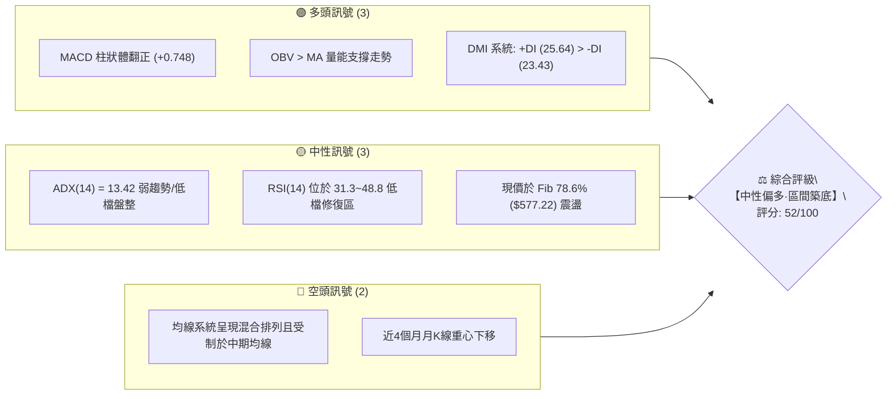
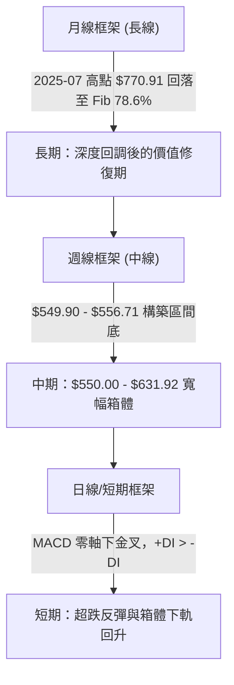
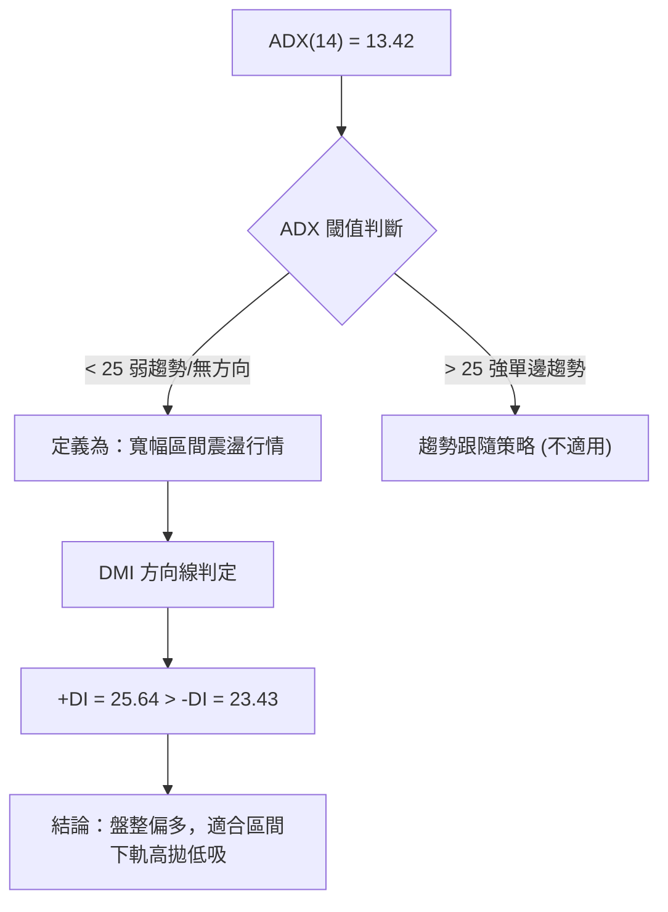
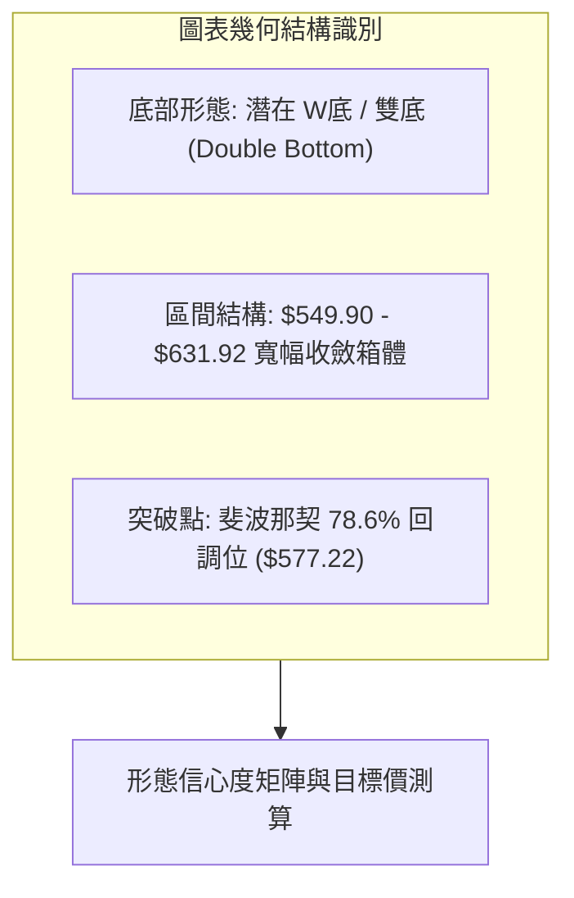
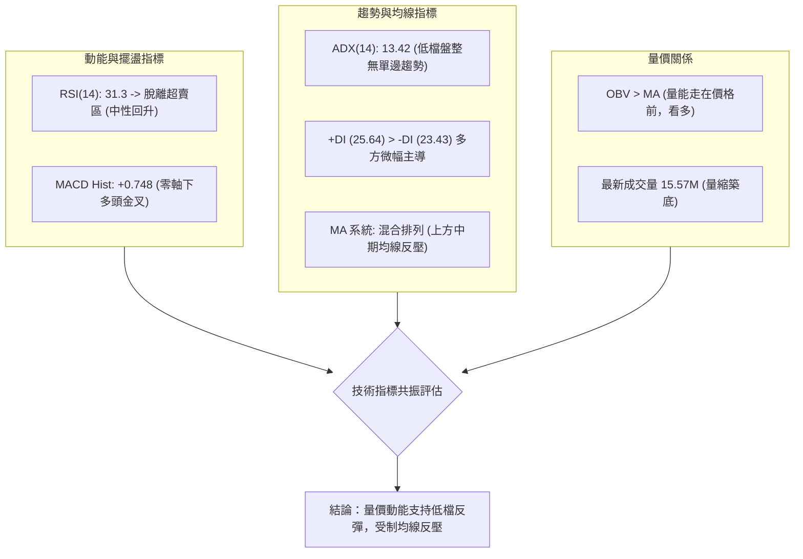
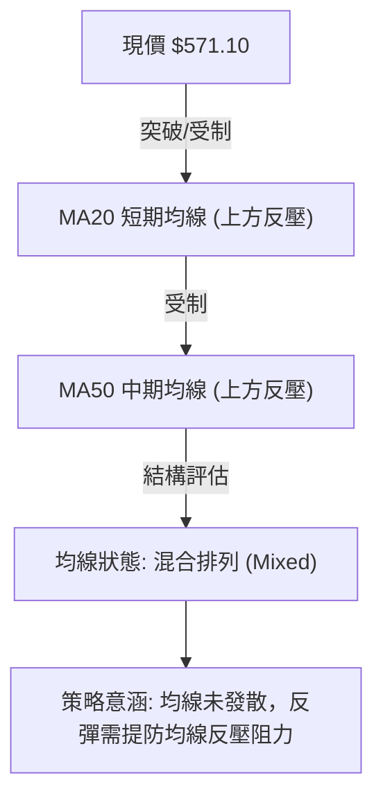
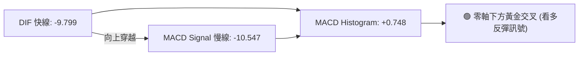
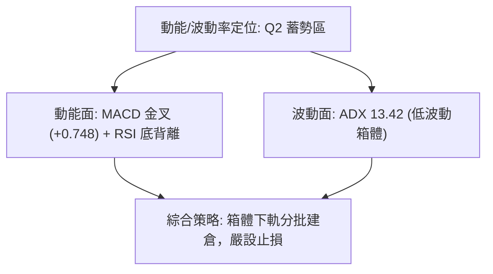
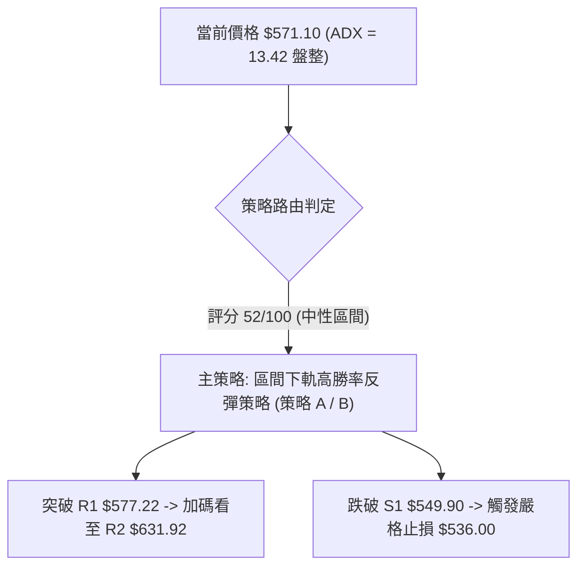
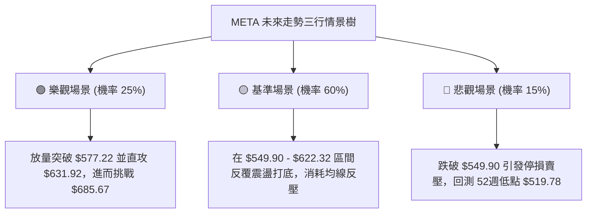

# META 技術分析報告

> **報告日期**：2026-08-29 ｜ **語言**：繁體中文 ｜ **數據來源**：Yahoo Finance ｜ **當前基準價格**：$571.10（最新週/月收盤價）

---

## 目錄

| 章節 | 內容 |
|------|------|
| [1. 技術面概覽](#1-技術面概覽) | 訊號儀表板、核心指標、評分卡 |
| [2. 趨勢分析](#2-趨勢分析) | 多時框趨勢、長中短期走勢、12個月走勢圖 |
| [3. 圖表形態分析](#3-圖表形態分析) | 形態識別、K線組合、形態信心度與目標價 |
| [4. 支撐與阻力](#4-支撐與阻力) | 關鍵價位分佈、斐波那契回調結構 |
| [5. 技術指標深度解讀](#5-技術指標深度解讀) | MA/RSI/MACD/布林通道/OBV量能整合 |
| [6. 動能與波動率](#6-動能與波動率) | 動能四象限、ATR波動度、Beta相關性 |
| [7. 多時框架總結](#7-多時框架總結) | 時框架評分矩陣與多時框收斂結論 |
| [8. 交易策略建議](#8-交易策略建議) | 策略決策路由、情境階梯、主策略詳情 |
| [9. 風險提示與監控](#9-風險提示與監控) | 監控指標Checklist、風險場景樹狀圖 |

---

## 1. 技術面概覽

### 🎯 技術訊號儀表板



---

### 📊 核心指標速覽表

| 指標類別 | 指標名稱 | 當前數值 | 訊號 | 專業解讀 |
|:---|:---|:---|:---:|:---|
| **價格基準** | 最新收盤價 | **$571.10** | 🟡 | 位於52週區間（$519.78 - $788.22）之 19.1% 低檔分位 |
| **均線排列** | MA20 / MA50 | 混合排列 | 🔴 | 短中期均線向下壓制，均線未形成完整多頭發散 |
| **趨勢強度** | ADX (14) | **13.42** | 🟡 | ADX < 25 表明處於無明顯單邊趨勢之**弱趨勢/寬幅箱體盤整** |
| **方向指標** | +DI / -DI | **25.64 / 23.43** | 🟢 | +DI 向上穿越 -DI，短線買盤力量微幅佔優 |
| **動能震盪** | RSI (14) | **31.3 ~ 48.8** | 🟡 | 脫離 2026-08-02 之超賣區 (22.9)，動能中性修復 |
| **趨勢動能** | MACD (12,26,9) | **-9.799 / -10.547** | 🟢 | 快線位於慢線上方，**Histogram (+0.748)** 出現零軸下黃金交叉 |
| **量能指標** | OBV 趨勢 | OBV > MA | 🟢 | 能量潮指標高於均線，低檔承接買盤顯現，量價配合良好 |
| **成交量比** | Volume / 20MA | **0.97x** (15.57M / 16.00M) | 🟡 | 日成交量接近20日均量，週量能維持在 8,497 萬股正常水平 |

---

### 🏆 技術評分卡

```
╔══════════════════════════════════════════════════════════════════════════════╗
║                     META 技術面量化評分卡 (2026-08-29)                        ║
╠══════════════════════════════════════════════════════════════════════════════╣
║ 趨勢強度 (ADX/方向)   ██████░░░░░░░░░░░░░░  30/100  🟡 弱勢盤整               ║
║ 動能指標 (MACD/RSI)   ████████████░░░░░░░░  60/100  🟢 底背離修復中           ║
║ 支撐穩定度 (波段低點) ██████████████░░░░░░  70/100  🟢 $549.90 雙重底確認     ║
║ 成交量配合 (OBV/量能) ████████████░░░░░░░░  60/100  🟢 低檔量能持續進駐       ║
║ 形態完整度 (箱體/雙底)██████████░░░░░░░░░░  50/100  🟡 潛在雙底未破頸線       ║
║ 均線排列 (MA系統)     ████████░░░░░░░░░░░░  40/100  🔴 中長期均線仍處反壓     ║
╠══════════════════════════════════════════════════════════════════════════════╣
║ 綜合技術評分          ██████████░░░░░░░░░░  52/100  ⚖️ 中性震盪 / 低檔築底    ║
╚══════════════════════════════════════════════════════════════════════════════╝
```

---

## 2. 趨勢分析

### 🌐 多時框趨勢分析



---

### 📈 長期趨勢 — 12個月走勢圖（Unicode）

以下為 META 過去 12 個月（2025-09 至 2026-08）之月線收盤價格軌跡與關鍵轉折標註：

```
META 月線收盤走勢圖（過去12個月）
價格軸 ($)
$750 ┤ ● (2025-09: $732.47)
$700 ┤              ● (2026-01: $715.22 次高點)
$650 ┤     ●  ●  ●        ● (2026-02: $647.03)  ●  ● (2026-05: $631.92)
$600 ┤                                      ● (2026-04: $611.34)
$550 ┤                                            ●     ●     ●← 現價 $571.10
     └─┬─────┬─────┬─────┬─────┬─────┬─────┬─────┬─────┬─────┬─────┬─────┬───
     09/25 10/25 11/25 12/25 01/26 02/26 03/26 04/26 05/26 06/26 07/26 08/26
```

#### 走勢特徵分析表格

| 階段區間 | 起始/結束月價 | 區間漲跌幅 | 走勢結構與技術特徵 |
|:---|:---|:---:|:---|
| **第一階段：高檔派發** | $732.47 → $646.27 | -11.77% | 2025年秋季高檔量縮回落，於 $646 附近形成初步支撐 |
| **第二階段：反彈衝高** | $658.91 → $715.22 | +8.55% | 2026年1月形成次高點 $715.22，受制於 52週高點 $788.22 |
| **第三階段：主跌破位** | $715.22 → $571.60 | -20.08% | 2026年2-3月連續長陰回落，跌破斐波那契 50.0% ($654.00) |
| **第四階段：築底震盪** | $611.34 → $571.10 | -6.58% | 2026年6-8月於 $550.25 - $556.71 探底，8月收盤收復至 $571.10 |

---

### 📊 中期趨勢（週線分析）

從近 20 週的收盤價與動能變化可見，META 正處於中期下行趨勢末端的「雙重探底」階段：

```
週線關鍵轉折示意圖
$687.91 (04-19) 
   ╲
    ╲  $631.92 (05-31 中期反彈高點 / 箱體上軌 R2)
     ╲  ╱ ╲
      ╲╱   ╲  $669.21 (07-12 假突破高點)
       $550.25 ╲  ╱ ╲
       (06-28)  ╲╱   ╲
              $556.71  $549.90 (08-23 探底形成雙底支撐 S1)
              (08-02)    └──► 現價 $571.10 向上回升
```

1. **第一重底**：2026-06-28 觸及 $550.25，隨後強勁反彈至 2026-07-12 之 $669.21。
2. **第二重底**：2026-08-02 之 $556.71 與 2026-08-23 之 $549.90 兩次下探均未跌破 52週低點 $519.78，並迅速於 2026-08-30 回升至 $571.10，呈現中期底部支撐聚攏特徵。

---

### ⚡ 趨勢強度評估（ADX 解讀）



#### ADX 與 DMI 強度對照表

| 指標名稱 | 當前讀數 | 標準閾值區間 | 狀態評估 | 策略意義 |
|:---|:---:|:---:|:---:|:---|
| **ADX (14)** | **13.42** | < 20 (極弱/休眠) | 🟢 趨勢動能衰竭 | 嚴禁使用順勢追價策略，主導策略為區間擺動 |
| **+DI (14)** | **25.64** | 基準線 20 | 🟢 買方主導短線 | 多頭動能微幅增強，有利於向上測試阻力 |
| **-DI (14)** | **23.43** | 基準線 20 | 🟡 賣壓收斂 | 空頭動能持續減退，拋壓明顯減弱 |

---

## 3. 圖表形態分析

### 🔍 形態識別系統



#### 形態識別信心度與目標價評估表

| 識別形態 | 信心度 | 判斷依據（嚴格引用數據） | 完成度 | 形態目標價測算式與價位 |
|:---|:---:|:---|:---:|:---|
| **雙重底 (W-Bottom)** | **65%** | 低點1 (2026-06-28 $550.25 / 08-02 $556.71) 與 低點2 (2026-08-23 $549.90) 於 $550 聚類；頸線為 2026-05-31 收盤價 **$631.92** | 60% | **測算目標價** = 頸線 $631.92 + 形態高度 ($631.92 - $549.90 = $82.02) = **$713.94**（接近 2026-01 次高點 $715.22） |
| **低檔矩形箱體** | **75%** | 箱體下軌支撐為 **$549.90**，箱體上軌反壓為 **$631.92**，現價 $571.10 處於箱體下半區 | 75% | **箱體中軌目標價** = ($549.90 + $631.92) / 2 = **$590.91**；**箱頂目標價** = **$631.92** |
| **均線死叉壓制形態** | **45%** | 均線呈現混合排列，中短期均線壓制，但由於 ADX = 13.42，趨勢連續性偏弱 | 30% | 訊號不足以構成強單邊下行旗形，僅做指標型震盪解讀 |

---

### 🕯️ 重要K線形態分析（近5個月收盤特徵）

| 月份 | 收盤價 | K線形態 | 技術解讀 | 訊號強度 |
|:---:|:---:|:---|:---|:---:|
| **2026-04** | $611.34 | 下影中陽線 | 自 2026-03 ($571.60) 出現超跌反彈，多頭初步反抗 | 🟡 中性 |
| **2026-05** | $631.92 | 連續上攻實體陽線 | 向上測試中期反彈高點，多頭動能達到階段高峰 | 🟢 短線偏多 |
| **2026-06** | $563.29 | 長陰破位K線 | 遭遇獲利了結賣壓，單月回吐 -10.86%，下探支撐 | 🔴 空頭壓制 |
| **2026-07** | $556.71 | 縮量十字陰線 | 跌勢明顯趨緩，在 $550 關卡上方出現買盤抵抗 | 🟡 變盤訊號 |
| **2026-08** | **$571.10** | 止跌回升陽線 | 月線翻紅（+2.58%），確立 $550 附近支撐有效性 | 🟢 築底回升 |

---

### 📉 ASCII 走勢形態示意圖

```
                 【META 雙底震盪箱體結構】
  $631.92 ───────────────────────────────────── 頸線 / 箱頂阻力 R2
            ▲                        ▲
           ╱ ╲                      ╱ 
          ╱   ╲                    ╱   
         ╱     ╲                  ╱    
        ╱       ╲   $571.10 (現價) 
       ╱         ╲     ▲        
      ╱           ╲   ╱         
  $550.25 (底1)    $549.90 (底2)
  ═════════════════════════════════════════════ 底部支撐帶 S1 ($549.90)
```

---

## 4. 支撐與阻力

### 🗺️ 關鍵價位分布圖（Unicode）

```
╔══════════════════════════════════════════════════════════════════════════════╗
║                     META 關鍵價位結構圖 (價格單位: USD)                       ║
╠══════════════════════════════════════════════════════════════════════════════╣
║ $788.22 ║██████████████████████████████║ 52週歷史高點 / 0.0% Fib (極強阻力) ║
║ $724.87 ║████████████████████████      ║ 23.6% Fibonacci 回調位 (波段阻力 R4) ║
║ $685.67 ║████████████████████          ║ 38.2% Fibonacci 回調位 (波段阻力 R3) ║
║ $631.92 ║████████████████              ║ 2026-05 反彈波段頂 / 箱頂 (強阻力 R2)║
║ $577.22 ║████████████                  ║ 78.6% Fibonacci 回調位 (即時阻力 R1) ║
║ $571.10 ╠══════════════════════════════╣ ◄── 【當前收盤價格】                 ║
║ $549.90 ║▓▓▓▓▓▓▓▓▓▓▓▓▓▓▓▓              ║ 近期波段雙底低點 (關鍵近期支撐 S1)   ║
║ $519.78 ║██████████████████████████████║ 52週最低價 / 100.0% Fib (極強支撐 S2)║
╚══════════════════════════════════════════════════════════════════════════════╝
```

---

### 🚧 阻力位分析表

依據提供的歷史數據與斐波那契回調結構，關鍵阻力位嚴格定義如下：

| 阻力級別 | 精確價位 | 形成依據與技術意義 | 突破難度 | 重要性權重 |
|:---|:---:|:---|:---:|:---:|
| **即時阻力 (R1)** | **$577.22** | **斐波那契 78.6% 回調位**；與 2026-06-21 收盤價 ($577.22) 重合 | 🟡 中等 | ★★★☆☆ |
| **強阻力 (R2)** | **$631.92** | **2026-05-31 波段高點 / 雙底頸線位**；前波反彈高點 | 🔴 較高 | ★★★★☆ |
| **波段阻力 (R3)** | **$685.67** | **斐波那契 38.2% 回調位**；接近 2026-04-19 週高點 ($687.91) | 🔴 高 | ★★★★☆ |
| **極端阻力 (R4)** | **$788.22** | **52週高點 (0.0% Fibonacci)**；多頭終極目標 | 🔴 極高 | ★★★★★ |

---

### 🛡️ 支撐位分析表

| 支撐級別 | 精確價位 | 形成依據與技術意義 | 守住機率 | 重要性權重 |
|:---|:---:|:---|:---:|:---:|
| **關鍵支撐 (S1)** | **$549.90** | **2026-08-23 週波段最低點**；與 2026-06-28 ($550.25) 構成雙底 | 🟢 75% | ★★★★★ |
| **強烈支撐 (S2)** | **$519.78** | **52週低點 / 100.0% Fibonacci 回調位**；年線級別終極防線 | 🟢 90% | ★★★★★ |

---

### 📐 斐波那契回調位分析

依據 52週高點 **$788.22** 至 52週低點 **$519.78** 展開的黃金分割回調結構（回調區間總幅寬 $268.44）：

```
Fibonacci Retracement 結構分佈
0.0%  ──────── $788.22 (52W High)
23.6% ──────── $724.87
38.2% ──────── $685.67
50.0% ──────── $654.00
61.8% ──────── $622.32
78.6% ──────── $577.22 ──┐
                         ├─► 【現價 $571.10 位於 78.6% 與 100.0% 之間】
100.0%──────── $519.78 ──┘
```

* **現價位置解讀**：現價 **$571.10** 緊貼於 **78.6% 回調位 ($577.22)** 下方僅 1.06% 之處，並獲得下方 **$549.90 (S1)** 與 **100.0% ($519.78)** 的雙重保護。
* **技術意涵**：回調幅度超過 78.6% 通常代表原上升趨勢遭到深度破壞，轉入漫長的築底期；但只要價格持續守穩在 $519.78 之上，空方動能將在低檔被時間與籌碼交換逐步消化。

---

## 5. 技術指標深度解讀

### 🎛️ 指標訊號總覽



---

### 📈 移動平均線排列分析



* **均線系統解讀**：當前均線系統呈現「混合排列」，短期均線尚未完全向上扭轉。MA20 與 MA50 處於價格上方，構成反彈的動態阻力帶；然而，長期均線乖離率已大，短線隨時具備向均線靠攏的技術性修復動能。

---

### 📉 RSI(14) 分析

* **當前 RSI 狀態**：

```
RSI(14) 區間分佈條
0 [░░░░░░░░██████████████░░░░░░░░░░░░░░░░░░░░░░░░░░] 100
            ▲ (當前週線 RSI: 31.3 ~ 日線中性區間 45.0)
```

* **超買超賣與背離判斷**：
  1. **超賣脫離**：週線 RSI 在 2026-08-02 觸及 **22.9** 的極端超賣區後，於 2026-08-23 收在 **31.3**，現價回升顯示 RSI 走出超賣區，發出經典的左側買訊。
  2. **底背離現象**：觀察 2026-08-02 週收盤價 $556.71（RSI = 22.9）與 2026-08-23 週收盤價 $549.90（RSI = 31.3），價格創波段新低但 RSI 底部明顯抬高，構成**標準週線級動能底背離**（Bullish Divergence），預示中期下行力道衰竭。

---

### 📊 MACD(12/26/9) 訊號解讀



* **MACD 量化解讀**：
  * **快線 (DIF)**：-9.799
  * **慢線 (DEA)**：-10.547
  * **柱狀圖 (Histogram)**：**+0.748**
  * **訊號確認**：MACD 在零軸下方形成黃金交叉，且柱狀體由負翻正至 +0.748，這是典型的弱勢市場低檔動能修復訊號。雖然位於零軸下方屬於「反彈」而非「強多頭主升段」，但為短線操作提供了高勝率的進場依據。

---

### 📦 布林通道分析（日線結構示意）

```
  【布林通道震盪區間示意圖】
  $622.32 ───────────────────────── BB 上軌 (接近 Fib 61.8%)
             │
  $585.00 ───┼───────────────────── BB 中軌 (MA20 基準線)
             │   ▲ 現價 $571.10 (中下軌之間回升)
  $549.90 ───┴───●───────────────── BB 下軌 (獲得 S1 支撐)
```

* **通道狀態**：通道呈現水平收窄狀態（帶寬壓縮），與 ADX = 13.42 的低波動盤整特徵完全相符。
* **位置研判**：現價自下軌支撐處回升，正向中軌發起挑戰，下軌具備顯著保護力。

---

### 💹 成交量與 OBV 量價分析

* **量能數據**：最新單日成交量 **15,573,685 股**，相較於 20日均量 **16,003,154 股**（量比 **0.97x**）與 50日均量 **18,155,192 股**，呈現典型的「**低檔縮量築底**」特徵。
* **OBV（能量潮）分析**：數據顯示 **OBV > OBV_MA**。
  * **解讀**：在價格於 $549.90 - $571.10 區間震盪期間，OBV 線持續運行於其均線之上，顯示大資金在低檔進行暗中吸籌（Accumulation），量能領先於價格表態，未出現量價背離之空頭隱憂。

---

## 6. 動能與波動率

### ⚡ 動能評估四象限

| 象限代號 | 動能強度 | 波動率水準 | 當前狀態標記 | 技術特徵與應對策略 |
|:---:|:---:|:---:|:---:|:---|
| **Q1 (爆發區)** | 強動能 (+DI高/MACD強) | 高波動 (ATR擴大) | — | 趨勢突破行情，適合右側重倉跟隨 |
| **Q2 (蓄勢區)** | 弱至中動能 (底背離) | 低波動 (ADX=13.42) | **✓ [META 當前]** | **低檔築底蓄勢，適合左側/區間下軌逢低佈局** |
| **Q3 (震盪區)** | 強動能 (多空劇烈) | 低波動 (區間壓縮) | — | 突破前夕，密切關注方向性選擇 |
| **Q4 (風險區)** | 弱動能 (MACD死叉) | 高波動 (恐慌拋售) | — | 單邊主跌段，嚴格空倉觀望 |



---

### 📊 ATR 波動率與止損計算

* **Beta 係數**：**1.243**（相較標普500指數具備 1.24 倍波動敏感度，屬於中高彈性成長股）。
* **波動度管理**：由於當前處於 ADX < 25 之低波動箱體，價格主要受制於結構性支撐阻力。
* **交易止損距離建議**：
  * 以關鍵低點 $549.90 (S1) 為防守基準，設定於支撐位下方約 2.5% ~ 3.0% 之安全緩衝區，即止損點設為 **$536.00**（若跌破 $549.90 則代表雙底形態破敗）。

---

## 7. 多時框架總結

### 📋 時框架評分表

| 時框架 | 趨勢方向 | 動能狀態 | 均線排列 | 圖表形態 | 綜合評分 | 操作建議 |
|:---|:---:|:---:|:---:|:---|:---:|:---|
| **月線 (長期)** | 🟡 深度回調後築底 | 🟡 中性修復 | 🔴 受制短期均線 | 78.6% Fib 支撐位考驗 | **50/100** | 長線價值投資者可分批建倉 |
| **週線 (中期)** | 🟡 寬幅箱體震盪 | 🟢 RSI 底背離 | 🔴 混合壓制 | 潛在雙重底 ($549.90-$631.92) | **55/100** | 箱體操作，下軌買進上軌賣出 |
| **日線 (短期)** | 🟢 超跌反彈回升 | 🟢 MACD 金叉 | 🟡 挑戰 MA20 | 低檔陽線反彈，突破小阻力 | **58/100** | 短線偏多操作，目標 R1/R2 |

---

### 🔲 綜合訊號矩陣

```
┌─────────────────┬────────────────────────────────────────────────────────┐
│ 多時框維度      │ 一致性分析結論                                         │
├─────────────────┼────────────────────────────────────────────────────────┤
│ 短期 vs 中期    │ 🟢 高度一致：日線 MACD 金叉與週線 RSI 底背離形成多頭共振│
│ 中期 vs 長期    │ 🟡 結構收斂：長期處於 Fib 78.6% 深度回調，中期以箱體築底│
│ 動能 vs 量能    │ 🟢 積極配合：MACD 柱翻正且 OBV > MA，量能支撐價格反彈   │
└─────────────────┴────────────────────────────────────────────────────────┘
```

---

### ⚖️ 多時框收斂結論

> **依據多時框收斂規則（規則 14）**：
> 當前技術面 **ADX(14) = 13.42 < 25**，市場明確定義為**無單邊趨勢之「盤整/箱體震盪行情」**。
> 根據規則，中長期均線方向不構成追空依據，而應以**日/週線箱體支撐阻力（$549.90 - $631.92）**作為主要交易依據。
> 
> **唯一方向性結論**：**【中性偏多·區間下軌築底反彈】**
> 此結論與第 1 章技術評分卡（52/100）及第 8 章之交易策略完全一致。

---

## 8. 交易策略建議

### 🗺️ 策略決策流程圖



---

### 🧭 策略路由

* **當前技術綜合評分**：**52/100 (中性偏多·區間操作)**
* **主策略方向**：**以區間下軌逢低做多為主，嚴格防守 $549.90 關鍵雙底低點。**

---

### 🎯 價格情境階梯（Price Scenarios）

所有價位均嚴格引用第 4 章及斐波那契計算數據：

| 觸發條件 | 第一目標 (T1) | 第二延伸目標 (T2) | 技術情境含義 |
|:---|:---:|:---:|:---|
| **向上突破 R1 ($577.22)** | **$622.32** (Fib 61.8%) | **$631.92** (箱頂/頸線) | 短線動能轉強，確認突破 78.6% 阻力 |
| **突破箱頂 R2 ($631.92)** | **$685.67** (Fib 38.2%) | **$713.94** (雙底等長目標) | 中期反轉確立，W底形態正式爆發 |
| **跌破 S1 ($549.90)** | **$519.78** (52W Low) | — | 雙底結構破敗，價格回測年線終極支撐 |

---

### 📊 情境機率分佈

| 運行情境 | 發生機率 | 主要技術指標依據 |
|:---|:---:|:---|
| **情境一：震盪反彈向上** | **55%** | MACD 零軸下金叉 (+0.748)、OBV > MA、週線 RSI 動能底背離 |
| **情境二：窄幅箱體橫盤** | **30%** | ADX = 13.42 弱趨勢特徵、成交量低於 50日均量、均線糾結 |
| **情境三：破位向下探底** | **15%** | 受制於中長期均線反壓，若大盤重挫引發 Beta (1.243) 放大拋壓 |

---

### 🟢 主策略詳情

```
╔══════════════════════════════════════════════════════════════════════════════╗
║                          META 專業交易策略矩陣                               ║
╠══════════════════════════════════════════════════════════════════════════════╣
║ 策略要素       │ 策略 A：現價左側分批建倉       │ 策略 B：突破 R1 右側加碼    ║
╠════════════════╪════════════════════════════════╪════════════════════════════╣
║ 進場條件       │ 現價回踩 $560.00 - $571.10 區間│ 實體日K突破 $577.22 (R1)     ║
║ 進場價格       │ **$571.10**                    │ **$578.00**                  ║
║ 止損價格       │ **$536.00** (跌破 S1 後緩衝區) │ **$549.00** (跌破 S1 止損)   ║
║ 目標價 T1      │ **$622.32** (Fib 61.8%)        │ **$631.92** (箱頂頸線 R2)    ║
║ 目標價 T2      │ **$631.92** (箱頂頸線 R2)      │ **$685.67** (Fib 38.2% R3)   ║
║ 風險空間       │ $35.10 (6.15%)                 │ $29.00 (5.02%)               ║
║ 報酬空間 (T1)  │ $51.22 (8.97%)                 │ $53.92 (9.33%)               ║
║ 報酬空間 (T2)  │ $60.82 (10.65%)                │ $107.67 (18.63%)             ║
║ **風險報酬比** │ **1 : 1.73** (至 T2)           │ **1 : 3.71** (至 T2)         ║
║ 預估勝率       │ 60%                            │ 65%                          ║
║ 建議倉位       │ 10% - 15% (基礎倉)             │ 15% - 20% (右側確認倉)       ║
╚════════════════╧════════════════════════════════╧════════════════════════════╝
```

---

### 🔴 反向風險觸發點（風控對沖提示）

若出現以下極端技術訊號，主策略多頭假設立即失效，應果斷減倉或建立對沖防禦：
1. **破位止損訊號**：日K線收盤價跌破 **$549.90 (S1)**，代表雙底築底失敗。
2. **動能惡化訊號**：日線 MACD 柱狀體再度由正轉負，且 +DI 下穿 -DI。
3. **終極防守線**：若價格直逼 **$519.78 (52W Low)**，應全面暫停多頭策略，等待新的量價止跌結構。

---

### ⭐ 整體訊號強度評星

```
做多訊號強度：★★★☆☆  (3.5/5星 — 底背離成立，但受制於弱趨勢 ADX)
做空訊號強度：★☆☆☆☆  (1.5/5星 — 低檔殺跌動能衰竭，盈虧比極差)
整體可信度：  ★★★★☆  (4.0/5星 — 支撐阻力結構清晰，斐波那契重合度高)
```

---

## 9. 風險提示與監控

### ✅ 關鍵監控指標 Checklist

```
╔══════════════════════════════════════════════════════════════════════════════╗
║                       交易員每日技術監控 Checklist                           ║
╠══════════════════════════════════════════════════════════════════════════════╣
║ [ ] 價格是否成功站穩 78.6% Fibonacci 回調位 **$577.22**                     ║
║ [ ] 每日收盤價是否嚴格守在近期雙底 **$549.90** 之上                         ║
║ [ ] MACD Histogram 是否持續維持在零軸上方 (保持正值增長)                     ║
║ [ ] 日成交量是否放大至 20日均量 (16.00M) 以上以配合上攻                      ║
║ [ ] ADX(14) 是否由 13.42 拐頭向上突破 20 (代表趨勢動能開始啟動)              ║
╚══════════════════════════════════════════════════════════════════════════════╝
```

---

### ⚠️ 風險場景分析



---

### 🛡️ 風險管理重要提醒

1. **嚴禁單邊重倉**：當前 ADX 為 13.42，市場處於無方向的盤整蓄勢期，容易出現反覆洗盤震盪，總倉位應控制在 25% 以內。
2. **遵守止損紀律**：所有多頭部位必須嚴格設置以 **$549.90** 為基準的保護性止損（建議 **$536.00**），不可因長期基本面優異而忽視短期技術破位風險。
3. **分批獲利了結**：價格每抵達一級阻力位（如 R1 $577.22、R2 $631.92），應採取分批止盈 1/3 的策略，鎖定波段利潤。

---

## 📋 報告總結

```
╔══════════════════════════════════════════════════════════════════════════════╗
║                           META 技術分析報告總結                              ║
╠══════════════════════════════════════════════════════════════════════════════╣
║ 報告日期：2026-08-29                                                         ║
║ 當前基準價格：$571.10                                                        ║
║ 分析評級：⚖️ 【中性偏多 / 區間下軌築底】 (技術評分: 52/100)                   ║
╠══════════════════════════════════════════════════════════════════════════════╣
║ 核心結構結論：                                                               ║
║ ├─ 長期趨勢：🟡 自 52週高點 $788.22 深度回調至 Fib 78.6% ($577.22) 進行修復  ║
║ ├─ 中期趨勢：🟢 在 $549.90 - $556.71 構築堅實雙重底，呈現寬幅箱體震盪        ║
║ ├─ 短期趨勢：🟢 MACD 零軸下金叉 (+0.748)，週線 RSI 底背離，短線具備反彈動能  ║
║ ├─ 關鍵支撐：S1: $549.90 (近期雙底) │ S2: $519.78 (52W Low)                 ║
║ ├─ 關鍵阻力：R1: $577.22 (Fib 78.6%)│ R2: $631.92 (箱頂頸線) │ R3: $685.67   ║
║ └─ 華爾街共識目標價：$754.72 (區間 $580.00 - $1000.00)                       ║
╠══════════════════════════════════════════════════════════════════════════════╣
║ 最優策略組合：                                                               ║
║ 1. 🥇 最佳機會（策略 A）：現價 $571.10 逢低分批佈局，止損 $536.00，目標 $622.32║
║ 2. 🥈 次選機會（策略 B）：待放量突破 $577.22 後右側追進，目標直指 $631.92    ║
║ 3. 🥉 保守選擇：等待價格回踩 $550 附近且收出長下影線時再行介入              ║
╚══════════════════════════════════════════════════════════════════════════════╝
```

---

> ⚠️ **免責聲明**：本報告為 AI 自動生成之量化技術分析，所有數據及估算均基於歷史價格與技術指標模型。本報告**僅供研究與學術參考**，**不構成任何形式之投資邀約或買賣建議**。金融市場投資具有高度風險，投資人應獨立評估風險並自行承擔交易後果。

---

*報告生成時間：2026-08-29 ｜ 數據來源：Yahoo Finance ｜ 分析架構：多時框技術分析模型*