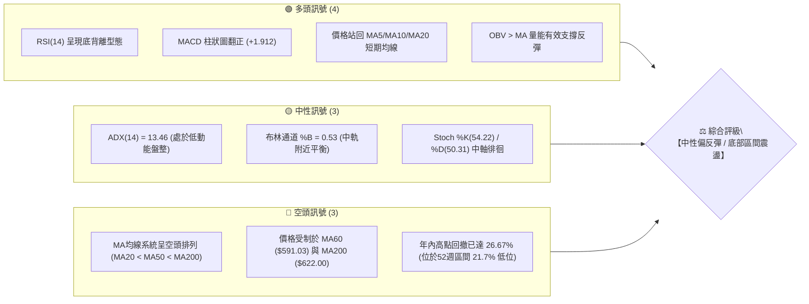
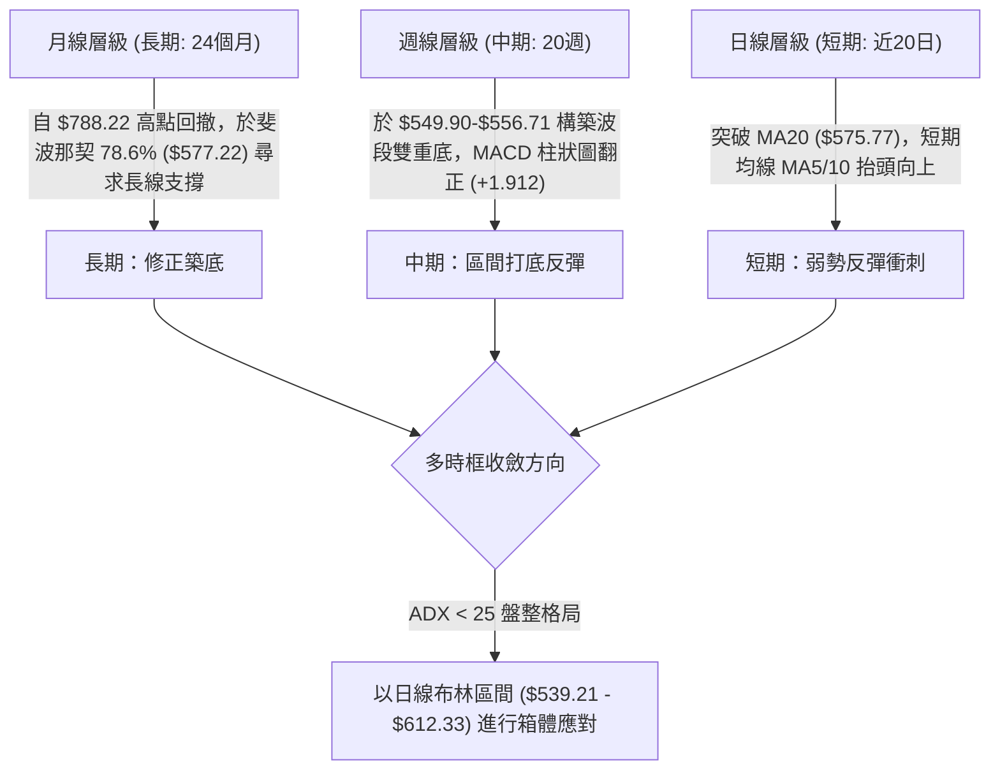
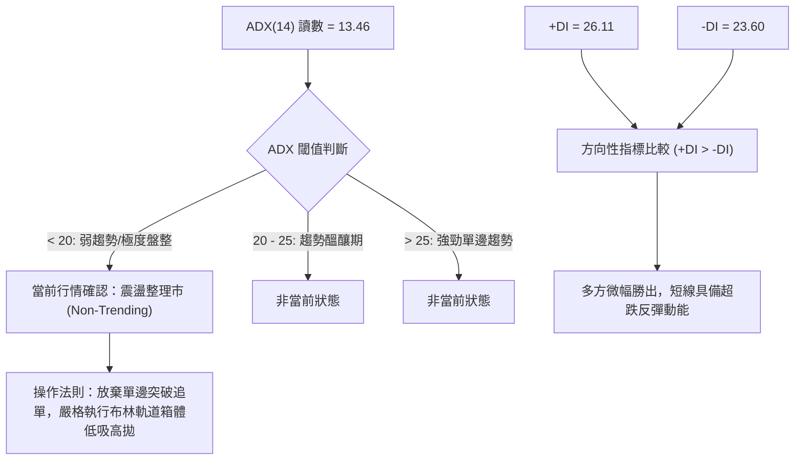
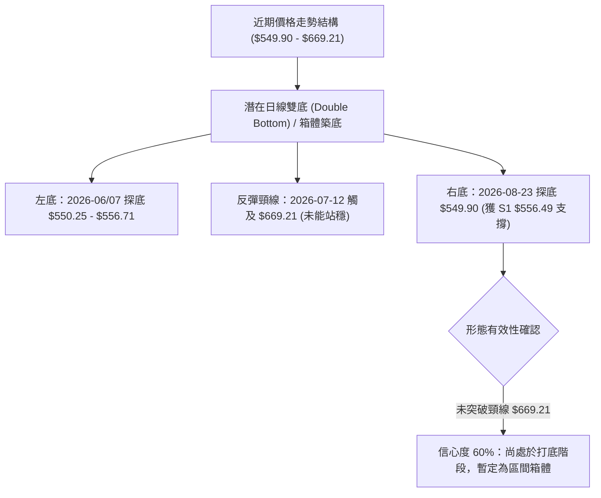
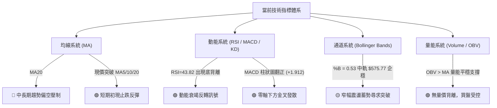
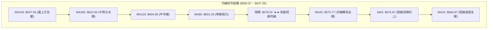
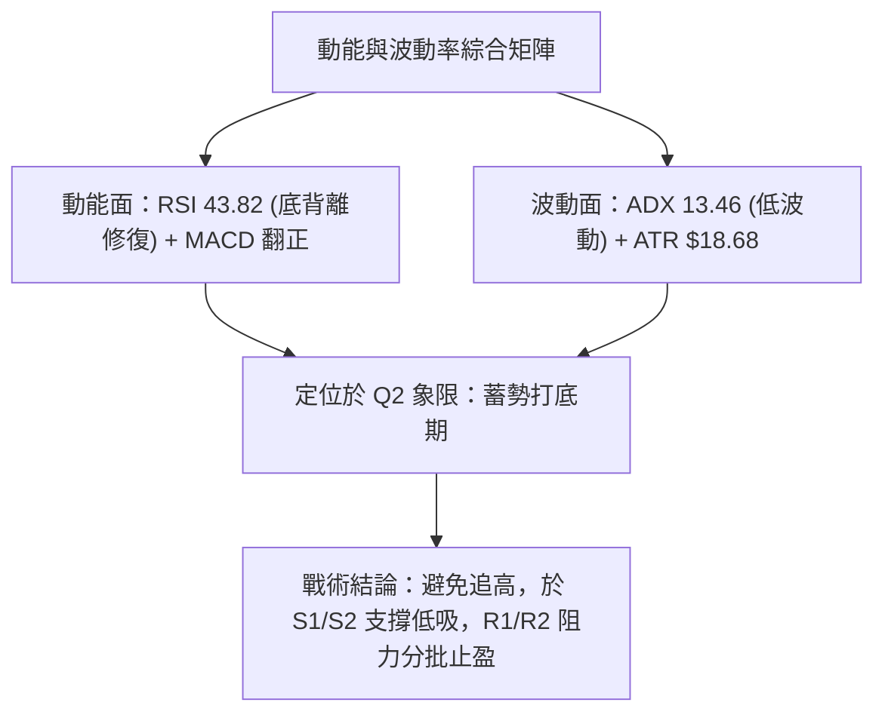
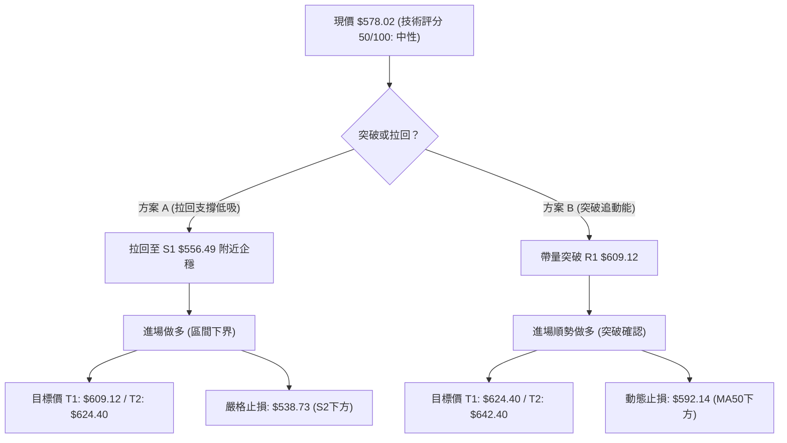
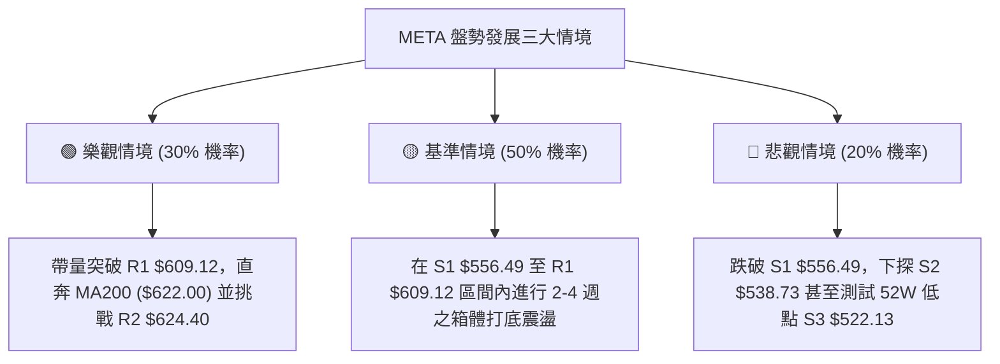

# META 技術分析報告

> **報告日期**：2026-08-30 ｜ **語言**：繁體中文 ｜ **數據來源**：Yahoo Finance ｜ **當前價格**：$578.02

---

## 目錄

| 章節 | 內容 |
|------|------|
| [1. 技術面概覽](#1-技術面概覽) | 訊號儀表板、核心指標、評分卡 |
| [2. 趨勢分析](#2-趨勢分析) | 多時框趨勢、長中短期走勢、ADX強弱判斷 |
| [3. 圖表形態分析](#3-圖表形態分析) | 形態識別、信心度評估、K線組合、目標價推算 |
| [4. 支撐與阻力](#4-支撐與阻力) | 關鍵價位分佈、聚類阻力/支撐、斐波那契回調 |
| [5. 技術指標深度解讀](#5-技術指標深度解讀) | 均線系統、RSI底背離、MACD金叉、布林通道、OBV量能 |
| [6. 動能與波動率](#6-動能與波動率) | 動能四象限、ATR波動度、Beta市場相關性 |
| [7. 多時框架總結](#7-多時框架總結) | 時框架評分矩陣、多時框收斂定調 |
| [8. 交易策略建議](#8-交易策略建議) | 策略路由、價格階梯、主策略設定、風控觸發點 |
| [9. 風險提示與監控](#9-風險提示與監控) | 關鍵監控清單、情境模擬、倉位風控機制 |

---

## 1. 技術面概覽

### 🎯 技術訊號儀表板



---

### 📊 核心指標速覽表

| 指標類別 | 指標名稱 | 當前數值 | 訊號 | 專業解讀 |
|:---|:---|:---|:---:|:---|
| **價格** | 現行收盤價 | $578.02 | 🟡 | 位於52週區間 ($519.78 - $788.22) 之 21.7% 低位階區間 |
| **均線** | MA20 (短月線) | $575.77 | 🟢 | 現價向上突破 MA20 (+0.39%)，短線扭轉極弱勢格局 |
| **均線** | MA50 (中季線) | $592.14 | 🔴 | 現價位於 MA50 下方 (-2.38%)，中期結構尚未完全轉多 |
| **均線** | MA200 (長期牛熊) | $622.00 | 🔴 | 現價位於 MA200 下方 (-7.07%)，長期結構仍處於修正波 |
| **動能** | RSI(14) | 43.82 | 🟢 | 自超賣區回升，且出現標準日線/週線級別「底背離」訊號 |
| **動能** | MACD (12,26,9) | -8.344 / -10.256 | 🟢 | 快線向上穿越慢線形成零軸下金叉，柱狀圖達 +1.912 |
| **動能** | KD (Stochastic) | 54.22 / 50.31 | 🟡 | %K 上穿 %D 於 50 中軸震盪，多空動能暫時平衡 |
| **趨勢** | ADX(14) | 13.46 | 🟡 | 數值遠低於 25，確認非單邊單向趨勢，進入盤整打底市 |
| **趨勢方向**| +DI vs -DI | 26.11 vs 23.60 | 🟢 | +DI 超越 -DI，短多微幅取得波段主導權 |
| **波動** | ATR(14) | $18.68 (3.23%) | 🟡 | 每日平均波動幅度約 18.68 美元，屬於中等波動狀態 |
| **通道** | 布林通道 (20,2) | $539.21 - $612.33 | 🟡 | 現價居於中軌 ($575.77) 上方，通道帶寬收窄蓄勢 |
| **量能** | 20日均量比 | 1.00x (16.02M) | 🟢 | 成交量持平均量，OBV 趨勢高於均線，量價未見背離 |

---

### 🏆 技術評分卡

```
╔══════════════════════════════════════════════════════════════╗
║              技術評分卡 — META (2026-08-30)                  ║
╠══════════════════════════════════════════════════════════════╣
║ 趨勢強度 (ADX=13.46)    ████░░░░░░░░░░░░░░░░  25/100  🔴 弱趨勢 ║
║ 動能指標 (RSI/MACD)     █████████████░░░░░░░  65/100  🟢 底背離 ║
║ 支撐穩定度 (Fib 78.6%)  ██████████████░░░░░░  70/100  🟢 買盤固 ║
║ 成交量配合 (OBV>MA)     ████████████░░░░░░░░  60/100  🟢 溫和量 ║
║ 形態完整度 (打底結構)   ██████████░░░░░░░░░░  50/100  🟡 震盪中 ║
║ 均線排列 (空頭排列)     ██████░░░░░░░░░░░░░░  30/100  🔴 壓制重 ║
╠══════════════════════════════════════════════════════════════╣
║ 綜合技術評分            ██████████░░░░░░░░░░  50/100  🟡 中性震盪║
╚══════════════════════════════════════════════════════════════╝
```

---

## 2. 趨勢分析

### 🌐 多時框趨勢分析



---

### 📈 長期趨勢 — 12個月走勢圖（Unicode）

```
META 月線收盤走勢圖（2025-09 至 2026-08）
價格軸 ($)
$750 ┤  ● $732.47
$700 ┤              ● $715.22
$650 ┤    ● $646.67 ─ ● $646.27 ─ ● $658.91 ─ ● $647.03 ── ● $631.92
$600 ┤                                  ● $611.34
$550 ┤                                        ● $571.60 ── ● $563.29 ─ ● $556.71 ─ ● $578.02 (現價)
$500 ┼───┬─────────┬─────────┬─────────┬─────────┬─────────┬─────────┬─────────┬─────────┬─────────┬─────────┬─────────
     09  10        11        12        01        02        03        04        05        06        07        08
    (2025)                                                (2026)
```

#### 走勢特徵分析表格

| 階段區間 | 起止月份 | 價格區間 | 區間漲跌幅 | 走勢特徵與量價解讀 |
|:---|:---:|:---:|:---:|:---|
| **歷史高檔築頂** | 2025-07 ~ 2025-09 | $770.91 → $732.47 | -4.99% | 觸及 52週高點 $788.22 後出現滯漲，籌碼於高檔換手 |
| **首波主跌浪** | 2025-10 ~ 2025-11 | $732.47 → $646.27 | -11.77% | 快速跌破短期均線，跌勢凌厲，於 $646 附近短暫獲得均線支撐 |
| **次級反彈波** | 2025-12 ~ 2026-01 | $646.27 → $715.22 | +10.67% | 逢高減磅之技術性抽頭反彈，未能突破歷史高點形成次高點 |
| **二波破位下殺** | 2026-02 ~ 2026-03 | $715.22 → $571.60 | -20.08% | 跌破 MA200 關鍵牛熊分水嶺，引發停損賣壓與趨勢性空頭排列 |
| **區間抵抗反彈** | 2026-04 ~ 2026-05 | $571.60 → $631.92 | +10.55% | 於 $571 獲買盤支撐後弱勢反彈，受阻於 MA60/MA120 均線群 |
| **底部二次探底** | 2026-06 ~ 2026-08 | $631.92 → $578.02 | -8.53% | 7月探底至 $556.71，8月拉出下影線收於 $578.02，形成潛在雙底 |

---

### 📊 中期趨勢（週線分析）

```
META 近20週收盤與阻力支撐示意
$690 ┤  ● (04-19: $687.91)
$670 ┤    ●
$650 ┤                        ● (07-12: $669.21)
$630 ┤              ● (05-31)   ●
$610 ┤    ●   ●   ●               ══════════════════════ [R1: $609.12 / BB上軌 $612.33]
$590 ┤          ●               ●   ●   ●
$570 ┤              ●   ●             ●   ● ◄ 現價: $578.02 (Fib 78.6%: $577.22)
$550 ┤                    ●           ●   ● ════════════ [S1: $556.49 / 頸線打底]
     └───────────────────────────────────────────────────
      04/19    05/17    06/14    07/12    08/09    08/30
```

---

### ⚡ 趨勢強度評估（ADX 解讀）



| 指標名稱 | 數值 | 狀態區間 | 技術意義 |
|:---|:---:|:---:|:---|
| **ADX(14)** | **13.46** | 0 ~ 20 (極弱勢/盤整) | 趨勢動能極低，均線交叉頻繁失效，適合箱體震盪指標 |
| **+DI (14)** | **26.11** | 多方攻擊線 | 向上穿越 -DI，顯示低檔承接買盤開始進場介入 |
| **-DI (14)** | **23.60** | 空方壓制線 | 空方動能自高點 35 以上大幅回落，下殺動能鈍化 |

---

## 3. 圖表形態分析

### 🔍 形態識別系統



#### 形態識別信心度評估表

| 識別形態 | 信心度 | 判斷依據（引用精確數據） | 完成度 | 目標價（附嚴謹計算式） |
|:---|:---:|:---|:---:|:---|
| **箱體震盪打底 (Range Base)** | **75%** | 價格於 S1 $556.49 至 R1 $609.12 區間反覆震盪，且布林帶寬收窄 | 80% | 箱頂突破目標 = R1 $609.12 |
| **日線級別雙底 (W-Bottom)** | **60%** | 左底 $550.25 (06-28)，右底 $549.90 (08-23)，兩次回測 S1/S2 均獲買盤拉起 | 50% | 頸線 $669.21 突破後目標 = $669.21 + ($669.21 - $549.90) = **$788.52** |
| **均線空頭排列壓制 (Death Cross)** | **85%** | MA20 ($575.77) < MA50 ($592.14) < MA200 ($622.00) 空頭排列確立 | 100% | 均線壓制下行測試支撐目標 = S1 **$556.49** |

---

### 🕯️ 重要K線形態分析

| 日期 / 週期 | 收盤價 | 實體 / 影線特徵 | 技術形態解讀 | 訊號方向 |
|:---:|:---:|:---|:---|:---:|
| **2026-07-12** | $669.21 | 長陽線爆量突破，週成交量達 117.03M | 測試 MA200 阻力失敗，留長上影線形成波段假突破 | 🔴 空頭誘多 |
| **2026-08-02** | $556.71 | 長陰線回踩，RSI 下探至 22.9 極度超賣 | 空頭極致釋放，成交量達 112.11M，出現恐慌盤換手 | 🟡 恐慌洗盤 |
| **2026-08-23** | $549.90 | 帶長下影線之十字錘頭線 (Hammer) | 二次探底不破前低，空頭動能衰竭，買盤進駐支撐 | 🟢 止跌轉折 |
| **2026-08-30** | $578.02 | 實體陽線收復 MA20 ($575.77)，MACD 翻正 | 確認右底支撐有效，K線組合呈現「晨星 (Morning Star)」雛形 | 🟢 短多確立 |

---

### 📉 ASCII 走勢形態示意圖

```
META 底部箱體震盪形態示意圖 (2026-06 ~ 2026-08)
$670 ┤                       ● 頸線阻力 ($669.21)
$650 ┤                      / \
$630 ┤                     /   \
$610 ┤    ●(05-31: $631)  /     \          [R1: $609.12 / BB上軌 $612.33]
$590 ┤   / \             /       \        ● ── 現價 $578.02 (站上MA20)
$570 ┤  /   \     ●     /         ●      /
$550 ┤─●─────●───/─\───●───────────●────● ──── [S1: $556.49 底部頸線]
       06-14    06-28 (左底: $550) 08-02  08-23 (右底: $549.90)
```

---

## 4. 支撐與阻力

### 🗺️ 關鍵價位分布圖（Unicode）

```
META 價位結構分布圖 (Resistance & Support Cluster)
═════════════════════════════════════════════════════════════════
$788.22 ║██████████████████████████████║ 52W 歷史最高點 (Fib 0.0%)
$642.40 ║████████████████████████      ║ 強阻力 R3 (前波反彈密集高點)
$624.40 ║████████████████████          ║ 阻力 R2 (接近 MA200 牛熊線 $622.00)
$609.12 ║████████████████              ║ 關鍵阻力 R1 (布林上軌 $612.33 區域)
$578.02 ╠══════════════════════════════╣ ◄ 現行收盤價 (Fib 78.6%: $577.22)
$556.49 ║▓▓▓▓▓▓▓▓▓▓▓▓▓▓▓▓              ║ 近期關鍵支撐 S1 (雙底頸線密集區)
$538.73 ║████████████████              ║ 強支撐 S2 (布林下軌 $539.21 重合區)
$519.78 ║██████████████████████████████║ 52W 歷史最低點 S3 (Fib 100.0%)
═════════════════════════════════════════════════════════════════
```

---

### 🚧 阻力位分析表

| 阻力級別 | 精確價位 | 形成技術原因 | 突破難度評估 | 戰略重要性 |
|:---|:---:|:---|:---:|:---:|
| **R1 (第一阻力)** | **$609.12** | 近一年波段高點聚類區，疊加日線布林上軌 ($612.33) 與 MA60 ($591.03) 壓制 | 🟡 中等 (需日量 >20M) | 短線強弱分水嶺，突破將挑戰 MA200 |
| **R2 (第二阻力)** | **$624.40** | 長期均線 MA200 ($622.00) 與 Fib 61.8% ($622.32) 共振反壓區 | 🔴 極高 (需強大催化劑) | 牛熊轉換關鍵樞紐，受制則維持空頭修正 |
| **R3 (第三阻力)** | **$642.40** | 2025年Q4起跌平台與 2026-05 反彈波段頂部密集成交區 | 🔴 極高 | 中期波段多頭反轉之完全確認位 |

---

### 🛡️ 支撐位分析表

| 支撐級別 | 精確價位 | 形成技術原因 | 守住機率評估 | 戰略重要性 |
|:---|:---:|:---|:---:|:---:|
| **S1 (第一支撐)** | **$556.49** | 2026-08-02 收盤價 ($556.71) 與 2026-07 底部聚類支撐線 | 🟢 75% (短期高機率) | 雙底結構之關鍵防線，短線多頭停損點 |
| **S2 (第二支撐)** | **$538.73** | 日線布林下軌 ($539.21) 疊加 2025-04 波段起漲點 ($546.79) | 🟢 85% | 深度價值買盤防線，跌破將引發流動性踩踏 |
| **S3 (第三支撐)** | **$522.13** | 52週最低價 ($519.78) 上方之波段低點聚類核心區 | 🟢 95% | 52週絕對底部，中長線多頭最後堡壘 |

---

### 📐 斐波那契回調位分析

依據 52週完整波段高低點（低點 **$519.78** 至 高點 **$788.22**，總垂直空間 **$268.44**）精確回調層級：

```
斐波那契回調層級分布 ($519.78 → $788.22)
  0.0% (52W High) ── $788.22 
 23.6% ───────────── $724.87 
 38.2% ───────────── $685.67 
 50.0% ───────────── $654.00 
 61.8% (黃金分割) ── $622.32 ◄ 疊加 MA200 ($622.00) 重大共振阻力
 78.6% (深度回撤) ── $577.22 ◄◄◄ 現價 $578.02 (精確落於此關鍵黃金支撐線上)
100.0% (52W Low)  ── $519.78 
```

**回調位深度解讀**：
當前收盤價 **$578.02** 精確貼合於斐波那契 **78.6% 回調位 ($577.22)**。在經典斐波那契架構中，78.6% 是深度回撤行情中「最後防守反轉線」。若價格能在此處確認站穩（配合 MACD 翻正與 RSI 底背離），極易引發大級別的均值回歸行情，向上回抽 61.8% ($622.32) 或 50.0% ($654.00)。

---

## 5. 技術指標深度解讀

### 🎛️ 指標訊號總覽



---

### 📈 移動平均線排列分析



| 均線名稱 | 數值 | 現價差距 (%) | 排列狀態 | 趨勢解讀 |
|:---|:---:|:---:|:---:|:---|
| **MA5** | $570.87 | +1.25% | 🟢 向上拐頭 | 短線 5 日多頭排列，超短線動能轉強 |
| **MA10** | $560.87 | +3.06% | 🟢 向上發散 | 底部墊高，提供拉回時的日內支撐 |
| **MA20** | $575.77 | +0.39% | 🟢 價格站上 | 突破 20 日均線（布林中軌），扭轉極弱格局 |
| **MA60** | $591.03 | -2.20% | 🔴 扣高下壓 | 中期下降斜率趨緩，為第一道主要動態阻力 |
| **MA120** | $604.99 | -4.46% | 🔴 空頭下行 | 接近 R1 阻力位 ($609.12)，反彈重大阻力帶 |
| **MA200** | $622.00 | -7.07% | 🔴 下行壓制 | 經典長期牛熊分界線，未站上前維持修正評價 |

---

### 📉 RSI(14) 分析與底背離驗證

```
RSI(14) 數值進度條
0 ──────── 30 (超賣) ──────── 50 (中軸) ──────── 70 (超買) ──────── 100
[█████████████████░░░░░░░░░░░░] 43.82
```

**背離深度判定**：
- **價格走勢**：2026-08-02 觸及 $556.71（RSI 為 22.9），2026-08-23 再度下探至低點 $549.90（價格創波段新低）。
- **RSI 指標**：2026-08-23 RSI 僅回落至 31.3，並未跌破前低 22.9，隨後於 2026-08-30 快速拉升至 **43.82**。
- **結論**：形成標準的**日線/週線雙重「底背離 (Bullish Divergence)」**，顯示下殺動能已實質性衰竭，空頭無法再藉由打壓價格創造動能新低，此為極具參考價值之止跌訊號。

---

### 📊 MACD (12, 26, 9) 訊號解讀

```
MACD 快線:       -8.344  ▲
MACD 慢線(Signal): -10.256 ▲
MACD 柱狀圖(Hist): +1.912  🟢 (由負翻正，動能擴張)
```


---

### 📦 布林通道分析 (Bollinger Bands 20, 2)

```
布林通道結構示意圖 ($539.21 ~ $612.33)
$612.33 ┬────────────────────────────────────────── BB 上軌 (阻力帶 / 突破目標)
        │
        │
$578.02 ┼──────────────── ● 現價 (位於中軌上方，%B = 0.53)
$575.77 ┼- - - - - - - - - - - - - - - - - - - - - BB 中軌 (MA20，已轉化為短線支撐)
        │
        │
$539.21 ┴────────────────────────────────────────── BB 下軌 (強支撐帶 / 震盪下界)
```

- **通道寬度 (Bandwidth)**：呈現階段性收窄，顯示波動率收斂至低位，即將進入變盤週期。
- **%B 指標**：數值為 **0.53**，代表現價已從下軌 (0.0) 穩步回升並穿越中軌 (0.50)，結構由空方掌控過渡至多空均衡。

---

### 💹 成交量分析（量價配合度）

- **最新成交量**：16,018,300 股。
- **均量關係**：20日均量為 16,025,385 股（量比 **1.00x**），50日均量為 18,164,084 股。
- **OBV (能量潮指標)**：當前 OBV 線高於其移動平均線（`OBV > MA`），且在 8月價格二次探底 $549.90 時，OBV 低點並未破前低，量能呈現穩定承接型態，確認量價未產生空頭背離，量能有效支撐短線反彈。

---

## 6. 動能與波動率

### ⚡ 動能評估四象限

| 象限 | 動能強度 (RSI/MACD) | 波動率水準 (ATR/BBW) | 當前狀態判定 | 戰略應對建議 |
|:---:|:---:|:---:|:---:|:---|
| **Q1** | 強 (高) | 低 (低) | ── | 最佳趨勢波段機會 |
| **Q2** | **弱 / 中性 (修復)** | **低 (收窄蓄勢)** | **✓ META 當前位置** | **區間震盪低吸高拋，謹慎觀望突破** |
| **Q3** | 強 (高) | 高 (劇烈) | ── | 高風險高收益突破市 |
| **Q4** | 弱 (空) | 高 (下殺) | ── | 空頭主跌浪，嚴禁抄底 |



---

### 📊 ATR 波動率分析

- **ATR(14) 數值**：**$18.68**（佔當前股價之 **3.23%**）。
- **日內交易波幅預期**：正常波動區間為 現價 $\pm$ 1.0 $\times$ ATR = **$559.34 ~ $596.70**。
- **止損距離設定建議**：
  - *激進短線交易*：建議採用 1.0 $\times$ ATR = **$18.68** 緩衝空間（止損位約 $559.34）。
  - *波段交易*：建議採用 1.5 $\times$ ATR = **$28.02** 緩衝空間，可完美避開雜訊並覆蓋 S1 支撐位（$556.49 附近）。

---

### 📐 Beta 與市場相關性

- **Beta 係數**：**1.243**。
- **市場屬性**：具備高於大盤 24.3% 的波動彈性，屬於高 Beta 成長/科技股特徵。
- **戰略涵義**：當標普500 (SPY) 或那斯達克 (QQQ) 出現大盤級別反彈時，META 具備更強的向上彈升爆發力；反之在大盤走弱時，亦須嚴控下行 Beta 風險。

---

## 7. 多時框架總結

### 📋 時框架評分表

| 時框架 | 趨勢方向 | 動能狀態 | 均線排列 | 關鍵形態特徵 | 綜合評分 | 戰術建議 |
|:---:|:---:|:---:|:---:|:---|:---:|:---|
| **長期 (月線)** | 🔴 修正回調 | 🟡 止跌尋底 | 空頭 (跌破MA10M) | 回撤至 Fib 78.6% ($577.22) 尋求長線支撐 | **45/100** | 長線分批建底倉 |
| **中期 (週線)** | 🟡 區間築底 | 🟢 MACD 翻正 | 空頭壓制 (受制MA50W)| $549.90-$556.71 雙底成形，測試 S1 支撐 | **55/100** | 箱體波段操作 |
| **短期 (日線)** | 🟢 弱勢反彈 | 🟢 RSI 底背離 | 短多 (站上MA20) | 突破布林中軌，向上測試 R1 $609.12 | **60/100** | 逢拉回偏多操作 |

---

### 🔲 綜合訊號矩陣

```
┌─────────────────┬─────────────────┬─────────────────┐
│ 短期動能 (Daily) │ 中期結構 (Weekly)│ 長期格局 (Monthly)│
│    🟢 偏多反彈   │    🟡 區間打底  │    🔴 修正偏空  │
│ (RSI背離/MACD金叉)│(雙底測試S1/S2) │(受制MA200與高點)│
└────────┬────────┴────────┬────────┴────────┬────────┘
         │                 │                 │
         └─────────────────┼─────────────────┘
                           ▼
             【多時框收斂定調：區間震盪】
```

---

### ⚖️ 多時框收斂結論

> **依據多時框收斂規則（規則 14）**：
> 當前 **ADX(14) 讀數為 13.46 (< 25)**，明確定義當前市場處於**「無趨勢之盤整行情」**。
> 根據規則，在盤整行情中，**以日線布林通道上下軌 ($539.21 - $612.33) 與關鍵支撐/阻力 (S1 $556.49 / R1 $609.12) 為主要交易區間**。
> 
> **唯一方向性結論**：**【中性偏多震盪（區間反彈操作）】**
> 短線日線動能（RSI 底背離 + MACD 翻正）支持股價自 Fib 78.6% ($577.22) 發起向上反彈，目標指向 R1 ($609.12) 及布林上軌 ($612.33)；但受制於中期空頭均線壓制，此反彈暫定性為「箱體震盪內部之反彈」，非大級別反轉單邊行情。

---

## 8. 交易策略建議

### 🗺️ 策略決策流程圖



---

### 🧭 策略路由

**當前主策略方向 = 【區間震盪低吸 / 中性偏反彈策略】（依綜合評分 50/100）**
因評分處於 40–60 中性區間，且 ADX < 25，禁止盲目追高，主推「支撐位回踩低吸」與「右側帶量突破確認」兩套高勝率劇本。

---

### 🎯 價格情境階梯（Price Scenarios）

| 觸發條件 | 關鍵價位 | 第一延伸目標 | 第二延伸目標 | 市場結構與情境含義 |
|:---|:---:|:---:|:---:|:---|
| **強勢突破** | 帶量突破 **R1 $609.12** | **R2 $624.40** | **R3 $642.40** | 短線轉強，正式挑戰 MA200 牛熊分水嶺 |
| **箱體震盪** | 站穩現價 **$578.02** | **R1 $609.12** | **S1 $556.49** | 於布林中軌至上軌間進行築底換手震盪 |
| **破位下殺** | 放量跌破 **S1 $556.49** | **S2 $538.73** | **S3 $522.13** | 雙底型態失效，下探 52週低點尋求流動性 |

---

### 📊 情境機率分佈

| 情境劇本 | 預估機率 | 核心技術指標支持依據 |
|:---|:---:|:---|
| **情境一：向上反彈測試 R1/R2** | **50%** | RSI 底背離確立、MACD 柱狀圖翻正 (+1.912)、現價站上 MA20、OBV 量能支撐 |
| **情境二：箱體窄幅震盪整理** | **35%** | ADX = 13.46 處於極低趨勢強度、布林帶寬收窄、均線呈空頭排列形成上方層層壓制 |
| **情境三：下破 S1 探底尋求 S2/S3** | **15%** | 均線系統（MA50/MA200）仍處下行趨勢，若大盤系統性下殺可能引發停損賣壓 |

---

### 🟢 主策略詳情

| 策略要素 | 策略 A（支撐回踩低吸 — 左側偏穩健） | 策略 B（阻力突破跟進 — 右側動能） |
|:---|:---|:---|
| **適用場景** | 股價回踩測試 S1 支撐獲得確認時 | 股價放量突破 R1 箱頂壓力時 |
| **進場條件** | 回測 $558.00 - $560.00 區間且 15分K 出現反轉陽線 | 日K收盤價實質突破 R1 $609.12 且日成交量 >18M |
| **進場價格** | **$558.00** | **$610.00** |
| **目標價 T1** | **$609.12** (R1 阻力位，預期獲利 +9.16%) | **$624.40** (R2 / MA200 阻力，預期獲利 +2.36%) |
| **目標價 T2** | **$624.40** (R2 / MA200，預期獲利 +11.90%) | **$642.40** (R3 強阻力，預期獲利 +5.31%) |
| **止損價格** | **$538.00** (跌破 S2 強支撐 $538.73 止損，風險 -3.58%) | **$591.00** (跌破 MA60 $591.03 止損，風險 -3.11%) |
| **風險報酬比 (R:R)**| **2.56 : 1** (以 T1 計算) / **3.32 : 1** (以 T2 計算) | **1.71 : 1** (以 T2 計算) |
| **預估勝率** | **65%** | **55%** |
| **建議倉位** | **10% - 15%** (分批建倉) | **8% - 10%** (突破加碼) |

---

### 🔴 反向風險觸發點（對沖提示）

若出現以下訊號，代表短線多頭反彈邏輯遭到推翻，應立即暫停多頭策略並考慮避險：
1. **關鍵破位**：日K收盤價**實質跌破 S1 ($556.49)**，意味著 8月雙底形態徹底破裂。
2. **動能惡化**：MACD 柱狀圖再次由正轉負，且 RSI(14) 跌破 35 再次進入加速下跌區。
3. **對沖建議**：跌破 $556.49 時，可針對現貨多頭部位買入價外 Put Option（行權價 $535.00）或減倉 50% 避險。

---

### ⭐ 整體訊號強度評星

```
做多訊號強度：★★★☆☆  (3.0/5星 — 短期指標底背離支持反彈，受限於中長期均線)
做空訊號強度：★★☆☆☆  (2.0/5星 — 空頭下殺動能已大幅鈍化，此處追空盈虧比差)
整體可信度：  ★★★★☆  (4.0/5星 — 支撐阻力聚類清晰，指標背離與量能吻合度高)
```

---

## 9. 風險提示與監控

### ✅ 關鍵監控指標 Checklist

```
╔══════════════════════════════════════════════════════════════╗
║                每日交易關鍵監控 Checklist                    ║
╠══════════════════════════════════════════════════════════════╣
║ [ ] 價格是否守穩 MA20 ($575.77) 與 Fib 78.6% ($577.22)       ║
║ [ ] MACD 柱狀圖是否持續擴張（維持在 > +1.50 以上）           ║
║ [ ] RSI(14) 能否進一步突破 50.0 中軸強弱分界線               ║
║ [ ] 成交量是否放大至 20日均量 (16.02M) 以上                  ║
║ [ ] ADX(14) 是否開始由 13.46 向上拐頭（趨勢啟動預警）        ║
║ [ ] 是否跌破 S1 ($556.49) 引發止損觸發點                     ║
╚══════════════════════════════════════════════════════════════╝
```

---

### ⚠️ 風險場景分析



---

### 🛡️ 風險管理重要提醒

1. **嚴禁單邊追高**：當前處於 ADX=13.46 的盤整市，追高極易遭受布林上軌反抽打擊，所有多頭進場必須等待回踩或右側確認。
2. **波動度保護**：以 ATR ($18.68) 為基準設定動態追蹤止損，波段持倉停損點絕不可超過 1.5 倍 ATR（約 $28.00 空間）。
3. **倉位總量控制**：在股價未有效放量突破並站穩 MA200 ($622.00) 之前，技術面仍屬於空頭市場中的反彈結構，總投資組合中 META 之風險敞口建議控制在 **10% - 15% 以內**，嚴禁重倉槓桿押注。

---

## 📋 報告總結

```
╔══════════════════════════════════════════════════════════════════╗
║                   META 技術分析報告總結                          ║
╠══════════════════════════════════════════════════════════════════╣
║ 報告日期：2026-08-30                                             ║
║ 當前價格：$578.02                                                ║
║ 分析評級：⚖️ 中性觀望 / 區間低吸偏多 (技術評分: 50/100)           ║
║                                                                  ║
║ 關鍵結論：                                                       ║
║ ├─ 長期趨勢：🔴 處於自 $788.22 回調之修正波，測試 Fib 78.6%     ║
║ ├─ 中期趨勢：🟡 $549.90-$556.71 雙底成形，呈現箱體震盪打底     ║
║ ├─ 短期趨勢：🟢 站上 MA20，RSI 底背離 + MACD 翻正，短線反彈     ║
║ ├─ 關鍵支撐：S1: $556.49 ｜ S2: $538.73 ｜ S3: $522.13           ║
║ ├─ 關鍵阻力：R1: $609.12 ｜ R2: $624.40 ｜ R3: $642.40           ║
║ └─ 分析師共識目標：$754.72 (區間: $580.00 - $1000.00)            ║
║                                                                  ║
║ 最優策略組合：                                                   ║
║ 1. 🥇 最佳機會：策略 A (回踩 S1 $558 附近低吸，停損設 $538)     ║
║ 2. 🥈 次選機會：策略 B (帶量突破 R1 $609.12 追動能至 R2 $624.40)║
║ 3. 🥉 保守選擇：等待股價站穩 MA200 ($622.00) 後再行順勢佈局     ║
╚══════════════════════════════════════════════════════════════════╝
```

---

> ⚠️ **免責聲明**：本報告為 AI 自動生成之技術分析，所有數據及估算均基於提供的歷史價格資訊。本報告**僅供研究與學術參考**，**不構成任何投資建議**。投資有風險，入市需謹慎。

---

*報告生成時間：2026-08-30 ｜ 數據來源：Yahoo Finance ｜ 分析框架：多時框技術分析*