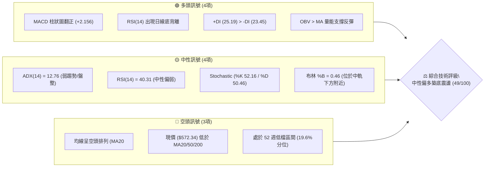
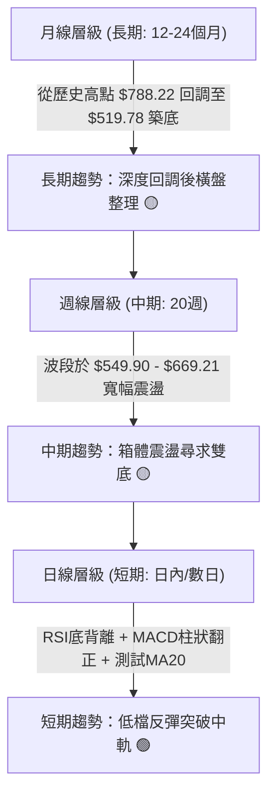
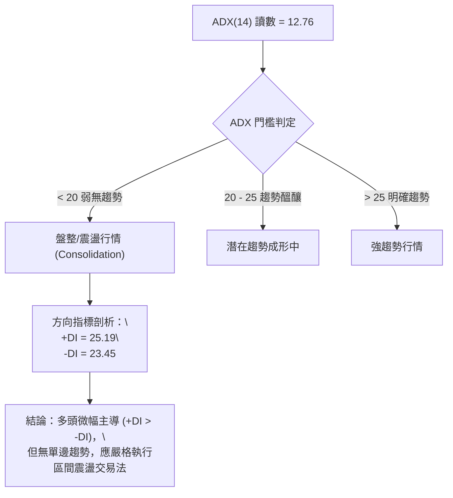
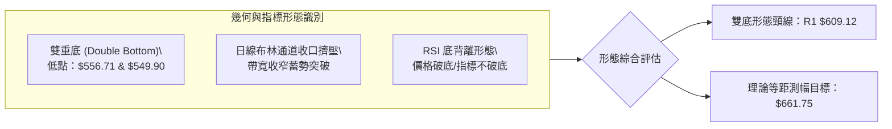
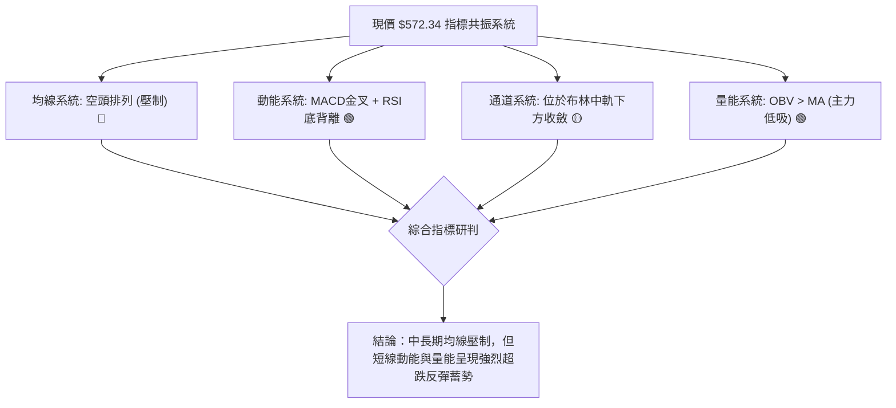
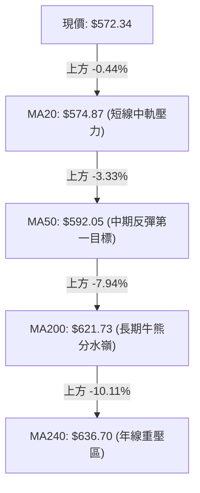
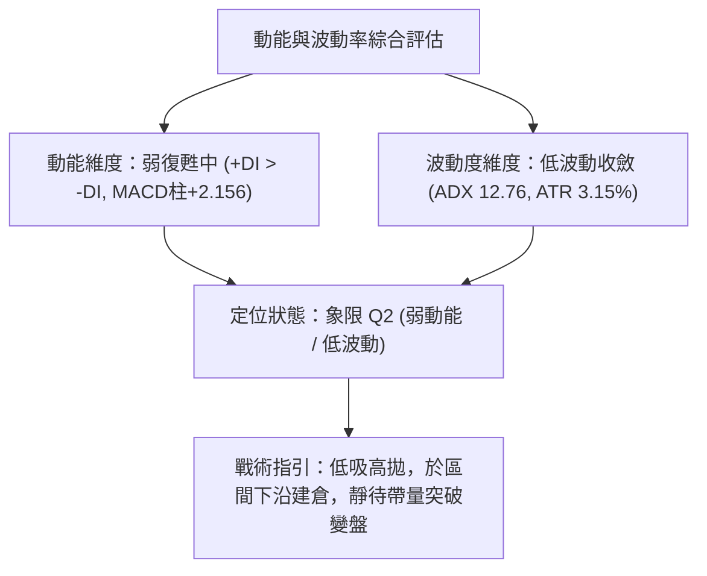
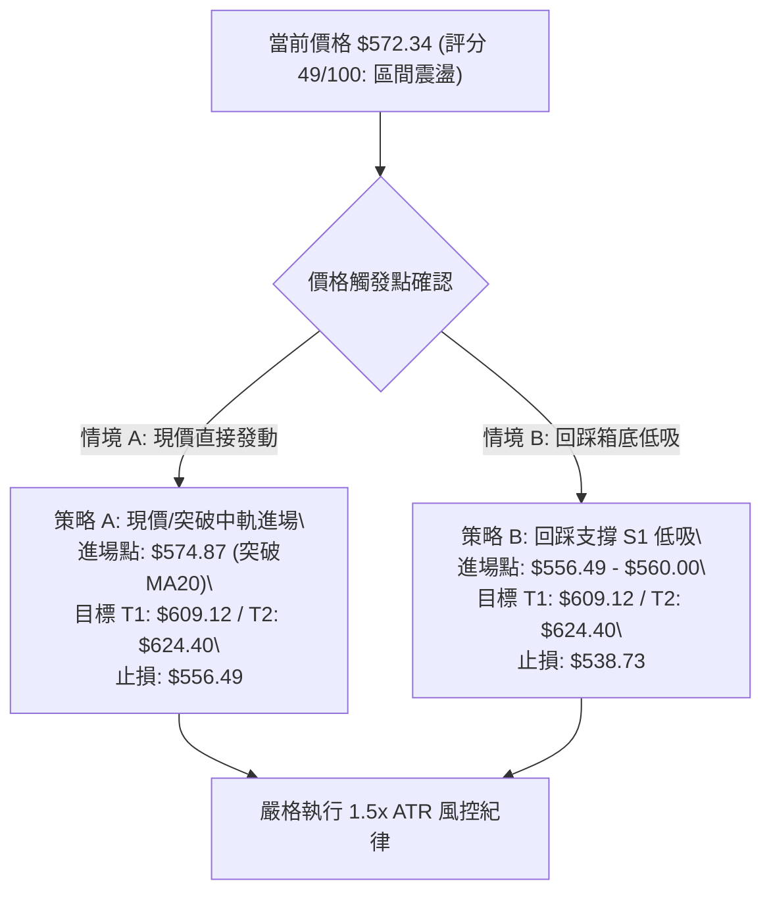
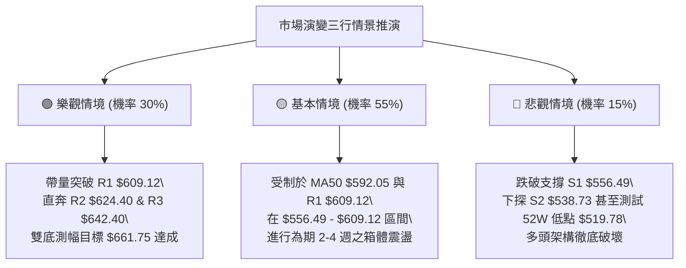

# META 技術分析報告

> **報告日期**：2026-09-01 ｜ **語言**：繁體中文 ｜ **數據來源**：Yahoo Finance ｜ **當前價格**：$572.34

---

## 目錄

| 章節 | 內容 |
|------|------|
| [1. 技術面概覽](#1-技術面概覽) | 訊號儀表板、核心指標、評分卡 |
| [2. 趨勢分析](#2-趨勢分析) | 多時框趨勢、長中短期走勢、ADX強度 |
| [3. 圖表形態分析](#3-圖表形態分析) | 形態識別、K線組合、目標價推算 |
| [4. 支撐與阻力](#4-支撐與阻力) | 關鍵價位、斐波那契回調結構 |
| [5. 技術指標深度解讀](#5-技術指標深度解讀) | MA/RSI底背離/MACD金叉/布林通道/OBV量能 |
| [6. 動能與波動率](#6-動能與波動率) | 動能象限、ATR止損模型、Beta市場敏感度 |
| [7. 多時框架總結](#7-多時框架總結) | 時框架評分矩陣、收斂規則與方向裁決 |
| [8. 交易策略建議](#8-交易策略建議) | 策略路由、價格情境階梯、精確交易計劃 |
| [9. 風險提示與監控](#9-風險提示與監控) | 關鍵監控清單、情境推演、風控防線 |

---

## 1. 技術面概覽

### 🎯 技術訊號儀表板



### 📊 核心指標速覽表

| 指標類別 | 指標名稱 | 當前數值 | 訊號狀態 | 技術面解讀 |
|:---|:---|:---|:---:|:---|
| **價格** | 當前收盤價 | **$572.34** | 🟡 | 位於52週區間 19.6% 低檔位置，正測試78.6%斐波那契位 |
| **短期均線** | MA20 | **$574.87** | 🟡 | 價格貼近中軌/MA20，短線面臨均線反壓 |
| **中期均線** | MA50 | **$592.05** | 🔴 | 價格位於MA50下方 -3.33%，中期下行壓力未解 |
| **長期均線** | MA200 | **$621.73** | 🔴 | 價格位於MA200下方 -7.94%，長期牛熊分界線構成重壓 |
| **動能震盪** | RSI(14) | **40.31** | 🟢 | 處於40水平但伴隨明顯**底背離**訊號，下行動能衰竭 |
| **趨勢動能** | MACD | **-7.561** / 訊號 **-9.717** | 🟢 | DIF穿越DEA黃金交叉，柱狀圖 **+2.156** 持續擴大 |
| **隨機指標** | Stoch %K / %D | **52.16 / 50.46** | 🟡 | 指標於中軸糾結，多空力量暫時達到動態平衡 |
| **趨勢強度** | ADX(14) | **12.76** | 🟡 | 數值遠低於25，明確定義為**無趨勢區間盤整行情** |
| **波動通道** | Bollinger Bands | **中軌 $574.87 / %B 0.46** | 🟡 | 價格在中軌下方震盪，通道帶寬收窄蓄勢 |
| **成交量能** | OBV 趨勢 | **OBV > MA** | 🟢 | 量能指標領先價格上揚，呈現低檔主力吸籌特徵 |
| **真實波幅** | ATR(14) | **$18.01 (3.15%)** | 🟡 | 波動率處於正常收斂水準，適合作為止損設置基準 |

### 🏆 技術評分卡

```
╔════════════════════════════════════════════════════════════════╗
║                技術評分卡 — META (2026-09-01)                  ║
╠════════════════════════════════════════════════════════════════╣
║  評估維度         進度條指示                    得分    狀態   ║
╟────────────────────────────────────────────────────────────────╢
║  趨勢強度 (ADX)   ████░░░░░░░░░░░░░░░░░░░░    22/100   🔴 弱勢 ║
║  動能修復 (MACD)  ██████████████░░░░░░░░░░    68/100   🟢 偏多 ║
║  震盪指標 (RSI)   ███████████░░░░░░░░░░░░░    55/100   🟡 中性 ║
║  支撐穩定度 (S/R) ██████████████░░░░░░░░░░    70/100   🟢 穩固 ║
║  成交量能 (OBV)   ████████████░░░░░░░░░░░░    62/100   🟢 配合 ║
║  均線排列結構     ████░░░░░░░░░░░░░░░░░░░░    20/100   🔴 空頭 ║
╠════════════════════════════════════════════════════════════════╣
║  綜合技術評分     ██████████░░░░░░░░░░░░░░    49/100   🟡 中性 ║
║  裁決結論：處於空頭趨勢末端之「區間築底與超跌反彈蓄勢期」       ║
╚════════════════════════════════════════════════════════════════╝
```

---

## 2. 趨勢分析

### 🌐 多時框趨勢分析



### 📈 長期趨勢 — 過去12個月走勢圖（2025-09 至 2026-08）

```
META 月線收盤走勢圖（2025-09 至 2026-08）
價格軸 ($)
$750 ┤● 732.47
$700 ┤                     ● 715.22
$650 ┤      ● 646.67 ● 646.27 ● 658.91  ● 647.03      ● 631.92
$600 ┤                                           ● 611.34
$550 ┤                                      ● 571.60       ● 563.29 ● 556.71 ● 572.34 (現價)
     └─────────────────────────────────────────────────────────────────────────────
      09   10       11       12       01    02   03       04   05       06   07       08 (月份)
```

#### 走勢特徵分析表格

| 階段區間 | 時間跨度 | 價格區間 ($) | 漲跌幅度 | 形態與量價特徵 |
|:---|:---|:---|:---|:---|
| **第一階段：高檔回落** | 2025-09 ~ 2025-11 | $732.47 → $646.27 | -11.77% | 自 $770.91 高檔回落，跌破 $700 關卡進入弱勢整理 |
| **第二階段：反彈誘多** | 2025-12 ~ 2026-01 | $658.91 → $715.22 | +8.55% | 形成中期次高點 $715.22，量能未能延續，形成假突破 |
| **第三階段：加速下跌** | 2026-02 ~ 2026-03 | $647.03 → $571.60 | -11.66% | 連續長黑貫穿多道均線，直探 $570 重要支撐區 |
| **第四階段：次級回升** | 2026-04 ~ 2026-05 | $611.34 → $631.92 | +3.37% | 反彈受阻於 60 日均線（MA60 $590-$630 區域） |
| **第五階段：底部夯實** | 2026-06 ~ 2026-08 | $563.29 → $572.34 | +1.61% | 於 $549.90~$556.71 探底不破，8月收 $572.34 構築雙底 |

### 📊 中期趨勢（週線分析）

從近20週的週線走勢觀察，META 在 2026-07-12 觸及反彈高點 $669.21（週成交量達 117.03M 股）後，隨即於 2026-08-02 快速回測至低點 $556.71（RSI 跌至 22.9 超賣區）。隨後在 2026-08-23 再次回測 $549.90，但收盤迅速拉回至 2026-08-30 的 $578.02，形成強烈的**週線級別雙底回踩不破**格局。

```
週線箱體震盪格局示意圖：
$674.40 ── 高點壓力帶 (2026-04-26) ─────────────────────────┐
$669.21 ── 波段反彈高點 (2026-07-12) ───────────────────────┤ 箱體頂部區間
                                                             │
$609.12 ── 中樞阻力位 R1 (密集成交區) ─────────────────────┼─ 箱體中軸
                                                             │
$572.34 ── 【當前收盤價】(測試中軌與78.6%回調) ──────────────┼─ 當前位置
$556.71 ── 底部支撐一 (2026-08-02 低點) ───────────────────┤
$549.90 ── 底部支撐二 (2026-08-23 低點) ───────────────────┴─ 箱體底部支撐帶 ($549.90-$556.71)
```

### ⚡ 趨勢強度評估（ADX 解讀）



| 指標變數 | 當前讀數 | 門檻標準 | 專業技術解讀 |
|:---|:---:|:---:|:---|
| **ADX(14)** | **12.76** | `< 20` | 市場處於典型的極低動能盤整期，順勢突破策略容易頻繁遭遇假突破 |
| **+DI (多頭動向)** | **25.19** | `> 23.45` | 多方動向線向上抬頭，微幅超過空方，顯示低檔買盤介入意願增強 |
| **-DI (空頭動向)** | **23.45** | `< 25.19` | 空方壓制力道正在減弱，自8月初恐慌殺跌後空頭動能衰退 |
| **行情定性** | **無趨勢盤整** | `ADX < 25` | **依多時框收斂規則：以日線布林通道 ($538.94 - $610.81) 為核心操作區間** |

---

## 3. 圖表形態分析

### 🔍 形態識別系統



#### 形態信心度評估表

| 識別形態名稱 | 信心度 (%) | 判斷依據（嚴格引用技術數據） | 形態完成度 | 理論目標價（附精確計算式） |
|:---|:---:|:---|:---:|:---|
| **雙重底 (Double Bottom)** | **68%** | 兩次下探低點分別為 2026-08-02 之 **$556.71** 與 2026-08-23 之 **$549.90**（低點相近於支撐 S1 $556.49 附近），隨後迅速收復 $572.00。 | 65% (等待突破頸線) | 頸線 R1 **$609.12** + 形態高度 ($609.12 - $556.49 = $52.63) = **$661.75** |
| **布林通道帶寬收斂** | **75%** | 布林帶寬 ($610.81 - $538.94 = $71.87)，%B 位於 0.46，收盤價 $572.34 緊貼中軌 $574.87，進入壓縮變盤期。 | 85% | 上軌 **$610.81** (短期箱頂目標) |
| **RSI 底背離架構** | **80%** | 2026-08-02 價格收 $556.71 (RSI 22.9)；2026-08-23 價格跌至 $549.90 但 RSI 為 31.3；當前價格 $572.34 (RSI 40.31)，形成標準底背離。 | 90% (已觸發反彈) | 斐波那契 61.8% 回調位 **$622.32** |

### 🕯️ 重要 K 線形態分析（近5週走勢解讀）

| 週別時間 | 收盤價 ($) | 週成交量 | 週 K 線形態特徵 | 市場心理與多空解讀 | 訊號方向 |
|:---:|:---:|:---:|:---|:---|:---:|
| **2026-08-02** | $556.71 | 112.11M | **恐慌長黑破位棒** | RSI 暴跌至 22.9，高成交量反映恐慌拋補，空方竭盡 | 🔴 空方釋放 |
| **2026-08-09** | $592.10 | 81.86M | **多頭反包大陽線** | 逢低買盤強力湧入，完全收復前週跌幅，確認 $556 具備支撐力 | 🟢 強烈反彈 |
| **2026-08-16** | $589.85 | 64.22M | **縮量十字星 (Doji)** | 多空於 MA20 ($574.87) 上方觀望，成交量降至 64.22M，醞釀方向 | 🟡 變盤觀望 |
| **2026-08-23** | $549.90 | 89.01M | **二次探底下影陰線** | 再次測試底部低點，但未引發崩潰性放量，留下長下影線 | 🟢 二次築底 |
| **2026-08-30** | $578.02 | 85.44M | **實體多頭收復棒** | MACD 柱狀圖翻正至 +1.912，多方再度奪回主控權 | 🟢 確認回升 |

### 📉 ASCII 走勢形態示意圖（雙底形態）

```
$610 ┤                  [頸線阻力 R1: $609.12]
     │                  ┌──────────────────────┐
$590 ┤       /\         │                      │         /\
     │      /  \        │                      │        /  \
$575 ┤─────/────\───────┼──────────────────────┼───────/────● $572.34 (現價測試中軌)
     │    /      \     /                        \     /
$555 ┤   /        \   /                          \   /
     │  /          \ /                            \ /
$540 ┤-●------------●------------------------------●------------------
     │ 08-02 底一 ($556.71)                    08-23 底二 ($549.90)
     └─────────────────────────────────────────────────────────────
```

### 🎯 形態目標價計算邏輯

1. **雙底頸線確認**：取近4個月密集回調高點聚類形成的關鍵阻力 **R1: $609.12**。
2. **底部基準點**：取第一支撐位低點 **S1: $556.49**（與 8/2 低點 $556.71 相符）。
3. **形態垂直高度 ($H$)**：
   $$H = \text{Neckline (R1)} - \text{Bottom (S1)} = \$609.12 - \$556.49 = \$52.63$$
4. **最小量度目標價 ($T$)**：
   $$T_1 = \text{Neckline} + H = \$609.12 + \$52.63 = \$661.75$$
   *(註：此目標價高於阻力 R3 $642.40，若突破頸線將依序挑戰 R2 $624.40、R3 $642.40 與形態目標 $661.75)*。

---

## 4. 支撐與阻力

### 🗺️ 關鍵價位分布圖

```
╔════════════════════════════════════════════════════════════════╗
║                   META 價位結構分布圖                          ║
╠════════════════════════════════════════════════════════════════╣
║  $642.40 ║██████████████████████████████║ 強阻力 R3 (波段高點) ║
║  $624.40 ║████████████████████          ║ 阻力 R2 (MA200交匯)  ║
║  $609.12 ║██████████████████████████████║ 關鍵阻力 R1 (布林上軌)║
║  $577.22 ║┄┄┄┄┄┄┄┄┄┄┄┄┄┄┄┄┄┄┄┄┄┄┄┄┄┄┄┄║ 斐波那契 78.6% 回調位 ║
║  $572.34 ╠══════════════════════════════╣ ◄ 現價 (收盤價)      ║
║  $556.49 ║▓▓▓▓▓▓▓▓▓▓▓▓▓▓▓▓▓▓▓▓          ║ 近期支撐 S1 (雙底頸下)║
║  $538.73 ║██████████████████████████████║ 強支撐 S2 (布林下軌) ║
║  $522.13 ║██████████████████████████████║ 極限支撐 S3 (52W底區)║
╚════════════════════════════════════════════════════════════════╝
```

### 🚧 阻力位分析表

| 阻力級別 | 精確價位 ($) | 距離現價 (%) | 形成原因與技術共振點 | 突破難度 | 重要性 |
|:---:|:---:|:---:|:---|:---:|:---:|
| **R1** | **$609.12** | +6.43% | 近一年波段高點聚類、布林通道上軌 (**$610.81**) 重合區，亦為雙底頸線 | 🟡 中等 | ★★★★☆ |
| **R2** | **$624.40** | +9.10% | 斐波那契 61.8% (**$622.32**) 及長期牛熊線 MA200 (**$621.73**) 密集共振區 | 🔴 極高 | ★★★★★ |
| **R3** | **$642.40** | +12.24% | 2026年5月反彈高點聚類區，前波套牢籌碼密集解套賣壓帶 | 🔴 高 | ★★★☆☆ |

### 🛡️ 支撐位分析表

| 支撐級別 | 精確價位 ($) | 距離現價 (%) | 形成原因與技術共振點 | 守住機率 | 重要性 |
|:---:|:---:|:---:|:---|:---:|:---:|
| **S1** | **$556.49** | -2.77% | 近一年波段低點聚類、8月雙底低點帶 ($556.71 / $549.90)，第一道防線 | 🟢 75% | ★★★★☆ |
| **S2** | **$538.73** | -5.87% | 布林通道下軌 (**$538.94**) 與 2025-04 波段起漲低點 ($546.79) 共振區 | 🟢 85% | ★★★★★ |
| **S3** | **$522.13** | -8.77% | 52週歷史最低點 (**$519.78**) 之上方緩衝防禦帶，長期多頭最後防線 | 🟢 95% | ★★★★★ |

### 📐 斐波那契回調位分析

依據 52 週完整波動區間（高點 **$788.22** 至 低點 **$519.78**，垂直落差 **$268.44**）計算之標準斐波那契回調位：

```
$788.22 ├──────────────────────────────────────── 0.0%  (52W High)
        │
$724.87 ├──────────────────────────────────────── 23.6% 回調
        │
$685.67 ├──────────────────────────────────────── 38.2% 回調 (中期強弱分水嶺)
        │
$654.00 ├──────────────────────────────────────── 50.0% 回調 (多空中樞)
        │
$622.32 ├──────────────────────────────────────── 61.8% 黃金分割回調 (共振 MA200 $621.73 & R2 $624.40)
        │
$577.22 ├──────────────────────────────────────── 78.6% 極限深幅回調
        │ ◄ 現價 $572.34 (正處於 78.6% 回調位下方僅 -0.84%，即時測試關鍵位)
$519.78 ┴──────────────────────────────────────── 100.0% (52W Low)
```

**【現價落點解讀】**：
當前收盤價 **$572.34** 緊貼於 **78.6% 回調位 ($577.22)** 與 **100.0% 低點 ($519.78)** 之間。在經典斐波那契技術理論中，78.6% 回調位為深度回檔中「最後一道多頭防禦關卡」。現價在此處獲得支撐並出現 RSI 底背離與 MACD 金叉，顯示此處為高盈虧比之築底反彈關鍵轉折區間。

---

## 5. 技術指標深度解讀

### 🎛️ 指標訊號總覽



### 📈 移動平均線排列分析



| 均線名稱 | 當前數值 ($) | 乖離率 (%) | 均線斜率與方向 | 短期技術意涵 |
|:---|:---:|:---:|:---|:---|
| **MA 5** | $573.53 | -0.21% | 走平微跌 (▼) | 短線超跌走平，價格與5日線黏合，短線即將表態 |
| **MA 10** | $561.21 | +1.98% | 向上翻揚 (▲) | 10日均線自低檔勾頭向上，提供現價下方第一道動態支撐 |
| **MA 20** | $574.87 | -0.44% | 下行減速 (▼) | 扣抵值即將進入低檔區，若收復 $575 則 MA20 將由下行轉為走平 |
| **MA 50** | $592.05 | -3.33% | 持續下彎 (▼) | 中期空頭壓制線，對應波段阻力 R1 $609 之前置防線 |
| **MA 200** | $621.73 | -7.94% | 緩步下行 (▼) | 長期均線走弱，宣告中長期進入寬幅震盪築底階段 |

### 📉 RSI(14) 分析

* **當前 RSI(14) 數值**：**40.31**
* **動能強度進度條**：`████████░░░░░░░░░░░░ 40.31% (中性偏弱)`
* **背離研判**：⚠️ **確定形成日線/週線級別「多頭底背離 (Bullish Divergence)」**
  * *價格走勢*：2026-08-02 收盤 $556.71 $\rightarrow$ 2026-08-23 盤中探底 $549.90（價格創波段新低）。
  * *RSI 走勢*：2026-08-02 RSI 為 22.9 $\rightarrow$ 2026-08-23 RSI 抬升至 31.3 $\rightarrow$ 2026-09-01 回升至 40.31（指標低點顯著墊高）。
  * *技術意涵*：下行賣壓動能大幅減弱，空頭力道竭盡，通常預示著即將展開強勁的均值回歸修復波。

### 📊 MACD(12, 26, 9) 訊號解讀


* **快慢線位置**：DIF (-7.561) > DEA (-9.717)，快線已正式穿越慢線形成**零下黃金交叉**。
* **柱狀圖動能**：Histogram 為 **+2.156**，近三週呈現持續放大態勢（-4.226 $\rightarrow$ +1.912 $\rightarrow$ +2.156），確認多頭反彈動能正逐步主導盤面。

### 📦 布林通道 (Bollinger Bands) 分析

```
布林通道收盤位置示意圖：
$610.81 ┤ ══════════════════════════════════ 上軌 (Upper Band)
        │
$590.00 ┤
        │
$574.87 ┤ ────────────────────────────────── 中軌 (MA20)
$572.34 ┤ ◄ 現價 (%B = 0.46)
        │
$550.00 ┤
        │
$538.94 ┤ ══════════════════════════════════ 下軌 (Lower Band)
```

* **布林上軌**：**$610.81**
* **布林中軌 (MA20)**：**$574.87**
* **布林下軌**：**$538.94**
* **當前 %B 指標**：**0.46**（位於下軌至中軌間，中軸偏下位置）
* **帶寬特徵**：通道帶寬收窄至 $71.87（約 12.5%），顯示波動率顯著收縮。現價正處於突破中軌的前夕，一旦帶量站上 $574.87，通道將向上開口，挑戰上軌 **$610.81**（與阻力 R1 $609.12 完全共振）。

### 💹 成交量與 OBV 分析

* **量能數據**：最新單日成交量 **13,275,274 股**，相較 20 日均量 **15,393,449 股**，量比為 **0.86x**，呈現縮量蓄勢特徵。
* **OBV 能量潮**：數據明確指出 **OBV > MA (OBV 位於其均線上方)**。
* **量價配合度分析**：
  在 8 月份兩次探底過程中，成交量由 112.11M 縮減至 89.01M，而反彈週（8/30 週）成交量回升至 85.44M 且 OBV 維持多頭排列，顯示大資金在 $550-$560 區間具有強烈的護盤與低吸吸籌跡象，量價並未出現異常失衡，支撐價格展開反彈。

---

## 6. 動能與波動率

### ⚡ 動能評估分析



| 象限分類 | 動能強度 | 波動率狀態 | 當前定位 | 戰術應對評估 |
|:---:|:---:|:---:|:---:|:---|
| **Q1** | 強 | 低 | — | 最佳單邊主升段（暫非此狀態） |
| **Q2** | **弱/復甦** | **低/收斂** | **✓ (META 當前)** | **底部蓄勢期：波動收縮、指標底背離，適合分批低吸佈局** |
| **Q3** | 強 | 高 | — | 高風險擴張期（需提防劇烈洗盤） |
| **Q4** | 弱 | 高 | — | 恐慌崩跌期（已於8月初 $556 釋放） |

### 📊 ATR 波動率與止損模型

* **ATR(14) 數值**：**$18.01**（佔現價比例 **3.15%**）。
* **日內波動範圍**：正常日均波動區間為 $\pm \$18.01$。
* **風控止損參數設定建議**：
  * **激進型短線止損 (1.0 $\times$ ATR)**：距離現價 $\$18.01$，設置於 **$554.33**（略低於支撐 S1 $556.49）。
  * **標準波段止損 (1.5 $\times$ ATR)**：距離現價 $\$27.02$，設置於 **$545.32**（跌破前低 $549.90 執行硬止損）。
  * **寬鬆底倉止損 (2.0 $\times$ ATR)**：距離現價 $\$36.02$，設置於 **$536.32**（保護於支撐 S2 $538.73 之下）。

### 📐 Beta 與市場相關性

* **Beta 係數**：**1.243**（相對於 S&P 500 指數具有 1.24 倍的波動放大效應）。
* **機構持股比例**：**79.0%**（高機構持股，籌碼結構相對穩定）。
* **市場敏感度評估**：
  Beta 值 1.243 表明 META 屬於高彈性大型科技股。在整體大盤回暖時，其修復反彈速度將超越大盤 24%；但在市場流動性緊縮時，其下行波動亦較為劇烈。當前 ATR 3.15% 處於歷史合理收斂區間，未出現極端流動性折價風險。

---

## 7. 多時框架總結

### 📋 時框架評分表

| 時框架 | 趨勢方向 | 動能狀態 | 均線排列 | 形態特徵 | 綜合評分 | 操作建議 |
|:---:|:---:|:---:|:---:|:---:|:---:|:---|
| **月線 (長期)** | 🟡 震盪整理 | 弱勢築底 | MA200之上回踩 | 測試78.6%斐波位 | 45/100 | 長期投資者可於 $550 附近建立底倉 |
| **週線 (中期)** | 🟡 箱體震盪 | 柱狀圖翻正 | 均線糾結 | 雙重底形態醞釀 | 52/100 | 箱體區間操作，回踩支撐低吸 |
| **日線 (短期)** | 🟢 超跌反彈 | RSI底背離/金叉 | 逼近MA20中軌 | 布林通道收口蓄勢 | 60/100 | 短線偏多操作，博弈向上突破中軌 |

### 🔲 綜合訊號矩陣

```
訊號維度矩陣分析：
┌─────────────────┬──────────┬──────────┬──────────┐
│ 維度 \ 時框     │ 日線層級 │ 週線層級 │ 月線層級 │
├─────────────────┼──────────┼──────────┼──────────┤
│ 趨勢方向        │ 🟢 偏多  │ 🟡 中性  │ 🔴 偏弱  │
│ 動能指標 (MACD) │ 🟢 金叉  │ 🟢 翻紅  │ 🔴 綠柱  │
│ 震盪指標 (RSI)  │ 🟢 背離  │ 🟡 中性  │ 🟡 中性  │
│ 均線系統        │ 🟡 測中軌│ 🔴 壓制  │ 🟡 支撐  │
│ 量能配合 (OBV)  │ 🟢 支撐  │ 🟢 配合  │ 🟡 萎縮  │
└─────────────────┴──────────┴──────────┴──────────┘
```

### ⚖️ 多時框收斂結論

> **依據「嚴格要求 14」多時框收斂優先級規則執行裁決**：
> 1. **趨勢強度定性**：當前 ADX(14) 數值為 **12.76 (< 25)**，嚴格判定當前市場處於**「無單邊趨勢的區間盤整行情 (Range-bound Consolidation)」**。
> 2. **主導交易規則**：在盤整行情中，不可採用順勢突破追高策略，**必須以日線布林通道 ($538.94 - $610.81) 與 S/R 關鍵價位 ($556.49 - $609.12) 作為主要交易區間**。
> 3. **唯一方向性結論**：**【中性觀望偏多反彈（區間低吸高拋）】**。短線日線級別具備 RSI 底背離與 MACD 金叉之動能支持，方向以「回踩支撐 S1 做多、目標上看阻力 R1」為主導，此結論完全收斂並貫穿第 8 章之交易策略。

---

## 8. 交易策略建議

### 🗺️ 策略決策流程圖



### 🧭 策略路由

* **當前技術評分**：**49 / 100**（中性區間）
* **當前主策略方向**：**【區間操作——以布林帶中下軌為支撐之低吸多頭策略】**（禁止於中軸盲目追高，耐心等待回踩或帶量突破確認）。

### 🎯 價格情境階梯 (Price Scenarios)

所有價位均嚴格引用第 4 章計算之波段聚類位與斐波那契位：

| 觸發條件 (Trigger) | 下一目標價 ($) | 後續延伸目標 ($) | 情境技術含義與應對方案 |
|:---|:---:|:---:|:---|
| **帶量突破 R1 ($609.12)** | **R2 ($624.40)** | **R3 ($642.40)** | 雙底形態頸線確認突破，中期反轉確立，可順勢加碼多單 |
| **站穩現價區間 ($572.34)** | **MA50 ($592.05)** | **R1 ($609.12)** | 短線維持在布林中軌附近震盪，動能逐步修復，持股觀望 |
| **跌破 S1 ($556.49)** | **S2 ($538.73)** | **S3 ($522.13)** | 雙底支撐失敗，行情下探布林下軌尋求支撐，多單觸發止損 |

### 📊 情境機率分佈

```
情境預測機率分佈：
繼續上行反彈 (至 R1 $609.12)  █████████████████████████ 50%
區間窄幅震盪 ($556.49 - $592.05) █████████████████ 35%
跌破支撐下探 (至 S2 $538.73)  ███████ 15%
```

* **反彈上行至 R1 (50%)**：依據 MACD 柱狀圖翻正 (+2.156)、RSI 日線底背離、+DI > -DI 及 OBV 多頭支撐。
* **區間震盪 (35%)**：依據 ADX = 12.76 顯示單邊趨勢疲弱，均線呈現空頭排列壓制。
* **回落探底至 S2 (15%)**：依據 52 週大趨勢仍處於弱勢，若跌破雙底 S1 $556.49 則可能慣性下殺。

### 🟢 主策略詳情

本報告依據精確價位提供兩套操作路徑：**策略 A（右側突破中軌進場）** 與 **策略 B（左側回踩支撐低吸）**：

| 策略要素 | 策略 A (右側突破中軌型) | 策略 B (左側回踩箱底型) |
|:---|:---|:---|
| **適用場景** | 日線收盤價帶量突破 MA20 ($574.87) | 價格回踩雙底支撐 S1 獲得承接 |
| **進場條件** | 站穩 **$574.87** 且成交量 > 15M | 回踩 **$556.49 - $560.00** 區間企穩 |
| **進場價格** | **$574.87** | **$558.00** (區間均價) |
| **第一目標價 (T1)** | **$609.12** (阻力 R1 / 布林上軌) | **$609.12** (阻力 R1) |
| **第二目標價 (T2)** | **$624.40** (阻力 R2 / MA200) | **$624.40** (阻力 R2 / 61.8% 斐波位) |
| **硬止損價格** | **$556.49** (跌破支撐 S1 止損) | **$538.73** (跌破支撐 S2 / 布林下軌) |
| **止損空間 ($ / %)** | -$18.38 (-3.20%) *(約 1.0x ATR)* | -$19.27 (-3.45%) *(約 1.1x ATR)* |
| **第一目標盈虧比** | **1 : 1.86** ($34.25 獲利 / $18.38 風險) | **1 : 2.65** ($51.12 獲利 / $19.27 風險) |
| **第二目標盈虧比** | **1 : 2.69** ($49.53 獲利 / $18.38 風險) | **1 : 3.45** ($66.40 獲利 / $19.27 風險) |
| **預估勝率** | **55%** | **65%** |
| **建議倉位上限** | **15% - 20%** | **10% - 15% (分批建倉)** |

### 🔴 反向風險觸發點（對沖與風控提示）

* **全面看空/止損觸發點**：若日線實體陰線**跌破支撐 S1: $556.49**，宣告 8 月雙底形態徹底破壞，應立即平倉多單離場觀望。
* **對沖放空點位**：若價格反彈至阻力 **R2: $624.40** 或 **MA200: $621.73** 出現長上影線受阻滯漲，可建立空頭避險部位，目標下看 $574.87。

### ⭐ 整體訊號強度評星

```
╔═══════════════════════════════════════════════╗
║  做多訊號強度：  ★★★☆☆  (3.0 / 5.0 星)        ║
║  做空訊號強度：  ★★☆☆☆  (2.0 / 5.0 星)        ║
║  策略整體可信度：★★★★☆  (4.0 / 5.0 星)        ║
╚═══════════════════════════════════════════════╝
```

---

## 9. 風險提示與監控

### ✅ 關鍵監控指標 Checklist

```
╔══════════════════════════════════════════════════════════════════╗
║              META 交易風控與關鍵監控清單 (Checklist)             ║
╠══════════════════════════════════════════════════════════════════╣
║ [ ] 1. 均線攻防：每日收盤價是否成功站上 MA20 ($574.87)           ║
║ [ ] 2. 動能延續：MACD Histogram 是否持續維持在正值區間 (> 0)    ║
║ [ ] 3. 震盪指標：RSI(14) 是否穩健突破 50 中軸強弱分水嶺          ║
║ [ ] 4. 關鍵破位：盤中是否跌破第一防禦支撐 S1 ($556.49)          ║
║ [ ] 5. 量能異動：單日成交量是否放大至 20M 股以上確認突破方向     ║
║ [ ] 6. 趨勢轉向：ADX(14) 是否自 12.76 向上回升突破 20 門檻      ║
║ [ ] 7. 帶寬開口：布林通道帶寬是否在突破 $610.81 時顯著放大      ║
╚══════════════════════════════════════════════════════════════════╝
```

### ⚠️ 風險場景推演



### 🛡️ 風險管理與倉位紀律提醒

1. **嚴禁單邊追高**：當前 ADX 為 12.76，處於標準震盪市，任何接近阻力位 **R1: $609.12** 或 **布林上軌 $610.81** 的急拉均不可追多，反而應分批獲利了結。
2. **單筆風險敞口控制**：每筆交易所承擔的最大本金虧損額度應嚴格限制於總資金的 **1.0% - 1.5%** 內。以策略 A 為例（止損幅度約 3.2%），總倉位配置不宜超過總帳戶資金的 **30%**。
3. **動態跟蹤止盈機制**：若股價如期突破 $592.05（MA50），應立即將止損位上移至成本價 **$574.87** 保本；當觸及第一目標價 **$609.12** 時，必須至少平倉 50% 部位鎖定利潤。

---

## 📋 報告總結

```
╔══════════════════════════════════════════════════════════════════╗
║                   META 技術分析報告總結                          ║
╠════════════════════════════════════════════════════════════════╣
║  報告日期：2026-09-01                                            ║
║  當前價格：$572.34                                               ║
║  分析評級：⚖️ 中性偏多震盪 (Neutral-Bullish Consolidation)        ║
║  技術評分：49 / 100 (動能背離修復期)                              ║
╟────────────────────────────────────────────────────────────────╢
║  【核心技術面結論】                                              ║
║  ├─ 長期趨勢：🟡 自 $788.22 深度回調後，於 78.6% 斐波位尋求支撐  ║
║  ├─ 中期趨勢：🟡 週線呈現 $549.90 - $609.12 箱體雙重底醞釀結構   ║
║  ├─ 短期趨勢：🟢 日線 RSI 底背離 + MACD 柱翻正，動能偏向反彈    ║
║  ├─ 關鍵支撐：S1: $556.49 ｜ S2: $538.73 ｜ S3: $522.13          ║
║  ├─ 關鍵阻力：R1: $609.12 ｜ R2: $624.40 ｜ R3: $642.40          ║
║  └─ 華爾街共識目標價：$754.77 (57位分析師，評級 Strong Buy)      ║
╟────────────────────────────────────────────────────────────────╢
║  【最優策略推薦組合】                                            ║
║  1. 🥇 首選策略 (策略 A)：突破 MA20 ($574.87) 進場做多，          ║
║        目標 T1: $609.12 / T2: $624.40，止損 $556.49 (R:R = 1:1.9)║
║  2. 🥈 次選策略 (策略 B)：回踩箱底 S1 ($556.49-$560) 低吸佈局，    ║
║        目標 T1: $609.12 / T2: $624.40，止損 $538.73 (R:R = 1:2.7)║
║  3. 🥉 防守建議：跌破 $556.49 無條件離場，耐心等待 $538 企穩。   ║
╚══════════════════════════════════════════════════════════════════╝
```

---

> ⚠️ **免責聲明**：本報告為依據量化技術指標與歷史價格結構所產出之專業技術分析報告，所有數據與推算均基於提供之歷史市場資訊。本報告**僅供學術研究與投資決策參考**，**不構成任何形式的直接投資要約或買賣建議**。金融市場存在高度波動風險，投資人應獨立評估自身風險承受能力並嚴格執行風控紀律。

---
*報告生成時間：2026-09-01 ｜ 數據來源：Yahoo Finance ｜ 分析框架：多時框架量化技術分析*