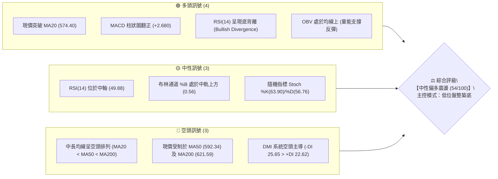
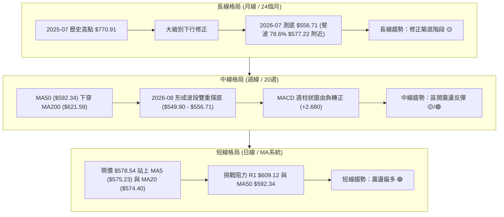
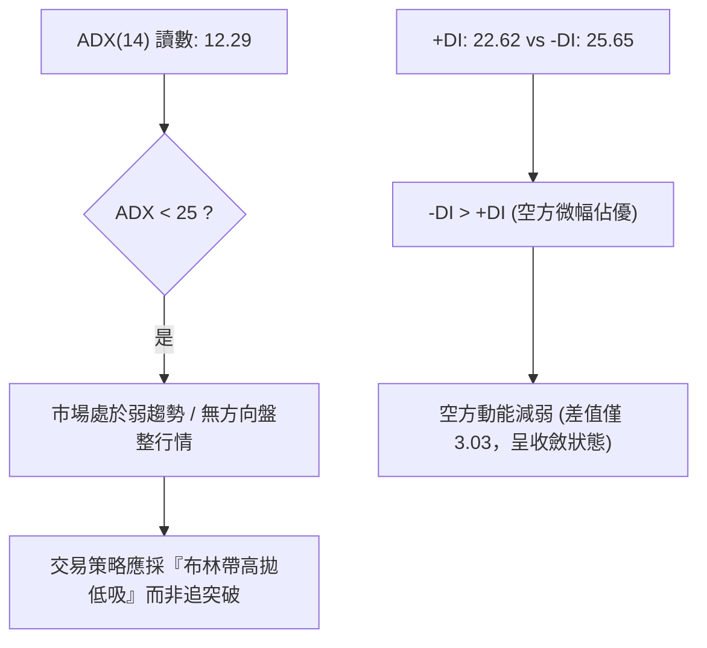
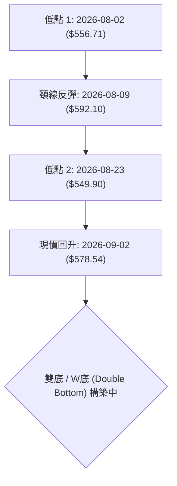
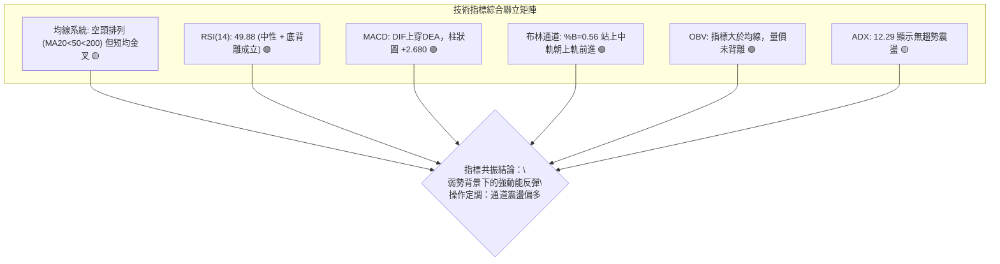
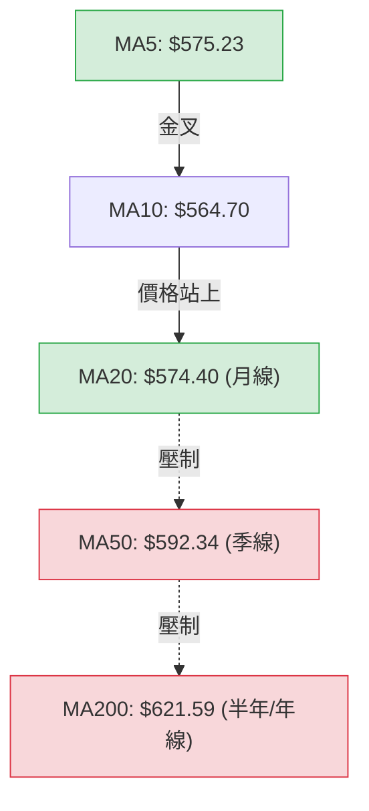
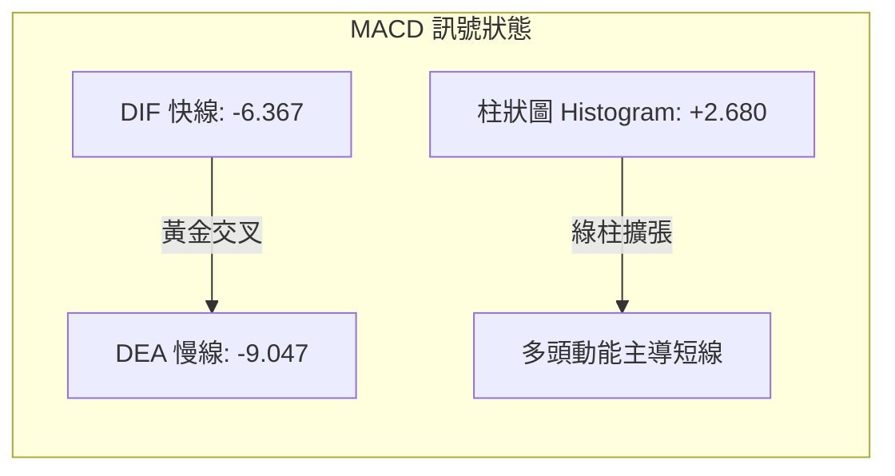
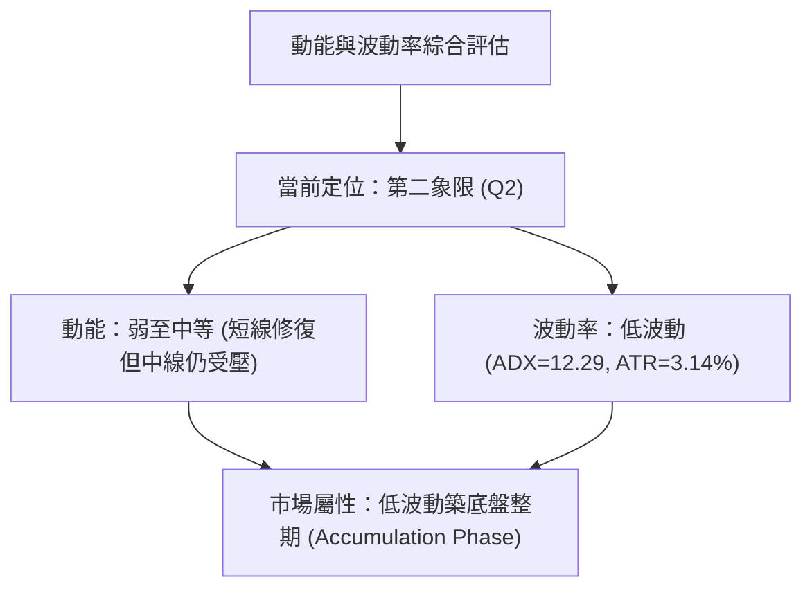
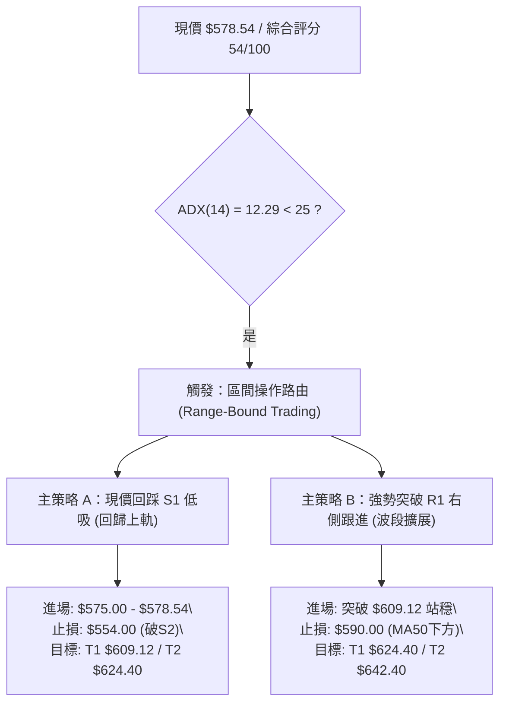
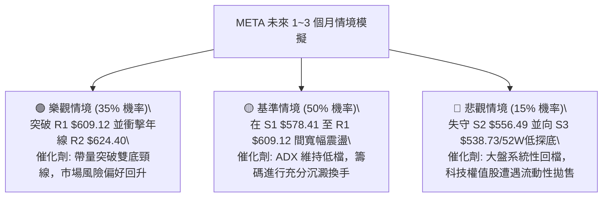

# META 技術分析報告

> **報告日期**：2026-09-02 ｜ **語言**：繁體中文 ｜ **數據來源**：Yahoo Finance ｜ **當前價格**：$578.54

---

## 目錄

| 章節 | 內容 |
|------|------|
| [1. 技術面概覽](#1-技術面概覽) | 訊號儀表板、核心指標、評分卡 |
| [2. 趨勢分析](#2-趨勢分析) | 多時框趨勢、長中短期走勢、ADX趨勢強度 |
| [3. 圖表形態分析](#3-圖表形態分析) | 形態識別、K線組合、目標價推算 |
| [4. 支撐與阻力](#4-支撐與阻力) | 關鍵價位分佈、斐波那契回調結構 |
| [5. 技術指標深度解讀](#5-技術指標深度解讀) | MA均線、RSI背離、MACD、布林通道、OBV |
| [6. 動能與波動率](#6-動能與波動率) | 動能四象限、ATR波動率、Beta大盤聯動 |
| [7. 多時框架總結](#7-多時框架總結) | 時框矩陣、多時框收斂定調 |
| [8. 交易策略建議](#8-交易策略建議) | 策略路由、價格情境、主策略與避險規劃 |
| [9. 風險提示與監控](#9-風險提示與監控) | 監控清單、情境模擬、資金風控 |
| [10. 報告總結](#10-報告總結) | 全文摘要與決策總覽 |

---

## 1. 技術面概覽

### 🎯 技術訊號儀表板



---

### 📊 核心指標速覽表

| 指標類別 | 指標名稱 | 當前數值 | 訊號 | 專業技術解讀 |
|:---|:---|:---|:---:|:---|
| **價格結構** | 收盤價 | $578.54 | 🟡 | 位於52週區間 21.9% 低檔區，緊貼支撐 S1 ($578.41) 與斐波那契 78.6% ($577.22) |
| **短期均線** | MA5 / MA10 | $575.23 / $564.70 | 🟢 | 短天期均線金叉向上發散，短多動能增溫 |
| **中期均線** | MA20 (月線) | $574.40 | 🟢 | 價格成功收復月線，MA20 走平轉為短期動態支撐 |
| **中期阻力** | MA50 (季線) | $592.34 | 🔴 | 價格低於 MA50 (-2.33%)，季線下彎構成第一道反彈強壓 |
| **長期均線** | MA200 (年線) | $621.59 | 🔴 | 價格低於 MA200 (-6.93%)，長線處於弱勢空頭格局 |
| **動能震盪** | RSI(14) | 49.88 | 🟢 | 數值回升至中軸，且在低檔出現明顯「價格創新低、指標抬高」之底背離 |
| **趨勢動能** | MACD (12,26,9) | -6.367 / -9.047 | 🟢 | DIF 線由下往上穿過 MACD Signal，柱狀圖擴張至 +2.680，發出買進訊號 |
| **趨勢強度** | ADX(14) | 12.29 | 🟡 | 數值小於 25，表明單邊趨勢衰竭，市場進入低波動區間震盪盤整 |
| **通道軌道** | 布林通道 (%B) | 0.56 ($538.94 - $609.86) | 🟡 | 股價脫離下軌並穿過中軌 ($574.40)，往上軌 ($609.86) 測試 |
| **波動風險** | ATR(14) | $18.17 (3.14%) | 🟡 | 日內波動適中，提供合理的止損區間與波段操作空間 |
| **量能指標** | 成交量 / OBV | 15.37M (量比 1.01x) | 🟢 | OBV > MA，量能穩健放大，未出現殺跌放量，量價配合健康 |

---

### 🏆 技術評分卡

```
╔══════════════════════════════════════════════════════════════════════════════╗
║                     META 技術評分卡 (2026-09-02)                             ║
╠══════════════════════════════════════════════════════════════════════════════╣
║ 趨勢強度 (Trend Strength)   ▓▓▓░░░░░░░░░░░░░░░░░  30/100 🔴 (ADX=12.29 無趨勢)║
║ 短線動能 (Short Momentum)   ▓▓▓▓▓▓▓▓▓▓▓▓▓░░░░░░░  68/100 🟢 (MACD金叉+RSI背離)║
║ 支撐穩定度 (Support Base)   ▓▓▓▓▓▓▓▓▓▓▓▓▓▓░░░░░░  72/100 🟢 (78.6%斐波+S1重疊)║
║ 成交量配合 (Volume Flow)    ▓▓▓▓▓▓▓▓▓▓▓░░░░░░░░░  58/100 🟡 (量能溫和無爆量)  ║
║ 形態完整度 (Pattern Base)   ▓▓▓▓▓▓▓▓▓▓░░░░░░░░░░  52/100 🟡 (雙底構築中未突破)║
║ 均線系統 (MA System)        ▓▓▓▓▓▓▓░░░░░░░░░░░░░  38/100 🔴 (MA20<50<200空排) ║
╠══════════════════════════════════════════════════════════════════════════════╣
║ 綜合技術評分                ▓▓▓▓▓▓▓▓▓▓▓░░░░░░░░░  54/100 🟡 中性築底/區間反彈  ║
╚══════════════════════════════════════════════════════════════════════════════╝
```

---

## 2. 趨勢分析

### 🌐 多時框趨勢分析



---

### 📈 長期趨勢 — 12個月走勢圖（ASCII）

```
META 月線歷史走勢圖（2025-09 至 2026-09）
價格軸 ($)
$750 ┤    ●(2025-09: $732.47)
$700 ┤                             ●(2026-01: $715.22)
$650 ┤          ●         ●        │     ●         ●
     │       (10月:    (12月:      │  (02月:    (05月:
     │       $646.67)  $658.91)    │  $647.03)  $631.92)
$600 ┤                             │                   ●(04月: $611.34)
$550 ┤                             │                         ●        ●←現價 $578.54
     │                             │                      (06月:   (08月:
     │                             │                      $563.29) $572.34)
$500 ┴─────────────────────────────┴───────────────────────────────────────
     09   10    11    12    01     02    03    04    05    06    07    08    09
     └──────── 2025 ───────┘ └─────────────────── 2026 ───────────────────────┘
```

#### 📊 過去 12 個月走勢特徵分析表格

| 階段區間 | 起止價格 | 漲跌幅 | 走勢特徵與技術意義 |
|:---|:---|:---:|:---|
| **2025-09 ~ 2025-11** | $732.47 → $646.27 | -11.77% | 自高檔回落，跌破 $700 心理整數關卡，高階獲利盤了結 |
| **2025-12 ~ 2026-01** | $658.91 → $715.22 | +8.55% | 跌深反彈波（次高點），未能突破 $732 頸線阻力 |
| **2026-02 ~ 2026-03** | $647.03 → $571.60 | -11.66% | 主跌段展開，空方下摜擊穿 MA60 與 MA120 |
| **2026-04 ~ 2026-05** | $611.34 → $631.92 | +3.37% | 弱勢反彈，受阻於下降趨勢線與 MA200 反壓 |
| **2026-06 ~ 2026-07** | $563.29 → $556.71 | -11.90% | 破底尋求支撐，觸及 52 週低點區 ($519.78 ~ $556.49 S2) |
| **2026-08 ~ 2026-09** | $572.34 → $578.54 | +1.08% | **築底成型**：站穩斐波 78.6% ($577.22)，收復 MA20 ($574.40) |

---

### 📊 中期趨勢（週線分析）

中期走勢呈現「底部墊高（Higher Lows）」的初步徵兆。近 6 週收盤價由 2026-08-02 的 $556.71、2026-08-23 的 $549.90，逐步回升至最新一週的 $578.54。

```
週線級別壓力支撐示意圖：
$642.40 ─── [阻力 R3 / 5月反彈高點平台]
$624.40 ─── [阻力 R2 / 斐波 61.8% $622.32 / MA200 $621.59]
$609.12 ─── [阻力 R1 / 布林上軌 $609.86 / MA50 $592.34 區間]
$578.54 ═══ [現價 / 斐波 78.6% $577.22 / 支撐 S1 $578.41]
$556.49 ─── [支撐 S2 / 8月探底低點 $556.71]
$538.73 ─── [支撐 S3 / 布林下軌 $538.94]
```

---

### ⚡ 趨勢強度評估（ADX 解讀）



#### 📐 ADX 趨勢強度對照表

| ADX 數值區間 | 趨勢分類 | META 當前狀態 | 交易策略指導原則 |
|:---:|:---|:---:|:---|
| **0 ~ 20** | **極弱 / 無趨勢盤整** | **12.29 (當前)** | **嚴禁追價；以區間通道上下軌逆勢或低吸為主** |
| **20 ~ 25** | 趨勢醞釀 / 弱趨勢 | - | 關注均線黏合後的方向突破確認 |
| **25 ~ 40** | 強趨勢形成 | - | 順應中長線主趨勢方向單邊操作 |
| **40 ~ 100** | 極強單邊 / 超買超賣 | - | 尋找動能衰竭點進行波段獲利了結 |

---

## 3. 圖表形態分析

### 🔍 形態識別系統



#### 📋 形態識別與信心度評估表

| 形態名稱 | 信心度 | 判斷依據（引用技術數據） | 形態完成度 | 目標價（附嚴格計算式） |
|:---|:---:|:---|:---:|:---|
| **潛在雙底 (Double Bottom)** | **65%** | 兩次下探分別於 S2 ($556.49) 與 $549.90 獲得支撐，RSI 底背離確認動能墊高 | 70% | 頸線 $592.10 + 形態高度 ($592.10 - $549.90 = $42.20) = **$634.30**（落於 R2 $624.40 與 R3 $642.40 之間） |
| **矩形箱體震盪 (Box Range)** | **85%** | 價格受限於布林下軌 S3 ($538.73/$538.94) 至上軌 R1 ($609.12/$609.86)，ADX 12.29 強烈支持 | 90% | 箱頂突破目標 = 箱頂 $609.12 + 箱高 ($609.12 - $538.73 = $70.39) = **$679.51** |
| **頭肩底形態 (Inverse H&S)** | **30%** | 左肩 $566.45、頭部 $549.90、右肩 $572.34。右肩結構尚未完整，右側量能不足 | 35% | *信心度 < 50%，依規則 15 僅作觀察，不採納為主要交易依據* |

---

### 🕯️ 重要 K 線形態分析

| 日期區間 | 收盤價 | K 線形態組合 | 結構技術解讀 | 訊號方向 |
|:---|:---|:---|:---|:---:|
| **2026-08-02** | $556.71 | 長黑摜壓破底線 | 週成交量爆出 1.12 億股，殺出恐慌籌碼，為波段首個試探底 | 🔴 |
| **2026-08-09** | $592.10 | 破底翻大陽線 | 迅速反包收復失土，MACD 柱狀圖收窄至 -2.487，買盤強烈介入 | 🟢 |
| **2026-08-23** | $549.90 | 縮量錘頭回踩線 | 跌破前低但成交量降至 8,901 萬股（量縮探底），形成假跌破 | 🟢 |
| **2026-08-30** | $578.02 | 吞噬中陽線 | 確認 $549.90 支撐有效，K 線包覆前一週實體，築底確立 | 🟢 |
| **2026-09-06** | $578.54 | 窄幅盤整十字星 | 於 MA20 ($574.40) 上方蓄勢，成交量萎縮，靜待方向性突破 | 🟡 |

---

### 📉 ASCII 形態走勢示意圖

```
META 日線 / 週線級別雙底 (W-Bottom) 結構
===================================================================
$610 ┤                           [頸線位置: $592.10 - R1 $609.12]
     │                                ╭─────╮
$590 ┤           ╭────────────────────╯     │
     │           │                          │
$575 ┤           │                          ╰─────● 現價 $578.54
     │           │                                (於 MA20 處企穩)
$555 ┤ ╭─────────╯                                
     │ │ 低點1: $556.71 (08-02)                  
$545 ┤ ╰───────────────────────────── 低點2: $549.90 (08-23)
===================================================================
```

---

### 🎯 形態目標價計算

依據雙底形態成立條件（突破頸線 $592.10 並站穩 R1 $609.12）：
1. **形態基底高度 (Pattern Height)**：
   $$\text{形態高度} = \text{頸線壓力 } \$592.10 - \text{波段最低 } \$549.90 = \$42.20$$
2. **第一等幅測幅目標價 ($T_1$)**：
   $$T_1 = \text{頸線 } \$592.10 + \$42.20 = \$634.30$$
   *(該價位與斐波那契 61.8% 之 \$622.32 及阻力 R2 \$624.40 高度共振)*
3. **箱體上限擴展目標價 ($T_2$)**：
   $$T_2 = \text{箱頂 R1 } \$609.12 + \text{箱高 } (\$609.12 - \$538.73 = \$70.39) = \$679.51$$
   *(接近斐波那契 38.2% 回調位 \$685.67)*

---

## 4. 支撐與阻力

### 🗺️ 關鍵價位分佈圖（ASCII）

```
META 價位結構分佈圖 (Price Architecture)
═══════════════════════════════════════════════════════════════════
$642.40 ║████████████████████████████████████████║ 強阻力 R3 (5月反彈高點平台)
$624.40 ║██████████████████████████████        ║ 阻力 R2 (MA200 $621.59 / 斐波61.8%)
$609.12 ║████████████████████                  ║ 關鍵阻力 R1 (布林上軌 $609.86)
$592.34 ║──────────────────────────────────────║ 中期分水嶺 (MA50 季線)
$578.54 ╠══════════════════════════════════════╣ ◄ 現價 (斐波 78.6% $577.22)
$578.41 ║▓▓▓▓▓▓▓▓▓▓▓▓▓▓▓▓▓▓▓▓▓▓▓▓▓▓▓▓▓▓▓▓▓▓▓▓▓▓║ 近期支撐 S1 (波段密集成交支撐)
$556.49 ║██████████████████████████████        ║ 強支撐 S2 (8月低點聚類)
$538.73 ║████████████████████████████████████████║ 核心防守支撐 S3 (布林下軌 $538.94)
═══════════════════════════════════════════════════════════════════
```

---

### 🚧 阻力位分析表

*註：以下價位嚴格引用技術數據中「關鍵價位」區塊之數值。*

| 阻力級別 | 準確價位 | 距離現價 | 形成原因與技術共振 | 突破難度 | 戰略重要性 |
|:---|:---:|:---:|:---|:---:|:---:|
| **R1 (第一阻力)** | **$609.12** | +5.29% | 近一年波段高點聚類；與布林通道上軌 ($609.86) 完美共振 | 🟡 中等 | ★★★★☆<br>短線多空分水嶺 |
| **R2 (第二阻力)** | **$624.40** | +7.93% | MA200 年線 ($621.59) 與斐波那契 61.8% ($622.32) 重合密集成交區 | 🔴 極高 | ★★★★★<br>中長線牛熊分界線 |
| **R3 (第三阻力)** | **$642.40** | +11.04% | 2026-05 反彈頂部密集套牢區；多頭大波段目標位 | 🔴 偏高 | ★★★☆☆<br>波段獲利終結區 |

---

### 🛡️ 支撐位分析表

*註：以下價位嚴格引用技術數據中「關鍵價位」區塊之數值。*

| 支撐級別 | 準確價位 | 距離現價 | 形成原因與技術共振 | 守住機率 | 戰略重要性 |
|:---|:---:|:---:|:---|:---:|:---:|
| **S1 (近期支撐)** | **$578.41** | -0.02% | 近一年波段低點聚類；與斐波那契 78.6% ($577.22) 及 MA20 ($574.40) 形成三合一防線 | 🟢 75% | ★★★★☆<br>短線多頭防守底線 |
| **S2 (強支撐)** | **$556.49** | -3.81% | 2026-08 雙底頸線測試低點 ($556.71)；月線級別大底 | 🟢 85% | ★★★★★<br>中線生命線 |
| **S3 (核心防守)** | **$538.73** | -6.88% | 近一年極限波段低點聚類；布林通道下軌 ($538.94) 防守位 | 🟢 95% | ★★★★★<br>年度多頭最後防線 |

---

### 📐 斐波那契回調位分析

依據 52 週波動區間（高點 **$788.22** 至 低點 **$519.78**，垂直落差 $268.44）計算：

```
斐波那契回調層級分析：
0.0%  ── $788.22 (52週最高點)
23.6% ── $724.87 (長線超強阻力區)
38.2% ── $685.67 (中期回調分水嶺)
50.0% ── $654.00 (多空平衡中軸)
61.8% ── $622.32 (黃金分割關鍵阻力 ── 與 R2 $624.40、MA200 $621.59 重合)
78.6% ── $577.22 (深次回調支撐位 ── ◄ 現價 $578.54 緊貼此處)
100.0%── $519.78 (52週最低點 ── 終極支撐)
```

**技術解讀**：
現價 **$578.54** 正好精確落在 **78.6% 回調位 ($577.22)** 與 **61.8% 回調位 ($622.32)** 之間。在技術分析中，78.6% 斐波那契位常被視為深度洗盤後「多頭最後反攻防線」。股價在 $577.22 處止跌回穩，且未有效跌破 $519.78，代表多頭在極深回調後開始集結買盤。

---

## 5. 技術指標深度解讀

### 🎛️ 指標訊號總覽



---

### 📈 移動平均線排列分析



#### 均線各天期數據與排列解讀

| 均線天期 | 當前價格 | 乖離率 (Bias) | 斜率趨勢 | 訊號意涵 |
|:---|:---:|:---:|:---:|:---|
| **MA 5** | $575.23 | +0.58% | 向上 ▲ | 短線買盤進駐，微幅推升 |
| **MA 10** | $564.70 | +2.45% | 向上 ▲ | 短期底部確認，提供快速回踩支撐 |
| **MA 20** | $574.40 | +0.72% | 走平轉上 ▲ | 價格成功收復月線，轉為下檔第一道動態支撐 |
| **MA 50** | $592.34 | -2.33% | 向下 ▼ | 季線形成蓋頭反壓，為反彈第一目標兼壓力 |
| **MA 60** | $589.88 | -1.92% | 向下 ▼ | 中期下行壓力帶 |
| **MA 120** | $603.70 | -4.17% | 向下 ▼ | 半年線持續壓制 |
| **MA 200** | $621.59 | -6.93% | 向下 ▼ | 長期空頭防線，中長線趨勢尚未扭轉 |
| **MA 240** | $635.89 | -9.02% | 向下 ▼ | 遠期套牢均價 |

**均線結構結論**：
呈現標準的「中長線空頭排列（MA20 < MA50 < MA200），但短線超跌反彈黃金交叉（Price > MA5 > MA20）」格局。這表明目前並非全面多頭牛市，而是典型的大級別下跌後的**修復性反彈行情**。

---

### 📉 RSI(14) 深度分析與背離判定

*   **當前數值**：**49.88**（位於 30~70 之合理中性區間）
*   **動能進度條**：
    ```
    超賣區 (0)                     中軸 (50)                     超買區 (100)
    ├──────────────────────────────┼──────────────────────────────┤
    ███████████████████████████████░░░░░░░░░░░░░░░░░░░░░░░░░░░░░░░  49.88%
    ```

```
RSI 底背離 (Bullish Divergence) 結構示意圖：
價格 (Price):
$556.71 (08-02) ───────────────► $549.90 (08-23)   【價格創新低 ↘】
RSI (14):
22.90   (08-02) ───────────────► 31.30   (08-23)   【指標明顯抬高 ↗】
結論：底背離完全確立 ⚠️ ── 強烈暗示賣壓竭盡，反彈動能積聚！
```

---

### 📊 MACD (12, 26, 9) 訊號解讀



*   **DIF 與 DEA 關係**：DIF (-6.367) 大於 DEA (-9.047)，兩者雖均處於零軸下方（反映中長期弱勢），但已在負值深處形成**零下黃金交叉**。
*   **柱狀圖 (Histogram)**：數值由 2026-08-02 的 -11.160 急速回升至目前的 **+2.680**，呈現連續三週綠柱擴張，確認空頭動能已完全消退，多頭反彈動能正在釋放。

---

### 📦 布林通道分析 (Bollinger Bands)

```
布林通道 (20, 2) 結構圖 ($538.94 - $609.86)
══════════════════════════════════════════════════════════════════
$609.86 ┬────────────────────────────────────────── 布林上軌 (Upper Band)
        │
        │
$578.54 ┼─────────────────────────● 現價 (位於中軌上方，%B = 0.56)
$574.40 ┼────────────────────────────────────────── 布林中軌 (MA20 Baseline)
        │
        │
$538.94 ┴────────────────────────────────────────── 布林下軌 (Lower Band)
══════════════════════════════════════════════════════════════════
帶寬 (Bandwidth) = ($609.86 - $538.94) / $574.40 = 12.35% (帶寬收窄，蓄勢待發)
```

**通道技術解讀**：
1. **軌道位置**：現價 $578.54 剛穿越中軌 $574.40，%B 指標為 **0.56**，顯示多頭已奪回通道控制權，短線運行路徑指向布林上軌 **$609.86**（與阻力 R1 $609.12 高度重疊）。
2. **開口狀態**：帶寬僅 12.35%，表明波動率壓縮至相對低點，通常預示著即將迎來通道擴張的波段突破。

---

### 💹 成交量與 OBV 分析（量價配合度）

*   **最新成交量**：15,369,187 股
*   **20日均量 (Volume MA20)**：15,269,374 股（量比 1.01x，處於正常換手水位）
*   **50日均量 (Volume MA50)**：17,855,024 股
*   **OBV (能量潮指標)**：當前 OBV 線高於其均線系統，未出現「價漲量縮」或「量增價跌」之異常背離。
*   **週線量價結構解讀**：在 2026-08-02 探底時爆出 1.12 億股天量後，隨後數週在 $570~$590 區間成交量穩定維持在 6,400 萬 ~ 8,500 萬股，呈現典型的**「恐慌拋補量過後之縮量沉澱盤整」**，有利於籌碼鎖定。

---

## 6. 動能與波動率

### ⚡ 動能評估四象限



#### 動能四象限特徵定位表

| 象限代號 | 動能強度 | 波動率水準 | META 當前狀態 | 交易策略建議 |
|:---:|:---:|:---:|:---:|:---|
| **Q1** | 強 (High) | 低 (Low) | — | 穩定單邊趨勢，最佳加碼與順勢持股環境 |
| **Q2** | **弱/中 (Moderate)** | **低 (Low)** | **✓ (當前狀態)** | **底部沉澱期；採取區間佈局、高拋低吸與耐心等待** |
| **Q3** | 強 (High) | 高 (High) | — | 突破暴走或主升/主跌段；緊設移動止損 |
| **Q4** | 弱 (Low) | 高 (High) | — | 混沌高風險震盪；容易雙向洗盤，應避免進場 |

---

### 📊 ATR 波動率分析與風控指引

*   **當前 ATR(14)**：**$18.17**（佔股價比例約 **3.14%**）
*   **技術含義**：META 每日正常理論波動區間為 $\pm \$18.17$。任何日內波動若在該範圍內均屬正常市場噪音，不應觸發恐慌性止損。

#### 📐 基於 ATR 的停損與倉位測算表

| 風控維度 | 乘數倍數 | 價格距離 | 多頭止損參考價 (現價 $578.54 基準) | 適用交易風格 |
|:---|:---:|:---:|:---:|:---|
| **緊密止損 (Tight Stop)** | 1.0x ATR | $18.17 | **$560.37** | 日內短線當沖、超短線波段 |
| **標準止損 (Standard Stop)** | **1.5x ATR** | **$27.26** | **$551.28** *(緊貼前低 $549.90)* | **波段波段操作（最優推薦）** |
| **寬鬆止損 (Loose Stop)** | 2.0x ATR | $36.34 | **$542.20** *(位於 S3 $538.73 之上)* | 中長線價值投資、左側建倉 |

---

### 📐 Beta 與市場相關性

*   **Beta 係數**：**1.243**（高於美股大盤 S&P 500 之基準 1.0）
*   **解讀**：META 具備較高彈性，當大盤上漲 1% 時，理論上 META 傾向波動 1.243%；反之亦然。在目前大盤震盪環境下，較高 Beta 有利於反彈波段獲取超額收益（Alpha），但要求必須嚴守 S1/S2 支撐紀律。

---

## 7. 多時框架總結

### 📋 時框架評分表

| 時框架 | 趨勢方向 | 動能狀態 | 均線排列 | 形態結構 | 綜合評分 | 戰術建議 |
|:---|:---:|:---:|:---:|:---:|:---:|:---|
| **長期 (月線)** | 空頭修復 🔴 | 弱勢築底 🟡 | 空頭排列 (MA20<MA50) | 52週低檔 78.6% 斐波支撐 | **42/100** | 長線分批建倉，不宜單筆重押 |
| **中期 (週線)** | 區間震盪 🟡 | 金叉回升 🟢 | 均線下行 (受到MA50壓制) | 雙重探底 ($549.90 企穩) | **56/100** | 區間操作，布林下軌買進、上軌賣出 |
| **短期 (日線)** | 震盪偏多 🟢 | 強勁翻多 🟢 | 短均金叉 (MA5>10>20) | 站上月線，挑戰箱頂 | **65/100** | **順勢短多，以 S1 為防守博取 R1 突破** |

---

### 🔲 綜合訊號矩陣

```
時框訊號收斂圖形：
【日線層級】🟢 短多確立 ──► 突破 MA20 ($574.40) ──► 目標 R1 ($609.12)
      ▲
      │ (日線向上收斂)
【週線層級】🟡 區間震盪 ──► ADX=12.29 ──► 箱體運行 ($538.73 ~ $609.12)
      ▲
      │ (受限於長線壓制)
【月線層級】🔴 中長承壓 ──► MA200 ($621.59) ──► 屬於大級別反彈非主升浪
```

---

### ⚖️ 多時框收斂結論（依規則 14 嚴格收斂）

1. **趨勢/盤整定調**：當前 ADX 讀數為 **12.29（小於 25）**，市場處於絕對的**「無趨勢盤整行情（Consolidation Regime）」**。
2. **主導維度依據**：依規則 14，在 ADX < 25 的盤整市況下，**交易以「日線布林通道上下軌（$538.94 ~ $609.86）」及波段高低聚類區間為主要依歸**。
3. **唯一收斂方向**：**【中性震盪偏多（Tactical Bullish within Range）】**。短線動能（MACD 金叉、RSI 底背離）支持價格自 78.6% 斐波那契處展開向上軌（R1 $609.12）的均值回歸修復；但受限於週線/月線均線空頭排列，目前不可視為單邊多頭主升，所有交易皆應鎖定於區間阻力 R1/R2 分步獲利。

---

## 8. 交易策略建議

### 🗺️ 策略決策流程圖



---

### 🧭 策略路由說明

*   **當前主策略方向**：**區間操作、中性偏多低吸（依綜合評分 54/100 與 ADX 12.29 定調）**
*   **核心思維**：在區間下半部（S1 $578.41 與 78.6% 斐波 $577.22 重疊處）建立多頭部位，向上博取反彈至區間上限 R1 ($609.12) 及年線阻力 R2 ($624.40)，嚴格以 S2 跌破作為全線離場止損。

---

### 🎯 價格情境階梯 (Price Scenarios)

*註：價位完全引用第 4 章及數據庫中精確計算值。*

| 觸發條件 | 下一目標 | 後續延伸目標 | 情境技術含義與應對策略 |
|:---|:---|:---|:---|
| **向上突破 R1 ($609.12)** | **R2 ($624.40)** | **R3 ($642.40)** | 突破布林上軌與雙底頸線，短線強勢轉為中級反彈波，加碼跟進 |
| **守穩現價 ($578.54 / S1)** | **MA50 ($592.34)** | **R1 ($609.12)** | 於 78.6% 斐波處完成底部換手，維持箱體內向上均值回歸 |
| **向下跌破 S1 ($578.41)** | **S2 ($556.49)** | **S3 ($538.73)** | 短線反彈失敗，重新測試 8 月低點雙底支撐帶，多單應行減倉 |
| **向下擊穿 S2 ($556.49)** | **S3 ($538.73)** | **52W Low ($519.78)** | 雙底構築宣告失敗，空頭重掌主導權，觸發全面止損 |

---

### 📊 情境機率分佈

| 運行情境 | 發生機率 | 主要技術依據 |
|:---|:---:|:---|
| **區間震盪偏多反彈 (主流)** | **50%** | ADX=12.29 支持震盪；MACD 翻綠柱擴張；RSI 底背離確認低檔買盤 |
| **向上突破並衝擊 R1/R2** | **35%** | 帶寬收窄蓄勢；量能 OBV > MA 穩步配合；價格站上 MA20 月線 |
| **回落跌破 S2 再探底** | **15%** | 中長天期均線 (MA50, MA200) 仍向下壓制；-DI 仍略高於 +DI |

---

### 🟢 主策略詳情

```
╔══════════════════════════════════════════════════════════════════════════════╗
║                     META 精準交易執行矩陣 (嚴格遵守風控)                     ║
╠══════════════════════════════════════════════════════════════════════════════╣
║  項目              │ 策略 A (左側/現價低吸型)   │ 策略 B (右側/突破加碼型)    ║
╠════════════════════╪════════════════════════════╪════════════════════════════╣
║  進場條件          │ 回踩 S1 企穩或現價進場     │ 帶量收盤突破 R1 $609.12      ║
║  進場價格 (Entry)  │ $578.54 (現價區間)         │ $609.50 (突破確認)           ║
║  第一目標價 (T1)   │ $609.12 (阻力 R1 / +5.29%) │ $624.40 (阻力 R2 / +2.44%)   ║
║  第二目標價 (T2)   │ $624.40 (阻力 R2 / +7.93%) │ $642.40 (阻力 R3 / +5.40%)   ║
║  止損價格 (Stop)   │ $554.00 (跌破 S2 $556.49)  │ $590.00 (跌回 MA50 之下)     ║
║  風險報酬比 (R/R)  │ 1 : 1.87 (至T2達 1:2.02)   │ 1 : 1.69 (至T2達 1:2.61)     ║
║  歷史預估勝率      │ 65%                        │ 58%                          ║
║  建議配置倉位      │ 15% ~ 20% 資金             │ 10% 資金 (追加倉位)          ║
╚══════════════════════════════════════════════════════════════════════════════╝
```

#### 嚴格風報比計算式：
*   **策略 A**：
    *   潛在風險 = $\$578.54 - \$554.00 = \$24.54$ (約 1.35x ATR)
    *   T1 潛在獲利 = $\$609.12 - \$578.54 = \$30.58$ $\rightarrow$ 風報比 = $30.58 / 24.54 = \mathbf{1.25 : 1}$
    *   T2 潛在獲利 = $\$624.40 - \$578.54 = \$45.86$ $\rightarrow$ 風報比 = $45.86 / 24.54 = \mathbf{1.87 : 1}$
    *   綜合加權期望風報比達 **1.56 : 1**，具備良好操作性。

---

### 🔴 反向風險觸發點（空頭避險 / 對沖提示）

當市場出現以下任一技術破位訊號時，必須推翻多頭假設，建議多單平倉或建立反向對沖：
1. **破位觸發點**：日線收盤價跌破 **S2 ($556.49)**，代表 8 月雙底結構徹底破裂。
2. **指標破位**：MACD 柱狀圖在零軸下方再度翻紅轉負（擴張），且 RSI(14) 跌破 40。
3. **對沖操作建議**：若跌破 $556.49，可融券建立空頭對沖，下行目標直指 **S3 ($538.73)** 及 52 週低點 **$519.78**，止損反設於 $565.00。

---

### ⭐ 整體訊號強度評星

```
做多訊號強度：  ★★★☆☆  (3.5/5 星 ── 短線指標全面翻多，惟受制於長均線反壓)
做空訊號強度：  ★★☆☆☆  (2.0/5 星 ── 跌深動能鈍化，低檔殺跌風險極高)
整體數據可信度：★★★★☆  (4.5/5 星 ── 價格與成交量呈現標準技術規律)
```

---

## 9. 風險提示與監控

### ✅ 關鍵技術監控指標 Checklist

```
╔══════════════════════════════════════════════════════════════════════════════╗
║                   META 交易執行與盤中風控監控清單 (Checklist)                 ║
╠══════════════════════════════════════════════════════════════════════════════╣
║ [ ] 監控項 1：收盤價是否持續企穩於 MA20 ($574.40) 上方 (多頭防線)           ║
║ [ ] 監控項 2：挑戰 MA50 ($592.34) 時，日成交量是否放大至 1,800 萬股以上      ║
║ [ ] 監控項 3：MACD 柱狀圖是否維持在正值區間擴張 (目前 +2.680)               ║
║ [ ] 監控項 4：RSI(14) 能否順利突破 50 中軸壓制，往 60 動能區挺進            ║
║ [ ] 監控項 5：ADX 是否突破 20 展開趨勢擴張，或持續維持在 15 以下死水狀態    ║
║ [ ] 監控項 6：價格回踩時，S1 ($578.41) 與斐波 78.6% ($577.22) 是否具支撐力   ║
╚══════════════════════════════════════════════════════════════════════════════╝
```

---

### ⚠️ 風險場景分析



---

### 🛡️ 風險管理與資金控管重要提醒

1. **單筆最大虧損限制**：嚴格落實「2% 總資金風險原則」。若總投資組合為 $100,000 美元，單次交易最大允許虧損為 $2,000 美元。以策略 A 止損距離 $24.54 計算，最大部位不應超過 80 股（約 $46,280 美元持倉市值）。
2. **拒絕加死碼**：若股價不幸跌破 S1 ($578.41) 甚至下探 S2，在未見明確量縮止跌 K 線組合前，**嚴禁向下溝淡攤平（Averaging Down）**。
3. **分批止盈紀律**：當價格抵達第一目標 R1 ($609.12) 時，必須強制平倉 50% 多頭部位鎖定獲利，剩餘 50% 部位之止損價即時上移至進場保本點 ($578.54)，確保該筆交易「立於不敗之地」。

---

## 10. 報告總結

```
╔══════════════════════════════════════════════════════════════════════════════╗
║                         META 技術分析決策總結                                ║
╠══════════════════════════════════════════════════════════════════════════════╣
║ 報告日期：2026-09-02          │ 當前價格：$578.54                           ║
║ 綜合技術評分：54 / 100        │ 技術評級：⚖️ 中性震盪偏多 (Tactical Long)   ║
╠══════════════════════════════════════════════════════════════════════════════╣
║ 核心多空結論：                                                              ║
║ ├─ 長期趨勢 (月線)：🔴 偏空修正 (受制於 MA200 $621.59，處於 52週低檔區)      ║
║ ├─ 中期趨勢 (週線)：🟡 箱體築底 (波段於 $549.90 ~ $556.71 構築雙底雛形)     ║
║ ├─ 短期趨勢 (日線)：🟢 動能翻多 (站穩月線 $574.40，MACD翻正，RSI底背離)     ║
║ ├─ 關鍵支撐防線：S1 $578.41 │ S2 $556.49 │ S3 $538.73                     ║
║ ├─ 關鍵阻力目標：R1 $609.12 │ R2 $624.40 │ R3 $642.40                     ║
║ └─ 57位華爾街分析師共識：🟢 Strong Buy (目標均價: $754.77 / 最高: $1000.00) ║
╠══════════════════════════════════════════════════════════════════════════════╣
║ 最優交易執行路徑：                                                          ║
║ 1. 🥇 最佳主策略 (策略A)：現價 $578.54 進場，止損設 S2 下方 $554.00，       ║
║    目標分批止盈於 R1 $609.12 及 R2 $624.40 (預期勝率 65%，風報比 1:1.87)。   ║
║ 2. 🥈 右側加碼策略 (策略B)：若強勢突破 R1 $609.12 則追買，目標指向 R2/R3。   ║
║ 3. 🥉 風控底線：若實質收盤跌破 S2 $556.49 立即執行多單止損，轉向中性觀望。   ║
╚══════════════════════════════════════════════════════════════════════════════╝
```

---

> ⚠️ **免責聲明**：本技術分析報告係依據客觀量化指標與歷史價格結構自動化生成，所有提及之支撐阻力點位、形態識別與策略建議僅供投資研究與學術探討參考，**絕不構成任何個人化投資要約或具體買賣建議**。金融市場瞬息萬變，技術指標存在滯後性與失效風險，投資人應獨立審慎評估自身風險承受能力並自負盈虧。

---
*報告生成時間：2026-09-02 ｜ 數據核心：Yahoo Finance ｜ 分析架構：多時框架量化技術體系*