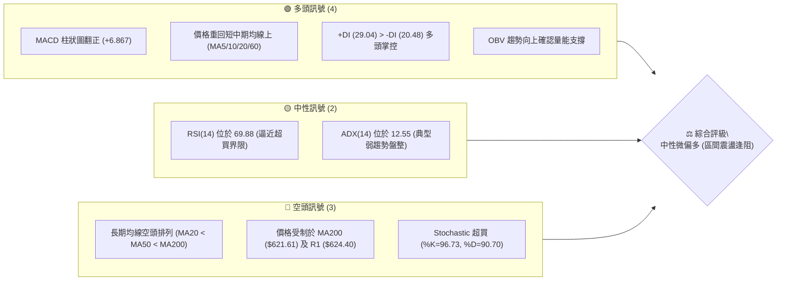
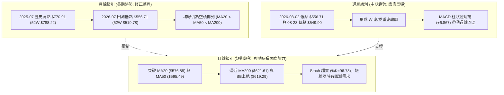
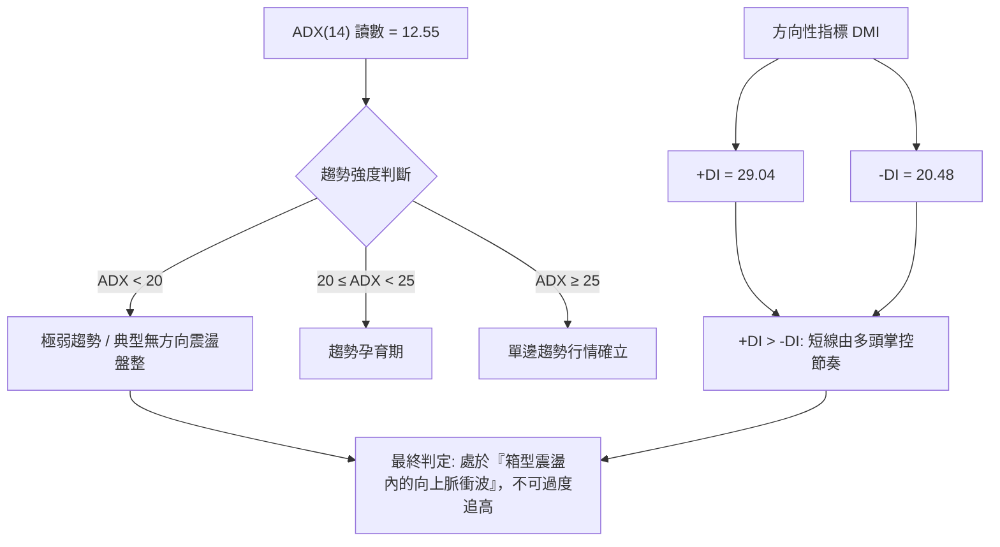
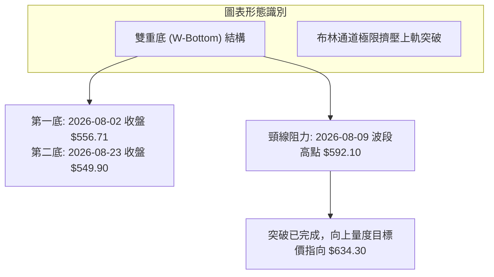
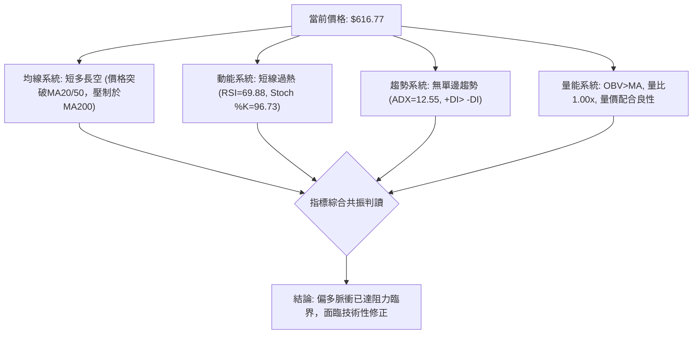
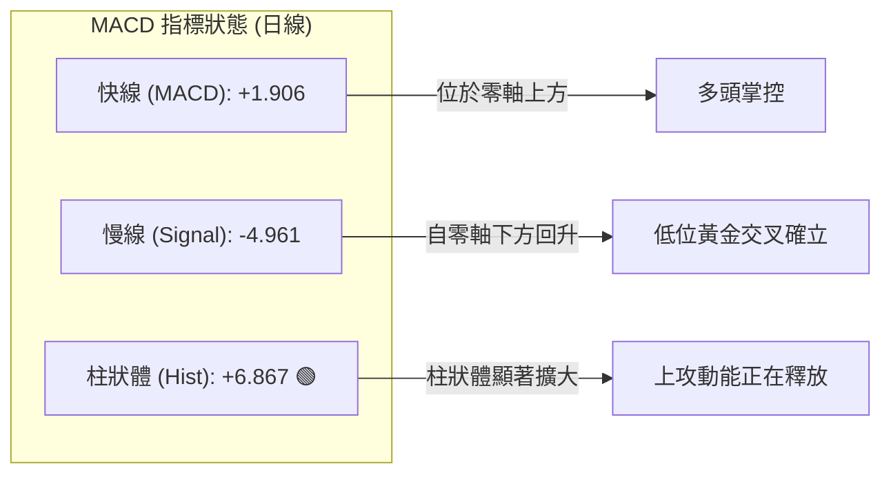
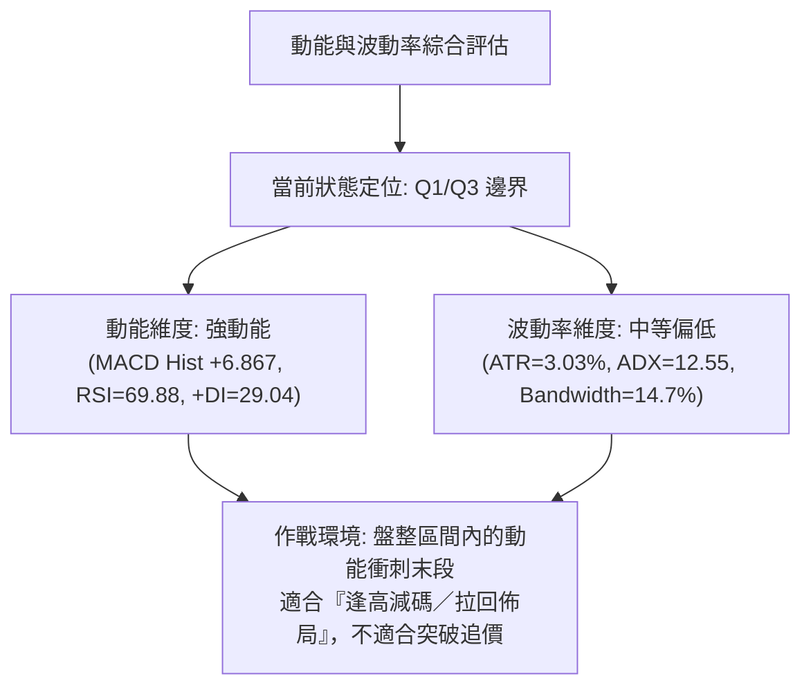
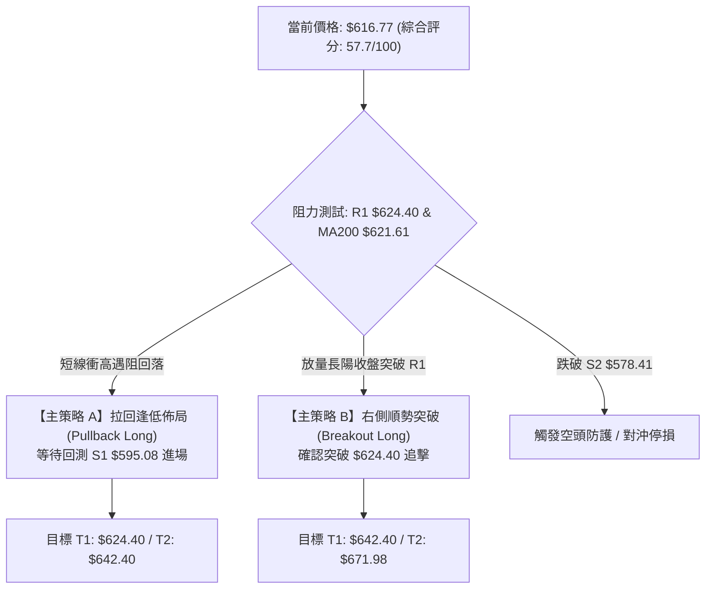
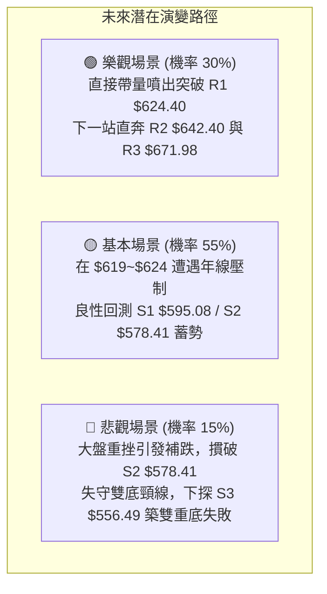

# META 技術分析報告

> **報告日期**：2026-09-07 ｜ **語言**：繁體中文 ｜ **數據來源**：Yahoo Finance ｜ **當前價格**：$616.77

---

## 目錄

| 章節 | 內容 |
|------|------|
| [1. 技術面概覽](#1-技術面概覽) | 訊號儀表板、核心指標、評分卡 |
| [2. 趨勢分析](#2-趨勢分析) | 多時框趨勢、長中短期走勢 |
| [3. 圖表形態分析](#3-圖表形態分析) | 形態識別、K線組合、目標價 |
| [4. 支撐與阻力](#4-支撐與阻力) | 關鍵價位、斐波那契回調 |
| [5. 技術指標深度解讀](#5-技術指標深度解讀) | MA/RSI/MACD/布林/成交量 |
| [6. 動能與波動率](#6-動能與波動率) | 動能評估、ATR、Beta |
| [7. 多時框架總結](#7-多時框架總結) | 時框架評分矩陣、收斂結論 |
| [8. 交易策略建議](#8-交易策略建議) | 策略路由、多空情境、風險報酬比 |
| [9. 風險提示與監控](#9-風險提示與監控) | 監控指標、風險場景、總結 |

---

## 1. 技術面概覽

### 🎯 技術訊號儀表板



### 📊 核心指標速覽表

| 指標類別 | 指標名稱 | 當前數值 | 訊號 | 解讀 |
|----------|----------|----------|------|------|
| **價格** | 當前收盤價 | $616.77 | 🟢 | 自 8 月低點強勁反彈，位於 52W 區間 36.1% 分位 |
| **均線** | MA20 | $576.88 | 🟢 | 現價高於 MA20 達 +6.91%，短多架構確立 |
| **均線** | MA50 | $595.49 | 🟢 | 現價高於 MA50 達 +3.57%，中期波段修復中 |
| **均線** | MA200 | $621.61 | 🔴 | 現價低於 MA200 (-0.78%)，長期牛熊分水嶺形成動態阻力 |
| **動能** | RSI(14) | 69.88 | 🟡 | 位於臨界值 70 邊緣，未出現背離但短線動能消耗偏快 |
| **動能** | MACD (12,26,9) | 1.906 / Hist +6.867 | 🟢 | 快慢線黃金交叉且正柱狀體放大，多頭動能充沛 |
| **動能** | Stoch %K / %D | 96.73 / 90.70 | 🔴 | 進入深度超買區（>80），短線存在鈍化或拉回壓力 |
| **趨勢** | ADX(14) | 12.55 | 🟡 | 數值遠低於 25，顯示當前非單邊趨勢，屬箱型盤整結構 |
| **通道** | 布林通道 %B | 0.97 | 🟡 | 緊貼布林上軌 ($619.29)，短線拓展空間受限 |
| **量能** | 成交量 / 20日均量 | 15.94M / 16.00M | 🟢 | 量比 1.00x，量能維持平穩，OBV 站上均線確認漲勢有效 |
| **波動** | ATR(14) | $18.70 (3.03%) | 🟡 | 波動度適中，提供單日清晰的停損與獲利邊界 |

### 🏆 技術評分卡

```
╔══════════════════════════════════════════════════════════════════════╗
║                    技術評分卡 — META (2026-09-07)                    ║
╠══════════════════════════════════════════════════════════════════════╣
║ 趨勢強度 (ADX=12.55, 盤整結構)    ████████░░░░░░░░░░░░  40/100 🟡   ║
║ 動能指標 (MACD強, RSI逼近70)      ██████████████░░░░░░  70/100 🟢   ║
║ 支撐穩定度 (S1 $595.08 支撐強固)  ██████████████░░░░░░  72/100 🟢   ║
║ 成交量配合 (OBV>MA, 量能健康)     ████████████░░░░░░░░  60/100 🟢   ║
║ 形態完整度 (雙重底結構初成)       ████████████░░░░░░░░  62/100 🟢   ║
║ 均線排列 (空頭排列但短均金叉)     ████████░░░░░░░░░░░░  42/100 🔴   ║
╠══════════════════════════════════════════════════════════════════════╣
║ 綜合技術評分                      ███████████░░░░░░░░░  57.7/100     ║
║ 最終技術評級：中性偏多 (Neutral-Bullish) — 箱型上緣震盪待突破        ║
╚══════════════════════════════════════════════════════════════════════╝
```

---

## 2. 趨勢分析

### 🌐 多時框趨勢分析



### 📈 長期趨勢 — 12個月走勢圖（Unicode）

```
META 月線收盤走勢圖（2025-10 至 2026-09）
價格軸 ($)
$750 ┤
$720 ┤                      ● $715.22 (2026-01)
$690 ┤
$660 ┤               ● $658.91
$630 ┤ ● $646.67                                  ● $631.92               ● $616.77 (現價)
$600 ┤        ● $646.27                     ● $647.03       ● $611.34
$570 ┤                                                             ● $563.29      ● $572.34
$540 ┤                                           ● $571.60              ● $556.71
     └─┬──────┬──────┬──────┬──────┬──────┬──────┬──────┬──────┬──────┬──────┬──────┬──
     10月   11月   12月   01月   02月   03月   04月   05月   06月   07月   08月   09月
     (2025)                                   (2026)
```

#### 走勢特徵分析表格

| 階段區間 | 起訖月份 | 價格變動 | 期間漲跌幅 | 結構特徵與技術解讀 |
|----------|----------|----------|------------|--------------------|
| **第一階段：高檔滑落** | 2025-07 ~ 2025-11 | $770.91 → $646.27 | -16.17% | 自 52 週高點 $788.22 展開估值修正，均線自多頭開始糾結鈍化 |
| **第二階段：年初反抽** | 2025-11 ~ 2026-01 | $646.27 → $715.22 | +10.67% | 確立 $715 附近中期次高點（Lower High），反彈成交量顯著萎縮 |
| **第三階段：破位下殺** | 2026-01 ~ 2026-07 | $715.22 → $556.71 | -22.16% | 連續跌破 MA50 與 MA200，均線形成死叉空頭排列，觸及波段深水區 |
| **第四階段：底部築基** | 2026-07 ~ 2026-09 | $556.71 → $616.77 | +10.79% | 於 52 週低點 $519.78 上方構成雙重支撐，短線放量強勢反彈 |

### 📊 中期趨勢（週線分析）

近 20 週數據顯示，META 呈現「箱體底部震盪築底」架構：
1. **底部防線**：2026-06-28 收盤 $550.25、2026-08-02 收盤 $556.71 及 2026-08-23 收盤 $549.90，三次在 $550~$556 區間探底回升，確立該處為機構主力堅實買盤區。
2. **反彈頸線阻力**：2026-07-12 曾反彈至 $669.21，隨後遭遇獲利了結賣壓回落；近期 2026-09-06 週線收在 $616.77，MACD 柱狀體擴大至 +6.867，RSI 回升至 69.9，顯示中期動能全面由空翻多。

### ⚡ 趨勢強度評估（ADX 解讀）



#### ADX 強度對照表

| 指標名稱 | 當前讀數 | 門檻區間 | 趨勢性質 | 策略指導意義 |
|----------|----------|----------|----------|--------------|
| **ADX(14)** | **12.55** | < 20.0 (極弱) | 盤整走勢 / 缺乏單邊趨勢 | 嚴禁採用單邊突破追價策略；以區間高拋低吸為主 |
| **+DI** | **29.04** | > 25.0 (強) | 多頭攻擊動能 | 短期買盤力道大於賣盤，支持反彈延續 |
| **-DI** | **20.48** | < 25.0 (弱) | 空頭壓制動能 | 空頭賣壓暫時衰退，暫無崩跌破底威脅 |

---

## 3. 圖表形態分析

### 🔍 形態識別系統



#### 形態信心度與目標價評估表

| 形態名稱 | 信心度 | 判斷依據（引用數據） | 完成度 | 目標價（附嚴格計算式） |
|----------|--------|----------------------|--------|------------------------|
| **雙重底 (W-Bottom)** | **75%** | 兩次低點分別為 2026-08-02 的 $556.71 與 2026-08-23 的 $549.90（符合波段支撐 S3 $556.49 聚類），中間反彈高點為 2026-08-09 的 $592.10。目前收盤 $616.77 已實質站上頸線。 | 85% (已突破頸線，正朝量度目標行進) | 頸線 $592.10 + 形態高度 ($592.10 - $549.90 = $42.20) = **$634.30**（恰好座落於 MA240 $633.82 及阻力 R2 $642.40 之間） |
| **布林上軌推升** | **65%** | 當前收盤價 $616.77 極度逼近布林通道上軌 $619.29 (%B=0.97)。 | 90% | 上軌動態目標即為當前阻力 R1 **$624.40** |
| **頭肩頂/底** | **20%** | 近期 20 週走勢鋸齒震盪，未呈現標準左右肩對稱幾何結構。 | 0% | *訊號不足，僅做指標型解讀，不預設立場* |

### 🕯️ 重要 K 線形態分析

| 週期/日期 | 收盤價 | K線形態 / 量價組合 | 技術面解讀 | 訊號 |
|-----------|--------|--------------------|------------|------|
| **2026-08-02 週** | $556.71 | 放量長黑破底後收長下影線 | 週量 112.11M，空方竭盡賣壓湧現，測試 52W 低點 $519.78 未破 | 🟡 止跌訊號 |
| **2026-08-23 週** | $549.90 | 次低點縮量十字星 / 探底針 | 週量 89.01M 顯著萎縮，形成雙底次腳，空頭無力再砸盤 | 🟢 築底確認 |
| **2026-08-30 週** | $578.02 | 中紅實體包覆線 (Bullish Harami Confirm) | MACD 柱翻正 (+1.912)，實體收復 MA20 ($576.88)，確認多方反攻 | 🟢 買訊確認 |
| **2026-09-06 週** | $616.77 | 長陽穿刺線 (突破 MA50) | 一舉越過 MA50 ($595.49)，直撲 MA200 ($621.61)，多方動能達高潮 | 🟢 強力看多 |

### 📉 ASCII 走勢形態示意圖

```
META 日線/週線 雙重底 (W-Bottom) 突破結構示意圖
價格 ($)
$642.40 ┤                                             [阻力 R2]
$634.30 ┤- - - - - - - - - - - - - - - - - - - - - - - - - - - - - - - - - - - - 🎯 雙底理論量度目標價
$624.40 ┤                                       ▲ [阻力 R1 / MA200 $621.61]
$616.77 ┤                                      ●◄═══ 現價位置 ($616.77, %B=0.97)
$592.10 ┤                   ▲ 頸線位 (08-09) ─ ─ ─ ─ ─ ─ ─ ─ ─ ─ ─ ─ ─ ─ ─ ─ ─ ─ ─ ─ ─ ─ ─ ─ ─
        ┤                  / \                 /
$575.00 ┤                 /   \               /
        ┤                /     \             /
$556.71 ┤  ● 底 1 (08-02)       \           /
$549.90 ┤                        ● 底 2 (08-23)
        └─────────────────────────────────────────────────────────────
         2026-08-02        2026-08-09      2026-08-23      2026-09-07
```

### 🎯 形態目標價計算

依據雙底形態標準測幅公式：
1. **頸線確認**：取 2026-08-09 週高點收盤價 **$592.10** 為反彈頸線。
2. **形態深度**：底部最低點為 2026-08-23 收盤價 **$549.90**。
   $$\text{形態高度 (H)} = \$592.10 - \$549.90 = \$42.20$$
3. **理論目標價**：
   $$\text{Target} = \text{頸線} + \text{形態高度} = \$592.10 + \$42.20 = \$634.30$$
   *驗證：此量度目標 $634.30 與日線 MA240 ($633.82) 幾乎重疊，並精確位於阻力位 R2 ($642.40) 下緣，具備高度技術共振效應。*

---

## 4. 支撐與阻力

### 🗺️ 關鍵價位分布圖（Unicode）

```
META 價位結構分布圖 (由 OHLCV 與歷史波段聚類精確計算)
══════════════════════════════════════════════════════════════════════
$671.98 ║████████████████████████████████████║ 強波段阻力 R3 (50%回調位 $654之上)
$642.40 ║████████████████████                ║ 中期阻力 R2 / 雙底量度區間 ($634~$642)
$624.40 ║████████████████████████            ║ 關鍵突破阻力 R1 (MA200 $621.61 / 61.8% $622.32)
$616.77 ╠════════════════════════════════════╣ ◄─── 現價 ($616.77)
$595.08 ║▓▓▓▓▓▓▓▓▓▓▓▓▓▓▓▓▓▓▓▓▓▓▓▓            ║ 近端關鍵支撐 S1 (MA50 $595.49 匯合)
$578.41 ║████████████████                    ║ 中期回撤防線 S2 (MA20 $576.88 / 78.6% $577.22)
$556.49 ║████████████████████████████████    ║ 鐵底強支撐 S3 (雙底頸下防線 08-02 低點)
══════════════════════════════════════════════════════════════════════
```

### 🚧 阻力位分析表

| 阻力級別 | 精確價位 | 形成原因與技術匯合 | 突破難度 | 重要性評級 |
|----------|----------|--------------------|----------|------------|
| **R1** | **$624.40** | 近一年波段高點聚類；與 **MA200 ($621.61)** 及 **斐波那契 61.8% 回調位 ($622.32)** 構成密集共振阻力帶（距離現價僅 +1.24%） | 高 | 🔴 極高 (牛熊轉換樞紐) |
| **R2** | **$642.40** | 2025-10/11 月盤整平台密集成交區；雙底量度目標 $634.30 延伸區間；與 MA240 ($633.82) 形成多重共振（距離現價 +4.16%） | 中 | 🟡 中度 (中期波段停利點) |
| **R3** | **$671.98** | 2026-04-26 波段頂點收盤聚類；跨越 50% 斐波那契位置 ($654.00) 後的籌碼真空區上限（距離現價 +8.95%） | 極高 | 🔴 高度 (長線趨勢反轉點) |

### 🛡️ 支撐位分析表

| 支撐級別 | 精確價位 | 形成原因與技術匯合 | 守住機率 | 重要性評級 |
|----------|----------|--------------------|----------|------------|
| **S1** | **$595.08** | 近一年波段低點聚類；與 **MA50 ($595.49)** 完全重合；突破雙底頸線 ($592.10) 後的回踩確認位（距離現價 -3.52%） | 75% | 🟢 極高 (短線多頭防守基準) |
| **S2** | **$578.41** | 密集成交支撐區；與 **MA20 ($576.88)**、布林中軌、**斐波那契 78.6% 回調位 ($577.22)** 完美共振（距離現價 -6.22%） | 85% | 🟢 高度 (中期多空分界線) |
| **S3** | **$556.49** | 近一年波段極限低點聚類；與 2026-08-02 收盤價 $556.71 吻合；52 週低點上方最後防線（距離現價 -9.77%） | 95% | 🟢 極高 (長線結構防線) |

### 📐 斐波那契回調位分析

*基準區間：52 週低點 $519.78 → 52 週高點 $788.22，全幅波段 $268.44。*

| 回調比例 | 精確價位 | 相對現價位置 | 技術意涵與籌碼解讀 |
|----------|----------|--------------|--------------------|
| **0.0% (52W High)** | **$788.22** | 上方 +27.79% | 歷史頂部壓力 |
| **23.6%** | **$724.87** | 上方 +17.53% | 極度強勢區（目前遠離） |
| **38.2%** | **$685.67** | 上方 +11.17% | 弱勢修正反彈極限，接近 R3 |
| **50.0%** | **$654.00** | 上方 +6.04% | 半數回撤分水嶺，心理大關 |
| **61.8%** | **$622.32** | 上方 +0.90% | **黃金分割關鍵阻力位（現價 $616.77 正處於此位正下方）** |
| **78.6%** | **$577.22** | 下方 -6.41% | 深度回撤支撐，與 MA20 ($576.88) 及 S2 ($578.41) 鎖定 |
| **100.0% (52W Low)**| **$519.78** | 下方 -15.72% | 週期大底部起漲點 |

**解讀**：現價 $616.77 正好夾在 **78.6% ($577.22)** 與 **61.8% ($622.32)** 之間。當前價格距離 61.8% 黃金分割阻力僅有 $5.55 (0.90%) 的空間，且該處正上方緊鄰 MA200 ($621.61) 與 R1 ($624.40)。若能以帶量中長陽有效實體收盤突破 $624.40，價格將打開通往 50% ($654.00) 的上升通道；否則將在 61.8% 處受阻回撤考驗 S1 ($595.08)。

---

## 5. 技術指標深度解讀

### 🎛️ 指標訊號總覽



### 📈 移動平均線排列分析

```mermaid
graph TD
    subgraph MA_SYSTEM ["均線多空位階排列"]
        M240["MA240: $633.82 (上方阻力)"]
        M200["MA200: $621.61 (年線生死線)"]
        PRICE["現價: $616.77 (穿越中短期均線)"]
        M120["MA120: $603.23 (翻揚支撐)"]
        M50["MA50:  $595.49 (中期扣抵翻揚)"]
        M5["MA5:   $594.24 (短期急攻線)"]
        M60["MA60:  $591.23 (季度成本線)"]
        M10["MA10:  $582.55 (短線護航線)"]
        M20["MA20:  $576.88 (月線生命線)"]
    end
    M240 --> M200
    M200 --> PRICE
    PRICE --> M120
    M120 --> M50
    M50 --> M5
    M5 --> M60
    M60 --> M10
    M10 --> M20
```



- **均線結構解讀**：原始排列為長線標準空頭排列（MA20 $576.88 < MA50 $595.49 < MA200 $621.61）。但近期短天期均線展現強勁爆發力：MA5 ($594.24, +3.79%) 與 MA10 ($582.55, +5.87%) 向上穿越 MA20，現價 $616.77 連續攻克 MA20、MA60 ($591.23)、MA50 及 MA120 ($603.23)。
- **當前挑戰**：前方僅剩 **MA200 ($621.61, -0.78%)** 與 **MA240 ($633.82, -2.69%)** 形成中長期巨大反壓。MA200 作為法人機構判定牛熊的終極分水嶺，初次測試通常難以一次直接貫穿，高機率在 $621~$624 出現解套與防守賣盤。

### 📉 RSI(14) 分析

- **當前讀數**：**69.88**
- **區間進度條**：
  ```
  超賣 [0] ░░░░░░░░░░ [30] ░░░░░░░░░░░░░░ [70] ▓▓▓▓▓▓▓▓▓█ [100] 超買
  RSI(14) = 69.88 (位於 69.88% 位置，緊貼 70 警戒線)
  ```
- **超買超賣判定**：數值精準貼合 70 超買門檻。自 2026-08-02 週的 22.9（超賣低谷）急速攀升至當前的 69.9，動能修復斜率極為陡峭。
- **背離判斷**：
  - **日線/週線比對**：2026-04-26 價格 $674.40 時 RSI 為 79.6；當前價格 $616.77，RSI 為 69.88。價格處於相對低位，RSI 亦處於相對低位，高點未破，**無頂背離現象**。
  - **底背離確認**：2026-08-02 價格 $556.71 (RSI 22.9)，隨後 2026-08-23 價格下探 $549.90 (收盤破前低)，但週線 RSI 卻逆勢上升至 31.3，形成標準的**「價格破底、指標不破底」之典型週線底背離**。當前波段的強勁大漲，正是對該底背離結構的有效技術兌現。

### 📊 MACD(12/26/9) 訊號解讀



- **數值狀態**：DIFF (1.906) 向上穿越 DEA (-4.961)，MACD 柱狀體為 **+6.867**。
- **動能解析**：柱狀體自 2026-08-02 的 -11.160 連續 5 週呈現「負值收斂並強烈轉正」，當前 +6.867 為過去 8 週以來最強多頭動能擴展值，代表短線主動性買盤力量非常集中。

### 📦 布林通道分析

```
META 布林通道示意圖 (日線參數 20, 2)
價格 ($)
$625 ┤
$619.29 ┤-------------------------------------- 🔴 布林上軌 (Upper Band)
$616.77 ┤  ● 現價位置 (%B = 0.97, 極度緊貼上軌)
$600 ┤
$576.88 ┤====================================== 🟡 布林中軌 (MA20 Baseline)
$550 ┤
$534.48 ┤-------------------------------------- 🟢 布林下軌 (Lower Band)
     └────────────────────────────────────────
```

- **布林數據**：
  - **上軌**：$619.29
  - **中軌 (MA20)**：$576.88
  - **下軌**：$534.48
  - **寬度 (Bandwidth)**：($619.29 - $534.48) / $576.88 = 14.69%
  - **%B 指標**：**0.97**
- **技術解讀**：%B 高達 0.97，表明股價幾乎完全貼合布林上軌運作。在 ADX 僅為 12.55 的盤整結構中，股價觸及或突破布林上軌往往意味著「區間超買竭盡」，而非「單邊暴漲開口」。因此，在沒有極度放大成交量的支撐下，$619~$624 區間極易引發均值回歸回測。

### 💹 成交量分析（量價配合度）

1. **成交量比率**：
   - 最新成交量：15,942,700 股
   - 20 日均量：16,004,435 股（量比 **1.00x**，量能完全平衡）
   - 50 日均量：18,027,518 股（量比 0.88x，處於微幅量縮狀態）
2. **OBV（能量潮）分析**：
   - 指標反饋「OBV > MA → 量能支撐上漲」。在 8 月末至 9 月初的推升過程中，OBV 穩步跨越其平均線，確認本輪由 $550 啟動的築底反彈並非虛假拉抬，籌碼具備沉澱吸籌特徵。
3. **量價背離檢驗**：
   - 最新週成交量為 81,413,200 股，相較於 2026-07-12 反彈高點時的 117,030,000 股減少約 30.4%，這意味著隨著股價叩關 MA200 重壓區，高檔追價意願開始遞減，出現微幅「價升量縮」的量價背離跡象，需嚴防衝高乏力後的技術性拉回。

---

## 6. 動能與波動率

### ⚡ 動能評估



#### 動能評估矩陣表

| 象限 | 動能強度 | 波動率水準 | 當前狀態標註 | 戰術應對評估 |
|------|----------|------------|--------------|--------------|
| **Q1 (最佳擴張)** | 強動能 (High) | 低/中波動 (Low-Mod) | **✓ 當前精準落點** | 短期多頭掌控局部利潤，逢高接近阻力需提防波動放大 |
| **Q2 (震盪沉寂)** | 弱動能 (Low) | 低波動 (Low) | - | 築底期特徵（如 8 月中旬），適合潛伏佈局 |
| **Q3 (極端狂暴)** | 強動能 (High) | 高波動 (High) | - | 單邊主升浪或恐慌主跌段，趨勢交易專區 |
| **Q4 (混亂洗盤)** | 弱動能 (Low) | 高波動 (High) | - | 假突破多發區，容易兩面受損，嚴禁介入 |

### 📊 ATR 波動率分析

- **ATR(14) 數值**：**$18.70**（佔現價比率為 **3.03%**）
- **單日波動幅度解讀**：每日平均振幅約在 $18.70 左右，顯示當前個股定價效率高，不存在失控的恐慌拋售或狂熱軋空。
- **風控參數與停損距離設計**：
  - **極短線交易（1.0 × ATR）**：保護性停損空間設為 **$18.70**
  - **波段擺盪交易（1.5 × ATR）**：標準停損空間設為 **$28.05**
  - **趨勢保護交易（2.0 × ATR）**：寬鬆結構防守設為 **$37.40**

### 📐 Beta 與市場相關性

- **Beta 係數**：**1.243**
- **市場敏感度解讀**：META 的系統性風險彈性大於 S&P 500 指數 24.3%。當標普指數上漲 1% 時，理論上 META 具備擴大上行 1.24% 的彈性；反之，大盤回檔時其下行壓力亦高於平均。目前機構持股高達 **79.1%**，空頭部位僅佔流通股 **1.3%**（Short Ratio 1.73），顯示機構籌碼穩定度極高，個股遭遇惡意放空砸盤的概率極微。

---

## 7. 多時框架總結

### 📋 時框架評分表

| 時框架 | 趨勢方向 | 動能狀態 | 均線排列 | 圖表形態 | 綜合評分 | 戰術建議 |
|--------|----------|----------|----------|----------|----------|----------|
| **長期 (月線)** | 偏空整理 🔴 | 減弱反彈 🟡 | 空頭排列 (MA20<50<200) 🔴 | 頂部回撤後大箱型底 🟡 | 45/100 | 嚴守價值防線，以長期估值逢低定投為主 |
| **中期 (週線)** | 築底回升 🟢 | 顯著轉強 🟢 | 糾結待交叉 🟡 | 雙重底 (W-Bottom) 突破 🟢 | 68/100 | 沿支撐逢低偏多操作，注意量度阻力區 |
| **短期 (日線)** | 強勁上攻 🟢 | 超買鈍化 🔴 | 短均多頭，逼近年線 🟡 | 緊貼布林上軌 (%B=0.97) 🟡 | 60/100 | 嚴禁盲目追價，等待回踩確認後低吸 |

### 🔲 綜合訊號矩陣

```
╔══════════════════════════════════════════════════════════════════════╗
║                     META 多維度技術訊號矩陣                          ║
╠══════════════════╦══════════════╦════════════════════════════════════╣
║ 分析維度         ║ 狀態/方向    ║ 技術細節與數據驗證                 ║
╠══════════════════╬══════════════╬════════════════════════════════════╣
║ 趨勢維度 (ADX)   ║ 🟡 盤整震盪  ║ ADX=12.55，不具備單邊持續發散條件  ║
║ 短期動能 (RSI)   ║ 🟡 接近超買  ║ RSI=69.88，直逼 70 警戒大關        ║
║ 擺盪指標 (Stoch) ║ 🔴 極度超買  ║ %K=96.73, %D=90.70，技術鈍化拉回高 ║
║ 中期動能 (MACD)  ║ 🟢 柱體擴張  ║ Hist=+6.867，底背離修復動能充沛    ║
║ 通道位置 (BB)    ║ 🟡 上軌壓制  ║ 現價貼著上軌 $619.29，擴張難度大   ║
║ 均線空間 (MA200) ║ 🔴 強力反壓  ║ 年線 $621.61 封鎖上方短期續攻空間  ║
║ 量能支撐 (OBV)   ║ 🟢 量價配合  ║ OBV > MA，主力被動吸籌未撤退       ║
╚══════════════════╩══════════════╩════════════════════════════════════╝
```

### ⚖️ 多時框收斂結論

依據多時框收斂原則與市場結構判定：
1. **行情性質判定**：當前 ADX(14) 為 **12.55**，數值遠小於 25，明確判定目前處於**「非趨勢性之箱型盤整行情」**。
2. **時框優先級權重**：在此環境下，主導定價機制為**「日線布林通道上下軌寬度」**與**「關鍵波段支撐/阻力聚類」**，不可盲目按日線 MACD 爆發而採取單邊多頭追高突破策略。
3. **唯一方向性結論**：**【中性偏多但短線嚴禁追高，策略以「逢高遇阻減碼、拉回支撐做多」為核心方針】**。
   - 日線雖呈強勁反彈，但同時面臨日線布林上軌 ($619.29)、年線 MA200 ($621.61)、斐波那契 61.8% ($622.32) 及波段阻力 R1 ($624.40) 的**四重共振強阻力牆**。
   - 因此，綜合技術評分落於 **57.7/100**（中性區間 40–60 偏高檔）。交易重心必須擺在「等待拉回關鍵支撐 S1 ($595.08) 或回測雙底頸線時低吸」，而非在阻力牆前貿然追進。

---

## 8. 交易策略建議

### 🗺️ 策略決策流程圖



### 🧭 策略路由（依評分卡分流）

> **當前主策略方向 = 【中性區間偏多操作：逢低吸納為主，阻力突破確認為輔】（依評分 57.7/100）**

綜合技術評分 57.7 位於 40–60 之間的中性向多過渡區間，且 ADX 僅 12.55。因此，本報告**主推以布林通道與結構支撐為核心的區間低吸策略（策略 A）**，次選為**帶量突破年線後的順勢加碼策略（策略 B）**。

### 🎯 價格情境階梯（Price Scenarios）

所有價位均嚴格引用第 4 章由 OHLCV 與斐波那契計算之數值：

| 觸發條件 | 第一目標 | 後續延伸 | 情境技術含義與市場行為 |
|----------|----------|----------|------------------------|
| **帶量實體突破 R1 $624.40** | **R2 $642.40** | **R3 $671.98** | 扭轉年線空頭排列，雙底形態目標完整兌現，短線轉為強勢主升浪 |
| **受阻於 $619~$624 震盪** | **S1 $595.08** | **S2 $578.41** | 年線解套盤與短線獲利盤湧現，消化布林上軌超買，屬健康回踩 |
| **帶量跌破 S1 $595.08** | **S2 $578.41** | **S3 $556.49** | 失守 MA50 與雙底頸線，反彈宣告夭折，重新下探考驗大底部箱底 |

### 📊 情境機率分佈

| 情境劇本 | 機率估算 | 核心指標支持依據 |
|----------|----------|------------------|
| **情境一：衝高遇阻後良性回撤震盪 (高位整理)** | **55%** | **ADX=12.55** 顯示趨勢動能不足以支持直噴式暴漲；**Stoch %K=96.73** 極度超買；**布林 %B=0.97** 壓制股價；上方緊扣 **MA200 ($621.61)**。 |
| **情境二：直接放量強勢向上突破** | **30%** | **MACD Hist=+6.867** 多頭動能充沛；**OBV > MA** 顯示主力籌碼支撐良好；**+DI (29.04)** 壓制空方。 |
| **情境三：反轉深度回落、再度破底探底** | **15%** | 機構持股達 79.1%，空頭比例極低 (1.3%)；S1 ($595.08) 與 S2 ($578.41) 具備均線高度防守共振，機率極低。 |

### 🟢 主策略詳情

本報告擬定兩套具體執行策略，投資人可依風險偏好選擇：

| 策略要素 | 策略 A：穩健低吸策略 (主推) | 策略 B：激進突破策略 (次選) |
|----------|-----------------------------|-----------------------------|
| **策略類型** | 逢高遇阻後回踩支撐進場 | 帶量站穩年線與關鍵阻力後追價 |
| **進場條件** | 股價自 $620 附近回撤，在 S1 附近出現止跌訊號 | 日線實體收盤明確收在 R1 $624.40 之上且成交量放大 |
| **進場價格** | **$595.08** (精確掛單於 S1 / MA50 支撐) | **$625.00** (突破 R1 $624.40 後確認價) |
| **目標價 T1** | **$624.40** (波段阻力 R1 / MA200 共振區) | **$642.40** (波段阻力 R2 / 雙底量度目標延伸) |
| **目標價 T2** | **$642.40** (波段阻力 R2) | **$671.98** (波段阻力 R3) |
| **止損價格** | **$576.80** (跌破 MA20 $576.88 及 S2 $578.41) | **$606.30** (以進場點減 1.0×ATR $18.70 設防) |
| **風險空間** | $595.08 - $576.80 = $18.28 (約 1.0×ATR) | $625.00 - $606.30 = $18.70 (精確 1.0×ATR) |
| **獲利空間(T1)**| $624.40 - $595.08 = $29.32 | $642.40 - $625.00 = $17.40 |
| **獲利空間(T2)**| $642.40 - $595.08 = $47.32 | $671.98 - $625.00 = $46.98 |
| **風險報酬比 (R/R)**| **1 : 1.60 (至 T1) / 1 : 2.59 (至 T2)** | **1 : 0.93 (至 T1) / 1 : 2.51 (至 T2)** |
| **估計勝率** | **65%** | **50%** |
| **建議配置倉位** | **15% ~ 20%** 總投資資金 | **10%** 總投資資金 |

### 🔴 反向風險觸發點（對沖與撤退提示）

1. **多頭全面棄守線**：若股價無預警帶量跌破 **S2 ($578.41)** 與 **MA20 ($576.88)**，代表雙底形態完全失效，短期反彈浪潮結束，應無條件執行所有多單停損離場。
2. **極端空頭觸發點**：若進一步擊穿 **S3 ($556.49)**，股價將重測 52 週低點 **$519.78**，機構投資人應即刻建立 Put Option 或反向 ETF 進行現貨避險對沖。

### ⭐ 整體訊號強度評星

```
做多訊號強度：★★★☆☆  (3.5/5星 — 短線動能強但面臨年線重壓，拉回買進為佳)
做空訊號強度：★★☆☆☆  (2.0/5星 — 缺乏空頭量能配合，目前不宜逆勢放空)
整體可信度：  ★★★★☆  (4.0/5星 — 關鍵價位與均線共振度高，區間輪廓清晰)
```

---

## 9. 風險提示與監控

### ✅ 關鍵監控指標 Checklist

```
╔══════════════════════════════════════════════════════════════════════╗
║                   META 交易執行關鍵監控清單                          ║
╠══════════════════════════════════════════════════════════════════════╣
║ [ ] 監控 MA200 ($621.61) 與 R1 ($624.40) 的觸及反應（是否留長上影） ║
║ [ ] 觀察日線 RSI(14) 是否在突破 70 後形成「頂背離」衰竭訊號         ║
║ [ ] 檢視每日成交量是否突破 18.00M（50日均量），確認突破為真突破      ║
║ [ ] 追蹤日線布林通道是否開始「向上喇叭口開口」，提供續漲空間        ║
║ [ ] 緊盯支撐 S1 ($595.08) 的回踩防守力度，確認頸線由阻力成功轉支撐  ║
║ [ ] 留意大盤 Beta 連動性（當前 Beta 1.243，大盤回檔恐放大個股跌幅） ║
╚══════════════════════════════════════════════════════════════════════╝
```

### ⚠️ 風險場景分析



### 🛡️ 風險管理重要提醒

1. **嚴禁阻力區過度追高**：現價 $616.77 距離 R1 $624.40 僅剩 1.24% 的緩衝空間，而下方至 S1 支撐則有 3.52% 的距離。在目前阻力重重的位置直接開大倉位追多，其風險報酬比極不對稱（盈虧比小於 1:0.5）。
2. **嚴格執行 ATR 停損紀律**：META 單日 ATR 高達 $18.70，操作時務必將每筆交易的總虧損金額嚴格限制在總資產的 **1.0% ~ 1.5%** 以內。切勿因基本面華爾街 57 位分析師高達 $754.77 的目標價而放任短線技術破位不管。
3. **區間操作主動停利**：由於 ADX 僅 12.55，盤整行情中「利潤往往來得快去得也快」。多單部位一旦反彈觸及目標價 R2 ($642.40)，強烈建議採取**分批獲利了結 50% 倉位**，並將剩餘部位的停損價上調至成本價保本，確保利潤入袋。

---

## 📋 報告總結

```
╔══════════════════════════════════════════════════════════════════════╗
║                     META 技術分析報告總結                            ║
╠══════════════════════════════════════════════════════════════════════╣
║ 報告日期：2026-09-07                                                 ║
║ 當前價格：$616.77                                                    ║
║ 分析評級：⚖️ 中性偏多 (Neutral-Bullish / 逢回低吸，不追高)           ║
║ 綜合技術評分：57.7 / 100                                             ║
╠══════════════════════════════════════════════════════════════════════╣
║ 核心多空關鍵結論：                                                  ║
║ ├─ 長期趨勢 (月線)：🔴 均線空頭排列，但自 52W 低點反彈修復中        ║
║ ├─ 中期趨勢 (週線)：🟢 雙底突破 ($549.90/$556.71)，MACD 柱轉正     ║
║ ├─ 短期趨勢 (日線)：🟢 突破短期均線，但緊貼布林上軌面臨超買壓制     ║
║ ├─ 關鍵核心阻力：R1 $624.40 (年線 MA200 $621.61 共振)               ║
║ ├─ 關鍵核心支撐：S1 $595.08 (MA50 $595.49 / 頸線共振)               ║
║ └─ 華爾街共識目標：$754.77 (相較現價仍有 +22.37% 溢價空間)          ║
╠══════════════════════════════════════════════════════════════════════╣
║ 最優策略配置組合：                                                   ║
║ 1. 🥇 最佳機會 (穩健波段)：耐心等待股價回踩 S1 $595.08 止跌掛單進場， ║
║    嚴格停損設於 $576.80，目標上看 $624.40 與 $642.40 (R/R=1:2.59)。   ║
║ 2. 🥈 次選機會 (順勢突破)：若以長陽收盤突破 R1 $624.40，則於 $625.00  ║
║    右側輕倉追進，停損設於 $606.30，目標看 $642.40 與 $671.98。      ║
║ 3. 🥉 保守選擇 (觀望對沖)：當前阻力區不作任何新開倉動作，現有多單持  ║
║    有者可於 $619~$624 分批部分停利，鎖定利潤。                       ║
╚══════════════════════════════════════════════════════════════════════╝
```

---

> ⚠️ **免責聲明**：本報告為技術分析研究，所有數據及推算均基於歷史價格與技術指標資訊。本報告**僅供學術研究與參考**，**不構成任何形式的投資建議或要約**。金融市場具有高度風險，投資人應獨立評估風險並自負盈虧。

---

*報告生成時間：2026-09-07 ｜ 數據來源：Yahoo Finance ｜ 分析框架：資深多時框量化技術分析*