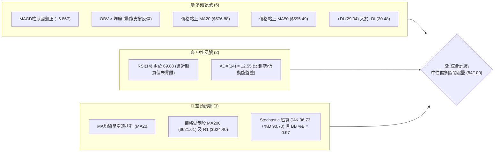
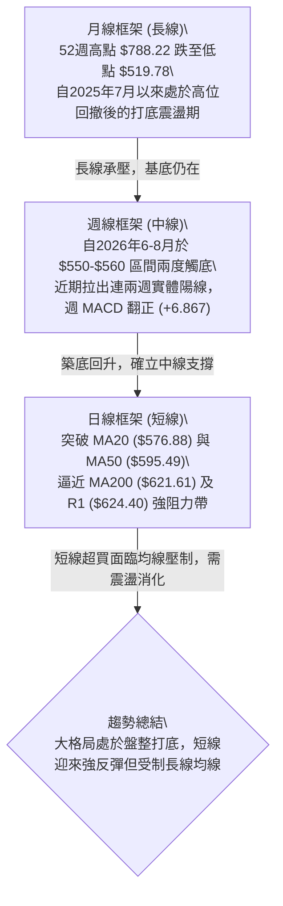
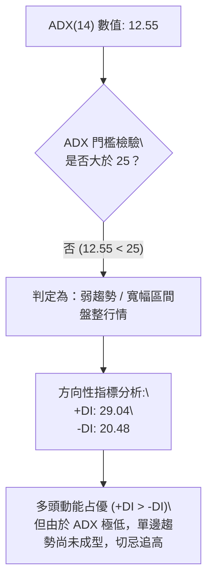
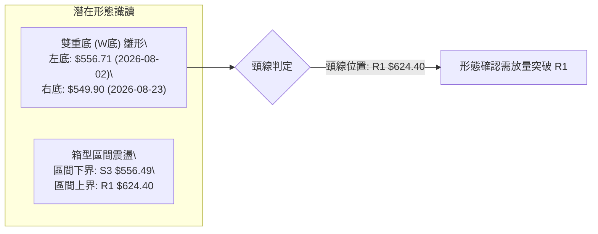
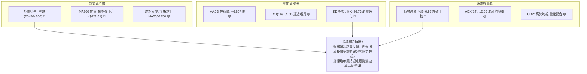
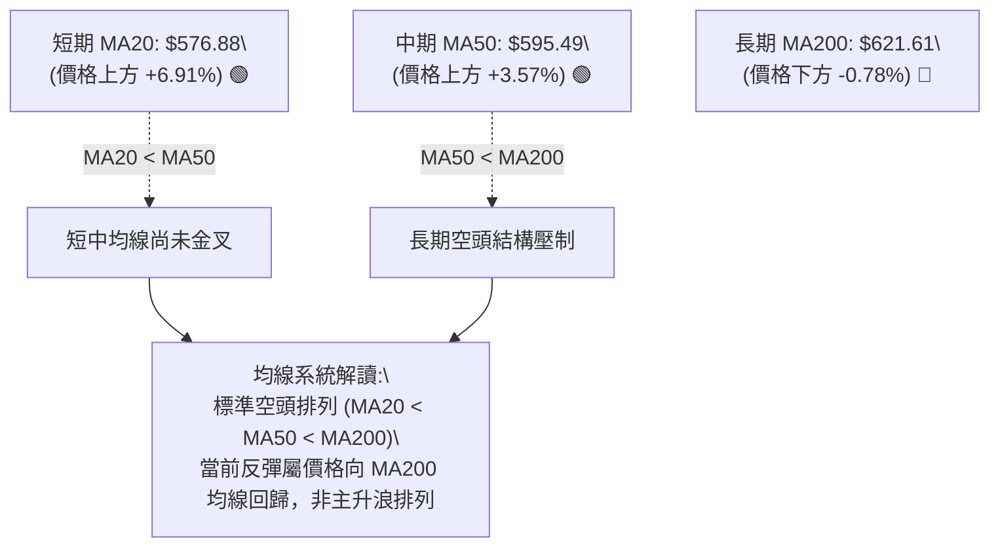
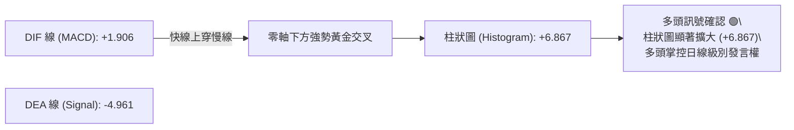
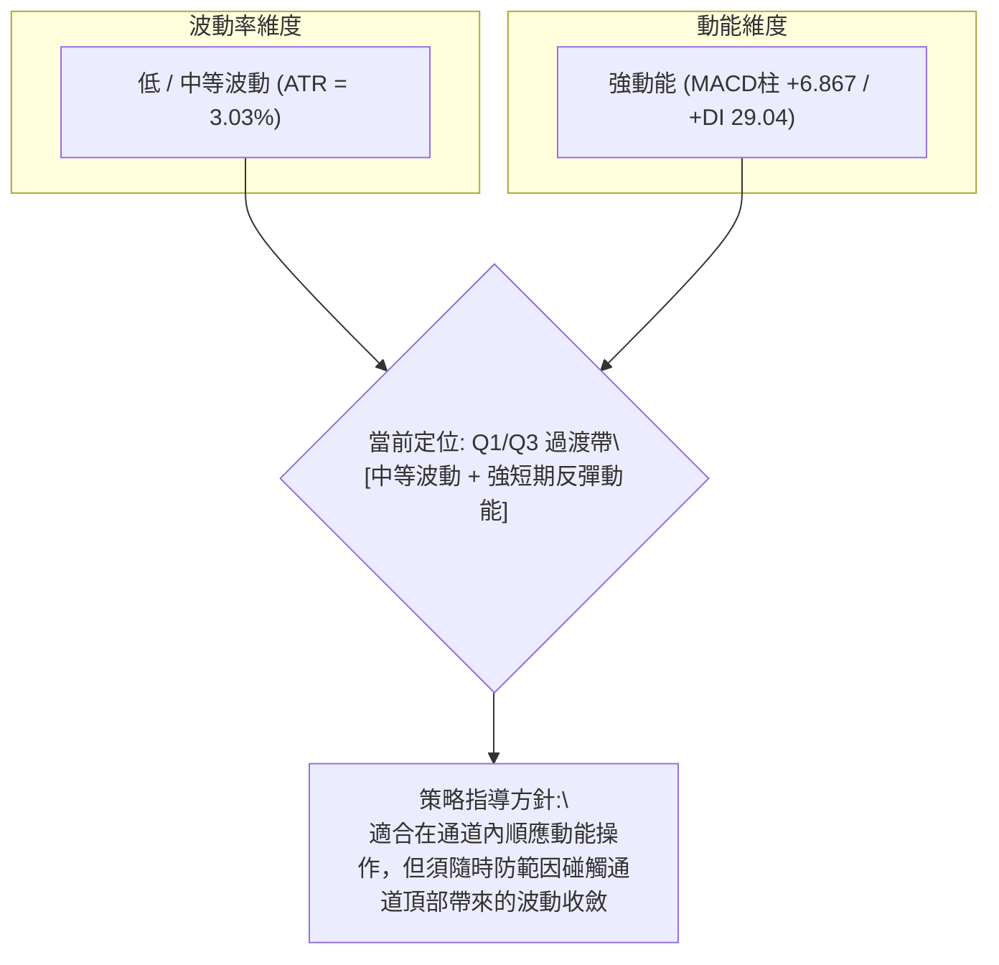
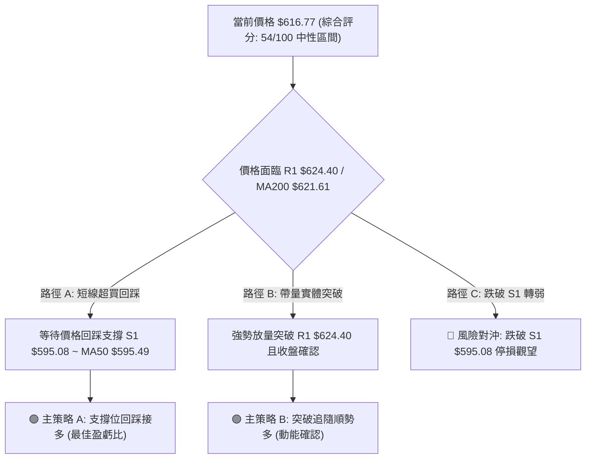
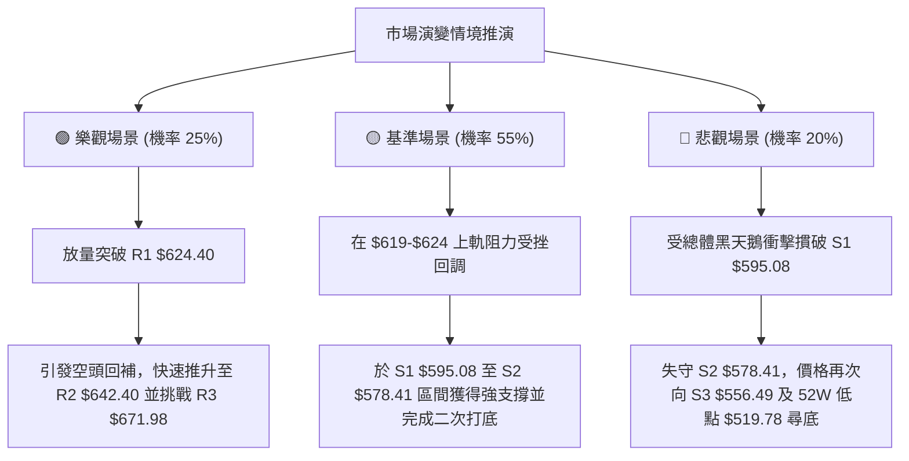

# META 技術分析報告

> **報告日期**：2026-09-08 ｜ **語言**：繁體中文 ｜ **數據來源**：Yahoo Finance ｜ **當前價格**：$616.77

---

## 目錄

| 章節 | 內容 |
|------|------|
| [1. 技術面概覽](#1-技術面概覽) | 訊號儀表板、核心指標、評分卡 |
| [2. 趨勢分析](#2-趨勢分析) | 多時框趨勢、長中短期走勢、ADX解讀 |
| [3. 圖表形態分析](#3-圖表形態分析) | 形態識別、K線組合、目標價推算 |
| [4. 支撐與阻力](#4-支撐與阻力) | 關鍵價位、斐波那契回調結構 |
| [5. 技術指標深度解讀](#5-技術指標深度解讀) | MA/RSI/MACD/布林/成交量/OBV |
| [6. 動能與波動率](#6-動能與波動率) | 動能四象限、ATR、Beta相關性 |
| [7. 多時框架總結](#7-多時框架總結) | 時框架評分矩陣、多時框收斂 |
| [8. 交易策略建議](#8-交易策略建議) | 策略路由、主策略、情境階梯 |
| [9. 風險提示與監控](#9-風險提示與監控) | 監控指標、風險場景、部位管理 |

---

## 1. 技術面概覽

### 🎯 技術訊號儀表板



### 📊 核心指標速覽表

| 指標類別 | 指標名稱 | 當前數值 | 訊號 | 解讀 |
|----------|----------|----------|------|------|
| **價格** | 當前價格 | $616.77 | 🟡 | 位於52週區間36.1%，處於中期築底反彈階段 |
| **均線** | MA20 | $576.88 | 🟢 | 價格在MA20上方+6.91%，短線支撐強勁 |
| **均線** | MA50 | $595.49 | 🟢 | 價格突破MA50+3.57%，短多動能增強 |
| **均線** | MA200 | $621.61 | 🔴 | 價格仍受制於MA200下方-0.78%，長線結構仍為壓力 |
| **均線排列** | 均線系統 | 20 < 50 < 200 | 🔴 | 大格局均線呈空頭排列，反彈屬中級整理性質 |
| **動能** | RSI(14) | 69.88 | 🟡 | 逼近70超買門檻，未見背離但短線空間有限 |
| **動能** | MACD(12,26,9) | 1.906 / -4.961 | 🟢 | 快線上穿慢線，柱狀圖+6.867，動能偏多 |
| **動能** | KD指標 | %K 96.73 / %D 90.70 | 🔴 | 嚴重超買，短線隨時面臨獲利回吐與技術修正 |
| **趨勢強度** | ADX(14) | 12.55 | 🟡 | ADX < 25，市場處於無明確單邊趨勢之寬幅盤整 |
| **通道指標** | 布林通道 | %B = 0.97 | 🔴 | 價格貼近上軌 $619.29，通道面臨阻力壓制 |
| **波動** | ATR(14) | $18.70 | 🟡 | 日波動率 3.03%，波動中等，風控寬度適中 |
| **量能** | OBV走勢 | OBV > MA | 🟢 | 成交量配合價格上推，主力資金短線回流 |

### 🏆 技術評分卡

```
╔══════════════════════════════════════════════════════════════╗
║                技術評分卡 — META (2026-09-08)                ║
╠══════════════════════════════════════════════════════════════╣
║ 趨勢強度 (ADX=12.55)     ████░░░░░░░░░░░░░░░░  25/100  🔴 盤整弱勢 ║
║ 動能指標 (MACD/RSI/KD)   █████████████░░░░░░░  65/100  🟢 短線偏多 ║
║ 支撐穩定度 (S1/S2/S3)    ██████████████░░░░░░  70/100  🟢 底部紮實 ║
║ 成交量配合 (OBV/均量比)  ████████████░░░░░░░░  60/100  🟢 量價相符 ║
║ 形態完整度 (雙重底雛形)  ███████████░░░░░░░░░  55/100  🟡 尚待突破 ║
║ 均線系統 (20<50<200)     ████████░░░░░░░░░░░░  40/100  🔴 長均蓋頂 ║
╠══════════════════════════════════════════════════════════════╣
║ 綜合評分                 ███████████░░░░░░░░░  54/100  🟡 區間震盪 ║
╚══════════════════════════════════════════════════════════════╝
```

---

## 2. 趨勢分析

### 🌐 多時框趨勢分析



### 📈 長期趨勢 — 12個月走勢圖（Unicode）

```
META 月線走勢圖（過去12個月：2025-10 至 2026-09）
價格軸 ($)
$750 ┤
$720 ┤                               ●(01月高點: 715.22)
$690 ┤
$660 ┤               ●(12月: 658.91)     ●(02月: 647.03)
$630 ┤ ●(10月: 646.67)                          ●(05月: 631.92)
$600 ┤     ●(11月: 646.27)                         ●(04月: 611.34) ●(09月現價: 616.77)
$570 ┤                               ●(03月: 571.60)           ●(08月: 572.34)
$540 ┤                                                 ●(06月: 563.29)
$510 ┤                                                     ●(07月: 556.71)
     └─────────────────────────────────────────────────────────────────────────────
       10  11  12  01  02  03  04  05  06  07  08  09 (月份: 2025/10 - 2026/09)
```

#### 走勢特徵分析表格

| 階段 | 時間跨度 | 起訖價位 | 漲跌幅 | 走勢特徵與結構意涵 |
|------|----------|----------|--------|-------------------|
| 第1階段：高檔震盪 | 2025/10 - 2026/01 | $646.67 → $715.22 | +10.60% | 創下波段反彈次高點 $715.22，隨後高檔換手無力 |
| 第2階段：波段回撤 | 2026/01 - 2026/03 | $715.22 → $571.60 | -20.08% | 空頭摜破多道短期均線，呈現快速下殺取量 |
| 第3階段：技術反彈 | 2026/03 - 2026/05 | $571.60 → $631.92 | +10.55% | 遇技術買盤回抽，受制於 $630-$640 密集套牢帶 |
| 第4階段：二次探底 | 2026/05 - 2026/07 | $631.92 → $556.71 | -11.90% | 創近半年收盤新低 $556.71，測試52W低點區間支撐 |
| 第5階段：築底回升 | 2026/07 - 2026/09 | $556.71 → $616.77 | +10.79% | 量能溫和放大，連兩月收紅，目前回測 $620 關鍵頸線 |

### 📊 中期趨勢（週線分析）

從近20週數據觀察，META 在 2026年6月至8月間形成了一個寬幅的箱型震盪底部。特別是 2026-08-02 週收盤 $556.71 與 2026-08-23 週收盤 $549.90，兩次下探均獲得強勁承接買盤介入，隨後在 2026-08-30（$578.02）與 2026-09-06（$616.77）連續兩週拉出強勢反彈長陽線，週成交量分別達到 85.4M 與 81.4M，MACD 柱狀圖由 -4.226 快速拉升至 +1.912 與 +6.867，確立了中期反彈走勢。

```
近期週線支撐與壓力拓撲結構：
  [上檔重壓帶] R2: $642.40 / R1: $624.40 / MA200: $621.61
      ▲
      │  [當前價格 $616.77 — 逼近密集壓力區]
      ▼
  [下檔強支撐] S1: $595.08 / S2: $578.41 / S3: $556.49
```

### ⚡ 趨勢強度評估（ADX 解讀）



#### ADX 強度對照表

| ADX 區間 | 趨勢強度定義 | 當前 META 狀態 | 交易指導方針 |
|----------|--------------|----------------|--------------|
| 0 – 20 | 極弱 / 無趨勢盤整 | **12.55 (當前位置)** | 嚴禁採用突破追價策略；以區間高拋低吸為主 |
| 20 – 25 | 趨勢醞釀中 | 否 | 密切觀察均線收斂與通道擠壓 |
| 25 – 40 | 明確強趨勢 | 否 | 順勢交易，回調均線加碼 |
| 40 – 60 | 極強趨勢 | 否 | 趨勢進入主升/主跌段 |
| 60 – 100 | 超強/即將耗竭 | 否 | 提防趨勢反轉力道 |

---

## 3. 圖表形態分析

### 🔍 形態識別系統



#### 形態信心度與目標價評估表

| 形態類別 | 信心度 | 判斷依據（引用技術數據） | 完成度 | 目標價（附嚴謹計算式） |
|----------|--------|--------------------------|--------|------------------------|
| **雙重底 (W-Bottom)** | **65%** | 兩次低點於 2026-08-02 收盤 $556.71 與 2026-08-23 收盤 $549.90，相應於支撐位 S3 $556.49 附近獲支撐 | 85% | 頸線取 R1 $624.40，形態深度 = 624.40 - 549.90 = $74.50。<br>理論最小目標價 = 頸線 $624.40 + $74.50 = **$698.90** |
| **矩形箱型整理** | **80%** | 近半年價格在支撐 S3 $556.49 與阻力 R1 $624.40 之間高頻震盪，ADX=12.55 驗證箱型盤整特性 | 90% | 箱型突破目標 = 區間頂部 $624.40 + (624.40 - 556.49) = 624.40 + 67.91 = **$692.31** |
| **頭肩底形態** | 30% | 數據中左肩與右肩不對稱，中間無顯著下沉頭部，訊號不足 | 20% | *數據不足以支撐，僅做指標型解讀，不預設目標價* |

### 🕯️ 重要K線形態分析

| 週/月週期 | 收盤價 | K線形態 | 解讀 | 訊號強度 |
|-----------|--------|---------|------|----------|
| 2026-08-02 | $556.71 | 長黑下探錘子線 | RSI 驟降至 22.9 嚴重超賣，恐慌盤湧出後引發下影線長承接 | 🟢 底背離孕育 |
| 2026-08-23 | $549.90 | 次級打底星線 | 跌破前低但未放量下殺，量能縮至 89.0M，構成技術性二次低點 | 🟢 測試支撐成功 |
| 2026-08-30 | $578.02 | 穿頭破腳中陽線 | 週線收盤突破 MA20，MACD 翻紅至 +1.912，多頭奪回發言權 | 🟢 強勢反轉訊號 |
| 2026-09-06 | $616.77 | 光頭大陽線 | 實體陽線直接貫通 MA50 ($595.49)，直逼布林上軌與 MA200 | 🟡 短多動能耗竭隱憂 |

### 📉 ASCII 走勢形態示意圖

```
META 中期雙重底 (W-Bottom) 結構演變圖
價格 ($)
$642.40 ┤                                                      [阻力 R2]
$624.40 ┤                   ┌─── 頸線水平 (Neckline) ───┐      [阻力 R1]
$616.77 ┤                   │                           ▲ 當前價 $616.77 (受制頸線)
$595.08 ┤       ●───────────┼───────────●               │      [支撐 S1 / MA50]
$578.41 ┤      / \          │          / \              │      [支撐 S2 / MA20]
$556.49 ┤     /   \         │         /   \             │      [支撐 S3]
$549.90 ┤    ●     \       /         ●     \           /
        └────┴──────┴──────┴─────────┴──────┴─────────┴────────────
           左底 (2026-08-02)        右底 (2026-08-23)
           收盤: $556.71            收盤: $549.90
```

### 🎯 形態目標價計算

雙底形態的有效性取決於能否放量實體收過頸線 R1 $624.40：
1. **頸線確認值**：$624.40（阻力 R1）
2. **底部基準值**：$549.90（2026-08-23 波段最低收盤價）
3. **形態垂直高度**：$624.40 - $549.90 = $74.50
4. **測幅目標價計算**：
   - 第一階段等幅測量目標 = 頸線 + 垂直高度 = $624.40 + $74.50 = **$698.90**（與斐波那契 38.2% 回調位 $685.67 及阻力 R3 $671.98 構成密集目標區間）。
   - 保守箱型目標 = 頸線 $624.40 + ($624.40 - $556.49) = **$692.31**。

---

## 4. 支撐與阻力

### 🗺️ 關鍵價位分布圖（Unicode）

```
META 價位結構分布圖
═══════════════════════════════════════════════════════════════
$671.98 ║████████████████████████║ 強阻力 R3 (近一年波段高點聚類)
$654.00 ║░░░░░░░░░░░░░░░░░░░░░░░░║ 斐波那契 50.0% 回調位
$642.40 ║████████████████████    ║ 阻力 R2 (反彈次高套牢區)
$624.40 ║████████████████████████║ 關鍵阻力 R1 (W底頸線 / 短線多空分水嶺)
$622.32 ║────────────────────────║ 斐波那契 61.8% 黃金分割位
$621.61 ║════════════════════════║ 長期均線 MA200 壓制線
$616.77 ╠════════════════════════╣ ◄ 當前價格現價
$595.49 ║────────────────────────║ 中期均線 MA50 支撐
$595.08 ║▓▓▓▓▓▓▓▓▓▓▓▓▓▓▓▓        ║ 近期支撐 S1 (突破之平台高點)
$578.41 ║████████████████████    ║ 強支撐 S2 (波段密集成交支撐)
$576.88 ║────────────────────────║ 短期均線 MA20 / 布林中軌
$556.49 ║████████████████████████║ 關鍵防守 S3 (雙重底極限支撐)
$519.78 ║████████████████████████║ 52週最低價 (100.0% 斐波那契位)
═══════════════════════════════════════════════════════════════
```

### 🚧 阻力位分析表

所有價位精確引用波段高點聚類與技術均線：

| 阻力級別 | 價位 | 形成原因 | 突破難度 | 重要性 |
|----------|------|----------|----------|--------|
| **R1** | **$624.40** | 近一年波段高點聚類，疊加 61.8% 斐波那契位 ($622.32) 與 MA200 ($621.61) | 極高 | ★★★★★<br>多空生命線 |
| **R2** | **$642.40** | 2026年5月與2026年7月反彈平台次高點，大量被套籌碼密集區 | 高 | ★★★★☆<br>波段目標 |
| **R3** | **$671.98** | 2026年4月下旬起跌點高點聚類，接近週線反彈前高 | 中高 | ★★★☆☆<br>多頭主升目標 |

### 🛡️ 支撐位分析表

所有價位精確引用波段低點聚類與均線支撐：

| 支撐級別 | 價位 | 形成原因 | 守住機率 | 重要性 |
|----------|------|----------|----------|--------|
| **S1** | **$595.08** | 近一年波段低點聚類，與當前向上運行的 MA50 ($595.49) 高度重合 | 75% | ★★★★☆<br>短線防守第一線 |
| **S2** | **$578.41** | 2026年8月底反彈發動點，緊鄰 MA20 ($576.88) 與斐波那契 78.6% ($577.22) | 85% | ★★★★★<br>中線趨勢支撐 |
| **S3** | **$556.49** | 2026年8月初前低收盤價聚類，雙底形態底部防線 | 95% | ★★★★★<br>多頭最後底線 |

### 📐 斐波那契回調位分析

依據 52 週極值區間（低點 $519.78 → 高點 $788.22，垂直價差 $268.44）計算之標準黃金分割位：

| 斐波那契回調比率 | 精確價位 | 技術位解讀與當前關聯 |
|------------------|----------|----------------------|
| **0.0% (52W High)** | **$788.22** | 2025年歷史高位壓力區 |
| **23.6%** | **$724.87** | 長期深次回調的第一道壓力 |
| **38.2%** | **$685.67** | 雙底突破測幅極限目標帶 |
| **50.0%** | **$654.00** | 區間多空強弱均衡中軸線 |
| **61.8%** | **$622.32** | **黃金分割關鍵阻力（當前價格 $616.77 正處於此位下方-0.90%）** |
| **78.6%** | **$577.22** | 強力回撤支撐帶（緊扣 MA20 $576.88 與支撐 S2 $578.41） |
| **100.0% (52W Low)**| **$519.78** | 52週波段低點，長期戰略底線 |

**解讀**：現價 $616.77 運行於 **78.6% ($577.22)** 與 **61.8% ($622.32)** 之間。61.8% 回調位 ($622.32) 與 MA200 ($621.61) 及 R1 ($624.40) 形成了極為狹窄且密集的「三重共振阻力帶」（$621.61 – $624.40）。短線若無法帶量突破此共振帶，走勢將回撤尋求 S1 ($595.08) 之支撐。

---

## 5. 技術指標深度解讀

### 🎛️ 指標訊號總覽



### 📈 移動平均線排列分析



#### 均線各週期參數與現價相對位置

| 均線名稱 | 數值 | 現價差距 ($) | 現價差距 (%) | 走勢微型圖標 | 訊號解讀 |
|----------|------|--------------|--------------|--------------|----------|
| MA 5 | $594.24 | +$22.53 | +3.79% | █▇▆▅▄▃▃▃▅▆ | 🟢 超短線極強，斜率向上 |
| MA 10 | $582.55 | +$34.22 | +5.87% | ██▇▅▄▄▃▃▃▃ | 🟢 短線多頭排列形成 |
| MA 20 | $576.88 | +$39.89 | +6.91% | ██████▇▇▇▆ | 🟢 月線級別支撐強烈 |
| MA 50 | $595.49 | +$21.28 | +3.57% | 系統計算中 | 🟢 突破季線防線 |
| MA 60 | $591.23 | +$25.54 | +4.32% | ████▇▇▇▇▇▆ | 🟢 突破中期生命線 |
| MA 120 | $603.23 | +$13.54 | +2.24% | ███▇▇▇▆▆▆▆ | 🟢 半年線已被踩在腳下 |
| MA 200 | $621.61 | -$4.84 | -0.78% | 系統計算中 | 🔴 年線壓力近在咫尺 |
| MA 240 | $633.82 | -$17.05 | -2.69% | ████▇▇▇▆▆▆ | 🔴 密集持倉籌碼壓力線 |

### 📉 RSI(14) 分析

當前 RSI(14) 數值為 **69.88**，極度逼近 70 的技術超買閾值：
- **超買超賣狀態**：
  ```
  RSI(14): 69.88
  [0] ─────────────── [30] ──────────────────── [70] ────── [100]
  超賣區                  中性區                  ▲ 超買區
                                                 (69.88)
  進度條：██████████████░░░░░░ 69.88%
  ```
- **背離分析判斷**：
  - 週線視角：2026-08-02 低點 $556.71 時 RSI 為 22.9；2026-08-23 次低點 $549.90 時 RSI 為 31.3。**價格創新低而 RSI 抬高，呈現經典的「週線級別底背離」**，這也是驅動近期從 $550 強彈至 $616 的底層動能。
  - 日線視角：當前 RSI 達到 69.88，暫**無頂背離跡象**（未有連續兩次高點動能衰減），但指標進入 70 附近鈍化區，顯示買盤動能已充分釋放，追價勝率顯著降低。

### 📊 MACD(12/26/9) 訊號解讀



MACD 指標在低位發出強烈的反彈訊號。快線 DIF 自負值區間強勢拉升至 +1.906，慢線 DEA 處於 -4.961，兩者相差形成高達 +6.867 的正柱狀圖。此數值顯示短線向上反撲的力量極強，但由於快慢線整體仍剛脫離零軸下方不久，屬於「反彈擴展型」走勢，在未突破零軸並持續站穩前，尚不可輕易視為長期多頭主升浪。

### 📦 布林通道分析

```
META 布林通道 (20, 2) 價位拓撲圖
$619.29 ┤═════════════════════════════ 上軌 (BB Upper)
$616.77 ┤  ● 當前價格 ($616.77, %B = 0.97) ◄ 緊貼上軌
$600.00 ┤
$576.88 ┤───────────────────────────── 中軌 (MA20 / BB Middle)
$550.00 ┤
$534.48 ┤═════════════════════════════ 下軌 (BB Lower)
```

- **軌道狀態**：上軌位於 $619.29，中軌（MA20）位於 $576.88，下軌位於 $534.48，帶寬為 $84.81。
- **%B 指標分析**：當前 %B 達到 **0.97**（極度接近 1.0 上軌邊界），且 KD 指標同步在 %K 96.73 高位超買。布林通道未見向上開口發散跡象，價格連續推擠上軌將引發均值回歸效應，短線回踩中軌 $576.88 或 S1 $595.08 的概率極高。

### 💹 成交量分析（量價配合度）

1. **量能比較**：
   - 最新成交量：15,942,700 股
   - 20日均量：16,004,435 股（量比：**1.00x**，量價持平）
   - 50日均量：18,027,518 股
2. **OBV (能量潮) 走勢解讀**：
   - 當前「OBV > MA」，表明資金在 $550–$580 區間有主力建倉痕跡，能量潮線持續向上穿越其均線，代表量能有效支撐這波反彈。
   - 隱憂在於：雖然 OBV 表現正面，但日成交量未能放大超越 50 日均量（僅 15.9M vs 18.0M），屬於「平量上漲」。在面臨 MA200 關鍵年線壓力時，若無放大至 20M 以上的攻擊量，容易在 R1 $624.40 遭遇套牢盤壓制。

---

## 6. 動能與波動率

### ⚡ 動能評估四象限



#### 動能評估矩陣

| 象限 | 動能維度 | 波動維度 | 當前狀態 | 交易環境評估與對策 |
|------|----------|----------|----------|-------------------|
| **Q1 (最佳擴展區)** | 強動能 | 低波動 | **✓ (符合當前)** | 趨勢穩步推進，回撤幅度可控，最適合高拋低吸之波段交易 |
| **Q2 (盤整觀望區)** | 弱動能 | 低波動 | - | 沉悶磨底，觀望為主 |
| **Q3 (高風險博弈區)** | 強動能 | 高波動 | - | 單邊噴發或崩跌，需放大止損 |
| **Q4 (防禦撤退區)** | 弱動能 | 高波動 | - | 無序混亂，容易反覆停損 |

### 📊 ATR 波動率分析

- **ATR(14) 絕對值**：**$18.70**
- **ATR 相對價格比**：**3.03%**
- **止損與風控參數設定**：
  - **保守止損距（1.5 倍 ATR）**：$18.70 × 1.5 = **$28.05**。以現價 $616.77 計算，保守回撤點為 $588.72（緊扣 S1 支撐帶）。
  - **激進止損距（1.0 倍 ATR）**：$18.70 × 1.0 = **$18.70**。短線止損位為 $598.07（保護於 MA50 之上）。
  - **波動率解讀**：當前 3.03% 的日波動率處於科技巨頭的常態分位數，未出現恐慌性擴大，有利於限價單布局與嚴格停損控制。

### 📐 Beta 與市場相關性

- **Beta 係數**：**1.243**
- **市場特徵分析**：META 相較於標普 500 指數具備 1.24 倍的彈性。在美股大盤反彈或科技板塊（QQQ/SPY）偏多時，META 的向上 Beta 彈性較高；反之，一旦大盤遭遇系統性拋售，META 的回調壓力將比大盤高出約 24%。這要求交易者在大盤處於弱勢時必須壓低倉位。

---

## 7. 多時框架總結

### 📋 時框架評分表

| 時框架 | 趨勢方向 | 動能狀態 | 均線排列 | 形態結構 | 綜合評分 | 操作建議 |
|--------|----------|----------|----------|----------|----------|----------|
| **月線 (長期)** | 🟡 震盪整理 | 🟡 中性平滑 | 🔴 遠離高位均線 | 大箱型中繼 | 45/100 | 長期分批建倉，不追高 |
| **週線 (中期)** | 🟢 震盪築底 | 🟢 底背離轉強 | 🔴 承壓於MA60 | 雙底雛形 | 58/100 | 回踩支撐逢低吸納 |
| **日線 (短期)** | 🟢 短線多頭 | 🔴 極度超買 | 🟡 站上MA20/50 | 抵達通道上軌 | 55/100 | 短線面臨回調，停止追多 |

### 🔲 綜合訊號矩陣

```
時框訊號一致性檢視矩陣：
┌──────────┬──────────┬──────────┬──────────┬──────────┐
│   維度   │ 日線訊號 │ 週線訊號 │ 月線訊號 │ 全局收斂 │
├──────────┼──────────┼──────────┼──────────┼──────────┤
│ 趨勢方向 │   偏多   │   築底   │   中性   │ 區間偏多 │
│ 動能強度 │ 嚴重超買 │ 多頭翻正 │   減速   │ 衝高乏力 │
│ 均線架構 │ 均線反抽 │ 下跌放緩 │ 處下半場 │ 長空短多 │
│ 量能配合 │ 平量推進 │ 溫和放大 │   萎縮   │ 量能勉強 │
└──────────┴──────────┴──────────┴──────────┴──────────┘
```

### ⚖️ 多時框收斂結論

依據多時框收斂規則（規則 14）：
1. **趨勢類型判定**：當前 **ADX(14) = 12.55（遠低於 25）**，明確界定當前市場為**「低動能盤整行情」**而非單邊趨勢行情。
2. **主導維度確立**：在盤整行情中，不可採用單邊長線均線作為主攻依據，必須以**日線布林通道（上軌 $619.29 / 下軌 $534.48）與波段支撐阻力結構（R1 $624.40 / S1 $595.08）作為主要交易區間**。
3. **方向性收斂**：日線雖然因 MACD 金叉而短多凌厲，但 KD=96.73、%B=0.97 顯示短線買盤過熱，且直接撞上 MA200 ($621.61) 及 R1 ($624.40)。因此收斂出**唯一結論**：**【中性觀望，區間震盪操作】**。當前價格 $616.77 不具備突破追多盈虧比，主策略必須等待回調支撐後再行切入，嚴禁在 $616–$624 阻力帶盲目追價。

---

## 8. 交易策略建議

### 🗺️ 策略決策流程圖



### 🧭 策略路由

**當前主策略方向 = 【中性偏多，區間操作：逢回調做多】（依評分卡 54/100）**
依據評分卡 54 分定位於中性區間（40–60 分），市場處於寬幅箱型整理。因此主策略採用**「回調支撐布局多單」**，次選為**「突破 R1 追隨多單」**；空頭策略則僅列為反向風險觸發與風控防守點。

### 🎯 價格情境階梯（Price Scenarios）

價位嚴格引用關鍵技術位數據：

| 觸發條件 | 第一目標 | 第二目標 | 情境含義與操作指引 |
|----------|----------|----------|-------------------|
| **強勢突破 R1 $624.40** | R2 $642.40 | R3 $671.98 | W底形態頸線確認突破，中期多頭目標打開，順勢加碼 |
| **受阻於現價區間 ($616-$624)** | S1 $595.08 | S2 $578.41 | 短線超買正常技術性回踩，測試 MA50 支撐，耐心等買點 |
| **失守 S1 $595.08** | S2 $578.41 | S3 $556.49 | 反彈節奏遭到破壞，回撤考驗布林中軌 MA20 與底部防線 |

### 📊 情境機率分佈

| 情境劇本 | 機率 | 主要依據 |
|----------|------|----------|
| **劇本一：先回踩後上攻 (震盪偏多)** | **55%** | KD 極度超買 (%K 96.73)、布林上軌壓制 (%B 0.97) 引發短調，但 MACD 柱狀圖翻正且 OBV 支撐，S1 買盤強烈 |
| **劇本二：直接強勢放量突破 R1** | **25%** | 週線底背離爆發，若伴隨大盤科技板塊暴衝，可直接越過 MA200 $621.61 |
| **劇本三：回調轉深破位探底** | **20%** | 大格局仍屬 20<50<200 空頭排列，若大盤重挫導致 S1 $595.08 跌破，將再探 S3 $556.49 |

### 🟢 主策略詳情

所有進出場、停損及目標價位均基於第 4 章關鍵價位區塊計算：

| 策略要素 | 策略 A（回調低吸型 — 主推） | 策略 B（動能突破型 — 次選） |
|----------|----------------------------|----------------------------|
| **進場條件** | 價格回調至 S1 附近出現止跌K線（如15分K/1小時K下影線） | 日K線收盤價放量實體突破阻力 R1 $624.40 |
| **進場價格** | **$595.08** (S1 支撐位) | **$624.40** (R1 突破點確認) |
| **目標價 T1** | **$624.40** (阻力 R1，波段獲利了結一半) | **$642.40** (阻力 R2) |
| **目標價 T2** | **$642.40** (阻力 R2，剩餘部位兌現) | **$671.98** (阻力 R3 / 形態測幅目標) |
| **止損價格** | **$578.41** (支撐 S2 下方，容忍1倍ATR) | **$616.77** (現價 / 假突破止損防線) |
| **風險報酬比** | **1 : 2.84**<br>*(風險: $16.67，目標T2報酬: $47.32)* | **1 : 2.37**<br>*(風險: $7.63，目標T1報酬: $18.00)* |
| **成功機率** | **65%** | **50%** |
| **建議倉位** | **15% - 20%**（底倉分批介入） | **10%**（突破確認後右側追進） |

### 🔴 反向風險觸發點（對沖提示）

- **多頭結構推翻點**：若日K線以實體長黑摜破 **S1 $595.08**，則短線反彈節奏宣告終結，主策略多單必須無條件離場。
- **波段轉空確認點**：若價格連續收盤低於 **S2 $578.41**（MA20 生命線），確立反彈為弱勢均線反抽，走勢將重新回踩 52W 低點區間，此時投資人應考慮反向建立空頭避險倉位或深度減持現貨。

### ⭐ 整體訊號強度評星

```
╔════════════════════════════════════════════════════╗
║ 做多訊號強度：★★★☆☆  (3.0/5星 — 短線受阻，宜回調再買) ║
║ 做空訊號強度：★★☆☆☆  (2.0/5星 — 週線底背離，下行空間有限) ║
║ 整體可信度：  ★★★★☆  (4.0/5星 — 關鍵價位群聚，界線分明) ║
╚════════════════════════════════════════════════════╝
```

---

## 9. 風險提示與監控

### ✅ 關鍵監控指標 Checklist

```
╔══════════════════════════════════════════════════════════════╗
║                每日技術監控 Checklist (風控儀表板)           ║
╠══════════════════════════════════════════════════════════════╣
║ [ ] 價格能否有效站上 MA200 ($621.61) 與 R1 ($624.40)         ║
║ [ ] 日成交量是否放大至 18,000,000 股以上 (超越 50 日均量)      ║
║ [ ] Stochastic (%K/%D) 是否從 90+ 鈍化區死叉回落             ║
║ [ ] RSI(14) 遇 70 超買阻力是否形成頂背離                     ║
║ [ ] 回調時支撐位 S1 ($595.08) 是否能收出長下影線             ║
║ [ ] ADX(14) 是否由 12.55 開始拐頭向上超越 20 (趨勢啟動訊號)   ║
╚══════════════════════════════════════════════════════════════╝
```

### ⚠️ 風險場景分析



### 🛡️ 風險管理重要提醒

1. **拒絕於布林上軌追高**：當前布林通道 %B 達 0.97，隨時可能產生技術回調，任何多頭倉位嚴禁於現價 $616.77 至 R1 $624.40 之間進行大額市價市價追買。
2. **嚴格執行 ATR 止損機制**：若採用策略 A 於 S1 $595.08 進場，止損位必須嚴守 S2 $578.41，最大虧損限制於 1.0 倍 ATR（約 $18.70），絕不向下攤平。
3. **倉位配置上限限制**：在 ADX < 25 且大均線呈空頭排列（20<50<200）環境下，個股操作總部位不宜超過投資組合總資金的 20%，避免系統性波動侵蝕本金。

---

## 📋 報告總結

```
╔══════════════════════════════════════════════════════════════╗
║                  META 技術分析報告總結                       ║
╠══════════════════════════════════════════════════════════════╣
║ 報告日期：2026-09-08                                         ║
║ 當前價格：$616.77                                            ║
║ 分析評級：⚖️ 中性觀望 / 區間偏多 (綜合評分: 54/100)           ║
║                                                              ║
║ 關鍵結論：                                                   ║
║ ├─ 長期趨勢：🔴 空頭排列 (MA20<MA50<MA200)，年線 $621.61 蓋頂║
║ ├─ 中期趨勢：🟢 築底反彈 (週線底背離，MACD 翻紅至 +6.867)     ║
║ ├─ 短期趨勢：🟡 嚴重超買 (KD>90, %B=0.97)，上檔空間受限      ║
║ ├─ 關鍵支撐：S1: $595.08  /  S2: $578.41  /  S3: $556.49     ║
║ ├─ 關鍵阻力：R1: $624.40  /  R2: $642.40  /  R3: $671.98     ║
║ └─ 華爾街共識目標：$754.77 (分析師評級: Strong Buy)          ║
║                                                              ║
║ 最優策略組合：                                               ║
║ 1. 🥇 最佳機會：等待價格拉回 S1 $595.08 逢低做多，目標 R1/R2  ║
║ 2. 🥈 次選機會：強勢實體收破 R1 $624.40 追隨進場，目標 R2/R3  ║
║ 3. 🥉 保守選擇：空倉觀望，等待日線 KD 指標降至 50 中軸再擇機 ║
╚══════════════════════════════════════════════════════════════╝
```

---

> ⚠️ **免責聲明**：本報告為技術分析研究，所有數據及推算均基於歷史量價資訊。本報告**僅供研究與學術參考**，**不構成任何投資買賣建議**。金融市場具有高風險，投資人應自行審慎評估風險承受能力並承擔交易結果。

---

*報告生成時間：2026-09-08 ｜ 數據來源：Yahoo Finance ｜ 分析框架：多時框技術分析體系*