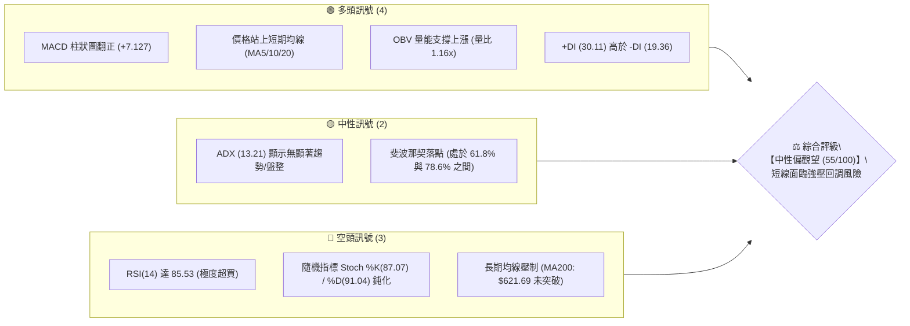
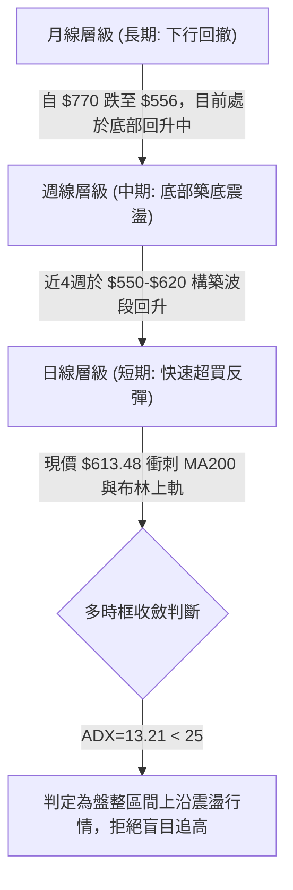
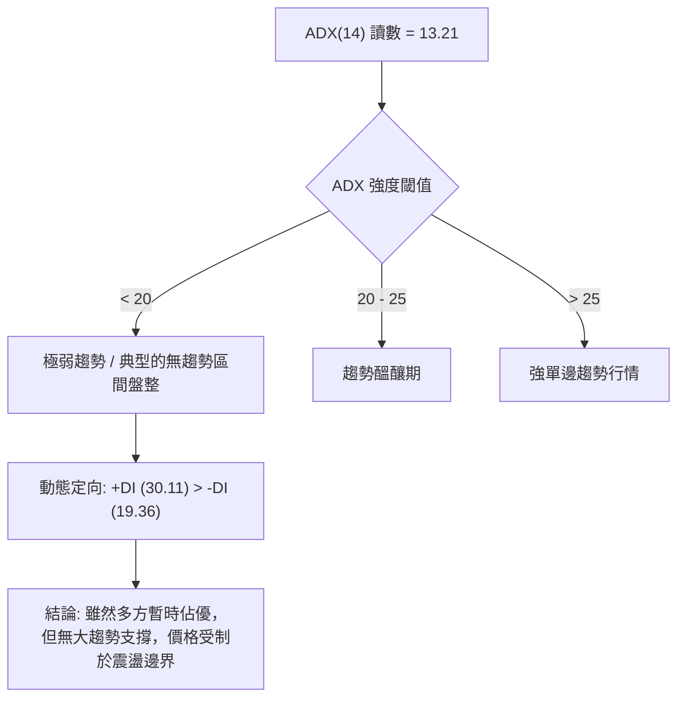
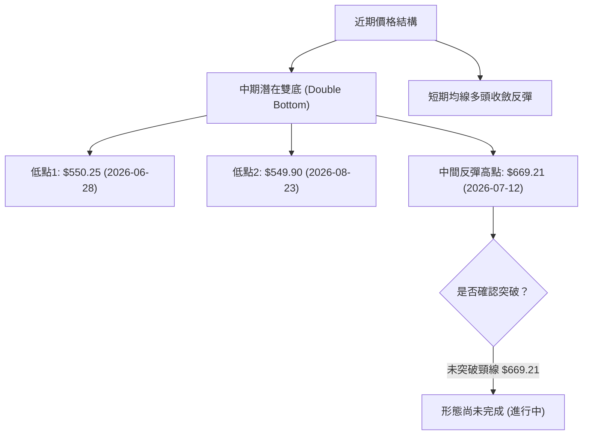
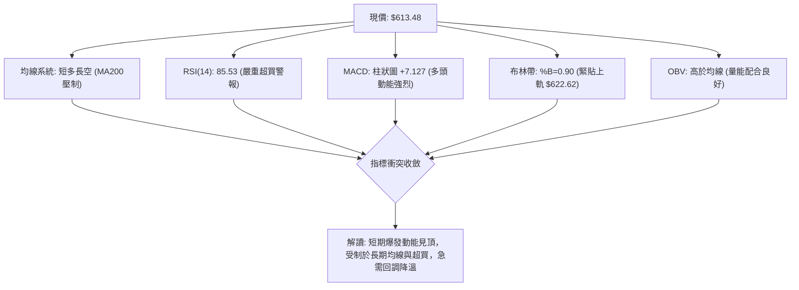
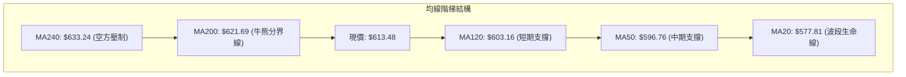
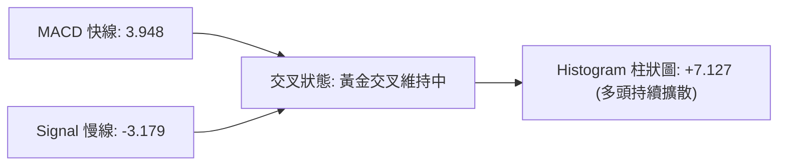
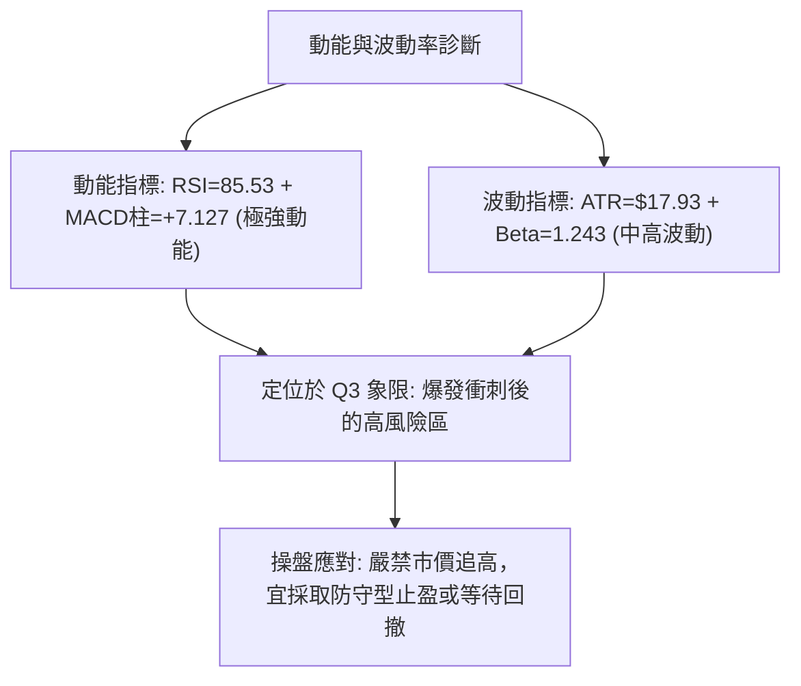
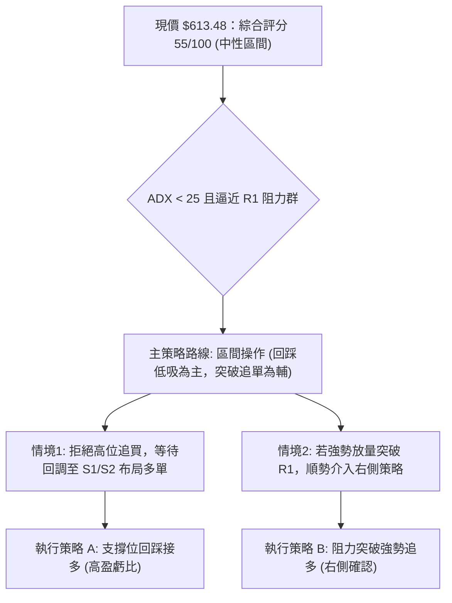
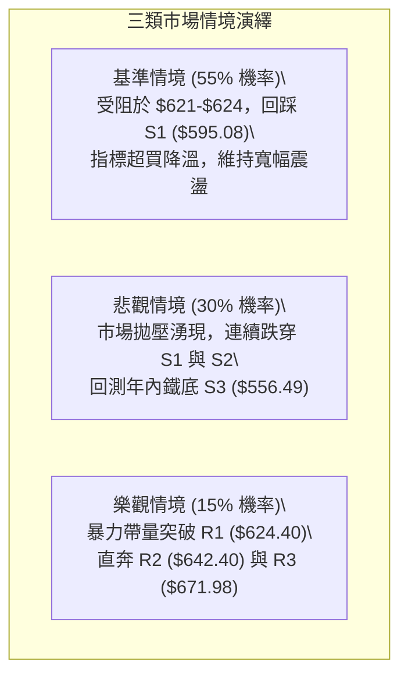

# META 技術分析報告

> **報告日期**：2026-09-09 ｜ **語言**：繁體中文 ｜ **數據來源**：Yahoo Finance ｜ **當前價格**：$613.48

---

## 目錄

| 章節 | 內容 |
|------|------|
| [1. 技術面概覽](#1-技術面概覽) | 訊號儀表板、核心指標、評分卡 |
| [2. 趨勢分析](#2-趨勢分析) | 多時框趨勢、長中短期走勢、ADX解讀 |
| [3. 圖表形態分析](#3-圖表形態分析) | 形態識別、K線組合、形態信心度 |
| [4. 支撐與阻力](#4-支撐與阻力) | 關鍵價位分布、斐波那契回調結構 |
| [5. 技術指標深度解讀](#5-技術指標深度解讀) | 均線系統、RSI背離、MACD、布林通道、OBV |
| [6. 動能與波動率](#6-動能與波動率) | 動能四象限、ATR波動分析、Beta屬性 |
| [7. 多時框架總結](#7-多時框架總結) | 時框架評分矩陣、收斂規則驗證 |
| [8. 交易策略建議](#8-交易策略建議) | 策略路由、情境階梯、精確交易參數 |
| [9. 風險提示與監控](#9-風險提示與監控) | 關鍵監控清單、情境推演、風控指引 |

---

## 1. 技術面概覽

### 🎯 技術訊號儀表板



---

### 📊 核心指標速覽表

| 指標類別 | 指標名稱 | 當前數值 | 訊號 | 專業解讀 |
| :--- | :--- | :--- | :---: | :--- |
| **價格** | 當前價格 | $613.48 | 🟡 | 位於52週區間34.9%分位，自底部反彈但逼近重壓區 |
| **均線** | MA20 | $577.81 | 🟢 | 現價高於MA20達+6.17%，短期底層均線支撐確立 |
| **均線** | MA50 | $596.76 | 🟢 | 現價突破中天期均線，短多波段成立 |
| **均線** | MA200 | $621.69 | 🔴 | 現價位於MA200下方-1.32%，長期牛熊分界線構成直接阻力 |
| **動能** | RSI(14) | 85.53 | 🔴 | 嚴重進入超買警戒區（>70），短線追高動能衰竭風險大 |
| **動能** | MACD (12,26,9) | 3.948 | 🟢 | 快線位於慢線上方（Signal: -3.179），柱狀圖(+7.127)維持擴張 |
| **擺動** | Stoch %K / %D | 87.07 / 91.04 | 🔴 | 指標於90高檔鈍化，短期有死叉回踩修正需求 |
| **通道** | 布林帶 %B | 0.90 | 🔴 | 貼近布林上軌（$622.62），處於通道頂部壓力帶 |
| **波動** | ATR(14) | $17.93 | 🟡 | 佔股價2.92%，每日平均波動約$18美元，震盪幅度一般 |
| **量能** | 當日量 / 20日均量 | 18.87M / 16.20M | 🟢 | 量比1.16x，OBV趨勢高於均線，量價配合健康 |

---

### 🏆 技術評分卡

```
╔════════════════════════════════════════════════════════════════╗
║                   技術評分卡 — META (2026-09-09)              ║
╠════════════════════════════════════════════════════════════════╣
║ 趨勢強度 (ADX=13.21)    ████████░░░░░░░░░░░░  40/100  🔴 弱趨勢 ║
║ 動能指標 (RSI極度超買)  ███████████░░░░░░░░░  55/100  🟡 偏過熱 ║
║ 支撐穩定度 (S1/S2重疊)  █████████████░░░░░░░  65/100  🟢 良好   ║
║ 成交量配合 (量比1.16x)  █████████████░░░░░░░  65/100  🟢 支撐   ║
║ 形態完整度 (雙底反彈)   ███████████░░░░░░░░░  55/100  🟡 測試頸 ║
║ 均線排列 (空頭排列收斂) ██████████░░░░░░░░░░  50/100  🟡 壓制   ║
╠════════════════════════════════════════════════════════════════╣
║ 綜合評分                ███████████░░░░░░░░░  55/100  中性震盪 ║
╚════════════════════════════════════════════════════════════════╝
```

---

## 2. 趨勢分析

### 🌐 多時框趨勢分析



---

### 📈 長期趨勢 — 12個月走勢圖（Unicode）

```
META 月線走勢圖（過去12個月：2025-09 至 2026-09）
價格軸 ($)
$750 ┤ ●(2025-09: 732.47)
$700 ┤                               ●(2026-01: 715.22)
$650 ┤       ●(10: 646.67) ●(12: 658.91)   ●(02: 647.03) ●(05: 631.92)
$600 ┤                                            ●(04: 611.34)   ●←現價 $613.48
$550 ┤                                                ●(03: 571.60) ●(07: 556.71: 低點)
     └─────────────────────────────────────────────────────────────
       09  10  11  12  01  02  03  04  05  06  07  08  09 (月份)
```

#### 走勢特徵分析表格

| 階段區間 | 起止價位 | 漲跌幅 | 結構特徵與技術解讀 |
| :--- | :--- | :--- | :--- |
| **回撤探底期** (2025-09 ~ 2025-11) | $732.47 → $646.27 | -11.77% | 自高位回落，高檔套牢籌碼沉澱。 |
| **波段平台期** (2025-12 ~ 2026-02) | $658.91 → $647.03 | -1.80% | 於 $650-$715 構築高位次級中樞，隨後破位。 |
| **加速探底期** (2026-03 ~ 2026-07) | $571.60 → $556.71 | -2.61% | 歷經波段殺跌，於2026年7月錄得52週低點區域 $556.71。 |
| **底部反彈期** (2026-08 ~ 2026-09) | $572.34 → $613.48 | +7.19% | 底部V型拉升，連續兩月大陽線收復，直撲長期均線群。 |

---

### 📊 中期趨勢（週線分析）

從近20週收盤走勢觀察，META 自 2026-06-28 收盤價 $550.25 與 2026-08-23 收盤價 $549.90 兩度探底未破，中期構築了穩固的雙重底（Double Bottom）雛形。

```
週線關鍵點位結構：
   阻力帶 R1: $624.40 / Fib 61.8%: $622.32 / MA200: $621.69 ═══ (強大複合壓力帶)
        ▲
       ╱ ╲        現價: $613.48 (連續3週自低點暴力反彈)
      ╱   ╲
     ╱     ╲
 $550.25   $549.90 (築出扎實 W 底頸線於 $669.21)
 (06-28)   (08-23)
```

---

### ⚡ 趨勢強度評估（ADX 解讀）



| 指標名稱 | 當前數值 | 參考臨界線 | 狀態解讀 |
| :--- | :--- | :--- | :--- |
| **ADX (14)** | 13.21 | 25.00 | **無趨勢盤整**。不可採用單邊追突破策略，必須依賴區間思維。 |
| **+DI** | 30.11 | 20.00 | 多頭進攻力量佔據短期優勢。 |
| **-DI** | 19.36 | 20.00 | 空方壓制力量暫時衰退，但在關鍵阻力位可能再次復甦。 |

---

## 3. 圖表形態分析

### 🔍 形態識別系統



#### 形態信心度評估表

| 識別形態 | 信心度 | 判斷依據（數據引用） | 完成度 | 目標價（計算式） |
| :--- | :---: | :--- | :---: | :--- |
| **中期雙重底 (W底)** | **58%** | 兩次低點 $550.25 與 $549.90 高度對齊；但目前現價 $613.48 距頸線 $669.21 仍有距離。 | 60% | 頸線 $669.21 + ($669.21 - $549.90) = **$788.52**（需有效突破後才激活） |
| **布林通道頂部承壓** | **85%** | 布林 %B 達 0.90，BB上軌為 $622.62，現價 $613.48 逼近上軌，K棒遭遇動能減速。 | 95% | 回踩布林中軌（MA20）= **$577.81** |

> **形態結論**：由於 ADX 僅 13.21 且雙底尚未突破 $669.21 頸線，不可輕率以反轉突破論處；當前市場本質仍為「區間內的指標型嚴重超買反彈」。

---

### 🕯️ 重要K線形態分析

| 週次/月份 | 收盤價 | K線形態 | 技術解讀 | 訊號 |
| :--- | :---: | :--- | :--- | :---: |
| **2026-08-23** | $549.90 | 長下影錘頭十字線 | 探底 52W 低點附近獲得買盤強力抵抗，確認二探支撐。 | 🟢 |
| **2026-08-30** | $578.02 | 實體中陽線 | 確認企穩，吞沒前週陰線實體，多頭吹起反攻號角。 | 🟢 |
| **2026-09-06** | $616.77 | 帶量突破大陽線 | 強勢貫穿 MA50($596.76) 與短期多條均線，推動 RSI 飆升。 | 🟢 |
| **2026-09-13 (當前)** | $613.48 | 高檔滯漲小陰/十字星 | 逼近 MA200($621.69) 與 R1($624.40) 出現滯漲，上影線顯現。 | 🔴 |

---

### 📉 ASCII 走勢形態示意圖

```
                 [R1: $624.40 / MA200: $621.69]  阻力天花板
                         ┌─────────────
                        ┌┘ ◄─ 現價 $613.48 (受阻滯漲，RSI=85.53)
                       ┌┘  
         $669.21      ┌┘   
          (高點)     ┌┘    
            ▲       ┌┘     
           ╱ ╲     ┌┘      
          ╱   ╲   ┌┘       
         ╱     ╲ ┌┘        
        ╱       V          
       ╱         ╲         
      ╱           ╲        
─────┴─────────────┴───────────────────────
   $550.25       $549.90  (雙底底部支撐區域)
   (底點 1)      (底點 2)
```

---

## 4. 支撐與阻力

### 🗺️ 關鍵價位分布圖（Unicode）

```
META 價位結構分布圖
══════════════════════════════════════════════════════════════════
$671.98 ║████████████████████████████████║ 強波段阻力 R3
$654.00 ║░░░░░░░░░░░░░░░░░░░░░░░░░░░░░░░░║ 斐波那契 50.0% 回調位
$642.40 ║████████████████████            ║ 阻力位 R2
$624.40 ║████████████████████████████████║ 關鍵阻力 R1 (波段高點聚類)
$621.69 ║--------------------------------║ 長期 MA200 牛熊分水嶺
$613.48 ╠════════════════════════════════╣ ◄ 現價 (距 R1 僅 +1.78%)
$595.08 ║▓▓▓▓▓▓▓▓▓▓▓▓▓▓▓▓▓▓▓▓            ║ 近期支撐 S1 (MA50 重疊區)
$578.41 ║████████████████████████████████║ 強支撐 S2 (MA20 / 78.6% Fib)
$556.49 ║████████████████████████████████║ 底部鐵底 S3 (年內雙底區域)
══════════════════════════════════════════════════════════════════
```

---

### 🚧 阻力位分析表

| 阻力級別 | 價位 | 形成原因 | 突破難度 | 重要性 |
| :---: | :---: | :--- | :---: | :---: |
| **R1** | **$624.40** | 近一年波段高點聚類，疊加 MA200 ($621.69)、布林上軌 ($622.62) 及 Fib 61.8% ($622.32) | 🔴 極高 | ★★★★★ |
| **R2** | **$642.40** | 近一年波段次高點聚集處，前期密集成交整理平台下緣 | 🟡 中等 | ★★★☆☆ |
| **R3** | **$671.98** | 2026年7月波段反彈頂部（高點 $669.21）密集套牢區 | 🔴 極高 | ★★★★☆ |

---

### 🛡️ 支撐位分析表

| 支撐級別 | 價位 | 形成原因 | 守住機率 | 重要性 |
| :---: | :---: | :--- | :---: | :---: |
| **S1** | **$595.08** | 近一年波段低點聚類，與 MA50 ($596.76) 形成多頭共振防線 | 75% | ★★★★☆ |
| **S2** | **$578.41** | 關鍵波段平台低點，與 MA20 ($577.81)、Fib 78.6% ($577.22) 完美重疊 | 88% | ★★★★★ |
| **S3** | **$556.49** | 近一年波段極限低點聚類，52W 底部的終極防守線 | 95% | ★★★★★ |

---

### 📐 斐波那契回調位分析

依據 52 週區間極端高低點（Low: $519.78 → High: $788.22，振幅 $268.44）回調測算：

| 斐波那契回調層級 | 價位 | 與現價距離 | 技術意涵解讀 |
| :---: | :---: | :---: | :--- |
| **0.0% (52W High)** | **$788.22** | +28.48% | 全年最高峰，歷史極端牛市阻力。 |
| **23.6%** | **$724.87** | +18.16% | 強多頭修復區間。 |
| **38.2%** | **$685.67** | +11.77% | 中期強弱分水嶺。 |
| **50.0%** | **$654.00** | +6.61% | 中性平衡位，多空心理分界。 |
| **61.8% (黃金分割)** | **$622.32** | +1.44% | **關鍵防守/壓制位**。與 MA200($621.69)、R1($624.40) 形成死鎖壓力帶。 |
| **78.6%** | **$577.22** | -5.91% | **強支撐位**。與 MA20 ($577.81) 和 S2 ($578.41) 形成三合一鋼底。 |
| **100.0% (52W Low)** | **$519.78** | -15.27% | 週期大底。 |

> **落點判定**：現價 **$613.48** 正處於 **78.6% ($577.22)** 與 **61.8% ($622.32)** 之間。當前價格直接叩關黃金分割 61.8% 強阻力區，若無巨量推動，此處為天然的空頭反撲阻力位。

---

## 5. 技術指標深度解讀

### 🎛️ 指標訊號總覽



---

### 📈 移動平均線排列分析



*   **均線狀態**：整體長期格局呈現 `MA20 ($577.81) < MA50 ($596.76) < MA200 ($621.69)` 的長期空頭殘留排列，但短天期均線（MA5: $602.46, MA10: $588.00）正強烈向上金叉扣高。
*   **關鍵衝突**：現價已突破 MA5、10、20、50、60、120，表現極度強悍；然而前方即是下行的 MA200 ($621.69) 與 MA240 ($633.24)。歷史經驗顯示，均線發散後首次觸碰 MA200 通常難以一蹴而就。

---

### 📉 RSI(14) 分析

*   **RSI(14) 數值**：**85.53**
*   **強度進度條**：
    ```
    超賣(0)               中性(50)           超買(70)    極端(85.53)
    ├──────────────────────┼──────────────────┼───────────█──┤
    █████████████████████████████████████████████████████░░░░░  85.53%
    ```
*   **背離與超買判定**：
    *   **背離情況**：目前日線級別「**無明顯頂背離**」，此輪反彈為急漲推動。
    *   **過熱預警**：週線級別 RSI 自 8 月底的 31.3 急速拉升至 85.5，已進入歷史極罕見的超買區間（>80）。這意味著做多獲利盤極度豐厚，任何盤中風吹草動都將觸發猛烈的獲利了結拋盤。

---

### 📊 MACD(12/26/9) 訊號解讀



*   **指標數值**：MACD 線為 3.948，信號線為 -3.179，柱狀圖高達 +7.127。
*   **解讀**：MACD 於零軸下方形成突破金叉，並成功穿過零軸，柱狀體創下近兩個月新高，證明反彈具備實打實的動能。但由於 MACD 與 RSI 步調過快，柱狀體若在下週出現縮頭，即是多單離場信號。

---

### 📦 布林通道分析

```
布林通道結構示意圖（日線）
$630 ┤                               
$622.62 ┤━━━━━━━━━━━━━━━━━━━━━━━━━━━ BB 上軌 ($622.62)
$613.48 ┤                   ●       現價 $613.48 (%B = 0.90)
$600 ┤                  ╱            
$577.81 ┤━━━━━━━━━━━━━━╱━━━━━━━━━━━━ BB 中軌 (MA20: $577.81)
$550 ┤             ●-─┘              
$533.00 ┤━━━━━━━━━━━━━━━━━━━━━━━━━━━ BB 下軌 ($533.00)
```

*   **通道參數**：帶寬目前正處於開口初段，現價位於布林中軌（$577.81）上方，%B 指標高達 **0.90**。
*   **通道結論**：現價距布林上軌（$622.62）僅有不到 $9 美元空間。在 ADX < 25 的震盪市況中，%B > 0.85 往往標誌著價格已抵達擺動區間頂部，隨時有向中軌（$577.81）收斂的均值回歸拉力。

---

### 💹 成交量分析（量價配合度）

*   **量能配合**：最新成交量為 18,871,000 股，相較於 20 日均量（16,200,795）呈現 **1.16 倍量比** 放量上漲，顯示主力機構參與度提升。
*   **OBV 能量潮**：OBV 線高於其移動平均線，且週成交量在 9 月初維持在 8,100 萬股以上，並未出現縮量拉升的「量價背離」現象。這說明上漲並非假突破，而是有實質資金推動的波段修復。

---

## 6. 動能與波動率

### ⚡ 動能評估四象限

| 象限 | 動能強度 | 波動率水準 | 特徵描述 | META 當前狀態 |
| :---: | :---: | :---: | :--- | :---: |
| **Q1** | **強動能** | **低波動** | 趨勢穩健上行，回調風險小 | ❌ |
| **Q2** | **弱動能** | **低波動** | 橫盤打底，市場關注度低 | ❌ |
| **Q3** | **強動能** | **高波動** | 爆發性反彈，但逼近超買頂部，短線博弈激烈 | 🟢 **處於此象限** |
| **Q4** | **弱動能** | **高波動** | 破位恐慌拋售，風險極高 | ❌ |



---

### 📊 ATR 波動率分析

*   **ATR(14) 數值**：**$17.93**（佔現價 2.92%）。
*   **止損與倉位設定參考**：
    *   *日內波動區間預期*：現價 ± 1.0 × ATR ➔ **$595.55 ~ $631.41**。
    *   *波段保護止損距離*：建議設定為 1.5 ~ 2.0 倍 ATR，即 **$26.90 ~ $35.86**。
    *   *止損精確錨定*：依 ATR 建議，進場點下方需預留至少 $27 美元空間，這與下方關鍵支撐 S1 ($595.08) 的距離（$18.40）相輔相成，證實若跌破 $595.08 將觸發波動性停損。

---

### 📐 Beta 與市場相關性

*   **Beta 係數**：**1.243**。
*   **市場敏感度**：META 表現出比標普500指數高出 24.3% 的波動放大效應。在科技股反彈週期中彈性巨大，但當大盤遭遇回撤時，META 將承擔更大的向下貝塔風險。

---

## 7. 多時框架總結

### 📋 時框架評分表

| 時框架 | 趨勢方向 | 動能狀態 | 均線排列 | 形態結構 | 綜合評分 | 戰術建議 |
| :--- | :---: | :---: | :---: | :---: | :---: | :--- |
| **長期 (月線)** | 🔴 偏空 | 🟡 中性修復 | 弱勢下行 | 高位回落打底中 | 45/100 | 長期建倉者等待回調 |
| **中期 (週線)** | 🟡 震盪 | 🟢 轉強 | MA200壓制 | 潛在雙重底反彈 | 58/100 | 區間操作，阻力位減倉 |
| **短期 (日線)** | 🟢 多頭 | 🔴 極度超買 | 均線金叉向上 | 衝刺布林上軌 | 62/100 | 嚴禁追多，防範急跌 |

---

### 🔲 綜合訊號矩陣

```
時框訊號收斂矩陣：
┌───────────┬─────────────┬─────────────┬─────────────┐
│ 維度      │ 短期 (日線) │ 中期 (週線) │ 長期 (月線) │
├───────────┼─────────────┼─────────────┼─────────────┤
│ 價格趨勢  │ 🟢 強勁反彈 │ 🟡 區間震盪 │ 🔴 震盪回撤 │
│ 均線系統  │ 🟢 突破短均 │ 🔴 受制長均 │ 🔴 空頭壓制 │
│ 動能狀況  │ 🔴 嚴重超買 │ 🟢 MACD金叉 │ 🟡 剛脫離超賣│
│ 量能配合  │ 🟢 溫和放大 │ 🟢 底部帶量 │ 🟡 量能平穩 │
└───────────┴─────────────┴─────────────┴─────────────┘
```

---

### ⚖️ 多時框收斂結論（依規則 14 嚴格執行）

1.  **行情屬性定義**：當前日線 **ADX(14) 讀數為 13.21 (< 25)**，嚴格判定為「**無趨勢的盤整震盪行情**」。
2.  **主導規則優先級**：依多時框收斂規則，盤整行情下「**以日線布林通道上下軌（$533.00 ~ $622.62）為主要交易區間邊界**」，日線短期動能必須服從於區間頂部壓制。
3.  **方向性收斂結論**：**【中性觀望，短線防禦性看空回調】**。
    現價 $613.48 已極度逼近布林通道上軌（$622.62）、長期均線 MA200（$621.69）、斐波那契 61.8%（$622.32）及第一阻力 R1（$624.40）構成的**超級復合阻力牆**。在日線 RSI(14)=85.53 極端超買的配合下，向上突破機率極低，向中軌與支撐位回撤蓄勢的機率極高。

---

## 8. 交易策略建議

### 🗺️ 策略決策流程圖



---

### 🧭 策略路由

*   **當前主策略方向**：**【區間操作 — 耐心等待回踩確認支撐後做多】（依評分卡 55/100，處於 40–60 中性區間，以布林通道與關鍵支撐阻力為主）**。

---

### 🎯 價格情境階梯（Price Scenarios）

所有價位均精確引用數據計算值：

| 觸發條件 | 第一目標 | 第二目標 | 情境含義與操作指引 |
| :--- | :---: | :---: | :--- |
| **強勢突破 R1 $624.40** | **R2 $642.40** | **R3 $671.98** | 短線轉為趨勢突破，MA200被征服，空頭完全止損，打開向 $670 空間。 |
| **受阻於 $621 - $624 區間** | **S1 $595.08** | **S2 $578.41** | 超買引發獲利回吐，價格展開均值回歸，向布林中軌（MA20）尋求支撐。 |
| **有效跌破 S1 $595.08** | **S2 $578.41** | **S3 $556.49** | 短期多頭形態瓦解，反彈宣告終結，重新考驗 52 週底部雙底支撐。 |

---

### 📊 情境機率分佈

| 情境劇本 | 機率 | 主要技術依據 |
| :--- | :---: | :--- |
| **情境一：高檔受阻回落 (回踩蓄勢)** | **55%** | RSI 達 85.53 極度超買；布林 %B=0.90 觸頂；MA200($621.69) 與 R1($624.40) 雙重死鎖阻力。 |
| **情境二：窄幅區間橫盤震盪** | **30%** | ADX 僅 13.21 趨勢極弱，多空在 $605 ~ $620 之間拉鋸消化過熱指標。 |
| **情境三：直接放量強行突破上攻** | **15%** | 需成交量放大至 2.5 倍以上；目前量比僅 1.16x，直接貫穿強阻力概率極低。 |

---

### 🟢 主策略詳情

根據 55/100 評分之指引，制定最符合風險報酬比的兩套策略：

| 策略要素 | 策略 A（主推：回踩支撐接多） | 策略 B（次選：強勢突破追多） |
| :--- | :---: | :---: |
| **策略類型** | 左側防守型 / 均值回歸低吸 | 右側趨勢型 / 阻力突破確認 |
| **進場條件** | 價格回調至 S1 企穩，RSI 回落至 50-55 | 日線收盤價強勢收高於 R1，成交量 > 2000萬 |
| **精確進場點** | **$595.08** (S1 支撐位) | **$624.40** (突破 R1 追入) |
| **目標價 T1** | **$624.40** (R1 阻力位) | **$642.40** (R2 阻力位) |
| **目標價 T2** | **$642.40** (R2 阻力位) | **$671.98** (R3 阻力位) |
| **精確止損點** | **$578.41** (跌破 S2 強支撐離場) | **$613.48** (跌回今日現價假突破離場) |
| **獲利/風險空間** | 獲利 $29.32 / 風險 $16.67 | 獲利 $18.00 / 風險 $10.92 |
| **風險報酬比 (R/R)**| **1.76 : 1** (以T2計達 **2.84 : 1**) | **1.65 : 1** (以T2計達 **4.36 : 1**) |
| **成功機率估計** | **65%** | **45%** |
| **建議倉位** | **15% - 20%** | **10% (輕倉試單)** |

---

### 🔴 反向風險觸發點（對沖提示）

*   **多頭風控警報線**：若現價直接跌破 **$595.08 (S1)**，說明短期多頭防線失守，應將手上浮盈多單全部了結。
*   **空頭止損/反轉觸發線**：若日線級別帶量陽線收盤站上 **$624.40 (R1)**，所有高位做空或對沖空單必須立即無條件止損，市場將由震盪直接轉為趨勢突破行情。

---

### ⭐ 整體訊號強度評星

```
做多訊號強度：★★☆☆☆  (2/5星 - 短線超買，盈虧比不佳)
做空訊號強度：★★★☆☆  (3/5星 - 阻力位博回調，勝率尚可但逆短勢)
整體可信度：  ★★★★☆  (4/5星 - 關鍵阻力與指標共振極為明確)
```

---

## 9. 風險提示與監控

### ✅ 關鍵監控指標 Checklist

```
╔════════════════════════════════════════════════════════════════╗
║                   META 交易風控監控清單                         ║
╠════════════════════════════════════════════════════════════════╣
║ [ ] 價格能否收盤突破 MA200 ($621.69) 與 R1 ($624.40)          ║
║ [ ] RSI(14) 是否跌破 80 開始形成快速頂部鈍化修復               ║
║ [ ] 日成交量是否萎縮至 16.20M (20日均量) 以下形成量價背離      ║
║ [ ] MACD 柱狀圖是否縮短 (低於 +7.127)，發出動能減退訊號        ║
║ [ ] 布林 %B 是否自 0.90 向下跌破 0.80 回歸中軌                 ║
║ [ ] 下方重要均線 MA50 ($596.76) 與 S1 ($595.08) 能否發揮承接力 ║
╚════════════════════════════════════════════════════════════════╝
```

---

### ⚠️ 風險場景分析



---

### 🛡️ 風險管理重要提醒

1.  **切忌情緒化追高**：當前 RSI 高達 85.53，在統計學上處於歷史極值區間。即便後市看好基本面（P/E 23.1x, 營收YoY 28%），技術面在阻力區追高承擔的下行風險是潛在收益的 2 倍以上。
2.  **動態移動止盈**：對於在 8 月底部（$550-$580）建立多頭倉位的投資者，當前報價 $613.48 是極佳的**部分獲利了結點**。建議至少減倉 1/3，並將剩餘倉位的保護性止盈位上移至 **$595.08**。
3.  **嚴守資金管理**：單筆交易風險暴露嚴格控制在總賬戶淨值的 1.5% 以內，止損以收盤價跌破關鍵位為準，避免盤中毛刺引發不必要的磨損。

---

## 📋 報告總結

```
╔════════════════════════════════════════════════════════════════╗
║                   META 技術分析報告總結                        ║
╠════════════════════════════════════════════════════════════════╣
║ 報告日期：2026-09-09                                          ║
║ 當前價格：$613.48                                              ║
║ 分析評級：⚖️ 中性觀望 (評分: 55/100) — 短期超買強壓，等待回調  ║
╠════════════════════════════════════════════════════════════════╣
║ 關鍵結論：                                                     ║
║ ├─ 長期趨勢：🔴 偏空壓制 (MA200: $621.69 構成牛熊天花板)      ║
║ ├─ 中期趨勢：🟡 底部震盪 (雙底築底進行中，頸線 $669.21 未破)    ║
║ ├─ 短期趨勢：🟢 暴力反彈但極度過熱 (RSI: 85.53, 布林%B: 0.90) ║
║ ├─ 關鍵阻力：R1: $624.40  /  R2: $642.40  /  R3: $671.98       ║
║ ├─ 關鍵支撐：S1: $595.08  /  S2: $578.41  /  S3: $556.49       ║
║ └─ 分析師目標均價：$754.77 (華爾街共識 Strong Buy, 57位分析師)  ║
╠════════════════════════════════════════════════════════════════╣
║ 最優操作組合：                                                 ║
║ 1. 🥇 最佳機會：回調低吸。耐心等待價格拉回 S1 ($595.08) 布局多 ║
║    單，止損設於 S2 ($578.41)，兼顧安全性與高盈虧比。           ║
║ 2. 🥈 次選機會：突破順勢。若放量大陽線突破 R1 ($624.40)，以輕 ║
║    倉順勢追進，目標 R2 ($642.40)，現價 $613.48 嚴格止損。      ║
║ 3. 🥉 保守選擇：空倉觀望。鑑於 ADX=13.21 無明確趨勢，在布林上 ║
║    軌與下軌之間保留現金，靜待盤整收斂後的大方向選擇。          ║
╚════════════════════════════════════════════════════════════════╝
```

---

> ⚠️ **免責聲明**：本報告為 AI 自動生成之技術分析，所有數據及估算均基於提供的歷史價格資訊。本報告**僅供研究與學術參考**，**不構成任何投資建議**。投資有風險，入市需謹慎。

---

*報告生成時間：2026-09-09 ｜ 數據來源：Yahoo Finance ｜ 分析框架：多時框技術分析*