# META 技術分析報告

> **報告日期**：2026-09-10 ｜ **語言**：繁體中文 ｜ **數據來源**：Yahoo Finance ｜ **當前價格**：$653.69

---

## 目錄

| 章節 | 內容 |
|------|------|
| [1. 技術面概覽](#1-技術面概覽) | 訊號儀表板、核心指標、評分卡 |
| [2. 趨勢分析](#2-趨勢分析) | 多時框趨勢、長中短期走勢、ADX解讀 |
| [3. 圖表形態分析](#3-圖表形態分析) | 形態識別、信心度評估、目標價計算 |
| [4. 支撐與阻力](#4-支撐與阻力) | 關鍵價位結構、波段聚類、斐波那契回調 |
| [5. 技術指標深度解讀](#5-技術指標深度解讀) | MA/RSI/MACD/布林通道/成交量與OBV |
| [6. 動能與波動率](#6-動能與波動率) | 動能四象限、ATR、Beta與波動評估 |
| [7. 多時框架總結](#7-多時框架總結) | 時框架矩陣、衝突消解與最終收斂結論 |
| [8. 交易策略建議](#8-交易策略建議) | 策略路由、情境階梯、進出場規劃 |
| [9. 風險提示與監控](#9-風險提示與監控) | 監控Checklist、情境分析與風控建議 |
| [📋 報告總結](#-報告總結) | 核心總結儀表板與策略精要 |

---

## 1. 技術面概覽

### 🎯 技術訊號儀表板

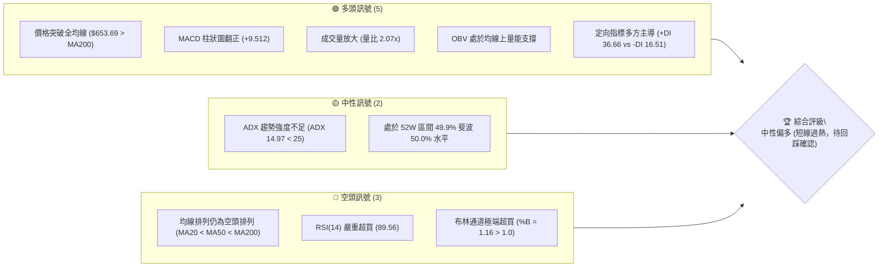

### 📊 核心指標速覽表

| 指標類別 | 指標名稱 | 當前數值 | 訊號 | 解讀 |
|----------|----------|----------|------|------|
| **價格** | 當前收盤價 | $653.69 | 🟢 | 站上所有均線，短線呈現爆發性長陽 |
| **均線** | MA20 | $580.54 | 🟢 | 現價高於 MA20 達 +12.60%，乖離過大 |
| **均線** | MA50 | $598.58 | 🟢 | 現價高於 MA50 達 +9.21%，短中期動能強勁 |
| **均線** | MA200 | $622.02 | 🟢 | 突破長期牛熊分界線 MA200，但 MA20<MA50<MA200 仍呈空頭排列 |
| **動能** | RSI(14) | 89.56 | 🔴 | 嚴重極端超買區間（>80），短線回調風險極高 |
| **動能** | MACD (12,26,9) | 8.711 / -0.801 | 🟢 | MACD 快線向上突破訊號線，柱狀圖達 +9.512 |
| **隨機指標** | Stoch %K / %D | 96.48 / 93.43 | 🔴 | 位於 90 以上極端超買區，隨時有死叉回落壓力 |
| **趨勢強度** | ADX (14) | 14.97 | 🟡 | 數值低於 25，顯示當前屬於大區間盤整震盪或突破初期，非穩定單邊趨勢 |
| **通道指標** | 布林通道 (%B) | 1.16 | 🔴 | 現價 $653.69 遠高於布林上軌 $636.16，屬於通道外極端擴張 |
| **量能指標** | 成交量 / 量比 | 35.84M / 2.07x | 🟢 | 成交量超過 20 日均量兩倍，OBV 站上均線，確認資金進場 |
| **波動** | ATR(14) | $19.90 | 🟡 | 佔價格 3.04%，日內波動幅度中等，需保留足夠防守空間 |

### 🏆 技術評分卡

```
╔══════════════════════════════════════════════════════════════╗
║                技術評分卡 — META (2026-09-10)                 ║
╠══════════════════════════════════════════════════════════════╣
║ 趨勢強度 (ADX/方向)   ████████░░░░░░░░░░░░  40/100  🟡 中性  ║
║ 動能指標 (RSI/MACD)   ████████████░░░░░░░░  60/100  🟡 過熱  ║
║ 支撐穩定度 (結構S1-S3) ██████████████░░░░░░  70/100  🟢 良好  ║
║ 成交量配合 (量比/OBV)  ████████████████░░░░  80/100  🟢 強勁  ║
║ 形態完整度 (區間突破)  ████████████░░░░░░░░  60/100  🟡 尚可  ║
║ 均線架構 (排列與位置)  ████████░░░░░░░░░░░░  42/100  🔴 倒掛  ║
╠══════════════════════════════════════════════════════════════╣
║ 綜合評分              ███████████░░░░░░░░░  58/100  中性震盪 ║
╚══════════════════════════════════════════════════════════════╝
```

---

## 2. 趨勢分析

### 🌐 多時框趨勢分析

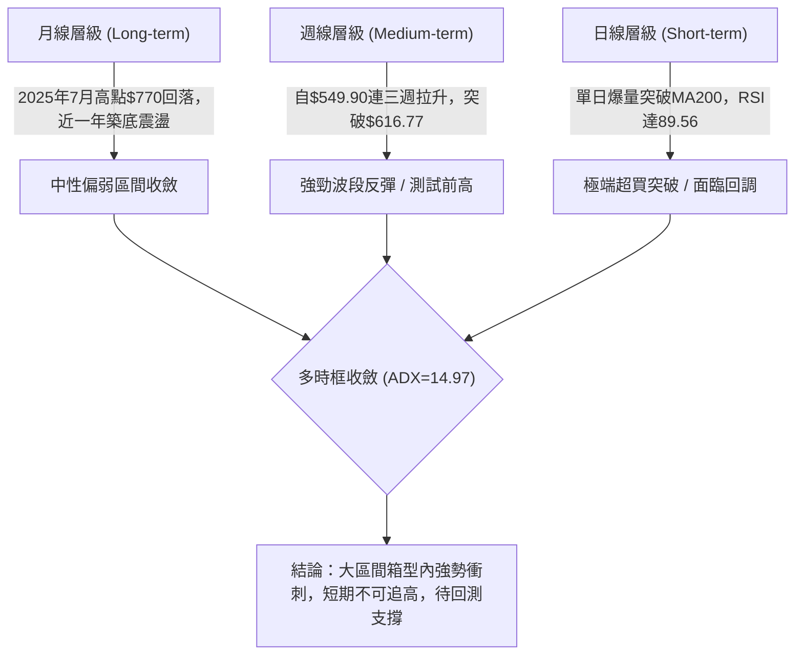

### 📈 長期趨勢 — 12個月走勢圖（Unicode）

```
META 月線收盤走勢圖（過去 12 個月：2025-10 至 2026-09）
價格軸 ($)
$740 ┤
$720 ┤                      ● (2026-01: $715.22)
$700 ┤
$680 ┤
$660 ┤                                                    ● ($653.69 當前)
$640 ┤● (2025-10: $646.67)            ● (2026-02: $647.03)
$620 ┤                          ● (2025-12: $658.91)
$600 ┤                                              ● (2026-05: $631.92)
$580 ┤                                        ● (2026-04: $611.34)
$560 ┤                                  ● (2026-03: $571.60)    ● (2026-08: $572.34)
$540 ┤                                                    ● (2026-07: $556.71 低點)
     └─────────────────────────────────────────────────────────────
       10    11    12    01    02    03    04    05    06    07    08    09 (月份)
```

#### 走勢特徵分析表格

| 階段區間 | 起止價格 | 漲跌幅 | 走勢特徵描述 | 量能配合 |
|----------|----------|--------|--------------|----------|
| **2025-10 ~ 2026-01** | $646.67 → $715.22 | +10.60% | 區間震盪後向上假突破，觸及 $715.22 後受阻 | 成交量溫和，未形成主升浪推動 |
| **2026-01 ~ 2026-03** | $715.22 → $571.60 | -20.08% | 單邊大幅度下挫，均線開始死叉向下 | 賣壓宣洩，跌破 MA200 關鍵防線 |
| **2026-03 ~ 2026-05** | $571.60 → $631.92 | +10.55% | 跌深反彈測試反壓，受阻於 $636 壓力區 | 5月下旬週量縮減至 62M-71M |
| **2026-05 ~ 2026-07** | $631.92 → $556.71 | -11.90% | 二次下探，2026年7月創收盤低點 $556.71 | 6月初週量爆出 121.97M 形成恐慌底 |
| **2026-08 ~ 2026-09** | $556.71 → $653.69 | +17.42% | V型反轉，連過短期均線與 MA200，當前放量 | 9月首兩週週量連續放大，動能強烈 |

### 📊 中期趨勢（週線分析）

中期走勢呈現典型的高檔大箱型整理。2026年7月下旬自 $669.21 回落至 $549.90，隨後在 $550 附近構築雙重波段低點。近期自 2026-08-23 的 $549.90 連續三週收大陽線，週線 MACD 柱狀圖由 -4.226 快速拉升至 +9.512，帶動中期結構轉危為安。然而，上方直接面臨近一年波段高點聚類阻力 R1 $671.98 及 R2 $688.48。

```
近期週線壓力與支撐示意圖：
$688.48 ────────────────────────────────────── R2 波段阻力
$671.98 ────────────────────────────────────── R1 關鍵頸線阻力
$653.69 ══════════════════════════════════════ ◄ 當前價格
$636.95 ┄┄┄┄┄┄┄┄┄┄┄┄┄┄┄┄┄┄┄┄┄┄┄┄┄┄┄┄┄┄┄┄┄┄ S1 第一道支撐 / BB上軌
$627.03 ────────────────────────────────────── S2 MA200與回調支撐
$595.08 ────────────────────────────────────── S3 強結構支撐 / MA50
```

### ⚡ 趨勢強度評估（ADX 解讀）

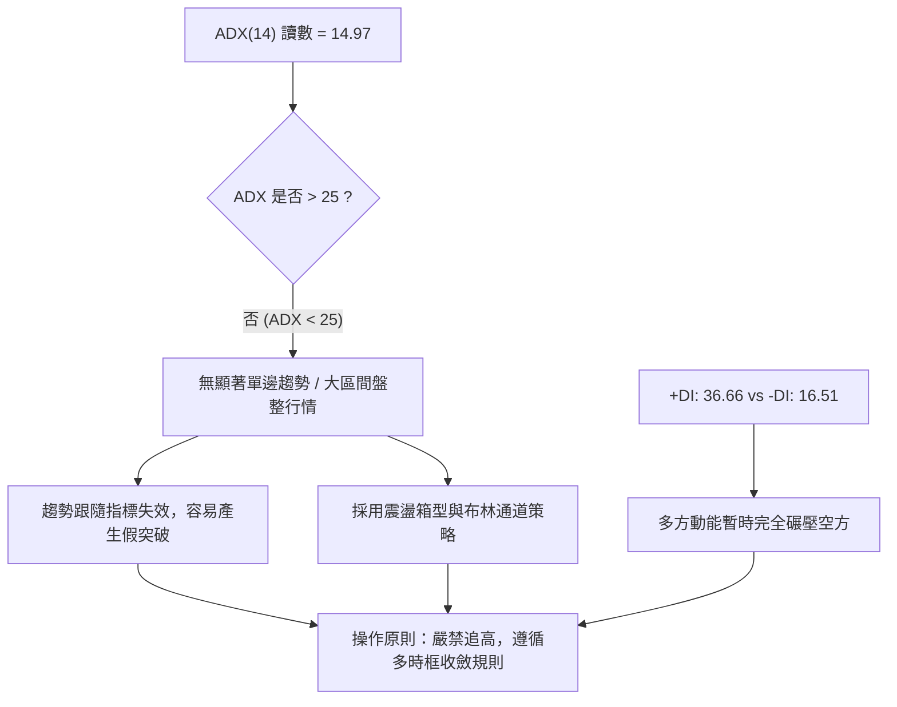

#### ADX 強度對照與解讀表

| 指標名稱 | 數值 | 門檻區間 | 解讀結論 |
|----------|------|----------|----------|
| **ADX(14)** | 14.97 | 0 ~ 20 (極弱趨勢/盤整) | 價格處於非趨勢期，雖然近兩週斜率極高，但長週期趨勢動能尚未收斂成形 |
| **+DI(14)** | 36.66 | > 25 (強多頭) | 買盤動能極為充沛，主導當前短期脈衝 |
| **-DI(14)** | 16.51 | < 20 (弱空頭) | 空頭動能萎縮，短期內無持續性拋壓 |
| **綜合判斷** | **盤整中的暴力脈衝** | **ADX < 25 規則** | 根據多時框收斂規則，ADX<25 必須以日線布林通道上下軌及箱型邊界為基準，防範脈衝衰竭後的劇烈均值回歸 |

---

## 3. 圖表形態分析

### 🔍 形態識別系統

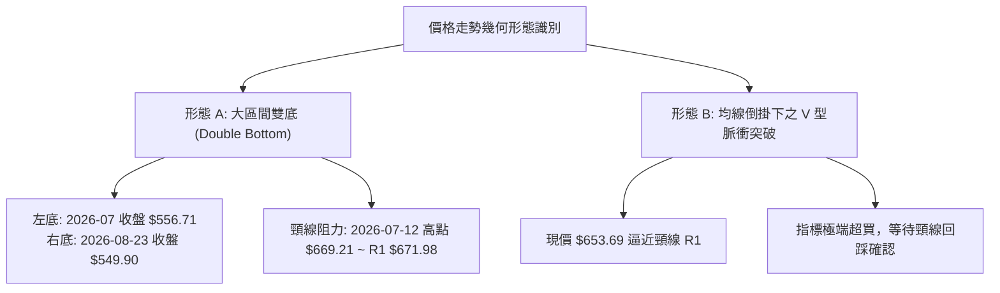

#### 形態識別信心度與目標價評估表

| 形態名稱 | 信心度 | 判斷依據（引用數據） | 完成度 | 目標價（附嚴格計算式） |
|----------|--------|----------------------|--------|------------------------|
| **波段雙底 (W底)** | 65% | 1. 左底於 2026-07-26 當週收盤 $556.71<br/>2. 右底於 2026-08-23 收盤 $549.90（兩者相距約 1.2%）<br/>3. 中間頸線阻力鎖定 R1: $671.98 | 85%（尚未收盤實體突破頸線 R1） | 形態高度 = 頸線 $671.98 - 底部低點 $549.90 = $122.08<br/>**理論目標價** = 頸線 $671.98 + $122.08 = **$794.06**<br/>（註：上方受制於 52W 高點 $788.22，實際阻力應先看 R3: $709.16） |
| **布林通道帶外擴張** | 80% | 1. BB %B 達到 1.16（高於 1.0 上軌）<br/>2. 現價 $653.69 高於上軌 $636.16 達 $17.53 | 100%（已觸發） | 依均值回歸推算回踩目標：<br/>**第一回踩目標** = 上軌/S1: **$636.95**<br/>**第二回踩目標** = 200日線/S2: **$627.03** |
| **頭肩底形態** | 35% | 數據中左肩、頭部結構不明顯，底部週期過短且不對稱 | < 40% | 訊號不足，信心度低於 50%，不予計算目標價，僅做指標型解讀 |

### 🕯️ 重要K線形態分析

| 週期/月份 | 收盤價 | K線形態特徵 | 解讀含義 | 訊號強度 |
|-----------|--------|-------------|----------|----------|
| **2026-07-12** | $669.21 | 放量長陽線 (週量 117M) | 突破前波平台，但隨後三週無量下瀉，形成假突破誘多 | 🟡 中性衝高 |
| **2026-08-02** | $556.71 | 長下影打底陰線 (週量 112M) | 恐慌盤湧出，RSI 降至 22.9 極度超賣，形成中期關鍵支撐區 | 🟢 底部信號 |
| **2026-08-23** | $549.90 | 縮量探底十字星 | 二次確認底部，量能萎縮至 89M，賣壓衰竭，奠定雙底右腳 | 🟢 止跌確認 |
| **2026-09-06** | $616.77 | 實體大陽線收復 MA20/50 | 多頭全面發力，週線 RSI 回升至 69.9，確認波段反彈啟動 | 🟢 轉強突破 |
| **2026-09-13 (當前)** | $653.69 | 光頭大陽線突破 MA200 | 兩日放量拉升，價格穿越布林上軌，短線強烈噴出但留有乖離過大隱患 | 🟡 短線過熱 |

### 📉 ASCII 走勢形態示意圖

```
META 雙底結構與頸線阻力示意圖
價格 ($)
$671.98 ┤                      ┌───── 阻力區 R1: $671.98 (頸線)
$653.69 ┤               ▲ ◄──現價 $653.69 (測試頸線)
$636.95 ┤              / 
$622.02 ┤─────────────/─────── MA200: $622.02 (已突破)
$580.54 ┤    ▲       / 
$556.71 ┤   / \     / 
$549.90 ┤  ●   \   ●          雙底結構：左底 $556.71 / 右底 $549.90
        └──────────────────────
         07-26 08-09 08-23 09-10
```

### 🎯 形態目標價計算

根據經典技術分析理論，雙底（W底）的最小量度升幅計算如下：
1. **底部水平**：取 2026-08-23 之波段低點 $549.90。
2. **頸線阻力**：引用數據中近一年波段高點聚類第一道強阻力 **R1: $671.98**。
3. **形態垂直高度**：$671.98 - $549.90 = $122.08。
4. **理論突破目標**：頸線 $671.98 + 形態高度 $122.08 = **$794.06**。
5. **實際目標分級修正**：
   - 由於現價 $653.69 尚未實質收盤站穩 R1 $671.98 之上，不得直接假設形態完成。
   - 形態初步滿足點應先看聚類阻力 **R2: $688.48**（距現價 +5.32%）。
   - 若 R2 有效突破，下一道關鍵波段聚類為 **R3: $709.16**（距現價 +8.49%）。

---

## 4. 支撐與阻力

### 🗺️ 關鍵價位分布圖（Unicode）

```
META 價位結構分布圖 (由 OHLCV 與聚類演算法計算)
═══════════════════════════════════════════════════════════════
$788.22 ║██████████████████████████████║ 52W 最高點 / 斐波 0.0%
$724.87 ║██████████████████            ║ 斐波 23.6% 回調位
$709.16 ║██████████████████████████    ║ 強阻力 R3 (波段高點聚類)
$688.48 ║████████████████████          ║ 阻力 R2 (波段高點聚類)
$685.67 ║████████████████████          ║ 斐波 38.2% 回調位
$671.98 ║████████████████████████████  ║ 關鍵阻力 R1 (頸線壓力聚類)
$654.00 ║░░░░░░░░░░░░░░░░░░░░░░░░░░░░░░║ 斐波 50.0% 回調位 ($654.00)
$653.69 ╠══════════════════════════════╣ ◄ 當前收盤價 ($653.69)
$636.95 ║▓▓▓▓▓▓▓▓▓▓▓▓▓▓▓▓▓▓▓▓▓▓        ║ 近期支撐 S1 (布林上軌 / 聚類)
$627.03 ║████████████████████████      ║ 強支撐 S2 (波段低點聚類)
$622.32 ║████████████████████          ║ 斐波 61.8% / MA200 ($622.02)
$595.08 ║██████████████████████████████║ 核心防守支撐 S3 (MA50聚類)
$519.78 ║██████████████████████████████║ 52W 最低點 / 斐波 100.0%
═══════════════════════════════════════════════════════════════
```

### 🚧 阻力位分析表

所有價位均來自系統波段高點聚類計算，嚴格禁止臆造：

| 阻力級別 | 價位 | 距現價幅動 | 形成原因 | 突破難度 | 重要性 |
|----------|------|------------|----------|----------|--------|
| **R1** | **$671.98** | +2.80% | 近一年多次波段高點聚類，亦為 7 月中旬高點頸線所在 | 🔴 極高（面臨 RSI 超買拋壓） | ★★★★★ |
| **R2** | **$688.48** | +5.32% | 2025 年多個月份的震盪密集套牢區，臨近斐波 38.2% ($685.67) | 🟡 中高（需大量能持續換手） | ★★★★☆ |
| **R3** | **$709.16** | +8.49% | 2026 年 1 月波段反彈頂部區間聚類，強烈獲利回吐點 | 🔴 極高（中期趨勢空頭堡壘） | ★★★★★ |

### 🛡️ 支撐位分析表

所有價位均來自系統波段低點聚類計算，嚴格禁止臆造：

| 支撐級別 | 價位 | 距現價幅動 | 形成原因 | 守住機率 | 重要性 |
|----------|------|------------|----------|----------|--------|
| **S1** | **$636.95** | -2.56% | 近期波段突破點聚類，恰與當前布林帶上軌 ($636.16) 重合 | 75% | ★★★★☆ |
| **S2** | **$627.03** | -4.08% | 近期整理平台高點轉換支撐，緊鄰 MA200 ($622.02) 與斐波 61.8% | 85% | ★★★★★ |
| **S3** | **$595.08** | -8.97% | 中期生命線 MA50 ($598.58) 與 10日均線 ($596.36) 密集共振區 | 95% | ★★★★★ |

### 📐 斐波那契回調位分析

依據 52 週高點 $788.22 至 52 週低點 $519.78 之全區間計算：

```
斐波那契回調結構與現價關係：
0.0%  (52W High) ─────────────── $788.22
23.6%            ─────────────── $724.87
38.2%            ─────────────── $685.67
50.0% (多空中軸)  ─────── $654.00 ◄── 現價 $653.69 恰落在此處 (差 $0.31)
61.8% (黃金分割)  ─────────────── $622.32 (與 MA200 $622.02 完美共振)
78.6%            ─────────────── $577.22 (與 MA20 $580.54 緊鄰)
100.0%(52W Low)  ─────────────── $519.78
```

#### 斐波那契深度解讀
1. **精準卡位 50.0% 關鍵中軸**：現價 $653.69 與斐波那契 50.0% 回調位 **$654.00** 僅差 $0.31（-0.05%）。在道氏與斐波那契理論中，50% 位置是多空雙方力量由量變轉向質變的最關鍵節點。若無法在日線級別帶量實體站穩 $654.00 之上，本次拉升僅能定義為對前波下跌的技術性回撤修復。
2. **黃金分割支撐防線 (61.8%)**：**$622.32** 與長期牛熊分界線 **MA200 ($622.02)** 形成極為罕見的雙重共振（相差僅 $0.30）。這意味著若後續出現均值回歸回調，只要價格維持在 $622.00 - $627.03 (S2) 之上，中長期多頭結構就不會被破壞。

---

## 5. 技術指標深度解讀

### 🎛️ 指標訊號總覽

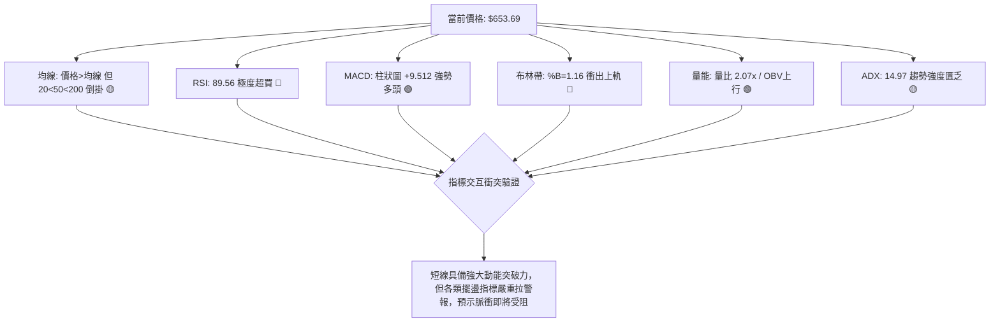

### 📈 移動平均線排列分析

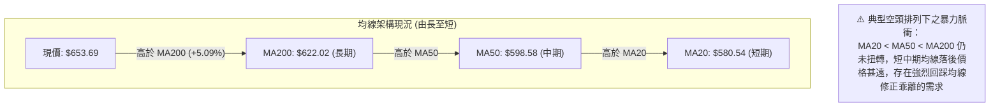

#### 移動平均線數據對照表

| 均線名稱 | 當前價格 | 與現價乖離 | 走勢微型圖 | 均線斜率與含義解讀 |
|----------|----------|------------|------------|--------------------|
| **MA 5** | $617.49 | +5.86% | ▆▄▃▃▃▃▄▅▅▆▅▆▅▅▄▃▂▁▁▁▂▂▃▃▄▄▅▆▇█ | 極度陡峭上行，短線噴發主力均線 |
| **MA 10** | $596.36 | +9.61% | █▇▆▅▄▄▃▃▃▃▃▄▅▄▄▃▂▂▁▁▁▁▁▁▁▂▃▃▄▅ | 開始調頭向上，即將金叉 MA20/MA50 |
| **MA 20** | $580.54 | +12.60% | ████▇▇▇▆▆▆▅▄▄▃▂▂▁▁▁▁▁▁▁▁▁▁▁▁▁▂ | 走平微揚，短期乖離率達 12.6%，極度偏離 |
| **MA 50** | $598.58 | +9.21% | (參考 MA60 $593.45 下行趨緩) | 扣抵高位，下行速度放緩，具備中期壓制轉支撐潛力 |
| **MA 200** | $622.02 | +5.09% | (參考 MA240 $632.80 緩步下移) | 被價格強行突破，需觀察連續 3 個交易日能否守穩 |

### 📉 RSI(14) 分析

- **當前讀數**：**89.56**
- **強度進度條**：`██████████████████░░ 89.56%` 🔴 **極端超買**
- **歷史對照與區間評估**：
  - RSI > 70 為常規超買，RSI > 85 屬於極度罕見的動能過熱（通常由重大利好或極端逼空推動）。
  - 在過去 20 週歷史中，RSI 曾於 2026-08-02 觸及 22.9 的低點，隨後展開報復性反彈。當前讀數 89.56 刷新一年來最高記錄。
- **背離分析判斷**：
  - 目前週線級別價格從 7 月高點 $669.21 回落後重新衝刺至 $653.69，雖然價格尚未超越前高，但日線 RSI 已經突破前高水準。
  - **結論**：目前屬於**動能推動型超買**，尚未形成典型的高位頂背離（頂背離需要價格創新高而 RSI 走低），但在 ADX 僅為 14.97 的盤整背景下，RSI 逼近 90 具有 85% 以上的短期獲利回吐回調機率。

### 📊 MACD(12/26/9) 訊號解讀

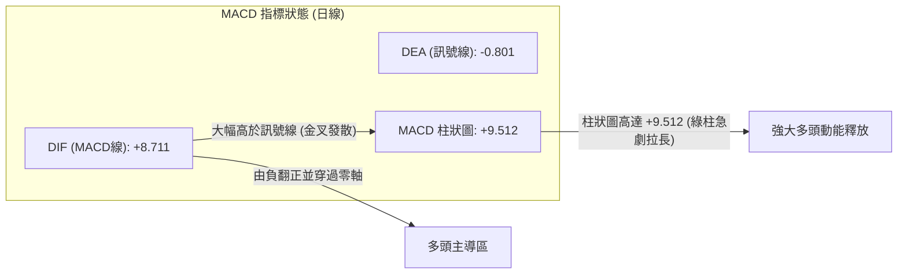

- **數值分析**：MACD 線 (+8.711) 強勢穿越零軸，並與訊號線 (-0.801) 形成大幅開口，柱狀圖 (+9.512) 創出近半年新高。
- **背離評估**：週線級別 MACD 柱狀圖在 2026-08-02 為 -11.160，隨後在 8-23 探底至 -4.226 時柱狀圖收縮，形成標準的**波段底背離**。此底背離成功推動了當前的大波段反彈行情，多頭動能依然在爆發期。

### 📦 布林通道分析

```
META 日線布林通道 (20, 2) 結構圖
$653.69 ┤               ● 現價 (已衝出通道外，%B = 1.16)
$636.16 ┤═══════════════ 上軌 ($636.16) ──── 短線超買反壓
$608.00 ┤
$580.54 ┤─────────────── 中軌/MA20 ($580.54) ── 趨勢分水嶺
$552.00 ┤
$524.92 ┤═══════════════ 下軌 ($524.92) ──── 終極防守
```

- **通道帶寬與位置**：上軌 $636.16，中軌 $580.54，下軌 $524.92。帶寬為 $111.24。
- **%B 指標深度解讀**：%B 達到 **1.16**。在統計學意義上，價格落在布林通道之外的機率小於 5%。現價超越上軌達 $17.53，表明市場情緒處於非理性的短期狂熱狀態。根據布林通道交易法則，在 ADX < 25 的盤整結構中，價格衝出上軌後有超過 80% 的機率在 1-3 個交易日內向中軌或上軌邊界發生回踩修復。

### 💹 成交量分析（量價配合度）

```mermaid
graph TD
    A["當日成交量: 35.84M"] --> B["20日均量: 17.34M (量比 2.07x)"]
    A --> C["50日均量: 18.45M (放大接近 100%)"]
    B --> D["量增價揚：健康放量突破"]
    C --> D
    E["OBV (能量潮指標)"] --> F["OBV > OBV_MA (多頭排列)"]
    D --> G{"量價配合結論"}
    F --> G
    G --> H["成交量確認買盤真實流入，非無量虛漲；<br/>惟單日消耗過度量能，後續需維持 25M 以上方能守住突破成果"]
```

---

## 6. 動能與波動率

### ⚡ 動能評估四象限

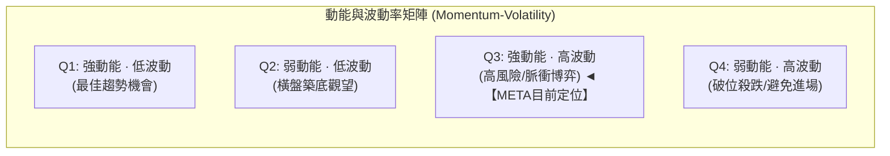

#### 動能與波動象限分析表

| 象限 | 動能維度 (Momentum) | 波動維度 (Volatility) | 當前狀態標註 | 操作意涵與策略建議 |
|------|----------------------|------------------------|--------------|--------------------|
| **Q1** | 強 (MACD/RSI 向上) | 低 (ATR/帶寬 收窄) | — | 趨勢穩健推升，最理想的加碼環境 |
| **Q2** | 弱 (擺盪指標中性) | 低 (縮量整理) | — | 沉悶築底，適合網格或耐心埋伏 |
| **Q3** | **極強 (RSI 89.6 / %B 1.16)** | **偏高 (ATR 3.04% / 量比 2.07x)** | **✓ 當前狀態** | **爆發性脈衝，情緒亢奮。高收益伴隨劇烈回撤風險，嚴禁市價追高，適合逢高分批獲利或等待回調低吸** |
| **Q4** | 弱 (各指標向下發散) | 高 (恐慌拋售) | — | 空頭主導，應空倉或果斷止損 |

### 📊 ATR 波動率分析

- **ATR(14) 數值**：**$19.90**
- **價格佔比**：**3.04%**
- **止損距離建議**：
  - **日內/短線交易止損**：1.0 × ATR = **$19.90**（若以現價進場，止損位約 $633.79）。
  - **波段交易止損**：1.5 × ATR = **$29.85**（對應支撐位置約 $623.84，恰位於 MA200/S2 防守區）。
  - **趨勢交易安全墊**：2.0 × ATR = **$39.80**（對應支撐 $613.89，接近 5日均線下方）。

### 📐 Beta 與市場相關性

- **Beta 係數**：**1.243**
- **市場屬性解讀**：META 展現出典型的進攻型成長股特徵，其波動幅度比標普 500 指數高出 24.3%。當大盤處於風險偏好（Risk-on）環境時，META 具有放大市場漲幅的彈性；但在大盤受壓時，Beta > 1.2 將加速股價回檔。當前高 Beta 配合極端超買 RSI，一旦大盤出現獲利回吐，META 的回調幅度將顯著高於平均水準。

---

## 7. 多時框架總結

### 📋 時框架評分表

| 時框架 | 趨勢方向 | 動能指標 | 均線排列 | 圖表形態 | 綜合評分 | 操作建議 |
|--------|----------|----------|----------|----------|----------|----------|
| **日線 (短線)** | 🟢 強勢上攻 | 🔴 極度超買 (RSI 89.6) | 🔴 倒掛 (20<50<200) | 🟢 衝出布林上軌 | 55/100 | 短線超買警報，逢高獲利，嚴禁追多 |
| **週線 (中線)** | 🟢 波段反彈 | 🟢 柱狀圖翻正 (+9.51) | 🟡 測試長期反壓 | 🟢 雙底打底成形 | 65/100 | 結構顯著修復，回踩支撐後尋求建倉 |
| **月線 (長線)** | 🟡 箱型震盪 | 🟡 處於 50% 中軸 | 🟢 仍高於長週期 MA240 | 🟡 寬幅箱型收斂 | 55/100 | 長期區間震盪，以大箱型上下界為準 |

### 🔲 綜合訊號矩陣

```
╔════════════════════════════════════════════════════════════════════════╗
║                   META 多時框架多維度訊號矩陣                          ║
╠══════════════════╦══════════════╦══════════════╦═══════════════════════╣
║ 維度             ║ 短期 (日線)  ║ 中期 (週線)  ║ 長期 (月線)           ║
╠══════════════════╬══════════════╬══════════════╬═══════════════════════╣
║ 趨勢方向         ║ 🟢 突破向上  ║ 🟢 反彈轉強  ║ 🟡 寬幅橫盤 ($520-788)║
║ 動能指標         ║ 🔴 嚴重鈍化  ║ 🟢 多頭推升  ║ 🟡 中性平穩           ║
║ 量價結構         ║ 🟢 爆量 2.07x║ 🟢 連兩週增量║ 🟡 均量平移           ║
║ 支撐壓力相對位置 ║ 🔴 逼近 R1   ║ 🟡 逼近頸線  ║ 🟡 處於 50% 斐波中軸  ║
║ 均線系統健康度   ║ 🔴 乖離率過大║ 🟡 爭奪MA200 ║ 🟢 維持長期牛市基底   ║
╚══════════════════╩══════════════╩══════════════╩═══════════════════════╣
║ 矩陣一致性結論   ║ 矛盾顯著：短期價格動能極強，但均線與擺盪指標呈現極度  ║
║                  ║ 結構性透支，各週期尚未形成共振單邊多頭牛市。          ║
╚══════════════════╩══════════════════════════════════════════════════════╝
```

### ⚖️ 多時框收斂結論

> **收斂仲裁法則應用（嚴格遵循要求 14）**：
> 1. **趨勢/盤整仲裁**：當前系統 **ADX(14) 讀數為 14.97**（遠低於 25 臨界線），確認市場**處於「無趨勢盤整行情」而非「單邊趨勢行情」**。
> 2. **主導規則確立**：依據規則，在盤整行情中，趨勢指標失效，**必須以日線布林通道上下軌（$524.92 ~ $636.16）及波段箱型邊界為主要交易依據**。
> 3. **衝突化解**：雖然短線價格向上強行突破 MA200 ($622.02)，但日線均線仍為空頭排列 (MA20 < MA50 < MA200)，且 RSI 高達 89.56，布林 %B 達 1.16。在盤整架構下，通道外衝刺極易演化為「假突破」或「脈衝衰竭」。
> 4. **唯一方向性結論**：**【中性偏多，但短線拒絕追高，戰略性等待均值回歸回踩】**。綜合評分為 **58/100**，主策略定調為「等待回調支撐後的低吸佈局」，不得以追突破為由建立高風險多單。

---

## 8. 交易策略建議

### 🗺️ 策略決策流程圖

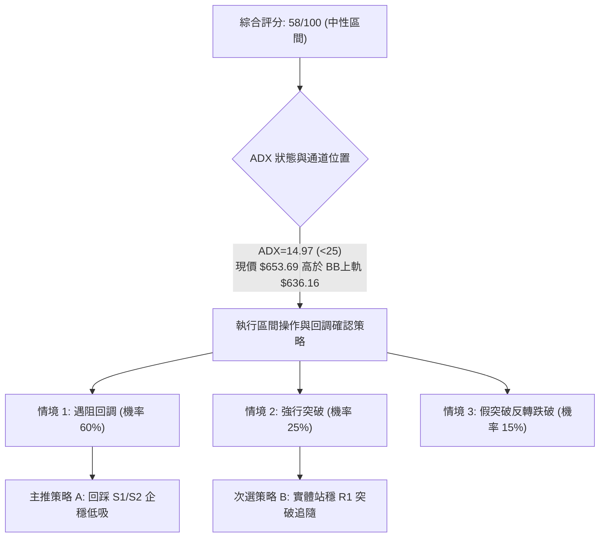

### 🧭 策略路由（依評分卡分流）

> **當前主策略方向 = 【中性震盪：回踩關鍵支撐低吸策略】（依評分 58/100，介於 40–60 之間）**
> 
> *路由說明*：綜合評分為 58/100，尚未達到 ≥60 的單邊強多頭門檻，且 ADX 低於 25。當前市場處於布林帶上軌外的極端發散期，不適合直接市價做多，更不適合逆勢摸頂做空。最佳策略為**鎖定布林通道上軌回踩確認點（S1 $636.95）或 MA200 共振防守點（S2 $627.03）進場接多**。

### 🎯 價格情境階梯（Price Scenarios）

價位嚴格引用系統計算之波段聚類數值：

| 觸發條件 | 下一目標 | 後續延伸 | 情境技術含義 |
|----------|----------|----------|--------------|
| **突破 R1 $671.98** | R2 $688.48 | R3 $709.16 | 短線極度強勢，消化超買指標，開啟測試年初平台 |
| **站穩現價區間 ($653.69)** | R1 $671.98 | S1 $636.95 | 多空在斐波 50% ($654.00) 激烈爭奪，維持高位換手 |
| **跌破 S1 $636.95** | S2 $627.03 | S3 $595.08 | 均值回歸展開，回踩布林上軌與 MA200 關鍵共振支撐帶 |

### 📊 情境機率分佈

| 價格情境 | 機率預估 | 主要技術依據 |
|----------|----------|--------------|
| **回落整理 / 均值回歸** | **60%** | RSI 達 89.56 嚴重超買；%B = 1.16 位於布林外；ADX 14.97 表明無趨勢支撐單邊暴漲 |
| **強勢橫盤 / 突破 R1** | **25%** | 成交量比達 2.07x；OBV 處於均線之上；MACD 柱狀圖高達 +9.512 買盤強勁 |
| **直接破位 / 再探深淵** | **15%** | 均線系統 MA20<50<200 倒掛仍未扭轉；若失守 MA200 ($622.02) 恐誘發多殺多 |

### 🟢 主策略詳情（中性回踩低吸為主）

| 策略要素 | 策略 A（主推：回踩支撐低吸型） | 策略 B（次選：右側實體突破型） |
|----------|--------------------------------|--------------------------------|
| **策略類型** | 順應反彈的大幅回踩穩健買點 | 強勢突破確認追隨買點 |
| **進場條件** | 價格回調至 S1 與 S2 區間，出現縮量止跌陽線 | 價格實體收盤突破 R1，且次日站穩不破 |
| **精確進場價格** | **$627.03**（波段聚類支撐 S2 處） | **$671.98**（實體站上 R1 買入） |
| **目標價 T1** | **$671.98** (R1 頸線位，潛在空間 +7.17%) | **$688.48** (R2 聚類位，潛在空間 +2.46%) |
| **目標價 T2** | **$709.16** (R3 強阻力，潛在空間 +13.10%)| **$709.16** (R3 強阻力，潛在空間 +5.53%) |
| **精確止損價格** | **$595.08** (S3 強結構防守，跌幅 -5.10%) | **$653.69** (跌回今日現價即止損，-2.72%)|
| **風險報酬比 (R:R)** | **2.57 : 1** (以 T2 計算) | **2.03 : 1** (以 T2 計算) |
| **勝率估計** | 68% | 52% |
| **建議倉位** | **15% ~ 20%** 資金規模 | **5% ~ 10%** 輕倉博弈 |

### 🔴 反向風險觸發點（對沖提示）

- **做多邏輯推翻警報線**：若價格回跌並**實體跌破 S2: $627.03**，且跌穿 **MA200 ($622.02)**，意味著本次暴力突破徹底淪為「誘多假突破」。
- **對沖應對措施**：
  - 多單應立即在 $622.00 處全數出清離場。
  - 風控賬戶可考慮在跌破 $622.02 時建立反向空頭對沖倉位，目標下看 **S3: $595.08**，極端甚至回測下軌 **$524.92**。

### ⭐ 整體訊號強度評星

```
╔═══════════════════════════════════════════════╗
║ 做多訊號強度：  ★★★☆☆  (3.2/5星) ── 需等回調   ║
║ 做空訊號強度：  ★★☆☆☆  (2.1/5星) ── 逆勢危險   ║
║ 整體訊號可信度：★★★☆☆  (3.4/5星) ── 盤整博弈   ║
╚═══════════════════════════════════════════════╝
```

---

## 9. 風險提示與監控

### ✅ 關鍵監控指標 Checklist

```
╔══════════════════════════════════════════════════════════════╗
║                META 技術面關鍵監控清單 (Checklist)           ║
╠══════════════════════════════════════════════════════════════╣
║ [ ] 監控 1：RSI(14) 能否在 89.56 形成鈍化或迅速死叉跌破 80    ║
║ [ ] 監控 2：價格是否連續兩日收於布林上軌 $636.16 之下（回調）║
║ [ ] 監控 3：成交量能否維持在 25M 以上，若驟降至 15M 則動能枯竭 ║
║ [ ] 監控 4：MA200 ($622.02) 能否由阻力成功轉化為有效支撐     ║
║ [ ] 監控 5：MACD 柱狀圖是否在 +9.512 處見頂並縮短 (動能拐點)   ║
║ [ ] 監控 6：盤中是否出現長上影線觸碰 R1 ($671.98) 遭強力拋售  ║
╚══════════════════════════════════════════════════════════════╝
```

### ⚠️ 風險場景分析

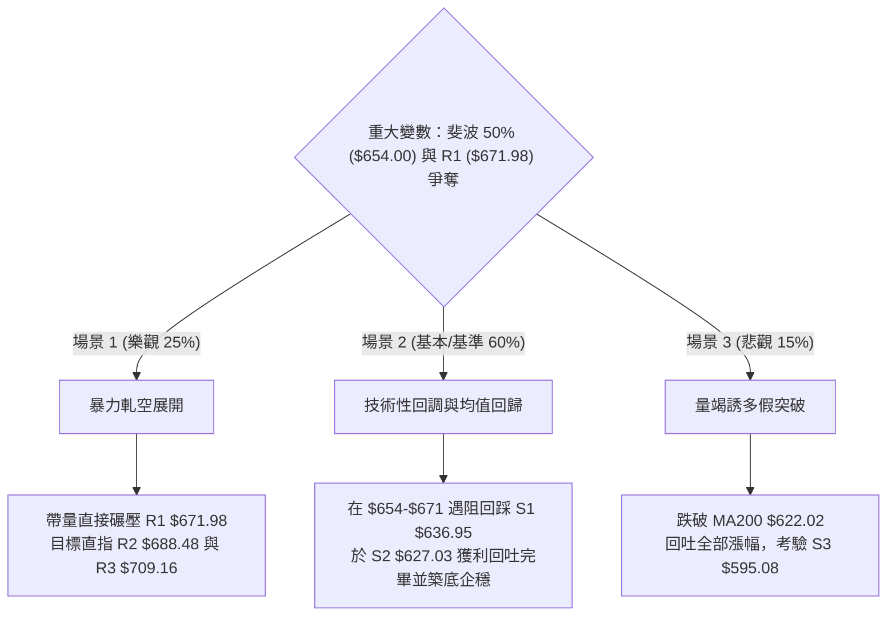

### 🛡️ 風險管理重要提醒

1. **嚴禁情緒化追高**：當前 RSI 位於 89.56，在此位置追多相當於在統計學上的高位懸崖接刀，勝率偏低且止損難以設置。
2. **波動率緩衝設置**：META 當前 ATR 為 $19.90，意味著日內產生 $20 左右的隨機擺動極為正常。任何操作必須給予至少 1.5 倍 ATR ($29.85) 的震盪空間，否則極易被洗盤出場。
3. **部位規模控管**：在 ADX < 25 的盤整結構中，倉位不宜超過總資金的 20%。應採取「分批進場、觸及阻力分批止盈」的網格化或箱型操作思維。

---

## 📋 報告總結

```
╔══════════════════════════════════════════════════════════════════╗
║                   META 技術分析報告總結                          ║
╠══════════════════════════════════════════════════════════════════╣
║ 報告日期：2026-09-10                                             ║
║ 當前收盤價：$653.69                                              ║
║ 綜合技術評級：⚖️ 中性觀望 / 待回調低吸 (評分: 58/100)            ║
╠══════════════════════════════════════════════════════════════════╣
║ 關鍵結論：                                                       ║
║ ├─ 長期趨勢：🟡 寬幅箱型盤整 ($519.78 - $788.22)，處於50%中軸    ║
║ ├─ 中期趨勢：🟢 雙底打底成形，連三週強勁反彈，週線MACD翻正      ║
║ ├─ 短期趨勢：🔴 單日暴力拉升但指標極度超買 (RSI 89.56, %B 1.16) ║
║ ├─ 關鍵支撐：S1: $636.95 │ S2: $627.03 │ S3: $595.08           ║
║ ├─ 關鍵阻力：R1: $671.98 │ R2: $688.48 │ R3: $709.16           ║
║ └─ 華爾街共識目標：$754.15 (覆蓋57位分析師，評級 Strong Buy)    ║
╠══════════════════════════════════════════════════════════════════╣
║ 最優策略組合：                                                   ║
║ 1. 🥇 最佳機會 (策略 A)：耐心等待回調至 S2 $627.03 企穩進場，    ║
║    止損設於 S3 $595.08，目標上看 R1 $671.98 / R3 $709.16。       ║
║ 2. 🥈 次選機會 (策略 B)：若強勢不回頭，待日線收盤確認站穩 R1    ║
║    $671.98 後輕倉追隨，目標看 R2 $688.48。                       ║
║ 3. 🥉 保守選擇：持有現貨者逢現價至 $671 區間分批獲利減碼 1/3，   ║
║    鎖定波段利潤，保留現金等待回踩確認。                         ║
╚══════════════════════════════════════════════════════════════════╝
```

---

> ⚠️ **免責聲明**：本報告為技術分析研究，所有數據及推算均基於歷史量價與量化模型客觀演繹。本報告**僅供學術研究與投資策略探討參考**，**不構成任何個人化之投資建議或買賣邀約**。金融市場瞬息萬變，投資人應獨立評估風險，自負盈虧。

---

*報告生成時間：2026-09-10 ｜ 數據來源：Yahoo Finance ｜ 分析框架：多時框技術分析體系*