# META 技術分析報告

> **報告日期**：2026-09-11 ｜ **語言**：繁體中文 ｜ **數據來源**：Yahoo Finance ｜ **當前價格**：$644.38

---

## 目錄

| 章節 | 內容 |
|------|------|
| [1. 技術面概覽](#1-技術面概覽) | 訊號儀表板、核心指標、評分卡 |
| [2. 趨勢分析](#2-趨勢分析) | 多時框趨勢、長中短期走勢 |
| [3. 圖表形態分析](#3-圖表形態分析) | 形態識別、K線組合、目標價 |
| [4. 支撐與阻力](#4-支撐與阻力) | 關鍵價位、斐波那契回調 |
| [5. 技術指標深度解讀](#5-技術指標深度解讀) | MA/RSI/MACD/布林/成交量 |
| [6. 動能與波動率](#6-動能與波動率) | 動能評估、ATR、Beta |
| [7. 多時框架總結](#7-多時框架總結) | 時框架評分矩陣 |
| [8. 交易策略建議](#8-交易策略建議) | 多空策略、風險報酬比 |
| [9. 風險提示與監控](#9-風險提示與監控) | 監控指標、風險場景 |

---

## 1. 技術面概覽

### 🎯 技術訊號儀表板

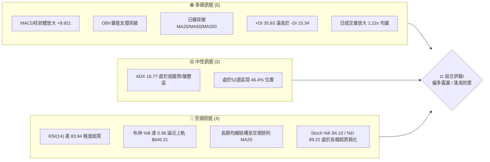

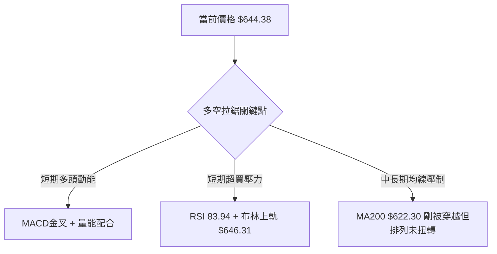

### 📊 核心指標速覽表

| 指標類別 | 指標名稱 | 當前數值 | 訊號 | 解讀 |
|----------|----------|----------|------|------|
| **價格** | 當前價格 | $644.38 | 🟢 | 站上所有主要短中期均線，波段反彈強勁 |
| **均線** | MA20 | $583.81 | 🟢 | 現價高於 MA20 達 +10.37%，短線多頭主導 |
| **均線** | MA50 | $600.20 | 🟢 | 現價高於 MA50 達 +7.36%，突破中期生命線 |
| **均線** | MA200 | $622.30 | 🟢 | 現價突破長週期年線，短多測試長線牛熊分水嶺 |
| **均線結構**| 均線排列 | MA20<MA50<MA200 | 🔴 | 均線總體格局仍屬空頭排列，長線尚未正式黃金交叉 |
| **動能** | RSI(14) | 83.94 | 🔴 | 進入嚴重超買區（>70），短線回調修正風險極高 |
| **動能** | MACD (12,26,9) | 11.601 / 1.679 / +9.921 | 🟢 | 快慢線均為正且柱狀圖強勢擴張，短線動能充沛 |
| **動能** | Stoch %K / %D | 84.10 / 89.22 | 🔴 | 進入 80 以上超買區，存在高檔回落或鈍化走勢 |
| **趨勢強度**| ADX (14) | 16.77 | 🟡 | ADX < 25 表明非單邊強趨勢行情，本質為大區間反彈 |
| **趨勢方向**| +DI / -DI | 35.93 / 15.34 | 🟢 | 多方佔據主導優勢，空方動能暫時退潮 |
| **波動** | 布林帶 %B | 0.98 | 🔴 | 觸及布林上軌 $646.31，價格位於統計極值邊界 |
| **波動** | ATR(14) | $20.67 (3.21%) | 🟡 | 每日平均波動幅度約 20 美元，短線操作需寬止損 |
| **量能** | 當日量 / 20日均量 | 21,487,500 / 17,605,450 | 🟢 | 量比 1.22x，上漲伴隨量能擴大，量價配合健康 |

### 🏆 技術評分卡

```
╔══════════════════════════════════════════════════════════════╗
║              技術評分卡 — META (2026-09-11)                  ║
╠══════════════════════════════════════════════════════════════╣
║ 趨勢強度 (ADX=16.77 盤整)  ████████░░░░░░░░░░░░  42/100  🟡  ║
║ 動能指標 (MACD多/RSI超買)  ████████████░░░░░░░░  60/100  🟡  ║
║ 支撐穩定度 (站上多道均線)  ██████████████░░░░░░  70/100  🟢  ║
║ 成交量配合 (量比 1.22x)    ██████████████░░░░░░  72/100  🟢  ║
║ 形態完整度 (V型底/測頸線)  ████████████░░░░░░░░  62/100  🟢  ║
║ 均線排列 (空頭排列未解)    ████████░░░░░░░░░░░░  40/100  🔴  ║
╠══════════════════════════════════════════════════════════════╣
║ 綜合評分                   ███████████░░░░░░░░░  58/100  🟡  ║
║ 綜合評級：中性偏多（區間震盪偏多，但面臨嚴重超買與阻力）    ║
╚══════════════════════════════════════════════════════════════╝
```

---

## 2. 趨勢分析

### 🌐 多時框趨勢分析

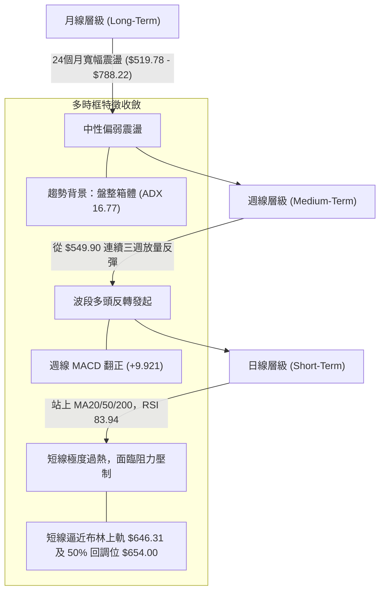

### 📈 長期趨勢 — 12個月走勢圖（Unicode）

```
META 月線走勢圖（過去12個月：2025-10 至 2026-09）
價格軸 ($)
$720 ┤                      ● (2026-01: $715.22)
$690 ┤
$660 ┤               ●                                       ● (2026-09: $644.38 現價)
$630 ┤ ●(2025-10)               ●            ●
$600 ┤                               ●
$570 ┤                                     ●            ●
$540 ┤                                            ● (2026-07: $556.71 低點)
     └────────────────────────────────────────────────────────
       10    11    12   01    02   03    04   05    06   07    08   09 (月份)
      [----2025年----] [----------------2026年----------------]
```

**走勢特徵分析表格**：

| 階段 | 時間區間 | 起點價格 | 終點價格 | 漲跌幅 | 走勢特徵與結構定義 |
|------|----------|----------|----------|--------|--------------------|
| 階段一：高檔回落 | 2025-10 ~ 2025-11 | $732.47 | $646.27 | -11.77% | 確立歷史高點 $788.22 後的次級回撤，跌破短期均線 |
| 階段二：次級反彈 | 2025-12 ~ 2026-01 | $646.27 | $715.22 | +10.67% | 測試 $700 關卡形成次高點，未能突破前高 $788.22 |
| 階段三：主跌浪探底 | 2026-02 ~ 2026-07 | $715.22 | $556.71 | -22.16% | 跌破所有短期均線，向下測試 52 週低點區間，最低收於 $556.71 |
| 階段四：強勁大反彈 | 2026-08 ~ 2026-09 | $556.71 | $644.38 | +15.75% | 8-9月強勢收復 $600，放量重返年線 $622.30 上方 |

### 📊 中期趨勢（週線分析）

中期走勢呈現近 20 週的劇烈洗盤震盪。2026 年 6 月下旬下探至 $550.25，7 月中旬報復性反彈至 $669.21，隨後再次回殺至 8 月底的 $549.90，形成一個大型的不規則雙重底或收斂三角下緣支撐。

```
中期週線價格波動結構示意圖：
$670 ┤           ▲ ($669.21 - 2026-07-12)
$645 ┤             \                                 ▲ ($644.38 現價)
$620 ┤              \                               /
$595 ┤               \       ▲ ($595.19)           /
$570 ┤   ▲ ($577.22)   \     /           \       /
$545 ┤     ▼($550.25)   ▼---▼             ▼-----▼ ($549.90 - 2026-08-23 形成次低支撐)
     └─────────────────────────────────────────────────────────────→ 週時間軸
```

週線指標顯示，MACD 柱狀體由 8 月 23 日的 -4.226 快速拉升至當前的 +9.921，週線 RSI 亦從 31.3 飆升至 83.9，反映此波由 $549.90 發起的反彈速度極快，屬於典型空頭回補與追價多頭共振的急拉走勢。

### ⚡ 趨勢強度評估（ADX 解讀）

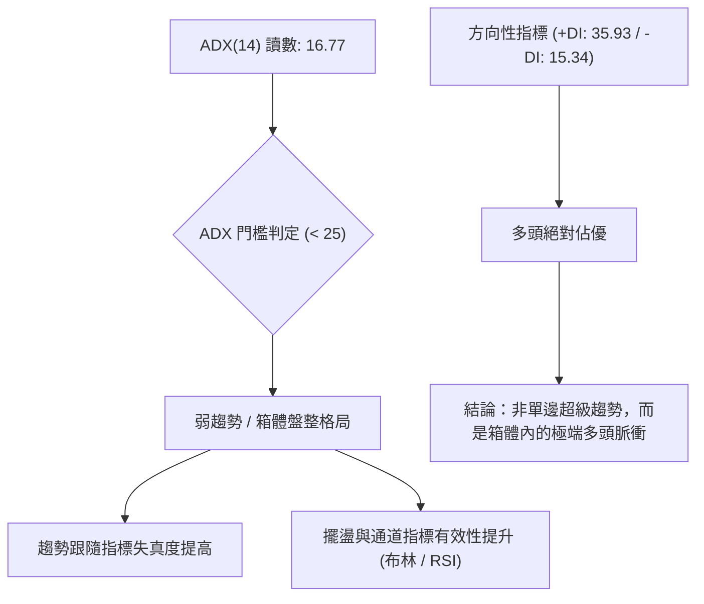

**ADX 趨勢強度對照表**：

| 指標名稱 | 當前讀數 | 標準閾值區間 | 趨勢狀態判定 | 交易邏輯指導 |
|----------|----------|--------------|--------------|--------------|
| **ADX(14)** | **16.77** | 0 - 20 | 極弱趨勢 / 盤整 | 嚴禁盲目追高突破，應以區間震盪思維應對 |
| **+DI** | **35.93** | > 25 (強勢) | 多頭攻擊狀態 | 多方握有短線主導權，空單不宜過早猜頂 |
| **-DI** | **15.34** | < 20 (弱勢) | 空頭動能衰竭 | 空方已無主動砸盤意願，拋壓主要來自獲利盤 |

---

## 3. 圖表形態分析

### 🔍 形態識別系統

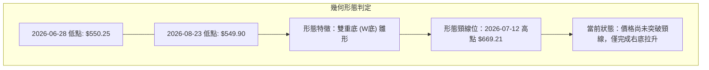

**形態信心度與目標價評估表**：

| 形態名稱 | 信心度 | 判斷依據（引用數據） | 完成度 | 目標價（附精確計算式） |
|----------|--------|----------------------|--------|------------------------|
| **潛在雙重底 (W-Bottom)** | **62%** | 左底 $550.25 (2026-06-28) 與右底 $549.90 (2026-08-23) 幾乎平齊，形成強支撐聚類 | 70% | 頸線為 2026-07-12 高點 $669.21。<br>形態高度 = $669.21 - $549.90 = $119.31。<br>若有效突破頸線，理論目標價 = 頸線 $669.21 + $119.31 = **$788.52**（極度接近 52W 高點 $788.22）。 |
| **布林帶向上擴軌突破** | **85%** | 當前收盤 $644.38，上軌為 $646.31，%B 達 0.98，伴隨量比 1.22x | 95% | 依布林上軌極值推算，短線滿足點即在關鍵阻力 **R1: $671.98**。 |
| **頭肩底形態** | **25%** | 數據中缺乏明確左肩對稱結構，僅有單純雙低點 | 0% | 訊號不足，不予採納，僅做指標型解讀。 |

### 🕯️ 重要K線形態分析（近 5 個月走勢）

| 月份 | 收盤價 | K線形態 | 解讀 | 訊號 |
|------|--------|---------|------|------|
| 2026-05 | $631.92 | 中陽線帶長上影 | 測試上方壓力回落，多空在 $630 膠著 | 🟡 中性 |
| 2026-06 | $563.29 | 大陰線破位 | 跌破所有短期均線，向下尋求 52W 低點支撐 | 🔴 看空 |
| 2026-07 | $556.71 | 長下影十字星探底 | 盤中劇烈震盪，觸及底部後獲買盤支撐，空頭動能放緩 | 🟢 底背離初現 |
| 2026-08 | $572.34 | 止跌小陽線（孕線） | 右底確立，波動收窄，籌碼在 $570 附近充分換手 | 🟢 構築支撐 |
| 2026-09 | $644.38 | 強勢長陽實體 | 伴隨成交量放大，直接吞沒過去 3 個月陰線實體 | 🟢 強烈看多 |

### 📉 ASCII 走勢形態示意圖

```
META 潛在雙底（W底）與當前價位結構：

$688.48 ┤                                                     [R2 阻力]
$671.98 ┤                    頸線區間: $669.21 ~ $671.98       [R1 阻力]
$660.00 ┤                   /‾‾‾‾‾\
$644.38 ┤                  /       \               ▲ 現價 $644.38 (逼近頸線)
$620.00 ┤                 /         \             /
$595.08 ┤                /           \           /            [S3 支撐]
$570.00 ┤\              /             \         /
$549.90 ┼─\____________/───────────────\_______/────────────── [雙底基底線]
          2026-06-28                     2026-08-23
          左底: $550.25                  右底: $549.90
```

### 🎯 形態目標價計算

根據經典形態學理論，雙底結構若成立，其計算邏輯如下：
1. **基底支撐價位**：採用確認之波段低點 $549.90。
2. **頸線確認價位**：採用兩底之間的波段高點收盤價 $669.21（或阻力聚類 R1: $671.98）。
3. **垂直形態高度**：$H = $669.21 - $549.90 = $119.31。
4. **最小量度目標價 (Measured Move)**：
   $$\text{目標價} = \text{頸線價格} + H = 669.21 + 119.31 = \$788.52$$
   *註：此目標價與 52 週最高點 $788.22 形成精確重合，顯示該形態若獲突破，將具備挑戰歷史高點之理論空間；但在突破 $669.21 - $671.98 頸線之前，此形態尚未正式確立，當前僅處於右側衝頂階段。*

---

## 4. 支撐與阻力

### 🗺️ 關鍵價位分布圖（Unicode）

```
META 價位結構分布圖
═════════════════════════════════════════════════════════════════
$788.22 ║██████████████████████████████║ 52W 最高點 / 斐波那契 0.0%
$724.87 ║████████████████████          ║ 斐波那契 23.6% 回調位
$709.16 ║████████████████████████      ║ 強阻力 R3 (近一年高點聚類)
$688.48 ║██████████████████            ║ 次級阻力 R2
$671.98 ║████████████████████████████  ║ 關鍵阻力 R1 / W底頸線區
$654.00 ║░░░░░░░░░░░░░░░░░░░░░░░░░░░░░░║ 斐波那契 50.0% 多空分水嶺
$646.31 ║------------------------------║ 布林帶上軌
$644.38 ╠══════════════════════════════╣ ◄ 現價 (收盤價)
$636.95 ║▓▓▓▓▓▓▓▓▓▓▓▓▓▓▓▓▓▓▓▓          ║ 近期支撐 S1 (波段低點聚類)
$627.03 ║▓▓▓▓▓▓▓▓▓▓▓▓▓▓▓▓▓▓▓▓▓▓▓▓      ║ 關鍵支撐 S2 (MA5 匯聚處)
$622.30 ║==============================║ MA200 年線 / 斐波那契 61.8% ($622.32)
$600.20 ║------------------------------║ MA50 生命線
$595.08 ║████████████████████████████  ║ 強支撐 S3 (波段防守底線)
$519.78 ║██████████████████████████████║ 52W 最低點 / 斐波那契 100.0%
═════════════════════════════════════════════════════════════════
```

### 🚧 阻力位分析表

所有阻力數值嚴格引用自數據之「關鍵價位」聚類：

| 阻力級別 | 價位 | 形成原因 | 突破難度 | 重要性 |
|----------|------|----------|----------|--------|
| **R1** | **$671.98** | 近一年波段高點聚類，且與 2026-07-12 週線高點 $669.21 形成共振阻力帶 | 極高 | ★★★★★<br>多頭能否展開新一輪牛市行情的關鍵隘口 |
| **R2** | **$688.48** | 波段密集套牢區，且極為接近斐波那契 38.2% 回調位 ($685.67) | 中等偏高 | ★★★★☆<br>空頭次級防線，突破後將引發大規模空頭回補 |
| **R3** | **$709.16** | 2026 年 1 月月線反彈高點 ($715.22) 前哨站，密集成交套牢峰 | 極高 | ★★★★★<br>中長期大型雙頂或三頂形態的心理防守線 |

### 🛡️ 支撐位分析表

所有支撐數值嚴格引用自數據之「關鍵價位」聚類：

| 支撐級別 | 價位 | 形成原因 | 守住機率 | 重要性 |
|----------|------|----------|----------|--------|
| **S1** | **$636.95** | 近一年波段低點聚類，短線跌破則確立日內回調開始 | 65% | ★★★☆☆<br>極短線超買回踩的第一道緩衝點 |
| **S2** | **$627.03** | 緊鄰 5 日均線 MA5 ($627.80) 與波段低點聚類，具密集買盤支撐 | 75% | ★★★★☆<br>短線多頭生命線，跌破預示衝頂動能結束 |
| **S3** | **$595.08** | 與 60 日均線 MA60 ($594.30) 及 50 日均線 MA50 ($600.20) 重疊共振 | 85% | ★★★★★<br>中期波段防禦底線，此處失守將重回空頭主導 |

### 📐 斐波那契回調位分析

依據 52 週高點 $788.22 與 52 週低點 $519.78 區間計算之標準黃金分割回調位：

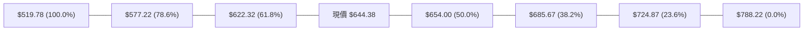

- **當前位置解讀**：
  現價 **$644.38** 正精確落於 **61.8% 回調位 ($622.32)** 與 **50.0% 回調位 ($654.00)** 之間。
- **技術意義**：
  1. 價格成功收復 61.8% 回調位 $622.32（且該位置與 MA200 $622.30 完全重合），確認從 $519.78 以來的反彈已擺脫單純的弱勢技術修復，升級為平衡市震盪。
  2. 上方 **$654.00 (50.0%)** 為多空強弱分水嶺，與布林通道上軌 $646.31 構成狹窄的阻力夾層，若無法實體放量突破 $654.00，將面臨承壓回踩 $622.32 尋求支撐的需求。

---

## 5. 技術指標深度解讀

### 🎛️ 指標訊號總覽

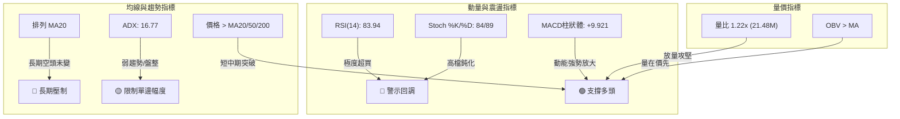

### 📈 移動平均線排列分析

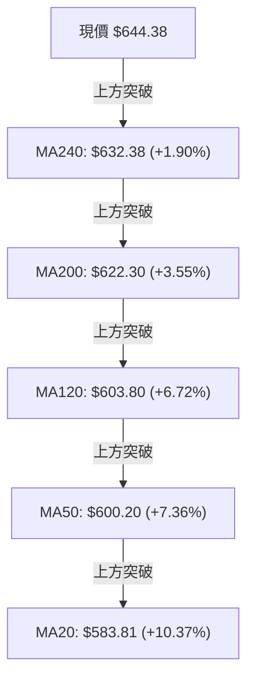

當前移動平均線呈現顯著的**「短線強勢突破，長線均線落後」**的結構特徵：
- **短週期均線加速上揚**：MA5 ($627.80) 與 MA10 ($603.18) 斜率陡峭向上，MA5 距離現價達 +2.64%，MA10 偏離達 +6.83%，短線呈噴射狀走勢。
- **長週期均線仍壓制**：儘管現價已經突破 MA200 ($622.30)，但基礎架構依然是 **MA20 ($583.81) < MA50 ($600.20) < MA200 ($622.30)** 的空頭排列。這種「價格衝在最前方、均線系統尚未完成多頭交叉排列」的格局，通常意味著後續必有拉回均線（如回測 MA200 或 MA50）進行均線收斂的過程。

### 📉 RSI(14) 分析

- **當前 RSI 數值**：**83.94**
- **強度進度條**：
  ```
  RSI(14) 讀數：83.94 [嚴重超買]
  [0] ░░░░░░░░░░░░░░░░░░░░ [50] █████████████░░░░░░░ [100]
  超賣區 (0-30) | 中性區 (30-70) | 嚴重超買區 (70-100: 83.94)
  ```
- **背離判斷**：
  對比 2026 年 7 月 12 日收盤 $669.21（週線 RSI 68.7）與當前 $644.38（週線 RSI 83.9），當前價格雖未創波段新高，但短期 RSI 卻衝至 83.94，顯示短線購買力道過度集中且急躁，動能消耗過快，雖在日線級別**無傳統價格新高而指標未新高的標準頂背離**，但屬於典型的**「指標過熱鈍化」**狀態，歷史上此類讀數維持在 80 以上的時間極少超過 3-5 個交易日。

### 📊 MACD(12/26/9) 訊號解讀

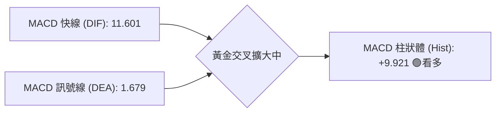

- **快慢線關係**：MACD 線 (11.601) 與訊號線 (1.679) 均處於零軸之上，且開口持續放大（差值達 +9.921），顯示中短期多頭佔據主導優勢。
- **柱狀體變化**：近三週週線 MACD 柱狀體從 -4.226 快速躍升至 +1.912、+6.867，本週達 +9.921，斜率垂直上升，確認目前為強勁的正向動能波段。

### 📦 布林通道分析

```
META 布林通道示意圖 (參數 20, 2)
$650 ┤                                      ╭──── BB 上軌: $646.31
$644 ┤                           ● 現價 $644.38 (%B = 0.98)
$615 ┤                          /
$583 ┤ ─────────────────────────────── 中軌 (MA20): $583.81
$550 ┤                        /
$521 ┤                       ╰─────────────── BB 下軌: $521.32
     └─────────────────────────────────────────────────────────────
```

- **布林指標解讀**：
  1. **%B 指標為 0.98**：表明價格已經緊貼布林通道上軌（$646.31），處於極端邊界狀態。常態分佈下，價格在通道內的機率為 95.44%，%B > 0.95 時通常意味著短線價格延伸已經達到統計學極限。
  2. **帶寬動態**：上軌 $646.31 與下軌 $521.32 帶寬為 $124.99，開口隨價格急拉而擴大，短線沿上軌攀升屬於強勢走勢，但一旦日線收盤跌回上軌下方，即為明確的均值回歸訊號。

### 💹 成交量分析（量價配合度）

- **量能數據評估**：
  - 最新日成交量：**21,487,500 股**
  - 20 日均量：**17,605,450 股**（量比：**1.22x**）
  - 50 日均量：**18,514,142 股**
- **OBV（能量潮）分析**：
  數據明確顯示 **「OBV > MA → 量能支撐上漲」**。在過去三週的反彈過程中，週成交量始終保持在 7,600 萬至 8,500 萬股的相對活躍水準，OBV 均線向上發散，未出現「價增量縮」的量價頂背離走勢，顯示機構資金在此波反彈中有實質買盤介入，而非純粹的無量虛拉。

---

## 6. 動能與波動率

### ⚡ 動能評估四象限

動能評估將 META 置於「動能強度」與「波動率」維度中進行校準：

| 象限 | 動能強度 | 波動率狀態 | 當前股票狀態 | 戰略應對方針 |
|------|----------|------------|--------------|--------------|
| **Q1 (最佳擴張)** | 強動能 (+DI > -DI, MACD強) | 低/中波動率 | — | 順勢加碼，趨勢跟隨 |
| **Q2 (盤整累積)** | 弱動能 | 低波動率 | — | 區間震盪，低吸高拋 |
| **Q3 (過熱衝刺)** | **強動能 (RSI 83.94, MACD +9.92)** | **中高波動率 (ATR 3.21%)** | **✓ META 當前落點** | **持股推移止損，逢高分批停利，嚴禁市價追高** |
| **Q4 (破位下行)** | 弱動能 | 高波動率 | — | 堅決離場，規避風險 |

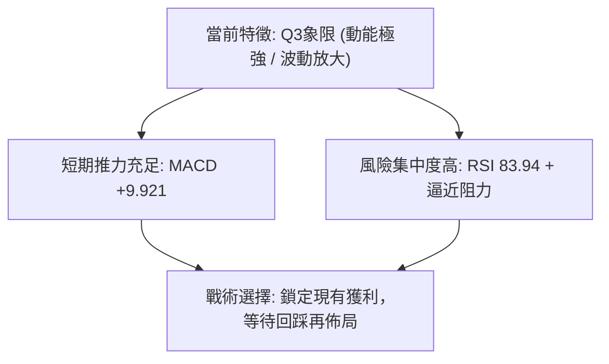

### 📊 ATR 波動率分析

- **ATR(14) 絕對數值**：**$20.67**
- **相對價格波動率**：**3.21%**
- **交易風控距離建議**：
  1. **短線動態止損 (1.0 × ATR)**：距進場點 **$20.67**。以此標準，當前價 $644.38 向下 1 ATR 為 **$623.71**，精確切齊年線 MA200 ($622.30)。
  2. **波段安全止損 (1.5 × ATR)**：距進場點 **$31.00**。對應價位為 **$613.38**，位於 MA50 ($600.20) 上方，可有效防止正常市場雜訊洗盤。

### 📐 Beta 與市場相關性

- **Beta 係數**：**1.243**
- **市場特徵解讀**：
  META 的 Beta 為 1.243，屬於典型的高彈性成長型權值科技股。當納斯達克或標普 500 上漲 1% 時，理論上 META 具備擴大至 1.24% 的彈性；反之，在市場遭遇宏觀流動性收緊或回調時，其回撤幅度亦會放大約 24%。在當前大盤背景下，其 1.243 的 Beta 意味著任何大盤的風吹草動都將在 META 上引發日內 $20 以上的震盪（符合 ATR $20.67 的特徵）。

---

## 7. 多時框架總結

### 📋 時框架評分表

| 時框架 | 趨勢方向 | 動能狀態 | 均線排列 | 形態特徵 | 綜合評分 | 操作建議 |
|--------|----------|----------|----------|----------|----------|----------|
| **長期 (月線)** | 中性盤整 | 偏弱 (從歷史高位回落) | 空頭排列 (MA20<50<200) | 大箱體寬幅震盪 | 45/100 🟡 | 核心倉位防禦，不宜長線重倉追高 |
| **中期 (週線)** | 偏多震盪 | 強勁 (MACD柱連續擴張) | 突破 MA200，測試頸線 | 潛在雙重底衝頂階段 | 65/100 🟢 | 波段逢拉回支撐做多，目標看頸線 |
| **短期 (日線)** | 強勢但過熱 | 極度超買 (RSI 83.94) | 站上所有短期均線 | 觸及布林上軌極限 | 55/100 🟡 | 禁止追買，分批獲利了結或空倉觀望 |

### 🔲 綜合訊號矩陣

| 維度 | 短期 (日線) | 中期 (週線) | 長期 (月線) | 訊號一致性判定 |
|------|-------------|-------------|-------------|----------------|
| **方向** | 多頭上攻 | 波段反彈 | 箱體盤整 | 矛盾：短中期衝勁遭遇長期箱體頂部壓制 |
| **動能** | 嚴重超買 (83.94) | 動能加速 (+9.92) | 中性修復 | 矛盾：週線動能充足但日線指標已達極限 |
| **價量** | 伴隨均量放大 | 量能維持健康 | 成交量未見歷史級天量 | 一致：具備基本量能支撐，非無量空漲 |
| **結構** | 突破短均 | 突破年線 $622.30 | 未破歷史高點 $788.22 | 收斂中：短線強勢正逐步向中期結構傳導 |

### ⚖️ 多時框收斂結論

**嚴格依據規則 14 執行多時框收斂收斂判定**：
1. **當前市場定性**：ADX(14) 讀數為 **16.77 (< 25)**，系統強制判定當前市場處於**「盤整行情（Range-bound Market）」**，而非單邊超級趨勢行情。
2. **收斂規則優先級**：在盤整格局下，日線布林通道（下軌 $521.32 至 上軌 $646.31）與斐波那契回調區間為主導交易邊界。
3. **最終唯一收斂結論**：**【中性偏多觀望，短線嚴禁追高】**。
   雖然短期多頭動能極強（+DI 35.93、MACD +9.921），但價格已達布林上軌極限（%B 0.98），且 RSI 處於 83.94 的嚴重超買區，前方緊鄰 50.0% 斐波那契強阻力 $654.00 與阻力 R1 $671.98。依優先級收斂，當前絕非趨勢爆發點，而是箱體震盪的上軌極值區，策略重心為防範回調，等待回踩支撐確認。

---

## 8. 交易策略建議

### 🗺️ 策略決策流程圖

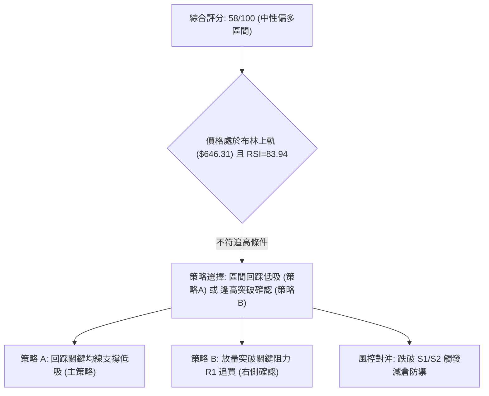

### 🧭 策略路由

**當前主策略方向 = 中性震盪偏多：以回踩支撐低吸為主（依技術評分卡 58/100）**
依據系統規則，綜合評分為 58/100（落於 40–60 區間震盪範疇），不採取單邊激進追高，主推**「耐性等待超買修正、回踩支撐位企穩後低吸」**之震盪波段策略。

### 🎯 價格情境階梯（Price Scenarios）

所有關鍵價位嚴格引用自數據之聚類與斐波那契計算：

| 觸發條件 | 下一目標 | 後續延伸 | 情境含義與操作指引 |
|----------|----------|----------|--------------------|
| **突破 R1 $671.98** | **R2 $688.48** | **R3 $709.16** | 確立雙重底頸線突破，日線超買被趨勢化消化，右側追多 |
| **受阻於 $646.31-$654.00** | **回測 S1 $636.95** | **測試 S2 $627.03** | 布林上軌與超買引發技術性回調，尋求 MA200/MA5 支撐（主情境） |
| **放量跌破 S2 $627.03** | **S3 $595.08** | **下探 $556.71** | 年線得而復失，短多動能徹底瓦解，回歸大箱體底部震盪 |

### 📊 情境機率分佈

| 情境類別 | 機率預估 | 主要技術指標依據 |
|----------|----------|------------------|
| **情境一：回踩支撐後再上行** | **55%** | MACD 柱狀體放大 (+9.921)、OBV 量能支撐，短線回踩消化 RSI 83.94 後具備二次衝擊頸線能力 |
| **情境二：直接高檔區間震盪** | **30%** | ADX 16.77 顯示無單邊趨勢，多空在布林上軌 $646.31 至 MA200 $622.30 間拉鋸消化獲利盤 |
| **情境三：假突破深度回落** | **15%** | 均線系統本質仍為空頭排列 (MA20<MA50<MA200)，若大盤轉弱引發高位多殺多，直接跌破 S2 |

### 🟢 主策略詳情

| 策略要素 | 策略 A（回踩穩健型 - 主推） | 策略 B（突破激進型 - 次選） |
|----------|----------------------------|----------------------------|
| **策略邏輯** | 等待 RSI 自 83 超買區回落，回踩支撐進場 | 實體大陽線放量突破 R1 頸線後順勢跟進 |
| **進場條件** | 價格回踩 S2 企穩，日線收下影陽線 | 日 K 實體收盤明確站穩 R1，量比 > 1.3x |
| **進場價格** | **$627.03** (支撐 S2 聚類點) | **$671.98** (阻力 R1 聚類點) |
| **止損價格** | **$608.00** (低於 MA50 $600.20 與 ATR 緩衝) | **$654.00** (跌回 50% 斐波那契回調位下方) |
| **目標價 T1** | **$654.00** (斐波那契 50.0% 分水嶺) | **$688.48** (阻力 R2 聚類點) |
| **目標價 T2** | **$671.98** (阻力 R1 聚類點) | **$709.16** (阻力 R3 聚類點) |
| **風險報酬比** | **1 : 2.36** <br>*(冒險 $19.03 獲取 $44.95)* | **1 : 2.07** <br>*(冒險 $17.98 獲取 $37.18)* |
| **預估勝率** | **65%** | **52%** |
| **建議倉位** | **15% - 20%** | **8% - 10%** |

### 🔴 反向風險觸發點（對沖提示）

- **多頭波段止損警戒線**：**$627.03 (S2)**。若日線實體跌破該價位，表明年線 $622.30 與 MA5 支撐全面失效，短線多頭應全部離場觀望。
- **全面翻空觸發點**：**$595.08 (S3)**。一旦跌破 S3，意味著潛在雙底反彈徹底失敗，價格將重探 52W 低點 $519.78，此時應啟動反向避險或做空操作。

### ⭐ 整體訊號強度評星

```
╔══════════════════════════════════════════════════════════════╗
║ 做多訊號強度：★★★☆☆  (3.0/5星 - 短線超買壓制，需等回踩)      ║
║ 做空訊號強度：★★☆☆☆  (2.0/5星 - 動能與量能強勁，逆勢空風險高)║
║ 整體可信度：  ★★★★☆  (4.0/5星 - 價量確認度高，關鍵位明確)    ║
╚══════════════════════════════════════════════════════════════╝
```

---

## 9. 風險提示與監控

### ✅ 關鍵監控指標 Checklist

```
╔══════════════════════════════════════════════════════════════╗
║              META 交易日常監控清單 (Checklist)               ║
╠══════════════════════════════════════════════════════════════╣
║ [ ] 監控 RSI(14) 是否跌破 80 形成超買背離修復                ║
║ [ ] 監控收盤價能否守穩布林中軌 MA20 ($583.81)                ║
║ [ ] 監控日成交量是否維持在 20日均量 (17.6M) 之上              ║
║ [ ] 監控 MA200 ($622.30) 是否轉化為有效波段支撐              ║
║ [ ] 監控阻力位 R1 ($671.98) 處是否有大額拋壓形成長上影線     ║
║ [ ] 監控 ATR(14) 是否異常放大超過 $25.00，提示波動失控風險   ║
║ [ ] 監控大盤波動（Beta=1.243 放大效應）對 META 的傳導        ║
╚══════════════════════════════════════════════════════════════╝
```

### ⚠️ 風險場景分析

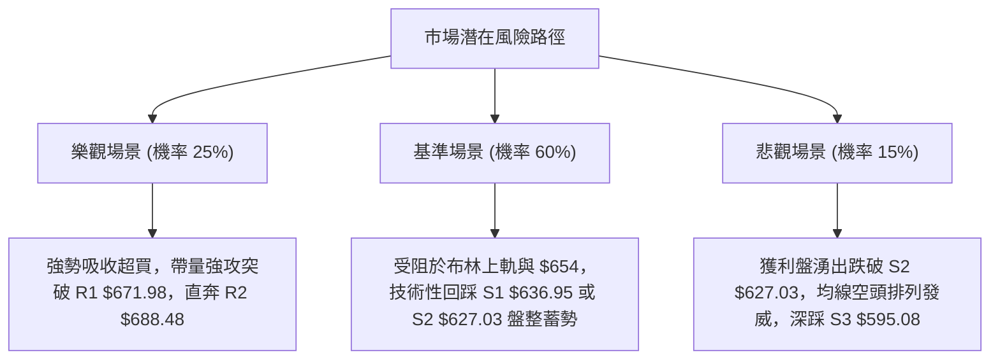

### 🛡️ 風險管理重要提醒

1. **嚴防指標極端鈍化後的斷崖式修正**：
   RSI(14) 當前高達 83.94，歷史數據表明，當 META 日線 RSI 超過 80 且處於非單邊趨勢（ADX < 25）時，高檔滯漲通常會引發 1.5 至 2.0 個 ATR（即 $30 - $40）的快速回調。切勿在 $644 以上進行大額追漲。
2. **倉位與槓桿嚴格控管**：
   因日均 ATR 達 $20.67（波動率 3.21%），單筆交易之最大止損額度不應超過總資金之 1.5%。若採用策略 A 於 $627.03 進場，止損點設為 $608.00（每股風險約 $19.03），倉位應嚴格限制在總資產的 15% 至 20% 以內，避免在震盪區間內過度放大槓桿。

---

## 📋 報告總結

```
╔══════════════════════════════════════════════════════════════╗
║                  META 技術分析報告總結                       ║
╠══════════════════════════════════════════════════════════════╣
║ 報告日期：2026-09-11                                         ║
║ 當前價格：$644.38                                            ║
║ 分析評級：⚖️ 中性偏多（波段反彈強勁，但短線面臨嚴重超買考驗）║
╠══════════════════════════════════════════════════════════════╣
║ 關鍵結論：                                                   ║
║ ├─ 長期趨勢：🟡 中性震盪（受限於 52W 區間 $519.78 - $788.22） ║
║ ├─ 中期趨勢：🟢 偏多反彈（週線 MACD 翻正，構築雙底雛形）     ║
║ ├─ 短期趨勢：🔴 極度超買（RSI 83.94，觸及布林上軌 $646.31） ║
║ ├─ 關鍵支撐：S1: $636.95 / S2: $627.03 / S3: $595.08         ║
║ ├─ 關鍵阻力：R1: $671.98 / R2: $688.48 / R3: $709.16         ║
║ └─ 分析師目標：均價 $754.15 (共識: Strong Buy / 57位分析師) ║
╠══════════════════════════════════════════════════════════════╣
║ 最優策略組合：                                               ║
║ 1. 🥇 最佳機會：回踩支撐 S2 ($627.03) 企穩低吸，停損 $608.00 ║
║ 2. 🥈 次選機會：突破 R1 ($671.98) 頸線放量追多，看至 $709.16 ║
║ 3. 🥉 保守選擇：空倉者全面觀望，等待日線 RSI 回落至 60 以下 ║
╚══════════════════════════════════════════════════════════════╝
```

---

> ⚠️ **免責聲明**：本報告為技術分析研究，所有價位、圖表與數據均基於歷史量價資訊推算。本報告**僅供學術研究與參考**，**不構成任何形式的投資買賣建議**。金融市場瞬息萬變，交易決策應獨立進行並自行承擔風險。

---

*報告生成時間：2026-09-11 ｜ 數據來源：Yahoo Finance ｜ 分析框架：多時框技術分析體系*