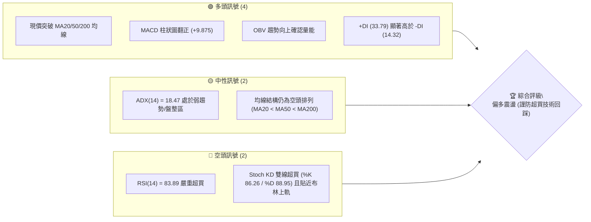
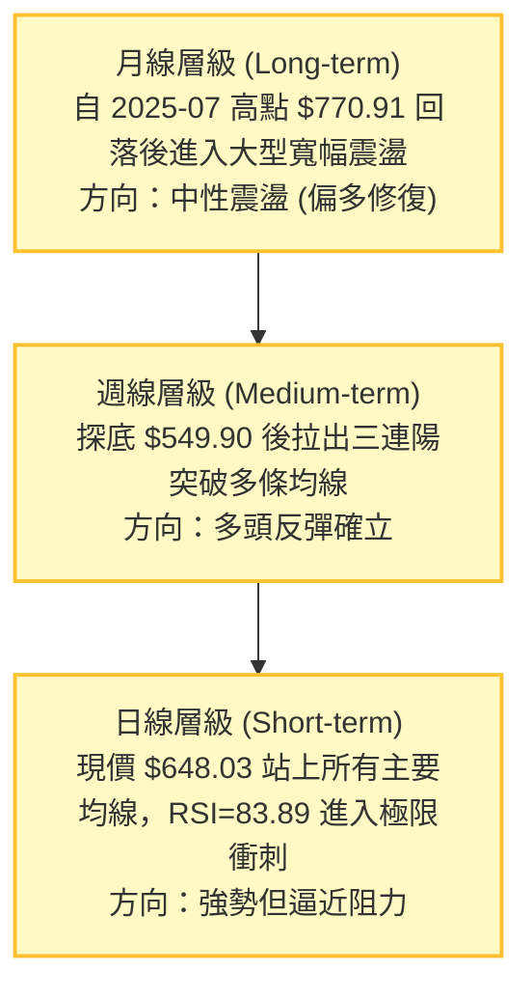
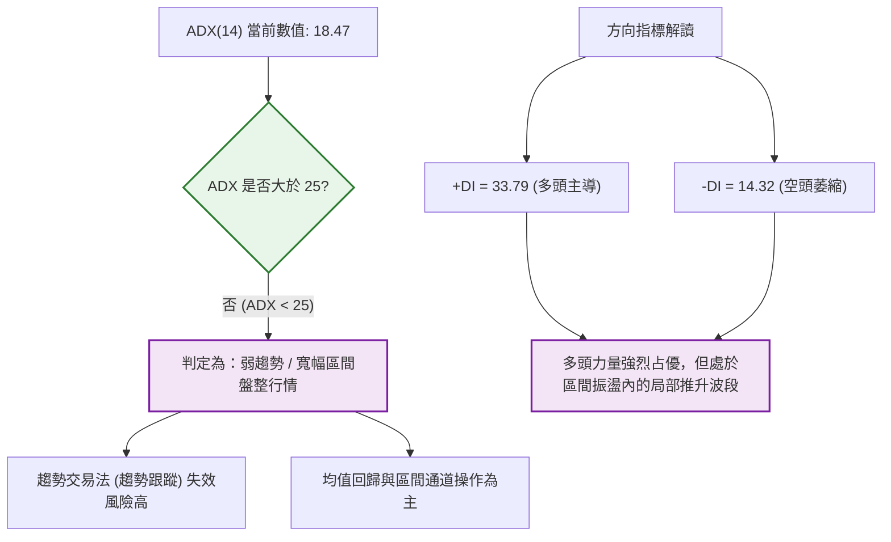
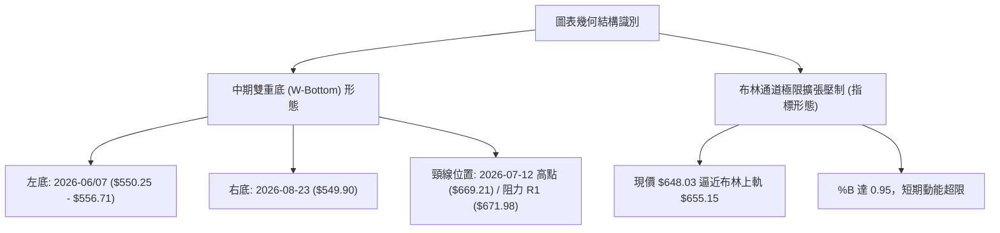
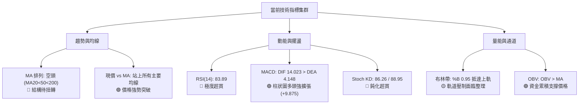
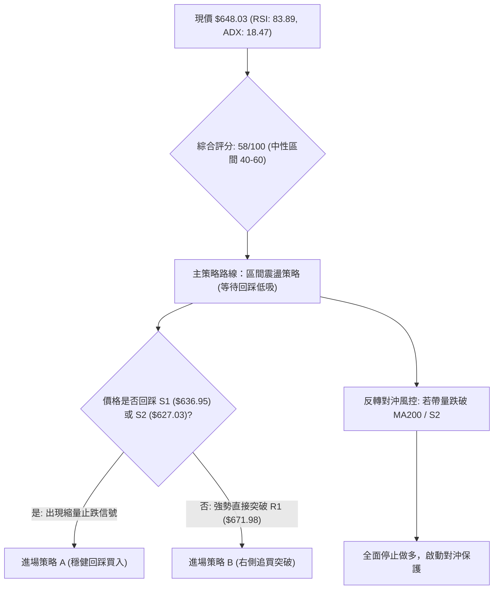
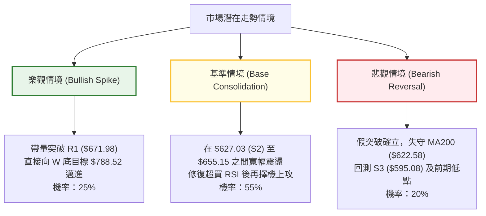

# META 技術分析報告

> **報告日期**：2026-09-13 ｜ **語言**：繁體中文 ｜ **數據來源**：Yahoo Finance ｜ **當前價格**：$648.03

---

## 目錄

| 章節 | 內容 |
|------|------|
| [1. 技術面概覽](#1-技術面概覽) | 訊號儀表板、核心指標、評分卡 |
| [2. 趨勢分析](#2-趨勢分析) | 多時框趨勢、長中短期走勢 |
| [3. 圖表形態分析](#3-圖表形態分析) | 形態識別、K線組合、目標價 |
| [4. 支撐與阻力](#4-支撐與阻力) | 關鍵價位、斐波那契回調 |
| [5. 技術指標深度解讀](#5-技術指標深度解讀) | MA/RSI/MACD/布林/成交量 |
| [6. 動能與波動率](#6-動能與波動率) | 動能評估、ATR、Beta |
| [7. 多時框架總結](#7-多時框架總結) | 時框架評分矩陣 |
| [8. 交易策略建議](#8-交易策略建議) | 多空策略、風險報酬比 |
| [9. 風險提示與監控](#9-風險提示與監控) | 監控指標、風險場景 |
| [10. 報告總結](#-報告總結) | 核心結論速查與策略清單 |

---

## 1. 技術面概覽

### 🎯 技術訊號儀表板



### 📊 核心指標速覽表

| 指標類別 | 指標名稱 | 當前數值 | 訊號 | 解讀 |
| :--- | :--- | :--- | :---: | :--- |
| **價格** | 當前價格 | $648.03 | 🟢 | 站上 52 週中位值（47.8%分位），短線由低檔大幅彈升 |
| **均線** | MA20 | $586.47 | 🟢 | 現價高於 MA20 達 +10.50%，短期乖離率偏高 |
| **均線** | MA50 | $600.90 | 🟢 | 現價高於 MA50 達 +7.84%，中期多頭取得主導 |
| **均線** | MA200 | $622.58 | 🟢 | 現價突破長期生命線 MA200（高出 +4.09%），轉強確立 |
| **均線結構**| 均線排列 | MA20<50<200 | 🟡 | 底層結構仍呈長期空頭排列，但短天期均線正加速金叉修復 |
| **動能** | RSI(14) | 83.89 | 🔴 | 進入深度超買區間（>70），短線具備鈍化或回踩風險 |
| **動能** | MACD (12,26,9) | 14.023 / 4.148 | 🟢 | DIF 線與訊號線雙雙翻正，柱狀圖 +9.875 展現極強動能 |
| **動能** | 隨機指標 (KD) | 86.26 / 88.95 | 🔴 | KD 雙線於 80 以上高檔鈍化，預示短線隨時有技術性整理需求 |
| **趨勢強度**| ADX(14) | 18.47 | 🟡 | 數值低於 25，顯示當前處於大區間修復行情的非單邊趨勢 |
| **方向指標**| +DI / -DI | 33.79 / 14.32 | 🟢 | 多方佔據絕對優勢，多頭推進力量顯著強於空方壓制 |
| **通道** | 布林帶 %B | 0.95 | 🔴 | 現價 $648.03 極度逼近布林上軌 $655.15，波動率擴張面臨軌道壓制 |
| **波動** | ATR(14) | $21.33 (3.29%) | 🟡 | 每日波幅適中，具備操作彈性但需配置合理止損幅度 |
| **量能** | 成交量 / OBV | 16.91M / 0.94x | 🟢 | 略低於20日均量，但 OBV > MA 表明資金呈累積流入狀態 |

### 🏆 技術評分卡

```
╔══════════════════════════════════════════════════════════════╗
║              技術評分卡 — META (2026-09-13)                  ║
╠══════════════════════════════════════════════════════════════╣
║ 趨勢強度      ████████░░░░░░░░░░░░  40/100  🟡 弱趨勢/區間震盪║
║ 動能指標      ██████████████░░░░░░  70/100  🟢 動能強但嚴重超買║
║ 支撐穩定度    ████████████████░░░░  80/100  🟢 站上MA200與S1 ║
║ 成交量配合    ████████████░░░░░░░░  60/100  🟢 OBV量能支撐上漲║
║ 形態完整度    ████████████░░░░░░░░  60/100  🟡 雙底頸線突破測試║
║ 均線排列      ████████░░░░░░░░░░░░  40/100  🟡 價格突破但排列待解║
╠══════════════════════════════════════════════════════════════╣
║ 綜合評分      ████████████░░░░░░░░  58/100  🟡 中性偏多 (區間)║
╚══════════════════════════════════════════════════════════════╝
```

---

## 2. 趨勢分析

### 🌐 多時框趨勢分析



### 📈 長期趨勢 — 12個月走勢圖（ASCII）

```
META 月線走勢圖（過去12個月：2025-10 至 2026-09）
價格 ($)
$750 ┤
     │
$700 ┤                   ● $715.22 (2026-01 波段頂部)
     │
$650 ┤ ● $646.67         │          ● $647.03              ● $648.03 (現價)
     │  \     ● $658.91  │           \                     /
$600 ┤   \   /           │            \   ● $611.34       /
     │    \ /            │             \ /        \      /
$550 ┤     ● $646.27     │              ● $571.60  ● $556.71 (2026-07 低點)
     └───────────────────┴───────────────────────────────────
        10   11   12    01   02   03   04   05   06   07   08   09 (月份)
        [----- 2025 -----] [----------------- 2026 -----------------]
```

#### 走勢特徵分析表格

| 時間階段 | 區間端點價位 | 漲跌幅 | 結構特徵與技術含義 |
| :--- | :--- | :---: | :--- |
| **2025-10 ~ 2025-12** | $646.67 → $658.91 | +1.89% | 高檔拉回後的底部築底盤整，波幅明顯收窄。 |
| **2025-12 ~ 2026-01** | $658.91 → $715.22 | +8.55% | 向上發動波段攻擊，逼近歷史高檔區，但未能突破前期天花板。 |
| **2026-01 ~ 2026-03** | $715.22 → $571.60 | -20.08% | 出現強烈拋壓，失守 $600 整數關卡，回測支撐帶。 |
| **2026-03 ~ 2026-05** | $571.60 → $631.92 | +10.55% | 中期反彈，重回 $600 之上，但動能未延續。 |
| **2026-05 ~ 2026-07** | $631.92 → $556.71 | -11.90% | 再次下探形成二次探底走勢，於 7 月觸及波段低點 $556.71。 |
| **2026-07 ~ 2026-09** | $556.71 → $648.03 | +16.40% | 自低檔強烈拉升，週線連續出量推升，完成底部翻轉。 |

### 📊 中期趨勢（週線分析）

```
META 週線架構示意圖（2026-05 至 2026-09）
$688.48 ────────────────────────────────────── 阻力 R2 (反彈延伸壓力)
$671.98 ───────────────────●────────────────── 阻力 R1 (前期7月反彈高點 $669.21 上方)
$654.00 ═══════════════════╪═════════════════ 斐波那契 50.0% 關鍵分水嶺
$648.03 ───────────────────* 現價 (多頭急速拉升直逼斐波50%)
$636.95 ┄┄┄┄┄┄┄┄┄┄┄┄┄┄┄┄┄┄┄┄┄┄┄┄┄┄┄┄┄┄┄┄┄┄┄┄ 支撐 S1 (近期起漲平台)
$622.58 ────────────────────────────────────── MA200 長期均線守護位
$550.00 ══════════════════════════════════════ 雙重底部支撐區 ($549.90 - $556.71)
```

### ⚡ 趨勢強度評估（ADX 解讀）



#### ADX 強度與市場狀態對照表

| ADX 數值區間 | 當前狀態 | 趨勢性質 | 策略指導原則 |
| :--- | :---: | :--- | :--- |
| **0 ~ 20** | **18.47 (當前)** | **無明顯單邊趨勢，大區間振盪** | **以布林通道上下軌、關鍵水平支撐阻力為交易邊界** |
| **20 ~ 25** | ── | 趨勢正在醞釀或處於過渡期 | 觀察突破方向，減少重倉操作 |
| **25 ~ 40** | ── | 明確且強勁的單邊趨勢 | 順應中長期均線方向回調買入或反彈做空 |
| **40 以上** | ── | 極強趨勢或即將力竭 | 緊縮止損，隨時準備迎接波段反轉 |

---

## 3. 圖表形態分析

### 🔍 形態識別系統



#### 形態識別與信心度評估表

| 形態名稱 | 信心度 | 判斷依據（引用真實數據） | 完成度 | 目標價（附嚴謹計算式） |
| :--- | :---: | :--- | :---: | :--- |
| **中期雙重底 (W-Bottom)** | **65%** | 兩次低點分別為 2026-07-05 週的 $550.25 及 2026-08-23 週的 $549.90，兩底幾乎平齊；頸線高點為 2026-07-12 週之 $669.21。 | **85%** | 頸線突破目標 = 頸線高點 $669.21 + (形態高度: $669.21 - $549.90 = $119.31) = **$788.52**（恰好與 52 週高點 $788.22 吻合） |
| **短期通道超買擠壓** | **80%** | 現價 $648.03 距離布林上軌 $655.15 僅 1.1%，且 %B 高達 0.95，RSI 超買至 83.89。 | **95%** | 均值回歸目標 = 回踩布林中軌 MA20（**$586.47**）或第一支撐位 S1（**$636.95**） |

### 🕯️ 重要 K 線形態分析

| 週/月份週期 | 收盤價 | 典型 K 線結構 | 技術意涵解讀 | 訊號方向 |
| :--- | :---: | :--- | :--- | :---: |
| **2026-07-12 週** | $669.21 | 大陽突破線 (量能 117.0M) | 空頭破線後強力反彈，形成底部第一次衝頂 | 🟢 強多 |
| **2026-08-02 週** | $556.71 | 長黑下殺破位線 (量能 112.1M)| 空方宣洩並測試前低，RSI 跌至 22.9 極限超賣 | 🔴 空方釋放 |
| **2026-08-23 週** | $549.90 | 探底長下影線 (量能 89.0M) | 創出波段次低，隨後引發買盤支撐，確認雙底右腳 | 🟢 築底完成 |
| **2026-09-06 週** | $616.77 | 中長陽線收復 MA200 | 多方帶量突破長期下行均線壓制，扭轉格局 | 🟢 轉強買訊 |
| **2026-09-13 週** | $648.03 | 光頭陽線直逼阻力 (量能 93.3M) | 多方延續強勢，但連續大漲後短線動能消耗過快 | 🟡 衝高防反噬 |

### 📉 ASCII 走勢形態示意圖

```
META 中期雙底形態 (W-Bottom) 架構展開
$671.98 ┼ - - - - - - - - - - - - - - - - - - - - - - - - 頸線阻力 (R1)
        │                  ▲ 頸線高峰 ($669.21)
$648.03 ┼──────────────────┼───────────────* 現價 ($648.03 逼近頸線)
        │                 / \             /
$610.00 ┼                /   \           /
        │               /     \         /
$580.00 ┼              /       \       /
        │             /         \     /
$550.00 ┼────────────●           └───● (右底 $549.90)
        │       (左底 $550.25)
        └───────────────────────────────────────────────► 時間 (週)
```

### 🎯 形態目標價計算

```
【雙重底形態測幅計算】
  1. 底部支撐基線 (Bottom Line) = $549.90 (取兩底聚類均值)
  2. 形態頸線水平 (Neckline)     = $669.21 (2026-07-12 週收盤峰值)
  3. 形態高度 (H)                = $669.21 - $549.90 = $119.31
  4. 形態理論突破目標價 (Target) = 頸線 + 形態高度
                                 = $669.21 + $119.31 = $788.52
  5. 目標價驗證：該測幅目標與 52 週高點 $788.22 誤差僅 0.04%，具備高度幾何對稱性。
```

---

## 4. 支撐與阻力

### 🗺️ 關鍵價位分布圖（ASCII）

```
META 價位結構分布圖 (由 OHLCV 與歷史波段計算)
══════════════════════════════════════════════════════════════
$709.16 ║████████████████████████████████████║ 強阻力 R3 (歷史波段上檔核心區)
$688.48 ║██████████████████████              ║ 阻力 R2 (波段高點聚類)
$671.98 ║██████████████████████████████      ║ 關鍵阻力 R1 (頸線壓力區)
$654.00 ┄┄┄┄┄┄┄┄┄┄┄┄┄┄┄┄┄┄┄┄┄┄┄┄┄┄┄┄┄┄┄┄┄┄┄┄┄ 斐波那契 50.0% 回調位
$648.03 ╠════════════════════════════════════╣ ◄ 當前價格 ($648.03)
$636.95 ║▓▓▓▓▓▓▓▓▓▓▓▓▓▓▓▓▓▓▓▓▓▓▓▓▓▓▓▓▓       ║ 近期支撐 S1 (短期回踩首要防線)
$627.03 ║██████████████████████              ║ 支撐 S2 (密集換手平台)
$622.58 ┄┄┄┄┄┄┄┄┄┄┄┄┄┄┄┄┄┄┄┄┄┄┄┄┄┄┄┄┄┄┄┄┄┄┄┄┄ 長期 MA200 / 斐波那契 61.8% ($622.32)
$595.08 ║████████████████████████████████████║ 強支撐 S3 (波段多頭最後底線)
══════════════════════════════════════════════════════════════
```

### 🚧 阻力位分析表

| 阻力級別 | 價位 | 形成原因（依據波段聚類數據） | 突破難度 | 重要性 |
| :---: | :---: | :--- | :---: | :---: |
| **R1** | **$671.98** | 近一年波段高點聚類位，且緊鄰前期反彈頂點 $669.21 與雙底頸線 | 🔴 高 | ★★★★★ |
| **R2** | **$688.48** | 近一年次級高點聚類，且與斐波那契 38.2% 回調位 ($685.67) 形成共振 | 🟡 中等 | ★★★★☆ |
| **R3** | **$709.16** | 2026年1月波段頂部區域 ($715.22) 前之重大阻力集群 | 🔴 極高 | ★★★★★ |

### 🛡️ 支撐位分析表

| 支撐級別 | 價位 | 形成原因（依據波段聚類數據） | 守住機率 | 重要性 |
| :---: | :---: | :--- | :---: | :---: |
| **S1** | **$636.95** | 近期突破之起漲平台，為短線回踩之首道承接線 | 75% | ★★★☆☆ |
| **S2** | **$627.03** | 密集波段低點聚類，與長期均線 MA240 ($631.98) 形成支撐帶 | 85% | ★★★★☆ |
| **S3** | **$595.08** | 中期關鍵整數防線聚類位，跌破將宣告中期反彈行情徹底終結 | 92% | ★★★★★ |

### 📐 斐波那契回調位分析

> **測算基點**：52 週低點 **$519.78** → 52 週高點 **$788.22**，全波段震幅 $268.44。

```
斐波那契回調層級分布與現價關係
  0.0%  (52W High) ────────────────────────── $788.22
  23.6%            ────────────────────────── $724.87
  38.2%            ────────────────────────── $685.67
  50.0%            ══════════════════════════ $654.00 ◄── 現價上方第一關鍵卡位
                   [ 當前價格落點: $648.03 ]
  61.8% (黃金分割) ══════════════════════════ $622.32 ◄── 共振 MA200 ($622.58)
  78.6%            ────────────────────────── $577.22
 100.0% (52W Low)  ────────────────────────── $519.78
```

#### 技術意義深入解讀：
1. **現價區間**：現價 $648.03 處於 **61.8% ($622.32)** 與 **50.0% ($654.00)** 兩大重要回調位之間。
2. **多空分水嶺考驗**：$654.00 為全波段跌勢的 50% 均分反彈位，多頭若能有效突破此位，代表空方反撲動能被徹底化解，行情將邁向強勢修復；在此之前，$654.00 將與阻力位 R1 ($671.98) 構成強大的「天花板疊加效應」。
3. **共振強支撐**：斐波那契 61.8% 回調位 **$622.32** 與日線 MA200 **$622.58** 數值僅相差 $0.26，構成了極為堅固的技術共振支撐帶，是中線多頭不容失守的生命線。

---

## 5. 技術指標深度解讀

### 🎛️ 指標訊號總覽



### 📈 移動平均線排列分析

```mermaid
graph TD
    subgraph CURRENT_STATE ["目前均線價格位置狀態"]
        P["現價: $648.03"]
        P -->|"高出 +4.09%"| M200["MA200: $622.58"]
        M200 -->|"高出 +3.61%"| M50["MA50: $600.90"]
        M50 -->|"高出 +2.46%"| M20["MA20: $586.47"]
    end
    
    subgraph MA_ORDER ["長期層級排列問題"]
        O1["MA20 ($586.47)"] < MA50["MA50 ($600.90)"]
        MA50 < MA200["MA200 ($622.58)"]
        ORDER_STATUS["底層結構仍為空頭排列<br>短線過快上漲導致短均尚未完成多頭交叉金叉"]
    end
```

#### 均線各天期走勢一覽表

| 均線名稱 | 當前價格 | 與現價乖離 | 走勢特徵 | 訊號意涵 |
| :--- | :---: | :---: | :--- | :---: |
| **MA 5** | $635.27 | +2.01% | 快速向上揚升（斜率極陡） | 🟢 超短線多頭主導 |
| **MA 10** | $610.88 | +6.08% | 強烈抬頭向上 | 🟢 短期推升動能充沛 |
| **MA 20** | $586.47 | +10.50% | 由下拐頭向上修復 | 🟡 短期嚴重正乖離 |
| **MA 50** | $600.90 | +7.84% | 走平開始轉向向上 | 🟢 中期轉向回暖 |
| **MA 60** | $595.09 | +8.90% | 由跌轉平 | 🟡 中期底部逐步墊高 |
| **MA 120** | $604.25 | +7.24% | 緩步下行 | 🔴 長期阻力消化中 |
| **MA 200** | $622.58 | +4.09% | 長期生命線，已被現價有效站上 | 🟢 長期空頭格局破局 |
| **MA 240** | $631.98 | +2.54% | 年線位置，現價已成功突破 | 🟢 超長期趨勢扭轉中 |

### 📉 RSI(14) 分析

```
RSI(14) 動能強度進度條
超賣(0-30)              中性區間(30-70)               超買區(70-100)
░░░░░░░░░░░░░░░░░░░░░░░░░░░░░░░░░░░░░░░░░░░░░░░░░░░░░░██████████████
0                    30                  70    83.89        100
                                               ▲ [目前數值: 83.89]
```

#### 背離與超買狀況判定：
- **數值分析**：當前 RSI(14) 讀數為 **83.89**，已遠超 70 超買分界線，處於典型的高位鈍化區。
- **背離檢查**：
  - 比對 2026-07-12 週高點 $669.21（當時週 RSI 為 68.7），而當前價格 $648.03 尚未創新高，但日線 RSI 高達 83.89。
  - **結論**：目前日線級別呈現「動能先行、價格未創前高」的快速衝刺特徵，**尚無明確頂背離結構（Price New High with Indicator Lower High）**；但 RSI 超過 80 往往暗示未來數個交易日內將出現乖離收斂或回踩均線的走勢。

### 📊 MACD(12,26,9) 訊號解讀


- **柱狀圖動態**：週線 MACD 柱連續數週由負轉正（-4.226 → +1.912 → +6.867 → +9.875），柱狀體斜率陡峭，證實中期底部買盤力道持續注入。
- **指標互驗**：MACD 強勁擴張與 RSI 的高檔鈍化形成呼應，說明目前不是「無量虛漲」，而是強勢買盤推動的報復性修復行情。

### 📦 布林通道分析

```
布林通道 (BB 20, 2) 與現價落點示意圖
$655.15 ┼──────────────────────────────────── 布林上軌 (Upper Band)
        │                                 * 現價 ($648.03, %B = 0.95)
$620.00 ┼
        │
$586.47 ┼──────────────────────────────────── 布林中軌 (MA20)
        │
$550.00 ┼
        │
$517.78 ┼──────────────────────────────────── 布林下軌 (Lower Band)
```

- **通道帶寬與位置**：帶寬顯著拉大（$655.15 - $517.78 = $137.37），表明波動率自前期的收斂中釋放。
- **%B 讀數解讀**：%B 高達 **0.95**（0 代表下軌，0.5 代表中軌，1.0 代表上軌）。現價幾乎「貼著上軌狂奔」，此為強勢行情的極致表現；然而，在 ADX < 25 的震盪大背景下，單邊「貼軌暴漲」通常難以長期維持，碰軌後大概率引發向中軌回歸的整理。

### 💹 成交量分析（量價配合度）

```
量價關聯評估矩陣
────────────────────────────────────────────────────────────
指標項目            數值 / 狀態         解讀結論
────────────────────────────────────────────────────────────
最新單日成交量      16,908,400          略微低於 20 日均量
20 日平均成交量     17,894,880          量比 0.94x (常態量能)
近三週成交量趨勢    85.4M → 81.4M → 93.3M  量能溫和放大
OBV (能量潮)        OBV > 均線 (MA)     資金持續處於累積淨流入
量價背離現象        無背離              價格上漲伴隨量能溫和放大
────────────────────────────────────────────────────────────
```

- **分析結論**：成交量並未出現天量誘多或極端縮量背離，OBV 保持高於其均線，代表主力機構籌碼並未趁反彈大舉出貨，籌碼結構健康。

---

## 6. 動能與波動率

### ⚡ 動能評估四象限

```
動能與波動率狀態定位矩陣
                高動能 (High Momentum)
                         │
          Q3: 高風險高收益│  Q1: 最佳多頭趨勢區
                         │      ★ [META 現價定位]
                         │      (MACD柱擴張/RSI>80)
   ──────────────────────┼──────────────────────
                         │
          Q4: 避免進場區  │  Q2: 謹慎觀望區
                         │
                低動能 (Low Momentum)
   低波動率 ────────────────────────────── 高波動率
   (Low Volatility)                      (High Volatility)
```

#### 象限狀態評估表

| 象限代號 | 動能狀態 | 波動率狀態 | 當前符合指標 | 策略評估與建議 |
| :---: | :---: | :---: | :--- | :--- |
| **Q1** | **強** | **中/高** | **✓ (META 歸屬)** | **現價處於動能爆發期，ATR 達 $21.33，適合波段獲利了結或等待回踩後低吸。** |
| **Q2** | 弱 | 低 | ── | 處於無聊整理階段，資金利用效率低。 |
| **Q3** | 強 | 極低 | ── | 潛在暴發前夕，可提早佈局突破。 |
| **Q4** | 弱 | 極高 | ── | 弱勢下殺擴大，嚴禁盲目摸底。 |

### 📊 ATR 波動率分析

```
ATR (14) 波動率與止損風控測算
────────────────────────────────────────────────────────────
當前 ATR(14) 數值：     $21.33 (佔現價比例：3.29%)
────────────────────────────────────────────────────────────
1. 短線保全性止損 (1.0x ATR)：  $648.03 - $21.33 = $626.70 (恰好落在 S2 $627.03 附近)
2. 波段常規性止損 (1.5x ATR)：  $648.03 - $32.00 = $616.03 (防守 MA200 之跌破)
3. 趨勢保護性止損 (2.0x ATR)：  $648.03 - $42.66 = $605.37 (防守 MA50 $600.90 整數關卡)
────────────────────────────────────────────────────────────
```

- **解讀**：每日 $21.33 的正常波動空間意味著短線日內交易不能將止損設得過窄（不可小於 $15），否則極易被日常噪聲掃出場。

### 📐 Beta 與市場相關性

```
Beta 係數特徵解讀
  當前 Beta 係數: 1.243
  
  [防禦型 < 1.0]           [大盤同步 = 1.0]          [高敏成長型 > 1.0]
  ░░░░░░░░░░░░░░░░░░░░░░░░░░░░░░░░░░░░░░░░░░░░░░░░░░██████████
                                                    ▲ [Beta: 1.243]
```

- **市場敏感度分析**：Beta 為 1.243，代表 META 相對於標普 500 指數具備 24.3% 的額外波動敏感度。若大盤指數上漲 1%，META 理論上漲 1.24%；反之亦然。在當前 RSI 嚴重超買且大盤若有風吹草動時，高 Beta 意味著回調幅度將較大盤更加劇烈。

---

## 7. 多時框架總結

### 📋 時框架評分表

| 時框架 | 趨勢方向 | 動能指標 | 均線排列 | 形態結構 | 綜合評分 | 戰術建議 |
| :---: | :---: | :---: | :---: | :---: | :---: | :--- |
| **月線 (Long)** | 🟡 寬幅震盪 | 🟡 中性回升 | 🔴 均線壓制依然存在 | 雙重探底形成中 | 55/100 | 逢低定投，關注年線支撐 |
| **週線 (Medium)**| 🟢 底部反彈 | 🟢 MACD 連續紅柱放大| 🟡 MA20/50 正在交叉 | W 底形態逼近頸線 | 65/100 | 波段持有，不追高阻力位 |
| **日線 (Short)** | 🟢 強烈衝刺 | 🔴 RSI=83.89 嚴重超買| 🟢 站上全部主要均線 | 貼近布林上軌面臨壓制 | 55/100 | 嚴禁追多，等待回踩低吸 |

### 🔲 綜合訊號矩陣

```
時框架訊號收斂矩陣
┌──────────────┬──────────────┬──────────────┬──────────────┐
│ 分析維度     │ 短期 (日線)  │ 中期 (週線)  │ 長期 (月線)  │
├──────────────┼──────────────┼──────────────┼──────────────┤
│ 趨勢方向     │ 🟢 多頭拉升  │ 🟢 底部翻轉  │ 🟡 寬幅箱體  │
│ 動能狀態     │ 🔴 嚴重超買  │ 🟢 動能充沛  │ 🟡 剛擺脫弱勢│
│ 均線架構     │ 🟢 站上均線  │ 🟡 交叉進行中│ 🔴 均線纏繞  │
│ 量能配合     │ 🟡 常態量能  │ 🟢 量增價揚  │ 🟡 縮量築底  │
├──────────────┼──────────────┼──────────────┼──────────────┤
│ 一致性評定   │ 短中長三者處於「反彈修復延伸期」，短線動能領先均線，但遭遇阻力聚類 │
└──────────────┴──────────────┴──────────────┴──────────────┘
```

### ⚖️ 多時框收斂結論

> **依嚴格規則 14 執行多時框收斂原則**：
> 1. **趨勢強度定性**：當前日線 ADX 為 **18.47 (< 25)**，明確指示當前市場屬於**「寬幅盤整震盪行情」而非單邊趨勢行情**。
> 2. **主導規則裁決**：在盤整行情下，**以日線布林通道上下軌 ($517.78 - $655.15) 與關鍵水平阻力支撐為主要交易邊界**；週線與月線的單邊突破訊號在未得到量能持續爆發前均不可過度外推。
> 3. **唯一方向性結論**：**中性偏多，但嚴禁追高；以高拋低吸之區間震盪策略為主導**。當前價格 $648.03 距離布林上軌 $655.15 及阻力 R1 $671.98 空間不足 3.7%，而 RSI 高達 83.89，勝率最高的戰術是等待超買引發的技術性回踩，於支撐位附近低吸介入。

---

## 8. 交易策略建議

### 🗺️ 策略決策流程圖



### 🧭 策略路由

- **綜合評分**：**58 / 100（屬於 40–60 中性震盪區間）**
- **當前主策略方向**：**【中性偏多，區間震盪操作】—— 主推「回踩支撐低吸策略」為主、「突破頸線追買」為輔，嚴禁於現價直接追高。**

### 🎯 價格情境階梯（Price Scenarios）

> **價位引用自第 4 章由 OHLCV 精確計算之水平**：

| 觸發條件 | 下一目標 | 後續延伸 | 情境技術含義與戰術指示 |
| :--- | :--- | :--- | :--- |
| **向上突破 R1 $671.98** | **R2 $688.48** | **R3 $709.16** | 突破雙底頸線與斐波 50% ($654.00)，形態徹底成型，打開上行空間。 |
| **維持 $636.95 ~ $655.15** | ── | ── | 現價區間受阻於布林上軌，指標高檔消化鈍化，屬於高位健康蓄勢。 |
| **向下回踩 S1 $636.95** | **S2 $627.03** | **S3 $595.08** | 技術性獲利了結回踩，考驗 MA200 ($622.58) 支撐力道，為最佳低吸點。 |

### 📊 情境機率分佈

| 預期情境 | 發生機率 | 主要技術依據 |
| :--- | :---: | :--- |
| **情境一：衝高回踩 / 區間震盪** | **55%** | ADX=18.47 顯示無單邊趨勢，RSI=83.89 深度超買，逼近布林上軌 $655.15 必然面臨震盪消化。 |
| **情境二：直接放量突破上行** | **25%** | MACD 柱狀圖 +9.875 極度強勢，OBV 呈資金流入，若消息面配合有小機率強勢逼空直接過頂。 |
| **情境三：跌破 MA200 深度回落**| **20%** | 底層均線仍呈空頭排列，若大盤重挫引發 Beta (1.243) 放大拋售，不排除二次回探。 |

### 🟢 主策略詳情（區間與回踩主導）

```
主策略佈局架構展示
$688.48 ───────────────────────────── 目標 T2 (阻力 R2)
$671.98 ───────────────────────────── 目標 T1 (阻力 R1 / 雙底頸線)
$648.03 ─── 現價 (嚴禁追多)
$636.95 ┄┄┄┄┄┄┄┄┄┄┄┄┄┄┄┄┄┄┄┄┄┄┄┄┄┄ 策略 A 進場點 1 (支撐 S1)
$627.03 ═════════════════════════════ 策略 A 進場點 2 (支撐 S2 / 密集平台)
$616.03 ───────────────────────────── 策略 A 止損點 (跌破 MA200 / 1.5x ATR)
```

#### 策略執行參數表

| 策略要素 | 策略 A（穩健型：回踩支撐低吸） | 策略 B（激進型：突破頸線跟進） |
| :--- | :---: | :---: |
| **操作性質** | 左側/右側結合：回調支撐買入 | 右側確認：突破阻力追強 |
| **進場條件** | 價格回踩至 S1~S2 區間，日線 RSI 回落至 55~65 且出下影線 | 日線收盤價強勢突破 R1，伴隨成交量大於 20M（量比 > 1.2x）|
| **進場價格** | **$631.98**（取 S1 與 S2 之均值附近，亦為 MA240） | **$673.00**（確認站上 R1 $671.98 之上） |
| **目標價 T1** | **$671.98**（獲利 +6.33%，測試阻力 R1） | **$688.48**（獲利 +2.30%，短線快攻阻力 R2） |
| **目標價 T2** | **$688.48**（獲利 +8.94%，測試阻力 R2） | **$709.16**（獲利 +5.37%，波段進攻阻力 R3） |
| **止損價格** | **$616.03**（防守跌破 MA200 $622.58，風險 -2.52%） | **$654.00**（跌回斐波那契 50% 假突破止損，風險 -2.82%） |
| **風險報酬比** | **2.51 : 1**（目標T1計）／ **3.55 : 1**（目標T2計） | **1.90 : 1**（以目標T2計算） |
| **勝率估計** | **65%** | **50%** |
| **建議倉位** | **總資金之 15% ~ 20%** | **總資金之 8% ~ 10%** |

### 🔴 反向風險觸發點（對沖提示）

若發生下列技術破位事件，主推之偏多區間策略立即宣告失效，應執行多頭部位全數出場或啟動反向空頭對沖：
1. **失守 $622.32 / $622.58**：若日線收盤價跌破斐波那契 61.8% ($622.32) 與長期生命線 MA200 ($622.58)，意味著本次向上突破為「多頭假突破陷阱」。
2. **量能惡意放大下殺**：若單日成交量突破 25M 且以大黑 K 貫穿 S2 ($627.03)，直接啟動空頭對沖，下檔第一測幅目標看至 S3 ($595.08)。

### ⭐ 整體訊號強度評星

```
做多訊號強度：★★★☆☆  (3.0/5星 — 短期動能極佳但面臨嚴重超買與阻力壓制)
做空訊號強度：★★☆☆☆  (2.0/5星 — 僅有超買反彈力竭預期，缺乏頂部形態確認)
整體可信度：  ★★★★☆  (4.0/5星 — 價位聚類清晰，布林與斐波那契共振明確)
```

---

## 9. 風險提示與監控

### ✅ 關鍵監控指標 Checklist

```
╔══════════════════════════════════════════════════════════════╗
║              關鍵監控指標 Checklist                          ║
╠══════════════════════════════════════════════════════════════╣
║ [ ] 監控項 1：RSI(14) 能否在不崩跌情況下良性回落至 60 附近？   ║
║ [ ] 監控項 2：現價能否帶量（>20M）一舉衝過 R1 ($671.98) 頸線？ ║
║ [ ] 監控項 3：下檔首要防線 S1 ($636.95) 在初次回踩時是否有承接？║
║ [ ] 監控項 4：生命線 MA200 ($622.58) 是否能持續抬頭向上？      ║
║ [ ] 監控項 5：布林上軌 ($655.15) 軌道是否進一步開口擴張？     ║
╚══════════════════════════════════════════════════════════════╝
```

### ⚠️ 風險場景分析



### 🛡️ 風險管理重要提醒

1. **嚴禁追高防範「雙重夾擊」**：現價距離布林通道上軌 $655.15 僅有 1.1% 空間，而日線 RSI 高達 83.89，此時進行追多操作，潛在獲利極小而向下均值回歸風險極大。
2. **單筆交易止損限制**：嚴格執行帳戶風險控制，單次操作虧損不得超過總資金之 1.5% ~ 2.0%。依策略 A（止損幅度約 $15.95，相當於 2.52%），整體倉位建議控制在 15%~20% 以內即可保證帳戶安全。
3. **高 Beta 衝擊防範**：META 的 Beta 達 1.243，當那斯達克或標普 500 指數出現技術性回檔時，個股跌幅會被等比放大，必須密切關注大盤整體環境。

---

## 📋 報告總結

```
╔══════════════════════════════════════════════════════════════╗
║              META 技術分析報告總結 (2026-09-13)              ║
╠══════════════════════════════════════════════════════════════╣
║ 當前價格：$648.03         52W 區間：$519.78 - $788.22        ║
║ 分析評級：⚖️ 中性偏多震盪 (ADX 18.47 指示無單邊，盤整為主)   ║
╠══════════════════════════════════════════════════════════════╣
║ 關鍵結論：                                                   ║
║ ├─ 長期趨勢：🟡 寬幅箱體盤整，底部支撐於 $550 展現極強韌性  ║
║ ├─ 中期趨勢：🟢 雙重底形態成型中，逼近頸線 $669.21 - $671.98 ║
║ ├─ 短期趨勢：🔴 價格極度強勢但日線 RSI(83.89) 嚴重超買      ║
║ ├─ 關鍵支撐：S1: $636.95 │ S2: $627.03 │ S3: $595.08       ║
║ ├─ 關鍵阻力：R1: $671.98 │ R2: $688.48 │ R3: $709.16       ║
║ └─ 機構目標：均價 $757.31 (共 57 位分析師，評級 Strong Buy)  ║
╠══════════════════════════════════════════════════════════════╣
║ 最優策略組合：                                               ║
║ 1. 🥇 最佳機會：等待回踩 S1~S2 區間 ($627-$636) 逢低進場做多 ║
║ 2. 🥈 次選機會：右側突破確認站上 R1 ($671.98) 追買快攻 R2    ║
║ 3. 🥉 保守選擇：在 $648 現價對已有持倉進行部分分批止盈      ║
╚══════════════════════════════════════════════════════════════╝
```

---

> ⚠️ **免責聲明**：本報告為技術分析研究成果，所有價位均基於歷史量價數據與數學模型計算得出。本報告**僅供學術交流與投資研究參考**，**不構成任何要約、招攬或具體投資買賣建議**。金融市場瞬息萬變，交易者應具備獨立判斷能力，嚴格設立止損並自行承擔交易風險。

---

*報告生成時間：2026-09-13 ｜ 數據來源：Yahoo Finance ｜ 分析框架：多時框技術量化體系*