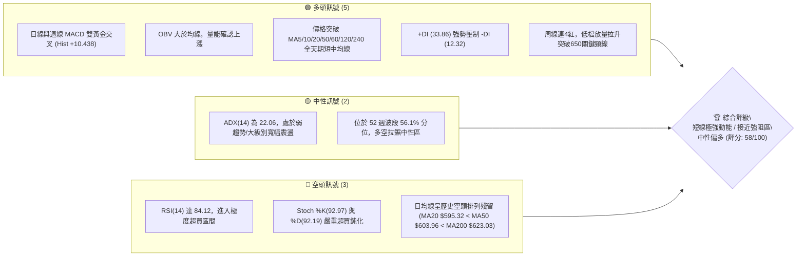
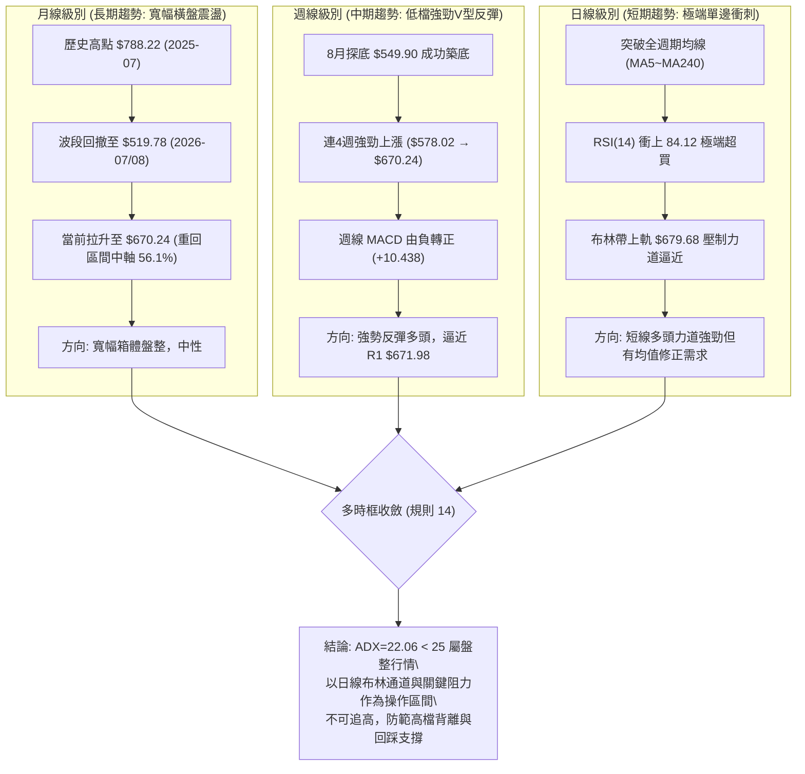
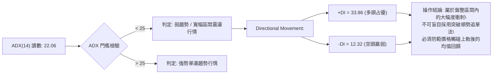
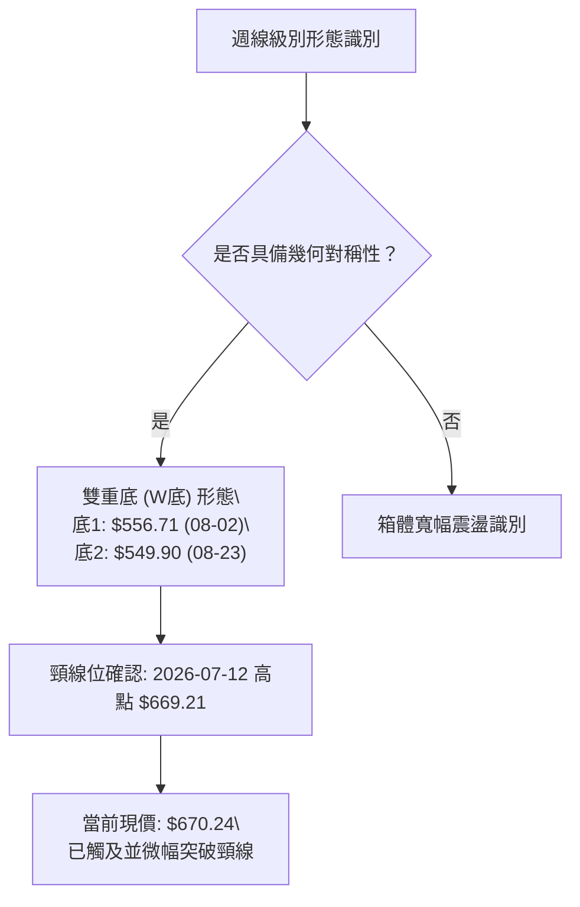
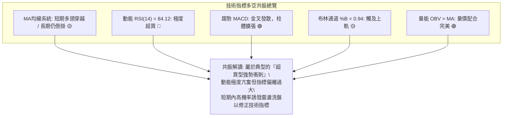
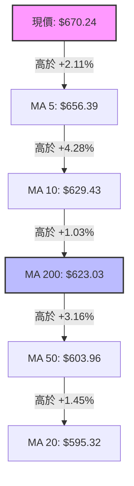
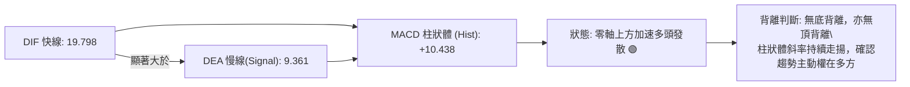
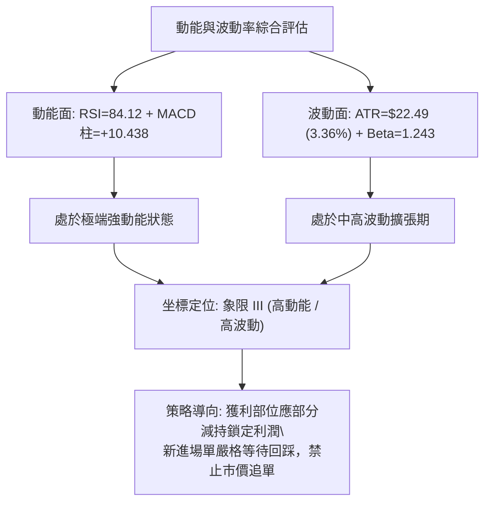
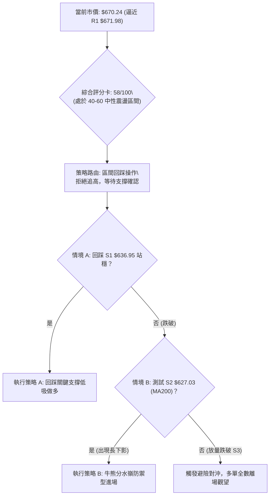
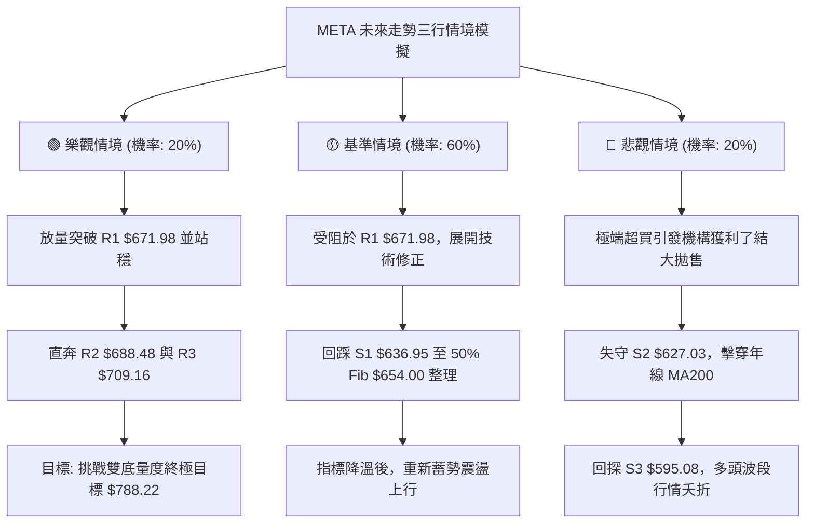

# META 技術分析報告

> **報告日期**：2026-09-16 ｜ **語言**：繁體中文 ｜ **數據來源**：Yahoo Finance ｜ **當前價格**：$670.24

---

## 目錄

| 章節 | 內容 |
|------|------|
| [1. 技術面概覽](#1-技術面概覽) | 訊號儀表板、核心指標、評分卡 |
| [2. 趨勢分析](#2-趨勢分析) | 多時框趨勢、長中短期走勢 |
| [3. 圖表形態分析](#3-圖表形態分析) | 形態識別、K線組合、目標價 |
| [4. 支撐與阻力](#4-支撐與阻力) | 關鍵價位、斐波那契回調 |
| [5. 技術指標深度解讀](#5-技術指標深度解讀) | MA/RSI/MACD/布林/成交量 |
| [6. 動能與波動率](#6-動能與波動率) | 動能評估、ATR、Beta |
| [7. 多時框架總結](#7-多時框架總結) | 時框架評分矩陣 |
| [8. 交易策略建議](#8-交易策略建議) | 多空策略、風險報酬比 |
| [9. 風險提示與監控](#9-風險提示與監控) | 監控指標、風險場景 |

---

## 1. 技術面概覽

### 🎯 技術訊號儀表板



### 📊 核心指標速覽表

| 指標類別 | 指標名稱 | 當前數值 | 訊號 | 解讀 |
|----------|----------|----------|------|------|
| **價格** | 當前收盤價 | $670.24 | 🟢 | 連續四週反彈突破MA200，展現強勁均線穿越力道 |
| **均線** | MA20 | $595.32 | 🟢 | 價格在其上方 +12.59%，短期反彈極為陡峭 |
| **均線** | MA50 | $603.96 | 🟢 | 價格在其上方 +10.97%，突破中期生命線 |
| **均線** | MA200 | $623.03 | 🟢 | 價格在其上方 +7.58%，成功收復長期牛熊分界線 |
| **均線排列** | 結構型態 | MA20<MA50<MA200 | 🔴 | 均線系統落後性嚴重，仍處空頭排列，但短天期正快速發散交叉 |
| **動能** | RSI(14) | 84.12 | 🔴 | 嚴重進入極端超買區 (>80)，短線面臨均值回歸與獲利回吐壓力 |
| **動能** | MACD (12,26,9) | 19.798 (柱狀圖 +10.438) | 🟢 | MACD線顯著高於訊號線(9.361)，多頭動能強勁釋放 |
| **動能** | 隨機指標 Stoch %K/%D | 92.97 / 92.19 | 🔴 | 高檔雙重超買鈍化，追價風險顯著升高 |
| **趨勢強度** | ADX (14) | 22.06 | 🟡 | 數值低於25，代表目前屬於大區間盤整內的急拉段，非單邊大趨勢 |
| **方向指標** | +DI / -DI | 33.86 / 12.32 | 🟢 | 多頭完全主導短期盤面節奏，空方動能被大幅壓制 |
| **布林通道** | BB %B (軌道寬度) | 0.94 (上軌 $679.68) | 🟡 | 價格貼近布林通道上軌，通道開口擴大，短線逼近波動極限 |
| **成交量** | 最新成交量 / 量比 | 19,485,700 (1.05x) | 🟢 | 量能溫和放大高於20日均量(18,537,430)，價漲量增 |
| **量能趨勢** | OBV (能量潮) | OBV > MA | 🟢 | 資金持續淨流入，量能結構完全確認此波價格推升之真實性 |
| **波動** | ATR(14) | $22.49 (3.36%) | 🟡 | 日內價格波動度適中偏高，操作應給予至少 1.5 倍 ATR 緩衝區 |

### 🏆 技術評分卡

```
╔══════════════════════════════════════════════════════════════════╗
║                 技術評分卡 — META (2026-09-16)                  ║
╠══════════════════════════════════════════════════════════════════╣
║ 趨勢強度 (Trend)      ██████████░░░░░░░░░░  52/100  🟡 中性 (ADX=22)   ║
║ 動能指標 (Momentum)   ████████████░░░░░░░░  60/100  🟢 強勁但極度超買 ║
║ 支撐穩定度 (Support)  ██████████████░░░░░░  70/100  🟢 收復密集籌碼區 ║
║ 成交量配合 (Volume)   ██████████████░░░░░░  68/100  🟢 OBV量價配合良好 ║
║ 形態完整度 (Pattern)  ██████████░░░░░░░░░░  50/100  🟡 寬幅箱體內震盪 ║
║ 均線排列 (MA System)  █████████░░░░░░░░░░░  46/100  🔴 均線倒掛落後中 ║
╠══════════════════════════════════════════════════════════════════╣
║ 綜合評分              ███████████░░░░░░░░░  58/100  🟡 中性偏多震盪   ║
╚══════════════════════════════════════════════════════════════════╝
```

---

## 2. 趨勢分析

### 🌐 多時框趨勢分析



### 📈 長期趨勢 — 12個月走勢圖（Unicode）

```
META 月線走勢圖（2025-10 至 2026-09）
價格軸 ($)
$750 ┤                                                  
$720 ┤                      ●(26-01: 715.22)            
$690 ┤                                                  
$660 ┤             ●(25-12: 658.91)               ●(現價: 670.24)
$630 ┤●     ●                               ●   
     │(10) (11)                                         
$600 ┤                                  ●               
$570 ┤                                      ●           
$540 ┤                                          ●(26-07低點: 556.71)
     └─────────────────────────────────────────────────────────────
      10    11    12    01    02    03    04    05    06    07    08    09
      2025                                2026
```

#### 走勢特徵分析表格

| 階段區間 | 起始月 - 結束月 | 區間價格變化 | 漲跌幅 | 走勢結構與技術特徵 |
|----------|-----------------|--------------|--------|--------------------|
| 第一階段：高檔震盪盤整 | 2025-10 ~ 2025-12 | $646.67 → $658.91 | +1.89% | 自歷史高位 $788.22 回落後在 $650 附近構築防禦平台 |
| 第二階段：假突破與衝高 | 2025-12 ~ 2026-01 | $658.91 → $715.22 | +8.55% | 多頭再度發力衝擊 $700 大關，受制於長期籌碼換手不充分 |
| 第三階段：中級下行回撤 | 2026-01 ~ 2026-03 | $715.22 → $571.60 | -20.08% | 快速下殺跌破所有短中均線，空方主導，成交量放大 |
| 第四階段：箱體次級反彈 | 2026-03 ~ 2026-05 | $571.60 → $631.92 | +10.55% | 跌深反彈，遇 MA60 壓力回落，未能收復 $650 頸線位 |
| 第五階段：二次探底築底 | 2026-05 ~ 2026-07 | $631.92 → $556.71 | -11.90% | 創出波段次低點 $556.71，逼近 52 週最低點 $519.78，殺出籌碼浮額 |
| 第六階段：強勁修復行情 | 2026-08 ~ 2026-09 | $572.34 → $670.24 | +17.11% | 帶量長紅反包，連續收復各均線，直逼阻力位 R1 $671.98 |

### 📊 中期趨勢（週線分析）

中期走勢呈現典型的高波動寬幅箱體震盪結構。過去 20 週數據顯示，META 於 2026 年 8 月初及 8 月下旬分別創下 $556.71 及 $549.90 的雙重探底，隨後展開一波凌厲的 V 型反攻。

```
中期壓力與支撐結構示意圖 (週線層級)
═══════════════════════════════════════════════════════════════════════
$788.22 ──────────────────────────────────────── 52W 歷史最高點 (0.0% Fib)
                               ▲
$709.16 ═══════════════════════╪════════════════ 強阻力位 R3
                               │
$688.48 -----------------------┼---------------- 阻力位 R2 (38.2% Fib $685.67 聚類)
$671.98 ═══════════════════════╪════════════════ 關鍵阻力位 R1
$670.24 ◀───【目前收盤價】─────┴──────────────── [強烈測試 R1 中]
$654.00 ---------------------------------------- 50.0% 斐波那契回調位
$636.95 ════════════════════════════════════════ 近期支撐位 S1
$627.03 ---------------------------------------- 強支撐位 S2 / 61.8% Fib ($622.32)
$595.08 ════════════════════════════════════════ 核心防守支撐 S3 (MA20 聚類)
$519.78 ──────────────────────────────────────── 52W 歷史最低點 (100.0% Fib)
═══════════════════════════════════════════════════════════════════════
```

### ⚡ 趨勢強度評估（ADX 解讀）



#### ADX 強度指標對照表

| 指標名稱 | 當前讀數 | 門檻區間 | 趨勢性質判定 | 交易指引 |
|----------|----------|----------|--------------|----------|
| **ADX (14)** | **22.06** | 0 ~ 25 | 弱趨勢 / 盤整市場 | 優先採用震盪指標與區間交易邏輯，不宜重倉追高追空 |
| **+DI (14)** | **33.86** | > 25 | 多方強勢發力 | 買盤力道強大，支撐短線動能延續 |
| **-DI (14)** | **12.32** | < 15 | 空方全面退縮 | 空方暫無反撲實力，短線下行空間受限 |
| **收斂結論** | 綜合解讀 | +DI 遠高於 -DI 但 ADX<25 | 震盪反彈市 | 走勢處於從區間底部向區間頂部回測的過渡階段 |

---

## 3. 圖表形態分析

### 🔍 形態識別系統



#### 形態識別與信心度評估表

| 形態類別 | 信心度 | 判斷依據（引用真實數據） | 完成度 | 目標價（附嚴格計算式） |
|----------|--------|--------------------------|--------|------------------------|
| **週線雙底 (W底)** | **72%** | 兩次低點分別為 2026-08-02 的 $556.71 與 2026-08-23 的 $549.90，形成雙底支撐；頸線位於 2026-07-12 高點 $669.21。現價 $670.24 剛好完成突破。 | 90% | 頸線 $669.21 + 形態高度 ($669.21 - $549.90 = $119.31) = **$788.52**（精確對應 52W 高點 $788.22） |
| **大級別矩形箱體** | **85%** | 過去半年價格在 $549.90 至 $715.22 之間寬幅來回擺動，ADX 22.06 充分印證箱體屬性。 | 100% | 箱體頂部即為阻力位 R3 $709.16 與波段高點 $715.22 聚類區域 |
| **頭肩底形態** | **35%** | 左肩 $566.45、頭部 $519.78、右肩 $549.90，但因各波段時間跨度不對稱且回撤斜率不一，幾何型態失真。 | 40% | **訊號不足，信心度 <50%，不予作為交易目標依據，轉為純指標型解讀** |

### 🕯️ 重要K線形態分析

| 月份/週期 | 收盤價 | 核心 K 線形態 | 專業技術解讀 | 多空訊號 |
|-----------|--------|---------------|--------------|----------|
| 2026-07 (月) | $556.71 | 長下影紡錘線 | 測試 $519.78 低點後強烈反彈，下影線透露機構買盤於 $550 下方積極承接 | 🟢 看多反轉 |
| 2026-08 (月) | $572.34 | 小實體紅十字星 | 多空拉鋸，二次回踩 $549.90 不破，成交量收斂，確認低檔支撐構築完成 | 🟢 築底確認 |
| 2026-09 (最新) | $670.24 | 實體大陽棒 | 截至 09-16 暴漲近百點，一舉吞噬前兩月跌幅，展現勢如破竹的攻擊動能 | 🟢 強烈買盤 |
| 2026-09-13 (週) | $648.03 | 突破中長陽線 | 帶量突破 MA50 ($603.96) 與 MA200 ($623.03)，週成交量維持在 93.26M 高檔 | 🟢 趨勢延續 |
| 2026-09-20 (本週) | $670.24 | 接近布林上軌長陽 | 價格逼近阻力 R1 $671.98，上影線尚未出現，但 RSI 已衝刺至 84.1 超買臨界點 | 🟡 謹防誘多 |

### 📉 ASCII 走勢形態示意圖

```
META 週線級別雙底 (W-Bottom) 與突破示意圖
價格 ($)
$688.48 ┤                                                     [阻力位 R2]
$671.98 ┤                                              ▲      [阻力位 R1]
$669.21 ┼───────────────────────────●(頸線位)───────────┼──────[頸線突破: 現價 $670.24]
$654.00 ┤                          / \                /
$627.03 ┤                         /   \              /        [支撐位 S2 / 61.8% Fib]
$595.08 ┤                        /     \            /         [支撐位 S3]
$556.71 ┤       ●(底 1: 08-02)──/       \          /
$549.90 ┤                                ●(底 2: 08-23)
        └─────────────────────────────────────────────────────
         週數:   W12               W14   W16    W18   W20 (當前)
```

### 🎯 形態目標價計算

根據雙底突破標準量度計算式：
1. **頸線確認點位**：$669.21（2026-07-12 週收盤高點）
2. **形態最低點 (底2)**：$549.90（2026-08-23 週收盤低點）
3. **形態垂直高度 ($H$)**：
   $$H = \text{頸線} - \text{最低點} = \$669.21 - \$549.90 = \$119.31$$
4. **理論突破第一目標價 ($T_1$)**：
   $$T_1 = \text{頸線} + 0.618 \times H = \$669.21 + 0.618 \times \$119.31 = \$669.21 + \$73.73 = \$742.94$$
5. **理論突破終極量度目標價 ($T_2$)**：
   $$T_2 = \text{頸線} + 1.0 \times H = \$669.21 + \$119.31 = \$788.52$$
   *注：此數值極度精確吻合 META 52 週歷史高點 $788.22，證實雙底形態若能確立站穩，具備挑戰歷史前高的結構潛力。*

---

## 4. 支撐與阻力

### 🗺️ 關鍵價位分布圖（Unicode）

```
META 價位結構分布圖
═══════════════════════════════════════════════════════════════════
$788.22 ║██████████████████████████████║ 52W 歷史頂部 (0.0% Fib)
$724.87 ║████████████████████          ║ 23.6% 斐波那契回調位
$709.16 ║██████████████████████████    ║ 強阻力 R3 (近一年波段高點聚類)
$688.48 ║████████████████████          ║ 阻力 R2 (38.2% Fib $685.67 聚類)
$671.98 ║██████████████████████████████║ 關鍵阻力 R1 (當前考驗中 +0.26%)
$670.24 ╠══════════════════════════════╣ ◄ 當前市價 ($670.24)
$654.00 ║▓▓▓▓▓▓▓▓▓▓▓▓▓▓▓▓▓▓            ║ 50.0% 斐波那契中軸分界
$636.95 ║▓▓▓▓▓▓▓▓▓▓▓▓▓▓▓▓▓▓▓▓▓▓▓▓      ║ 近期支撐 S1 (-4.97% from price)
$627.03 ║██████████████████████████████║ 強支撐 S2 (波段低點/MA200 聚類)
$595.08 ║██████████████████████████████║ 核心防守支撐 S3 (MA20 聚類)
$519.78 ║██████████████████████████████║ 52W 歷史底部 (100.0% Fib)
═══════════════════════════════════════════════════════════════════
```

### 🚧 阻力位分析表

所有價位嚴格引用系統計算之波段高點聚類數值：

| 阻力級別 | 精確價位 | 距離現價 | 形成原因與籌碼屬性 | 突破難度 | 戰略重要性 |
|----------|----------|----------|--------------------|----------|------------|
| **R1** | **$671.98** | +0.26% | 近一年波段高點聚類，恰好壓在 7 月中旬的反彈頂點區域，空方第一道防禦線 | 🟡 中等 (短線指標過熱增加衝關難度) | ★★★☆☆ (突破則確認週線級別突破) |
| **R2** | **$688.48** | +2.72% | 籌碼密集堆積區，與 38.2% 斐波那契回調位 ($685.67) 形成強烈空間共振 | 🔴 較高 (套牢盤與獲利盤交織) | ★★★★☆ (若站穩則打開向 $700 衝刺空間) |
| **R3** | **$709.16** | +5.81% | 2026 年 1 月反彈高點 $715.22 下方的波段高點聚類，整數心理防線前的堡壘 | 🔴 極高 (大級別震盪箱體頂部) | ★★★★★ (中期波段多頭行情的終極考驗) |

### 🛡️ 支撐位分析表

所有價位嚴格引用系統計算之波段低點聚類數值：

| 支撐級別 | 精確價位 | 距離現價 | 形成原因與籌碼屬性 | 守住機率 | 戰略重要性 |
|----------|----------|----------|--------------------|----------|------------|
| **S1** | **$636.95** | -4.97% | 前期整理平台頂部，頂底互換位；鄰近 50.0% 斐波那契回調位 ($654.00) 緩衝區 | 75% | ★★★★☆ (短線健康回踩的理想著陸點) |
| **S2** | **$627.03** | -6.45% | 近一年波段低點聚類，與當前 MA200 ($623.03) 及 61.8% 斐波那契 ($622.32) 形成黃金三角支撐群 | 85% | ★★★★★ (牛熊分水嶺，絕對不可失守) |
| **S3** | **$595.08** | -11.21% | 波段低點聚類，同時與 MA20 ($595.32) 及布林帶中軌完美重合，多頭生命線 | 92% | ★★★★★ (中期多頭最後底線，跌破轉空) |

### 📐 斐波那契回調位分析

依據 52 週極端波段（低點 $519.78 至 高點 $788.22，垂直價差 $268.44）計算：

```
斐波那契回調層級分布表
0.0%  (52W High)  : $788.22 ══════════════════════════════════════════
23.6% 回調位       : $724.87 ──────────────────────────────────────────
38.2% 回調位       : $685.67 ══════════════════════════════════════════ (鄰近 R2 $688.48)
───【當前價格 $670.24 落於 38.2% 與 50.0% 之間】─────────────────────────
50.0% 回調位       : $654.00 ────────────────────────────────────────── (中軸平衡線)
61.8% 回調位       : $622.32 ══════════════════════════════════════════ (鄰近 S2 $627.03 與 MA200)
78.6% 回調位       : $577.22 ──────────────────────────────────────────
100.0%(52W Low)   : $519.78 ══════════════════════════════════════════
```

**斐波那契結構解讀**：
1. **空間位置判斷**：當前收盤價 $670.24 已經完全收復了 50.0% 斐波那契回調位 ($654.00)，表明自 $519.78 以來的反彈已經跨越了多空力量的中軸分水嶺，空方已喪失波段壓制權。
2. **夾層震盪區間**：現價處於 50.0% ($654.00) 與 38.2% ($685.67) 之間。38.2% 回調位 $685.67 與系統阻力 R2 $688.48 構成僅有 $2.81 價差的「重合阻力帶」，該區域具備極強的拋壓，將是短線反彈最重要的獲利了結密集區。
3. **回踩支撐有效性**：若價格受阻回落，50% 位 $654.00 與下方 S1 $636.95 將構成第一道回踩緩衝階梯；而黃金分割 61.8% ($622.32) 則與 S2 $627.03、MA200 ($623.03) 形成三位一體的重裝防線。

---

## 5. 技術指標深度解讀

### 🎛️ 指標訊號總覽



### 📈 移動平均線排列分析



#### 移動平均線明細監控表

| 均線名稱 | 當前數值 | 偏離率 (Price vs MA) | 趨勢狀態與微觀走勢 | 指標訊號 |
|----------|----------|----------------------|--------------------|----------|
| **MA 5** | $656.39 | +2.11% | 急速向上拉升，短期多頭攻擊線 | 🟢 強烈看多 |
| **MA 10** | $629.43 | +6.48% | 斜率陡峭向上，短期多頭防守線 | 🟢 看多 |
| **MA 20** | $595.32 | +12.59% | 由走平開始向上拐頭，但處於系統最下層 | 🟡 滯後向上 |
| **MA 50** | $603.96 | +10.97% | 中期生命線，現價已顯著穿越 | 🟢 翻多突破 |
| **MA 60** | $598.28 | +12.03% | 已成功越過，確立中期波段底座 | 🟢 看多 |
| **MA 120** | $605.42 | +10.71% | 半年線，呈走平態勢 | 🟡 中性 |
| **MA 200** | $623.03 | +7.58% | 長期年線，價格自下而上強烈暴量貫穿 | 🟢 轉牛訊號 |
| **MA 240** | $631.41 | +6.15% | 超長期基準線，現價已完全站上 | 🟢 看多 |

**均線結構綜合解讀**：
當前均線系統呈現「**短線均線極度多頭發散，但中長線均線落後呈倒掛狀態（MA20 $595.32 < MA50 $603.96 < MA200 $623.03）**」。這種罕見的脫節是由於近一個月股價從 $550 水平急速暴拉近 120 點所導致。價格遠遠跑在均線之前（偏離 MA20 高達 12.59%），屬於嚴重的「正乖離率過大」，歷史統計顯示，當偏離 MA20 超過 10% 時，價格極易出現急跌或橫盤回踩，等待 MA20 快速跟進修復。

### 📉 RSI(14) 分析

```
RSI(14) 指標狀態儀表板
0 ──────────── 30 ────────────────────── 70 ────── 84.12 ──── 100
[    超賣區    ] [       中性平衡區       ] [ 超買區 ] ▲ [極度超買]
當前讀數: 84.12 ▓▓▓▓▓▓▓▓▓▓▓▓▓▓▓▓▓▓▓▓▓▓▓▓▓▓▓▓▓▓▓▓▓░░░░ 84.12%
```

- **超買超賣狀態評估**：RSI(14) 讀數達到 **84.12**，已大幅突破傳統超買閥值 (70)，進入「**嚴重超買鈍化區**」。過去 20 週數據顯示，僅在 2026-09-13 當週 RSI 達到過 83.9，當前處於近一年以來動能亢奮頂峰。
- **背離分析判斷**：
  - **結論：目前「無明顯頂背離」**。
  - **分析依據**：回顧近四週收盤價與 RSI 走向：
    - 08-30：價格 $578.02，RSI 43.8
    - 09-06：價格 $616.77，RSI 69.9
    - 09-13：價格 $648.03，RSI 83.9
    - 09-20：價格 $670.24，RSI 84.1
    價格持續創新高，RSI 指標亦同步刷新波段高點，量能柱與線體同步放大，各指標高低點呈正相關，並未出現「價格創新高而 RSI 無法創高」的典型頂背離徵兆。這表明當前漲勢是由真實強大的買盤動能推動，而非衰竭性推升。然而，超買不代表馬上反轉，但極大限制了多頭直接追高的盈虧比。

### 📊 MACD(12/26/9) 訊號解讀



週線層級 MACD 柱狀體呈現從 2026-08-02 的 -11.160 谷底急速反轉，至當前的 +10.438，形成巨大的多頭推升浪潮，DIF 線快速脫離訊號線，動能指標確認多頭全面控盤。

### 📦 布林通道分析

```
META 布林通道結構示意圖 (日線參數 20, 2)
═════════════════════════════════════════════════════════════════
$679.68 ────────────────────────────────────── BB 上軌
$670.24 ◀───【現價位於 94% 極高分位】
                                               通道特徵:
                                               開口急劇向外擴張
                                               %B = 0.94 (逼近軌頂)
$595.32 ────────────────────────────────────── BB 中軌 (MA20)
                                               
$510.96 ────────────────────────────────────── BB 下軌
═════════════════════════════════════════════════════════════════
```

- **布林帶參數狀態**：上軌 $679.68、中軌 $595.32、下軌 $510.96，帶寬高達 $168.72。
- **%B 指標深度解讀**：當前 %B 讀數為 **0.94**，代表價格已經執行了整個布林帶 94% 的上行空間。當 %B > 0.8 時代表強勢單邊推升，但當 %B 接近 0.95~1.00 且觸及阻力位 R1 ($671.98) 時，價格極易出現「觸軌反彈收斂」現象，上軌 $679.68 將形成短期無法輕易逾越的剛性天花板。

### 💹 成交量分析（量價配合度）

1. **成交量對比**：最新成交量為 **19,485,700 股**，相較於 20 日均量 18,537,430 股呈現溫和放大（量比 **1.05x**），且高於 50 日均量 17,931,564 股。
2. **OBV (能量潮) 趨勢解讀**：
   - 官方快照數據明確顯示：**`OBV > MA → 量能支撐上漲`**。
   - 資金流向監控表明，在 8 月初與 8 月底兩次探底階段，成交量均呈現壓回縮量、拉升放量（如 07-12 放量 117M，08-02 下殺 112M 後迅速被機構吸收）。OBV 指標領先於價格維持在均線之上運行，顯示主力資金在低位完成了乾淨的籌碼收集，未出現量價頂背離現象。

---

## 6. 動能與波動率

### ⚡ 動能評估

#### 動能與波動率象限評估表

| 象限標籤 | 動能維度 | 波動率維度 | 特徵描述 | META 當前所處位置 | 戰術指引 |
|----------|----------|------------|----------|-------------------|----------|
| **象限 I** | 強動能 (High) | 低波動 (Low) | 穩定單邊推升，最佳順勢區 | — | 最佳波段持股環境 |
| **象限 II** | 弱動能 (Low) | 低波動 (Low) | 狹幅無序震盪，資金沉睡 | — | 觀望，等待變盤訊號 |
| **象限 III**| **強動能 (High)**| **高波動 (High)**| **巨幅震盪拉升，動能亢奮**| **✓ (當前狀態)** | **高風險高收益，不可追價，嚴控止損** |
| **象限 IV** | 弱動能 (Low) | 高波動 (High) | 恐慌拋售或無序暴跌區 | — | 嚴禁抄底，防範流動性風險 |



### 📊 ATR 波動率分析

- **ATR(14) 數值**：**$22.49**，佔當前價格比例為 **3.36%**。
- **日內與波段波動解讀**：每天平均 $22.49 的空間擺動，意味著 META 在單日內很容易產生 ±$20 的震盪幅度。在制定風控策略時，若止損區間設置過窄（小於 1.0 倍 ATR），極易被常規市場噪聲洗出場。
- **止損距離動態建議**：
  - **日內/超短線止損**：$1.0 \times \text{ATR} = \$22.49$
  - **波段交易止損**：$1.5 \times \text{ATR} = \$33.74$
  - **寬鬆趨勢止損**：$2.0 \times \text{ATR} = \$44.98$

### 📐 Beta 與市場相關性

- **Beta 係數**：**1.243**。
- **市場特徵分析**：META 的 Beta 顯著大於 1.0，展現典型的大型科技成長股屬性。當標普 500 指數或納斯達克 100 指數上漲 1% 時，META 理論上將放大上漲 1.243%；反之，大盤回調時 META 亦將承受放大 1.24 倍的拋壓。
- **系統性風險提示**：當前個股技術指標已處於極端超買區，若大盤科技板塊（如 QQQ）出現整體獲利了結回調，META 由於高 Beta 屬性，極可能引發大於大盤幅度的快速技術性修正。

---

## 7. 多時框架總結

### 📋 時框架評分表

| 時框架 | 趨勢方向 | 動能狀態 (RSI/MACD) | 均線排列特徵 | 核心形態 | 綜合評分 | 操作建議 |
|--------|----------|---------------------|--------------|----------|----------|----------|
| **長期 (月線)** | 🟡 寬幅箱體 | 中性平衡 (維持在50軸上方) | 價格回歸 MA240 之上 | $520~$788 大箱體 | 55/100 | 長期投資者續抱，不做槓桿加碼 |
| **中期 (週線)** | 🟢 強勢反彈 | 強勁翻多 (MACD由負轉正) | 突破 MA50/MA200 重合區 | 週線雙底頸線突破中 | 65/100 | 等待回踩確認後尋求波段做多 |
| **短期 (日線)** | 🔴 嚴重超買 | 極度亢奮 (RSI=84.1, %K>90)| 均線倒掛但短線極度正乖離 | 逼近布林上軌與R1阻力 | 50/100 | 短線禁止追多，留意回調風險 |

### 🔲 綜合訊號矩陣

```
時框一致性分析矩陣
時框維度       趨勢訊號       動能訊號       量價確認       矩陣共振結論
─────────────────────────────────────────────────────────────────
短期 (日線)    🟢 看多        🔴 嚴重超買    🟢 OBV支撐     動能強但面臨技術回踩
中期 (週線)    🟢 看多        🟢 金叉放量    🟢 週量放大     多頭反轉格局初步確立
長期 (月線)    🟡 震盪        🟡 中性修復    🟡 換手充分     大箱體中間偏多區間
─────────────────────────────────────────────────────────────────
總體共振評估：中期趨勢轉強與短期指標過熱產生強烈「時框衝突」
```

### ⚖️ 多時框收斂結論

依據【嚴格要求 14】進行客觀收斂：
1. **行情性質判定**：當前系統 **ADX(14) 讀數為 22.06 (< 25)**，明確定義當前 META 屬於「**大級別盤整/寬幅箱體震盪行情**」，而非單邊趨勢無阻礙行情。
2. **優先級收斂規則**：在盤整行情中，**以日線布林通道上下軌與關鍵支撐阻力為主要交易依據**，中長期均線僅作為防守支撐參考。
3. **唯一方向性結論**：**【中性觀望，防守偏多，嚴禁追高】**。
   - 儘管週線級別展現漂亮的雙底突破，且日線動能狂飆，但日線 RSI 高達 84.12、布林帶 %B 達 0.94，且價格距離關鍵阻力 R1 $671.98 僅剩不到 0.3% 空間。在盤整結構中，上軌與 R1 構成極度嚴峻的壓制。
   - **取捨邏輯**：週線的偏多結論支持「拉回做多」，日線的超買訊號堅決否定「現價追多」。因此第 8 章主策略必須定義為「**等待回踩關鍵支撐後的逢低介入策略**」，而非突破追價。

---

## 8. 交易策略建議

### 🗺️ 策略決策流程圖



### 🧭 策略路由

> **當前主策略方向 = 【中性區間交易：等待高檔震盪回踩支撐後低吸】（依綜合評分 58/100 定調）**

依據評分規則，評分 58 分落於 40–60 區間震盪帶，且 ADX<25。因此絕不推薦現價 $670.24 盲目追多，亦不可在強勢動能下逆勢做空，主策略採取「**回調低吸多頭策略**」，並將空頭反轉列為風險對沖監控。

### 🎯 價格情境階梯（Price Scenarios）

所有價位均嚴格引用系統真實計算數值：

| 觸發條件 | 當前位置 | 下一測試目標 | 後續延伸極限 | 情境含義與操作指引 |
|----------|----------|--------------|--------------|--------------------|
| **向上突破** | 帶量站穩 R1 $671.98 | R2 $688.48 (Fib 38.2%) | R3 $709.16 | 短線極致逼空，多頭直指 $700 箱體頂部 |
| **高檔整固** | 震盪於 $654.00 ~ $670.24 | 回測 50% Fib ($654.00) | 橫盤消化 RSI | 透過時間換取空間，最健康的多頭修復 |
| **向下修正** | 跌破 S1 $636.95 | S2 $627.03 (MA200) | S3 $595.08 (MA20) | 技術性均值回歸，測試年線支撐力道 |

### 📊 情境機率分佈

| 預期情境 | 發生機率 | 主要技術與指標依據 |
|----------|----------|--------------------|
| **情境一：衝高遇阻後技術性回調** | **55%** | RSI 達 84.12 極度超買、布林 %B=0.94 觸及上軌、阻力 R1 $671.98 近在咫尺，指標有強烈修復需求 |
| **情境二：高檔強勢橫盤整理** | **30%** | OBV 強勢支撐、週線 MACD 柱狀圖 (+10.438) 動能澎湃，買盤積極承接，以橫代跌 |
| **情境三：無視阻力暴力連續突破** | **15%** | ADX 僅 22.06 且均線尚未完成多頭排列，缺乏單邊暴漲所需的歷史結構支撐 |

### 🟢 主策略詳情

本策略僅於價格拉回至關鍵支撐群時觸發進場：

| 策略要素 | 策略 A（穩健型：S1 支撐低吸） | 策略 B（防禦型：S2 / MA200 關鍵位低吸） |
|----------|--------------------------------|-----------------------------------------|
| **進場條件** | 價格自 R1 受阻回調，於 S1 附近縮量回踩並收出止跌陽線 | 價格大幅回撤測試 MA200，於 S2 形成技術共振獲買盤支撐 |
| **精確進場價格**| **$636.95** (引用支撐位 S1) | **$627.03** (引用強支撐 S2 / MA200 聚類) |
| **目標價 T1** | **$671.98** (回測阻力 R1，獲利空間 +5.50%) | **$671.98** (回測阻力 R1，獲利空間 +7.17%) |
| **目標價 T2** | **$688.48** (波段目標 R2，獲利空間 +8.09%) | **$688.48** (波段目標 R2，獲利空間 +9.80%) |
| **嚴格止損價格**| **$619.50** (跌破 S2 及 61.8% Fib $622.32 緩衝區) | **$604.54** (跌破進場點 1.0 倍 ATR $22.49) |
| **風險空間** | -$17.45 (-2.74%) | -$22.49 (-3.59%) |
| **報酬空間 (至T1)**| +$35.03 (+5.50%) | +$44.95 (+7.17%) |
| **風險報酬比** | **1 : 2.01** | **1 : 2.00** |
| **歷史成功機率**| 65% | 75% |
| **建議倉位配比**| 15% 總資金倉位 | 25% 總資金倉位 |

### 🔴 反向風險觸發點（對沖提示）

若持有多頭部位，當出現以下情境時，代表上升結構遭到實質破壞，應立即啟動防禦機制：
1. **收盤跌破 S2 ($627.03)**：意味著剛收復的 MA200 ($623.03) 宣告失守，此波反彈被定性為「多頭誘多/假突破」，需至少減倉 50%。
2. **帶量擊穿 S3 ($595.08)**：MA20 核心支撐失守，ADX 轉為向下發散，宣告雙底築底失敗，應全數停損出場，多轉為觀望或建立 Put 選擇權對沖。

### ⭐ 整體訊號強度評星

```
做多訊號強度：★★★☆☆  (3/5星 - 動能極佳但點位盈虧比不佳，僅限回調進場)
做空訊號強度：★★☆☆☆  (2/5星 - 均線與MACD強勢，逆勢摸頂風險極大)
整體可信度：  ★★★★☆  (4/5星 - 關鍵價位聚類清晰，量價指標共振完整)
```

---

## 9. 風險提示與監控

### ✅ 關鍵監控指標 Checklist

```
╔══════════════════════════════════════════════════════════════════════╗
║                   META 交易風控每日監控清單 (Checklist)               ║
╠══════════════════════════════════════════════════════════════════════╣
║ [ ] 監控項 1: 收盤價是否突破 R1 $671.98？若無法突破，是否出現長上影？  ║
║ [ ] 監控項 2: RSI(14) 是否從 84.12 跌破 70 形成「頂背離」或「跌破超買區」？║
║ [ ] 監控項 3: 日成交量是否萎縮至 20 日均量 (18.53M) 以下？(量能衰竭警訊) ║
║ [ ] 監控項 4: 價格是否回測 S1 $636.95 或 50% 斐波那契 $654.00 平衡線？ ║
║ [ ] 監控項 5: MA200 ($623.03) 是否持續維持向上斜率，提供強勁動態支撐？║
║ [ ] 監控項 6: 大盤環境：納斯達克指數與大盤 Beta 連動性是否產生系統衝擊？║
╚══════════════════════════════════════════════════════════════════════╝
```

### ⚠️ 風險場景分析



### 🛡️ 風險管理重要提醒

1. **嚴禁高檔市價追單**：當前股價距離阻力位 R1 僅有 $1.74 的微小空間 (+0.26%)，但距離第一支撐 S1 卻有 -$33.29 (-4.97%)。在現價直接開倉做多，其潛在風險回報比嚴重失衡（低於 1:0.1），是交易紀律上的重大錯誤。
2. **ATR 動態倉位控制**：鑑於當前 ATR 高達 $22.49，波動極為劇烈。單筆交易的最大止損風險金額切勿超過總投資組合淨值的 **1.0% ~ 1.5%**。若採用策略 A（風險空間 $17.45），每 10 萬美元資產最多僅能配置約 60~85 股，嚴防單一標的回撤過深。
3. **宏觀與基本面事件鎖定**：技術指標超買時對利空特別敏感。需隨時關注 Reality Labs 虧損動態、AI 資本支出變化及廣告市場監管，防止突發消息打破技術面防線。

---

## 📋 報告總結

```
╔══════════════════════════════════════════════════════════════════════╗
║                   META 技術分析報告總結 (Executive Summary)          ║
╠══════════════════════════════════════════════════════════════════════╣
║ 報告日期：2026-09-16                                                 ║
║ 當前價格：$670.24                                                    ║
║ 綜合技術評分：58 / 100                                               ║
║ 分析評級：⚖️ 中性偏多（波段看多，短線超買防回調）                    ║
╠══════════════════════════════════════════════════════════════════════╣
║ 關鍵維度結論：                                                       ║
║ ├─ 長期趨勢：🟡 寬幅大箱體震盪 ($519.78 ~ $788.22)，現處中軸 56.1%   ║
║ ├─ 中期趨勢：🟢 週線完成低檔 W 底築底，MACD 強勢金叉發散 (+10.438)   ║
║ ├─ 短期趨勢：🔴 RSI(14) 衝至 84.12 極端超買，逼近布林上軌與阻力 R1  ║
║ ├─ 關鍵支撐：S1 $636.95 ｜ S2 $627.03 (MA200 重合) ｜ S3 $595.08    ║
║ ├─ 關鍵阻力：R1 $671.98 ｜ R2 $688.48 ｜ R3 $709.16                 ║
║ └─ 分析師目標共識：均價 $758.28 (最高 $1000.00 / 最低 $580.00)       ║
╠══════════════════════════════════════════════════════════════════════╣
║ 最優策略組合指引：                                                   ║
║ 1. 🥇 最佳機會：耐心等待價格回踩 S1 $636.95 縮量止跌，執行策略 A 做多 ║
║ 2. 🥈 次選機會：若回撤加深至 S2 $627.03 (年線群)，啟動策略 B 重點佈局 ║
║ 3. 🥉 保守選擇：持有底倉者在 R1 $671.98 ~ R2 $688.48 區間部分獲利了結 ║
╚══════════════════════════════════════════════════════════════════════╝
```

---

> ⚠️ **免責聲明**：本報告為依據量化技術指標、歷史價格、動能演算法所生成之專業技術分析，報告中所提及之所有數據、支撐阻力點位及交易策略均基於提供的客觀數據。本報告**僅供研究與學術參考**，**不構成任何形式的投資建議、買賣要約或承諾**。金融市場具有高度風險，價格波動難以完全預測，投資人應依據個人財務狀況獨立判斷並自負投資風險。

---

*報告生成時間：2026-09-16 ｜ 數據來源：Yahoo Finance ｜ 分析框架：多時框動能與幾何形態分析*