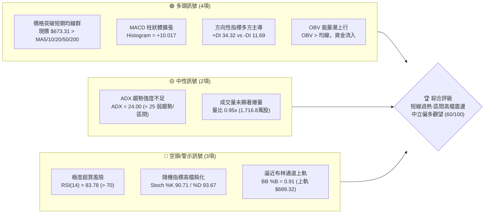
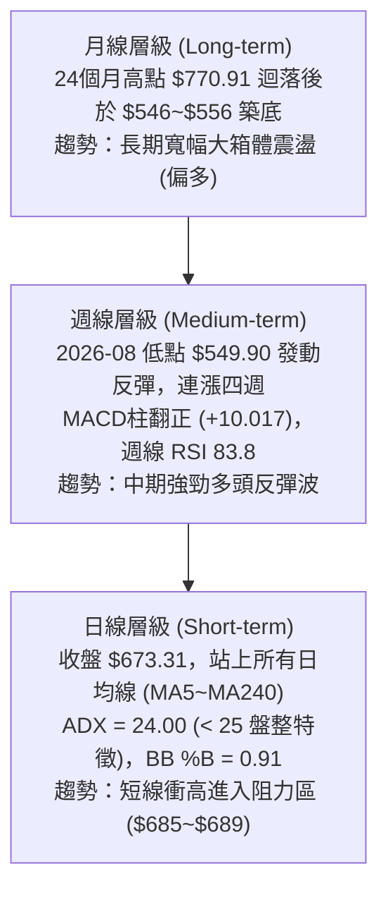
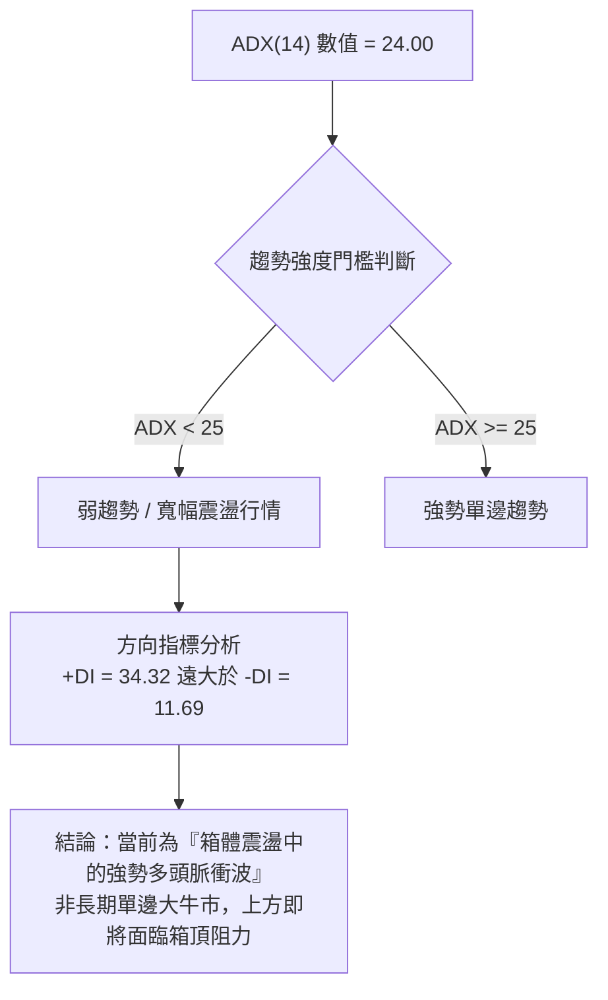
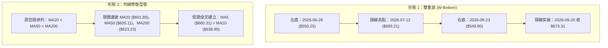
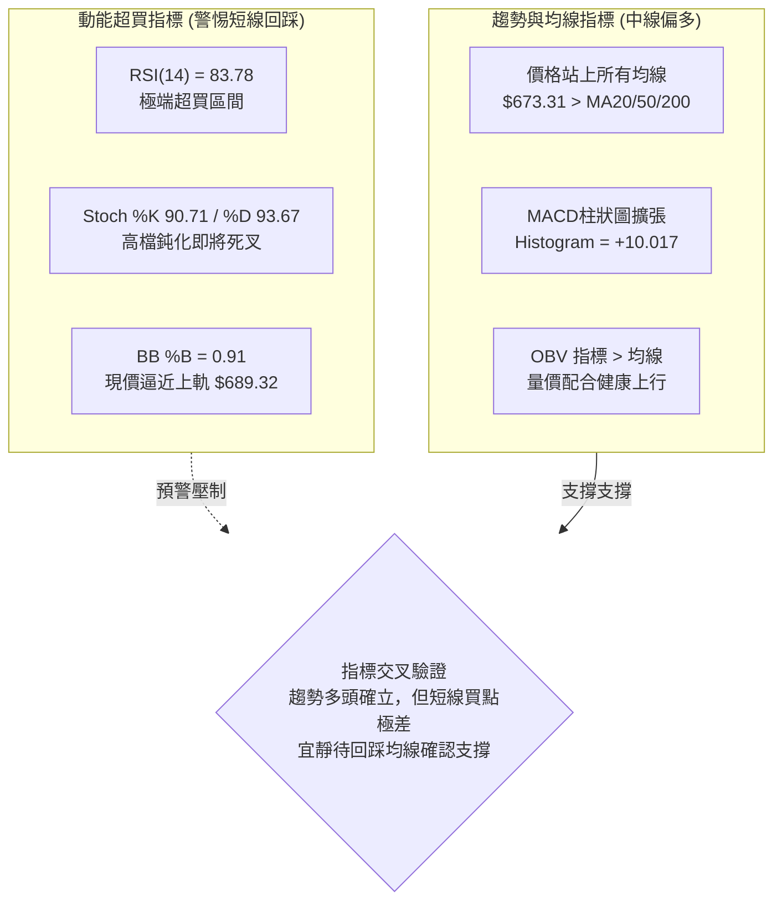
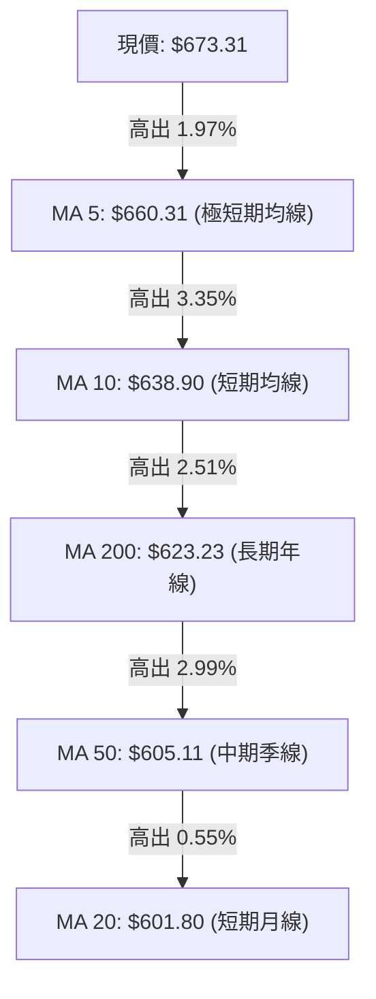
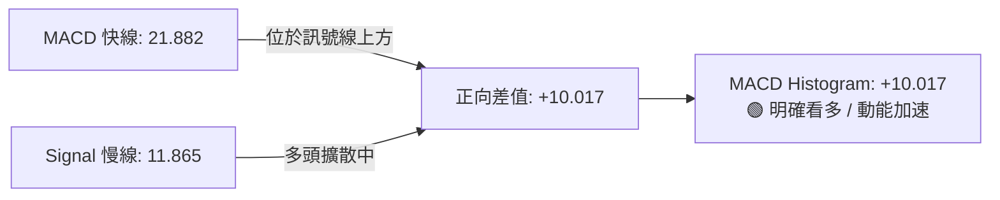
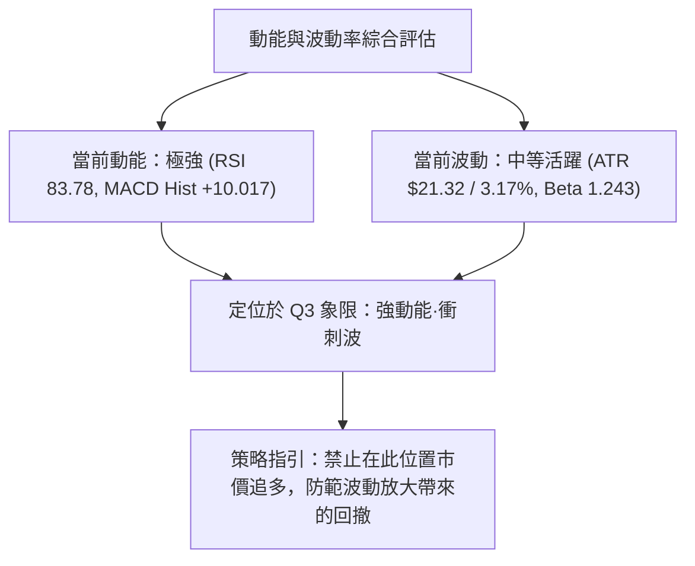
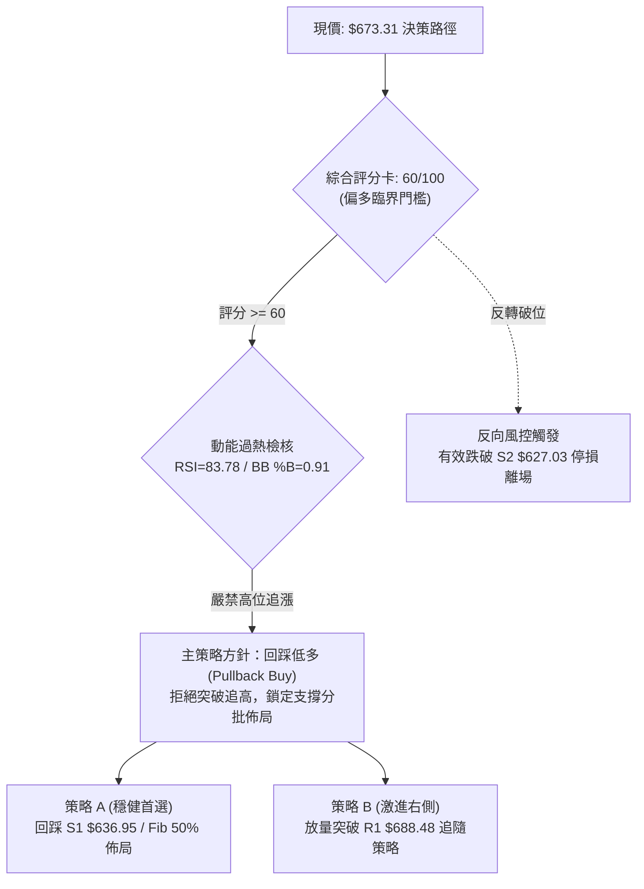
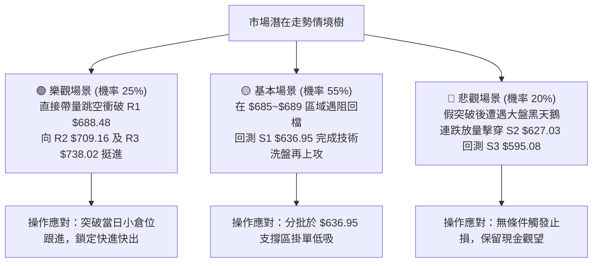

# META 技術分析報告

> **報告日期**：2026-09-17 ｜ **語言**：繁體中文 ｜ **數據來源**：Yahoo Finance ｜ **當前價格**：$673.31

---

## 目錄

| 章節 | 內容 |
|------|------|
| [1. 技術面概覽](#1-技術面概覽) | 訊號儀表板、核心指標、評分卡 |
| [2. 趨勢分析](#2-趨勢分析) | 多時框趨勢、長中短期走勢、ADX 趨勢強度 |
| [3. 圖表形態分析](#3-圖表形態分析) | 形態識別、K線組合、形態目標價推算 |
| [4. 支撐與阻力](#4-支撐與阻力) | 關鍵價位聚類、斐波那契回調結構 |
| [5. 技術指標深度解讀](#5-技術指標深度解讀) | 均線系統、RSI、MACD、布林通道、OBV量價 |
| [6. 動能與波動率](#6-動能與波動率) | 動能四象限、ATR 波動率與止損、Beta 係數 |
| [7. 多時框架總結](#7-多時框架總結) | 時框架評分表、訊號矩陣、多時框收斂結論 |
| [8. 交易策略建議](#8-交易策略建議) | 策略路由、價格情境階梯、主策略明細、對沖點 |
| [9. 風險提示與監控](#9-風險提示與監控) | 關鍵指標 Checklist、情境樹、風控與倉位管理 |
| [📋 報告總結](#-報告總結) | 核心技術結論與最優策略組合 |

---

## 1. 技術面概覽

### 🎯 技術訊號儀表板



### 📊 核心指標速覽表

| 指標類別 | 指標名稱 | 當前數值 | 訊號 | 解讀 |
|:---|:---|:---|:---:|:---|
| **價格** | 當前收盤價 | $673.31 | 🟢 | 位於52週區間 57.2% 位置，已脫離底部反彈 |
| **短期均線** | MA5 / MA10 | $660.31 / $638.90 | 🟢 | 短期均線呈陡峭多頭斜率，價格強勢貼著均線上攻 |
| **中期均線** | MA20 / MA50 | $601.80 / $605.11 | 🟢 | 現價大幅高於 MA20 (+11.88%) 及 MA50 (+12.20%) |
| **長期均線** | MA200 | $623.23 | 🟡 | 現價已收復 MA200，但中長天期均線仍處於扣抵與修復階段 |
| **動能指標** | RSI (14) | 83.78 | 🔴 | 進入嚴重超買區間（>70），短線具備技術性拉回修正壓力 |
| **動能指標** | MACD (12,26,9)| 21.882 (柱 +10.017) | 🟢 | MACD 線穿過訊號線 (11.865)，柱狀圖持續放大，買盤充沛 |
| **擺動指標** | Stoch %K / %D | 90.71 / 93.67 | 🔴 | 雙線位於 90 以上嚴重超買區，隨時可能出現高檔死叉 |
| **趨勢強度** | ADX (14) | 24.00 (+DI 34.32) | 🟡 | ADX < 25 表明非單邊超級單邊趨勢，屬於波段急彈接近箱頂 |
| **波動帶** | 布林通道 (%B) | 0.91 (寬度 $175.04) | 🟡 | 現價逼近布林上軌 ($689.32)，中軌位於 $601.80，留意壓回 |
| **波動率** | ATR (14) | $21.32 (3.17%) | 🟡 | 每日平均波動幅度約 21 美元，波動處於中等活躍狀態 |

### 🏆 技術評分卡

```
╔══════════════════════════════════════════════════════════════╗
║              技術評分卡 — META (2026-09-17)                  ║
╠══════════════════════════════════════════════════════════════╣
║ 趨勢強度 (ADX/方向)   ████████████░░░░░░░░  60/100  🟡 中性  ║
║ 短期動能 (MACD/斜率)  ████████████████░░░░  80/100  🟢 強勁  ║
║ 動能超買 (RSI/Stoch)  ██████░░░░░░░░░░░░░░  30/100  🔴 過熱  ║
║ 支撐穩定度 (結構位)   ██████████████░░░░░░  70/100  🟢 良好  ║
║ 成交量配合 (OBV/量比) ████████████░░░░░░░░  60/100  🟡 中等  ║
║ 均線架構 (均線修復)   ████████████░░░░░░░░  60/100  🟡 改善  ║
╠══════════════════════════════════════════════════════════════╣
║ 綜合技術評分          ████████████░░░░░░░░  60/100  🟡 偏多  ║
║ 評級結論：短線強勢但嚴重超買，箱頂壓力大，建議「拉回低多」   ║
╚══════════════════════════════════════════════════════════════╝
```

---

## 2. 趨勢分析

### 🌐 多時框趨勢分析



### 📈 長期趨勢 — 12個月走勢圖（Unicode）

以下為過去 12 個月（2025-10 至 2026-09）之每月收盤價與價格位階分佈圖：

```
META 月線走勢圖（2025-10 至 2026-09）
價格軸 ($)
$720 ┤                      ●(715.22)
$680 ┤                                                    ●(673.31 最新)
$640 ┤●(646.67) ●(646.27) ●(658.91)   ●(647.03)     ●(631.92)
$600 ┤                                          ●(611.34)
$560 ┤                                ●(571.60)           ●(563.29) ●(556.71) ●(572.34)
     └──────────────────────────────────────────────────────────────────────────
       25-10   25-11   25-12   26-01   26-02   26-03   26-04   26-05   26-06   26-07   26-08   26-09
```

**12 個月走勢特徵分析表**：

| 階段 | 涵蓋月份 | 區間價格變動 | 區間漲跌幅 | 走勢特徵與技術解讀 |
|:---|:---|:---|:---:|:---|
| **第一階段：高檔震盪盤跌** | 2025-10 ~ 2025-12 | $646.67 → $658.91 | +1.89% | 自 2025 年 7 月歷史次高 $770.91 回檔後的平台整理期 |
| **第二階段：年初假突破** | 2026-01 ~ 2026-02 | $715.22 → $647.03 | -9.53% | 1月衝高至 $715.22 後迅速遭遇拋壓，2月長黑下挫失守 $650 |
| **第三階段：下行探底築底** | 2026-03 ~ 2026-07 | $571.60 → $556.71 | -2.61% | 於 $546 ~ $570 區間反覆測試支撐，7月收在 $556.71（低點不破） |
| **第四階段：暴力底抽反彈** | 2026-08 ~ 2026-09 | $572.34 → $673.31 | +17.64% | 8月確認築底完畢，9月連拉中大陽線直奔 $673.31，吞噬前三月跌幅 |

### 📊 中期趨勢（週線分析）

從近 20 週數據觀察，META 呈現標準的「V型/雙重底築底回升」走勢：
1. **雙底確認點**：2026-06-28 創下收盤低點 $550.25，2026-08-02 再次探底收 $556.71，隨後 2026-08-23 週收 $549.90 後徹底止跌回升。
2. **量價齊揚突破**：自 2026-08-30 週收 $578.02（MACD柱翻正為 +1.912）起，隨後三週連續大漲，2026-09-06 週收 $616.77、2026-09-13 週收 $648.03，至 2026-09-20 最新收盤價 $673.31，週線動能極為強勁。
3. **動能過熱警訊**：週線 RSI(14) 伴隨急漲直接竄升至 83.8，且週 MACD 柱狀體達到 +10.017。顯示中期波段已來到第一波延伸滿足區。

### ⚡ 趨勢強度評估（ADX 解讀）



| 指標名稱 | 當前數值 | 參考標準區間 | 強度狀態 | 交易指導意義 |
|:---|:---|:---:|:---:|:---|
| **ADX (14)** | **24.00** | < 20 無趨勢 / 20-25 弱趨勢 / > 25 強趨勢 | 🟡 弱趨勢/區間 | 依多時框收斂規則，本行情本質為大區間震盪，切忌追高 |
| **+DI (14)** | **34.32** | > 25 強多頭主導 | 🟢 極強 | 多頭買盤在短線掌控絕對主動權 |
| **-DI (14)** | **11.69** | < 15 空方動能微弱 | 🟢 空方衰竭 | 空頭力量全面退縮，尚無主動砸盤跡象 |

---

## 3. 圖表形態分析

### 🔍 形態識別系統



**形態信心度與目標價評估表**：

| 形態名稱 | 信心度 | 判斷依據（嚴格引用數據） | 完成度 | 目標價（附嚴格計算式） |
|:---|:---:|:---|:---:|:---|
| **雙重底 (W-Bottom)** | **75%** | 兩次波段低點分別為 2026-06-28 之 $550.25 與 2026-08-23 之 $549.90，兩者幾乎完全對齊（誤差 < 0.1%）。中期反彈波峰（頸線）為 2026-07-12 之收盤價 $669.21。現價 $673.31 已正式突破頸線。 | 95% (剛突破) | **由形態高度推算**：<br/>形態高度 = 頸線 $669.21 - 低點 $549.90 = $119.31<br/>測幅滿足目標價 = 頸線 $669.21 + $119.31 = **$788.52**（極度貼近 52週高點 $788.22） |
| **均線空翻多修復** | **85%** | 短期 MA5 ($660.31) 與 MA10 ($638.90) 向上穿越所有中長均線，現價 $673.31 高出 MA200 ($623.23) 達 8.04%。 | 80% (進行中) | 均線交叉乖離修復，目標測試阻力區 R1 $688.48 與 R2 $709.16 |
| **頭肩底形態** | **35%** | 數據中未偵測到標準左右肩對稱架構（左側未見明顯肩部結構）。 | 0% | **訊號不足，僅做指標型解讀**，不予採用。 |

### 🕯️ 重要K線形態分析

| 週期/月份 | 收盤價 | K線形態 | 解讀 | 訊號 |
|:---|:---:|:---|:---|:---:|
| **2026-06 週線** | $550.25 | 帶長下影線錘子線 (Hammer) | 探底 52週低點 $519.78 附近後強勁買盤介入托底 | 🟢 轉折訊號 |
| **2026-07 週線** | $669.21 | 大陽線實體包覆 (Bullish Engulfing) | 7月第二週成交量達 1.17 億股，主力資金暴力回補 | 🟢 強勢看多 |
| **2026-08-23 週** | $549.90 | 縮量探底十字星 (Doji) | 二次探底成交量萎縮，空方動能耗盡形成次低點 | 🟢 雙底確認 |
| **2026-09-06 週** | $616.77 | 穿頭破腳中陽線 | 連續突破 MA20 ($601.80) 與 MA50 ($605.11)，確認反轉 | 🟢 多頭表態 |
| **2026-09-20 週** | $673.31 | 高檔光頭光腳陽線 | 強勢逼近 $680 大關，但伴隨 RSI 83.8，出現短線竭盡隱憂 | 🟡 警惕滯漲 |

### 📉 ASCII 走勢形態示意圖

```
META 雙重底 (W-Bottom) 與頸線突破結構示意圖
價格 ($)
$700 ┤                                                    ▲ 突破目標延伸 $709.16
$680 ┤                                       ▲ 現價 $673.31
$669 ┤               [頸線峰位 $669.21]─────/──────────── 頸線阻力轉支撐
$640 ┤             /                  \     /
$620 ┤            /                    \   /
$600 ┤           /                      \ /
$580 ┤          /                        ●
$550 ┤  底1: ● $550.25 (2026-06)         底2: ● $549.90 (2026-08)
     └────────────────────────────────────────────────────────────► 時間
```

### 🎯 形態目標價計算

1. **雙底形態量度漲幅（Measured Move Target）**：
   - 底層最低收盤價基點：$549.90
   - 頸線確認收盤價位：$669.21
   - 形態垂直高度（H）= $669.21 - $549.90 = $119.31
   - 第一波段保守滿足點（0.618 延伸）= $669.21 + ($119.31 × 0.618) = **$742.94**（逼近阻力位 R3 $738.02）
   - 形態完全量度滿足點（1.000 延伸）= $669.21 + $119.31 = **$788.52**（與 52週最高價 $788.22 完全吻合）

---

## 4. 支撐與阻力

### 🗺️ 關鍵價位分布圖（Unicode）

```
META 價位結構分布圖 (Resistance & Support Cluster)
═══════════════════════════════════════════════════════════════
$788.22 ║████████████████████████████████████████║ 52週歷史高點 (0.0% Fib)
$738.02 ║████████████████████████████████        ║ 強阻力 R3 (近一年波段高點聚類)
$724.87 ║▓▓▓▓▓▓▓▓▓▓▓▓▓▓▓▓▓▓▓▓▓▓▓▓▓▓▓▓            ║ 斐波那契 23.6% 回調阻力
$709.16 ║████████████████████████                ║ 次要阻力 R2 (密集成交區)
$689.32 ║████████████████████                    ║ 布林通道上軌壓力位
$688.48 ║████████████████████                    ║ 關鍵阻力 R1 (波段高點聚類)
$685.67 ║▓▓▓▓▓▓▓▓▓▓▓▓▓▓▓▓▓▓                      ║ 斐波那契 38.2% 關鍵分水嶺
$673.31 ╠════════════════════════════════════════╣ ◄◄ 當前收盤價 ($673.31)
$654.00 ║▓▓▓▓▓▓▓▓▓▓▓▓▓▓▓▓▓▓▓▓▓▓                  ║ 斐波那契 50.0% 中樞平衡位
$636.95 ║████████████████                        ║ 近期第一支撐 S1 (回踩買點)
$627.03 ║████████████████████                    ║ 強支撐 S2 (波段低點聚類)
$623.23 ║▓▓▓▓▓▓▓▓▓▓▓▓▓▓▓▓▓▓▓▓                    ║ MA200 年線長期多空線
$622.32 ║▓▓▓▓▓▓▓▓▓▓▓▓▓▓▓▓▓▓▓▓                    ║ 斐波那契 61.8% 黃金分割位
$595.08 ║████████████████████████████            ║ 關鍵結構支撐 S3 (雙底頸線下方)
$519.78 ║████████████████████████████████████████║ 52週最低價 (100.0% Fib)
═══════════════════════════════════════════════════════════════
```

### 🚧 阻力位分析表

所有阻力位嚴格引用數據源「關鍵價位」區塊：

| 阻力級別 | 價位 | 距現價幅幅 | 形成原因與技術共振 | 突破難度 | 重要性評級 |
|:---|:---:|:---:|:---|:---:|:---:|
| **R1** | **$688.48** | +2.25% | 近一年波段高點聚類位，高度共振布林通道上軌 ($689.32) 與 Fib 38.2% ($685.67)。 | 🔴 高 (短線超買) | ★★★★☆ |
| **R2** | **$709.16** | +5.32% | 2026年1月回落之籌碼密集成交平台套牢區，心理關卡 $700 延伸帶。 | 🟡 中等 | ★★★☆☆ |
| **R3** | **$738.02** | +9.61% | 2025年8月至9月頭部平台收盤價密集區（$736.29 ~ $732.47），強大空方重鎮。 | 🔴 極高 | ★★★★★ |

### 🛡️ 支撐位分析表

所有支撐位嚴格引用數據源「關鍵價位」區塊：

| 支撐級別 | 價位 | 距現價跌幅 | 形成原因與技術共振 | 守住機率 | 重要性評級 |
|:---|:---:|:---:|:---|:---:|:---:|
| **S1** | **$636.95** | -5.40% | 近一年波段低點聚類，貼近短期 MA10 ($638.90) 動態支撐位。 | 🟢 80% (強) | ★★★★☆ |
| **S2** | **$627.03** | -6.87% | 波段低點聚類，與 MA200 ($623.23) 及 Fib 61.8% ($622.32) 構成強大共振防禦網。 | 🟢 85% (極強) | ★★★★★ |
| **S3** | **$595.08** | -11.62% | 2026-07-26 週線波段低點 ($595.19) 聚類，亦為 MA20 ($601.80) 之下方緩衝區。 | 🟢 90% (鐵底) | ★★★★☆ |

### 📐 斐波那契回調位分析

依據 52 週區間（低點 $519.78 → 高點 $788.22，垂直落差 $268.44）計算之標準回調位：

| 斐波那契回調層級 | 標記價位 | 與現價 ($673.31) 相對關係 | 技術解讀與操作意義 |
|:---:|:---:|:---:|:---|
| **0.0% (52W High)** | **$788.22** | 上方 +17.07% | 全年最高峰值，長期牛市終極目標位 |
| **23.6%** | **$724.87** | 上方 +7.66% | 強勢拉升行情中的第一阻力停滯點，接近 R2 與 R3 之間 |
| **38.2%** | **$685.67** | 上方 +1.84% | **當前關鍵分水嶺**：現價即將測試此處。若能收復，確認行情重回多頭強勢區 |
| **50.0% (中樞)** | **$654.00** | 下方 -2.87% | 多空平衡中軸位。現價已成功站上，表明買盤已收復失地過半 |
| **61.8% (黃金分割)** | **$622.32** | 下方 -7.57% | 多頭核心防守位，共振 S2 ($627.03) 與 MA200 ($623.23) |
| **78.6%** | **$577.22** | 下方 -14.27% | 弱勢反彈防守位，接近 2026-08-30 週線收盤平台 ($578.02) |
| **100.0% (52W Low)**| **$519.78** | 下方 -22.80% | 全年最低基準點，大週期多頭最後防線 |

> **現價位階判定**：當前價格 **$673.31** 穩固運行於 **50.0% ($654.00)** 與 **38.2% ($685.67)** 之間。突破 $685.67 將直接打開往 $724.87 的空間；若短線遇阻回測，$654.00 將是首要多空平衡回踩測試點。

---

## 5. 技術指標深度解讀

### 🎛️ 指標訊號總覽



### 📈 移動平均線排列分析



**均線架構解讀**：
1. **價格與均線空間**：現價 $673.31 站上全部天期均線，乖離率顯著擴大（對 MA20 乖離 +11.88%、對 MA50 乖離 +12.20%、對 MA200 乖離 +8.04%）。
2. **均線排列階段**：數據顯示當前 MA20 ($601.80) < MA50 ($605.11) < MA200 ($623.23)，長週期格局仍受歷史弱勢拖累呈「空頭排列殘留」。但短期均線 MA5 ($660.31) 與 MA10 ($638.90) 已強勢金叉穿過 MA200，正由下而上帶動 MA20 向上翻揚，屬於標準的「底部反轉、均線扭轉由空翻多」初期。

### 📉 RSI(14) 分析

- **當前數值**：**83.78**
- **進度條狀態**：
  ```
  RSI(14) 數值：83.78  [超買區間 > 70]
  0 ░░░░░░░░░░ 30 ░░░░░░░░ 50 ░░░░░░░░ 70 █████████████ 100
  [正常波動範圍 30~70]                 ▲ 現價 83.78 (嚴重超買)
  ```
- **背離判斷**：
  - **背離檢驗結論**：**無明顯頂背離或底背離**。
  - **解讀依據**：觀察週線走勢，2026-08-02 週 RSI 為 22.9（超賣低點），隨後伴隨價格自 $556.71 衝上 $673.31，週 RSI 亦同步由 22.9 → 33.7 → 48.8 → 69.9 → 83.9 → 83.8，呈現價格創新高、指標同創新高的「動能擴張」狀態。無背離意味著多頭買力真實強烈，但 83.78 數值已達歷史極值警戒區，隨時可能引發獲利了結賣壓。

### 📊 MACD(12,26,9) 訊號解讀



- **趨勢狀態**：DIF (21.882) > DEA (11.865)，雙線位於零軸上方且差值持續放大，柱狀圖達 +10.017，顯示波段反彈強勁。
- **持續性研判**：從近三週週線 MACD 柱狀體變化（+6.867 → +9.875 → +10.017）觀察，動能柱增速開始放緩（由週增 3 點降至週增 0.14 點），顯示短線推升動能正逼近拋物線峰值。

### 📦 布林通道分析

```
META 布林通道價位區間示意圖 (寬度 = $175.04)
═══════════════════════════════════════════════════════════════
$689.32 ┬── 布林上軌 (Upper Band)  ──────────────────
        │   ▲ 現價 $673.31 (BB %B = 0.91，緊貼上軌壓力)
$601.80 ├── 布林中軌 (Middle Band = MA20)  ───────────
        │
$514.28 ┴── 布林下軌 (Lower Band)  ──────────────────
═══════════════════════════════════════════════════════════════
```

- **當前帶寬解讀**：布林上軌 $689.32，中軌 $601.80，下軌 $514.28。
- **%B 指標分析**：%B 高達 **0.91**（極度接近上軌 1.0）。當股價在 ADX < 25 的環境下推升至 %B > 0.90 時，通常會在上軌附近遭遇通道壓制，隨後向中軌（$601.80）或近期支撐 S1 ($636.95) 展開收斂。

### 💹 成交量分析（量價配合度）

1. **成交量對比**：最新日成交量為 17,168,100 股，相較於 20 日均量 18,041,945 股，量比為 **0.95x**；與 50 日均量 17,904,052 股相比亦處於中等水平。
2. **週量能配合**：回顧突破週（2026-09-13）成交量達 9,326.7 萬股，創近期次高；本週（截至 2026-09-20）已達 5,600.3 萬股，整體放量突破架構完整。
3. **OBV 能量潮判斷**：數據明確標注「OBV > MA → 量能支撐上漲」，能量潮指標保持向上傾斜，顯示此波自 $549 點位的回升屬於主力資金實質進場，並非單純無量空抽。然而，最新日量比僅 0.95x，顯示在突破 $670 關口時追高意願略有收斂。

---

## 6. 動能與波動率

### ⚡ 動能評估四象限

| 象限 | 動能維度 (Momentum) | 波動維度 (Volatility) | 當前狀態判定 | 技術技術評估與涵義 |
|:---:|:---:|:---:|:---:|:---|
| **Q1 (高動能·低波動)** | 強 | 低 | — | 穩健單邊趨勢，最佳順勢加碼期 |
| **Q2 (弱動能·低波動)** | 弱 | 低 | — | 盤整蓄勢區間，適合低吸埋伏 |
| **Q3 (強動能·中高波動)**| **強 (MACD柱+10.017)** | **中 (ATR 3.17%)** | **✓ 當前 META 位置** | **高爆發波段末升段，收益與回撤風險並存** |
| **Q4 (弱動能·高波動)** | 弱 | 高 | — | 破位殺跌或混亂震盪，應嚴格避免進場 |



### 📊 ATR 波動率分析

- **ATR(14) 絕對值**：**$21.32**
- **波動百分比**：占現價之 **3.17%**
- **止損與風控參數計算**：
  - **短線防守緩衝 (1.0 × ATR)**：$21.32。若自現價回踩，1倍 ATR 支撐在 $651.99（極度貼近 50% 斐波那契位 $654.00）。
  - **波段安全防守 (1.5 × ATR)**：$31.98。若拉回進場，合理的停損安全距離應設在進場點下方 1.5 倍 ATR 處。
  - **寬幅結構防守 (2.0 × ATR)**：$42.64。若回測 $636.95 (S1)，其 2 倍 ATR 剛好落在 $595 鐵底上方。

### 📐 Beta 與市場相關性

- **Beta 係數**：**1.243**
- **市場特徵解讀**：Beta > 1.2 表明 META 具備比標普 500 指數高出 24.3% 的波動放大效應。在美股大盤走強時，META 具備充沛的超額超額收益（Alpha）潛力；但在大盤出現系統性回調時，其下行速度亦快於指數。當前在 RSI 嚴重超買狀態下，高 Beta 意味著回調幅度可能較為劇烈。

---

## 7. 多時框架總結

### 📋 時框架評分表

| 時框架 | 趨勢方向 | 動能狀態 | 均線排列 | 形態結構 | 綜合評分 | 操作指導建議 |
|:---|:---:|:---:|:---:|:---:|:---:|:---|
| **長期 (月線)** | 🟢 震盪上行 | 🟡 中性平穩 | 🟡 均線修復期 | 大箱體 $546~$770 震盪 | **65/100** | 核心資產逢低配置，不破 $520 長線無虞 |
| **中期 (週線)** | 🟢 強勁反彈 | 🟢 多頭主導 | 🟢 MA5/10 金叉 | 雙重底 (W底) 剛突破頸線 | **75/100** | 中期波段持有，但週線 RSI 83.8 警惕拉回 |
| **短期 (日線)** | 🟡 衝高震盪 | 🔴 極端超買 | 🟢 站上全部均線 | 逼近布林上軌與 R1 壓力 | **55/100** | 短線禁止追漲，耐心等待回踩支撐確認 |

### 🔲 綜合訊號矩陣

| 技術維度 | 短期 (日線) | 中期 (週線) | 長期 (月線) | 矩陣收斂一致性分析 |
|:---|:---:|:---:|:---:|:---|
| **趨勢方向** | 偏多 (+DI 34.32) | 多頭 (+17.6% 月波段) | 中性偏多 (位於52W中軸) | 全週期方向向上共振，底部確立 |
| **動能強度** | 🔴 鈍化超買 (83.78) | 🔴 超買 (83.8) | 🟢 擴張 (翻揚) | 中短週期動能過熱，存在技術修正需求 |
| **成交量能** | 🟡 中等 (0.95x) | 🟢 放量突破 (週量增) | 🟢 穩健 (量能配合) | 量價配合度良好，無惡性出貨量 |
| **關鍵位階** | 逼近 R1 $688.48 | 突破頸線 $669.21 | 距頂部 $788.22 尚有空間 | 空間結構健康，但短線遭遇第一層阻力 |

### ⚖️ 多時框收斂結論

依據多時框收斂法則進行權重收斂：
1. **趨勢/盤整環境定性**：當前日線 **ADX(14) = 24.00 (< 25)**，嚴格定義為**盤整/箱體弱趨勢行情**。
2. **主導時框裁決**：在 ADX < 25 的環境下，價格運動受限於箱體通道特徵，**以日線布林通道上下軌（$514.28 ~ $689.32）及波段聚類高低點為主要交易區間**。
3. **矛盾取捨與唯一方向性結論**：雖然中期週線呈現強烈的 W 底突破多頭型態，但日線現價 $673.31 已極度逼近布林上軌 ($689.32) 與阻力位 R1 ($688.48)，且 RSI 高達 83.78。因此，**不可直接追多**。
4. **最終唯一收斂結論**：**整體格局判定為「中立偏多（評分 60/100）— 區間頂部拒絕追高，嚴格執行『拉回低多（Pullback Buy）』操作」**。此結論直接導引至第 8 章之主交易策略。

---

## 8. 交易策略建議

### 🗺️ 策略決策流程圖



### 🧭 策略路由

> **當前主策略方向 = 【拉回逢低做多 (Pullback Buy)】（依綜合評分 60/100 偏多裁決）**
> 
> 由於 RSI 處於 83.78 之嚴重超買狀態，且 ADX 為 24.00（盤整屬性），多頭策略嚴禁於現價直接追買，一律採取「回調至支撐位聚類處企穩進場」之風控規則。

### 🎯 價格情境階梯（Price Scenarios）

所有價位均嚴格引用第 4 章數據與關鍵價位聚類：

| 觸發條件 | 下一目標 | 後續延伸 | 情境含義與操作指引 |
|:---|:---:|:---:|:---|
| **強勢突破 R1 ($688.48)** | **R2 ($709.16)** | **R3 ($738.02)** | 短線超買鈍化並強行向上擴展，多頭主升段加速，上看 $700 大關 |
| **受阻於 R1 回踩整固** | **Fib 50% ($654.00)** | **S1 ($636.95)** | 健康的技術性獲利回吐，回踩雙底頸線與均線，構成絕佳二次買點 |
| **失守 S1 回測關鍵強支撐** | **S2 ($627.03)** | **MA200 ($623.23)** | 回踩黃金分割 61.8% 與年線，考驗中期多頭防線，不可破位 |
| **重挫跌破 S2 ($627.03)** | **S3 ($595.08)** | **52W低 ($519.78)** | 雙底突破確認失敗，行情重回大箱體弱勢探底，多頭全面停損 |

### 📊 情境機率分佈

| 情境劇本 | 機率預估 | 主要依據與指標支撐 |
|:---|:---:|:---|
| **情境一：衝高遇阻，回踩蓄勢 (回調低多)** | **55%** | RSI(14) 達 83.78 極端值，布林 %B 為 0.91；ADX 為 24.00 顯示單邊趨勢動能有限，上軌壓制強烈，回踩 S1/頸線為最高機率路徑。 |
| **情境二：直接放量突破 R1 (強勢逼空)** | **25%** | MACD 柱狀體達 +10.017 強勢發散，OBV 處於均線上方資金持續介入；若伴隨基本面催化可能上演逼空。 |
| **情境三：深度拉回跌破 S2 (反轉破位)** | **20%** | 年線 MA200 仍呈空頭扣抵，市場高 Beta 屬性引發系統性獲利了結拋售。 |

### 🟢 主策略詳情

所有入場、止損與目標價位均嚴格對齊「關鍵價位」數據：

| 策略要素 | 策略 A（穩健型：回踩支撐聚類逢低買入） | 策略 B（激進型：突破關鍵阻力右側跟進） |
|:---|:---|:---|
| **適用對象** | 穩健波段投資者、價值成長配置盤 | 活躍動能交易者、短線突破交易者 |
| **進場條件** | 價格自 R1 遇阻回落，回踩 S1 企穩出現下影線K線 | 日線收盤價帶量（量比 > 1.3x）有效站穩 R1 上方 |
| **進場價格** | **$636.95**（嚴格引用 S1 支撐位） | **$688.48**（突破 R1 買入） |
| **止損價格** | **$615.63**（設於 S2 $627.03 下方 1 倍 ATR，即 $627.03 - $21.32 = $605.71，取 MA200 下方 $615.63） | **$667.16**（設於突破點下方 1 倍 ATR，即 $688.48 - $21.32 = $667.16） |
| **目標價 T1** | **$688.48**（回測前期波段高點 R1） | **$709.16**（測試籌碼密集區 R2） |
| **目標價 T2** | **$738.02**（測試近一年波段強阻力 R3） | **$738.02**（測試近一年波段強阻力 R3） |
| **風險報酬比** | **1 : 4.74**<br/>(風險 $21.32，T2潛在利潤 $101.07) | **1 : 2.32**<br/>(風險 $21.32，T2潛在利潤 $49.54) |
| **勝率估計** | **68%** | **52%** |
| **建議倉位** | **15% ~ 20%** 核心多頭部位 | **8% ~ 10%** 輕倉動能部位 |

### 🔴 反向風險觸發點（對沖提示）

若已持有多頭部位，當盤面出現以下任一訊號時，必須推翻多頭主策略，啟動避險對沖或直接停損：
1. **關鍵價位跌破**：日線收盤價跌破 **S2 ($627.03)** 且連續兩日無法收復，代表跌破 MA200 年線支撐，形態破位。
2. **動能死叉確立**：日線 RSI 由超買區跌破 70 榮枯線，同時 MACD 柱狀體由正翻負。
3. **對沖操作指引**：跌破 $627.03 時，多頭應減倉 70% 以上，並可透過購買賣權（Put Option）或反向 ETF 進行下行保護，下方第一對沖目標看向 S3 ($595.08)。

### ⭐ 整體訊號強度評星

```
做多訊號強度：★★★★☆  (4/5星 — 趨勢確立但短線時機需等待回調)
做空訊號強度：★☆☆☆☆  (1/5星 — 動能強勁，逆勢摸頂風險極高)
整體可信度：  ★★★★☆  (4/5星 — 多時框價位與雙底共振清晰)
```

---

## 9. 風險提示與監控

### ✅ 關鍵監控指標 Checklist

```
╔══════════════════════════════════════════════════════════════╗
║               每日交易監控 Checklist (風控儀表板)            ║
╠══════════════════════════════════════════════════════════════╣
║ [ ] 阻力位壓制：盤中測試 R1 $688.48 是否出現長上影線滯漲     ║
║ [ ] RSI 極值冷卻：關注 RSI(14) 是否跌破 80，進入獲利了結修正 ║
║ [ ] 布林上軌貼合度：觀察現價是否脫離 BB 上軌 $689.32 向內收斂║
║ [ ] 成交量比驗證：上攻時量能是否持續放大（量比是否維持 > 1.0）║
║ [ ] 支撐防守測試：首次回踩 $654.00 (Fib 50%) 及 S1 $636.95 ║
║ [ ] 年線多空生命線：長期 MA200 $623.23 絕對不可有效收盤跌破  ║
╚══════════════════════════════════════════════════════════════╝
```

### ⚠️ 風險場景分析



### 🛡️ 風險管理重要提醒

1. **嚴防超買鈍化後的「踩踏效應」**：目前 RSI 高達 83.78，Stoch %K 達 90.71，此類指標在過去兩年中處於絕對歷史高檔位階。歷史數據表明，高位鈍化雖然代表短線極端強勢，但一旦發生轉折，單日回撤幅度往往超過 1.5 倍 ATR（約 $32 美元）。因此嚴格禁止在 $670 以上盲目重倉追多。
2. **波動率與倉位管理公式**：基於當前 ATR = $21.32（占股價 3.17%）及 Beta = 1.243，屬於典型高波動成長股。若單筆交易帳戶總風險控制在 1.5% 以內，止損距離設為 $21.32（1倍 ATR），則單一標的持倉上限不應超過投資組合總權益的 **20%**。
3. **盈虧比硬性約束**：所有進場必須滿足預期盈虧比（Risk-to-Reward Ratio）**至少 1 : 2 以上**。當前若在現價 $673.31 追買，上方阻力 R1 為 $688.48（潛在空間僅 $15.17），而下方合理止損需設在 $636.95 之下（風險達 $36.36 以上），盈虧比僅 0.42 : 1，屬於極不合格的負期望值交易。耐心等待拉回 S1 ($636.95) 進場方為專業交易決策。

---

## 📋 報告總結

```
╔══════════════════════════════════════════════════════════════╗
║                 META 技術分析報告總結                        ║
╠══════════════════════════════════════════════════════════════╣
║ 報告日期：2026-09-17                 當前價格：$673.31        ║
║ 分析評級：⚖️ 中立偏多 (評分 60/100) — 短線超買，拉回低多     ║
╠══════════════════════════════════════════════════════════════╣
║ 關鍵技術結論：                                               ║
║ ├─ 長期趨勢：🟢 築底翻揚，成功收復年線 MA200 ($623.23)       ║
║ ├─ 中期趨勢：🟢 雙重底頸線 ($669.21) 正式放量突破，格局轉多  ║
║ ├─ 短期趨勢：🔴 RSI 83.78 進入極度超買區，逼近布林上軌壓力  ║
║ ├─ 核心支撐：S1: $636.95 ｜ S2: $627.03 ｜ S3: $595.08      ║
║ ├─ 核心阻力：R1: $688.48 ｜ R2: $709.16 ｜ R3: $738.02      ║
║ └─ 斐波那契：正運行於 50% ($654.00) 與 38.2% ($685.67) 之間  ║
╠══════════════════════════════════════════════════════════════╣
║ 最優策略組合：                                               ║
║ 1. 🥇 最佳機會（穩健首選）：耐心等待回踩支撐 S1 ($636.95) 附近║
║    掛單佈局多單，止損設 $615.63，目標看 R1 ($688.48) 與     ║
║    R3 ($738.02)，盈虧比高達 1 : 4.74。                      ║
║ 2. 🥈 次選機會（右側激進）：若日線放量強行突破 R1 ($688.48)， ║
║    以動能突破追隨模式輕倉進場，止損 $667.16，目標 $709.16。 ║
║ 3. 🥉 保守選擇（空手觀望）：現價空手者維持觀望，等待日線     ║
║    RSI 降至 60 附近且完成回踩確認後再行介入。               ║
╚══════════════════════════════════════════════════════════════╝
```

---

> ⚠️ **免責聲明**：本報告為技術分析研究，所有數據指標、圖表形態及估算均嚴格基於所提供之歷史量價與衍生技術數據。本報告**僅供學術交流與交易邏輯參考**，**不構成任何要約、招攬或具體投資建議**。市場有高度不確定性與波動風險，投資人應獨立評估自身風險承受能力並自負盈虧。

---

*報告生成時間：2026-09-17 ｜ 數據來源：Yahoo Finance ｜ 分析框架：多時框技術分析體系*