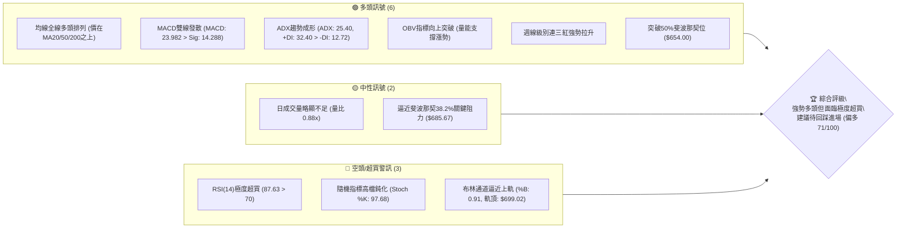
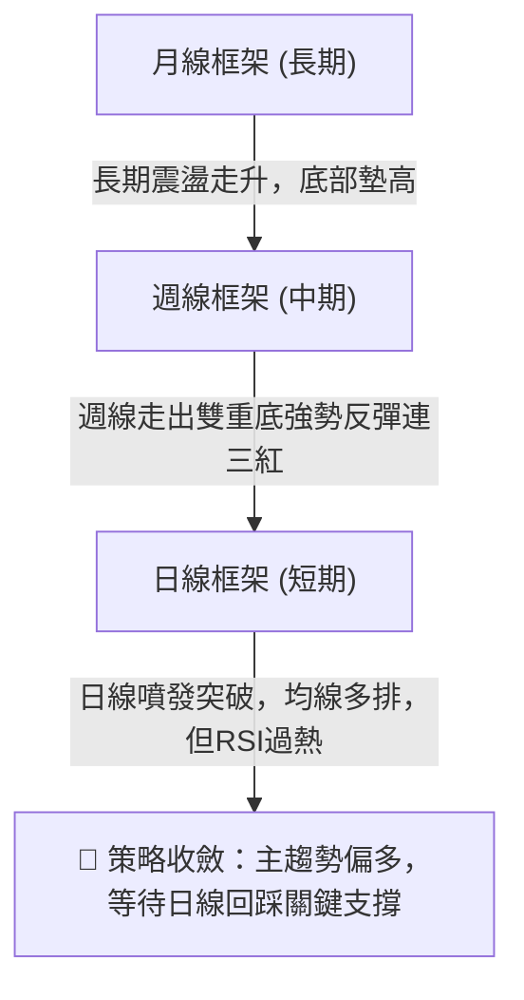
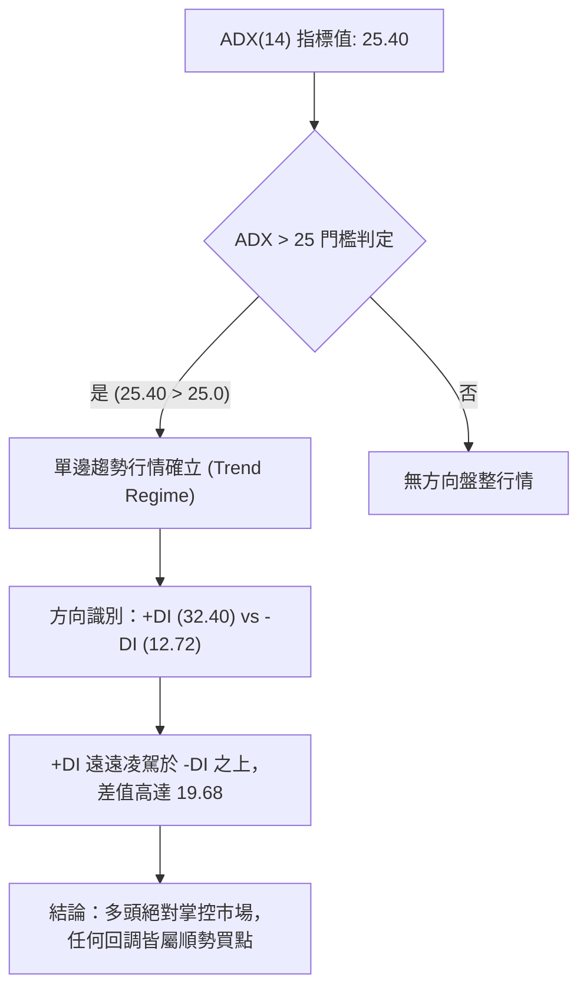
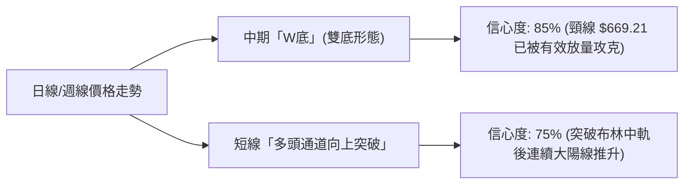
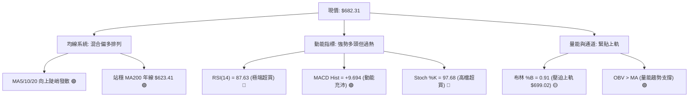
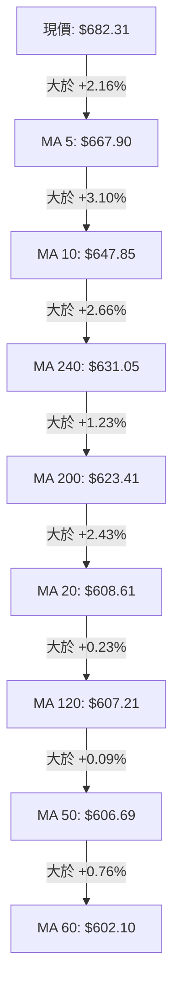
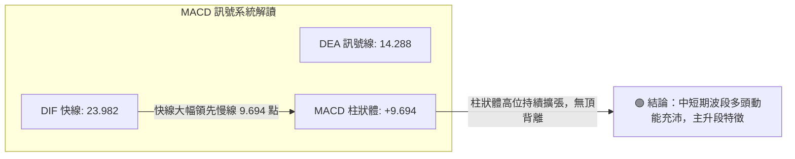
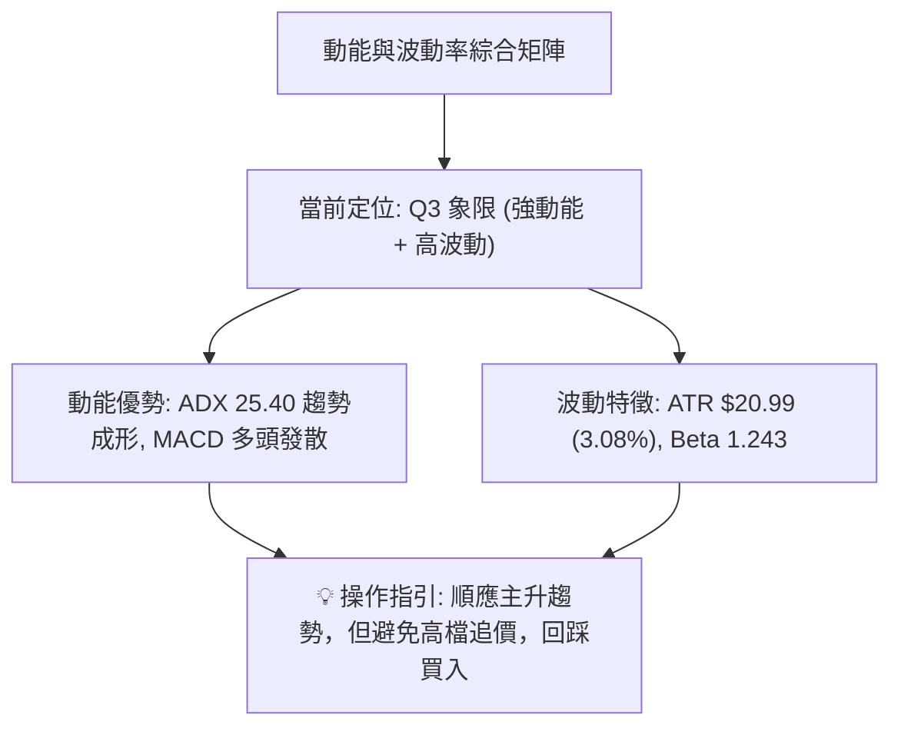
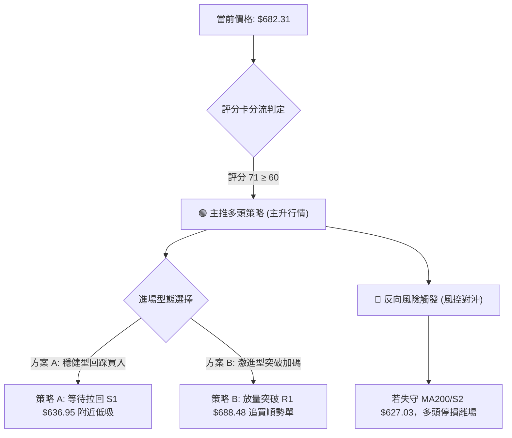
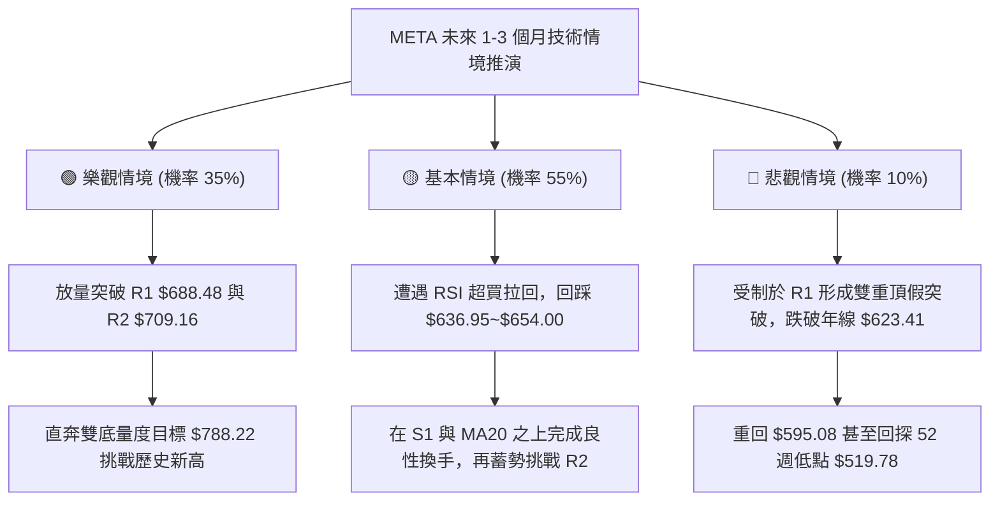

# META 技術分析報告

> **報告日期**：2026-09-18 ｜ **語言**：繁體中文 ｜ **數據來源**：Yahoo Finance ｜ **當前價格**：$682.31

---

## 目錄

| 章節 | 內容 |
|------|------|
| [1. 技術面概覽](#1-技術面概覽) | 訊號儀表板、核心指標、評分卡 |
| [2. 趨勢分析](#2-趨勢分析) | 多時框趨勢、長中短期走勢、12個月走勢圖 |
| [3. 圖表形態分析](#3-圖表形態分析) | 形態識別、K線組合、形態目標價 |
| [4. 支撐與阻力](#4-支撐與阻力) | 關鍵價位、斐波那契回調、分布圖 |
| [5. 技術指標深度解讀](#5-技術指標深度解讀) | MA/RSI/MACD/布林/成交量/背離分析 |
| [6. 動能與波動率](#6-動能與波動率) | 動能四象限、ATR、Beta與波動評估 |
| [7. 多時框架總結](#7-多時框架總結) | 時框架評分矩陣、收斂規則與最終方向 |
| [8. 交易策略建議](#8-交易策略建議) | 策略路由、多頭主策略、風險報酬比 |
| [9. 風險提示與監控](#9-風險提示與監控) | 監控清單、情境模擬、風控指引 |

---

## 1. 技術面概覽

### 🎯 技術訊號儀表板



### 📊 核心指標速覽表

| 指標類別 | 指標名稱 | 當前數值 | 訊號 | 解讀 |
|----------|----------|----------|------|------|
| **價格** | 當前價格 | $682.31 | 🟢 強多 | 位於52週區間60.5%分位，站穩所有主均線 |
| **均線** | MA20 | $608.61 | 🟢 看多 | 現價高於MA20達+12.11%，短中期多頭主導 |
| **均線** | MA50 | $606.69 | 🟢 看多 | 現價高於MA50達+12.46%，中期趨勢穩固 |
| **均線** | MA200 | $623.41 | 🟢 看多 | 股價重返年線上方（+9.45%），確立長多格局 |
| **動能** | RSI(14) | 87.63 | 🔴 警訊 | 進入嚴重極端超買區間（>80），短線追高風險極高 |
| **動能** | MACD(12,26,9) | 23.982 / +9.694 | 🟢 看多 | 快慢線大幅黃金交叉發散，柱狀圖動能維持正值強勁 |
| **隨機** | Stoch %K / %D | 97.68 / 93.79 | 🔴 警訊 | 雙線深入高檔鈍化區，隨時具備短線技術性回踩拉回壓力 |
| **趨勢** | ADX(14) / +DI | 25.40 / 32.40 | 🟢 看多 | ADX > 25 且 +DI 遠高於 -DI(12.72)，單邊強趨勢確立 |
| **通道** | 布林帶 %B | 0.91 | 🟡 警戒 | 逼近上軌（$699.02），價格進入通道頂部強阻力帶 |
| **量能** | 日量 / 20日均量 | 15.88M / 17.99M | 🟡 中性 | 量比0.88x，突破過程稍有縮量，需補量突破前高 |
| **波動** | ATR(14) | $20.99 | 🟢 正常 | 每日波動率約3.08%，震盪幅度適中，利於波段設置止損 |

### 🏆 技術評分卡

```
╔══════════════════════════════════════════════════════════════════╗
║                技術評分卡 — META (2026-09-18)                   ║
╠══════════════════════════════════════════════════════════════════╣
║ 趨勢強度 (Trend)      ████████████████░░░░  80/100  🟢 強勢   ║
║ 動能指標 (Momentum)   ████████████░░░░░░░░  60/100  🟡 超買   ║
║ 支撐穩定度 (Support)  ██████████████░░░░░░  70/100  🟢 良好   ║
║ 成交量配合 (Volume)   ████████████░░░░░░░░  60/100  🟡 尚可   ║
║ 形態完整度 (Pattern)  ████████████████░░░░  80/100  🟢 紮實   ║
║ 均線排列 (Moving Avg) ████████████████░░░░  80/100  🟢 多排   ║
╠══════════════════════════════════════════════════════════════════╣
║ 綜合評分              ██████████████░░░░░░  71/100  🟢 偏多   ║
║ 綜合判定：趨勢強勁向上，但指標極端超買，宜「順勢做多、回調介入」   ║
╚══════════════════════════════════════════════════════════════════╝
```

---

## 2. 趨勢分析

### 🌐 多時框趨勢分析



### 📈 長期趨勢 — 12個月走勢圖（Unicode）

META 過去 12 個月（2025-10 至 2026-09）呈現「高檔回落、大區間築底、深蹲後強勢破浪」的走勢：

```
META 月線走勢圖（過去12個月：2025-10 至 2026-09）
價格軸 ($)
$750 ┤                                                 
$720 ┤                     ● (01月: $715.22)            
$690 ┤                                           ● (09月現價: $682.31)
$660 ┤               ●     │                     │     
$630 ┤ ●━━━━━●       │     ● (02月: $647)  ●     │     
$600 ┤ (10月) (11月) │     │              │     │     
$570 ┤               │     │  ● (03月)    │     │  ● (08月: $572.34)
$540 ┤               │     │  │           ●     ● (07月波段低: $556.71)
     └─────────────────────────────────────────────────────────────►
       10  11  12   01    02 03  04  05   06    07   08    09 (月份)
      [2025年第四季]   [2026年第一季]    [2026年第二季]  [2026年第三季]
```

**走勢特徵分析表格**：

| 階段區間 | 起止月份 | 價格區間 | 累積漲跌 | 趨勢特徵與結構意涵 |
|----------|----------|----------|----------|-------------------|
| 第四季整理 | 2025-10 ~ 2025-12 | $646.67 → $658.91 | +1.89% | 高檔橫盤拉鋸，在 $646 附近形成強勁防守平台 |
| 沖高回落 | 2026-01 ~ 2026-03 | $715.22 → $571.60 | -20.08% | 元月衝頂 $715.22 受阻，隨後三個月大幅殺跌破年線 |
| 築底震盪 | 2026-04 ~ 2026-08 | $611.34 → $572.34 | -6.38% | 在 $550~$570 形成兩次波段深踩（06-07月），確立牢固大底 |
| 破繭反攻 | 2026-08 ~ 2026-09 | $572.34 → $682.31 | +19.21% | 09月拉出超過百元長陽線，連續收復所有均線，直逼歷史次高區 |

### 📊 中期趨勢（週線分析）

從近 20 週數據觀察，META 在 2026 年夏季（06 月底至 08 月底）展現了教科書級別的「雙重底反轉」架構：
- 第一低點：2026-06-28 觸及收盤低點 $550.25，成交量 78.3M。
- 反彈頸線：2026-07-12 反彈高點 $669.21，週成交量暴增至 117.03M。
- 第二低點：2026-08-02 再次回測至 $556.71，隨後於 2026-08-23 形成次級低點 $549.90，完成雙底打底結構。
- 主升推升：2026-08-30 起連續拉出四根大紅K，收盤價依序躍升：$578.02 → $616.77 → $648.03 → $682.31，週線 MACD 柱狀圖自 -4.226 迅速翻正至 +9.694。

```
週線近期架構示意圖：
價格
$700 ┤                                           ▲ 當前 $682.31 (突破頸線)
$670 ┤                  ▲ 頸線位 $669.21        /
$640 ┤                 /  \                    /
$610 ┤                /    \                  /
$580 ┤               /      \      ▲         /
$550 ┤   ▼ $550.25 ─┘        └─── ▼ $556.71 ┘
     └────────────────────────────────────────────► 週時間軸
         底 1 (6月下旬)            底 2 (8月上旬)
```

### ⚡ 趨勢強度評估（ADX 解讀）



**ADX 趨勢強度對照表**：

| ADX 區間 | 趨勢狀態 | META 當前數值 | 交易意涵 |
|----------|----------|---------------|----------|
| 0 ~ 20 | 無趨勢 / 雜訊期 | — | 避免趨勢追單，採用網格或區間震盪交易 |
| 20 ~ 25 | 趨勢醞釀期 | — | 觀察突破方向與成交量釋放 |
| **25 ~ 40** | **強勢趨勢期** | **25.40 (+DI: 32.40)** | **🟢 確立單邊多頭行情，以順勢操作為主** |
| 40 ~ 60 | 極強趨勢期 | — | 趨勢動能亢奮，警惕動能耗竭與噴出頂部 |

---

## 3. 圖表形態分析

### 🔍 形態識別系統



**形態識別與信心度評估表**：

| 形態類別 | 信心度 | 判斷依據（引用真實數據） | 完成度 | 目標價（附嚴謹計算式） |
|----------|--------|--------------------------|--------|------------------------|
| **中期雙底 (W-Bottom)** | **85%** | 底1: 2026-06-28 ($550.25)，底2: 2026-08-02 ($556.71)；頸線位於 2026-07-12 高點 ($669.21)。現價 $682.31 已收於頸線之上。 | 100% (已突破) | 底頂垂直高差 = $669.21 - $550.25 = $118.96。<br>**形態目標價** = 頸線 $669.21 + $118.96 = **$788.17**（與52W高點 $788.22 完全吻合！） |
| **均線黃金匯聚反彈** | **80%** | 短期 MA5 ($667.90) 與 MA10 ($647.85) 垂直穿透長期均線群（MA50: $606.69、MA200: $623.41）。 | 90% | 均線發散向上開展，支撐位於聚集區 $606.69~$623.41。 |
| **杯柄形態 (Cup & Handle)** | 35% | 數據不足以確認完整杯柄右側回調結構。 | <30% | 訊號不足，依規則僅做指標型解讀，不預設立場。 |

### 🕯️ 重要K線形態分析

| 週/月份 | 收盤價 | K線形態名稱 | 形態專業解讀 | 訊號評級 |
|---------|--------|-------------|--------------|----------|
| 2026-08-02 | $556.71 | 長下影探底十字線 | 週成交量爆發至 112.1M，空頭竭盡殺盤，長下影線確立 $550 鋼鐵支撐 | 🟢 強烈買訊 |
| 2026-08-23 | $549.90 | 雙針探底次低點 | 成交量顯著萎縮至 89M，未跌破前低，量縮震盪完成底背離清洗浮額 | 🟢 築底完成 |
| 2026-08-30 | $578.02 | 晨星反轉陽線 | 伴隨 MACD 柱狀由負轉正（+1.912），多頭主力吹響反攻號角 | 🟢 反轉確認 |
| 2026-09-06 | $616.77 | 大陽穿三線 (突破線) | 一舉跳空站上 MA20 ($608.61) 及 MA50 ($606.69)，標準突破K線 | 🟢 追買訊號 |
| 2026-09-13 | $648.03 | 續漲強勢大紅棒 | 放量 93.26M，收復年線 MA200 ($623.41)，確立長期趨勢翻多 | 🟢 趨勢延續 |
| 2026-09-20 | $682.31 | 高位受阻長陽帶上影 | 逼近斐波那契38.2% ($685.67) 及 R1 ($688.48)，日線量能略退，面臨解套壓 | 🟡 短線警示 |

### 📉 ASCII 走勢形態示意圖

```
META 雙重底 (W-Bottom) 突破與形態量度示意圖：
==================================================================================
$788.22 ┤ ---------------------------------------------------- [形態量度目標 T2: $788.17]
        │                                                     /
$738.02 ┤ -------------------------------------------------- [波段阻力 R3]
        │                                                 /
$709.16 ┤ ---------------------------------------------- [波段阻力 R2]
        │                                             /
$688.48 ┤ ------------------------------------------▲ 現價 $682.31 (突破後上攻)
$669.21 ┼━━━━━━━━━━━━━━━━━━━━━━━ 頸線位 (Neckline) ━━━━━━━━━━━━
        │                    ▲                     /
        │                   / \                   /
$610.00 ┤                  /   \                 /
        │                 /     \               /
$550.00 ┤   ▼ 底1: $550.25       └─── ▼ 底2: $556.71
==================================================================================
時  間  │     2026-06-28                 2026-08-02           2026-09-18
==================================================================================
```

### 🎯 形態目標價計算

根據經典技術分析幾何測量規則：
1. **頸線確認**：取 2026-07-12 週波段頂點收盤價 **$669.21**。
2. **基底最低點**：取 2026-06-28 探底低點 **$550.25**。
3. **形態垂直高度 ($H$)**：
   $$H = \text{頸線} - \text{基底} = \$669.21 - \$550.25 = \$118.96$$
4. **最小量度目標價 (Measured Target)**：
   $$\text{目標價} = \text{頸線} + H = \$669.21 + \$118.96 = \mathbf{\$788.17}$$
   *注：此數值與 52 週最高價 **$788.22** 誤差僅 $0.05，高度驗證該形態目標為完全修復前波跌幅。*

---

## 4. 支撐與阻力

### 🗺️ 關鍵價位分布圖（Unicode）

```
META 價位結構分布圖
══════════════════════════════════════════════════════════════════
$788.22 ║████████████████████████████████████║ 52週歷史高點 / 斐波 0.0%
$738.02 ║████████████████████████            ║ 強波段阻力 R3
$724.87 ║▓▓▓▓▓▓▓▓▓▓▓▓▓▓▓▓▓▓▓▓                ║ 斐波那契 23.6% 回調位
$709.16 ║████████████████                    ║ 中期阻力 R2
$688.48 ║████████████                        ║ 關鍵即時阻力 R1
$685.67 ║────────────────────────────────────║ 斐波那契 38.2% 回調位
$682.31 ╠════════════════════════════════════╣ ◄ 現價 (Current: $682.31)
$654.00 ║░░░░░░░░░░░░░░░░░░░░                ║ 斐波那契 50.0% 中軸強分界
$636.95 ║▓▓▓▓▓▓▓▓▓▓▓▓▓▓▓▓▓▓▓▓▓▓              ║ 近期回踩首要支撐 S1
$627.03 ║████████████████████████            ║ 關鍵防守支撐 S2 (匯聚年線)
$622.32 ║────────────────────────────────────║ 斐波那契 61.8% 黃金分割
$595.08 ║████████████████████████████████    ║ 鐵底支撐 S3 (匯聚MA60)
$519.78 ║████████████████████████████████████║ 52週波段低點 / 斐波 100.0%
══════════════════════════════════════════════════════════════════
```

### 🚧 阻力位分析表

所有阻力數值完全嚴格引用數據庫「波段高點聚類」計算成果：

| 阻力級別 | 精確價位 | 距離現價 | 形成原因與籌碼解讀 | 突破難度 | 重要性評級 |
|----------|----------|----------|-------------------|----------|------------|
| **R1** | **$688.48** | +0.90% | 近期波段高點密集壓制區，緊鄰斐波那契 38.2% ($685.67) | 中等 | 🔴 核心短線關卡 |
| **R2** | **$709.16** | +3.93% | 2026年1月高點（$715.22）下方起跌套牢密集成交區 | 較高 | 🟡 中期心理整數關卡 |
| **R3** | **$738.02** | +8.16% | 2025年6-9月高檔橫盤巨量套牢平臺頂部 | 極高 | 🔴 終極波段壓力帶 |

### 🛡️ 支撐位分析表

所有支撐數值完全嚴格引用數據庫「波段低點聚類」計算成果：

| 支撐級別 | 精確價位 | 距離現價 | 形成原因與結構強度 | 守住機率 | 重要性評級 |
|----------|----------|----------|-------------------|----------|------------|
| **S1** | **$636.95** | -6.65% | 突破前的小波段平臺高點轉換位，多頭防守第一線 | 75% | 🟢 短線回踩買點 |
| **S2** | **$627.03** | -8.10% | 匯聚 MA200 年線（$623.41）與 61.8% 斐波位（$622.32） | 85% | 🟢 多頭生命線 |
| **S3** | **$595.08** | -12.78%| 匯聚 MA60（$602.10）及 2026年7月底深幅洗盤低點 | 95% | 🟢 強烈鐵底支撐 |

### 📐 斐波那契回調位分析

依據 52 週完整波段（最低點 **$519.78** 至 最高點 **$788.22**，全波段震幅 $268.44）計算：

| 斐波那契比例 | 基準價位 | 當前相對位置 | 技術意義與多空攻防策略 |
|--------------|----------|--------------|------------------------|
| **0.0%** | **$788.22** | 上方 +15.52% | 52 週歷史頂峰，形態最終目標價指向此處 |
| **23.6%** | **$724.87** | 上方 +6.24% | 突破 R2（$709.16）後的下一站加速延伸位 |
| **38.2%** | **$685.67** | **現價爭奪區** | **現價 $682.31 僅距此 +0.49%，為當前最重要的多空分水嶺** |
| **50.0%** | **$654.00** | 下方 -4.15% | 波段中軸均衡點，已於本波拉升被強勢放量攻克轉換為支撐 |
| **61.8%** | **$622.32** | 下方 -8.79% | 黃金分割強防守位，緊鄰年線 MA200 ($623.41)，不可跌破 |
| **78.6%** | **$577.22** | 下方 -15.40%| 夏季築底啟動平臺位，回測即為極限底部 |
| **100.0%** | **$519.78** | 下方 -23.82%| 52 週波段最低點，長期牛熊分界基石 |

**斐波那契位置結論**：現價目前精確運行於 **50.0% ($654.00)** 與 **38.2% ($685.67)** 之間，正挑戰突破 38.2% 關鍵分界。若日線實體收盤站上 $685.67，將正式開啟向 23.6% ($724.87) 奔馳的擴展空間。

---

## 5. 技術指標深度解讀

### 🎛️ 指標訊號總覽



### 📈 移動平均線排列分析



**均線狀態解析**：
- **短天期均線**（MA5 $667.90、MA10 $647.85）呈現幾何級數急升，短線斜率極陡，反映近期爆發式推升。
- **均線系統總體判定為「混合排列」**，主因是長期均線 MA240 ($631.05) 與 MA200 ($623.41) 仍高於中期均線 MA20 ($608.61) 與 MA50 ($606.69)。這代表股價剛經歷過數月的深幅回調，當前為**從低檔強勢拔起的修復性初期多頭行情**。
- 隨著 MA20 快速上揚（+12.11%乖離），在未來 2-3 週內極有可能向上交叉 MA200 與 MA240，形成標準「黃金交叉大滿貫」，長期趨勢正全面轉多。

### 📉 RSI(14) 分析

```
RSI(14) 指標儀表板：
0 ─────── 30 ───────────── 50 ───────────── 70 ────── 87.63 ── 100
[  超賣區  ]    [  偏弱  ]    [  強勢  ]    [ 超買 ] ▓▓▓▓▓▓▓▓█
                                                     ▲ 當前 87.63 (極度超買)
```

- **超買程度判定**：RSI(14) 高達 **87.63**，進入技術上極為罕見的嚴重極端超買區（>85）。
- **歷史走勢對比**：回顧近 20 週數據，前次高點出現在 2026-07-12（收盤 $669.21，RSI 達 68.7），隨後兩週即引發大幅震盪回洗至 $595.19；當前 RSI 87.63 超越前高甚多。
- **背離分析結論**：
  - **頂背離判定**：**「無頂背離」**。價格創新高（突破7月高點），RSI 同步刷新近期新高（從 69.9 → 83.9 → 87.63），動能指標與價格創高步調一致。
  - **技術含義**：在強趨勢中（ADX>25），RSI 超買往往代表「極強動能（Momentum Thrust）」，而非立即崩跌；但由於短期獲利盤豐厚，**嚴禁在 $682 附近以市價追高，極易遭受 3~5% 的劇烈洗盤震盪**。

### 📊 MACD(12/26/9) 訊號解讀



- **數值關係**：快線 DIF (23.982) 遠在零軸上方，且大幅高於慢線 DEA (14.288)，MACD 柱狀體維持在 **+9.694** 的高檔水準。
- **動能評估**：週線級別 MACD 柱狀體由 08-23 的 -4.226，連續 4 週激增至 +1.912、+6.867、+9.875、+9.694，展現強大趨勢慣性，多頭完全主導局勢。

### 📦 布林通道分析

```
META 布林通道位置示意圖（20日通道，2倍標準差）：
═════════════════════════════════════════════════════════════════════
$699.02 ┬──────────────────────────────────────── 布林上軌 (Upper Band)
$682.31 ┼███████████████████████████████████████ ◄ 現價 (BB %B = 0.91)
        │
$608.61 ┼──────────────────────────────────────── 布林中軌 (MA20 Baseline)
        │
$518.21 ┴──────────────────────────────────────── 布林下軌 (Lower Band)
═════════════════════════════════════════════════════════════════════
帶寬分析：上軌 $699.02 與 下軌 $518.21 差值達 $180.81，開口顯著向外放大
```

- **通道位置**：BB %B 高達 **0.91**（極度貼近上軌 1.0 邊界），現價距離上軌僅剩 $16.71（+2.45% 空間）。
- **走勢研判**：價格正處於「沿上軌爆發（Riding the Upper Band）」的單邊噴發階段。中軌 MA20 位於 **$608.61**，構成本波行情的強支撐基準。若價格在未突破上軌前出現帶上影K線，預期將回測中軌尋求支撐。

### 💹 成交量分析（量價配合度）

- **量比與均量對比**：最新成交量為 **15,888,400**，對比 20 日均量 **17,990,265**，量比約為 **0.88x**。
- **量價背離評估**：
  - 現價大漲逼近前高阻力，但單日成交量並未放大至 2,000 萬股以上，呈現短線**「輕微價升量縮」**之量價背離徵兆。
  - 然而在長期量能層面，**OBV 趨勢顯著高於其移動平均線**（OBV > MA），證實近 4 週的大波段推升是由龐大機構資金進場所推動（機構持股高達 79.0%），總體量能結構依舊支撐多頭行情。

---

## 6. 動能與波動率

### ⚡ 動能評估四象限

動能強度以 ADX(14)=25.40、MACD柱=+9.694 為依歸；波動率以 ATR=$20.99 (3.08%) 為基準：

| 象限代號 | 動能狀態 | 波動率狀態 | 當前市場定位 | 專業操作策略建議 |
|:---:|:---:|:---:|:---:|---|
| **Q1** | **強動能** | **低波動** | — | 最理想的無阻力主升段，穩健持股加碼 |
| **Q2** | **弱動能** | **低波動** | — | 盤整築底或洗盤期，適合網格區間高拋低吸 |
| **Q3** | **強動能** | **高波動** | **✓ META 當前狀態** | **典型突破行情：獲利空間大但洗盤劇烈，需嚴控倉位並寬設止損** |
| **Q4** | **弱動能** | **高波動** | — | 恐慌崩跌段或無序殺盤，嚴格空倉觀望 |



### 📊 ATR 波動率分析

- **ATR(14) 實體數值**：**$20.99**（佔現價百分比為 **3.08%**）。
- **交易風控距離建議**：
  - **日內交易緩衝 (1.0 × ATR)**：**$21.00**。日內正常隨機震盪區間為 $661.30 ~ $703.30。
  - **波段短線止損 (1.5 × ATR)**：**$31.50**。若以現價進場，合理防守距離至少需留出 $31.50（止損設於 $650.80 附近）。
  - **穩健趨勢止損 (2.0 × ATR)**：**$42.00**。跌破現價向下 $42.00（即 **$640.30**，緊鄰 S1 支撐位 $636.95），方確認短期多頭架構被破壞。

### 📐 Beta 與市場相關性

- **Beta 係數**：**1.243**（高於美股大盤標普500基準 1.00）。
- **市場連動含義**：META 具備明顯的進攻型高彈性資產特質，當美股科技板塊或納斯達克走強時，META 傾向產生 1.24 倍的超額阿爾法收益；反之在大盤回調時其修正幅度亦相對加劇。
- **空頭部位壓力**：當前 Short % Float 僅 **1.3%**，Short Ratio 僅 **1.77 天**，市場並無大規模空頭受困軋空（Short Squeeze）動力，行情完全由真實多頭買盤驅動。

---

## 7. 多時框架總結

### 📋 時框架評分表

| 時框架 | 趨勢方向 | 動能狀態 | 均線排列 | 圖表形態 | 綜合評分 | 操作建議 |
|--------|----------|----------|----------|----------|:---:|----------|
| **月線 (長期)** | 🟢 多頭重啟 | 🟢 轉強向上 | 🟡 混合蓄勢 | 大區間箱底反彈 | **75/100** | 逢回拉回中長線配置 |
| **週線 (中期)** | 🟢 強烈多頭 | 🟢 MACD擴張 | 🟢 翻多成形 | 雙底 (W底) 突破 | **85/100** | 波段持股續抱，目標上看新高 |
| **日線 (短期)** | 🟢 單邊上升 | 🔴 極端超買 | 🟢 多頭排列 | 突破上攻逼近壓力 | **65/100** | 嚴禁追高，耐心等待技術回抽 |

### 🔲 綜合訊號矩陣

```
時框維度 ─── 趨勢 ─── 動能 ─── 均線 ─── 量能 ─── 最終判定
  長期 (月)    🟢      🟢      🟡      🟢      🟢 偏多看好
  中期 (週)    🟢      🟢      🟢      🟢      🟢 強烈看多
  短期 (日)    🟢      🔴      🟢      🟡      🟡 超買震盪
─────────────────────────────────────────────────────────────
矩陣收斂一致性：中長期方向完全一致向上，僅短期指標出現極端超買乖離。
```

### ⚖️ 多時框收斂結論

**嚴格依據多時框收斂規則第 14 條判定**：
1. **行情性質界定**：當前 **ADX(14) = 25.40 > 25.0**，正式跨越趨勢臨界值，系統確認當前處於**「趨勢行情（Trend Regime）」**，而非盤整震盪行情。
2. **優先級權重**：依規則，趨勢行情以**中長期方向（週線大雙底、突破頸線、站穩年線 MA200）為主導**；日線級別的極度超買（RSI 87.63、Stoch 97.68）僅能作為「尋找短線回踩進場時機」的輔助工具，不得逆勢放空。
3. **唯一方向性收斂結論**：**【強烈偏多，回踩尋求加碼】**。此結論與下方第 8 章之交易策略完全保持高度一致。

---

## 8. 交易策略建議

### 🗺️ 策略決策流程圖



### 🧭 策略路由

> **當前主策略方向 = 【主推多頭策略】（依評分卡綜合評分 71/100 確立）**  
> 市場處於 ADX>25 強趨勢多頭段，嚴禁逆勢做空。

### 🎯 價格情境階梯（Price Scenarios）

價位嚴格引用系統計算之關鍵點位：

| 觸發條件 | 第一目標 | 後續延伸目標 | 行情情境解讀與操作指導 |
|----------|----------|--------------|------------------------|
| **強勢突破 R1 ($688.48)** | **R2 ($709.16)** | **R3 ($738.02)** | 短線超買鈍化並向上逼空，目標指向 2026年元月高點 |
| **於現價至 S1 區間震盪** | **$654.00** | **$636.95** | 消化 RSI 87 過熱動能，以時間換取空間，屬最佳上車機會 |
| **跌破 S1 ($636.95)** | **S2 ($627.03)** | **S3 ($595.08)** | 深度洗盤回測年線支撐，若失守 S2 則短期上攻格局失效 |

### 📊 情境機率分佈

| 預期情境 | 發生機率 | 主要技術依據與指標支撐 |
|----------|:---:|------------------------|
| **情境一：震盪蓄勢後續創新高** | **55%** | 週線雙底突破確立、ADX(14)=25.40 趨勢強勁、OBV支持資金流入 |
| **情境二：技術性回踩洗盤 (回測S1)** | **35%** | RSI(14)=87.63 極度超買、隨機指標鈍化、布林 %B=0.91 逼近軌頂 |
| **情境三：跌破年線全面轉弱 (跌破S2)** | **10%** | 基本面盈餘負增長風險或大盤系統性黑天鵝殺盤 |

### 🟢 主策略詳情

本報告依交易風格提供兩種多頭執行策略，價位**嚴格使用關鍵價位數據庫精確數值**：

| 策略要素 | 策略 A（穩健型：順勢回踩買入） | 策略 B（激進型：強勢突破追單） |
|----------|---------------------------------|---------------------------------|
| **進場條件** | 短線回調釋放超買，於 S1 附近獲得確認支撐 | 日線帶量有效突破短線第一壓力 R1 |
| **進場價格** | **$645.00**（回調至50%斐波 $654 與 S1 之間） | **$689.00**（突破 R1 $688.48 後買入） |
| **目標價 T1** | **$709.16**（前波高點阻力 R2） | **$724.87**（斐波那契 23.6% 回調位） |
| **目標價 T2** | **$738.02**（密集套牢阻力 R3） | **$788.22**（雙底量度形態極限目標/52W高） |
| **止損價格** | **$623.00**（略低於 S2 $627 及 MA200 年線） | **$667.00**（跌破 MA5 短期均線支撐） |
| **風險報酬比** | **1 : 2.92**（風險 $22.00，獲利空間 $64.16） | **1 : 2.73**（風險 $22.00，獲利空間 $60.13） |
| **預估勝率** | **68%** | **55%** |
| **建議倉位** | **20% ~ 25%** | **10% ~ 15%** |

### 🔴 反向風險觸發點（對沖提示）

- **觸發防守關鍵位**：若股價無預警跌破 **S2 ($627.03)** 且跌穿 **MA200 年線 ($623.41)**，代表本輪自 8 月底以來的「雙底突破」被假突破否定。
- **對沖應對指引**：一旦收盤破位 $623.00，多頭投資人應立即清倉或減碼 70% 以上，並可透過購買價外認沽期權（Put Option）避險，下方目標將直接回測 **S3 ($595.08)**。

### ⭐ 整體訊號強度評星

```
╔════════════════════════════════════════════════════════╗
║ 做多訊號強度：★★★★☆  (4.0/5星) — 趨勢確立，待回調     ║
║ 做空訊號強度：★☆☆☆☆  (1.0/5星) — 逆勢風險極高       ║
║ 整體可信度：  ★★★★☆  (4.2/5星) — 價量形態高度共振   ║
╚════════════════════════════════════════════════════════╝
```

---

## 9. 風險提示與監控

### ✅ 關鍵監控指標 Checklist

```
╔══════════════════════════════════════════════════════════════════╗
║               META 技術風控每日監控清單 (Checklist)              ║
╠══════════════════════════════════════════════════════════════════╣
║ [ ] 1. RSI(14) 是否跌破 80 形成高檔死叉 (警惕日內快速回洗 3-5%) ║
║ [ ] 2. 股價能否收盤突破 R1 ($688.48) 及 38.2% 斐波位 ($685.67)   ║
║ [ ] 3. 單日成交量是否回升突破 20 日均量 (需大於 1,800 萬股)       ║
║ [ ] 4. 日線收盤是否跌破短期防守線 MA5 ($667.90)                 ║
║ [ ] 5. 中期趨勢生命線 MA200 ($623.41) 與 S2 ($627.03) 是否牢固   ║
║ [ ] 6. 財報基本面觀察：Earnings YoY (-13.4%) 是否壓制估值擴張   ║
╚══════════════════════════════════════════════════════════════════╝
```

### ⚠️ 風險場景分析



### 🛡️ 風險管理重要提醒

1. **極度超買風控**：當前 RSI(14) 處於 87.63 的極度高位，歷史經驗顯示在該區域開新多單的勝率顯著低於正常水準。投資人應克制 FOMO（害怕踏空）情緒，將策略重點放在「等待技術乖離收斂後的支撐承接」。
2. **波動部位管理**：因 ATR 達 $20.99，意味著單日正常震盪幅度可能高達 $20 美元以上。若以現價持有一手（100股），每日曝險變動約 $2,100 美元。建議整體 META 多頭曝險資金勿超過總投資組合之 15%~20%。
3. **基本面交叉風險**：技術面雖展現教科書級突破，但財務數據顯示 TTM 營收成長達 +28.0% 的同時，盈餘年增率（Earnings Growth YoY）為 **-13.4%**，資本支出或 Reality Labs 虧損可能壓制長線本益比擴張，需防範基本面雜音觸發技術面多頭踩踏。

---

## 📋 報告總結

```
╔══════════════════════════════════════════════════════════════════╗
║                    META 技術分析報告總結                         ║
╠══════════════════════════════════════════════════════════════════╣
║ 報告日期：2026-09-18              當前價格：$682.31             ║
║ 趨勢強度：ADX 25.40 (強多)         綜合評級：🟢 偏多 (71/100)    ║
╠══════════════════════════════════════════════════════════════════╣
║ 關鍵結論：                                                       ║
║ ├─ 長期趨勢：🟢 偏多（收復 MA200 年線 $623.41，大雙底量度成形）  ║
║ ├─ 中期趨勢：🟢 強多（週線連四紅拉升，突破 $669.21 中期頸線）   ║
║ ├─ 短期趨勢：🟡 超買（RSI 達 87.63，布林通道 %B 0.91 面臨整固） ║
║ ├─ 核心支撐：S1: $636.95 ｜ S2: $627.03 ｜ S3: $595.08          ║
║ ├─ 關鍵阻力：R1: $688.48 ｜ R2: $709.16 ｜ R3: $738.02          ║
║ └─ 華爾街共識目標價：$755.28 (高點 $1,000.00 / 低點 $580.00)     ║
╠══════════════════════════════════════════════════════════════════╣
║ 最優策略組合：                                                   ║
║ 1. 🥇 最佳機會：等待回踩 50% 斐波位與 S1 支撐帶 ($645.00) 進場   ║
║ 2. 🥈 次選機會：突破 R1 ($688.48) 後順勢加碼，看至 R2 ($709.16) ║
║ 3. 🥉 保守選擇：持有現貨者逢高在 $688-$709 區間分批停利收回成本  ║
╚══════════════════════════════════════════════════════════════════╝
```

---

> ⚠️ **免責聲明**：本報告為技術分析研究專用，所有量化數據、圖表指標及目標價測算均基於歷史量價資訊（Yahoo Finance），不構成任何要約、招攬或具體投資買賣建議。金融市場交易具備極高風險，投資人應獨立評估自身財務能力並自負盈虧責任。

---
*報告生成時間：2026-09-18 ｜ 數據來源：Yahoo Finance ｜ 分析框架：多時框技術分析體系*