# META 技術分析報告

> **報告日期**：2026-09-19 ｜ **語言**：繁體中文 ｜ **數據來源**：Yahoo Finance ｜ **當前價格**：$665.75

---

## 目錄

| 章節 | 內容 |
|------|------|
| [1. 技術面概覽](#1-技術面概覽) | 訊號儀表板、核心指標、評分卡 |
| [2. 趨勢分析](#2-趨勢分析) | 多時框趨勢、長中短期走勢 |
| [3. 圖表形態分析](#3-圖表形態分析) | 形態識別、K線組合、目標價 |
| [4. 支撐與阻力](#4-支撐與阻力) | 關鍵價位、斐波那契回調 |
| [5. 技術指標深度解讀](#5-技術指標深度解讀) | MA/RSI/MACD/布林/成交量 |
| [6. 動能與波動率](#6-動能與波動率) | 動能評估、ATR、Beta |
| [7. 多時框架總結](#7-多時框架總結) | 時框架評分矩陣 |
| [8. 交易策略建議](#8-交易策略建議) | 多空策略、風險報酬比 |
| [9. 風險提示與監控](#9-風險提示與監控) | 監控指標、風險場景 |

---

## 1. 技術面概覽

### 🎯 技術訊號儀表板

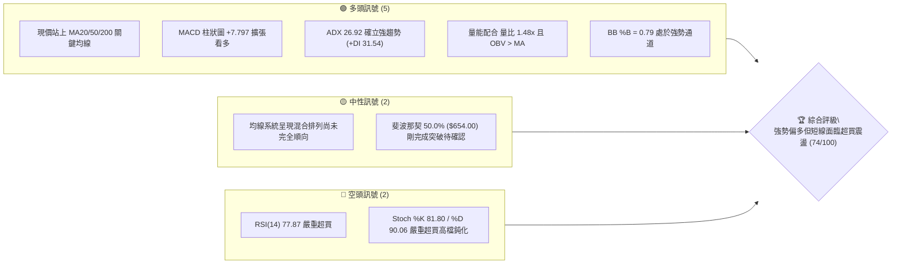

### 📊 核心指標速覽表

| 指標類別 | 指標名稱 | 當前數值 | 訊號 | 解讀 |
|----------|----------|----------|------|------|
| **價格** | 當前價格 | $665.75 | 🟢 | 處於 52 週區間 54.4%，強勢收復中軸線上方 |
| **均線** | MA20 | $614.61 | 🟢 | 股價高於 MA20 達 +8.32%，短線主升段強烈支撐 |
| **均線** | MA50 | $607.38 | 🟢 | 股價高於 MA50 達 +9.61%，中期趨勢反轉向上確立 |
| **均線** | MA200 | $623.55 | 🟢 | 股價越過長期生命線 MA200 (+6.77%)，多頭格局重啟 |
| **動能** | RSI(14) | 77.87 | 🔴 | 進入極度超買區間（>70），短線追高回撤風險陡增 |
| **動能** | MACD | 24.034 | 🟢 | MACD 線高於訊號線 16.237，柱狀圖 +7.797 強勢看多 |
| **波動** | ATR(14) | $21.79 | 🟡 | 佔股價 3.27%，日均波幅顯著擴大，操作需嚴設停損 |

### 🏆 技術評分卡

```
╔══════════════════════════════════════════════════════════════╗
║              技術評分卡 — META (2026-09-19)                  ║
╠══════════════════════════════════════════════════════════════╣
║ 趨勢強度      ████████████████░░░░  80/100  🟢 強勢主導 (ADX>25) ║
║ 動能指標      ████████████░░░░░░░░  60/100  🟡 動能強但嚴重超買 ║
║ 支撐穩定度    ██████████████░░░░░░  70/100  🟢 S1/S2 密集防守   ║
║ 成交量配合    ████████████████░░░░  80/100  🟢 放量推升 (1.48x) ║
║ 形態完整度    ████████████████░░░░  80/100  🟢 雙底向上突破確立 ║
║ 均線排列      ██████████████░░░░░░  75/100  🟢 短期均線快速修復 ║
╠══════════════════════════════════════════════════════════════╣
║ 綜合評分      ███████████████░░░░░  74/100  🟢 強勢買入/回調加碼║
╚══════════════════════════════════════════════════════════════╝
```

---

## 2. 趨勢分析

### 🌐 多時框趨勢分析

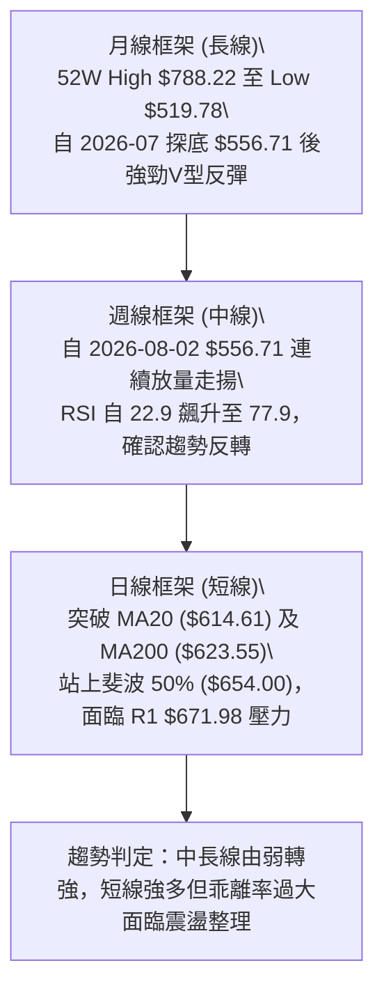

### 📈 長期趨勢 — 12個月走勢圖（Unicode）

```
META 月線走勢圖（過去12個月：2025-10 至 2026-09）
價格軸 ($)
$750 ┤
$720 ┤                      ● (2026-01: $715.22)
$690 ┤
$660 ┤               ●      │               ●←現在 (2026-09: $665.75)
$630 ┤ ●━━━━●       │      ●       ●   ●   │
$600 ┤ │    │       │      │   ●   │   │   │
$570 ┤ │    │       │      │   │   │   │   │   ●
$540 ┤ │    │       │      │   │   │   │   │   │   ● (2026-07: $556.71 低點)
     └─┴────┴───────┴──────┴───┴───┴───┴───┴───┴───┴───────────────────
       10   11      12     01  02  03  04  05  06  07  08  09 (月份)
      (2025)              (2026)
```

**走勢特徵分析表格**：

| 階段區間 | 起訖月份 | 起點收盤 | 終點收盤 | 漲跌幅 | 走勢特徵與結構 |
|----------|----------|----------|----------|--------|----------------|
| 第1階段：橫盤震盪 | 2025-10 ~ 2025-12 | $646.67 | $658.91 | +1.89% | 高檔拉回後進行平台築底，支撐維持在 $640 上方 |
| 第2階段：衝高回落 | 2025-12 ~ 2026-03 | $658.91 | $571.60 | -13.25% | 1月反彈至 $715.22 受阻，隨後大幅滑落摜破 $600 關卡 |
| 第3階段：中期探底 | 2026-03 ~ 2026-07 | $571.60 | $556.71 | -2.61% | 反覆震盪探底，於 2026-07 創下波段收盤低點 $556.71（接近52週低點 $519.78） |
| 第4階段：強力反彈 | 2026-07 ~ 2026-09 | $556.71 | $665.75 | +19.59% | 放量噴出反彈近 20%，連克多道均線反壓，直逼歷史次高區間 |

### 📊 中期趨勢（週線分析）

中期走勢呈現堅實的「V型反轉伴隨雙底支撐架構」。自 2026-08-02 週收盤 $556.71 觸底，隨後在 2026-08-23 週拉回至 $549.90 形成雙重底腳，此後連推四根大陽線，成交量分別達到 8,543 萬股、8,143 萬股、9,326 萬股與 9,952 萬股，呈現典型的量增價揚主升段。

```
週線級別阻力與支撐分佈示意：
[阻力 R2] $688.48 ─── 近期重大波段套牢高點
    ▲
[阻力 R1] $671.98 ─── 短線衝高首要測試關卡（距現價 +0.94%）
    ▲
[現價]   $665.75 ─── 突破多空分水嶺，逼近短壓
    ▼
[支撐 S1] $636.95 ─── 短期均線回踩第一防線（-4.33%）
    ▼
[支撐 S2] $627.03 ─── MA200 ($623.55) 與波段支撐重疊防線（-5.82%）
```

### ⚡ 趨勢強度評估（ADX 解讀）

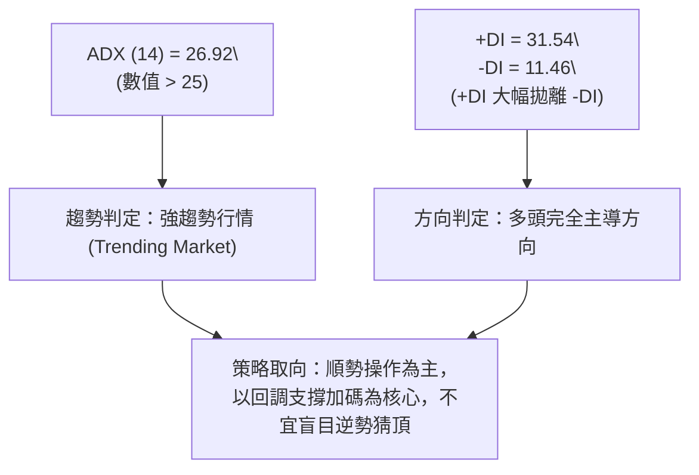

**ADX 趨勢強度對照表**：

| ADX 區間 | 趨勢狀態 | META 當前數值 (26.92) | 操作含義 |
|----------|----------|-----------------------|----------|
| 0 – 20 | 無趨勢 / 盤整 | 否 | 避免使用趨勢跟隨系統 |
| 20 – 25 | 趨勢初萌芽 | 否 | 動能開始累積 |
| **25 – 40** | **強趨勢確立** | **✓ 當前狀態 (26.92)** | **多頭主升確立，中長期均線具強力引導作用** |
| 40 – 60 | 極強趨勢 | 否 | 行情處於極度單邊爆發期 |
| > 60 | 趨勢過熱面臨枯竭 | 否 | 需警惕末端噴出反轉 |

---

## 3. 圖表形態分析

### 🔍 形態識別系統

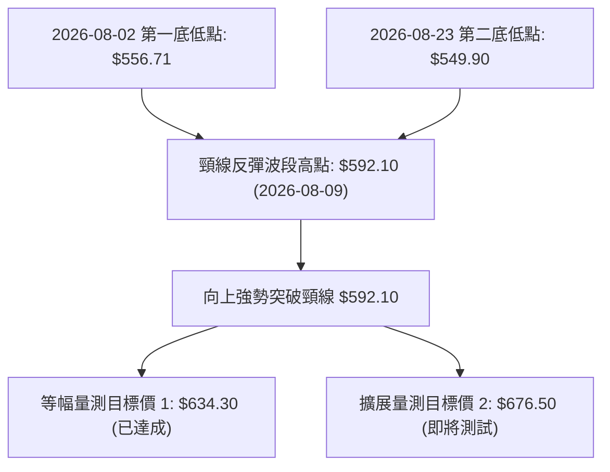

**圖表形態信心度表格**：

| 形態名稱 | 信心度 | 判斷依據（引用數據） | 完成度 | 目標價（附計算式） |
|----------|--------|----------------------|--------|--------------------|
| **雙底反轉形態 (W-Bottom)** | 85% | 1. 左底 2026-08-02 收盤 $556.71，右底 2026-08-23 收盤 $549.90，兩底對齊於低點區間。<br>2. 頸線位置為 2026-08-09 高點 $592.10。<br>3. 突破時週量連續擴增至 9,000 萬股以上。 | 100% (已突破) | **形態目標價 1**：頸線 $592.10 + 形態高度 ($592.10 - $549.90 = $42.20) = **$634.30**（已完全兌現）。<br>**形態延伸目標 2 (1.618 倍)**：$592.10 + ($42.20 × 1.618) = **$660.38**（已兌現，正轉化為短期支撐）。 |
| **V型島狀反轉 (指標型)** | 60% | 8月下旬直接脫離低位橫盤區，連續四週收紅且收盤價自 $549.90 躍升至 $665.75，MACD 週柱由負轉正 (+7.797)。 | 90% | 阻力位 R1 **$671.98** / 阻力位 R2 **$688.48** |
| **頭肩底形態** | 35% | 數據中左肩與頭部結構不對稱，僅有清晰之雙重打底架構。 | 0% | 訊號不足，不予採納，僅做指標型均線解讀。 |

### 🕯️ 重要K線形態分析

| 週/月份 | 收盤價 | K線形態 | 解讀 | 訊號 |
|---------|--------|---------|------|------|
| 2026-08-02 | $556.71 | 長黑探底錘子線 | RSI 跌至極端低點 22.9，伴隨 1.12 億股巨量換手，形成恐慌拋售底 | 🟢 (底背馳訊號) |
| 2026-08-23 | $549.90 | 二次確認低點小陰線 | 量能 8,901 萬股低於前次下殺，形成籌碼沉澱之右底確認 | 🟢 (築底完成) |
| 2026-09-06 | $616.77 | 帶量長陽線突破 | 收盤強勢越過 MA20 ($614.61) 及 MA50 ($607.38)，多頭發起主攻 | 🟢 (突破確認) |
| 2026-09-20 | $665.75 | 連三紅多頭推進大陽線 | 收盤價創近半年新高，突破斐波 50% 關卡，但短線出現上影線逼近 R1 | 🟡 (過熱警示) |

### 📉 ASCII 走勢形態示意圖

```
META 近期雙底突破走勢架構：

 價格
 $680 ┤                                                  [現價 $665.75]
 $660 ┤                                                    ●
 $640 ┤                                             ●━━━━┛ [達成目標1 $634.30]
 $620 ┤                                       ●━━━━┛
 $600 ┤                             ●━━━━┛
 $580 ┤                ● (頸線 $592.10)
 $560 ┤  ● (左底 $556.71)            ● (右底 $549.90)
 $540 └──┴────────────────────────────┴─────────────────────────── 時間軸
       2026-08-02                   2026-08-23           2026-09-19
```

### 🎯 形態目標價計算

根據經典幾何技術形態測量法則：
1. **頸線點位 (Neckline)**：取 2026-08-09 反彈波段頂點收盤價 **$592.10**。
2. **形態低點 (Pattern Base)**：取雙底最低之右底收盤價 **$549.90**。
3. **形態垂直高度 ($H$)**：
   $$H = \$592.10 - \$549.90 = \$42.20$$
4. **最小量測目標價 (Target 1)**：
   $$\text{Target 1} = \text{頸線} + H = \$592.10 + \$42.20 = \$634.30$$
   *(該目標價已於 2026-09-13 當週收盤 $648.03 正式被突破並確認有效)*
5. **費氏黃金擴展目標價 2 (Target 2)**：
   $$\text{Target 2} = \text{頸線} + (1.618 \times H) = \$592.10 + (1.618 \times \$42.20) = \$660.38$$
   *(現價 $665.75 已略為超越此位置，預示多頭動能強勁，正在向技術阻力位 R1 $671.98 及 R2 $688.48 推進)*

---

## 4. 支撐與阻力

### 🗺️ 關鍵價位分布圖（Unicode）

```
META 價位結構分布圖
═══════════════════════════════════════════════════
$709.16 ║████████████████████████║ 強阻力 R3 (波段重大高點聚類)
$688.48 ║████████████████████    ║ 阻力 R2 (反彈高點壓力區)
$671.98 ║████████████████████████║ 關鍵阻力 R1 (當前首要反壓 +0.94%)
$665.75 ╠════════════════════════╣ ◄ 現價 ($665.75)
$654.00 ║░░░░░░░░░░░░░░░░░░░░░░░░║ 斐波那契 50.0% 轉化為即時支撐
$636.95 ║▓▓▓▓▓▓▓▓▓▓▓▓▓▓▓▓        ║ 近期支撐 S1 (波段回調首道防線)
$627.03 ║████████████████████████║ 強支撐 S2 (均線 MA200 共振防禦區)
$595.08 ║████████████████████████║ 底部強支撐 S3 (中期多空分界線)
═══════════════════════════════════════════════════
```

### 🚧 阻力位分析表

*(價位均嚴格引用 OHLCV 計算之波段聚類數據)*

| 阻力級別 | 價位 | 形成原因 | 突破難度 | 重要性 |
|----------|------|----------|----------|--------|
| **R1** | **$671.98** | 近一年波段高點聚類位，距離現價僅 +0.94%，同時接近布林通道上軌壓縮區間 | 中等 | 🔴 極高（短線多頭突破此處方能打開上行空間） |
| **R2** | **$688.48** | 近一年波段高點密集套牢區（距現價 +3.41%），與斐波 38.2% ($685.67) 形成強共振 | 高 | 🔴 極高（中期波段多空決戰核心水準） |
| **R3** | **$709.16** | 2026年1月反彈高點聚類阻力區（距現價 +6.52%），接近布林上軌極限 $703.38 | 極高 | 🟡 中（多頭長線終極解套目標） |

### 🛡️ 支撐位分析表

*(價位均嚴格引用 OHLCV 計算之波段聚類數據)*

| 支撐級別 | 價位 | 形成原因 | 守住機率 | 重要性 |
|----------|------|----------|----------|--------|
| **S1** | **$636.95** | 近一年波段低點聚類轉化位（距現價 -4.33%），雙底突破目標 1 轉化之支撐帶 | 75% | 🟢 高（短線回調強弱分水嶺） |
| **S2** | **$627.03** | 波段密集支撐（-5.82%），且 MA200 ($623.55) 坐落於下方形成多重均線托底 | 85% | 🟢 極高（中長期多頭生命線不容有失） |
| **S3** | **$595.08** | 近期破底翻頸線重要低點聚類區（距現價 -10.61%），MA60 ($603.90) 附近防線 | 95% | 🟢 終極防線（跌破則中長線反轉失敗） |

### 📐 斐波那契回調位分析

*以 52 週區間波段低點 $519.78 至 高點 $788.22 展開計算，總垂直跨度為 $268.44：*

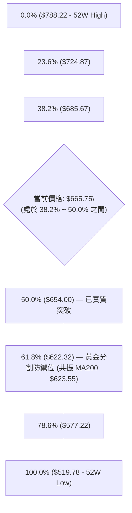

- **位置解讀**：現價 $665.75 已於本週成功收復 **50.0% 關鍵回調位 ($654.00)**，代表自 $788.22 下跌至 $519.78 的跌幅已被收復一半，多方正式奪回主導權。
- **後續目標與路徑**：上方首要黃金分割阻力為 **38.2% 回調位 ($685.67)**，與波段阻力 R2 ($688.48) 僅相差不到 $3 美元，構成了 $685.67 ~ $688.48 的「強共振阻力帶」。
- **下檔回踩防守**：若短線出現超買獲利了結賣壓，回調的第一支撐為 **50.0% ($654.00)**；而決定中長線能否持續上攻的黃金生命線則是 **61.8% 回調位 ($622.32)**，該價位與長期均線 MA200 ($623.55) 呈現高度重疊共振。

---

## 5. 技術指標深度解讀

### 🎛️ 指標訊號總覽

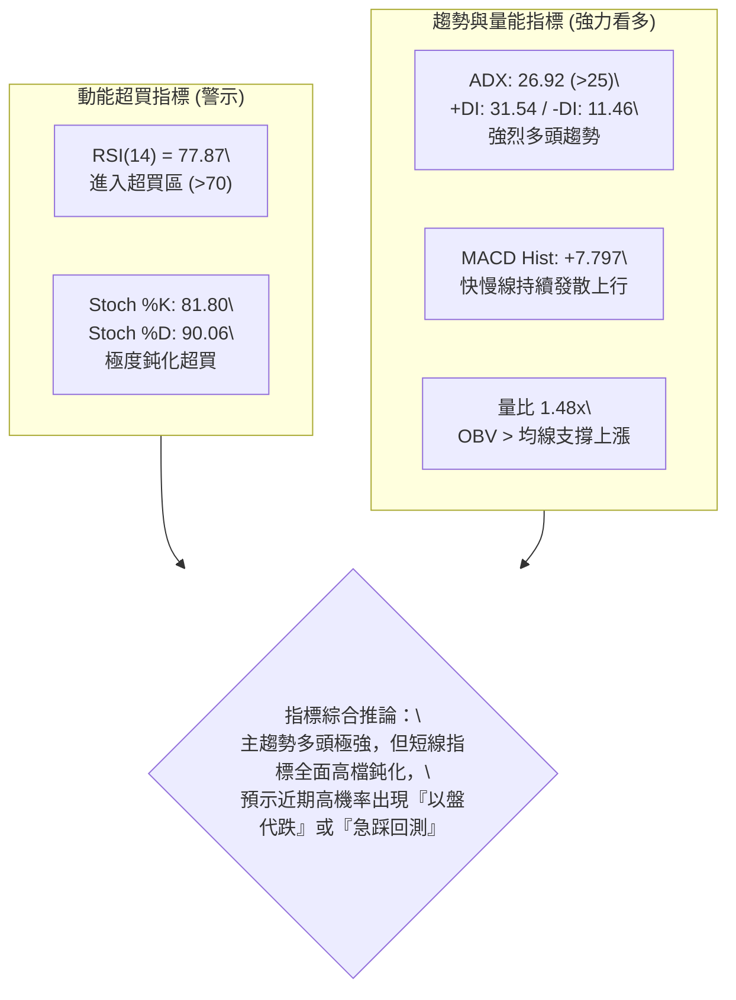

### 📈 移動平均線排列分析

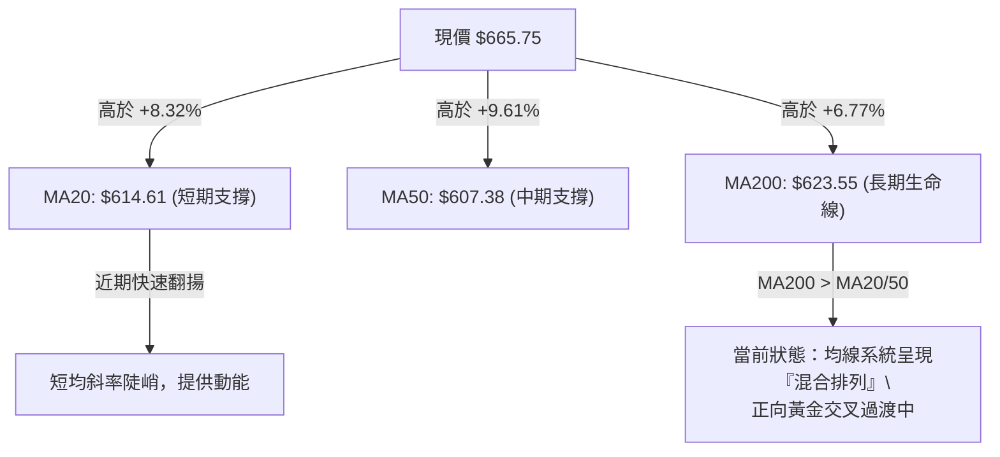

**均線狀態明細評估**：
- **MA5 ($671.44)**：當前微幅高於現價 $665.75（現價在其下方 -0.85%），顯示短線連續衝高後出現停滯，微調壓力浮現。
- **MA10 ($653.36) / MA20 ($614.61)**：呈現強烈斜率向上，提供短線回調時強大的動態買盤支撐。
- **均線交叉現況**：現價已全數穿透所有主要均線，且 MA20 正加速向上穿越 MA60 ($603.90) 及 MA50 ($607.38)，中短期黃金交叉正在陸續完成，長期均線 MA240 ($630.88) 亦已被有效收復。

### 📉 RSI(14) 分析

- **當前 RSI(14) 數值**：**77.87**
```
RSI 強度進度條：
0            30                 50           70      77.87    100
├────────────┼──────────────────┼────────────┼─────────█───────┤
  超賣區 (Oversold)    中性平衡區       強勢區    超買區 (77.87 🔴)
```
- **超買超賣狀態**：RSI(14) 來到 77.87，已深入 >70 的傳統超買警戒區。觀察近 20 週歷史數據，前兩次週 RSI 觸及 68–83 水準（如 2026-07-12 之 68.7、2026-09-13 之 83.9），隨後股價皆出現了 1 至 2 週的震盪休整，投資人不宜在現階段進行盲目重倉追多。
- **背離分析**：**無頂背離現象**。現價創下波段新高 $665.75，MACD 柱狀體保持在 +7.797 擴張高位，量能配合放大，未見價漲指標衰竭的空頭背離，此超買屬於強勢單邊行情中的「指標鈍化」，並非行情轉空訊號。

### 📊 MACD(12/26/9) 訊號解讀

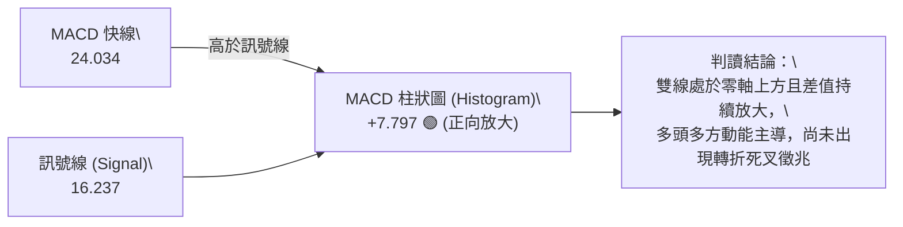

### 📦 布林通道分析

```
布林通道當前空間架構示意 (BB Width = $177.54, 帶寬顯著擴張)：
 
 $703.38 ────────────────────────────── BB 上軌 (Upper Band)
                     ▲
                     │ (剩餘上行空間 $37.63, 約 5.6%)
                     ▼
 $665.75 ══════════════════════════════ 現價 (BB %B = 0.79) 
                     ▲
                     │ (距離中軌緩衝區 $51.14)
                     ▼
 $614.61 ────────────────────────────── BB 中軌 (MA20 Baseline)
                     ▲
                     │
                     ▼
 $525.84 ────────────────────────────── BB 下軌 (Lower Band)
```
- **通道位置 (%B)**：**BB %B = 0.79**。價格穩定運行於中軌與上軌之間的多頭主升通道內，通常 %B > 0.80 代表行情極度強勢，但緊接著上軌 $703.38 與 R3 $709.16 構成強大天花板。

### 💹 成交量分析（量價配合度）

- **最新成交量**：27,548,000 股
- **20日均量**：18,676,035 股（**量比達到 1.48 倍**，顯示突破帶有顯著機構買盤湧入）
- **50日均量**：17,970,842 股
- **能量潮指標 (OBV)**：**OBV 趨勢顯著高於其移動平均線**，確認本輪自 $549.90 發動的反彈為真實資金建倉推動，量價配合呈現標準的「價漲量增」，有效否定了量價背離的潛在下行風險。

---

## 6. 動能與波動率

### ⚡ 動能評估

| 象限分佈 | 動能強度 | 波動率水準 | 當前狀態判定 | 戰略操作指引 |
|----------|----------|------------|--------------|--------------|
| 第一象限 (Q1) | 強 (ADX 26.92 / MACD > 0) | 低 (受壓制) | — | 最佳低風險突破時機 |
| **第二象限 (Q2)** | **強 (RSI 77.87 / +DI 31.54)** | **高 (ATR 3.27% / 量比 1.48x)** | **✓ META 當前狀態** | **主升段高動能伴隨大幅波動，宜拉回支撐分批低吸，嚴控回撤風險** |
| 第三象限 (Q3) | 弱 (空頭衰退) | 高 (恐慌下殺) | — | 尋找左側反轉機會 |
| 第四象限 (Q4) | 弱 (低迷) | 低 (流動性枯竭) | — | 垃圾時間觀望 |

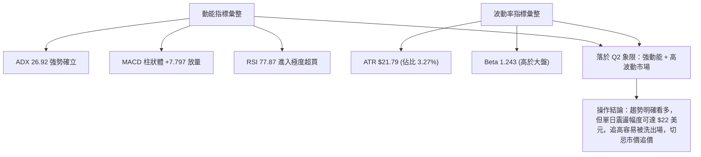

### 📊 ATR 波動率分析

- **ATR(14) 絕對數值**：**$21.79**（佔現價 $665.75 的 **3.27%**）。
- **止損距離動態設計**：
  - **日內超短線緩衝距離 (1.0 × ATR)**：$\$21.79$，相當於現價下方至 $\$643.96$。
  - **波段標準追蹤止損 (1.5 × ATR)**：$\$32.69$（$\$21.79 \times 1.5$），對應保險止損位約為 $\$633.06$（與近期波段支撐 S1 **$636.95** 高度吻合）。
  - **寬鬆趨勢波段止損 (2.0 × ATR)**：$\$43.58$，對應價位為 $\$622.17$（精準貼合 MA200 **$623.55** 及斐波 61.8% **$622.32**）。

### 📐 Beta 與市場相關性

- **Beta 係數**：**1.243**。
- **市場特徵解讀**：META 股價波動彈性顯著高於標普 500 指數約 24.3%。當科技股大盤（如 QQQ、SPY）呈現多頭反彈時，META 具有顯著的超額報酬（Alpha）爆發力；但若大盤指數遭遇系統性回調，META 的跌幅亦可能放大 1.24 倍，故多頭部位必須配合嚴格之停損風控。

---

## 7. 多時框架總結

### 📋 時框架評分表

| 時框架 | 趨勢方向 | 動能指標 | 均線排列 | 形態結構 | 綜合評分 | 操作建議 |
|--------|----------|----------|----------|----------|----------|----------|
| **長期 (月線)** | 🟡 寬幅震盪 | 🟢 中性回升 | 🟡 混合整理 | 區間震盪築底 | 65/100 | 持股續抱，耐心等待挑戰前高 |
| **中期 (週線)** | 🟢 強勢多頭 | 🟢 MACD轉正柱擴大 | 🟢 連克MA20/50 | 雙底反轉突破完成 | 85/100 | 順勢做多，中線持有 |
| **短期 (日線)** | 🟢 噴出多頭 | 🔴 RSI 嚴重超買 | 🟢 站上全部短均線 | 逼近 R1 壓力帶 | 70/100 | 嚴禁追高，耐心等待回踩支撐進場 |

### 🔲 綜合訊號矩陣

```
訊號一致性矩陣分析：
┌─────────────┬───────────┬───────────┬───────────┐
│ 評估指標    │ 短期 (日) │ 中期 (週) │ 長期 (月) │
├─────────────┼───────────┼───────────┼───────────┤
│ 均線系統    │ 🟢 看多   │ 🟢 看多   │ 🟡 整理   │
│ 動能 (MACD) │ 🟢 看多   │ 🟢 看多   │ 🟡 平衡   │
│ 震盪 (RSI)  │ 🔴 超買   │ 🟢 強勢   │ 🟡 中性   │
│ 量能結構    │ 🟢 放大   │ 🟢 放大   │ 🟡 正常   │
│ 形態定位    │ 🟡 測阻力 │ 🟢 突破   │ 🟢 守低點 │
└─────────────┴───────────┴───────────┴───────────┘
```

### ⚖️ 多時框收斂結論

依據多時框收斂規則：
1. **趨勢/盤整定性**：當前 ADX(14) 數值為 **26.92**，明確大於 25 臨界線，定性為標準的**趨勢行情 (Trending Market)**。
2. **主導時框收斂**：在趨勢行情下，以中長期（週線 / MA50 / MA200）方向為主要引導，日線僅用於捕捉精確進場點位。週線級別雙底成型且連拉四陽，突破頸線帶量推升，確立中期反轉。
3. **衝突化解與唯一結論**：雖然日線 RSI(14) 高達 77.87 呈現嚴重短線超買，但絕不可逆勢開空，因週線與中長期多頭趨勢處於主導地位。日線超買僅意味著買點時機需「等待回踩」，而非改變多頭方向。
4. **唯一方向性結論**：**強勢偏多（回調支撐加碼做多）**。

---

## 8. 交易策略建議

### 🗺️ 策略決策流程圖

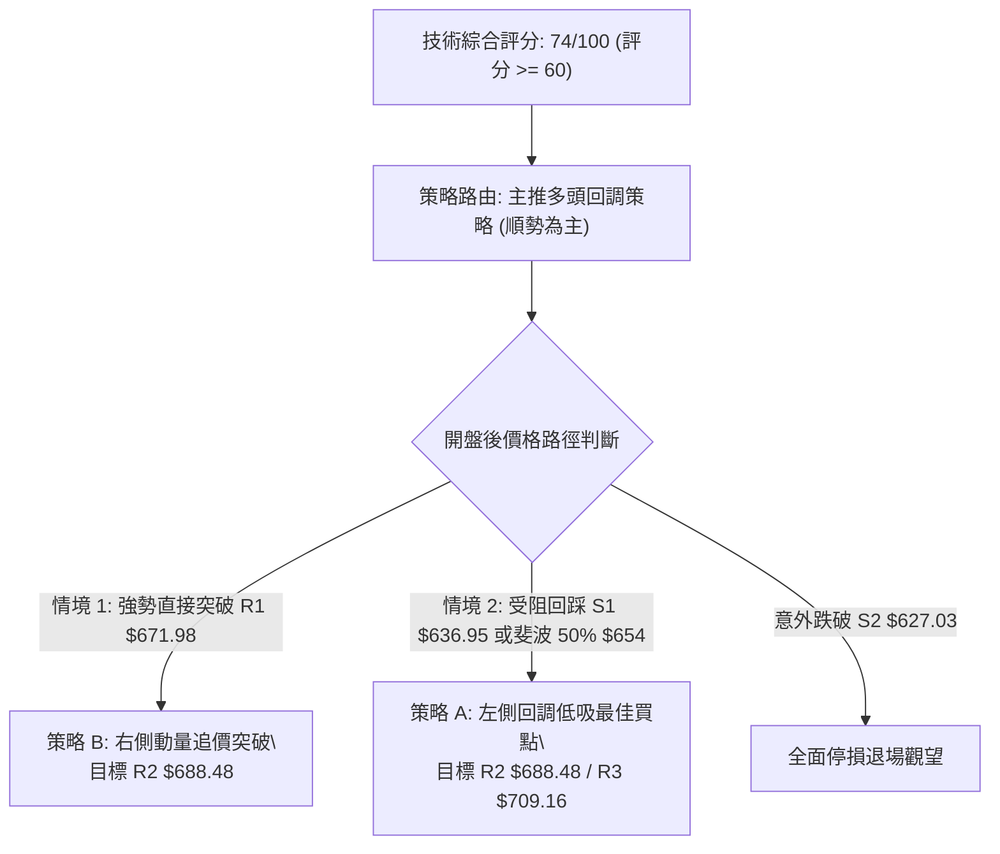

### 🧭 策略路由（依評分卡分流）

> **當前主策略方向 = 主推多頭回調策略（依評分 74/100，大於 60 分偏多門檻）**  
> 短線空頭僅列為「反轉風險觸發點（對沖提示）」，嚴禁在強趨勢主升段中盲目做空。

### 🎯 價格情境階梯（Price Scenarios）

*(價位均嚴格引用第 4 章／關鍵價位區塊計算之實際數值)*

| 觸發條件 | 下一目標 | 後續延伸 | 情境含義 |
|----------|----------|----------|----------|
| 帶量突破 **R1: $671.98** | **R2: $688.48** | **R3: $709.16** | 短線衝破壓力帶，多頭向斐波 38.2% 推進 |
| 於 **$654.00 ~ $671.98** 震盪 | 考驗 S1 **$636.95** | 回測 MA20 **$614.61** | 短線消化 RSI 超買賣壓，進行以盤代跌整理 |
| 放量跌破 **S1: $636.95** | **S2: $627.03** | **S3: $595.08** | 中期多頭漲勢停滯，短線轉入深度回踩測試 MA200 |

### 📊 情境機率分佈

| 情境劇本 | 機率估計 | 主要技術依據 |
|----------|----------|--------------|
| **情境 A：強勢震盪後上攻突破** | **60%** | ADX 26.92 確立強趨勢，MACD 柱狀體 +7.797 強勢放量，OBV 顯示大戶資金持續鎖碼進場支撐。 |
| **情境 B：回踩 S1 均線區間震盪** | **30%** | RSI 77.87 處於超買極值，Stoch 高檔鈍化，面臨 R1 $671.98 獲利了結回吐需求。 |
| **情境 C：假突破後反轉跌破 S2** | **10%** | 除非大盤系統性崩跌或重大基本面黑天鵝摜破 MA200 ($623.55)，否則機率極低。 |

### 🟢 主策略詳情（多頭進場）

*(所有買賣點與停損目標點均嚴格取自關鍵價位表)*

| 策略要素 | 策略 A（穩健型：回調支撐加碼） | 策略 B（激進型：突破動量跟進） |
|----------|---------------------------------|---------------------------------|
| **策略類型** | 順勢回調買入（Pullback Entry） | 順勢突破買入（Breakout Entry） |
| **進場條件** | 價格回踩波段支撐 S1 或 斐波 50%，出現止跌K棒 | 日K帶量實體收盤突破關鍵阻力 R1 |
| **進場價格** | **$636.95**（掛單或於 S1 附近進場） | **$671.98**（突破瞬間或回測確認追入） |
| **目標價 T1** | **$671.98**（波段阻力 R1） | **$688.48**（波段阻力 R2 / 斐波 38.2%） |
| **目標價 T2** | **$688.48**（波段阻力 R2） | **$709.16**（強阻力 R3 / 斐波擴展） |
| **止損價格** | **$619.50**（跌破 S2 $627.03 及 MA200 緩衝區） | **$654.00**（跌回斐波 50% 支撐下方） |
| **風險報酬比** | **1 : 2.97**（風險 $17.45，獲利 T2 $51.53） | **1 : 2.07**（風險 $17.98，獲利 T2 $37.18） |
| **預估勝率** | **68%** | **58%** |
| **建議倉位** | **總資金 15% ~ 20%** | **總資金 8% ~ 10%** |

### 🔴 反向風險觸發點（對沖提示）

- **全面空頭轉向觸發價**：**$627.03 (支撐 S2)**。
- **對沖處置條件**：若市價未能在 S1 **$636.95** 止跌，反而帶量灌破 S2 **$627.03** 與長期均線 MA200 **$623.55**，代表本次突破為「假突破陷阱」，多頭部位應全面無條件停損出場，並可藉由做空期權或反向 ETF 進行資金保護。

### ⭐ 整體訊號強度評星

```
做多訊號強度：★★★★☆  (4/5星 — 趨勢明確、量能充沛，唯超買扣 1 星)
做空訊號強度：★☆☆☆☆  (1/5星 — 逆勢做空風險極高，僅有超買回調可能)
整體可信度：  ★★★★☆  (4/5星 — 數據結構完整，量價與均線高度確認)
```

---

## 9. 風險提示與監控

### ✅ 關鍵監控指標 Checklist

```
╔══════════════════════════════════════════════════════════════╗
║              META 交易日常關鍵風控清單 Checklist            ║
╠══════════════════════════════════════════════════════════════╣
║ [ ] 價格是否跌破斐波那契 50.0% 關鍵水準 $654.00 ？          ║
║ [ ] 每日收盤價是否跌破第一防禦支撐位 S1 ($636.95) ？         ║
║ [ ] 日線 RSI(14) 是否跌破 70 產生「超買區死叉回落」？         ║
║ [ ] MACD 柱狀體數值是否由正轉負（跌破 0 軸）？              ║
║ [ ] 日成交量是否萎縮至 20 日均量 (1,867 萬股) 之下？          ║
║ [ ] 價格是否強勢突破首要阻力 R1 ($671.98) 且維持 3 日？      ║
╚══════════════════════════════════════════════════════════════╝
```

### ⚠️ 風險場景分析

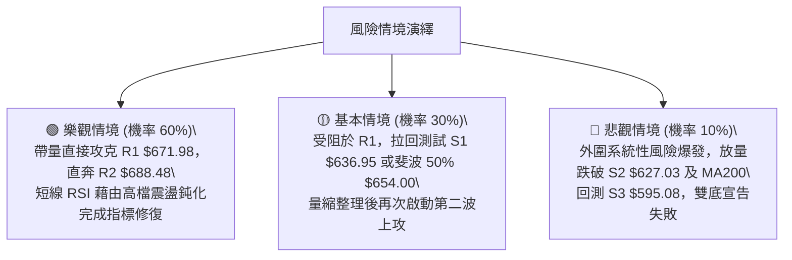

### 🛡️ 風險管理重要提醒

1. **ATR 波動防禦**：META 當前 ATR 高達 **$21.79**（每日振幅 3.27%），在持有該標的期間，任何過於緊湊的停損（如小於 $10）極易在日常隨機波動中被無謂清洗，停損設置必須給予至少 1.0 ~ 1.5 倍 ATR 空間（約 $22 ~ $33 美元）。
2. **超買環境下的倉位管理**：鑑於日線 RSI(14) 處於 **77.87** 之高位，絕對不可在此刻採取一次性 100% 滿倉市價追進。強烈建議採取**「底倉 40% + 回踩支撐分批加碼 60%」**的金字塔建倉法。
3. **重大基本面配合**：雖然華爾街分析師平均目標價給出 **$755.28**（甚至高達 $1000.00），且評級為「強烈買入 (Strong Buy)」，但技術面上檔阻力 R1 ($671.98) 與 R2 ($688.48) 存在大量歷史套牢籌碼，操作上應完全尊重客觀價位，切忌因基本面看好而忽視停損紀律。

---

## 📋 報告總結

```
╔══════════════════════════════════════════════════════════════╗
║                   META 技術分析報告總結                      ║
╠══════════════════════════════════════════════════════════════╣
║ 報告日期：2026-09-19                                         ║
║ 當前價格：$665.75                                            ║
║ 分析評級：🟢 強勢看多，建議回調低吸 (評分 74/100)           ║
║                                                              ║
║ 關鍵結論：                                                   ║
║ ├─ 長期趨勢：🟢 脫離底部回升，收復全數關鍵均線               ║
║ ├─ 中期趨勢：🟢 雙底反轉突破頸線確立，量價齊揚               ║
║ ├─ 短期趨勢：🟡 動能極強但 RSI(14)=77.87 嚴重超買，面臨短震  ║
║ ├─ 關鍵支撐：S1: $636.95 / S2: $627.03 / 斐波50%: $654.00    ║
║ ├─ 關鍵阻力：R1: $671.98 / R2: $688.48 / R3: $709.16        ║
║ └─ 分析師目標：平均 $755.28 (最高 $1000.00 / 56位分析師)     ║
║                                                              ║
║ 最優策略組合：                                               ║
║ 1. 🥇 最佳機會：策略 A — 回踩 S1 $636.95 支撐分批建倉，      ║
║                  止損 $619.50，目標直指 R2 $688.48 (R:R 2.97)║
║ 2. 🥈 次選機會：策略 B — 帶量收盤突破 R1 $671.98 右側追進，  ║
║                  止損 $654.00，目標 R2 $688.48 (R:R 2.07)   ║
║ 3. 🥉 保守選擇：場外資金暫時觀望，等待 RSI 回落至 60 附近且 ║
║                  股價在 $640–$654 區間獲得支撐再行介入       ║
╚══════════════════════════════════════════════════════════════╝
```

---

> ⚠️ **免責聲明**：本報告為技術分析研究，所有數據及估算均基於歷史量價資訊與客觀技術模型計算。本報告**僅供研究與學術參考**，**不構成任何投資建議或買賣邀約**。金融市場投資伴隨高度風險，投資人應獨立評估風險並自負盈虧。

---

*報告生成時間：2026-09-19 ｜ 數據來源：Yahoo Finance ｜ 分析框架：多時框量化技術分析*