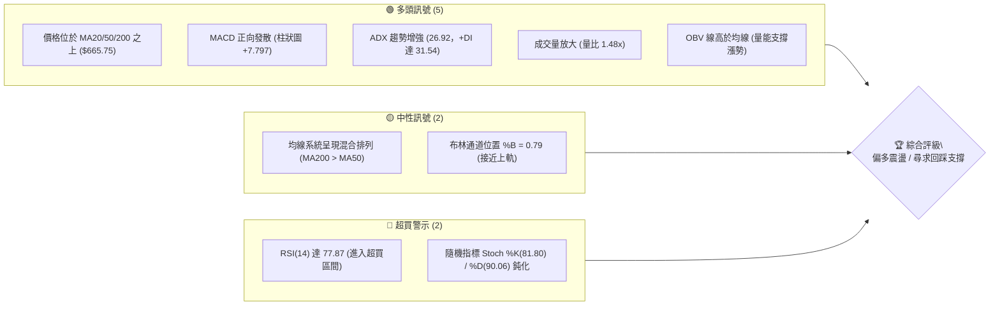
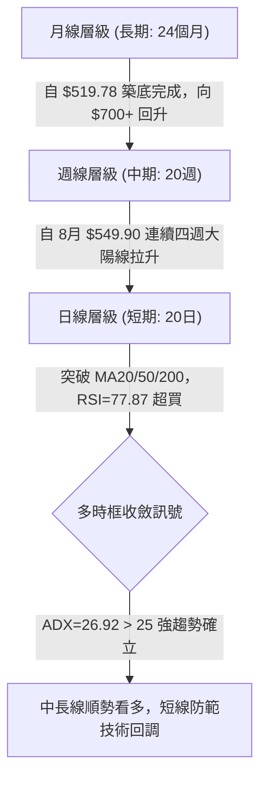
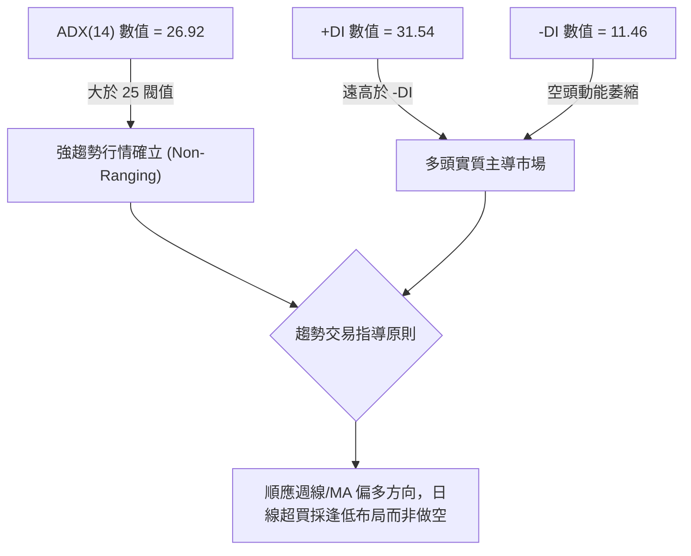
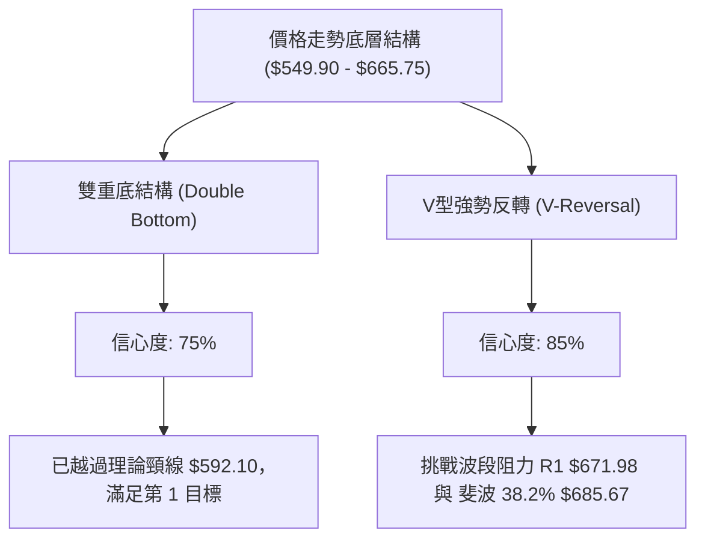
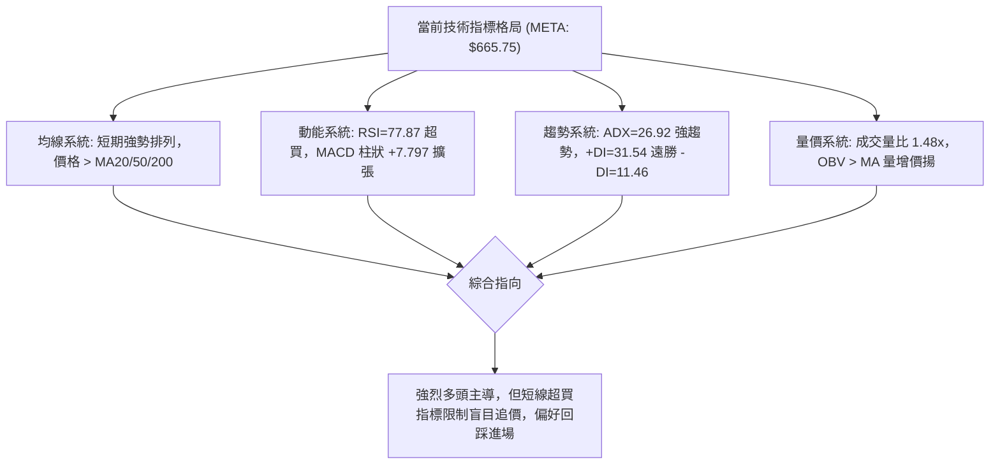
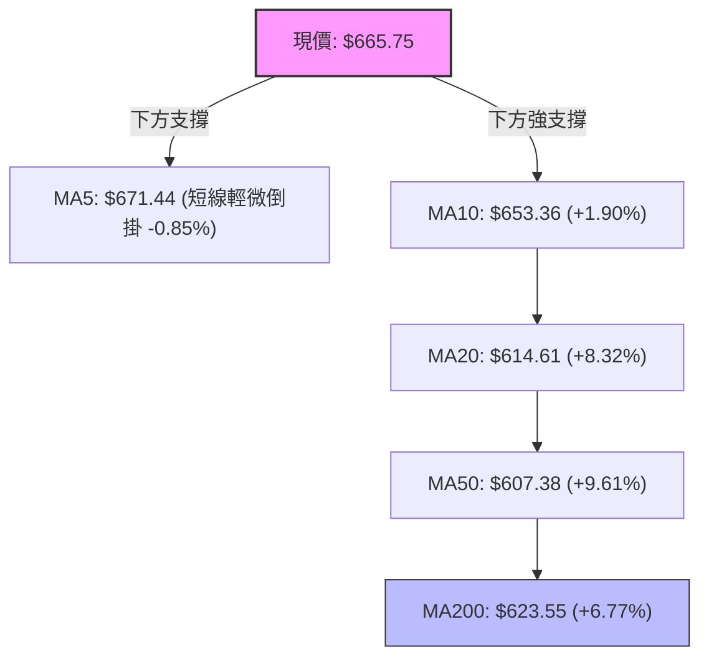
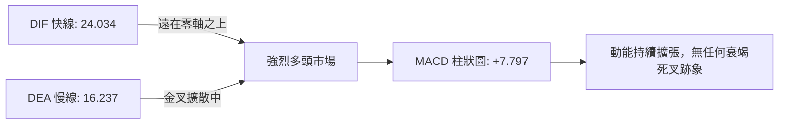
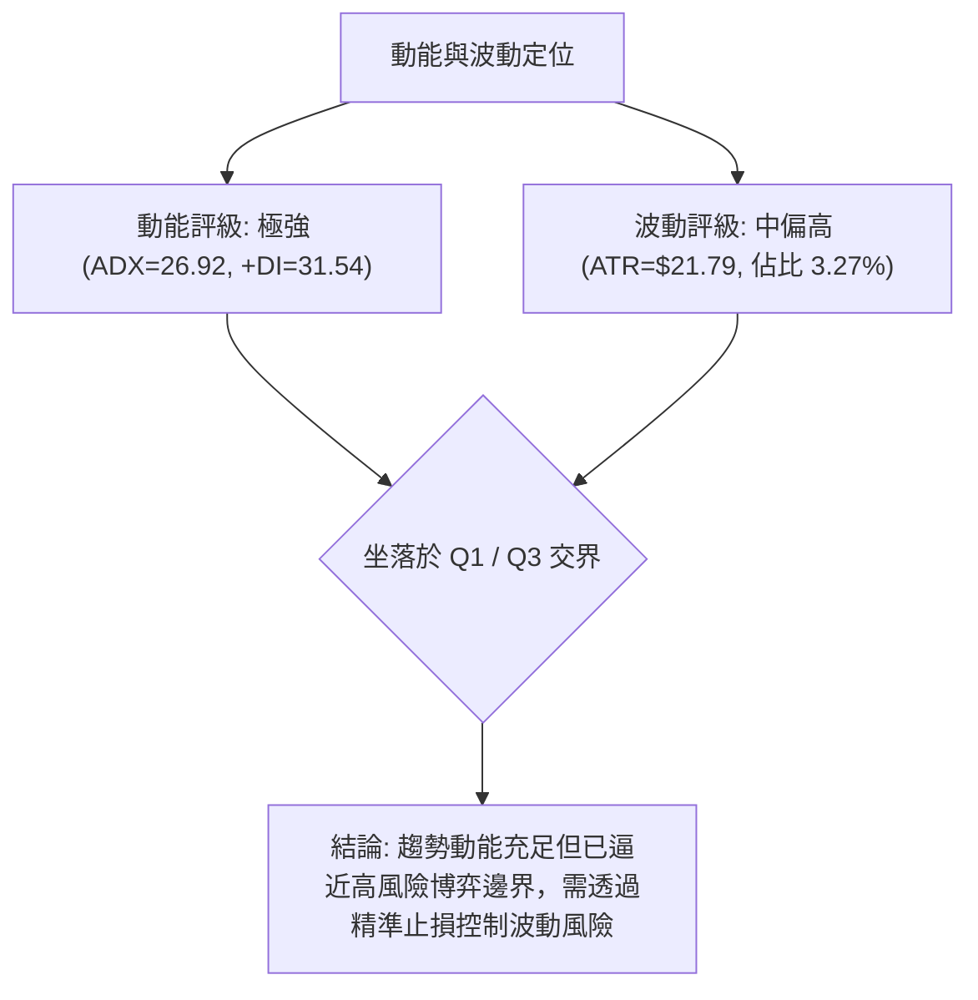
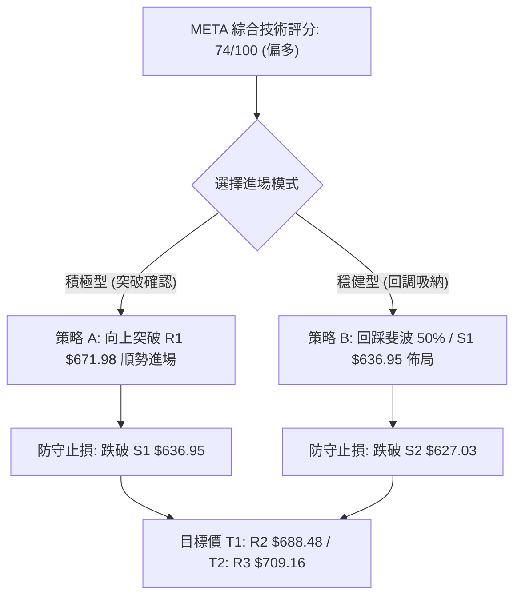
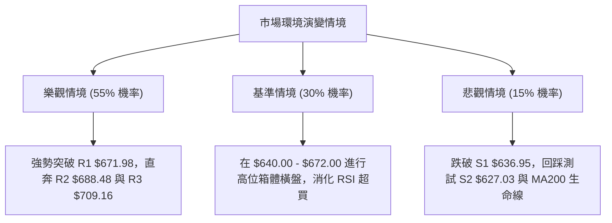

# META 技術分析報告

> **報告日期**：2026-09-20 ｜ **語言**：繁體中文 ｜ **數據來源**：Yahoo Finance ｜ **當前價格**：$665.75

---

## 目錄

| 章節 | 內容 |
|------|------|
| [1. 技術面概覽](#1-技術面概覽) | 訊號儀表板、核心指標、評分卡 |
| [2. 趨勢分析](#2-趨勢分析) | 多時框趨勢、長中短期走勢 |
| [3. 圖表形態分析](#3-圖表形態分析) | 形態識別、K線組合、目標價 |
| [4. 支撐與阻力](#4-支撐與阻力) | 關鍵價位、斐波那契回調 |
| [5. 技術指標深度解讀](#5-技術指標深度解讀) | MA/RSI/MACD/布林/成交量 |
| [6. 動能與波動率](#6-動能與波動率) | 動能評估、ATR、Beta |
| [7. 多時框架總結](#7-多時框架總結) | 時框架評分矩陣 |
| [8. 交易策略建議](#8-交易策略建議) | 多空策略、風險報酬比 |
| [9. 風險提示與監控](#9-風險提示與監控) | 監控指標、風險場景 |

---

## 1. 技術面概覽

### 🎯 技術訊號儀表板



### 📊 核心指標速覽表

| 指標類別 | 指標名稱 | 當前數值 | 訊號 | 解讀 |
|----------|----------|----------|------|------|
| **價格** | 當前價格 | $665.75 | 🟢 | 位於52週區間 54.4%，脫離底部強勁反彈 |
| **均線** | MA20 | $614.61 | 🟢 | 現價高於 MA20 達 +8.32%，短期均線向上拔升 |
| **均線** | MA50 | $607.38 | 🟢 | 現價高於 MA50 達 +9.61%，中期扭轉向上 |
| **均線** | MA200 | $623.55 | 🟢 | 現價突破長期生命線，多空結構由多頭掌控 |
| **動能** | RSI(14) | 77.87 | 🔴 | 進入 >70 極度超買區，短線不可盲目追高 |
| **動能** | MACD | 24.034 / 16.237 | 🟢 | 雙線位於零軸上方，柱狀圖正值擴張 (+7.797) |
| **趨勢** | ADX(14) | 26.92 | 🟢 | 突破 25 臨界線，顯示強趨勢成型 (+DI=31.54) |
| **波動** | ATR(14) | $21.79 | 🟡 | 佔股價 3.27%，單日波動較大，需設置寬幅止損 |
| **成交量** | 20日量比 | 1.48x | 🟢 | 最新成交量 27.55M，顯著高於均量 18.68M |

### 🏆 技術評分卡

```
╔══════════════════════════════════════════════════════════════╗
║                技術評分卡 — META (2026-09-20)                ║
╠══════════════════════════════════════════════════════════════╣
║ 趨勢強度 (Trend)     ████████████████░░░░  80/100  🟢 強趨勢  ║
║ 動能指標 (Momentum)  ██████████████░░░░░░  70/100  🟡 偏強過熱║
║ 支撐穩定度 (Support) ██████████████░░░░░░  70/100  🟢 紮實    ║
║ 成交量配合 (Volume)  ████████████████░░░░  80/100  🟢 量價齊揚║
║ 形態完整度 (Pattern) ██████████████░░░░░░  70/100  🟢 底部突破║
║ 均線架構 (MA Align)  ████████████░░░░░░░░  60/100  🟡 混合排列║
╠══════════════════════════════════════════════════════════════╣
║ 綜合技術評分         ███████████████░░░░░  74/100  🟢 偏多格局║
╚══════════════════════════════════════════════════════════════╝
```

---

## 2. 趨勢分析

### 🌐 多時框趨勢分析



### 📈 長期趨勢 — 12個月走勢圖（Unicode）

META 過去 12 個月（2025-09 至 2026-09）呈現完整的高位回落、雙重探底與近期的強勢反轉：

```
META 月線走勢圖（過去12個月收盤價變動）
價格軸 ($)
$750 ┤
$720 ┤ ● (25-09: 732.47)
$690 ┤                 ● (26-01: 715.22)
$660 ┤       ●     ●                       ●←現在 ($665.75)
$630 ┤   ●       ●             ●       ●
$600 ┤                             ●
$570 ┤                     ●                   ●
$540 ┤                                     ● (26-07: 556.71)
     └─┬───┬───┬───┬───┬───┬───┬───┬───┬───┬───┬───┬───
      09  10  11  12  01  02  03  04  05  06  07  08  09
      2025                                        2026
```

#### 走勢特徵分析表格

| 階段區間 | 起止月份 | 價格區間 ($) | 漲跌幅度 | 走勢特徵與結構解讀 |
|----------|----------|--------------|----------|-------------------|
| 高位震盪 | 2025-09 ~ 2026-01 | $732.47 → $715.22 | -2.35% | 在歷史高點附近盤整，於 2026 年 1 月形成次高點 |
| 主跌修正 | 2026-01 ~ 2026-03 | $715.22 → $571.60 | -20.08% | 跌破所有短期均線，呈現快速去估值行情 |
| 築底震盪 | 2026-03 ~ 2026-07 | $571.60 → $556.71 | -2.61% | 反覆測試 $550–$560 支撐，7 月創 52 週次低 $556.71 |
| 底部重測 | 2026-08 | $572.34 (週低 549.90)| -1.22% | 8 月下旬下探 $549.90 完成二次探底確認 |
| 強力反轉 | 2026-08 ~ 2026-09 | $572.34 → $665.75 | +16.32% | 成交量大幅擴增，四週急拉超 110 美元 |

### 📊 中期趨勢（週線分析）

中期走勢自 2026 年 8 月 23 日當週下探至 $549.90 後，走出強勁的連續推進結構：
- **2026-08-30 當週**：收 $578.02，MACD 柱狀圖由 -4.226 快速收斂至 +1.912，翻多確立。
- **2026-09-06 當週**：收 $616.77，大漲 6.70%，一舉吞噬多根中期均線，成交量持穩於 81.44M。
- **2026-09-13 當週**：收 $648.03，RSI 上攻至 83.9 高位，MACD 柱狀圖達 +9.875，多頭極度強勢。
- **2026-09-20 當週（最新）**：收 $665.75，成交量攀升至 99.53M，週線呈現「四連陽」多頭進攻形態。

### ⚡ 趨勢強度評估（ADX 解讀）



#### ADX 數值對照表

| 指標 | 數值 | 參考臨界線 | 當前狀態判定 | 交易指引 |
|------|------|------------|--------------|----------|
| **ADX(14)** | 26.92 | 25.00 | 🟢 進入強趨勢區間 | 擺脫盤整，應採取趨勢跟隨（Trend Following）策略 |
| **+DI** | 31.54 | 20.00 | 🟢 多方動能充沛 | 買方掌控市場定價權，回調幅度預期有限 |
| **-DI** | 11.46 | 20.00 | 🟢 空方動能衰退 | 空頭缺乏實質拋壓，反彈無量轉為實質推升 |

---

## 3. 圖表形態分析

### 🔍 形態識別系統



#### 形態識別與信心度評估表

| 形態類別 | 信心度 | 判斷依據（引用數據） | 完成度 | 目標價（附嚴格計算式） |
|----------|--------|----------------------|--------|------------------------|
| **雙重底形態** | 75% | 兩次低點分別為 2026-06/07 之 $556.71 與 2026-08 之 $549.90，兩者落於 $550 支撐帶內；頸線為 2026-08-09 波段高點 $592.10。 | 100% (已突破) | 頸線 $592.10 + 形態高度 ($592.10 - $549.90 = $42.20) = **$634.30**（已達成，當前價格已遠超此水準）。 |
| **V型突破延伸** | 85% | 8月23日 $549.90 後無任何像樣回調，連續4週大陽線貫穿 MA20/50/200，週成交量達 99.53M。 | 80% | 以底部 $549.90 突破斐波 50% ($654.00) 推算下一阻力目標：**R2 $688.48** 與 斐波 38.2% **$685.67**。 |
| **上升通道形態** | 45% | 當前僅單邊垂直拉升，尚未形成明確的回踩通道下軌。 | 30% | 數據不足，僅做指標型解讀（布林帶向上開口），不作延伸計算。 |

### 🕯️ 重要K線形態分析

| 週期/月份 | 收盤價 | K線形態 | 解讀 | 訊號 |
|-----------|--------|---------|------|------|
| 2026-07 | $556.71 | 長下影錘子線 | 測試 52 週低點區間後買盤進駐，浮額清洗完畢 | 🟢 底背離初現 |
| 2026-08 | $572.34 | 晨星過渡實體 | 月初挫至 $549.90 後迅速拉起，形成右底支撐 | 🟢 築底完成 |
| 2026-09 (至今) | $665.75 | 光腳大陽線 | 單月暴漲 +$93.41，強勢收復所有中期均線失地 | 🟢 多頭爆發 |
| 最近一週 (09-20) | $665.75 | 上影陽線 | 觸及阻力位 R1 $671.98 前略有收斂，量能充沛 | 🟡 短線受阻 |

### 📉 ASCII 走勢形態示意圖

```
META 底部突破與頸線結構示意圖
$688.48 ┤                                              [阻力 R2]
$671.98 ┤                                         ●    [阻力 R1]
$665.75 ┤                                       ●      [現價]
$654.00 ┤                                     ●        [斐波 50.0%]
$634.30 ┤                                   ●          [雙底目標價-已達]
$592.10 ┤             ●                   ●            [雙底頸線]
        ├────────────╱─╲─────────────────╱─────────────
$556.71 ┤     ●     ╱   ╲       ●       ╱
$549.90 ┤      ╲───╱     ╲─────╱ ╲─────╱               [左底 $556.71 / 右底 $549.90]
        └───────┴──────────┴──────┴───────────────────
              2026-07            2026-08      2026-09
```

### 🎯 形態目標價計算

1. **雙底基礎量度目標**：
   - 形態底部最低點：$549.90 (2026-08-23 週收盤)
   - 形態頸線高點：$592.10 (2026-08-09 週收盤)
   - 垂直高度 $H = \$592.10 - \$549.90 = \$42.20$
   - 突破量度目標 = 頸線 $\$592.10 + \$42.20 = \mathbf{\$634.30}$ （市場已於 2026-09-13 以收盤價 $648.03 有效跨越）。
2. **第二波段延伸目標**：
   - 依波段高點聚類計算之強阻力位：**R2 $688.48** 與 斐波那契 38.2% 回調位 **$685.67**。

---

## 4. 支撐與阻力

### 🗺️ 關鍵價位分布圖（Unicode）

```
META 價位結構分布圖（引用 OHLCV 關鍵聚類價位）
════════════════════════════════════════════════════════════════════
$709.16 ║████████████████████████████████████║ 強阻力 R3 (+6.52%)
$688.48 ║████████████████████████            ║ 波段阻力 R2 (+3.41%)
$671.98 ║████████████████                    ║ 關鍵即時阻力 R1 (+0.94%)
$665.75 ╠════════════════════════════════════╣ ◄ 當前市價 ($665.75)
$654.00 ║▓▓▓▓▓▓▓▓▓▓▓▓▓▓▓▓▓▓                  ║ 斐波那契 50.0% 中樞支撐
$636.95 ║▓▓▓▓▓▓▓▓▓▓▓▓▓▓▓▓▓▓▓▓▓▓▓▓            ║ 近期第一支撐 S1 (-4.33%)
$627.03 ║████████████████████████████        ║ 均線重合強支撐 S2 (-5.82%)
$595.08 ║████████████████████████████████████║ 長期波段底界 S3 (-10.61%)
════════════════════════════════════════════════════════════════════
```

### 🚧 阻力位分析表

| 阻力級別 | 精確價位 | 形成原因（依據數據聚類） | 突破難度 | 重要性 |
|----------|----------|--------------------------|----------|--------|
| **R1** | **$671.98** | 近一年波段高點聚集密集帶，與 MA5 ($671.44) 重疊 | 🟡 中等 | 短線多空爭奪樞紐，收盤站上將開啟加速波段 |
| **R2** | **$688.48** | 前波密集成交頂部區，極度貼近斐波 38.2% ($685.67) | 🔴 較高 | 中期強阻力，存在獲利盤沉重拋壓 |
| **R3** | **$709.16** | 2026年1月次高點 ($715.22) 下方防守帶，接近布林上軌 ($703.38) | 🔴 極高 | 波段獲利了結臨界線 |

### 🛡️ 支撐位分析表

| 支撐級別 | 精確價位 | 形成原因（依據數據聚類） | 守住機率 | 重要性 |
|----------|----------|--------------------------|----------|--------|
| **S1** | **$636.95** | 近一年波段低點聚類，接近雙底量度目標 ($634.30) | 🟢 80% | 短線回調首要防守位，跌破代表拉回幅度加深 |
| **S2** | **$627.03** | 密集成交支撐，貼近長期生命線 MA200 ($623.55) | 🟢 85% | 中期生命防線，多頭結構不容跌破之核心基石 |
| **S3** | **$595.08** | 前波底部頸線 ($592.10) 及歷史波段低點聚類 | 🟢 95% | 牛熊分水嶺，跌破則反轉行情宣告終結 |

### 📐 斐波那契回調位分析

依 52 週波段極值區間（低點 $519.78 → 高點 $788.22，全波段震盪空間 $268.44）精確計算：

| 斐波那契層級 | 精確價位 | 相對現價距離 | 技術意涵與結構定位 |
|--------------|----------|--------------|-------------------|
| **0.0%** (52W High) | **$788.22** | +18.40% | 歷史波段頂點，最終多頭終極目標 |
| **23.6%** | **$724.87** | +8.88% | 強勢牛市延伸區間，突破後直逼前高 |
| **38.2%** | **$685.67** | +2.99% | 第一關鍵阻力防線，與 R2 ($688.48) 形成雙重阻力共振 |
| **50.0%** | **$654.00** | -1.76% | **多空分水嶺中樞**，現價剛剛突破並站上此位置 |
| **61.8%** | **$622.32** | -6.52% | 黃金分割防守位，與 MA200 ($623.55) 完全重合 |
| **78.6%** | **$577.22** | -13.30% | 深度回調極限，2026-08-30 收盤 ($578.02) 曾精準在此獲得支撐 |
| **100.0%** (52W Low) | **$519.78** | -21.93% | 52週週期底部極值 |

> 📌 **結構解讀**：當前市價 **$665.75** 處於 **50.0% ($654.00)** 與 **38.2% ($685.67)** 之間。在技術分析定義中，強勢突破 50% 斐波那契回調位，代表先前下跌波段的賣壓已完全被多頭吸收，價格高機率向 38.2% ($685.67) 甚至 23.6% ($724.87) 挺進。

---

## 5. 技術指標深度解讀

### 🎛️ 指標訊號總覽



### 📈 移動平均線排列分析



#### 均線體系明細表

| 均線名稱 | 當前數值 | 偏離度 (與現價) | 走勢方向 | 技術解讀 |
|----------|----------|-----------------|----------|----------|
| **MA 5** | $671.44 | -0.85% | 略微走平 | 短期極速衝高後略微回落，現價處於 MA5 邊緣 |
| **MA 10** | $653.36 | +1.90% | 向上攀升 | 極短期動能支撐，貼近斐波 50% ($654.00) |
| **MA 20** | $614.61 | +8.32% | 急劇上揚 | 布林中軌所在，短期波段最重要的趨勢依託 |
| **MA 50** | $607.38 | +9.61% | 拐頭向上 | 中期反轉確認，即將與 MA200 醞釀黃金交叉 |
| **MA 60** | $603.90 | +10.24% | 向上反彈 | 季線位置獲得確認 |
| **MA 120** | $608.38 | +9.43% | 築底平移 | 半年線壓制解除，轉為中度支撐 |
| **MA 200** | $623.55 | +6.77% | 走勢趨平 | 長期生命線，現價站穩其上確認長線空頭已扭轉 |
| **MA 240** | $630.88 | +5.53% | 緩步下移 | 年線阻力已完全被實體陽線吞噬突破 |

> 📌 **均線排列診斷**：目前雖然因過去半年的下行使 MA200 ($623.55) 尚高於 MA50 ($607.38)，呈「混合排列」，但短中期均線（MA5/10/20）呈強勢多頭排列，且 MA20 ($614.61) 正高速向 MA200 逼近。若維持當前推升節奏，即將引發均線多頭排列共振。

### 📉 RSI(14) 分析

```
RSI(14) 強度計：
0                  30               50               70     77.87    100
├──────────────────┼────────────────┼────────────────┼───────●───────┤
░░░░░░░░░░░░░░░░░░ 超賣區間         中性區間         超買區間 [███████░░░] 77.87%
```

- **超買超賣狀態**：RSI(14) 讀數為 **77.87**，已步入 70 以上的超買警戒區。歷史數據顯示，當 META 的日線與週線 RSI 超過 75 時，常伴隨 2–5 天的高位橫盤或回調消化。
- **背離判斷**：
  - **頂背離**：🔴 **無明顯頂背離**。過去四週收盤價從 $549.90 → $578.02 → $616.77 → $648.03 → $665.75，對應的週 RSI 由 31.3 → 43.8 → 69.9 → 83.9 → 77.9。指標與價格同創新高，屬動能極致釋放的「強勢鈍化」特徵，並非反轉型背離。
  - **底背離**：🟢 8 月底在 $549.90 探底時與 MACD 形成過隱性底背離，該背離已成功驅動目前的大漲。

### 📊 MACD(12/26/9) 訊號解讀



- **指標讀數**：DIF 快線為 **24.034**，DEA 慢線（Signal）為 **16.237**，兩者差距高達 **+7.797**（柱狀圖值）。
- **結構研判**：雙線不但位於零軸上方，且開口持續放大。週線級別的 MACD 柱狀圖亦連續 4 週為正（最新一週為 +7.797，前值 +9.875），顯示中長線資金進場意願強烈。

### 📦 布林通道分析

```
META 布林通道示意圖 (Bandwidth 寬度展開)
$703.38 ┬──────────────────────────────────────── 上軌 (BB Upper)
        │                                  ● $665.75 (現價，位於 %B=0.79)
$614.61 ┼──────────────────────────────────────── 中軌 (MA20)
        │
        │
$525.84 ┴──────────────────────────────────────── 下軌 (BB Lower)
```

- **布林通道數值**：
  - **上軌 (BB Upper)**：$703.38
  - **中軌 (MA20)**：$614.61
  - **下軌 (BB Lower)**：$525.84
  - **位置指標 (%B)**：**0.79**（介於中軌 0.5 與上軌 1.0 之間，偏向多方上沿）
- **通道形態**：帶寬顯著擴張，價格緊貼上軌運行（Walking the bands），屬於標準的強趨勢突破形態。只要價格不有效跌破中軌 $614.61，任何觸碰或貼近上軌的走勢均屬多頭常態。

### 💹 成交量分析（量價配合度）

- **成交量量比**：
  - 最新單日成交量：**27,548,000**
  - 20 日平均成交量：**18,676,035**
  - 50 日平均成交量：**17,970,842**
  - **量比（Volume Ratio）**：$27,548,000 / 18,676,035 = \mathbf{1.48x}$（放量 48%）
- **週成交量驗證**：最近一週成交量高達 99,528,900 股，遠超 7 月底探底時的 57.38M，呈現「價漲量增」的健康多頭配合。
- **OBV (能量潮指標)**：數據明確指出 `OBV > MA`，能量潮指標持續創下階段新高，代表大資金與機構籌碼處於實質淨流入狀態，量能完全支撐當前價格上揚。

---

## 6. 動能與波動率

### ⚡ 動能評估四象限

| 象限 | 動能維度 (Momentum) | 波動維度 (Volatility) | 當前判定 | 特徵與策略意涵 |
|------|---------------------|-----------------------|----------|----------------|
| **Q1 (最佳擴張)** | 強動能 (MACD>0, RSI>70) | 低/可控波動 (ATR% 穩定) | 🟢 **主導狀態** | 趨勢行情爆發，獲利效益最高，宜持股續抱 |
| **Q2 (盤整沉澱)** | 弱動能 (MACD接近0) | 低波動 (帶寬收縮) | — | 缺乏明確催化劑，不適用當前盤勢 |
| **Q3 (極端博弈)** | 強動能 (ADX>25) | 高波動 (ATR% 放大) | 🟡 **過渡狀態** | 接近阻力位時易發生劇烈洗盤，不宜追高 |
| **Q4 (弱勢拋售)** | 弱動能 (-DI 主導) | 高波動 (破位下殺) | — | 熊市殺跌特徵，當前完全排除 |



### 📊 ATR 波動率分析

- **ATR(14) 數值**：**$21.79**（佔市價 $665.75 的 **3.27%**）。
- **日常波動區間估算**：這意味著 META 在單個交易日內的正常雜訊波動範圍在 $\pm \$21.8$ 左右。在策略佈局時，止損距離若小於 1.0x ATR，極易被隨機波動震盪出局。
- **風控止損距離量化**：
  - **緊密止損 (1.0x ATR)**：距離現價 $\$21.79$ → 對應價位約 **$643.96**
  - **標準技術止損 (1.5x ATR)**：距離現價 $\$32.69$ → 對應價位約 **$633.06**（正好覆蓋支撐 S1 $636.95）
  - **寬幅趨勢止損 (2.0x ATR)**：距離現價 $\$43.58$ → 對應價位約 **$622.17**（正好覆蓋 MA200 $623.55 與支撐 S2 $627.03）

### 📐 Beta 與市場相關性

- **Beta 係數**：**1.243**
- **市場屬性分析**：META 表現出高於標普 500 指數約 24.3% 的波動彈性。在美股大盤處於風險偏好（Risk-On）環境時，META 具備顯著的超額收益（Alpha）爆發力；但反之若大盤拉回，其跌幅亦會被放大。這要求在操作時密切關注大盤整體走勢，切忌滿倉高槓桿操作。

---

## 7. 多時框架總結

### 📋 時框架評分表

| 時框架 | 趨勢方向 | 動能表現 | 均線排列 | 圖表形態 | 綜合評分 | 操作建議 |
|--------|----------|----------|----------|----------|----------|----------|
| **月線 (長期)** | 🟡 震盪轉強 | 柱狀圖走平收斂 | 測試 MA120/240 | 自 52W 低點 $519.78 強勁反彈 | 70/100 | 長線持股，目標看至歷史高點附近 |
| **週線 (中期)** | 🟢 極強多頭 | MACD 柱連4紅 | 站穩 MA20/50 | 雙重底頸線突破，大陽線進攻 | 85/100 | 中期順勢做多，逢回踩加碼 |
| **日線 (短期)** | 🟢 強多但過熱 | RSI 77.87 超買 | MA20 上穿，均線發散 | 貼近布林上軌，逼近 R1 $671.98 | 75/100 | 短線禁止追高，等待分時級別回調進場 |

### 🔲 綜合訊號矩陣

| 技術維度 | 短期 (1–5日) | 中期 (1–4週) | 長期 (1–3季) | 多時框一致性判定 |
|----------|--------------|--------------|--------------|------------------|
| **趨勢方向** | 多頭衝刺 | 多頭主升 | 底部扭轉 | 🟢 高度一致偏多 |
| **動能配合** | 極度超買 (警戒) | 動能充沛 | 剛翻紅復甦 | 🟡 短期過熱但未背離 |
| **成交量能** | 放大 (1.48x) | 持續放量 | 溫和回升 | 🟢 籌碼吸納跡象明確 |
| **關鍵位置** | 逼近 R1 $671.98 | 挑戰 R2 $688.48 | 邁向斐波 23.6% ($724.87) | 🟢 向上空間逐步打開 |

### ⚖️ 多時框收斂結論

依「嚴格要求 14」與「多時框收斂規則」進行判定：
1. **行情性質識別**：當前 ADX(14) 讀數為 **26.92 > 25**，且 +DI(31.54) 遠高於 -DI(11.46)，明確判定為**「趨勢行情」**而非盤整行情。
2. **時框優先權確立**：在趨勢行情中，中長期（週線級別突破及 MA50/MA200 重拾升勢）為主要趨勢方向；日線級別的 RSI 超買僅作為「進場時機與回調節奏」的調整指標，不可作為逆勢做空的依據。
3. **最終方向性結論**：**🟢 實質偏多（Bullish Bias）**。主導操作為順應週線強趨勢做多，策略上嚴禁在當前位置盲目追價，應耐心等待短線動能指標消化、價格回踩關鍵支撐後再行介入。

---

## 8. 交易策略建議

### 🗺️ 策略決策流程圖



### 🧭 策略路由

> **當前主策略方向 = 🟢 多頭主導策略（依技術評分卡 74/100 分流）**  
> 綜合評分高於 60 分，本報告主推多頭跟進與回踩做多方案。空頭策略僅作為突發利空導致關鍵支撐跌破時的「反轉風險觸發點與避險對沖提示」，不建議投資者進行主動裸做空。

### 🎯 價格情境階梯（Price Scenarios）

所有價位均嚴格引用第 4 章計算之波段聚類高低點與斐波那契回調位：

| 觸發條件 | 當前應對 | 下一目標 | 後續延伸 | 情境技術含義 |
|----------|----------|----------|----------|--------------|
| **強勢突破 R1 $671.98** | 短線追多/加碼 | **R2 $688.48** | **R3 $709.16** | 突破近一年高點聚類，開啟加速主升浪 |
| **維持現價區間震盪** | 觀望 / 逢低佈局 | **R1 $671.98** | **S1 $636.95** | 消化 RSI 77.87 超買，布林帶寬度蓄勢 |
| **回踩跌破 S1 $636.95** | 減倉防守 | **S2 $627.03** | **S3 $595.08** | 短期動能熄火，考驗 MA200 生命線支撐 |

### 📊 情境機率分佈

| 情境劇本 | 機率預估 | 主要技術指標依據 |
|----------|----------|------------------|
| **情境一：強勢向上突破 / 延續主升** | **55%** | ADX 26.92 強趨勢成立，+DI=31.54，OBV 大幅走揚，成交量能達 1.48x 放大確認。 |
| **情境二：高位強勢震盪 / 消化超買** | **30%** | RSI(14) 達 77.87 進入超買區，隨機指標 %K/%D 高位鈍化，面臨 R1 $671.98 阻力。 |
| **情境三：深度回調 / 測試長期均線** | **15%** | 均線仍處於混合排列，若大盤急速拉回，ATR 波動大，引發獲利盤拋售回測 S2 $627.03。 |

### 🟢 主策略詳情

| 策略要素 | 策略 A：強勢突破跟進策略 (Aggressive) | 策略 B：穩健回踩支撐佈局 (Conservative) |
|----------|---------------------------------------|-----------------------------------------|
| **適用對象** | 積極型短線交易者、趨勢動量操作者 | 穩健型波段波段投資者、機構倉位配置者 |
| **進場條件** | 日線實體突破 R1 $671.98 且 30分K 站穩 | 價格回調測試斐波 50% 或 S1 出現下影線支撐 |
| **進場價格** | **$673.00** (突破 R1 後確認買入) | **$640.00** (於 S1 $636.95 上方分批低吸) |
| **目標價 T1** | **$688.48** (阻力位 R2，漲幅 +2.30%) | **$671.98** (阻力位 R1，漲幅 +5.00%) |
| **目標價 T2** | **$709.16** (阻力位 R3，漲幅 +5.37%) | **$688.48** (阻力位 R2，漲幅 +7.58%) |
| **止損價格** | **$653.00** (跌破斐波 50% $654.00 止損) | **$625.00** (跌破 S2 $627.03 與 MA200) |
| **風險報酬比** | **1 : 1.81** (風險 $20.00 / 潛在獲利 $36.16) | **1 : 3.23** (風險 $15.00 / 潛在獲利 $48.48) |
| **勝率預估** | 60% | 68% |
| **建議倉位** | 10% - 15% | 15% - 25% |

### 🔴 反向風險觸發點（對沖提示）

- **關鍵風險觸發價位**：**$627.03 (S2)**。
- **失效情境描述**：若 META 未能挑戰 R1，反而因外部系統性風險連續跌破 S1 ($636.95) 並有效跌破 S2 ($627.03) 與 MA200 ($623.55)，則意味著此輪自 $549.90 發動的反彈僅為「大級別箱體震盪中的假突破」。
- **對沖應對指引**：一旦跌破 $627.03，所有多頭部位應立即無條件停損出場，或買入等額的價平認沽期權（Put Option）對沖現貨風險，下方第一目標將直接下看 S3 **$595.08**。

### ⭐ 整體訊號強度評星

```
做多訊號強度：★★★★☆  (4/5星) — 趨勢確立且量能爆發，唯超買稍抑評分
做空訊號強度：★☆☆☆☆  (1/5星) — 逆勢且空頭動能萎縮，嚴禁盲目摸頂
整體可信度：  ★★★★☆  (4/5星) — 量價、形態、均線多維度高度共振
```

---

## 9. 風險提示與監控

### ✅ 關鍵監控指標 Checklist

```
╔══════════════════════════════════════════════════════════════╗
║               META 日常風控監控清單 (Checklist)               ║
╠══════════════════════════════════════════════════════════════╣
║ [ ] 價格是否成功突破並站穩 R1 $671.98？                      ║
║ [ ] RSI(14) 回落時是否在中軸 50–60 獲得支撐，而非跌破 50？    ║
║ [ ] 每日成交量是否維持在 20日均量 (18.68M) 之上？            ║
║ [ ] MACD 柱狀圖是否持續保持正值 (未出現顯著萎縮死叉)？       ║
║ [ ] 布林通道帶寬是否持續擴大，現價未跌破中軌 ($614.61)？     ║
║ [ ] 價格回調時，關鍵支撐 S1 $636.95 是否發揮收復支撐效應？   ║
╚══════════════════════════════════════════════════════════════╝
```

### ⚠️ 風險場景分析



### 🛡️ 風險管理重要提醒

1. **ATR 止損設定原則**：META 當前 ATR 高達 **$21.79**，絕對波動較大。切忌將止損設定在 $5–$10 這種微小區間內，否則極易被日常噪聲洗出場。單筆交易止損空間建議預留 1.2x 至 1.5x ATR（即 $26–$33）。
2. **防範均線假突破風險**：雖然現價已站上 MA200 ($623.55)，但 MA200 本身目前走勢趨平，尚未完全形成向上發散角度。若有突發系統性利空導致單日巨量長陰摜破 MA200，必須立即轉為防禦心態。
3. **倉位管理法則**：
   - 鑑於 RSI 處於 77.87 高位，**首筆進場資金不得超過總計劃倉位的 30%**。
   - 剩餘 70% 倉位必須嚴格保留至價格回踩 S1 ($636.95) 成功確認、或強勢放量突破 R1 ($671.98) 後再行追加入場。
   - 整體 META 單一個股曝險部位不建議超過投資組合總權益的 20%。

---

## 📋 報告總結

```
╔════════════════════════════════════════════════════════════════╗
║                   META 技術分析報告總結                        ║
╠════════════════════════════════════════════════════════════════╣
║ 報告日期：2026-09-20                                           ║
║ 當前價格：$665.75          52週區間位置：54.4%                 ║
║ 分析評級：🟢 強勢偏多 (強趨勢進攻型，短線防範超買震盪)         ║
╠════════════════════════════════════════════════════════════════╣
║ 關鍵結論解讀：                                                 ║
║ ├─ 長期趨勢：🟢 自 52W 低點 $519.78 強勁反轉，站上長期生命線  ║
║ ├─ 中期趨勢：🟢 週線四連陽大漲，雙重底形態頸線突破完成        ║
║ ├─ 短期趨勢：🟡 短期動能極強，但 RSI=77.87 提示面臨超買震盪   ║
║ ├─ 關鍵支撐：S1 $636.95 ｜ S2 $627.03 (MA200 重疊線)          ║
║ ├─ 關鍵阻力：R1 $671.98 ｜ R2 $688.48 (斐波 38.2% 重疊線)     ║
║ └─ 華爾街共識：Strong Buy (56位分析師均價 $755.28)             ║
╠════════════════════════════════════════════════════════════════╣
║ 最優交易策略推薦：                                             ║
║ 🥇 最佳機會 (穩健)：策略 B — 回踩 $640.00 佈局，目標看 $688.48 ║
║ 🥈 次選機會 (積極)：策略 A — 突破 $671.98 追進，目標看 $709.16 ║
║ 🥉 風控基石：跌破 S2 $627.03 嚴格止損觀望                     ║
╚════════════════════════════════════════════════════════════════╝
```

---

> ⚠️ **免責聲明**：本報告為依據客觀技術指標與量化數據生成之專業技術分析報告，所有價位分析、圖表推演與策略建議僅供學術研究與投資決策參考，**不構成任何形式之明示或暗示要約與買賣建議**。金融市場瞬息萬變，投資人應依個人風險偏好與資金承受度獨立做出判斷並自負盈虧。

---

*報告生成時間：2026-09-20 ｜ 數據來源：Yahoo Finance ｜ 分析框架：多時框技術分析模型*