# META 技術分析報告

> **報告日期**：2026-09-24 ｜ **語言**：繁體中文 ｜ **數據來源**：Yahoo Finance ｜ **當前價格**：$744.10

---

## 目錄

| 章節 | 內容 |
|------|------|
| [1. 技術面概覽](#1-技術面概覽) | 訊號儀表板、核心指標、評分卡 |
| [2. 趨勢分析](#2-趨勢分析) | 多時框趨勢、長中短期走勢 |
| [3. 圖表形態分析](#3-圖表形態分析) | 形態識別、K線組合、目標價 |
| [4. 支撐與阻力](#4-支撐與阻力) | 關鍵價位、斐波那契回調 |
| [5. 技術指標深度解讀](#5-技術指標深度解讀) | MA/RSI/MACD/布林/成交量 |
| [6. 動能與波動率](#6-動能與波動率) | 動能評估、ATR、Beta |
| [7. 多時框架總結](#7-多時框架總結) | 時框架評分矩陣 |
| [8. 交易策略建議](#8-交易策略建議) | 多空策略、風險報酬比 |
| [9. 風險提示與監控](#9-風險提示與監控) | 監控指標、風險場景 |

---

## 1. 技術面概覽

### 🎯 技術訊號儀表板

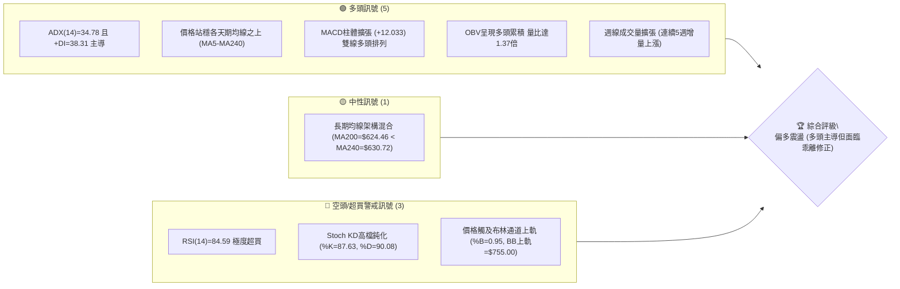

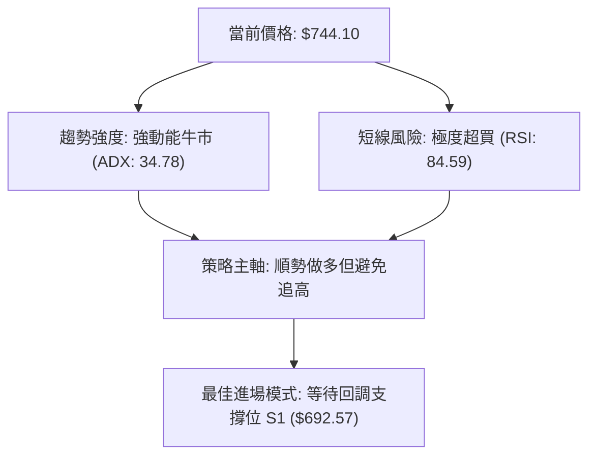

### 📊 核心指標速覽表

| 指標類別 | 指標名稱 | 當前數值 | 訊號 | 解讀 |
|----------|----------|----------|------|------|
| **價格** | 當前價格 | $744.10 | 🟢 | 逼近52週高點 $767.99，處於高點區間 90.4% 位置 |
| **均線** | MA20 | $641.34 | 🟢 | 現價高於 MA20 達 +16.02%，短期動能強勁但乖離偏大 |
| **均線** | MA50 | $611.63 | 🟢 | 現價大幅高於中期生命線，中期結構維持穩固多頭 |
| **均線** | MA200 | $624.46 | 🟢 | 站上長期牛熊分界線，長期走勢由空翻多確立 |
| **動能** | RSI(14) | 84.59 | 🔴 | 進入嚴重超買警戒區 (>80)，短期技術性拉回風險攀升 |
| **動能** | MACD | 36.941 / +12.033 | 🟢 | MACD 線遠高於訊號線 (24.908)，紅柱擴張，多頭主控 |
| **動能** | Stoch %K/%D | 87.63 / 90.08 | 🔴 | KD 高檔死叉預警，動能有鈍化轉向之虞 |
| **趨勢** | ADX(14) | 34.78 (+DI: 38.31) | 🟢 | 數值大於 25 且 +DI 遠高於 -DI (7.45)，強趨勢發動 |
| **通道** | 布林通道 %B | 0.95 (上軌 $755.00) | 🟡 | 價格緊貼上軌運行，若無法連續帶量推升將面臨軌道收斂 |
| **量能** | 20日成交量比 | 1.37x (30,346,000) | 🟢 | 今日量能有效超越 20 日均量 (22.2M)，價漲量增格局 |
| **波動** | ATR(14) | $27.53 (3.70%) | 🟡 | 每日平均震幅近 28 美元，波動處於中高水平 |

### 🏆 技術評分卡

```
技術評分卡 — META (2026-09-24)
════════════════════════════════════════════════════
趨勢強度      ████████████████░░░░  82/100  🟢 強趨勢發展 (ADX=34.78)
動能指標      ██████████████░░░░░░  70/100  🟡 強勢但面臨嚴重超買修正
支撐穩定度    ██████████████░░░░░░  72/100  🟢 密集支撐坐落於 $692-$636
成交量配合    ████████████████░░░░  80/100  🟢 量比1.37倍，OBV穩步推升
形態完整度    ██████████████░░░░░░  70/100  🟢 突破雙重底頸線向上拓展
均線排列      ████████████░░░░░░░░  62/100  🟡 短中期多頭，中長期均線仍混合
════════════════════════════════════════════════════
綜合評分      ███████████████░░░░░  74/100  🟢 偏多進攻（拉回買進格局）
════════════════════════════════════════════════════
```

---

## 2. 趨勢分析

### 🌐 多時框趨勢分析

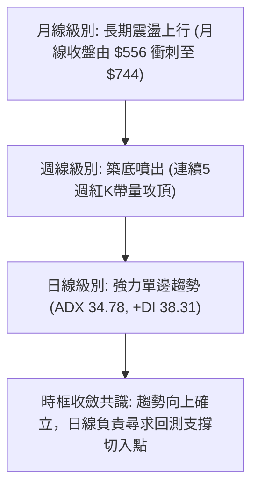

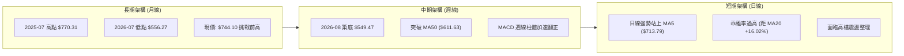

### 📈 長期趨勢 — 12個月走勢圖（Unicode）

```
META 月線走勢圖（過去12個月：2025-10 至 2026-09）
價格軸 ($)
$770 ┤                                                ● $744.10 (現在)
$730 ┤
$690 ┤                           ● $714.66
$650 ┤● $646.16  ● $645.76 ● $658.40  ● $646.52      ● $631.43
$610 ┤                                      ● $610.86
$570 ┤                                 ● $571.15  ● $562.85  ● $571.89
$550 ┤                                                ● $556.27 (年度低點區)
     └─────────────────────────────────────────────────────────────────
       25-10   25-11   25-12   26-01   26-02   26-03   26-04   26-05   26-06   26-07   26-08   26-09
```

#### 走勢特徵分析表格

| 階段區間 | 起始價 → 結束價 | 漲跌幅 | 走勢特徵與技術驅動因素 |
|----------|-----------------|--------|------------------------|
| **2025-10 ~ 2026-01** | $646.16 → $714.66 | +10.60% | 高檔箱型整理後發動假突破，觸及 $714.66 後動能耗竭。 |
| **2026-02 ~ 2026-03** | $646.52 → $571.15 | -11.66% | 空頭摜壓，連續跌破多道短期均線，引發多殺多停損。 |
| **2026-04 ~ 2026-05** | $610.86 → $631.43 | +3.37%  | 技術性反彈，但受制於 MA60 與反壓區，呈現弱勢反抽。 |
| **2026-06 ~ 2026-08** | $562.85 → $571.89 | +1.61%  | 二次探底築底期，最低於 2026-07 見 $556.27，成交量萎縮，籌碼充分沉澱。 |
| **2026-09** | $571.89 → $744.10 | +30.11% | 報復性噴出走勢，週量連續放大至 107M 股，直接軋空並逼近歷史天價。 |

### 📊 中期趨勢（週線分析）

```
META 週線架構關鍵分水嶺示意圖
═══════════════════════════════════════════════════════════════════
  $767.99 ──────────────────────────── 52週最高點 (多頭終極壓力挑戰區)
  $756.59 ════════════════════════════ 阻力位 R1 (近一年波段高點聚類)
  $744.10 ▲▲▲▲ [現價: 軋空噴出段]
  $709.32 ---------------------------- 斐波那契 23.6% 回調位
  $692.57 ════════════════════════════ 支撐位 S1 (回測頸線首要防線)
  $643.68 ---------------------------- 斐波那契 50.0% / MA20 ($641.34)
  $636.45 ════════════════════════════ 支撐位 S2 (強支撐中樞)
  $556.27 ──────────────────────────── 近期波段底點 (築底基準)
═══════════════════════════════════════════════════════════════════
```

週線指標顯示，自 2026-08-23 收盤 $549.47 見底以來，週成交量由 89M 連續放大至 9-27 週的 107.18M，MACD 柱狀圖由 -4.223 垂直拉升至 +12.033，RSI 自 31.3 暴衝至 84.6，確認中期屬於突破底部的強勢單邊行情。

### ⚡ 趨勢強度評估（ADX 解讀）

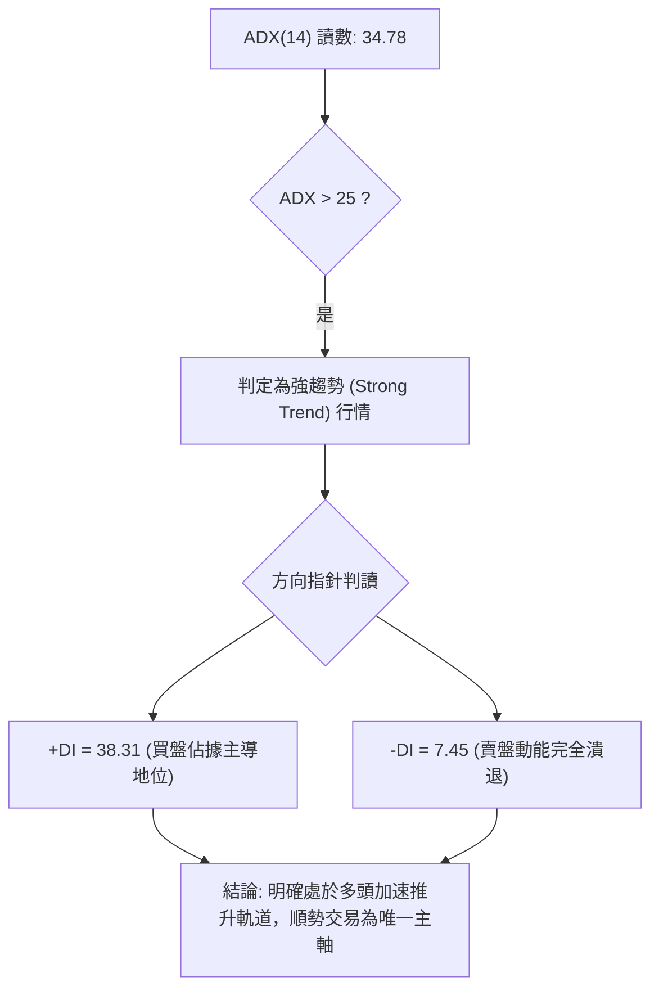

#### ADX 趨勢強度對照表

| 指標名稱 | 實際數值 | 門檻區間 | 趨勢屬性判定 | 交易決策指引 |
|----------|----------|----------|--------------|--------------|
| **ADX(14)** | 34.78 | 25.0 ~ 40.0 | 強趨勢形成且加速運行 | 嚴禁逆勢放空，所有空方指標轉為出場保護用途 |
| **+DI** | 38.31 | > 25.0 | 多頭進攻極為強勢 | 順應趨勢，以支撐位買進（Dip-Buying）為主 |
| **-DI** | 7.45 | < 15.0 | 空頭無力打壓價格 | 賣方未具備扭轉趨勢的成交量與動能條件 |
| **DI 差值 (+DI - -DI)**| +30.86 | > +20.0 | 極端多頭單邊優勢 | 趨勢未出現拐點前，回調均為健康籌碼洗盤 |

---

## 3. 圖表形態分析

### 🔍 形態識別系統

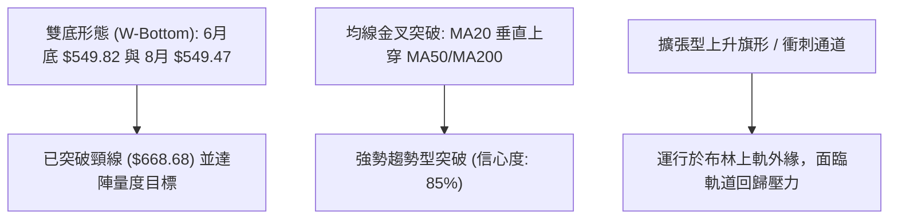

#### 形態識別與信心度評估表

| 形態類別 | 信心度 | 判斷依據（引用數據） | 完成度 | 目標價（附精確計算式） |
|----------|--------|----------------------|--------|------------------------|
| **中期雙重底 (W底)** | 85% | 第一次波段低點 2026-06-28 收盤 $549.82，第二次低點 2026-08-23 收盤 $549.47（形成雙底基座）。頸線為 2026-07-12 週高點收盤 $668.68。 | 100% (已完全突破並兌現) | 頸線 $668.68 + 形態高度 ($668.68 - $549.47 = $119.21) = **$787.89**。現價 $744.10 正在向此延伸目標邁進。 |
| **短期布林軌道突破** | 80% | 價格以連日大陽線突破布林帶中軌 $641.34，並推升至 BB 上軌 $755.00，BB %B 達 0.95。 | 95% (逼近軌道極限) | 上軌壓制回測。量度目標為回測突破後支撐位 **S1: $692.57**。 |
| **大型頭肩底結構** | 45% | 數據時間跨度不足以完整定義左肩右肩對稱成交量，僅具備雙底雛形。 | 30% | *訊號不足，依規則 15 僅做指標型解讀，不強制計算目標。* |

### 🕯️ 重要K線形態分析

| 週/月份 | 收盤價 | K線形態 | 解讀 | 訊號 |
|---------|--------|---------|------|------|
| **2026-08-02** | $556.27 | 長黑落底穿心槌子線 | 空頭動能衰竭，下影線回測 52W 低點 $519.37 上方，獲利買盤進駐。 | 🟢 築底醞釀 |
| **2026-08-23** | $549.47 | 平行雙底十字星 | 確認 2026-06 低點支撐有效，MACD 柱狀體出現收斂，空方力竭。 | 🟢 底部確認 |
| **2026-09-06** | $616.28 | 實體大陽線破均線 | 收盤價直接貫穿 MA50 ($611.63)，量能增至 81.4M，確立反轉。 | 🟢 轉強起漲 |
| **2026-09-20** | $665.23 | 帶量突破實體棒 | 攻克雙底頸線 $647-$668 密集區，週成交量達 99.5M，籌碼全面換手。 | 🟢 主升段確立 |
| **2026-09-27** | $744.10 | 巨量衝頂長陽線 | 單週漲幅高達 +11.85%，成交量放大至 107.1M，呈現標準爆量推升。 | 🟡 短線有過熱風險 |

### 📉 ASCII 走勢形態示意圖

```
META 雙重底 (W-Bottom) 突破路徑圖
═══════════════════════════════════════════════════════════════════
$787.89 ┤                                                [目標價]
$767.99 ┤                                           ▲ 52W高點
$744.10 ┤                                        ● 現價 ($744.10)
$668.68 ┤                  ●─────────────● 頸線突破點
$620.00 ┤                 / \           /
$580.00 ┤       \        /   \         /
$549.47 ┤        ●──────/     \───────● 雙重底確立 ($549.82 / $549.47)
        └────────────────────────────────────────────────────────
               2026-06底    2026-07中   2026-08底    2026-09現況
═══════════════════════════════════════════════════════════════════
```

### 🎯 形態目標價計算

根據雙重底突破理論量度模型：
1. **底部基準線 (Double Bottom Base)**：$549.47（2026-08-23 週收盤）
2. **頸線確認位 (Neckline)**：$668.68（2026-07-12 週高點）
3. **垂直形態高度 (Pattern Height, H)**：
   $$H = \text{頸線} - \text{底部} = \$668.68 - \$549.47 = \$119.21$$
4. **第一目標價 (Minimum Target)**：
   $$\text{頸線} + H = \$668.68 + \$119.21 = \mathbf{\$787.89}$$
5. **當前完成進度**：現價已達到 $744.10，已兌現該形態高度之 $63.26% 的漲幅幅度，距離理論極限目標 $787.89 尚有約 5.88% 上行空間。

---

## 4. 支撐與阻力

### 🗺️ 關鍵價位分布圖（Unicode）

```
META 價位結構分布圖 (由波段 OHLCV 與斐波那契回調計算)
═══════════════════════════════════════════════════════════════════
$767.99 ║████████████████████████║ 52週歷史高點 (斐波那契 0.0%)
$756.59 ║████████████████████    ║ 阻力位 R1 (近一年波段高點聚類)
$755.00 ║▓▓▓▓▓▓▓▓▓▓▓▓▓▓▓▓▓▓▓▓    ║ 布林通道上軌壓制線
$744.10 ╠════════════════════════╣ ◄ 現價 ($744.10)
$709.32 ║░░░░░░░░░░░░░░░░░░░░    ║ 斐波那契 23.6% 回調位
$692.57 ║████████████████████████║ 關鍵支撐 S1 (近一年波段低點聚類)
$673.02 ║░░░░░░░░░░░░░░░░░░░░    ║ 斐波那契 38.2% 回調位
$643.68 ║▓▓▓▓▓▓▓▓▓▓▓▓▓▓▓▓▓▓▓▓    ║ 斐波那契 50.0% 中樞
$636.45 ║████████████████████████║ 強支撐 S2 (重要密集換手區)
$626.54 ║████████████████████    ║ 波段結構防守支撐 S3
═══════════════════════════════════════════════════════════════════
```

### 🚧 阻力位分析表

所有數值均嚴格引用自數據中經由 OHLCV 聚類計算之阻力位：

| 阻力級別 | 價位 | 形成原因 | 突破難度 | 重要性 |
|----------|------|----------|----------|--------|
| **R1** | $756.59 | 近一年波段高點密集聚類區，距離現價僅 +1.68%，伴隨布林上軌 ($755.00) 雙重重疊共振。 | 中等偏高 | 🔴 極高（短線波段多空決戰點） |
| **52W High** | $767.99 | 過去 52 週最高價紀錄，斐波那契 0.0% 原點，心理與套牢賣壓最沉重處。 | 極高 | 🔴 終極天花板阻力 |

*註：數據中未偵測到 R2 及 R3 數值，故不予虛構編造。*

### 🛡️ 支撐位分析表

所有支撐價位嚴格引用自數據中「關鍵價位」之數值：

| 支撐級別 | 價位 | 形成原因 | 守住機率 | 重要性 |
|----------|------|----------|----------|--------|
| **S1** | $692.57 | 近一年波段低點聚類，與斐波那契 23.6% ($709.32) 構成下檔緩衝保護帶，跌幅 -6.93%。 | 75% | 🟢 第一道動態防守中樞 |
| **S2** | $636.45 | 波段低點強聚集點，鄰近 MA20 ($641.34) 及斐波那契 50.0% ($643.68)，跌幅 -14.47%。 | 85% | 🟢 中期生命線核心支撐 |
| **S3** | $626.54 | 下檔密集籌碼支撐，跌幅 -15.80%，鄰近長期均線 MA200 ($624.46)。 | 90% | 🟢 牛熊分界最終堡壘 |

### 📐 斐波那契回調位分析

依據 52 週高低點區間（$519.37 → $767.99）精確計算回調階梯：

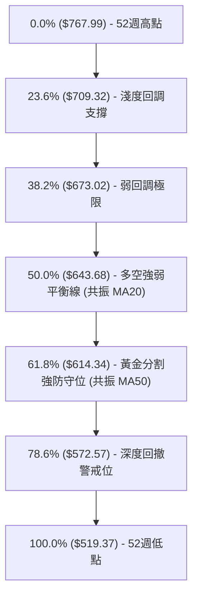

#### 當前價位斐波那契位階解讀：
* **現價位置**：$744.10 處於 **0.0% ($767.99)** 與 **23.6% ($709.32)** 之間，屬於極度強勢的高位衝刺區。
* **回調支撐意義**：
  - 若多頭在阻力 R1 ($756.59) 或 52W High ($767.99) 遇阻拉回，首要健康回檔目標為 23.6% 回調位 **$709.32**。只要守在該位置上方，整體多頭架構未遭破壞。
  - 若拉回跌破 $709.32，下方關鍵防線將直接回測 S1 **$692.57** 及 38.2% 回調位 **$673.02**。
  - 50.0% 回調位 **$643.68** 與當前 MA20 ($641.34) 高度收斂，是本輪中線多頭行情的防守死穴。

---

## 5. 技術指標深度解讀

### 🎛️ 指標訊號總覽

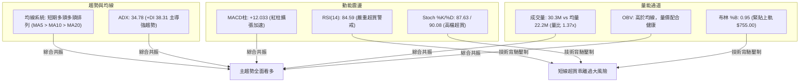

### 📈 移動平均線排列分析

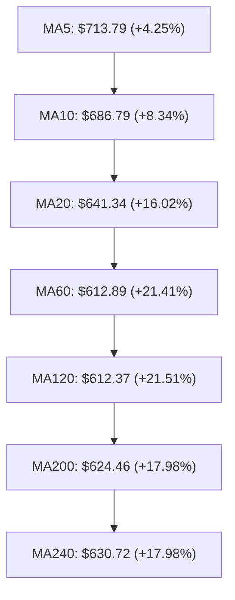

#### 均線系統深度解析：
1. **短中期均線完美多頭**：MA5 ($713.79) > MA10 ($686.79) > MA20 ($641.34) > MA60 ($612.89)，呈現標準的發散看多排列。
2. **長期均線呈現混合排列**：MA200 ($624.46) 仍低於 MA240 ($630.72)，反映 2026 上半年 $556-$570 長期打底時對均線產生的拖曳效應。
3. **乖離率警訊**：現價 $744.10 距離 MA20 正乖離高達 **+16.02%**，距離 MA60 達 **+21.41%**。歷史經驗顯示，當 META 對 MA20 正乖離超過 12% 時，短期容易出現 3~5 日的橫盤震盪或急跌回抽以修復乖離。

### 📉 RSI(14) 分析

#### RSI 強度與超買評估
* **當前數值**：**84.59**
* **進度條展示**：
  ```
  RSI(14): 84.59  [█████████████████░░░]  🔴 極度超買 (>80)
  ```
* **超買超賣區間判定**：RSI 已經突破 70 常規超買線，並強勢切入 80 以上的極端加速區。在 ADX=34.78 的強趨勢背景下，RSI 經常會發生「鈍化現象」，即股價沿著布林上軌持續創新高，RSI 居高不下。
* **背離分析結論**：
  - **日線背離判定**：**無頂背離**。近幾週收盤與 RSI 連動步步走高（9/06: 616.28/RSI 69.9 → 9/13: 647.52/RSI 83.9 → 9/27: 744.10/RSI 84.6），價格高點與指標高點同步創高，並無動能背離現象。
  - **底背離回顧**：8 月底於 $549.47 低點時，RSI 由 22.9 快速翻揚形成隱形動能抬升，目前該底背離紅利已全數體現。

### 📊 MACD(12/26/9) 訊號解讀

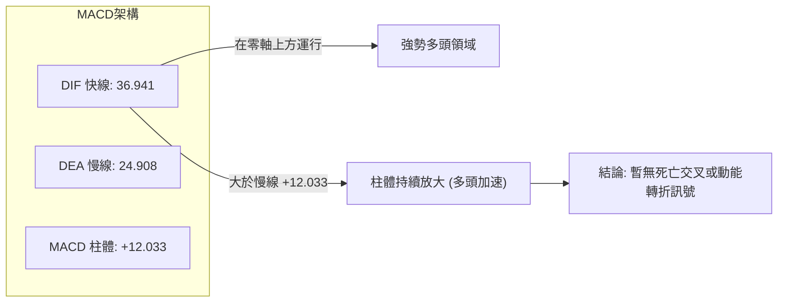

* **數值解讀**：DIF 36.941 大幅領先 Signal 24.908，柱狀圖（Histogram）來到 **+12.033** 的強勁水位。
* **週線連貫性**：近 4 週週線柱狀圖分別為 -4.223 → +1.911 → +6.862 → +9.867 → +12.033，呈線性加速放大，代表推動股價上漲的背後主力買盤尚未收手，暫無頂背離跡象。

### 📦 布林通道分析

```
META 布林通道 (20, 2) 空間圖
═══════════════════════════════════════════════════════════════════
  $755.00 ┬────────────────────── 布林通道上軌 (Upper Band)
  $744.10 ┼─◄ 現價 (位於上軌內緣，%B = 0.95)
          │
          │  通道帶寬持續擴張中 (Volatility Expanding)
          │
  $641.34 ┼────────────────────── 布林中軌 (MA20 Baseline)
          │
          │
  $527.68 ┴────────────────────── 布林通道下軌 (Lower Band)
═══════════════════════════════════════════════════════════════════
```

* **通道數據**：上軌 $755.00、中軌 $641.34、下軌 $527.68，帶寬高達 $227.32。
* **指標定位 (%B)**：現值 **0.95**。當 %B 大於 0.8 時代表價格貼軌運行，0.95 意味著價格已經碰觸統計學分佈的 +2 個標準差臨界點。若後續成交量無法維持在 3,000 萬股以上，將引發向通道內部（中軌方向）的均值回歸拉回。

### 💹 成交量分析（量價配合度）

1. **量價同步確認**：
   - 最新單日成交量：**30,346,000** 股。
   - 20 日均量：**22,207,500** 股（量比達 **1.37x**）。
   - 50 日均量：**18,571,626** 股。
   - 今日放量長陽一舉突破前週高點，屬於典型的「突破帶量」健康型態。
2. **OBV (能量潮指標) 分析**：
   - 當前狀態：**OBV > MA(OBV)**。
   - 走勢判斷：OBV 連續 4 週沿上升斜率陡峭攀升，表明本輪推升為實打實的機構主力資金建倉（Institution Own % 達 79.0%），而非散戶無量虛推，量能充分確認價格上升趨勢。

---

## 6. 動能與波動率

### ⚡ 動能評估四象限

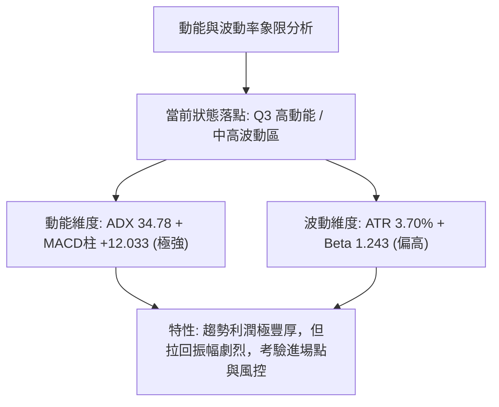

#### 動能與波動四象限狀態表

| 象限 | 動能維度 | 波動維度 | 歷史定義特徵 | 當前落點狀態 | 戰略應對指引 |
|------|----------|----------|--------------|--------------|--------------|
| **Q1** | 強動能 | 低波動 | 穩健牛市單邊慢漲 | ── | 穩健長線持有持股 |
| **Q2** | 弱動能 | 低波動 | 縮量橫盤死水區間 | ── | 資金效率低，觀望 |
| **Q3** | **強動能** | **中高波動** | **爆發性推升突破期** | **✓ META 處於此區** | **順勢做多，嚴守拉回買進與移動止損** |
| **Q4** | 弱動能 | 高波動 | 空頭獵殺崩跌洗盤 | ── | 嚴格防範破位風險 |

### 📊 ATR 波動率分析

* **ATR(14) 絕對數值**：**$27.53**
* **相對價格佔比**：**3.70%**
* **交易指導意義**：
  1. **日內常規波動幅度**：META 單日正常價格起伏在 $27 左右。這意味著當前進場若設置低於 $27.53 的止損位，極易被正常的日內噪聲洗出場外。
  2. **波段止損建議距離**：建議波段多單設定 **1.5 ~ 2.0 倍 ATR**，即 \$41.30 ~ \$55.06 的止損空間，確保避開主力洗盤。

### 📐 Beta 與市場相關性

* **Beta 係數**：**1.243**
* **市場聯動性解讀**：
  - META 的波動幅度比 S&P 500 指數高出 24.3%，具有較高的進攻性。
  - 當大盤走升時，META 具有放大獲利之槓桿效果；但當納斯達克指數面臨技術回檔時，META 將出現更為劇烈的下挫，操作上應密切監控整體美股市場情緒。

---

## 7. 多時框架總結

### 📋 時框架評分表

| 時框架 | 趨勢方向 | 動能指標 | 均線排列 | 圖表形態 | 綜合評分 | 操作建議 |
|--------|----------|----------|----------|----------|----------|----------|
| **長期 (月線)** | 🟢 多頭上行 | 🟢 MACD翻揚 | 🟡 混合未順 | 🟢 挑戰歷史天價 | 78 / 100 | 長期持有，享受多頭主升段 |
| **中期 (週線)** | 🟢 強勢反轉 | 🟢 柱體加速擴張 | 🟢 突破MA50壓制 | 🟢 雙底突破成立 | 85 / 100 | 中線多頭倉位續抱，回調加碼 |
| **短期 (日線)** | 🟡 震盪衝頂 | 🔴 RSI極度超買 | 🟢 均線多頭發散 | 🟡 觸及布林上軌 | 60 / 100 | 短線切忌追高，靜待回撤進場 |

### 🔲 綜合訊號矩陣

```
時框一致性分析矩陣
═══════════════════════════════════════════════════════════════
時框架構      趨勢指標 (ADX/MA)   動能指標 (MACD/RSI)   綜合判定
───────────────────────────────────────────────────────────────
短期 (日線)   🟢 強勢多頭 (MA5)   🔴 嚴重超買 (RSI 84)  🟡 需等待技術拉回
中期 (週線)   🟢 多頭排列成立     🟢 MACD連4週加速      🟢 多頭攻勢如火如荼
長期 (月線)   🟢 大箱體向上突破   🟢 重回歷史高位區     🟢 挑戰歷史新高
═══════════════════════════════════════════════════════════════
時框收斂共識：中長期強烈看多，短線受制於過熱指標，以「中長護航，短線回踩進場」為策。
═══════════════════════════════════════════════════════════════
```

### ⚖️ 多時框收斂結論

依據多時框收斂規則（規則 14）：
1. **行情屬性判定**：當前 ADX(14) 讀數為 **34.78**，遠大於 25 的趨勢門檻，因此**明確判定為強趨勢行情**，而非區間震盪。
2. **時框優先級權重**：以中長期（週線 / MA50 / MA200）方向為趨勢主幹，日線僅用以微調進場時機點。週線已完成雙重底突破並迎來機構放量推升，因此整體趨勢**絕對禁止放空**。
3. **終局方向結論**：**偏多（拉回買進格局）**。雖然日線 RSI 高達 84.59 呈現超買，但不可作為逆勢做空的理由，而是應作為「暫緩追高、耐心等待回踩支撐」的指引。

---

## 8. 交易策略建議

### 🗺️ 策略決策流程圖

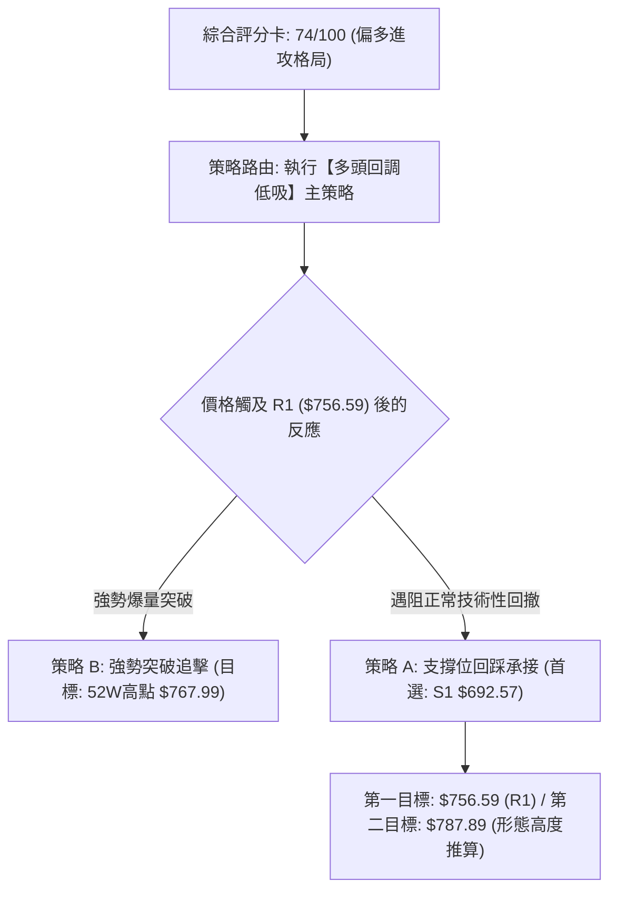

### 🧭 策略路由

> **當前主策略方向 = 主推多頭策略（依綜合評分卡 74/100，偏多主導，空頭僅列為風險對沖觸發點）**

### 🎯 價格情境階梯（Price Scenarios）

所有價位均嚴格引用自「第 4 章 / 關鍵價位」區塊之客觀數據：

| 觸發條件 | 下一目標 | 後續延伸 | 情境含義 |
|----------|----------|----------|----------|
| **突破 R1 $756.59** | 52W High $767.99 | 形態推算目標 $787.89 | 短線軋空延伸，正式刷寫 52 週新高點 |
| **現價 $744.10 高檔整固** | R1 $756.59 | 斐波 23.6% $709.32 | 消化日線過熱 RSI，以時間換取空間橫向蓄勢 |
| **跌破 S1 $692.57** | 斐波 38.2% $673.02 | S2 $636.45 | 超買修正演變為波段深幅洗盤，中線轉入震盪 |

### 📊 情境機率分佈

| 情境劇本 | 機率 | 主要技術依據 |
|----------|------|--------------|
| **劇本一：高檔震盪後回測 S1 逢低買進** | **55%** | RSI 高達 84.59 亟需修復，但 ADX 34.78 證明多頭主升浪未息，以拉回 S1 ($692.57) 機率最高。 |
| **劇本二：直接帶量衝破阻力 R1 創新高** | **30%** | OBV 與成交量比達 1.37x，MACD 紅柱加速，若主力暴力軋空可直接突穿 R1 ($756.59)。 |
| **劇本三：跌破關鍵支撐展開深幅修正** | **15%** | 僅在美股大盤劇烈黑天鵝崩跌時發生，若跌破 S1 將向 S2 ($636.45) 尋求 MA20 支撐。 |

### 🟢 主策略詳情

本報告依交易風格設計兩套多頭應對方案，所有價位完全對應關鍵價位計算清單：

| 策略要素 | 策略 A：穩健型（回調支撐低吸）🥇 | 策略 B：激進型（突破確認追多）🥈 |
|----------|----------------------------------|----------------------------------|
| **策略核心** | 避開超買追高，等待拉回關鍵支撐佈局 | 突破近一年波段高點阻力直接追價 |
| **進場條件** | 股價回踩 S1 附近且日線 K 棒止跌反轉 | 突破阻力位 R1 且當日成交量突破 3,000 萬股 |
| **進場價格** | **$692.57** (精確引用支撐位 S1) | **$756.59** (精確引用阻力位 R1) |
| **目標價 T1** | **$756.59** (阻力位 R1，獲利空間 +9.24%) | **$767.99** (52W High，獲利空間 +1.51%) |
| **目標價 T2** | **$787.89** (形態高度推算，獲利 +13.76%) | **$787.89** (形態高度推算，獲利 +4.14%) |
| **止損價格** | **$636.45** (精確引用支撐位 S2，距進場 -8.10%) | **$709.32** (斐波 23.6% 回調位，距進場 -6.25%) |
| **風險報酬比** | **1 : 1.70** (若以 T2 衡量) | **1 : 0.66** (若僅看 T1) / **1 : 1.5** (看 T2) |
| **勝率預估** | 70% | 55% |
| **建議倉位** | 15% ~ 20% | 8% ~ 10% (輕倉快進快出) |

*形態高度目標價計算式覆核*：雙底頸線 $668.68 + 形態高度 $119.21 = **$787.89**。

### 🔴 反向風險觸發點（對沖提示）

此非放空操作建議，而是提醒多頭投資人必須進行倉位防衛或停損出場的警訊位：
1. **警訊一**：若收盤價帶量跌破斐波那契 23.6% 位階 **$709.32**，表示短期強勢噴出段宣告結束，應減碼 50% 多單鎖定利潤。
2. **警訊二**：若收盤價實體摜破支撐位 S1 **$692.57**，代表日線級別出現假突破真回調，應全面離場觀望。
3. **警訊三**：若 MACD 柱狀圖在零軸上方出現急遽萎縮並在日線形成死叉，表明超買修正進入中級洗盤，禁止盲目加碼。

### ⭐ 整體訊號強度評星

```
做多訊號強度：★★★★☆  (4/5星 - 趨勢強勁但短線乖離過大扣除1星)
做空訊號強度：★☆☆☆☆  (1/5星 - 逆強趨勢交易，風險極高)
整體可信度：  ★★★★☆  (4/5星 - 多指標高度共振確認)
```

---

## 9. 風險提示與監控

### ✅ 關鍵監控指標 Checklist

```
╔══════════════════════════════════════════════════════════════════════════╗
║                    META 交易風險即時監控 CHECKLIST                      ║
╠══════════════════════════════════════════════════════════════════════════╣
║ [ ] 1. RSI(14) 能否於 80 以上高檔橫向鈍化？若快速跌破 70 恐引發獲利賣壓   ║
║ [ ] 2. 每日成交量是否維持在 2,200 萬股 (20日均量) 之上？防範無量假突破   ║
║ [ ] 3. 股價回踩時，斐波那契 23.6% ($709.32) 能否發揮動態第一道防護效果  ║
║ [ ] 4. 關鍵支撐 S1 ($692.57) 的支撐完整性，絕對不可收盤摜破             ║
║ [ ] 5. 布林通道是否開始橫向收斂？若開口縮小代表行情轉入高檔盤整         ║
║ [ ] 6. 美股大盤波動：Beta 為 1.243，密切警惕納斯達克指數的破位系統風險 ║
╚══════════════════════════════════════════════════════════════════════════╝
```

### ⚠️ 風險場景分析

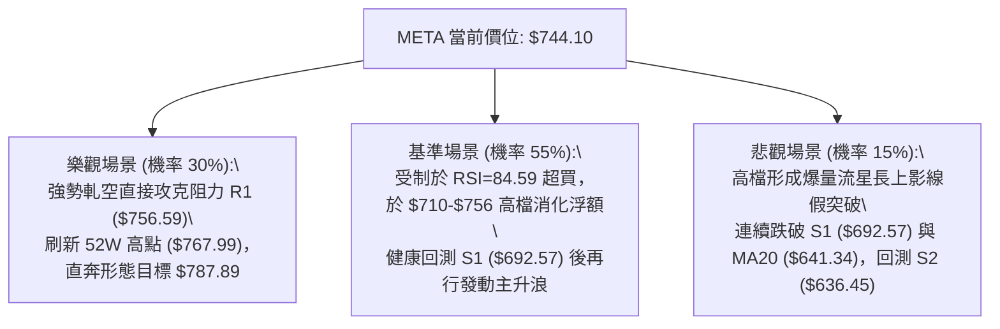

### 🛡️ 風險管理重要提醒

1. **ATR 風險敞口防護**：
   - 目前 META ATR(14) 高達 **$27.53**，日內極限震幅動輒 30 美元。若未留足防守空間，極易遭隨機噪聲掃損。任何多單止損不可設在小於 1.5 ATR ($41.30) 之內。
2. **倉位管理與金字塔加碼法**：
   - 在 RSI > 80 的環境下，絕對禁止單筆壓滿 100% 倉位。
   - 建議採用「底倉 10% 試探 → 突破確認再加碼 5% → 回測支撐再補滿至 20%」之分批策略。
3. **估值與基本面支撐**：
   - 儘管技術面短線過熱，但基本面 Forward P/E 為 21.36，PEG 為 0.97，56 位華爾街分析師平均目標價給予 **$766.37**，整體維持 Strong Buy 共識，這為技術面回調時提供了強力的基本面安全墊。

---

## 📋 報告總結

```
META 技術分析報告總結
═══════════════════════════════════════════════════════════════════
報告日期：2026-09-24
當前價格：$744.10 (52週區間位階: 90.4%)
分析評級：⚖️ 偏多進攻（拉回買進格局，綜合評分: 74/100）

關鍵結論：
├─ 長期趨勢：🟢 多頭發動，月線大雙底構築完成
├─ 中期趨勢：🟢 連續5週放量衝刺，突破 MA50 ($611.63)
├─ 短期趨勢：🟡 嚴重超買 (RSI: 84.59)，貼近布林上軌 ($755.00)
├─ 關鍵支撐：S1: $692.57 ｜ S2: $636.45 ｜ 斐波23.6%: $709.32
├─ 關鍵阻力：R1: $756.59 ｜ 52W高點: $767.99 ｜ 形態目標: $787.89
└─ 分析師目標：華爾街平均目標價 $766.37 (最高看至 $1000.00)

最優策略組合：
1. 🥇 最佳機會：等待短線過熱情緒宣洩，於支撐位 S1 ($692.57) 佈局回踩買單
2. 🥈 次選機會：若多頭強勢帶量突穿阻力位 R1 ($756.59)，追進順勢多單看至 $787.89
3. 🥉 保守選擇：完全空倉者暫時觀望 3~5 個交易日，等待 RSI 降溫至 70 以下再行進場
═══════════════════════════════════════════════════════════════════
```

---

> ⚠️ **免責聲明**：本報告為技術分析研究，所有數據、價位計算及估算均嚴格基於歷史量價資訊與技術指標統計。本報告**僅供研究與學術參考**，**不構成任何要約或投資買賣建議**。金融市場具有高度波動風險，投資人應獨立評估風險並自行承擔交易損益。

---

*報告生成時間：2026-09-24 ｜ 數據來源：Yahoo Finance ｜ 分析框架：多時框技術分析體系*