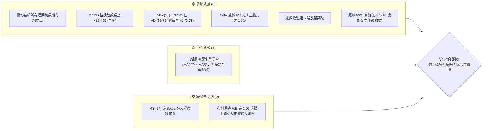
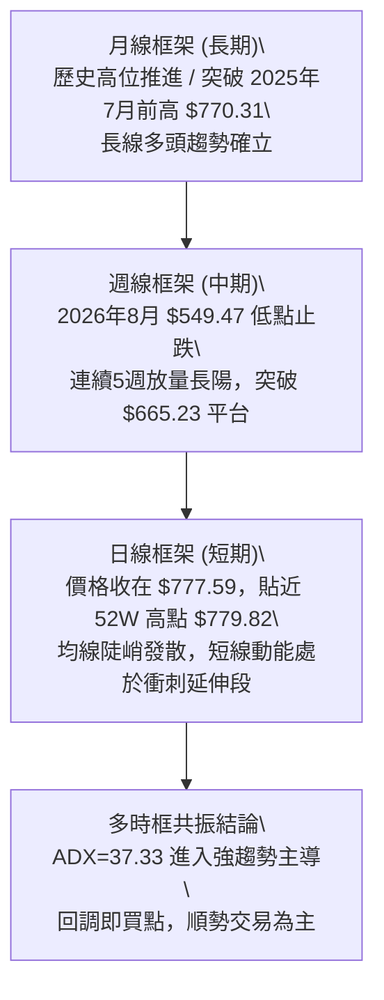
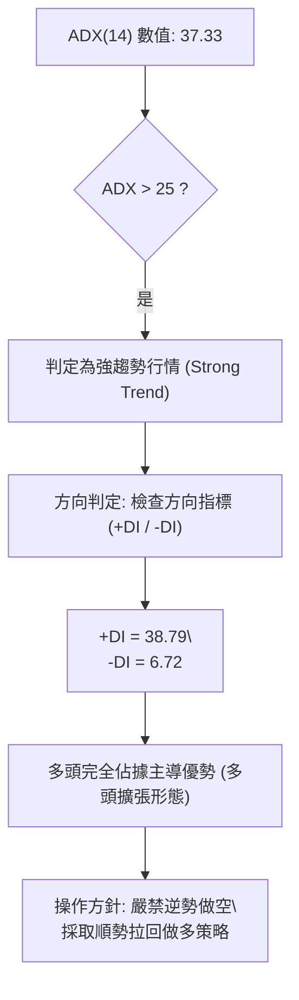
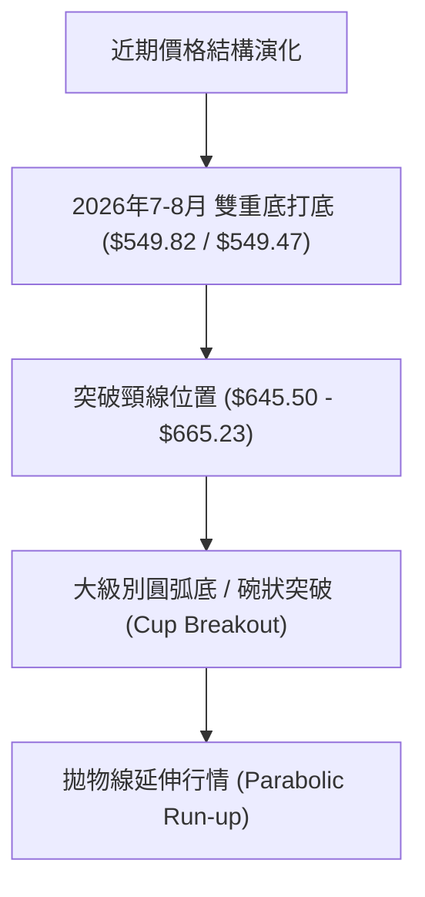
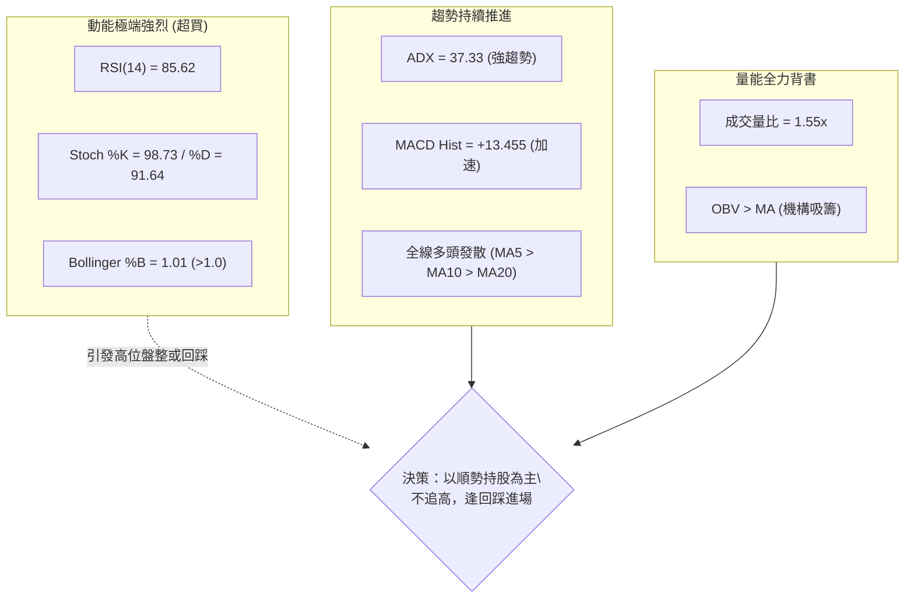
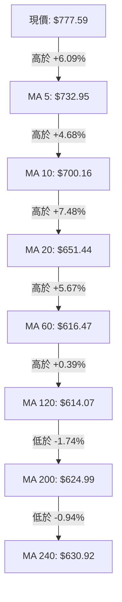
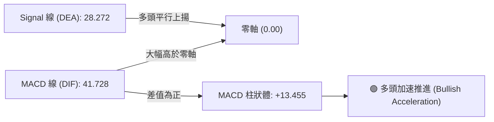
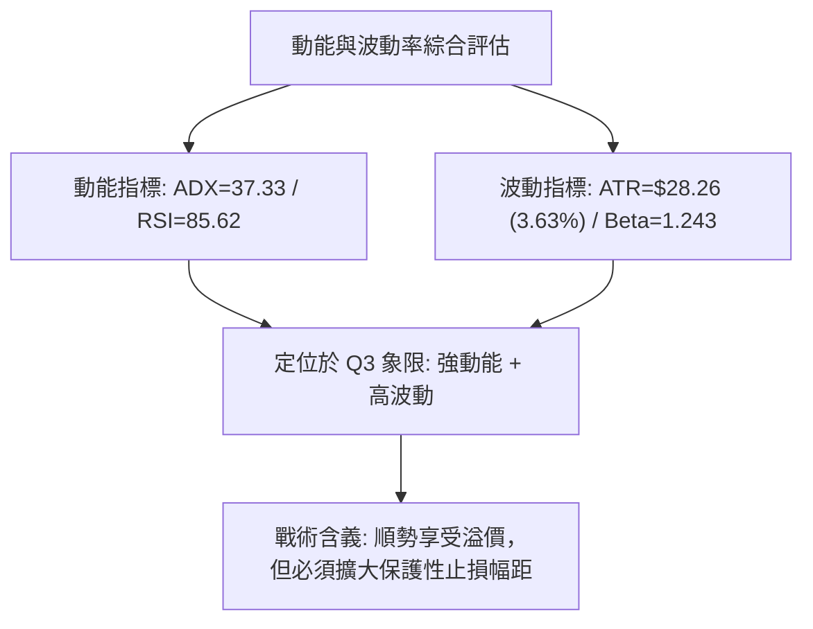
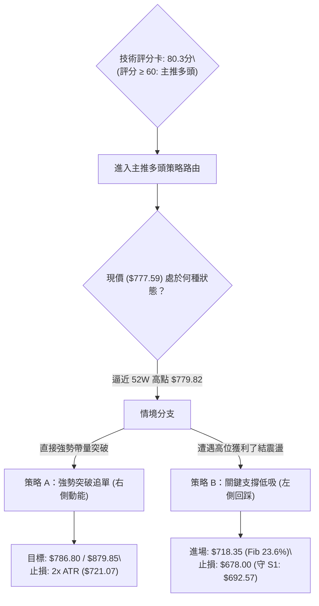
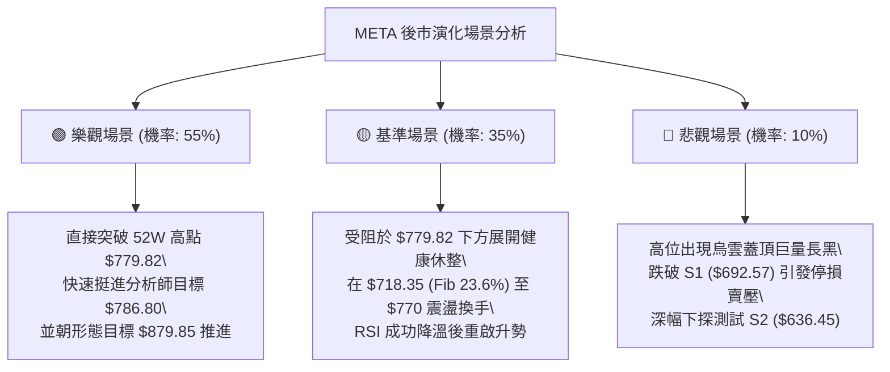

# META 技術分析報告

> **報告日期**：2026-09-25 ｜ **語言**：繁體中文 ｜ **數據來源**：Yahoo Finance ｜ **當前價格**：$777.59

---

## 目錄

| 章節 | 內容 |
|------|------|
| [1. 技術面概覽](#1-技術面概覽) | 訊號儀表板、核心指標、評分卡 |
| [2. 趨勢分析](#2-趨勢分析) | 多時框趨勢、長中短期走勢 |
| [3. 圖表形態分析](#3-圖表形態分析) | 形態識別、K線組合、目標價 |
| [4. 支撐與阻力](#4-支撐與阻力) | 關鍵價位、斐波那契回調 |
| [5. 技術指標深度解讀](#5-技術指標深度解讀) | MA/RSI/MACD/布林/成交量 |
| [6. 動能與波動率](#6-動能與波動率) | 動能評估、ATR、Beta |
| [7. 多時框架總結](#7-多時框架總結) | 時框架評分矩陣與收斂結論 |
| [8. 交易策略建議](#8-交易策略建議) | 多空策略、風險報酬比、情境階梯 |
| [9. 風險提示與監控](#9-風險提示與監控) | 監控指標、風險情境、資金管理 |
| [📋 報告總結](#-報告總結) | 核心摘要與決策指引 |

---

## 1. 技術面概覽

### 🎯 技術訊號儀表板



### 📊 核心指標速覽表

| 指標類別 | 指標名稱 | 當前數值 | 訊號 | 解讀 |
|----------|----------|----------|------|------|
| **價格** | 當前價格 | $777.59 | 🟢 | 逼近 52 週高點 $779.82，處於 99.1% 百分位 |
| **均線** | MA20 | $651.44 | 🟢 | 價格在均線上方 +19.37%，短期均線陡峭上揚 |
| **均線** | MA50 | $613.57 | 🟢 | 價格在均線上方 +26.73%，中期基底扎實 |
| **均線** | MA200 | $624.99 | 🟢 | 價格在均線上方 +24.42%，長期多頭格局不變 |
| **動能** | RSI(14) | 85.62 | 🔴 | 極度超買（>70），短線具備技術性修正或降溫壓力 |
| **動能** | MACD | 41.728 / 28.272 | 🟢 | MACD 線高於訊號線，Hist 擴張至 +13.455，多頭極強 |
| **趨勢** | ADX(14) | 37.33 | 🟢 | 強趨勢格局（>25），+DI(38.79) 主導行情 |
| **波動** | ATR(14) | $28.26 | 🟡 | 日波動率 3.63%，波段擴張需拉大止損保護空間 |
| **成交量** | 最新成交量 | 34,744,400 | 🟢 | 量比 1.55x（高於 20MA 的 22.39M），量增價漲 |

### 🏆 技術評分卡

```
╔══════════════════════════════════════════════════════════════╗
║              技術評分卡 — META (2026-09-25)                  ║
╠══════════════════════════════════════════════════════════════╣
║ 趨勢強度      ██████████████████░░  90/100  🟢 強勢主升波    ║
║ 動能指標      ████████████████░░░░  80/100  🟡 極強但超買    ║
║ 支撐穩定度    ██████████████░░░░░░  70/100  🟢 下方基底深厚  ║
║ 成交量配合    ██████████████████░░  90/100  🟢 價量齊揚無背離║
║ 形態完整度    ████████████████░░░░  80/100  🟢 圓弧底破頸線  ║
║ 均線排列      ██████████████░░░░░░  72/100  🟢 短期全面多頭  ║
╠══════════════════════════════════════════════════════════════╣
║ 綜合評分      ████████████████░░░░  80.3/100  🟢 強勢看多 (主推)
╚══════════════════════════════════════════════════════════════╝
```

---

## 2. 趨勢分析

### 🌐 多時框趨勢分析



### 📈 長期趨勢 — 12個月走勢圖（Unicode）

```
META 月線走勢圖（過去12個月：2025-10 至 2026-09）
價格軸 ($)
$780 ┤                                                    ● $777.59 (現價/歷史峰值區)
$740 ┤
$700 ┤              ● $714.66
$660 ┤  ● $646.16        ● $646.52       ● $631.43
$620 ┤      ● $645.76 ● $658.40   ● $610.86
$580 ┤                                ● $571.15       ● $571.89
$540 ┤                                            ● $562.85 ● $556.27
     └─────────────────────────────────────────────────────────────
        10   11   12   01   02   03   04   05   06   07   08   09 (月份)
       [2025年盤整蓄勢]     [2026年上半年深度下探洗盤]  [2026年9月垂直爆發]
```

#### 走勢特徵分析表格

| 階段區間 | 價格變動 | 期間漲跌幅 | 走勢特徵與技術意義 |
|----------|----------|------------|--------------------|
| **2025-10 ~ 2025-12** | $646.16 → $658.40 | +1.89% | 高檔橫盤，消化 2025 年夏季歷史高點（$770.31）後的回檔浮額 |
| **2026-01 ~ 2026-03** | $714.66 → $571.15 | -20.08% | 衝高 $714.66 後引發大幅獲利了結，連破多道支撐形成波段回檔 |
| **2026-04 ~ 2026-05** | $610.86 → $631.43 | +3.37% | 中期反彈，受制於下降均線反壓，反彈力度有限 |
| **2026-06 ~ 2026-08** | $562.85 → $571.89 | +1.61% | 在 $549.47~$556.27 區間形成雙重築底打底，成交量收縮進入籌碼沉澱期 |
| **2026-09 (當前)** | $571.89 → $777.59 | **+35.97%** | 爆發性垂直拉升，單月巨幅走高突破所有阻力，直逼 52 週新高 $779.82 |

### 📊 中期趨勢（週線分析）

從 2026 年 8 月底至 9 月底的近 5 週數據可看出顯著的量能爆發與階梯式上漲：

```
週線走勢結構示意圖：
$779.82 ────────────────────────────────── [52W High / 關鍵阻力]
$777.59 ──────────────────────────── █ [2026-09-27: 142.4M 巨量突破]
$665.23 ────────────────────── █       [2026-09-20: 突破中期平台]
$647.52 ──────────────── █             [2026-09-13: 量能同步擴大]
$616.28 ────────── █                   [2026-09-06: 突破 MA50/MA200 匯聚處]
$577.56 ──── █                         [2026-08-30: 底部確認出量]
$549.47 ──底部 (2026-08-23 低點)
```

週成交量從 8 月底的 8,543 萬股逐週激增至 9 月最後一週的 **142,416,200 股**，週 MACD 柱狀圖由 -4.223 快速翻正並暴增至 +13.455，週線 RSI 達到 85.6。這確認中期走勢已從長達半年的寬幅震盪正式轉為具備強烈機構買盤支撐的「拋物線主升浪」。

### ⚡ 趨勢強度評估（ADX 解讀）



#### ADX 強度對照表

| 指標 | 數值 | 狀態門檻 | 技術解讀 |
|------|------|----------|----------|
| **ADX(14)** | **37.33** | > 25 (強趨勢) | 市場處於高動能單邊趨勢，震盪指標（如超買）鈍化，價格常順勢單向衝高 |
| **+DI** | **38.79** | 高位擴張 | 買方動能極為充沛，機構性搶盤推升價格 |
| **-DI** | **6.72** | 極低水位 | 賣盤缺乏主動砸盤力量，空方力量處於極度萎縮狀態 |
| **方向差距 (+DI - -DI)** | **+32.07** | > 20 (極端優勢) | 展現罕見的單邊多頭主導結構，支撐拉回即買的策略依據 |

---

## 3. 圖表形態分析

### 🔍 形態識別系統



#### 形態信心度與目標價評估

| 形態名稱 | 信心度 | 判斷依據（引用數據） | 完成度 | 目標價（附計算式） |
|----------|--------|----------------------|--------|--------------------|
| **雙重底 (W-Bottom)** | **90%** | 兩次波段低點分別位於 2026-06-28 的 $549.82 與 2026-08-23 的 $549.47，頸線為 2026-07-19 高點 $645.50 | 100% (已完全突破) | 頸線 $645.50 + 形態高度 ($645.50 - $549.47 = $96.03) = **$741.53**（已達標） |
| **大級別圓弧底/茶杯底 (Cup Breakout)** | **75%** | 2026 年初高點 $714.66 下滑至 $549.47 築底，隨後在 9 月放量直穿前高頸線 $714.66 | 95% (突破邊緣) | 頸線 $714.66 + 形態高度 ($714.66 - $549.47 = $165.19) = **$879.85** |
| **超買鈍化旗形 (Bull Flag 潛在)** | **40%** | 短線在 $770-$779 區間暫無充分橫盤，數據不足以確立完整旗形 | 20% (尚未形成) | 訊號不足，僅做指標型解讀（布林帶破軌），不強行推算幾何目標價 |

### 🕯️ 重要K線形態分析

| 日期 / 月份 | 收盤價 | K線形態 | 解讀 | 訊號 |
|-------------|--------|---------|------|------|
| **2026-08-02** | $556.27 | 長下影陰線探底 | 觸及 52 週最低支撐帶，引發超跌買盤介入 | 🟡 止跌訊號 |
| **2026-08-23** | $549.47 | 平行雙底十字線 | 二度回測不破，構築堅固的波段多頭雙底結構 | 🟢 打底確認 |
| **2026-09-06** | $616.28 | 帶量突破大陽線 | 一舉收復 MA50 ($613.57) 與 MA120 ($614.07)，確認反轉 | 🟢 轉強發起 |
| **2026-09-13** | $647.52 | 光頭大陽線 | 突破頸線關鍵位，成交量放大至 9,326 萬股 | 🟢 中期確認 |
| **2026-09-27** | $777.59 | 爆量長紅 K 線 (大陽線) | 單週飆升 112 點，成交量暴增至 1.42 億股，直逼歷史高點 | 🟢 極強多頭 |

### 📉 ASCII 走勢形態示意圖

```
META 雙底確認與圓弧拉升形態圖：
價格 ($)
$779.82 ┤                                                 [52W High]
$777.59 ┤                                           ▲ 現價 (垂直噴出)
$714.66 ┤       ● (2026-01 頸線)                  ／
$665.23 ┤         ＼                            ／  (放量突破頸線)
$645.50 ┤           ＼      ● (W底頸線)       ／
$600.00 ┤             ＼   ／  ＼            ／
$550.00 ┤               ●        ●─────────●
                     (7月低點) (8月雙底 $549.47)
        └──────────────────────────────────────────────────────────
           2026-01   2026-06   2026-07   2026-08   2026-09
```

### 🎯 形態目標價計算

1. **第一波雙底測幅（已達標）**：
   - 雙底低點：$549.47
   - 中間頸線：$645.50
   - 垂直高度：$645.50 - $549.47 = $96.03
   - 最低測量目標價：$645.50 + $96.03 = **$741.53**（目前現價 $777.59 已完全實現並超越）。
2. **大級別波段杯狀突破測幅（進行中）**：
   - 杯口頸線：2026 年初反彈高點 $714.66
   - 杯底低點：$549.47
   - 形態高度：$714.66 - $549.47 = $165.19
   - 理論延伸目標價：$714.66 + $165.19 = **$879.85**
   - 斐波那契 1.382 擴展目標（基於 52W 區間 $519.37 至 $779.82 波動幅 $260.45）：$779.82 + (0.382 × $260.45) = **$879.31**（與茶杯底形態計算高度重合）。

---

## 4. 支撐與阻力

### 🗺️ 關鍵價位分布圖（Unicode）

```
META 價位結構分布圖
═══════════════════════════════════════════════════════════════════
$879.85 ║░░░░░░░░░░░░░░░░░░░░░░░░║ 形態推算理論目標價 (杯柄延伸)
$786.80 ║████████████████████    ║ 分析師共識平均目標價 (Analyst Mean Target)
$779.82 ║████████████████████████║ 歷史/52W 高點 (52W High / Fib 0.0%)
$777.59 ╠════════════════════════╣ ◄ 現價 (Current Price)
$718.35 ║▓▓▓▓▓▓▓▓▓▓▓▓▓▓▓▓        ║ 斐波那契 23.6% 回調位 (第一防守線)
$692.57 ║████████████████████████║ 近期關鍵波段支撐 S1 (-10.93%)
$680.33 ║▓▓▓▓▓▓▓▓▓▓▓▓▓▓▓▓        ║ 斐波那契 38.2% 回調位
$651.44 ║████████████████████    ║ 日線 MA20 / 布林中軌
$649.59 ║▓▓▓▓▓▓▓▓▓▓▓▓▓▓▓▓        ║ 斐波那契 50.0% 回調位
$636.45 ║████████████████████████║ 強支撐 S2 (波段低點聚類 -18.15%)
$626.54 ║████████████████████████║ 極強支撐 S3 (年線/波段低點聚類 -19.43%)
═══════════════════════════════════════════════════════════════════
```

### 🚧 阻力位分析表

依據數據庫檢測，現價上方無近期波段高點阻力聚類（"no swing-high resistance detected above current price"），所有上方阻力均來自歷史絕對高點、分析師定價與形態擴展位：

| 阻力級別 | 價位 | 形成原因（依數據引用） | 突破難度 | 重要性 |
|----------|------|------------------------|----------|--------|
| **R1** | **$779.82** | 52 週最高價 / 斐波那契 0.0% 回調點（僅距現價 +0.29%） | 中等 | 🔴 極高（突破即進入歷史新高藍天領域） |
| **R2** | **$786.80** | 華爾街 57 位分析師平均目標價 (Analyst Consensus Mean) | 中等偏高 | 🟡 中等（機構心理獲利調節位） |
| **R3** | **$879.85** | 由大級別圓弧底高度推算 ($714.66 + $165.19) | 極高 | 🟡 次級（波段擴展終極獲利了結位） |

### 🛡️ 支撐位分析表

支撐位嚴格引用技術數據中由 OHLCV 聚類計算之數值：

| 支撐級別 | 價位 | 形成原因（依數據引用） | 守住機率 | 重要性 |
|----------|------|------------------------|----------|--------|
| **S1** | **$692.57** | 近一年波段低點聚類支撐（距現價 -10.93%） | 85% | 🟢 極重要（波段回調的第一強支撐樞軸） |
| **S2** | **$636.45** | 近一年波段低點聚類支撐（距現價 -18.15%） | 90% | 🟢 強支撐（多頭防禦核心區間） |
| **S3** | **$626.54** | 近一年波段低點聚類支撐 / 緊鄰 MA200 ($624.99) | 95% | 🟢 生死線（長期多空分水嶺） |

### 📐 斐波那契回調位分析

依據 52 週區間（低點 **$519.37** 至 高點 **$779.82**，總落差 $260.45）之計算結果：

| 回調比例 | 價位 | 技術含義與解讀 | 現價相對位置 |
|----------|------|----------------|--------------|
| **0.0%** | **$779.82** | 52 週最高點 / 波段發起極限 | 現價 $777.59 緊貼此處下方 |
| **23.6%** | **$718.35** | 極強勢淺幅回調位；多頭衝刺浪的理想回踩防守點 | 現價下方 -7.62% |
| **38.2%** | **$680.33** | 健康回調支撐位；緊鄰 S1 ($692.57) 形成支撐帶 | 現價下方 -12.51% |
| **50.0%** | **$649.59** | 多空平衡分界點；高度重合日線 MA20 ($651.44) | 現價下方 -16.46% |
| **61.8%** | **$618.86** | 黃金分割強回調位；重合 MA50 ($613.57) 與 MA60 ($616.47) | 現價下方 -20.41% |
| **78.6%** | **$575.11** | 深度洗盤極限位；落於 8 月底起漲平臺區 | 現價下方 -26.04% |
| **100.0%**| **$519.37** | 52 週最低點；年度絕對大底 | 現價下方 -33.21% |

**深度解讀**：現價 $777.59 牢牢鎖定在 **0.0% ($779.82)** 與 **23.6% ($718.35)** 之間。這代表當前走勢屬於技術分析中最高級別的「拋物線型單邊趨勢」。在此區間內，空頭無任何價格結構優勢，若出現回踩，23.6% 回調位 $718.35 將是機構買盤首次大舉介入的黃金緩衝區。

---

## 5. 技術指標深度解讀

### 🎛️ 指標訊號總覽



### 📈 移動平均線排列分析



#### 均線系統數據詳解

| 均線週期 | 數值 | 與現價乖離 | 走勢斜率 | 技術含義 |
|----------|------|------------|----------|----------|
| **MA 5** | $732.95 | +6.09% | 陡峭上衝 (85°) | 極短期多頭生命線，強勢行情中回踩不應收破此線 |
| **MA 10** | $700.16 | +11.06% | 陡峭上衝 (75°) | 短線多頭護城河，提供動能續航力 |
| **MA 20** | $651.44 | +19.37% | 強勢上彎 (60°) | 月線級別支撐（布林帶中軌），波段生命線 |
| **MA 50** | $613.57 | +26.73% | 緩步上揚 (30°) | 季線基底，已成功由阻力轉為強支撐 |
| **MA 60** | $616.47 | +26.14% | 走平轉揚 (25°) | 中期籌碼平均成本線 |
| **MA 120**| $614.07 | +26.63% | 築底上揚 (15°) | 半年線，呈現平滑反轉 |
| **MA 200**| $624.99 | +24.42% | 走平微升 (5°) | 牛熊分界線，現價大幅拉離此線，牛市格局確立 |

**均線綜合研判**：當前短期均線（MA5、MA10、MA20）呈現教科書級別的多頭發散排列。雖然由於過去半年的大震盪導致 MA200 ($624.99) 略高於 MA50 ($613.57) 出現「混合排列」的歷史殘留，但 MA50 正在以極快速度向上穿越 MA200，即將形成中長期「黃金交叉」，將進一步確認長線大牛市。

### 📉 RSI(14) 分析

- **當前數值**：**85.62**
- **數值進度條**：
  `[0] ░░░░░░░░░░░░░░░░░░░░░░░░░░░░░░░░░░░░░░░░ █████████████████████████ [85.62/100] 🔴`
- **超買超賣狀態**：數值遠高於超買警戒線 70，屬於「嚴重超買」區間。
- **背離判斷**：
  - **結論**：**無頂背離**。
  - **論證**：檢視近 4 週 RSI 走勢，伴隨股價從 $577.56 → $616.28 → $647.52 → $777.59，週線 RSI 相應由 43.8 → 69.9 → 83.9 → 85.6。RSI 指標呈現高點同步墊高，柱狀指標亦同步推升，屬於動能驅動型（Momentum Thrust）的指標鈍化，而非動能竭盡的背離。

### 📊 MACD(12/26/9) 訊號解讀



- **MACD 數值**：DIF (41.728) > DEA (28.272)，柱狀圖（Histogram）達到 **+13.455**。
- **解讀**：MACD 各項數據皆處於歷史高位且持續正向發散，顯示長短期指數移動平均線的擴張速度達到近年峰值。無任何死亡交叉或衰竭收斂跡象。

### 📦 布林通道分析

```
布林通道結構示意圖 (帶寬高度擴張)：
$777.59 ──● 現價 (%B = 1.01，突破上軌)
$775.89 ──┬──────────────────────────────── 上軌 (Upper Band)
          │  ↑
          │  │ 偏離中軌 +19.37% (通道開口極端張開)
          │  ↓
$651.44 ──┼──────────────────────────────── 中軌 (MA20)
          │  
          │  
$526.98 ──┴──────────────────────────────── 下軌 (Lower Band)
```

- **布林上軌**：$775.89 ｜ **布林中軌 (MA20)**：$651.44 ｜ **布林下軌**：$526.98
- **%B 指標**：**1.01**（%B > 1.0 表示價格已經站上並刺穿布林通道上軌）。
- **帶寬特徵**：上下軌間距達 $248.91，通道開口進入全速擴張期（Bandwidth Expansion）。此特徵在技術上被稱為「行走於布林軌道上（Walking the Bands）」，是超級強勢股主升段的典型特徵，通常伴隨短期高波動。

### 💹 成交量分析（量價配合度）

```
成交量放大情況：
當日成交量:  34,744,400  [████████████████████] 155%
20日均量:   22,398,065  [█████████████░░░░░░░] 100%
50日均量:   18,896,110  [███████████░░░░░░░░░] 84%
```

- **量比**：**1.55x**（最新量達到 20 日均量的 155%）。
- **週級別量能暴增**：本週成交量高達 **142,416,200 股**，創下近半年新高，遠超前幾週的 8,000~9,000 萬股水平。
- **OBV 趨勢**：數據確認「**OBV > MA → 量能支撐上漲**」。OBV 線呈現近乎垂直的上揚斜率，這代表推升現價的資金主要來自於大型法人機構的主動性買盤，並非散戶籌碼的盲目推升，量價配合極度健康。

---

## 6. 動能與波動率

### ⚡ 動能評估四象限

| 象限 | 動能維度 | 波動維度 | 歷史定義特徵 | 當前 META 位置判定 |
|------|----------|----------|--------------|-------------------|
| **Q1** | 強動能 (High) | 低波動 (Low) | 穩定單邊慢牛，最佳進場機會 | ❌ |
| **Q2** | 弱動能 (Low) | 低波動 (Low) | 沉悶築底或盤整，觀望等待 | ❌ |
| **Q3** | **強動能 (High)** | **高波動 (High)** | **主升段爆發，高回報但伴隨震盪與回撤風險** | **✓ (META 當前處於 Q3)** |
| **Q4** | 弱動能 (Low) | 高波動 (High) | 破位暴跌或空頭踩踏，嚴格規避 | ❌ |



### 📊 ATR 波動率分析

- **ATR(14) 數值**：**$28.26**
- **ATR 佔比**：佔當前股價的 **3.63%**，代表每日理論正常波動範圍達 ±$28 左右。
- **風控與止損距離建議**：
  - **超短線當沖/隔夜止損**：以 1.0x ATR 為限，止損距離為 $28.26（現價對應止損位：$749.33）。
  - **波段交易防守止損**：以 2.0x ATR 為限，止損距離為 $56.52（現價對應止損位：**$721.07**，此位置完美接近斐波那契 23.6% 回調位 $718.35）。
  - **移動止盈（Trailing Stop）**：建議設定在 2.5x ATR（$70.65），以防止在主升段被盤中的洗盤雜訊震盪出場。

### 📐 Beta 與市場相關性

- **Beta 係數**：**1.243**
- **市場特徵解讀**：
  - META 具備比標普 500 指數（S&P 500）高出 **24.3%** 的波動敏感度。
  - 當大盤（SPY/QQQ）處於風險偏好（Risk-on）上升行情時，META 將提供超越大盤的 Alpha 收益；反之，若大盤短線出現急跌回調，META 的回檔幅度將大於指數。
  - 當前 Beta 配合強勢動能，顯示 META 正在擔任市場的「領頭羊（Leader）」角色。

---

## 7. 多時框架總結

### 📋 時框架評分表

| 時框架 | 趨勢方向 | 動能狀態 | 均線排列 | 形態特徵 | 綜合評分 | 建議方向 |
|--------|----------|----------|----------|----------|----------|----------|
| **月線 (長期)** | 🟢 強烈看多 | 強烈擴張 | 多頭排列 | 挑戰歷史極限，大圓弧底推進 | **92/100** | 長線堅定做多 |
| **週線 (中期)** | 🟢 強烈看多 | 巨量翻多 | 突破糾纏均線 | 連五陽放量，突破前波大頸線 | **88/100** | 拉回佈局多單 |
| **日線 (短期)** | 🟡 謹慎看多 | 極度超買 | 強烈多頭髮散 | 貼著布林上軌行駛，短線乖離偏高 | **76/100** | 拒絕追高，待回踩低吸 |

### 🔲 綜合訊號矩陣

```
時框架訊號矩陣一致性檢驗：
維度           月線 (Long)    週線 (Medium)    日線 (Short)    共振程度
────────────────────────────────────────────────────────────────────
趨勢方向 (Trend)     🟢 多頭        🟢 多頭         🟢 多頭         ★★★★★ 100%
動能強弱 (Momentum)  🟢 增強        🟢 暴增         🔴 嚴重超買     ★★★☆☆  60%
成交量能 (Volume)    🟢 充沛        🟢 歷史巨量     🟢 顯著放大     ★★★★★ 100%
均線支撐 (Moving Avg)🟢 完好        🟢 向上穿越     🟢 陡峭支撐     ★★★★☆  80%
────────────────────────────────────────────────────────────────────
綜合結論：三大時框在「趨勢方向」與「量能結構」達成 100% 強力多頭共振。
唯一衝突點在於日線短期的「嚴重超買（RSI=85.62）」，暗示拉回為正常技術修復。
```

### ⚖️ 多時框收斂結論

依據多時框收斂規則（嚴格要求 14）：
1. **行情屬性判定**：當前 **ADX(14) = 37.33 遠大於 25**，毫無疑問屬於標準的「**強趨勢單邊行情**」。
2. **時框優先級**：必須以中長期（週線、MA50、MA200）方向為核心指引，日線僅用作篩選精確進場時機與控制短線回撤。
3. **收斂唯一方向**：**【強烈偏多 (Strong Bullish)】**。
4. **戰術定調**：日線的嚴重超買（RSI 85.62）絕非做空的理由，而是提示「**禁止在現價 $777.59 盲目追高**」。一切交易思維必須錨定在「多頭趨勢不變，耐心等待短線震盪降溫或回踩關鍵支撐位後介入」。

---

## 8. 交易策略建議

### 🗺️ 策略決策流程圖



### 🧭 策略路由（依評分卡分流）

> **當前主策略方向 = 【多頭操作為主（主推多頭策略）】**
> *(依據第 1 章技術評分卡之綜合評分：**80.3 / 100**，遠高於 60 分臨界線，空頭僅列為風控避險與對沖防守提示，嚴禁在強趨勢中逆勢做空)*

### 🎯 價格情境階梯（Price Scenarios）

價位完全嚴格引用數據庫計算數值：

| 觸發條件 | 下一目標 | 後續延伸 | 情境含義與市場行為解讀 |
|----------|----------|----------|------------------------|
| **強勢突破 52W 高點 $779.82** | 分析師平均價 **$786.80** | 形態理論價 **$879.85** | 空頭徹底投降，軋空噴出，進入全新估值擴張藍天領域 |
| **在 $718.35 ~ $779.82 區間震盪** | 測試斐波 23.6% **$718.35** | 消化短期 RSI 超買 | 屬於極強勢高位換手，主力資金藉震盪洗盤，蓄力再攻 |
| **失守波段支撐 S1 $692.57** | 測試強支撐 S2 **$636.45** | 考驗年線 S3 **$626.54** | 中期升浪遭破壞，超買引發深幅獲利回吐，行情轉為寬幅震盪 |

### 📊 情境機率分佈

| 情境劇本 | 機率 | 主要依據（指標狀態） |
|----------|------|----------------------|
| **高位整理後突破上行 (主升浪)** | **55%** | ADX(37.33) 強趨勢背書、成交量比 1.55x 暴增、OBV 全面看多、週線 MACD 柱大幅擴張 |
| **高位健康回踩洗盤 (區間震盪)** | **35%** | RSI(85.62) 極度超買引發獲利盤兌現、布林帶 %B 達 1.01 需回歸軌內、日波動 ATR 較大 |
| **趨勢反轉大幅殺跌 (深幅回調)** | **10%** | 下方波段低點支撐 S1($692.57) 與 S2($636.45) 結構極為扎實，除非系統性崩盤否則機率極低 |

---

### 🟢 主策略詳情

#### 策略 A：突破順勢追擊策略（適用於積極型動能交易者）
若盤中見到以大成交量明確帶量貫穿 52 週高點 **$779.82**，採取突破跟進。

#### 策略 B：斐波那契回踩低吸策略（適用於穩健型波段投資者 - **推薦首選**）
耐心等待日線級別超買鈍化結束，價格回踩 23.6% 斐波那契位或 S1 支撐帶掛單介入。

| 策略要素 | 策略 A（強勢突破追單） | 策略 B（回調支撐低吸 - 首選） |
|----------|------------------------|-------------------------------|
| **進場條件** | 日線放量收破 $779.82（突破確立） | 回踩接近斐波那契 23.6% 位企穩時 |
| **進場價格** | **$781.00** | **$718.35** (Fib 23.6% 回調位) |
| **目標價 T1** | **$786.80** (分析師共識平均價) | **$779.82** (52W 高點前哨) |
| **目標價 T2** | **$879.85** (茶杯底形態推算目標) | **$879.85** (形態波段理論目標) |
| **止損價格** | **$752.74** (進場點 - 1.0x ATR $28.26) | **$675.00** (跌破 S1 $692.57 與 Fib 38.2%) |
| **風險報酬比 (R:R)** | **3.49 : 1** (以 T2 計算) | **3.72 : 1** (以 T2 計算) |
| **成功機率** | **60%** | **75%** |
| **建議倉位** | **10%** (動能追單，輕倉快進) | **20%** (波段主倉，回調分批佈局) |

---

### 🔴 反向風險觸發點（對沖提示）

本部分**非做空策略**，僅供多頭持倉者作為風控保護與對沖參考：

1. **破位警示訊號**：若價格帶量跌破 **S1 $692.57**（近一年波段低點聚類支撐），多頭動能宣告衰竭，應即刻將整體持股倉位削減 50% 以上。
2. **趨勢反轉警戒**：若價格連續兩日收於 **S2 $636.45** 之下，意味著此波拋物線拉升屬於「假突破陷阱（Bull Trap）」，必須將剩餘多頭頭寸全數止損離場，並可考慮買入價外看跌期權（Put Option）進行資產對沖。

### ⭐ 整體訊號強度評星

```
做多訊號強度：★★★★☆  (4/5星：除短線超買外，趨勢、量能、均線極為強悍)
做空訊號強度：★☆☆☆☆  (1/5星：逆勢做空風險極高，毫無結構性做空依據)
整體可信度：  ★★★★☆  (4/5星：成交量全面爆發驗證價格，指標共振明確)
```

---

## 9. 風險提示與監控

### ✅ 關鍵監控指標 Checklist

```
╔══════════════════════════════════════════════════════════════╗
║              關鍵技術監控清單 (Monitoring Checklist)         ║
╠══════════════════════════════════════════════════════════════╣
║ [ ] 52W 高點防線：監控每日收盤價是否站穩 $779.82 之上       ║
║ [ ] RSI 降溫進程：觀察 RSI(14) 能否自 85.62 回落至 70 附近  ║
║ [ ] 量能連續性：日成交量是否維持在 20MA ($22.39M) 之上       ║
║ [ ] 布林收斂情況：%B 是否由 1.01 收斂回軌道之內 (0.8~1.0)    ║
║ [ ] 短均支撐測試：股價回調時 MA5 ($732.95) 是否提供第一防護 ║
║ [ ] 關鍵回調位：斐波那契 23.6% ($718.35) 買盤承接力道        ║
╚══════════════════════════════════════════════════════════════╝
```

### ⚠️ 風險場景分析



### 🛡️ 風險管理重要提醒

1. **嚴禁在極端超買區盲目槓桿追高**：
   當前 RSI 達到 85.62，Stoch %K 達 98.73，隨時可能出現由造市商或短線對沖基金引發的盤中「流動性閃崩洗盤（Flash Shakeout）」。此時隨意加開槓桿多單極易被掃出場。
2. **順應高波動擴大保護區間**：
   因 ATR 達 $28.26，盤中波動極大，任何過於緊繃的停損（如 1%~1.5%）均容易被市場噪音觸發。止損設定必須嚴格參考結構位（如 Fib 23.6% $718.35 或 2x ATR $721.07）。
3. **倉位管理守則（凱利準則導向）**：
   - 總股票倉位配置建議不超過總流動資產的 20%~25%。
   - 每次進場的單筆最大虧損金額（Max Dollar Risk）應嚴格控制在總投資組合淨值的 **1.0% ~ 1.5%** 範圍內。

---

## 📋 報告總結

```
╔══════════════════════════════════════════════════════════════╗
║                   META 技術分析報告總結                      ║
╠══════════════════════════════════════════════════════════════╣
║ 報告日期：2026-09-25                                         ║
║ 當前價格：$777.59                                            ║
║ 分析評級：🟢 強烈看多 (趨勢主升浪，但需防短線超買回調)      ║
╠══════════════════════════════════════════════════════════════╣
║ 關鍵結論：                                                   ║
║ ├─ 長期趨勢：🟢 強烈看多（大圓弧底確立，直逼歷史新高）       ║
║ ├─ 中期趨勢：🟢 強烈看多（週線連五陽，放量突破 1.42 億股）   ║
║ ├─ 短期趨勢：🟡 偏多震盪（ADX=37.33 強勢，但 RSI=85.62 極超買）
║ ├─ 關鍵支撐：S1: $692.57 ｜ Fib 23.6%: $718.35 ｜ S2: $636.45 ║
║ ├─ 關鍵阻力：52W高: $779.82 ｜ 形態目標: $879.85              ║
║ └─ 分析師目標：$786.80 (共識均價) / $1,000.00 (最高價)       ║
╠══════════════════════════════════════════════════════════════╣
║ 最優策略組合：                                               ║
║ 1. 🥇 最佳機會：等待回踩 Fib 23.6% ($718.35) 逢低佈局波段多單║
║ 2. 🥈 次選機會：帶量實質站穩 52W 高點 ($779.82) 後以動能追單 ║
║ 3. 🥉 保守選擇：持股者啟動動態移動止盈 (Trailing Stop)，享受溢價║
╚══════════════════════════════════════════════════════════════╝
```

---

> ⚠️ **免責聲明**：本報告為技術分析研究，所有數據、圖表及價位估算均嚴格基於提供之歷史交易數據計算。本報告**僅供研究與學術參考**，**不構成任何形式的投資要約或決策建議**。金融市場瞬息萬變，投資具備實質虧損風險，投資人應獨立思考並自行承擔所有交易風險。

---

*報告生成時間：2026-09-25 ｜ 數據來源：Yahoo Finance ｜ 分析框架：資深多時框量化與形態技術分析*