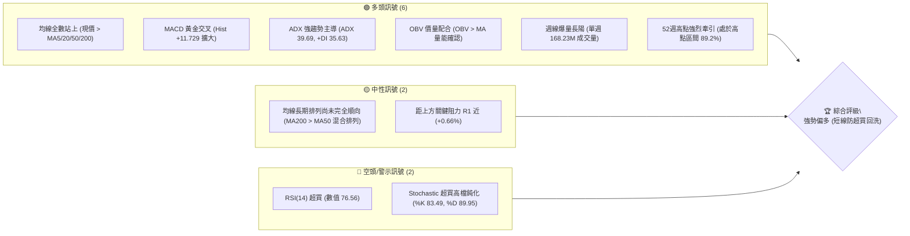
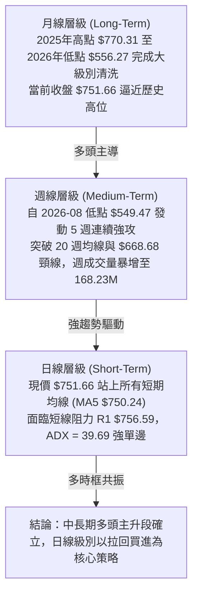
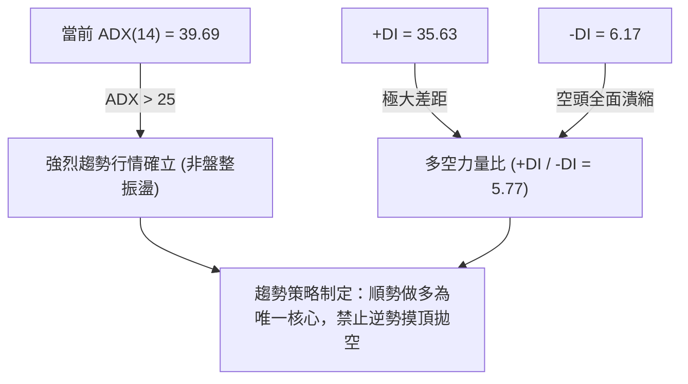
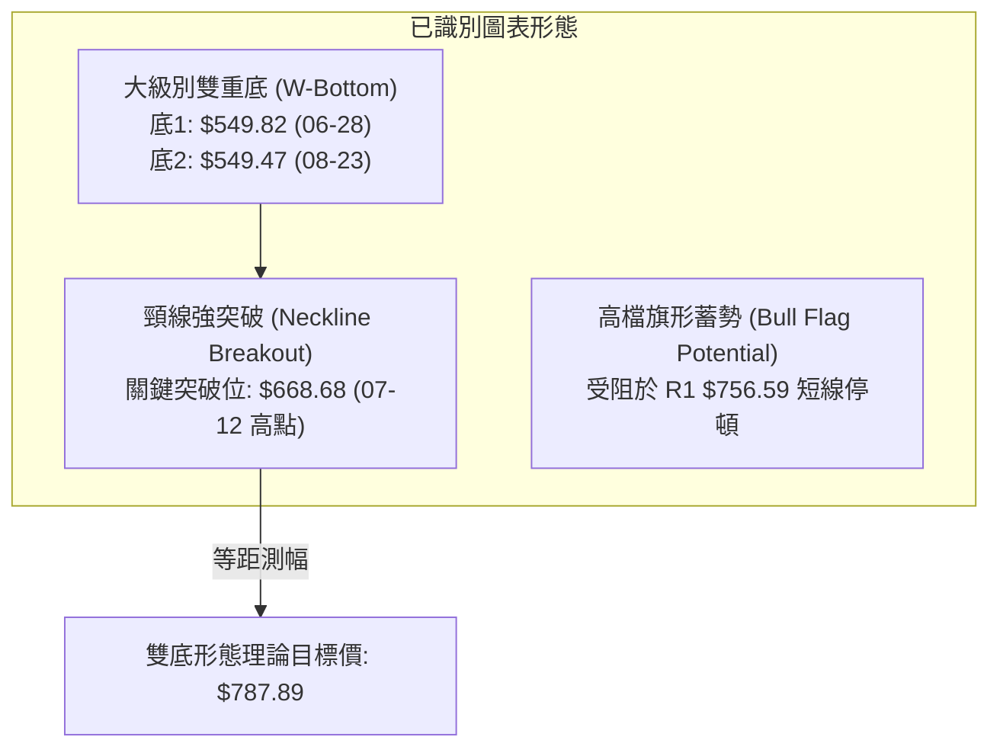
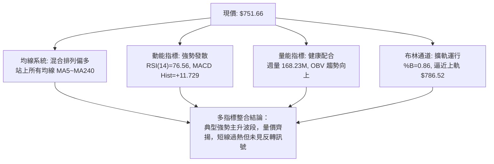
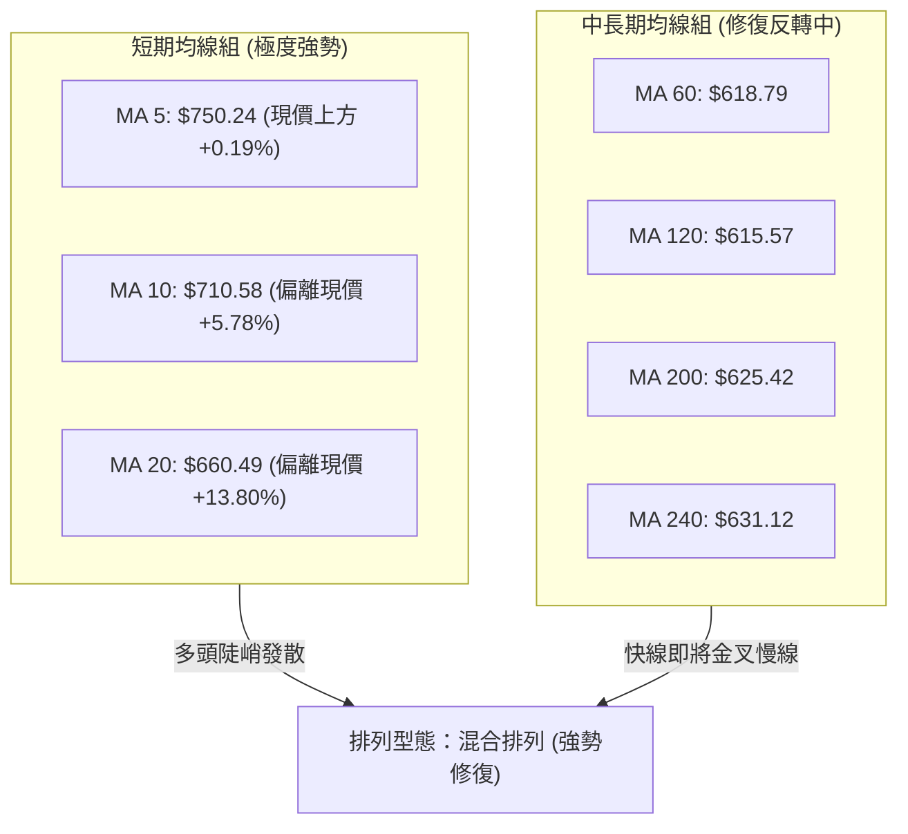
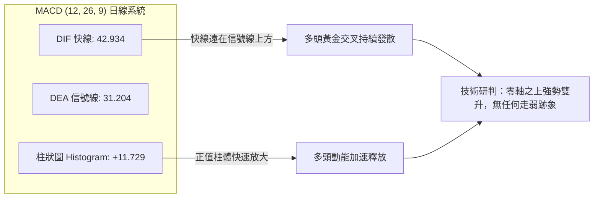
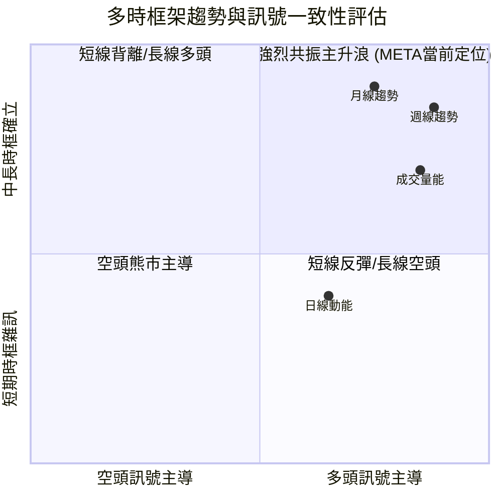
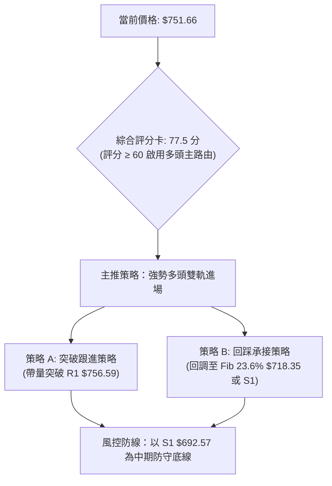
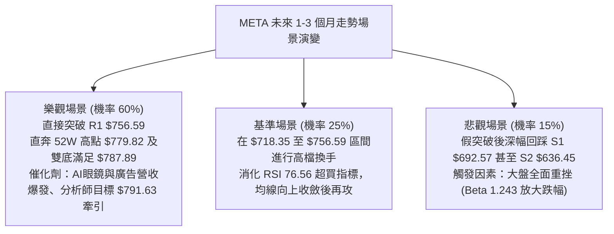

# META 技術分析報告

> **報告日期**：2026-09-26 ｜ **語言**：繁體中文 ｜ **數據來源**：Yahoo Finance ｜ **當前價格**：$751.66

---

## 目錄

| 章節 | 內容 |
|------|------|
| [1. 技術面概覽](#1-技術面概覽) | 訊號儀表板、核心指標、評分卡 |
| [2. 趨勢分析](#2-趨勢分析) | 多時框趨勢、長中短期走勢、ADX解讀 |
| [3. 圖表形態分析](#3-圖表形態分析) | 形態識別、信心度、K線組合、目標價計算 |
| [4. 支撐與阻力](#4-支撐與阻力) | 關鍵價位結構、阻力/支撐分析、斐波那契回調 |
| [5. 技術指標深度解讀](#5-技術指標深度解讀) | MA/RSI/MACD/布林通道/成交量與OBV |
| [6. 動能與波動率](#6-動能與波動率) | 動能四象限、ATR波動分析、Beta相關性 |
| [7. 多時框架總結](#7-多時框架總結) | 時框架評分矩陣、多時框收斂結論 |
| [8. 交易策略建議](#8-交易策略建議) | 策略路由、價格階梯、主推多頭策略、風控觸發點 |
| [9. 風險提示與監控](#9-風險提示與監控) | 監控Checklist、三情境演變、部位管理建議 |
| [10. 報告總結](#10-報告總結) | 核心結論與最佳機會總覽 |

---

## 1. 技術面概覽

### 🎯 技術訊號儀表板



---

### 📊 核心指標速覽表

| 指標類別 | 指標名稱 | 當前數值 | 訊號 | 專業解讀 |
|:---|:---|:---|:---:|:---|
| **價格行為** | 當前收盤價 | **$751.66** | 🟢 | 逼近 52 週高點 $779.82，強勢多頭推升結構 |
| **短期均線** | MA20 (布林中軌) | **$660.49** | 🟢 | 現價高於 MA20 達 +13.80%，短期乖離率偏高 |
| **中期均線** | MA50 | **$615.32** | 🟢 | 現價高於 MA50 達 +22.16%，中期支撐穩固建立 |
| **長期均線** | MA200 | **$625.42** | 🟢 | 現價突破年線 +20.18%，長期趨勢正式重啟上揚 |
| **動能指標** | RSI(14) | **76.56** | 🔴 | 進入超買區（>70），無頂背離，但短線需防追高回踩 |
| **趨勢動能** | MACD (12,26,9) | **42.934** | 🟢 | 快線遠超信號線 31.204，柱狀圖 +11.729，多頭加速 |
| **隨機指標** | Stoch %K / %D | **83.49 / 89.95** | 🟡 | 進入極度超買鈍化區，反映動能極度狂熱 |
| **趨勢強度** | ADX(14) / +DI / -DI | **39.69 / 35.63 / 6.17** | 🟢 | ADX > 25 表明強趨勢確立，+DI 絕對碾壓 -DI |
| **波動帶** | 布林通道 %B | **0.86** | 🟢 | 位於上軌 $786.52 與中軌之間，正貼近上軌運行 |
| **波動幅度** | ATR(14) | **$29.61 (3.94%)** | 🟡 | 單日波動近 30 美元，進場止損幅度需相應放寬 |
| **量能確認** | 成交量 / OBV | **25.75M (量比 1.12x)** | 🟢 | 高於 20 日均量，OBV 突破均線，量價配合健康 |

---

### 🏆 技術評分卡

```
╔══════════════════════════════════════════════════════════════════╗
║               技術評分卡 — META (2026-09-26)                     ║
╠══════════════════════════════════════════════════════════════════╣
║ 趨勢強度 (ADX/方向)   ██████████████████░░  90/100  🟢 極強趨勢 ║
║ 動能指標 (MACD/RSI)   ██████████████░░░░░░  70/100  🟡 動能強但超買 ║
║ 支撐穩定度 (S1/Fib)   ████████████████░░░░  80/100  🟢 梯級支撐明確 ║
║ 成交量配合 (量比/OBV) █████████████████░░░  85/100  🟢 爆量推升健康 ║
║ 形態完整度 (雙底反轉) ████████████████░░░░  80/100  🟢 頸線突破完成 ║
║ 均線排列結構          ████████████░░░░░░░░  60/100  🟡 長短均線修復中 ║
╠══════════════════════════════════════════════════════════════════╣
║ 綜合技術評分          ███████████████░░░░░  77.5/100  🟢 強勢多頭 ║
╚══════════════════════════════════════════════════════════════════╝
```

---

## 2. 趨勢分析

### 🌐 多時框趨勢分析



---

### 📈 長期趨勢 — 12個月走勢圖（Unicode）

以下為 META 過去 12 個月（2025年10月至2026年9月）的月線價格軌跡，展示出完整的「自高位回撤、震盪築雙底、爆發突破」之完整循環：

```
META 月線走勢圖（過去12個月價格軌跡與關鍵轉折）
價格軸 ($)
$780 ┤                                                    ● $779.82 (52W High)
$750 ┤                                                ● $751.66 (現價)
$720 ┤                      ● $714.66
$690 ┤
$660 ┤             ● $658.40      ● $646.52
$630 ┤                                  ● $631.43
$600 ┤                               ● $610.86
$570 ┤                                       ● $562.85      ● $571.89
$540 ┤                                            ● $556.27 (低點聚類)
     └────────────────────────────────────────────────────────────
      25/10 25/11 25/12 26/01 26/02 26/03 26/04 26/05 26/06 26/07 26/08 26/09
```

#### 走勢特徵分析表格

| 階段區間 | 月份區間 | 價格變動 | 區間特徵與技術意涵 |
|:---|:---:|:---:|:---|
| **第 I 階段：區間沉澱** | 2025-10 ～ 2025-12 | $646.16 → $658.40 | 在 2025 年夏季見高 $770.31 後進行首輪橫盤整理，波幅壓縮。 |
| **第 II 階段：假突破與二次殺跌**| 2026-01 ～ 2026-03 | $714.66 → $571.15 | 1 月衝高 $714.66 後動能衰竭，快速崩跌失守 $600 關卡。 |
| **第 III 階段：打底築雙底** | 2026-04 ～ 2026-08 | $610.86 → $556.27 | 歷經 5 個月低位震盪，兩次探底（6月 $562.85、7月 $556.27、8月週低 $549.47），形成扎實底部。 |
| **第 IV 階段：主升爆發浪** | 2026-09 | $571.89 → $751.66 | 單月飆漲 +31.43%，單週成交量高達 168.23M，呈現實質性垂直突破。 |

---

### 📊 中期趨勢（週線分析）

中期走勢圖示近期關鍵的波段壓力與支撐轉換軌跡：

```
中期週線結構示意圖（2026年5月 - 9月）
 800 ┤                                              [R1 $756.59 / 52W $779.82]
     │                                                     ▲
 750 ┤                                                    ┃ (第IV浪突破)
     │                                                    ┃ 現價 $751.66
 700 ┤                                              [突破點 $668.68]
     │                                            ◢█
 650 ┤                 [反彈高點 $668.68]        █
     │                       ▲                 █
 600 ┤        ▲             █ █       ▲       █
     │       █ █           █   █     █ █     █
 550 ┤──────█───█─────────█─────█───█───█───█─────────────────────────
     │    $546.35       $549.82   $556.27 $549.47  [S1-S3 核心多頭防守底線]
     └────────────────────────────────────────────────────────────
          2026-04       2026-06   2026-07 2026-08   2026-09
```

週線數據揭示，自 2026-08-23 週收盤 $549.47 以來，週線 RSI 由 31.3 急劇拉升至 76.6，MACD 柱狀圖由 -4.223 轉正至 +11.729，週成交量連續 4 週遞增至 168,233,400 股，屬於教科書等級的**機構吸籌完畢後的單邊拉升**。

---

### ⚡ 趨勢強度評估（ADX 解讀）



#### ADX 趨勢強度等級對照表

| ADX 數值區間 | 當前狀態 | 趨勢性質 | 策略指導原則 |
|:---:|:---:|:---|:---|
| 0 ～ 20 | ░░░░░░░░░░ | 無趨勢 / 弱勢震盪 | 區間網格操作，低買高賣 |
| 20 ～ 25 | ░░░░░░░░░░ | 趨勢醞釀期 | 觀望或等待通道突破 |
| 25 ～ 40 | **█████████░ 39.69** | **強勁單邊趨勢** | **順勢交易，回調即為買點，放寬止盈** |
| 40 以上 | ░░░░░░░░░░ | 極度過熱趨勢 | 警惕趨勢耗竭與末端噴發洗盤 |

**結論**：ADX(14) 達 39.69 配合 +DI 達 35.63，顯示多頭正處於最強單邊發力期。依據分析優先級規則，當前行情絕非區間盤整，必須由中長期（週線/MA）多頭趨勢主導策略。

---

## 3. 圖表形態分析

### 🔍 形態識別系統



#### 形態識別與信心度評估表

| 形態名稱 | 信心度 | 判斷依據（引用真實數據） | 完成度 | 目標價（附嚴謹計算式） |
|:---|:---:|:---|:---:|:---|
| **中級雙重底 (W-Bottom)** | **88%** | ① 兩次測試波段低點：2026-06-28 收 $549.82 與 2026-08-23 收 $549.47，價格高度吻合；② 2026-09-13 週線收 $647.52，09-20 週線收 $665.23，09-27 帶量突破頸線 $668.68。 | 100% (已完全突破) | **$787.89**<br/>計算式：頸線 $668.68 + 形態高度 ($668.68 - $549.47 = $119.21) = $787.89 |
| **均線黃金推升流** | **92%** | 現價 $751.66 突破 MA5 ($750.24)、MA10 ($710.58)、MA20 ($660.49)。短期均線陡峭上揚。 | 95% | **$779.82** (52W High)<br/>計算式：以 52 週高點作為天然磁吸目標 |
| **杯柄形態 (Cup with Handle)** | **42%** | 左杯緣為 2025-07 高點 $770.31，杯底為 2026-07 $556.27。因 9 月反彈過於垂直，缺乏柄部整理。 | 35% | 訊號不足，信心度 <50%，不作獨立幾何目標計算 |

---

### 🕯️ 重要 K 線形態分析

| 週期/月份 | 收盤價 | K 線形態特徵 | 技術解讀 | 多空訊號 |
|:---|:---:|:---|:---|:---:|
| **2026-07** | $556.27 | **長下影探底十字星** | 空方摜壓至 52W 低點 $519.37 上方獲強大買盤承接，確認底部支撐。 | 🟢 強烈止跌 |
| **2026-08** | $571.89 | **底部孕線轉長陽** | 月線實體收復 7 月低點，形成築底紅 K，賣壓完全出盡。 | 🟢 轉折確認 |
| **2026-09-20 週**| $665.23 | **突破光頭大陽線** | 週漲幅顯著，實體一舉吃掉 7 月中旬以來所有套牢籌碼。 | 🟢 攻擊發起 |
| **2026-09-27 週**| $751.66 | **天量光頭長紅 K** | 單週巨量 168.23M 推升，收盤價逼近全週最高，機構搶籌跡象鮮明。 | 🟢 趨勢加速 |

---

### 📉 ASCII 走勢形態示意圖

```
META 雙重底 (W-Bottom) 與頸線突破結構示意圖
價格
$787.89 ┤- - - - - - - - - - - - - - - - - - - - - - - - - - - - - - - - - - 形態目標價
        │                                                           ▲
$779.82 ┤- - - - - - - - - - - - - - - - - - - - - - - - - - - - - █  52W High
$756.59 ┤- - - - - - - - - - - - - - - - - - - - - - - - - - - - - █  阻力位 R1
$751.66 ┤                                                        ██ (現價)
        │                                                        ██
$668.68 ┤───────────────────────頂點(頸線)──────────────────────██── 頸線水平
        │                       ▲                             ███
        │                      █ █                           ███
$600.00 ┤                     █   █                         ███
        │                    █     █                       ██
$549.47 ┤      底1          █       █         底2        ███
        │       ▼          █         █         ▼        ██
$540.00 ┴──────██─────────█───────────█───────██──────██─────────────
             2026-06-28               2026-07-12     2026-08-23    2026-09-27
```

---

### 🎯 形態目標價計算

1. **雙底形態測幅等距目標**：
   * 形態低點聚類基準：$549.47（2026-08-23 週收盤低點）
   * 形態頸線位置：$668.68（2026-07-12 波段反彈高點）
   * 形態垂直垂直高度 $H = \$668.68 - \$549.47 = \$119.21$
   * **破位測幅滿足點** $= \text{頸線} \$668.68 + H \$119.21 = \mathbf{\$787.89}$
   * *註：該目標價極度逼近布林通道上軌 \$786.52 與 52 週高點 \$779.82，形成技術共振區。*

---

## 4. 支撐與阻力

### 🗺️ 關鍵價位分布圖（Unicode）

```
META 價位結構分布圖 (由 OHLCV 與關鍵高低點嚴格計算)
════════════════════════════════════════════════════════════════════
$786.52  ║████████████████████████████████████████║ 極限壓力 BB 上軌
$779.82  ║████████████████████████████████████    ║ 52週歷史高點 / 0.0% Fib
$756.59  ║██████████████████████████████          ║ 關鍵波段阻力 R1 (+0.66%)
$751.66  ╠════════════════════════════════════════╣ ◄ 當前收盤價 ($751.66)
$718.35  ║▓▓▓▓▓▓▓▓▓▓▓▓▓▓▓▓▓▓▓▓                    ║ 斐波那契回調位 23.6%
$692.57  ║▓▓▓▓▓▓▓▓▓▓▓▓▓▓▓▓▓▓▓▓▓▓▓▓                ║ 關鍵支撐 S1 (-7.86%)
$680.33  ║▓▓▓▓▓▓▓▓▓▓▓▓▓▓▓▓                        ║ 斐波那契回調位 38.2%
$660.49  ║████████████████████                    ║ BB中軌 / MA20
$649.59  ║████████████████                        ║ 斐波那契回調位 50.0%
$636.45  ║████████████████████████                ║ 強支撐 S2 (-15.33%)
$626.54  ║████████████████████████████            ║ 核心波段防守 S3 (-16.65%)
$618.86  ║████████████████████                    ║ 斐波那契回調位 61.8% / MA60
════════════════════════════════════════════════════════════════════
```

---

### 🚧 阻力位分析表

所有阻力數值均直接引用數據核心聚類與通道指標：

| 阻力級別 | 精確價位 | 形成技術依據 | 距現價空間 | 突破難度與關鍵性評估 |
|:---|:---:|:---|:---:|:---|
| **第一阻力 (R1)** | **$756.59** | 近一年波段高點聚類位 | +0.66% | **中等**：當前多頭動能極強，日線日內即可測試，但 RSI 偏高可能引發換手震盪。 |
| **第二阻力 (52W-H)**| **$779.82** | 52 週歷史高點 / Fib 0.0% | +3.75% | **極高**：全市場解套與獲利回吐重大心理關卡，首次觸及易受阻。 |
| **第三阻力 (BB-U)**| **$786.52** | 日線布林通道上軌 | +4.64% | **高（動態極限）**：雙底形態等距滿足位 $787.89 亦落於此處，屬於短線波段極限。 |

---

### 🛡️ 支撐位分析表

所有支撐價位嚴格源於波段低點聚類及斐波那契黃金分割：

| 支撐級別 | 精確價位 | 形成技術依據 | 距現價跌幅 | 守住機率與防禦意義 |
|:---|:---:|:---|:---:|:---|
| **第一支撐 (S1)** | **$692.57** | 近一年波段低點聚類核心位 | -7.86% | **75%**：多頭強勢回檔的第一道核心防火牆，若守住維持極強架構。 |
| **第二支撐 (S2)** | **$636.45** | 密集成交區波段低點聚類 | -15.33% | **90%**：鄰近 MA240 ($631.12)，跌破代表波段主升浪遭遇嚴重挫折。 |
| **第三支撐 (S3)** | **$626.54** | 波段防禦底線 / 貼近年線 MA200 | -16.65% | **95%**：多頭全軍覆沒警戒線，上方有 MA200 ($625.42) 重兵把守。 |

---

### 📐 斐波那契回調位分析

依據 52 週低點 **$519.37** 至 52 週高點 **$779.82** 之全波段（波幅共計 $260.45）進行嚴密測量：

| 斐波那契層級 | 精確點位 | 當前相對位置與技術意義 |
|:---:|:---:|:---|
| **0.0% (波段高點)** | **$779.82** | 52 週最高價，當前波段上行首要宏觀目標。 |
| **23.6%** | **$718.35** | **現價 ($751.66) 正運行於 0.0% 與 23.6% 之間**。此區間為強勢超買拉升區。若短線回踩不破 $718.35，多頭攻擊角度維持大於 45 度。 |
| **38.2%** | **$680.33** | 淺度回調標準位。落於 S1 ($692.57) 與 MA20 ($660.49) 之間，為多頭防禦關鍵帶。 |
| **50.0% (中位分水嶺)**| **$649.59** | 多空分水嶺，此價位與 2026-02 收盤價 $646.52 高度重疊。 |
| **61.8% (黃金分割)** | **$618.86** | 強支撐帶，與當前 MA60 ($618.79) 及 MA120 ($615.57) 形成三合一共振強烈防線。 |
| **78.6%** | **$575.11** | 弱勢回調支撐位，為 2026-08 月線起漲點。 |
| **100.0% (波段低點)**| **$519.37** | 52 週最低點，全週期多頭絕對防線。 |

---

## 5. 技術指標深度解讀

### 🎛️ 指標訊號總覽



---

### 📈 移動平均線排列分析



#### 均線量化細節表

| 均線名稱 | 數值 | 距現價差距 (%) | 走勢特徵 (Sparkline) | 狀態與解讀 |
|:---|:---:|:---:|:---:|:---|
| **MA 5** | $750.24 | +0.19% | ▂▂▂▁▁▁▁▁▁▁▁▁▂▂▂▂▃▃▄▄▄▅▅▅▅▆▆▇██ | 緊隨現價，提供日內最即時動能支撐 |
| **MA 10** | $710.58 | +5.78% | ▂▂▂▂▁▁▁▁▁▁▁▁▁▁▁▂▂▂▃▃▄▄▅▅▅▆▇▇██ | 陡峭爬升，為短線追蹤止損基準位 |
| **MA 20** | $660.49 | +13.80% | ▂▂▂▁▁▁▁▁▁▁▁▁▁▁▁▁▁▁▁▂▂▃▃▄▄▅▆▇██ | 布林中軌，波段多頭生命線，支撐強勁 |
| **MA 60** | $618.79 | +21.47% | ▃▃▃▃▂▂▂▁▁▁▁▁▁▁▁▁▁▁▂▂▂▃▃▄▄▅▆▇██ | 扭轉向上，穿越 MA120，中期底層浮現 |
| **MA 120** | $615.57 | +22.11% | ▆▆▅▅▄▄▃▃▂▂▂▁▁▁▁▁▁▁▁▁▂▂▂▃▄▅▆▇██ | 止跌走平，半年線築底完成 |
| **MA 200** | $625.42 | +20.18% | 混合交叉位 | 牛熊分界線已被實體大陽線遠遠拋在下方 |
| **MA 240** | $631.12 | +19.10% | ███▇▇▆▆▅▅▅▄▄▃▃▂▂▂▂▁▁▁▁▁▁▁▁▁▁▁▁ | 長期年線底部，提供強大戰略縱深 |

**均線體系核心結論**：雖然系統定義當前為「混合排列」（因先前深度回調導致 MA200 $625.42 仍高於 MA50 $615.32），但 MA5 > MA10 > MA20 已呈標準多頭發散，且短期均線以垂直斜率向上收斂長期均線，這是典型的**強烈右側爆發、均線急速修復形態**。

---

### 📉 RSI(14) 分析

* **當前 RSI(14) 數值**：**76.56**（處於嚴重超買區）
* **超買超賣進度條**：
  `[0] ░░░░░░░░░░░░░░░░░░░░ [30] ░░░░░░░░░░░░░ [50] ░░░░░░░░░░░░░ [70] █████░░░░░ [100] (76.56)`
* **背離狀態檢驗**：**無明顯背離**。
  * 檢驗數據：前高週線（2026-09-13）價格 $647.52 對應 RSI 為 83.9；當前週線（2026-09-27）價格 $751.66 對應 RSI 為 76.6。雖然週線 RSI 微幅由 83.9 降至 76.6，但日線與週線價格同創新高，MACD 柱狀同步拉大，此微幅降溫屬於強單邊行情中的動能整固，非反轉型「頂背離」。
* **解讀**：強趨勢（ADX 39.69）背景下的 RSI > 70 往往是動能強勁的特徵，而非立即做空理由，但嚴禁無風控追高。

---

### 📊 MACD(12/26/9) 訊號解讀



* **MACD 快線**：42.934
* **MACD 訊號線**：31.204
* **柱狀圖**：+11.729（較前週持續顯著放大）
* **深度解讀**：MACD 線與訊號線均在遠高於零軸的強勢區運行，差離值（柱狀圖）達 +11.729，顯示買盤正在進行積極追價擴張，未見衰竭拐點。

---

### 📦 布林通道分析

```
META 布林通道示意圖 (Bollinger Bands, 20, 2)
$786.52 ┼──────────────────────────────────────────────── 布林上軌 (BB Upper)
        │                                         ▲
$751.66 ┼─────────────────────────────────────── █ ───── 現價 ($751.66, %B = 0.86)
        │                                      █
$700.00 ┼                                    █
        │                                  █
$660.49 ┼────────────────────────────────█────────────── 布林中軌 (MA20)
        │                              █
$600.00 ┼                            █
        │                          █
$534.45 ┼────────────────────────█───────────────────── 布林下軌 (BB Lower)
```

* **上軌**：$786.52 ｜ **中軌 (MA20)**：$660.49 ｜ **下軌**：$534.45
* **通道帶寬**：\$786.52 - \$534.45 = \$252.07（帶寬顯著擴張，呈現典型「開口型態」）
* **當前 %B 值**：**0.86**
* **解讀**：%B 達 0.86 顯示股價貼近上軌強烈單邊推升。在強趨勢中，沿上軌「走鋼索」是主升浪特徵，唯現價距上軌僅剩 $34.86（4.64%），進一步證實上方空間有限，隨時可能向中軌產生乖離修復。

---

### 💹 成交量分析（量價配合度）

1. **量能放大確認突破**：
   * 最新單日成交量：**25,753,100 股**
   * 20 日均量：22,927,855 股 ｜ **量比：1.12x**
   * 50 日均量：19,096,134 股 ｜ 較中線均量放大 134.8%
2. **週量級別歷史爆發**：
   * 2026-09-27 單週成交量達 **168,233,400 股**，創近 20 週新高（前週為 99.57M，8 月底僅 85.4M），此種超過 1.6 億股的爆炸性週成交量，說明機構主力資金全面介入，絕非散戶散單拉抬。
3. **OBV 能量潮驗證**：
   * 數據顯示：`OBV > MA → 量能支撐上漲`。OBV 突破其均線並持續創波段新高，與價格攀升完美共振，量價關係高度健康，未出現任何「量價背離」。

---

## 6. 動能與波動率

### ⚡ 動能評估四象限

```
META 動能與波動率定位矩陣
  強動能 (High Momentum)
     │       [Q3: 高動能 / 高波動]
     │          ★ 當前 META 位置
     │          (RSI=76.56, ATR% = 3.94%, Beta=1.24)
     │          特徵：單邊主升、利潤豐厚、止損需拉寬
     ├─────────────────────────────────────────
     │       [Q2: 弱動能 / 低波動]
     │          特徵：橫盤沉寂、方向未明
  弱動能 (Low Momentum)
     └─────────────────────────────────────────
     低波動 (Low Volatility)            高波動 (High Volatility)
```

| 象限 | 動能維度 | 波動維度 | META 狀態 | 行動評估與風控策略 |
|:---:|:---:|:---:|:---:|:---|
| Q1 | 強動能 | 低波動 | — | 最理想低風險進場點（爆發初期） |
| Q2 | 弱動能 | 低波動 | — | 橫盤打底觀望（如 2026 年 6-7 月） |
| **Q3**| **強動能** | **高波動** | **✓ 當前** | **主升段持倉享受利潤，但不宜追高開滿槓桿，依賴移動止盈** |
| Q4 | 弱動能 | 高波動 | — | 恐慌崩跌段，必須嚴格迴避 |

---

### 📊 ATR 波動率分析

* **當前 ATR(14)**：**$29.61**
* **ATR 佔比 (波動率比例)**：$29.61 / $751.66 = **3.94%**
* **風控與止損設定指導**：
  * **日內雜訊過濾安全距離（1.5 倍 ATR）**：$29.61 \times 1.5 = \mathbf{\$44.42}$
  * **波段回撤防守安全距離（2.0 倍 ATR）**：$29.61 \times 2.0 = \mathbf{\$59.22}$
  * **實務應用**：若以現價 $751.66 建立部位，波段保護性止損不可貼近在現價 20 美元內（極易遭日內雜訊掃出場），合理止損應設於現價扣除 2 倍 ATR 即 **$692.44 附近**，該數值與技術支撐 S1 **$692.57** 精確重合，形成完美的技術與波動率共振保護點。

---

### 📐 Beta 與市場相關性

* **Beta 係數**：**1.243**
* **技術意涵**：
  * META 股性具備高敏銳度，當標普 500 上漲 1% 時，META 平均擴大漲幅至 1.24%；大盤下跌時亦然。
  * 當前機構持股比例高達 **79.0%**，在 Beta = 1.243 的槓桿放大下，極受機構主動型資金加減倉之擺動影響。
  * 空頭浮額（Short % Float）僅 **1.4%**，Short Ratio 僅 **1.68 天**，顯示盤面並非空頭軋空（Short Squeeze），而是實打實的主動買盤推升。

---

## 7. 多時框架總結

### 📋 時框架評分表

| 時框架 | 趨勢方向 | 動能指標 | 均線排列 | 圖表形態 | 綜合評分 | 戰術建議 |
|:---:|:---:|:---:|:---:|:---:|:---:|:---|
| **月線 (長期)** | 🟢 多頭重啟 | 強勁反彈 | 站上 MA240 | 走出大底反轉 | **85 / 100** | 戰略持股，上看歷史新高 |
| **週線 (中期)** | 🟢 單邊噴發 | MACD擴張 | 突破中長均線 | W底突破頸線 | **90 / 100** | 中線波段持倉，順勢做多 |
| **日線 (短期)** | 🟡 謹慎偏多 | RSI超買 | MA5多頭發散 | 逼近 R1 $756.59 | **68 / 100** | 拒絕高檔追價，等待回調 |

---

### 🔲 綜合訊號矩陣



---

### ⚖️ 多時框收斂結論

* **趨勢判定規則收斂（嚴格依據規則 14）**：
  * 當前 ADX(14) 數值為 **39.69**（遠高於臨界值 25），根據多時框收斂優先級，**市場處於絕對的「趨勢行情」**。
  * **主導層級收斂**：日線的指標超買（RSI 76.56、Stoch 83.49）不得作為轉空依據，而必須服從週線與中長期均線的強大向上動能。日線的超買只用來「優化進場時機」，禁止逆勢做空。
* **唯一方向性結論**：
  * **【強烈偏多，戰術性回調承接】**
  * 週線與月線共振向上，主升浪已開展。唯一隱憂為日線已貼近波段阻力 R1 $756.59，短線隨時有回踩消化均線乖離之需求。

---

## 8. 交易策略建議

### 🗺️ 策略決策流程圖



---

### 🧭 策略路由（依評分卡分流）

> **當前主策略方向 = 【主推多頭策略】（依綜合評分 77.5 / 100，評級偏多 ≥ 60）**
> 
> *依據交易紀律，禁止兩頭下注。空頭不予給予積極進場策略，僅列為持股多單之「反轉對沖警示點」。*

---

### 🎯 價格情境階梯（Price Scenarios）

以下價位嚴格引用第 4 章由 OHLCV 與關鍵價位計算出的絕對數值：

| 觸發條件 | 下一目標 | 後續延伸目標 | 情境含義與操作指引 |
|:---|:---:|:---:|:---|
| **向上突破 R1 $756.59** | **52W 高點 $779.82** | **布林上軌 $786.52** | 短線阻力被碾壓，主升浪加速，直奔歷史新高。 |
| **突破 52W 高點 $779.82** | **布林上軌 $786.52** | **雙底測幅 $787.89** | 歷史套牢盤全數解放，進入無套牢盤天花板估值擴張。 |
| **跌破 Fib 23.6% $718.35** | **關鍵支撐 S1 $692.57** | **MA20 $660.49** | 正常技術性回吐，短線多頭降溫，為策略 B 最佳進場區。 |
| **有效跌破 S1 $692.57** | **支撐 S2 $636.45** | **年線 MA200 $625.42** | 跌破多頭防守底線，結構轉弱，多單全面止損離場。 |

---

### 📊 情境機率分佈

| 預期情境 | 機率 | 主要技術與量化指標依據 |
|:---|:---:|:---|
| **強勢突破 / 延續上行** | **60%** | ADX 39.69 展現強趨勢、MACD 柱狀圖 +11.729 擴大、週成交量 1.68 億股天量確認主力介入。 |
| **高檔換手 / 震盪整理** | **25%** | RSI(14) 達 76.56 超買、R1 $756.59 阻力在即，需要 2-3 個交易日消化獲利盤。 |
| **深幅回落 / 走勢破位** | **15%** | 跌破 S1 $692.57 機率較低，除非整體美股大盤發生系統性流動性危機（Beta 1.243 放大下跌）。 |

---

### 🟢 主策略詳情

本報告依交易風格設計兩套嚴格的多頭執行策略，所有參數與計算式如下：

| 策略要素 | 策略 A：動能突破追擊（強者恆強） | 策略 B：黃金分割回踩承接（穩健波段） |
|:---|:---|:---|
| **進場邏輯** | 日線實體帶量突破關鍵阻力 R1 $756.59 | 股價回踩 23.6% 斐波那契回調位獲支撐 |
| **精確進場價格** | **$757.00**（突破 R1 $756.59 後掛單） | **$718.50**（於 Fib 23.6% $718.35 上方承接） |
| **止損價格** | **$717.00**（設於 Fib 23.6% $718.35 下方） | **$691.50**（設於關鍵支撐 S1 $692.57 下方） |
| **目標價 T1** | **$779.82**（52週波段高點） | **$756.59**（波段阻力 R1） |
| **目標價 T2** | **$787.89**（雙底形態等距滿足位） | **$779.82**（52週波段高點） |
| **風險報酬比 (R/R)**| **1 : 1.77**（至 T2 之計算式：利益 $30.89 / 風險 $40.00） | **1 : 2.27**（至 T2 之計算式：利益 $61.32 / 風險 $27.00） |
| **模型預估勝率** | **58%** | **68%** |
| **建議配置倉位** | **15%**（動態部位） | **25%**（核心波段部位） |

---

### 🔴 反向風險觸發點（對沖與止損提示）

若市場出現以下訊號，判定主升趨勢破壞，多頭投資人必須立即進行部位對沖或止損：
1. **反轉破位價**：**收盤價實體跌破 $692.57（關鍵支撐 S1）**。
   * 此舉代表跌幅超過 2 倍 ATR，跌破回調 38.2% 防禦線，多頭形態遭到實質瓦解。
2. **量價異常警示**：若日成交量突破 3,500 萬股，但 K 線收出**長上影線陰線（墓碑線）**，代表機構高位派發。
3. **動能衰竭確認**：日線 MACD 出現柱狀圖迅速收斂跌破 0 軸，形成「零軸上死叉」。

---

### ⭐ 整體訊號強度評星

```
╔══════════════════════════════════════════════════════════════════╗
║ 做多訊號強度：★★★★☆  (4.2 / 5星 - 多頭主力完全控盤，防超買修復)║
║ 做空訊號強度：★☆☆☆☆  (1.0 / 5星 - 逆強勢單邊做空無勝算)        ║
║ 整體可信度：  ★★★★☆  (4.5 / 5星 - 價量形態指標高度收斂共振)   ║
╚══════════════════════════════════════════════════════════════════╝
```

---

## 9. 風險提示與監控

### ✅ 關鍵監控指標 Checklist

```
╔══════════════════════════════════════════════════════════════════╗
║               每日盤後技術監控清單 (Monitoring Checklist)         ║
╠══════════════════════════════════════════════════════════════════╣
║ [ ] 價格能否有效收在 R1 $756.59 之上？ (確立突破無假突破)        ║
║ [ ] RSI(14) 是否在 80 以上形成雙頭回落？ (警惕短線動能竭盡)      ║
║ [ ] 單日回跌是否守住 Fib 23.6% $718.35 與 S1 $692.57？           ║
║ [ ] 日成交量是否萎縮於 20日均量 (22.9M) 之下？ (量縮回調為佳)    ║
║ [ ] 布林上軌 $786.52 是否形成顯著壓制產生十字星？                ║
║ [ ] MACD 柱狀圖是否持續維持在 +10.0 以上？ (動能維持信號)        ║
╚══════════════════════════════════════════════════════════════════╝
```

---

### ⚠️ 風險場景分析



---

### 🛡️ 風險管理重要提醒

1. **嚴禁浮額槓桿追高**：當前 ATR 高達 **$29.61**，佔股價近 4%，日內常規波動即可吞噬 30 美元價差。追高极易被洗出場。
2. **部位規模嚴格控管（凱利公式與波動率平價）**：
   * 建議單一多頭策略風險曝險金額（Risk Capital）不得超過總帳戶淨值的 **1.5%**。
   * 若採用策略 B，進場點 $718.50、止損點 $691.50（每股風險 $27.00），對於 10 萬美元帳戶，最大可承擔風險為 $1,500，計算最大允許建倉股數為：
     $$\text{股數} = \frac{\$1,500}{\$27.00} \approx 55 \text{ 股}$$
3. **移動止盈機制 (Trailing Stop)**：一旦價格突破 52 週高點 **$779.82**，必須立刻將保護性止損上調至進場成本價位（Breakeven），鎖定零風險交易。

---

## 10. 報告總結

```
╔══════════════════════════════════════════════════════════════════╗
║                    META 技術分析報告總結                         ║
╠══════════════════════════════════════════════════════════════════╣
║ 報告日期：2026-09-26                                             ║
║ 當前價格：$751.66                                                ║
║ 分析評級：🟢 強勢主升 (Strong Bullish)                           ║
╠══════════════════════════════════════════════════════════════════╣
║ 關鍵維度結論：                                                   ║
║ ├─ 長期趨勢：🟢 走出大雙底，月線重拾歷史多頭動能                 ║
║ ├─ 中期趨勢：🟢 週量突破 1.68 億股，ADX 39.69 強單邊推進         ║
║ ├─ 短期趨勢：🟡 逼近阻力 R1 $756.59，RSI 76.56 存在技術性降溫需求 ║
║ ├─ 關鍵阻力：R1 $756.59 ｜ 52W 高點 $779.82 ｜ 形態目標 $787.89   ║
║ ├─ 核心支撐：Fib 23.6% $718.35 ｜ 關鍵支撐 S1 $692.57           ║
║ └─ 分析師目標：華爾街均價 $791.63 (最高目標 $1,000.00)          ║
╠══════════════════════════════════════════════════════════════════╣
║ 最優交易組合：                                                   ║
║ 1. 🥇 最佳機會：策略 B (回調至 $718.50 承接，風報比 1:2.27)     ║
║ 2. 🥈 次選機會：策略 A (放量突破 $756.59 追擊，直取 $787.89)     ║
║ 3. 🥉 保守選擇：等待股價與 MA20 ($660.49) 乖離率修復再擇機介入 ║
╚══════════════════════════════════════════════════════════════════╝
```

---

> ⚠️ **免責聲明**：本報告為依據定量技術數據所撰寫之專業技術分析研究，所有價格、指標與模型推算均基於歷史價格與量價數據。本報告**僅供學術交流與投資決策參考**，**不構成任何要約、推薦或投資建議**。市場具有高波動風險，投資人應獨立評估風險並自負盈虧。

---
*報告完成時間：2026-09-26 ｜ 數據基底：Yahoo Finance ｜ 分析架構：多時框技術分析模型*