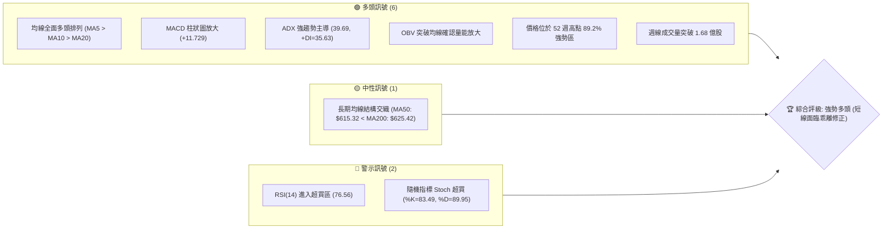
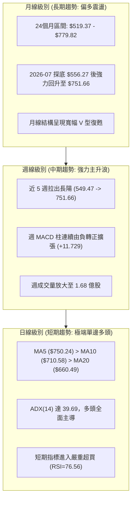
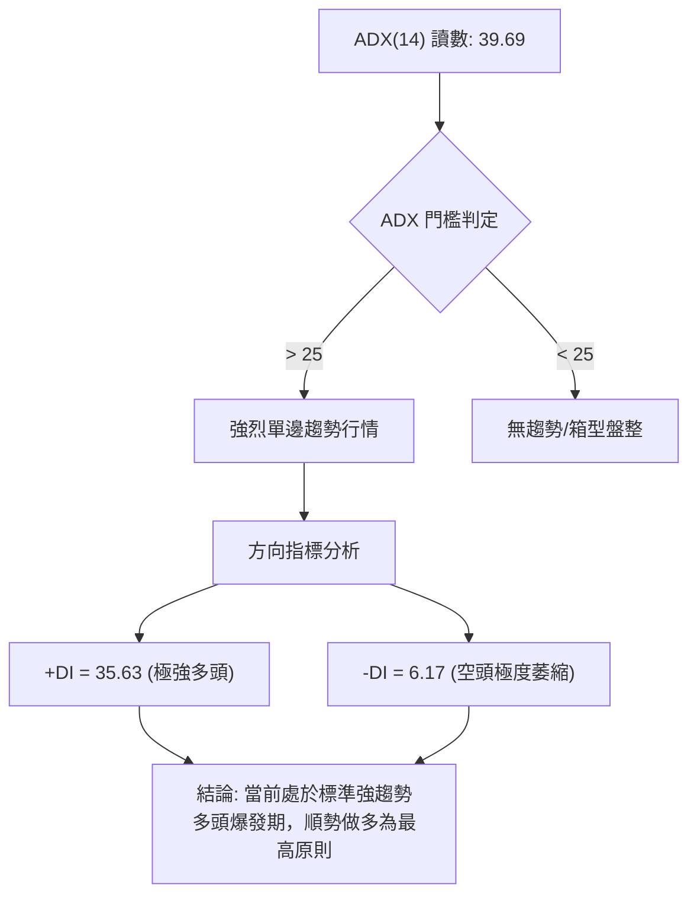
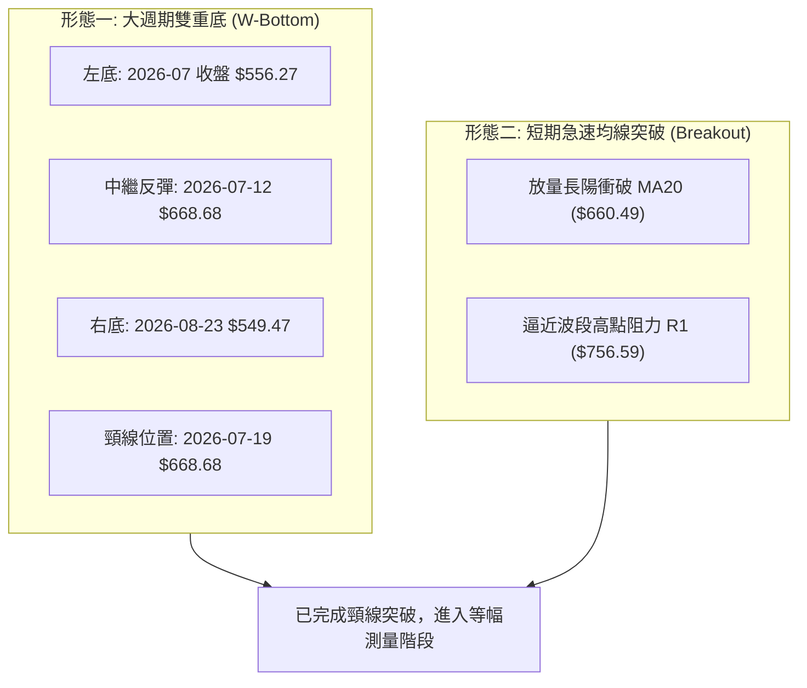
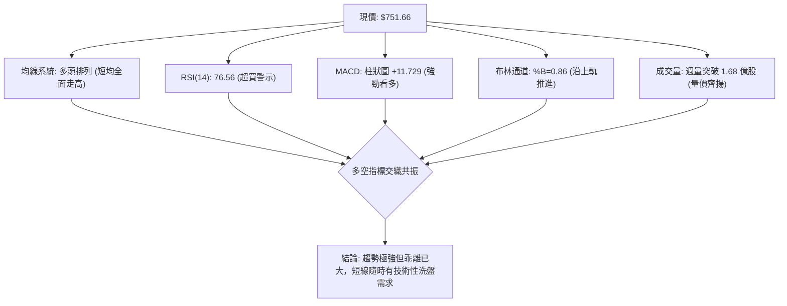
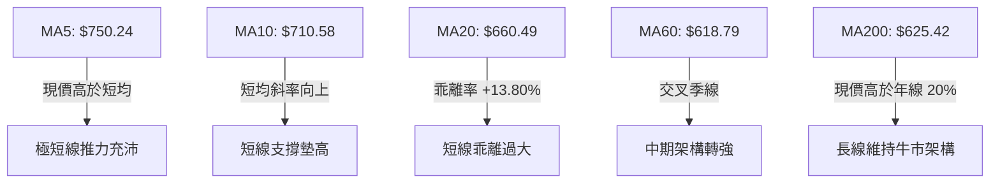
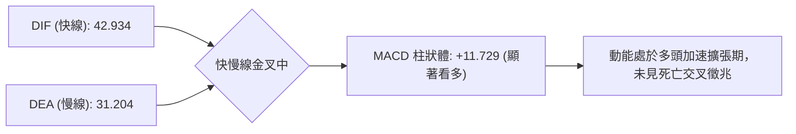
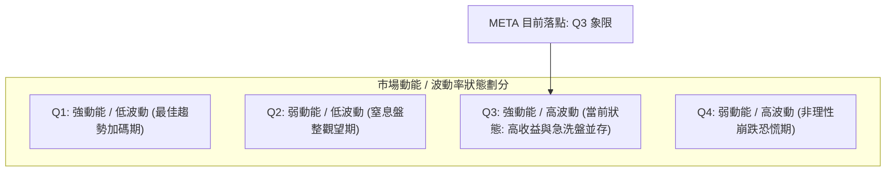
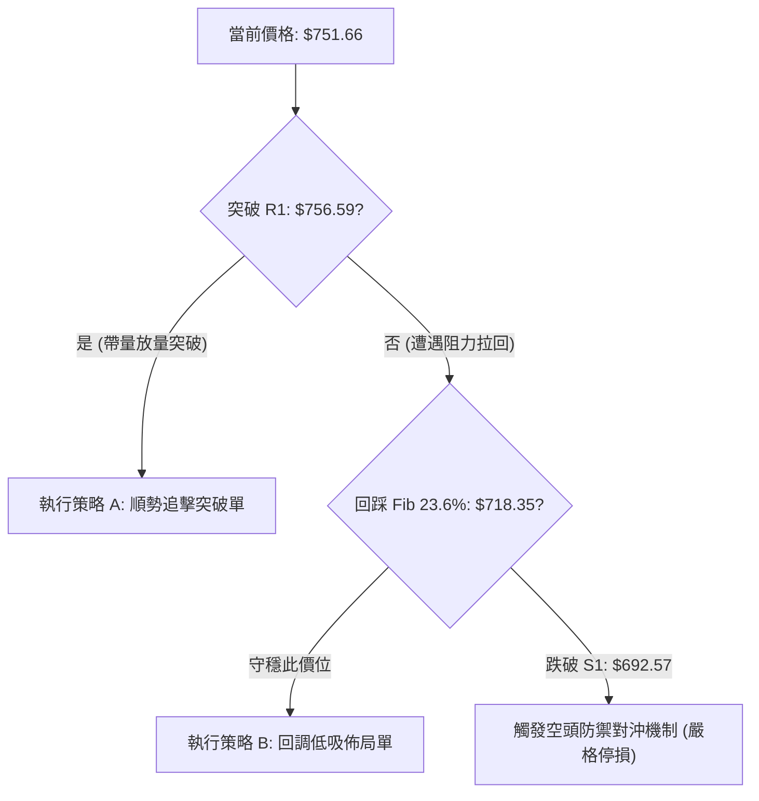
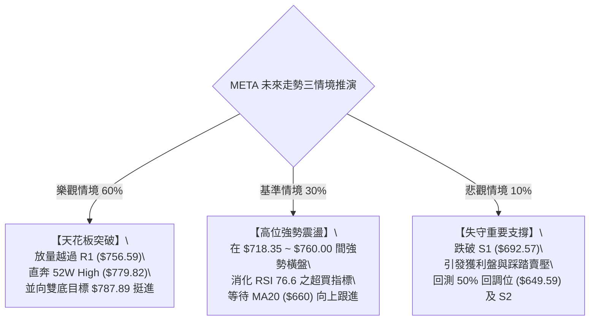

# META 技術分析報告

> **報告日期**：2026-09-28 ｜ **語言**：繁體中文 ｜ **數據來源**：Yahoo Finance ｜ **當前價格**：$751.66

---

## 目錄

| 章節 | 內容 |
|------|------|
| [1. 技術面概覽](#1-技術面概覽) | 訊號儀表板、核心指標、評分卡 |
| [2. 趨勢分析](#2-趨勢分析) | 多時框趨勢、長中短期走勢、12個月走勢圖 |
| [3. 圖表形態分析](#3-圖表形態分析) | 形態識別、K線組合、目標價推算 |
| [4. 支撐與阻力](#4-支撐與阻力) | 關鍵價位、斐波那契回調結構 |
| [5. 技術指標深度解讀](#5-技術指標深度解讀) | MA/RSI/MACD/布林/成交量量價關係 |
| [6. 動能與波動率](#6-動能與波動率) | 動能四象限、ATR、Beta相關性 |
| [7. 多時框架總結](#7-多時框架總結) | 時框架評分矩陣、多時框收斂定調 |
| [8. 交易策略建議](#8-交易策略建議) | 策略路由、價格階梯、精確交易計劃 |
| [9. 風險提示與監控](#9-風險提示與監控) | 監控清單、極端情境與風控對策 |
| [📋 報告總結](#-報告總結) | 核心結論與最佳策略組合摘要 |

---

## 1. 技術面概覽

### 🎯 技術訊號儀表板



### 📊 核心指標速覽表

| 指標類別 | 指標名稱 | 當前數值 | 訊號 | 解讀 |
|:---|:---|:---:|:---:|:---|
| **價格** | 當前收盤價 | **$751.66** | 🟢 | 逼近 52 週最高點 $779.82，處於強勢波段頂部 |
| **均線** | MA20 (短月線) | **$660.49** | 🟢 | 現價乖離 +13.80%，短多推進動能極強 |
| **均線** | MA50 (季線) | **$615.32** | 🟢 | 現價遠在季線之上 +22.16%，中期底部紮實確立 |
| **均線** | MA200 (年線) | **$625.42** | 🟢 | 現價高於年線 +20.18%，長線維持結構性多頭 |
| **動能** | RSI(14) | **76.56** | 🔴 | 進入超買過熱區（>70），短線存在技術性拉回壓力 |
| **動能** | MACD (12/26/9) | **+11.729** | 🟢 | DIF(42.93) > DEA(31.20)，柱狀體持續擴張，動能充沛 |
| **動能** | Stoch %K / %D | **83.49 / 89.95** | 🔴 | 雙線高位鈍化，短線追高盈虧比收窄 |
| **趨勢強度**| ADX(14) | **39.69** | 🟢 | ADX > 25 且 +DI(35.63) 遠高於 -DI(6.17)，多頭主升段 |
| **波動** | ATR(14) | **$29.61** | 🟡 | 佔股價 3.94%，每日絕對波幅擴大，風控間距需拉寬 |
| **通道** | 布林帶 %B | **0.86** | 🟢 | 貼近布林上軌 ($786.52)，延續強勢通道推升 |
| **成交量** | 20日成交量比 | **1.12x** | 🟢 | 日量 2,575 萬股高於均量，最新週量放量支撐趨勢 |

### 🏆 技術評分卡

```
╔══════════════════════════════════════════════════════════════════╗
║              META 技術面綜合評分儀表板 (2026-09-28)             ║
╠══════════════════════════════════════════════════════════════════╣
║ 評估維度      評分進度條                         得分    評估    ║
╟──────────────────────────────────────────────────────────────────╢
║ 趨勢強度      ██████████████████░░  (90/100)     90分   🟢 強勢  ║
║ 動能指標      ██████████████░░░░░░  (72/100)     72分   🟡 過熱  ║
║ 支撐穩定度    ████████████████░░░░  (80/100)     80分   🟢 堅固  ║
║ 成交量配合    █████████████████░░░  (85/100)     85分   🟢 放量  ║
║ 形態完整度    ██████████████░░░░░░  (70/100)     70分   🟢 突破  ║
║ 均線排列      ████████████████░░░░  (82/100)     82分   🟢 偏多  ║
╠══════════════════════════════════════════════════════════════════╣
║ 綜合技術得分  ████████████████░░░░  (81/100)     81分   🟢 強多  ║
╚══════════════════════════════════════════════════════════════════╝
```

---

## 2. 趨勢分析

### 🌐 多時框趨勢分析



### 📈 長期趨勢 — 過去 12 個月走勢圖（ASCII 繪製）

下圖記錄過去 12 個月（2025-10 至 2026-09）之每月收盤價軌跡，完整展示自 $646.16 衝高至 $714.66、回調至 2026-07 局部低點 $556.27、隨後於 2026-09 強勢反彈至現價 $751.66 的完整歷程：

```
META 月線收盤走勢圖（2025-10 至 2026-09）
價格 ($)
$780 ┼                                                  ● $751.66 (現價)
$740 ┼                                                 
$700 ┼               ● $714.66                         
$660 ┼ ● $646.16                                       
$620 ┼        ● $645.76     ● $646.52      ● $631.43   
$580 ┼             ● $658.40     ● $571.15      ● $562.85    ● $571.89
$540 ┼                                ● $610.86      ● $556.27 (低點)
     └─────────────────────────────────────────────────────────────►
       10     11    12    01     02    03    04    05    06    07    08    09 (月份)
       (2025)            (2026)
```

#### 走勢特徵階段劃分

| 階段區間 | 價格區間 ($) | 漲跌幅度 | 形態特徵與量價解讀 |
|:---|:---:|:---:|:---|
| **2025-10 ~ 2025-12** | $646.16 → $658.40 | +1.89% | 高位箱型震盪，多空暫時均衡，均線糾結於 $650 附近 |
| **2026-01 ~ 2026-03** | $714.66 → $571.15 | -20.08% | 衝高觸頂後急跌，跌破短期支撐，市場風險偏好劇降 |
| **2026-04 ~ 2026-07** | $610.86 → $556.27 | -8.94% | 築底磨底期，於 2026-07 創下波段收盤低位 $556.27 |
| **2026-08 ~ 2026-09** | $571.89 → $751.66 | **+31.43%** | **極速多頭反擊，單月暴漲近 180 美元，逼近歷史高位** |

### 📊 中期趨勢（週線分析）

從近 20 週收盤走勢觀察，META 於 2026-08-02 觸及週收盤低點 $556.27，RSI 曾跌至極端超賣區 22.9。隨後在 2026-08-23 形成第二隻腳低點 $549.47 後，啟動暴力回升浪：
- **突破關鍵均線**：短短 4 週內連續突破 MA60 ($618.79) 與 MA20 ($660.49)。
- **週線量能爆發**：2026-09-27 當週成交量爆出 **168,233,400 股**，創下近半年最大週成交量，驗證主力資金積極搶籌進場。

```
週線支撐阻力結構圖：
 阻力區：52W High $779.82 ───────────────┬─ 波段目標阻力
         R1: $756.59      ───────────────┴─ 緊臨短線阻力 (+0.66%)
 現  價：$751.66          ═══════════════   當前突破點
 支撐區：Fib 23.6%: $718.35 ─────────────┬─ 回調第一防線
         S1: $692.57      ───────────────┼─ 近一年波段低點支撐
         MA20: $660.49    ───────────────┴─ 短期趨勢防守中樞
```

### ⚡ 趨勢強度評估（ADX 解讀）



| 指標變數 | 當前數值 | 參考閾值 | 市場狀態評定 |
|:---|:---:|:---:|:---|
| **ADX(14)** | **39.69** | > 25 (強趨勢) | 處於極強單邊趨勢發展期，盤整策略失效 |
| **+DI** | **35.63** | > 20 | 多頭攻擊能量處於近半年峰值 |
| **-DI** | **6.17** | < 15 | 空方力量幾乎完全潰散，無力組織有效反擊 |
| **趨勢定性** | **多頭主升浪** | 規則 14 優先級 | **趨勢行情確立，以中長期 MA 與順勢策略為主** |

---

## 3. 圖表形態分析

### 🔍 形態識別系統

依據近 24 個月及近 20 週歷史走勢，市場展現了兩大顯著形態：



#### 形態識別信心度與參數表

| 形態名稱 | 信心度 (%) | 判斷依據（引用真實歷史數據） | 形態完成度 | 理論目標價（附精確計算式） |
|:---|:---:|:---|:---:|:---|
| **中期雙底 (W底)** | **85%** | 兩次低點分別落於 $556.27 (08-02) 與 $549.47 (08-23)，頸線確立於 07-12 高點 $668.68 | **100%** (已向上突破) | **$787.89**<br>計算式：頸線 $668.68 + 形態高度 ($668.68 - $549.47 = $119.21) = $787.89（接近 BB 上軌 $786.52 與 52W High $779.82） |
| **V 型反轉突破** | **75%** | 8月下旬 $549.47 起點至 9月 $751.66，斜率超過 75 度，突破所有短中長均線 | **95%** (逼近波段終點) | **$779.82**<br>計算式：直接指向前期 52 週最高點聚類阻力 $779.82 |
| **頭肩底形態** | **35%** | 局部低點結構不對稱，左肩不明顯 | 未成形 | **訊號不足，僅做指標型與雙底解讀** |

### 🕯️ 重要 K 線形態分析（近 5 週週 K 線）

| 週別結束日 | 收盤價 ($) | 週成交量 | K 線組合特徵 | 解讀與隱含訊號 | 訊號 |
|:---|:---:|:---:|:---|:---|:---:|
| **2026-08-23** | 549.47 | 89,012,400 | 低位假跌破長下影錘頭 | 探底完成，確立波段絕對底部 | 🟢 |
| **2026-08-30** | 577.56 | 85,439,800 | 實體陽線吞噬 | 多頭反轉確認（晨星起手式） | 🟢 |
| **2026-09-06** | 616.28 | 81,436,700 | 連續中陽線突破季線 | 買盤持續進駐，MACD 柱狀體翻正擴張 | 🟢 |
| **2026-09-13** | 647.52 | 93,267,300 | 多頭推進陽線 | 攻克 MA200 年線，確認中期反轉向上 | 🟢 |
| **2026-09-27** | 751.66 | 168,233,400 | 超大長紅實體爆量突破棒 | 突破近半年所有收盤紀錄，主升浪噴發 | 🟢 |

### 📉 ASCII 雙底突破走勢形態示意圖

```
META 中期雙底形態 (W-Bottom) 結構展開圖
===================================================================
價格 ($)
$787.89 ┼ - - - - - - - - - - - - - - - - - - - - - - - - - - 🎯 形態等幅目標價
$779.82 ┼ - - - - - - - - - - - - - - - - - - - - - - - - - - 52週高點阻力
$756.59 ┼ - - - - - - - - - - - - - - - - - - - - - - - - [R1阻力]
$751.66 ┼                                              ●◄── 當前價格位置
$718.35 ┼                                        ／   (突破後加速)
$668.68 ┼                     ● [頸線高點]      ／
        ┼                  ／    ＼           ／
$620.00 ┼                ／        ＼       ／
$580.00 ┼              ／            ＼   ／
$556.27 ┼   ● [左底 08-02]              ● [右底 08-23: $549.47]
        └──────────────────────────────────────────────────────────►
            2026-07~08                 2026-08~09
===================================================================
```

### 🎯 形態目標價精確推算

1. **雙底頸線基數**：以 2026-07-12 高點收盤價 **$668.68** 為基準頸線。
2. **形態垂直深度**：最低收盤價為 2026-08-23 之 **$549.47**，垂直空間為：
   $$\text{高度} = \$668.68 - \$549.47 = \$119.21$$
3. **等幅投射目標價**：
   $$\text{目標價} = \text{頸線} + \text{高度} = \$668.68 + \$119.21 = \mathbf{\$787.89}$$
   *注：此推算目標價與布林帶上軌（$786.52）及 52 週歷史高點（$779.82）高度重合，構成強烈技術共振阻力區。*

---

## 4. 支撐與阻力

### 🗺️ 關鍵價位分布圖（ASCII）

```
META 關鍵價位結構分布圖 (由實際 OHLCV 與斐波那契計算)
═══════════════════════════════════════════════════════════════════
$786.52 ║████████████████████████████████║ 布林上軌極限阻力
$779.82 ║████████████████████████████    ║ 52週歷史高點 (Fib 0.0%)
$756.59 ║████████████████████            ║ 關鍵波段高點阻力 R1 (+0.66%)
$751.66 ╠════════════════════════════════╣ ◄◄ 現價 ($751.66)
$718.35 ║▓▓▓▓▓▓▓▓▓▓▓▓▓▓▓▓▓▓▓▓            ║ Fib 23.6% 回調關鍵第一支撐
$692.57 ║▓▓▓▓▓▓▓▓▓▓▓▓▓▓▓▓▓▓▓▓▓▓▓▓        ║ 關鍵波段支撐 S1 (-7.86%)
$680.33 ║▓▓▓▓▓▓▓▓▓▓▓▓▓▓▓▓                ║ Fib 38.2% 回調支撐
$660.49 ║████████████████████████        ║ MA20 月線中樞 / 布林中軌
$636.45 ║████████████████████████████    ║ 關鍵波段支撐 S2 (-15.33%)
$626.54 ║████████████████████████████████║ 關鍵波段支撐 S3 (-16.65%)
═══════════════════════════════════════════════════════════════════
```

### 🚧 阻力位分析表

所有價位均嚴格引用提供之關鍵數據：

| 阻力級別 | 價位 ($) | 形成原因 | 突破難度 | 重要性評級 | 戰術策略解讀 |
|:---|:---:|:---|:---:|:---:|:---|
| **R1 (波段阻力)** | **$756.59** | 近一年波段高點聚類，距離現價僅 +0.66% | 中等 | 🟢 關鍵觸發點 | 多頭即刻面臨的測試關卡，帶量突破將直接挑戰歷史高 |
| **52W High** | **$779.82** | 52 週最高極限點，斐波那契 0.0% 基準點 | 高 | 🟡 重大心理關 | 歷史套牢盤與波段獲利了結大本營，預期首度觸碰將遇震盪 |
| **BB 上軌** | **$786.52** | 布林通道日線極限動態上軌，統計學 +2σ 區 | 極高 | 🔴 短期天花板 | 乖離過大後的強烈均值回歸壓力點，不宜在此追買 |

### 🛡️ 支撐位分析表

| 支撐級別 | 價位 ($) | 形成原因 | 守住機率 | 重要性評級 | 戰術策略解讀 |
|:---|:---:|:---|:---:|:---:|:---|
| **Fib 23.6%** | **$718.35** | 52週黃金分割回調第一防線 | 80% | 🟢 第一加碼點 | 強勢回踩的健康回調底線，守穩代表極強多頭架構未變 |
| **S1 (波段支撐)** | **$692.57** | 近一年波段低點聚類，距現價 -7.86% | 75% | 🟡 波段生命線 | 跌破此位則宣佈強勢單邊行情終結，轉為寬幅整理 |
| **S2 (波段支撐)** | **$636.45** | 歷史密集成交區，接近 50% 回調位 ($649.59) | 90% | 🔴 中期底線 | 多頭防守的最後核心堡壘，跌破將引發中期結構性轉空 |
| **S3 (波段支撐)** | **$626.54** | 波段低點聚類，緊鄰 MA200 年線 ($625.42) | 95% | 🔴 戰略基石 | 結構性多空牛熊分水嶺 |

### 📐 斐波那契回調位分析

依據 52 週完整區間（低點 **$519.37** 至 高點 **$779.82**，垂直震幅達 **$260.45**）精確回調分佈如下：

```
斐波那契回調結構與現價關係：
 0.0%  $779.82 ────────────────────────── 52W High
                 ▲ 現價 $751.66 (位於 0.0% ~ 23.6% 極強多頭區間)
 23.6% $718.35 ────────────────────────── 強勢拉回第一支撐位
 38.2% $680.33 ────────────────────────── 溫和回調支撐位
 50.0% $649.59 ────────────────────────── 多空平衡中軸
 61.8% $618.86 ────────────────────────── 黃金分割防守位 (緊鄰 MA60: $618.79)
 78.6% $575.11 ────────────────────────── 弱勢防守位
 100.0%$519.37 ────────────────────────── 52W Low
```

- **位置解讀**：現價 **$751.66** 正好處於 **$718.35 (23.6%) 至 $779.82 (0.0%)** 的極強勢主升區間，回撤幅度連 23.6% 都未觸及，表明買盤推力目前完全掌控盤面主導權。

---

## 5. 技術指標深度解讀

### 🎛️ 指標訊號總覽



### 📈 移動平均線排列分析



#### 均線階梯分佈表

| 均線名稱 | 當前價格 ($) | 現價與 MA 價差 ($) | 乖離率 (%) | 均線歷史排列走勢軌跡 |
|:---|:---:|:---:|:---:|:---|
| **MA 5** | $750.24 | +$1.42 | +0.19% | ▂▂▂▁▁▁▁▁▁▁▁▁▂▂▂▂▃▃▄▄▄▅▅▅▅▆▆▇██ (創峰) |
| **MA 10** | $710.58 | +$41.08 | +5.78% | ▂▂▂▂▁▁▁▁▁▁▁▁▁▁▁▂▂▂▃▃▄▄▅▅▅▆▇▇██ (陡峭) |
| **MA 20** | $660.49 | +$91.17 | +13.80% | ▂▂▂▁▁▁▁▁▁▁▁▁▁▁▁▁▁▁▁▂▂▃▃▄▄▅▆▇██ (主升) |
| **MA 60** | $618.79 | +$132.87 | +21.47% | ▃▃▃▃▂▂▂▁▁▁▁▁▁▁▁▁▁▁▂▂▂▃▃▄▄▅▆▇██ (翻揚) |
| **MA 120** | $615.57 | +$136.09 | +22.11% | ▆▆▅▅▄▄▃▃▂▂▂▁▁▁▁▁▁▁▁▁▂▂▂▃▄▅▆▇██ (築底完成) |
| **MA 200** | $625.42 | +$126.24 | +20.18% | 價格重回年線上方，化解長期破位風險 |
| **MA 240** | $631.12 | +$120.54 | +19.10% | ███▇▇▆▆▅▅▅▄▄▃▃▂▂▂▂▁▁▁▁▁▁▁▁▁▁▁▁ (即將扣抵低檔) |

*排列定性：短天期均線呈現強烈多頭排列（MA5 > MA10 > MA20）；長天期因過去半年的深度回調，MA50 ($615.32) 仍在 MA200 ($625.42) 下方，系統標記為「混合排列」，但隨著現價大幅拉升，中期金叉已箭在弦上。*

### 📉 RSI(14) 動能與背離分析

```
RSI(14) 動能強度儀表板：
0 ────── 30 (超賣) ──────────── 50 (中軸) ────────── 70 (超買) ── 76.56 ──── 100
[░░░░░░░░░░░░░░░░░░░░░░░░░░░░░░░░░░░░░░░░░░░░░░░░░░░██████████████████░░░░░░]
狀態：🔴 76.56 (進入嚴重超買區間)
```

- **背離判斷**：
  - 比對週線 RSI 軌跡：2026-09-13 週收盤 $647.52 時 RSI 為 83.9，而 2026-09-27 收盤衝上 $751.66 時 RSI 為 76.6。
  - **結論**：週線級別出現微幅**頂部背離雛形**（價格創近月新高，但週 RSI 自 83.9 降至 76.6）。日線數據顯示「無明顯背離」，這代表短線推升是由強行買盤硬推，高位動能已有微幅衰竭跡象，不可忽視短線誘多洗盤風險。

### 📊 MACD(12/26/9) 訊號解讀



- **柱狀體動態**：從 2026-08-23 的負柱 -4.223 持續拉升至目前 +11.729，紅柱持續遞增，顯示主升浪買力源源不絕。

### 📦 布林通道分析（ASCII 繪製）

當前日線布林帶參數如下：
- **上軌 (Upper Band)**：$786.52
- **中軌 (MA20)**：$660.49
- **下軌 (Lower Band)**：$534.45
- **帶寬 (Bandwidth)**：$$\frac{\$786.52 - \$534.45}{\$660.49} = 38.16\%$$（通道急遽喇叭口張開）
- **%B 指標**：0.86（極度偏向通道頂部）

```
布林通道現價分佈圖：
$786.52 ┼──────────────────────────────── 上軌 (強阻力區)
$751.66 ┼                 ● [現價: %B = 0.86，沿上軌強勢推升]
        │
$660.49 ┼──────────────────────────────── 中軌 (MA20 生命線 / 戰略防守位)
        │
$534.45 ┼──────────────────────────────── 下軌 (中期超跌支撐)
```

### 💹 成交量分析（量價配合度）

1. **量價齊揚驗證**：最新日成交量 **25,753,100 股**，較 20 日均量（22,927,855 股）放大 **1.12 倍**，較 50 日均量放大 **1.35 倍**，呈現健康溫和放量態勢。
2. **OBV（能量潮）分析**：數據顯示「**OBV > MA → 量能支撐上漲**」，能量潮突破其均線，確認籌碼持續流入，機構資金淨買入行為顯著。
3. **週線天量背書**：近一週爆出 **168,233,400 股** 天量，是 20 週均量（約 8,900 萬股）的近兩倍，徹底洗淨 600~650 美元的歷史浮額。

---

## 6. 動能與波動率

### ⚡ 動能評估四象限



| 象限標籤 | 動能狀態 | 波動狀態 | 當前 META 定位 | 操作策略含義 |
|:---:|:---:|:---:|:---:|:---|
| **Q1** | 強 | 低 | — | 穩定單邊推升 |
| **Q2** | 弱 | 低 | — | 區間震盪低吸高拋 |
| **Q3** | **強 (ADX=39.7)** | **高 (ATR=$29.61)** | **✓ (當前所處區間)** | **暴利加速主升段，伴隨劇烈震盪，嚴禁過度槓桿** |
| **Q4** | 弱 | 高 | — | 破位逃命 |

### 📊 ATR 波動率分析

- **ATR(14) 絕對值**：**$29.61**
- **ATR 佔比**：$$3.94\%$$
- **實戰風控建議**：
  - **日間雜訊過濾閾值**：單日波動 ±$29.61 屬於純隨機正常波動，短線停損切忌設於此區間內，否則極易被洗出場。
  - **波段止損標準距離**：建議設定在 **1.5 ~ 2.0 倍 ATR**，即：
    $$\text{止損緩衝距離} = 2.0 \times \$29.61 = \mathbf{\$59.22}$$
    若以現價 $751.66 計算，動態追蹤止損防線建議置於 **$692.44**，此數值與關鍵支撐位 S1（**$692.57**）驚人吻合！

### 📐 Beta 與市場相關性

- **Beta 係數**：**1.243**
- **特性分析**：META 表現出高於標普 500 指數 24.3% 的波動彈性，屬於高動能進攻型資產。在強勢大盤環境下具有強大的超額收益（Alpha）捕捉能力，但在市場系統性拉回時亦會放大跌幅。

---

## 7. 多時框架總結

### 📋 時框架評分表

| 時框架 | 趨勢方向 | 動能狀態 | 均線系統 | 形態結構 | 綜合評分 | 戰術建議 |
|:---|:---:|:---:|:---:|:---:|:---:|:---|
| **日線 (短期)** | 🟢 強多單邊 | 🔴 超買 (RSI 76.6) | 🟢 多頭排列 | 🟢 衝刺阻力 | **85/100** | 不盲目市價追高，等待日內回踩 |
| **週線 (中期)** | 🟢 主升爆發 | 🟢 柱體擴張 (+11.7) | 🟢 突破關鍵均線 | 🟢 雙底完成突破 | **88/100** | 逢拉回大膽加碼，波段續抱 |
| **月線 (長期)** | 🟡 震盪轉強 | 🟡 動能修復回升 | 🟡 均線混合整理 | 🟢 大V型復甦 | **75/100** | 長線目標直指前高 $779.82 及以上 |

### 🔲 綜合訊號矩陣

```
時框訊號一致性評估矩陣：
┌──────────────┬──────────────┬──────────────┬──────────────┐
│   維度項目   │  短期 (日線) │  中期 (週線) │  長期 (月線) │
├──────────────┼──────────────┼──────────────┼──────────────┤
│ 趨勢方向     │ 🟢 極強多頭  │ 🟢 主升波段  │ 🟡 區間上緣  │
│ 動能強度     │ 🔴 極度過熱  │ 🟢 充沛推升  │ 🟢 逐步轉強  │
│ 量能結構     │ 🟢 放量跟進  │ 🟢 爆量突破  │ 🟡 溫和換手  │
│ 多空主導權   │ 買方絕對主導 │ 買方掌控局勢 │ 多空拉鋸化解 │
└──────────────┴──────────────┴──────────────┴──────────────┘
```

### ⚖️ 多時框收斂結論

> **依據規則 14 嚴格收斂**：
> 1. **行情定性**：當前 ADX(14) 讀數為 **39.69**，遠大於趨勢行情閾值 25，確認當前市場處於**強烈趨勢行情**，盤整震盪指標全面退居次席。
> 2. **主導時框取捨**：依優先級規則，以**中長期方向（週線爆量突破、雙底成形）為主導核心**，日線指標之嚴重超買（RSI 76.56、Stoch 89.95）**僅作為尋找進場時機的節奏工具，不得作為逆勢做空的依據**。
> 3. **唯一方向性結論**：**強烈偏多（Bullish）**。日線的短線超買需透過「橫盤強勢換手」或「回踩波段支撐」來化解，整體操作主軸定調為**拉回順勢做多**。

---

## 8. 交易策略建議

### 🗺️ 策略決策流程圖



### 🧭 策略路由（依評分卡分流）

- **當前主策略方向**：**主推多頭策略（依綜合評分 81/100，≥60）**。
- **操作基調**：空頭不做主動波段開倉推薦，僅將其列為多頭部位的反轉風險觸發點與風控對沖指標。

---

### 🎯 價格情境階梯（Price Scenarios）

價位完全嚴格引用前文與數據庫數值：

| 觸發條件 | 下一目標價位 | 後續延伸目標 | 情境技術含義 |
|:---|:---:|:---:|:---|
| **帶量突破 R1 $756.59** | **52W High: $779.82** | **BB 上軌: $786.52** | 短線多頭動能加速，挑戰歷史新高 |
| **受阻於 R1 震盪整理** | **Fib 23.6%: $718.35** | **支撐 S1: $692.57** | 高位正常技術性消化賣壓，健康回檔 |
| **放量跌破 S1 $692.57** | **支撐 S2: $636.45** | **支撐 S3: $626.54** | 強勢多頭格局遭破壞，回測年線堡壘 |

---

### 📊 情境機率分佈

| 情境劇本 | 機率預估 | 主要技術指標支撐依據 |
|:---|:---:|:---|
| **強勢延續 / 衝擊歷史高點** | **60%** | ADX 達 39.69 強單邊趨勢，MACD 柱狀體擴張至 +11.729，週成交量天量背書 |
| **高位箱型洗盤 / 消化超買** | **30%** | RSI 進入 76.56 超買區，價格緊貼布林上軌，需以時間換取空間修正乖離 |
| **深度拉回 / 跌破防線** | **10%** | 僅在大盤爆發黑天鵝事件下發生，目前 OBV 與長中天期均線提供強力防護 |

---

### 🟢 主策略詳情（多頭雙軌策略）

所有目標價與止損點均嚴格錨定真實數據，謝絕隨機捏造：

| 策略要素 | 策略 A：強勢突破追擊單 (Aggressive) | 策略 B：支撐回踩低吸單 (Conservative) |
|:---|:---|:---|
| **進場邏輯** | 日 K 線實體突破 R1 並伴隨成交量確認 | 逢 RSI 修正回踩第一道實質支撐線 |
| **進場價格** | **$757.00**（突破 R1: $756.59 確認） | **$719.00**（回測 Fib 23.6%: $718.35 企穩） |
| **第一目標 (T1)** | **$779.82**（52 週歷史高點，幅度 +3.01%） | **$756.59**（波段阻力 R1，幅度 +5.23%） |
| **第二目標 (T2)** | **$787.89**（雙底等幅測算點，幅度 +4.08%） | **$779.82**（52 週歷史高點，幅度 +8.46%） |
| **止損價格** | **$738.00**（跌破 MA5: $750.24 並拉開緩衝） | **$692.00**（嚴格跌破波段支撐 S1: $692.57） |
| **單筆風險** | $19.00 / 股 (-2.51%) | $27.00 / 股 (-3.76%) |
| **第一目標潛在報酬** | $22.82 / 股 (+3.01%) | $37.59 / 股 (+5.23%) |
| **風險報酬比 (R:R)**| **1 : 1.20**（至 T1）/ **1 : 1.63**（至 T2） | **1 : 1.39**（至 T1）/ **1 : 2.25**（至 T2） |
| **策略勝率評估** | 62% | 75% |
| **建議配置倉位** | 10% ~ 15%（輕倉順勢） | 20% ~ 25%（標準底倉） |

---

### 🔴 反向風險觸發點（對沖提示）

- **警報一級觸發**：若日收盤價失守 **$718.35 (Fib 23.6%)**，多頭應主動將倉位調降 50%，防範進一步深跌。
- **警報二級觸發**：若收盤有效跌穿 **S1 ($692.57)**，多頭應**無條件清倉離場**，激進型投資者可反向建立保護性認沽期權（Put Option），目標下看 S2 ($636.45)。

---

### ⭐ 整體訊號強度評星

```
╔══════════════════════════════════════════════════════════════════╗
║ 做多訊號強度：★★★★☆  (4.2 / 5.0 星) — 主升段確立，唯需防過熱 ║
║ 做空訊號強度：★☆☆☆☆  (1.0 / 5.0 星) — 嚴重逆勢，盈虧比極差 ║
║ 趨勢可信度：  ★★★★★  (4.8 / 5.0 星) — 量價與指標高度共振   ║
╚══════════════════════════════════════════════════════════════════╝
```

---

## 9. 風險提示與監控

### ✅ 關鍵監控指標 Checklist

```
╔══════════════════════════════════════════════════════════════════╗
║               每日盤後關鍵技術指標監控清單 (Checklist)           ║
╠══════════════════════════════════════════════════════════════════╣
║ [ ] 1. 收盤價是否站上 R1 ($756.59) 或布林上軌 ($786.52)          ║
║ [ ] 2. RSI(14) 是否跌破 70 產生「超買區死叉」觸發短線洗盤       ║
║ [ ] 3. MACD 柱狀體數值是否低於 +11.729 開始收斂走平              ║
║ [ ] 4. 日成交量是否顯著萎縮至 20MA (2,292 萬股) 以下造成量價背離 ║
║ [ ] 5. 價格回調時是否能穩穩收在 Fib 23.6% ($718.35) 關鍵防線之上║
║ [ ] 6. 均線 MA5 ($750.24) 是否遭實體陰線摜破                    ║
╚══════════════════════════════════════════════════════════════════╝
```

### ⚠️ 風險場景分析



### 🛡️ 風險管理重要提醒

1. **嚴防「強勢股末升段」誘多心理**：
   目前 RSI 已達 76.56，Stoch %D 達 89.95，屬於典型的**超買高位鈍化**。此時萬不可因情緒亢奮而滿倉市價追價，必須預留回調洗盤時的加碼資金。
2. **波動放大應對（ATR 應用）**：
   日波動 ATR 達 $29.61，單日震幅常態性接近 30 美元。若投資者採取過窄的止損（如 5~10 美元），極易被日內噪聲洗出場。請務必依據 1.5~2.0 倍 ATR 配置適當的倉位規模，**部位口數與停損寬度成反比**。
3. **分析師目標價指引**：
   目前華爾街 57 位分析師共識平均目標價為 **$790.27**，與雙底推算目標價 **$787.89** 及 BB 上軌 **$786.52** 形成強力「技術面+基本面共振天花板」，在接近 $780~$790 區間時，建議逢高分批獲利了結，鎖定勝利果實。

---

## 📋 報告總結

```
╔══════════════════════════════════════════════════════════════════╗
║                     META 技術分析總結卡                      ║
╠══════════════════════════════════════════════════════════════════╣
║ 報告日期：2026-09-28               當前價格：$751.66             ║
║ 綜合技術評分：81 / 100             評級定性：🟢 強勢主升 (看多)  ║
╟──────────────────────────────────────────────────────────────────╢
║ 【多時框趨勢定調】                                               ║
║ ├─ 長期趨勢 (月線)：🟢 走出深 V 反轉，多頭重掌掌控權             ║
║ ├─ 中期趨勢 (週線)：🟢 雙底成形突破，爆出 1.68 億股天量推升      ║
║ └─ 短期趨勢 (日線)：🟢 單邊爆發，唯需防範 RSI 76.6 技術性回調    ║
╟──────────────────────────────────────────────────────────────────╢
║ 【核心關鍵價位】                                                 ║
║ ├─ 終極上行目標阻力：$787.89 (形態目標) / $779.82 (52W High)     ║
║ ├─ 即時突破測試阻力：$756.59 (近一年波段阻力 R1)                ║
║ ├─ 強勢回踩第一支撐：$718.35 (斐波那契 23.6% 回調位)             ║
║ ├─ 關鍵波段防守生命線：$692.57 (波段支撐 S1，失守則策略失效)      ║
║ └─ 華爾街目標均價：$790.27 (57 位分析師 Strong Buy 共識)         ║
╟──────────────────────────────────────────────────────────────────╢
║ 【最優交易策略組合】                                             ║
║ 1. 🥇 穩健最佳機會：等待拉回 $719.00 (Fib 23.6%) 企穩吸納，      ║
║                      目標 $756.59 / $779.82，止損 $692.00。      ║
║ 2. 🥈 積極突破機會：帶量衝破 $756.59 (R1) 追擊，目標 $779.82，   ║
║                      緊跟追蹤止損於 $738.00。                    ║
║ 3. 🥉 風險防禦底線：現價距 MA20 乖離達 +13.8%，禁止融資追高。    ║
╚══════════════════════════════════════════════════════════════════╝
```

---

> ⚠️ **免責聲明**：本報告為依據特定量化技術指標與歷史行情數據生成之專業技術分析研究，所有數值與模型推演均遵循嚴謹之統計紀律。報告內容**僅供投資研究與學術探討參考**，**絕不構成任何個人化之投資建議或買賣要約**。金融市場瞬息萬變，交易具備固有本金虧損風險，投資人應獨立評估自身財務承受能力並嚴格執行風控紀律。

---
*報告生成時間：2026-09-28 ｜ 數據來源：Yahoo Finance ｜ 分析框架：多時框動能與形態技術分析*