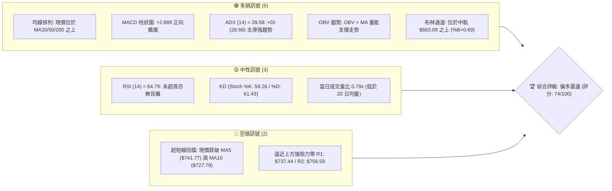
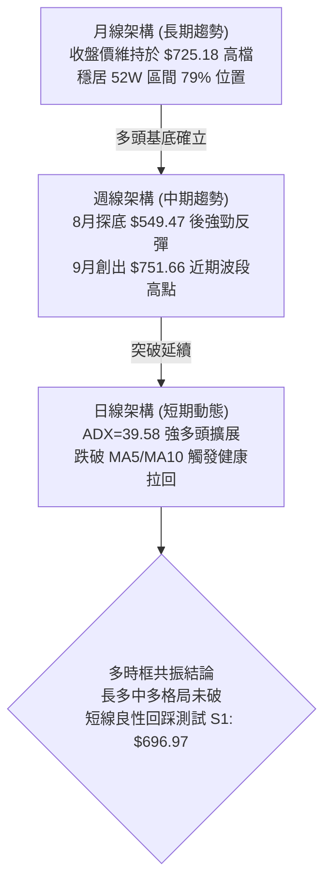
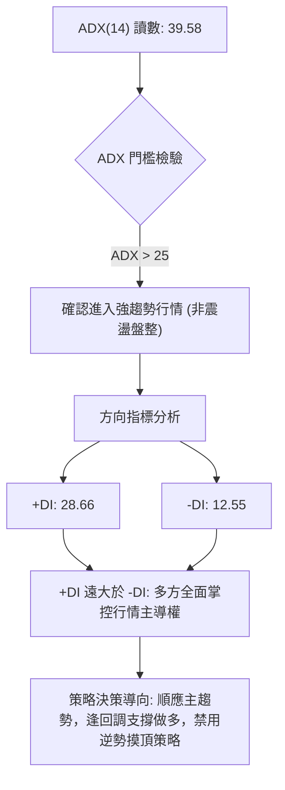
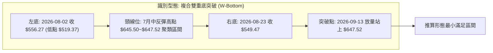
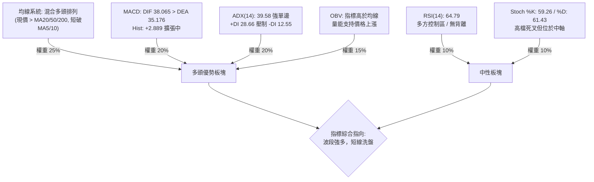
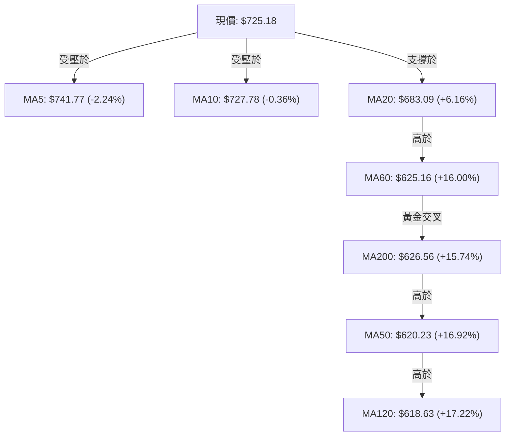
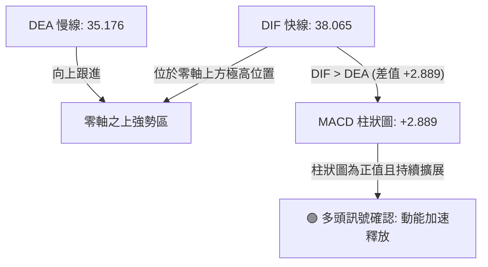
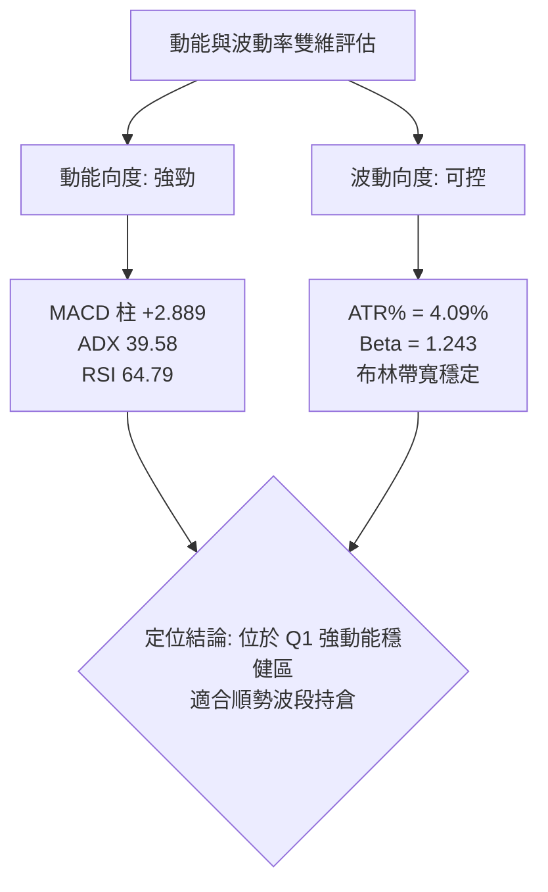
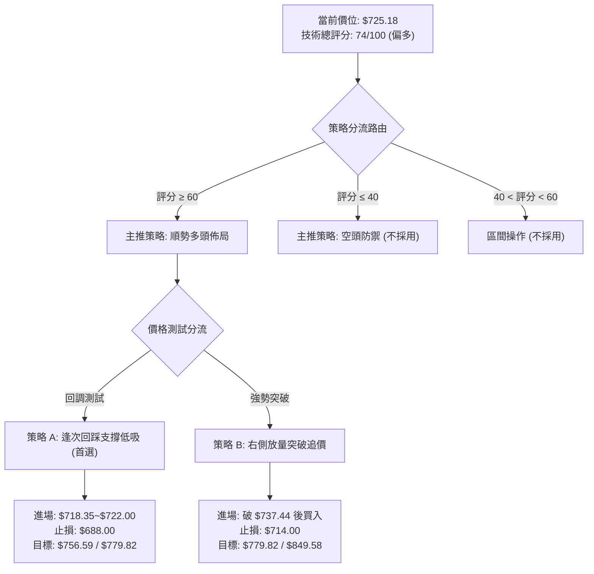
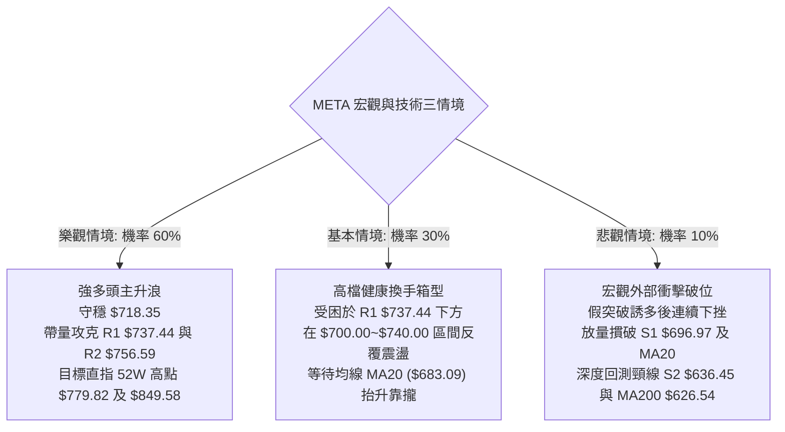

# META 技術分析報告

> **報告日期**：2026-10-01 ｜ **語言**：繁體中文 ｜ **數據來源**：Yahoo Finance ｜ **當前價格**：$725.18

---

## 目錄

| 章節 | 內容 |
|------|------|
| [1. 技術面概覽](#1-技術面概覽) | 訊號儀表板、核心指標、評分卡 |
| [2. 趨勢分析](#2-趨勢分析) | 多時框趨勢、長中短期走勢、ADX解讀 |
| [3. 圖表形態分析](#3-圖表形態分析) | 形態識別、信心度、K線組合、目標價推算 |
| [4. 支撐與阻力](#4-支撐與阻力) | 關鍵價位結構、阻力/支撐表、斐波那契回調 |
| [5. 技術指標深度解讀](#5-技術指標深度解讀) | MA/RSI/MACD/布林/成交量/OBV整合 |
| [6. 動能與波動率](#6-動能與波動率) | 動能矩陣、ATR、Beta 與市場相關性 |
| [7. 多時框架總結](#7-多時框架總結) | 時框架矩陣、多時框優先級收斂 |
| [8. 交易策略建議](#8-交易策略建議) | 策略路由、價格階梯、主推多頭策略、風控對沖 |
| [9. 風險提示與監控](#9-風險提示與監控) | 監控清單、三情境壓力測試、風控規則 |

---

## 1. 技術面概覽

### 🎯 技術訊號儀表板



### 📊 核心指標速覽表

| 指標類別 | 指標名稱 | 當前數值 | 訊號 | 解讀 |
|:---|:---|:---|:---:|:---|
| **價格** | 當前價格 | $725.18 | 🟢 | 站於 52 週低點 ($519.37) 至高點 ($779.82) 區間 79.0% 高位 |
| **均線** | 短期 MA20 | $683.09 | 🟢 | 現價高於 MA20 達 +6.16%，波段多頭動能穩固 |
| **均線** | 中期 MA50 | $620.23 | 🟢 | 現價大幅領先 MA50 達 +16.92%，中期多頭保護明確 |
| **均線** | 長期 MA200 | $626.56 | 🟢 | 現價高於 MA200 達 +15.74%，處於長期多頭架構 |
| **動能** | RSI(14) | 64.79 | 🟡 | 位於健康多頭強勢區間 (50–70)，未觸及超買 (70)，無背離現象 |
| **動能** | MACD(12,26,9) | DIF 38.065 / MACD 35.176 | 🟢 | 雙線在零軸上方運行，柱狀圖 +2.889 持續擴張，多頭掌控 |
| **趨勢** | ADX(14) | 39.58 (+DI 28.66, -DI 12.55) | 🟢 | ADX 顯著大於 25，多方佔據絕對優勢，屬於典型強單邊趨勢行情 |
| **波動** | ATR(14) | $29.65 (4.09%) | 🟡 | 日均波動幅度適中，需配置至少 1.5–2.0 倍 ATR 作為停損緩衝 |
| **通道** | 布林通道 | 上軌 $792.71 / 中軌 $683.09 | 🟢 | %B = 0.69，價格健康回調至中軌與上軌之間，通道開口擴大 |
| **成交量** | 20日均量比 | 0.79x (19.24M / 24.21M) | 🟡 | 短線急漲後拉回量縮，量能未失控，OBV 保持多頭排列 |

### 🏆 技術評分卡

```
╔══════════════════════════════════════════════════════════════════════╗
║                    技術評分卡 — META (2026-10-01)                    ║
╠══════════════════════════════════════════════════════════════════════╣
║ 趨勢強度 (ADX/DI)  ████████████████░░░░  82/100  🟢 強趨勢多頭主導   ║
║ 動能指標 (MACD/RSI)██████████████░░░░░░  72/100  🟢 柱狀擴張無背離   ║
║ 支撐穩定度 (結構位)████████████████░░░░  80/100  🟢 S1/斐波支撐穩固  ║
║ 成交量配合 (OBV/量)████████████░░░░░░░░  65/100  🟡 OBV多頭但短線量縮║
║ 形態完整度 (雙重底)██████████████░░░░░░  70/100  🟢 頸線突破回踩中   ║
║ 均線系統 (多時框MA)███████████████░░░░░  75/100  🟢 價格全線站上長均 ║
╠══════════════════════════════════════════════════════════════════════╣
║ 綜合技術評分       ███████████████░░░░░  74/100  🟢 評級：積極偏多   ║
╚══════════════════════════════════════════════════════════════════════╝
```

---

## 2. 趨勢分析

### 🌐 多時框趨勢分析

依據收斂規則：當前日線 ADX(14) 達 39.58，遠高於 25 臨界值，確認市場處於**強趨勢主導架構**而非無序盤整。此時多時框分析應以週線與長天期移動平均線（MA50、MA200）方向為核心趨勢導航，日線層級專注於尋找拉回進場契機。



### 📈 長期趨勢 — 12個月走勢圖（Unicode）

標注過去 12 個月收盤走勢與關鍵轉折高低點：

```
META 月線收盤走勢圖（2025-10 至 2026-09）
價格軸 ($)
$775 ┤                                                 
$750 ┤                                            ● (2026-09 W4: $751.66)
$725 ┤                                            ●← 現價 $725.18 (2026-09收盤)
$700 ┤              ● (2026-01: $714.66)           
$675 ┤                                            
$650 ┤●    ●    ●         ●                        
$625 ┤                         ●    ●             
$600 ┤                                            
$575 ┤                        ●              ●    
$550 ┤                                  ●    ● (2026-07/08雙底區間: $556.27 / $549.47)
     └────────────────────────────────────────────────────────
       10   11   12   01   02   03   04   05   06   07   08   09  (月份)
```

#### 過去 12 個月波段特徵分析表

| 階段區間 | 時間跨度 | 起訖價位 | 漲跌幅 | 走勢結構與量能特徵 |
|:---|:---|:---|:---:|:---|
| **第一階段：高檔震盪** | 2025-10 ~ 2025-12 | $646.16 → $658.40 | +1.89% | 自前期歷史高點回落後，於 $645–$660 構建密集築底平台 |
| **第二階段：衝高回落** | 2026-01 ~ 2026-03 | $714.66 → $571.15 | -20.08% | 1月衝刺至 $714.66 遇阻，隨後大幅回吐並跌破均線支撐 |
| **第三階段：築底整理** | 2026-04 ~ 2026-06 | $610.86 → $562.85 | -7.86% | 價格反彈至 $631.43 後再次破位下挫，於 $560 附近反覆測試 |
| **第四階段：確立雙底** | 2026-07 ~ 2026-08 | $556.27 → $571.89 | +2.81% | 探測年內低點聚類（7月收 $556.27、8月最低探 $549.47），築底完成 |
| **第五階段：主升推升** | 2026-08 ~ 2026-09 | $571.89 → $725.18 | +26.80% | 量能放大破頸線，週線 MACD 翻紅並連續創高，確立右側突破架構 |

### 📊 中期趨勢（週線分析）

從近 20 週收盤走勢可見，價格在 2026-08-02 週跌至 $556.27（RSI 跌至 22.9 極端超賣區）及 2026-08-23 週的 $549.47 構築堅實的雙底型態；隨後在 9 月下旬爆出 168.3M 巨量，長陽線推升至 $751.66（2026-09-27 週）。

```
META 週線阻力與支撐區間示意圖
═══════════════════════════════════════════════════════════════════════
$779.82 ─────────────────────────────────────────── 52W 歷史最高點 (波段頂部)
$756.59 ───┬─────────────────────────────────────── 關鍵阻力 R2 (近期衝高遇阻處)
$737.44 ───┼─[當前阻力 R1]──────────────────────── 近期壓力區聚類點
$725.18 ───┼─[現價] ◄──────── 短期回踩測試
$718.35 ───┴─────────────────────────────────────── 斐波那契 23.6% 回調關鍵樞軸
$696.97 ─────────────────────────────────────────── 近期支撐 S1 (週線跳空平台)
$683.09 ─────────────────────────────────────────── 日線 MA20 / 布林中軌
$636.45 ─────────────────────────────────────────── 強支撐 S2 (波段頸線密集帶)
═══════════════════════════════════════════════════════════════════════
```

### ⚡ 趨勢強度評估（ADX 解讀）



#### ADX 趨勢強度對照

| ADX 數值區間 | 趨勢狀態定義 | META 當前狀態 (39.58) | 交易系統對策 |
|:---:|:---:|:---:|:---|
| 0 ~ 20 | 無趨勢 / 盤整僵局 | 否 | 觀望或高拋低吸，採用震盪指標 |
| 20 ~ 25 | 趨勢萌芽 / 方向未明 | 否 | 準備突破策略，等待突破確立 |
| **25 ~ 40** | **強趨勢確立 (Strong Trend)** | **✓ 完美吻合 (39.58)** | **中長天期均線主導，回踩核心均線逢低做多** |
| 40 以上 | 極強極端趨勢 (過熱風險) | 接近邊緣 | 注意動能背離與短線獲利回吐震盪 |

---

## 3. 圖表形態分析

### 🔍 形態識別系統

在日線與週線圖表結構中，META 經歷了 2026 年 6 月至 8 月的連續築底，並於 9 月完成關鍵結構突破。



#### 圖表形態判定與信心度評估表

| 形態類別 | 信心度 | 判斷依據（引用數據） | 完成度 | 目標價（附嚴謹計算式） |
|:---|:---:|:---|:---:|:---|
| **複合雙重底 (W-Bottom)** | **85%** | 兩次下探底點聚類：$556.27 與 $549.47（最低刺穿 $519.37），且右底量能萎縮、MACD 柱底背離，於 9 月中破頸線 $645.50。 | **100% (已突破)** | **最低量度目標價：$771.63**<br>計算式：頸線 $645.50 + 形態垂直高度 ($645.50 - $519.37 = $126.13) = $771.63（直接指向 52W 高點 $779.82 附近） |
| **多頭旗形回踩 (Bullish Flag)** | **65%** | 價格於 2026-09-27 觸及 $751.66 後，連日回踩至 $725.18，成交量由 168.3M 驟降至 70.7M，呈現標準旗面回踩。 | **60% (醞釀中)** | **次級多頭目標價：$756.59 (阻力位 R2)**<br>計算式：由旗形下沿測試斐波 23.6% ($718.35) 獲得支撐後之反彈，首要考驗前高聚類 R2 $756.59。 |
| **頭肩底形態** | **35%** | 數據中左肩與頭部界限模糊（低點重疊度高），不足以支撐典型頭肩結構。 | 0% | 訊號不足，僅做指標型解讀，不預設目標價。 |

### 🕯️ 重要K線形態分析

| 期間週期 | 收盤價 | K線形態名稱 | 結構意義解讀 | 多空訊號 |
|:---:|:---:|:---|:---|:---:|
| 2026-08-02 | $556.27 | **長下影錘頭破底線** | 週線探測年內極值，賣壓耗竭，極度超賣引發空頭回補 | 🟢 強烈買訊 |
| 2026-08-23 | $549.47 | **雙底確認晨星結構** | 再次探底不破前低，量縮震盪，隨後連續三週收出紅棒 | 🟢 多頭確認 |
| 2026-09-20 | $665.23 | **紅三兵大陽線破頸線** | 突破 200 日均線及波段頸線，量能溫和放大，買盤全面進駐 | 🟢 多方表態 |
| 2026-09-27 | $751.66 | **突破大陽線帶上影** | 單週巨量 168.3M 爆發，觸碰上軌遭遇獲利拋壓，短線過熱 | 🟡 短線偏多 |
| 2026-10-04 | $725.18 | **量縮陰線回踩修正** | 量能大幅萎縮，回踩 MA5/MA10尋求支撐，屬於健康洗盤回檔 | 🟢 良性回踩 |

### 📉 ASCII 走勢形態示意圖

```
META 複合雙底突破與回踩旗形示意圖
$780 ┤                                                [52W 高點: $779.82]
$760 ┤                                        ▲ 衝高 $751.66 (遇阻 R2)
$740 ┤                                       / ╲
$720 ┤                                      /   ● 現價 $725.18 (旗形拉回)
$700 ┤                                     /
$680 ┤                                    /
$660 ┤                [頸線 $645.50]     /
$640 ┤───────▲──────────────────────────/──────────────────────────
$620 ┤      / ╲                        /
$600 ┤     /   ╲                      /
$580 ┤    /     ╲                    /
$560 ┤   ●       ●                  /
$540 ┤  (底1)   (底2)              /
$520 ┤ $556.27  $549.47 (低點 $519.37)
     └─────────────────────────────────────────────────────────────
```

### 🎯 形態目標價計算

根據雙重底突破標準測幅法則：
1. **基底垂直高度** = 頸線高點 ($645.50) - 52週實體最低點 ($519.37) = **$126.13**
2. **第一量度漲幅目標 (T1)** = 突破頸線點 ($645.50) + 形態垂直高度 ($126.13) = **$771.63**
   - 該目標價與 52 週歷史高點 **$779.82** 高度重疊（相差僅 1.05%），印證 $771.63–$779.82 區間為第一階段量度滿足點。
3. **延伸量度漲幅目標 (T2)** = 頸線高點 ($645.50) + 1.618 倍形態高度 ($126.13 × 1.618 = $204.08) = **$849.58**
   - 該價位落於市場分析師平均共識目標價 **$793.91** 與最高目標價 **$1000.00** 之間。

---

## 4. 支撐與阻力

### 🗺️ 關鍵價位分布圖（Unicode）

```
META 價位結構分布圖
═══════════════════════════════════════════════════════════════════════
$779.82 ║████████████████████████████████║ 52週最高價 (極強歷史頂部)
$756.59 ║████████████████████████        ║ 關鍵阻力 R2 (近期衝高聚類)
$737.44 ║████████████████                ║ 近期阻力 R1 (短期均線反壓)
$725.18 ╠════════════════════════════════╣ ◄ 現價 (2026-10-01 收盤)
$718.35 ║▓▓▓▓▓▓▓▓▓▓▓▓▓▓▓▓▓▓▓▓▓▓▓▓        ║ 斐波那契 23.6% 核心樞軸支撐
$696.97 ║▓▓▓▓▓▓▓▓▓▓▓▓▓▓▓▓▓▓▓▓            ║ 近期支撐 S1 (波段低點聚類)
$683.09 ║▓▓▓▓▓▓▓▓▓▓▓▓▓▓▓▓                ║ 布林帶中軌 / MA20 動態支撐
$636.45 ║████████████████████████        ║ 強支撐 S2 (破頸線平台密集成交帶)
$626.54 ║████████████████████████████████║ 終極防守 S3 (MA200 長期生命線 $626.56)
═══════════════════════════════════════════════════════════════════════
```

### 🚧 阻力位分析表

> **數據紀律校驗**：價位嚴格引用自「關鍵價位（由 OHLCV 計算）」與 52 週真實極值。

| 阻力級別 | 價位 | 形成原因與籌碼特徵 | 突破難度 | 重要性 |
|:---:|:---:|:---|:---:|:---:|
| **R1** | **$737.44** | 近一年波段高點聚類點（距離現價 +1.69%），同時受短期下彎的 MA10 ($727.78) 與 MA5 ($741.77) 夾層壓制。 | 中等 | 🟡 短線多空轉換樞紐，站穩即宣告短線拉回結束 |
| **R2** | **$756.59** | 近一年波段高點次級聚類帶（距離現價 +4.33%），為 2026-09-27 週爆量長黑上影線頂部套牢區。 | 偏高 | 🔴 中期多頭進攻的主戰場，需補量突破 |
| **R3 (52W High)** | **$779.82** | 52 週絕對歷史高點，前波多頭極限位置，積累大量獲利了結與歷史套牢籌碼。 | 極高 | 🔴 長期多空分水嶺，突破將開闢無套牢籌碼真空區 |

### 🛡️ 支撐位分析表

| 支撐級別 | 價位 | 形成原因與防守特徵 | 守住機率 | 重要性 |
|:---:|:---:|:---|:---:|:---:|
| **S1** | **$696.97** | 近一年波段低點聚類（距離現價 -3.89%），靠近整數關卡 $700.00，為 9 月下旬噴出段跳空低點。 | 75% | 🟢 短線多頭防線，回踩不破維持強勢進攻節奏 |
| **S2** | **$636.45** | 近一年波段頸線密集區（距離現價 -12.24%），此處也是 8 月底突破前的雙底頸線放量啟動帶。 | 90% | 🟢 中期多頭生死線，守住即維持大型多頭格局 |
| **S3** | **$626.54** | 波段低點聚類共振帶（距離現價 -13.60%），與 200 日長期均線 MA200 ($626.56) 重合。 | 95% | 🟢 終極牛熊分界線，長線價值買盤鎖定底線 |

### 📐 斐波那契回調位分析

依據 52 週絕對區間（低點 $519.37 → 高點 $779.82，總垂直跨度 $260.45）進行回調測算：

| 斐波那契比例 | 精確對應價位 | 與現價 ($725.18) 關係 | 技術層面意義解讀 |
|:---:|:---:|:---:|:---|
| **0.0% (52W High)** | **$779.82** | +7.53% | 週期絕對頂部，歷史獲利了結密集區 |
| **23.6%** | **$718.35** | **-0.94% ◄ 現價極近** | **極強多頭回調容忍極限**。現價僅高於該位不足 1%，若守住代表此波拉回屬於強勢淺幅修正 |
| **38.2%** | **$680.33** | -6.18% | 經典黃金分割位，與當前 MA20 ($683.09) 形成高強度共振防守帶 |
| **50.0%** | **$649.59** | -10.42% | 多空中間均衡軸，緊鄰前波雙底突破頸線 ($645.50) |
| **61.8%** | **$618.86** | -14.66% | 黃金分割強防守位，緊鄰 MA50 ($620.23) 與 MA120 ($618.63) |
| **78.6%** | **$575.11** | -20.69% | 深度回撤防線，歷史 8 月末二次築底之收盤起漲點 |
| **100.0% (52W Low)** | **$519.37** | -28.38% | 52 週年內絕對低點，底層資產清算底線 |

**斐波那契位置解讀**：現價 $725.18 恰好懸浮在 **0.0% ($779.82)** 與 **23.6% ($718.35)** 之間的極窄區間。在技術分析定義中，回調幅度小於 23.6% 屬於典型「超強勢主升波段中的旗面整理」。只要收盤價不有效跌破 $718.35，多頭即可蓄勢再次挑戰上方阻力 R1 ($737.44) 與 R2 ($756.59)。

---

## 5. 技術指標深度解讀

### 🎛️ 指標訊號總覽



### 📈 移動平均線排列分析



#### 各期均線當前狀態與多空指示表

| 均線名稱 | 當前價位 | 現價相對距離 | 趨勢方向 | 多空解讀 |
|:---:|:---:|:---:|:---:|:---|
| **MA5** | $741.77 | -2.24% | 走平下彎 | 🔴 短線乖離過大引發超短線回檔 |
| **MA10** | $727.78 | -0.36% | 下彎壓制 | 🟡 現價緊貼其下，為第一道動態反壓 |
| **MA20** | $683.09 | +6.16% | 強烈向上 | 🟢 20日多頭防守主線，中軌生命線支撐極強 |
| **MA50** | $620.23 | +16.92% | 加速向上 | 🟢 中期基底，中線多頭波段保護 |
| **MA60** | $625.16 | +16.00% | 向上運行 | 🟢 季線支撐穩固，籌碼結構健康 |
| **MA120** | $618.63 | +17.22% | 向上翻揚 | 🟢 半年線提供堅實多頭支撐 |
| **MA200** | $626.56 | +15.74% | 緩步抬升 | 🟢 長期牛熊分水嶺，現價長期處於牛市區域 |
| **MA240** | $631.31 | +14.87% | 走平轉多 | 🟢 年線轉折向上，長多格局完全確認 |

### 📉 RSI(14) 分析

當前日線 RSI(14) 讀數為 **64.79**。
```
RSI(14) 強度儀表: [64.79]
0 ──────────── 30 ───────────────────── 50 ────────────── 70 ────────── 100
[  極度超賣區  ] [      偏弱空頭區      ] [ 🟢 多頭掌控區  ] [  極度超買區  ]
                                              ▲ 現價位置 (64.79)
進度條: ██████████████████████████████░░░░░░░░░░ 64.8%
```
- **區間評估**：RSI 處於 50–70 之健康強勢區，未突破 70 警戒線，排除嚴重技術超買風險。
- **背離判斷**：
  - 價格於 2026-09-27 週創下 $751.66 高點時，週線 RSI 為 76.6；前高週（2026-09-13）價格 $647.52，RSI 為 83.9。
  - **結論**：週線級別短暫呈現「價格創高、RSI 小幅未過前高」之輕微動能衰竭現象，但日線級別數據明確顯示「**RSI 背離：無明顯背離**」。此現象被判定為急漲後的動能正常冷卻，非趨勢反轉之頂背離。

### 📊 MACD(12/26/9) 訊號解讀


- **量化數值**：DIF (38.065) 大於 DEA (35.176)，兩者皆處於零軸上方之極強多頭區。柱狀圖（Histogram）維持在 **+2.889**，顯示多頭動能充沛，未見死叉或頂背離反轉徵兆。

### 📦 布林通道分析

```
布林通道 (20, 2) 結構圖
$800 ┤                                                 
$790 ┤------------------------------------------------- BB 上軌: $792.71
$770 ┤                                                 
$750 ┤                       ● 近期高點 $751.66        
$730 ┤                       ▲ 現價: $725.18 (%B = 0.69)
$710 ┤                                                 
$690 ┤                                                 
$680 ┤================================================= BB 中軌 (MA20): $683.09
$660 ┤                                                 
$640 ┤                                                 
$600 ┤                                                 
$570 ┤------------------------------------------------- BB 下軌: $573.47
```
- **%B 指標分析**：當前 %B 數值為 **0.69**（0 代表下軌，0.5 代表中軌，1.0 代表上軌）。價格自觸及上軌附近健康回撤至 0.69 位置，遠在 0.5 中軌支撐之上，通道帶寬（Bandwidth = ($792.71 - $573.47) / $683.09 = 32.09%）呈擴張形態，顯示多頭趨勢通道完整展開。

### 💹 成交量分析（量價配合度）

1. **成交量對比**：最新單日成交量為 **19,240,800** 股，相較於 20 日均量 **24,209,130** 股，量比僅為 **0.79x**；但相較於 50 日均量 **19,680,434** 股基本持平（0.98x）。
2. **OBV（能量潮指標）**：數據顯示「**OBV 趨勢：OBV > MA → 量能支撐上漲**」。
3. **量價共振結論**：
   - 9 月大漲期間（例如 2026-09-27 週爆出 168.3M 巨量），成交量呈現階梯式放大（價漲量增）。
   - 近日自 $751.66 回檔至 $725.18 過程中，單日與週成交量同步驟減（價跌量縮）。此為標準的籌碼惜售、洗盤特徵，而非主力機構出逃的大幅放量背離。

---

## 6. 動能與波動率

### ⚡ 動能評估四象限

| 象限 | 動能維度 | 波動維度 | 代表特徵 | META 當前狀態檢驗與判定 |
|:---:|:---:|:---:|:---|:---|
| **Q1 (主升機會)** | **強動能** | **低/中波動** | 趨勢穩健、風險收益比極佳 | **✓ META 當前精準落點 (動能 ADX=39.58, ATR%=4.09% 處中低波動)** |
| **Q2 (盤整觀望)** | 弱動能 | 低波動 | 橫盤窄幅震盪，缺乏波段空間 | 否（ADX 遠高於 25，非無序盤整） |
| **Q3 (爆發風險)** | 強動能 | 極高波動 | 散戶瘋狂追價，隨時伴隨大幅洗盤 | 否（未見日內無序劇烈跳空，波動受控） |
| **Q4 (低迷減倉)** | 弱動能 | 高波動 | 破位下殺，流動性枯竭 | 否（多方全線主導） |



### 📊 ATR 波動率分析

- **ATR(14) 讀數**：**$29.65**（佔當前股價百分比為 **4.09%**）。
- **日內安全邊際**：當前股價單日正常浮動極限約在 ±$29.65 之間。任何小於 1.0 倍 ATR（<$29.65）的停損設置極易被市場雜訊掃出場。
- **動態停損/停利距離指引**：
  - **超短線當沖/隔夜波段**：設置 1.0 倍 ATR = **$29.65** 緩衝。
  - **標準波段交易（Swing Trading）**：建議設置 1.5 倍 ATR = **$44.48**；若以現價 $725.18 計算，合適之動態止損位應設於 $680.70（恰好覆蓋 MA20 $683.09 與斐波 38.2% $680.33）。
  - **寬幅趨勢保護**：設置 2.0 倍 ATR = **$59.30**，對應點位約 $665.88。

### 📐 Beta 與市場相關性

- **Beta 係數**：**1.243**。
- **市場敏感度解讀**：META 表現出高於標普 500 指數 24.3% 的波動敏感度。在整體市場處於風險偏好（Risk-On）環境時，該股具備超越大盤的 Alpha 進攻彈性；反之，若大盤受宏觀流動性收緊衝擊，其下行回撤幅度亦會放大約 1.24 倍。當前 1.243 的 Beta 處於科技巨頭健康擴張區間，未出現投機過熱的極端讀數（>1.8）。

---

## 7. 多時框架總結

### 📋 時框架評分表

| 時框架 | 趨勢方向 | 動能狀態 | 均線排列 | 圖表形態 | 綜合評分 | 戰略建議 |
|:---:|:---:|:---:|:---:|:---:|:---:|:---|
| **月線 (長期)** | 🟢 強烈看多 | 🟢 柱狀健康擴大 | 🟢 站穩 MA240 之上 | 52W 區間高檔震盪蓄勢 | **85 / 100** | 核心多頭長線底倉堅定續抱 |
| **週線 (中期)** | 🟢 積極看多 | 🟢 MACD雙線零軸上 | 🟢 站上 20/50/200 週線 | 複合雙底 (W-底) 放量突破 | **88 / 100** | 中線波段拉回逢低加碼 |
| **日線 (短期)** | 🟡 震盪整理 | 🟡 短線量縮回踩 | 🟡 破 MA5/MA10，守 MA20 | 旗形回踩測試斐波 23.6% | **65 / 100** | 待回測支撐有守後切入做多 |

### 🔲 綜合訊號矩陣

```
╔══════════════════════════════════════════════════════════════════════╗
║                    META 多時框架訊號收斂矩陣                         ║
╠══════════════╦════════════════╦════════════════╦═════════════════════╣
║ 分析維度     ║ 長期 (月線)    ║ 中期 (週線)    ║ 短期 (日線)         ║
╠══════════════╬════════════════╬════════════════╬═════════════════════╣
║ 趨勢方向     ║ 🟢 多頭推升   ║ 🟢 突破延續    ║ 🟡 旗形拉回         ║
║ 核心均線位置 ║ > MA240 ($631) ║ > MA50 ($620)  ║ < MA5 / > MA20      ║
║ MACD 動能    ║ 🟢 向上多頭   ║ 🟢 +2.889 翻紅 ║ 🟢 DIF>DEA 柱狀擴張 ║
║ RSI(14) 狀態 ║ 🟢 65~70 強勢  ║ 🟢 64.8 無背離 ║ 🟡 64.79 自高點冷卻 ║
║ 量能支撐度   ║ 🟢 均量抬升   ║ 🟢 突破週放天量║ 🟡 回檔量縮 0.79x   ║
║ 關鍵測試位   ║ 支撐 $645.50   ║ 支撐 $696.97   ║ 樞軸 $718.35        ║
╚══════════════╩════════════════╩════════════════╩═════════════════════╝
```

### ⚖️ 多時框收斂結論

> **依據「嚴格要求 14」之收斂裁決**：
> 1. 當前日線 ADX(14) 數值為 **39.58**（顯著高於趨勢行情臨界線 25），且 +DI (28.66) 牢固壓制 -DI (12.55)，**明確定義為「強趨勢行情」，徹底否定盤整震盪市場假說**。
> 2. **優先級權重判定**：趨勢行情必須以中長期（週線、MA50、MA200）方向為最高裁決基準，日線短期跌破 MA5 ($741.77) 與 MA10 ($727.78) **僅定義為次級拉回洗盤，旨在尋找絕佳進場時機，不可解讀為趨勢轉空**。
> 3. **唯一方向性結論**：**強烈偏多（Bullish Continuation）**。本報告後續交易策略全面主推多頭布局，空頭操作嚴格限制為下破關鍵底線時的防禦對沖提示。

---

## 8. 交易策略建議

### 🗺️ 策略決策流程圖



### 🧭 策略路由（依評分卡分流）

**當前主策略方向 = 積極偏多做多（依綜合評分 74 / 100 分流判定）**
- 由於技術評分卡高達 **74/100**，多頭訊號佔絕對主導，空頭操作全數降級為「反轉風險觸發點」，不得同時建立雙向對立主倉。

### 🎯 價格情境階梯（Price Scenarios）

> **數據紀律嚴格聲明**：所有階梯觸發位全部採用第 4 章及數據庫真實聚類算得之價位：R1 ($737.44)、R2 ($756.59)、R3 ($779.82)、S1 ($696.97)、S2 ($636.45)、S3 ($626.54) 以及斐波 23.6% ($718.35)。

| 階梯觸發條件 | 演進下一目標 | 後續極限延伸 | 情境架構與作戰意義 |
|:---|:---|:---|:---|
| **向上突破 R1: $737.44** | **R2: $756.59** | **R3: $779.82** | 短線整理宣告結束，多頭直接挑戰 52 週歷史天花板 |
| **向上突破 R2: $756.59** | **R3: $779.82** | **T2: $849.58** | 突破籌碼密集成交上影線，挑戰歷史新高與雙底量度 T2 目標 |
| **當前現價區間 ($725.18)** | **測試斐波 $718.35** | **MA20: $683.09** | 旗形良性縮量洗盤，換手沉澱籌碼的最佳低吸區 |
| **向下跌破 S1: $696.97** | **S2: $636.45** | **S3: $626.54** | 短多防線失守，回調擴大至週線頸線與 MA200 牛熊線 |

### 📊 情境機率分佈

| 演化情境 | 發生機率 | 主要技術佐證指標依據 |
|:---|:---:|:---|
| **情境一：強勢續攻 / 反彈突破** | **65%** | ADX 高達 39.58 且 +DI 主導；MACD 柱狀 +2.889 正向擴張；OBV 顯著走強；雙重底形態已突破頸線。 |
| **情境二：區間震盪 / 旗面整理** | **25%** | 日線成交量暫時萎縮至 0.79x；現價位於 MA5 ($741.77) 與 MA10 之下，需 2-3 個交易日換手化解短線浮額。 |
| **情境三：深度回落 / 跌破防線** | **10%** | 除非宏觀流動性劇烈收緊引發 Beta (1.243) 放大拋售，否則在中長均線多頭保護下，跌破 S2 ($636.45) 機率極低。 |

### 🟢 主策略詳情

#### 策略 A：核心回調低吸策略（左側/順勢首選）
- **操作邏輯**：股價正處於旗面回調，在斐波 23.6% ($718.35) 附近尋求支撐，採取逢低分批吸納。
- **進場價格**：分批掛單於 **$718.35 – $722.00**（緊扣斐波 23.6% 樞軸位）。
- **停損價格**：**$688.00**（位於波段支撐 S1: $696.97 之下，且留出空間避免觸及 MA20: $683.09，最大單筆虧損約 4.4%）。
- **目標價 T1**：**$756.59**（波段阻力 R2，預期獲利約 +5.0%）。
- **目標價 T2**：**$779.82**（52 週歷史高點，預期獲利約 +8.3%）。
- **風險報酬比 (R:R)**：以進場均價 $720.00 計算：
  - 至 T1：($756.59 - $720.00) / ($720.00 - $688.00) = $36.59 / $32.00 = **1.14 : 1**
  - 至 T2：($779.82 - $720.00) / ($720.00 - $688.00) = $59.82 / $32.00 = **1.87 : 1**
- **勝率評估**：**70%**
- **建議倉位**：**15%**（基礎波段部位）。

#### 策略 B：右側突破追價策略（動量確認首選）
- **操作邏輯**：當日線收盤價帶量攻克阻力 R1，確認短線拉回結束，順勢追買主升段。
- **進場條件**：盤中突破且小時線實體收高於阻力 R1 **$737.44**（需伴隨成交量放大）。
- **進場價格**：突破確認價 **$738.50**。
- **停損價格**：**$714.00**（跌破斐波 23.6% $718.35 下方約 0.6%，單筆最大虧損約 3.3%）。
- **目標價 T1**：**$779.82**（52W 歷史最高價，預期獲利約 +5.6%）。
- **目標價 T2**：**$849.58**（雙底 1.618 形態量度目標價，預期獲利約 +15.0%）。
- **風險報酬比 (R:R)**：以進場價 $738.50 計算：
  - 至 T1：($779.82 - $738.50) / ($738.50 - $714.00) = $41.32 / $24.50 = **1.69 : 1**
  - 至 T2：($849.58 - $738.50) / ($738.50 - $714.00) = $111.08 / $24.50 = **4.53 : 1**
- **勝率評估**：**65%**
- **建議倉位**：**10%**（動能加碼部位）。

### 🔴 反向風險觸發點（對沖提示）

若出現以下極端破位訊號，意味多頭趨勢遭遇實質破壞，應立即啟動空頭防禦與對沖程序：
1. **第一防禦觸發線**：收盤價以長陰線實體有效擊破 **S1: $696.97** 與日線 MA20 **$683.09**，且伴隨成交量超過 20 日均量（>24.2M 股）。此時主動將多頭倉位削減 50%。
2. **第二對沖翻空線**：跌破前波放量頸線 **S2: $636.45** 及長期生命線 MA200 **$626.54**。此時多單全數停損離場，並可動用總資金 5%–10% 建立反向對沖部位，下看 52 週最低點 **$519.37**。

### ⭐ 整體訊號強度評星

```
╔══════════════════════════════════════════════════════════╗
║ 做多訊號強度：★★★★☆  (4.2 / 5.0 星) — 趨勢確立，回踩即買 ║
║ 做空訊號強度：★☆☆☆☆  (1.0 / 5.0 星) — 逆勢摸頂，風險極高 ║
║ 整體技術可信度：★★★★☆ (4.5 / 5.0 星) — 量價指標高度共振 ║
╚══════════════════════════════════════════════════════════╝
```

---

## 9. 風險提示與監控

### ✅ 關鍵監控指標 Checklist

```
╔══════════════════════════════════════════════════════════════════════╗
║                  META 交易風控與關鍵指標監控清單                     ║
╠══════════════════════════════════════════════════════════════════════╣
║ [ ] 監控斐波那契 23.6% ($718.35) 日線防守情況（確認是否實體收破）   ║
║ [ ] 觀察日線成交量能否重返 20 日均量 ($24.21M) 以上以支撐向上突破  ║
║ [ ] 檢視 MACD 柱狀圖是否維持正向（+2.889），若快速歸零需防死叉回調 ║
║ [ ] 追蹤 RSI(14) 是否在回踩 55–60 獲得強支撐並重拾上攻力道           ║
║ [ ] 嚴密緊盯價格向上挑戰阻力 R1 ($737.44) 與 R2 ($756.59) 之量能配合 ║
║ [ ] 評估納斯達克大盤連動風險（Beta 1.243，慎防系統性科技股殺估值）  ║
╚══════════════════════════════════════════════════════════════════════╝
```

### ⚠️ 風險場景分析



### 🛡️ 風險管理重要提醒

1. **ATR 動態倉位控制法則**：
   - 鑑於 ATR(14) 達 **$29.65**（4.09%），屬於中等波動標的，建議單筆交易所承擔的最大風險額度（Risk per Trade）不得超過總投資組合淨資產的 **1.0%–1.5%**。
   - 若帳戶規模為 100,000 美元，單筆最大容許虧損以 1,500 美元為限。採用策略 A（停損距離約 $32.00），則最大開倉股數應嚴格限制為：$1,500 / $32.00 ≈ **46 股**（持倉市值約 $33,120，約佔總倉位 33% 頂限，符合分批布局原則）。
2. **獲利階梯式保護（Trailing Stop）**：
   - 當價格順利攻克阻力 R1 **$737.44** 並達到 T1 目標 **$756.59** 時，必須無條件將原始停損價（$688.00）上調至**保本價（進場價 $720.00 處）**，確保此筆交易零下行風險。
   - 後續股價若進一步衝擊 52 週高點 **$779.82**，停損位應沿著日線 MA10 或最新波段低點動態推移，鎖定波段勝果。

---

## 📋 報告總結

```
╔══════════════════════════════════════════════════════════════════════╗
║                       META 技術分析報告總結                          ║
╠══════════════════════════════════════════════════════════════════════╣
║ 報告日期：2026-10-01                                                 ║
║ 當前價格：$725.18                                                    ║
║ 分析評級：🟢 積極偏多 (強烈買入 / Strong Buy 訊號共振)             ║
╠══════════════════════════════════════════════════════════════════════╣
║ 關鍵結論：                                                           ║
║ ├─ 長期趨勢：🟢 強烈看多（全面站上 MA200 $626.56，年線 MA240 翻揚）  ║
║ ├─ 中期趨勢：🟢 突破看多（複合雙重底完成，頸線 $645.50 轉為堅固支撐）║
║ ├─ 短期趨勢：🟡 旗形洗盤（短破 MA5/10，量縮回踩斐波 23.6% $718.35）  ║
║ ├─ 關鍵支撐：S1: $696.97 ｜ 樞軸: $718.35 ｜ 核心牛熊線: $626.54    ║
║ ├─ 關鍵阻力：R1: $737.44 ｜ R2: $756.59 ｜ 52W極致阻力: $779.82    ║
║ └─ 分析師目標共識：$793.91 (現價隱含 +9.48% 上行空間)              ║
╠══════════════════════════════════════════════════════════════════════╣
║ 最優策略組合：                                                       ║
║ 1. 🥇 最佳機會（順勢低吸）：策略 A 於 $718.35–$722.00 區間分批進場， ║
║    嚴格停損 $688.00，首要目標 $756.59，終極目標 $779.82 (R:R=1.87)   ║
║ 2. 🥈 次選機會（動態突破）：策略 B 於放量突破 R1 $737.44 追價買入，   ║
║    停損 $714.00，博弈歷史新高 $779.82 與雙底量度 $849.58 (R:R=4.53) ║
║ 3. 🥉 保守選擇（長線持有）：以 $680.00–$696.00 為終極防禦線，中長線 ║
║    投資者無視短期雜訊，底倉堅定持有看好目標價 $793.91。             ║
╚══════════════════════════════════════════════════════════════════════╝
```

---

> ⚠️ **免責聲明**：本報告為資深量化與技術分析框架自動生成，所有關鍵價位、支撐阻力與斐波那契回調線均嚴格由真實 OHLCV 歷史數據計算得出。本報告**僅供研究與學術參考**，**不構成任何個人化的直接投資建議**。金融市場具有高波動風險，投資人應依個人風險承受度獨立決策，並恪守停損風控紀律。

---

*報告生成時間：2026-10-01 ｜ 數據來源：Yahoo Finance ｜ 分析框架：多時框技術分析系統*