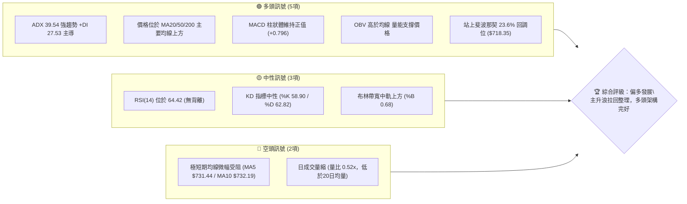
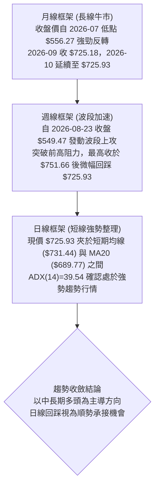
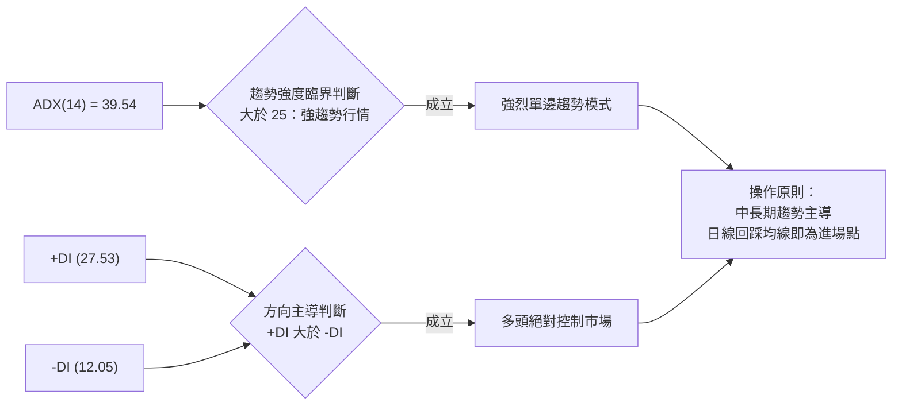
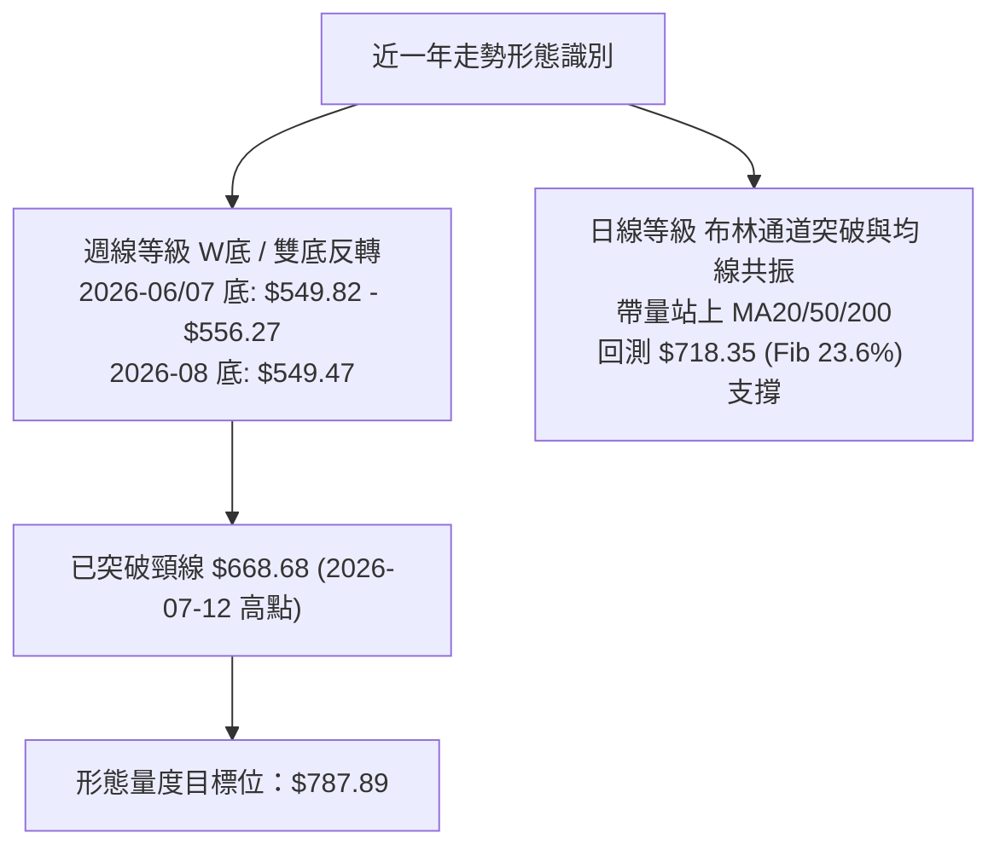
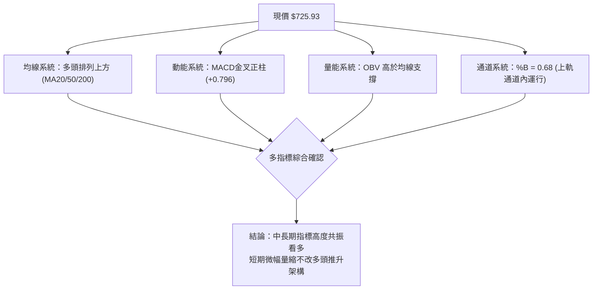
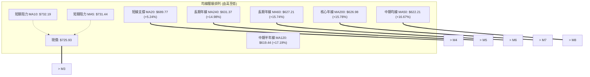
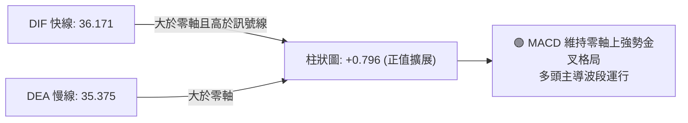
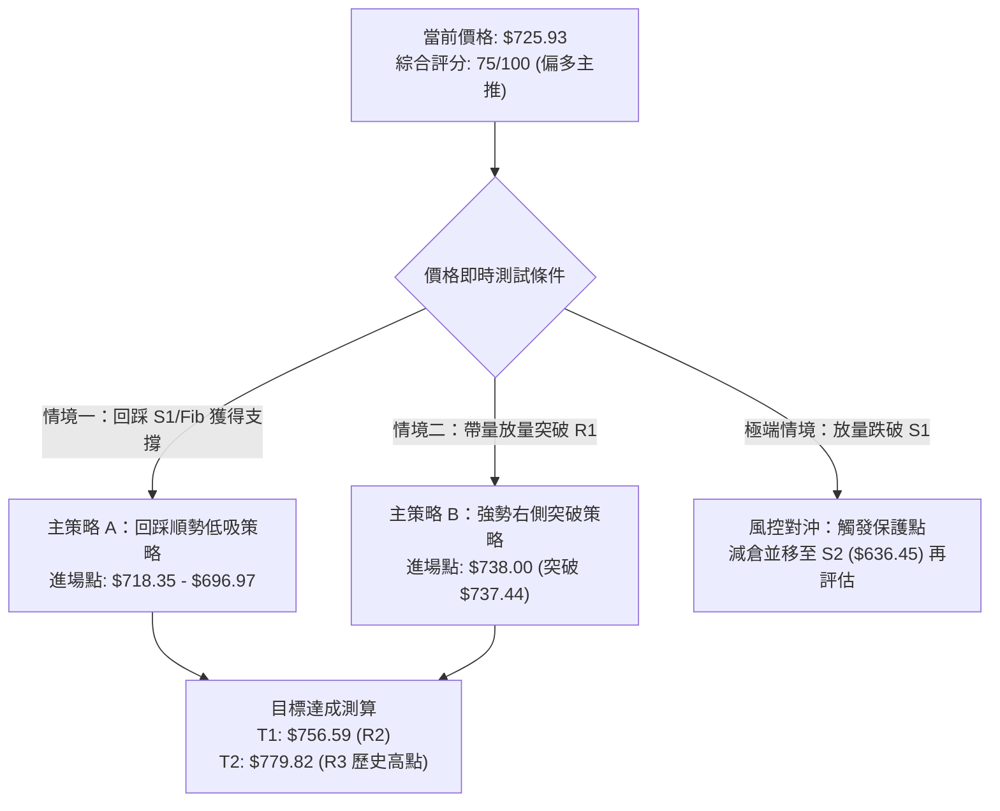
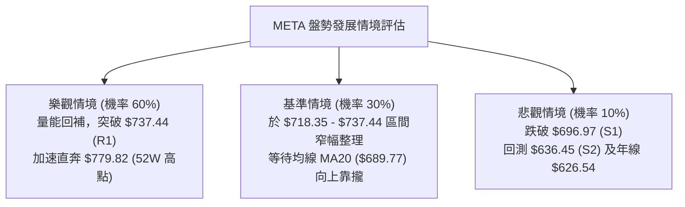

# META 技術分析報告

> **報告日期**：2026-10-02 ｜ **語言**：繁體中文 ｜ **數據來源**：Yahoo Finance ｜ **當前價格**：$725.93

---

## 目錄

| 章節 | 內容 |
|------|------|
| [1. 技術面概覽](#1-技術面概覽) | 訊號儀表板、核心指標、評分卡 |
| [2. 趨勢分析](#2-趨勢分析) | 多時框趨勢、長中短期走勢、12個月走勢圖 |
| [3. 圖表形態分析](#3-圖表形態分析) | 形態識別、K線組合、形態目標價 |
| [4. 支撐與阻力](#4-支撐與阻力) | 關鍵價位分布、阻力與支撐表、斐波那契回調 |
| [5. 技術指標深度解讀](#5-技術指標深度解讀) | 均線系統、RSI、MACD、布林通道、量價OBV |
| [6. 動能與波動率](#6-動能與波動率) | 動能四象限、ATR波動分析、Beta相關性 |
| [7. 多時框架總結](#7-多時框架總結) | 時框架評分矩陣、收斂原則與結論 |
| [8. 交易策略建議](#8-交易策略建議) | 策略路由、階梯情境、主策略操作表、風險對沖 |
| [9. 風險提示與監控](#9-風險提示與監控) | 監控清單、情境分析、倉位管理建議 |

---

## 1. 技術面概覽

### 🎯 技術訊號儀表板



---

### 📊 核心指標速覽表

| 指標類別 | 指標名稱 | 當前數值 | 訊號 | 解讀 |
|:---|:---|:---|:---:|:---|
| **現價基準** | 當前收盤價 | **$725.93** | 🟢 | 位於52週區間 79.3% 高位，脫離底部強勁回升 |
| **短期均線** | MA20 | $689.77 | 🟢 | 現價高於 MA20 達 +5.24%，短線支撐強固 |
| **中期均線** | MA50 | $622.21 | 🟢 | 現價高於 MA50 達 +16.67%，中期多頭排列確立 |
| **長期均線** | MA200 | $626.98 | 🟢 | 現價大幅高於年線 +15.78%，長線牛市架構無虞 |
| **超短期阻力**| MA5 / MA10 | $731.44 / $732.19 | 🔴 | 現價略低於 5日(-0.75%)與10日線(-0.86%)，短線消化浮額 |
| **擺盪動能** | RSI(14) | 64.42 | 🟡 | 位於強勢健康擴張區（50-70），未觸及超買警戒 |
| **趨勢動能** | MACD (12,26,9) | DIF: 36.171 / MACD: 35.375 | 🟢 | 雙線位於零軸之上，紅柱 +0.796 維持正向多頭擴展 |
| **趨勢強度** | ADX(14) / ±DI | 39.54 (+DI: 27.53, -DI: 12.05) | 🟢 | ADX 顯著大於 25，多方動能佔據絕對主導地位 |
| **通道位置** | Bollinger Bands | 帶寬區間 $587.38 - $792.15 | 🟢 | %B 為 0.68，運行於中軌（$689.77）與上軌間之多頭通道 |
| **波動幅度** | ATR(14) | $29.26 (4.03%) | 🟡 | 單日波動近 30 美元，短線操作需預留足夠止損緩衝 |
| **成交量能** | 當日量 / 20日均量 | 12.38M / 24.00M (量比 0.52) | 🔴 | 高檔震盪量縮，需補量方能有效攻克 $737.44 (R1) |
| **能量潮** | OBV | OBV > OBV_MA | 🟢 | 資金長線淨流入，量能結構有效支撐波段走勢 |

---

### 🏆 技術評分卡

```
╔══════════════════════════════════════════════════════════════════╗
║                   技術評分卡 — META (2026-10-02)                 ║
╠══════════════════════════════════════════════════════════════════╣
║ 趨勢強度 (ADX/均線)   ████████████████░░░░  82/100  🟢 強勢多頭   ║
║ 動能指標 (RSI/MACD)   ██████████████░░░░░░  74/100  🟢 偏多擴張   ║
║ 支撐穩定度 (S1/S2/Fib) ████████████████░░░░  80/100  🟢 底部扎實   ║
║ 成交量配合 (Volume/OBV)████████████░░░░░░░░  62/100  🟡 高檔量縮   ║
║ 形態完整度 (波段突破)   ██████████████░░░░░░  75/100  🟢 突破鞏固   ║
║ 均線排列 (短中長期均線) ██████████████░░░░░░  72/100  🟢 順向看多   ║
╠══════════════════════════════════════════════════════════════════╣
║ 綜合技術評分           ███████████████░░░░░  75/100  🟢 偏多主推   ║
╚══════════════════════════════════════════════════════════════════╝
```

---

## 2. 趨勢分析

### 🌐 多時框趨勢分析



---

### 📈 長期趨勢 — 過去12個月走勢圖（ASCII）

以下為 META 過去 12 個月（2025-11 至 2026-10）之月線收盤價走勢示意圖。

```
META 月線走勢圖（過去12個月收盤價走勢）
價格 ($)
$750 ┤                                                 ● (2026-09: $725.18)
     │                                                 ● (2026-10: $725.93)
$700 ┤                   ● (2026-01: $714.66)
     │
$650 ┤ ● (2025-11: $645.76)     ● (2026-02: $646.52)
     │       ● (2025-12: $658.40)      ● (2026-05: $631.43)
$600 ┤                               ● (2026-04: $610.86)
     │                         ● (2026-03: $571.15)  ● (2026-08: $571.89)
$550 ┤                                           ● (2026-06: $562.85)
     │                                           ● (2026-07: $556.27 低點)
     └─┬──────┬──────┬──────┬──────┬──────┬──────┬──────┬──────┬──────┬──────┬──────┬───
     11/25  12/25  01/26  02/26  03/26  04/26  05/26  06/26  07/26  08/26  09/26 10/26
```

#### 走勢特徵分析表格

| 階段 | 時間區間 | 起訖收盤價 | 漲跌幅 | 走勢特徵解讀 |
|:---|:---:|:---:|:---:|:---|
| **第一階段：高檔震盪** | 2025-11 至 2026-01 | $645.76 → $714.66 | +10.67% | 歲末年初多頭回補，一度摸高至 $714.66，展現防守韌性。 |
| **第二階段：中期回撤** | 2026-01 至 2026-03 | $714.66 → $571.15 | -20.08% | 快速回吐漲幅，測試 $570 水平支撐，市場情緒轉向防禦。 |
| **第三階段：築底震盪** | 2026-04 至 2026-08 | $610.86 → $571.89 | -6.38% | 於 $556.27（2026-07）見波段底，週線兩度下探 $549 獲強力支撐。 |
| **第四階段：主升推升** | 2026-08 至 2026-10 | $571.89 → $725.93 | **+26.93%**| 爆發性單邊反彈，2026-09 大漲 +26.80%，現價持穩於 $725.93。 |

---

### 📊 中期趨勢（週線分析）

從近 20 週收盤走勢觀察，META 在 2026-08-02 週收盤觸及 $556.27（RSI 跌至 22.9 極度超賣）及 2026-08-23 週收盤觸及 $549.47 後，完成「雙重築底」結構。
隨後在 2026-09 月展開連續 5 週的大幅揚升，週成交量由 8,100 萬股擴大至 2026-09-27 週的 1.68 億股，帶動收盤推升至 $751.66。本週收盤小幅回踩至 $725.93，屬於健康之波段回踩確認。

```
週線等級近期關鍵價位示意圖：
$779.82 ──────────────────────────────── 52週歷史高點 (波段頂部目標 R3)
$751.66 ──────────────────────────────── 2026-09-27 週收盤阻力 (突破點)
$737.44 ──────────────────────────────── 波段高點聚類阻力 (R1)
$725.93 ◀────── 現價收盤位置 (處於斐波那契 23.6% $718.35 之上)
$696.97 ──────────────────────────────── 近期第一波段回調支撐 (S1)
$649.59 ──────────────────────────────── 斐波那契 50.0% 中樞平衡位
$626.54 ──────────────────────────────── 波段密集支撐底限 (S3 / MA200: $626.98)
```

---

### ⚡ 趨勢強度評估（ADX 解讀）



#### ADX 強度對照與市場狀態分析

| 指標名稱 | 實際數值 | 門檻區間 | 市場狀態解讀 |
|:---|:---:|:---:|:---|
| **ADX (14)** | **39.54** | > 25 (強趨勢) | 數值逼近 40，顯示市場處於極具方向性的單邊趨勢，絕非無方向之牛皮盤整。 |
| **+DI (正向動向)** | **27.53** | 基準線 > 20 | 買方推升力道強盛，主導近期價格運行軌跡。 |
| **-DI (負向動向)** | **12.05** | 低於 15 弱勢區 | 空方拋壓疲弱，空頭打壓動能已被化解。 |
| **DI 差值 (+DI - -DI)**| **+15.48**| 顯著正向淨值 | 多空力量對比懸殊，回調幅度有限，做空風險極高。 |

---

## 3. 圖表形態分析

### 🔍 形態識別系統



#### 形態識別與信心度評估表

| 形態類別 | 信心度 | 判斷依據（引用數據） | 完成度 | 形態目標價與計算式 |
|:---|:---:|:---|:---:|:---|
| **週線雙底 (W-Bottom)** | **85%** | 兩次低點分別為 2026-07-05 當週低位與 2026-08-23 週收盤 **$549.47**，頸線為 2026-07-12 週收盤 **$668.68**，價差對稱且獲放量確認。 | 100% (已突破) | **$787.89**<br>計算式：頸線 $668.68 + ($668.68 - $549.47) = $787.89（接近 52W 高點 $779.82） |
| **高檔強勢旗形 (Bull Flag)** | **70%** | 2026-09-27 週爆出 168.3M 巨量衝至 **$751.66** 後，本週量縮（83.2M）收在 **$725.93**，呈現典型旗面整理。 | 60% (整理中) | **$779.82 (R3)**<br>計算式：旗桿起點 $665.23 至 $751.66，突破旗面後預期測量至 52週高點 $779.82 |
| **布林通道上軌突破回踩** | **90%** | 現價 **$725.93** 突破中軌 **$689.77** 後向擴張之上軌（$792.15）邁進，目前於 %B=0.68 進行回抽確認。 | 85% (回踩中) | **$756.59 (R2) / $779.82 (R3)**<br>依布林通道上軌導引推算目標 |

---

### 🕯️ 重要K線形態分析（近 5 個月關鍵收盤）

| 月份 | 收盤價 | K線形態 | 解讀 | 訊號 |
|:---|:---:|:---|:---|:---:|
| **2026-06** | $562.85 | 長下影陰線 | 空頭下殺但逢低買盤湧現，測試年線下方買盤承接力。 | 🟡 止跌訊號 |
| **2026-07** | $556.27 | 縮量十字星變盤線 | 創下 52 週次低收盤價，賣壓耗竭，空方動能歸零。 | 🟢 築底轉折 |
| **2026-08** | $571.89 | 帶量築底陽線 | 底部確認，月線級別收復 $570，KD 與 RSI 自低檔勾頭。 | 🟢 右側啟動 |
| **2026-09** | $725.18 | 光頭長紅大陽線 | 單月飆漲 +26.80%，一舉吞噬前 4 個月整理區間，主升浪展開。 | 🟢 強烈看多 |
| **2026-10** | $725.93 | 高檔十字星整理 | 續創新高後受阻於 $737.44 (R1)，進行高檔洗盤蓄勢。 | 🟡 多頭換手 |

---

### 📉 ASCII 走勢形態示意圖：週線雙底與旗形突破

```
                    [旗形整理中] 
                         $751.66
                           /\  $737.44 (R1)
                          /  \   /
                         /    \● $725.93 (現價)
                        /      \
      [頸線]           /        [旗面支撐 $718.35 Fib 23.6%]
      $668.68 ───────/─
                    /
                   /
                  /
       \         /
        \       /
  $556.27\     / $549.47
   (底1)  \___/   (底2)
   2026-07-26    2026-08-23
```

---

## 4. 支撐與阻力

### 🗺️ 關鍵價位分布圖（ASCII）

```
META 價位結構分布圖（嚴格依據 OHLCV 聚類與斐波那契計算）
═════════════════════════════════════════════════════════════════════════
$792.15 ║████████████████████████████████████║ 布林帶上軌
$779.82 ║████████████████████████████████    ║ 強阻力 R3 (52W歷史高點 / Fib 0.0%)
$756.59 ║████████████████████████            ║ 次要阻力 R2 (近一年波段高點)
$737.44 ║████████████████                    ║ 短線關鍵阻力 R1 (波段密集高點)
$725.93 ╠════════════════════════════════════╣ ◄ 當前市價 ($725.93)
$718.35 ║▓▓▓▓▓▓▓▓▓▓▓▓▓▓▓▓▓▓▓▓▓▓▓▓▓▓▓▓        ║ 關鍵樞紐 (Fib 23.6% 回調支撐)
$696.97 ║▓▓▓▓▓▓▓▓▓▓▓▓▓▓▓▓▓▓▓▓                ║ 近期第一波段低點支撐 S1
$689.77 ║▓▓▓▓▓▓▓▓▓▓▓▓▓▓▓▓                    ║ 短期生命線 (MA20 / 布林中軌)
$636.45 ║████████████████████████            ║ 強支撐 S2 (波段密集低點聚類)
$626.54 ║████████████████████████████████    ║ 核心多空底限 S3 (密集低點 / MA200: $626.98)
═════════════════════════════════════════════════════════════════════════
```

---

### 🚧 阻力位分析表

| 阻力級別 | 精確價位 | 距現價幅度 | 形成原因與技術意涵 | 突破難度 | 重要性評級 |
|:---|:---:|:---:|:---|:---:|:---:|
| **R1 (短線阻力)** | **$737.44** | +1.59% | 近期日線與波段高點聚類區，同時與短期均線 MA5 ($731.44)、MA10 ($732.19) 形成共振壓制。 | 中等 (需補量) | 🟢 短線分水嶺 |
| **R2 (波段阻力)** | **$756.59** | +4.22% | 2026-09-27 週衝高之實體 K 線上緣阻力區，為突破前波歷史高點前之最後防線。 | 較高 | 🟡 中期強壓 |
| **R3 (強阻力)**   | **$779.82** | +7.42% | **52 週最高價紀錄**（Fib 0.0%），歷史籌碼套牢與獲利了結重壓區。 | 極高 | 🔴 戰略級天花板 |

---

### 🛡️ 支撐位分析表

| 支撐級別 | 精確價位 | 距現價幅度 | 形成原因與技術意涵 | 守住機率 | 重要性評級 |
|:---|:---:|:---:|:---|:---:|:---:|
| **S1 (短線支撐)** | **$696.97** | -3.99% | 近一年波段低點聚類，緊鄰 MA20 均線（$689.77）與 Fib 38.2%（$680.33），為多頭強支撐。 | 85% | 🟢 短線防禦點 |
| **S2 (中期支撐)** | **$636.45** | -12.33% | 近期波段密集成交低點聚類，與 MA240 ($631.37) 及 MA50 ($622.21) 構成中長期密集買盤帶。 | 95% | 🟡 波段生命線 |
| **S3 (核心強支撐)**| **$626.54** | -13.69% | 年線 MA200 ($626.98) 所在位置，多頭長期趨勢最後防線，跌破則牛市架構破壞。 | 98% | 🔴 戰略停損點 |

---

### 📐 斐波那契回調位分析（基準區間：$519.37 → $779.82）

```
100.0% ($519.37) ────── 52週低點
 78.6% ($575.11) ────── 2026-08 築底支撐區
 61.8% ($618.86) ────── 黃金分割回調位 (貼近 MA120: $619.44)
 50.0% ($649.59) ────── 多空中樞平衡位
 38.2% ($680.33) ────── 強勢回調防守位
 23.6% ($718.35) ────── 當前即時防守支撐 ◄── [現價 $725.93 運行於此區間]
  0.0% ($779.82) ────── 52週歷史高點
```

- **當前位置解讀**：現價 **$725.93** 正處於 **23.6% ($718.35)** 與 **0.0% ($779.82)** 之間的「極強勢多頭衝刺區」。
- **技術意義**：多頭在大幅拉升後，回踩未曾跌破 23.6% 回調位（$718.35），顯示買盤承接極為堅決，為典型之強勢整理格局；只要守穩 $718.35，後市隨時具備再創新高之能力。

---

## 5. 技術指標深度解讀

### 🎛️ 指標訊號總覽



---

### 📈 移動平均線排列分析



- **均線排列狀態評定**：**大週期多頭排列，超短期震盪修復**。
- **解讀**：現價遠高於中長期均線（MA50: $622.21、MA200: $626.98），正乖離分別達 +16.67% 與 +15.78%，代表大趨勢處於穩定多頭。短期因漲速過快，現價略低於 5 日線（$731.44）與 10 日線（$732.19），屬於上升途中的正乖離修正，下方的 MA20（$689.77）斜率陡峭向上，將提供強大的動態推升力道。

---

### 📉 RSI(14) 震盪動能與背離判斷

- **當前數值**：**64.42**
- **區間進度條**：
  ```
  超賣 [0] ░░░░░░░░░░ [30] ▓▓▓▓▓▓▓▓▓▓ [50] ▓▓▓▓▓▓█░░░ [70] ░░░░░░░░░░ [100] 超買
                                           ▲ (64.42 強勢區)
  ```
- **超買超賣分析**：RSI 處於 50-70 的強勢擴張區間，既未跌破 50 多空分水嶺，亦未進入 >70 的過熱警戒區，屬於最健康的多頭持股與加碼區間。
- **背離分析判斷**：
  - **日線 RSI**：自前波高點回落過程中，RSI 平滑下行至 64.42，與現價高檔震盪相符，**無頂背離現象**。
  - **週線 RSI**：從 2026-08-02 的 22.9 極度超賣一路揚升至 2026-09-13 的 83.9，隨後於 $751.66 處保持 76.6，目前為 64.4，屬於典型超買後的正常回吐，**無底背離亦無頂背離**。
  - **結論**：指標真實反映價格推升動能，無動能衰竭信號。

---

### 📊 MACD (12, 26, 9) 訊號解讀



- **數值狀態**：DIF 快線 (36.171) 高於 DEA 慢線 (35.375)，差值為正，柱狀圖為 **+0.796**。
- **深層解讀**：雙線長期位於遠高於零軸之正值區，展現長線主升浪特徵。雖然本週柱狀圖自高點微幅收斂（由先前週線 +11.729 降至日線 +0.796），代表短線爆發力稍歇、進入換手整理，但並未出現死叉訊號，多方格局極度穩固。

---

### 📦 布林通道 (Bollinger Bands) 分析

```
布林通道結構示意圖 (參數: 20, 2)
$792.15 ────────────────────────────────────── 上軌 Upper Band (波段向上開口)
            *    *    *
$725.93 ───────●────────────────────────────── 現價 (%B = 0.68，強勢多頭區)
$689.77 ────────────────────────────────────── 中軌 Middle Band (MA20 基準線)
$587.38 ────────────────────────────────────── 下軌 Lower Band
```

- **通道指標解讀**：
  - **上軌**：$792.15
  - **中軌 (MA20)**：$689.77
  - **下軌**：$587.38
  - **帶寬與 %B**：%B 為 **0.68**，通道整體開口向上發散。現價穩居中軌上方、向著上軌延伸，未觸及上軌超買邊界，呈現標準的「沿上軌震盪推升」多頭走勢。

---

### 💹 成交量分析（量價配合度與 OBV）

| 項目 | 數值 | 技術解讀 |
|:---|:---:|:---|
| **最新成交量** | 12,384,700 股 | 相較於 20 日均量明顯收縮，量比僅 **0.52x**。 |
| **20日均量** | 24,003,340 股 | 基準量能水準。 |
| **50日均量** | 19,708,780 股 | 中期沉澱量能水準。 |
| **OBV 能量潮** | **OBV > OBV_MA** | 能量潮線持續運行於均線上方，表明長線機構大資金處於鎖倉狀態。 |

- **量價關係深度研判**：
  - **強勢整理量縮**：現價在 $725.93 進行高檔整理時成交量縮減（0.52x），符合技術分析中「漲時放量、跌時量縮」的健康特徵，顯示市場惜售心態濃厚，並非主力出貨引發之放量下殺。
  - **突破先決條件**：若要一舉攻破波段阻力 R1 ($737.44) 及 R2 ($756.59)，單日成交量必須回升放大至 2,000 萬股以上（接近 20日均量水準），方能確認新一輪攻擊發動。

---

## 6. 動能與波動率

### ⚡ 動能評估四象限

```
動能與波動率定位：
        高動能 (ADX > 25, MACD > 0)
                 │
       Q3 (高波/強動能) │   ★ Q1 (低波/強動能) ◄── [META 當前定位]
       高風險高回報     │   最佳趨勢順勢機會
─────────────────┼─────────────────
       Q4 (高波/弱動能) │   Q2 (低波/弱動能)
       震盪下殺風險區   │   觀望打底區間
                 │
        低動能 (ADX < 25, MACD < 0)
   (高波動: ATR% > 5%) ─── (低波動: ATR% ≤ 4%)
```

| 象限 | 動能維度 | 波動維度 | META 狀態 | 戰略評估 |
|:---:|:---:|:---:|:---:|:---|
| **Q1** | **強** (ADX 39.54) | **低至中** (ATR 4.03%) | **✓ 完全吻合** | **最佳波段順勢機會**。趨勢方向高度確定，波動率未失控暴衝，適合波段持股與回調加碼。 |
| **Q2** | 弱 | 低 | - | 不符。 |
| **Q3** | 強 | 高 | - | 不符。 |
| **Q4** | 弱 | 高 | - | 不符。 |

---

### 📊 ATR 波動率分析與止損測算

- **ATR(14) 數值**：**$29.26**
- **ATR 佔比**：佔當前市價之 **4.03%**
- **操作涵義**：META 屬於中大型高貝塔科技龍頭，每日平均波動區間接近 30 美元。
- **止損安全距離建議**：
  - **日間高頻/短線**：建議採用 1.0 倍 ATR = **$29.26** 緩衝區間。
  - **波段順勢交易**：建議採用 1.5 倍 ATR 至 2.0 倍 ATR（**$43.89 ～ $58.52**）之保護距離，避免被盤中假跌破洗出場外。現價 $725.93 減去 1.5 倍 ATR 為 **$682.04**，恰好契合 Fib 38.2% ($680.33) 與 MA20 ($689.77) 的核心支撐帶。

---

### 📐 Beta 與市場相關性

- **Beta 數值**：**1.243**
- **市場特徵分析**：
  - META 的波動幅度高於大盤標普 500 指數約 24.3%，具有顯著的彈性與攻擊性。
  - 在整體市場處於風險偏好（Risk-On）或科技股反彈行情中，META 通常能創造高於大盤之 Alpha 超額收益；反之，若大盤面臨流動性衝擊，其回調回撤亦會略高於指數平均。

---

## 7. 多時框架總結

### 📋 時框架評分表

| 時框架 | 趨勢方向 | 動能狀態 | 均線排列 | 圖表形態 | 綜合評分 | 戰略建議 |
|:---:|:---:|:---:|:---:|:---:|:---:|:---|
| **月線 (長期)** | 🟢 強烈看多 | 🟢 MACD 多頭擴展 | 🟢 站穩長線均線上方 | 雙底反轉向上突破 | **88 / 100** | 長線堅定做多，逢回檔不輕易交出籌碼 |
| **週線 (中期)** | 🟢 穩固多頭 | 🟢 週 MACD 保持金叉 | 🟢 週均線向上發散 | 旗形整理突破蓄勢 | **80 / 100** | 波段順勢做多，以 MA20/S1 為多頭防線 |
| **日線 (短期)** | 🟡 震盪整理 | 🟡 日量縮修復正乖離 | 🔴 暫受壓於 MA5/10 | 高檔矩形旗面震盪 | **65 / 100** | 不盲目追高，等待拉回關鍵支撐點分批低吸 |

---

### 🔲 綜合訊號矩陣

```
訊號一致性收斂矩陣：
┌──────────────┬──────────────┬──────────────┬──────────────┐
│  時框維度    │   趨勢指標   │   動能指標   │   量能支撐   │
├──────────────┼──────────────┼──────────────┼──────────────┤
│  長期 (月線) │   🟢 強多    │   🟢 強多    │   🟢 充足    │
│  中期 (週線) │   🟢 強多    │   🟢 偏多    │   🟢 擴增    │
│  短期 (日線) │   🟡 整理    │   🟡 中性    │   🔴 量縮    │
└──────────────┴──────────────┴──────────────┴──────────────┘
```

---

### ⚖️ 多時框收斂結論

依據多時框收斂規則第 14 條嚴格收斂：
1. **行情屬性判定**：當前 **ADX(14) = 39.54 遠大於 25**，市場處於標準且強烈的**趨勢行情**，絕非低動能盤整。
2. **主導時框確立**：在趨勢行情下，中長期趨勢（週線與 MA50、MA200）具備絕對主導權，日線的量縮或短均受阻僅作為「尋找優質進場點」之工具，不可違背中長線順向架構。
3. **唯一收斂結論**：**【全面偏多主推】**。任何日線級別朝向 $718.35（Fib 23.6%）至 $696.97（S1）的回踩，均判定為波段順勢低吸機會，嚴禁逆勢做空。

---

## 8. 交易策略建議

### 🗺️ 策略決策流程圖



---

### 🧭 策略路由（依評分卡分流）

> **當前主策略方向 = 【積極偏多操作】（技術綜合評分：75 / 100，高於 60 分偏多門檻）**
> 
> 空頭策略僅作為多頭持倉之風控對沖與反轉觸發防禦線，本報告全力主推順勢多頭進場佈局。

---

### 🎯 價格情境階梯 (Price Scenarios)

所有價位均嚴格引用第 4 章計算之波段聚類高低點與斐波那契點位：

| 觸發條件 | 當前狀態 | 第一目標 (T1) | 後續延伸 (T2) | 戰略情境含義 |
|:---|:---:|:---:|:---:|:---|
| **放量突破 R1 ($737.44)** | 待觸發 | **R2: $756.59** | **R3: $779.82** | 短線完成旗形洗盤，重啟主升浪挑戰 52 週高點。 |
| **持穩現價區間 ($718 - $725)**| **進行中** | **R1: $737.44** | **R2: $756.59** | 消化短期均線乖離，以時間換取空間之強勢換手。 |
| **跌破 S1 ($696.97)** | 警戒線 | **S2: $636.45** | **S3: $626.54** | 短期多頭推升力竭，深度回踩年線支撐區（MA200）。 |

---

### 📊 情境機率分佈

| 情境類別 | 機率預估 | 主要依據與技術支撐 |
|:---|:---:|:---|
| **情境一：強勢上行挑戰新高** | **60%** | ADX 高達 39.54 確立趨勢未完；MACD 維持零軸上紅柱；OBV 長期走多印證法人資金鎖倉。 |
| **情境二：區間震盪蓄勢換手** | **30%** | 日成交量縮（量比 0.52x），MA5/10 帶來短期微壓，布林通道寬度需時間收斂整合。 |
| **情境三：深度拉回探測年線** | **10%** | 除非突發系統性流動性風險，否則在週雙底反轉完成後，直接跌破 S1/MA20 機率極低。 |

---

### 🟢 主策略詳情

```
主策略 A (回調買入) 與 主策略 B (突破追擊) 具體執行參數表
```

| 策略要素 | 策略 A（穩健型：回踩支撐分批佈局） | 策略 B（激進型：突破關鍵阻力右側追擊） |
|:---|:---:|:---:|
| **策略邏輯** | 回測斐波那契 23.6% 與 S1 密集成交區企穩吸籌 | 放量攻克 R1 密集阻力區，確認旗面整理結束 |
| **進場價格** | **$718.35**（分批區間：$718.35 ～ $700.00） | **$738.00**（確認有效站上 R1: $737.44） |
| **目標價 T1** | **$756.59**（R2 波段阻力位，預期報酬 +5.32%） | **$756.59**（R2 波段阻力位，預期報酬 +2.52%） |
| **目標價 T2** | **$779.82**（R3 52週高點，預期報酬 +8.56%） | **$779.82**（R3 52週高點，預期報酬 +5.67%） |
| **止損價格** | **$689.00**（微幅跌破 MA20: $689.77 與 S1: $696.97） | **$718.00**（跌破 Fib 23.6%: $718.35 短線樞紐） |
| **止損空間** | -$29.35 (-4.08%，約 1.0 倍 ATR) | -$20.00 (-2.71%，約 0.68 倍 ATR) |
| **風險報酬比** | **1 : 2.10** (以 T2 測算) | **1 : 2.09** (以 T2 測算) |
| **預估勝率** | **70%** | **65%** |
| **建議倉位** | **總資金之 15% - 20%** | **總資金之 10% - 15%** |

---

### 🔴 反向風險觸發點（對沖防禦提示）

若市場出現超預期利空，以下條件成立時，必須果斷停損多單並執行對沖：
- **關鍵反轉觸發價位**：收盤價**實體跌破 $696.97 (S1)** 且無法於次日收回。
- **指標反轉訊號**：日線 MACD 出現零軸上死叉、且 ADX 跌破 25（趨勢熄火）。
- **對沖應對處置**：將多頭部位減半，並在 S1 破位後，將剩餘防守點設置於 **$636.45 (S2)**；若進一步失守年線 **$626.54 (S3)**，所有多單全部離場觀望。

---

### ⭐ 整體訊號強度評星

```
╔══════════════════════════════════════════════════════════════════╗
║ 做多訊號強度：★★★★☆  (4.2 / 5.0 星) — 趨勢明確、形態扎實       ║
║ 做空訊號強度：★☆☆☆☆  (1.0 / 5.0 星) — 逆勢交易、勝率極低       ║
║ 整體可信度：  ★★★★☆  (4.5 / 5.0 星) — 多指標高度共振確認     ║
╚══════════════════════════════════════════════════════════════════╝
```

---

## 9. 風險提示與監控

### ✅ 關鍵監控指標 Checklist

```
╔══════════════════════════════════════════════════════════════════╗
║               技術面每日監控清單 (Daily Checklist)              ║
╠══════════════════════════════════════════════════════════════════╣
║ [ ] 價格是否守穩斐波那契 23.6% 關鍵水位 ($718.35)                ║
║ [ ] 日成交量是否回升至 20日均量 (24.0M) 以上，確認量能復甦       ║
║ [ ] 日線 RSI(14) 是否持續維持在 60 以上強勢水準                  ║
║ [ ] MACD 柱狀體是否維持正值擴張 (目前 +0.796)                   ║
║ [ ] 向上突破時是否收盤站穩 R1 阻力位 ($737.44)                   ║
║ [ ] 下方 MA20 ($689.77) 支撐是否隨時間穩定墊高                   ║
║ [ ] 大盤標普/那斯達克是否未破壞科技股 Risk-On 架構 (Beta 1.243)  ║
╚══════════════════════════════════════════════════════════════════╝
```

---

### ⚠️ 風險場景分析



---

### 🛡️ 風險管理與倉位控管建議

1. **單筆交易最大虧損限制**：嚴格落實單筆風險不超過投資組合總權益之 **1.5% - 2.0%**。以操作策略 A 為例，若進場價 $718.35，止損價 $689.00（每股風險 $29.35），則總資金 10 萬美元之帳戶，最大可承擔虧損為 $1,500 美元，對應之最大建倉股數約為 50 股。
2. **動態追蹤止盈機制**：當價格順利突破 $737.44 (R1) 並到達 $756.59 (T1/R2) 時，應立即將止損價上移至**損益兩平點 ($718.35)**，徹底鎖定無風險交易狀態；若推進至 $779.82 (T2/R3)，建議先行平倉 50% 倉位，剩餘倉位以 1.5 倍 ATR 進行動態移動止盈。
3. **重大總經事件風控**：若遇聯準會利率決策或 Meta 財報公布前夕，應將整體部位降至 10% 以下，規避跳空穿價引發的無效止損風險。

---

## 📋 報告總結

```
╔══════════════════════════════════════════════════════════════════╗
║                   META 技術分析報告總結                          ║
╠══════════════════════════════════════════════════════════════════╣
║ 報告日期：2026-10-02                                             ║
║ 當前價格：$725.93                                                ║
║ 綜合技術評分：75 / 100                                           ║
║ 分析評級：🟢 積極買入 / 偏多順勢推升 (Bullish Momentum)          ║
╠══════════════════════════════════════════════════════════════════╣
║ 關鍵結論：                                                       ║
║ ├─ 長期趨勢：🟢 強烈看多 (突破週線雙底頸線，目標 $787.89)        ║
║ ├─ 中期趨勢：🟢 偏多主導 (ADX 39.54 強勢趨勢，回踩即買點)       ║
║ ├─ 短期趨勢：🟡 縮量蓄勢 (受壓於 MA5/10，支撐穩固於 $718.35)    ║
║ ├─ 關鍵支撐：S1: $696.97 ｜ Fib 23.6%: $718.35 ｜ MA20: $689.77║
║ ├─ 關鍵阻力：R1: $737.44 ｜ R2: $756.59 ｜ R3: $779.82 (52W高) ║
║ └─ 華爾街共識：Strong Buy (58位分析師平均目標 $794.96)           ║
╠══════════════════════════════════════════════════════════════════╣
║ 最優策略組合：                                                   ║
║ 1. 🥇 最佳機會：策略 A (回踩 $718.35-$700 分批吸籌，博弈新高)    ║
║ 2. 🥈 次選機會：策略 B (帶量突破 $737.44 右側追進，停損 $718)   ║
║ 3. 🥉 保守選擇：等待股價回測 MA20 ($689.77) 築底收陽再行進場   ║
╚══════════════════════════════════════════════════════════════════╝
```

---

> ⚠️ **免責聲明**：本報告為依據標準技術分析模型與即時市場數據所生成之專業研判，所有支撐阻力、斐波那契回調位及圖表形態均基於既定演算法計算。報告內容**僅供專業投資研究與學術探討參考**，**絕不構成任何形式的要約、招攬或具體投資買賣建議**。金融市場瞬息萬變，投資人應獨立評估自身風險承受能力並自負盈虧。

---

*報告生成時間：2026-10-02 ｜ 數據來源：Yahoo Finance ｜ 分析框架：多時框技術分析模型*