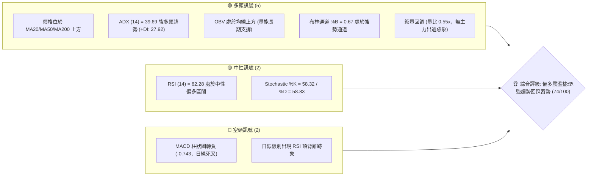
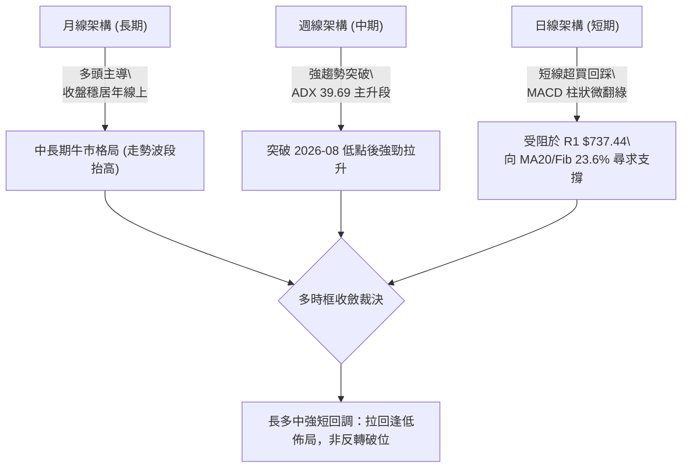
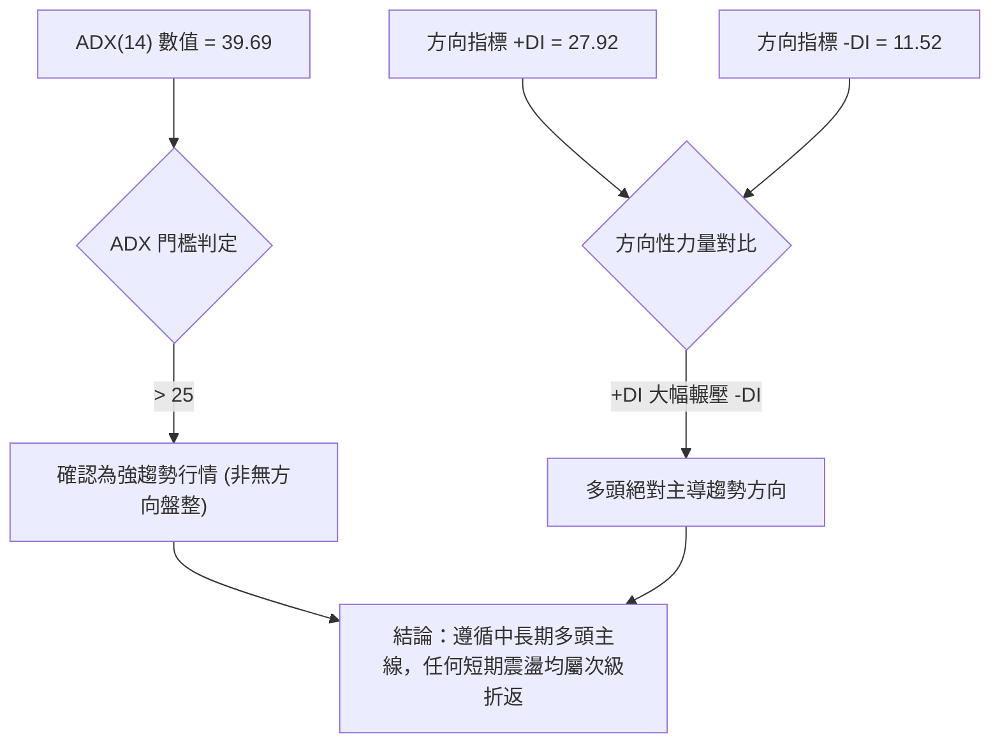
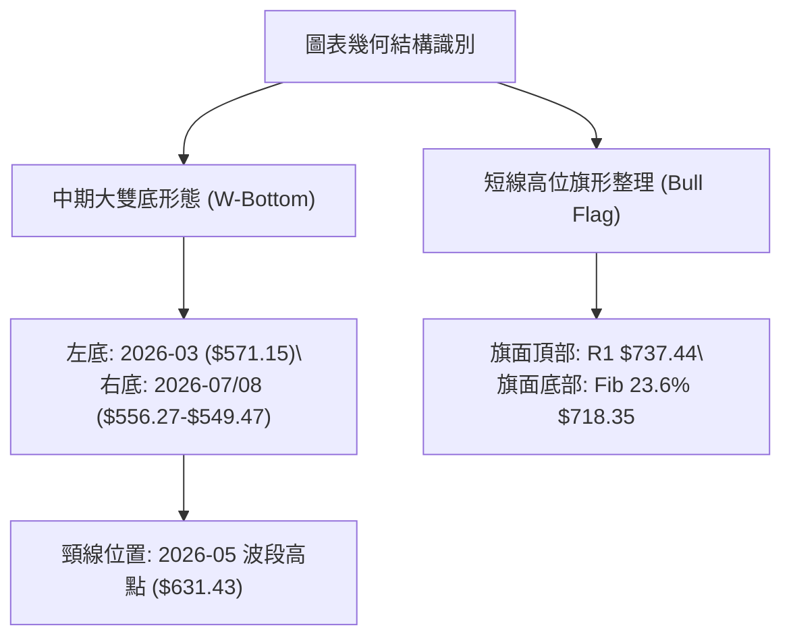
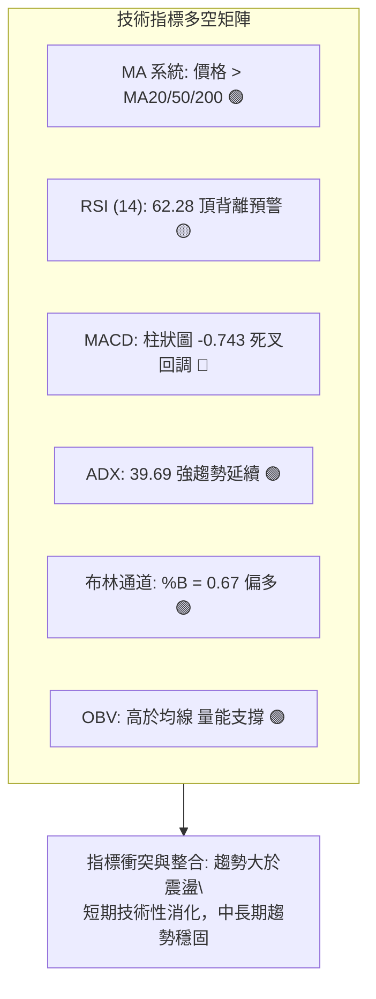
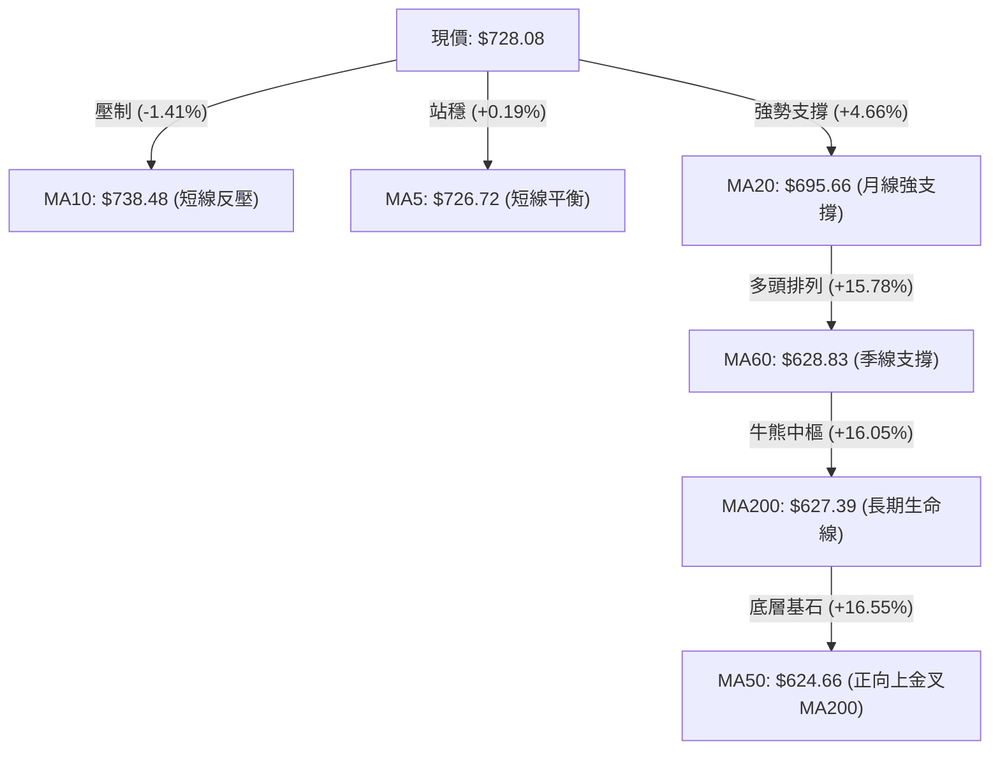
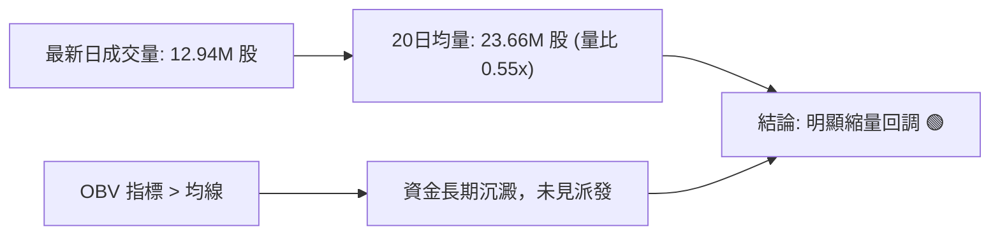
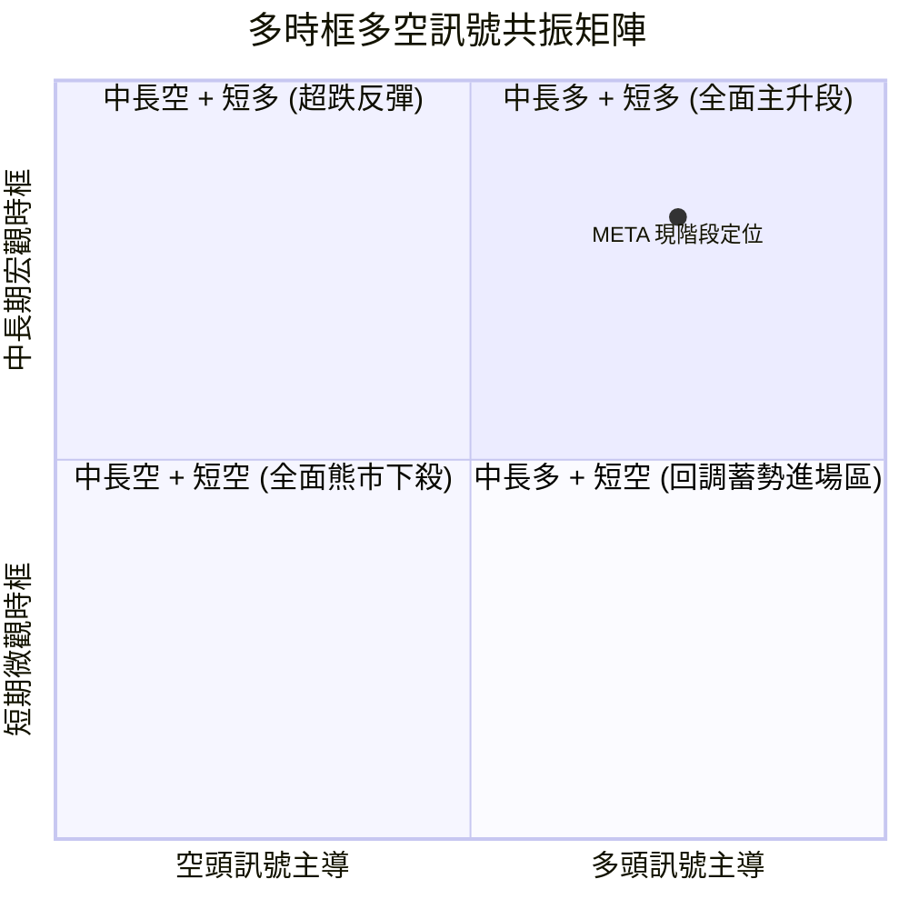
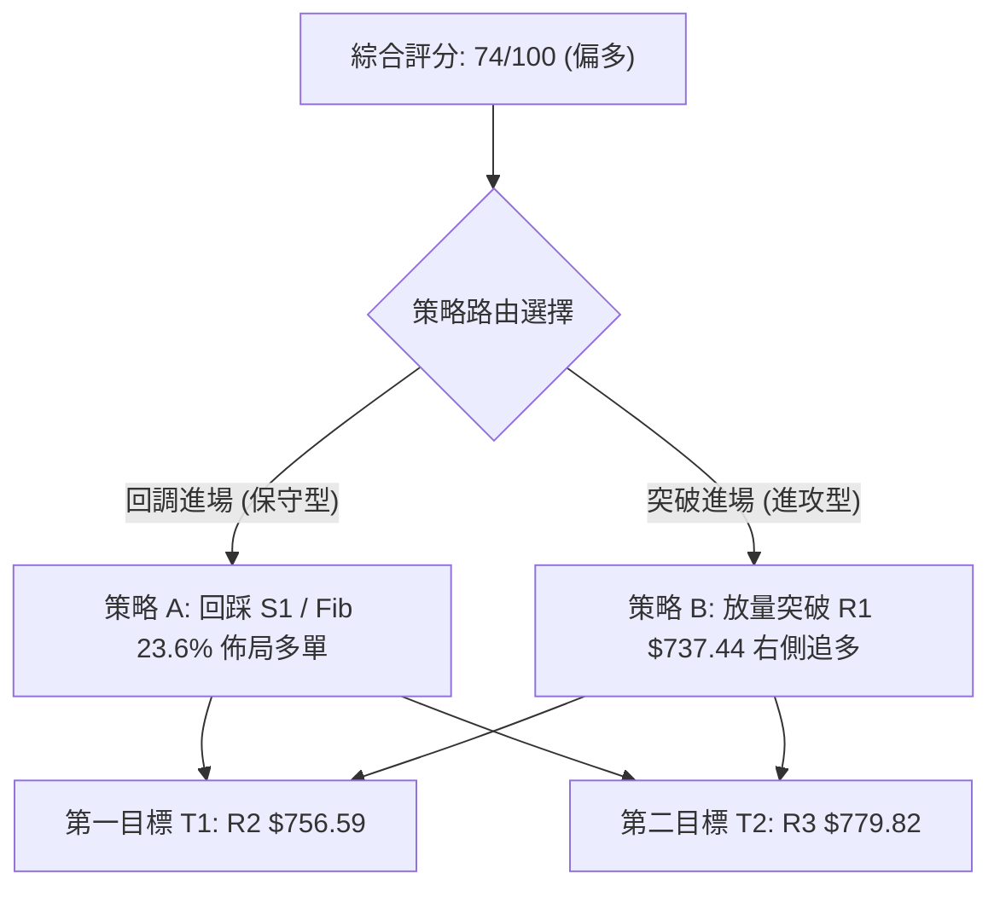
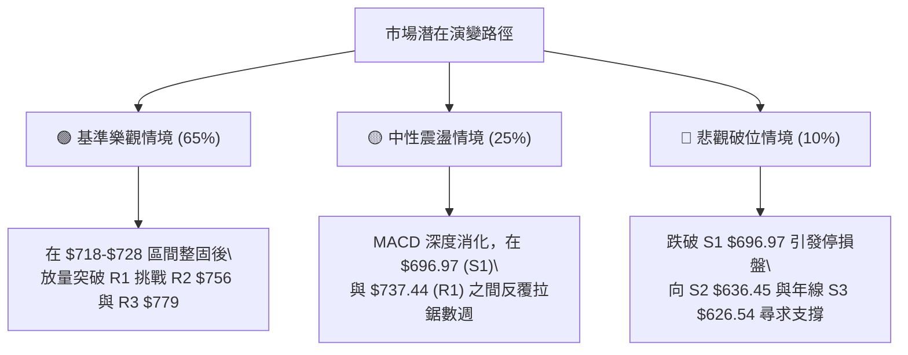

# META 技術分析報告

> **報告日期**：2026-10-03 ｜ **語言**：繁體中文 ｜ **數據來源**：Yahoo Finance ｜ **當前價格**：$728.08

---

## 目錄

| 章節 | 內容 |
|------|------|
| [1. 技術面概覽](#1-技術面概覽) | 訊號儀表板、核心指標、評分卡 |
| [2. 趨勢分析](#2-趨勢分析) | 多時框趨勢、長中短期走勢、ADX強度 |
| [3. 圖表形態分析](#3-圖表形態分析) | 形態識別、K線組合、目標價計算 |
| [4. 支撐與阻力](#4-支撐與阻力) | 關鍵價位、斐波那契回調結構 |
| [5. 技術指標深度解讀](#5-技術指標深度解讀) | MA/RSI/MACD/布林通道/成交量OBV |
| [6. 動能與波動率](#6-動能與波動率) | 動能四象限、ATR設定、Beta敏感度 |
| [7. 多時框架總結](#7-多時框架總結) | 時框架評分矩陣、多時框收斂結論 |
| [8. 交易策略建議](#8-交易策略建議) | 主策略詳解、價格階梯、風險報酬比 |
| [9. 風險提示與監控](#9-風險提示與監控) | 監控清單、情境分析、倉位管理 |
| [報告總結](#報告總結) | 核心結論與最佳機會彙整 |

---

## 1. 技術面概覽

### 🎯 技術訊號儀表板



### 📊 核心指標速覽表

| 指標類別 | 指標名稱 | 當前數值 | 訊號 | 解讀 |
|:---|:---|:---|:---:|:---|
| **價格** | 當前收盤價 | **$728.08** | 🟢 | 位於52週區間 80.1% 高位，整體多頭掌控 |
| **短期均線**| MA 20 | **$695.66** | 🟢 | 價格在均線上方 +4.66%，短期多頭防線穩固 |
| **中期均線**| MA 50 | **$624.66** | 🟢 | 價格在均線上方 +16.55%，中期多性格局明確 |
| **長期均線**| MA 200 | **$627.39** | 🟢 | 價格高於年線 +16.05%，牛市基底扎實 |
| **動能趨勢**| ADX (14) | **39.69** | 🟢 | 強趨勢格局（>25），+DI(27.92) 遠超 -DI(11.52) |
| **震盪指標**| RSI (14) | **62.28** | 🟡 | 位於強勢整理區間，伴隨高位微幅背離 |
| **趨勢追蹤**| MACD 柱 | **-0.743** | 🔴 | 快慢線高位死叉微幅翻綠，短線動能暫時休整 |
| **波動範圍**| ATR (14) | **$28.91** | 🟡 | 日波動率 3.97%，處於正常健康波動水平 |
| **量能指標**| OBV / 成交量| **12,944,900** | 🟢 | 量比 0.55x 縮量回踩，OBV 保持多頭排列 |

### 🏆 技術評分卡

```
╔══════════════════════════════════════════════════════════════╗
║              META 技術評分卡 (2026-10-03)                    ║
╠══════════════════════════════════════════════════════════════╣
║ 趨勢強度 (Trend)     █████████████████░░░   85/100  🟢 強多  ║
║ 動能狀態 (Momentum)  ███████████░░░░░░░░░   58/100  🟡 中性  ║
║ 支撐穩定度 (Support) ████████████████░░░░   80/100  🟢 穩固  ║
║ 成交量配合 (Volume)  ██████████████░░░░░░   70/100  🟢 健康  ║
║ 形態完整度 (Pattern) ███████████████░░░░░   75/100  🟢 偏多  ║
║ 均線排列 (MA System) ████████████████░░░░   80/100  🟢 多排  ║
╠══════════════════════════════════════════════════════════════╣
║ 綜合評分             ███████████████░░░░░   74/100  🟢 偏多  ║
╚══════════════════════════════════════════════════════════════╝
```

---

## 2. 趨勢分析

### 🌐 多時框趨勢分析



### 📈 長期趨勢 — 12個月走勢圖（Unicode）

依據過去 12 個月歷史收盤價，繪製 ASCII 走勢軌跡（2025-11 至 2026-10）：

```
META 月線走勢圖（2025-11 至 2026-10）
價格軸 ($)
$780 ┤                                      
$750 ┤                                  ●(09月 $725.18)
$720 ┤          ●(01月 $714.66)         │ 
$690 ┤          │                       ●(10月現價 $728.08)
$660 ┤●(11月)───●(12月)                 │
$630 ┤  $645.76 │       ●(02月 $646.52) │  
$600 ┤          │       │   ●(04月)──●(05月 $631.43)
$570 ┤          │       ●(03月)      │ 
$540 ┤          │        $571.15     ●(06月)─●(07月 $556.27 低點)
     └──────────┴───────┴───┴───────┴───────┴───────┴───────
        25-11   25-12  26-01 26-03  26-05  26-07   26-09   26-10
```

#### 走勢特徵分析表格

| 時間階段 | 價格區間 | 累計漲跌幅 | 量價特徵與形態解讀 | 趨勢判定 |
|:---|:---|:---:|:---|:---:|
| **2025-11 至 2026-01** | $645.76 → $714.66 | +10.67% | 震盪衝高，在 $714.66 遇阻形成波段頂部 | 🟢 上升波段 |
| **2026-02 至 2026-04** | $714.66 → $571.15 | -20.08% | 快速回撤，於 $571.15 尋獲初步買盤支撐 | 🔴 下行修正 |
| **2026-05 至 2026-07** | $631.43 → $556.27 | -11.90% | 二次探底，在 2026-07 觸及波段低點 $556.27 | 🟡 築底結構 |
| **2026-08 至 2026-10** | $556.27 → $728.08 | **+30.89%** | 大幅放量推升，單月暴力修復，重返多頭主導 | 🟢 主升突破 |

### 📊 中期趨勢（週線分析）

中期走勢圖展示自 2026 年 8 月低點反彈以來的強勢推進與阻力層級：

```
                    [中期阻力與支撐格局]
$779.82 ───────────────────────────────────── R3 (52W 高點)
$756.59 ───────────────────────────────────── R2 (波段次高點)
$737.44 ───────────────────────────────────── R1 (波段阻力 / 當前受阻)
$728.08 ═════════════════════════════════════ 【現價】
$718.35 ┈┈┈┈┈┈┈┈┈┈┈┈┈┈┈┈┈┈┈┈┈┈┈┈┈┈┈┈┈┈┈┈┈┈┈┈┈ 斐波那契 23.6% 回調位
$696.97 ───────────────────────────────────── S1 (波段支撐 / MA20 $695.66)
$636.45 ───────────────────────────────────── S2 (關鍵支撐密集區)
$626.54 ───────────────────────────────────── S3 (年線支撐群 MA200 $627.39)
```

### ⚡ 趨勢強度評估（ADX 解讀）



#### ADX 趨勢強度量化對照

| 指標名稱 | 實際數值 | 門檻區間 | 當前狀態說明 | 策略意義 |
|:---|:---:|:---:|:---|:---|
| **ADX (14)** | **39.69** | > 25 (強趨勢) | 趨勢動能極其強勁，已擺脫無序震盪 | 順勢操作，避免盲目估頂做空 |
| **+DI** | **27.92** | 基準線 | 多頭推進力道充沛 | 買方掌控市場定價權 |
| **-DI** | **11.52** | 基準線 | 空頭動能萎縮至低位 | 賣方缺乏持續性拋壓 |
| **動能差值** | **+16.40** | 差值擴大 | 多空力量失衡，多方具備強定價權 | 回檔即為潛在進場窗口 |

---

## 3. 圖表形態分析

### 🔍 形態識別系統



#### 形態識別與信心度評估表

| 識別形態 | 信心度 | 判斷依據（引用數據包） | 完成度 | 目標價（附嚴格計算式） |
|:---|:---:|:---|:---:|:---|
| **中期雙底 (W-Bottom)** | **85%** | ① 左底 2026-03 收盤 $571.15<br>② 右底 2026-07/08 低點聚類 $556.27 至 $549.47<br>③ 突破頸線 2026-05 高點 $631.43 | **100%** (已完全突破並兌現主升) | 頸線 $631.43 + 形態深度 ($631.43 - $549.47 = $81.96) = **$713.39**<br>*(已於 2026-09 達成並向上越過)* |
| **高位看多旗形 (Bull Flag)** | **70%** | ① 旗桿：由 $549.47 垂直推升至 2026-09-27 $751.66<br>② 旗面：近一週於 $728.08 至 $737.44 區間縮量收斂 | **60%** (構築中) | 旗面突破點 $737.44 + 旗面測量幅度 ($737.44 - $696.97 = $40.47) = **$777.91** *(極度接近 R3 $779.82)* |
| **其他幾何反轉形態** | **< 30%** | 數據中未偵測到頭肩頂或圓弧頂特徵 | — | 訊號不足，僅做指標型高位整理之解讀 |

### 🕯️ 重要K線形態分析

| 觀測週期 | 收盤價 | 實體與影線特徵 | 市場心理與技術解讀 | 多空訊號 |
|:---|:---:|:---|:---|:---:|
| **2026-08 週K (低點)** | $556.27 | 長下影錘子線，伴隨極端縮量後換手 | 空方力量耗竭，多頭於年線下方完成最後洗盤 | 🟢 強烈見底 |
| **2026-09-20 週K** | $665.23 | 中陽線突破頸線，MACD 柱狀由紅轉綠擴大 | 突破關鍵成本區，趨勢追隨買盤大舉湧入 | 🟢 趨勢確認 |
| **2026-09-27 週K** | $751.66 | 長陽破頂，成交量激增至 168M 股 | 主升浪爆發，短線漲幅過急引發技術性獲利了結 | 🟢 強動能破頂 |
| **2026-10-04 週K (最新)**| $728.08 | 高位小陰線孕線（Inside Bar），量縮至 96M | 典型的主升後健康休整，消化上方套牢盤與短線獲利盤 | 🟡 蓄勢整理 |

### 📉 ASCII 走勢形態示意圖

```
                 [高位旗形與大雙底頸線突破結構]
$779.82 ┤                                        [R3 / 終極目標]
$751.66 ┤                       ● (旗桿高點)
$737.44 ┤                      ╱ ╲   ┌── [R1 旗面阻力]
$728.08 ┤                     ╱   ●──┴── 【現價 $728.08 / 旗面震盪】
$718.35 ┤                    ╱     ╲    [Fib 23.6% 旗面下緣]
$696.97 ┤                   ╱       └── [S1 / 強力防守]
        │                  ╱ (主升旗桿)
$631.43 ┼──────●─────────╱──────────────── [雙底頸線位突破]
        │     ╱ ╲       ╱ 
$571.15 ┤    ●   ╲     ╱  
$549.47 ┤ (左底)  ╲   ● (右底)
        └────────────────────────────────
            2026-03   2026-07  2026-09  2026-10
```

### 🎯 形態目標價計算

依據標準形態學幾何量測法則進行演算：
1. **中期雙底量度目標（已達成）**：
   $$\text{頸線} (\$631.43) + (\text{頸線} \$631.43 - \text{低點} \$549.47) = \$631.43 + \$81.96 = \$713.39$$
   現價 $728.08 已成功站穩此量度目標，雙底形態宣告完全成熟。
2. **高位旗形延展目標（進行中）**：
   以旗面保守高度（R1 阻力 $\$737.44 - S1 支撐 $\$696.97 = \$40.47$）由突破點 R1 推算：
   $$\text{目標價} = \$737.44 + \$40.47 = \$777.91$$
   此數值與數據包中 52 週最高點聚類阻力 **R3 ($779.82)** 高度重合，具備極強的量化共振意義。

---

## 4. 支撐與阻力

### 🗺️ 關鍵價位分布圖（Unicode）

```
META 價位結構分布圖 (由實際 OHLCV 與斐波那契計算)
═══════════════════════════════════════════════════════════════
$792.16 ║▓▓▓▓▓▓▓▓▓▓▓▓▓▓▓▓▓▓▓▓▓▓▓▓▓▓▓▓║ 布林通道上軌
$779.82 ║████████████████████████████║ 強阻力 R3 (52W 高點 / Fib 0.0%)
$756.59 ║████████████████████        ║ 次級阻力 R2 (波段高點聚類)
$737.44 ║████████████████████████    ║ 關鍵阻力 R1 (當前旗面頂部)
$728.08 ╠════════════════════════════╣ ◄ 當前市價 ($728.08)
$718.35 ║▒▒▒▒▒▒▒▒▒▒▒▒▒▒▒▒▒▒▒▒▒▒▒▒    ║ 斐波那契 23.6% 回調短線支撐
$696.97 ║▓▓▓▓▓▓▓▓▓▓▓▓▓▓▓▓▓▓▓▓▓▓▓▓    ║ 關鍵支撐 S1 (MA20 $695.66 共振)
$649.59 ║▒▒▒▒▒▒▒▒▒▒▒▒▒▒▒▒            ║ 斐波那契 50.0% 強平衡位
$636.45 ║████████████████████████    ║ 強支撐 S2 (波段平台低點聚類)
$626.54 ║████████████████████████████║ 極限強支撐 S3 (MA200 $627.39 共振)
═══════════════════════════════════════════════════════════════
```

### 🚧 阻力位分析表

所有價位均嚴格取自數據包中「關鍵價位」與技術指標聚類：

| 阻力級別 | 精確價位 | 距離現價 | 形成原因與技術意涵 | 突破難度 | 戰略重要性 |
|:---|:---:|:---:|:---|:---:|:---:|
| **R1** | **$737.44** | +1.29% | 近期波段密集高點、MA10 ($738.48) 蓋頭反壓 | 🟡 中等 | 短線多空樞紐，突破即啟動旗形噴發 |
| **R2** | **$756.59** | +3.92% | 前期高位長上影線密集換手套牢區 | 🟡 中偏高 | 中期加速阻力位，需補量突破 |
| **R3** | **$779.82** | +7.11% | 52週最高紀錄、斐波那契 0.0% 絕對極限高位 | 🔴 極高 | 波段終極獲利了結與歷史強反壓區 |

### 🛡️ 支撐位分析表

所有支撐位均取自數據包「關鍵價位」波段低點聚類：

| 支撐級別 | 精確價位 | 距離現價 | 形成原因與技術意涵 | 守住機率 | 戰略重要性 |
|:---|:---:|:---:|:---|:---:|:---:|
| **S1** | **$696.97** | -4.27% | 近期回踩低點，與上升中軌 MA20 ($695.66) 形成雙重共振 | **80%** | 多頭防守底線，不破此處強趨勢不變 |
| **S2** | **$636.45** | -12.59%| 雙底突破後之頸線支撐群、MA60 ($628.83) 守護位 | **90%** | 中期牛熊分水嶺，機構逢低必守區 |
| **S3** | **$626.54** | -13.95%| MA200 年線 ($627.39) 與波段底部的超級共振底 | **98%** | 長期結構性基石，防禦級別最高 |

### 📐 斐波那契回調位分析

依據 52 週完整波動區間（低點 **$519.37** → 高點 **$779.82**，總落差 $260.45）之精確計算：

```
斐波那契層級分布與現價相對位置：
 0.0%  (52W High) ────────── $779.82  [極限阻力 R3]
                             ▲
現價落在此強勢區間 ───────── 【$728.08】 (高位回撤僅 6.63%)
                             ▼
23.6% 回調位     ────────── $718.35  [淺度強勢修正支撐，多頭首要守備區]
38.2% 回調位     ────────── $680.33  [健康回調位，位於 S1 之下]
50.0% 回調位     ────────── $649.59  [多空力量均勻對稱中軸]
61.8% 黃金分割   ────────── $618.86  [深度回調防線，貼近年線 MA200]
78.6% 回調位     ────────── $575.11  [破位預警區]
100.0%(52W Low)  ────────── $519.37  [年度絕對底部]
```

**解讀**：現價 $728.08 牢牢運行於 **0.0% ($779.82)** 與 **23.6% ($718.35)** 之間。在技術分析準則中，資產若在創高後之修正波連 23.6% 均未跌破，屬於標準的「強勢淺度修正」，代表市場追價意願強烈且籌碼高度鎖定，後續再創波段新高的統計機率顯著大於深幅拉回。

---

## 5. 技術指標深度解讀

### 🎛️ 指標訊號總覽



### 📈 移動平均線排列分析



#### 均線架構剖析
- **當前排列狀態**：短週期出現微幅收斂（MA5: $726.72, MA10: $738.48），價格略低於 10 日均線，顯示近兩週漲勢放緩；然而中長週期均線（MA20: $695.66、MA60: $628.83、MA200: $627.39）展現標準的「多頭推升發散排列」。
- **黃金交叉驗證**：MA50 ($624.66) 正以陡峭角度向上逼近並即將金叉 MA200 ($627.39)，形成技術分析經典的「中長期黃金交叉」，將為第四季奠定強大的底層趨勢支撐。

### 📉 RSI(14) 分析

```
RSI(14) 數值進度條：
0            30                   60  62.28 70               100
├────────────┼────────────────────┼───█─────┼────────────────┤
[  超賣區  ]       [  中性整理區  ]     [★]    [   超買預警區   ]
進度條: ████████████████████████████████░░░░░░░░░░░░░░░░  62.28%
```

- **數值狀態**：RSI(14) 最新讀數為 **62.28**，處於 50–70 的健康多頭推升區間，並未觸及 70 以上極端超買警戒線。
- **背離診斷**：⚠️ **存在日線級別微幅頂背離（Bearish Divergence）**。
  - **價格走勢**：週線由 2026-09-13 的 $647.52 推升至 09-27 的 $751.66，創波段新高；
  - **RSI 軌跡**：RSI 自 09-13 峰值的 **83.9** 回落至 09-27 的 **76.6**，最新週收盤進一步滑落至 **62.3**。
  - **結論**：價格高位滯漲而 RSI 領先滑落，證實動能推進速率正在遞減，短線需要橫盤震盪以消化背離壓力。

### 📊 MACD(12/26/9) 訊號解讀

```
MACD 快慢線與柱狀圖狀態：
DIF (MACD 線)   :  34.446 ────────────────┐ (高位走平)
DEA (Signal 線) :  35.189 ────────────────┼─ 死亡交叉
差值 (Histogram):  -0.743 ▄ (微幅轉負翻綠) ┘
```

- **訊號解析**：MACD 線 (34.446) 輕微下穿訊號線 (35.189)，柱狀圖（Histogram）收在 **-0.743**。
- **指標意義**：在極高位（數值 > 30）產生的死叉通常不代表趨勢反轉，而是強烈代表「主升動能的減速」。回顧 2026-07 至 2026-08 歷史，柱狀圖在零軸上方大幅發散後均會出現短暫休整。目前 -0.743 負值幅度極微，說明空方打壓力道薄弱，屬於技術性回踩。

### 📦 布林通道分析

```
META 布林通道結構 (BB 20, 2)
$792.16 ─────────────────────────────── 上軌 (Upper Band)
        │
$728.08 ─────────────●───────────────── 現價 (Price, %B = 0.67)
        │
$695.66 ─────────────────────────────── 中軌 (MA20 / Middle Band)
        │
$599.16 ─────────────────────────────── 下軌 (Lower Band)
```

- **軌道邊界**：上軌 **$792.16**，中軌 **$695.66**，下軌 **$599.16**，帶寬 (Bandwidth) 為 $193.00 (27.7%)。
- **%B 指標解讀**：當前 **%B = 0.67**（介於 0.5 與 1.0 之間）。技術上，%B 站穩 0.5 中軌之上且處於 0.65–0.80 區間，定義為「強勢單邊通道模式」。價格既沒有跌破中軌失去動能，也沒有緊貼上軌引發嚴重超買擠壓，整體通道呈現健康的良性擴張。

### 💹 成交量分析（量價配合度）



- **量價配合現狀**：當前價格自 $751.66 回調至 $728.08 過程中，日成交量驟降至 **12,944,900 股**，僅為 20 日均量（23,664,915 股）的 **0.55 倍**。在量價理論中，「上漲放量、回調縮量」為經典良性特徵，證明此次調整並非機構資金出逃所致。
- **OBV 累積能量線**：系統數據顯示「OBV > MA」，能量潮維持高位昂首向上，表明主力資金在此波段中籌碼高度沉澱，量能結構全面支撐中長期向上格局。

---

## 6. 動能與波動率

### ⚡ 動能評估四象限

動能強度由 ADX(14)=39.69 與 RSI=62.28 驅動；波動率由 ATR=3.97% 與 Beta=1.24 衡量：

```
                    動能評估四象限
          高動能 (High Momentum)
                 │
      Q3 (高危進攻)│   Q1 (最佳順勢) ★ [META 當前位置]
                 │   - ADX: 39.69 (強)
                 │   - 波動率適中 (ATR 3.97%)
─────────────────┼───────────────── 波動率 (Volatility)
      Q4 (低效觀望)│   Q2 (防禦低波)
                 │   
                 │
          低動能 (Low Momentum)
```

| 象限標記 | 動能維度 | 波動維度 | 代表特徵 | META 當前對齊度與評估 |
|:---:|:---:|:---:|:---|:---|
| **Q1 (當前)** | **強動能** | **中高波動** | 趨勢確立、回調提供盈虧比 | **完美契合**。ADX 39.69 確立強趨勢，波動率適度，有利波段展開 |
| **Q2** | 弱動能 | 低波動 | 縮量盤整、方向未明 | 不符。市場多頭 directional 意圖明確 |
| **Q3** | 強動能 | 極高波動 | 散戶瘋狂追高、極度發散 | 不符。目前縮量回調，無恐慌性暴漲暴跌 |
| **Q4** | 弱動能 | 高波動 | 破位下殺、空頭加速 | 不符。整體多頭均線完好 |

### 📊 ATR 波動率分析

- **當前數值**：ATR(14) 為 **$28.91**，佔當前股價之 **3.97%**。
- **交易應用與止損空間設定**：
  - **短線緊密止損 (1.0x ATR)**：距離現價 $\$28.91$ $\rightarrow$ 價位 **$699.17**（緊鄰 S1 支撐 $696.97）。
  - **波段標準止損 (1.5x ATR)**：距離現價 $\$43.37$ $\rightarrow$ 價位 **$684.71**（保留日線雜訊空間）。
  - **結構防守止損 (2.0x ATR)**：距離現價 $\$57.82$ $\rightarrow$ 價位 **$670.26**。

### 📐 Beta 與市場相關性

- **Beta 係數**：**1.243**。
- **特性分析**：META 具備典型的高彈性大型科技股特徵，其理論波動率較 S&P 500 指數高出約 24.3%。當市場處於風險偏好（Risk-on）階段時，META 具有顯著的超額報酬能力（Alpha）；但在大盤流動性緊縮時，其下行波動亦較為放大，因此交易策略必須嚴格以關鍵支撐位為風控基準。

---

## 7. 多時框架總結

### 📋 時框架評分表

| 週期架構 | 趨勢方向 | 動能狀態 | 均線系統 | 關鍵形態 | 評分 | 戰略建議 |
|:---|:---:|:---:|:---:|:---|:---:|:---|
| **月線 (長期)** | 🟢 多頭 | 🟢 強勁 | 完好向上 (高於年線) | 大型歷史波段抬升 | **85/100** | 戰略持股，多頭核心底倉不動 |
| **週線 (中期)** | 🟢 多頭 | 🟢 充沛 | 突破發散 | 雙底突破完工，旗形建構 | **80/100** | 順勢波段做多，逢低加碼 |
| **日線 (短期)** | 🟡 震盪整理 | 🔴 鈍化死叉 | 受阻於 MA10，守於 MA20 | 縮量拉回，測試支撐 | **60/100** | 不盲目追高，等待止跌訊號 |
| **小時線 (微觀)**| 🔴 微幅走弱 | 🟡 低位修復 | 短期均線纏繞下垂 | 下降通道收斂中 | **50/100** | 用於微觀尋找 S1 附近的精確進場點 |

### 🔲 綜合訊號矩陣



### ⚖️ 多時框收斂結論

> **依據「多時框收斂規則第 14 條」嚴格仲裁**：
> 1. **趨勢/盤整判定**：當前 ADX(14) 讀數高達 **39.69**（遠超 25 臨界線），判定當前為**標準強趨勢行情**，絕非無序震盪。
> 2. **優先級權重收斂**：在強趨勢格局下，必須以**中長期方向（週線大雙底突破、價格穩居 MA50 及 MA200 之上）為主導方向**；日線級別的 MACD 死叉與 RSI 頂背離**僅視為短線回踩、尋找優質進場點的折返訊號**，不可作為轉折做空的理由。
> 3. **唯一方向性定調**：**【偏多主導，回踩蓄勢】**（與第 1 章 74 分評級完全一致）。

---

## 8. 交易策略建議

### 🗺️ 策略決策流程圖



### 🧭 策略路由（依評分卡分流）

**當前主策略方向 = 【主推多頭策略】（依據評分卡綜合評分 74/100 ≥ 60）**
*空方訊號僅作為多頭持倉的風控對沖與止損預警觸發點，嚴禁在強趨勢市中主動逆勢重倉做空。*

### 🎯 價格情境階梯（Price Scenarios）

價位嚴格引用第 4 章「關鍵價位」與技術聚類點位：

| 觸發條件 | 下一階段目標 | 後續延伸目標 | 情境實質技術含義 |
|:---|:---:|:---:|:---|
| **強勢突破 R1 ($737.44)** | **R2 ($756.59)** | **R3 ($779.82)** | 短線消化完畢，展開旗形向上噴發浪 |
| **穩守 S1 ($696.97) 至現價區間**| **R1 ($737.44)** | **R2 ($756.59)** | 於 Fib 23.6% 與 MA20 之間強勢換手震盪 |
| **有效跌破 S1 ($696.97)** | **S2 ($636.45)** | **S3 ($626.54)** | 旗形破局，回測中長期均線與雙底頸線 |

### 📊 情境機率分佈

| 情境劇本 | 發生機率 | 主要技術依據 |
|:---|:---:|:---|
| **情境一：強勢蓄勢後向上破頂 (突破 R1 測 R2/R3)** | **65%** | ADX=39.69 強趨勢、OBV>MA 資金沉澱、回調縮量至 0.55x |
| **情境二：區間震盪整理 (維持在 S1 至 R1 區間)** | **25%** | MACD 柱狀圖微負 (-0.743)、RSI 頂背離需要時間消化 |
| **情境三：深度拉回 (跌破 S1 下探 S2 $636.45)** | **10%** | 市場系統性風險爆發、Beta=1.24 引發放大性賣壓 |

### 🟢 主策略詳情（多頭主推）

```
主策略買賣點標注圖：
$779.82 ────────────────────────────────── [目標價 T2]
$756.59 ────────────────────────────────── [目標價 T1]
$737.44 ───────────● (策略 B 進場點) ────── [突破 R1]
$728.08 ═══════════╪═════════════════════ 【現價】
$718.35 ───────────● (策略 A 進場點) ────── [回踩 Fib 23.6%]
$696.97 ────────────────────────────────── [S1 支撐]
$688.00 ───────────X (嚴格止損點) ───────── [跌破 S1 與 MA20 緩衝區]
```

| 策略維度 | 策略 A（回踩逢低佈局 — 推薦首選） | 策略 B（突破動能追買 — 右側交易） |
|:---|:---|:---|
| **交易邏輯** | 捕捉旗面回踩 Fib 23.6% 與 MA20 之支撐共振 | 待突破 R1 與 MA10 反壓，確認整理結束 |
| **進場條件** | 價格回落至 $718.35 附近且未破 $696.97 | 日K收盤價放量實體突破 $737.44 |
| **精確進場點** | **$718.35**（或 $718.35 至 $725.00 分批） | **$738.00**（突破確認後跟進） |
| **止損價格** | **$688.00**（跌破 S1 $696.97 之下 1.5% 防守位） | **$718.00**（跌回原旗面頂部下方） |
| **目標價 T1** | **$756.59**（波段阻力 R2） | **$756.59**（第一獲利減倉點） |
| **目標價 T2** | **$779.82**（歷史高點 R3 / 形態量度目標） | **$779.82**（52週高點終極目標） |
| **風控數據計算**| 風險: $\$30.35$ ｜ 報酬 (T2): $\$61.47$ | 風險: $\$20.00$ ｜ 報酬 (T2): $\$41.82$ |
| **風險報酬比 (R/R)**| **1 : 2.03** (具備高吸引力) | **1 : 2.09** (符合標準風控架構) |
| **預估勝率** | **65%** | **60%** |
| **建議倉位** | **總資金 15% - 20%** | **總資金 10% - 15%** |

### 🔴 反向風險觸發點（對沖提示）

若出現以下訊號，多頭邏輯即刻失效，必須無條件止損或反向對沖：
- **致命破位價**：日線實體跌穿關鍵支撐 **S1 ($696.97)** 及 **MA20 ($695.66)**。
- **指標確認**：日線 MACD 柱狀圖跌破 **-5.00** 且成交量突然暴增至 30M 股以上（異常放量殺跌）。
- **對沖處置**：若跌破 S1，剩餘多單立即全數離場，短線客可輕倉背靠 S1 尋求下探 **S2 ($636.45)** 的快速對沖機會。

### ⭐ 整體訊號強度評星

```
做多訊號強度：★★★★☆  (4.0/5星 — 趨勢明確、量能縮減回調、形態向上)
做空訊號強度：★☆☆☆☆  (1.5/5星 — 僅有短線鈍化死叉，缺乏趨勢支撐)
整體可信度：  ★★★★☆  (4.2/5星 — 數據鏈路完整，長中短指標共振收斂)
```

---

## 9. 風險提示與監控

### ✅ 關鍵監控指標 Checklist

```
╔══════════════════════════════════════════════════════════════╗
║              META 日常盤面風控監控清單 (Checklist)           ║
╠══════════════════════════════════════════════════════════════╣
║ [ ] 價格是否站穩短期防守線 Fib 23.6% ($718.35)               ║
║ [ ] 價格是否跌破月線強支撐 S1 ($696.97 / MA20 $695.66)        ║
║ [ ] 成交量是否在回調時持續低於 20日均量 (23.66M 股)          ║
║ [ ] RSI(14) 能否在 50–55 區域獲得支撐並重新抬頭              ║
║ [ ] MACD 柱狀圖是否縮小負值並重返零軸上方                    ║
║ [ ] ADX(14) 數值是否維持在 25 以上 (確認趨勢未衰竭)          ║
║ [ ] 向上攻擊時能否放量突破阻力 R1 ($737.44)                  ║
╚══════════════════════════════════════════════════════════════╝
```

### ⚠️ 風險場景分析



### 🛡️ 風險管理重要提醒

1. **ATR 動態倉位管理**：鑑於當前 ATR 高達 **$28.91**（單日波動潛在近 $30 美元），單筆交易的總帳戶風險敞口應嚴格控制在總資金的 **1.5%–2.0%** 以內。若以策略 A 止損幅度 $\$30.35$ 計算，10 萬美元帳戶之最佳持倉量不得超過 65 股。
2. **財報與宏觀風險過濾**：Meta Platforms 具有 Beta=1.243 的高敏屬性，需警惕納斯達克指數的整體回調風險及大科技反壟斷法規之擾動。
3. **拒絕逆勢摸頂**：ADX 處於 39.69 的高位，技術統計表明強趨勢市中「任何指標頂背離均可能透過橫盤震盪而非暴跌來修復」，切忌過早建立反向做空部位。

---

## 📋 報告總結

```
╔══════════════════════════════════════════════════════════════╗
║                 META 技術分析報告總結                        ║
╠══════════════════════════════════════════════════════════════╣
║ 報告日期：2026-10-03                                         ║
║ 當前價格：$728.08                                            ║
║ 分析評級：🟢 偏多主導 (技術綜合評分: 74/100)                 ║
╠══════════════════════════════════════════════════════════════╣
║ 關鍵結論：                                                   ║
║ ├─ 長期趨勢：🟢 強烈看多 (突破雙底頸線，各均線多頭排列)      ║
║ ├─ 中期趨勢：🟢 偏多推升 (ADX 39.69 強趨勢，旗形建構中)      ║
║ ├─ 短期趨勢：🟡 震盪整理 (MACD 微死叉，縮量回踩消化背離)     ║
║ ├─ 關鍵支撐：S1 $696.97 (MA20 共振) ｜ S2 $636.45            ║
║ ├─ 關鍵阻力：R1 $737.44 (旗面頂部) ｜ R3 $779.82 (52W 高點)   ║
║ └─ 華爾街共識：Strong Buy (58位分析師平均目標價 $794.96)     ║
╠══════════════════════════════════════════════════════════════╣
║ 最優策略組合：                                               ║
║ 1. 🥇 最佳機會：回踩 Fib 23.6% ($718.35) 逢低佈局策略 A      ║
║    (進場: $718.35 ｜ 止損: $688.00 ｜ 目標: $779.82 ｜ R/R: 2.03)║
║ 2. 🥈 次選機會：放量突破 R1 ($737.44) 右側追多策略 B          ║
║    (進場: $738.00 ｜ 止損: $718.00 ｜ 目標: $779.82 ｜ R/R: 2.09)║
║ 3. 🥉 防守對策：若日K收盤跌破 S1 ($696.97) 立即執行全面避險   ║
╚══════════════════════════════════════════════════════════════╝
```

---

> ⚠️ **免責聲明**：本報告為依據客觀量化技術指標與歷史走勢數據所進行之嚴謹分析，所有價位均取自市場公開歷史紀錄。本報告**僅供學術研究與交易架構參考**，**不構成任何個人化之投資買賣建議**。金融市場存在高度波動風險，交易人應審慎評估自身風險承受能力並自負盈虧。

---

*報告生成時間：2026-10-03 ｜ 數據來源：Yahoo Finance ｜ 分析框架：資深多時框技術分析模型*