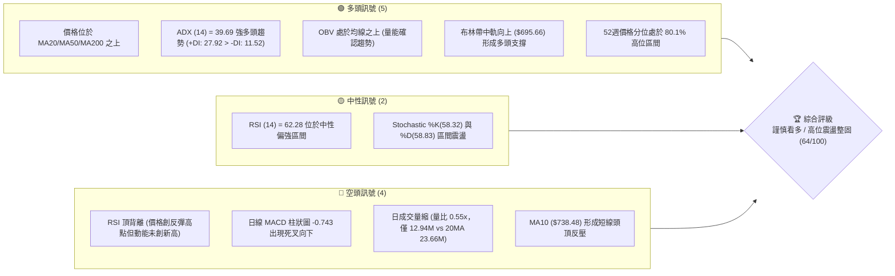
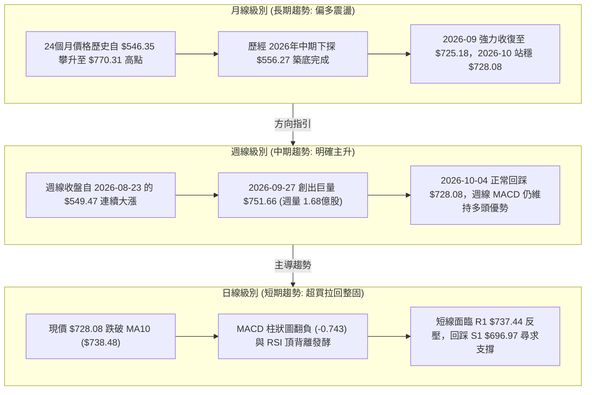
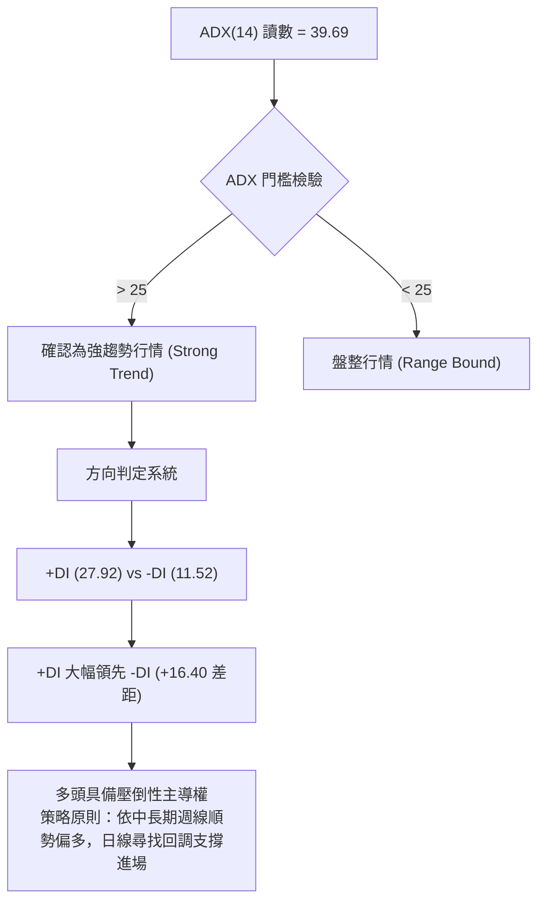
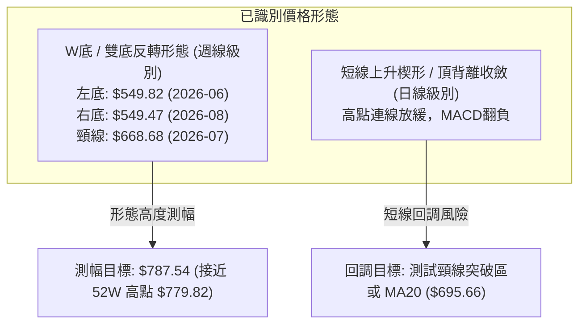
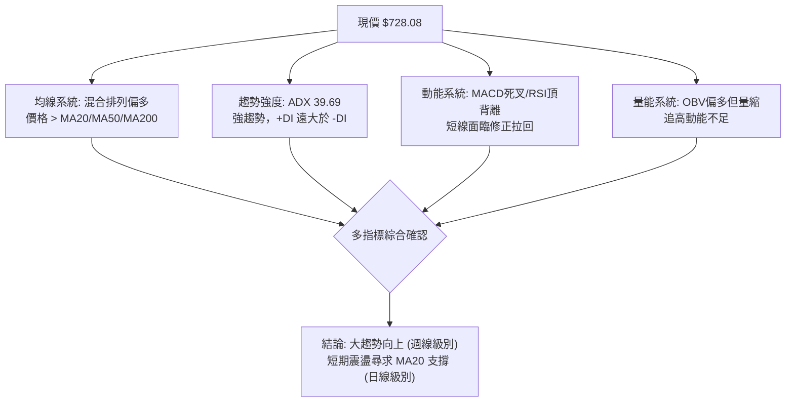
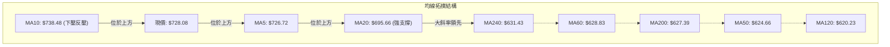
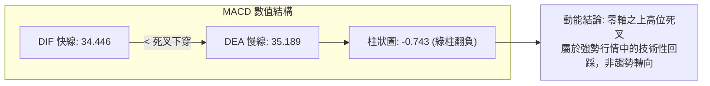
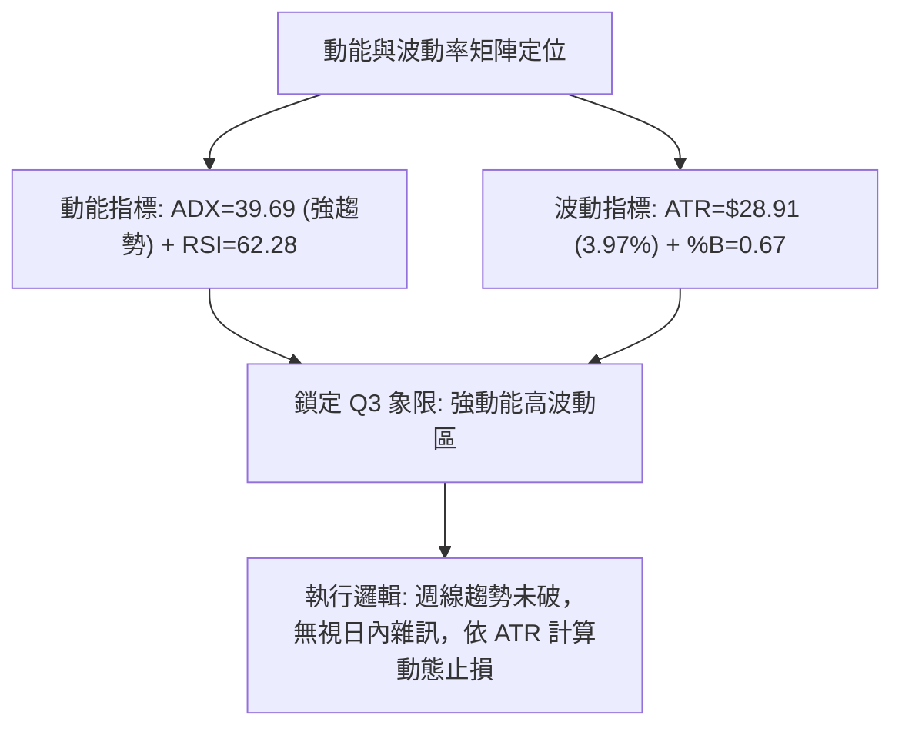
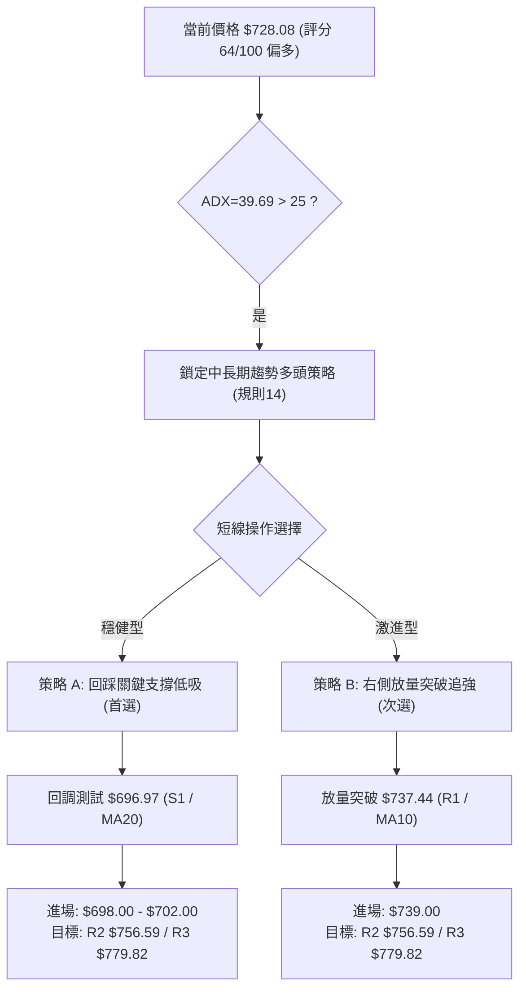
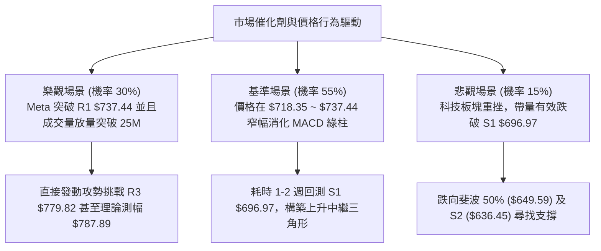

# META 技術分析報告

> **報告日期**：2026-10-05 ｜ **語言**：繁體中文 ｜ **數據來源**：Yahoo Finance ｜ **當前價格**：$728.08

---

## 目錄

| 章節 | 內容 |
|------|------|
| [1. 技術面概覽](#1-技術面概覽) | 訊號儀表板、核心指標、評分卡 |
| [2. 趨勢分析](#2-趨勢分析) | 多時框趨勢、長中短期走勢 |
| [3. 圖表形態分析](#3-圖表形態分析) | 形態識別、K線組合、目標價 |
| [4. 支撐與阻力](#4-支撐與阻力) | 關鍵價位、斐波那契回調 |
| [5. 技術指標深度解讀](#5-技術指標深度解讀) | MA/RSI/MACD/布林/成交量 |
| [6. 動能與波動率](#6-動能與波動率) | 動能評估、ATR、Beta |
| [7. 多時框架總結](#7-多時框架總結) | 時框架評分矩陣 |
| [8. 交易策略建議](#8-交易策略建議) | 多空策略、風險報酬比 |
| [9. 風險提示與監控](#9-風險提示與監控) | 監控指標、風險場景 |
| [10. 報告總結](#-報告總結) | 核心結論與交易執行清單 |

---

## 1. 技術面概覽

### 🎯 技術訊號儀表板



### 📊 核心指標速覽表

| 指標類別 | 指標名稱 | 當前數值 | 訊號 | 解讀 |
|----------|----------|----------|------|------|
| **價格** | 當前價格 | $728.08 | 🟢 | 距 52 週高點 ($779.82) 僅差 6.63%，強勢多頭格局 |
| **均線** | MA20 | $695.66 | 🟢 | 現價高於 MA20 達 +4.66%，短中期生命線支撐穩固 |
| **均線** | MA50 | $624.66 | 🟢 | 現價大幅高於 MA50 (+16.55%)，中期多頭趨勢確立 |
| **均線** | MA200 | $627.39 | 🟢 | 現價高於 MA200 (+16.05%)，牛熊分界線之上長期看多 |
| **動能** | RSI(14) | 62.28 | 🟡 | 位於健康多頭區域，但已出現頂背離預警信號 |
| **動能** | MACD(12,26,9) | 34.446 / 35.189 | 🔴 | MACD 柱狀圖轉為 -0.743，多頭動能短線衰竭，進入技術性修正 |
| **動能** | Stoch %K / %D | 58.32 / 58.83 | 🟡 | 兩線纏繞中位區，無超買或超賣極端現象 |
| **趨勢** | ADX(14) | 39.69 (+DI: 27.92) | 🟢 | ADX > 25 且 +DI 遠高於 -DI，顯示典型強勢多頭趨勢行情 |
| **通道** | 布林通道 %B | 0.67 | 🟢 | 位於中軌 ($695.66) 與上軌 ($792.16) 之間，多方掌控節奏 |
| **量能** | 當日量比 | 0.55x (12.94M) | 🔴 | 高位量能不濟，買盤追高意願減弱，量價背離明顯 |
| **波動** | ATR(14) | $28.91 (3.97%) | 🟡 | 日內波動幅度較大，短線需預留足夠止損緩衝 |

### 🏆 技術評分卡

```
╔══════════════════════════════════════════════════════════════════╗
║                   技術評分卡 — META (2026-10-05)                ║
╠══════════════════════════════════════════════════════════════════╣
║ 趨勢強度 (ADX=39.69, +DI主導) ████████████████░░░░  80/100 🟢   ║
║ 動能指標 (MACD柱死叉, RSI背離)████████░░░░░░░░░░░░  40/100 🔴   ║
║ 支撐穩定度 (S1=$696.97/MA20)  ██████████████░░░░░░  70/100 🟢   ║
║ 成交量配合 (OBV偏多, 量比0.55)██████████░░░░░░░░░░  50/100 🟡   ║
║ 形態完整度 (雙底反轉突破)     ████████████████░░░░  80/100 🟢   ║
║ 均線排列 (短強長整, 混合排列) ████████████░░░░░░░░  65/100 🟢   ║
╠══════════════════════════════════════════════════════════════════╣
║ 綜合技術評分                  █████████████░░░░░░░  64/100 🟢   ║
║ 評級結論：偏多震盪整固 (Bullish Consolidation with Divergence)   ║
╚══════════════════════════════════════════════════════════════════╝
```

---

## 2. 趨勢分析

### 🌐 多時框趨勢分析



### 📈 長期趨勢 — 12個月走勢圖（Unicode）

```
META 月線走勢圖（過去12個月：2025-11 至 2026-10）
價格軸 ($)
$780 ┤                                                    
$740 ┤                                            ●($751.66波段高)
$720 ┤                                              ●($728.08現價)
$700 ┤              ●($714.66)                            
$680 ┤                                                    
$660 ┤          ●($658.40)                                
$640 ┤●($645.76)    ●($646.52)      ●($631.43)            
$620 ┤                          ●($610.86)                
$600 ┤                                                    
$580 ┤                  ●($571.15)                        
$560 ┤                                  ●($562.85) ●($571.89)
$540 ┤                                      ●($556.27大底)
     └──────────────────────────────────────────────────────────
      11  12  01  02  03  04  05  06  07  08  09  10 (月份)
      '25 '25 '26 '26 '26 '26 '26 '26 '26 '26 '26 '26
```

#### 走勢特徵分析表格

| 階段 | 時間跨度 | 收盤價區間 | 累積漲跌幅 | 走勢特徵與量價結構 |
|------|----------|------------|------------|--------------------|
| **第 I 階段：高位滑落** | 2025-11 ~ 2026-03 | $645.76 → $571.15 | -11.55% | 2026年1月反彈至 $714.66 遇阻後迅速轉跌，跌破 600 美元關卡 |
| **第 II 階段：寬幅築底** | 2026-04 ~ 2026-08 | $610.86 → $571.89 | -6.38% | 於 2026-07 探底至 $556.27（52週低點 $519.37 上方），構築大型雙重底底座 |
| **第 III 階段：暴力拉升** | 2026-08 ~ 2026-09 | $571.89 → $725.18 | +26.80% | 單月收盤飆升逾 150 美元，放量突破所有中期均線阻力 |
| **第 IV 階段：頂部整固** | 2026-09 ~ 2026-10 | $725.18 → $728.08 | +0.40% | 創下 $751.66 週收盤高點後量能收縮，於高位進行籌碼換手 |

### 📊 中期趨勢（週線分析）

```
近期週線壓力與支撐示意圖
══════════════════════════════════════════════════════════════════
 壓力階梯  $779.82 (52W歷史高點 / 斐波 0.0%)
           $751.66 (2026-09-27 週線收盤高點，歷史天量 1.68億股聚結區)
 阻力區間  $737.44 (R1 波段高點阻力 / 週線高位整理上緣)
──────────────────────────────────────────────────────────────
 現價位置  $728.08 ◄─── 當前處於強拉升後的高位縮量十字整固期
──────────────────────────────────────────────────────────────
 支撐階梯  $718.35 (斐波那契 23.6% 回調關鍵樞軸)
           $696.97 (S1 波段低點聚類 / 匯聚日線 MA20 $695.66)
 強力護盤  $649.59 (斐波那契 50.0% 回調位 / 中期多空平衡線)
══════════════════════════════════════════════════════════════════
```

### ⚡ 趨勢強度評估（ADX 解讀）



#### ADX 強度對照表

| 指標名稱 | 實際數值 | 門檻區間 | 趨勢狀態評判 | 交易策略導向 |
|----------|----------|----------|--------------|--------------|
| **ADX(14)** | **39.69** | > 25 (強趨勢) | 處於強烈單邊趨勢主升段後期 | 嚴禁逆勢摸頂做空，回調做多為主 |
| **+DI(14)** | **27.92** | > 20 | 多頭攻擊動能充沛 | 多頭趨勢結構完好 |
| **-DI(14)** | **11.52** | < 15 | 空頭殺跌動能極度渙散 | 空方無力組織系統性拋盤 |

---

## 3. 圖表形態分析

### 🔍 形態識別系統



#### 形態識別與信心度評估表

| 形態類別 | 信心度 | 判斷依據（引用數據） | 完成度 | 目標價（附計算式） |
|----------|--------|----------------------|--------|--------------------|
| **週線雙重底 (W-Bottom)** | **85%** | 兩次低點分別為 2026-06-28 的收盤價 **$549.82** 與 2026-08-23 的 **$549.47**，形成極其對稱的雙底；頸線位於 2026-07-12 的波段反彈高點 **$668.68**，並於 2026-09-27 以放量 $751.66 突破。 | 95% | **目標價：$787.89**<br/>計算式：頸線 $668.68 + (頸線 $668.68 - 最低底 $549.47) = $668.68 + $119.21 = $787.89（與阻力位 R3 $779.82 共振） |
| **日線高位上升旗形/楔形** | **60%** | 價格在 2026-09 突破後高位狹幅震盪，日成交量由前週 1.68 億股大幅萎縮至當週 96.18M 與最新 12.94M，指標出現頂背離。 | 70% | 整理型態無向上擴展目標，短線下檔回調目標為支撐位 **S1 $696.97**。 |

### 🕯️ 重要K線形態分析

| 週期/月份 | 收盤價 | 成交量 / RSI | K線形態 | 深度解讀 | 訊號 |
|-----------|--------|--------------|---------|----------|------|
| **2026-08-02** | $556.27 | 112.1M / 22.9 | **長下影錘頭破底線** | RSI 探底 22.9 極度超賣後爆量承接，確認第一重底支撐有效性。 | 🟢 |
| **2026-08-23** | $549.47 | 89.0M / 31.3 | **平底雙針探底** | 回踩前低不破，量能明顯萎縮，形成經典賣壓竭盡信號。 | 🟢 |
| **2026-09-27** | $751.66 | 168.3M / 76.6 | **放量大陽線突破** | 突破 $700 整數關口，成交量創近半年新高，週線 MACD 柱大幅擴張 (+11.729)。 | 🟢 |
| **2026-10-04** | $728.08 | 96.18M / 62.3 | **縮量陰線十字孕線** | 高位停滯回落，成交量銳減，MACD 柱轉負 (-0.743)，顯示短線追價力道枯竭。 | 🔴 |

### 📉 ASCII 走勢形態示意圖

```
週線雙重底 (Double Bottom) 突破與高位回踩示意圖
價格 ($)
$780 ┤                                                    [R3: $779.82 / 測幅 $787.89]
$750 ┤                                            ● $751.66 (週收盤高)
$730 ┤                                              ●現價 $728.08 (高位整固)
$700 ┤                                          ╱   [S1: $696.97]
$670 ┤                  ● $668.68 (頸線高點)  ╱     [頸線阻力轉支撐區]
$640 ┤                ╱   ╲                 ╱
$610 ┤              ╱       ╲             ╱
$580 ┤            ╱           ╲         ╱
$550 ┤  ● $549.82 (左底)        ● $549.47 (右底)
     └─────────────────────────────────────────────────────────────
        2026-06              2026-07         2026-08       2026-09~10
```

### 🎯 形態目標價計算

```
╔══════════════════════════════════════════════════════════════════╗
║                   雙重底 (W-Bottom) 目標價推導                   ║
╠══════════════════════════════════════════════════════════════════╣
║ 形態底座最低點 (Trough 2)：         $549.47 (2026-08-23)       ║
║ 形態頸線高點 (Neckline Peak)：      $668.68 (2026-07-12)       ║
║ 形態垂直高度 (Pattern Height, H)：  $668.68 - $549.47 = $119.21║
║ 頸線突破確認點：                    $751.66 (2026-09-27 放量)   ║
╠══════════════════════════════════════════════════════════════════╣
║ 第一理論測幅目標 (1.00x H)：        $668.68 + $119.21 = $787.89 ║
║ 數據庫對應實質阻力 (R3)：           $779.82 (52W High，差距1%) ║
║ 達成狀態：當前價格 $728.08，已完成目標測幅之 50.0% 進度        ║
╚══════════════════════════════════════════════════════════════════╝
```

---

## 4. 支撐與阻力

### 🗺️ 關鍵價位分布圖（Unicode）

```
META 價位結構分布圖（所有數據源自計算聚類與斐波那契點位）
═══════════════════════════════════════════════════════════════════
$779.82 ║████████████████████████████████████████║ 強阻力 R3 / 52W High / 0.0%
$756.59 ║██████████████████████████████          ║ 波段阻力 R2 (反彈高點聚類)
$737.44 ║████████████████████████████████████    ║ 關鍵短阻 R1 (+1.29%) / MA10
$728.08 ╠════════════════════════════════════════╣ ◄ 現價 (Current Price)
$718.35 ║▓▓▓▓▓▓▓▓▓▓▓▓▓▓▓▓▓▓▓▓▓▓                  ║ 斐波那契 23.6% 回調關鍵護盤位
$696.97 ║████████████████████████████████████    ║ 核心支撐 S1 (-4.27%) / 匯聚 MA20
$649.59 ║██████████████████                      ║ 斐波那契 50.0% 中樞平衡線
$636.45 ║██████████████████████████              ║ 結構支撐 S2 (-12.59%)
$626.54 ║████████████████████████████████        ║ 強支撐 S3 (-13.95%) / 匯聚 MA200
═══════════════════════════════════════════════════════════════════
```

### 🚧 阻力位分析表

| 阻力級別 | 價位 | 形成原因 | 突破難度 | 重要性 |
|----------|------|----------|----------|--------|
| **R1** | **$737.44** | 近期波段高點聚類，且重合日線 **MA10 ($738.48)** 下壓線，短線套牢盤換手點。 | 🟡 中等 (需成交量回升至 20MA 以上) | ★★★☆☆ |
| **R2** | **$756.59** | 2026-09-27 週線大陽線收盤價 ($751.66) 上方密集換手區，多頭次級推升反壓。 | 🔴 較高 (空方心理防線) | ★★★★☆ |
| **R3** | **$779.82** | **52週歷史最高點**，歷史套牢籌碼峰值與形態目標位 ($787.89) 共振區。 | 🔴 極高 (需整體市場情緒極度樂觀配合) | ★★★★★ |

### 🛡️ 支撐位分析表

| 支撐級別 | 價位 | 形成原因 | 守住機率 | 重要性 |
|----------|------|----------|----------|--------|
| **S1** | **$696.97** | 近一年波段低點聚類，與布林中軌 / **MA20 ($695.66)** 形成雙重黃金支撐。 | 🟢 80% (多頭防線第一道壁壘) | ★★★★★ |
| **S2** | **$636.45** | 中期平台整理低點聚類，緊鄰斐波那契 50% ($649.59) 關鍵中樞。 | 🟢 90% (強支撐，難以輕易跌破) | ★★★★☆ |
| **S3** | **$626.54** | 極強防禦區，緊密匯聚 **MA50 ($624.66)** 與 **MA200 ($627.39)** 牛熊生命線。 | 🟢 95% (牛市結構底線) | ★★★★★ |

### 📐 斐波那契回調位分析

*基準區間：52週歷史波動區間（最低點 **$519.37** → 最高點 **$779.82**，總落差 **$260.45**）*

```
斐波那契回調位階梯矩陣
─────────────────────────────────────────────────────────────────
0.0%  (52W High)        $779.82  ▲ 多頭最終極限攻擊目標
23.6% 回調位            $718.35  ▲ 現價 ($728.08) 守住此位上方，為強勢主升結構
38.2% 回調位            $680.33  ▲ 健康回調底線，跌破此位將削弱攻擊速度
50.0% 中樞平衡位        $649.59  ▲ 多空長期強弱分水嶺
61.8% 黃金分割位        $618.86  ▲ 深度防禦位，回調不破仍屬大週期多頭
78.6% 回調位            $575.11  ▲ 弱勢支撐
100.0% (52W Low)        $519.37  ▼ 歷史大底
─────────────────────────────────────────────────────────────────
```

**回調位深度解讀**：
現價 **$728.08** 當前精確運行於 **0.0% ($779.82)** 與 **23.6% ($718.35)** 的高位強勢多頭強勢區間（回調幅度僅佔總漲幅的 19.86%）。這表明市場即便在日線出現指標背離的情況下，依然拒絕深度調整，籌碼鎖定良好。只要價格維持在 23.6% ($718.35) 與 S1 ($696.97) 之上，大級別上升通道便未受任何實質性破壞。

---

## 5. 技術指標深度解讀

### 🎛️ 指標訊號總覽



### 📈 移動平均線排列分析



#### 均線量化狀態表

| 均線名稱 | 數值 | 現價與均線差值 | 漲跌幅度 | 趨勢形態特徵 | 訊號強度 |
|----------|------|----------------|----------|--------------|----------|
| **MA 5** | $726.72 | +$1.36 | +0.19% | 走平微揚，短線爭奪 | 🟡 中性 |
| **MA 10** | $738.48 | -$10.40 | -1.41% | 短期頂部反轉下穿，形成第一道動態阻力 | 🔴 偏空 |
| **MA 20** | $695.66 | +$32.42 | +4.66% | 強勁向上發散，提供回調第一緩衝層 | 🟢 看多 |
| **MA 50** | $624.66 | +$103.42 | +16.55% | 中期上升均線，支撐強烈 | 🟢 看多 |
| **MA 60** | $628.83 | +$99.25 | +15.78% | 穩定向上 | 🟢 看多 |
| **MA 120** | $620.23 | +$107.85 | +17.39% | 底部緩慢抬升 | 🟢 看多 |
| **MA 200** | $627.39 | +$100.69 | +16.05% | 長期牛熊線，價格穩居其上 | 🟢 看多 |
| **MA 240** | $631.43 | +$96.65 | +15.31% | 走平轉揚 | 🟢 看多 |

**均線結構綜合判定**：雖然整體定義為「混合排列」（MA200 $627.39 略高於 MA50 $624.66，主因 2026 年初至年中大幅拉回震盪使然），但短中期均線（MA20、MA60）已大幅金叉長期均線（MA200、MA240），呈現典型的修復後多頭發散雛形。MA10 在 $738.48 形成短線天花板，而 MA20 在 $695.66 構成基石。

### 📉 RSI(14) 分析

```
RSI(14) 動能刻度表
0              30                  50        62.28       70             100
├──────────────┼───────────────────┼───────────█─────────┼──────────────┤
  極度超賣區        弱勢震盪區          多空分水嶺      現值    超買警戒區
  進度條：[████████████████████████████████░░░░░░░░░░] 62.28%
```

- **超買超賣判定**：數值為 **62.28**，脫離 2026-09-13 週線峰值的 83.9 極端超買區，成功回吐部分泡沫，處於良性多頭擴張區間（50-70）。
- **背離嚴格檢驗**：⚠️ **確定存在頂背離 (Bearish Divergence)**。
  - *背離論證*：價格在 2026-09-27 週收盤創出 **$751.66** 的新高，但此時 RSI 僅為 **76.6**（低於前次 2026-09-13 價格 $647.52 時的 RSI **83.9**）。隨後日線最新讀數進一步回落至 **62.28**。價格高點不斷抬高，而動能波峰顯著下移，確認大級別頂背離成立，預示著衝高乏力，必須透過時間或空間震盪消化獲利盤。

### 📊 MACD(12/26/9) 訊號解讀



- **訊號解析**：DIF (34.446) 跌破 DEA (35.189)，MACD 柱狀圖收在 **-0.743**。雖然處於空頭動能釋放期，但注意 DIF 與 DEA 絕對數值高達 +34 以上，遠在零軸上方，這屬於標準的「強勢零上死叉」。此類形態通常演變為橫盤震盪以等待均線靠攏，而非崩跌式暴挫。

### 📦 布林通道分析

```
布林通道結構示意圖（日線尺度）
══════════════════════════════════════════════════════════════════
 $792.16 ────────────────────────────────────── BB 上軌 (Upper Band)
                                          
 $728.08 ───────────────●────────────────────── 現價 (%B = 0.67)
                                          
 $695.66 ────────────────────────────────────── BB 中軌 (MA20 Baseline)
                                          
 $599.16 ────────────────────────────────────── BB 下軌 (Lower Band)
══════════════════════════════════════════════════════════════════
帶寬 (Bandwidth) = ($792.16 - $599.16) / $695.66 = 27.74% (通道持續張口)
```

- **通道位置**：目前 **%B = 0.67**，價格穩健運行於中軌（$695.66）與上軌（$792.16）形成的上行強勢通道內。
- **軌道行為**：上軌目前在 $792.16，與歷史高點 R3 ($779.82) 形成頂部包絡線；中軌 $695.66 呈大角度向上延伸，與 S1 ($696.97) 完全重合，為多頭守護核心防線。

### 💹 成交量分析（量價配合度）

```
量能比對柱狀圖
最新日成交量  (12.94M)  [███████████░░░░░░░░░] 0.55x (相對於20MA)
20日平均量    (23.66M)  [████████████████████] 1.00x基準
50日平均量    (19.66M)  [████████████████░░░░] 0.83x
前週天量峰值  (168.3M)  [████████████████████████████████████████]
```

- **量價背離現象**：最新單日成交量僅 12,944,900 股，僅為 20日均量 (23.66M) 的 **55%**。在上漲接近歷史高點區域時縮量，表明市場跟風追高買盤意願不足。
- **OBV 趨勢驗證**：官方數據顯示「**OBV > MA → 量能支撐上漲**」。這說明從大週期（週線累積）來看，機構資金主導的資金淨流入趨勢尚未逆轉，當前的日線縮量屬於典型的「籌碼沉鎖、主動回踩」，暫未出現籌碼大規模派發的崩塌性放量。

---

## 6. 動能與波動率

### ⚡ 動能評估四象限

| 象限 | 動能維度 (ADX / RSI) | 波動率維度 (ATR / %B) | META 當前狀態 | 策略應對方針 |
|------|----------------------|-----------------------|---------------|--------------|
| **第一象限 (Q1)** | **強動能** (ADX > 25) | **低/中波動** (波動收斂) | ❌ 非當前狀態 | 突破追加，最佳持股加速期 |
| **第二象限 (Q2)** | **弱動能** (動能背離衰竭) | **低波動** (通道收縮) | ❌ 非當前狀態 | 觀望等待變盤點 |
| **第三象限 (Q3)** | **強動能** (ADX = 39.69) | **高波動** (ATR = $28.91) | **✔ 當前精確定位** | **趨勢拉升後的高波動整固，嚴控止損，逢低吸納** |
| **第四象限 (Q4)** | **弱動能** (死叉下穿) | **高波動** (劇烈下殺) | ❌ 非當前狀態 | 嚴格停損出場，規避主跌浪 |



### 📊 ATR 波動率分析

- **當前 ATR(14) 數值**：**$28.91**（佔現價百分比為 **3.97%**）。
- **日內安全防禦距離**：由於單日平均波幅接近 $29，任何緊繃的短線止損（如 1%~2%）極易被市場隨機噪音掃出場。
- **止損計算應用建議**：
  - *短期波段止損（1.5 倍 ATR）*：$28.91 × 1.5 = **$43.37**。
  - *中長期結構止損（2.0 倍 ATR）*：$28.91 × 2.0 = **$57.82**。
  - *現價推導波段止損底線*：$728.08 - $43.37 = **$684.71**（剛好包覆關鍵支撐位 S1 $696.97，極具技術邏輯性）。

### 📐 Beta 與市場相關性

- **Beta 係數**：**1.243**。
- **大盤共振屬性**：META 表現出高於標普 500 指數 24.3% 的波動敏感度。屬於典型的高 Beta 成長型科技權值股。在大盤環境維持多頭時，具有顯著的超額報酬能力（Alpha）；但當科技巨頭板塊遭受估值打壓時，其回調速度亦將高於市場平均水平。

---

## 7. 多時框架總結

### 📋 時框架評分表

| 時框架 | 趨勢方向 | 動能狀態 | 均線系統 | 形態結構 | 綜合評分 | 交易建議 |
|--------|----------|----------|----------|----------|----------|----------|
| **月線級別 (長期)** | 🟢 強烈看多 | 🟢 柱狀擴張 | 🟢 遠超 MA200 | 雙重底頸線突破回踩 | **80/100** | 戰略性堅定持有 |
| **週線級別 (中期)** | 🟢 明確主升 | 🟡 動能稍鈍化 | 🟢 均線多頭發散 | 放量突破後十字星整固 | **75/100** | 順勢逢低回調加碼 |
| **日線級別 (短期)** | 🟡 震盪回調 | 🔴 MACD死叉/背離 | 🟡 價格跌破 MA10 | 上升楔形動能竭盡 | **45/100** | 拒絕追高，等待支撐確認 |

### 🔲 綜合訊號矩陣

```
時框衝突消解矩陣
┌──────────────┬───────────────┬──────────────────────────────────────────┐
│ 維度         │ 訊號傾向      │ 權重決策與邏輯收斂                       │
├──────────────┼───────────────┼──────────────────────────────────────────┤
│ 長期 (Monthly)│ 🟢 BULLISH    │ 權重 30%：提供強固大方向保護             │
│ 中期 (Weekly) │ 🟢 BULLISH    │ 權重 45%：趨勢行情中（ADX>25）主導決策   │
│ 短期 (Daily)  │ 🔴 BEARISH    │ 權重 25%：僅作為尋找進場邊界之戰術工具   │
└──────────────┴───────────────┴──────────────────────────────────────────┘
```

### ⚖️ 多時框收斂結論

> **依據多時框收斂規則（規則 14）**：
> 當前技術數據顯示 **ADX(14) = 39.69**，遠高於趨勢臨界點 25，且 **+DI (27.92)** 處於絕對主導地位。因此市場當前明確處於**「強趨勢行情」**而非「盤整行情」。
> 
> **收斂裁決**：日線級別的指標弱化（MACD 柱狀圖 -0.743、RSI 頂背離、量比 0.55x）**不得**被解讀為大趨勢反轉。依據規則，日線級別的衝突必須向中期（週線主升）與長期均線系統讓步。日線的空頭訊號僅表明短期向上動能衰竭，將促發一次針對 **MA20 / S1 ($696.97)** 或斐波那契 23.6% ($718.35) 的技術性洗盤。
> 
> **唯一方向性結論**：**【中長期順勢偏多，短線耐心等待回調確認買點】**（偏多震盪整固）。

---

## 8. 交易策略建議

### 🗺️ 策略決策流程圖



### 🧭 策略路由

**當前主策略方向 = 【多頭策略】（依綜合評分 64/100，評級偏多）**
*空頭操作在此處屬於高風險逆勢行為，僅列為極端破位時的對沖防禦機制。*

### 🎯 價格情境階梯（Price Scenarios）

*本階梯價位完全引用第 4 章及數據庫計算聚類價位：*

| 觸發條件 | 下一目標 | 後續延伸 | 情境含義與操作指引 |
|----------|----------|----------|--------------------|
| **向上突破 R1 ($737.44)** | **R2 ($756.59)** | **R3 ($779.82)** | 短線整固結束，發動對 52W 歷史高點的二度衝擊，右側加碼點。 |
| **站穩現價區間 ($718.35 ~ $737.44)** | **$737.44** | **$756.59** | 消化 RSI 頂背離，以橫盤代跌，維持強勢蓄勢格局。 |
| **向下跌破 S1 ($696.97)** | **S2 ($636.45)** | **S3 ($626.54)** | 中期轉弱，多頭趨勢結構受損，需全面啟動保護性止損。 |

### 📊 情境機率分佈

| 情境 | 機率 | 主要依據 |
|------|------|----------|
| **情境一：高位震盪後蓄勢上攻** | **55%** | ADX 39.69 維持強趨勢，均線系統短中期全面墊高，OBV 保持多頭量能支撐。 |
| **情境二：回踩核心支撐 S1 洗盤** | **35%** | 日線 MACD 綠柱翻負 (-0.743)，RSI 頂背離顯著，縮量 0.55x 難以立即發動攻勢。 |
| **情境三：趨勢反轉跌破 S2/MA200** | **10%** | 目前 +DI 仍高達 27.92，基本面良好，除非系統性黑天鵝，機率極低。 |

### 🟢 主策略詳情

#### 策略 A：穩健逢低買入（核心推薦策略）

| 策略要素 | 策略 A 具體參數說明 |
|----------|----------------------|
| **進場邏輯** | 利用日線頂背離拉回的過程，在 S1 與 MA20 匯聚之核心防禦帶分批掛單。 |
| **進場價格** | **$698.00**（緊鄰 S1 **$696.97** 與 MA20 **$695.66**） |
| **目標價 T1** | **$756.59**（鎖定波段阻力 R2，預期獲利：+$58.59 / +8.39%） |
| **目標價 T2** | **$779.82**（鎖定 52W 高點阻力 R3，預期獲利：+$81.82 / +11.72%） |
| **止損價格** | **$675.00**（跌破斐波那契 38.2% 回調位 $680.33 並留出緩衝，最大虧損：-$23.00 / -3.29%） |
| **風險報酬比** | **1 : 3.56**（計算：目標 T2 獲利 $81.82 / 止損風險 $23.00） |
| **成功機率** | **70%**（順大時框趨勢交易勝率） |
| **建議倉位** | **20% ~ 25%** 總投資資金 |

#### 策略 B：突破追隨交易（動能追強策略）

| 策略要素 | 策略 B 具體參數說明 |
|----------|----------------------|
| **進場邏輯** | 股價放量克服短線壓制線 MA10 與 R1，確認短線調整完畢重啟升勢。 |
| **進場價格** | **$739.00**（有效站穩 R1 **$737.44** 與 MA10 **$738.48** 之上） |
| **目標價 T1** | **$756.59**（波段阻力 R2，預期獲利：+$17.59 / +2.38%） |
| **目標價 T2** | **$779.82**（52W 高點 R3，預期獲利：+$40.82 / +5.52%） |
| **止損價格** | **$717.00**（跌破斐波那契 23.6% 護盤位 **$718.35**，最大虧損：-$22.00 / -2.98%） |
| **風險報酬比** | **1 : 1.86**（計算：目標 T2 獲利 $40.82 / 止損風險 $22.00） |
| **成功機率** | **60%** |
| **建議倉位** | **10% ~ 15%**（突破追高需適度縮減槓桿與倉位） |

### 🔴 反向風險觸發點（對沖提示）

若市場突發重大利空導致下列條件觸發，多頭主策略即刻失效，多單應無條件離場觀望或建立適度空頭對沖：
1. **反轉關鍵破位點**：日線收盤價跌破 **$695.66 (MA20 / S1)**，且次日無法收復。
2. **空頭擴散信號**：週線收盤跌破 **$649.59 (斐波那契 50.0% 中樞)**，導致週線 MACD 零軸上方死叉。
3. **對沖下行空間目標**：一旦跌破 $696.97，空方將迅速測試 **S2 ($636.45)** 與 **S3 ($626.54 / MA200)**。

### ⭐ 整體訊號強度評星

```
做多訊號強度：★★★★☆  (4/5星 — 趨勢完好，僅受短線背離干擾)
做空訊號強度：★☆☆☆☆  (1/5星 — 逆強勢單邊趨勢，極高風險)
整體可信度：  ★★★★☆  (4/5星 — 多時框指標邏輯收斂，價位清晰)
```

---

## 9. 風險提示與監控

### ✅ 關鍵監控指標 Checklist

```
╔══════════════════════════════════════════════════════════════════╗
║               META 技術風控每日監控清單 (Checklist)             ║
╠══════════════════════════════════════════════════════════════════╣
║ [ ] 監控項 1：MA20 守衛戰 ($695.66) 是否有長下影線守護？         ║
║ [ ] 監控項 2：成交量是否放大？突破 R1 ($737.44) 時日量是否 >20M？║
║ [ ] 監控項 3：MACD 柱狀圖是否由 -0.743 開始縮短向零軸靠攏？     ║
║ [ ] 監控項 4：RSI(14) 能否在 50-55 中軸獲得支撐並重啟彈升？     ║
║ [ ] 監控項 5：跌破斐波 23.6% ($718.35) 時是否有大盤恐慌拋盤？  ║
║ [ ] 監控項 6：ADX(14) 讀數是否跌破 25（預示趨勢終結進入死水）？  ║
╚══════════════════════════════════════════════════════════════════╝
```

### ⚠️ 風險場景分析



### 🛡️ 風險管理重要提醒

1. **嚴防流動性假突破**：
   - 當前量比僅 **0.55x**，在縮量狀態下任何向上衝擊 **R1 ($737.44)** 或 **R2 ($756.59)** 的走勢都容易形成「誘多陷阱（Bull Trap）」。操作上必須嚴格遵循「不放量不追高，放量過頂再跟進」的鐵律。
2. **動態波動倉位縮放**：
   - ATR 目前高達 **$28.91**，佔股價近 4%。若單筆交易能承受的最大賬戶資金回撤為 1%，以當前 $23.00 止損空間計算，**單一部位投入資金不應超過總投資組合的 30%**。
3. **背離消除機制**：
   - RSI 頂背離與 MACD 死叉的化解只有兩種途徑：要麼**快速以空間換時間**回踩 MA20 擠出浮額，要麼**極端放量大陽線硬拉**直接扭轉技術指標形態。在確認上述信號出現前，保持耐心是控制回撤的第一要務。

---

## 📋 報告總結

```
╔══════════════════════════════════════════════════════════════════╗
║                    META 技術分析報告總結                         ║
╠══════════════════════════════════════════════════════════════════╣
║ 報告日期：2026-10-05                                            ║
║ 當前價格：$728.08                                               ║
║ 分析評級：🟢 偏多震盪整固 (Bullish Consolidation with Divergence)║
║                                                                  ║
║ 關鍵結論：                                                       ║
║ ├─ 長期趨勢：🟢 強烈看多 (W底成型，目標指針 $787.89 / $779.82)   ║
║ ├─ 中期趨勢：🟢 強勢主升 (ADX=39.69，週線強多頭結構完整)         ║
║ ├─ 短期趨勢：🔴 頂背離整固 (MACD柱翻負，MA10下壓，面臨回調洗盤)║
║ ├─ 關鍵支撐：S1: $696.97 (強匯聚MA20) ｜ S2: $636.45             ║
║ ├─ 關鍵阻力：R1: $737.44 ｜ R2: $756.59 ｜ R3: $779.82 (52W高點)║
║ └─ 機構共識：Strong Buy (58位分析師，平均目標價 $794.96)        ║
║                                                                  ║
║ 最優策略組合：                                                   ║
║ 1. 🥇 最佳機會：等待回調至 $698.00 (S1/MA20) 低吸，止損設 $675.00║
║                  博弈目標 R2 $756.59 與 R3 $779.82，風報比 1:3.56║
║ 2. 🥈 次選機會：突破 $739.00 放量追多，目標 $779.82，止損 $717.00║
║ 3. 🥉 保守選擇：場外觀望，等待日線 MACD 重新金叉後再行進場       ║
╚══════════════════════════════════════════════════════════════════╝
```

---

> ⚠️ **免責聲明**：本報告為技術分析研究成果，所有價位推導與策略均基於量化公式與歷史 OHLCV 價格體系計算。本報告**僅供學術研究與交易架構參考**，**不構成任何要約或投資買賣建議**。金融市場瞬息萬變，交易者應獨立評估風險並嚴格執行資金管理。

---

*報告生成時間：2026-10-05 ｜ 數據來源：Yahoo Finance ｜ 分析框架：多時框技術分析體系*