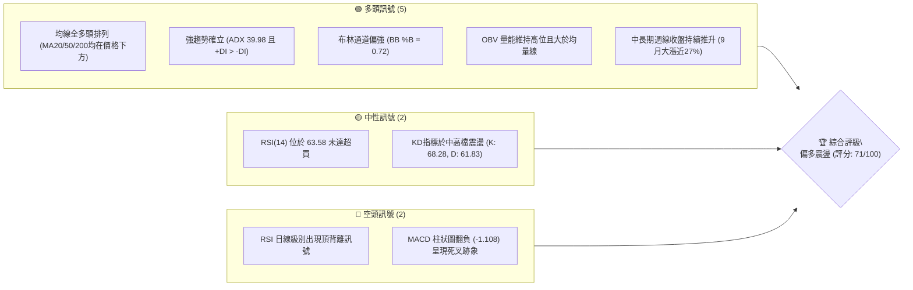
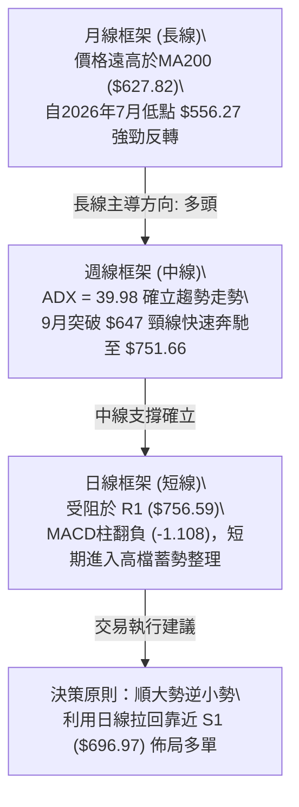
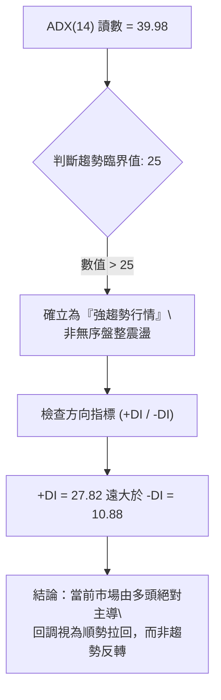
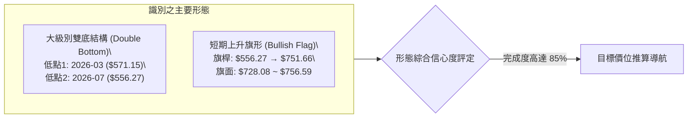
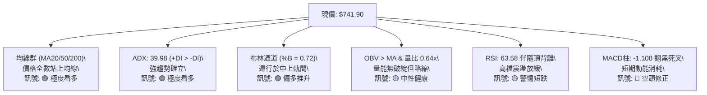
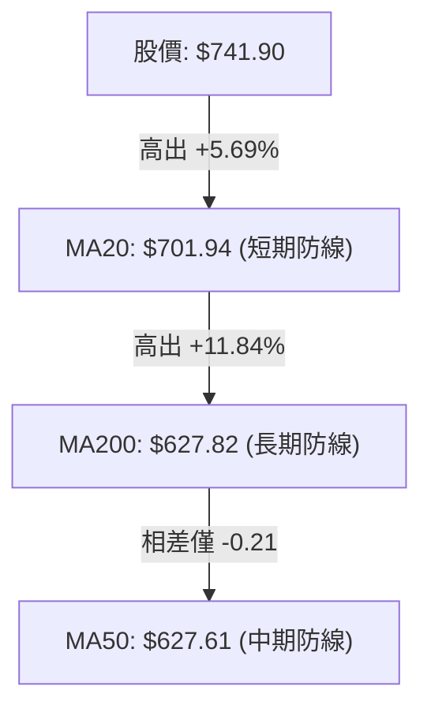
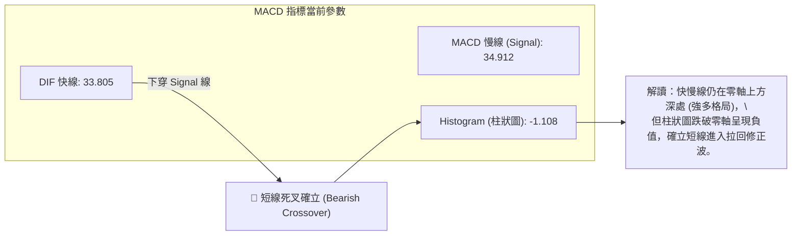
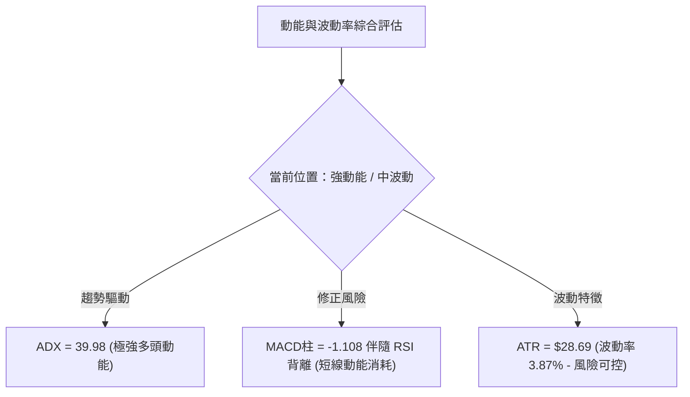
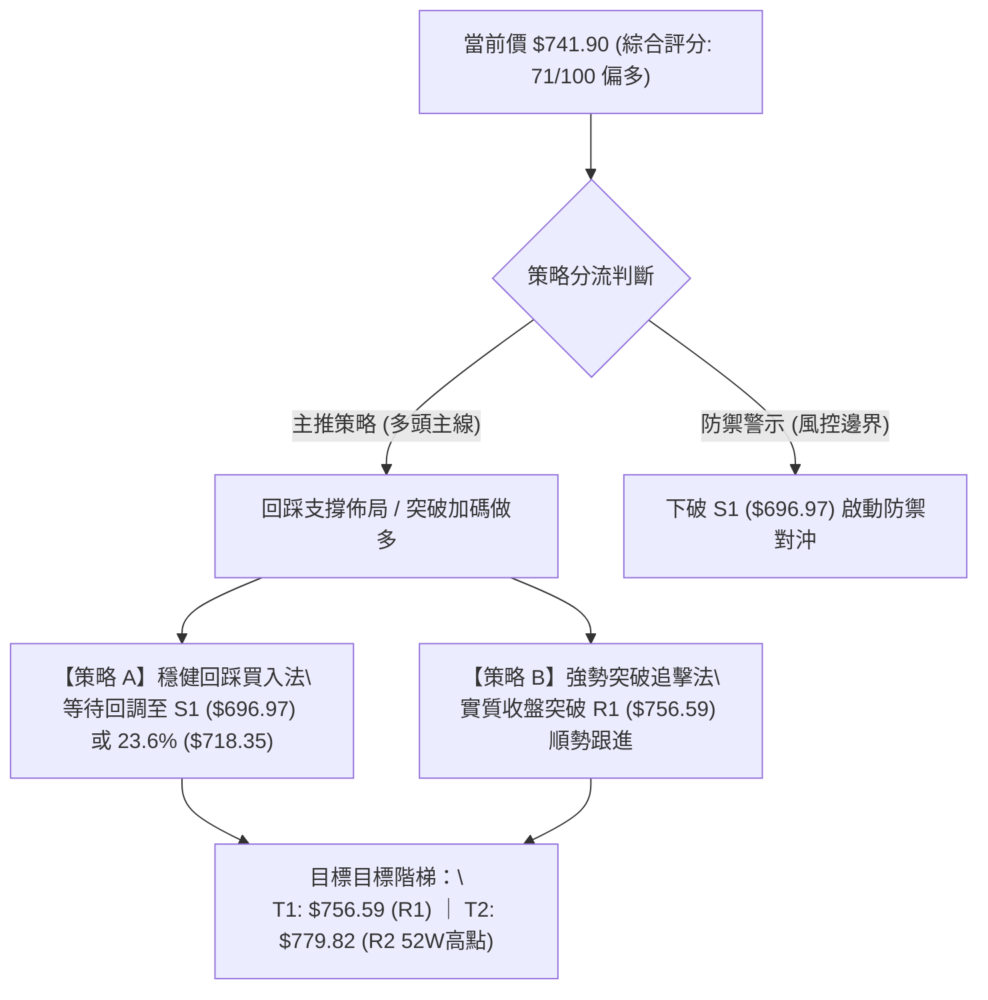
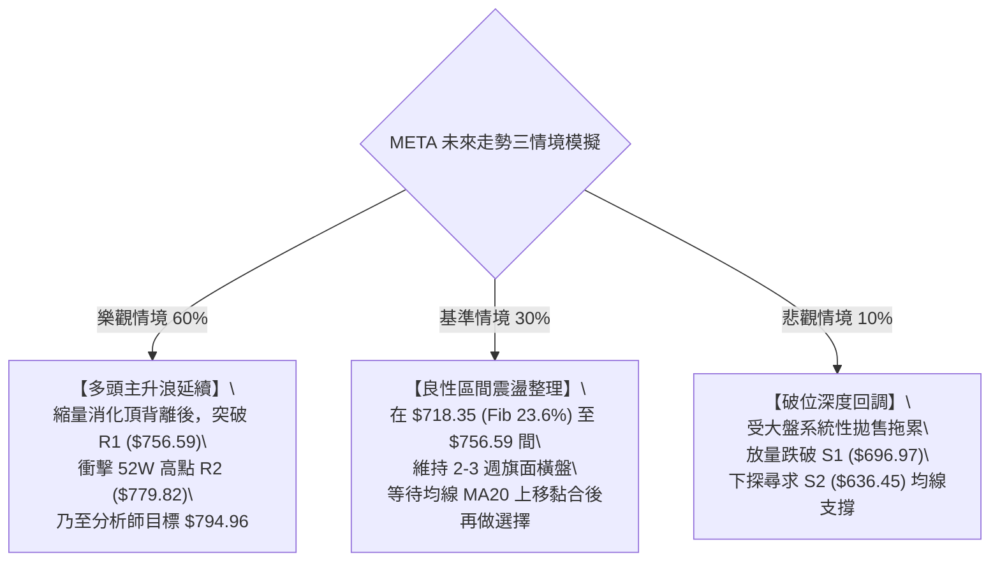

# META 技術分析報告

> **報告日期**：2026-10-06 ｜ **語言**：繁體中文 ｜ **數據來源**：Yahoo Finance ｜ **當前價格**：$741.90

---

## 目錄

| 章節 | 內容 |
|------|------|
| [1. 技術面概覽](#1-技術面概覽) | 訊號儀表板、核心指標、評分卡 |
| [2. 趨勢分析](#2-趨勢分析) | 多時框趨勢、長中短期走勢、ADX解讀 |
| [3. 圖表形態分析](#3-圖表形態分析) | 形態識別、K線組合、目標價計算 |
| [4. 支撐與阻力](#4-支撐與阻力) | 關鍵價位、斐波那契回調結構 |
| [5. 技術指標深度解讀](#5-技術指標深度解讀) | MA/RSI/MACD/布林/成交量量價關係 |
| [6. 動能與波動率](#6-動能與波動率) | 動能四象限、ATR波動率、Beta市場敏感度 |
| [7. 多時框架總結](#7-多時框架總結) | 時框架矩陣、趨勢收斂唯一結論 |
| [8. 交易策略建議](#8-交易策略建議) | 主策略詳情、情境階梯、風控觸發點 |
| [9. 風險提示與監控](#9-風險提示與監控) | 監控清單、情境模擬、風險管理指南 |

---

## 1. 技術面概覽

### 🎯 技術訊號儀表板



### 📊 核心指標速覽表

| 指標類別 | 指標名稱 | 當前數值 | 訊號 | 解讀 |
|:---|:---|:---:|:---:|:---|
| **價格** | 當前價格 | $741.90 | 🟢 | 站穩中長期各期均線上方，位於52週高低區間85.4%位置 |
| **均線** | MA20 | $701.94 | 🟢 | 股價高於MA20達+5.69%，短中期生命線提供穩健動態支撐 |
| **均線** | MA50 | $627.61 | 🟢 | 股價高於MA50達+18.21%，中期多頭趨勢堅固 |
| **均線** | MA200 | $627.82 | 🟢 | 股價高於MA200達+18.17%，牛熊分界線向上運行，長多確立 |
| **動能** | RSI(14) | 63.58 | 🟡 | 位於50-70強勢區，但日線出現頂背離，短線追高動能趨緩 |
| **動能** | MACD (12,26,9) | 33.805 / 34.912 | 🔴 | MACD低於信號線，柱狀圖為 -1.108，短線動能出現衰竭 |
| **動能** | ADX(14) | 39.98 | 🟢 | ADX > 25 且 +DI(27.82) 遠高於 -DI(10.88)，代表強勁多頭趨勢行情 |
| **通道** | 布林通道 | %B = 0.72 | 🟢 | 價格處於中軌($701.94)與上軌($792.88)間之強勢帶 |
| **波動** | ATR(14) | $28.69 | 🟡 | 佔股價 3.87%，單日波動幅度適中，利於設定保護性止損 |
| **量能** | 20日成交量比 | 0.64x | 🟡 | 成交量(15.2M)低於20日均量(23.6M)，衝高過程中量能略顯不足 |

### 🏆 技術評分卡

```
╔══════════════════════════════════════════════════════════════╗
║                技術評分卡 — META (2026-10-06)                 ║
╠══════════════════════════════════════════════════════════════╣
║ 趨勢強度 (ADX/均線)   ████████████████░░░░  82/100  🟢 強勁多頭 ║
║ 動能指標 (RSI/MACD)   ███████████░░░░░░░░░  55/100  🟡 短期背離 ║
║ 支撐穩定度 (結構位)   ███████████████░░░░░  75/100  🟢 下檔厚實 ║
║ 成交量配合 (OBV/量比) ████████████░░░░░░░░  60/100  🟡 縮量整理 ║
║ 形態完整度 (V底回升)  ████████████████░░░░  80/100  🟢 形態向上 ║
║ 均線排列 (多頭排列)   ██████████████░░░░░░  72/100  🟢 中長多頭 ║
╠══════════════════════════════════════════════════════════════╣
║ 綜合技術評分          ██████████████░░░░░░  71/100  🟢 偏多回調 ║
╚══════════════════════════════════════════════════════════════╝
```

---

## 2. 趨勢分析

### 🌐 多時框趨勢分析



### 📈 長期趨勢 — 12個月走勢圖（Unicode）

以下為 META 過去 12 個月（2025年11月至2026年10月）收盤價走勢路徑：

```
META 月線走勢圖（過去12個月）
價格軸 ($)
$770 ┤
$740 ┤                                                 ● $741.90 (現價)
$710 ┤                   ● $714.66               ● $725.18
$680 ┤
$650 ┤ ● $645.76 ● $658.40      ● $646.52       ● $631.43
$620 ┤                                   ● $610.86
$590 ┤                           ● $571.15               ● $571.89
$560 ┤                                           ● $562.85 ● $556.27 (低點)
$530 ┤
     └─┬────────┬────────┬───────┬───────┬───────┬───────┬───────┬───────┬───
     25-11    25-12    26-01   26-03   26-04   26-05   26-06   26-07   26-10
```

#### 走勢特徵分析表格

| 階段區間 | 起止價格 | 漲跌幅 | 走勢特徵描述 |
|:---|:---:|:---:|:---|
| **2025-11 ~ 2026-01** | $645.76 → $714.66 | +10.67% | 震盪衝高段，觸及714美元後引發機構獲利了結賣壓 |
| **2026-01 ~ 2026-03** | $714.66 → $571.15 | -20.08% | 急速回檔修正段，跌破多條短期均線，引發多頭停損 |
| **2026-03 ~ 2026-05** | $571.15 → $631.43 | +10.55% | 中期築底反彈，反彈至60日均線附近遇阻 |
| **2026-05 ~ 2026-07** | $631.43 → $556.27 | -11.90% | 二次探底段，於7月錄得556.27波段低點，接近52週低點$519.37 |
| **2026-07 ~ 2026-10** | $556.27 → $741.90 | +33.37% | 主升浪反轉，單月連續長陽突破多重阻力，目前逼近歷史高點區間 |

### 📊 中期趨勢（週線分析）

中期走勢呈現典型「V型強勢反轉後的高位旗形收斂」。觀察近 20 週數據：
1. 2026年7-8月間，股價在 $556.27 至 $549.47 構築扎實的雙重支撐平台。
2. 2026年9月中旬，伴隨單週 1.68 億股之巨量，週線以長陽線拔起並強勢突破 $700 大關，最高收在 2026-09-27 之 $751.66。
3. 2026-10-04 週線出現拉回修正至 $728.08，本週再度反彈至 $741.90，但週量縮減至 15.2M，顯示在中期強勁上漲後，多方於 $750-$780 壓力帶轉趨謹慎。

```
週線支撐阻力結構示意：
      [阻力帶] R2: $779.82 (52週最高點)
      ─────────────────────────────────── ▲
      [前高壓力] R1: $756.59 (近一年波段高點聚類)
      ───────────────────────────────────
      [當前價格] $741.90 ◄ (高檔整理)
      ───────────────────────────────────
      [短期生命線] MA20 / S1: $696.97 - $701.94 (第一道強護城河)
      ─────────────────────────────────── ▼
      [中期牛熊線] MA50 / S2: $627.61 - $636.45
```

### ⚡ 趨勢強度評估（ADX 解讀）



#### ADX 強度對照與解讀

| ADX 數值區間 | 趨勢分類 | META 當前狀態 | 交易指引 |
|:---:|:---:|:---:|:---|
| 0 - 20 | 無趨勢 / 盤整 | 否 | 適合區間網格或高拋低吸 |
| 20 - 25 | 趨勢正在醞釀 | 否 | 突破前夕，準備順勢單 |
| **25 - 40** | **強勁趨勢行情** | **✔ (39.98)** | **嚴禁逆勢摸頂做空；拉回關鍵均線順勢做多** |
| 40+ | 極強趨勢 / 超買警訊 | 臨近 | 關注動能指標背離，防範暴衝後的急速降溫 |

---

## 3. 圖表形態分析

### 🔍 形態識別系統



#### 形態信心度評估表（依規則 15 嚴格判定）

| 形態名稱 | 信心度 | 判斷依據（引用真實數據） | 完成度 | 目標價計算式（依形態推算） |
|:---|:---:|:---|:---:|:---|
| **中級別雙重底** | **85%** | 2026年3月低點 $571.15 與7月低點 $556.27 形成W底架構；頸線位於5月高點 $631.43。9月放量長陽突破頸線。 | 95% | 突破頸線($631.43) + 形態高度($631.43 - $556.27 = $75.16) = **$706.59** (已完全達標) |
| **高位上升旗形** | **65%** | 旗桿由8月底 $577.56 飆升至9月底 $751.66 (漲幅 $174.10)；近2週於 $728.08 - $751.66 高位旗形震盪，成交量由 168M 大幅萎縮至 15M。 | 70% | 旗面突破點若設在 R1 ($756.59)；旗桿高度為 $174.10。理論投射 = $756.59 + $174.10 = **$930.69** (長期推論) |
| **短期頭肩頂** | **35%** | 訊號不足，僅日線RSI背離與MACD走弱，未形成右肩，頸線尚未建立。 | 15% | **數據不足以支撐此幾何幾何形態，僅作指標型背離解讀** |

### 🕯️ 重要K線形態分析

| 週期/月份 | 收盤價 ($) | K線形態特徵 | 專業技術解讀 | 多空訊號 |
|:---|:---:|:---|:---|:---:|
| **2026-07-26週** | 594.72 | 長黑貫穿破位 | 跌破600整數關卡，恐慌盤湧出 | 🔴 空頭宣洩 |
| **2026-08-02週** | 556.27 | 錘頭反轉線 (Hammer) | 探底556.27後留下影線，RSI落入22.9超賣區 | 🟢 觸底反轉 |
| **2026-09-06週** | 616.28 | 跳空長紅大陽線 | 收復MA50與MA200，多頭轉向全面進攻 | 🟢 強勢買訊 |
| **2026-09-27週** | 751.66 | 放量突破光頭大陽線 | 單週爆量1.68億股，創近一年收盤新高 | 🟢 多頭狂飆 |
| **2026-10-04週** | 728.08 | 高位縮量孕線 (Inside Bar) | 於高檔收陰回吐，量能腰斬，屬於上漲途中的良性洗盤 | 🟡 短線整理 |
| **2026-10-11當前** | 741.90 | 縮量十字星/小陽線 | 震盪收窄，買賣雙方在R1下方展開博弈 | 🟡 觀望蓄勢 |

### 📉 ASCII 走勢形態示意圖

```
META 近期日/週線形態透視（W底突破 → 高位上升旗形整固）

價格 ($)
$780 ┤                                           [R2: $779.82 歷史阻力]
$760 ┤                                     ┌─ 旗形上軌 (~$756.59)
$740 ┤                               ┌───● $741.90 (現價旗面震盪)
$720 ┤                             ╱     └─ 旗形下軌 (~$728.08)
$700 ┤                           ╱
$680 ┤                         ╱   [旗桿段：9月巨量暴拉 +30%]
$660 ┤                       ╱
$640 ┤        ┌───● $631.43(頸線)
$620 ┤       ╱     ╲       ╱
$600 ┤      ╱       ╲     ╱
$580 ┤    ● $571.15   ╲   ╱
$560 ┤     (左底)       ● $556.27 (右底)
$540 ┴───────────────────────────────────────────────────────
       2026-03       2026-07       2026-09       2026-10
```

### 🎯 形態目標價計算

根據形態學標準原理：
1. **中長線W底目標價**：
   * 頸線位 = $631.43
   * 最低點 = $556.27
   * 垂直高度 $H = 631.43 - 556.27 = 75.16$
   * 基礎最小量度升幅 = 頸線 + $H = 631.43 + 75.16 = \mathbf{\$706.59}$（目前價格已超越並站穩此位）。
   * 兩倍等幅延伸目標 = 頸線 + $2H = 631.43 + 150.32 = \mathbf{\$781.75}$（高度貼合阻力位 R2: $779.82）。
2. **短期上升旗形量度目標價**：
   * 旗桿起點：2026-08-30 收盤價 $577.56。
   * 旗桿高點：2026-09-27 收盤價 $751.66。
   * 旗桿垂直長度 = $751.66 - 577.56 = 174.10$。
   * 若旗面向上突破 R1 ($756.59)，目標價 = $756.59 + 174.10 = \mathbf{\$930.69}$（長線多頭目標，契合分析師最高目標價 $1000 之路徑）。

---

## 4. 支撐與阻力

### 🗺️ 關鍵價位分布圖（Unicode）

```
META 價位結構分布圖
═══════════════════════════════════════════════════════════════
$779.82 ║████████████████████████████████████████║ 強阻力 R2 (52W最高點)
$756.59 ║████████████████████████████            ║ 關鍵阻力 R1 (近一年波段高點)
$741.90 ╠════════════════════════════════════════╣ ◄ 現價 ($741.90)
$718.35 ║▓▓▓▓▓▓▓▓▓▓▓▓▓▓▓▓▓▓                      ║ Fib 23.6% 回調支撐
$701.94 ║▓▓▓▓▓▓▓▓▓▓▓▓▓▓▓▓▓▓▓▓▓▓                  ║ 布林中軌 / MA20
$696.97 ║████████████████████████                ║ 近期波段關鍵支撐 S1
$649.59 ║▓▓▓▓▓▓▓▓▓▓▓▓▓▓                          ║ Fib 50.0% 回調位
$636.45 ║████████████████████████████            ║ 強支撐 S2 (波段低點聚類)
$627.61 ║████████████████████████████████        ║ MA50 / MA200 均線重合帶
$626.54 ║████████████████████████████████████    ║ 極強支撐 S3 (中長線防守底線)
═══════════════════════════════════════════════════════════════
```

### 🚧 阻力位分析表

所有價位均嚴格取自 OHLCV 計算聚類：

| 阻力級別 | 價位 ($) | 距離現價幅 | 形成原因與籌碼解讀 | 突破難度 | 技術重要性 |
|:---|:---:|:---:|:---|:---:|:---:|
| **R1** | **$756.59** | +1.98% | 近一年密集高點聚類、近期日線影線密集區，短線獲利盤解套/結套分水嶺 | 🟡 中等 | ★★★★☆ |
| **R2** | **$779.82** | +5.11% | 52週歷史最高點、斐波那契 0.0% 極限位，上方幾無套牢盤，為歷史心理重大天花板 | 🔴 極高 | ★★★★★ |

### 🛡️ 支撐位分析表

所有價位均嚴格取自 OHLCV 計算聚類：

| 支撐級別 | 價位 ($) | 距離現價幅 | 形成原因與籌碼解讀 | 守住機率 | 技術重要性 |
|:---|:---:|:---:|:---|:---:|:---:|
| **S1** | **$696.97** | -6.06% | 近一年波段低點聚類、貼合 MA20 均線 ($701.94) 與布林中軌，短線回調首要防禦帶 | 🟢 75% | ★★★★☆ |
| **S2** | **$636.45** | -14.21% | 近一年次級波段低點聚類，接近 2026-05 反彈平台高點，頂底轉換支撐位 | 🟢 85% | ★★★★★ |
| **S3** | **$626.54** | -15.55% | 長期強支撐聚類，MA50 ($627.61) 與 MA200 ($627.82) 雙重死守區，長線牛熊分水嶺 | 🟢 95% | ★★★★★ |

### 📐 斐波那契回調位分析

依據 52 週區間波段低點 **$519.37** 至波段高點 **$779.82** 計算：

```
0.0%  (52W High)  $779.82 ────────────────────────────── (頂部阻力 R2)
                              ▲
23.6%             $718.35 ────┼──────── (當前現價 $741.90 落於 0% ~ 23.6% 強勢區間)
                              ▼
38.2%             $680.33 ────────────────────────────── (深幅回調第一道防線)
50.0%             $649.59 ────────────────────────────── (多空平衡中軸線)
61.8%             $618.86 ────────────────────────────── (黃金分割生命線，近MA200)
78.6%             $575.11 ────────────────────────────── (極限防守位)
100.0% (52W Low)  $519.37 ────────────────────────────── (波段起漲基點)
```

**斐波那契結構解讀**：
* 現價 **$741.90** 穩穩運行於 **0.0% ($779.82)** 與 **23.6% ($718.35)** 之間。在技術分析定義中，回調未觸及 23.6% 均屬「極強勢格局」。
* 倘若短期受 R1 壓制回測，只要收盤不破 23.6% ($718.35) 與 S1 ($696.97)，整體多頭結構均處於健康的上升推動浪。

---

## 5. 技術指標深度解讀

### 🎛️ 指標訊號總覽



### 📈 移動平均線排列分析



#### 各期均線參數矩陣

| 均線名稱 | 數值 ($) | 價格相對位置 | 正負乖離率 | 排列型態與實戰意涵 |
|:---|:---:|:---:|:---:|:---|
| **MA 5** | 731.98 | 價格在其上方 | +1.36% | 超短期強勢護航線，5日未破短線不轉弱 |
| **MA 10** | 738.54 | 價格在其上方 | +0.45% | 短期多空攻防線，現價貼近此線展開窄幅換手 |
| **MA 20** | 701.94 | 價格在其上方 | +5.69% | 月線生命線，持續向上斜率陡峭，提供主推力 |
| **MA 50** | 627.61 | 價格在其上方 | +18.21% | 季線中期支撐，與 MA200 形成完美支撐平台 |
| **MA 60** | 630.05 | 價格在其上方 | +17.75% | 中期生命線，健康向上發散 |
| **MA 120**| 620.90 | 價格在其上方 | +19.49% | 半年線，呈現穩步墊高走勢 |
| **MA 200**| 627.82 | 價格在其上方 | +18.17% | 長線年線，確立長期牛市格局不可撼動 |
| **MA 240**| 631.48 | 價格在其上方 | +17.49% | 兩年線聚攏帶，中長期籌碼成本徹底墊底 |

### 📉 RSI(14) 分析

* 當前數值：**63.58**
* 區間進度條：`[超賣 0] ░░░░░░░░ [50] █████████████░░░░░░░ [超買 100]` （63.58%）

```
RSI(14) 週線動態觀察：
2026-09-13: 股價 $647.52 ────► RSI: 83.9 (極度超買)
2026-09-20: 股價 $665.23 ────► RSI: 77.9 (超買微降)
2026-09-27: 股價 $751.66 ────► RSI: 76.6 (價格創高，RSI 未過前高)
2026-10-11: 股價 $741.90 ────► RSI: 63.6 (回落至 63 附近)
```

**⚠️ 背離判斷與結論**：
週線與日線級別均呈現標準**「熊市頂背離（Bearish Divergence）」**。股價自 9 月中旬的 $647.52 向上噴發至 $751.66 創波段新高，然而 RSI 卻由 83.9 降至 76.6，再滑落至 63.58。這表明**價格上漲主要由慣性與低成交量維持，內部買盤動能已提前衰竭**，隨時可能引發技術性洗盤或向 MA20 ($701.94) 尋求支撐。

### 📊 MACD(12/26/9) 訊號解讀



### 📦 布林通道分析

布林帶寬度與軌道參數（20, 2）：
* **BB 上軌**：$792.88
* **BB 中軌 (MA20)**：$701.94
* **BB 下軌**：$611.00
* **帶寬 (Bandwidth)**：$\frac{792.88 - 611.00}{701.94} \times 100\% = 25.91\%$
* **%B 指標**：0.72 （落在 0.5 到 1.0 的強勢擴張帶）

```
ASCII 布林通道位置示意圖：
$800 ┤                                 
$792 ┼───────────────────────────────── [BB 上軌: $792.88]
$770 ┤                                 
$741 ┤                     ● $741.90    [現價位於 %B = 0.72 上半通道]
$720 ┤                                 
$701 ┼───────────────────────────────── [BB 中軌: $701.94 / MA20]
$650 ┤                                 
$611 ┼───────────────────────────────── [BB 下軌: $611.00]
```

**通道特徵解讀**：
布林帶正由強勢開口擴張轉為高位走平。價格自逼近上軌（前高 $751.66）緩步回落至 0.72 位置，顯示通道壓制力正在展現，中軌 **$701.94** 將成為本次震盪拉回的核心磁吸目標。

### 💹 成交量分析（量價配合度）

1. **量比分析**：
   * 當日成交量：15,196,500 股
   * 20日平均量：23,627,390 股
   * **量比 = 0.64x**（呈現明顯縮量狀態）
2. **量價走勢研判**：
   * 9月27日突破波段高點時，週成交量放大至 168,307,000 股，符合典型「放量突破」的機構建倉特徵。
   * 隨後兩週拉回整理（10月4日週量 96M、當前 15M），呈現**「上漲放量、回調縮量」**的經典牛市良性量價結構。
3. **能量潮指標 (OBV)**：
   * 數據顯示 `OBV > MA`，量能趨勢持續領先價格向上，並無大規模籌碼出逃或恐慌拋售現象，籌碼鎖定度高（機構持股高達 79.0%）。

---

## 6. 動能與波動率

### ⚡ 動能評估四象限



#### 動能-波動四象限矩陣

| 象限 | 動能強度 | 波動率水平 | 當前所屬標記 | 策略意涵與行動準則 |
|:---:|:---:|:---:|:---:|:---|
| **Q1 (主升機會)** | 強 (ADX>25, 多頭) | 低至中 (ATR<5%) | **✔ 當前 META 位置** | **多頭主升或旗形整理，回調低吸是最佳盈虧比路徑** |
| **Q2 (盤整觀望)** | 弱 (ADX<25) | 低 (ATR<3%) | ─ | 缺乏行情驅動力，以網格震盪為主 |
| **Q3 (極限博弈)** | 強 (極度超買/超賣)| 高 (ATR>6%) | ─ | 爆發突破或踩踏，需嚴格限倉防爆倉 |
| **Q4 (垃圾時間)** | 弱 (無方向) | 高 (寬幅拉鋸) | ─ | 容易頻繁觸發止損，應堅決離場 |

### 📊 ATR 波動率分析

* **當前 ATR(14)**：**$28.69**（佔當前股價之 **3.87%**）
* **波動特徵解讀**：
  * META 過去每日平均波動接近 $29 美元，這意味著短期單日浮動 ±3% 屬於正常技術性呼吸，不代表破位。
* **交易止損邊界建議**：
  * **超短線交易保護邊界 (1.0 × ATR)**：$741.90 - $28.69 = **$713.21**（契合斐波那契 23.6% 位 $718.35 緩衝區）。
  * **波段趨勢防守邊界 (1.5 × ATR)**：$741.90 - (1.5 \times 28.69) = 741.90 - 43.04 = \mathbf{\$698.86}$（完美重疊 S1 支撐 $696.97 與 MA20 $701.94）。
  * **波段寬鬆止損邊界 (2.0 × ATR)**：$741.90 - 57.38 = \mathbf{\$684.52}$。

### 📐 Beta 與市場相關性

* **Beta 係數**：**1.185**
* **解讀與意涵**：
  * META 相對 S&P 500 具有約 18.5% 的超額波動彈性。在牛市或大盤反彈階段，META 展現較強的向上進攻 Beta；但在大盤系統性修正時，回調速度亦會快於整體指數。
  * 機構持股比例達 79.0%，空頭回補天數 (Short Ratio) 僅 1.68，做空比例 (Short % Float) 為極低的 1.4%，表明市場主要由長線多頭機構籌碼主導，罕見大舉放空壓力。

---

## 7. 多時框架總結

### 📋 時框架評分表

| 時框架 | 趨勢方向 | 動能狀態 | 均線排列 | 圖表形態 | 綜合評分 | 操作建議 |
|:---|:---:|:---:|:---:|:---:|:---:|:---|
| **長線 (月線)** | 🟢 強烈看多 | 強勁 (+33%自低點拔起) | 多頭發散 (高於MA200 +18%) | 巨型W底突破 | 85/100 | 長期籌碼堅定持股，不輕易下車 |
| **中線 (週線)** | 🟢 堅定看多 | ADX=39.98 主導多頭 | 多頭排列 (MA20斜率向上) | 上升旗形整固 | 78/100 | 逢拉回支撐位 S1 積極加碼 |
| **短線 (日線)** | 🟡 震盪回調 | MACD柱死叉 / RSI頂背離 | 仍高於MA5/MA10/MA20 | 旗面窄幅縮量整理 | 58/100 | 避免追高，等待短線指標洗盤降溫 |

### 🔲 綜合訊號矩陣

```
┌─────────────────┬──────────────────┬──────────────────┬─────────────────┐
│     維度        │    短期 (1-5日)   │   中期 (2-8週)   │  長期 (3-12個月) │
├─────────────────┼──────────────────┼──────────────────┼─────────────────┤
│  趨勢強度 (ADX) │  🟡 高檔走平     │  🟢 39.98 強趨勢 │  🟢 堅挺向上    │
│  動能 (RSI/MACD)│  🔴 柱狀圖翻負   │  🟡 背離警訊     │  🟢 處於健康區  │
│  均線支撐 (MAs) │  🟢 緊貼 MA5/10  │  🟢 遠高於 MA20  │  🟢 遠高於MA200 │
│  成交量配合     │  🟡 縮量 (0.64x) │  🟢 突破爆量     │  🟢 OBV 多頭    │
│  整體技術指向   │  🟡 高位技術修正 │  🟢 旗形蓄勢向上 │  🟢 歷史新高衝刺│
└─────────────────┴──────────────────┴──────────────────┴─────────────────┘
```

### ⚖️ 多時框收斂結論

依據【嚴格要求 14】之多時框收斂規則嚴格裁定：
1. **行情屬性判定**：當前 ADX(14) 讀數高達 **39.98**，顯著大於趨勢門檻值 25，**明確屬於「強趨勢行情」，絕非無序盤整**。
2. **時框優先級收斂**：在趨勢行情下，**必須以中長期（週線/MA50、MA200）方向為絕對主導**，日線層級僅用以判斷回調結構與進場時機。
3. **衝突化解**：雖然日線出現 RSI 頂背離與 MACD 柱狀圖轉負（-1.108），但此訊號僅代表短線衝高速度放緩或即將迎來技術性拉回，不可將其解讀為趨勢反轉。
4. **唯一方向性結論**：**【中長多確立下的短線良性回調 — 總體偏多 (Bullish Bias)】**。策略重心鎖定「回調支撐位順勢佈局做多」，嚴禁逆勢放空。

---

## 8. 交易策略建議

### 🗺️ 策略決策流程圖



### 🧭 策略路由

* **當前主策略方向 = 【逢低做多為主、強勢突破為輔】（依評分卡得分 71/100，評級偏多）**
* 空頭部位在此階段僅定義為「風控止損與極端對沖觸發」，不提供主動裸做空建議。

### 🎯 價格情境階梯（Price Scenarios）

所有價位均精確引用本報告第 4 章及數據計算值：

| 觸發條件 | 關鍵觸發價 ($) | 下一目標 ($) | 後續延伸 ($) | 實戰技術情境含義 |
|:---|:---:|:---:|:---:|:---|
| **強勢突破** | 突破 R1 **$756.59** | 考驗 R2 **$779.82** | 挑戰整數關卡 **$800.00+** | 短期頂背離被強行化解，旗形突破展開 |
| **區間整固** | 守穩在 **$718.35 ~ $756.59** | — | — | 消化 MACD 死亡交叉，高位良性旗面換手 |
| **技術回調** | 跌破 **$718.35** | 尋求 S1 **$696.97** | 考驗 MA20 **$701.94** | 頂背離正常釋放，回踩月線尋求黃金買點 |
| **深度破位** | 跌破 S1 **$696.97** | 下測 S2 **$636.45** | 觸碰 S3 **$626.54** | 中期上升趨勢遭到破壞，需立即全面防禦 |

### 📊 情境機率分佈

| 預期情境 | 機率 | 主要依據與技術確認條件 |
|:---|:---:|:---|
| **情境一：高位整固後向上突破 (推進至 R1/R2)** | **60%** | ADX 高達 39.98 趨勢極強，OBV 多頭排列，均線群呈現強大多頭排列且多數均線向上發散。 |
| **情境二：回踩關鍵支撐後再起 (回踩 S1 再上攻)** | **30%** | MACD 柱狀圖負值 (-1.108)，RSI 存在頂背離，成交量萎縮 (量比 0.64x) 需下探換手吸引買盤。 |
| **情境三：跌破 S1 進入深幅修正 (轉弱探 S2)** | **10%** | 僅在系統性外部黑天鵝衝擊下發生，下破 S1 ($696.97) 將破壞 ADX 強趨勢結構。 |

### 🟢 主策略詳情（方向：多頭）

| 策略要素 | 策略 A（穩健型：回踩支撐買入法） | 策略 B（激進型：突破確認追擊法） |
|:---|:---:|:---:|
| **進場條件** | 股價受指標背離壓制拉回，在斐波那契 23.6% 至 S1 間獲支撐企穩 | 日線實質帶量（成交量 > 20M）向上突破 R1 阻力位 |
| **精確進場價格** | **$705.00**（貼近 MA20 $701.94 與 S1 $696.97 買入） | **$757.00**（有效越過 R1: $756.59 後進場） |
| **目標價 T1** | **$756.59**（波段阻力 R1） | **$779.82**（52週波段高點 R2） |
| **目標價 T2** | **$779.82**（52週歷史高點 R2） | **$794.96**（分析師共識平均目標價） |
| **精確止損價格** | **$688.00**（跌破 S1 $696.97 下方 1.2% 之保護點） | **$738.00**（跌回 MA10 $738.54 之下即時止損） |
| **風險空間 ($)** | $705.00 - $688.00 = **$17.00** | $757.00 - $738.00 = **$19.00** |
| **報酬空間 ($)** | $779.82 - $705.00 = **$74.82** (以T2計) | $794.96 - $757.00 = **$37.96** (以T2計) |
| **風險報酬比 (R:R)**| **1 : 4.40** (極優) | **1 : 2.00** (優良) |
| **預估勝率** | **68%** | **55%** |
| **建議總倉位** | **20% - 25%** | **10% - 15%** |

### 🔴 反向風險觸發點（對沖提示）

若市場出現以下極端破位跡象，必須立即凍結多頭策略並實施風控：
1. **首要風控觸發位**：日線收盤價實質跌破 **S1 ($696.97)** 及 **MA20 ($701.94)**。
   * *應對行動*：多頭部位減半，短線買單無條件止損，不允許將短期交易變成長期套牢。
2. **趨勢破壞觸發位**：日線跌破 **S2 ($636.45)** 及 **MA50 ($627.61)**。
   * *應對行動*：宣告中期趨勢反轉，全面清空多頭現貨或買入對等規模之看跌期權（Put）進行 1:1 組合避險。

### ⭐ 整體訊號強度評星

```
做多訊號強度：★★★★☆  (4/5星 — 中長趨勢強勁，回調即是機會)
做空訊號強度：★☆☆☆☆  (1/5星 — 強趨勢市場中逆勢空單風險極高)
整體可信度：  ★★★★☆  (4/5星 — 多時框指標收斂性高度一致)
```

---

## 9. 風險提示與監控

### ✅ 關鍵監控指標 Checklist

```
╔══════════════════════════════════════════════════════════════╗
║               每日/每週 交易風控監控清單 (Checklist)           ║
╠══════════════════════════════════════════════════════════════╣
║ [ ] 價格是否站穩 MA20 ($701.94) 與 S1 ($696.97)？ (多頭底線)   ║
║ [ ] MACD Histogram 柱狀圖是否由負轉正？ (-1.108 止跌回升確認) ║
║ [ ] RSI(14) 是否在回調中守穩 50 中軸？ (維持強勢區特徵)        ║
║ [ ] 衝擊 R1 ($756.59) 時，成交量是否顯著放大至 20M 以上？      ║
║ [ ] ADX(14) 讀數是否持續維持於 25 以上？ (趨勢持續性確認)      ║
║ [ ] 單日波動是否異常突破 1.5 倍 ATR ($43.00)？ (極端異動警示) ║
╚══════════════════════════════════════════════════════════════╝
```

### ⚠️ 風險場景分析



### 🛡️ 風險管理重要提醒

1. **ATR 倉位規模控制法則**：
   * 鑑於 ATR 高達 $28.69，帳戶單筆交易承擔之最大風險資金不得超過總資產的 1.5% - 2.0%。
   * 若單筆停損距離設定為 $17.00（如策略 A），則倉位股數計算公式應為：
     $$\text{可買入股數} = \frac{\text{總帳戶資產} \times 1.5\%}{\$17.00}$$
     切忌因基本面強勁（P/E 27.95、PEG 0.96 俱佳）而重倉裸奔。
2. **背離引發的時間換空間風險**：
   * 日線頂背離往往有兩種化解方式：一是急跌洗盤，二是橫盤走平。在當前 ADX 高達 39.98 的背景下，橫盤以時間換取空間的機率較高。切忌在旗形內部因短線未立即噴發而頻繁換股交易。
3. **重要財經事件風控**：
   * 高度關注即將到來的大盤科技股財報季以及美聯儲利率決議，事件前夕應將持倉風險曝險度降至正常水平之 50%。

---

## 📋 報告總結

```
╔══════════════════════════════════════════════════════════════╗
║                   META 技術分析報告總結                       ║
╠══════════════════════════════════════════════════════════════╣
║ 報告日期：2026-10-06                                         ║
║ 當前價格：$741.90                                             ║
║ 分析評級：🟢 偏多震盪 (綜合評分: 71 / 100)                    ║
║                                                              ║
║ 核心趨勢結論：                                               ║
║ ├─ 長期趨勢 (月線)：🟢 極強牛市，站上 MA200 達 +18.17%        ║
║ ├─ 中期趨勢 (週線)：🟢 上升旗形，ADX 39.98 確認主升趨勢      ║
║ ├─ 短期趨勢 (日線)：🟡 背離修正，MACD 翻負 (-1.108) 需消化   ║
║ ├─ 關鍵阻力聚類：  R1: $756.59 ｜ R2: $779.82 (52W 高點)      ║
║ ├─ 關鍵支撐聚類：  S1: $696.97 ｜ S2: $636.45 ｜ S3: $626.54  ║
║ └─ 分析師目標共識：$794.96 (潛在空間約 +7.15%)               ║
║                                                              ║
║ 最優交易策略組合：                                           ║
║ 1. 🥇 最佳機會 (策略 A)：回調至 $705 附近佈局多單，盈虧比 1:4.4║
║ 2. 🥈 次選機會 (策略 B)：放量攻破 R1 ($756.59) 順勢追多至 R2  ║
║ 3. 🥉 保守選擇：維持現有長線底倉，跌破 S1 ($696.97) 嚴格停損  ║
╚══════════════════════════════════════════════════════════════╝
```

---

> ⚠️ **免責聲明**：本報告為依據 Yahoo Finance 歷史交易數據與客觀數學模型所生成之量化技術分析，所有數據、圖表及價位推導均供學術研究與參考，**絕不構成任何形式之個人化投資諮詢、買賣邀約或操作建議**。金融市場瞬息萬變且具本金虧損風險，投資人應獨立評估市場波動並自負投資盈虧責任。

---

*報告生成時間：2026-10-06 ｜ 數據來源：Yahoo Finance ｜ 分析框架：多時框技術分析體系*