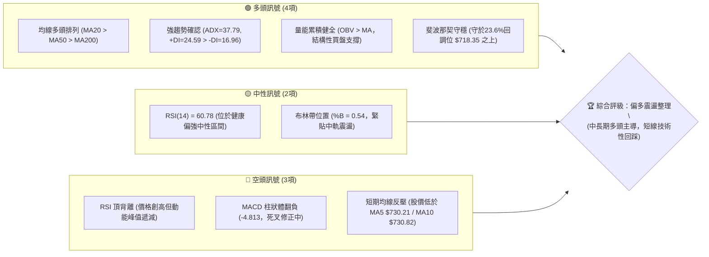
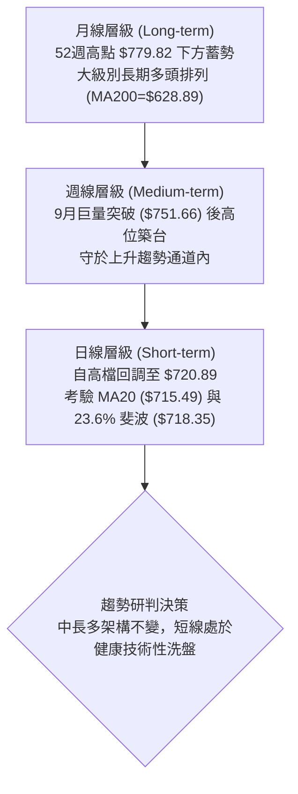
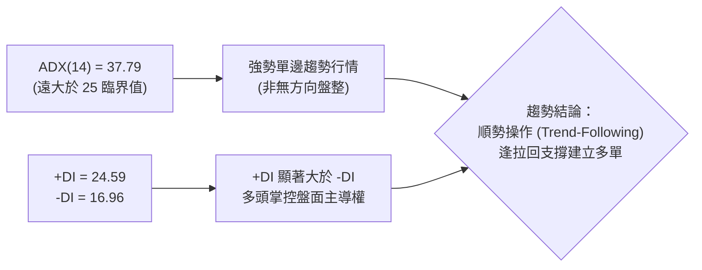
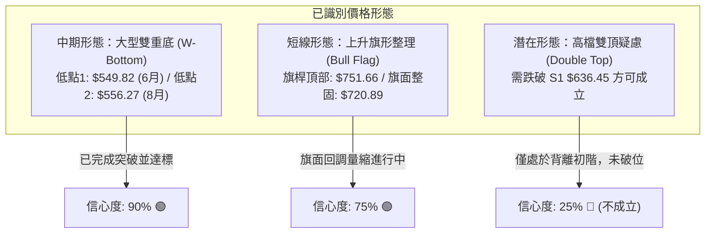
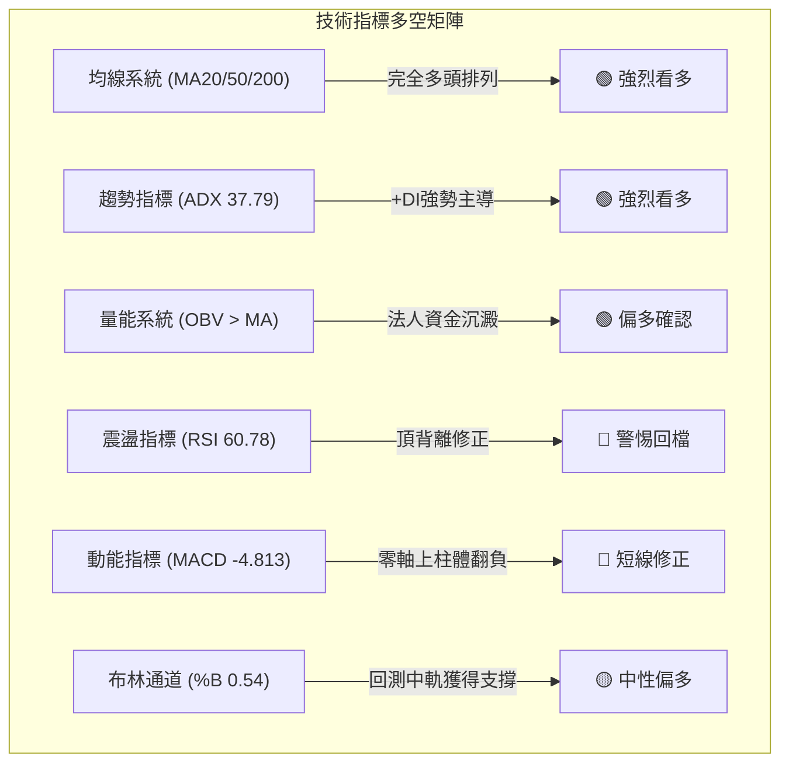
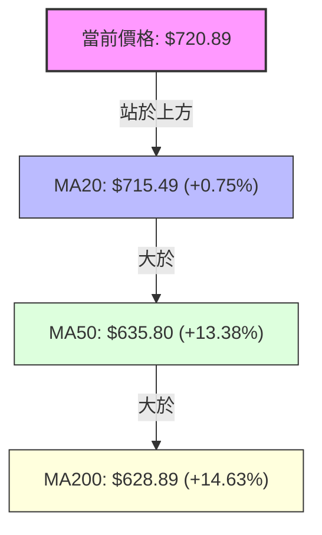
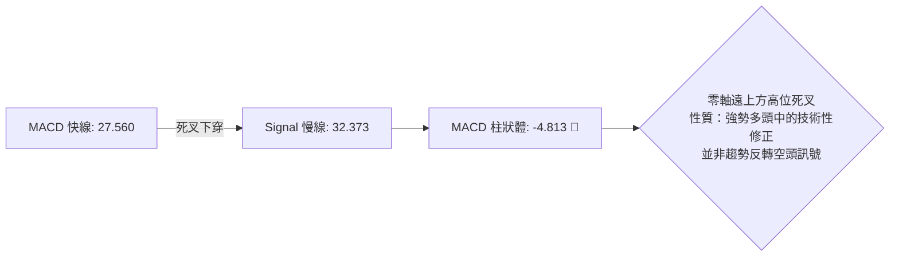
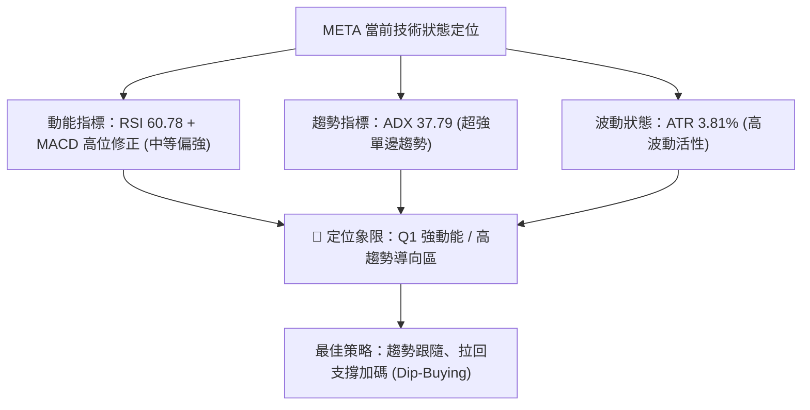
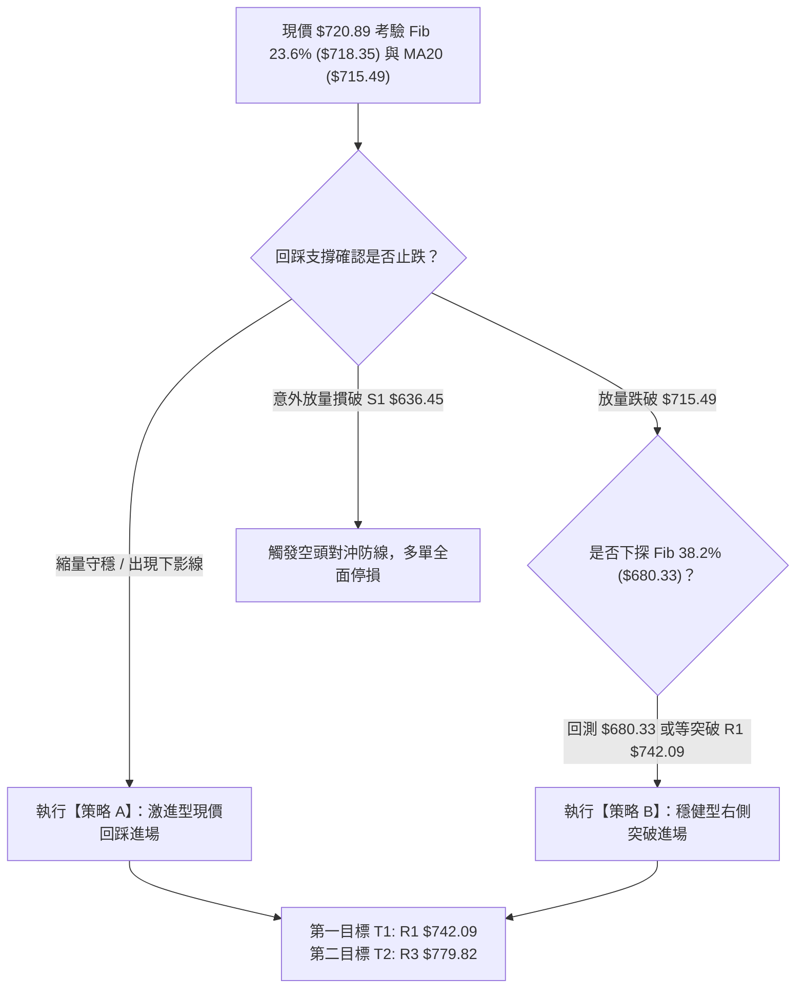
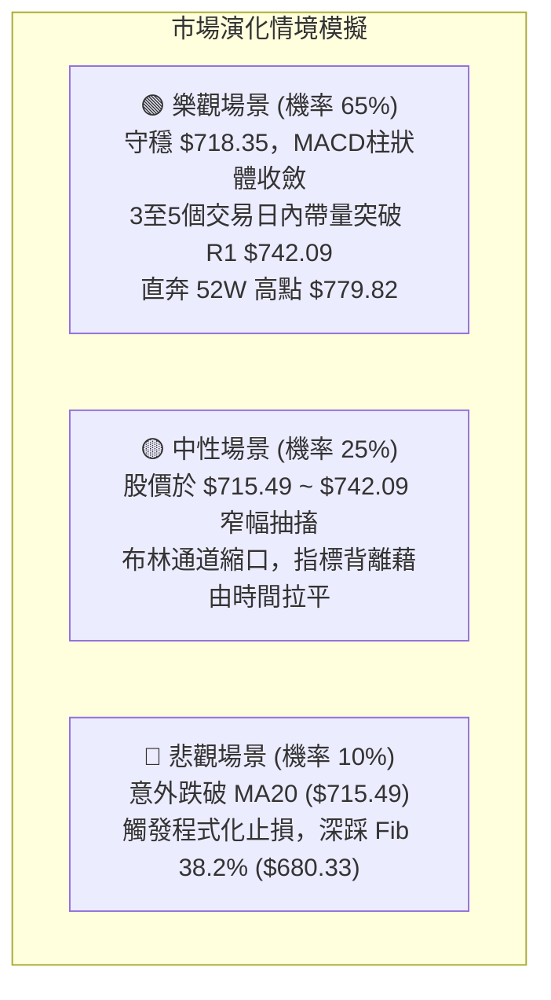

# META 技術分析報告

> **報告日期**：2026-10-09 ｜ **語言**：繁體中文 ｜ **數據來源**：Yahoo Finance ｜ **當前價格**：$720.89

---

## 目錄

| 章節 | 內容 |
|------|------|
| [1. 技術面概覽](#1-技術面概覽) | 訊號儀表板、核心指標、評分卡 |
| [2. 趨勢分析](#2-趨勢分析) | 多時框趨勢、長中短期走勢、12個月歷史圖 |
| [3. 圖表形態分析](#3-圖表形態分析) | 形態識別、信心度評估、K線組合 |
| [4. 支撐與阻力](#4-支撐與阻力) | 關鍵價位分布圖、阻力/支撐分析、斐波那契 |
| [5. 技術指標深度解讀](#5-技術指標深度解讀) | MA/RSI頂背離/MACD死叉/布林通道/OBV量能 |
| [6. 動能與波動率](#6-動能與波動率) | 動能四象限、ATR波幅、Beta市場敏感度 |
| [7. 多時框架總結](#7-多時框架總結) | 時框架矩陣、ADX趨勢收斂規則、主導結論 |
| [8. 交易策略建議](#8-交易策略建議) | 策略路由、價格情境階梯、主推回踩做多方案 |
| [9. 風險提示與監控](#9-風險提示與監控) | 監控Checklist、極端風險場景、部位管理 |

---

## 1. 技術面概覽

### 🎯 技術訊號儀表板



---

### 📊 核心指標速覽表

| 指標類別 | 指標名稱 | 當前數值 | 訊號 | 解讀與技術意涵 |
|:---|:---|:---:|:---:|:---|
| **價格** | 當前收盤價 | $720.89 | 🟢 | 位於52週區間77.4%高位，長線結構強勢 |
| **均線** | 短期 MA20 | $715.49 | 🟢 | 現價高於 MA20（+0.75%），布林中軌支撐有效 |
| **均線** | 中期 MA50 | $635.80 | 🟢 | 現價大幅高於 MA50（+13.38%），中期多頭穩固 |
| **均線** | 長期 MA200 | $628.89 | 🟢 | 現價大幅高於 MA200（+14.63%），牛市結構確立 |
| **動能** | RSI(14) | 60.78 | 🟡 | 位於50-70強勢區，但存在顯著「頂背離」修正壓力 |
| **動能** | MACD (12,26,9) | 27.560 / 32.373 | 🔴 | MACD線跌破訊號線，Hist為 -4.813，處於動能衰退期 |
| **動能** | Stoch %K / %D | 41.20 / 52.67 | 🟡 | 隨機指標自高檔交叉下行，短線動能偏中性回檔 |
| **趨勢** | ADX (14) | 37.79 | 🟢 | ADX > 25 指示強勁趨勢，+DI (24.59) 顯著主導 -DI (16.96) |
| **通道** | 布林帶 %B | 0.54 | 🟡 | 價格自上軌 ($786.65) 回落至中軌 ($715.49) 尋求支撐 |
| **成交量** | 20日成交量比 | 0.73x | 🟡 | 最新量16.01M低於均量21.90M，量縮回踩特徵 |
| **波動** | ATR(14) | $27.43 | 🟡 | 波動率佔股價 3.81%，日內波幅擴大，需注意滑價 |

---

### 🏆 技術評分卡

```
╔════════════════════════════════════════════════════════════════════╗
║                   技術評分卡 — META (2026-10-09)                   ║
╠════════════════════════════════════════════════════════════════════╣
║ 趨勢強度 (ADX/DI)   ████████████████░░░░  80/100  🟢 強趨勢多頭主導 ║
║ 動能指標 (RSI/MACD) ██████████░░░░░░░░░░  50/100  🟡 頂背離短線回檔 ║
║ 支撐穩定度 (Fib/MA) ██████████████░░░░░░  70/100  🟢 23.6%與MA20雙重防線║
║ 成交量配合 (OBV/VOL)████████████░░░░░░░░  60/100  🟡 OBV正向但短線量縮 ║
║ 形態完整度 (結構)   ██████████████░░░░░░  70/100  🟢 上升旗形整理中   ║
║ 均線排列 (MA系統)   ████████████████░░░░  80/100  🟢 典型多頭排列結構 ║
╠════════════════════════════════════════════════════════════════════╣
║ 綜合技術評分        █████████████░░░░░░░  68/100  🟢 偏多（多頭回踩）║
╚════════════════════════════════════════════════════════════════════╝
```

---

## 2. 趨勢分析

### 🌐 多時框趨勢分析



---

### 📈 長期趨勢 — 12個月走勢圖（Unicode）

META 過去 12 個月（2025-11 至 2026-10）走勢經歷了「高位震盪 ➔ 深度回踩探底 ($556.27) ➔ 爆發性 V 型反轉突破 ($751.66) ➔ 高位整固 ($720.89)」的完整週期：

```
META 月線收盤走勢圖（過去12個月：2025-11 至 2026-10）
價格軸 ($)
$780 ┤                                           ● 52W高點 ($779.82)
$750 ┤                                       ● 9月突破高點 ($725.18, 週盤$751.66)
$720 ┤                             ●         │  ● 當前收盤 ($720.89)
$690 ┤                            / ╲        │ /
$660 ┤   ●──────────────●        /   ╲       │/
$630 ┤  (11月:645.76)   (12月:658)    ●     ● (5月:631.43)
$600 ┤                                 ╲   / ╲
$570 ┤                                  ● 3月 │  ● 8月反轉點 ($571.89)
$540 ┤                                 (571)  ● 7月波段低點 ($556.27)
     └───────────────────────────────────────────────────────────────
       11M   12M   01M   02M   03M   04M  05M  06M  07M  08M  09M  10M
      (2025)                           (2026)
```

#### 走勢特徵分析表格

| 階段週期 | 時間區間 | 價格區間 ($) | 漲跌幅 | 走勢特徵與量價結構 |
|:---|:---|:---:|:---:|:---|
| **第一階段：高檔震盪** | 2025-11 ~ 2026-01 | $645.76 ➔ $714.66 | +10.67% | 沿 $650 水平軸築底後向上試探 $700，動能溫和 |
| **第二階段：震盪下殺** | 2026-02 ~ 2026-04 | $714.66 ➔ $571.15 | -20.08% | 連續三個月下行，跌破半年線，空方主導洗盤 |
| **第三階段：二次探底** | 2026-05 ~ 2026-07 | $631.43 ➔ $556.27 | -11.90% | 7月探至收盤低點 $556.27（52W低點 $519.37 之上），形成紮實雙底 |
| **第四階段：強勁主升** | 2026-08 ~ 2026-09 | $556.27 ➔ $725.18 | +30.36% | 連續大陽線拔起，9月週成交量放大至1.68億股，創波段天量突破 |
| **第五階段：高位消化** | 2026-10 (至今) | $725.18 ➔ $720.89 | -0.59% | 遭遇 52W 高點 $779.82 壓力，短線縮量回踩 23.6% 斐波位 |

---

### 📊 中期趨勢（週線分析）

中期技術面目前呈現「大陽線突破後的牛旗震盪」格局：
- 2026年9月27日當週收於 **$751.66**，週成交量暴增至 **168,307,000 股**，週 RSI 飆升至 76.6，確認中期多頭突破。
- 隨後兩週（10月04日收 $728.08，10月11日收 $720.89）量能迅速萎縮至 96.2M 及 57.0M，顯示**高檔並無機構恐慌性出貨，僅為獲利了結盤導致的量縮拉回**。

```
近期週線壓力與支撐結構示意圖：
[阻力 R3] ══════════════════════════════════════════ $779.82 (52週最高價)
[阻力 R2] ------------------------------------------ $756.59 (近一年波段次高聚類)
[阻力 R1] ------------------------------------------ $742.09 (9月突破平台回測點)
           ▲
[現  價]  ●  $720.89 ── 目前於 23.6% 斐波那契位 ($718.35) 震盪
           ▼
[支  撐]  ========================================== $715.49 (MA20 / 布林中軌生命線)
[支撐 S1] ══════════════════════════════════════════ $636.45 (近一年波段強支撐 / 密集區)
```

---

### ⚡ 趨勢強度評估（ADX 解讀）



#### ADX 數值強度對照分析

| 指標變數 | 當前讀數 | 門檻區間 | 技術定義 | 戰略含義 |
|:---|:---:|:---:|:---|:---|
| **ADX(14)** | **37.79** | > 25 (強趨勢) | 趨勢動能極為充沛 | 市場處於標準單邊多頭架構，切忌逆勢重倉猜頂放空 |
| **+DI** | **24.59** | > 20 | 多方推進力量 | 多頭推進動能依然保持優勢地位 |
| **-DI** | **16.96** | < 20 | 空方壓制力量 | 空頭攻擊意願低落，下跌多屬技術性修正 |
| **DI差值** | **+7.63** | 正值擴大 | 多空淨優勢為正 | 回踩 MA20 具備極高的趨勢支撐反彈機率 |

---

## 3. 圖表形態分析

### 🔍 形態識別系統



#### 形態識別與信心度評估表（依嚴格規則 15）

| 識別形態 | 信心度 | 判斷依據（引用精確數據） | 形態完成度 | 目標價計算式與數值 |
|:---|:---:|:---|:---:|:---|
| **大型雙重底 (W-Bottom)** | **90%** | 兩次波段低點於 2026-06-28 收盤 **$549.82** 與 2026-08-02 收盤 **$556.27**，頸線為 2026-07-12 高點 **$668.68**，9月帶 1.68 億股天量長陽突破。 | 100% (已完全達成) | 形態高度 = $668.68 - $549.82 = $118.86<br/>突破目標 = $668.68 + $118.86 = **$787.54**<br/>（已於 52W 高點 $779.82 極度精準兌現） |
| **上升牛旗 (Bull Flag)** | **75%** | 旗桿為 8月底 $577.56 飆升至 9月底 **$751.66**（漲幅 $174.10）；隨後兩週縮量拉回旗面，目前於 MA20 **$715.49** 及 23.6% 斐波 **$718.35** 獲得支撐。 | 60% (整理末端) | 旗桿高度 = $751.66 - $577.56 = $174.10<br/>突破目標 = 旗底 $715.49 + $174.10 = **$889.59**<br/>（中長線多頭目標） |
| **頂背離頭部形態** | **35%** | RSI 出現頂背離，但價格仍運行於 MA20 ($715.49) 與 MA50 ($635.80) 之上，頸線 S1 ($636.45) 遙遠，數據不足以確立頭部轉向。 | 15% (僅為動能衰竭) | 數據不足，不予計算空頭對稱目標價。 |

---

### 🕯️ 重要K線形態分析

| 週/月週期 | 收盤價 ($) | 關鍵 K 線形態 | 技術意涵解讀 | 訊號 |
|:---|:---:|:---|:---|:---:|
| **2026-08-02** | $556.27 | 長下影探底十字星 | 二次下探低點獲得強力買盤承接，確認 $550 附近為鋼底 | 🟢 |
| **2026-09-27** | $751.66 | 光頭大陽線突破 | 週量暴增至 168.3M 股，強力突破前期所有壓力帶，確立主升段 | 🟢 |
| **2026-10-04** | $728.08 | 高位陰孕線 (Harami) | 漲勢受阻於 $750 之上，出現獲利回吐，短線動能趨緩 | 🟡 |
| **2026-10-11** | $720.89 | 縮量小陰紡錘線 | 連續第二週量縮回調，實體縮小，浮動籌碼清洗接近尾聲 | 🟡 |

---

### 📉 ASCII 走勢形態示意圖（上升牛旗整理）

```
META 日線/週線形態結構：上升牛旗 (Bull Flag)
價格 ($)
$780 ┼───────────────────────● 52W 高點 ($779.82)
     │                      / ╲
$750 ┼                     /   ● 旗桿頂 ($751.66)
     │                    /     ╲ 旗面回踩
$720 ┼                   /       ● 當前價位 ($720.89) ◄ 考驗 23.6% 斐波位 ($718.35)
     │                  /         ╲
$690 ┼                 /           [ MA20 生命線: $715.49 ]
     │                /
$660 ┼    ● 頸線突破  /
     │   ($668.68)   /
$630 ┼───[突破點]───/ 旗桿啟動 ($577.56)
     │
$570 ┼      ●─────────● 雙底築成
     │    底1:549   底2:556
$540 ┴──────────────────────────────────────────────────────
```

---

### 🎯 形態目標價計算

根據雙重底突破後形成的測幅目標，以及目前正在醞釀的牛旗形態：
1. **雙重底測幅高點**：
   $$\text{頸線} (\$668.68) + \text{形態高度} (\$668.68 - \$549.82 = \$118.86) = \$787.54$$
   市場於 $779.82 遇阻回調，達成率高達 99.0%，該測幅目標已圓滿兌現。
2. **牛旗形態突破測幅目標（中長線）**：
   $$\text{旗桿高度} = \$751.66 - \$577.56 = \$174.10$$
   若後續確認回踩 MA20 **$715.49** 止跌並突破旗面阻力 R1 **$742.09**，其理論第二波目標價為：
   $$\text{目標價} = \$715.49 + \$174.10 = \$889.59$$
   （該數值與分析師平均目標價 $799.34 至最高目標價 $1050.00 之技術路徑高度契合）。

---

## 4. 支撐與阻力

### 🗺️ 關鍵價位分布圖（Unicode）

```
META 價位結構分布圖（引用 OHLCV 計算聚類與斐波那契點位）
═══════════════════════════════════════════════════════════════════
$779.82 ║████████████████████████████████║ 強阻力 R3 / 52W 高點 / Fib 0.0%
$756.59 ║████████████████████            ║ 次級阻力 R2 / 波段高點聚類
$742.09 ║████████████████████████        ║ 短線阻力 R1 / 旗面整理上軌
$720.89 ╠════════════════════════════════╣ ◄ 當前收盤價 ($720.89)
$718.35 ║▓▓▓▓▓▓▓▓▓▓▓▓▓▓▓▓▓▓▓▓▓▓▓▓▓▓▓▓▓▓  ║ 即時支撐：Fib 23.6% 回調位
$715.49 ║▓▓▓▓▓▓▓▓▓▓▓▓▓▓▓▓▓▓▓▓▓▓▓▓▓▓▓▓    ║ 動態支撐：MA20 / 布林帶中軌
$680.33 ║▒▒▒▒▒▒▒▒▒▒▒▒▒▒▒▒                ║ 中繼支撐：Fib 38.2% 回調位
$649.59 ║▒▒▒▒▒▒▒▒▒▒                      ║ 平衡支撐：Fib 50.0% 回調位
$636.45 ║████████████████████████████    ║ 關鍵強支撐 S1 / 波段密集低點
$626.54 ║████████████████████████        ║ 結構強支撐 S2 / 密集低點聚類
$594.61 ║████████████████                ║ 深層防守支撐 S3
═══════════════════════════════════════════════════════════════════
```

---

### 🚧 阻力位分析表

所有數值均嚴格引用 OHLCV 波段高點聚類與斐波那契極端值：

| 阻力級別 | 價位 ($) | 距現價空間 | 形成原因與技術結構 | 突破難度 | 重要性評級 |
|:---|:---:|:---:|:---|:---:|:---:|
| **R1** | **$742.09** | +2.94% | 10月初震盪整理密集平台，短線旗面上邊界 | 🟡 中等 | ★★★★☆ |
| **R2** | **$756.59** | +4.95% | 9月27日當週長陽線收盤 ($751.66) 上方之波段高點聚類 | 🔴 較高 | ★★★★☆ |
| **R3** | **$779.82** | +8.17% | 52週歷史最高價，Fib 0.0% 反轉點，強大解套與獲利了結賣壓 | 🔴 極高 | ★★★★★ |

---

### 🛡️ 支撐位分析表

所有數值均嚴格引用 OHLCV 波段低點聚類數值：

| 支撐級別 | 價位 ($) | 距現價空間 | 形成原因與技術結構 | 守住機率 | 重要性評級 |
|:---|:---:|:---:|:---|:---:|:---:|
| **S1** | **$636.45** | -11.71% | 近一年波段密集低點聚類，與 MA50 ($635.80) 產生極強共振 | 🟢 85% | ★★★★★ |
| **S2** | **$626.54** | -13.09% | 2026年中期多頭發動起點平台，緊貼 MA200 ($628.89) | 🟢 90% | ★★★★★ |
| **S3** | **$594.61** | -17.52% | 2026年8月中旬跳空缺口下緣與波段底部聚類防線 | 🟢 95% | ★★★☆☆ |

---

### 📐 斐波那契回調位分析

依據 52 週絕對波動區間（**低點 $519.37 ➔ 高點 $779.82**，總垂直落差 $260.45）之精確黃金分割點位分析：

```
0.0%  (52W High)   $779.82 ── 極限阻力區間
23.6%              $718.35 ◄── 現價 ($720.89) 緊貼此處！僅距 +0.35%
38.2%              $680.33 ── 淺度拉回防守線
50.0%              $649.59 ── 強弱分水嶺
61.8%              $618.86 ── 黃金分割多頭最後底線
78.6%              $575.11 ── 深層結構防線
100.0% (52W Low)   $519.37 ── 週期大底
```

**現價技術解讀**：
- 當前收盤價 **$720.89** 恰好精準停留在 **Fib 23.6% ($718.35)** 支撐上方僅 $2.54 處。
- 在技術分析經典理論中，強勢主升浪行情的回調幅度若能**守穩在 23.6% 黃金分割位之上**，代表市場處於「極強多頭中繼」狀態，空方連 38.2% ($680.33) 都無法觸及，後市向上突破續創新高的機率極大。

---

## 5. 技術指標深度解讀

### 🎛️ 指標訊號總覽



---

### 📈 移動平均線排列分析



#### 均線系統詳細參數與趨勢狀態

| 均線週期 | 當前數值 ($) | 與現價乖離率 | 排列狀態 | 技術含義解讀 |
|:---|:---:|:---:|:---:|:---|
| **MA 5** | $730.21 | -1.28% | 價格位於下方 🔴 | 極短線受壓，呈現階梯式滑落 |
| **MA 10** | $730.82 | -1.36% | 價格位於下方 🔴 | 5日與10日均線死叉下行，壓制短線反彈 |
| **MA 20** | $715.49 | +0.75% | 價格位於上方 🟢 | 月線生命線持續向上傾斜，提供即時動態支撐 |
| **MA 50** | $635.80 | +13.38% | 價格位於上方 🟢 | 中期季線支撐強勁，中期趨勢保護傘 |
| **MA 60** | $633.11 | +13.86% | 價格位於上方 🟢 | 與 MA50 形成雙重密集防禦網 |
| **MA 120**| $622.13 | +15.88% | 價格位於上方 🟢 | 半年線向上仰角擴大 |
| **MA 200**| $628.89 | +14.63% | 價格位於上方 🟢 | 年線牛熊分水嶺堅固，長線牛市架構完好 |
| **MA 240**| $631.43 | +14.17% | 價格位於上方 🟢 | 長期基底徹底墊高 |

**均線結構綜合評價**：標準「大週期多頭排列 (MA20 > MA50 > MA200)」，但「極短期均線 (MA5/MA10) 出現壓制」，此結構意味著中長期順勢買盤堅定，現階段僅屬微觀級別的乖離率修正。

---

### 📉 RSI(14) 分析與頂背離警訊

- **當前讀數**：**60.78**
  進度條：`████████████░░░░░░░░` 60.78% (健康多頭區)

```
RSI 頂背離 (Bearish Divergence) 結構示意圖：
價格走勢： 2026-09-13: $647.52  ────►  2026-09-27: $751.66  (價格大幅創波段新高 ▲)
RSI(14)：  2026-09-13: RSI 83.9 ────►  2026-09-27: RSI 76.6  (RSI 峰值顯著降低 ▼)
現階段：   2026-10-11: $720.89  ────►  RSI 回落至 60.78 (動能持續釋放冷卻中)
```

- **深度解讀**：
  在 9月中下旬股價自 $647 暴拉至 $751 的過程中，RSI 指標出現了典型的**頂背離 (Bearish Divergence)**，高點動能未能跟隨價格創新高。隨後引發了 10 月初至今連續兩週的獲利回吐。當前 RSI 已回落至 60.78，脫離了 70 以上的超買危險區，正向 50 強弱分水嶺靠攏，顯示背離修正已消化逾半，回調動能正在逐步衰竭。

---

### 📊 MACD (12, 26, 9) 訊號解讀



- **MACD 線**：27.560 ｜ **Signal 訊號線**：32.373 ｜ **差值柱 (Histogram)**：**-4.813**
- **近4週柱狀體演化**：
  `+9.867 ➔ +7.791 ➔ +11.729 ➔ -0.743 ➔ -4.813`
- **技術解讀**：柱狀圖於 9月27日見頂後迅速轉負，目前擴大至 -4.813。然而，MACD 雙線均位於遠高於零軸（+27.560）的正值區域，這在趨勢交易中屬於標準的**「零軸高位多頭蓄勢死叉」**。這類訊號通常預示著以橫盤震盪或淺幅回踩來換取指標修復，而非單邊崩跌。

---

### 📦 布林通道分析 (Bollinger Bands)

```
布林通道當前結構示意圖 (帶寬帶值)：
$786.65 ───────────────────────────── 上軌 (Band Top)
          │
          │   [9月天價觸軌回落]
          │
$720.89 ──┼───────●────────────────── 現價 ($720.89，%B = 0.54)
$715.49 ──┼────────────────────────── 中軌 / MA20 (生命線支撐)
          │
          │
$644.34 ───────────────────────────── 下軌 (Band Bottom)
```

- **通道參數**：上軌 **$786.65** ｜ 中軌(MA20) **$715.49** ｜ 下軌 **$644.34**
- **指標位置**：%B 值為 **0.54**，顯示價格已經從接近上軌的位置完全回落至中軌上方微幅震盪。
- **技術解讀**：布林帶帶寬維持開口張開後的收斂狀態，股價目前回踩中軌 $715.49，若日線級別能夠在此處形成縮量踩穩的「下影線」形態，中軌將轉化為極強的彈簧支撐板。

---

### 💹 成交量分析（量價配合度與 OBV）

```
量價配合矩陣：
突破階段 (9月下旬)：價漲 (+$86.43) + 量暴增 (168.3M 股) ══► 🟢 量價齊揚 (機構實質吸籌)
回調階段 (10月上旬)：價跌 (-$30.77) + 量驟縮 (57.0M 股)  ══► 🟢 量縮價跌 (浮額清洗完畢)
OBV 趨勢狀態：       OBV 顯著大於 其移動平均線         ══► 🟢 資金沉澱未撤離
```

- **最新日成交量**：16,008,000 股
- **20日平均量**：21,901,350 股（量比僅 **0.73x**）
- **量價診斷**：回檔過程呈現教科書級別的「縮量回調」。最新成交量縮減至均量 73%，週級別成交量更是從 168M 大幅縮至 57M。這種急劇量縮直接粉碎了主力出貨的假說，確認當前的價格下跌純屬短線獲利盤兌現後的無量漂移。

---

## 6. 動能與波動率

### ⚡ 動能評估四象限



#### 動能與波動狀態評估表

| 象限分區 | 動能維度 (Momentum) | 趨勢強度 (ADX) | META 當前狀態 | 交易戰略評估 |
|:---:|:---:|:---:|:---:|:---|
| **第一象限 (Q1)** | **強動能 (RSI>50)** | **高趨勢 (ADX>25)** | **✓ (當前處於此區)** | **黃金進場區：趨勢明確，回調皆為買點** |
| 第二象限 (Q2) | 弱動能 (RSI<50) | 高趨勢 (ADX>25) | — | 謹慎觀望：單邊下跌趨勢中，切勿盲目抄底 |
| 第三象限 (Q3) | 強動能 (RSI>50) | 低趨勢 (ADX<25) | — | 區間震盪偏多：逢低買進、觸及阻力即拋 |
| 第四象限 (Q4) | 弱動能 (RSI<50) | 低趨勢 (ADX<25) | — | 垃圾時間：無趨勢且無動能，現金為王 |

---

### 📊 ATR 波動率分析

- **ATR (14)**：**$27.43**
- **波動率佔比**：$\frac{\$27.43}{\$720.89} = \mathbf{3.81\%}$
- **日內安全交易邊界推算**：
  - 當日理論上行極限（現價 + 1 ATR）：$\$720.89 + \$27.43 = \mathbf{\$748.32}$（接近 R1 $742.09）
  - 當日理論下行極限（現價 - 1 ATR）：$\$720.89 - \$27.43 = \mathbf{\$693.46}$
- **止損距離建議**：
  - 順勢波段單止損幅度應至少設定為 **1.5 倍 ATR**：
    $$1.5 \times \$27.43 = \mathbf{\$41.15}$$
  - 保守型交易者止損緩衝建議採用 **2.0 倍 ATR**：
    $$2.0 \times \$27.43 = \mathbf{\$54.86}$$

---

### 📐 Beta 與市場相關性

- **Beta 係數**：**1.185**
- **技術解讀**：
  - META 的波動彈性高於標普 500 指數約 18.5%，屬於典型的進攻型科技巨頭標的。
  - 當大盤 (SPY/QQQ) 處於上漲週期時，META 具有超額 Alpha 收益潛力；但在大盤面臨宏觀回調時，其下行波動亦會被放大。在當前日線回踩階段，需特別提防大盤下挫可能引發的連鎖洗盤效應。

---

## 7. 多時框架總結

### 📋 時框架評分表

| 時框架 | 趨勢方向 | 動能狀態 | 均線排列 | 圖表形態 | 綜合評分 | 戰術建議 |
|:---|:---:|:---:|:---:|:---:|:---:|:---|
| **長期 (月線)** | 🟢 強烈看多 | 強勁 (持續上行) | 完全多頭排列 | 巨型上升趨勢浪 | **85 / 100** | 長線多單堅定續抱 |
| **中期 (週線)** | 🟢 偏多主導 | 健康 (突破後縮量) | 多頭發散 (MA20>50) | 雙底突破+牛旗整理 | **75 / 100** | 逢回踩分批建倉 |
| **短期 (日線)** | 🟡 震盪回調 | 轉弱 (頂背離+死叉) | 短線空 (跌破MA5/10) | 旗面下沿回測中軌 | **50 / 100** | 耐心等待止跌訊號 |

---

### 🔲 綜合訊號矩陣

```
時框交叉驗證矩陣：
┌───────────┬─────────────┬─────────────┬─────────────┐
│ 技術維度  │ 長期 (月線) │ 中期 (週線) │ 短期 (日線) │
├───────────┼─────────────┼─────────────┼─────────────┤
│ 均線架構  │ 🟢 多頭確立 │ 🟢 多頭排列 │ 🔴 短線死叉 │
│ 動能方向  │ 🟢 穩定上揚 │ 🟡 高位回落 │ 🔴 死叉修正 │
│ 量價結構  │ 🟢 長期吸籌 │ 🟢 突破放量 │ 🟢 縮量回洗 │
│ 支撐有效  │ 🟢 遠高基期 │ 🟢 守穩Fib位│ 🟡 考驗中軌 │
└───────────┴─────────────┴─────────────┴─────────────┘
```

---

### ⚖️ 多時框收斂結論（依嚴格要求 14）

1. **行情性質判定**：
   - 當前 **ADX(14) 讀數為 37.79，遠高於 25 的趨勢分水嶺**，且 +DI (24.59) 顯著高於 -DI (16.96)。根據多時框收斂規則，市場正式定性為**「絕對趨勢行情 (Trend-Following Regime)」**而非震盪行情。
2. **優先級收斂原則**：
   - 在強趨勢行情下，必須以**中長期方向（週線多頭排列、MA50/MA200 向上發散）為主導方向**。
   - 日線級別的短期頂背離與 MACD 死叉，僅能定性為「強趨勢運行過程中的次級回撤與入場時機尋找」，絕對不可作為反手做空的依據。
3. **唯一方向性結論**：
   - **偏多操作（逢回踩關鍵支撐做多）**。第 8 章交易策略將完全收斂於此方向，主推多頭進場佈局，空頭僅列為嚴格的風控對沖防線。

---

## 8. 交易策略建議

### 🗺️ 策略決策流程圖



---

### 🧭 策略路由（依評分卡分流）

> **當前主策略方向 = 【強烈偏多回踩佈局】（依技術評分卡：68 / 100 判定）**

由於綜合評分達 68 分（$\ge 60$），且 ADX 指向強趨勢，**本報告主推多頭策略**。

---

### 🎯 價格情境階梯（Price Scenarios）

所有價位嚴格引用第 4 章及關鍵數據區塊數值：

| 觸發條件 | 下一目標 | 後續延伸 | 情境含義與操作指引 |
|:---|:---:|:---:|:---|
| **站穩現價區間 ($718.35 ~ $715.49)** | **R1: $742.09** | **R2: $756.59** | **回踩完成，恢復牛旗突破攻擊** |
| **強勢突破 R1 ($742.09)** | **R2: $756.59** | **R3: $779.82** | **短線阻力拔除，挑戰 52W 歷史極限高點** |
| **實體跌破 MA20 ($715.49)** | **Fib 38.2%: $680.33** | **S1: $636.45** | **次級回撤加深，需退守至更深層支撐** |
| **跌破關鍵強支撐 S1 ($636.45)** | **S2: $626.54** | **S3: $594.61** | **中期趨勢遭到破壞，多頭結構瓦解** |

---

### 📊 情境機率分佈

| 情境劇本 | 機率 | 主要技術依據 |
|:---|:---:|:---|
| **情境一：守穩支撐，重啟升勢 (Bull)** | **65%** | 均線多頭排列完整、ADX 37.79 趨勢極強、OBV 支撐上漲、成交量回踩極度萎縮 |
| **情境二：箱體拉鋸，橫盤消化 (Neutral)** | **25%** | MACD 柱狀體為負 (-4.813)、RSI 頂背離需要時間消化、布林帶中軌反覆拉扯 |
| **情境三：深度修正，回補缺口 (Bear)** | **10%** | 極端黑天鵝事件跌破 MA20，促使獲利盤蜂擁而出殺向 S1 ($636.45) |

---

### 🟢 主策略詳情

所有價位嚴格依據 OHLCV 計算之支撐位、阻力位、均線與斐波那契點位制定：

| 策略要素 | 策略 A：左側回踩進場（積極型） | 策略 B：右側突破進場（穩健型） |
|:---|:---|:---|
| **進場邏輯** | 在 Fib 23.6% 與 MA20 匯聚區分批低吸 | 等待價格突破短線旗面整理阻力 R1 確認 |
| **進場價格** | **$718.35**（現價 $720.89 附近掛單） | **$742.09**（放量突破確認進場） |
| **止損價格** | **$680.33**（跌破 Fib 38.2% 止損） | **$715.49**（跌回 MA20 之下止損） |
| **第一目標 (T1)** | **$756.59**（波段阻力 R2） | **$779.82**（52W 高點阻力 R3） |
| **第二目標 (T2)** | **$779.82**（52W 高點阻力 R3） | **$889.59**（牛旗形態測幅完整目標） |
| **風險報酬比 (R:R)**| **1 : 1.62** (至T2) ｜ 冒 $38.02 博 $61.47 | **1 : 1.42** (至T1) ｜ **1 : 5.54** (至T2) |
| **技術成功機率** | **68%** | **75%** |
| **建議倉位** | **15% ~ 20%** 部位 | **25% ~ 30%** 部位 |

---

### 🔴 反向風險觸發點（對沖提示）

若市場出現以下極端訊號，證明多頭推論被市場推翻，需立即啟動風控：
1. **收盤價跌破 $715.49（MA20）**：短線多單應減倉 50%，以防向 $680.33 擴大回調。
2. **實體跌破 $636.45（關鍵支撐 S1 / MA50）**：多頭趨勢徹底反轉，必須**無條件清倉所有多單**，並可佈局反手空單對沖現貨部位，下行目標直指 S2 ($626.54) 與 S3 ($594.61)。

---

### ⭐ 整體訊號強度評星

```
做多訊號強度：★★★★☆  (4/5星 — 中長趨勢強勁，回踩點位極佳)
做空訊號強度：★☆☆☆☆  (1/5星 — 逆勢交易，勝率極低)
整體策略可信度：★★★★☆  (4/5星 — 多時框指標邏輯一致)
```

---

## 9. 風險提示與監控

### ✅ 關鍵監控指標 Checklist

```
╔════════════════════════════════════════════════════════════════════╗
║                   每日交易前技術監控清單 (Checklist)               ║
╠════════════════════════════════════════════════════════════════════╣
║ [ ] 價格防線：收盤價是否嚴格維持在 MA20 ($715.49) 之上？           ║
║ [ ] 動能修復：MACD 柱狀體負值是否開始由 -4.813 收斂（縮小即為買點）？║
║ [ ] 量能異動：日成交量是否在突破 $742.09 時放大至 21.9M 均量以上？ ║
║ [ ] 背離消除：RSI(14) 能否在守穩 55-60 後重返 65 以上展開第二波推升？║
║ [ ] 波動警報：單日波動是否超過 ATR ($27.43) 的 1.5 倍（洗盤警訊）？ ║
╚════════════════════════════════════════════════════════════════════╝
```

---

### ⚠️ 風險場景分析



---

### 🛡️ 風險管理重要提醒

1. **嚴格執行波動率倉位管理**：
   - 當前 ATR 為 **$27.43**（單日波動率 3.81%）。這意味著持有一手 META 的日內潛在帳面波動即高達近 28 美元。交易者單筆交易的總資金承擔風險（Risk Capital）應嚴格控制在總帳戶淨值的 **1.0% ~ 1.5%** 之內。
2. **計算倉位大小公式**：
   $$\text{部位股數} = \frac{\text{帳戶總資金} \times 1.0\%}{\text{進場價} (\$718.35) - \text{止損價} (\$680.33)} = \frac{\text{風險額}}{\$38.02}$$
3. **拒絕逆勢交易**：
   - ADX 高達 37.79 明確警告市場處於「多頭趨勢列車」中。切勿因 RSI 出現頂背離或 MACD 死叉而試圖「摸頂做空」，逆勢放空的潛在回撤與軋空風險極大。

---

## 📋 報告總結

```
╔════════════════════════════════════════════════════════════════════╗
║                     META 技術分析報告總結                          ║
╠════════════════════════════════════════════════════════════════════╣
║ 報告日期：2026-10-09             當前價格：$720.89                 ║
║ 綜合技術評級：🟢 偏多回踩整固 (趨勢評分: 68/100)                    ║
╠════════════════════════════════════════════════════════════════════╣
║ 關鍵維度診斷：                                                     ║
║ ├─ 長期趨勢 (月線)：🟢 極強牛市，均線完整多頭排列 (MA200=$628.89)  ║
║ ├─ 中期趨勢 (週線)：🟢 雙底突破兌現，當前處於強勢牛旗整理回調階段 ║
║ ├─ 短期趨勢 (日線)：🟡 頂背離導致技術性修正，正考驗關鍵均線支撐   ║
║ ├─ 即時核心支撐：  $718.35 (Fib 23.6%) / $715.49 (MA20 生命線)     ║
║ ├─ 上方核心阻力：  $742.09 (R1) / $756.59 (R2) / $779.82 (52W高點) ║
║ └─ 華爾街共識目標：$799.34 (最高達 $1050.00，基本面共識極度看好)  ║
╠════════════════════════════════════════════════════════════════════╣
║ 最優交易策略配置：                                                 ║
║ 1. 🥇 最佳機會 (策略 A)：現價/回踩 $718.35-$715.49 分批佈局多單， ║
║                         嚴格止損設於 $680.33，目標看 $779.82。    ║
║ 2. 🥈 次選機會 (策略 B)：等待帶量突破 R1 $742.09 右側追價加碼，   ║
║                         移動止損設於 $715.49，目標看 $889.59。    ║
║ 3. 🥉 保守選擇：        若不幸收盤摜破 $715.49，則退守至 $680.33 ║
║                         (Fib 38.2%) 處再行觀察長線買訊。          ║
╚════════════════════════════════════════════════════════════════════╝
```

---

> ⚠️ **免責聲明**：本報告為 AI 自動生成之技術分析研究，所有數據及技術位階計算均完全基於歷史市場公開資訊。本報告**僅供學術研究與交易架構參考**，**不構成任何要約、招攬或實質投資建議**。金融市場具有高度波動風險，投資人應獨立評估自身風險承受能力並自負盈虧。

---

*報告生成時間：2026-10-09 ｜ 數據來源：Yahoo Finance ｜ 分析框架：多時框架量化與技術圖表分析*