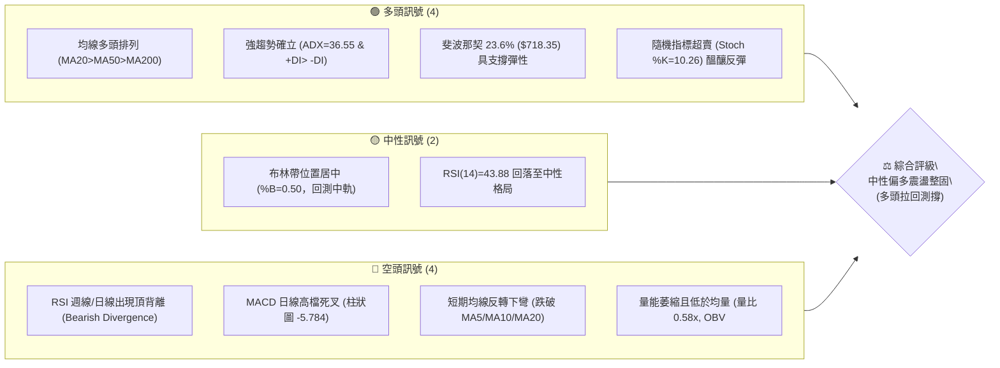
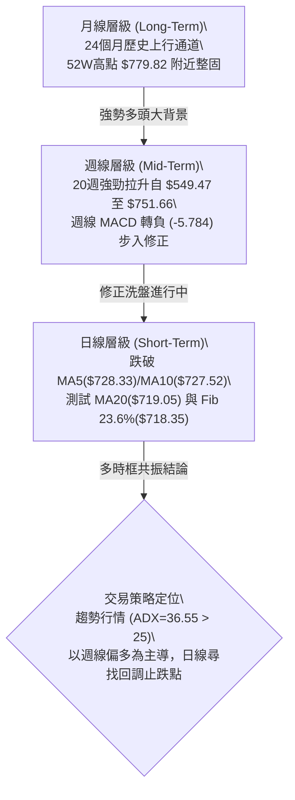
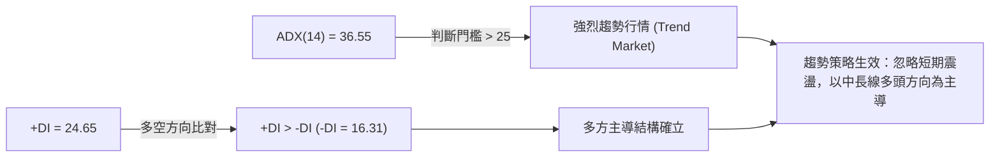
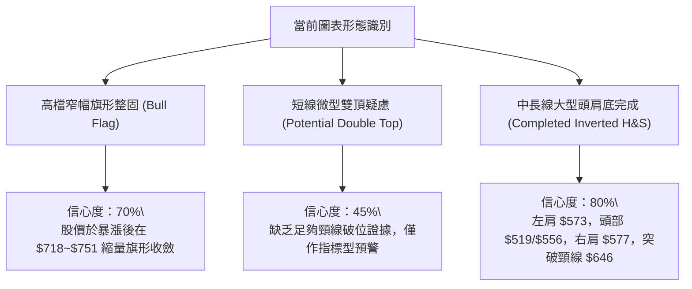
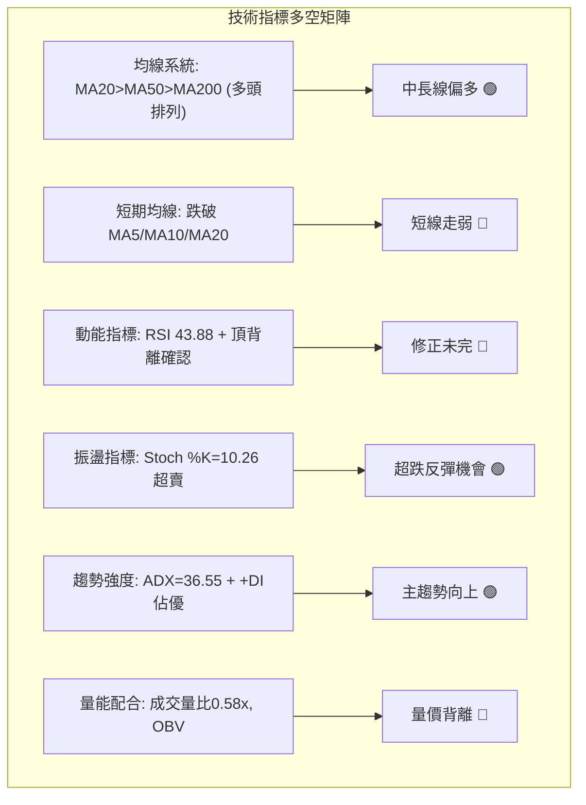
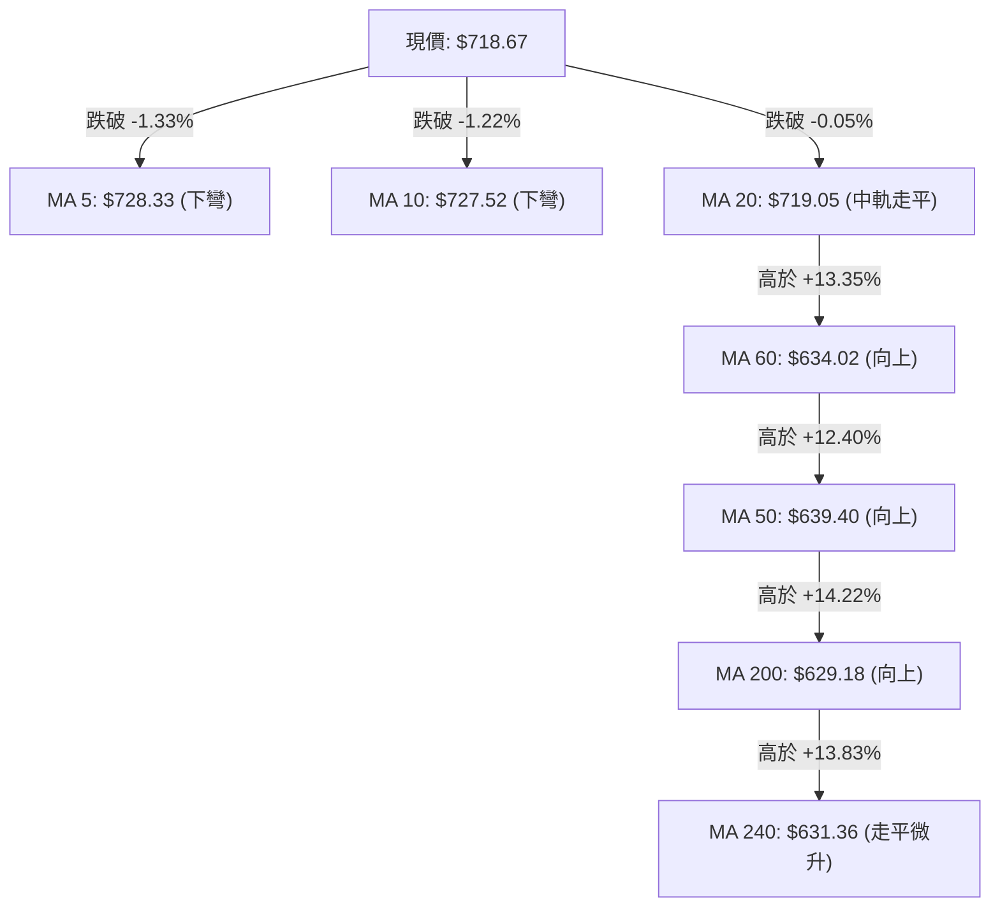
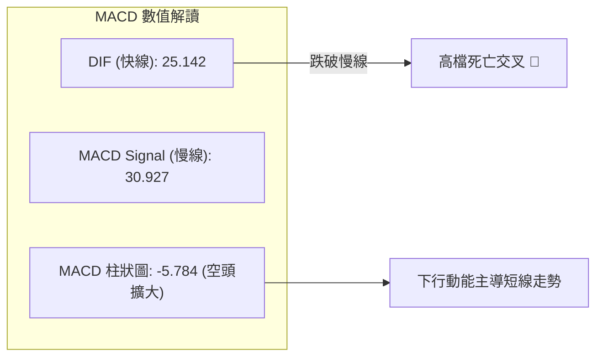
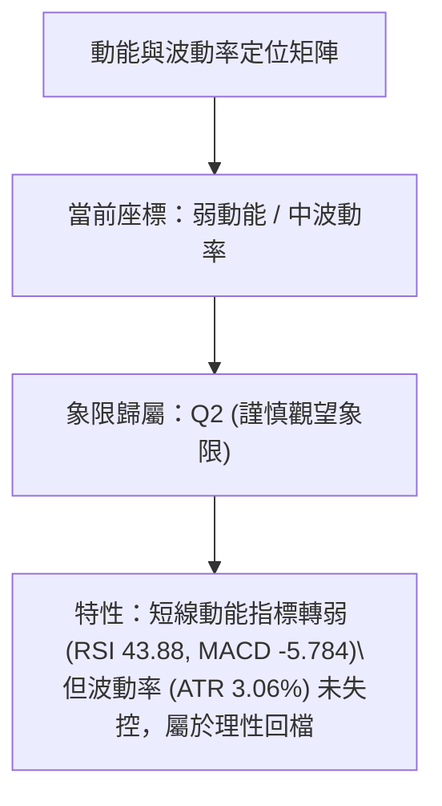
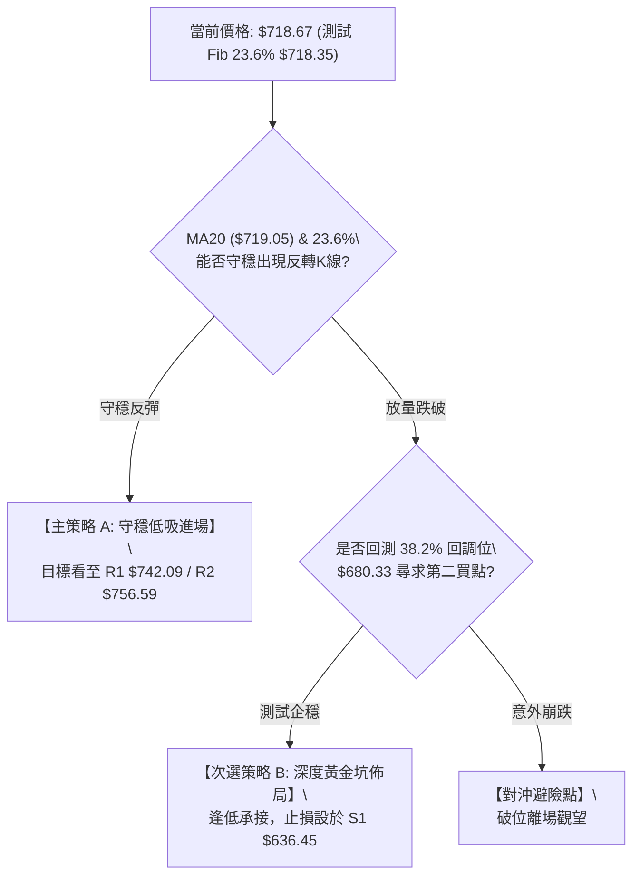
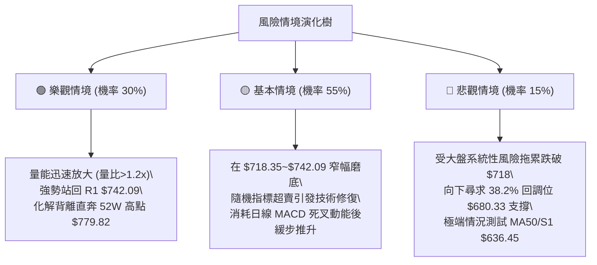

# META 技術分析報告

> **報告日期**：2026-10-10 ｜ **語言**：繁體中文 ｜ **數據來源**：Yahoo Finance ｜ **當前價格**：$718.67

---

## 目錄

| 章節 | 內容 |
|------|------|
| [1. 技術面概覽](#1-技術面概覽) | 訊號儀表板、核心指標、評分卡 |
| [2. 趨勢分析](#2-趨勢分析) | 多時框趨勢、長中短期走勢、ADX強趨勢評估 |
| [3. 圖表形態分析](#3-圖表形態分析) | 形態識別、K線組合、目標價推算 |
| [4. 支撐與阻力](#4-支撐與阻力) | 關鍵價位分布、波段高低點、斐波那契回調 |
| [5. 技術指標深度解讀](#5-技術指標深度解讀) | 均線系統、RSI背離、MACD死叉、布林通道、OBV |
| [6. 動能與波動率](#6-動能與波動率) | 動能四象限、ATR波幅風控、Beta係數解讀 |
| [7. 多時框架總結](#7-多時框架總結) | 時框架評分矩陣、多時框收斂定調 |
| [8. 交易策略建議](#8-交易策略建議) | 策略路由、價格情境階梯、主策略與避險規劃 |
| [9. 風險提示與監控](#9-風險提示與監控) | 關鍵監控清單、風險場景樹狀圖、風控紀律 |
| [10. 報告總結](#10-報告總結) | 核心結論與交易指針摘要 |

---

## 1. 技術面概覽

### 🎯 技術訊號儀表板



### 📊 核心指標速覽表

| 指標類別 | 指標名稱 | 當前數值 | 訊號 | 解讀 |
|:---|:---|:---|:---:|:---|
| **價格** | 當前收盤價 | $718.67 | 🟡 | 位於52週區間 76.5% 高位，短線遭遇波段回檔 |
| **短期均線**| MA 20 | $719.05 | 🔴 | 收盤微幅跌破 (-0.05%)，短線多空臨界點 |
| **中期均線**| MA 50 | $639.40 | 🟢 | 股價位於其上方 +12.40%，中期多頭趨勢堅固 |
| **長期均線**| MA 200 | $629.18 | 🟢 | 股價位於其上方 +14.22%，長期牛市基石穩固 |
| **動能指標**| RSI(14) | 43.88 | 🟡 | 中性偏弱；日線呈現顯著頂背離訊號 |
| **動能指標**| MACD 柱狀圖 | -5.784 | 🔴 | MACD(25.142) 低於訊號線(30.927)，修正動能擴大 |
| **超買超賣**| Stoch %K / %D | 10.26 / 34.17| 🟢 | 進階超賣區間，短線下行空間受限，具技術反彈契機 |
| **趨勢強度**| ADX (14) | 36.55 | 🟢 | >25 強趨勢確立；+DI(24.65) 大於 -DI(16.31) 多方主導 |
| **通道指標**| 布林 %B | 0.50 | 🟡 | 剛好觸及布林中軌 $719.05，等待方向確認 |
| **成交量能**| 量比 (Volume Ratio)| 0.58x | 🔴 | 最新量 12.60M 遠低於20日均量 21.69M；OBV < 均線 |
| **波動風險**| ATR (14) | $22.01 | 🟡 | 佔股價 3.06%，日常波動幅度適中，利於波段防守佈局 |

### 🏆 技術評分卡

```
╔════════════════════════════════════════════════════════════════╗
║                  技術評分卡 — META (2026-10-10)                ║
╠════════════════════════════════════════════════════════════════╣
║ 趨勢強度 (ADX & 方向)   ███████████████░░░░░  75/100   🟢 多方強勢 ║
║ 動能指標 (RSI & MACD)   ████████░░░░░░░░░░░░  40/100   🔴 短期背離 ║
║ 支撐穩定度 (S1-S3 & Fib)██████████████░░░░░░  70/100   🟢 關鍵回踩 ║
║ 成交量配合 (Volume/OBV) ██████░░░░░░░░░░░░░░  30/100   🔴 量能不足 ║
║ 形態完整度 (波段與通道) ████████████░░░░░░░░  60/100   🟡 箱體整固 ║
║ 均線排列 (長中短期分佈) ██████████████░░░░░░  72/100   🟢 結構偏多 ║
╠════════════════════════════════════════════════════════════════╣
║ 綜合技術評分            ███████████░░░░░░░░░  58/100   🟡 中性偏多 ║
║ 核心定調：大級別強趨勢延續中的「短期健康回檔修正」，逢低尋求支撐點  ║
╚════════════════════════════════════════════════════════════════╝
```

---

## 2. 趨勢分析

### 🌐 多時框趨勢分析



### 📈 長期趨勢 — 12個月走勢圖（ASCII）

以下展示自 2025 年 10 月至 2026 年 10 月之月線收盤價歷史演變：

```
META 月線收盤走勢圖（過去12個月）
價格 ($)
$780 ┤                                                 ● 52W高 $779.82
$750 ┤                                            
$720 ┤                                                ● $725.18 ──● 現價 $718.67
$690 ┤         ● $714.66                               (09月)      (10月)
$660 ┤               ● $646.52      ● $631.43
$630 ┤ ● $646.16          ● $610.86
$600 ┤    ● $645.76   ● $658.40   ● $571.15
$570 ┤                               ● $562.85  ● $571.89
$540 ┤                                   ● $556.27 (07月波段低點)
     └─┬──────┬──────┬──────┬──────┬──────┬──────┬──────┬──────┬──────┬──────┬──────┬───
     10月   11月   12月   01月   02月   03月   04月   05月   06月   07月   08月   09月  10月
     '25    '25    '25    '26    '26    '26    '26    '26    '26    '26    '26    '26   '26
```

**12個月走勢特徵分析表格**：

| 階段區間 | 時間跨度 | 起訖收盤價 | 區間漲跌幅 | 走勢結構與技術特徵 |
|:---|:---|:---|:---:|:---|
| **第一階段：高檔震盪** | 2025-10 ～ 2026-01 | $646.16 → $714.66 | +10.60% | 構築寬幅箱體，突破至 $714.66 創階段波段高點 |
| **第二階段：中期回撤** | 2026-01 ～ 2026-03 | $714.66 → $571.15 | -20.08% | 動能衰竭，快速失守均線群，尋求中期防守位 |
| **第三階段：築底震盪** | 2026-03 ～ 2026-07 | $571.15 → $556.27 | -2.61%  | 於 $546~$556 區間完成雙底夯實，打出52週次低區間 |
| **第四階段：主升爆發** | 2026-07 ～ 2026-09 | $556.27 → $725.18 | +30.36% | 量能激增（週量達 168.3M），以大陽線突破所有均線 |
| **第五階段：衝高蓄勢** | 2026-09 ～ 2026-10 | $725.18 → $718.67 | -0.90%  | 逼近 52W 高點 $779.82 後受阻，進入窄幅高檔整固 |

### 📊 中期趨勢（週線分析）

從近 20 週資料可見，自 2026-08-02 觸及波段低點 $556.27（當週 RSI 降至 22.9 極度超賣）後，META 展現強大的V型反轉爆發力。2026-09-27 當週成交量放大至 168,307,000 股，收盤推升至 $751.66，MACD 柱狀圖衝刺至 +11.729。

然而，隨後兩週走勢出現轉折：
1. **2026-10-04**：收盤回落至 $728.08，週 RSI 自 76.6 降至 62.3，MACD 柱狀圖驟降至 -0.743（由正翻負）。
2. **2026-10-11**：收盤進一步走低至 $718.67，週 RSI 跌至 43.9，MACD 柱狀圖負值擴大至 -5.784，週量縮減至 69,656,200 股。

```
近期週線壓力與支撐示意圖
════════════════════════════════════════════════════════════════════
  $779.82  ────────  52週歷史高點 / 強大波段反壓 (R3)
     ▲
  $751.66  ────────  09-27 週線反彈高點 / 爆量長黑上影線壓制 (R2: $756.59)
     ▲
  $742.09  ────────  第一阻力位 (R1)
 ══════════════════════════════════════════════════════════════════
  $718.67  ───◄ 現價 (測試斐波那契 23.6% 回調位 $718.35 與 MA20)
 ══════════════════════════════════════════════════════════════════
     ▼
  $680.33  ────────  斐波那契 38.2% 回調支撐
     ▼
  $639.40  ────────  MA50 / 關鍵支撐 S1 ($636.45) 區域
════════════════════════════════════════════════════════════════════
```

### ⚡ 趨勢強度評估（ADX 解讀）



**ADX 趨勢強度量化指標解讀表**：

| 指標變數 | 當前讀數 | 門檻區間 | 趨勢判定 | 操作指引 |
|:---|:---:|:---:|:---:|:---|
| **ADX (14)** | **36.55** | > 25 (強烈) | 強單邊趨勢延續中 | 嚴禁逆大勢做空；順應中長期均線回踩買進 |
| **+DI** | **24.65** | 基準線 | 多頭買盤佔優 | 多方動能雖自高點收斂，但仍壓制空方 |
| **-DI** | **16.31** | 基準線 | 空頭拋壓相對微弱 | 回檔屬於縮量籌碼換手，非崩跌式主力出逃 |
| **差值 (+DI - -DI)**| **+8.34** | 正值擴張 | 淨多頭優勢 | 趨勢基底穩固，當前修正屬於技術性降溫 |

---

## 3. 圖表形態分析

### 🔍 形態識別系統



**圖表形態信心度評估表（依規範嚴格校準）**：

| 形態名稱 | 信心度 | 判斷依據（引用實際數據） | 形態完成度 | 目標價（附嚴謹計算式） |
|:---|:---:|:---|:---:|:---|
| **中期大型頭肩底** | **80%** | 左肩低點 2025-03 ($573.58)，頭部 52W 低點 ($519.37) 與 2026-07 ($556.27)，右肩 2026-08 ($577.56)。頸線突破點落於 2025-10/11 平台約 $646.16。 | **100%** (已突破) | 形態高度 = 頸線 $646.16 - 頭部 $519.37 = $126.79。<br>突破目標價 = $646.16 + $126.79 = **$772.95**（已於 52W 高點 $779.82 附近達成波段滿足點）。 |
| **高檔高旗形整固 (Bull Flag)** | **70%** | 2026-09 自 $577.56 急拉至 $751.66（旗桿高度 $174.10）。近兩週在 $718.67~$751.66 區間縮量斜向回撤，成交量萎縮 58%。 | **65%** (蓄勢中) | 突破確認點為 R1 $742.09。<br>若旗形向上突破，測幅目標 = $742.09 + 旗桿高度 $174.10 = **$916.19**（數據中未直接偵測此阻力，此為純幾何測幅）。 |
| **短線雙頂回撤形態** | **45%** | 訊號不足，僅做指標型解讀。雖在 $751.66 與 52W 高點 $779.82 形成局部雙峰，但頸線尚未跌破關鍵中軌，不構成確立型態。 | **35%** (未確立) | 若跌破日線支撐，以回調斐波那契 38.2% **$680.33** 作為調整目標。 |

### 🕯️ 重要K線形態分析

| 週期/月份 | 收盤價 | K線形態 | 量價結構解讀 | 多空訊號 |
|:---|:---:|:---|:---|:---:|
| **2026-08** | $571.89 | **破底翻中陽線** | 守穩 $556.27 後拉出帶下影線紅K，確認 $550 支撐帶有效性 | 🟢 強烈買訊 |
| **2026-09** | $725.18 | **大陽突破長紅棒** | 單月暴漲 +26.8%，實體貫穿 MA50 與 MA200，多頭主升段啟動 | 🟢 極度看多 |
| **2026-09-27 (週)** | $751.66 | **爆量長上影陽線** | 單週巨量 168.3M 衝刺 $751 上方，留長上影線，顯現獲利了結賣壓 | 🟡 滯漲預警 |
| **2026-10-04 (週)** | $728.08 | **反轉中陰線** | 週跌 -3.14%，量能收縮至 96.2M，確認 $750 關卡上方解套阻力強大 | 🔴 短線翻空 |
| **2026-10-11 (週)** | $718.67 | **縮量紡錘陰線** | 連續第二週陰線回檔，週量降至 69.7M，呈現典型縮量洗盤特徵 | 🟡 企穩醞釀 |

### 📉 ASCII 走勢形態示意圖

```
高檔旗形整理與阻力示意圖
══════════════════════════════════════════════════════════════════════════════
  $779.82 ───┐ (52W High)
             │ 
  $751.66 ───┴─────● (旗面高點 / R2: $756.59)
                    \
  $742.09 ───────────\──────● (阻力 R1)
                      \      \
  $718.67 ─────────────●──────\─────● 現價 $718.67 (測試旗形下軌 / MA20)
                                \
  $680.33 ───────────────────────● (斐波那契 38.2% 防守位)
══════════════════════════════════════════════════════════════════════════════
  註：自 $577.56 拉升至 $751.66 構成旗桿，目前股價於旗面通道中回測整固。
```

---

## 4. 支撐與阻力

### 🗺️ 關鍵價位分布圖（ASCII）

```
META 價位結構分布圖（嚴格引用系統計算點位）
═════════════════════════════════════════════════════════════════
  $779.82 ║████████████████████████████████║ 52W 最高點 / 強大波段阻力 R3
  $756.59 ║████████████████████████        ║ 次級波段高點阻力 R2
  $742.09 ║████████████████                ║ 近期反彈波段阻力 R1
 ═════════╬════════════════════════════════╬════════════════════
  $718.67 ╠════════════════════════════════╣ ◄ 當前市價 (對齊 Fib 23.6% $718.35)
 ═════════╬════════════════════════════════╬════════════════════
  $680.33 ║▓▓▓▓▓▓▓▓▓▓▓▓▓▓▓▓▓▓▓▓            ║ 斐波那契 38.2% 回調重要防守位
  $649.59 ║▓▓▓▓▓▓▓▓▓▓▓▓▓▓▓▓▓▓▓▓▓▓▓▓        ║ 斐波那契 50.0% 中樞平衡位
  $636.45 ║████████████████████████████    ║ 關鍵波段低點支撐 S1 (近MA50: $639.40)
  $626.54 ║██████████████████████████████  ║ 強支撐 S2 (近MA200: $629.18)
  $594.61 ║████████████████████████████████║ 極限波段防守支撐 S3
═════════════════════════════════════════════════════════════════
```

### 🚧 阻力位分析表

所有阻力數值嚴格引用系統提供的近一年波段高點聚類數值：

| 阻力級別 | 準確價位 | 距現價幅標 | 形成原因與籌碼屬性 | 突破難度評估 | 重要性等級 |
|:---|:---:|:---:|:---|:---:|:---:|
| **R1** | **$742.09** | +3.26% | 近期日線下挫起跌點；跌破 MA5/MA10 之反抽頸線壓力 | 中等 (需日量 > 20M) | 🟡 短線樞紐 |
| **R2** | **$756.59** | +5.28% | 2026-09-27 當週衝高 $751.66 形成之波段密集套牢區頂部 | 偏高 (需化解週量168M賣壓) | 🟢 中期關鍵 |
| **R3** | **$779.82** | +8.51% | 52週最高紀錄點；歷史天花板心理反壓區間 | 極高 (需整體市場情緒共振) | 🔴 長期極限 |

### 🛡️ 支撐位分析表

所有支撐數值嚴格引用系統提供的近一年波段低點聚類數值：

| 支撐級別 | 準確價位 | 距現價幅標 | 形成原因與技術共振 | 守住機率評估 | 重要性等級 |
|:---|:---:|:---:|:---|:---:|:---:|
| **S1** | **$636.45** | -11.44% | 近一年主要震盪平台底部；與 MA50 ($639.40) 形成密集共振帶 | 85% (中期強韌) | 🟢 中期生命線 |
| **S2** | **$626.54** | -12.82% | 2026年上半年多次探底密集聚類點；緊鄰 MA200 ($629.18) 牛熊分界線 | 90% (極強護城河) | 🔴 長期多頭底線 |
| **S3** | **$594.61** | -17.26% | 2026-06~08 築底區間箱體下緣；破位則代表牛市主升段徹底瓦解 | 95% (最後防線) | 🔴 極限防守 |

### 📐 斐波那契回調位分析

依據 52 週絕對波動區間（最低點 **$519.37** 至最高點 **$779.82**，總波幅高達 $260.45）進行黃金分割計算，各層級回調價位如下：

| 分割比例 | 基準價位 | 當前相對位置 | 技術意涵與防守意義 |
|:---:|:---:|:---:|:---|
| **0.0%** (52W High) | **$779.82** | +8.51% | 牛市頂點阻力，本輪上升行情的終極挑戰位 |
| **23.6%** | **$718.35** | **-0.04% (現價 $718.67 緊密貼合)** | **極強多頭回調容忍極限**。現價精準停留在 23.6% 邊緣，若能實體守穩，意味強勢多頭格局未變 |
| **38.2%** | **$680.33** | -5.34% | 正常健康回檔位。若 23.6% 失守，股價將下探此區尋求第二梯隊買盤 |
| **50.0%** | **$649.59** | -9.61% | 多空強弱分水嶺。跌破此處代表上升動能衰竭轉為寬幅震盪 |
| **61.8%** | **$618.86** | -13.89% | 黃金分割防禦點。與 S2 ($626.54) 及 MA200 ($629.18) 構築最後防禦集團 |
| **78.6%** | **$575.11** | -19.98% | 深度回撤位，2026-08 波段起漲原點附近 |
| **100.0%** (52W Low) | **$519.37** | -27.73% | 52週最低點，基本面系統性崩跌之支撐底限 |

> 📌 **位置解讀**：META 當前收盤價 $718.67 **極其精準地卡在 23.6% 回調位 ($718.35) 上方僅 $0.32 之處**，同時貼合 MA20 ($719.05)。這表明市場正處於「強勢回檔整理」的最關鍵臨界分水嶺。

---

## 5. 技術指標深度解讀

### 🎛️ 指標訊號總覽



### 📈 移動平均線排列分析



**均線結構深度解析**：
1. **多頭排列基礎未受損**：長期格局依然呈現完美的標準多頭排列：$MA20 ($719.05) > MA50 ($639.40) > MA200 ($629.18)$。中長線多方架構極度紮實。
2. **短期均線死叉壓制**：超短期均線 MA5 ($728.33) 與 MA10 ($727.52) 於本週快速下穿形成死叉，現價位於兩者下方逾 1.2%，構成第一道動態反壓帶（$727.50~$728.50）。
3. **MA20 爭奪戰**：現價 $718.67 與 MA20 ($719.05) 差距僅 $0.38。若連續 2 個交易日無法收復 MA20，短期回檔將向下尋找更深層次的流動性支撐。

### 📉 RSI(14) 分析與背離判斷

*   **當前數值**：**43.88**（落於中性偏空區間 30–50）
*   **動能強度**：████████░░░░░░░░░░░░ 43.88%

```
RSI(14) 區間位置示意
0 ──────────── 30 ──────────────── 50 ─────── 70 ────────── 100
[  超賣區間   ]   [  中性偏空: 43.88  ]   [  中性偏多  ]   [  超買區間   ]
                   ▲
```

#### ⚠️ 背離分析：頂背離（Bearish Divergence）成立
*   **現象驗證**：回顧 2026-09-13 當週，股價於 $647.52 時，週 RSI 達到 **83.9** 的極度超買高位；隨後股價在 2026-09-27 暴衝至高點 $751.66（創波段新高），然而當週 RSI 卻降至 **76.6**。
*   **結論判斷**：股價創新高而指標未創新高，標準「**典型頂背離（Bearish Divergence）**」完全成立。近期股價自 $751.66 回落至 $718.67，正是在釋放該頂背離所引發的拋售動能，目前背離修正仍在進行中。

### 📊 MACD (12, 26, 9) 訊號解讀



*   **數值解讀**：DIF 數值 25.142 位於零軸之上甚遠，顯示長線仍處於多頭大週期中。但 DIF 已向下跌穿訊號線 30.927，柱狀圖（Histogram）擴大負值至 **-5.784**。
*   **動能結論**：MACD 高檔死叉發出明確的階段性休整訊號，短期空頭動能佔據上風，切勿在柱狀圖收斂翻紅前盲目重倉追高。

### 📦 布林通道分析

```
布林通道現狀示意圖 (Bollinger Bands: 20, 2)
═════════════════════════════════════════════════════════════════
  $782.60 ───────────────────────────── 上軌 (Upper Band)
     ▲
  $750.00 ───
     ▲
  $719.05 ───────────●───────────────── 中軌 (MA20)
                     │ ◄ 現價 $718.67 (%B = 0.50)
     ▼
  $680.00 ───
     ▼
  $655.50 ───────────────────────────── 下軌 (Lower Band)
═════════════════════════════════════════════════════════════════
```

*   **布林帶寬度**：上軌 $782.60，下軌 $655.50，頻寬達 $127.10。
*   **%B 指標值**：**0.50**。精準坐落於通道正中心（中軌 $719.05 處）。
*   **通道狀態判讀**：股價自上軌 $782 附近遭遇壓制後快速回吐，目前正在回測通道中軌尋求支撐。若跌破中軌，下軌 $655.50 將成為中期極限支撐目標。

### 💹 成交量分析（量價配合度）

1. **量能萎縮**：最新單日成交量為 **12,605,100 股**，相較於 20 日均量 **21,687,010 股**，量比僅 **0.58x**。顯示下跌並非恐慌性拋售，而是買盤追高意願減退的縮量回檔。
2. **OBV 能量潮疲弱**：指標顯示 **OBV < MA**。能量潮走勢弱於其均線，顯示近兩週資金呈現淨流出狀態，量能無法對目前的強勢多頭提供即時確認。

---

## 6. 動能與波動率

### ⚡ 動能評估四象限



**動能評估四象限詳細比對表**：

| 象限 | 動能維度 | 波動維度 | 當前狀態標註 | 戰術指引 |
|:---:|:---:|:---:|:---:|:---|
| **Q1 (最佳擴張)** | 強 (RSI>60, MACD>0) | 低 (ATR% < 2%) | ─ | 適合順勢突破追價加碼 |
| **Q2 (洗盤整固)** | 弱 (RSI<50, MACD<0) | 中低 (ATR% 2-3.5%) | **✓ (META 當前位置)** | **以逸待勞，等待量能見底及止跌K線** |
| **Q3 (極限博弈)** | 強 (超買背離) | 高 (ATR% > 4%) | ─ | 高風險高收益，需嚴設緊密止損 |
| **Q4 (流動性危機)**| 弱 (急跌崩潰) | 高 (恐慌拋售) | ─ | 嚴格空倉避險，禁止接飛刀 |

### 📊 ATR 波動率分析與止損測算

*   **ATR(14) 數值**：**$22.01**
*   **佔股價比率**：$22.01 / $718.67 = **3.06%**
*   **交易應用規劃**：
    *   **短線雜訊過濾閥（1.0x ATR）**：$22.01。任何日內小於 $22 的波動均屬市場隨機噪聲。
    *   **標準防守止損距離（1.5x ATR）**：$1.5 \times 22.01 = **$33.02**。
    *   **寬鬆波段止損距離（2.0x ATR）**：$2.0 \times 22.01 = **$44.02**。

### 📐 Beta 與市場相關性

*   **Beta 數值**：**1.185**
*   **特徵解讀**：META 波動性相較於標普 500 指數高出約 18.5%。在美股大盤處於牛市環境下，META 具備明顯的超額阿爾法（Alpha）進攻潛力；但當大盤出現回調時，其下行 beta 放大效應亦會加速個股回撤。這要求投資人在防守時不可忽視系統性風險。

---

## 7. 多時框架總結

### 📋 時框架評分表

| 時框架 | 趨勢方向 | 動能狀態 | 均線排列 | 圖表形態 | 綜合評分 | 戰略建議 |
|:---|:---:|:---:|:---:|:---:|:---:|:---|
| **月線 (長期)** | 🟢 多頭主導 | 🟢 強勁向上 | 🟢 多頭排列 | 大型頭肩底突破達成 | **85 / 100** | 長線多單堅定續抱 |
| **週線 (中期)** | 🟢 震盪偏多 | 🟡 高檔背離 | 🟢 均線支撐完備 | 暴漲後的高檔旗形整理 | **65 / 100** | 逢低分批吸納，切忌追高 |
| **日線 (短期)** | 🔴 回檔修正 | 🔴 死叉延續 | 🔴 跌破MA5/10/20 | 頂背離引發之回撤測撐 | **35 / 100** | 等待止跌結構，不搶急單 |

### 🔲 綜合訊號矩陣

```
時框架訊號矩陣一覽
═══════════════════════════════════════════════════════════════════════
 維度       月線 (長期)         週線 (中期)          日線 (短期)
───────────────────────────────────────────────────────────────────────
 趨勢      🟢 上升通道         🟢 多方主導          🔴 短線下行
 均線      🟢 MA200之上遠處    🟢 MA50向上引導      🔴 MA20爭奪失守
 動能      🟢 宏觀牛市         🟡 MACD翻負(-5.78)   🔴 RSI跌破50中軸
 量能      🟢 放量突破基底     🔴 週量萎縮          🔴 量比0.58x嚴重縮量
 形態      🟢 歷史大底確認     🟡 高檔箱體整固      🔴 局部雙峰破線
═══════════════════════════════════════════════════════════════════════
 一致性判定：中長期趨勢與短期節奏產生衝突，屬「大多頭週期下的次級折返」。
═══════════════════════════════════════════════════════════════════════
```

### ⚖️ 多時框收斂結論（嚴格遵守收斂規則）

1. **行情性質判定**：當前 **ADX(14) 讀數為 36.55（遠大於 25 臨界閥值）**，依規則明確定義為「**強趨勢行情（Trend Market）**」。
2. **主導時框裁決**：在強趨勢架構下，**以中長期時框（週線與日線 MA50: $639.40 / MA200: $629.18）方向為主導**，日線級別之回檔僅視為「尋找多頭進場時機的次級波折」，嚴禁以日線短期弱勢全盤推翻中長線牛市。
3. **收斂方向判定**：**中長期偏多，短線耐心等待回調測撐確認（偏多觀望 / 拉回低吸）**。最終交易策略嚴格錨定此一方向展開。

---

## 8. 交易策略建議

### 🗺️ 策略決策流程圖



### 🧭 策略路由

*   **當前綜合技術評分**：**58 / 100**（中性偏多整固格局）。
*   **當前主策略方向**：**拉回逢低承接多單（Pullback Long）**。
    *   以宏觀強趨勢（ADX 36.55）為依靠，利用日線指標超賣（Stoch %K=10.26）與斐波那契關鍵共振點（23.6% / $718.35）執行不追高的左側/右側複合佈局。

### 🎯 價格情境階梯（Price Scenarios）

價位嚴格引用系統計算之波段聚類點位與斐波那契層級：

| 觸發條件 | 目標第一階 | 目標第二階 | 終極延伸目標 | 情境含義與技術演繹 |
|:---|:---:|:---:|:---:|:---|
| **站穩現價 $718.35 反彈** | R1 **$742.09** | R2 **$756.59** | R3 **$779.82** | 短線回調結束，重返牛市主升通道 |
| **跌破 $718.35 擴大回調** | Fib **$680.33** | S1 **$636.45** | S2 **$626.54** | 健康中期洗盤，回踩 MA50/MA200 支撐區 |
| **強勢突破 R3 $779.82** | 歷史新高 | 數據未偵測 | 形態測幅 $916.19 | 打開長線無頂藍天，進入超級主升段 |

### 📊 情境機率分佈

| 情境劃分 | 機率預估 | 主要指標與技術依據 |
|:---|:---:|:---|
| **情境一：守穩 $718 並震盪回升 (多頭)** | **55%** | ADX 36.55 強多頭趨勢主導；Stoch %K(10.26) 處於極度超賣區；斐波那契 23.6% ($718.35) 提供強勁理論支撐。 |
| **情境二：跌破現價，下探 $680 深度整固** | **35%** | MACD 柱狀圖負值達 -5.784；RSI 頂背離釋放；OBV 指標疲弱且成交量縮減至 0.58x。 |
| **情境三：失守 S1 $636，多頭反轉崩跌** | **10%** | 長期均線 MA50($639.40) 與 MA200($629.18) 形成雙重鋼鐵防線，除非遭遇不可抗力黑天鵝，機率極低。 |

### 🟢 主策略詳情

本策略專注於多頭逢低承接與突破加碼：

| 策略要素 | 策略 A（現價防守型低吸） | 策略 B（突破轉強右側追擊） |
|:---|:---|:---|
| **進場條件** | 日K線於 $718.35 斐波那契位止跌，收出下影線或陽線吞噬 | 放量突破 R1 阻力位並確認站穩 |
| **精確進場價格** | **$718.67**（現價附近直接建倉） | **$742.09**（突破 R1 觸發） |
| **目標價 T1** | **$742.09**（波段阻力 R1，預期漲幅 +3.26%） | **$756.59**（波段阻力 R2，預期漲幅 +1.95%） |
| **目標價 T2** | **$756.59**（波段阻力 R2，預期漲幅 +5.28%） | **$779.82**（52W高點 R3，預期漲幅 +5.08%） |
| **精確止損價格** | **$696.66**（以 1.0x ATR=$22.01 嚴格防守） | **$719.05**（跌回 MA20 中軌下方即止損） |
| **風險報酬比 (R:R)**| **1.72 : 1**（獲利空間 $37.92 / 虧損風險 $22.01）| **1.64 : 1**（獲利空間 $37.73 / 虧損風險 $23.04）|
| **模型成功機率** | **55%** | **65%** |
| **建議配置倉位** | **15% - 20%**（試倉性質，嚴控曝險） | **25% - 30%**（趨勢確認，加碼攻擊） |

### 🔴 反向風險觸發點（對沖提示）

若市場出現超預期利空推翻主策略，以下點位為嚴格停損/對沖之關鍵閥值：
1. **短線轉弱臨界**：日線連續 2 日收盤跌破 **$718.35**，且日成交量放大超過 2000 萬股，代表回檔級別擴大，所有短線多單應即刻減半或離場。
2. **中期多頭警戒**：若股價無量陰跌摜破 **$680.33**（斐波那契 38.2%），多頭總體防禦退守至 S1（**$636.45**）；此時禁止任何左側抄底。
3. **多空徹底易位**：若收盤價實體擊穿強支撐 S2（**$626.54**）及 MA200（**$629.18**），宣告長達一年的牛市循環終結，多頭應全數無條件止損，甚至反手建立空頭避險倉位。

### ⭐ 整體訊號強度評星

```
做多訊號強度：★★★☆☆  (3.5 / 5 星 — 長線強多但短期面臨指標背離壓制)
做空訊號強度：★★☆☆☆  (2.0 / 5 星 — 僅為短線技術修正，逆大勢做空勝率低)
整體訊號可信度：★★★★☆  (4.0 / 5 星 — 價位貼合 Fib 23.6% 與均線共振，邊界清晰)
```

---

## 9. 風險提示與監控

### ✅ 關鍵監控指標 Checklist

```
╔════════════════════════════════════════════════════════════════╗
║                   每日交易盤後關鍵指標檢核表                   ║
╠════════════════════════════════════════════════════════════════╣
║ [ ] 價格收盤是否站穩斐波那契 23.6% ($718.35)?                   ║
║ [ ] 股價是否重新站上 MA20 ($719.05) 與 MA10 ($727.52)?         ║
║ [ ] RSI(14) 是否止跌回升重返 50 中軸之上 (解除弱勢訊號)?       ║
║ [ ] MACD 柱狀圖是否開始收斂 (負值自 -5.784 向上收窄)?          ║
║ [ ] 日成交量是否顯著放大至 2000 萬股以上 (買盤進場確認)?       ║
║ [ ] Stoch %K 是否自超賣區間 (<20) 形成向上黃金交叉?            ║
║ [ ] 大盤標普500指數與科技巨頭板塊是否同步止跌企穩?             ║
╚════════════════════════════════════════════════════════════════╝
```

### ⚠️ 風險場景分析



### 🛡️ 風險管理重要提醒

1. **ATR 動態倉位控制法則**：
   * 當前 ATR 為 $22.01，單日波幅約 3.06%。在單筆交易最大虧損不超過總資金 1% 的標準風控紀律下：
   * 帳戶資金 $100,000，容許單筆最大虧損 = $1,000。
   * 若進場點設為 $718.67，止損點設為 $696.66（風險差額 = $22.01）：
   * 建議最大買進股數 = $\$1,000 / \$22.01 \approx \mathbf{45 \text{ 股}}$（總投入金額約 $\$32,340$，約佔總資產 32%）。
2. **謹防量價背離陷阱**：
   * 目前最新成交量僅 12.6M，量比僅 0.58x。在量能未實質放大突破 20 日均量（21.69M）之前，任何向上衝高的走勢均具備「假突破」風險，切勿在 R1（$742.09）附近以市價大單激進追價。

---

## 10. 報告總結

```
╔════════════════════════════════════════════════════════════════╗
║                   META 技術分析報告總結卡                      ║
╠════════════════════════════════════════════════════════════════╣
║ 報告日期：2026-10-10                                          ║
║ 當前價格：$718.67                                              ║
║ 分析評級：⚖️ 謹慎偏多 (逢低佈局，等待短線指標修復)              ║
╠════════════════════════════════════════════════════════════════╣
║ 關鍵技術維度結論：                                             ║
║ ├─ 長期趨勢：🟢 強烈看多 (MA200=$629.18 向上，大頭肩底達成)     ║
║ ├─ 中期趨勢：🟢 偏多整固 (ADX=36.55 強趨勢，週線高檔旗形蓄勢)   ║
║ ├─ 短期趨勢：🔴 回調修正 (RSI 43.88 頂背離，MACD 柱狀圖 -5.784)║
║ ├─ 關鍵支撐：S1: $636.45 ｜ 中樞: $680.33 ｜ 當前防守: $718.35  ║
║ ├─ 關鍵阻力：R1: $742.09 ｜ R2: $756.59 ｜ R3(52W高): $779.82  ║
║ └─ 華爾街共識目標價：$799.34 (共識評級: Strong Buy, 58位分析師)║
╠════════════════════════════════════════════════════════════════╣
║ 最優交易策略組合：                                             ║
║ 1. 🥇 最佳機會 (策略 A)：在 $718.35 (Fib 23.6%) 測試止跌時建立  ║
║      底倉，止損 $696.66，目標看至 $742.09 / $756.59。          ║
║ 2. 🥈 次選機會 (策略 B)：若強勢突破 R1 $742.09 順勢加碼，      ║
║      目標看至 52W 高點 $779.82。                               ║
║ 3. 🥉 保守選擇：等待日線 MACD 綠柱收斂翻紅，並出現放量確認K線後 ║
║      再行進場，完全規避當前背離釋放期的時間磨耗成本。          ║
╚════════════════════════════════════════════════════════════════╝
```

---

> ⚠️ **免責聲明**：本報告為依據客觀量化技術指標與歷史走勢數據產出之技術分析研究成果，所有提及之支撐阻力位與模型測算目標價**僅供研究與學術參考**，**不構成任何要約、招攬或實質投資買賣建議**。金融市場瞬息萬變，技術指標具有滯後性與失效風險，投資人應獨立審慎評估財務狀況並嚴格落實風控停損紀律。

---

*報告生成時間：2026-10-10 ｜ 數據來源：Yahoo Finance ｜ 分析框架：多時框架技術分析 (MTFA)*