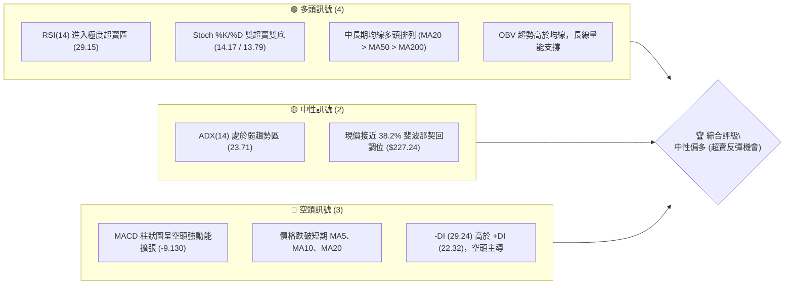
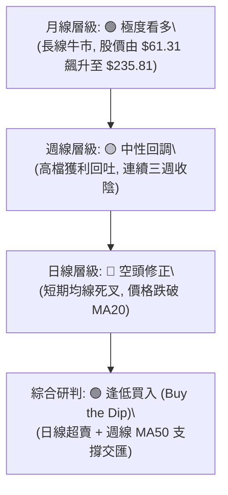
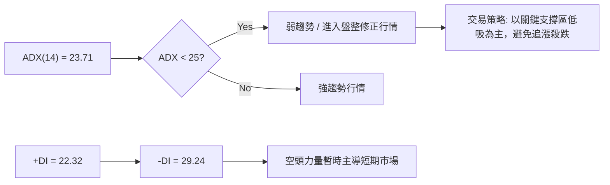
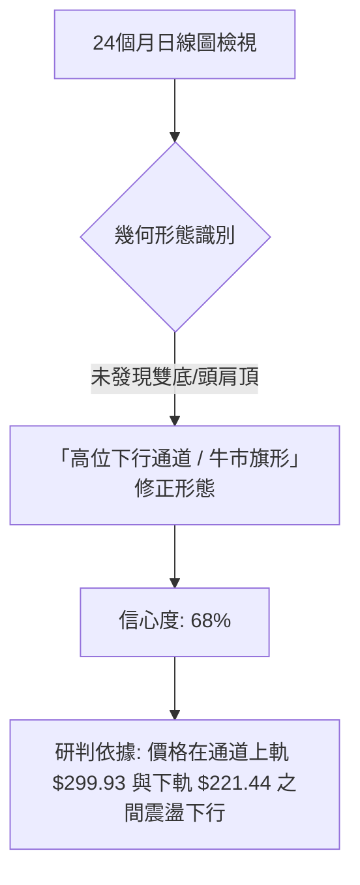
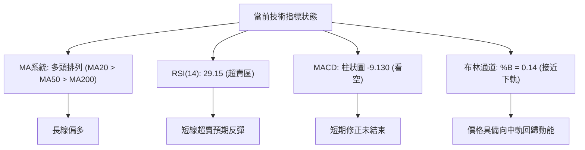
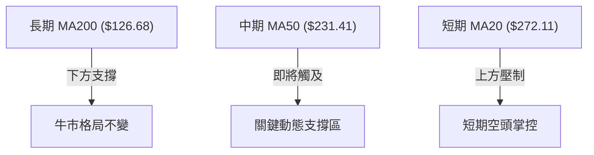
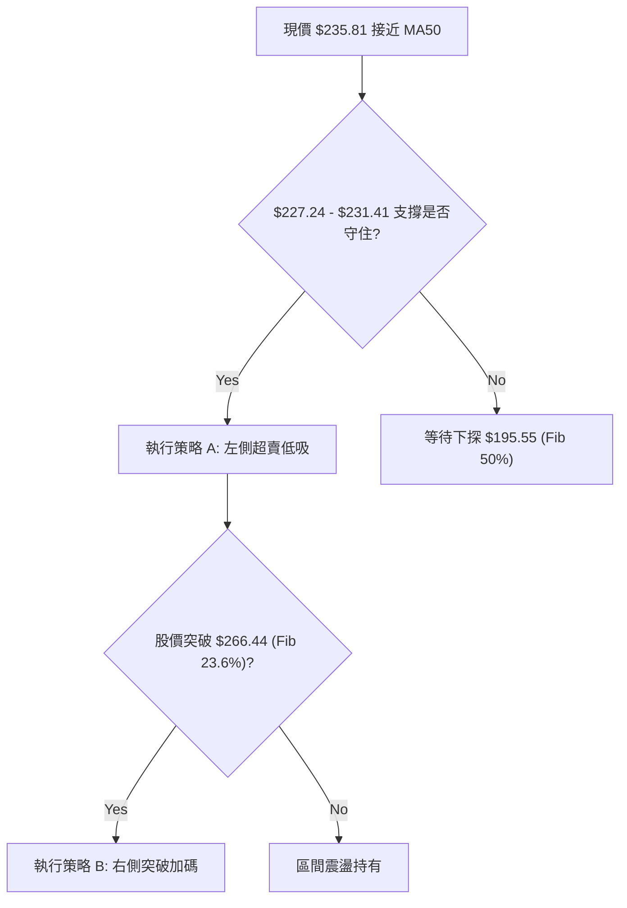
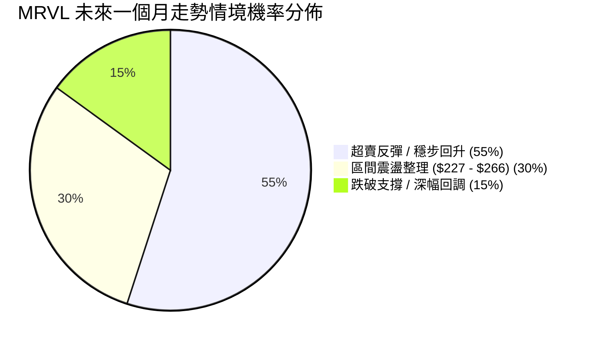
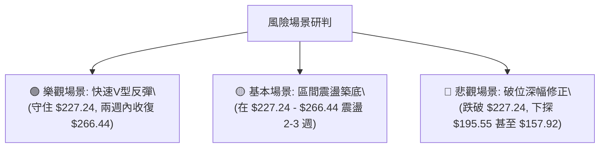

<html>
<head><meta charset="utf-8" /></head>
<body>
    <div style="height:500px; width:100%;">                        <script>window.PlotlyConfig = {MathJaxConfig: 'local'};</script>
        <script charset="utf-8" src="https://cdn.plot.ly/plotly-3.7.0.min.js" integrity="sha256-jvTGqxNp8AGWEcvNLVuKr+8j5dGe9Yw51LQkmDH+IYA=" crossorigin="anonymous"></script>                <div id="candlestick-chart" class="plotly-graph-div" style="height:100%; width:100%;"></div>            <script>                window.PLOTLYENV=window.PLOTLYENV || {};                                if (document.getElementById("candlestick-chart")) {                    Plotly.newPlot(                        "candlestick-chart",                        [{"close":{"dtype":"f8","bdata":"AAAAAIedUkAAAADA3PpTQAAAAMBv6FRAAAAAYJC\u002fVEAAAADgv41UQAAAAIAK+VRAAAAAoIvtVEAAAAAgEoFVQAAAAEBZglVAAAAAAMguVkAAAAAgP7JVQAAAAABqE1dAAAAAYC6fVkAAAAAAA19VQAAAAMCTUFZAAAAAoP6FVUAAAADAnzBWQAAAACByBlZAAAAAQI30VUAAAACgtW1VQAAAAOC8CFVAAAAAYJk7VEAAAABghKlUQAAAACBuAFVAAAAAAB8lVkAAAAAAJRVWQAAAAEAlgVZAAAAAgCwcVkAAAACgkWZXQAAAAKA0j1ZAAAAAoIvdVUAAAABA4zBXQAAAACBeTFdAAAAAgFqyVkAAAAAg+kVXQAAAAEC+TFZAAAAAQL5MVkAAAACAEtlVQAAAAGCxlFVAAAAAYPnUVEAAAABAJKRTQAAAAIDaTFRAAAAAIFQkU0AAAABgiVVTQAAAAMCz6lRAAAAAILLTVEAAAACA2uVVQAAAAEA3UVZAAAAAQNu9VkAAAACgPzBXQAAAAEBnA1lAAAAAwPOCWEAAAADg9rBYQAAAAEBf91ZAAAAAYEMxVkAAAACAaBVXQAAAAAAiU1ZAAAAAIJoTVUAAAADgvAhVQAAAAICY\u002fFRAAAAAQCNlVEAAAACgKBZVQAAAAMDf\u002fVRAAAAAYD8rVUAAAAAgTONVQAAAAKA\u002fl1VAAAAAoKmNVUAAAAAAmWhVQAAAAACBqFVAAAAAIMA2VUAAAADAk1BWQAAAAEBChlZAAAAAIHIGVkAAAACgBSFVQAAAAGD51FRAAAAAQBrKVEAAAACA\u002f7RUQAAAAAA7v1RAAAAA4I5JVEAAAABgehRUQAAAACCYGVRAAAAA4GLvU0AAAABAQZ9UQAAAAIBtwlRAAAAAwOIKVEAAAAAgX21UQAAAAGCOt1RAAAAA4K7jVEAAAABA31FUQAAAAKAbt1NAAAAAAHumU0AAAAAA895SQAAAAEAya1JAAAAAgOSJUkAAAAAgFQ5UQAAAAMB2klRAAAAAYLh8VEAAAABA31FUQAAAACD7ilNAAAAAYEijU0AAAAAg3bxTQAAAAKD6wVNAAAAAIDzjU0AAAADg69pTQAAAAIDXblNAAAAAgDaVU0AAAAAAAzdUQAAAACDFzlNAAAAAYEFoVEAAAADALDNUQAAAAIDvXFNAAAAAAAeCU0AAAAAg5+dSQAAAAOAyYFZAAAAA4CslV0AAAACgvU5XQAAAAGDWl1ZAAAAAgLDmVUAAAAAg1\u002fJVQAAAACC+4FZAAAAAYDiuVkAAAAAAfuNVQAAAAACkXVZAAAAAwAn2VUAAAABA7oVWQAAAACCgEldAAAAAIBiYWEAAAADg2WZYQAAAAODIs1dAAAAAoKTvVUAAAABAd75YQAAAAOBWqFpAAAAAoOvBWkAAAAAAaFtbQAAAAIAXU1tAAAAAYFSXXEAAAACgyfVdQAAAAICqDmBAAAAAYJBoYEAAAAAAgblgQAAAAEAj0mBAAAAAgMmqYEAAAABA+nRhQAAAAIC2eWJAAAAAwLnoYkAAAACg\u002f6hjQAAAAACdsGRAAAAAgJ+IZEAAAADAeMVjQAAAAIAmJmNAAAAAIAGRY0AAAAAgf6NkQAAAACAZnWRAAAAAINRzZEAAAAAAqxZlQAAAAOBwg2VAAAAAoA7\u002fY0AAAABA0UJlQAAAACCIWWVAAAAAoLOOZEAAAADg\u002fjxmQAAAAIAe0WZAAAAAgBUbZkAAAAAgbRxlQAAAAMA\u002fB2ZAAAAAQCBYZ0AAAABAk9RnQAAAAMACiWhAAAAAIK0GakAAAADg1NRoQAAAAIDxmGlAAAAAwGGeaUAAAAAgB2xrQAAAACB+K3JAAAAAoDXZckAAAACgocVzQAAAAAB7dnBAAAAA4HUMckAAAADgBq1wQAAAAODikG9AAAAAgECKcUAAAACgGHpxQAAAAIDcTHNAAAAA4J5pcUAAAABgfxdyQAAAAOANaHNAAAAAgIs8c0AAAAAAim9xQAAAAMAbSnFAAAAA4AyTcUAAAABgRKtwQAAAAGDnWnFAAAAAgBCdckAAAADguf9wQAAAAABYp25AAAAAQKwmb0AAAABAlNRsQAAAAEDk9GxAAAAAYLhmbkAAAACA63ltQA=="},"high":{"dtype":"f8","bdata":"mX7f\u002fQIMU0Aqvvj49WJUQC4h+7vyEVVArA1J3kTsVEDcL5eTLjpVQO\u002fv0jUIEFVAp3E0dpj7VEAKHMi19cdVQNohF81nxVVAEoltbLiDVkBvRf7Ul6xWQMreG1RFHldAv4J9QP4cV0DGDkb8XKFXQELF+plAb1ZAQy4ElSYsVkCgCd\u002fwDFVWQEa\u002fETI\u002fxFZAB1f2PXU0VkBGrBt7wiVWQMznrAd2c1VAgL7Ef6TcVEDJYHUs+dRUQCJAwcWDalVAJ25mKvBPVkCZNIVCSHZWQEPQKdkO2FZAkQwM4PSUVkCmZrpsVFtYQERogrDdrFdAKSA1mT2tVkDPuiKYA9BXQN7qiwMef1hAoHMrIOACV0Djwvd6OJVXQDfngpEwIldAN85ZpPguV0DfxFJMgRRWQJFScGinN1ZAPTBTn\u002fKlVUDYzmBsVWhUQA69rLBHcVRAmyHusD0UVUB\u002froSVerNTQOAcoSgwHVVAbAaB4PrrVEBswLjTdktWQBUmAgGGWVZApZuAoKkmV0DLdETWPG5XQH1wheV2fVlAke9GbKSnWUBXJVSTVZ9ZQPXulajbKVdASy8DxY\u002fjVkD\u002fGYpAsS1XQONMDYrB5lZAsNp\u002fSKc3VkBLMWQzWW5VQGEffkDhFFVAyZzWDljDVUA3gF0u8jlVQJFvbJ3+hVVArumhRzXOVUCD8fdd8fpVQNY64mQM6VVAgzRVOp\u002fEVUBiB2tWU35VQPFOjVQj\u002flVArPVnbLqyVUDZO1wvrHxWQJ3FCJdEdVdAwzm3K\u002feDV0Cfi\u002f6hcZpVQNAcuJXqMlVAkUVBc8MYVUDzYhk6\u002f+tUQLzxHmTS\u002f1RAX9ubWAi8VEC3kT0tMrhUQHWtjyjHmlRAMRZk+braVEDIYAsWiA5VQPLZn\u002fdRUlVANm9kGVx9VEAnSwsRLNhUQNlStHZb61RAVVObnP5ZVUDt+WlKOJhUQBe6PxzlaFRAgWic9fG6U0DF5wYnTrpTQENOxl00AFNA2Y8CJ\u002fyuUkBmR6jfIyxUQD03ArDev1RA8CDVHZ3VVECtNRll6u1UQPzdRks7iFRAIB7m+0H6U0Cuu5wYpBBUQAjo97fBFVRA7jQPZBLnU0BjNDF66xFUQNyVDTlCw1NA30w+eP3oU0CUSiNyR0hUQMUmuf1qZFRAVEtuaKCOVEBiit1jhbBUQBE8TSpXwVNAnxBTPzPcU0AjqdjVzQxUQIAWm8IiVVdA56Xc8hM3V0B\u002fDj42qL5XQCFg2FQZvFdA3\u002fJb3519VkATjeKRrJtWQICHaH\u002fbHFdAc9BkkrFXV0CAo02p4fxWQH1eMA4Sa1ZANbcRLWWaVkC4usMfvuBWQD4yCpbJRVdAXJwBucGvWEAyu20IyiRZQJ5\u002fZ8CO41hAifsFTWMbWEDHBHTCFN9YQFiqQOya8FpAXoUfaoPLWkBTGFvBnPNbQJsb\u002frFqgltAlszZUbbkXECFoLUJQHheQJrEsOXaOWBAseJiSVmlYEBeYDgsuBthQFXDzT79RGFAM8UpVQTVYECNxjMOBHxhQCMF3hthsWJA+lILRS1dY0B7w1nb09RjQG+yYPox+mRAs65ADohZZUBFT\u002fMpHG1kQPpXHMfEfmNAE2TvtHqlY0CzChuSNrJkQMxgO7cqy2RA0eO9fezYZEBnUMiT\u002fp1lQORsyl82+GVAehBlX0lvZUBSmBGSiFFlQLF5BOu+w2VAzGoGNAcWZUBxahkxe8hmQN6lUIpIA2hAnHWv5ArDZkAu\u002fzonR9VmQNR2muYLs2ZAWecG9LYoaEAfLBxEBlFoQAVKdvE7y2hAzgzvDq8sa0DeaPXZmEZrQP8aoK4p62lAdmXtBqwWakDuMWb2syJsQPnKHXymM3JAF4Let+tBdEBdE\u002flAuxZ0QFXC519VynJACCZwGigOc0DaA1vdNOVyQOkbYtpxBnFAjUyOfwGkcUCVUCcii\u002f5xQBLiy\u002ftxjnNAyd3fx7\u002fOc0A6RNz8tDRzQEUHxEDHnHRAFCooAHuhc0Cy7Q9YDS5yQGFXZnIWnnFAB96pggFHckCC7HI+HiJxQJd36rZhY3FAulk03tC+ckApBG922EZyQFhp83gdLnFAPAglAlVGcEBTM8fBNKxtQI7aozxpl21AgtLX12l0b0AAAACAFB5uQA=="},"hovertemplate":"\u003cb\u003e%{x|%Y-%m-%d}\u003c\u002fb\u003e\u003cbr\u003e\u958b: $%{open:.2f}\u003cbr\u003e\u9ad8: $%{high:.2f}\u003cbr\u003e\u4f4e: $%{low:.2f}\u003cbr\u003e\u6536: $%{close:.2f}\u003cextra\u003e\u003c\u002fextra\u003e","low":{"dtype":"f8","bdata":"52IrZjV3UkArCij8Q7pSQNkXzIMYClNA+KgoRndXVEBKgTNwR4lUQK2zv0CGTlRAKPmyuVRLVEB7WJsnCBBVQP3OezWLOVVAnqtYFv4DVkA7+BfeNnZVQGrLbxvC21VA46fVcvaUVkAbvXQACU9VQDleCsXVoFVA8H26PR5NVUD0SXW3o51VQHGcXg\u002fCuVVAdYQc52ZlVUAp6\u002fw8yVRVQEGmvTmbvlRAHgXW5my8U0C+z+EHXhpUQHHcqVQLpVRAMgFhY89EVUBZY5rVU+pVQGC1z0jZOlZAfv6n6sAOVkDpVu7d6LRWQM\u002fYeQQzeFZAKPYFgubFVUCQzSRKVQFWQMh30ng2EldA\u002fROW+w4\u002fVUApfmw6JwRXQMyjBJL6GFZAQbj\u002fqlgvVkAoWu31fiVVQJYqkEZOzVRAgRS+C11vVEAV8vrizZRTQOasUhuIqlNAQbPAJ\u002fz9UkBft8OyxmBSQKlvh2GveFNA+QepH14aVEDb0yAXCvpUQLZSlGlaGVVAbWzgWOsKVkBL0u\u002fU3NRWQIhE576T6VdA0xlFH2hCWED3HLDJtkpYQEKG9XGKMlZAqRB0xU36VUA7z7NSJYFWQDSi5Nhu2FVAOAbhthfxVECavFhqCONUQKji1CwCh1RASAMAHOhDVEA1IFxx2aFUQCtb21zz5FRAg5AmR+EUVUDv\u002feLCpwpVQAqyAj1TflVA29MIggR2VUDs76BT5wRVQKjOtpcKZlVAUoTatTE0VUAyI+FaR55VQAkQd6dq\u002f1VA1JNfbSSpVUCL9qWV691UQOdsFS+MsFRA4zBKWjuIVEAu7URpMoFUQBHfx2sLrFRAY\u002fFJnX3NU0B4CkYmLfxTQMR2K7VcD1RAmuooy4C9U0DOTSfuwRVUQAn0vadnq1RALxFtHUXqU0AXNGCKCeBTQHYy7HFQT1RAac8NwtioVEAX4kUydY9TQLGI4o3Ih1NAeDf\u002fvGkqU0DEBcamFC9SQC6E\u002fDt97lFAv0s088eoUUCAprdCnx1TQF2mLqcep1NAq0np\u002fHZbVECgo9xvp8lTQD7drmp1WFNAyF7jpUhsU0DW\u002fAk\u002fqCRTQNtospebm1NAHytegF1qU0C+PNrgsGJTQG1a9wvYAFNAbzl\u002frtRHU0CO7OUcTrpTQF8VxI\u002fpRVNA9jbY83qmU0C\u002f48X9zdVTQMgCxsXvJVNAbrLch\u002fJMU0C+fT2Cw8tSQBs9YR+d1VRAnoPnZsYIVUCJ\u002fXwOTeNWQPGIb641h1ZAWle6C4HTVUBxf+15VLBVQHtHGZprQ1ZAGwJjwhSSVkAnO5yhtsZVQEbTxTZARFVAfaXSCxmmVUCQY0JAHitWQJD6eK\u002f0LlZAwLci04F7V0AIJ\u002fTgbklYQEnHJ7wiVVdA+rqmjuaiVUAS5t6qwD5XQIERU3yOGllAhps+bHxDWUB6rA0S73paQDop7lw2fFpA8HFZUYWXW0CuhTvyfG9dQDPs5+Jy5F5AYeL\u002ftAUeYECUR2nq2FlgQIIsIH8ee2BA6FGfIG0MYEDKbbSxEaRgQHUjtaaf\u002fGFAhKTWfQh6YkAntI\u002f2r+FiQCurMB1lt2NAXy8lmBHPY0Axol4CsOFiQIBdSoQKWmJALP8d5mfoYkBaAMhBSYpjQBNP3R4Q52NA89cKFApHZEAiIi7NQpFkQD34zpKynmRAX3cPU1nQY0Cg6Lubg1tkQDPaTN5lTmRAUJHTNnm9Y0DCa0uDyRtlQGC\u002fWBspKWZAHUsSDIOpZUDUulqd5aFkQGYw6TzqWWRApkuggYXHZkAeytEn6oRnQMi8ke2FBWhAT8Rhe7P\u002faEDcFFdzc4ZoQGFW7ffcVGhA\u002fE5i2NPkaECFcMW+TGJoQObtP4DEi29AO4zv9\u002f9eckDkCzFj3VdxQGWk13k1VXBAQTGyUKaUcUC1ew37En5uQDPNsipUhm9Ax7foItwlcECKegOl57NwQD2LAKBNAHJAsGWli\u002ftgcUCuRpmIALRxQIBwzA2R5HJABW9aB7ShckDnrX\u002fx6EJxQF3IBQyFeXBAFiP7t3p6cEDKE51R915wQKDGEaapTm9AzDivn+k2cUD9XA51h\u002fRwQBqgrBiHpG1Ap4D3dlAfb0BG4s0NUtxrQMHmv5iVHWxAnY5dIkwhbkAAAADgowBtQA=="},"name":"\u50f9\u683c","open":{"dtype":"f8","bdata":"14cMzrPOUkCrlLbm9zJTQDFae4ppfFNA\u002fYelAdySVECnSZ3XxeBUQKvCpe2uYVRAoFWcZmOOVEBG2Yic5zhVQM77\u002figuhlVAjTYvkE8qVkAI9811+TFWQEgsTOnuDFZAi2vqW6bvVkBjNruOXDVXQA52UpSwVVZAbLNxcw+rVUAjvgOJnAJWQMSVxdcGZVZAuEGII\u002fqsVUDXPROr1aBVQCLDxqofZFVAZMSxLRpHVEDkOxM\u002fZzhUQPWzeiB08FRAlvX52H16VUC5Sif\u002fGDVWQLdX0NogqFZAPuBWFIxJVkAD6Z9J11BXQMVJ1r8zUFdAVwoh62joVUDMZdYX1gxWQLlZuttqBFhATvAcIeziVkDYycpwJEJXQI41uy5K+VZAx6nc+FibVkDkL8qxi91VQJYud6goFlVAkshdN4JTVUDRhQCniBZUQBALBapXvlNACowOScfRVEBGwqMQcSlTQGCV\u002fL3\u002fl1NAF8LcU0OYVEDPm1Ol0x1VQDBYxEeLcVVANEw6rplAVkAEI5TljCFXQHlCTbct+VhAEzIe9urQWEBFGW06LxBZQCEbdDZRlFZAKBqjqyvdVkADs20ejsxWQLShNQkwtlZAvvieDBrgVUCZcb96uC9VQGt5lSNI3VRAXXpAQuOXVUAIYodCzBZVQHdkynVR+1RAxIsPJACdVUBUFdNerxFVQIbS4UDRx1VAlHvvQDu+VUB1pLwyHk1VQDef3wGZaFVAiIHrTQ+rVUBBcne+OadVQPMrfoWOOFdAhHzkLhskV0ASZfJcKplVQGd4y13bJFVAUUXTVuf9VECTO0DA8JZUQKQ3Bf+l3FRAiJzqdXm5VEBB5lpeIKpUQHIY8SLoWFRAqGTPngzQU0DOTSfuwRVUQIZWUNwKGlVAukIiwzJKVECvu\u002fg7qvBTQHbU8Bu4s1RAQ0OpwBMhVUDmq5RoPnhUQAppgMxf\u002f1NAKwkamVRjU0DlsxBKzp5TQHF5\u002f1VqvFJAr+GJBtY0UkBZXkY4FjJTQP5FuyY841NA\u002ftvmLTWoVEB5Yut4Z+JUQPzdRks7iFRA1Jxp8xJ5U0AqcrPNyFBTQNN5AwTRxVNAoBbzzJKUU0B21CTMnotTQLame4g2lVNAoby6hUV8U0Cql5X\u002f3LxTQGNpqropQ1RAHoIqMBj+U0DtkkJtg+RTQAwyCNetclNApiI+yQmpU0AX+9Y51LVTQDK4gtgHKlVAbEUcIlH3VUAIwa8uDiBXQKBYkRXtYVdAyJk08xpyVkCJ2UH5cexVQE8vILxWRVZAapelxckOV0DCuto23K5WQIDnyAMojVVAG82swlk1VkDsQCQwhlhWQN8xMnKDMVZAlNuJmJ+AV0AuWubywXhYQLliEMcyrVhAxIh5TyLDV0CYmhIN\u002fhRYQJyulTKpL1lAll05e0+OWUAz3PKbkVdbQJlOa7wjE1tAwNCKIY16XEA04IX+wLddQDAF1MRJ6F5ALzDVrwM+YEC3sMwkcgJhQCnmSldvi2BAtGkznkaHYED0gAR4GNtgQMkZt8onb2JAo1Mk5jmVYkDATTBF6DNjQPM3Q2XVvGNA6l8AxH86ZUBHwKF04UJkQPV799\u002fze2JAKGxpKG03Y0Blk4JXnQlkQJ2MtkDrSWRAY1TB0g2uZEA22yKzoQdlQFKLM3fWkWVAX2nkhAxlZUBQc9m9x5RkQK1xDfwldGRA1DBvD2qtZEBfyDSmiyFlQJjnQI+7mmZA+Wxwam27ZUDM0oSNNLdmQM9VoY44kmRA3L+IxPPsZkC3WbXyzA5oQCzlpOCAVWhAQUO9WgNmakDdC8yqoz1rQIh\u002f\u002fWhu1mhAidqwYXeMaUCRtFLWjNtoQEavg0u4rG9AiWwTm9PYc0DsXWpxFa5xQIZ1X3vRtnJA+kZfqeYJckATjSQo+rpyQHVVUcr1dnBAjr0ioZxHcEDz6A\u002fbDeBwQFFK\u002fmowinJAbg8NVeawckAmkKGdFU1yQIwegolQFnNAt4rf6QCVc0Dqe+QYBWxxQGFXZnIWnnFAR76dGrsxckB87TRi3MRwQA14MCV8BXFAX5P\u002fVuZqcUBqzMa4Z6ZxQMh8gLrv1nBAIS5qqTrYb0C1rzv5lVttQIJbpttXI2xAhKrlHtHDbkAAAACgR7ltQA=="},"x":["2025-09-23T00:00:00-04:00","2025-09-24T00:00:00-04:00","2025-09-25T00:00:00-04:00","2025-09-26T00:00:00-04:00","2025-09-29T00:00:00-04:00","2025-09-30T00:00:00-04:00","2025-10-01T00:00:00-04:00","2025-10-02T00:00:00-04:00","2025-10-03T00:00:00-04:00","2025-10-06T00:00:00-04:00","2025-10-07T00:00:00-04:00","2025-10-08T00:00:00-04:00","2025-10-09T00:00:00-04:00","2025-10-10T00:00:00-04:00","2025-10-13T00:00:00-04:00","2025-10-14T00:00:00-04:00","2025-10-15T00:00:00-04:00","2025-10-16T00:00:00-04:00","2025-10-17T00:00:00-04:00","2025-10-20T00:00:00-04:00","2025-10-21T00:00:00-04:00","2025-10-22T00:00:00-04:00","2025-10-23T00:00:00-04:00","2025-10-24T00:00:00-04:00","2025-10-27T00:00:00-04:00","2025-10-28T00:00:00-04:00","2025-10-29T00:00:00-04:00","2025-10-30T00:00:00-04:00","2025-10-31T00:00:00-04:00","2025-11-03T00:00:00-05:00","2025-11-04T00:00:00-05:00","2025-11-05T00:00:00-05:00","2025-11-06T00:00:00-05:00","2025-11-07T00:00:00-05:00","2025-11-10T00:00:00-05:00","2025-11-11T00:00:00-05:00","2025-11-12T00:00:00-05:00","2025-11-13T00:00:00-05:00","2025-11-14T00:00:00-05:00","2025-11-17T00:00:00-05:00","2025-11-18T00:00:00-05:00","2025-11-19T00:00:00-05:00","2025-11-20T00:00:00-05:00","2025-11-21T00:00:00-05:00","2025-11-24T00:00:00-05:00","2025-11-25T00:00:00-05:00","2025-11-26T00:00:00-05:00","2025-11-28T00:00:00-05:00","2025-12-01T00:00:00-05:00","2025-12-02T00:00:00-05:00","2025-12-03T00:00:00-05:00","2025-12-04T00:00:00-05:00","2025-12-05T00:00:00-05:00","2025-12-08T00:00:00-05:00","2025-12-09T00:00:00-05:00","2025-12-10T00:00:00-05:00","2025-12-11T00:00:00-05:00","2025-12-12T00:00:00-05:00","2025-12-15T00:00:00-05:00","2025-12-16T00:00:00-05:00","2025-12-17T00:00:00-05:00","2025-12-18T00:00:00-05:00","2025-12-19T00:00:00-05:00","2025-12-22T00:00:00-05:00","2025-12-23T00:00:00-05:00","2025-12-24T00:00:00-05:00","2025-12-26T00:00:00-05:00","2025-12-29T00:00:00-05:00","2025-12-30T00:00:00-05:00","2025-12-31T00:00:00-05:00","2026-01-02T00:00:00-05:00","2026-01-05T00:00:00-05:00","2026-01-06T00:00:00-05:00","2026-01-07T00:00:00-05:00","2026-01-08T00:00:00-05:00","2026-01-09T00:00:00-05:00","2026-01-12T00:00:00-05:00","2026-01-13T00:00:00-05:00","2026-01-14T00:00:00-05:00","2026-01-15T00:00:00-05:00","2026-01-16T00:00:00-05:00","2026-01-20T00:00:00-05:00","2026-01-21T00:00:00-05:00","2026-01-22T00:00:00-05:00","2026-01-23T00:00:00-05:00","2026-01-26T00:00:00-05:00","2026-01-27T00:00:00-05:00","2026-01-28T00:00:00-05:00","2026-01-29T00:00:00-05:00","2026-01-30T00:00:00-05:00","2026-02-02T00:00:00-05:00","2026-02-03T00:00:00-05:00","2026-02-04T00:00:00-05:00","2026-02-05T00:00:00-05:00","2026-02-06T00:00:00-05:00","2026-02-09T00:00:00-05:00","2026-02-10T00:00:00-05:00","2026-02-11T00:00:00-05:00","2026-02-12T00:00:00-05:00","2026-02-13T00:00:00-05:00","2026-02-17T00:00:00-05:00","2026-02-18T00:00:00-05:00","2026-02-19T00:00:00-05:00","2026-02-20T00:00:00-05:00","2026-02-23T00:00:00-05:00","2026-02-24T00:00:00-05:00","2026-02-25T00:00:00-05:00","2026-02-26T00:00:00-05:00","2026-02-27T00:00:00-05:00","2026-03-02T00:00:00-05:00","2026-03-03T00:00:00-05:00","2026-03-04T00:00:00-05:00","2026-03-05T00:00:00-05:00","2026-03-06T00:00:00-05:00","2026-03-09T00:00:00-04:00","2026-03-10T00:00:00-04:00","2026-03-11T00:00:00-04:00","2026-03-12T00:00:00-04:00","2026-03-13T00:00:00-04:00","2026-03-16T00:00:00-04:00","2026-03-17T00:00:00-04:00","2026-03-18T00:00:00-04:00","2026-03-19T00:00:00-04:00","2026-03-20T00:00:00-04:00","2026-03-23T00:00:00-04:00","2026-03-24T00:00:00-04:00","2026-03-25T00:00:00-04:00","2026-03-26T00:00:00-04:00","2026-03-27T00:00:00-04:00","2026-03-30T00:00:00-04:00","2026-03-31T00:00:00-04:00","2026-04-01T00:00:00-04:00","2026-04-02T00:00:00-04:00","2026-04-06T00:00:00-04:00","2026-04-07T00:00:00-04:00","2026-04-08T00:00:00-04:00","2026-04-09T00:00:00-04:00","2026-04-10T00:00:00-04:00","2026-04-13T00:00:00-04:00","2026-04-14T00:00:00-04:00","2026-04-15T00:00:00-04:00","2026-04-16T00:00:00-04:00","2026-04-17T00:00:00-04:00","2026-04-20T00:00:00-04:00","2026-04-21T00:00:00-04:00","2026-04-22T00:00:00-04:00","2026-04-23T00:00:00-04:00","2026-04-24T00:00:00-04:00","2026-04-27T00:00:00-04:00","2026-04-28T00:00:00-04:00","2026-04-29T00:00:00-04:00","2026-04-30T00:00:00-04:00","2026-05-01T00:00:00-04:00","2026-05-04T00:00:00-04:00","2026-05-05T00:00:00-04:00","2026-05-06T00:00:00-04:00","2026-05-07T00:00:00-04:00","2026-05-08T00:00:00-04:00","2026-05-11T00:00:00-04:00","2026-05-12T00:00:00-04:00","2026-05-13T00:00:00-04:00","2026-05-14T00:00:00-04:00","2026-05-15T00:00:00-04:00","2026-05-18T00:00:00-04:00","2026-05-19T00:00:00-04:00","2026-05-20T00:00:00-04:00","2026-05-21T00:00:00-04:00","2026-05-22T00:00:00-04:00","2026-05-26T00:00:00-04:00","2026-05-27T00:00:00-04:00","2026-05-28T00:00:00-04:00","2026-05-29T00:00:00-04:00","2026-06-01T00:00:00-04:00","2026-06-02T00:00:00-04:00","2026-06-03T00:00:00-04:00","2026-06-04T00:00:00-04:00","2026-06-05T00:00:00-04:00","2026-06-08T00:00:00-04:00","2026-06-09T00:00:00-04:00","2026-06-10T00:00:00-04:00","2026-06-11T00:00:00-04:00","2026-06-12T00:00:00-04:00","2026-06-15T00:00:00-04:00","2026-06-16T00:00:00-04:00","2026-06-17T00:00:00-04:00","2026-06-18T00:00:00-04:00","2026-06-22T00:00:00-04:00","2026-06-23T00:00:00-04:00","2026-06-24T00:00:00-04:00","2026-06-25T00:00:00-04:00","2026-06-26T00:00:00-04:00","2026-06-29T00:00:00-04:00","2026-06-30T00:00:00-04:00","2026-07-01T00:00:00-04:00","2026-07-02T00:00:00-04:00","2026-07-06T00:00:00-04:00","2026-07-07T00:00:00-04:00","2026-07-08T00:00:00-04:00","2026-07-09T00:00:00-04:00","2026-07-10T00:00:00-04:00"],"type":"candlestick"},{"hovertemplate":"MA30: $%{y:.2f}\u003cextra\u003e\u003c\u002fextra\u003e","line":{"color":"#2196F3","dash":"dash","width":2},"mode":"lines","name":"MA30","x":["2025-09-23T00:00:00-04:00","2025-09-24T00:00:00-04:00","2025-09-25T00:00:00-04:00","2025-09-26T00:00:00-04:00","2025-09-29T00:00:00-04:00","2025-09-30T00:00:00-04:00","2025-10-01T00:00:00-04:00","2025-10-02T00:00:00-04:00","2025-10-03T00:00:00-04:00","2025-10-06T00:00:00-04:00","2025-10-07T00:00:00-04:00","2025-10-08T00:00:00-04:00","2025-10-09T00:00:00-04:00","2025-10-10T00:00:00-04:00","2025-10-13T00:00:00-04:00","2025-10-14T00:00:00-04:00","2025-10-15T00:00:00-04:00","2025-10-16T00:00:00-04:00","2025-10-17T00:00:00-04:00","2025-10-20T00:00:00-04:00","2025-10-21T00:00:00-04:00","2025-10-22T00:00:00-04:00","2025-10-23T00:00:00-04:00","2025-10-24T00:00:00-04:00","2025-10-27T00:00:00-04:00","2025-10-28T00:00:00-04:00","2025-10-29T00:00:00-04:00","2025-10-30T00:00:00-04:00","2025-10-31T00:00:00-04:00","2025-11-03T00:00:00-05:00","2025-11-04T00:00:00-05:00","2025-11-05T00:00:00-05:00","2025-11-06T00:00:00-05:00","2025-11-07T00:00:00-05:00","2025-11-10T00:00:00-05:00","2025-11-11T00:00:00-05:00","2025-11-12T00:00:00-05:00","2025-11-13T00:00:00-05:00","2025-11-14T00:00:00-05:00","2025-11-17T00:00:00-05:00","2025-11-18T00:00:00-05:00","2025-11-19T00:00:00-05:00","2025-11-20T00:00:00-05:00","2025-11-21T00:00:00-05:00","2025-11-24T00:00:00-05:00","2025-11-25T00:00:00-05:00","2025-11-26T00:00:00-05:00","2025-11-28T00:00:00-05:00","2025-12-01T00:00:00-05:00","2025-12-02T00:00:00-05:00","2025-12-03T00:00:00-05:00","2025-12-04T00:00:00-05:00","2025-12-05T00:00:00-05:00","2025-12-08T00:00:00-05:00","2025-12-09T00:00:00-05:00","2025-12-10T00:00:00-05:00","2025-12-11T00:00:00-05:00","2025-12-12T00:00:00-05:00","2025-12-15T00:00:00-05:00","2025-12-16T00:00:00-05:00","2025-12-17T00:00:00-05:00","2025-12-18T00:00:00-05:00","2025-12-19T00:00:00-05:00","2025-12-22T00:00:00-05:00","2025-12-23T00:00:00-05:00","2025-12-24T00:00:00-05:00","2025-12-26T00:00:00-05:00","2025-12-29T00:00:00-05:00","2025-12-30T00:00:00-05:00","2025-12-31T00:00:00-05:00","2026-01-02T00:00:00-05:00","2026-01-05T00:00:00-05:00","2026-01-06T00:00:00-05:00","2026-01-07T00:00:00-05:00","2026-01-08T00:00:00-05:00","2026-01-09T00:00:00-05:00","2026-01-12T00:00:00-05:00","2026-01-13T00:00:00-05:00","2026-01-14T00:00:00-05:00","2026-01-15T00:00:00-05:00","2026-01-16T00:00:00-05:00","2026-01-20T00:00:00-05:00","2026-01-21T00:00:00-05:00","2026-01-22T00:00:00-05:00","2026-01-23T00:00:00-05:00","2026-01-26T00:00:00-05:00","2026-01-27T00:00:00-05:00","2026-01-28T00:00:00-05:00","2026-01-29T00:00:00-05:00","2026-01-30T00:00:00-05:00","2026-02-02T00:00:00-05:00","2026-02-03T00:00:00-05:00","2026-02-04T00:00:00-05:00","2026-02-05T00:00:00-05:00","2026-02-06T00:00:00-05:00","2026-02-09T00:00:00-05:00","2026-02-10T00:00:00-05:00","2026-02-11T00:00:00-05:00","2026-02-12T00:00:00-05:00","2026-02-13T00:00:00-05:00","2026-02-17T00:00:00-05:00","2026-02-18T00:00:00-05:00","2026-02-19T00:00:00-05:00","2026-02-20T00:00:00-05:00","2026-02-23T00:00:00-05:00","2026-02-24T00:00:00-05:00","2026-02-25T00:00:00-05:00","2026-02-26T00:00:00-05:00","2026-02-27T00:00:00-05:00","2026-03-02T00:00:00-05:00","2026-03-03T00:00:00-05:00","2026-03-04T00:00:00-05:00","2026-03-05T00:00:00-05:00","2026-03-06T00:00:00-05:00","2026-03-09T00:00:00-04:00","2026-03-10T00:00:00-04:00","2026-03-11T00:00:00-04:00","2026-03-12T00:00:00-04:00","2026-03-13T00:00:00-04:00","2026-03-16T00:00:00-04:00","2026-03-17T00:00:00-04:00","2026-03-18T00:00:00-04:00","2026-03-19T00:00:00-04:00","2026-03-20T00:00:00-04:00","2026-03-23T00:00:00-04:00","2026-03-24T00:00:00-04:00","2026-03-25T00:00:00-04:00","2026-03-26T00:00:00-04:00","2026-03-27T00:00:00-04:00","2026-03-30T00:00:00-04:00","2026-03-31T00:00:00-04:00","2026-04-01T00:00:00-04:00","2026-04-02T00:00:00-04:00","2026-04-06T00:00:00-04:00","2026-04-07T00:00:00-04:00","2026-04-08T00:00:00-04:00","2026-04-09T00:00:00-04:00","2026-04-10T00:00:00-04:00","2026-04-13T00:00:00-04:00","2026-04-14T00:00:00-04:00","2026-04-15T00:00:00-04:00","2026-04-16T00:00:00-04:00","2026-04-17T00:00:00-04:00","2026-04-20T00:00:00-04:00","2026-04-21T00:00:00-04:00","2026-04-22T00:00:00-04:00","2026-04-23T00:00:00-04:00","2026-04-24T00:00:00-04:00","2026-04-27T00:00:00-04:00","2026-04-28T00:00:00-04:00","2026-04-29T00:00:00-04:00","2026-04-30T00:00:00-04:00","2026-05-01T00:00:00-04:00","2026-05-04T00:00:00-04:00","2026-05-05T00:00:00-04:00","2026-05-06T00:00:00-04:00","2026-05-07T00:00:00-04:00","2026-05-08T00:00:00-04:00","2026-05-11T00:00:00-04:00","2026-05-12T00:00:00-04:00","2026-05-13T00:00:00-04:00","2026-05-14T00:00:00-04:00","2026-05-15T00:00:00-04:00","2026-05-18T00:00:00-04:00","2026-05-19T00:00:00-04:00","2026-05-20T00:00:00-04:00","2026-05-21T00:00:00-04:00","2026-05-22T00:00:00-04:00","2026-05-26T00:00:00-04:00","2026-05-27T00:00:00-04:00","2026-05-28T00:00:00-04:00","2026-05-29T00:00:00-04:00","2026-06-01T00:00:00-04:00","2026-06-02T00:00:00-04:00","2026-06-03T00:00:00-04:00","2026-06-04T00:00:00-04:00","2026-06-05T00:00:00-04:00","2026-06-08T00:00:00-04:00","2026-06-09T00:00:00-04:00","2026-06-10T00:00:00-04:00","2026-06-11T00:00:00-04:00","2026-06-12T00:00:00-04:00","2026-06-15T00:00:00-04:00","2026-06-16T00:00:00-04:00","2026-06-17T00:00:00-04:00","2026-06-18T00:00:00-04:00","2026-06-22T00:00:00-04:00","2026-06-23T00:00:00-04:00","2026-06-24T00:00:00-04:00","2026-06-25T00:00:00-04:00","2026-06-26T00:00:00-04:00","2026-06-29T00:00:00-04:00","2026-06-30T00:00:00-04:00","2026-07-01T00:00:00-04:00","2026-07-02T00:00:00-04:00","2026-07-06T00:00:00-04:00","2026-07-07T00:00:00-04:00","2026-07-08T00:00:00-04:00","2026-07-09T00:00:00-04:00","2026-07-10T00:00:00-04:00"],"y":{"dtype":"f8","bdata":"AAAAAAAA+H8AAAAAAAD4fwAAAAAAAPh\u002fAAAAAAAA+H8AAAAAAAD4fwAAAAAAAPh\u002fAAAAAAAA+H8AAAAAAAD4fwAAAAAAAPh\u002fAAAAAAAA+H8AAAAAAAD4fwAAAAAAAPh\u002fAAAAAAAA+H8AAAAAAAD4fwAAAAAAAPh\u002fAAAAAAAA+H8AAAAAAAD4fwAAAAAAAPh\u002fAAAAAAAA+H8AAAAAAAD4fwAAAAAAAPh\u002fAAAAAAAA+H8AAAAAAAD4fwAAAAAAAPh\u002fAAAAAAAA+H8AAAAAAAD4fwAAAAAAAPh\u002fAAAAAAAA+H8AAAAAAAD4f7y7u+skh1VA7+7uzuCiVUDNzMxsR75VQM3MzDyt0lVAMzMzk03jVUB3d3e3gvpVQCIiIoLVBVZAVVVVZYoRVkB3d3dXeRRWQBEREeEVFVZA3t3d\u002fY4JVkAAAACQBfhVQM3MzBxW4FVAvLu7K6TCVUAAAABAQrFVQCIiImJUpVVAZmZm5mKfVUC8u7vb5JxVQFVVVeVin1VAIiIishimVUC8u7tLHbVVQImIiOgR11VAvLu765T7VUCrqqqa9h1WQAAAAGC6LlZAzczM\u002fCEvVkBVVVXFrDdWQBERESEkNlZAMzMzc1ItVkARERGxIBlWQGZmZha1C1ZAMzMzEyn\u002fVUC8u7vrM+1VQKuqqgqF2VVAq6qqmnvMVUAREREBqcBVQAAAAECculVAIiIisj20VUCamZnpfbBVQHd3d\u002fcmsVVAMzMzU2m0VUB3d3fXOctVQERERMQ03lVA3t3dXc\u002f2VUDv7u5OIAZWQFVVVeVmBVZAiYiICBUFVkCamZmZ6\u002fpVQDMzM1OF7VVAiYiI2JPYVUBVVVVFDb5VQHd3d\u002fcflFVAq6qqmhJtVUCamZlZWUpVQN7d3X2EN1VAAAAA8CslVUBVVVX1gA5VQGZmZtbIAFVA3t3d7S\u002f\u002fVECamZl5F\u002flUQKuqqvo97lRAmpmZCePnVECamZnZ+tRUQCIiIiIGv1RAvLu7K5SoVEBEREQ08JhUQHd3d9c+kFRAvLu7uyWHVEBmZmZG231UQHd3d0fOa1RAq6qqWlteVEDNzMzMXUhUQAAAANDBMFRAd3d3R4QeVEDe3d2NpRNUQN7d3X21B1RAIiIiomn9U0DNzMyMNvlTQO\u002fu7p4y8VNAIiIikjjyU0BERESEPvNTQBEREaH07FNA7+7ubk\u002fpU0C8u7tLqtpTQERERCR16FNAvLu7C+8CVEAzMzNDgxtUQJqZmamFK1RAmpmZ2Sc0VECrqqr6DUJUQM3MzNwKXVRAIiIiguZ2VEAAAADgppBUQFVVVVVVslRAZmZmxonPVEC8u7uLmeRUQCIiIkLw+VRAvLu7+\u002fscVUAzMzMj0T9VQGZmZnZPY1VAMzMzI+x2VUCamZl5pKFVQKuqqmqF3FVA3t3d3SQXVkAREREBKVdWQImIiHiAmlZAVVVVVV\u002fnVkBmZmYWiDpXQCIiIuKMo1dAIiIiMnINWEBmZmbWgX5YQCIiIhJa+FhARERENFZuWUAAAABA8PZZQN7d3Q1Qc1pAREREpIXwWkBmZmb2KXlbQFVVVRV6GVxA3t3dXQe9XEARERFhKlNdQFVVVTXA1l1A3t3dzSRjXkAzMzMDmAhfQAAAALCLqV9AVVVVjZklYECamZnhdHlgQLy7uxuYzmBAzczMZEsQYUCamZmJm11hQO\u002fu7oaprmFAZmZm1n0AYkAzMzMDr1RiQERERAympWJAIiIikh7wYkBEREQkiy9jQCIiIgLvdmNAzczMJCbEY0BVVVX1qw9kQLy7uzsEWGRAIiIiQhaqZECJiIi4Q+9kQGZmZnYoOmVAd3d3Z4uGZUDe3d1dlNtlQAAAAKAFdGZAd3d3V1gUZ0AzMzNDBb5nQBEREaFuJmhAiYiI+D2raEDe3d3NIB9pQERERAQWiWlAVVVVJXgNakB3d3c3oIdqQDMzMwMdIWtAq6qqqsKba0AiIiJCkhxsQN7d3Y0xsGxAAAAAgNxNbUC8u7vbAMJtQCIiIpLkMm5AmpmZ+WevbkBVVVXFHw5vQM3MzBydc29Ad3d3B6b0b0C8u7vbTjFwQAAAABAcVnBAIiIiMmt3cEC8u7uLwIxwQHd3d+edn3BAIiIiwkiycEC8u7szGsZwQA=="},"type":"scatter"},{"hovertemplate":"MA60: $%{y:.2f}\u003cextra\u003e\u003c\u002fextra\u003e","line":{"color":"#9C27B0","dash":"dash","width":2},"mode":"lines","name":"MA60","x":["2025-09-23T00:00:00-04:00","2025-09-24T00:00:00-04:00","2025-09-25T00:00:00-04:00","2025-09-26T00:00:00-04:00","2025-09-29T00:00:00-04:00","2025-09-30T00:00:00-04:00","2025-10-01T00:00:00-04:00","2025-10-02T00:00:00-04:00","2025-10-03T00:00:00-04:00","2025-10-06T00:00:00-04:00","2025-10-07T00:00:00-04:00","2025-10-08T00:00:00-04:00","2025-10-09T00:00:00-04:00","2025-10-10T00:00:00-04:00","2025-10-13T00:00:00-04:00","2025-10-14T00:00:00-04:00","2025-10-15T00:00:00-04:00","2025-10-16T00:00:00-04:00","2025-10-17T00:00:00-04:00","2025-10-20T00:00:00-04:00","2025-10-21T00:00:00-04:00","2025-10-22T00:00:00-04:00","2025-10-23T00:00:00-04:00","2025-10-24T00:00:00-04:00","2025-10-27T00:00:00-04:00","2025-10-28T00:00:00-04:00","2025-10-29T00:00:00-04:00","2025-10-30T00:00:00-04:00","2025-10-31T00:00:00-04:00","2025-11-03T00:00:00-05:00","2025-11-04T00:00:00-05:00","2025-11-05T00:00:00-05:00","2025-11-06T00:00:00-05:00","2025-11-07T00:00:00-05:00","2025-11-10T00:00:00-05:00","2025-11-11T00:00:00-05:00","2025-11-12T00:00:00-05:00","2025-11-13T00:00:00-05:00","2025-11-14T00:00:00-05:00","2025-11-17T00:00:00-05:00","2025-11-18T00:00:00-05:00","2025-11-19T00:00:00-05:00","2025-11-20T00:00:00-05:00","2025-11-21T00:00:00-05:00","2025-11-24T00:00:00-05:00","2025-11-25T00:00:00-05:00","2025-11-26T00:00:00-05:00","2025-11-28T00:00:00-05:00","2025-12-01T00:00:00-05:00","2025-12-02T00:00:00-05:00","2025-12-03T00:00:00-05:00","2025-12-04T00:00:00-05:00","2025-12-05T00:00:00-05:00","2025-12-08T00:00:00-05:00","2025-12-09T00:00:00-05:00","2025-12-10T00:00:00-05:00","2025-12-11T00:00:00-05:00","2025-12-12T00:00:00-05:00","2025-12-15T00:00:00-05:00","2025-12-16T00:00:00-05:00","2025-12-17T00:00:00-05:00","2025-12-18T00:00:00-05:00","2025-12-19T00:00:00-05:00","2025-12-22T00:00:00-05:00","2025-12-23T00:00:00-05:00","2025-12-24T00:00:00-05:00","2025-12-26T00:00:00-05:00","2025-12-29T00:00:00-05:00","2025-12-30T00:00:00-05:00","2025-12-31T00:00:00-05:00","2026-01-02T00:00:00-05:00","2026-01-05T00:00:00-05:00","2026-01-06T00:00:00-05:00","2026-01-07T00:00:00-05:00","2026-01-08T00:00:00-05:00","2026-01-09T00:00:00-05:00","2026-01-12T00:00:00-05:00","2026-01-13T00:00:00-05:00","2026-01-14T00:00:00-05:00","2026-01-15T00:00:00-05:00","2026-01-16T00:00:00-05:00","2026-01-20T00:00:00-05:00","2026-01-21T00:00:00-05:00","2026-01-22T00:00:00-05:00","2026-01-23T00:00:00-05:00","2026-01-26T00:00:00-05:00","2026-01-27T00:00:00-05:00","2026-01-28T00:00:00-05:00","2026-01-29T00:00:00-05:00","2026-01-30T00:00:00-05:00","2026-02-02T00:00:00-05:00","2026-02-03T00:00:00-05:00","2026-02-04T00:00:00-05:00","2026-02-05T00:00:00-05:00","2026-02-06T00:00:00-05:00","2026-02-09T00:00:00-05:00","2026-02-10T00:00:00-05:00","2026-02-11T00:00:00-05:00","2026-02-12T00:00:00-05:00","2026-02-13T00:00:00-05:00","2026-02-17T00:00:00-05:00","2026-02-18T00:00:00-05:00","2026-02-19T00:00:00-05:00","2026-02-20T00:00:00-05:00","2026-02-23T00:00:00-05:00","2026-02-24T00:00:00-05:00","2026-02-25T00:00:00-05:00","2026-02-26T00:00:00-05:00","2026-02-27T00:00:00-05:00","2026-03-02T00:00:00-05:00","2026-03-03T00:00:00-05:00","2026-03-04T00:00:00-05:00","2026-03-05T00:00:00-05:00","2026-03-06T00:00:00-05:00","2026-03-09T00:00:00-04:00","2026-03-10T00:00:00-04:00","2026-03-11T00:00:00-04:00","2026-03-12T00:00:00-04:00","2026-03-13T00:00:00-04:00","2026-03-16T00:00:00-04:00","2026-03-17T00:00:00-04:00","2026-03-18T00:00:00-04:00","2026-03-19T00:00:00-04:00","2026-03-20T00:00:00-04:00","2026-03-23T00:00:00-04:00","2026-03-24T00:00:00-04:00","2026-03-25T00:00:00-04:00","2026-03-26T00:00:00-04:00","2026-03-27T00:00:00-04:00","2026-03-30T00:00:00-04:00","2026-03-31T00:00:00-04:00","2026-04-01T00:00:00-04:00","2026-04-02T00:00:00-04:00","2026-04-06T00:00:00-04:00","2026-04-07T00:00:00-04:00","2026-04-08T00:00:00-04:00","2026-04-09T00:00:00-04:00","2026-04-10T00:00:00-04:00","2026-04-13T00:00:00-04:00","2026-04-14T00:00:00-04:00","2026-04-15T00:00:00-04:00","2026-04-16T00:00:00-04:00","2026-04-17T00:00:00-04:00","2026-04-20T00:00:00-04:00","2026-04-21T00:00:00-04:00","2026-04-22T00:00:00-04:00","2026-04-23T00:00:00-04:00","2026-04-24T00:00:00-04:00","2026-04-27T00:00:00-04:00","2026-04-28T00:00:00-04:00","2026-04-29T00:00:00-04:00","2026-04-30T00:00:00-04:00","2026-05-01T00:00:00-04:00","2026-05-04T00:00:00-04:00","2026-05-05T00:00:00-04:00","2026-05-06T00:00:00-04:00","2026-05-07T00:00:00-04:00","2026-05-08T00:00:00-04:00","2026-05-11T00:00:00-04:00","2026-05-12T00:00:00-04:00","2026-05-13T00:00:00-04:00","2026-05-14T00:00:00-04:00","2026-05-15T00:00:00-04:00","2026-05-18T00:00:00-04:00","2026-05-19T00:00:00-04:00","2026-05-20T00:00:00-04:00","2026-05-21T00:00:00-04:00","2026-05-22T00:00:00-04:00","2026-05-26T00:00:00-04:00","2026-05-27T00:00:00-04:00","2026-05-28T00:00:00-04:00","2026-05-29T00:00:00-04:00","2026-06-01T00:00:00-04:00","2026-06-02T00:00:00-04:00","2026-06-03T00:00:00-04:00","2026-06-04T00:00:00-04:00","2026-06-05T00:00:00-04:00","2026-06-08T00:00:00-04:00","2026-06-09T00:00:00-04:00","2026-06-10T00:00:00-04:00","2026-06-11T00:00:00-04:00","2026-06-12T00:00:00-04:00","2026-06-15T00:00:00-04:00","2026-06-16T00:00:00-04:00","2026-06-17T00:00:00-04:00","2026-06-18T00:00:00-04:00","2026-06-22T00:00:00-04:00","2026-06-23T00:00:00-04:00","2026-06-24T00:00:00-04:00","2026-06-25T00:00:00-04:00","2026-06-26T00:00:00-04:00","2026-06-29T00:00:00-04:00","2026-06-30T00:00:00-04:00","2026-07-01T00:00:00-04:00","2026-07-02T00:00:00-04:00","2026-07-06T00:00:00-04:00","2026-07-07T00:00:00-04:00","2026-07-08T00:00:00-04:00","2026-07-09T00:00:00-04:00","2026-07-10T00:00:00-04:00"],"y":{"dtype":"f8","bdata":"AAAAAAAA+H8AAAAAAAD4fwAAAAAAAPh\u002fAAAAAAAA+H8AAAAAAAD4fwAAAAAAAPh\u002fAAAAAAAA+H8AAAAAAAD4fwAAAAAAAPh\u002fAAAAAAAA+H8AAAAAAAD4fwAAAAAAAPh\u002fAAAAAAAA+H8AAAAAAAD4fwAAAAAAAPh\u002fAAAAAAAA+H8AAAAAAAD4fwAAAAAAAPh\u002fAAAAAAAA+H8AAAAAAAD4fwAAAAAAAPh\u002fAAAAAAAA+H8AAAAAAAD4fwAAAAAAAPh\u002fAAAAAAAA+H8AAAAAAAD4fwAAAAAAAPh\u002fAAAAAAAA+H8AAAAAAAD4fwAAAAAAAPh\u002fAAAAAAAA+H8AAAAAAAD4fwAAAAAAAPh\u002fAAAAAAAA+H8AAAAAAAD4fwAAAAAAAPh\u002fAAAAAAAA+H8AAAAAAAD4fwAAAAAAAPh\u002fAAAAAAAA+H8AAAAAAAD4fwAAAAAAAPh\u002fAAAAAAAA+H8AAAAAAAD4fwAAAAAAAPh\u002fAAAAAAAA+H8AAAAAAAD4fwAAAAAAAPh\u002fAAAAAAAA+H8AAAAAAAD4fwAAAAAAAPh\u002fAAAAAAAA+H8AAAAAAAD4fwAAAAAAAPh\u002fAAAAAAAA+H8AAAAAAAD4fwAAAAAAAPh\u002fAAAAAAAA+H8AAAAAAAD4fxEREQFtyVVAERER8QTRVUBERESsvdVVQLy7uyMZ1lVA7+7uluTXVUBERETcld1VQBEREeE44FVAvLu7C+TiVUCJiIige+JVQERERGwe41VAiYiIKPzeVUC8u7uzn+FVQImIiHBF31VAzczMxLncVUB3d3dHsdtVQLy7u6Nd1VVAd3d39zvSVUCrqqo66MtVQERERBx0xlVAVVVVRVa\u002fVUCJiIhIlblVQAAAAPCYtVVAMzMzw1O0VUAiIiL6J7RVQO\u002fu7m4fs1VAZmZm9iaqVUBVVVXdFqNVQLy7u3t2m1VAiYiIMEGWVUBVVVUVHIlVQImIiIj5fFVAZmZmDoZzVUCrqqpiF2FVQGZmZpZFTFVAMzMz44c6VUCrqqqazCxVQLy7u4ttJVVA7+7utrEdVUAAAACYLBdVQHd3d596DlVA7+7uVmIJVUAiIiLSywlVQCIiIkp7B1VAq6qq0qkKVUBmZmbu4gxVQJqZmTGOBlVAVVVVVT8BVUAzMzMTEfpUQBEREflb71RAVVVVNWblVEDNzMzkpdhUQEREREyKwFRAzczMBDGrVECrqqrSgZJUQBEREdH8j1RA3t3dfQ2UVEBEREQcApVUQAAAAEAnllRAvLu746uZVEAiIiK6kp1UQLy7u2ukpVRA3t3dxWSvVEDNzMzc0LJUQLy7u7utuFRAERER+Q68VEAAAADgxL5UQM3MzIwXxVRAvLu72xDSVEDNzMw01t5UQO\u002fu7t6O51RA7+7uvqPqVEAzMzMjAfVUQFVVVZ2jBlVAq6qqktQaVUB3d3dHZzVVQDMzM\u002fsaUVVAvLu7e2RyVUCamZlR35lVQImIiMBfylVAIiIiYtX\u002fVUBVVVUt4DhWQJqZmVmnclZAmpmZ0dKrVkDe3d1FzehWQBEREZniLVdAAAAAWLp5V0DNzMycVspXQHd3d99\u002fIlhAvLu7m5d4WEDe3d0tnMpYQBEREYnlGVlAAAAAqAVtWUCamZlxn8xZQKuqqoLwLVpAiYiIcF6NWkB3d3enwetaQM3MzDyQS1tAq6qqYsmeW0AzMzMbhP1bQCIiIkJRYFxAAAAA6PO7XEAAAABAgSVdQJqZmcHok11AERERAbH7XUDNzMykH1teQGZmZj4vxF5Ad3d3z9U3X0CJiIgA8KxfQGZmZlblFGBAmpmZrWdYYEDe3d1RQpdgQLy7u78q22BAzczMQNseYUDv7u4+hmthQHd3d9PW1mFAzczMlE1GYkAzMzMfTb1iQN7d3dWVGWNAvLu70+CEY0AzMzP\u002fWuRjQHd3dw87OmRAIiIiRoWfZECJiIgc9gVlQJqZmW3xemVAAAAAHK7gZUDe3d2RA0tmQM3MzNRkv2ZAZmZm8hMvZ0Crqqoyzo9nQImIiAzH8GdAAAAA6PJXaEBERERkZ7FoQImIiJShDGlAzczMTGJyaUDe3d1tFMlpQBEREZGTEWpAiYiIRH5ZakBmZmaGlpRqQFVVVQWgy2pAMzMz41MHa0AAAAAQvD1rQA=="},"type":"scatter"},{"hovertemplate":"MA200: $%{y:.2f}\u003cextra\u003e\u003c\u002fextra\u003e","line":{"color":"#FF6F00","dash":"solid","width":2},"mode":"lines","name":"MA200","x":["2025-09-23T00:00:00-04:00","2025-09-24T00:00:00-04:00","2025-09-25T00:00:00-04:00","2025-09-26T00:00:00-04:00","2025-09-29T00:00:00-04:00","2025-09-30T00:00:00-04:00","2025-10-01T00:00:00-04:00","2025-10-02T00:00:00-04:00","2025-10-03T00:00:00-04:00","2025-10-06T00:00:00-04:00","2025-10-07T00:00:00-04:00","2025-10-08T00:00:00-04:00","2025-10-09T00:00:00-04:00","2025-10-10T00:00:00-04:00","2025-10-13T00:00:00-04:00","2025-10-14T00:00:00-04:00","2025-10-15T00:00:00-04:00","2025-10-16T00:00:00-04:00","2025-10-17T00:00:00-04:00","2025-10-20T00:00:00-04:00","2025-10-21T00:00:00-04:00","2025-10-22T00:00:00-04:00","2025-10-23T00:00:00-04:00","2025-10-24T00:00:00-04:00","2025-10-27T00:00:00-04:00","2025-10-28T00:00:00-04:00","2025-10-29T00:00:00-04:00","2025-10-30T00:00:00-04:00","2025-10-31T00:00:00-04:00","2025-11-03T00:00:00-05:00","2025-11-04T00:00:00-05:00","2025-11-05T00:00:00-05:00","2025-11-06T00:00:00-05:00","2025-11-07T00:00:00-05:00","2025-11-10T00:00:00-05:00","2025-11-11T00:00:00-05:00","2025-11-12T00:00:00-05:00","2025-11-13T00:00:00-05:00","2025-11-14T00:00:00-05:00","2025-11-17T00:00:00-05:00","2025-11-18T00:00:00-05:00","2025-11-19T00:00:00-05:00","2025-11-20T00:00:00-05:00","2025-11-21T00:00:00-05:00","2025-11-24T00:00:00-05:00","2025-11-25T00:00:00-05:00","2025-11-26T00:00:00-05:00","2025-11-28T00:00:00-05:00","2025-12-01T00:00:00-05:00","2025-12-02T00:00:00-05:00","2025-12-03T00:00:00-05:00","2025-12-04T00:00:00-05:00","2025-12-05T00:00:00-05:00","2025-12-08T00:00:00-05:00","2025-12-09T00:00:00-05:00","2025-12-10T00:00:00-05:00","2025-12-11T00:00:00-05:00","2025-12-12T00:00:00-05:00","2025-12-15T00:00:00-05:00","2025-12-16T00:00:00-05:00","2025-12-17T00:00:00-05:00","2025-12-18T00:00:00-05:00","2025-12-19T00:00:00-05:00","2025-12-22T00:00:00-05:00","2025-12-23T00:00:00-05:00","2025-12-24T00:00:00-05:00","2025-12-26T00:00:00-05:00","2025-12-29T00:00:00-05:00","2025-12-30T00:00:00-05:00","2025-12-31T00:00:00-05:00","2026-01-02T00:00:00-05:00","2026-01-05T00:00:00-05:00","2026-01-06T00:00:00-05:00","2026-01-07T00:00:00-05:00","2026-01-08T00:00:00-05:00","2026-01-09T00:00:00-05:00","2026-01-12T00:00:00-05:00","2026-01-13T00:00:00-05:00","2026-01-14T00:00:00-05:00","2026-01-15T00:00:00-05:00","2026-01-16T00:00:00-05:00","2026-01-20T00:00:00-05:00","2026-01-21T00:00:00-05:00","2026-01-22T00:00:00-05:00","2026-01-23T00:00:00-05:00","2026-01-26T00:00:00-05:00","2026-01-27T00:00:00-05:00","2026-01-28T00:00:00-05:00","2026-01-29T00:00:00-05:00","2026-01-30T00:00:00-05:00","2026-02-02T00:00:00-05:00","2026-02-03T00:00:00-05:00","2026-02-04T00:00:00-05:00","2026-02-05T00:00:00-05:00","2026-02-06T00:00:00-05:00","2026-02-09T00:00:00-05:00","2026-02-10T00:00:00-05:00","2026-02-11T00:00:00-05:00","2026-02-12T00:00:00-05:00","2026-02-13T00:00:00-05:00","2026-02-17T00:00:00-05:00","2026-02-18T00:00:00-05:00","2026-02-19T00:00:00-05:00","2026-02-20T00:00:00-05:00","2026-02-23T00:00:00-05:00","2026-02-24T00:00:00-05:00","2026-02-25T00:00:00-05:00","2026-02-26T00:00:00-05:00","2026-02-27T00:00:00-05:00","2026-03-02T00:00:00-05:00","2026-03-03T00:00:00-05:00","2026-03-04T00:00:00-05:00","2026-03-05T00:00:00-05:00","2026-03-06T00:00:00-05:00","2026-03-09T00:00:00-04:00","2026-03-10T00:00:00-04:00","2026-03-11T00:00:00-04:00","2026-03-12T00:00:00-04:00","2026-03-13T00:00:00-04:00","2026-03-16T00:00:00-04:00","2026-03-17T00:00:00-04:00","2026-03-18T00:00:00-04:00","2026-03-19T00:00:00-04:00","2026-03-20T00:00:00-04:00","2026-03-23T00:00:00-04:00","2026-03-24T00:00:00-04:00","2026-03-25T00:00:00-04:00","2026-03-26T00:00:00-04:00","2026-03-27T00:00:00-04:00","2026-03-30T00:00:00-04:00","2026-03-31T00:00:00-04:00","2026-04-01T00:00:00-04:00","2026-04-02T00:00:00-04:00","2026-04-06T00:00:00-04:00","2026-04-07T00:00:00-04:00","2026-04-08T00:00:00-04:00","2026-04-09T00:00:00-04:00","2026-04-10T00:00:00-04:00","2026-04-13T00:00:00-04:00","2026-04-14T00:00:00-04:00","2026-04-15T00:00:00-04:00","2026-04-16T00:00:00-04:00","2026-04-17T00:00:00-04:00","2026-04-20T00:00:00-04:00","2026-04-21T00:00:00-04:00","2026-04-22T00:00:00-04:00","2026-04-23T00:00:00-04:00","2026-04-24T00:00:00-04:00","2026-04-27T00:00:00-04:00","2026-04-28T00:00:00-04:00","2026-04-29T00:00:00-04:00","2026-04-30T00:00:00-04:00","2026-05-01T00:00:00-04:00","2026-05-04T00:00:00-04:00","2026-05-05T00:00:00-04:00","2026-05-06T00:00:00-04:00","2026-05-07T00:00:00-04:00","2026-05-08T00:00:00-04:00","2026-05-11T00:00:00-04:00","2026-05-12T00:00:00-04:00","2026-05-13T00:00:00-04:00","2026-05-14T00:00:00-04:00","2026-05-15T00:00:00-04:00","2026-05-18T00:00:00-04:00","2026-05-19T00:00:00-04:00","2026-05-20T00:00:00-04:00","2026-05-21T00:00:00-04:00","2026-05-22T00:00:00-04:00","2026-05-26T00:00:00-04:00","2026-05-27T00:00:00-04:00","2026-05-28T00:00:00-04:00","2026-05-29T00:00:00-04:00","2026-06-01T00:00:00-04:00","2026-06-02T00:00:00-04:00","2026-06-03T00:00:00-04:00","2026-06-04T00:00:00-04:00","2026-06-05T00:00:00-04:00","2026-06-08T00:00:00-04:00","2026-06-09T00:00:00-04:00","2026-06-10T00:00:00-04:00","2026-06-11T00:00:00-04:00","2026-06-12T00:00:00-04:00","2026-06-15T00:00:00-04:00","2026-06-16T00:00:00-04:00","2026-06-17T00:00:00-04:00","2026-06-18T00:00:00-04:00","2026-06-22T00:00:00-04:00","2026-06-23T00:00:00-04:00","2026-06-24T00:00:00-04:00","2026-06-25T00:00:00-04:00","2026-06-26T00:00:00-04:00","2026-06-29T00:00:00-04:00","2026-06-30T00:00:00-04:00","2026-07-01T00:00:00-04:00","2026-07-02T00:00:00-04:00","2026-07-06T00:00:00-04:00","2026-07-07T00:00:00-04:00","2026-07-08T00:00:00-04:00","2026-07-09T00:00:00-04:00","2026-07-10T00:00:00-04:00"],"y":{"dtype":"f8","bdata":"AAAAAAAA+H8AAAAAAAD4fwAAAAAAAPh\u002fAAAAAAAA+H8AAAAAAAD4fwAAAAAAAPh\u002fAAAAAAAA+H8AAAAAAAD4fwAAAAAAAPh\u002fAAAAAAAA+H8AAAAAAAD4fwAAAAAAAPh\u002fAAAAAAAA+H8AAAAAAAD4fwAAAAAAAPh\u002fAAAAAAAA+H8AAAAAAAD4fwAAAAAAAPh\u002fAAAAAAAA+H8AAAAAAAD4fwAAAAAAAPh\u002fAAAAAAAA+H8AAAAAAAD4fwAAAAAAAPh\u002fAAAAAAAA+H8AAAAAAAD4fwAAAAAAAPh\u002fAAAAAAAA+H8AAAAAAAD4fwAAAAAAAPh\u002fAAAAAAAA+H8AAAAAAAD4fwAAAAAAAPh\u002fAAAAAAAA+H8AAAAAAAD4fwAAAAAAAPh\u002fAAAAAAAA+H8AAAAAAAD4fwAAAAAAAPh\u002fAAAAAAAA+H8AAAAAAAD4fwAAAAAAAPh\u002fAAAAAAAA+H8AAAAAAAD4fwAAAAAAAPh\u002fAAAAAAAA+H8AAAAAAAD4fwAAAAAAAPh\u002fAAAAAAAA+H8AAAAAAAD4fwAAAAAAAPh\u002fAAAAAAAA+H8AAAAAAAD4fwAAAAAAAPh\u002fAAAAAAAA+H8AAAAAAAD4fwAAAAAAAPh\u002fAAAAAAAA+H8AAAAAAAD4fwAAAAAAAPh\u002fAAAAAAAA+H8AAAAAAAD4fwAAAAAAAPh\u002fAAAAAAAA+H8AAAAAAAD4fwAAAAAAAPh\u002fAAAAAAAA+H8AAAAAAAD4fwAAAAAAAPh\u002fAAAAAAAA+H8AAAAAAAD4fwAAAAAAAPh\u002fAAAAAAAA+H8AAAAAAAD4fwAAAAAAAPh\u002fAAAAAAAA+H8AAAAAAAD4fwAAAAAAAPh\u002fAAAAAAAA+H8AAAAAAAD4fwAAAAAAAPh\u002fAAAAAAAA+H8AAAAAAAD4fwAAAAAAAPh\u002fAAAAAAAA+H8AAAAAAAD4fwAAAAAAAPh\u002fAAAAAAAA+H8AAAAAAAD4fwAAAAAAAPh\u002fAAAAAAAA+H8AAAAAAAD4fwAAAAAAAPh\u002fAAAAAAAA+H8AAAAAAAD4fwAAAAAAAPh\u002fAAAAAAAA+H8AAAAAAAD4fwAAAAAAAPh\u002fAAAAAAAA+H8AAAAAAAD4fwAAAAAAAPh\u002fAAAAAAAA+H8AAAAAAAD4fwAAAAAAAPh\u002fAAAAAAAA+H8AAAAAAAD4fwAAAAAAAPh\u002fAAAAAAAA+H8AAAAAAAD4fwAAAAAAAPh\u002fAAAAAAAA+H8AAAAAAAD4fwAAAAAAAPh\u002fAAAAAAAA+H8AAAAAAAD4fwAAAAAAAPh\u002fAAAAAAAA+H8AAAAAAAD4fwAAAAAAAPh\u002fAAAAAAAA+H8AAAAAAAD4fwAAAAAAAPh\u002fAAAAAAAA+H8AAAAAAAD4fwAAAAAAAPh\u002fAAAAAAAA+H8AAAAAAAD4fwAAAAAAAPh\u002fAAAAAAAA+H8AAAAAAAD4fwAAAAAAAPh\u002fAAAAAAAA+H8AAAAAAAD4fwAAAAAAAPh\u002fAAAAAAAA+H8AAAAAAAD4fwAAAAAAAPh\u002fAAAAAAAA+H8AAAAAAAD4fwAAAAAAAPh\u002fAAAAAAAA+H8AAAAAAAD4fwAAAAAAAPh\u002fAAAAAAAA+H8AAAAAAAD4fwAAAAAAAPh\u002fAAAAAAAA+H8AAAAAAAD4fwAAAAAAAPh\u002fAAAAAAAA+H8AAAAAAAD4fwAAAAAAAPh\u002fAAAAAAAA+H8AAAAAAAD4fwAAAAAAAPh\u002fAAAAAAAA+H8AAAAAAAD4fwAAAAAAAPh\u002fAAAAAAAA+H8AAAAAAAD4fwAAAAAAAPh\u002fAAAAAAAA+H8AAAAAAAD4fwAAAAAAAPh\u002fAAAAAAAA+H8AAAAAAAD4fwAAAAAAAPh\u002fAAAAAAAA+H8AAAAAAAD4fwAAAAAAAPh\u002fAAAAAAAA+H8AAAAAAAD4fwAAAAAAAPh\u002fAAAAAAAA+H8AAAAAAAD4fwAAAAAAAPh\u002fAAAAAAAA+H8AAAAAAAD4fwAAAAAAAPh\u002fAAAAAAAA+H8AAAAAAAD4fwAAAAAAAPh\u002fAAAAAAAA+H8AAAAAAAD4fwAAAAAAAPh\u002fAAAAAAAA+H8AAAAAAAD4fwAAAAAAAPh\u002fAAAAAAAA+H8AAAAAAAD4fwAAAAAAAPh\u002fAAAAAAAA+H8AAAAAAAD4fwAAAAAAAPh\u002fAAAAAAAA+H8AAAAAAAD4fwAAAAAAAPh\u002fAAAAAAAA+H8fhesRWqtfQA=="},"type":"scatter"}],                        {"template":{"data":{"barpolar":[{"marker":{"line":{"color":"rgb(17,17,17)","width":0.5},"pattern":{"fillmode":"overlay","size":10,"solidity":0.2}},"type":"barpolar"}],"bar":[{"error_x":{"color":"#f2f5fa"},"error_y":{"color":"#f2f5fa"},"marker":{"line":{"color":"rgb(17,17,17)","width":0.5},"pattern":{"fillmode":"overlay","size":10,"solidity":0.2}},"type":"bar"}],"carpet":[{"aaxis":{"endlinecolor":"#A2B1C6","gridcolor":"#506784","linecolor":"#506784","minorgridcolor":"#506784","startlinecolor":"#A2B1C6"},"baxis":{"endlinecolor":"#A2B1C6","gridcolor":"#506784","linecolor":"#506784","minorgridcolor":"#506784","startlinecolor":"#A2B1C6"},"type":"carpet"}],"choropleth":[{"colorbar":{"outlinewidth":0,"ticks":""},"type":"choropleth"}],"contourcarpet":[{"colorbar":{"outlinewidth":0,"ticks":""},"type":"contourcarpet"}],"contour":[{"colorbar":{"outlinewidth":0,"ticks":""},"colorscale":[[0.0,"#0d0887"],[0.1111111111111111,"#46039f"],[0.2222222222222222,"#7201a8"],[0.3333333333333333,"#9c179e"],[0.4444444444444444,"#bd3786"],[0.5555555555555556,"#d8576b"],[0.6666666666666666,"#ed7953"],[0.7777777777777778,"#fb9f3a"],[0.8888888888888888,"#fdca26"],[1.0,"#f0f921"]],"type":"contour"}],"heatmap":[{"colorbar":{"outlinewidth":0,"ticks":""},"colorscale":[[0.0,"#0d0887"],[0.1111111111111111,"#46039f"],[0.2222222222222222,"#7201a8"],[0.3333333333333333,"#9c179e"],[0.4444444444444444,"#bd3786"],[0.5555555555555556,"#d8576b"],[0.6666666666666666,"#ed7953"],[0.7777777777777778,"#fb9f3a"],[0.8888888888888888,"#fdca26"],[1.0,"#f0f921"]],"type":"heatmap"}],"histogram2dcontour":[{"colorbar":{"outlinewidth":0,"ticks":""},"colorscale":[[0.0,"#0d0887"],[0.1111111111111111,"#46039f"],[0.2222222222222222,"#7201a8"],[0.3333333333333333,"#9c179e"],[0.4444444444444444,"#bd3786"],[0.5555555555555556,"#d8576b"],[0.6666666666666666,"#ed7953"],[0.7777777777777778,"#fb9f3a"],[0.8888888888888888,"#fdca26"],[1.0,"#f0f921"]],"type":"histogram2dcontour"}],"histogram2d":[{"colorbar":{"outlinewidth":0,"ticks":""},"colorscale":[[0.0,"#0d0887"],[0.1111111111111111,"#46039f"],[0.2222222222222222,"#7201a8"],[0.3333333333333333,"#9c179e"],[0.4444444444444444,"#bd3786"],[0.5555555555555556,"#d8576b"],[0.6666666666666666,"#ed7953"],[0.7777777777777778,"#fb9f3a"],[0.8888888888888888,"#fdca26"],[1.0,"#f0f921"]],"type":"histogram2d"}],"histogram":[{"marker":{"pattern":{"fillmode":"overlay","size":10,"solidity":0.2}},"type":"histogram"}],"mesh3d":[{"colorbar":{"outlinewidth":0,"ticks":""},"type":"mesh3d"}],"parcoords":[{"line":{"colorbar":{"outlinewidth":0,"ticks":""}},"type":"parcoords"}],"pie":[{"automargin":true,"type":"pie"}],"scatter3d":[{"line":{"colorbar":{"outlinewidth":0,"ticks":""}},"marker":{"colorbar":{"outlinewidth":0,"ticks":""}},"type":"scatter3d"}],"scattercarpet":[{"marker":{"colorbar":{"outlinewidth":0,"ticks":""}},"type":"scattercarpet"}],"scattergeo":[{"marker":{"colorbar":{"outlinewidth":0,"ticks":""}},"type":"scattergeo"}],"scattergl":[{"marker":{"line":{"color":"#283442"}},"type":"scattergl"}],"scattermapbox":[{"marker":{"colorbar":{"outlinewidth":0,"ticks":""}},"type":"scattermapbox"}],"scattermap":[{"marker":{"colorbar":{"outlinewidth":0,"ticks":""}},"type":"scattermap"}],"scatterpolargl":[{"marker":{"colorbar":{"outlinewidth":0,"ticks":""}},"type":"scatterpolargl"}],"scatterpolar":[{"marker":{"colorbar":{"outlinewidth":0,"ticks":""}},"type":"scatterpolar"}],"scatter":[{"marker":{"line":{"color":"#283442"}},"type":"scatter"}],"scatterternary":[{"marker":{"colorbar":{"outlinewidth":0,"ticks":""}},"type":"scatterternary"}],"surface":[{"colorbar":{"outlinewidth":0,"ticks":""},"colorscale":[[0.0,"#0d0887"],[0.1111111111111111,"#46039f"],[0.2222222222222222,"#7201a8"],[0.3333333333333333,"#9c179e"],[0.4444444444444444,"#bd3786"],[0.5555555555555556,"#d8576b"],[0.6666666666666666,"#ed7953"],[0.7777777777777778,"#fb9f3a"],[0.8888888888888888,"#fdca26"],[1.0,"#f0f921"]],"type":"surface"}],"table":[{"cells":{"fill":{"color":"#506784"},"line":{"color":"rgb(17,17,17)"}},"header":{"fill":{"color":"#2a3f5f"},"line":{"color":"rgb(17,17,17)"}},"type":"table"}]},"layout":{"annotationdefaults":{"arrowcolor":"#f2f5fa","arrowhead":0,"arrowwidth":1},"autotypenumbers":"strict","coloraxis":{"colorbar":{"outlinewidth":0,"ticks":""}},"colorscale":{"diverging":[[0,"#8e0152"],[0.1,"#c51b7d"],[0.2,"#de77ae"],[0.3,"#f1b6da"],[0.4,"#fde0ef"],[0.5,"#f7f7f7"],[0.6,"#e6f5d0"],[0.7,"#b8e186"],[0.8,"#7fbc41"],[0.9,"#4d9221"],[1,"#276419"]],"sequential":[[0.0,"#0d0887"],[0.1111111111111111,"#46039f"],[0.2222222222222222,"#7201a8"],[0.3333333333333333,"#9c179e"],[0.4444444444444444,"#bd3786"],[0.5555555555555556,"#d8576b"],[0.6666666666666666,"#ed7953"],[0.7777777777777778,"#fb9f3a"],[0.8888888888888888,"#fdca26"],[1.0,"#f0f921"]],"sequentialminus":[[0.0,"#0d0887"],[0.1111111111111111,"#46039f"],[0.2222222222222222,"#7201a8"],[0.3333333333333333,"#9c179e"],[0.4444444444444444,"#bd3786"],[0.5555555555555556,"#d8576b"],[0.6666666666666666,"#ed7953"],[0.7777777777777778,"#fb9f3a"],[0.8888888888888888,"#fdca26"],[1.0,"#f0f921"]]},"colorway":["#636efa","#EF553B","#00cc96","#ab63fa","#FFA15A","#19d3f3","#FF6692","#B6E880","#FF97FF","#FECB52"],"font":{"color":"#f2f5fa"},"geo":{"bgcolor":"rgb(17,17,17)","lakecolor":"rgb(17,17,17)","landcolor":"rgb(17,17,17)","showlakes":true,"showland":true,"subunitcolor":"#506784"},"hoverlabel":{"align":"left"},"hovermode":"closest","mapbox":{"style":"dark"},"paper_bgcolor":"rgb(17,17,17)","plot_bgcolor":"rgb(17,17,17)","polar":{"angularaxis":{"gridcolor":"#506784","linecolor":"#506784","ticks":""},"bgcolor":"rgb(17,17,17)","radialaxis":{"gridcolor":"#506784","linecolor":"#506784","ticks":""}},"scene":{"xaxis":{"backgroundcolor":"rgb(17,17,17)","gridcolor":"#506784","gridwidth":2,"linecolor":"#506784","showbackground":true,"ticks":"","zerolinecolor":"#C8D4E3"},"yaxis":{"backgroundcolor":"rgb(17,17,17)","gridcolor":"#506784","gridwidth":2,"linecolor":"#506784","showbackground":true,"ticks":"","zerolinecolor":"#C8D4E3"},"zaxis":{"backgroundcolor":"rgb(17,17,17)","gridcolor":"#506784","gridwidth":2,"linecolor":"#506784","showbackground":true,"ticks":"","zerolinecolor":"#C8D4E3"}},"shapedefaults":{"line":{"color":"#f2f5fa"}},"sliderdefaults":{"bgcolor":"#C8D4E3","bordercolor":"rgb(17,17,17)","borderwidth":1,"tickwidth":0},"ternary":{"aaxis":{"gridcolor":"#506784","linecolor":"#506784","ticks":""},"baxis":{"gridcolor":"#506784","linecolor":"#506784","ticks":""},"bgcolor":"rgb(17,17,17)","caxis":{"gridcolor":"#506784","linecolor":"#506784","ticks":""}},"title":{"x":0.05},"updatemenudefaults":{"bgcolor":"#506784","borderwidth":0},"xaxis":{"automargin":true,"gridcolor":"#283442","linecolor":"#506784","ticks":"","title":{"standoff":15},"zerolinecolor":"#283442","zerolinewidth":2},"yaxis":{"automargin":true,"gridcolor":"#283442","linecolor":"#506784","ticks":"","title":{"standoff":15},"zerolinecolor":"#283442","zerolinewidth":2}}},"xaxis":{"rangeslider":{"visible":false},"title":{"text":"\u65e5\u671f"}},"font":{"size":11},"title":{"text":"MRVL  |  MA(30\u002f60\u002f200)  |  \u6700\u8fd1200\u4ea4\u6613\u65e5"},"yaxis":{"title":{"text":"\u80a1\u50f9 (USD)"}},"hovermode":"x unified","height":500},                        {"responsive": true}                    )                };            </script>        </div>
</body>
</html>

# MRVL 技術分析報告

> **報告日期**：2026-07-12 ｜ **語言**：繁體中文 ｜ **數據來源**：Yahoo Finance ｜ **當前價格**：$235.81

---

## 目錄

| 章節 | 內容 |
|------|------|
| [1. 技術面概覽](#1-技術面概覽) | 訊號儀表板、核心指標、評分卡 |
| [2. 趨勢分析](#2-趨勢分析) | 多時框趨勢、長中短期走勢 |
| [3. 圖表形態分析](#3-圖表形態分析) | 形態識別、K線組合、目標價 |
| [4. 支撐與阻力](#4-支撐與阻力) | 關鍵價位、斐波那契回調 |
| [5. 技術指標深度解讀](#5-技術指標深度解讀) | MA/RSI/MACD/布林/成交量 |
| [6. 動能與波動率](#6-動能與波動率) | 動能評估、ATR、Beta |
| [7. 多時框架總結](#7-多時框架總結) | 時框架評分矩陣 |
| [8. 交易策略建議](#8-交易策略建議) | 多空策略、風險報酬比 |
| [9. 風險提示與監控](#9-風險提示與監控) | 監控指標、風險場景 |

---

## 1. 技術面概覽

### 🎯 技術訊號儀表板



### 📊 核心指標速覽表

| 指標類別 | 指標名稱 | 當前數值 | 訊號 | 解讀 |
|----------|----------|----------|------|------|
| **價格** | 當前價格 | $235.81 | 🟡 中性 | 處於歷史高點回調 28.5% 位置，尋求中期支撐 |
| **均線** | MA20 | $272.11 | 🔴 空頭 | 價格在 MA20 下方，且 MA20 呈下行趨勢，短期壓力沉重 |
| **均線** | MA50 | $231.41 | 🟢 多頭 | 價格在 MA50 上方，MA50 仍呈上揚趨勢，提供關鍵動態支撐 |
| **均線** | MA200 | $126.68 | 🟢 多頭 | 價格遠高於 MA200，長線牛市格局未變，乖離率正逐步修正 |
| **動能** | RSI(14) | 29.15 | 🟢 超賣 | 指標跌破 30，顯示短期賣壓可能衰竭，具備技術性反彈動能 |
| **動能** | MACD | -0.323 | 🔴 空頭 | MACD 跌入負值，信號線為 8.807，柱狀圖 -9.130 顯示空頭動能強勁 |
| **波動** | ATR(14) | $22.49 | 🔴 高波動 | ATR 佔股價比達 9.54%，波動幅度大，操作需放大止損空間 |

### 🏆 技術評分卡

```
技術評分卡 — MRVL (2026-07-12)
════════════════════════════════════════════════════
趨勢強度      ██████████░░░░░░░░░░  50/100  🟡 中性
動能指標      ██████████████░░░░░░  70/100  🟢 多頭 (超賣反彈)
支撐穩定度    ████████████████░░░░  80/100  🟢 多頭
成交量配合    ██████████░░░░░░░░░░  50/100  🟡 中性
形態完整度    ████████████░░░░░░░░  60/100  🟡 中性
均線排列      ██████████████████░░  90/100  🟢 多頭
════════════════════════════════════════════════════
綜合評分      ██████████████░░░░░░  67/100  🟢 偏多 (Rebound Setup)
════════════════════════════════════════════════════
```

---

## 2. 趨勢分析

### 🌐 多時框趨勢分析



### 📈 長期趨勢 — 12個月走勢圖（Unicode）

```
MRVL 月線走勢圖（過去12個月）
價格軸 ($)
$320 ┤                                                 ● (2026-06: $297.82)
$280 ┤                                                 
$240 ┤                                                     ● (現在: $235.81)
$200 ┤                                             ● 
$160 ┤                                         ●   
$120 ┤                             ● (2026-01: $78.86)
$80  ┤  ●     ●     ●     ●     ●                      
$40  ┤     ● (2025-08: $62.74)                      
     └──────────────────────────────────────────────────────────────
       07    08    09    10    11    12    01    02    03    04    05    06    07
      (25)  (25)  (25)  (25)  (25)  (25)  (26)  (26)  (26)  (26)  (26)  (26)  (26)
```

**走勢特徵分析表格**：

| 階段 | 時間區間 | 收盤價變動 | 漲跌幅 | 量價特徵與技術解讀 |
|------|----------|------------|--------|--------------------|
| 1 | 2025-07 至 2025-12 | $80.20 → $84.86 | +5.81% | 區間震盪築底，在 $60 - $90 之間進行長達半年的籌碼換手。 |
| 2 | 2026-01 至 2026-03 | $78.86 → $98.98 | +25.51% | 突破平台整理期，均線開始呈現多頭發散，成交量溫和放大。 |
| 3 | 2026-04 至 2026-06 | $165.11 → $297.82 | +80.38% | 主升段噴出，受惠於 AI 數據中心半導體需求爆發，呈現陡峭上行通道。 |
| 4 | 2026-07 (至今) | $297.82 → $235.81 | -20.82% | 漲多後的高檔獲利回吐，呈現急跌修正，目前正在尋找中期支撐。 |

### 📊 中期趨勢（週線分析）

從週線級別來看，MRVL 經歷了極其強勢的 4 月至 6 月主升段，週線 RSI 曾一度衝高至 95.7（2026-04-26），隨後進入技術性修正。
目前週線已連續三週收陰（$310.50 → $266.70 → $245.23 → $235.81），週線 RSI 已回落至 29.2，這是自 2025 年以來首次觸及超賣區間。

```
週線支撐阻力結構示意圖：
[R3: $329.80] ═════════════════════════════════ (歷史歷史高點)
[R1: $299.93] ───────────────────────────────── (前波週線收盤密集區)
                                      
[現價: $235.81] ───────┬──────────────────────── (當前尋求支撐位)
                       ▼
[MA50: $231.41] ═══════╧═════════════════════════ (關鍵動態支撐帶)
[S1: $157.92]   ───────────────────────────────── (中期強支撐)
```

### ⚡ 趨勢強度評估（ADX 解讀）



| ADX 數值區間 | 趨勢強度 | 適用交易策略 | MRVL 當前狀態評估 |
|--------------|----------|--------------|-------------------|
| 0 - 20 | 極弱 / 無趨勢 | 網格交易 / 區間震盪 | - |
| **20 - 25** | **弱趨勢 / 轉折期** | **支撐位低吸 / 阻力位高拋** | **✓ 當前值 23.71：主升段趨勢暫停，進入高波動修正盤整期** |
| 25 - 50 | 強趨勢 | 順勢突破 / 趨勢跟蹤 | - |
| 50 - 100 | 極強趨勢 | 強勢股追買 / 緊跟移動止損 | - |

---

## 3. 圖表形態分析

### 🔍 形態識別系統



#### 形態信心度評估表：

| 形態 | 信心度 | 判斷依據（引用數據） | 完成度 | 目標價（附計算式） |
|------|--------|----------------------|--------|--------------------|
| **牛市旗形 (Bull Flag)** | 68% | 旗桿由 $98.98 飆升至 $329.80；旗面為近期下行通道，下軌受到 MA50 ($231.41) 與斐波那契 38.2% ($227.24) 的強力支撐。 | 70% | **$399.26**<br>計算式：突破旗面阻力 $266.44 + 旗桿高度 ($329.80 - $98.98) * 0.577 (黃金比例擴展) = $399.26 |
| **雙底形態 (Double Bottom)** | 20% | 目前僅有單邊下跌，未出現二次探底。 | 10% | 數據不足，不予計算。 |

### 🕯️ 重要K線形態分析

| 日期/週 | 收盤價 | K線形態 | 解讀 | 訊號 |
|------|--------|---------|------|------|
| 2026-06-21 | $310.50 | **高檔流星線 (Shooting Star)** | 長上影線觸及 $329.80 後大幅回落，顯示高檔買盤無力，見頂訊號明確。 | 🔴 強烈看空 |
| 2026-06-28 | $266.70 | **長陰吞噬 (Bearish Engulfing)** | 一舉跌破前一週實體，確認短期趨勢反轉，獲利了結盤湧出。 | 🔴 強烈看空 |
| 2026-07-12 | $235.81 | **下影十字星 (Hammer-like Doji)** | 盤中一度下探至逼近 MA50，隨後買盤介入拉回，收盤留有下影線，暗示止跌信號出現。 | 🟢 弱勢看多 (反彈契機) |

### 📉 ASCII 走勢形態示意圖 (日線級別牛市旗形)

```
$329.80 ┼───────● (旗桿頂部)
        │        \
$299.93 ┼─────────●─────── (旗面阻力線 R1)
        │          \     \
$266.44 ┼───────────●─────●─ (斐波那契 23.6%)
        │             \     \
$235.81 ┼──────────────●─────● ◄ [當前股價]
        │               \     \
$227.24 ┼────────────────●─────● (旗面支撐線 / 斐波那契 38.2%)
        │
$195.55 ┼───────────────────────── (斐波那契 50.0% / 旗底防線)
        └───────────────────────────
```

### 🎯 形態目標價計算

根據**牛市旗形 (Bull Flag)** 的量化測幅：
- **旗桿起點**：$98.98 (2026-03)
- **旗桿頂點**：$329.80 (2026-06)
- **旗桿高度**：$329.80 - $98.98 = $230.82
- **旗面回調低點**（預期在斐波那契 38.2% 處止跌）：$227.24
- **保守估計目標價 (0.382 測幅擴展)**：$266.44 (突破點) + ($230.82 * 0.382) = **$354.61**
- **標準估計目標價 (0.618 測幅擴展)**：$266.44 (突破點) + ($230.82 * 0.618) = **$409.09**

---

## 4. 支撐與阻力

### 🗺️ 關鍵價位分布圖（Unicode）

```
MRVL 價位結構分布圖
═══════════════════════════════════════════════════
$329.80 ║████████████████████████║ 極強阻力 R3 (52W 歷史高點)
$324.12 ║████████████████████    ║ 阻力 R2 (高檔密集成交區)
$299.93 ║████████████████████████║ 關鍵阻力 R1 (反彈強壓位)
$266.44 ║▓▓▓▓▓▓▓▓▓▓▓▓▓▓▓▓        ║ 斐波那契 23.6% 回調位 (多空分水嶺)
$235.81 ╠════════════════════════╣ ◄ 現價 (尋求支撐中)
$227.24 ║▓▓▓▓▓▓▓▓▓▓▓▓▓▓▓▓        ║ 斐波那契 38.2% 回調位 / 關鍵支撐
$157.92 ║████████████████████████║ 強支撐 S1 (中期波段低點聚類)
$146.81 ║████████████████████████║ 強支撐 S2 (週線級別平台起漲點)
$86.55  ║████████████████████████║ 極強支撐 S3 (歷史籌碼底限)
═══════════════════════════════════════════════════
```

### 🚧 阻力位分析表

| 阻力級別 | 價位 | 形成原因 | 突破難度 | 重要性 |
|----------|------|----------|----------|--------|
| **R1** | **$299.93** | 近期下行通道上軌與前波週線收盤密集區。 | ▓▓▓▓▓▓░░░░ 60% | 中期趨勢重回多頭的關鍵確認點。 |
| **R2** | **$324.12** | 歷史高點下方的最後一檔套牢盤聚類區。 | ▓▓▓▓▓▓▓▓░░ 80% | 歷史高點前的強大心理與技術面壓力。 |
| **R3** | **$329.80** | 52週歷史最高點，籌碼套牢峰值。 | ▓▓▓▓▓▓▓▓▓░ 90% | 極難突破，需伴隨極大成交量（>1.5億股）方可消化。 |

### 🛡️ 支撐位分析表

| 支撐級別 | 價位 | 形成原因 | 守住機率 | 重要性 |
|----------|------|----------|----------|--------|
| **動態支撐** | **$231.41** | **日線 MA50 均線**。 | ▓▓▓▓▓▓▓░░░ 70% | 短期多空防線，失守則調整時間將大幅拉長。 |
| **關鍵支撐** | **$227.24** | **斐波那契 38.2% 回調位**。 | ▓▓▓▓▓▓▓▓░░ 80% | 最具指標意義的強支撐，通常為強勢股回調的極限。 |
| **S1** | **$157.92** | 近一年波段低點聚類，長期籌碼密集區。 | ▓▓▓▓▓▓▓▓▓░ 95% | 中期牛市底線，跌破則牛市格局宣告結束。 |
| **S2** | **$146.81** | 前波日線級別突破大平台的起漲點。 | ▓▓▓▓▓▓▓▓▓▓ 99% | 極強戰略支撐，機構資金的集體防守價位。 |
| **S3** | **$86.55** | 歷史大底聚類。 | ▓▓▓▓▓▓▓▓▓▓ 100% | 極端市場恐慌下才可能觸及的終極支撐。 |

### 📐 斐波那契回調位分析

當前股價 **$235.81** 正處於 **23.6% ($266.44)** 與 **38.2% ($227.24)** 之間：
- **向上解讀**：若股價能站穩 $227.24 並向上突破 $266.44，代表此輪修正僅為強勢股的「強勢回調」，後續創歷史新高的機率極高。
- **向下解讀**：若日線收盤價跌破 $227.24，則下方將直接考驗 **50.0% ($195.55)**，這將使中期趨勢轉為弱勢震盪。

---

## 5. 技術指標深度解讀

### 🎛️ 指標訊號總覽



### 📈 移動平均線排列分析



#### 均線數據詳解：

- **MA5 ($238.10) & MA10 ($254.99)**：短期均線呈現陡峭下行，且價格均在其下方運行，表示短期賣壓仍未完全平息。
- **MA20 ($272.11)**：扣值正處於高位，MA20 拐頭向下，成為反彈的重大阻力。
- **MA50 ($231.41) & MA60 ($217.93)**：呈多頭上揚。現價 $235.81 距離 MA50 僅有 1.90% 的空間，此處將產生極強的均線磁吸與支撐效應。
- **MA200 ($126.68) & MA240 ($117.65)**：長線黃金交叉向上，斜率極高，確認 MRVL 仍處於宏觀超級大牛市中。

### 📉 RSI(14) 分析

*   **當前數值**：**29.15** 
*   **區間評估**：🟢 **極度超賣**（RSI < 30）。
*   **背離分析**：**無明顯背離**。雖然股價急跌，但 RSI 亦同步創下近期新低，屬於健康的動能釋放，而非趨勢衰竭。
*   **歷史參考**：歷史數據顯示，當 MRVL 日線 RSI 跌破 30 時，通常伴隨着 10% - 15% 的技術性反彈。

### 📊 MACD(12/26/9) 訊號解讀

*   **MACD 線**：-0.323
*   **信號線 (Signal Line)**：8.807
*   **柱狀圖 (Histogram)**：-9.130
*   **解讀**：🔴 **看空**。MACD 與信號線在高檔死叉後迅速向下發散，柱狀圖跌至 -9.130 的極低水平。這表明短期下跌動能極強。然而，由於柱狀圖已連續多日呈現極端負值，綠柱收縮（動能衰竭）可能在未來 2-3 個交易日內發生，屆時將迎來反彈契機。

### 📦 布林通道分析

*   **上軌**：$322.77
*   **中軌 (MA20)**：$272.11
*   **下軌**：$221.44
*   **當前位置 (%B)**：**0.14**
*   **解讀**：股價目前運行於布林通道下軌之上、中軌之下的弱勢區域。%B 值為 0.14，極度接近下軌（$221.44）。
*   **通道寬度 (Bandwidth)**：通道呈現擴張狀態，表明市場波動性急劇增加。當價格觸及下軌且 RSI 超賣時，通常會觸發向中軌（$272.11）回歸的均值回歸交易機會。

### 💹 成交量分析（量價配合度）

*   **最新成交量**：15,063,200
*   **20日均量**：49,637,995（量比：**0.30x**）
*   **50日均量**：45,284,004
*   **量價背離研判**：
    *   **健康的修正訊號**：最新交易日的成交量（15M）大幅縮水至 20 日均量的 30%。在股價下跌過程中，**成交量顯著萎縮**，表明市場並未出現恐慌性拋盤（Panic Selling），主要是前期獲利盤的無量回吐。
    *   **OBV 趨勢**：OBV 指標仍高於其移動平均線，顯示長線機構資金（機構持股比高達 85.4%）並未大舉撤離，量能依然支撐長線上漲趨勢。

---

## 6. 動能與波動率

### ⚡ 動能評估四象限

```
                     ▲ 動能強度 (Momentum)
                     │
        Q2 (弱動能/低波動) │ Q1 (強動能/低波動)
                     │
    ─────────────────┼─────────────────► 波動率 (ATR/Beta)
                     │
  ★ MRVL (Q3: 弱動能/高波動)│ Q4 (強動能/高波動)
                     │
```

| 象限 | 動能 | 波動 | 當前狀態 | 評估與交易指南 |
|------|------|------|----------|----------------|
| Q1 | 強 | 低 | - | 穩定上升趨勢，最適合持股。 |
| Q2 | 弱 | 低 | - | 窄幅盤整，適合網格交易。 |
| **Q3** | **弱** | **高** | **✓ MRVL 當前位置** | **高波動回調期。適合利用超賣指標，在關鍵支撐位進行左側交易（低吸）。** |
| Q4 | 強 | 高 | - | 暴漲暴跌行情，適合突破交易。 |

### 📊 ATR 波動率分析

*   **ATR(14) 數值**：**$22.49**
*   **佔股價比例**：**9.54%**
*   **解讀**：MRVL 的每日平均波動範圍高達 $22.49。這意味着在設定止損時，必須預留至少 1.5 倍至 2 倍的 ATR 空間（即 $33.70 - $44.98），以防止在日內波動中被惡意掃單。

### 📐 Beta 與市場相關性

*   **Beta 係數**：**2.197**
*   **解讀**：MRVL 的 Beta 值極高（2.197），這意味著它的波動幅度是標普 500 指數的 2.2 倍。在大盤上漲時，它將展現極強的彈性；但在市場回調或半導體板塊走弱時，其跌幅亦會加倍。目前的操作必須高度關注大盤（SPY/QQQ）及費城半導體指數（SOXX）的企穩信號。

---

## 7. 多時框架總結

### 📋 時框架評分表

| 時框架 | 趨勢方向 | 動能 (RSI) | 均線排列 | 形態 | 綜合評分 | 交易建議 |
|--------|----------|------------|----------|------|----------|----------|
| **日線** | 🔴 空頭修正 | 🟢 超賣 (29.15) | 🟡 糾纏 (MA20之下, MA50之上) | 🟡 牛市旗形中軌 | 55/100 | 尋求左側低吸機會，分批佈局。 |
| **週線** | 🟡 中期調整 | 🟢 超賣 (29.20) | 🟢 多頭排列 (MA50之上) | 🟢 上行通道 | 75/100 | 中期買點顯現，MA50 具備極高防禦價值。 |
| **月線** | 🟢 極度看多 | 🟡 中性 (55.40) | 🟢 完美多頭排列 | 🟢 主升浪 | 90/100 | 長期持有，回調皆為加碼點。 |

### 🔲 綜合訊號矩陣

*   **短期（1-5天）**：🟡 中性。預期在 $227.24 - $231.41 區間止跌震盪，進行籌碼沉澱。
*   **中期（1-3個月）**：🟢 偏多。牛市旗形若能順利在 $227.24 止跌並突破 $266.44，將重啟向 $329.80 挑戰之旅。
*   **長期（3個月以上）**：🟢 極度看多。基本面與技術面長線共振，MA200 支撐極其強韌。

### ⚖️ 多時框收斂結論

> **當前行情屬性：盤整與回調行情（ADX = 23.71 < 25）**
> 
> **收斂結論**：根據「多時框收斂規則」，當前 ADX < 25，市場進入非趨勢的盤整修正期。此時應**以日線布林通道下軌（$221.44）至 38.2% 斐波那契回調位（$227.24）為主要交易區間下限**。
> 
> 雖然短期日線呈現空頭排列，但週線與月線的長期多頭趨勢極其強勁且未遭破壞。因此，日線的「空頭修正」應被視為**長線牛市中的高安全邊際買點**。方向性結論：**中性偏多（Rebound Setup，超賣反彈佈局）**。

---

## 8. 交易策略建議

### 🗺️ 策略決策流程圖



### 🧭 策略路由

> **當前主策略方向：🟢 多頭反彈策略（技術評分：67/100）**
> 
> 鑑於 MRVL 日線與週線 RSI 均已步入極度超賣區，且價格極度逼近強大支撐帶（MA50 $231.41 與 38.2% 斐波那契回調位 $227.24），本報告**主推多頭反彈與低吸策略**。空頭操作因面臨多重強支撐，盈虧比極差，故僅列為風險提示。

### 🎯 價格情境階梯（Price Scenarios）

| 觸發條件 | 下一目標 | 後續延伸 | 情境含義 |
|----------|----------|----------|----------|
| **突破 R1 $299.93** | **R2 $324.12** | **R3 $329.80** | 中期修正結束，重回主升浪。 |
| **突破 Fib 23.6% $266.44** | **R1 $299.93** | — | 短期反彈確立，轉為震盪偏多格局。 |
| **站穩現價區間 $235.81** | **Fib 23.6% $266.44** | — | 構築底部平台，時間換取空間。 |
| **跌破 Fib 38.2% $227.24** | **Fib 50.0% $195.55** | **S1 $157.92** | 中期走勢轉弱，回調幅度加深。 |

### 📊 情境機率分佈



*   **超賣反彈 / 穩步回升 (55%)**：基於 RSI(14)=29.15 的極度超賣狀態，以及無量下跌的特徵，機構資金在此處（MA50）進行防禦性買入的概率極高。
*   **區間震盪整理 (30%)**：ADX=23.71 顯示動能不足，股價可能在 $227.24 - $266.44 之間進行為期數週的築底整理。
*   **跌破支撐 / 深幅回調 (15%)**：若大盤（QQQ）出現系統性崩盤，MRVL 將被迫補跌至 $195.55。

### 🟢 主策略詳情

#### 🥇 策略 A：左側超賣低吸策略（最優選擇）

*   **進場條件**：股價回落至 **$227.24 - $231.41** 區間（MA50 至 38.2% 斐波那契位），且日線出現下影線或小時級別底背離。
*   **進場價格**：**$230.00**
*   **目標價 T1**：**$266.44**（斐波那契 23.6% 回調位，預期獲利：+15.8%）
*   **目標價 T2**：**$299.93**（關鍵阻力 R1，預期獲利：+30.4%）
*   **止損價格**：**$215.00**（跌破布林下軌 $221.44 與整數關卡，留有緩衝空間）
*   **風險報酬比**：
    *   挑戰 T1：**1.09 : 1**（風險 $15.00，利潤 $36.44）
    *   挑戰 T2：**4.66 : 1**（風險 $15.00，利潤 $69.93）
*   **成功機率**：**65%**
*   **建議倉位**：**15%**（基礎底倉）

#### 🥈 策略 B：右側突破加碼策略

*   **進場條件**：日線收盤價強勢突破 **$266.44**，且當日成交量大於 20 日均量（>5000萬股）。
*   **進場價格**：**$268.00**
*   **目標價 T1**：**$299.93**（預期獲利：+11.9%）
*   **目標價 T2**：**$324.12**（預期獲利：+20.9%）
*   **止損價格**：**$250.00**（跌破短期 MA10 $254.99 支撐）
*   **風險報酬比**：
    *   挑戰 T1：**1.77 : 1**（風險 $18.00，利潤 $31.93）
    *   挑戰 T2：**3.12 : 1**（風險 $18.00，利潤 $56.12）
*   **成功機率**：**60%**
*   **建議倉位**：**10%**（加碼倉）

### 🔴 反向風險觸發點（對沖與止損提示）

*   **空頭無情觸發點**：若日線收盤價**跌破 $221.44（布林下軌）** 且成交量異常放大，多頭必須立即無條件減半倉。
*   **全面棄守點**：若**跌破 $195.55（斐波那契 50%）**，牛市旗形形態宣告失敗，應全數清倉出場，靜待 $157.92（S1）的重建機會。

### ⭐ 整體訊號強度評星

```
做多訊號強度：★★★★☆  (4/5 星 - 日週雙超賣，盈虧比極佳)
做空訊號強度：★☆☆☆☆  (1/5 星 - 空間有限，面臨多重均線與斐波那契強支撐)
整體可信度：  ★★★★☆  (4/5 星 - 機構持股高，無量回調具備高安全邊際)
```

---

## 9. 風險提示與監控

### ✅ 關鍵監控指標 Checklist

```
╔══════════════════════════════════════════════════════════════╗
║              MRVL 每日交易監控 Checklist                     ║
╠══════════════════════════════════════════════════════════════╣
║ [ ] 監控項 1：收盤價是否守住 MA50 ($231.41)                 ║
║ [ ] 監控項 2：RSI(14) 是否出現黃金交叉並脫離超賣區 (>30)    ║
║ [ ] 監控項 3：MACD 柱狀圖是否開始收縮 (綠柱變短)             ║
║ [ ] 監控項 4：成交量是否在反彈時突破 45,000,000 股         ║
║ [ ] 監控項 5：SOXX 指數與 QQQ 是否同步在季線附近企穩        ║
╚══════════════════════════════════════════════════════════════╝
```

### ⚠️ 風險場景分析



*   **樂觀場景（30% 機率）**：半導體板塊利空出盡，資金迅速回流。MRVL 依託 MA50 展開強勁反彈，迅速收復 $266.44，並在一個月內挑戰 $299.93。
*   **基本場景（55% 機率）**：市場情緒偏向謹慎。MRVL 在 $227.24 止跌，但受制於 MA20（$272.11）的下行壓力，股價進行橫盤整理，時間長達 3-4 週，等待短期均線走平。
*   **悲觀場景（15% 機率）**：大盤出現系統性估值修正。MRVL 跌破 $227.24，多頭防線全面失守，股價向 $195.55 及 $157.92 尋求支撐，調整期將拉長至一季以上。

### 🛡️ 風險管理重要提醒

1.  **分批建倉原則**：由於短期空頭動能（MACD 柱狀圖 -9.130）依然強勁，切忌單筆滿倉介入。應採用 **5%-5%-5%** 的分批建倉法，在 $231.41、$227.24 分批佈局，留出容錯空間。
2.  **嚴格執行止損**：$215.00 是本次多頭反彈策略的底線，一旦跌破，代表市場結構已發生根本性改變，必須嚴格執行止損，切勿抗單。
3.  **板塊聯動風險**：MRVL 作為 AI 半導體龍頭之一，與 NVIDIA (NVDA) 及 AMD 的關聯度極高。操作時必須密切監控這些權重股的走勢，若板塊整體出現崩塌，個股技術面支撐將會失效。

---

## 📋 報告總結

```
MRVL 技術分析報告總結
════════════════════════════════════════════════════════
報告日期：2026-07-12
當前價格：$235.81
分析評級：⚖️ 中性偏多 (Rebound Setup / 逢低佈局)

關鍵結論：
├─ 長期趨勢：🟢 極度看多 (月線牛市結構極其完整)
├─ 中期趨勢：🟡 中性回調 (週線連續三季收陰，指標超賣)
├─ 短期趨勢：🔴 空頭修正 (日線均線死叉，空頭動能釋放中)
├─ 關鍵支撐：$231.41 (MA50) / $227.24 (Fib 38.2%)
├─ 關鍵阻力：$266.44 (Fib 23.6%) / $299.93 (R1)
└─ 分析師目標：$252.26 (均值) / $385.00 (最高)

最優策略組合：
1. 🥇 最佳機會：在 $227.24 - $231.41 區間分批左側建倉，博弈超賣反彈。
2. 🥈 次選機會：等待突破 $266.44 後右側跟進，挑戰 $299.93。
3. 🥉 保守選擇：暫時觀望，待日線 MACD 綠柱收縮、RSI 重回 30 以上再行介入。
════════════════════════════════════════════════════════
```

---

> ⚠️ **免責聲明**：本報告為基於量化技術指標與歷史價格數據之客觀技術分析，所有價位與建議僅供參考。本報告**不構成任何投資建議**。投資人應自行承擔市場風險，並在交易前進行獨立評估。

---

*報告生成時間：2026-07-12 ｜ 數據來源：Yahoo Finance ｜ 分析框架：多時框技術分析系統*