<details>
<summary>📊 靜態圖表 (點擊展開)</summary>
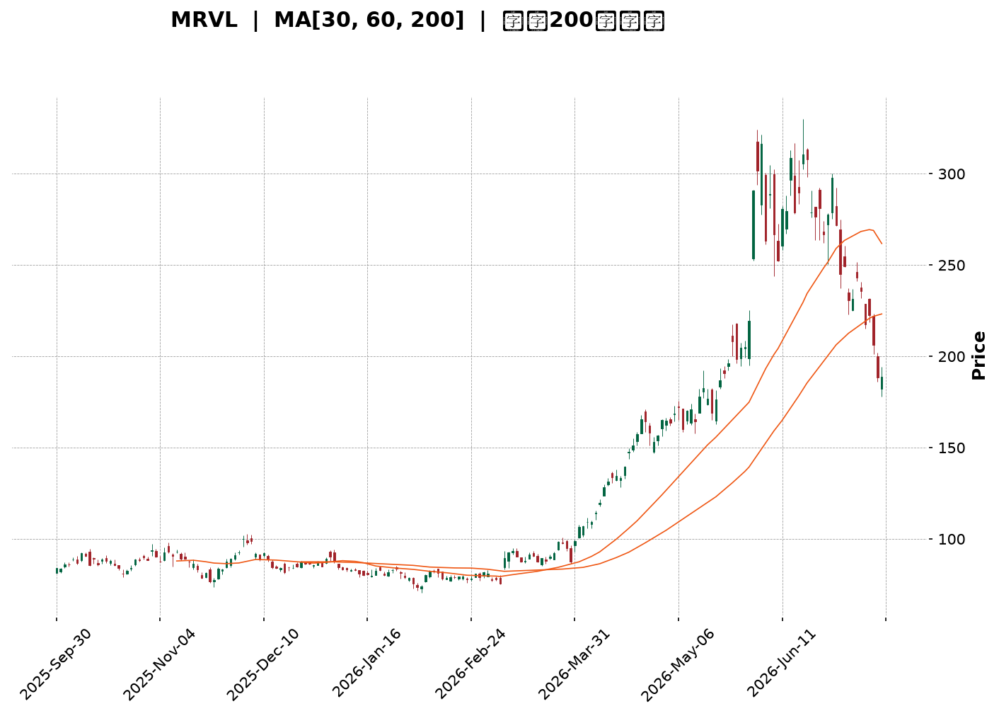
</details>

<html>
<head><meta charset="utf-8" /></head>
<body>
    <div style="height:500px; width:100%;">                        <script>window.PlotlyConfig = {MathJaxConfig: 'local'};</script>
        <script charset="utf-8" src="https://cdn.plot.ly/plotly-3.7.0.min.js" integrity="sha256-jvTGqxNp8AGWEcvNLVuKr+8j5dGe9Yw51LQkmDH+IYA=" crossorigin="anonymous"></script>                <div id="candlestick-chart" class="plotly-graph-div" style="height:100%; width:100%;"></div>            <script>                window.PLOTLYENV=window.PLOTLYENV || {};                                if (document.getElementById("candlestick-chart")) {                    Plotly.newPlot(                        "candlestick-chart",                        [{"close":{"dtype":"f8","bdata":"AAAAgAr5VEAAAADAi+1UQAAAACASgVVAAAAAQFmCVUAAAADgxy5WQAAAAAA\u002fslVAAAAAAGoTV0AAAACgLp9WQAAAAOACX1VAAAAAwJNQVkAAAACA\u002foVVQAAAAKCfMFZAAAAAQHIGVkAAAABAjfRVQAAAAKC1bVVAAAAAAL0IVUAAAACAmTtUQAAAAICEqVRAAAAAAG4AVUAAAADgHiVWQAAAAOAkFVZAAAAAYCWBVkAAAACALBxWQAAAAMCRZldAAAAAgDSPVkAAAACgi91VQAAAAGDjMFdAAAAAIF5MV0AAAACAWrJWQAAAACD6RVdAAAAAIL5MVkAAAAAgvkxWQAAAAIAS2VVAAAAAQLGUVUAAAABA+dRUQAAAACAkpFNAAAAAgNpMVEAAAABAVCRTQAAAAGCJVVNAAAAAwLPqVEAAAAAgstNUQAAAAIDa5VVAAAAAYDdRVkAAAABg271WQAAAAKA\u002fMFdAAAAAIGcDWUAAAACg84JYQAAAAAD3sFhAAAAAYF\u002f3VkAAAABgQzFWQAAAAIBoFVdAAAAAICJTVkAAAAAgmhNVQAAAAAC9CFVAAAAAgJj8VEAAAABAI2VUQAAAAIAoFlVAAAAAoN\u002f9VEAAAABgPytVQAAAAEBM41VAAAAAwD+XVUAAAACgqY1VQAAAAACZaFVAAAAAAIGoVUAAAABAwDZVQAAAAMCTUFZAAAAAQEKGVkAAAABAcgZWQAAAAMAFIVVAAAAAQPnUVEAAAABAGspUQAAAAID\u002ftFRAAAAAADu\u002fVEAAAAAAj0lUQAAAAEB6FFRAAAAAIJgZVEAAAADAYu9TQAAAACBBn1RAAAAAoG3CVEAAAACg4gpUQAAAACBfbVRAAAAAYI63VEAAAAAAr+NUQAAAACDfUVRAAAAAoBu3U0AAAAAAe6ZTQAAAAADz3lJAAAAAIDJrUkAAAACg5IlSQAAAAEAVDlRAAAAAwHaSVEAAAABguHxUQAAAACDfUVRAAAAAIPuKU0AAAABgSKNTQAAAACDdvFNAAAAAwPrBU0AAAAAgPONTQAAAAODr2lNAAAAAgNduU0AAAACgNpVTQAAAACADN1RAAAAAQMXOU0AAAABgQWhUQAAAAOAsM1RAAAAAYO9cU0AAAADgBoJTQAAAAADn51JAAAAA4DJgVkAAAAAALCVXQAAAAKC9TldAAAAAYNaXVkAAAACAsOZVQAAAAEDX8lVAAAAAIL7gVkAAAACAOK5WQAAAAOB941VAAAAAAKRdVkAAAADACfZVQAAAAEDuhVZAAAAAIKASV0AAAAAAGJhYQAAAAODZZlhAAAAA4MizV0AAAACApO9VQAAAAEB3vlhAAAAA4FaoWkAAAACg68FaQAAAAOBnW1tAAAAAgBdTW0AAAABAVJdcQAAAAKDJ9V1AAAAAgKoOYEAAAABgkGhgQAAAAACBuWBAAAAAQCPSYEAAAACAyapgQAAAAED6dGFAAAAAgLZ5YkAAAADAuehiQAAAAKD\u002fqGNAAAAAAJ2wZEAAAACAn4hkQAAAAMB4xWNAAAAAgCYmY0AAAAAgAZFjQAAAACB\u002fo2RAAAAAIBmdZEAAAAAg1HNkQAAAAACrFmVAAAAA4HCDZUAAAACgDv9jQAAAAEDRQmVAAAAAIIhZZUAAAACgs45kQAAAAOD+PGZAAAAAgB7RZkAAAACAFRtmQAAAACBtHGVAAAAAwD8HZkAAAABAIFhnQAAAAECT1GdAAAAAwAKJaEAAAAAgrQZqQAAAAODU1GhAAAAAgPGYaUAAAADAYZ5pQAAAACAHbGtAAAAAIH4rckAAAACgNdlyQAAAAKChxXNAAAAAAHt2cEAAAADgdQxyQAAAAOAGrXBAAAAA4OKQb0AAAACAQIpxQAAAAKAYenFAAAAAgNxMc0AAAADgnmlxQAAAAGB\u002fF3JAAAAA4A1oc0AAAACAizxzQAAAAACKb3FAAAAAwBtKcUAAAADgDJNxQAAAAGBEq3BAAAAAYOdacUAAAACAEJ1yQAAAAOC5\u002f3BAAAAAAFinbkAAAABArCZvQAAAAECU1GxAAAAAQOT0bEAAAABguGZuQAAAAIDreW1AAAAAwPUwa0AAAACAFM5rQAAAAOBRyGlAAAAAoJmJZ0AAAACAwpVnQA=="},"high":{"dtype":"f8","bdata":"7+\u002fSNQgQVUBt7UmWmPtUQAocyLX1x1VA2iEXzWfFVUBfAfNLuINWQIQIjbOXrFZAyt4bVEUeV0D+cuGB\u002fhxXQK0Q5NhcoVdAQsX6mUBvVkDPJQ10JixWQNCBqtAMVVZAfoElUz\u002fEVkAHV\u002fY9dTRWQEasG3vCJVZAekRPKHZzVUDkcsOgpNxUQAeuuEz51FRAXZwfpYNqVUAJjygK8E9WQFRx+CFIdlZA2WWl+Q7YVkCRDAzg9JRWQHsbCY5UW1hAUjTtjt2sV0ApIDWZPa1WQMFM\u002frgD0FdA3uqLAx5\u002fWECgcysg4AJXQOPC93o4lVdA75tQcDAiV0CJKxWD+C5XQN\u002fEUkyBFFZALa9+R6c3VkDuLhJ+8qVVQHkqIUtVaFRADr2ssEdxVEACKSvUPRRVQH+uhJV6s1NA4ByhKDAdVUBsBoHg+utUQGzAuNN2S1ZAkQ8OIYZZVkD4FBTBqSZXQMt0RNY8bldAwkjpxHZ9WUCX08hKpKdZQA0TibRVn1lAIkfcyNspV0BLLwPFj+NWQP8ZikCxLVdAzubgqsHmVkCw2n9IpzdWQM7G\u002flNZblVAYR9+QOEUVUDJnNYOWMNVQA4xJw7yOVVAlO6cfP6FVUCu6aFHNc5VQFSDGn7x+lVAZXdbhQzpVUCDNFU6n8RVQGIHa1ZTflVA8U6NVCP+VUA4+SKNurJVQNk7XC+sfFZAncUIl0R1V0Bsh+FN94NXQJBwtsJxmlVAvc4ndeoyVUCRRUFzwxhVQPNiGTr\u002f61RAvPEeZNL\u002fVEAHbFB5CLxUQPmpOAwyuFRAda2PKMeaVEBrT+rXutpUQMm0XvWHDlVACqh9GFJSVUAiqq34W31UQCdLCxEs2FRA2VK0dlvrVEB2kFC9\u002fllVQPgw+yk4mFRAF7o\u002fHOVoVECBaJz18bpTQMXnBidOulNArGzDPDQAU0CGlkJH\u002fK5SQDo92P8jLFRAPTcCsN6\u002fVEDwINUdndVUQDV4I0Tq7VRA\u002fN1GSzuIVEAgHub7QfpTQK67nBikEFRAKJh\u002f2MEVVEDuNA9kEudTQGM0MXrrEVRA3JUNOULDU0D5MseY\u002fehTQBugPpJHSFRAp+mqHmtkVEBUS25ooI5UQB4cpISFsFRAUU2nCVfBU0AoJr8eM9xTQLTl6LPNDFRAgBabwiJVV0C8Z\u002fUSFDdXQH8OPjaovldAIWDYVBm8V0Df8lvfnX1WQN+z2LKsm1ZAgIdof9scV0Cn7FOzsVdXQEtDsofh\u002fFZAfV4wDhJrVkA1txEtZZpWQLi6wx++4FZAPjIKlslFV0Ct0uKYwa9YQDK7bQjKJFlAnn9nwI7jWECcRdspYxtYQMcEdMIU31hAWKpA7JrwWkBehR9qg8taQJoOqaCc81tAmxv+sWqCW0C8MIMxtuRcQIWgtQlAeF5AmsSw5do5YECx4mJJWaVgQF5gOCy4G2FAVcPNPv1EYUAzxSlVBNVgQI3GMw4EfGFAIwXeG2GxYkD6UgtFLV1jQHvDWdvT1GNAb7Jg+jH6ZECzrkAOiFllQEVP8ykcbWRA+lccx8R+Y0ATZO+0eqVjQLMKG5I2smRAzGA7tyrLZEDR47197NhkQGdQyJP+nWVA5GzKXzb4ZUB6EGVfSW9lQFKYEZKIUWVAsXkE677DZUDMagY0BxZlQHFqGTF7yGZA3qVQikgDaECcda\u002fkCsNmQC7\u002fOidH1WZA1Haa5guzZkBZ5wb0tihoQB8sHEQGUWhABUp28TvLaEDODO8OryxrQN5o9dmYRmtA\u002fxqgrinraUB2Ze0GrBZqQO4xZvazImxA+codfKYzckAXgt6360F0QF0T+UC7FnRAVcLnX1XKckAIJnAaKA5zQNoDW9005XJA6Rti2nEGcUCNTI5\u002fAaRxQJVQJyKL\u002fnFAEuLL+3GOc0DJ3d\u002fHv85zQDpE3Py0NHNARQfEQMecdEAUKigAe6FzQLLtD1gNLnJAYVdmchaecUAH3qmCAUdyQILscj4eInFAl3fqtmFjcUC6WTTe0L5yQCkEb3bYRnJAWGnzeB0ucUA8CCUCVUZwQFMzx8E0rG1AjtqjPGmXbUCC0tfXaXRvQAAAAIAUHm5AAAAAoJmZbEAAAAAAAABtQAAAAKCZ6WtAAAAAgBQ+aUAAAACgmUFoQA=="},"hovertemplate":"\u003cb\u003e%{x|%Y-%m-%d}\u003c\u002fb\u003e\u003cbr\u003e\u958b: $%{open:.2f}\u003cbr\u003e\u9ad8: $%{high:.2f}\u003cbr\u003e\u4f4e: $%{low:.2f}\u003cbr\u003e\u6536: $%{close:.2f}\u003cextra\u003e\u003c\u002fextra\u003e","low":{"dtype":"f8","bdata":"rbO\u002fQIZOVEAZ8LrYVEtUQHtYmycIEFVA\u002fc57NYs5VUBUZZb2\u002fQNWQP2CcL42dlVAastvG8LbVUAYv7iy9pRWQECpjOAIT1VAOV4KxdWgVUChDQ8eHk1VQChBSZijnVVAWzHvLsK5VUB1hBznZmVVQCnr\u002fDzJVFVA3N5MWZu+VEAj4gwGbbxTQK8cBCdeGlRAzRo1NQulVECHI6VEz0RVQDtv2LVT6lVANMBraNk6VkB+\u002fqfqwA5WQMFk+\u002fzotFZAFXua5DJ4VkAo9gWC5sVVQKnxgWhVAVZAyHfSeDYSV0D9E5b7Dj9VQCl+bDonBFdA2etOcvoYVkBn5ymLWC9WQCha7fV+JVVAKNG3J07NVEAiKlrsXG9UQAjvE8PNlFNA5qxSG4iqU0CnmYBH\u002fP1SQF+3w7LGYFJAqW+HYa94U0D5B6kfXhpUQNvTIBcK+lRALyfVh1oZVUCco+R36wpWQEvS79Tc1FZAQdBPoJPpV0COXZn\u002fZ0JYQKGYK+m2SlhAOEXjkIoyVkCpEHTFTfpVQDvPs1IlgVZA2cE0+G7YVUA4BuG2F\u002fFUQPZfH4oI41RAqOLULAKHVEBIAwAc6ENUQKuhDFLZoVRAg1kBPfPkVECDkCZH4RRVQBdDpuGnClVAmMHdXFN+VUDb0wiCBHZVQOzvoFPnBFVAqM62lwpmVUArqdbVMTRVQDIj4VpHnlVACRB3p2r\u002fVUC2BNiMJKlVQElWQLXr3VRAXGFND4ywVEDjMEpaO4hUQC7tRGkygVRAEd\u002fHawusVEAgP4a8fc1TQMbEbAYt\u002fFNAxHYrtVwPVEA+\u002fXirgL1TQMqp\u002fM7BFVRA4naax2erVEBBJKH9ROpTQBc0YIoJ4FNAdjLscVBPVEAUrrPh2KhUQNoMeBN1j1NAsYjijciHU0B4N\u002f+8aSpTQMQFxqYUL1JAeC3VHH3uUUC2ua8RyKhRQBT4N2GfHVNAXaYupx6nU0CrSen8dltUQF8os1CnyVNAPt2uanVYU0DIXuOlSGxTQNb8CT+oJFNASUN0t5ubU0AfK16AXWpTQL482uCwYlNAbVr3C9gAU0CSxgDO1EdTQLqDIDxOulNAPPzmrulFU0D2NtjzeqZTQM75MR3O1VNAaucgpu8lU0BnxDNo8kxTQI4ebWLDy1JAGz1hH53VVEADYPyDxghVQIn9fA5N41ZA8YhvrjWHVkBaV7oLgdNVQGeHjJlUsFVAe0cZmmtDVkCFTjviFJJWQNhNxoG2xlVARtPFNkBEVUB9pdILGaZVQJBjQkAeK1ZAkPp4r\u002fQuVkA8AJW0gXtXQAgn9OBuSVhASccnvCJVV0BPrhZv5qJVQBLm3qrAPldAgRFTfI4aWUCGmz5sfENZQCc+FPPuelpAOinuXDZ8WkDmwHcyhZdbQK6FO\u002fJ8b11AM+zn4nLkXkBh4v+0BR5gQJRHaerYWWBAgiwgfx57YEDoUZ8gbQxgQMpttLERpGBAdSO1pp\u002f8YUCEpNZ9CHpiQCe0j\u002fav4WJAK6swHWW3Y0BfLyWYEc9jQDGiXgKw4WJAgF1KhApaYkAs\u002fx3mZ+hiQFoAyEFJimNAE0\u002fdHhDnY0Dz1woUCkdkQCIiLs1CkWRAPfjOkrKeZEBfdw9TWdBjQKDou5uDW2RAM9pM3mVOZEBQkdM2eb1jQMJrS4PJG2VAYL9YGykpZkAdSxIMg6llQNS6Wp3loWRAZjDpPOpZZECmS6CBhcdmQB7K0SfqhGdAyLyR7YUFaEBPxGF7s\u002f9oQNwUV3NzhmhAYVbt99xUaED8TmLY0+RoQIVwxb5MYmhA5u0\u002fgMSLb0A7jO\u002f3\u002f15yQOQLMWPdV3FAZaTXeTVVcEBBMbJQppRxQLV7DfsSfm5AM82yKlSGb0DHt+gi3CVwQIp6A6Xns3BAPYsAoE0AckCwZaWL+2BxQK5GmYgAtHFAgHDMDZHkckAFb1oHtKFyQOetf\u002fHoQnFAXcgFDIV5cEAWI\u002fu3enpwQMoTnVH3XnBAoMYRpqlOb0DMOK+f6TZxQP1cDnWH9HBAGqCsGIekbUCngPd2UB9vQEbizQ1S3GtAwea\u002fmJUdbECdjl0iTCFuQAAAAOCjAG1AAAAAwPXoakAAAAAAKVRrQAAAAEAKJ2lAAAAAwMxEZ0AAAABgZj5mQA=="},"name":"\u50f9\u683c","open":{"dtype":"f8","bdata":"q8Kl7a5hVEBr1QqGY45UQEbZiJznOFVAzvv+KC6GVUB5qTVwTypWQAOUEVX5MVZASCxM6e4MVkCPE86cpu9WQJDv+mtcNVdADnZSlLBVVkDilzpTD6tVQOMYRmmcAlZAAQBP+AZlVkC4QYgj+qxVQNc9E6vVoFVAf8pRyx9kVUDc9cNNGkdUQE4NZF5nOFRA1guTAHTwVEDGhfC5fXpVQAz9+N4YNVZAHcYH+yCoVkA+4FYUjElWQJwygmnXUFdA3obEnjNQV0BXCiHraOhVQEdpQzbWDFZAuVm622oEWEBO8Bwh7OJWQNjJynAkQldAMZvDDUr5VkDW3WvYWJtWQOQvyrGL3VVAbM4yiSgWVUDQaZsWglNVQMgmRoaIFlRAEAsFqle+U0ALeNxrx9FUQEbCoxBxKVNAYJX8vf+XU0AXwtxTQ5hUQM+bU6XTHVVA7KCDZotxVUBhDIrNmUBWQAQjlOWMIVdAI1daly35WEAqabjV6tBYQCOB6FovEFlAnBbqVVGUVkAoGqOrK91WQAOzbR6OzFZAmZ3DKTC2VkC++J4MGuBVQPG\u002f+pq4L1VAa3mVI0jdVEBdekBC45dVQLVphiLMFlVA30nOVVH7VEDEiw8kAJ1VQIGhoH2vEVVAjM4pYdHHVUCUe+9AO75VQHWkvDIeTVVAN5\u002ffAZloVUDQ85puD6tVQEFyd745p1VA8yt+hY44V0B1hINQGyRXQFxaqH0qmVVAGcNQPdskVUBRRdNW5\u002f1UQJM7QMDwllRApDcF\u002f6XcVEA1JJuWeblUQHNqbD0gqlRAchjxIuhYVEAMsgF\u002fDNBTQMqp\u002fM7BFVRAlGTX\u002fAoaVUDtLL2iMkpUQK+7+Duq8FNAdtTwG7izVECaTwfhEyFVQDc+WEg+eFRACmmAzF\u002f\u002fU0ArCRqZVGNTQOWzEErOnlNAE15yNWq8UkA8EPcl1jRSQEVX51YWMlNA\u002fkW7JjzjU0D+2+YtNahUQN7FB1hn4lRA\u002fN1GSzuIVEDUnGnzEnlTQCpys83IUFNA7LAJJNHFU0CgFvPMkpRTQHbUJMyei1NAtqZ7iDaVU0AO+5GlRXxTQIQ71B7dvFNAznJm2ylDVEAegiowGP5TQA\u002f2xYyD5FNA7ELktq1yU0C7JP6oCalTQFZuehjUtVNAMriC2AcqVUA373pAUfdVQAjBry4OIFdAoFiRFe1hV0DImTTzGnJWQKWGOBly7FVATy8gvFZFVkDZ1i3myQ5XQKRqsRXcrlZAgOfIAyiNVUAbzazCWTVWQOxAJDCGWFZA3zEycoMxVkDke\u002fV5n4BXQC5a5vLBeFhAuWIQxzKtWEAYkc8sIsNXQJiaEg3+FFhAnK6VMqkvWUCWXTl7T45ZQFFZ93uRV1tAmU5rvCMTW0BhBqsBjXpcQDTghf7At11AMAXUxEnoXkAvMNWvAz5gQLewzCRyAmFAKeZKV2+LYEC0aTOeRodgQPSABHgY22BAyRm3yidvYkCjUyTmOZViQMBNMEXoM2NA8zdDZdW8Y0DqXwDEfzplQEfAoXThQmRA9Xv33\u002fN7YkAobGkobTdjQGWTgledCWRAnYy2QOtJZEBjVMHSDa5kQDbbIrOhB2VAUoszd9aRZUBfaeSEDGVlQFBz2b3HlGRArXEN\u002fCV0ZEDUMG8Paq1kQF\u002fINKaLIWVAmOdAj7uaZkD5bHBqbbtlQMzShI00t2ZAz1WhjjiSZEDcv4jE8+xmQLdZtfLMDmhALOWk4IBVaEBBQ71aA2ZqQN0LzKqjPWtAiH\u002f9aG7WaECJ2rBhd4xpQJG0UtaM22hARq+DS7isb0CJbBOb09hzQOxdanEVrnFAhnVfe9G2ckD6Rl+p5glyQBONJCj6unJAdVVRyvV2cECOvSKhnEdwQPPoD9sN4HBAUUr+ajCKckBuDw1V5rByQCaQoZ0VTXJAjB6CiVAWc0C3it\u002fpAJVzQOp75BgFbHFAYVdmchaecUBHvp0auzFyQHztNGLcxHBADXgwJXwFcUBfk\u002f9W5mpxQGrMxrhnpnFAyHyAuu\u002fWcEAhLmqpOthvQLWvO\u002fmVW21Aglum21cjbECEquUe0cNuQAAAAKBHuW1AAAAAwPWYbEAAAACAPfJsQAAAAMAexWtAAAAAANcDaUAAAAAgXMdmQA=="},"x":["2025-09-30T00:00:00-04:00","2025-10-01T00:00:00-04:00","2025-10-02T00:00:00-04:00","2025-10-03T00:00:00-04:00","2025-10-06T00:00:00-04:00","2025-10-07T00:00:00-04:00","2025-10-08T00:00:00-04:00","2025-10-09T00:00:00-04:00","2025-10-10T00:00:00-04:00","2025-10-13T00:00:00-04:00","2025-10-14T00:00:00-04:00","2025-10-15T00:00:00-04:00","2025-10-16T00:00:00-04:00","2025-10-17T00:00:00-04:00","2025-10-20T00:00:00-04:00","2025-10-21T00:00:00-04:00","2025-10-22T00:00:00-04:00","2025-10-23T00:00:00-04:00","2025-10-24T00:00:00-04:00","2025-10-27T00:00:00-04:00","2025-10-28T00:00:00-04:00","2025-10-29T00:00:00-04:00","2025-10-30T00:00:00-04:00","2025-10-31T00:00:00-04:00","2025-11-03T00:00:00-05:00","2025-11-04T00:00:00-05:00","2025-11-05T00:00:00-05:00","2025-11-06T00:00:00-05:00","2025-11-07T00:00:00-05:00","2025-11-10T00:00:00-05:00","2025-11-11T00:00:00-05:00","2025-11-12T00:00:00-05:00","2025-11-13T00:00:00-05:00","2025-11-14T00:00:00-05:00","2025-11-17T00:00:00-05:00","2025-11-18T00:00:00-05:00","2025-11-19T00:00:00-05:00","2025-11-20T00:00:00-05:00","2025-11-21T00:00:00-05:00","2025-11-24T00:00:00-05:00","2025-11-25T00:00:00-05:00","2025-11-26T00:00:00-05:00","2025-11-28T00:00:00-05:00","2025-12-01T00:00:00-05:00","2025-12-02T00:00:00-05:00","2025-12-03T00:00:00-05:00","2025-12-04T00:00:00-05:00","2025-12-05T00:00:00-05:00","2025-12-08T00:00:00-05:00","2025-12-09T00:00:00-05:00","2025-12-10T00:00:00-05:00","2025-12-11T00:00:00-05:00","2025-12-12T00:00:00-05:00","2025-12-15T00:00:00-05:00","2025-12-16T00:00:00-05:00","2025-12-17T00:00:00-05:00","2025-12-18T00:00:00-05:00","2025-12-19T00:00:00-05:00","2025-12-22T00:00:00-05:00","2025-12-23T00:00:00-05:00","2025-12-24T00:00:00-05:00","2025-12-26T00:00:00-05:00","2025-12-29T00:00:00-05:00","2025-12-30T00:00:00-05:00","2025-12-31T00:00:00-05:00","2026-01-02T00:00:00-05:00","2026-01-05T00:00:00-05:00","2026-01-06T00:00:00-05:00","2026-01-07T00:00:00-05:00","2026-01-08T00:00:00-05:00","2026-01-09T00:00:00-05:00","2026-01-12T00:00:00-05:00","2026-01-13T00:00:00-05:00","2026-01-14T00:00:00-05:00","2026-01-15T00:00:00-05:00","2026-01-16T00:00:00-05:00","2026-01-20T00:00:00-05:00","2026-01-21T00:00:00-05:00","2026-01-22T00:00:00-05:00","2026-01-23T00:00:00-05:00","2026-01-26T00:00:00-05:00","2026-01-27T00:00:00-05:00","2026-01-28T00:00:00-05:00","2026-01-29T00:00:00-05:00","2026-01-30T00:00:00-05:00","2026-02-02T00:00:00-05:00","2026-02-03T00:00:00-05:00","2026-02-04T00:00:00-05:00","2026-02-05T00:00:00-05:00","2026-02-06T00:00:00-05:00","2026-02-09T00:00:00-05:00","2026-02-10T00:00:00-05:00","2026-02-11T00:00:00-05:00","2026-02-12T00:00:00-05:00","2026-02-13T00:00:00-05:00","2026-02-17T00:00:00-05:00","2026-02-18T00:00:00-05:00","2026-02-19T00:00:00-05:00","2026-02-20T00:00:00-05:00","2026-02-23T00:00:00-05:00","2026-02-24T00:00:00-05:00","2026-02-25T00:00:00-05:00","2026-02-26T00:00:00-05:00","2026-02-27T00:00:00-05:00","2026-03-02T00:00:00-05:00","2026-03-03T00:00:00-05:00","2026-03-04T00:00:00-05:00","2026-03-05T00:00:00-05:00","2026-03-06T00:00:00-05:00","2026-03-09T00:00:00-04:00","2026-03-10T00:00:00-04:00","2026-03-11T00:00:00-04:00","2026-03-12T00:00:00-04:00","2026-03-13T00:00:00-04:00","2026-03-16T00:00:00-04:00","2026-03-17T00:00:00-04:00","2026-03-18T00:00:00-04:00","2026-03-19T00:00:00-04:00","2026-03-20T00:00:00-04:00","2026-03-23T00:00:00-04:00","2026-03-24T00:00:00-04:00","2026-03-25T00:00:00-04:00","2026-03-26T00:00:00-04:00","2026-03-27T00:00:00-04:00","2026-03-30T00:00:00-04:00","2026-03-31T00:00:00-04:00","2026-04-01T00:00:00-04:00","2026-04-02T00:00:00-04:00","2026-04-06T00:00:00-04:00","2026-04-07T00:00:00-04:00","2026-04-08T00:00:00-04:00","2026-04-09T00:00:00-04:00","2026-04-10T00:00:00-04:00","2026-04-13T00:00:00-04:00","2026-04-14T00:00:00-04:00","2026-04-15T00:00:00-04:00","2026-04-16T00:00:00-04:00","2026-04-17T00:00:00-04:00","2026-04-20T00:00:00-04:00","2026-04-21T00:00:00-04:00","2026-04-22T00:00:00-04:00","2026-04-23T00:00:00-04:00","2026-04-24T00:00:00-04:00","2026-04-27T00:00:00-04:00","2026-04-28T00:00:00-04:00","2026-04-29T00:00:00-04:00","2026-04-30T00:00:00-04:00","2026-05-01T00:00:00-04:00","2026-05-04T00:00:00-04:00","2026-05-05T00:00:00-04:00","2026-05-06T00:00:00-04:00","2026-05-07T00:00:00-04:00","2026-05-08T00:00:00-04:00","2026-05-11T00:00:00-04:00","2026-05-12T00:00:00-04:00","2026-05-13T00:00:00-04:00","2026-05-14T00:00:00-04:00","2026-05-15T00:00:00-04:00","2026-05-18T00:00:00-04:00","2026-05-19T00:00:00-04:00","2026-05-20T00:00:00-04:00","2026-05-21T00:00:00-04:00","2026-05-22T00:00:00-04:00","2026-05-26T00:00:00-04:00","2026-05-27T00:00:00-04:00","2026-05-28T00:00:00-04:00","2026-05-29T00:00:00-04:00","2026-06-01T00:00:00-04:00","2026-06-02T00:00:00-04:00","2026-06-03T00:00:00-04:00","2026-06-04T00:00:00-04:00","2026-06-05T00:00:00-04:00","2026-06-08T00:00:00-04:00","2026-06-09T00:00:00-04:00","2026-06-10T00:00:00-04:00","2026-06-11T00:00:00-04:00","2026-06-12T00:00:00-04:00","2026-06-15T00:00:00-04:00","2026-06-16T00:00:00-04:00","2026-06-17T00:00:00-04:00","2026-06-18T00:00:00-04:00","2026-06-22T00:00:00-04:00","2026-06-23T00:00:00-04:00","2026-06-24T00:00:00-04:00","2026-06-25T00:00:00-04:00","2026-06-26T00:00:00-04:00","2026-06-29T00:00:00-04:00","2026-06-30T00:00:00-04:00","2026-07-01T00:00:00-04:00","2026-07-02T00:00:00-04:00","2026-07-06T00:00:00-04:00","2026-07-07T00:00:00-04:00","2026-07-08T00:00:00-04:00","2026-07-09T00:00:00-04:00","2026-07-10T00:00:00-04:00","2026-07-13T00:00:00-04:00","2026-07-14T00:00:00-04:00","2026-07-15T00:00:00-04:00","2026-07-16T00:00:00-04:00","2026-07-17T00:00:00-04:00"],"type":"candlestick"},{"hovertemplate":"MA30: $%{y:.2f}\u003cextra\u003e\u003c\u002fextra\u003e","line":{"color":"#2196F3","dash":"dash","width":2},"mode":"lines","name":"MA30","x":["2025-09-30T00:00:00-04:00","2025-10-01T00:00:00-04:00","2025-10-02T00:00:00-04:00","2025-10-03T00:00:00-04:00","2025-10-06T00:00:00-04:00","2025-10-07T00:00:00-04:00","2025-10-08T00:00:00-04:00","2025-10-09T00:00:00-04:00","2025-10-10T00:00:00-04:00","2025-10-13T00:00:00-04:00","2025-10-14T00:00:00-04:00","2025-10-15T00:00:00-04:00","2025-10-16T00:00:00-04:00","2025-10-17T00:00:00-04:00","2025-10-20T00:00:00-04:00","2025-10-21T00:00:00-04:00","2025-10-22T00:00:00-04:00","2025-10-23T00:00:00-04:00","2025-10-24T00:00:00-04:00","2025-10-27T00:00:00-04:00","2025-10-28T00:00:00-04:00","2025-10-29T00:00:00-04:00","2025-10-30T00:00:00-04:00","2025-10-31T00:00:00-04:00","2025-11-03T00:00:00-05:00","2025-11-04T00:00:00-05:00","2025-11-05T00:00:00-05:00","2025-11-06T00:00:00-05:00","2025-11-07T00:00:00-05:00","2025-11-10T00:00:00-05:00","2025-11-11T00:00:00-05:00","2025-11-12T00:00:00-05:00","2025-11-13T00:00:00-05:00","2025-11-14T00:00:00-05:00","2025-11-17T00:00:00-05:00","2025-11-18T00:00:00-05:00","2025-11-19T00:00:00-05:00","2025-11-20T00:00:00-05:00","2025-11-21T00:00:00-05:00","2025-11-24T00:00:00-05:00","2025-11-25T00:00:00-05:00","2025-11-26T00:00:00-05:00","2025-11-28T00:00:00-05:00","2025-12-01T00:00:00-05:00","2025-12-02T00:00:00-05:00","2025-12-03T00:00:00-05:00","2025-12-04T00:00:00-05:00","2025-12-05T00:00:00-05:00","2025-12-08T00:00:00-05:00","2025-12-09T00:00:00-05:00","2025-12-10T00:00:00-05:00","2025-12-11T00:00:00-05:00","2025-12-12T00:00:00-05:00","2025-12-15T00:00:00-05:00","2025-12-16T00:00:00-05:00","2025-12-17T00:00:00-05:00","2025-12-18T00:00:00-05:00","2025-12-19T00:00:00-05:00","2025-12-22T00:00:00-05:00","2025-12-23T00:00:00-05:00","2025-12-24T00:00:00-05:00","2025-12-26T00:00:00-05:00","2025-12-29T00:00:00-05:00","2025-12-30T00:00:00-05:00","2025-12-31T00:00:00-05:00","2026-01-02T00:00:00-05:00","2026-01-05T00:00:00-05:00","2026-01-06T00:00:00-05:00","2026-01-07T00:00:00-05:00","2026-01-08T00:00:00-05:00","2026-01-09T00:00:00-05:00","2026-01-12T00:00:00-05:00","2026-01-13T00:00:00-05:00","2026-01-14T00:00:00-05:00","2026-01-15T00:00:00-05:00","2026-01-16T00:00:00-05:00","2026-01-20T00:00:00-05:00","2026-01-21T00:00:00-05:00","2026-01-22T00:00:00-05:00","2026-01-23T00:00:00-05:00","2026-01-26T00:00:00-05:00","2026-01-27T00:00:00-05:00","2026-01-28T00:00:00-05:00","2026-01-29T00:00:00-05:00","2026-01-30T00:00:00-05:00","2026-02-02T00:00:00-05:00","2026-02-03T00:00:00-05:00","2026-02-04T00:00:00-05:00","2026-02-05T00:00:00-05:00","2026-02-06T00:00:00-05:00","2026-02-09T00:00:00-05:00","2026-02-10T00:00:00-05:00","2026-02-11T00:00:00-05:00","2026-02-12T00:00:00-05:00","2026-02-13T00:00:00-05:00","2026-02-17T00:00:00-05:00","2026-02-18T00:00:00-05:00","2026-02-19T00:00:00-05:00","2026-02-20T00:00:00-05:00","2026-02-23T00:00:00-05:00","2026-02-24T00:00:00-05:00","2026-02-25T00:00:00-05:00","2026-02-26T00:00:00-05:00","2026-02-27T00:00:00-05:00","2026-03-02T00:00:00-05:00","2026-03-03T00:00:00-05:00","2026-03-04T00:00:00-05:00","2026-03-05T00:00:00-05:00","2026-03-06T00:00:00-05:00","2026-03-09T00:00:00-04:00","2026-03-10T00:00:00-04:00","2026-03-11T00:00:00-04:00","2026-03-12T00:00:00-04:00","2026-03-13T00:00:00-04:00","2026-03-16T00:00:00-04:00","2026-03-17T00:00:00-04:00","2026-03-18T00:00:00-04:00","2026-03-19T00:00:00-04:00","2026-03-20T00:00:00-04:00","2026-03-23T00:00:00-04:00","2026-03-24T00:00:00-04:00","2026-03-25T00:00:00-04:00","2026-03-26T00:00:00-04:00","2026-03-27T00:00:00-04:00","2026-03-30T00:00:00-04:00","2026-03-31T00:00:00-04:00","2026-04-01T00:00:00-04:00","2026-04-02T00:00:00-04:00","2026-04-06T00:00:00-04:00","2026-04-07T00:00:00-04:00","2026-04-08T00:00:00-04:00","2026-04-09T00:00:00-04:00","2026-04-10T00:00:00-04:00","2026-04-13T00:00:00-04:00","2026-04-14T00:00:00-04:00","2026-04-15T00:00:00-04:00","2026-04-16T00:00:00-04:00","2026-04-17T00:00:00-04:00","2026-04-20T00:00:00-04:00","2026-04-21T00:00:00-04:00","2026-04-22T00:00:00-04:00","2026-04-23T00:00:00-04:00","2026-04-24T00:00:00-04:00","2026-04-27T00:00:00-04:00","2026-04-28T00:00:00-04:00","2026-04-29T00:00:00-04:00","2026-04-30T00:00:00-04:00","2026-05-01T00:00:00-04:00","2026-05-04T00:00:00-04:00","2026-05-05T00:00:00-04:00","2026-05-06T00:00:00-04:00","2026-05-07T00:00:00-04:00","2026-05-08T00:00:00-04:00","2026-05-11T00:00:00-04:00","2026-05-12T00:00:00-04:00","2026-05-13T00:00:00-04:00","2026-05-14T00:00:00-04:00","2026-05-15T00:00:00-04:00","2026-05-18T00:00:00-04:00","2026-05-19T00:00:00-04:00","2026-05-20T00:00:00-04:00","2026-05-21T00:00:00-04:00","2026-05-22T00:00:00-04:00","2026-05-26T00:00:00-04:00","2026-05-27T00:00:00-04:00","2026-05-28T00:00:00-04:00","2026-05-29T00:00:00-04:00","2026-06-01T00:00:00-04:00","2026-06-02T00:00:00-04:00","2026-06-03T00:00:00-04:00","2026-06-04T00:00:00-04:00","2026-06-05T00:00:00-04:00","2026-06-08T00:00:00-04:00","2026-06-09T00:00:00-04:00","2026-06-10T00:00:00-04:00","2026-06-11T00:00:00-04:00","2026-06-12T00:00:00-04:00","2026-06-15T00:00:00-04:00","2026-06-16T00:00:00-04:00","2026-06-17T00:00:00-04:00","2026-06-18T00:00:00-04:00","2026-06-22T00:00:00-04:00","2026-06-23T00:00:00-04:00","2026-06-24T00:00:00-04:00","2026-06-25T00:00:00-04:00","2026-06-26T00:00:00-04:00","2026-06-29T00:00:00-04:00","2026-06-30T00:00:00-04:00","2026-07-01T00:00:00-04:00","2026-07-02T00:00:00-04:00","2026-07-06T00:00:00-04:00","2026-07-07T00:00:00-04:00","2026-07-08T00:00:00-04:00","2026-07-09T00:00:00-04:00","2026-07-10T00:00:00-04:00","2026-07-13T00:00:00-04:00","2026-07-14T00:00:00-04:00","2026-07-15T00:00:00-04:00","2026-07-16T00:00:00-04:00","2026-07-17T00:00:00-04:00"],"y":{"dtype":"f8","bdata":"AAAAAAAA+H8AAAAAAAD4fwAAAAAAAPh\u002fAAAAAAAA+H8AAAAAAAD4fwAAAAAAAPh\u002fAAAAAAAA+H8AAAAAAAD4fwAAAAAAAPh\u002fAAAAAAAA+H8AAAAAAAD4fwAAAAAAAPh\u002fAAAAAAAA+H8AAAAAAAD4fwAAAAAAAPh\u002fAAAAAAAA+H8AAAAAAAD4fwAAAAAAAPh\u002fAAAAAAAA+H8AAAAAAAD4fwAAAAAAAPh\u002fAAAAAAAA+H8AAAAAAAD4fwAAAAAAAPh\u002fAAAAAAAA+H8AAAAAAAD4fwAAAAAAAPh\u002fAAAAAAAA+H8AAAAAAAD4f4mIiLiC+lVAIiIigtUFVkAzMzNjihFWQFVVVVV5FFZA3t3d3RUVVkCrqqr6jglWQM3MzIwF+FVAmpmZGVbgVUB3d3cnpMJVQM3MzDxCsVVA7+7uXlSlVUBERETkYp9VQKuqqtrknFVARERE5GKfVUAiIiKyGKZVQLy7u0sdtVVAZmZm5hHXVUB3d3fnlPtVQGZmZpb2HVZA3t3dXbouVkC8u7v7IS9WQFVVVcWsN1ZAERERISQ2VkAzMzNzUi1WQBEREbEgGVZAd3d3F7ULVkBEREQUKf9VQKuqquoz7VVAiYiICIXZVUCJiIiYe8xVQAAAAACpwFVAERERQZy6VUBERES0PbRVQLy7u+t9sFVAq6qq+iaxVUCJiIhYabRVQN7d3d05y1VAq6qqyjTeVUBERERkz\u002fZVQGZmZlYgBlZAvLu762YFVkDv7u4OFQVWQAAAAKDr+lVAiYiIWIXtVUDe3d3dk9hVQJqZmUkNvlVAzczM\u002fB+UVUAAAACgEm1VQM3MzFxZSlVAERERgYQ3VUAiIiLyKyVVQHd3d\u002feADlVAd3d318gAVUAAAADwL\u002f9UQJqZmXkX+VRAq6qq+j3uVECamZkJ4+dUQKuqqtr61FRAMzMzIwa\u002fVEDe3d0tlKhUQGZmZjbwmFRAiYiI2D6QVEDNzMy8JYdUQGZmZkbbfVRAd3d3R85rVECamZlZW15UQLy7u8tdSFRAAAAA0MEwVEBmZmZGhB5UQLy7u4ulE1RAzczMfLUHVEAiIiKiaf1TQN7d3Y02+VNAERERoTLxU0AzMzOTOPJTQHd3d4c+81NAMzMzo\u002fTsU0ARERFxT+lTQN7d3U2q2lNAVVVVJXXoU0Dv7u4O7wJUQGZmZkaDG1RAzczMrIUrVEC8u7vbJzRUQO\u002fu7v4NQlRAERER4QpdVEB3d3eH5nZUQEREROSmkFRAq6qqWlWyVECrqqrKic9UQO\u002fu7o6Z5FRAVVVVRfD5VEDe3d39+xxVQGZmZibRP1VAmpmZeU9jVUBVVVUl7HZVQLy7u3ukoVVAvLu7a4XcVUDv7u7eJBdWQBEREQEpV1ZAiYiIeICaVkAzMzNTX+dWQDMzMxOIOldA3t3d3YyjV0De3d0tcg1YQBEREdGBflhA3t3dDVr4WEARERExVm5ZQN7d3T3w9llAvLu7C1BzWkARERGhhfBaQDMzM\u002fMpeVtAIiIiEnoZXECrqqpaB71cQM3MzFwqU11AERERMcDWXUCJiIjIJGNeQO\u002fu7v6XCF9AvLu7q4upX0AzMzOLmSVgQHd3d990eWBAmpmZGZjOYEAzMzNjSxBhQAAAAIibXWFAVVVVhamuYUBVVVXVfQBiQCIiIgKvVGJAMzMzC6alYkARERGRHvBiQLy7uyOLL2NAmpmZAe92Y0DNzMwkJsRjQFVVVfWrD2RAvLu7OwRYZEAiIiJCFqpkQImIiLhD72RAZmZmdig6ZUB3d3dni4ZlQN7d3V2U22VAAAAAoAV0ZkB3d3dXWBRnQDMzM0MFvmdAERERoW4maECJiIj4PatoQN7d3c0gH2lAREREBBaJaUBVVVUleA1qQHd3dzegh2pAMzMzAx0ha0CrqqqqwptrQCIiIkKSHGxA3t3djTGwbEAAAACA3E1tQLy7u9sAwm1AIiIikuQybkCamZn5Z69uQFVVVcUfDm9AzczMHJ1zb0B3d3cHpvRvQLy7u9tOMXBAAAAAEBxWcEAiIiIya3dwQLy7u4vAjHBAd3d3552fcEAiIiLCSLJwQLy7uzMaxnBAq6qqEufMcEBmZmYeO9ZwQFVVVV08z3BAq6qq2pyYcEB3d3fXZlxwQA=="},"type":"scatter"},{"hovertemplate":"MA60: $%{y:.2f}\u003cextra\u003e\u003c\u002fextra\u003e","line":{"color":"#9C27B0","dash":"dash","width":2},"mode":"lines","name":"MA60","x":["2025-09-30T00:00:00-04:00","2025-10-01T00:00:00-04:00","2025-10-02T00:00:00-04:00","2025-10-03T00:00:00-04:00","2025-10-06T00:00:00-04:00","2025-10-07T00:00:00-04:00","2025-10-08T00:00:00-04:00","2025-10-09T00:00:00-04:00","2025-10-10T00:00:00-04:00","2025-10-13T00:00:00-04:00","2025-10-14T00:00:00-04:00","2025-10-15T00:00:00-04:00","2025-10-16T00:00:00-04:00","2025-10-17T00:00:00-04:00","2025-10-20T00:00:00-04:00","2025-10-21T00:00:00-04:00","2025-10-22T00:00:00-04:00","2025-10-23T00:00:00-04:00","2025-10-24T00:00:00-04:00","2025-10-27T00:00:00-04:00","2025-10-28T00:00:00-04:00","2025-10-29T00:00:00-04:00","2025-10-30T00:00:00-04:00","2025-10-31T00:00:00-04:00","2025-11-03T00:00:00-05:00","2025-11-04T00:00:00-05:00","2025-11-05T00:00:00-05:00","2025-11-06T00:00:00-05:00","2025-11-07T00:00:00-05:00","2025-11-10T00:00:00-05:00","2025-11-11T00:00:00-05:00","2025-11-12T00:00:00-05:00","2025-11-13T00:00:00-05:00","2025-11-14T00:00:00-05:00","2025-11-17T00:00:00-05:00","2025-11-18T00:00:00-05:00","2025-11-19T00:00:00-05:00","2025-11-20T00:00:00-05:00","2025-11-21T00:00:00-05:00","2025-11-24T00:00:00-05:00","2025-11-25T00:00:00-05:00","2025-11-26T00:00:00-05:00","2025-11-28T00:00:00-05:00","2025-12-01T00:00:00-05:00","2025-12-02T00:00:00-05:00","2025-12-03T00:00:00-05:00","2025-12-04T00:00:00-05:00","2025-12-05T00:00:00-05:00","2025-12-08T00:00:00-05:00","2025-12-09T00:00:00-05:00","2025-12-10T00:00:00-05:00","2025-12-11T00:00:00-05:00","2025-12-12T00:00:00-05:00","2025-12-15T00:00:00-05:00","2025-12-16T00:00:00-05:00","2025-12-17T00:00:00-05:00","2025-12-18T00:00:00-05:00","2025-12-19T00:00:00-05:00","2025-12-22T00:00:00-05:00","2025-12-23T00:00:00-05:00","2025-12-24T00:00:00-05:00","2025-12-26T00:00:00-05:00","2025-12-29T00:00:00-05:00","2025-12-30T00:00:00-05:00","2025-12-31T00:00:00-05:00","2026-01-02T00:00:00-05:00","2026-01-05T00:00:00-05:00","2026-01-06T00:00:00-05:00","2026-01-07T00:00:00-05:00","2026-01-08T00:00:00-05:00","2026-01-09T00:00:00-05:00","2026-01-12T00:00:00-05:00","2026-01-13T00:00:00-05:00","2026-01-14T00:00:00-05:00","2026-01-15T00:00:00-05:00","2026-01-16T00:00:00-05:00","2026-01-20T00:00:00-05:00","2026-01-21T00:00:00-05:00","2026-01-22T00:00:00-05:00","2026-01-23T00:00:00-05:00","2026-01-26T00:00:00-05:00","2026-01-27T00:00:00-05:00","2026-01-28T00:00:00-05:00","2026-01-29T00:00:00-05:00","2026-01-30T00:00:00-05:00","2026-02-02T00:00:00-05:00","2026-02-03T00:00:00-05:00","2026-02-04T00:00:00-05:00","2026-02-05T00:00:00-05:00","2026-02-06T00:00:00-05:00","2026-02-09T00:00:00-05:00","2026-02-10T00:00:00-05:00","2026-02-11T00:00:00-05:00","2026-02-12T00:00:00-05:00","2026-02-13T00:00:00-05:00","2026-02-17T00:00:00-05:00","2026-02-18T00:00:00-05:00","2026-02-19T00:00:00-05:00","2026-02-20T00:00:00-05:00","2026-02-23T00:00:00-05:00","2026-02-24T00:00:00-05:00","2026-02-25T00:00:00-05:00","2026-02-26T00:00:00-05:00","2026-02-27T00:00:00-05:00","2026-03-02T00:00:00-05:00","2026-03-03T00:00:00-05:00","2026-03-04T00:00:00-05:00","2026-03-05T00:00:00-05:00","2026-03-06T00:00:00-05:00","2026-03-09T00:00:00-04:00","2026-03-10T00:00:00-04:00","2026-03-11T00:00:00-04:00","2026-03-12T00:00:00-04:00","2026-03-13T00:00:00-04:00","2026-03-16T00:00:00-04:00","2026-03-17T00:00:00-04:00","2026-03-18T00:00:00-04:00","2026-03-19T00:00:00-04:00","2026-03-20T00:00:00-04:00","2026-03-23T00:00:00-04:00","2026-03-24T00:00:00-04:00","2026-03-25T00:00:00-04:00","2026-03-26T00:00:00-04:00","2026-03-27T00:00:00-04:00","2026-03-30T00:00:00-04:00","2026-03-31T00:00:00-04:00","2026-04-01T00:00:00-04:00","2026-04-02T00:00:00-04:00","2026-04-06T00:00:00-04:00","2026-04-07T00:00:00-04:00","2026-04-08T00:00:00-04:00","2026-04-09T00:00:00-04:00","2026-04-10T00:00:00-04:00","2026-04-13T00:00:00-04:00","2026-04-14T00:00:00-04:00","2026-04-15T00:00:00-04:00","2026-04-16T00:00:00-04:00","2026-04-17T00:00:00-04:00","2026-04-20T00:00:00-04:00","2026-04-21T00:00:00-04:00","2026-04-22T00:00:00-04:00","2026-04-23T00:00:00-04:00","2026-04-24T00:00:00-04:00","2026-04-27T00:00:00-04:00","2026-04-28T00:00:00-04:00","2026-04-29T00:00:00-04:00","2026-04-30T00:00:00-04:00","2026-05-01T00:00:00-04:00","2026-05-04T00:00:00-04:00","2026-05-05T00:00:00-04:00","2026-05-06T00:00:00-04:00","2026-05-07T00:00:00-04:00","2026-05-08T00:00:00-04:00","2026-05-11T00:00:00-04:00","2026-05-12T00:00:00-04:00","2026-05-13T00:00:00-04:00","2026-05-14T00:00:00-04:00","2026-05-15T00:00:00-04:00","2026-05-18T00:00:00-04:00","2026-05-19T00:00:00-04:00","2026-05-20T00:00:00-04:00","2026-05-21T00:00:00-04:00","2026-05-22T00:00:00-04:00","2026-05-26T00:00:00-04:00","2026-05-27T00:00:00-04:00","2026-05-28T00:00:00-04:00","2026-05-29T00:00:00-04:00","2026-06-01T00:00:00-04:00","2026-06-02T00:00:00-04:00","2026-06-03T00:00:00-04:00","2026-06-04T00:00:00-04:00","2026-06-05T00:00:00-04:00","2026-06-08T00:00:00-04:00","2026-06-09T00:00:00-04:00","2026-06-10T00:00:00-04:00","2026-06-11T00:00:00-04:00","2026-06-12T00:00:00-04:00","2026-06-15T00:00:00-04:00","2026-06-16T00:00:00-04:00","2026-06-17T00:00:00-04:00","2026-06-18T00:00:00-04:00","2026-06-22T00:00:00-04:00","2026-06-23T00:00:00-04:00","2026-06-24T00:00:00-04:00","2026-06-25T00:00:00-04:00","2026-06-26T00:00:00-04:00","2026-06-29T00:00:00-04:00","2026-06-30T00:00:00-04:00","2026-07-01T00:00:00-04:00","2026-07-02T00:00:00-04:00","2026-07-06T00:00:00-04:00","2026-07-07T00:00:00-04:00","2026-07-08T00:00:00-04:00","2026-07-09T00:00:00-04:00","2026-07-10T00:00:00-04:00","2026-07-13T00:00:00-04:00","2026-07-14T00:00:00-04:00","2026-07-15T00:00:00-04:00","2026-07-16T00:00:00-04:00","2026-07-17T00:00:00-04:00"],"y":{"dtype":"f8","bdata":"AAAAAAAA+H8AAAAAAAD4fwAAAAAAAPh\u002fAAAAAAAA+H8AAAAAAAD4fwAAAAAAAPh\u002fAAAAAAAA+H8AAAAAAAD4fwAAAAAAAPh\u002fAAAAAAAA+H8AAAAAAAD4fwAAAAAAAPh\u002fAAAAAAAA+H8AAAAAAAD4fwAAAAAAAPh\u002fAAAAAAAA+H8AAAAAAAD4fwAAAAAAAPh\u002fAAAAAAAA+H8AAAAAAAD4fwAAAAAAAPh\u002fAAAAAAAA+H8AAAAAAAD4fwAAAAAAAPh\u002fAAAAAAAA+H8AAAAAAAD4fwAAAAAAAPh\u002fAAAAAAAA+H8AAAAAAAD4fwAAAAAAAPh\u002fAAAAAAAA+H8AAAAAAAD4fwAAAAAAAPh\u002fAAAAAAAA+H8AAAAAAAD4fwAAAAAAAPh\u002fAAAAAAAA+H8AAAAAAAD4fwAAAAAAAPh\u002fAAAAAAAA+H8AAAAAAAD4fwAAAAAAAPh\u002fAAAAAAAA+H8AAAAAAAD4fwAAAAAAAPh\u002fAAAAAAAA+H8AAAAAAAD4fwAAAAAAAPh\u002fAAAAAAAA+H8AAAAAAAD4fwAAAAAAAPh\u002fAAAAAAAA+H8AAAAAAAD4fwAAAAAAAPh\u002fAAAAAAAA+H8AAAAAAAD4fwAAAAAAAPh\u002fAAAAAAAA+H8AAAAAAAD4f0RERNyV3VVAmpmZ4TjgVUC8u7sL5OJVQImIiKB74lVAREREbB7jVUCamZkp\u002fN5VQFVVVbWf4VVAIiIickXfVUDe3d3FudxVQJqZmUmx21VAVVVVpV3VVUCamZn5O9JVQFVVVT3oy1VAZmZmHnTGVUAAAABIVr9VQKuqqkqVuVVAmpmZ8Zi1VUC8u7vDU7RVQJqZmfkntFVAd3d3bx+zVUDv7u72JqpVQGZmZt4Wo1VAREREfHabVUCamZkxQZZVQFVVVRUciVVAERERifl8VUDv7u4OhnNVQKuqqmIXYVVA3t3dlUVMVUAzMzPjhzpVQDMzM5vMLFVAzczMjG0lVUCJiIi4sR1VQBEREZksF1VAERERoXoOVUARERFZYglVQM3MzNTLCVVAVVVVTXsHVUBVVVXVqQpVQBEREfHiDFVARERENI4GVUCJiIhYPwFVQO\u002fu7hYR+lRAzczM\u002fFvvVECJiIg4ZuVUQImIiOil2FRAAAAAUIrAVECJiIgIMatUQFVVVdWBklRAMzMz0\u002fyPVECJiIiADZRUQO\u002fu7h4ClVRAIiIiQieWVEDe3d3lq5lUQERERLySnVRA3t3dbaSlVECJiIjIZK9UQHd3d9\u002fQslRA7+7uvq24VEBERET8DrxUQKuqquLEvlRA7+7ujhfFVEBVVVXdENJUQGZmZjbW3lRAiYiI4I7nVEB3d3e\u002fo+pUQLy7uyMB9VRA3t3dnaMGVUCrqqqS1BpVQGZmZkZnNVVAq6qq+hpRVUCrqqp6ZHJVQImIiFDfmVVAd3d3v1\u002fKVUCJiIhg1f9VQERERCzgOFZAiYiIWKdyVkARERHR0qtWQN7d3UXN6FZAiYiImOItV0AAAABYunlXQM3MzJxWyldAd3d3338iWEAzMzObl3hYQN7d3S2cylhAERERieUZWUAAAACoBW1ZQJqZmXGfzFlAMzMzg\u002fAtWkCJiIhwXo1aQO\u002fu7qbB61pAREREPJBLW0AiIiJiyZ5bQDMzMxuE\u002fVtAIiIiQlFgXEAAAADo87tcQAAAAECBJV1AERERweiTXUCJiIgAsftdQERERKQfW15A3t3dPS\u002fEXkBmZmbO1TdfQO\u002fu7v7vrF9AVVVVVeUUYECJiIisZ1hgQImIiFBCl2BAq6qqvirbYEAAAABA2x5hQGZmZj6Ga2FA7+7u0tbWYUAAAACUTUZiQGZmZh5NvWJAERER1ZUZY0Dv7u7S4IRjQCIiIv5a5GNAZmZmDjs6ZEDNzMxEhZ9kQHd3dxv2BWVAiYiIbPF6ZUDv7u4aruBlQM3MzJADS2ZAvLu702S\u002fZkCamZnxEy9nQN7d3THOj2dAvLu7C8fwZ0B3d3fn8ldoQLy7u2NnsWhAAAAAlKEMaUBERERMYnJpQJqZmW0UyWlAzczMkJMRakCJiIhEfllqQGZmZoaWlGpAVVVVBaDLakAzMzPjUwdrQAAAABC8PWtA3t3dTftpa0AiIiLSgJlrQERERIwGvWtAq6qqqp\u002fSa0AzMzMDk+ZrQA=="},"type":"scatter"},{"hovertemplate":"MA200: $%{y:.2f}\u003cextra\u003e\u003c\u002fextra\u003e","line":{"color":"#FF6F00","dash":"solid","width":2},"mode":"lines","name":"MA200","x":["2025-09-30T00:00:00-04:00","2025-10-01T00:00:00-04:00","2025-10-02T00:00:00-04:00","2025-10-03T00:00:00-04:00","2025-10-06T00:00:00-04:00","2025-10-07T00:00:00-04:00","2025-10-08T00:00:00-04:00","2025-10-09T00:00:00-04:00","2025-10-10T00:00:00-04:00","2025-10-13T00:00:00-04:00","2025-10-14T00:00:00-04:00","2025-10-15T00:00:00-04:00","2025-10-16T00:00:00-04:00","2025-10-17T00:00:00-04:00","2025-10-20T00:00:00-04:00","2025-10-21T00:00:00-04:00","2025-10-22T00:00:00-04:00","2025-10-23T00:00:00-04:00","2025-10-24T00:00:00-04:00","2025-10-27T00:00:00-04:00","2025-10-28T00:00:00-04:00","2025-10-29T00:00:00-04:00","2025-10-30T00:00:00-04:00","2025-10-31T00:00:00-04:00","2025-11-03T00:00:00-05:00","2025-11-04T00:00:00-05:00","2025-11-05T00:00:00-05:00","2025-11-06T00:00:00-05:00","2025-11-07T00:00:00-05:00","2025-11-10T00:00:00-05:00","2025-11-11T00:00:00-05:00","2025-11-12T00:00:00-05:00","2025-11-13T00:00:00-05:00","2025-11-14T00:00:00-05:00","2025-11-17T00:00:00-05:00","2025-11-18T00:00:00-05:00","2025-11-19T00:00:00-05:00","2025-11-20T00:00:00-05:00","2025-11-21T00:00:00-05:00","2025-11-24T00:00:00-05:00","2025-11-25T00:00:00-05:00","2025-11-26T00:00:00-05:00","2025-11-28T00:00:00-05:00","2025-12-01T00:00:00-05:00","2025-12-02T00:00:00-05:00","2025-12-03T00:00:00-05:00","2025-12-04T00:00:00-05:00","2025-12-05T00:00:00-05:00","2025-12-08T00:00:00-05:00","2025-12-09T00:00:00-05:00","2025-12-10T00:00:00-05:00","2025-12-11T00:00:00-05:00","2025-12-12T00:00:00-05:00","2025-12-15T00:00:00-05:00","2025-12-16T00:00:00-05:00","2025-12-17T00:00:00-05:00","2025-12-18T00:00:00-05:00","2025-12-19T00:00:00-05:00","2025-12-22T00:00:00-05:00","2025-12-23T00:00:00-05:00","2025-12-24T00:00:00-05:00","2025-12-26T00:00:00-05:00","2025-12-29T00:00:00-05:00","2025-12-30T00:00:00-05:00","2025-12-31T00:00:00-05:00","2026-01-02T00:00:00-05:00","2026-01-05T00:00:00-05:00","2026-01-06T00:00:00-05:00","2026-01-07T00:00:00-05:00","2026-01-08T00:00:00-05:00","2026-01-09T00:00:00-05:00","2026-01-12T00:00:00-05:00","2026-01-13T00:00:00-05:00","2026-01-14T00:00:00-05:00","2026-01-15T00:00:00-05:00","2026-01-16T00:00:00-05:00","2026-01-20T00:00:00-05:00","2026-01-21T00:00:00-05:00","2026-01-22T00:00:00-05:00","2026-01-23T00:00:00-05:00","2026-01-26T00:00:00-05:00","2026-01-27T00:00:00-05:00","2026-01-28T00:00:00-05:00","2026-01-29T00:00:00-05:00","2026-01-30T00:00:00-05:00","2026-02-02T00:00:00-05:00","2026-02-03T00:00:00-05:00","2026-02-04T00:00:00-05:00","2026-02-05T00:00:00-05:00","2026-02-06T00:00:00-05:00","2026-02-09T00:00:00-05:00","2026-02-10T00:00:00-05:00","2026-02-11T00:00:00-05:00","2026-02-12T00:00:00-05:00","2026-02-13T00:00:00-05:00","2026-02-17T00:00:00-05:00","2026-02-18T00:00:00-05:00","2026-02-19T00:00:00-05:00","2026-02-20T00:00:00-05:00","2026-02-23T00:00:00-05:00","2026-02-24T00:00:00-05:00","2026-02-25T00:00:00-05:00","2026-02-26T00:00:00-05:00","2026-02-27T00:00:00-05:00","2026-03-02T00:00:00-05:00","2026-03-03T00:00:00-05:00","2026-03-04T00:00:00-05:00","2026-03-05T00:00:00-05:00","2026-03-06T00:00:00-05:00","2026-03-09T00:00:00-04:00","2026-03-10T00:00:00-04:00","2026-03-11T00:00:00-04:00","2026-03-12T00:00:00-04:00","2026-03-13T00:00:00-04:00","2026-03-16T00:00:00-04:00","2026-03-17T00:00:00-04:00","2026-03-18T00:00:00-04:00","2026-03-19T00:00:00-04:00","2026-03-20T00:00:00-04:00","2026-03-23T00:00:00-04:00","2026-03-24T00:00:00-04:00","2026-03-25T00:00:00-04:00","2026-03-26T00:00:00-04:00","2026-03-27T00:00:00-04:00","2026-03-30T00:00:00-04:00","2026-03-31T00:00:00-04:00","2026-04-01T00:00:00-04:00","2026-04-02T00:00:00-04:00","2026-04-06T00:00:00-04:00","2026-04-07T00:00:00-04:00","2026-04-08T00:00:00-04:00","2026-04-09T00:00:00-04:00","2026-04-10T00:00:00-04:00","2026-04-13T00:00:00-04:00","2026-04-14T00:00:00-04:00","2026-04-15T00:00:00-04:00","2026-04-16T00:00:00-04:00","2026-04-17T00:00:00-04:00","2026-04-20T00:00:00-04:00","2026-04-21T00:00:00-04:00","2026-04-22T00:00:00-04:00","2026-04-23T00:00:00-04:00","2026-04-24T00:00:00-04:00","2026-04-27T00:00:00-04:00","2026-04-28T00:00:00-04:00","2026-04-29T00:00:00-04:00","2026-04-30T00:00:00-04:00","2026-05-01T00:00:00-04:00","2026-05-04T00:00:00-04:00","2026-05-05T00:00:00-04:00","2026-05-06T00:00:00-04:00","2026-05-07T00:00:00-04:00","2026-05-08T00:00:00-04:00","2026-05-11T00:00:00-04:00","2026-05-12T00:00:00-04:00","2026-05-13T00:00:00-04:00","2026-05-14T00:00:00-04:00","2026-05-15T00:00:00-04:00","2026-05-18T00:00:00-04:00","2026-05-19T00:00:00-04:00","2026-05-20T00:00:00-04:00","2026-05-21T00:00:00-04:00","2026-05-22T00:00:00-04:00","2026-05-26T00:00:00-04:00","2026-05-27T00:00:00-04:00","2026-05-28T00:00:00-04:00","2026-05-29T00:00:00-04:00","2026-06-01T00:00:00-04:00","2026-06-02T00:00:00-04:00","2026-06-03T00:00:00-04:00","2026-06-04T00:00:00-04:00","2026-06-05T00:00:00-04:00","2026-06-08T00:00:00-04:00","2026-06-09T00:00:00-04:00","2026-06-10T00:00:00-04:00","2026-06-11T00:00:00-04:00","2026-06-12T00:00:00-04:00","2026-06-15T00:00:00-04:00","2026-06-16T00:00:00-04:00","2026-06-17T00:00:00-04:00","2026-06-18T00:00:00-04:00","2026-06-22T00:00:00-04:00","2026-06-23T00:00:00-04:00","2026-06-24T00:00:00-04:00","2026-06-25T00:00:00-04:00","2026-06-26T00:00:00-04:00","2026-06-29T00:00:00-04:00","2026-06-30T00:00:00-04:00","2026-07-01T00:00:00-04:00","2026-07-02T00:00:00-04:00","2026-07-06T00:00:00-04:00","2026-07-07T00:00:00-04:00","2026-07-08T00:00:00-04:00","2026-07-09T00:00:00-04:00","2026-07-10T00:00:00-04:00","2026-07-13T00:00:00-04:00","2026-07-14T00:00:00-04:00","2026-07-15T00:00:00-04:00","2026-07-16T00:00:00-04:00","2026-07-17T00:00:00-04:00"],"y":{"dtype":"f8","bdata":"AAAAAAAA+H8AAAAAAAD4fwAAAAAAAPh\u002fAAAAAAAA+H8AAAAAAAD4fwAAAAAAAPh\u002fAAAAAAAA+H8AAAAAAAD4fwAAAAAAAPh\u002fAAAAAAAA+H8AAAAAAAD4fwAAAAAAAPh\u002fAAAAAAAA+H8AAAAAAAD4fwAAAAAAAPh\u002fAAAAAAAA+H8AAAAAAAD4fwAAAAAAAPh\u002fAAAAAAAA+H8AAAAAAAD4fwAAAAAAAPh\u002fAAAAAAAA+H8AAAAAAAD4fwAAAAAAAPh\u002fAAAAAAAA+H8AAAAAAAD4fwAAAAAAAPh\u002fAAAAAAAA+H8AAAAAAAD4fwAAAAAAAPh\u002fAAAAAAAA+H8AAAAAAAD4fwAAAAAAAPh\u002fAAAAAAAA+H8AAAAAAAD4fwAAAAAAAPh\u002fAAAAAAAA+H8AAAAAAAD4fwAAAAAAAPh\u002fAAAAAAAA+H8AAAAAAAD4fwAAAAAAAPh\u002fAAAAAAAA+H8AAAAAAAD4fwAAAAAAAPh\u002fAAAAAAAA+H8AAAAAAAD4fwAAAAAAAPh\u002fAAAAAAAA+H8AAAAAAAD4fwAAAAAAAPh\u002fAAAAAAAA+H8AAAAAAAD4fwAAAAAAAPh\u002fAAAAAAAA+H8AAAAAAAD4fwAAAAAAAPh\u002fAAAAAAAA+H8AAAAAAAD4fwAAAAAAAPh\u002fAAAAAAAA+H8AAAAAAAD4fwAAAAAAAPh\u002fAAAAAAAA+H8AAAAAAAD4fwAAAAAAAPh\u002fAAAAAAAA+H8AAAAAAAD4fwAAAAAAAPh\u002fAAAAAAAA+H8AAAAAAAD4fwAAAAAAAPh\u002fAAAAAAAA+H8AAAAAAAD4fwAAAAAAAPh\u002fAAAAAAAA+H8AAAAAAAD4fwAAAAAAAPh\u002fAAAAAAAA+H8AAAAAAAD4fwAAAAAAAPh\u002fAAAAAAAA+H8AAAAAAAD4fwAAAAAAAPh\u002fAAAAAAAA+H8AAAAAAAD4fwAAAAAAAPh\u002fAAAAAAAA+H8AAAAAAAD4fwAAAAAAAPh\u002fAAAAAAAA+H8AAAAAAAD4fwAAAAAAAPh\u002fAAAAAAAA+H8AAAAAAAD4fwAAAAAAAPh\u002fAAAAAAAA+H8AAAAAAAD4fwAAAAAAAPh\u002fAAAAAAAA+H8AAAAAAAD4fwAAAAAAAPh\u002fAAAAAAAA+H8AAAAAAAD4fwAAAAAAAPh\u002fAAAAAAAA+H8AAAAAAAD4fwAAAAAAAPh\u002fAAAAAAAA+H8AAAAAAAD4fwAAAAAAAPh\u002fAAAAAAAA+H8AAAAAAAD4fwAAAAAAAPh\u002fAAAAAAAA+H8AAAAAAAD4fwAAAAAAAPh\u002fAAAAAAAA+H8AAAAAAAD4fwAAAAAAAPh\u002fAAAAAAAA+H8AAAAAAAD4fwAAAAAAAPh\u002fAAAAAAAA+H8AAAAAAAD4fwAAAAAAAPh\u002fAAAAAAAA+H8AAAAAAAD4fwAAAAAAAPh\u002fAAAAAAAA+H8AAAAAAAD4fwAAAAAAAPh\u002fAAAAAAAA+H8AAAAAAAD4fwAAAAAAAPh\u002fAAAAAAAA+H8AAAAAAAD4fwAAAAAAAPh\u002fAAAAAAAA+H8AAAAAAAD4fwAAAAAAAPh\u002fAAAAAAAA+H8AAAAAAAD4fwAAAAAAAPh\u002fAAAAAAAA+H8AAAAAAAD4fwAAAAAAAPh\u002fAAAAAAAA+H8AAAAAAAD4fwAAAAAAAPh\u002fAAAAAAAA+H8AAAAAAAD4fwAAAAAAAPh\u002fAAAAAAAA+H8AAAAAAAD4fwAAAAAAAPh\u002fAAAAAAAA+H8AAAAAAAD4fwAAAAAAAPh\u002fAAAAAAAA+H8AAAAAAAD4fwAAAAAAAPh\u002fAAAAAAAA+H8AAAAAAAD4fwAAAAAAAPh\u002fAAAAAAAA+H8AAAAAAAD4fwAAAAAAAPh\u002fAAAAAAAA+H8AAAAAAAD4fwAAAAAAAPh\u002fAAAAAAAA+H8AAAAAAAD4fwAAAAAAAPh\u002fAAAAAAAA+H8AAAAAAAD4fwAAAAAAAPh\u002fAAAAAAAA+H8AAAAAAAD4fwAAAAAAAPh\u002fAAAAAAAA+H8AAAAAAAD4fwAAAAAAAPh\u002fAAAAAAAA+H8AAAAAAAD4fwAAAAAAAPh\u002fAAAAAAAA+H8AAAAAAAD4fwAAAAAAAPh\u002fAAAAAAAA+H8AAAAAAAD4fwAAAAAAAPh\u002fAAAAAAAA+H8AAAAAAAD4fwAAAAAAAPh\u002fAAAAAAAA+H8AAAAAAAD4fwAAAAAAAPh\u002fAAAAAAAA+H+4HoXJ3zhgQA=="},"type":"scatter"}],                        {"template":{"data":{"barpolar":[{"marker":{"line":{"color":"rgb(17,17,17)","width":0.5},"pattern":{"fillmode":"overlay","size":10,"solidity":0.2}},"type":"barpolar"}],"bar":[{"error_x":{"color":"#f2f5fa"},"error_y":{"color":"#f2f5fa"},"marker":{"line":{"color":"rgb(17,17,17)","width":0.5},"pattern":{"fillmode":"overlay","size":10,"solidity":0.2}},"type":"bar"}],"carpet":[{"aaxis":{"endlinecolor":"#A2B1C6","gridcolor":"#506784","linecolor":"#506784","minorgridcolor":"#506784","startlinecolor":"#A2B1C6"},"baxis":{"endlinecolor":"#A2B1C6","gridcolor":"#506784","linecolor":"#506784","minorgridcolor":"#506784","startlinecolor":"#A2B1C6"},"type":"carpet"}],"choropleth":[{"colorbar":{"outlinewidth":0,"ticks":""},"type":"choropleth"}],"contourcarpet":[{"colorbar":{"outlinewidth":0,"ticks":""},"type":"contourcarpet"}],"contour":[{"colorbar":{"outlinewidth":0,"ticks":""},"colorscale":[[0.0,"#0d0887"],[0.1111111111111111,"#46039f"],[0.2222222222222222,"#7201a8"],[0.3333333333333333,"#9c179e"],[0.4444444444444444,"#bd3786"],[0.5555555555555556,"#d8576b"],[0.6666666666666666,"#ed7953"],[0.7777777777777778,"#fb9f3a"],[0.8888888888888888,"#fdca26"],[1.0,"#f0f921"]],"type":"contour"}],"heatmap":[{"colorbar":{"outlinewidth":0,"ticks":""},"colorscale":[[0.0,"#0d0887"],[0.1111111111111111,"#46039f"],[0.2222222222222222,"#7201a8"],[0.3333333333333333,"#9c179e"],[0.4444444444444444,"#bd3786"],[0.5555555555555556,"#d8576b"],[0.6666666666666666,"#ed7953"],[0.7777777777777778,"#fb9f3a"],[0.8888888888888888,"#fdca26"],[1.0,"#f0f921"]],"type":"heatmap"}],"histogram2dcontour":[{"colorbar":{"outlinewidth":0,"ticks":""},"colorscale":[[0.0,"#0d0887"],[0.1111111111111111,"#46039f"],[0.2222222222222222,"#7201a8"],[0.3333333333333333,"#9c179e"],[0.4444444444444444,"#bd3786"],[0.5555555555555556,"#d8576b"],[0.6666666666666666,"#ed7953"],[0.7777777777777778,"#fb9f3a"],[0.8888888888888888,"#fdca26"],[1.0,"#f0f921"]],"type":"histogram2dcontour"}],"histogram2d":[{"colorbar":{"outlinewidth":0,"ticks":""},"colorscale":[[0.0,"#0d0887"],[0.1111111111111111,"#46039f"],[0.2222222222222222,"#7201a8"],[0.3333333333333333,"#9c179e"],[0.4444444444444444,"#bd3786"],[0.5555555555555556,"#d8576b"],[0.6666666666666666,"#ed7953"],[0.7777777777777778,"#fb9f3a"],[0.8888888888888888,"#fdca26"],[1.0,"#f0f921"]],"type":"histogram2d"}],"histogram":[{"marker":{"pattern":{"fillmode":"overlay","size":10,"solidity":0.2}},"type":"histogram"}],"mesh3d":[{"colorbar":{"outlinewidth":0,"ticks":""},"type":"mesh3d"}],"parcoords":[{"line":{"colorbar":{"outlinewidth":0,"ticks":""}},"type":"parcoords"}],"pie":[{"automargin":true,"type":"pie"}],"scatter3d":[{"line":{"colorbar":{"outlinewidth":0,"ticks":""}},"marker":{"colorbar":{"outlinewidth":0,"ticks":""}},"type":"scatter3d"}],"scattercarpet":[{"marker":{"colorbar":{"outlinewidth":0,"ticks":""}},"type":"scattercarpet"}],"scattergeo":[{"marker":{"colorbar":{"outlinewidth":0,"ticks":""}},"type":"scattergeo"}],"scattergl":[{"marker":{"line":{"color":"#283442"}},"type":"scattergl"}],"scattermapbox":[{"marker":{"colorbar":{"outlinewidth":0,"ticks":""}},"type":"scattermapbox"}],"scattermap":[{"marker":{"colorbar":{"outlinewidth":0,"ticks":""}},"type":"scattermap"}],"scatterpolargl":[{"marker":{"colorbar":{"outlinewidth":0,"ticks":""}},"type":"scatterpolargl"}],"scatterpolar":[{"marker":{"colorbar":{"outlinewidth":0,"ticks":""}},"type":"scatterpolar"}],"scatter":[{"marker":{"line":{"color":"#283442"}},"type":"scatter"}],"scatterternary":[{"marker":{"colorbar":{"outlinewidth":0,"ticks":""}},"type":"scatterternary"}],"surface":[{"colorbar":{"outlinewidth":0,"ticks":""},"colorscale":[[0.0,"#0d0887"],[0.1111111111111111,"#46039f"],[0.2222222222222222,"#7201a8"],[0.3333333333333333,"#9c179e"],[0.4444444444444444,"#bd3786"],[0.5555555555555556,"#d8576b"],[0.6666666666666666,"#ed7953"],[0.7777777777777778,"#fb9f3a"],[0.8888888888888888,"#fdca26"],[1.0,"#f0f921"]],"type":"surface"}],"table":[{"cells":{"fill":{"color":"#506784"},"line":{"color":"rgb(17,17,17)"}},"header":{"fill":{"color":"#2a3f5f"},"line":{"color":"rgb(17,17,17)"}},"type":"table"}]},"layout":{"annotationdefaults":{"arrowcolor":"#f2f5fa","arrowhead":0,"arrowwidth":1},"autotypenumbers":"strict","coloraxis":{"colorbar":{"outlinewidth":0,"ticks":""}},"colorscale":{"diverging":[[0,"#8e0152"],[0.1,"#c51b7d"],[0.2,"#de77ae"],[0.3,"#f1b6da"],[0.4,"#fde0ef"],[0.5,"#f7f7f7"],[0.6,"#e6f5d0"],[0.7,"#b8e186"],[0.8,"#7fbc41"],[0.9,"#4d9221"],[1,"#276419"]],"sequential":[[0.0,"#0d0887"],[0.1111111111111111,"#46039f"],[0.2222222222222222,"#7201a8"],[0.3333333333333333,"#9c179e"],[0.4444444444444444,"#bd3786"],[0.5555555555555556,"#d8576b"],[0.6666666666666666,"#ed7953"],[0.7777777777777778,"#fb9f3a"],[0.8888888888888888,"#fdca26"],[1.0,"#f0f921"]],"sequentialminus":[[0.0,"#0d0887"],[0.1111111111111111,"#46039f"],[0.2222222222222222,"#7201a8"],[0.3333333333333333,"#9c179e"],[0.4444444444444444,"#bd3786"],[0.5555555555555556,"#d8576b"],[0.6666666666666666,"#ed7953"],[0.7777777777777778,"#fb9f3a"],[0.8888888888888888,"#fdca26"],[1.0,"#f0f921"]]},"colorway":["#636efa","#EF553B","#00cc96","#ab63fa","#FFA15A","#19d3f3","#FF6692","#B6E880","#FF97FF","#FECB52"],"font":{"color":"#f2f5fa"},"geo":{"bgcolor":"rgb(17,17,17)","lakecolor":"rgb(17,17,17)","landcolor":"rgb(17,17,17)","showlakes":true,"showland":true,"subunitcolor":"#506784"},"hoverlabel":{"align":"left"},"hovermode":"closest","mapbox":{"style":"dark"},"paper_bgcolor":"rgb(17,17,17)","plot_bgcolor":"rgb(17,17,17)","polar":{"angularaxis":{"gridcolor":"#506784","linecolor":"#506784","ticks":""},"bgcolor":"rgb(17,17,17)","radialaxis":{"gridcolor":"#506784","linecolor":"#506784","ticks":""}},"scene":{"xaxis":{"backgroundcolor":"rgb(17,17,17)","gridcolor":"#506784","gridwidth":2,"linecolor":"#506784","showbackground":true,"ticks":"","zerolinecolor":"#C8D4E3"},"yaxis":{"backgroundcolor":"rgb(17,17,17)","gridcolor":"#506784","gridwidth":2,"linecolor":"#506784","showbackground":true,"ticks":"","zerolinecolor":"#C8D4E3"},"zaxis":{"backgroundcolor":"rgb(17,17,17)","gridcolor":"#506784","gridwidth":2,"linecolor":"#506784","showbackground":true,"ticks":"","zerolinecolor":"#C8D4E3"}},"shapedefaults":{"line":{"color":"#f2f5fa"}},"sliderdefaults":{"bgcolor":"#C8D4E3","bordercolor":"rgb(17,17,17)","borderwidth":1,"tickwidth":0},"ternary":{"aaxis":{"gridcolor":"#506784","linecolor":"#506784","ticks":""},"baxis":{"gridcolor":"#506784","linecolor":"#506784","ticks":""},"bgcolor":"rgb(17,17,17)","caxis":{"gridcolor":"#506784","linecolor":"#506784","ticks":""}},"title":{"x":0.05},"updatemenudefaults":{"bgcolor":"#506784","borderwidth":0},"xaxis":{"automargin":true,"gridcolor":"#283442","linecolor":"#506784","ticks":"","title":{"standoff":15},"zerolinecolor":"#283442","zerolinewidth":2},"yaxis":{"automargin":true,"gridcolor":"#283442","linecolor":"#506784","ticks":"","title":{"standoff":15},"zerolinecolor":"#283442","zerolinewidth":2}}},"xaxis":{"rangeslider":{"visible":false},"title":{"text":"\u65e5\u671f"}},"font":{"size":11},"title":{"text":"MRVL  |  MA(30\u002f60\u002f200)  |  \u6700\u8fd1200\u4ea4\u6613\u65e5"},"yaxis":{"title":{"text":"\u80a1\u50f9 (USD)"}},"hovermode":"x unified","height":500},                        {"responsive": true}                    )                };            </script>        </div>
</body>
</html>

# MRVL 技術分析報告

> **報告日期**：2026-07-18 ｜ **語言**：繁體中文 ｜ **數據來源**：Yahoo Finance ｜ **當前價格**：$188.68

---

## 目錄

| 章節 | 內容 |
|------|------|
| [1. 技術面概覽](#1-技術面概覽) | 訊號儀表板、核心指標、評分卡 |
| [2. 趨勢分析](#2-趨勢分析) | 多時框趨勢、長中短期走勢 |
| [3. 圖表形態分析](#3-圖表形態分析) | 形態識別、K線組合、目標價 |
| [4. 支撐與阻力](#4-支撐與阻力) | 關鍵價位、斐波那契回調 |
| [5. 技術指標深度解讀](#5-技術指標深度解讀) | MA/RSI/MACD/布林/成交量 |
| [6. 動能與波動率](#6-動能與波動率) | 動能評估、ATR、Beta |
| [7. 多時框架總結](#7-多時框架總結) | 時框架評分矩陣 |
| [8. 交易策略建議](#8-交易策略建議) | 多空策略、風險報酬比 |
| [9. 風險提示與監控](#9-風險提示與監控) | 監控指標、風險場景 |

---

## 1. 技術面概覽

### 🎯 技術訊號儀表板

Marvell Technology, Inc. (MRVL) 目前正處於極其關鍵的技術拐點。經歷了 2026 年第二季度的狂熱暴漲並創下 $329.80 的歷史高點後，股價在過去一個月內經歷了極其劇烈的「高空落體式」修正。目前股價收在 $188.68，短期指標呈現極度超賣，但中期下行趨勢動能依然強勁。

以下為當前多空技術訊號的分布與綜合評級：

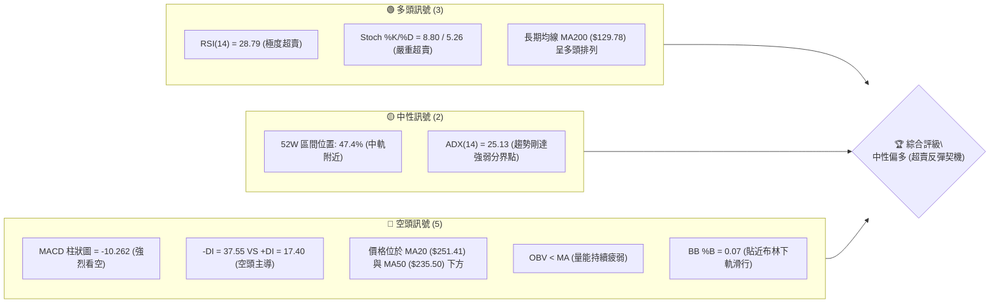

### 📊 核心指標速覽表

| 指標類別 | 指標名稱 | 當前數值 | 訊號 | 解讀 |
|----------|----------|----------|------|------|
| **價格** | 當前價格 | $188.68 | 🟡 中性 | 處於 52 週高低點之黃金分割 50.0% ($195.55) 下方，短期尋求支撐 |
| **均線** | MA20 | $251.41 | 🔴 空頭 | 股價遠低於 20 日均線，下行斜率極陡，短期壓力沉重 |
| **均線** | MA50 | $235.50 | 🔴 空頭 | 股價跌破中期生命線，MA50 轉為中期強阻力區 |
| **均線** | MA200 | $129.78 | 🟢 多頭 | 股價仍遠高於長期年線，長期多頭格局未被破壞 |
| **動能** | RSI(14) | 28.79 | 🟢 超賣 | 進入低於 30 的極度超賣區，歷史經驗顯示隨時有技術性反彈 |
| **動能** | MACD | -13.639 | 🔴 空頭 | MACD 線與訊號線呈死叉，且雙線均處於零軸下方，下行動能強勁 |
| **波動** | ATR(14) | $21.02 | 🔴 高波動 | ATR 佔股價高達 11.14%，暗示市場恐慌情緒蔓延，波動劇烈 |

### 🏆 技術評分卡

根據 MRVL 當前的多時框數據，我們對各技術維度進行量化評分。雖然短期動能極度疲弱，但由於股價已逼近長期關鍵斐波那契回調位，且超賣指標嚴重鈍化，支撐穩定度與潛在反彈空間正在積聚。

```
技術評分卡 — MRVL (2026-07-18)
════════════════════════════════════════════════════
趨勢強度      ██████████░░░░░░░░░░░░  50/100  🟡 中性
動能指標      ████░░░░░░░░░░░░░░░░░░  20/100  🔴 空頭
支撐穩定度    ██████████████░░░░░░░░  70/100  🟢 多頭
成交量配合    ████████░░░░░░░░░░░░░░  40/100  🔴 空頭
形態完整度    ██████████░░░░░░░░░░░░  50/100  🟡 中性
均線排列      ████████████░░░░░░░░░░  60/100  🟡 中性
════════════════════════════════════════════════════
綜合評分      ██████████░░░░░░░░░░░░  48/100  🟡 中性觀望 / 尋求左側買點
════════════════════════════════════════════════════
```

---

## 2. 趨勢分析

### 🌐 多時框趨勢分析

對於 MRVL 這種高 Beta (2.197) 的半導體領頭羊，多時框的收斂分析至關重要。當前日線、週線與月線呈現顯著的衝突，這種衝突正是典型「牛市大級別回撤」的特徵。

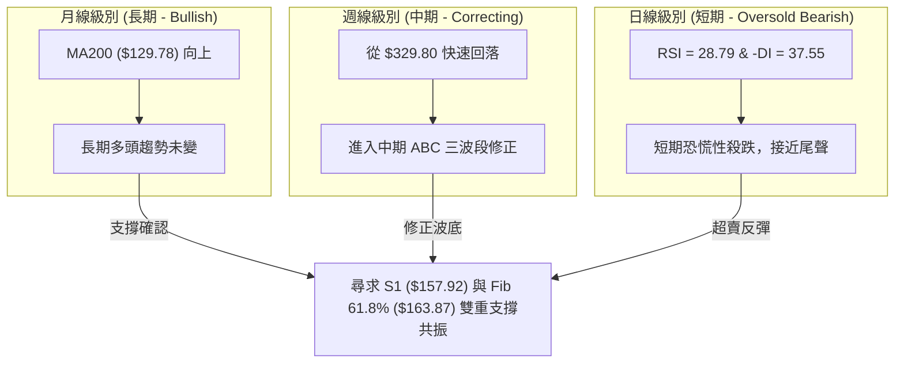

### 📈 長期趨勢 — 12個月走勢圖（Unicode）

以下為 MRVL 過去 12 個月的月線收盤價格走勢。可以清晰觀察到，股價在 2026 年 4 月至 6 月經歷了一波主升段狂飆（由 $98.98 暴漲至 $297.82），隨後在 7 月發生了極其劇烈的獲利回吐。

```
MRVL 月線走勢圖（過去12個月）
價格軸 ($)
$320 ┤                                      ● (2026-06 高點 $329.8)
$280 ┤                                  ●
$240 ┤                                      
$200 ┤                                          ● (現在 $188.68)
$160 ┤                              ●
$120 ┤                  ●       ●
$80  ┤  ●   ●   ●   ●       ●               
$40  ┤            ●   ●
     └──────────────────────────────────────────────────────────
       07  08  09  10  11  12  01  02  03  04  05  06  07 (月份)
      2024 ───────────────────► 2025 ──────────────────► 2026
```

#### 走勢特徵分析表

| 階段 | 時間區間 | 收盤價變動 | 漲跌幅 | 走勢特徵與量能配合 |
|------|----------|------------|--------|-------------------|
| 1 | 2024-07 ~ 2025-01 | $66.62 → $112.40 | +68.7% | 穩健多頭爬坡，成交量溫和放大，建立長期底部 |
| 2 | 2025-02 ~ 2025-05 | $112.40 → $60.01 | -46.6% | 經歷大幅度中期回撤，下探至 52W 最低點 $61.31 附近 |
| 3 | 2025-06 ~ 2026-03 | $77.17 → $98.98 | +28.3% | 盤整築底蓄勢，均線開始糾纏，籌碼進行充分換手 |
| 4 | 2026-04 ~ 2026-06 | $165.11 → $297.82 | +80.4% | ** parabolic 主升段狂飆**，週成交量突破 4 億股，極度過熱 |
| 5 | 2026-07 (至今) | $297.82 → $188.68 | -36.6% | **獲利了結引發的恐慌性踩踏**，短期呈瀑布式下跌 |

### 📊 中期趨勢（週線分析）

從近 20 週的收盤數據來看，MRVL 在 2026 年 6 月 21 日當週創下了 $310.50 的週收盤高點（盤中最高達 $329.80），當週成交量高達 415,761,600 股。隨後的三週內，股價呈現無抵抗式下跌：
- 2026-06-28：$266.70 (跌幅 -14.1%，週成交量 2.12億)
- 2026-07-05：$245.23 (跌幅 -8.0%，週成交量 1.41億)
- 2026-07-12：$235.81 (跌幅 -3.8%，週成交量 1.23億)
- 2026-07-19：$188.68 (跌幅 -20.0%，週成交量 1.37億)

這表明中期趨勢已經由多轉空，且下行波段並未因成交量萎縮而停止，暗示恐慌盤仍未出盡。

```
週線支撐與阻力示意圖：
[R3: $329.80] ════════════════════════════════════ (52W 歷史高點)
                 \
                  \  (6月份 parabolic 噴發後崩跌)
                   \
[MA20: $251.41] ────\───────────────────────────── (中期阻力線)
                     \
                      ● 現價 $188.68 (接近 Fib 50% $195.55 下方)
                       \
[S1: $157.92]   ━━━━━━━━\━━━━━━━━━━━━━━━━━━━━━━━━━ (密集波段低點支撐)
                         ▼ 
[S2: $146.81]   ━━━━━━━━━━━━━━━━━━━━━━━━━━━━━━━━━ (強中期支撐)
```

### ⚡ 趨勢強度評估（ADX 解讀）

目前 **ADX(14) 數值為 25.13**。在技術分析中，ADX > 25 意味著市場已經脫離無趨勢盤整狀態，進入了**強烈趨勢行情**。

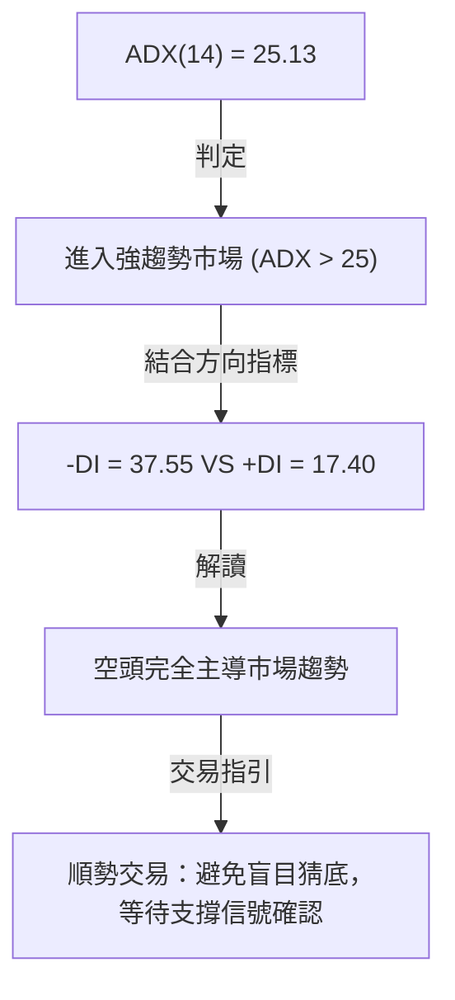

#### ADX 趨勢強度對照表
- **ADX < 20**：無趨勢，適合進行區間震盪交易（布林通道上下軌）。
- **20 < ADX < 25**：趨勢正在形成中。
- **25 < ADX < 50**：**強趨勢行情（當前狀態：25.13）**。此時應依據方向指標進行順勢操作。由於 `-DI (37.55)` 遠高於 `+DI (17.40)`，這是一段極強的**下行趨勢**，左側交易者必須控制倉位，右側交易者則需等待 ADX 拐頭向下。

---

## 3. 圖表形態分析

### 🔍 形態識別系統

在日線與週線結構上，由於 MRVL 的暴漲暴跌極其迅速，其幾何形態的成型時間較短。以下是基於現有數據識別出的圖表形態及其置信度評估：

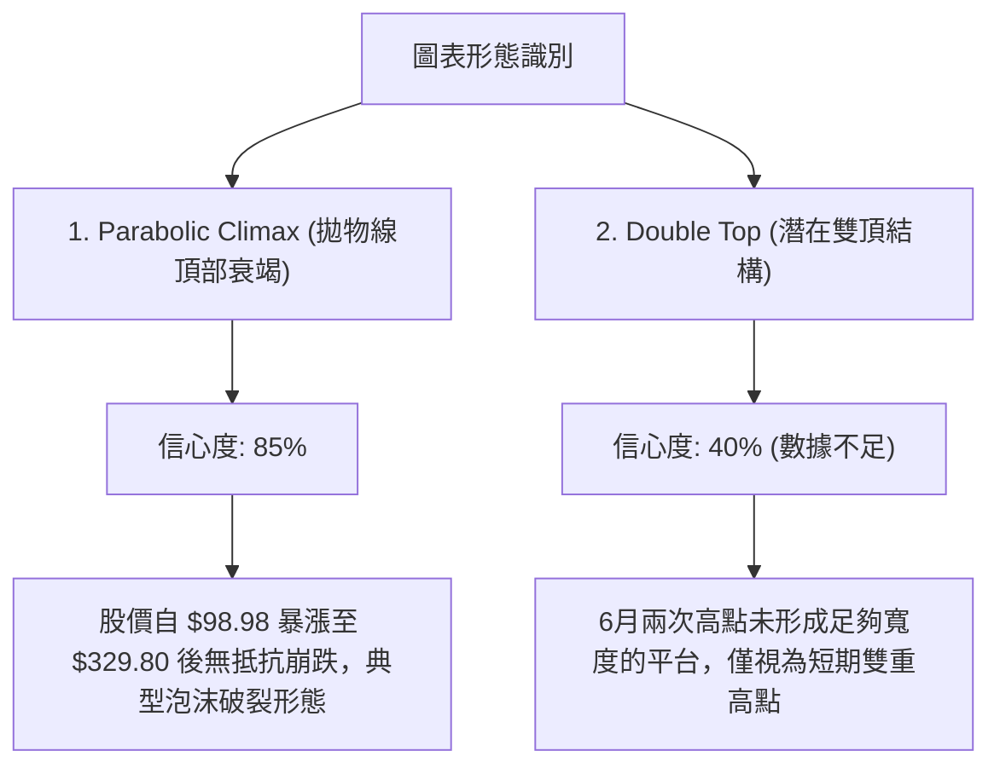

#### 形態置信度與目標價評估

| 形態 | 信心度 | 判斷依據（引用數據） | 完成度 | 目標價（附計算式） |
|------|--------|----------------------|--------|--------------------|
| **拋物線頂部衰竭 (Parabolic Climax)** | **85%** | 2026年4月至6月股價斜率接近90度，隨後在7月份以相同斜率暴跌，符合典型均值回歸。 | 95% | **$163.87**<br>*(計算式：52W波段幅度的61.8%黃金分割位)* |
| **潛在雙重頂 (Double Top)** | **40%** | 週線級別在 2026-06-07 當週收 $263.41，隨後衝高至 $310.50，日線高點達 $329.80。但由於下跌過快，未能在高位形成對稱的右頂。 | 30% | **$146.81**<br>*(若以 $235.81 為頸線，跌破後一比一等幅測量，但此處僅作參考)* |

### 🕯️ 重要K線形態分析

觀察近期的週 K 線組合，可以發現明顯的籌碼派發與恐慌性殺跌特徵：

| 日期 | 收盤價 | K線形態 | 解讀 | 訊號 |
|------|--------|---------|------|------|
| 2026-06-21 | $310.50 | **高檔避雷針 (Shooting Star)** | 盤中創下 $329.80 歷史新高，但收盤留有極長上影線，且週成交量高達 4.15 億股，顯示主力在高檔進行強烈派發。 | 🔴 強烈看空 |
| 2026-06-28 | $266.70 | **穿頭破腳大陰線 (Bearish Engulfing)** | 一舉跌破前一週的最低價，收盤價幾乎收在最低點，確認了頂部反轉。 | 🔴 強烈看空 |
| 2026-07-12 | $235.81 | **下吊線 (Hanging Man)** | 盤中雖有反彈，但收盤無力，顯示買盤承接意願疲弱。 | 🔴 看空 |
| 2026-07-19 | $188.68 | **無下影線大黑棒 (Marubozu)** | 本週收在最低點 $188.68，跌幅高達 20%，成交量放大至 1.37 億股，代表恐慌性拋售（Capitulation）正在發生。 | 🔴 強烈看空 |

### 📉 ASCII 走勢形態示意圖

```
MRVL 拋物線頂部與均值回歸示意圖：
                 [R3: $329.80 頂部]
                     /\
                    /  \
                   /    \  (7月份崩跌段)
                  /      \
                 /        \
                /          ● [現價: $188.68]
               /            \
              /              ▼ [預期反彈區: Fib 61.8% $163.87 ~ S1 $157.92]
             /                \_________________ (築底反彈)
            /
   ________/  (4-5月主升段)
  [起漲點: ~$98.98]
```

### 🎯 形態目標價計算

基於「拋物線頂部衰竭」形態，其修正目標通常會尋求大級別上漲波段的黃金分割回調位。
- **起漲點**：$61.31 (52W Low)
- **歷史高點**：$329.80 (52W High)
- **波段總長度**：$329.80 - $61.31 = $268.49
- **50.0% 回調目標**：$329.80 - ($268.49 \times 0.50) = **$195.55**（目前已跌破，轉為阻力）
- **61.8% 回調目標**：$329.80 - ($268.49 \times 0.618) = **$163.87**（高度契合支撐位 S1 $157.92，此處為形態最終修正目標與強烈反彈區）

---

## 4. 支撐與阻力

### 🗺️ 關鍵價位分布圖

MRVL 的籌碼結構在暴跌後重新洗牌。下圖展示了當前價格與上方歷史阻力區、下方歷史支撐區的空間關係。

```
MRVL 價位結構分布圖
═══════════════════════════════════════════════════
$329.80 ║████████████████████████║ 歷史高點 R3 (52W High)
$324.12 ║████████████████████    ║ 密集阻力區 R2
$299.93 ║████████████████████████║ 關鍵心理關口 R1
$266.44 ║▓▓▓▓▓▓▓▓▓▓▓▓▓▓▓▓        ║ 斐波那契 23.6% 回調位
$227.24 ║▓▓▓▓▓▓▓▓▓▓▓▓▓▓▓▓        ║ 斐波那契 38.2% 回調位
$195.55 ║▓▓▓▓▓▓▓▓▓▓▓▓▓▓▓▓        ║ 斐波那契 50.0% 阻力位
$188.68 ╠════════════════════════╣ ◄ 當前價格 $188.68
$163.87 ║░░░░░░░░░░░░░░░░        ║ 斐波那契 61.8% 核心防線
$157.92 ║████████████████████████║ 密集波段支撐 S1
$146.81 ║████████████████████████║ 強中期支撐 S2
$118.77 ║░░░░░░░░░░░░░░░░        ║ 斐波那契 78.6% 回調位
$86.55  ║████████████████████████║ 長期大底支撐 S3
═══════════════════════════════════════════════════
```

### 🚧 阻力位分析表

| 阻力級別 | 價位 | 形成原因 | 突破難度 | 重要性 |
|----------|------|----------|----------|--------|
| **R1** | **$299.93** | 近一年波段高點聚類，接近 $300 心理整數大關，套牢盤極重。 | 🔴 極高 | ★★★★★ |
| **R2** | **$324.12** | 頂部震盪區的下軌，暴跌開始的起點。 | 🔴 極高 | ★★★★☆ |
| **R3** | **$329.80** | 52週歷史最高點，多頭終極目標。 | 🔴 極高 | ★★★★★ |

### 🛡️ 支撐位分析表

| 支撐級別 | 價位 | 形成原因 | 守住機率 | 重要性 |
|----------|------|----------|----------|--------|
| **S1** | **$157.92** | 近一年波段密集低點聚類，與斐波那契 61.8% ($163.87) 形成**黃金支撐帶**。 | 🟢 高 | ★★★★★ |
| **S2** | **$146.81** | 前期上漲過程中的換手平台，中期多頭最後防線。 | 🟢 極高 | ★★★★☆ |
| **S3** | **$86.55** | 歷史大底，除非發生系統性金融危機，否則極難跌破。 | 🟢 極高 | ★★★☆☆ |

### 📐 斐波那契回調位分析

當前價格 **$188.68** 正好處於 **50.0% ($195.55)** 與 **61.8% ($163.87)** 之間。
- **50.0% ($195.55) 跌破的意義**：跌破此處意味著多頭已經失去了對這波上漲行情中期控制權，市場由「強勢調整」轉為「深幅修正」。
- **61.8% ($163.87) 的戰術價值**：這是技術分析中最經典的「黃金分割防線」。由於該價位與 **S1 ($157.92)** 非常接近，這是一個寬幅約 3.7% 的強支撐帶。預計此區間將會吸引大量價值投資者與量化基金的買盤湧入。

---

## 5. 技術指標深度解讀

### 🎛️ 指標訊號總覽

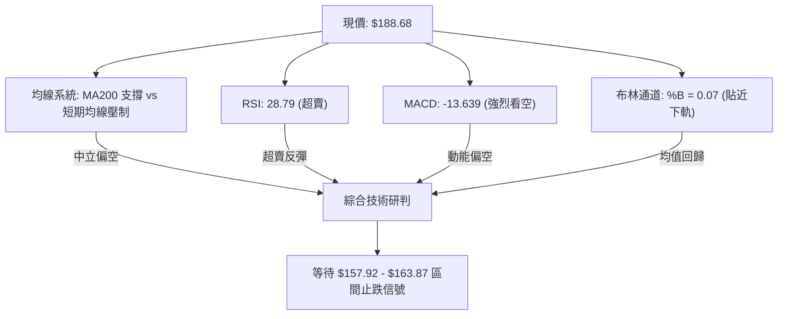

### 📈 移動平均線排列分析

MRVL 當前的均線系統呈現了極其罕見的「**長期多頭排列下的短期崩塌**」：
- **長期排列**：`MA20 ($251.41) > MA50 ($235.50) > MA200 ($129.78)`。這表明從年線級別來看，MRVL 仍處於牛市格局。
- **短期走勢**：股價 ($188.68) 遠低於 `MA5 ($204.64)`、`MA10 ($221.37)`、`MA20` 和 `MA50`。
- **均線乖離率**：股價距離 MA200 仍有 +45.38% 的空間，但距離 MA20 的乖離率高達 **-24.95%**！如此極端的負乖離率在歷史上極少維持超過兩週，強烈暗示短期內將出現向 MA20/MA50 靠攏的**均值回歸反彈**。

### 📉 RSI(14) 分析

* 當前 **RSI(14) 數值為 28.79**，已正式跌破 30 的超賣臨界線。
* **RSI 強度展示**：
  `RSI(14): ▓▓▓▓▓▓░░░░░░░░░░░░░░ 28.79% (🟢 超賣區)`
* **背離研判**：目前日線級別價格創下新低，RSI 也同步創下新低，**無明顯底背離**跡象。這意味著雖然超賣，但由於缺乏背離確認，股價可能還需要一次「二次探底」或「低位震盪」來完成築底。

### 📊 MACD(12/26/9) 訊號解讀

* **MACD值**：-13.639
* **Signal值**：-3.378
* **柱狀圖 (Hist)**：-10.262 (🔴 看空)

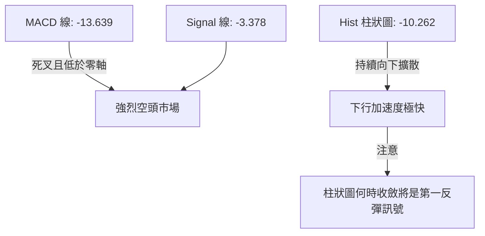

MACD 雙線在零軸下方加速下行，且柱狀圖高達 -10.262，顯示空頭宣洩極其猛烈。在柱狀圖出現「綠柱縮短（數值回升）」之前，不宜盲目重倉抄底。

### 📦 布林通道分析

* **BB 上軌**：$324.79
* **BB 中軌 (MA20)**：$251.41
* **BB 下軌**：$178.04
* **BB %B**：0.07

```
布林通道現狀示意圖：
[上軌: $324.79]  --------------------------------------------------
                                                                  
[中軌: $251.41]  --------------------------------------------------
                                                                  
[下軌: $178.04]  -----------------●--------------------------------
                                 ▲ 現價 $188.68 (%B = 0.07，極度逼近下軌)
```

當前 %B 僅為 0.07，股價幾乎是「貼著布林下軌」向下滑行。在統計學上，股價維持在布林雙標準差之外的機率低於 5%。這意味著股價隨時有拉回通道內部的需求，下軌 $178.04 附近具備強烈的短期撐托力道。

### 💹 成交量分析（量價配合度）

* **最新成交量**：29,579,300
* **20日均量**：43,317,470 (量比: 0.68x)
* **OBV 趨勢**：`OBV < MA` → 量能疲弱。

**量價關係研判**：
在 6 月份暴漲至 $310.50 時，週成交量高達 4.15 億股，呈現典型的「放量滯漲/派發」；而 7 月份大跌期間，成交量雖然有所下滑，但最新一週（2026-07-19）成交量仍有 1.37 億股，呈現「無量陰跌」與「恐慌放量」交替。OBV 指標低於其移動平均線，顯示資金仍在流出，量能並未對價格上漲形成支撐，這要求我們在佈局時必須保持謹慎，以左側輕倉分批為主。

---

## 6. 動能與波動率

### ⚡ 動能評估四象限

我們將 MRVL 放入動能與波動率的四象限中進行定位：

| 象限 | 動能 | 波動 | 當前狀態 | 評估 |
|------|------|------|----------|------|
| **Q1 (Bull Run)** | 強 (Bullish) | 低 (Low) | - | 穩定上漲，最安全持股期 |
| **Q2 (Consolidation)**| 弱 (Neutral) | 低 (Low) | - | 橫盤整理，等待方向選擇 |
| **Q3 (Speculative)** | 強 (Bullish) | 高 (High) | - | 暴漲暴跌，高風險高收益 (6月份狀態) |
| **Q4 (Capitulation)** | **弱 (Bearish)** | **高 (High)** | **✓ (當前狀態)** | **恐慌殺跌，極度超賣，孕育反彈 (7月份狀態)** |

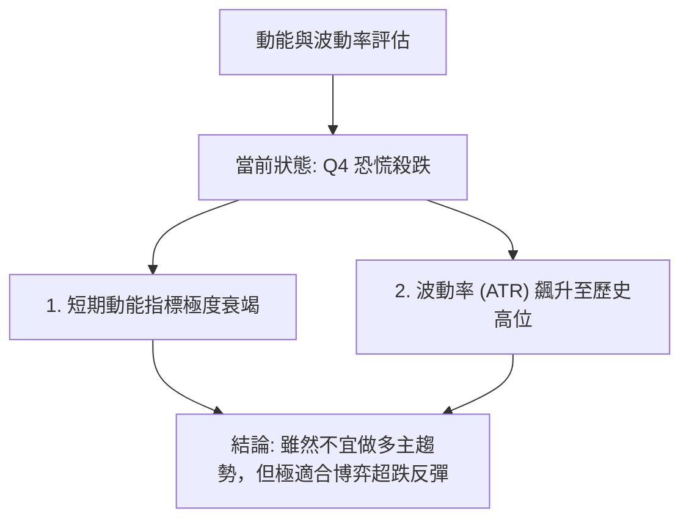

### 📊 ATR 波動率分析

* **ATR(14)**：**$21.02**
* **ATR 佔比**：**11.14%**

這是一個極其驚人的數值。每日平均波動高達 21 美元，意味著任何無計劃的隨意進場都極易被日常噪音掃單出場。
* **止損設置建議**：基於當前 ATR，合理的技術止損距離必須至少為 **1.5 倍 ATR**（即 $31.53）或 **2 倍 ATR**（即 $42.04）。這意味著倉位管理上必須大幅降低單筆頭寸，以應對高波動。

### 📐 Beta 與市場相關性

* **Beta 值**：**2.197**

MRVL 的 Beta 值高達 2.197，意味著它的波動是標普 500 指數的 2.2 倍。在半導體板塊與大盤調整時，MRVL 會呈現「放大器」效應。當前美股科技板塊若出現整體企穩，MRVL 將會是反彈斜率最陡峭的標的之一。

---

## 7. 多時框架總結

### 📋 時框架評分表

| 時框架 | 趨勢方向 | 動能 | 均線排列 | 形態 | 綜合評分 | 建議 |
|--------|----------|------|----------|------|----------|------|
| **日線** | 🔴 強烈看空 | 🟢 極度超賣 | 🔴 空頭排列 | 🟡 中性築底 | 40/100 | 輕倉左側試探，博弈超賣反彈 |
| **週線** | 🔴 中期看空 | 🔴 下行加速 | 🟡 糾纏偏空 | 🔴 頂部衰竭 | 35/100 | 等待週線級別 K 線止跌信號 |
| **月線** | 🟢 長期看多 | 🟡 中性偏弱 | 🟢 多頭排列 | 🟢 長牛回撤 | 75/100 | 長期價值投資者分批逢低吸納 |

### 🔲 綜合訊號矩陣

```
           短期 (日線)    中期 (週線)    長期 (月線)
趨勢方向     🔴 空頭        🔴 空頭        🟢 多頭
動能指標     🟢 超賣        🔴 空頭        🟡 中性
均線系統     🔴 空頭        🟡 中性        🟢 多頭
量價結構     🔴 疲弱        🔴 派發        🟢 溫和
```

### ⚖️ 多時框收斂結論

根據**多時框收斂規則（ADX = 25.13 > 25，趨勢行情）**：
當前市場由**中期下行趨勢**主導。雖然長期月線依然維持牛市格局（價格遠高於 MA200 $129.78），但日線與週線的空頭動能極強，這是一次**大級別的牛市健康回撤**。

我們不能在下行趨勢如此猛烈時盲目滿倉。最合理的收斂結論是：**短期與中期趨勢向下，但已進入極度超賣的「黃金支撐帶」（$157.92 - $163.87）。我們應利用日線的超賣訊號，在週線關鍵支撐位進行左側輕倉佈局，博弈即將到來的強烈均值回歸反彈。**

---

## 8. 交易策略建議

### 🗺️ 策略決策流程圖

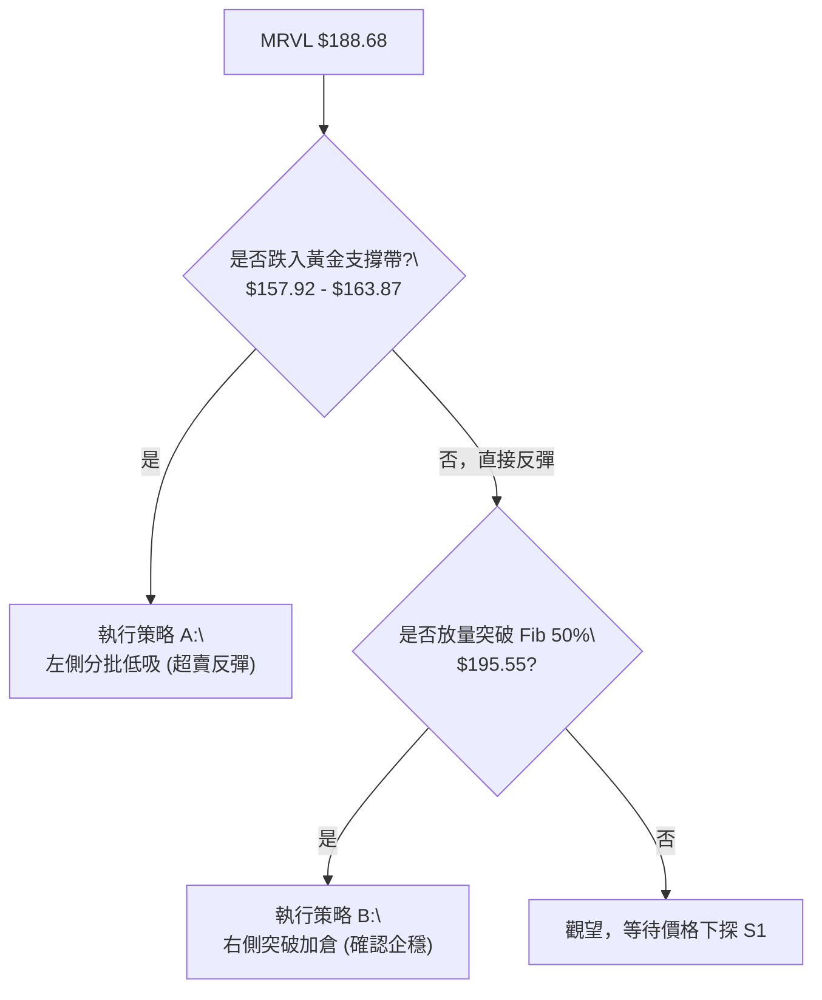

### 🧭 策略路由（當前主策略：左側超跌反彈 + 右側企穩做多）

* **當前主策略方向：🟢 逢低做多（基於長期牛市未變 + 短期極度超賣）**
* **路由依據**：技術評分卡為 **48/100**。雖然整體處於修正期，但 RSI < 30 且 %B < 0.1，做空風險極高（隨時被軋空），做多則具備極高的風險報酬比。因此，我們**主推多頭策略**，空頭僅列為風險對沖提示。

### 🎯 價格情境階梯（Price Scenarios）

| 觸發條件 | 下一目標 | 後續延伸 | 情境含義 |
|----------|----------|----------|----------|
| **突破 R1 $299.93** | R2 $324.12 | R3 $329.80 | 中期空頭警報完全解除，重回歷史高點 |
| **收復 Fib 50% $195.55** | Fib 38.2% $227.24 | MA20 $251.41 | 短期築底成功，開啟均值回歸反彈 |
| **跌破 S1 $157.92** | S2 $146.81 | S3 $86.55 | 修正級別擴大，需無條件止損，多頭防線全面退守 |

### 📊 情境機率分佈

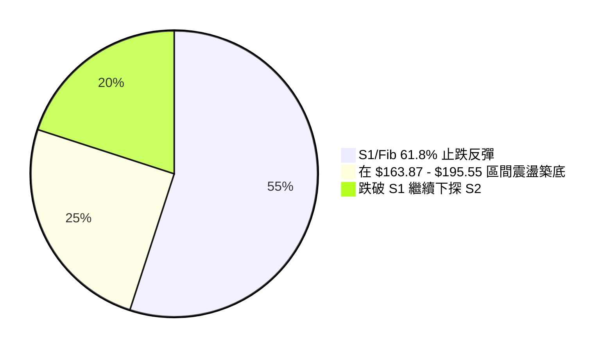

* **主要依據**：RSI 28.79 提供了極高的反彈概率（55%）；但 ADX > 25 且 MACD 死叉限制了直接 V 型反轉的可能性，因此震盪築底（25%）與慣性下探（20%）亦佔有一定比例。

### 🟢 主策略詳情

#### 策略 A：左側黃金支撐帶低吸（主策略）
* **進場條件**：股價慣性下探至 **$157.92 - $163.87** 區間，日線出現下影線或小時級別底背離。
* **進場價格**：**$161.00** (分批買入)
* **目標價 T1**：**$195.55** (Fib 50.0% 阻力位，預期報酬率 +21.4%)
* **目標價 T2**：**$227.24** (Fib 38.2% 阻力位，預期報酬率 +41.1%)
* **止損價格**：**$145.00** (跌破 S2 $146.81 下方，預期虧損 -9.9%)
* **風險報酬比**：**1 : 4.1** (極佳)
* **成功機率**：65%
* **建議倉位**：10% (輕倉試探)

#### 策略 B：右側突破確認做多（輔助策略）
* **進場條件**：股價未達 S1 即展開反彈，並**放量收復** Fib 50.0% 關鍵阻力位 $195.55。
* **進場價格**：**$197.00** (站穩 $195.55 後進場)
* **目標價 T1**：**$227.24** (Fib 38.2% 阻力位，預期報酬率 +15.3%)
* **目標價 T2**：**$266.44** (Fib 23.6% 阻力位，預期報酬率 +35.2%)
* **止損價格**：**$178.00** (跌破布林下軌 $178.04，預期虧損 -9.6%)
* **風險報酬比**：**1 : 3.6**
* **成功機率**：60%
* **建議倉位**：15%

### 🔴 反向風險觸發點（對沖提示）

若股價不幸**日線收盤跌破 S2 $146.81**，代表中期修正演變為系統性崩盤，多頭必須無條件清倉離場，或買入對沖期權，下方目標將直指 **S3 $86.55**。

### ⭐ 整體訊號強度評星

```
做多訊號強度：★★★☆☆  (3/5星 - 具備強烈超賣反彈機會，但非右側安全期)
做空訊號強度：★★☆☆☆  (2/5星 - 空間已有限，此處追空極易被軋)
整體可信度：  ★★★★☆  (4/5星 - 斐波那契與歷史波段支撐高度重合)
```

---

## 9. 風險提示與監控

### ✅ 關鍵監控指標 Checklist

╔══════════════════════════════════════════════════════════════╗
║              MRVL 風險控管與監控清單                          ║
╠══════════════════════════════════════════════════════════════╣
║ [ ] 監控 RSI(14) 是否在 $160.00 附近出現底背離。             ║
║ [ ] 觀察 MACD 柱狀圖是否連續 3 天收斂 (綠柱縮短)。           ║
║ [ ] 每日成交量是否萎縮至 2000 萬股以下 (代表賣壓竭盡)。     ║
║ [ ] 觀察 SOXX (半導體ETF) 是否在年線附近企穩。               ║
║ [ ] 嚴格執行單筆交易虧損不超過總資金 2% 的風控紀律。         ║
╚══════════════════════════════════════════════════════════════╝

### ⚠️ 風險場景分析

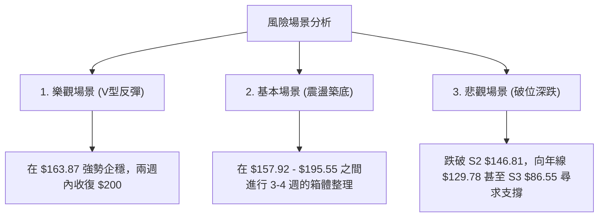

### 🛡️ 風險管理重要提醒

1. **高 Beta 屬性防範**：MRVL 的 Beta 高達 2.197，在大盤下跌時其跌幅往往翻倍。因此，**絕對禁止滿倉操作或使用高倍槓桿**。
2. **ATR 止損調整**：由於 ATR 高達 $21.02，日內波動極大。若採用過窄的止損（如 3-5%）極易被惡意掃單。請務必降低倉位，並放寬止損空間至 $145.00（低於 S2）。
3. **板塊效應**：半導體板塊目前呈現集體修正，MRVL 無法獨善其身。進場前必須確認費城半導體指數 (SOX) 是否同步出現止跌訊號。

---

## 📋 報告總結

```
MRVL 技術分析報告總結
════════════════════════════════════════════════════════
報告日期：2026-07-18
當前價格：$188.68
分析評級：⚖️ 中性偏多 (超賣築底，分批佈局)

關鍵結論：
├─ 長期趨勢：🟢 多頭 (股價遠高於年線 MA200 $129.78)
├─ 中期趨勢：🔴 空頭 (從 $329.80 歷史高點深幅回撤)
├─ 短期趨勢：🟢 超賣 (RSI 28.79 預示反彈臨近)
├─ 關鍵支撐：$163.87 (Fib 61.8%) / $157.92 (S1)
├─ 關鍵阻力：$195.55 (Fib 50.0%) / $227.24 (Fib 38.2%)
└─ 分析師目標均值：$253.69 (潛在上升空間 +34.4%)

最優策略組合：
1. 🥇 最佳機會：在 $161.00 附近左側輕倉分批買入，止損 $145.00，目標 $227.24。
2. 🥈 次選機會：等待放量收復 $195.55 後，右側追隨反彈，目標 $266.44。
3. 🥉 保守選擇：完全觀望，直到週線級別出現明確的陽包陰止跌K線組合。
════════════════════════════════════════════════════════
```

---

> ⚠️ **免責聲明**：本報告為 AI 自動生成之技術分析，所有數據及估算均基於提供的歷史價格資訊。本報告**僅供研究與學術參考**，**不構成任何投資建議**。投資有風險，入市需謹慎。

---

*報告生成時間：2026-07-18 ｜ 數據來源：Yahoo Finance ｜ 分析框架：多時框技術分析*