<details>
<summary>📊 靜態圖表 (點擊展開)</summary>
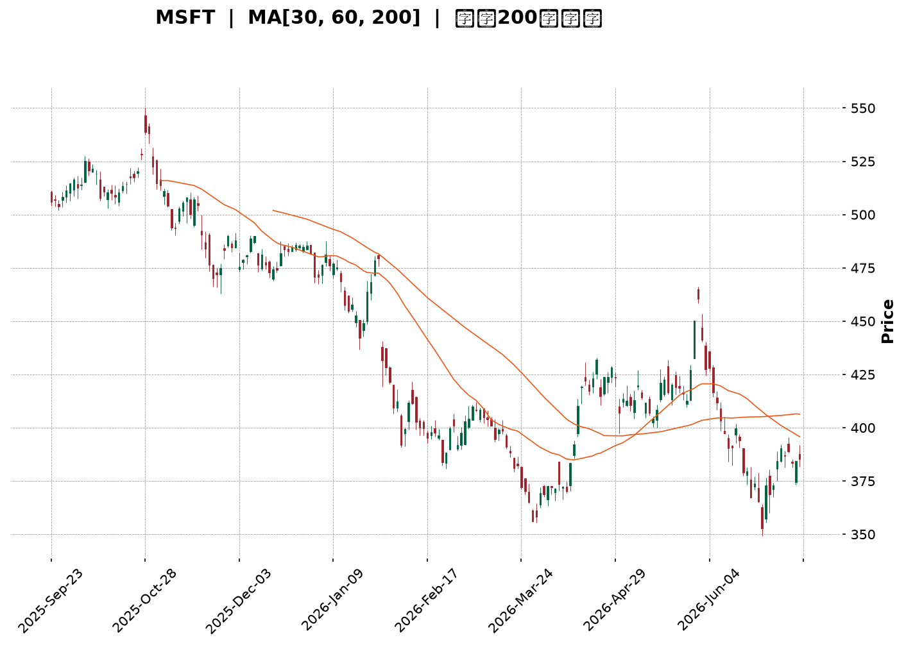
</details>

<html>
<head><meta charset="utf-8" /></head>
<body>
    <div style="height:500px; width:100%;">                        <script>window.PlotlyConfig = {MathJaxConfig: 'local'};</script>
        <script charset="utf-8" src="https://cdn.plot.ly/plotly-3.7.0.min.js" integrity="sha256-jvTGqxNp8AGWEcvNLVuKr+8j5dGe9Yw51LQkmDH+IYA=" crossorigin="anonymous"></script>                <div id="candlestick-chart" class="plotly-graph-div" style="height:100%; width:100%;"></div>            <script>                window.PLOTLYENV=window.PLOTLYENV || {};                                if (document.getElementById("candlestick-chart")) {                    Plotly.newPlot(                        "candlestick-chart",                        [{"close":{"dtype":"f8","bdata":"AAAAgGegf0AAAADgB69\u002fQAAAAOBsfX9AAAAA4NvDf0AAAABAyPV\u002fQAAAAOCFFYBAAAAAwIMjgEAAAABA9AOAQAAAAKDAEIBAAAAAwPJpgEAAAACAdUWAQAAAAABgTIBAAAAAIOY4gEAAAADA6Lt\u002fQAAAAMAJ7X9AAAAAAGjlf0AAAAAgLuN\u002fQAAAAGA+xn9AAAAAAJHlf0AAAAAATQyAQAAAAKA3E4BAAAAAwBwqgEAAAACARSqAQAAAAICEQoBAAAAAYGaBgEAAAADARNWAQAAAAIAi0YBAAAAAAJxTgEAAAADgaBSAQAAAAIA1DoBAAAAAoH3xf0AAAADgfX9\u002fQAAAAICL335AAAAA4BfbfkAAAABgDG1\u002fQAAAAKCol39AAAAAgMW+f0AAAAAg9kF\u002fQAAAAACCr39AAAAAAL2Ef0AAAAAg66p+QAAAAKDeQH5AAAAAIPHEfUAAAADgbWB9QAAAAGBgfn1AAAAA4ACufUAAAABgjzV+QAAAAEBCnX5AAAAA4E9JfkAAAADAPX1+QAAAAKDKuX1AAAAAoFTrfUAAAABASRB+QAAAACB9jX5AAAAA4GqdfkAAAAAgA8d9QAAAAGA5FX5AAAAA4IjGfUAAAAAgcIt9QAAAAGBypH1AAAAAQCWgfUAAAAAgWR1+QAAAACBAPH5AAAAAYFIsfkAAAACgEEt+QAAAAICzXX5AAAAAgMNYfkAAAAAADE9+QAAAAKAZVX5AAAAAIJ0XfkAAAADAfW19QAAAAMAObH1AAAAAYDfGfUAAAABgORV+QAAAACDYv31AAAAAQHvSfUAAAADAB7F9QAAAACBVSX1AAAAAYH6VfEAAAACgKmp8QAAAAKAjnXxAAAAA4BNIfEAAAACAQaJ7QAAAAOA8EnxAAAAAoCX+fEAAAACgHkN9QAAAAIAw531AAAAAIOr3fUAAAADAP\u002fl6QAAAAOAdxnpAAAAAQONXekAAAACgMJZ5QAAAAMCoxXlAAAAAYMt+eEAAAADgyPV4QAAAAMBCvHlAAAAAAAG3eUAAAAAgPCl5QAAAAEDvAHlAAAAA4Kb4eEAAAACgm7F4QAAAAOBA3XhAAAAA4JTZeEAAAADA8cV4QAAAAKA5+ndAAAAAgIxCeEAAAABgv\u002ft4QAAAAAChDXlAAAAAYEJ+eEAAAACgBNt4QAAAAIDpMHlAAAAAQDBFeUAAAADArZx5QAAAAOA3gXlAAAAAIGeIeUAAAAAgIU55QAAAAGAUQHlAAAAAIN0PeUAAAABAH6t4QAAAAMBe8XhAAAAAoL\u002foeEAAAACgF294QAAAACDeQnhAAAAAILfQd0AAAACgweJ3QAAAAGDzPndAAAAAYM8jd0AAAACA3dJ2QAAAAKD7P3ZAAAAAgPJidkAAAACA6xV3QAAAAMAlCXdAAAAAIHJKd0AAAACgL0F3QAAAAEDEN3dAAAAAAFZYd0AAAABAOER3QAAAAIAYIXdAAAAAAKH4d0AAAACgKoR4QAAAAOBMpXlAAAAAwKA1ekAAAABABV56QAAAAOCpEnpAAAAAoORzekAAAAAAwP96QAAAAKCf7XlAAAAAoDx7ekAAAAAgbn56QAAAACAoxXpAAAAAoK54ekAAAAAgYW55QAAAAIC12HlAAAAAAJ7LeUAAAADg2qd5QAAAAKAL0XlAAAAAIMU9ekAAAADAkON5QAAAAGBKvHlAAAAAIDhueUAAAAAgWUV5QAAAAOC4iHlAAAAAYCFQekAAAACg\u002fml6QAAAAEBJCHpAAAAAYGZCekAAAACgcDF6QAAAAMAeKXpAAAAA4HoAekAAAABguMp5QAAAAADXr3pAAAAAANcjfEAAAADgUch8QAAAAMD1lHtAAAAAoHC1ekAAAADAzMB6QAAAAGC4CnpAAAAAANe7eUAAAABgjzZ5QAAAAIDC1XhAAAAAoHBleEAAAAAA12t4QAAAAAAp\u002fHhAAAAAoEedeEAAAABgj653QAAAAGBmtndAAAAAoHD1dkAAAABACl93QAAAACBc13ZAAAAAoEcNdkAAAAAghU93QAAAAMAeCXdAAAAA4FFQd0AAAADgegR4QAAAAADXZ3hAAAAAANcreEAAAACgcE14QAAAAKBw9XdAAAAAgMIFeEAAAACgmRF4QA=="},"high":{"dtype":"f8","bdata":"qBAu9Z\u002f1f0Cy0TJwE9R\u002fQByhvC7OrH9Ag00yEkrrf0AnHf8fxwyAQK04OisxF4BAEGdw0N8pgEAl1df4iTKAQIyPQee2KYBARSMWK4F9gEAVYJ7cuXOAQA6My84RXYBAikDp3z1IgEBvEaWHR0KAQOTeIrVHCYBAf9apFUwAgEAyx5kZew+AQCgMaybHDIBAPosPI+MBgEAfDbYhfBuAQGODZNlnG4BAKi01bWVPgECgD5GOOEWAQE9szpJZUIBA6XN7z7mZgEAlC5q44TGBQLnWOEqo9oBA56kNS9OcgEAk0A4G6W+AQHO\u002fUuo\u002fTYBAh\u002fuvlnECgECY6ZCIcPl\u002fQBlLpG9HaH9A+2xYossDf0BGd68WkHp\u002fQBhsvEhJpn9ACVF+tjLHf0AypNwOS+R\u002fQCC\u002fNsUVxn9AhOz\u002fJVrOf0DjNG96CD1\u002fQB+kG1ktwX5Adt4AsBu2fkB3mEJDv8x9QOGQYRaSrH1A5qQ+BmnQfUD05oMYUmJ+QBFqt30ip35AXj1jtwJ7fkChDuow\u002frR+QEKvokd9IX5AUUZ2CPryfUCufk3kGxR+QKPLc8HgoX5AM3cUrwKffkBTInsLpiF+QPgcw6IAPn5AQe47EPoEfkCqq4Bba+l9QP+jpyJXvH1Am8oySvPdfUBZrRiR3nZ+QDSDmVP+Wn5AbDPF7wJpfkDLBzbUrFp+QIZ9KEzcb35Api7zbUtffkCMfN9M9WJ+QAsKiMwkeH5ANK4AC51ffkBQxMEKLih+QOAJfGZZn31AgijYMuHJfUAYriRddnh+QJZsZV9SCH5AtPeMURXbfUAqradPuO19QJ17NdS6mn1ABysz9fwhfUAOQD5rEeN8QDTFOOcu0nxAIsR7WGVsfEAERQdw7Sp8QG2U7SBRLXxAMx72eS5QfUCxwrKnW4J9QDNWGMqqC35AAqLKToYZfkC10\u002fFPnIh7QDj5j45qWntA8hza6UjNekCvSMll3EJ6QIkWEGAFH3pAeiZJEtZneUBKkTxyIwB5QJXy4TLP0HlA\u002fHwBVdNcekBEEfgx0el5QJfjkbJiRnlAT3ekXd87eUA97geJ6Ot4QFx\u002fFz9nDHlAuVT+JuU4eUC3osuKFfR4QHEV1ZgWqHhA1j830EtIeEDrnmosowl5QEJPMcy\u002faXlAl7z7AWa\u002feEBzsCjBKgV5QGanivoiXXlALCL5Q0SieUBGdHDEhqt5QPT5QkuEwnlA3csPyyyVeUA4XjYSBJV5QIw9nVAEgnlA84YKauBTeUCgiupdzT55QFGY\u002f\u002fo5\u002fHhAmTGSc2o4eUBaD\u002fXGPNJ4QDjiQYhEenhALDCfNp4ieEDklYV7+CV4QPUh1V1L2ndAbZjO9euDd0AHYSkLkF53QF8O77eqmnZAW8JjOCDJdkDAH1BVgUF3QNGxS1roUndA1+0H6FFNd0DhZLW5wU53QLC4ZjVSOndA9mwl7K8CeEDSRZCxFUt3QCNraEZAbXdAkV653lf7d0Dn329jZJ14QFtJgV2X13lAYyLyipE+ekC2MHUwW+p6QE7m6S+kZnpAXOY1xBukekCAvVv4Mwx7QPU0Sfroa3pAw98ddIGAekA6dX2a\u002faJ6QDbtnJHaz3pAH+yuW1yeekCgwqTYY9h5QMVgTx1WA3pA6CgH\u002fu09ekBclLVyEf55QJojvmRAGHpAYL7ejOGwekCk\u002f7Ctmht6QM5UBPzEvHlAF6Qa0qHpeUC84TQD6VZ5QGqRguoyr3lAgYwtDOqzekA1wYBDOIN6QGSLqNw8\u002fHpAmssgCwFTekAAAACgcKV6QAAAAGBmhnpAAAAA4FE8ekAAAABACv95QAAAAADX13pAAAAAoEclfEAAAADAHiV9QAAAAAAAWHxAAAAAgD2Ge0AAAABgZkJ7QAAAACCF13pAAAAAYI8SekAAAAAgrr95QAAAAOCjUHlAAAAAoJnNeEAAAAAA13t4QAAAAAAAHHlAAAAAoHDNeEAAAACA62V4QAAAAIDr1XdAAAAAgBTad0AAAAAghZN3QAAAAIAUrndAAAAAIK7DdkAAAACAwol3QAAAAAAAyHdAAAAAYGZid0AAAACgR014QAAAAEAzg3hAAAAAYGZSeEAAAADAHrl4QAAAAMD1FHhAAAAAYGYKeEAAAAAAAH54QA=="},"hovertemplate":"\u003cb\u003e%{x|%Y-%m-%d}\u003c\u002fb\u003e\u003cbr\u003e\u958b: $%{open:.2f}\u003cbr\u003e\u9ad8: $%{high:.2f}\u003cbr\u003e\u4f4e: $%{low:.2f}\u003cbr\u003e\u6536: $%{close:.2f}\u003cextra\u003e\u003c\u002fextra\u003e","low":{"dtype":"f8","bdata":"nBIynuCBf0DrO\u002fIirXt\u002fQAo9DyzJXX9AuDGMA+h2f0DyZL2y1pp\u002fQN3GRpI9p39AvQ4iPITHf0DaTSgvdbd\u002fQNvq4lMk\u002fH9AlykZqIIXgEC1K8ZcRDGAQB0tEE9iPoBAW7+zkSYRgEBIKrRow6Z\u002fQG9lyFdbx39A2FWIYwxtf0Ac8\u002fhKpax\u002fQPy2sxTqjn9ASvbsn+CBf0DTKAEdLuN\u002fQAYQlNf63H9AHZqEeZ0TgECvfhwCxRqAQL7GlsB2K4BAmrDSOXJtgEBkHlkh78qAQHDrpT\u002fRqoBAUk5\u002fKqw2gEDMg79bu\u002f1\u002fQAJl\u002fKWf9X9A\u002fADay02Kf0DhC5wTRXZ\u002fQONx5+AIy35AA9DMJlWifkAx++65kvp+QFnPPCwEM39ASQAfWan\u002ffkCJbkauKSJ\u002fQDIEQGjz5H5A+iaq4bdbf0ACV57Tdjt+QBeKQFap\u002fH1A9IIpFUWWfUADol4qGiN9QF0yI9geH31AKXU3HEPtfEA8t1i2EPF9QD16E\u002fbgR35ATpg6NAUofkAcsdlTn0J+QFk8wrF9kX1AFujg\u002fgmmfUAV0mcZHMx9QBj2a1S4I35ARtgi7FhlfkCK22IylI99QOmEZfIAnH1AEWocZaajfUAer48EzWZ9QPZyd2+tTH1AKUPCFk6OfUAMvuYXV7x9QHnT7wmdBX5AUuwOv8wIfkD3ailRdCl+QDx4FC7jKn5AG8SBR+M8fkB66NqmiCB+QMJz2XSPNX5AQ2esL4QSfkDqjvdbNUF9QC+z5fWxNn1AaUFjdK06fUAwegS+S719QBNmCfwAnH1Ax3EyMrRhfUCqX179Ipl9QE+dy7Yl\u002fnxA0l\u002flYUpyfEBJ8CttD158QILFBaFMZ3xA4JFCCJz0e0BKr7Pbwkt7QGCpB5Onq3tAVYXLRoUIfECC8zkdOr98QNEkYv7+cH1Ak5Kyixe+fUCR3EJCdDJ6QNJa1vvyiHpAACa2FgxGekBvLphf+mt5QK5602PPdnlAai0VREppeEDNqAwG2XJ4QJTjg8x78XhA0+DCueyteUD2pniktvN4QEXAWy3tw3hAyjL9QZDEeEAwTtxPfox4QF7AnJABqXhAWJpi+AC9eECPvv5S5aR4QIEHuEBa5HdAhT5SKCnOd0DM9SOLEVV4QNRKOkEN3nhAIU43MZlQeEDKhWJ8klx4QC0vh00kfXhA5DHYCR73eECWSM93ajh5QFNMv7sIenlAvVhLEQwqeUC7rkpt8iB5QHndyp+NC3lAW9zpE3gNeUCas\u002f4BXpZ4QHHpnQ39nnhA7hrw8T7OeEAj8k++emJ4QNhLv1mTI3hAzrzEnca0d0BuJFaPrs13QG0w4uC9MHdAXFJHe0wNd0DMtpiHacZ2QHo0Kg3VO3ZAbkJg+Sg4dkCtLAy6kKR2QJz4Ydt39nZAbjBXys61dkBaGswLOQt3QKKTS9lI3HZAM7wembcpd0Dm\u002f2KKG+R2QBVUj0+vE3dAPDUdjX0jd0AwU\u002fNV9Bp4QAFOHiX2vXhAu8FaIf2zeUBt8vU2fjx6QK0ZMYtn9nlA8dx6HMYEekCxHnPiEWx6QAetVWtVqHlAdc7c82vueUCCo+u6sgJ6QJOxnJDPT3pAk\u002fUZShs2ekBkkGO8ZdJ4QL0Uw+jYmHlAx4CwNpieeUC3OsD2qX55QJ6ky1fAQ3lAXP\u002fzCq4dekCD3Bsqr9F5QFa\u002f9mH6SXlAQuTEwC1ceUCtvovgnAJ5QGqvxM83AHlAZ4mWIkjAeUDYtqxyY+t5QLFdmxtw+XlAuDctxpOmeUAAAAAgXPt5QAAAAKBHBXpAAAAA4FHQeUAAAACgR5l5QAAAAGC4ynlAAAAAgMIFe0AAAADgUaR8QAAAAEDhhntAAAAAAACEekAAAABgj6Z6QAAAAGBm5nlAAAAAwPWIeUAAAAAgrud4QAAAAGCP0nhAAAAAAAAAeEAAAADgUeR3QAAAAKCZjXhAAAAAQApreEAAAADAHpV3QAAAAOB6VHdAAAAAwB7xdkAAAABguCp3QAAAAOB6zHZAAAAAQDPTdUAAAABA4TZ2QAAAAGBmfnZAAAAAQDP3dkAAAACAPW53QAAAAEAz+3dAAAAAIIXTd0AAAAAghUN4QAAAAKBH1XdAAAAAoJlVd0AAAAAAANh3QA=="},"name":"\u50f9\u683c","open":{"dtype":"f8","bdata":"ZaioUhDpf0AQwiISsLJ\u002fQFgPRQOekX9AV8itlpmtf0BsxhepfsR\u002fQNOMueko4H9A\u002fZBUkfb4f0BVWtMCDxOAQLNp5djDDoBA3Eth\u002f8QagEAPF\u002ffSuGeAQDNUI\u002fzkP4BA9uD2BWw4gEA5N90v9SKAQOTeIrVHCYBAb9kZeU2wf0CZtSKvgft\u002fQI2ErJ6q1X9AWJGQJ2Kdf0AsJhLy8PV\u002fQKPb1Q\u002fyEYBAbZgiQ\u002fYugECmGNNCYDmAQFLLqLH\u002fO4BAK9EXhneDgEDmQ8EqTxSBQM5un44V7IBAIKAbqiF5gEDzD9+RaWyAQIHiQgtPJIBAqzKPH6HIf0A0k275HOF\u002fQPeUqZekZ39ANQgWBindfkBx8NriSQ5\u002fQPLtjST4WX9AqC+QYniif0DsdiAKk7F\u002fQMkU6+qC8X5A5uSwgACUf0ABnooFCsR+QCnyke4\u002fcH5ADYIbrmiofkBFb96DDsZ9QFz3JzdOjn1AaO\u002fcpn1\u002ffUDZkmBqdkJ+QG8VlfUCV35AGtfGQGRkfkD+eVNw\u002fkh+QPIQ\u002ftpUo31AeHvInCDafUAAxmFfFwZ+QMXlcxHYK35AS\u002fXBpudufkA3RkHqJB5+QEUWovZEqH1Ah8rfUhXbfUD4sMwdi999QD\u002fNG5sVXX1AoNlRx7qsfUAsRUhlHsF9QMP0qxkwU35AFjFttW8\u002ffkBB9FYVRy1+QI9Fd15tOH5AD3DcqNVIfkBe1aKNXSt+QGCS3OVoPH5Aqu2\u002fndVafkBObOkR4SN+QCfs2eZUf31AX9RoqDB7fUCWR3mfINp9QOFs58iz8X1ACnZM61R\u002ffUBJT9ki6Kh9QAblBS41iX1AXQRHbkUGfUC0zJ1H\u002f+B8QKBULZ3NfHxAFGNbDYMTfEArdGpyfil8QKtdRswq2ntAdcU5kd0dfEAsJz7B8\u002fN8QD4H9w+ZeX1AsTS6DhURfkBFcrfkoGB7QC5qkB2RU3tAwHNJ\u002flHFekAXBKRfOUJ6QG150W3YknlAPvVLMCNaeUCf9luGZ9Z4QL422qXhMHlAOh2ATyccekDYyaxnW+V5QCg7WT1FM3lATsLsiIIqeUByUolkM9d4QLFt\u002fXHWxXhApnltQi\u002f9eEBHDCwKELR4QJP+o0hXonhAIlyABfX0d0AWRKjE+Vp4QHBWKIhdPXlAioMLV5BgeEBg+sS+LIB4QKKMZ0SlhHhAhSZLqnEGeUA28nBKvDh5QJDNEOAMhXlAHtM\u002f37dAeUB4wH0zTZJ5QI5aUoQYS3lAnHOhmhY8eUCT01ZBIgJ5QKMceeRa03hABOsUg3r2eEA13Ij6WMR4QDMMdVAcVHhAtKN+8kMfeEAAQHoIIPF3QDmUJreJ2HdAuiwI06+Bd0AA8yQxTCB3QIGUYrbikXZAR2JkueKRdkDJ6hygMbx2QC+7YcfsSndA+iTEc6nmdkB7T6W57Ep3QHdFGUOiGHdA0L1xOV4CeECqwLuLHjt3QIzPYXLIQndA\u002fVjLP9dMd0C1WkdxTjF4QP7rE8c80nhALMuGyj0vekB4+68nbn56QOAzLjzWQ3pA3WBk8041ekDfmJ9zTZR6QMeN3Xm4L3pA2hVi+BkBekDXJH55eVd6QI9A0U1wenpAxIgQEJl6ekDXSYctwZ55QOPrlYSGvnlApUioyWiqeUC+Y0s\u002fwuZ5QG4feULkcXlAqxOulzszekC6B7unzgd6QN3NF+fQb3lAgk+f+VjZeUAk7\u002fAKQiV5QIhLhpGxOXlA+9OSmP7VeUDzltWBg\u002ft5QK9WBsaIz3pArK4c\u002fmXUeUAAAAAAAIx6QAAAAOCjOHpAAAAAQOEGekAAAAAAKbB5QAAAACCuz3lAAAAAwMwIe0AAAACgcA19QAAAAIAU7ntAAAAAQDNne0AAAADA9Tx7QAAAAKBwxXpAAAAAgD3ieUAAAADgepB5QAAAAMDM6HhAAAAAIFyzeEAAAABA4XZ4QAAAAMDMzHhAAAAA4KO8eEAAAAAAAGR4QAAAAMAenXdAAAAAANd7d0AAAACAFEZ3QAAAAMAeOXdAAAAA4FGsdkAAAABgZlJ2QAAAAAAAmHdAAAAA4Howd0AAAACgR813QAAAACCuB3hAAAAA4KMweEAAAAAA14d4QAAAAOB6AHhAAAAAQDNnd0AAAADAzDx4QA=="},"x":["2025-09-23T00:00:00-04:00","2025-09-24T00:00:00-04:00","2025-09-25T00:00:00-04:00","2025-09-26T00:00:00-04:00","2025-09-29T00:00:00-04:00","2025-09-30T00:00:00-04:00","2025-10-01T00:00:00-04:00","2025-10-02T00:00:00-04:00","2025-10-03T00:00:00-04:00","2025-10-06T00:00:00-04:00","2025-10-07T00:00:00-04:00","2025-10-08T00:00:00-04:00","2025-10-09T00:00:00-04:00","2025-10-10T00:00:00-04:00","2025-10-13T00:00:00-04:00","2025-10-14T00:00:00-04:00","2025-10-15T00:00:00-04:00","2025-10-16T00:00:00-04:00","2025-10-17T00:00:00-04:00","2025-10-20T00:00:00-04:00","2025-10-21T00:00:00-04:00","2025-10-22T00:00:00-04:00","2025-10-23T00:00:00-04:00","2025-10-24T00:00:00-04:00","2025-10-27T00:00:00-04:00","2025-10-28T00:00:00-04:00","2025-10-29T00:00:00-04:00","2025-10-30T00:00:00-04:00","2025-10-31T00:00:00-04:00","2025-11-03T00:00:00-05:00","2025-11-04T00:00:00-05:00","2025-11-05T00:00:00-05:00","2025-11-06T00:00:00-05:00","2025-11-07T00:00:00-05:00","2025-11-10T00:00:00-05:00","2025-11-11T00:00:00-05:00","2025-11-12T00:00:00-05:00","2025-11-13T00:00:00-05:00","2025-11-14T00:00:00-05:00","2025-11-17T00:00:00-05:00","2025-11-18T00:00:00-05:00","2025-11-19T00:00:00-05:00","2025-11-20T00:00:00-05:00","2025-11-21T00:00:00-05:00","2025-11-24T00:00:00-05:00","2025-11-25T00:00:00-05:00","2025-11-26T00:00:00-05:00","2025-11-28T00:00:00-05:00","2025-12-01T00:00:00-05:00","2025-12-02T00:00:00-05:00","2025-12-03T00:00:00-05:00","2025-12-04T00:00:00-05:00","2025-12-05T00:00:00-05:00","2025-12-08T00:00:00-05:00","2025-12-09T00:00:00-05:00","2025-12-10T00:00:00-05:00","2025-12-11T00:00:00-05:00","2025-12-12T00:00:00-05:00","2025-12-15T00:00:00-05:00","2025-12-16T00:00:00-05:00","2025-12-17T00:00:00-05:00","2025-12-18T00:00:00-05:00","2025-12-19T00:00:00-05:00","2025-12-22T00:00:00-05:00","2025-12-23T00:00:00-05:00","2025-12-24T00:00:00-05:00","2025-12-26T00:00:00-05:00","2025-12-29T00:00:00-05:00","2025-12-30T00:00:00-05:00","2025-12-31T00:00:00-05:00","2026-01-02T00:00:00-05:00","2026-01-05T00:00:00-05:00","2026-01-06T00:00:00-05:00","2026-01-07T00:00:00-05:00","2026-01-08T00:00:00-05:00","2026-01-09T00:00:00-05:00","2026-01-12T00:00:00-05:00","2026-01-13T00:00:00-05:00","2026-01-14T00:00:00-05:00","2026-01-15T00:00:00-05:00","2026-01-16T00:00:00-05:00","2026-01-20T00:00:00-05:00","2026-01-21T00:00:00-05:00","2026-01-22T00:00:00-05:00","2026-01-23T00:00:00-05:00","2026-01-26T00:00:00-05:00","2026-01-27T00:00:00-05:00","2026-01-28T00:00:00-05:00","2026-01-29T00:00:00-05:00","2026-01-30T00:00:00-05:00","2026-02-02T00:00:00-05:00","2026-02-03T00:00:00-05:00","2026-02-04T00:00:00-05:00","2026-02-05T00:00:00-05:00","2026-02-06T00:00:00-05:00","2026-02-09T00:00:00-05:00","2026-02-10T00:00:00-05:00","2026-02-11T00:00:00-05:00","2026-02-12T00:00:00-05:00","2026-02-13T00:00:00-05:00","2026-02-17T00:00:00-05:00","2026-02-18T00:00:00-05:00","2026-02-19T00:00:00-05:00","2026-02-20T00:00:00-05:00","2026-02-23T00:00:00-05:00","2026-02-24T00:00:00-05:00","2026-02-25T00:00:00-05:00","2026-02-26T00:00:00-05:00","2026-02-27T00:00:00-05:00","2026-03-02T00:00:00-05:00","2026-03-03T00:00:00-05:00","2026-03-04T00:00:00-05:00","2026-03-05T00:00:00-05:00","2026-03-06T00:00:00-05:00","2026-03-09T00:00:00-04:00","2026-03-10T00:00:00-04:00","2026-03-11T00:00:00-04:00","2026-03-12T00:00:00-04:00","2026-03-13T00:00:00-04:00","2026-03-16T00:00:00-04:00","2026-03-17T00:00:00-04:00","2026-03-18T00:00:00-04:00","2026-03-19T00:00:00-04:00","2026-03-20T00:00:00-04:00","2026-03-23T00:00:00-04:00","2026-03-24T00:00:00-04:00","2026-03-25T00:00:00-04:00","2026-03-26T00:00:00-04:00","2026-03-27T00:00:00-04:00","2026-03-30T00:00:00-04:00","2026-03-31T00:00:00-04:00","2026-04-01T00:00:00-04:00","2026-04-02T00:00:00-04:00","2026-04-06T00:00:00-04:00","2026-04-07T00:00:00-04:00","2026-04-08T00:00:00-04:00","2026-04-09T00:00:00-04:00","2026-04-10T00:00:00-04:00","2026-04-13T00:00:00-04:00","2026-04-14T00:00:00-04:00","2026-04-15T00:00:00-04:00","2026-04-16T00:00:00-04:00","2026-04-17T00:00:00-04:00","2026-04-20T00:00:00-04:00","2026-04-21T00:00:00-04:00","2026-04-22T00:00:00-04:00","2026-04-23T00:00:00-04:00","2026-04-24T00:00:00-04:00","2026-04-27T00:00:00-04:00","2026-04-28T00:00:00-04:00","2026-04-29T00:00:00-04:00","2026-04-30T00:00:00-04:00","2026-05-01T00:00:00-04:00","2026-05-04T00:00:00-04:00","2026-05-05T00:00:00-04:00","2026-05-06T00:00:00-04:00","2026-05-07T00:00:00-04:00","2026-05-08T00:00:00-04:00","2026-05-11T00:00:00-04:00","2026-05-12T00:00:00-04:00","2026-05-13T00:00:00-04:00","2026-05-14T00:00:00-04:00","2026-05-15T00:00:00-04:00","2026-05-18T00:00:00-04:00","2026-05-19T00:00:00-04:00","2026-05-20T00:00:00-04:00","2026-05-21T00:00:00-04:00","2026-05-22T00:00:00-04:00","2026-05-26T00:00:00-04:00","2026-05-27T00:00:00-04:00","2026-05-28T00:00:00-04:00","2026-05-29T00:00:00-04:00","2026-06-01T00:00:00-04:00","2026-06-02T00:00:00-04:00","2026-06-03T00:00:00-04:00","2026-06-04T00:00:00-04:00","2026-06-05T00:00:00-04:00","2026-06-08T00:00:00-04:00","2026-06-09T00:00:00-04:00","2026-06-10T00:00:00-04:00","2026-06-11T00:00:00-04:00","2026-06-12T00:00:00-04:00","2026-06-15T00:00:00-04:00","2026-06-16T00:00:00-04:00","2026-06-17T00:00:00-04:00","2026-06-18T00:00:00-04:00","2026-06-22T00:00:00-04:00","2026-06-23T00:00:00-04:00","2026-06-24T00:00:00-04:00","2026-06-25T00:00:00-04:00","2026-06-26T00:00:00-04:00","2026-06-29T00:00:00-04:00","2026-06-30T00:00:00-04:00","2026-07-01T00:00:00-04:00","2026-07-02T00:00:00-04:00","2026-07-06T00:00:00-04:00","2026-07-07T00:00:00-04:00","2026-07-08T00:00:00-04:00","2026-07-09T00:00:00-04:00","2026-07-10T00:00:00-04:00"],"type":"candlestick"},{"hovertemplate":"MA30: $%{y:.2f}\u003cextra\u003e\u003c\u002fextra\u003e","line":{"color":"#2196F3","dash":"dash","width":2},"mode":"lines","name":"MA30","x":["2025-09-23T00:00:00-04:00","2025-09-24T00:00:00-04:00","2025-09-25T00:00:00-04:00","2025-09-26T00:00:00-04:00","2025-09-29T00:00:00-04:00","2025-09-30T00:00:00-04:00","2025-10-01T00:00:00-04:00","2025-10-02T00:00:00-04:00","2025-10-03T00:00:00-04:00","2025-10-06T00:00:00-04:00","2025-10-07T00:00:00-04:00","2025-10-08T00:00:00-04:00","2025-10-09T00:00:00-04:00","2025-10-10T00:00:00-04:00","2025-10-13T00:00:00-04:00","2025-10-14T00:00:00-04:00","2025-10-15T00:00:00-04:00","2025-10-16T00:00:00-04:00","2025-10-17T00:00:00-04:00","2025-10-20T00:00:00-04:00","2025-10-21T00:00:00-04:00","2025-10-22T00:00:00-04:00","2025-10-23T00:00:00-04:00","2025-10-24T00:00:00-04:00","2025-10-27T00:00:00-04:00","2025-10-28T00:00:00-04:00","2025-10-29T00:00:00-04:00","2025-10-30T00:00:00-04:00","2025-10-31T00:00:00-04:00","2025-11-03T00:00:00-05:00","2025-11-04T00:00:00-05:00","2025-11-05T00:00:00-05:00","2025-11-06T00:00:00-05:00","2025-11-07T00:00:00-05:00","2025-11-10T00:00:00-05:00","2025-11-11T00:00:00-05:00","2025-11-12T00:00:00-05:00","2025-11-13T00:00:00-05:00","2025-11-14T00:00:00-05:00","2025-11-17T00:00:00-05:00","2025-11-18T00:00:00-05:00","2025-11-19T00:00:00-05:00","2025-11-20T00:00:00-05:00","2025-11-21T00:00:00-05:00","2025-11-24T00:00:00-05:00","2025-11-25T00:00:00-05:00","2025-11-26T00:00:00-05:00","2025-11-28T00:00:00-05:00","2025-12-01T00:00:00-05:00","2025-12-02T00:00:00-05:00","2025-12-03T00:00:00-05:00","2025-12-04T00:00:00-05:00","2025-12-05T00:00:00-05:00","2025-12-08T00:00:00-05:00","2025-12-09T00:00:00-05:00","2025-12-10T00:00:00-05:00","2025-12-11T00:00:00-05:00","2025-12-12T00:00:00-05:00","2025-12-15T00:00:00-05:00","2025-12-16T00:00:00-05:00","2025-12-17T00:00:00-05:00","2025-12-18T00:00:00-05:00","2025-12-19T00:00:00-05:00","2025-12-22T00:00:00-05:00","2025-12-23T00:00:00-05:00","2025-12-24T00:00:00-05:00","2025-12-26T00:00:00-05:00","2025-12-29T00:00:00-05:00","2025-12-30T00:00:00-05:00","2025-12-31T00:00:00-05:00","2026-01-02T00:00:00-05:00","2026-01-05T00:00:00-05:00","2026-01-06T00:00:00-05:00","2026-01-07T00:00:00-05:00","2026-01-08T00:00:00-05:00","2026-01-09T00:00:00-05:00","2026-01-12T00:00:00-05:00","2026-01-13T00:00:00-05:00","2026-01-14T00:00:00-05:00","2026-01-15T00:00:00-05:00","2026-01-16T00:00:00-05:00","2026-01-20T00:00:00-05:00","2026-01-21T00:00:00-05:00","2026-01-22T00:00:00-05:00","2026-01-23T00:00:00-05:00","2026-01-26T00:00:00-05:00","2026-01-27T00:00:00-05:00","2026-01-28T00:00:00-05:00","2026-01-29T00:00:00-05:00","2026-01-30T00:00:00-05:00","2026-02-02T00:00:00-05:00","2026-02-03T00:00:00-05:00","2026-02-04T00:00:00-05:00","2026-02-05T00:00:00-05:00","2026-02-06T00:00:00-05:00","2026-02-09T00:00:00-05:00","2026-02-10T00:00:00-05:00","2026-02-11T00:00:00-05:00","2026-02-12T00:00:00-05:00","2026-02-13T00:00:00-05:00","2026-02-17T00:00:00-05:00","2026-02-18T00:00:00-05:00","2026-02-19T00:00:00-05:00","2026-02-20T00:00:00-05:00","2026-02-23T00:00:00-05:00","2026-02-24T00:00:00-05:00","2026-02-25T00:00:00-05:00","2026-02-26T00:00:00-05:00","2026-02-27T00:00:00-05:00","2026-03-02T00:00:00-05:00","2026-03-03T00:00:00-05:00","2026-03-04T00:00:00-05:00","2026-03-05T00:00:00-05:00","2026-03-06T00:00:00-05:00","2026-03-09T00:00:00-04:00","2026-03-10T00:00:00-04:00","2026-03-11T00:00:00-04:00","2026-03-12T00:00:00-04:00","2026-03-13T00:00:00-04:00","2026-03-16T00:00:00-04:00","2026-03-17T00:00:00-04:00","2026-03-18T00:00:00-04:00","2026-03-19T00:00:00-04:00","2026-03-20T00:00:00-04:00","2026-03-23T00:00:00-04:00","2026-03-24T00:00:00-04:00","2026-03-25T00:00:00-04:00","2026-03-26T00:00:00-04:00","2026-03-27T00:00:00-04:00","2026-03-30T00:00:00-04:00","2026-03-31T00:00:00-04:00","2026-04-01T00:00:00-04:00","2026-04-02T00:00:00-04:00","2026-04-06T00:00:00-04:00","2026-04-07T00:00:00-04:00","2026-04-08T00:00:00-04:00","2026-04-09T00:00:00-04:00","2026-04-10T00:00:00-04:00","2026-04-13T00:00:00-04:00","2026-04-14T00:00:00-04:00","2026-04-15T00:00:00-04:00","2026-04-16T00:00:00-04:00","2026-04-17T00:00:00-04:00","2026-04-20T00:00:00-04:00","2026-04-21T00:00:00-04:00","2026-04-22T00:00:00-04:00","2026-04-23T00:00:00-04:00","2026-04-24T00:00:00-04:00","2026-04-27T00:00:00-04:00","2026-04-28T00:00:00-04:00","2026-04-29T00:00:00-04:00","2026-04-30T00:00:00-04:00","2026-05-01T00:00:00-04:00","2026-05-04T00:00:00-04:00","2026-05-05T00:00:00-04:00","2026-05-06T00:00:00-04:00","2026-05-07T00:00:00-04:00","2026-05-08T00:00:00-04:00","2026-05-11T00:00:00-04:00","2026-05-12T00:00:00-04:00","2026-05-13T00:00:00-04:00","2026-05-14T00:00:00-04:00","2026-05-15T00:00:00-04:00","2026-05-18T00:00:00-04:00","2026-05-19T00:00:00-04:00","2026-05-20T00:00:00-04:00","2026-05-21T00:00:00-04:00","2026-05-22T00:00:00-04:00","2026-05-26T00:00:00-04:00","2026-05-27T00:00:00-04:00","2026-05-28T00:00:00-04:00","2026-05-29T00:00:00-04:00","2026-06-01T00:00:00-04:00","2026-06-02T00:00:00-04:00","2026-06-03T00:00:00-04:00","2026-06-04T00:00:00-04:00","2026-06-05T00:00:00-04:00","2026-06-08T00:00:00-04:00","2026-06-09T00:00:00-04:00","2026-06-10T00:00:00-04:00","2026-06-11T00:00:00-04:00","2026-06-12T00:00:00-04:00","2026-06-15T00:00:00-04:00","2026-06-16T00:00:00-04:00","2026-06-17T00:00:00-04:00","2026-06-18T00:00:00-04:00","2026-06-22T00:00:00-04:00","2026-06-23T00:00:00-04:00","2026-06-24T00:00:00-04:00","2026-06-25T00:00:00-04:00","2026-06-26T00:00:00-04:00","2026-06-29T00:00:00-04:00","2026-06-30T00:00:00-04:00","2026-07-01T00:00:00-04:00","2026-07-02T00:00:00-04:00","2026-07-06T00:00:00-04:00","2026-07-07T00:00:00-04:00","2026-07-08T00:00:00-04:00","2026-07-09T00:00:00-04:00","2026-07-10T00:00:00-04:00"],"y":{"dtype":"f8","bdata":"AAAAAAAA+H8AAAAAAAD4fwAAAAAAAPh\u002fAAAAAAAA+H8AAAAAAAD4fwAAAAAAAPh\u002fAAAAAAAA+H8AAAAAAAD4fwAAAAAAAPh\u002fAAAAAAAA+H8AAAAAAAD4fwAAAAAAAPh\u002fAAAAAAAA+H8AAAAAAAD4fwAAAAAAAPh\u002fAAAAAAAA+H8AAAAAAAD4fwAAAAAAAPh\u002fAAAAAAAA+H8AAAAAAAD4fwAAAAAAAPh\u002fAAAAAAAA+H8AAAAAAAD4fwAAAAAAAPh\u002fAAAAAAAA+H8AAAAAAAD4fwAAAAAAAPh\u002fAAAAAAAA+H8AAAAAAAD4f7y7uwM6H4BAvLu7+5MggEBmZmYmyR+AQO\u002fu7oYnHYBAzczMZEYZgEDv7u7+\u002fhaAQM3MzCSKFIBA7+7uxkQSgEBEREQ0+A6AQBEREdERDYBA7+7uznsHgEDv7u6e9\u002f5\u002fQERERKT46n9AmpmZiSTUf0B3d3fXBsB\u002fQGZmZnZFq39AAAAAoFuYf0CJiIiICYp\u002fQDMzM0MjgH9AvLu7W2Vyf0BVVVUVr2R\u002fQN7d3e3+T39ARERExG47f0De3d09Fyh\u002fQAAAAFBOF39A3t3dHdwCf0CJiIj4rOF+QImIiMhfw35AmpmZadGqfkC8u7tbgZR+QJqZmYlwf35AMzMzU6lrfkDNzMxM219+QKuqqtppWn5AiYiIeJZUfkAiIiLy60p+QHd3d9d0QH5Ad3d314U0fkCJiIj4bCx+QFVVVfXgIH5Aq6qqOrUUfkBERESEIAp+QFVVVYUIA35AVVVVZRMDfkDe3d0tGgl+QGZmZtZIC35A3t3dHYAMfkAiIiIyFQh+QN7d3X3A\u002fH1AIiIigjnufUC8u7urhdx9QDMzM6MI031AMzMzAw\u002fFfUBVVVUFU7B9QGZmZjYmm31AIiIikk6NfUBmZmYW6Yh9QCIiIkJgh31AIiIiogWJfUBmZmYWFXN9QN7d3c2aWn1Aq6qqmpg+fUDv7u4e9Rd9QCIiIgLf8XxAMzMzk2vBfEDv7u4u6ZN8QM3MzGxlbHxAERER8d5EfEDNzMyc8Rh8QLy7u7t463tAvLu728W\u002fe0BERER0YJd7QJqZmbl7cHtA7+7uTnZGe0Dv7u4eJxl7QKuqqhrm53pAZmZmNm+4ekAiIiIiQpB6QHd3d4cibHpAERERITpJekDv7u7+2ip6QLy7u9ulDXpAq6qqmvPzeUAiIiLysuJ5QBEREWHMzHlAd3d3B0aveUCJiIjYgY15QFVVVbXNZXlAiYiIaO87eUCJiIioQyh5QAAAALCjGHlARERExGYMeUCamZmZkAJ5QKuqqvqr9XhAERERgd7veECJiIiYs+Z4QHd3dzd10XhAiYiIGHy7eEAiIiICiqd4QLy7u2sKkHhAAAAA4Pt5eEDe3d3NQmx4QM3MzEyoXHhAd3d3V1pPeEAAAADwZEJ4QO\u002fu7o7pO3hAERER8Ro0eEDe3d1NdCV4QKuqqloJFXhAq6qqCpUQeECJiIjorw14QGZmZhaREXhAZmZm1pQZeEAAAACwBiB4QCIiItLfJHhAZmZmVrkseEARERGRLTt4QJqZmXn2QHhAIiIiQhNNeEBERET0plx4QLy7u7s+bHhAAAAAgJN5eEAzMzPzFYJ4QBERESGdj3hAERERsYKgeEAiIiIina94QAAAAOCMxXhAAAAAAATgeEC8u7sbLPp4QHd3d3fqF3lAERERQeQxeUCrqqoKikR5QO\u002fu7r7bWXlAq6qq2qVzeUAAAACwm455QO\u002fu7h6gpnlAiYiIiH6\u002feUARERHhd9h5QERERPRV8nlAREREBKoDekC8u7ubjA56QERERBRvF3pAq6qqWugnekAiIiKChDx6QHd3d+dkSXpAzczMPJRLekAAAAAQe0l6QKuqqlpzSnpAmpmZGRJEekBmZmZGJDl6QDMzM+OgKHpA7+7unusWekCrqqpqTQ56QGZmZmbzBnpAREREdN\u002f8eUCrqqqaB+x5QJqZmSkT2nlAiYiIWBC+eUBVVVVllKh5QJqZmcnhj3lAiYiI+AxzeUBERES0UmJ5QERERMQATXlAiYiIyGgzeUBVVVV19R55QImIiMgTEXlARERENEL\u002feEAiIiISIO94QAAAAABW3HhAzczM\u002fHHLeEAzMzPDvbx4QA=="},"type":"scatter"},{"hovertemplate":"MA60: $%{y:.2f}\u003cextra\u003e\u003c\u002fextra\u003e","line":{"color":"#9C27B0","dash":"dash","width":2},"mode":"lines","name":"MA60","x":["2025-09-23T00:00:00-04:00","2025-09-24T00:00:00-04:00","2025-09-25T00:00:00-04:00","2025-09-26T00:00:00-04:00","2025-09-29T00:00:00-04:00","2025-09-30T00:00:00-04:00","2025-10-01T00:00:00-04:00","2025-10-02T00:00:00-04:00","2025-10-03T00:00:00-04:00","2025-10-06T00:00:00-04:00","2025-10-07T00:00:00-04:00","2025-10-08T00:00:00-04:00","2025-10-09T00:00:00-04:00","2025-10-10T00:00:00-04:00","2025-10-13T00:00:00-04:00","2025-10-14T00:00:00-04:00","2025-10-15T00:00:00-04:00","2025-10-16T00:00:00-04:00","2025-10-17T00:00:00-04:00","2025-10-20T00:00:00-04:00","2025-10-21T00:00:00-04:00","2025-10-22T00:00:00-04:00","2025-10-23T00:00:00-04:00","2025-10-24T00:00:00-04:00","2025-10-27T00:00:00-04:00","2025-10-28T00:00:00-04:00","2025-10-29T00:00:00-04:00","2025-10-30T00:00:00-04:00","2025-10-31T00:00:00-04:00","2025-11-03T00:00:00-05:00","2025-11-04T00:00:00-05:00","2025-11-05T00:00:00-05:00","2025-11-06T00:00:00-05:00","2025-11-07T00:00:00-05:00","2025-11-10T00:00:00-05:00","2025-11-11T00:00:00-05:00","2025-11-12T00:00:00-05:00","2025-11-13T00:00:00-05:00","2025-11-14T00:00:00-05:00","2025-11-17T00:00:00-05:00","2025-11-18T00:00:00-05:00","2025-11-19T00:00:00-05:00","2025-11-20T00:00:00-05:00","2025-11-21T00:00:00-05:00","2025-11-24T00:00:00-05:00","2025-11-25T00:00:00-05:00","2025-11-26T00:00:00-05:00","2025-11-28T00:00:00-05:00","2025-12-01T00:00:00-05:00","2025-12-02T00:00:00-05:00","2025-12-03T00:00:00-05:00","2025-12-04T00:00:00-05:00","2025-12-05T00:00:00-05:00","2025-12-08T00:00:00-05:00","2025-12-09T00:00:00-05:00","2025-12-10T00:00:00-05:00","2025-12-11T00:00:00-05:00","2025-12-12T00:00:00-05:00","2025-12-15T00:00:00-05:00","2025-12-16T00:00:00-05:00","2025-12-17T00:00:00-05:00","2025-12-18T00:00:00-05:00","2025-12-19T00:00:00-05:00","2025-12-22T00:00:00-05:00","2025-12-23T00:00:00-05:00","2025-12-24T00:00:00-05:00","2025-12-26T00:00:00-05:00","2025-12-29T00:00:00-05:00","2025-12-30T00:00:00-05:00","2025-12-31T00:00:00-05:00","2026-01-02T00:00:00-05:00","2026-01-05T00:00:00-05:00","2026-01-06T00:00:00-05:00","2026-01-07T00:00:00-05:00","2026-01-08T00:00:00-05:00","2026-01-09T00:00:00-05:00","2026-01-12T00:00:00-05:00","2026-01-13T00:00:00-05:00","2026-01-14T00:00:00-05:00","2026-01-15T00:00:00-05:00","2026-01-16T00:00:00-05:00","2026-01-20T00:00:00-05:00","2026-01-21T00:00:00-05:00","2026-01-22T00:00:00-05:00","2026-01-23T00:00:00-05:00","2026-01-26T00:00:00-05:00","2026-01-27T00:00:00-05:00","2026-01-28T00:00:00-05:00","2026-01-29T00:00:00-05:00","2026-01-30T00:00:00-05:00","2026-02-02T00:00:00-05:00","2026-02-03T00:00:00-05:00","2026-02-04T00:00:00-05:00","2026-02-05T00:00:00-05:00","2026-02-06T00:00:00-05:00","2026-02-09T00:00:00-05:00","2026-02-10T00:00:00-05:00","2026-02-11T00:00:00-05:00","2026-02-12T00:00:00-05:00","2026-02-13T00:00:00-05:00","2026-02-17T00:00:00-05:00","2026-02-18T00:00:00-05:00","2026-02-19T00:00:00-05:00","2026-02-20T00:00:00-05:00","2026-02-23T00:00:00-05:00","2026-02-24T00:00:00-05:00","2026-02-25T00:00:00-05:00","2026-02-26T00:00:00-05:00","2026-02-27T00:00:00-05:00","2026-03-02T00:00:00-05:00","2026-03-03T00:00:00-05:00","2026-03-04T00:00:00-05:00","2026-03-05T00:00:00-05:00","2026-03-06T00:00:00-05:00","2026-03-09T00:00:00-04:00","2026-03-10T00:00:00-04:00","2026-03-11T00:00:00-04:00","2026-03-12T00:00:00-04:00","2026-03-13T00:00:00-04:00","2026-03-16T00:00:00-04:00","2026-03-17T00:00:00-04:00","2026-03-18T00:00:00-04:00","2026-03-19T00:00:00-04:00","2026-03-20T00:00:00-04:00","2026-03-23T00:00:00-04:00","2026-03-24T00:00:00-04:00","2026-03-25T00:00:00-04:00","2026-03-26T00:00:00-04:00","2026-03-27T00:00:00-04:00","2026-03-30T00:00:00-04:00","2026-03-31T00:00:00-04:00","2026-04-01T00:00:00-04:00","2026-04-02T00:00:00-04:00","2026-04-06T00:00:00-04:00","2026-04-07T00:00:00-04:00","2026-04-08T00:00:00-04:00","2026-04-09T00:00:00-04:00","2026-04-10T00:00:00-04:00","2026-04-13T00:00:00-04:00","2026-04-14T00:00:00-04:00","2026-04-15T00:00:00-04:00","2026-04-16T00:00:00-04:00","2026-04-17T00:00:00-04:00","2026-04-20T00:00:00-04:00","2026-04-21T00:00:00-04:00","2026-04-22T00:00:00-04:00","2026-04-23T00:00:00-04:00","2026-04-24T00:00:00-04:00","2026-04-27T00:00:00-04:00","2026-04-28T00:00:00-04:00","2026-04-29T00:00:00-04:00","2026-04-30T00:00:00-04:00","2026-05-01T00:00:00-04:00","2026-05-04T00:00:00-04:00","2026-05-05T00:00:00-04:00","2026-05-06T00:00:00-04:00","2026-05-07T00:00:00-04:00","2026-05-08T00:00:00-04:00","2026-05-11T00:00:00-04:00","2026-05-12T00:00:00-04:00","2026-05-13T00:00:00-04:00","2026-05-14T00:00:00-04:00","2026-05-15T00:00:00-04:00","2026-05-18T00:00:00-04:00","2026-05-19T00:00:00-04:00","2026-05-20T00:00:00-04:00","2026-05-21T00:00:00-04:00","2026-05-22T00:00:00-04:00","2026-05-26T00:00:00-04:00","2026-05-27T00:00:00-04:00","2026-05-28T00:00:00-04:00","2026-05-29T00:00:00-04:00","2026-06-01T00:00:00-04:00","2026-06-02T00:00:00-04:00","2026-06-03T00:00:00-04:00","2026-06-04T00:00:00-04:00","2026-06-05T00:00:00-04:00","2026-06-08T00:00:00-04:00","2026-06-09T00:00:00-04:00","2026-06-10T00:00:00-04:00","2026-06-11T00:00:00-04:00","2026-06-12T00:00:00-04:00","2026-06-15T00:00:00-04:00","2026-06-16T00:00:00-04:00","2026-06-17T00:00:00-04:00","2026-06-18T00:00:00-04:00","2026-06-22T00:00:00-04:00","2026-06-23T00:00:00-04:00","2026-06-24T00:00:00-04:00","2026-06-25T00:00:00-04:00","2026-06-26T00:00:00-04:00","2026-06-29T00:00:00-04:00","2026-06-30T00:00:00-04:00","2026-07-01T00:00:00-04:00","2026-07-02T00:00:00-04:00","2026-07-06T00:00:00-04:00","2026-07-07T00:00:00-04:00","2026-07-08T00:00:00-04:00","2026-07-09T00:00:00-04:00","2026-07-10T00:00:00-04:00"],"y":{"dtype":"f8","bdata":"AAAAAAAA+H8AAAAAAAD4fwAAAAAAAPh\u002fAAAAAAAA+H8AAAAAAAD4fwAAAAAAAPh\u002fAAAAAAAA+H8AAAAAAAD4fwAAAAAAAPh\u002fAAAAAAAA+H8AAAAAAAD4fwAAAAAAAPh\u002fAAAAAAAA+H8AAAAAAAD4fwAAAAAAAPh\u002fAAAAAAAA+H8AAAAAAAD4fwAAAAAAAPh\u002fAAAAAAAA+H8AAAAAAAD4fwAAAAAAAPh\u002fAAAAAAAA+H8AAAAAAAD4fwAAAAAAAPh\u002fAAAAAAAA+H8AAAAAAAD4fwAAAAAAAPh\u002fAAAAAAAA+H8AAAAAAAD4fwAAAAAAAPh\u002fAAAAAAAA+H8AAAAAAAD4fwAAAAAAAPh\u002fAAAAAAAA+H8AAAAAAAD4fwAAAAAAAPh\u002fAAAAAAAA+H8AAAAAAAD4fwAAAAAAAPh\u002fAAAAAAAA+H8AAAAAAAD4fwAAAAAAAPh\u002fAAAAAAAA+H8AAAAAAAD4fwAAAAAAAPh\u002fAAAAAAAA+H8AAAAAAAD4fwAAAAAAAPh\u002fAAAAAAAA+H8AAAAAAAD4fwAAAAAAAPh\u002fAAAAAAAA+H8AAAAAAAD4fwAAAAAAAPh\u002fAAAAAAAA+H8AAAAAAAD4fwAAAAAAAPh\u002fAAAAAAAA+H8AAAAAAAD4f4mIiEjyXn9AVVVVpWhWf0DNzMzMtk9\u002fQERERHRcSn9AERERoZFDf0AAAAD4dDx\u002fQImIiJDENH9Aq6qqsocsf0CJiIiwLiV\u002fQLy7u0uCHX9AREREbNYRf0CamZkRjAR\u002fQM3MzJQA935Ad3d395vrfkCrqqqCkOR+QGZmZiZH235A7+7u3m3SfkBVVVVdD8l+QImIiOBxvn5A7+7ubk+wfkCJiIhgmqB+QImIiMiDkX5AvLu74z6AfkCamZkhNWx+QDMzM0M6WX5AAAAAWBVIfkB3d3cHSzV+QFVVVQVgJX5A3t3dhesZfkARERE5ywN+QLy7u6sF7X1A7+7u9iDVfUDe3d016Lt9QGZmZm4kpn1A3t3dBQGLfUCJiIiQam99QCIiIiJtVn1AREREZLI8fUCrqqpKryJ9QImIiNgsBn1AMzMziz3qfEBERER8wNB8QHd3dx\u002fCuXxAIiIi2sSkfEBmZmamIJF8QImIiHiXeXxAIiIiqndifEAiIiKqK0x8QKuqqoJxNHxAmpmZ0bkbfEBVVVVVsAN8QHd3dz9X8HtA7+7uToHce0C8u7v7gsl7QLy7u0v5s3tAzczMTEqee0B3d3d3NYt7QLy7u\u002fuWdntAVVVVhXpie0B3d3dfrE17QO\u002fu7j6fOXtAd3d3r38le0BERETcQg17QGZmZn7F83pAIiIiCqXYekC8u7tjTr16QCIiIlLtnnpAzczMhC2AekB3d3fPPWB6QLy7u5PBPXpA3t3d3eAcekARERGh0QF6QDMzMwOS5nlAMzMzU+jKeUB3d3cHxq15QM3MzNTnkXlAvLu7E0V2eUAAAAA421p5QBEREfGVQHlA3t3dlecseUC8u7tzRRx5QBEREXmbD3lAiYiIOMQGeUARERHRXAF5QJqZmRnW+HhA7+7urv\u002fteEDNzMy0V+R4QHd3dxdi03hAVVVVVYHEeEBmZmZOdcJ4QN7d3TVxwnhAIiIiIv3CeEBmZmZGU8J4QN7d3Y2kwnhAERERmTDIeEBVVVVdKMt4QLy7uwuBy3hAREREDMDNeEDv7u4O29B4QJqZmXH603hAiYiIEPDVeEBERERsZth4QN7d3QVC23hAERERGYDheEAAAABQgOh4QO\u002fu7tZE8XhAzczMvMz5eEB3d3cX9v54QHd3d6evA3lAd3d3hx8KeUAiIiJCHg55QFVVVRWAFHlAiYiImL4geUARERGZRS55QM3MzFwiN3lAmpmZySY8eUCJiIhQVEJ5QCIiIuq0RXlA3t3drZJIeUBVVVWd5Up5QHd3d89vSnlAd3d3jz9IeUDv7u6uMUh5QLy7u0NIS3lAq6qqErFOeUBmZmZe0k15QM3MzATQT3lARERELApPeUCJiIhAYFF5QImIiCDmU3lAzczMnHhSeUB3d3dfblN5QJqZmUFuU3lAmpmZUYdTeUCrqqqSyFZ5QLy7u\u002fPZW3lAZmZmXmBfeUCamZn5y2N5QCIiIvpVZ3lAiYiIAI5neUB3d3cvpWV5QA=="},"type":"scatter"},{"hovertemplate":"MA200: $%{y:.2f}\u003cextra\u003e\u003c\u002fextra\u003e","line":{"color":"#FF6F00","dash":"solid","width":2},"mode":"lines","name":"MA200","x":["2025-09-23T00:00:00-04:00","2025-09-24T00:00:00-04:00","2025-09-25T00:00:00-04:00","2025-09-26T00:00:00-04:00","2025-09-29T00:00:00-04:00","2025-09-30T00:00:00-04:00","2025-10-01T00:00:00-04:00","2025-10-02T00:00:00-04:00","2025-10-03T00:00:00-04:00","2025-10-06T00:00:00-04:00","2025-10-07T00:00:00-04:00","2025-10-08T00:00:00-04:00","2025-10-09T00:00:00-04:00","2025-10-10T00:00:00-04:00","2025-10-13T00:00:00-04:00","2025-10-14T00:00:00-04:00","2025-10-15T00:00:00-04:00","2025-10-16T00:00:00-04:00","2025-10-17T00:00:00-04:00","2025-10-20T00:00:00-04:00","2025-10-21T00:00:00-04:00","2025-10-22T00:00:00-04:00","2025-10-23T00:00:00-04:00","2025-10-24T00:00:00-04:00","2025-10-27T00:00:00-04:00","2025-10-28T00:00:00-04:00","2025-10-29T00:00:00-04:00","2025-10-30T00:00:00-04:00","2025-10-31T00:00:00-04:00","2025-11-03T00:00:00-05:00","2025-11-04T00:00:00-05:00","2025-11-05T00:00:00-05:00","2025-11-06T00:00:00-05:00","2025-11-07T00:00:00-05:00","2025-11-10T00:00:00-05:00","2025-11-11T00:00:00-05:00","2025-11-12T00:00:00-05:00","2025-11-13T00:00:00-05:00","2025-11-14T00:00:00-05:00","2025-11-17T00:00:00-05:00","2025-11-18T00:00:00-05:00","2025-11-19T00:00:00-05:00","2025-11-20T00:00:00-05:00","2025-11-21T00:00:00-05:00","2025-11-24T00:00:00-05:00","2025-11-25T00:00:00-05:00","2025-11-26T00:00:00-05:00","2025-11-28T00:00:00-05:00","2025-12-01T00:00:00-05:00","2025-12-02T00:00:00-05:00","2025-12-03T00:00:00-05:00","2025-12-04T00:00:00-05:00","2025-12-05T00:00:00-05:00","2025-12-08T00:00:00-05:00","2025-12-09T00:00:00-05:00","2025-12-10T00:00:00-05:00","2025-12-11T00:00:00-05:00","2025-12-12T00:00:00-05:00","2025-12-15T00:00:00-05:00","2025-12-16T00:00:00-05:00","2025-12-17T00:00:00-05:00","2025-12-18T00:00:00-05:00","2025-12-19T00:00:00-05:00","2025-12-22T00:00:00-05:00","2025-12-23T00:00:00-05:00","2025-12-24T00:00:00-05:00","2025-12-26T00:00:00-05:00","2025-12-29T00:00:00-05:00","2025-12-30T00:00:00-05:00","2025-12-31T00:00:00-05:00","2026-01-02T00:00:00-05:00","2026-01-05T00:00:00-05:00","2026-01-06T00:00:00-05:00","2026-01-07T00:00:00-05:00","2026-01-08T00:00:00-05:00","2026-01-09T00:00:00-05:00","2026-01-12T00:00:00-05:00","2026-01-13T00:00:00-05:00","2026-01-14T00:00:00-05:00","2026-01-15T00:00:00-05:00","2026-01-16T00:00:00-05:00","2026-01-20T00:00:00-05:00","2026-01-21T00:00:00-05:00","2026-01-22T00:00:00-05:00","2026-01-23T00:00:00-05:00","2026-01-26T00:00:00-05:00","2026-01-27T00:00:00-05:00","2026-01-28T00:00:00-05:00","2026-01-29T00:00:00-05:00","2026-01-30T00:00:00-05:00","2026-02-02T00:00:00-05:00","2026-02-03T00:00:00-05:00","2026-02-04T00:00:00-05:00","2026-02-05T00:00:00-05:00","2026-02-06T00:00:00-05:00","2026-02-09T00:00:00-05:00","2026-02-10T00:00:00-05:00","2026-02-11T00:00:00-05:00","2026-02-12T00:00:00-05:00","2026-02-13T00:00:00-05:00","2026-02-17T00:00:00-05:00","2026-02-18T00:00:00-05:00","2026-02-19T00:00:00-05:00","2026-02-20T00:00:00-05:00","2026-02-23T00:00:00-05:00","2026-02-24T00:00:00-05:00","2026-02-25T00:00:00-05:00","2026-02-26T00:00:00-05:00","2026-02-27T00:00:00-05:00","2026-03-02T00:00:00-05:00","2026-03-03T00:00:00-05:00","2026-03-04T00:00:00-05:00","2026-03-05T00:00:00-05:00","2026-03-06T00:00:00-05:00","2026-03-09T00:00:00-04:00","2026-03-10T00:00:00-04:00","2026-03-11T00:00:00-04:00","2026-03-12T00:00:00-04:00","2026-03-13T00:00:00-04:00","2026-03-16T00:00:00-04:00","2026-03-17T00:00:00-04:00","2026-03-18T00:00:00-04:00","2026-03-19T00:00:00-04:00","2026-03-20T00:00:00-04:00","2026-03-23T00:00:00-04:00","2026-03-24T00:00:00-04:00","2026-03-25T00:00:00-04:00","2026-03-26T00:00:00-04:00","2026-03-27T00:00:00-04:00","2026-03-30T00:00:00-04:00","2026-03-31T00:00:00-04:00","2026-04-01T00:00:00-04:00","2026-04-02T00:00:00-04:00","2026-04-06T00:00:00-04:00","2026-04-07T00:00:00-04:00","2026-04-08T00:00:00-04:00","2026-04-09T00:00:00-04:00","2026-04-10T00:00:00-04:00","2026-04-13T00:00:00-04:00","2026-04-14T00:00:00-04:00","2026-04-15T00:00:00-04:00","2026-04-16T00:00:00-04:00","2026-04-17T00:00:00-04:00","2026-04-20T00:00:00-04:00","2026-04-21T00:00:00-04:00","2026-04-22T00:00:00-04:00","2026-04-23T00:00:00-04:00","2026-04-24T00:00:00-04:00","2026-04-27T00:00:00-04:00","2026-04-28T00:00:00-04:00","2026-04-29T00:00:00-04:00","2026-04-30T00:00:00-04:00","2026-05-01T00:00:00-04:00","2026-05-04T00:00:00-04:00","2026-05-05T00:00:00-04:00","2026-05-06T00:00:00-04:00","2026-05-07T00:00:00-04:00","2026-05-08T00:00:00-04:00","2026-05-11T00:00:00-04:00","2026-05-12T00:00:00-04:00","2026-05-13T00:00:00-04:00","2026-05-14T00:00:00-04:00","2026-05-15T00:00:00-04:00","2026-05-18T00:00:00-04:00","2026-05-19T00:00:00-04:00","2026-05-20T00:00:00-04:00","2026-05-21T00:00:00-04:00","2026-05-22T00:00:00-04:00","2026-05-26T00:00:00-04:00","2026-05-27T00:00:00-04:00","2026-05-28T00:00:00-04:00","2026-05-29T00:00:00-04:00","2026-06-01T00:00:00-04:00","2026-06-02T00:00:00-04:00","2026-06-03T00:00:00-04:00","2026-06-04T00:00:00-04:00","2026-06-05T00:00:00-04:00","2026-06-08T00:00:00-04:00","2026-06-09T00:00:00-04:00","2026-06-10T00:00:00-04:00","2026-06-11T00:00:00-04:00","2026-06-12T00:00:00-04:00","2026-06-15T00:00:00-04:00","2026-06-16T00:00:00-04:00","2026-06-17T00:00:00-04:00","2026-06-18T00:00:00-04:00","2026-06-22T00:00:00-04:00","2026-06-23T00:00:00-04:00","2026-06-24T00:00:00-04:00","2026-06-25T00:00:00-04:00","2026-06-26T00:00:00-04:00","2026-06-29T00:00:00-04:00","2026-06-30T00:00:00-04:00","2026-07-01T00:00:00-04:00","2026-07-02T00:00:00-04:00","2026-07-06T00:00:00-04:00","2026-07-07T00:00:00-04:00","2026-07-08T00:00:00-04:00","2026-07-09T00:00:00-04:00","2026-07-10T00:00:00-04:00"],"y":{"dtype":"f8","bdata":"AAAAAAAA+H8AAAAAAAD4fwAAAAAAAPh\u002fAAAAAAAA+H8AAAAAAAD4fwAAAAAAAPh\u002fAAAAAAAA+H8AAAAAAAD4fwAAAAAAAPh\u002fAAAAAAAA+H8AAAAAAAD4fwAAAAAAAPh\u002fAAAAAAAA+H8AAAAAAAD4fwAAAAAAAPh\u002fAAAAAAAA+H8AAAAAAAD4fwAAAAAAAPh\u002fAAAAAAAA+H8AAAAAAAD4fwAAAAAAAPh\u002fAAAAAAAA+H8AAAAAAAD4fwAAAAAAAPh\u002fAAAAAAAA+H8AAAAAAAD4fwAAAAAAAPh\u002fAAAAAAAA+H8AAAAAAAD4fwAAAAAAAPh\u002fAAAAAAAA+H8AAAAAAAD4fwAAAAAAAPh\u002fAAAAAAAA+H8AAAAAAAD4fwAAAAAAAPh\u002fAAAAAAAA+H8AAAAAAAD4fwAAAAAAAPh\u002fAAAAAAAA+H8AAAAAAAD4fwAAAAAAAPh\u002fAAAAAAAA+H8AAAAAAAD4fwAAAAAAAPh\u002fAAAAAAAA+H8AAAAAAAD4fwAAAAAAAPh\u002fAAAAAAAA+H8AAAAAAAD4fwAAAAAAAPh\u002fAAAAAAAA+H8AAAAAAAD4fwAAAAAAAPh\u002fAAAAAAAA+H8AAAAAAAD4fwAAAAAAAPh\u002fAAAAAAAA+H8AAAAAAAD4fwAAAAAAAPh\u002fAAAAAAAA+H8AAAAAAAD4fwAAAAAAAPh\u002fAAAAAAAA+H8AAAAAAAD4fwAAAAAAAPh\u002fAAAAAAAA+H8AAAAAAAD4fwAAAAAAAPh\u002fAAAAAAAA+H8AAAAAAAD4fwAAAAAAAPh\u002fAAAAAAAA+H8AAAAAAAD4fwAAAAAAAPh\u002fAAAAAAAA+H8AAAAAAAD4fwAAAAAAAPh\u002fAAAAAAAA+H8AAAAAAAD4fwAAAAAAAPh\u002fAAAAAAAA+H8AAAAAAAD4fwAAAAAAAPh\u002fAAAAAAAA+H8AAAAAAAD4fwAAAAAAAPh\u002fAAAAAAAA+H8AAAAAAAD4fwAAAAAAAPh\u002fAAAAAAAA+H8AAAAAAAD4fwAAAAAAAPh\u002fAAAAAAAA+H8AAAAAAAD4fwAAAAAAAPh\u002fAAAAAAAA+H8AAAAAAAD4fwAAAAAAAPh\u002fAAAAAAAA+H8AAAAAAAD4fwAAAAAAAPh\u002fAAAAAAAA+H8AAAAAAAD4fwAAAAAAAPh\u002fAAAAAAAA+H8AAAAAAAD4fwAAAAAAAPh\u002fAAAAAAAA+H8AAAAAAAD4fwAAAAAAAPh\u002fAAAAAAAA+H8AAAAAAAD4fwAAAAAAAPh\u002fAAAAAAAA+H8AAAAAAAD4fwAAAAAAAPh\u002fAAAAAAAA+H8AAAAAAAD4fwAAAAAAAPh\u002fAAAAAAAA+H8AAAAAAAD4fwAAAAAAAPh\u002fAAAAAAAA+H8AAAAAAAD4fwAAAAAAAPh\u002fAAAAAAAA+H8AAAAAAAD4fwAAAAAAAPh\u002fAAAAAAAA+H8AAAAAAAD4fwAAAAAAAPh\u002fAAAAAAAA+H8AAAAAAAD4fwAAAAAAAPh\u002fAAAAAAAA+H8AAAAAAAD4fwAAAAAAAPh\u002fAAAAAAAA+H8AAAAAAAD4fwAAAAAAAPh\u002fAAAAAAAA+H8AAAAAAAD4fwAAAAAAAPh\u002fAAAAAAAA+H8AAAAAAAD4fwAAAAAAAPh\u002fAAAAAAAA+H8AAAAAAAD4fwAAAAAAAPh\u002fAAAAAAAA+H8AAAAAAAD4fwAAAAAAAPh\u002fAAAAAAAA+H8AAAAAAAD4fwAAAAAAAPh\u002fAAAAAAAA+H8AAAAAAAD4fwAAAAAAAPh\u002fAAAAAAAA+H8AAAAAAAD4fwAAAAAAAPh\u002fAAAAAAAA+H8AAAAAAAD4fwAAAAAAAPh\u002fAAAAAAAA+H8AAAAAAAD4fwAAAAAAAPh\u002fAAAAAAAA+H8AAAAAAAD4fwAAAAAAAPh\u002fAAAAAAAA+H8AAAAAAAD4fwAAAAAAAPh\u002fAAAAAAAA+H8AAAAAAAD4fwAAAAAAAPh\u002fAAAAAAAA+H8AAAAAAAD4fwAAAAAAAPh\u002fAAAAAAAA+H8AAAAAAAD4fwAAAAAAAPh\u002fAAAAAAAA+H8AAAAAAAD4fwAAAAAAAPh\u002fAAAAAAAA+H8AAAAAAAD4fwAAAAAAAPh\u002fAAAAAAAA+H8AAAAAAAD4fwAAAAAAAPh\u002fAAAAAAAA+H8AAAAAAAD4fwAAAAAAAPh\u002fAAAAAAAA+H8AAAAAAAD4fwAAAAAAAPh\u002fAAAAAAAA+H9mZmaGUot7QA=="},"type":"scatter"}],                        {"template":{"data":{"barpolar":[{"marker":{"line":{"color":"rgb(17,17,17)","width":0.5},"pattern":{"fillmode":"overlay","size":10,"solidity":0.2}},"type":"barpolar"}],"bar":[{"error_x":{"color":"#f2f5fa"},"error_y":{"color":"#f2f5fa"},"marker":{"line":{"color":"rgb(17,17,17)","width":0.5},"pattern":{"fillmode":"overlay","size":10,"solidity":0.2}},"type":"bar"}],"carpet":[{"aaxis":{"endlinecolor":"#A2B1C6","gridcolor":"#506784","linecolor":"#506784","minorgridcolor":"#506784","startlinecolor":"#A2B1C6"},"baxis":{"endlinecolor":"#A2B1C6","gridcolor":"#506784","linecolor":"#506784","minorgridcolor":"#506784","startlinecolor":"#A2B1C6"},"type":"carpet"}],"choropleth":[{"colorbar":{"outlinewidth":0,"ticks":""},"type":"choropleth"}],"contourcarpet":[{"colorbar":{"outlinewidth":0,"ticks":""},"type":"contourcarpet"}],"contour":[{"colorbar":{"outlinewidth":0,"ticks":""},"colorscale":[[0.0,"#0d0887"],[0.1111111111111111,"#46039f"],[0.2222222222222222,"#7201a8"],[0.3333333333333333,"#9c179e"],[0.4444444444444444,"#bd3786"],[0.5555555555555556,"#d8576b"],[0.6666666666666666,"#ed7953"],[0.7777777777777778,"#fb9f3a"],[0.8888888888888888,"#fdca26"],[1.0,"#f0f921"]],"type":"contour"}],"heatmap":[{"colorbar":{"outlinewidth":0,"ticks":""},"colorscale":[[0.0,"#0d0887"],[0.1111111111111111,"#46039f"],[0.2222222222222222,"#7201a8"],[0.3333333333333333,"#9c179e"],[0.4444444444444444,"#bd3786"],[0.5555555555555556,"#d8576b"],[0.6666666666666666,"#ed7953"],[0.7777777777777778,"#fb9f3a"],[0.8888888888888888,"#fdca26"],[1.0,"#f0f921"]],"type":"heatmap"}],"histogram2dcontour":[{"colorbar":{"outlinewidth":0,"ticks":""},"colorscale":[[0.0,"#0d0887"],[0.1111111111111111,"#46039f"],[0.2222222222222222,"#7201a8"],[0.3333333333333333,"#9c179e"],[0.4444444444444444,"#bd3786"],[0.5555555555555556,"#d8576b"],[0.6666666666666666,"#ed7953"],[0.7777777777777778,"#fb9f3a"],[0.8888888888888888,"#fdca26"],[1.0,"#f0f921"]],"type":"histogram2dcontour"}],"histogram2d":[{"colorbar":{"outlinewidth":0,"ticks":""},"colorscale":[[0.0,"#0d0887"],[0.1111111111111111,"#46039f"],[0.2222222222222222,"#7201a8"],[0.3333333333333333,"#9c179e"],[0.4444444444444444,"#bd3786"],[0.5555555555555556,"#d8576b"],[0.6666666666666666,"#ed7953"],[0.7777777777777778,"#fb9f3a"],[0.8888888888888888,"#fdca26"],[1.0,"#f0f921"]],"type":"histogram2d"}],"histogram":[{"marker":{"pattern":{"fillmode":"overlay","size":10,"solidity":0.2}},"type":"histogram"}],"mesh3d":[{"colorbar":{"outlinewidth":0,"ticks":""},"type":"mesh3d"}],"parcoords":[{"line":{"colorbar":{"outlinewidth":0,"ticks":""}},"type":"parcoords"}],"pie":[{"automargin":true,"type":"pie"}],"scatter3d":[{"line":{"colorbar":{"outlinewidth":0,"ticks":""}},"marker":{"colorbar":{"outlinewidth":0,"ticks":""}},"type":"scatter3d"}],"scattercarpet":[{"marker":{"colorbar":{"outlinewidth":0,"ticks":""}},"type":"scattercarpet"}],"scattergeo":[{"marker":{"colorbar":{"outlinewidth":0,"ticks":""}},"type":"scattergeo"}],"scattergl":[{"marker":{"line":{"color":"#283442"}},"type":"scattergl"}],"scattermapbox":[{"marker":{"colorbar":{"outlinewidth":0,"ticks":""}},"type":"scattermapbox"}],"scattermap":[{"marker":{"colorbar":{"outlinewidth":0,"ticks":""}},"type":"scattermap"}],"scatterpolargl":[{"marker":{"colorbar":{"outlinewidth":0,"ticks":""}},"type":"scatterpolargl"}],"scatterpolar":[{"marker":{"colorbar":{"outlinewidth":0,"ticks":""}},"type":"scatterpolar"}],"scatter":[{"marker":{"line":{"color":"#283442"}},"type":"scatter"}],"scatterternary":[{"marker":{"colorbar":{"outlinewidth":0,"ticks":""}},"type":"scatterternary"}],"surface":[{"colorbar":{"outlinewidth":0,"ticks":""},"colorscale":[[0.0,"#0d0887"],[0.1111111111111111,"#46039f"],[0.2222222222222222,"#7201a8"],[0.3333333333333333,"#9c179e"],[0.4444444444444444,"#bd3786"],[0.5555555555555556,"#d8576b"],[0.6666666666666666,"#ed7953"],[0.7777777777777778,"#fb9f3a"],[0.8888888888888888,"#fdca26"],[1.0,"#f0f921"]],"type":"surface"}],"table":[{"cells":{"fill":{"color":"#506784"},"line":{"color":"rgb(17,17,17)"}},"header":{"fill":{"color":"#2a3f5f"},"line":{"color":"rgb(17,17,17)"}},"type":"table"}]},"layout":{"annotationdefaults":{"arrowcolor":"#f2f5fa","arrowhead":0,"arrowwidth":1},"autotypenumbers":"strict","coloraxis":{"colorbar":{"outlinewidth":0,"ticks":""}},"colorscale":{"diverging":[[0,"#8e0152"],[0.1,"#c51b7d"],[0.2,"#de77ae"],[0.3,"#f1b6da"],[0.4,"#fde0ef"],[0.5,"#f7f7f7"],[0.6,"#e6f5d0"],[0.7,"#b8e186"],[0.8,"#7fbc41"],[0.9,"#4d9221"],[1,"#276419"]],"sequential":[[0.0,"#0d0887"],[0.1111111111111111,"#46039f"],[0.2222222222222222,"#7201a8"],[0.3333333333333333,"#9c179e"],[0.4444444444444444,"#bd3786"],[0.5555555555555556,"#d8576b"],[0.6666666666666666,"#ed7953"],[0.7777777777777778,"#fb9f3a"],[0.8888888888888888,"#fdca26"],[1.0,"#f0f921"]],"sequentialminus":[[0.0,"#0d0887"],[0.1111111111111111,"#46039f"],[0.2222222222222222,"#7201a8"],[0.3333333333333333,"#9c179e"],[0.4444444444444444,"#bd3786"],[0.5555555555555556,"#d8576b"],[0.6666666666666666,"#ed7953"],[0.7777777777777778,"#fb9f3a"],[0.8888888888888888,"#fdca26"],[1.0,"#f0f921"]]},"colorway":["#636efa","#EF553B","#00cc96","#ab63fa","#FFA15A","#19d3f3","#FF6692","#B6E880","#FF97FF","#FECB52"],"font":{"color":"#f2f5fa"},"geo":{"bgcolor":"rgb(17,17,17)","lakecolor":"rgb(17,17,17)","landcolor":"rgb(17,17,17)","showlakes":true,"showland":true,"subunitcolor":"#506784"},"hoverlabel":{"align":"left"},"hovermode":"closest","mapbox":{"style":"dark"},"paper_bgcolor":"rgb(17,17,17)","plot_bgcolor":"rgb(17,17,17)","polar":{"angularaxis":{"gridcolor":"#506784","linecolor":"#506784","ticks":""},"bgcolor":"rgb(17,17,17)","radialaxis":{"gridcolor":"#506784","linecolor":"#506784","ticks":""}},"scene":{"xaxis":{"backgroundcolor":"rgb(17,17,17)","gridcolor":"#506784","gridwidth":2,"linecolor":"#506784","showbackground":true,"ticks":"","zerolinecolor":"#C8D4E3"},"yaxis":{"backgroundcolor":"rgb(17,17,17)","gridcolor":"#506784","gridwidth":2,"linecolor":"#506784","showbackground":true,"ticks":"","zerolinecolor":"#C8D4E3"},"zaxis":{"backgroundcolor":"rgb(17,17,17)","gridcolor":"#506784","gridwidth":2,"linecolor":"#506784","showbackground":true,"ticks":"","zerolinecolor":"#C8D4E3"}},"shapedefaults":{"line":{"color":"#f2f5fa"}},"sliderdefaults":{"bgcolor":"#C8D4E3","bordercolor":"rgb(17,17,17)","borderwidth":1,"tickwidth":0},"ternary":{"aaxis":{"gridcolor":"#506784","linecolor":"#506784","ticks":""},"baxis":{"gridcolor":"#506784","linecolor":"#506784","ticks":""},"bgcolor":"rgb(17,17,17)","caxis":{"gridcolor":"#506784","linecolor":"#506784","ticks":""}},"title":{"x":0.05},"updatemenudefaults":{"bgcolor":"#506784","borderwidth":0},"xaxis":{"automargin":true,"gridcolor":"#283442","linecolor":"#506784","ticks":"","title":{"standoff":15},"zerolinecolor":"#283442","zerolinewidth":2},"yaxis":{"automargin":true,"gridcolor":"#283442","linecolor":"#506784","ticks":"","title":{"standoff":15},"zerolinecolor":"#283442","zerolinewidth":2}}},"xaxis":{"rangeslider":{"visible":false},"title":{"text":"\u65e5\u671f"}},"font":{"size":11},"title":{"text":"MSFT  |  MA(30\u002f60\u002f200)  |  \u6700\u8fd1200\u4ea4\u6613\u65e5"},"yaxis":{"title":{"text":"\u80a1\u50f9 (USD)"}},"hovermode":"x unified","height":500},                        {"responsive": true}                    )                };            </script>        </div>
</body>
</html>

# MSFT 技術分析報告

> **報告日期**：2026-07-10 ｜ **語言**：繁體中文 ｜ **數據來源**：提供數據 ｜ **當前價格**：$385.10

---

## 目錄

| 章節 | 內容 |
|------|------|
| [1. 技術面概覽](#1-技術面概覽) | 訊號儀表板、核心指標、評分卡 |
| [2. 趨勢分析](#2-趨勢分析) | 多時框趨勢、長中短期走勢 |
| [3. 圖表形態分析](#3-圖表形態分析) | 形態識別、K線組合、目標價 |
| [4. 支撐與阻力](#4-支撐與阻力) | 關鍵價位、斐波那契回調 |
| [5. 技術指標深度解讀](#5-技術指標深度解讀) | MA/RSI/MACD/布林/成交量 |
| [6. 動能與波動率](#6-動能與波動率) | 動能評估、ATR、Beta |
| [7. 多時框架總結](#7-多時框架總結) | 時框架評分矩陣 |
| [8. 交易策略建議](#8-交易策略建議) | 多空策略、風險報酬比 |
| [9. 風險提示與監控](#9-風險提示與監控) | 監控指標、風險場景 |

---

## 1. 技術面概覽

本章節提供 MSFT 當前技術狀況的快速總覽，透過視覺化儀表板、核心指標速覽與綜合評分卡，協助投資者迅速掌握市場脈動。

### 🎯 技術訊號儀表板

當前 MSFT 的技術訊號呈現多空交織的局面，但短期動能指標顯示出一定的反彈潛力。儘管長期均線仍處於空頭排列，但短線指標的積極變化值得關注。

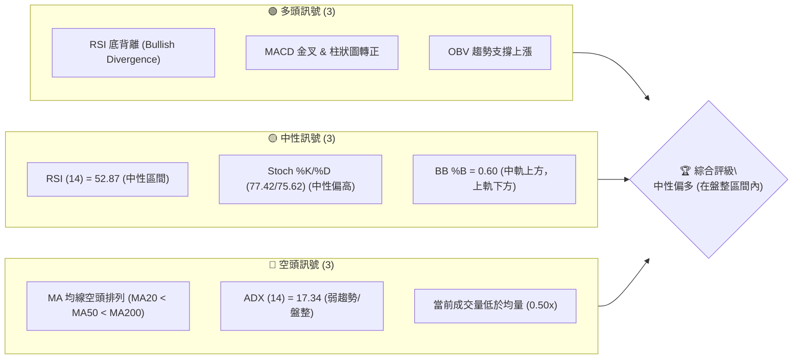

### 📊 核心指標速覽表

| 指標類別 | 指標名稱 | 當前數值 | 訊號 | 解讀 |
|----------|----------|----------|------|------|
| **價格** | 當前價格 | $385.10 | 🟡 | 位於52W區間 17.8%，接近近期支撐 |
| **均線** | MA20 | $380.51 | 🟢 | 價格 ($385.10) 位於MA20上方，短期偏多 |
| **均線** | MA50 | $403.33 | 🔴 | 價格 ($385.10) 位於MA50下方，中期偏空 |
| **均線** | MA200 | $440.71 | 🔴 | 價格 ($385.10) 位於MA200下方，長期偏空 |
| **動能** | RSI(14) | 52.87 | 🟡 | 位於中性區間，但存在底背離 |
| **動能** | MACD | +2.460 (柱狀圖) | 🟢 | MACD線向上穿越訊號線，柱狀圖轉正，看多 |
| **波動** | ATR(14) | $12.68 | 🟡 | 每日波動約 3.29%，屬於中等波動水平 |
| **趨勢** | ADX(14) | 17.34 | 🔴 | 趨勢強度弱，市場處於盤整或無趨勢狀態 |
| **成交量** | 量比 (當前/20日均) | 0.50x | 🔴 | 當前成交量顯著低於平均，可能影響反彈持續性 |

### 🏆 技術評分卡

根據各項指標的表現，MSFT 的技術面綜合評分顯示其處於一個中性偏多的狀態，尤其在動能指標方面表現積極，但趨勢強度與均線排列仍是主要挑戰。

```
技術評分卡 — MSFT (2026-07-10)
════════════════════════════════════════════════════
趨勢強度      ████░░░░░░░░░░░░░░░░  20/100  🔴 (ADX弱，無明確趨勢)
動能指標      █████████████░░░░░░░  70/100  🟢 (RSI底背離，MACD金叉)
支撐穩定度    ██████████░░░░░░░░░░  50/100  🟡 (接近S1，但下方空間仍有)
成交量配合    ████░░░░░░░░░░░░░░░░  30/100  🔴 (成交量低於均值)
形態完整度    ████████████░░░░░░░░  60/100  🟡 (潛在W底形態，待確認)
均線排列      ████░░░░░░░░░░░░░░░░  20/100  🔴 (MA20<MA50<MA200 空頭排列)
════════════════════════════════════════════════════
綜合評分      ████████░░░░░░░░░░░░  50/100  🟡 中性偏多 (盤整區間內尋求反彈)
════════════════════════════════════════════════════
```

---

## 2. 趨勢分析

對 MSFT 進行多時框趨勢分析，從月線、週線到日線層層遞進，以全面理解其價格走勢的宏觀與微觀結構。

### 🌐 多時框趨勢分析

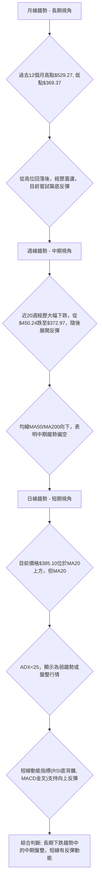

### 📈 長期趨勢 — 12個月走勢圖（Unicode）

MSFT 在過去12個月經歷了一個從高位回落並嘗試築底的過程。2025年7月達到高點$529.27，隨後震盪下跌，於2026年3月觸及$369.37的低點。近期價格在低位區間震盪，並嘗試向上反彈。

```
MSFT 月線走勢圖（過去12個月）
價格軸 ($)
$550 ┤                                   ● (2025-07 $529.27)
$500 ┤            ● ● ●
$450 ┤                                  ●
$400 ┤      ● ●           ●            ● (2026-07 $385.10)
$350 ┤               ● ● ●
     └─────────────────────────────────────────────────────
      Jul'25 Aug'25 Sep'25 Oct'25 Nov'25 Dec'25 Jan'26 Feb'26 Mar'26 Apr'26 May'26 Jun'26 Jul'26
```

**走勢特徵分析表格**：

| 階段 | 時間區間 | 主要特徵 | 價格區間 | 漲跌幅 (約) | 意義 |
|------|----------|----------|----------|-------------|------|
| **高位震盪** | 2025-07 ~ 2025-10 | 股價在$500-$530區間震盪，未能有效突破前高 | $503.50 - $529.27 | -5% | 頂部壓力顯現 |
| **震盪下行** | 2025-11 ~ 2026-03 | 股價逐步走低，跌破關鍵支撐，形成下降趨勢 | $369.37 - $489.83 | -24% | 空頭力量主導 |
| **築底反彈** | 2026-04 ~ 2026-05 | 股價在低位區間 ($350-$400) 尋求支撐，嘗試反彈 | $370.07 - $450.24 | +21% | 底部買盤介入 |
| **再次回落** | 2026-06 | 反彈受阻，再次回落至低位區間 | $372.97 - $450.24 | -17% | 上行壓力仍大 |
| **近期反彈** | 2026-07 | 在$370附近獲得支撐，嘗試小幅反彈 | $372.97 - $390.49 | +3% | 短線動能積聚 |

### 📊 中期趨勢（週線分析）

中期來看，MSFT 在2026年5月達到$450.24的高點後，經歷了一波快速下跌，最低觸及$372.97。目前正處於從該低點反彈的階段。週線圖上，MA50和MA200均線仍呈現向下趨勢，表明中期仍處於空頭市場。然而，近期價格的回升，使得短期均線有止跌向上的跡象。

```
MSFT 週線壓力與支撐示意圖
═══════════════════════════════════════════════════════════════
$450.24 ║███████████████████████████████████║ 週線阻力 (5月高點)
$426.31 ║███████████████████████████████████║ 斐波那契61.8%阻力
$403.38 ║███████████████████████████████████║ 布林上軌 / 潛在阻力
$385.10 ╠═════════════════════════════════════╣ ◄ 現價
$380.89 ║▓▓▓▓▓▓▓▓▓▓▓▓▓▓▓▓▓▓▓▓▓▓▓▓▓▓▓▓▓▓▓▓▓▓▓▓▓║ 近期支撐 S1 / MA20
$372.97 ║███████████████████████████████████║ 週線支撐 (6月低點)
$355.51 ║███████████████████████████████████║ 強支撐 S2
═══════════════════════════════════════════════════════════════
```

### ⚡ 趨勢強度評估（ADX 解讀）

ADX 指標用於衡量趨勢的強度，而非方向。當前 ADX 數值為 17.34，遠低於 25 的閾值，表明市場處於弱趨勢或盤整狀態。在這種情況下，價格可能在一個區間內震盪，而不是形成強勁的單一方向趨勢。

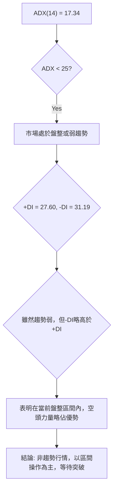

**ADX 強度對照表**：

| ADX 數值範圍 | 趨勢強度 | 市場解讀 |
|--------------|----------|----------|
| 0 - 25 | 弱趨勢/盤整 | 價格在區間內震盪，無明顯方向 |
| 25 - 50 | 中等趨勢 | 趨勢開始形成並持續，可考慮順勢操作 |
| 50 - 75 | 強趨勢 | 趨勢強勁，動能十足，適合趨勢追蹤策略 |
| 75 - 100 | 極強趨勢 | 趨勢極度強勁，但需警惕超買/超賣反轉 |

---

## 3. 圖表形態分析

本章節將識別 MSFT 股價走勢中可能形成的圖表形態，並評估其潛在的目標價。

### 🔍 形態識別系統

在 ADX 指示為弱趨勢的背景下，我們將重點關注在盤整區間內可能形成的潛在反轉或延續形態。目前觀察到一個潛在的週線級別「W底」形態，暗示短期可能存在反彈機會。

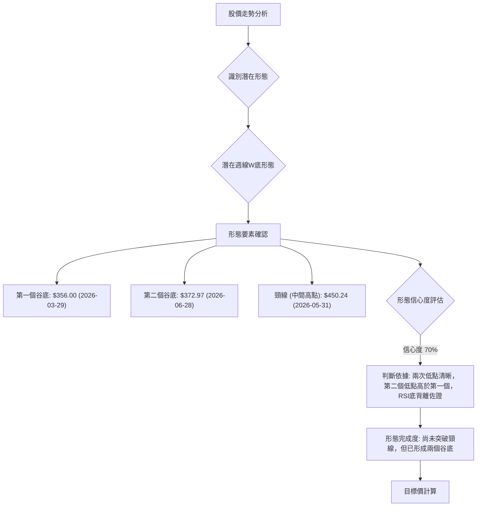

**形態信心度表格**：

| 形態 | 信心度 | 判斷依據（引用數據） | 完成度 | 目標價（附計算式） |
|------|--------|----------------------|--------|--------------------|
| 週線W底 | 70% | 第一個谷底 $356.00 (2026-03-29)；第二個谷底 $372.97 (2026-06-28)；頸線 $450.24 (2026-05-31)。第二個谷底高於第一個，且RSI出現底背離。 | 75% (待突破頸線) | 形態高度 = $450.24 - $356.00 = $94.24；<br>目標價 = 頸線 $450.24 + 形態高度 $94.24 = **$544.48** |

**分析說明**：
這個潛在的週線W底形態顯示出股價在經歷大幅下跌後，兩次探底且第二個低點高於第一個低點，這通常被視為較強的看漲信號。RSI的底背離進一步強化了這一判斷，表明賣壓正在減弱，買盤力量逐漸積聚。然而，形態的最終確認需要股價有效突破頸線 $450.24。在突破之前，仍需謹慎對待。

### 🕯️ 重要K線形態分析

近期 MSFT 的 K 線走勢顯示出在低位獲得支撐後嘗試反彈的跡象，但量能不足可能限制反彈高度。

| 月份 | 收盤價 | K線形態 | 解讀 | 訊號 |
|------|--------|---------|------|------|
| 2026-03-29 | $356.00 | 長下影線 / 錘子線 | 在下跌趨勢中出現，暗示下方有買盤支撐，潛在反轉。 | 🟢 |
| 2026-04-05 | $372.65 | 陽線 | 價格在低位企穩後出現較強陽線，確認反彈動能。 | 🟢 |
| 2026-06-28 | $372.97 | 較長下影線 | 再次在低位出現支撐，暗示空頭力量減弱。 | 🟢 |
| 2026-07-05 | $390.49 | 大陽線 | 突破短期阻力，短期看漲動能強勁。 | 🟢 |
| 2026-07-12 | $385.10 | 陰線 (小幅回落) | 在前一個交易日大漲後的小幅回落，若能守住 $380.89 (S1) 則為健康調整。 | 🟡 |

### 📉 ASCII 走勢形態示意圖

以下示意圖展示了潛在的週線W底形態，以及當前價格與頸線的相對位置。

```
MSFT 週線潛在W底形態示意圖
═══════════════════════════════════════════════════════════
$450.24 ║█████████████████████████████████████████████████║ 頸線
        ║                                                 ║
$420    ║                                                 ║
        ║                                                 ║
$385.10 ╠═════════════════════════════════════════════════╣ ◄ 現價
        ║                                                 ║
$372.97 ║                 ／╲       ／╲                  ║  ← 第二個谷底
$356.00 ║               ／    ╲   ／      ╲               ║  ← 第一個谷底
        ╚═════════════════════════════════════════════════╝
          Mar'26         May'26         Jul'26
```

### 🎯 形態目標價計算

根據上述識別的週線W底形態，其目標價計算步驟如下：
1.  **確定第一個谷底**：$356.00 (2026-03-29)
2.  **確定第二個谷底**：$372.97 (2026-06-28)
3.  **確定頸線**：兩谷底之間的高點為 $450.24 (2026-05-31)。
4.  **計算形態高度**：頸線價格 - 最低谷底價格 = $450.24 - $356.00 = $94.24。
5.  **計算形態目標價**：頸線價格 + 形態高度 = $450.24 + $94.24 = **$544.48**。

這個目標價 $544.48 位於 52 週高點 $551.05 附近，表明如果該形態成功突破頸線並完成，MSFT 有潛力回歸到接近歷史高點的水平。然而，這是一個長期目標，且需要強勁的買盤力量來突破頸線阻力。

---

## 4. 支撐與阻力

了解關鍵的支撐與阻力位對於制定交易策略至關重要。這些價位通常是市場情緒轉變、買賣力量平衡的關鍵點。

### 🗺️ 關鍵價位分布圖（Unicode）

當前 MSFT 股價 $385.10 位於斐波那契78.6%回調位 $392.40 之下，同時接近近期支撐 S1 $380.89，並面臨 R1 $412.16 的阻力。

```
MSFT 價位結構分布圖
═══════════════════════════════════════════════════
$466.32 ║████████████████████████║ 強阻力 R3
$428.35 ║████████████████████    ║ 阻力 R2
$412.16 ║████████████████████████║ 關鍵阻力 R1
$392.40 ║████████████████████████║ 斐波那契78.6%回調位
$385.10 ╠════════════════════════╣ ◄ 現價
$380.89 ║▓▓▓▓▓▓▓▓▓▓▓▓▓▓▓▓        ║ 近期支撐 S1
$355.51 ║████████████████████████║ 強支撐 S2
$349.20 ║████████████████████████║ 極強支撐 S3 (52W Low)
═══════════════════════════════════════════════════
```

### 🚧 阻力位分析表

MSFT 的阻力位分佈顯示，股價在向上反彈時將面臨多重挑戰。

| 阻力級別 | 價位 | 形成原因 | 突破難度 | 重要性 |
|----------|------|----------|----------|--------|
| **R1 (關鍵)** | $412.16 | 近期波段高點聚類，接近斐波那契61.8%回調位($426.31)和BB上軌($403.38) | 中等偏高 | 🟢 (突破R1將開啟上行空間) |
| **R2 (中級)** | $428.35 | 過去波段高點，也是斐波那契61.8%回調位 $426.31 附近 | 高 | 🟡 (突破R2可能確認中期反轉) |
| **R3 (強大)** | $466.32 | 近一年高點區間，心理關口，以及潛在W底形態頸線 $450.24 上方 | 極高 | 🔴 (突破R3預示強勁牛市) |

**分析**：當前價格 $385.10 距離最近的 R1 阻力位 $412.16 有約 7% 的上漲空間。突破 R1 將是短期反彈的關鍵。若能成功突破 R1 並站穩，則有望進一步挑戰 R2 和更重要的形態頸線 $450.24。

### 🛡️ 支撐位分析表

MSFT 的支撐位分佈顯示，下方存在多重保護，尤其 52 週低點 $349.20 提供了堅實的心理和技術支撐。

| 支撐級別 | 價位 | 形成原因 | 守住機率 | 重要性 |
|----------|------|----------|----------|--------|
| **S1 (近期)** | $380.89 | 近期波段低點聚類，接近當前MA20 ($380.51) 和布林中軌 ($380.51) | 高 | 🟢 (守住S1維持短期反彈勢頭) |
| **S2 (關鍵)** | $355.51 | 過去波段低點，接近潛在W底的第一個谷底 $356.00 | 中等偏高 | 🟡 (跌破S2可能引發更大跌幅) |
| **S3 (極強)** | $349.20 | 52週低點，歷史重要支撐，心理關口 | 極高 | 🔴 (跌破S3將開啟新的下跌趨勢) |

**分析**：當前價格 $385.10 距離最近的 S1 支撐位 $380.89 僅有約 1.09% 的跌幅。S1 的重要性在於它與短期均線 MA20 重合，若能守住此位，則短期反彈趨勢得以維持。S2 $355.51 與潛在W底的第一個谷底 $356.00 吻合，是中期走勢的關鍵防線。

### 📐 斐波那契回調位分析

根據 MSFT 在過去52週 ($349.20 至 $551.05) 的價格區間，斐波那契回調位提供了一些潛在的支撐與阻力參考。

| 斐波那契回調位 | 價位 | 相對於52W區間的意義 |
|----------------|------|----------------------|
| 0.0% (52W High) | $551.05 | 52週高點，極強阻力 |
| 23.6%          | $503.41 | 上行目標，或回調支撐 |
| 38.2%          | $473.94 | 重要阻力/支撐，可能觸發大趨勢轉變 |
| 50.0%          | $450.12 | 心理中點，形態頸線 $450.24 位於此處 |
| 61.8%          | $426.31 | 黃金分割點，重要阻力/支撐 |
| 78.6%          | $392.40 | 深度回調點，若跌破則接近底部 |
| 100.0% (52W Low)| $349.20 | 52週低點，極強支撐 |

**分析**：當前價格 $385.10 位於斐波那契 78.6% 回調位 ($392.40) 之下，但高於 52 週低點 ($349.20)。這表明股價已經從 52 週高點經歷了深度的回調，目前處於相對底部區域。
*   **$392.40 (78.6% 回調位)** 是一個重要的短期阻力。如果價格能夠突破並站穩 $392.40，將暗示更強勁的反彈動能，並可能測試 $426.31 (61.8% 回調位)。
*   **$450.12 (50% 回調位)** 與潛在W底形態的頸線 $450.24 幾乎重合，這使得該價位成為中期趨勢反轉的關鍵。突破此處將對多頭極為有利。
*   若價格無法有效突破 $392.40，並跌破 $380.89 (S1)，則可能再次回測 $355.51 (S2) 甚至 52 週低點 $349.20。

---

## 5. 技術指標深度解讀

本章節將深入分析各項技術指標，包括移動平均線、RSI、MACD、布林通道和成交量，並探討它們之間的相互關係與訊號確認。

### 🎛️ 指標訊號總覽

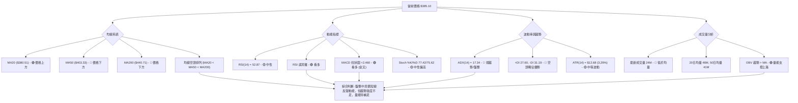

### 📈 移動平均線排列分析

當前 MSFT 的移動平均線排列呈現典型的空頭市場特徵，儘管短期價格有所反彈，但尚未改變長期趨勢。

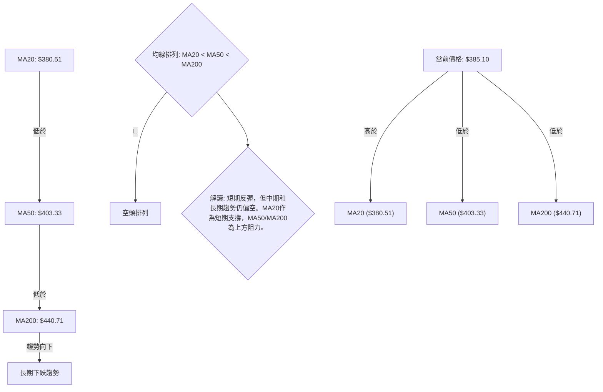

**分析**：
*   **短期均線 (MA20)**：$380.51。當前價格 $385.10 位於 MA20 之上，顯示短期買盤力量佔優，價格在 MA20 獲得支撐，是短期反彈的積極信號。
*   **中期均線 (MA50)**：$403.33。價格位於 MA50 之下，表明中期趨勢仍偏空。MA50 將構成上行的一個重要阻力。
*   **長期均線 (MA200)**：$440.71。價格遠低於 MA200，確認了長期下跌趨勢的延續。MA200 是強大的長期阻力。
*   **均線排列**：MA20 < MA50 < MA200 形成典型的「空頭排列」。這表示長期趨勢依然向下，儘管短期有反彈，但要扭轉整體趨勢，需要價格持續站穩並突破 MA50 和 MA200。

### 📉 RSI(14) 分析

RSI (相對強弱指標) 用於衡量價格變動的速度和幅度，判斷超買或超賣狀態。

**RSI 數值進度條**：
RSI(14): ▓▓▓▓▓▓▓▓▓▓▓▓▓▓▓▓░░░░ 52.87/100 🟡 (中性區間)

**分析**：
*   **RSI 數值**：當前 RSI(14) 為 52.87，位於 30-70 的中性區間，既不超買也不超賣。這表示市場情緒相對平衡，沒有極端的多頭或空頭力量。
*   **RSI 背離**：數據顯示存在 **⚠️ 底背離 (Bullish Divergence)**。這是一個重要的看漲信號。底背離通常發生在價格創下新低（或與前低持平）時，而 RSI 指標卻未能創下新低，反而向上。在 MSFT 的情況下，雖然價格在近期探底，但 RSI 顯示賣壓已經減弱，預示著潛在的反彈或趨勢反轉。這與我們在第3章識別的W底形態相輔相成，增加了反彈的信心度。

### 📊 MACD(12/26/9) 訊號解讀

MACD (移動平均聚散指標) 用於識別趨勢的強度、方向、動能和持續時間。

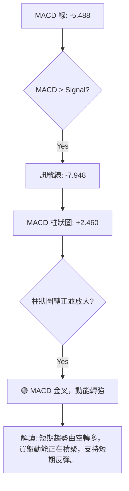

**分析**：
*   **MACD 線 (-5.488)**：目前 MACD 線位於零軸下方，表明中長期趨勢仍偏空。
*   **訊號線 (-7.948)**：MACD 線已向上穿越訊號線，形成 **金叉 (Golden Cross)**。
*   **MACD 柱狀圖 (+2.460)**：柱狀圖從負值轉為正值，並呈現放大趨勢。這是一個明確的看漲信號，表明短期內股價的向上動能正在增強。
*   **綜合解讀**：MACD 的金叉和柱狀圖轉正，與 RSI 的底背離相互印證，強烈暗示短期內股價有較大的反彈潛力。雖然 MACD 線仍在零軸之下，但動能的轉變是值得關注的積極信號。

### 📦 布林通道分析

布林通道 (Bollinger Bands) 用於衡量價格的波動性和相對高低點。

```
MSFT 布林通道示意圖
═══════════════════════════════════════════════════════════════
$403.38 ║█████████████████████████████████████████████████║ BB上軌
        ║                                                 ║
$385.10 ╠═════════════════════════════════════════════════╣ ◄ 現價
        ║                                                 ║
$380.51 ║▓▓▓▓▓▓▓▓▓▓▓▓▓▓▓▓▓▓▓▓▓▓▓▓▓▓▓▓▓▓▓▓▓▓▓▓▓▓▓▓▓▓▓▓▓▓▓▓▓║ BB中軌 (MA20)
        ║                                                 ║
$357.65 ║█████████████████████████████████████████████████║ BB下軌
        ╚═════════════════════════════════════════════════╝
```

**分析**：
*   **BB 上軌**：$403.38
*   **BB 中軌 (MA20)**：$380.51
*   **BB 下軌**：$357.65
*   **當前價格**：$385.10
*   **BB %B**：0.60。這表示價格位於布林通道中軌之上，但尚未觸及上軌。
*   **綜合解讀**：價格位於中軌和上軌之間，表明短期內價格正在向上方運行。布林通道的帶寬 (上軌 - 下軌 = $403.38 - $357.65 = $45.73) 顯示出中等波動水平。由於 ADX 顯示為盤整行情，價格很可能在布林通道上下軌之間震盪。當前價格向上突破中軌，下一步目標可能是測試上軌 $403.38。

### 💹 成交量分析（量價配合度）

成交量是價格走勢的動能來源，量價關係的配合度對於判斷趨勢的可靠性至關重要。

**分析**：
*   **最新成交量**：24,111,839 股。
*   **20日均量**：48,063,497 股。
*   **50日均量**：41,215,737 股。
*   **量比 (當前/20日均量)**：0.50x。當前成交量顯著低於 20 日和 50 日均量，僅為平均水平的一半。
*   **OBV 趨勢**：數據顯示「OBV > MA → 量能支撐上漲」。這是一個積極信號，表示在過去一段時間內，上漲時的成交量大於下跌時的成交量，買盤力量累積。
*   **綜合解讀**：儘管 OBV 趨勢顯示量能支持上漲，但當前交易日的成交量卻大幅萎縮。這形成了一個潛在的矛盾：短期動能指標顯示看漲，但實際的成交量卻未能跟上。如果價格要有效突破阻力並形成可持續的上漲趨勢，需要成交量的配合。目前量能不足可能導致反彈缺乏持續性，容易在阻力位附近受阻。

---

## 6. 動能與波動率

本章節評估 MSFT 的動能強度和波動性，這對於理解股票的風險收益特徵和選擇合適的交易策略至關重要。

### ⚡ 動能評估四象限

由於 ADX 指示當前為弱趨勢/盤整行情，市場的「動能」更多體現在短期的反彈力度，而非強勁的單邊趨勢。同時，ATR 顯示中等波動。

| 象限 | 動能 | 波動 | 當前狀態 | 評估 |
|------|------|------|----------|------|
| Q1 | 強 | 低 | - | 理想的低風險高回報機會 (當前不適用) |
| Q2 | 弱 | 低 | - | 謹慎觀望，等待趨勢確認 (ADX低，但波動不低) |
| Q3 | 強 | 高 | - | 高風險高收益，適合短線交易者 (動能僅短暫轉強，非強趨勢) |
| Q4 | 弱 | 高 | ✓ | **當前狀態: 弱動能 (ADX弱)，中等波動 (ATR)** | 避免追高殺低，以區間操作為主，等待明確訊號 |

**分析**：
MSFT 目前的狀態屬於「弱動能」與「中等波動」之間。ADX 低於 25 表明缺乏強勁的趨勢動能，市場處於盤整狀態。然而，ATR 顯示的波動率並非極低，意味著在盤整區間內仍存在一定的日內或短期價格擺動。這種環境下，追逐大趨勢的策略風險較高，更適合採取區間交易策略，並密切關注動能指標的變化。

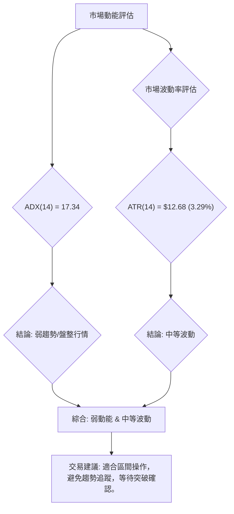

### 📊 ATR 波動率分析

ATR (Average True Range) 指標衡量資產價格的平均真實波幅，反映市場的波動程度。

**分析**：
*   **ATR(14)**：$12.68
*   **佔股價百分比**：$12.68 / $385.10 = 3.29%。
*   **解讀**：MSFT 在過去14天內的平均每日價格波動範圍為 $12.68，約佔當前股價的 3.29%。對於一個大型科技股而言，這屬於中等偏高的波動水平。
*   **止損距離建議**：ATR 可以作為衡量止損距離的參考。對於一個中等波動的股票，建議將止損設置在入場價格的 1.5 倍至 2 倍 ATR 之外，以避免被市場的正常波動「洗出」。
    *   例如，若在 $385.10 進場，1.5x ATR = 1.5 * $12.68 = $19.02。則止損點可考慮設置在 $385.10 - $19.02 = $366.08 附近。這將提供足夠的緩衝空間，同時限制潛在損失。

### 📐 Beta 與市場相關性

Beta 值衡量單一證券或投資組合相對於整個市場的波動性。

**分析**：
*   **Beta**：1.13
*   **解讀**：MSFT 的 Beta 值為 1.13，這表示其股價波動性略高於整體市場。當市場上漲 1% 時，MSFT 的股價平均可能上漲 1.13%；當市場下跌 1% 時，MSFT 的股價平均可能下跌 1.13%。
*   **意義**：對於投資者而言，這意味著 MSFT 在市場波動時，其價格變動幅度會比市場平均更大。在牛市中，它可能提供更高的潛在回報；但在熊市或市場回調時，其風險也相對較高。在當前市場情緒不明朗或趨勢不明顯的情況下，略高的 Beta 值也可能意味著其在盤整區間內的震盪幅度會相對較大，為短線交易提供了更多機會，但也增加了風險。

---

## 7. 多時框架總結

本章節將彙總不同時間框架下的技術訊號，並根據既定規則進行收斂，得出 MSFT 的最終方向性判斷。

### 📋 時框架評分表

| 時框架 | 趨勢方向 | 動能 | 均線排列 | 形態 | 綜合評分 | 建議 |
|--------|----------|------|----------|------|----------|------|
| **日線** | 盤整向上 | 🟢 (MACD金叉, RSI底背離) | 🟡 (價格在MA20上，但均線空頭排列) | 🟡 (未明確形態，但有反彈K線) | 6/10 🟢 | 短線區間偏多 |
| **週線** | 盤整築底 | 🟢 (RSI底背離，MACD嘗試金叉) | 🔴 (MA50/MA200向下) | 🟢 (潛在W底形態) | 7/10 🟢 | 中期築底反彈 |
| **月線** | 震盪下行 | 🟡 (從低位反彈，但未改變趨勢) | 🔴 (長期MA向下) | 🟡 (長期下跌後的低位震盪) | 4/10 🔴 | 長期趨勢未扭轉 |

### 🔲 綜合訊號矩陣

此矩陣展示了不同時框架下各項指標的一致性或矛盾點。

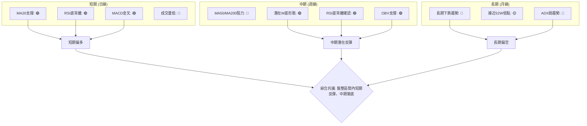

**分析**：
日線和週線級別的動能指標（RSI底背離、MACD金叉）均呈現看漲訊號，且週線出現潛在的W底形態，暗示中期有築底反彈的潛力。然而，長期月線趨勢仍偏空，且 ADX 指示當前為弱趨勢/盤整行情。成交量不足是短期反彈的隱憂。

### ⚖️ 多時框收斂結論

根據「嚴格要求 14」的收斂規則：

1.  **判斷趨勢行情或盤整行情**：當前 ADX(14) 為 17.34，遠低於 25。因此，市場處於 **盤整行情 (Consolidation)**。
2.  **主導時框**：在盤整行情中，應以日線布林通道上下軌為主要交易區間。
3.  **方向性結論**：
    *   儘管長期均線呈現空頭排列，但短線指標（RSI 底背離、MACD 金叉）和週線潛在的 W 底形態均指向短期和中期有反彈的動能。
    *   當前價格 $385.10 位於日線 MA20 上方，且在布林通道中軌之上。
    *   因此，綜合判斷 MSFT 在當前的盤整區間內，具有 **中性偏多 (Bullish Bias within a consolidation range)** 的傾向。短線操作應以逢低做多為主，目標是布林通道上軌和關鍵阻力位，同時嚴格控制風險。

**整體趨勢判斷**：🟡 **中性偏多** - 市場處於底部盤整區間，短期動能指標顯示反彈潛力，但缺乏強勁的趨勢支持和成交量配合，上行空間可能受限於中期阻力。

---

## 8. 交易策略建議

基於多時框架分析的收斂結論，MSFT 目前處於盤整區間內的偏多狀態。本章將提供具體的交易策略建議。

### 🗺️ 策略決策流程圖

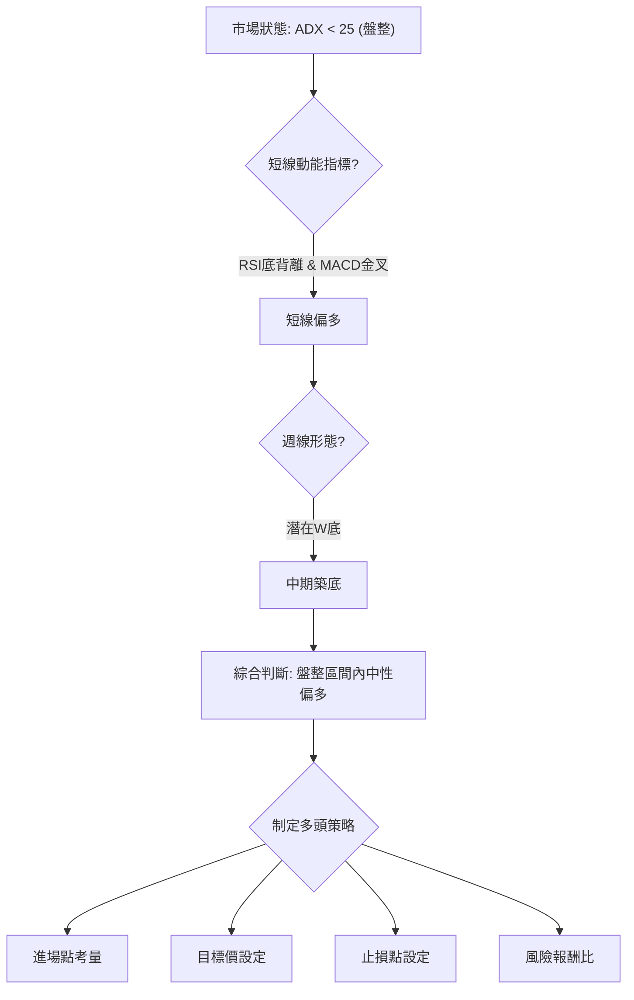

### 🧭 策略路由（依評分卡分流，不得兩頭下注）

**當前主策略方向 = 🟢 中性偏多 (依評分 50/100)**

由於綜合評分卡顯示為中性偏多，且 ADX 指示為盤整行情，我們將主要推薦在盤整區間內的逢低做多策略，並警惕上方阻力。空頭策略僅作為反轉風險提示。

### 🎯 價格情境階梯（Price Scenarios）

以下是 MSFT 在不同價格行為下的潛在情境劇本。

| 觸發條件 | 下一目標 | 後續延伸 | 情境含義 |
|----------|----------|----------|----------|
| **向上突破** | | | |
| 突破斐波那契78.6% $392.40 並站穩 | R1 $412.16 | BB上軌 $403.38 / Fib 61.8% $426.31 / R2 $428.35 | 短線轉強，有望測試中期阻力 |
| 突破 R1 $412.16 並站穩 | R2 $428.35 | R3 $466.32 / 形態頸線 $450.24 | 中期反彈確認，可能挑戰形態頸線 |
| **區間震盪** | | | |
| 維持在 S1 $380.89 至斐波那契78.6% $392.40 之間 | - | - | 區間震盪，等待方向選擇 |
| **向下突破** | | | |
| 跌破 S1 $380.89 並未能迅速收回 | S2 $355.51 | S3 $349.20 (52W Low) | 短線轉弱，可能回測底部支撐 |
| 跌破 S2 $355.51 並站不穩 | S3 $349.20 | - | 中期轉弱，可能探測或跌破52週低點 |

### 📊 情境機率分佈

| 情境 | 機率 | 主要依據 |
|------|------|----------|
| 繼續上行 / 反彈 | 45% | MACD金叉、RSI底背離、OBV支撐、潛在W底形態、價格位於MA20上方 |
| 區間震盪 | 40% | ADX弱趨勢、成交量低於均值、上方阻力重重、價格位於BB中上軌之間 |
| 回落 / 再探底 | 15% | 均線空頭排列、長期趨勢偏空、成交量不足導致反彈無力 |

### 🟢 主策略詳情（方向依上方路由）

**策略名稱**：盤整區間內逢低做多策略

基於當前中性偏多的判斷，主策略將側重於在回調至關鍵支撐位時建立多頭倉位，並以近期阻力位為目標。

| 策略要素 | 策略 A (積極型 - 回調買入) | 策略 B (保守型 - 突破買入) |
|----------|-----------------------------|-----------------------------|
| **進場條件** | 價格回調至 $380.89 (S1) 附近，並出現止跌信號 (如陽線、RSI回升)。 | 價格有效突破並站穩斐波那契78.6% $392.40。 |
| **進場價格** | $380.89 - $382.00 | $392.50 - $393.50 |
| **目標價 T1** | $392.40 (Fib 78.6%) | $412.16 (R1) |
| **目標價 T2** | $403.38 (BB上軌) | $428.35 (R2) |
| **止損價格** | $375.00 (略低於S1 $380.89 和 1.5x ATR 建議止損位 $366.08) | $388.00 (低於 $392.40 且考慮ATR) |
| **風險報酬比** | (以 $381.50 進場為例)<br>T1: ($392.40-$381.50)/($381.50-$375.00) = $10.9/$6.5 = **1.68:1**<br>T2: ($403.38-$381.50)/($381.50-$375.00) = $21.88/$6.5 = **3.37:1** | (以 $393.00 進場為例)<br>T1: ($412.16-$393.00)/($393.00-$388.00) = $19.16/$5.00 = **3.83:1**<br>T2: ($428.35-$393.00)/($393.00-$388.00) = $35.35/$5.00 = **7.07:1** |
| **成功機率** | 65% | 60% |
| **建議倉位** | 5-10% (因市場仍處盤整) | 5-8% (突破確認前需謹慎) |

### 🔴 反向風險觸發點（對沖提示）

以下是可能推翻當前偏多判斷的關鍵價位和訊號，供風險控制參考：

*   **跌破 S1 $380.89**：若價格未能守住 MA20 和 S1 支撐，則短期反彈動能將被削弱。
*   **跌破 S2 $355.51**：若價格跌破此關鍵支撐，將預示中期築底失敗，可能重新測試 52 週低點。
*   **MACD 再次死叉**：若 MACD 線再次向下穿越訊號線，柱狀圖轉負，則短期動能將由多轉空。
*   **RSI 跌破 50 並持續下行**：RSI 跌破中線可能預示空頭力量重新佔據主導。
*   **成交量持續萎縮且價格下跌**：量價背離的惡化將確認下跌趨勢。

### ⭐ 整體訊號強度評星

```
做多訊號強度：★★★☆☆  (3/5星) (短期動能強，但長期趨勢和成交量是限制)
做空訊號強度：★★☆☆☆  (2/5星) (短期有支撐，但長期仍有下行風險)
整體可信度：  ★★★☆☆  (3/5星) (盤整區間內操作，需密切關注訊號變化)
```

---

## 9. 風險提示與監控

在當前的盤整市場環境中，風險管理尤為重要。本章節將提供關鍵監控指標和風險管理建議。

### ✅ 關鍵監控指標 Checklist

以下是交易 MSFT 時應密切關注的關鍵指標清單：

```
MSFT 關鍵監控指標清單
════════════════════════════════════════════════════
├─ 價格行為：
│  ├─ 🟢 守住 S1 $380.89 支撐位
│  ├─ 🟢 突破斐波那契78.6% $392.40 阻力
│  ├─ 🟡 突破形態頸線 $450.24 (中期關鍵)
│  └─ 🔴 跌破 S2 $355.51 支撐位 (止損考量)
├─ 動能指標：
│  ├─ 🟢 MACD 柱狀圖持續為正並擴大
│  ├─ 🟢 RSI 維持在 50 以上並向上
│  └─ 🔴 MACD 再次死叉或 RSI 跌破 50
├─ 趨勢強度：
│  ├─ 🟡 ADX 是否能突破 25 (趨勢形成)
│  └─ 🔴 ADX 持續低於 20 (盤整持續)
├─ 成交量：
│  ├─ 🟢 價格上漲時成交量放大
│  └─ 🔴 價格下跌時成交量放大或反彈無量
├─ 均線系統：
│  ├─ 🟢 價格站穩 MA50 $403.33
│  ├─ 🟡 MA20 向上穿越 MA50 (金叉)
│  └─ 🔴 價格跌破 MA20 $380.51
════════════════════════════════════════════════════
```

### ⚠️ 風險場景分析

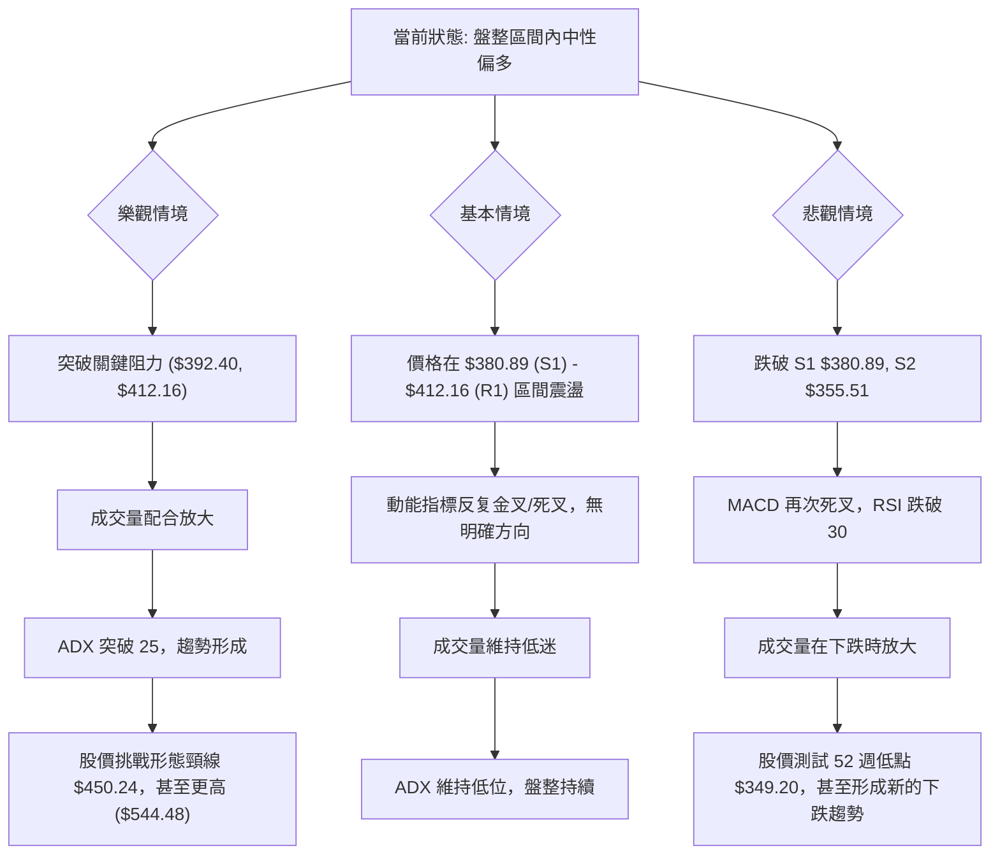

### 🛡️ 風險管理重要提醒

1.  **嚴格止損**：在盤整行情中，價格波動可能較為劇烈且方向不明確。務必為每筆交易設定明確的止損點，並嚴格執行，以限制潛在損失。建議根據 ATR 設置止損位。
2.  **倉位管理**：避免重倉單一股票，尤其是在趨勢不明朗的時期。建議採用較小的倉位進行試探性操作，並在趨勢確認後逐步加倉。主策略建議倉位為 5-10%。
3.  **分批建倉/平倉**：不要一次性投入所有資金。可以考慮在關鍵支撐位附近分批建倉，並在價格接近阻力位時分批平倉，以鎖定利潤並降低風險。
4.  **關注成交量**：成交量是確認趨勢和突破有效性的重要指標。若價格突破阻力但缺乏成交量配合，則突破的可靠性會大打折扣，可能演變為假突破。
5.  **密切監控市場情緒與宏觀經濟**：MSFT 作為科技巨頭，對宏觀經濟和市場情緒高度敏感。需關注整體市場動向、科技板塊表現以及任何可能影響公司基本面的新聞事件。
6.  **耐心等待趨勢確認**：由於 ADX 顯示為弱趨勢，市場可能在一段時間內缺乏明確方向。在這種情況下，耐心等待明確的趨勢信號或形態突破，比盲目追逐價格更為重要。

---

## 📋 報告總結

```
MSFT 技術分析報告總結
════════════════════════════════════════════════════════
報告日期：2026-07-10
當前價格：$385.10
分析評級：⚖️ 中性偏多 (在盤整區間內，短線動能積極)

關鍵結論：
├─ 長期趨勢：🔴 月線仍處於震盪下行後的低位盤整，均線空頭排列未改變。
├─ 中期趨勢：🟡 週線呈現築底跡象，潛在W底形態，但仍需突破關鍵阻力確認。
├─ 短期趨勢：🟢 日線動能指標 (RSI底背離、MACD金叉) 顯示反彈潛力，價格站穩MA20。
├─ 關鍵支撐：$380.89 (S1), $355.51 (S2), $349.20 (52W Low)
├─ 關鍵阻力：$392.40 (Fib 78.6%), $412.16 (R1), $450.24 (形態頸線/Fib 50%)
└─ 分析師目標：$559.93 (平均目標價，顯示長期潛力)

最優策略組合：
1. 🥇 **最佳機會**：若價格回調至 $380.89 (S1) 附近，並出現止跌信號，可考慮逢低買入，目標價 $392.40 (T1) 和 $403.38 (T2)，止損設於 $375.00。
2. 🥈 **次選機會**：若價格有效突破並站穩斐波那契78.6% $392.40，可考慮追蹤買入，目標價 $412.16 (T1) 和 $428.35 (T2)，止損設於 $388.00。
3. 🥉 **保守選擇**：在當前 ADX 弱趨勢下，可採取觀望策略，等待價格明確突破 $412.16 (R1) 或跌破 $380.89 (S1) 後，再依據新趨勢方向制定策略。
════════════════════════════════════════════════════════
```

---

> ⚠️ **免責聲明**：本報告為 AI 自動生成之技術分析，所有數據及估算均基於提供的歷史價格資訊。本報告**僅供研究與學術參考**，**不構成任何投資建議**。投資有風險，入市需謹慎。

---

*報告生成時間：2026-07-10 ｜ 數據來源：提供數據 ｜ 分析框架：多時框技術分析*