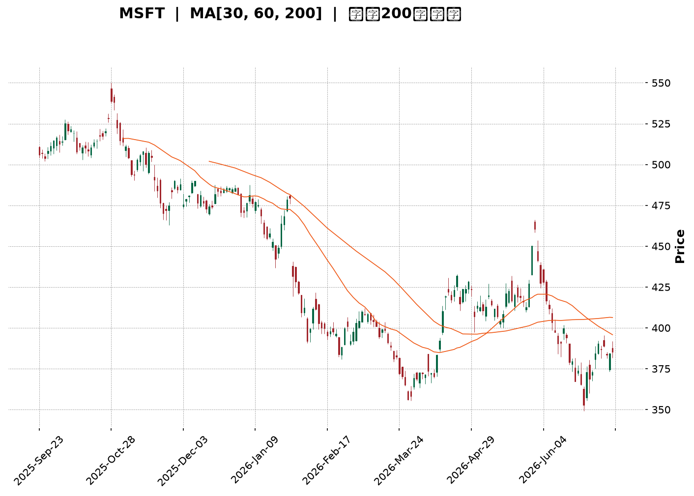
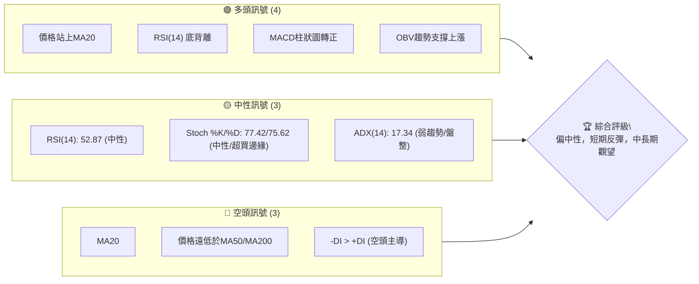
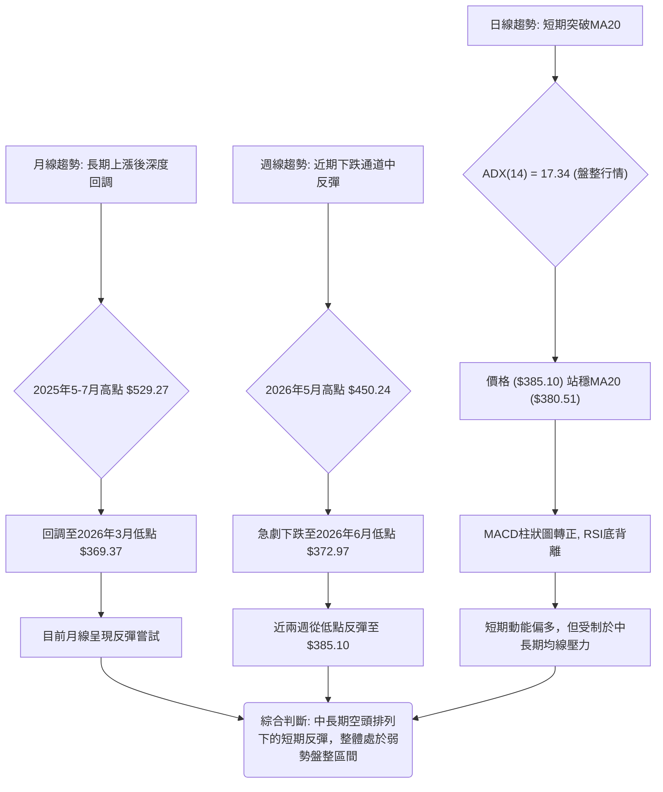
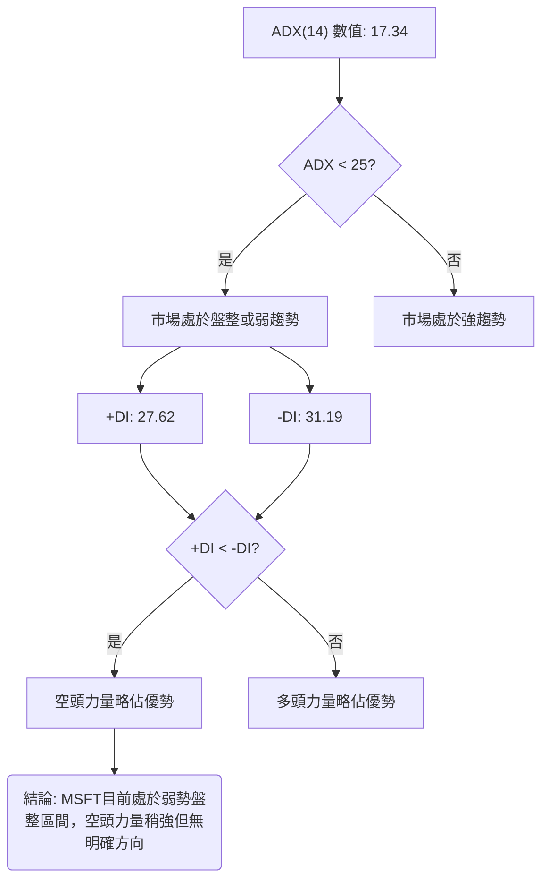
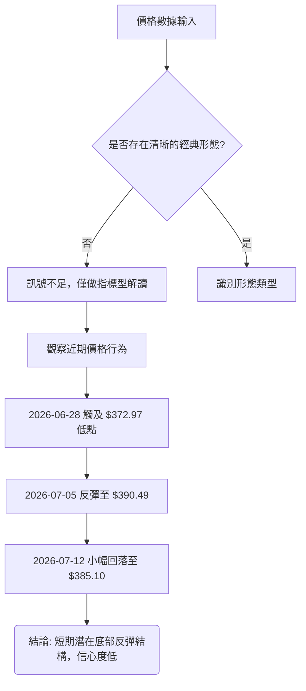
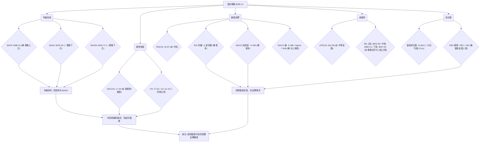
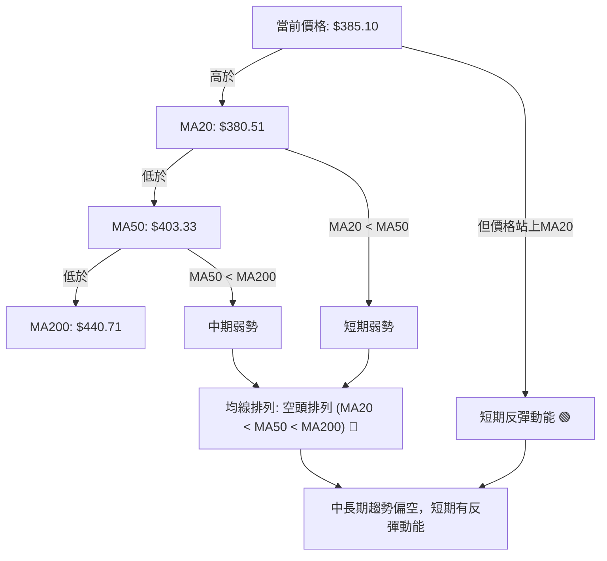
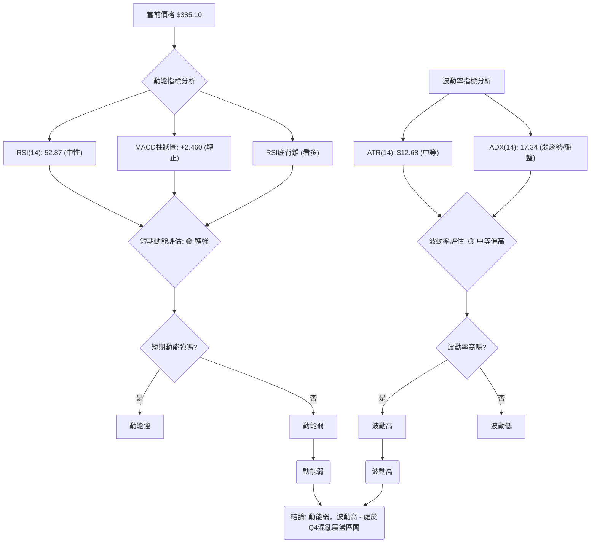
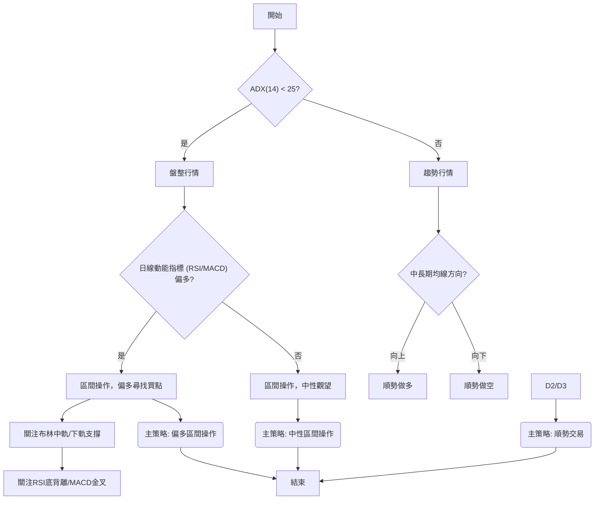
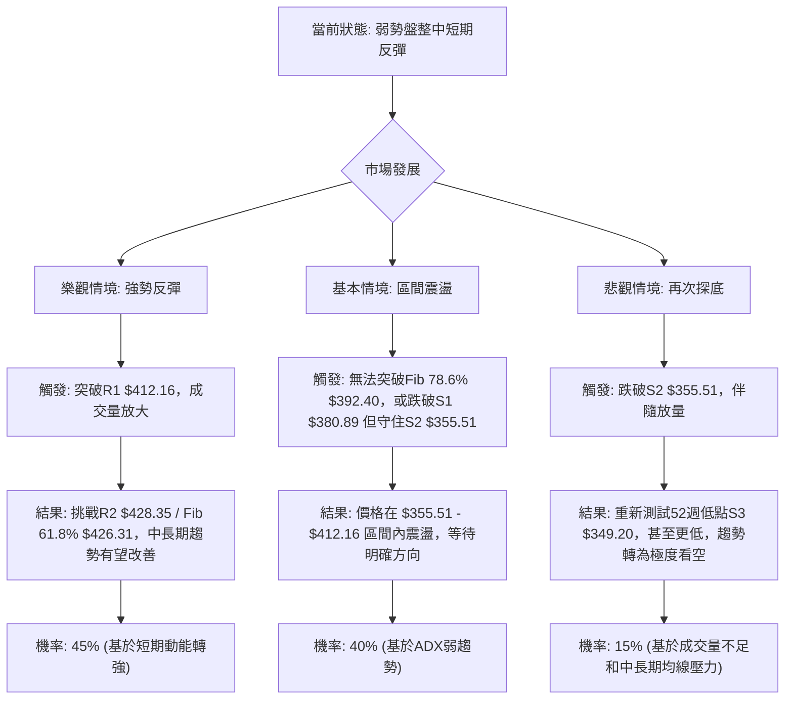

<details>
<summary>📊 靜態圖表 (點擊展開)</summary>

</details>

<html>
<head><meta charset="utf-8" /></head>
<body>
    <div style="height:500px; width:100%;">                        <script>window.PlotlyConfig = {MathJaxConfig: 'local'};</script>
        <script charset="utf-8" src="https://cdn.plot.ly/plotly-3.7.0.min.js" integrity="sha256-jvTGqxNp8AGWEcvNLVuKr+8j5dGe9Yw51LQkmDH+IYA=" crossorigin="anonymous"></script>                <div id="candlestick-chart" class="plotly-graph-div" style="height:100%; width:100%;"></div>            <script>                window.PLOTLYENV=window.PLOTLYENV || {};                                if (document.getElementById("candlestick-chart")) {                    Plotly.newPlot(                        "candlestick-chart",                        [{"close":{"dtype":"f8","bdata":"AAAAYGegf0AAAADgB69\u002fQAAAAOBsfX9AAAAA4NvDf0AAAABgyPV\u002fQAAAAOCFFYBAAAAAoIMjgEAAAABA9AOAQAAAAKDAEIBAAAAAwPJpgEAAAACAdUWAQAAAACBgTIBAAAAAIOY4gEAAAADA6Lt\u002fQAAAAOAJ7X9AAAAAAGjlf0AAAABgLuN\u002fQAAAAGA+xn9AAAAA4JDlf0AAAAAgTQyAQAAAAKA3E4BAAAAAoBwqgEAAAACARSqAQAAAAKCEQoBAAAAAYGaBgEAAAACgRNWAQAAAAGAi0YBAAAAAIJxTgEAAAADgaBSAQAAAAIA1DoBAAAAAYH3xf0AAAAAAfn9\u002fQAAAAICL335AAAAA4BfbfkAAAACgDG1\u002fQAAAAKCol39AAAAAYMW+f0AAAABA9kF\u002fQAAAAACCr39AAAAAIL2Ef0AAAAAg66p+QAAAAMDeQH5AAAAAIPHEfUAAAADgbWB9QAAAAGBgfn1AAAAA4ACufUAAAABgjzV+QAAAAEBCnX5AAAAA4E9JfkAAAADAPX1+QAAAAKDKuX1AAAAAoFTrfUAAAABASRB+QAAAACB9jX5AAAAA4GqdfkAAAAAgA8d9QAAAAGA5FX5AAAAA4IjGfUAAAAAgcIt9QAAAAGBypH1AAAAAQCWgfUAAAAAgWR1+QAAAACBAPH5AAAAAYFIsfkAAAACgEEt+QAAAAICzXX5AAAAAgMNYfkAAAAAADE9+QAAAAKAZVX5AAAAAIJ0XfkAAAADAfW19QAAAAMAObH1AAAAAYDfGfUAAAABgORV+QAAAACDYv31AAAAAQHvSfUAAAADAB7F9QAAAACBVSX1AAAAAYH6VfEAAAACgKmp8QAAAAKAjnXxAAAAA4BNIfEAAAACAQaJ7QAAAAOA8EnxAAAAAoCX+fEAAAACgHkN9QAAAAIAw531AAAAAIOr3fUAAAADAP\u002fl6QAAAAOAdxnpAAAAAQONXekAAAACgMJZ5QAAAAMCoxXlAAAAAYMt+eEAAAADgyPV4QAAAAMBCvHlAAAAAAAG3eUAAAAAgPCl5QAAAAEDvAHlAAAAA4Kb4eEAAAACgm7F4QAAAAOBA3XhAAAAA4JTZeEAAAADA8cV4QAAAAKA5+ndAAAAAgIxCeEAAAABgv\u002ft4QAAAAAChDXlAAAAAYEJ+eEAAAACgBNt4QAAAAIDpMHlAAAAAQDBFeUAAAADArZx5QAAAAOA3gXlAAAAAIGeIeUAAAAAgIU55QAAAAGAUQHlAAAAAIN0PeUAAAABAH6t4QAAAAMBe8XhAAAAAoL\u002foeEAAAACgF294QAAAACDeQnhAAAAAILfQd0AAAACgweJ3QAAAAGDzPndAAAAAYM8jd0AAAACA3dJ2QAAAAKD7P3ZAAAAAgPJidkAAAACA6xV3QAAAAMAlCXdAAAAAIHJKd0AAAACgL0F3QAAAAEDEN3dAAAAAAFZYd0AAAABAOER3QAAAAIAYIXdAAAAAAKH4d0AAAACgKoR4QAAAAOBMpXlAAAAAwKA1ekAAAABABV56QAAAAOCpEnpAAAAAoORzekAAAAAAwP96QAAAAKCf7XlAAAAAoDx7ekAAAAAgbn56QAAAACAoxXpAAAAAoK54ekAAAAAgYW55QAAAAIC12HlAAAAAAJ7LeUAAAADg2qd5QAAAAKAL0XlAAAAAIMU9ekAAAADAkON5QAAAAGBKvHlAAAAAIDhueUAAAAAgWUV5QAAAAOC4iHlAAAAAYCFQekAAAACg\u002fml6QAAAAEBJCHpAAAAAYGZCekAAAACgcDF6QAAAAMAeKXpAAAAA4HoAekAAAABguMp5QAAAAADXr3pAAAAAANcjfEAAAADgUch8QAAAAMD1lHtAAAAAoHC1ekAAAADAzMB6QAAAAGC4CnpAAAAAANe7eUAAAABgjzZ5QAAAAIDC1XhAAAAAoHBleEAAAAAA12t4QAAAAAAp\u002fHhAAAAAoEedeEAAAABgj653QAAAAGBmtndAAAAAoHD1dkAAAABACl93QAAAACBc13ZAAAAAoEcNdkAAAAAghU93QAAAAMAeCXdAAAAA4FFQd0AAAADgegR4QAAAAADXZ3hAAAAAANcreEAAAACgcE14QAAAAKBw9XdAAAAAgMIFeEAAAACgmRF4QA=="},"high":{"dtype":"f8","bdata":"nNbX1J\u002f1f0Cy0TJwE9R\u002fQByhvC7OrH9Ag00yEkrrf0DfBREwxwyAQK04OisxF4BA7MpjsN8pgEAl1df4iTKAQIyPQee2KYBARSMWK4F9gEAVYJ7cuXOAQDVT7O4RXYBAikDp3z1IgEBvEaWHR0KAQN6sNcVHCYBAf9apFUwAgEBOxdU5ew+AQCgMaybHDIBAF2QAE+MBgEAcVNRBfBuAQGODZNlnG4BAFF7rTGVPgECgD5GOOEWAQEml6bJZUIBA6XN7z7mZgEDy++mX4TGBQGdw8Smo9oBAmiqda9OcgEAk0A4G6W+AQHO\u002fUuo\u002fTYBAKo2cdnECgEDKzQypcPl\u002fQBlLpG9HaH9A+2xYossDf0AX\u002fcpWkHp\u002fQBhsvEhJpn9AgtJ1ljLHf0AQ1IIvS+R\u002fQCC\u002fNsUVxn9AjalKRlrOf0DjNG96CD1\u002fQCtbo3ktwX5Adt4AsBu2fkB3mEJDv8x9QOGQYRaSrH1A5qQ+BmnQfUD05oMYUmJ+QBFqt30ip35AXj1jtwJ7fkChDuow\u002frR+QEKvokd9IX5AUUZ2CPryfUCufk3kGxR+QKPLc8HgoX5AM3cUrwKffkBTInsLpiF+QPgcw6IAPn5AQe47EPoEfkCqq4Bba+l9QP+jpyJXvH1Am8oySvPdfUBZrRiR3nZ+QDSDmVP+Wn5AbDPF7wJpfkDLBzbUrFp+QIZ9KEzcb35Api7zbUtffkCMfN9M9WJ+QAsKiMwkeH5ANK4AC51ffkBQxMEKLih+QOAJfGZZn31AgijYMuHJfUAYriRddnh+QJZsZV9SCH5AtPeMURXbfUAqradPuO19QJ17NdS6mn1ABysz9fwhfUAOQD5rEeN8QDTFOOcu0nxAIsR7WGVsfEAERQdw7Sp8QG2U7SBRLXxAMx72eS5QfUCxwrKnW4J9QDNWGMqqC35AAqLKToYZfkC10\u002fFPnIh7QDj5j45qWntA8hza6UjNekCvSMll3EJ6QIkWEGAFH3pAeiZJEtZneUBKkTxyIwB5QJXy4TLP0HlA\u002fHwBVdNcekBEEfgx0el5QJfjkbJiRnlAT3ekXd87eUA97geJ6Ot4QFx\u002fFz9nDHlAuVT+JuU4eUC3osuKFfR4QHEV1ZgWqHhA1j830EtIeEDrnmosowl5QEJPMcy\u002faXlAl7z7AWa\u002feEBzsCjBKgV5QGanivoiXXlALCL5Q0SieUBGdHDEhqt5QPT5QkuEwnlA3csPyyyVeUA4XjYSBJV5QIw9nVAEgnlA84YKauBTeUCgiupdzT55QFGY\u002f\u002fo5\u002fHhAmTGSc2o4eUBaD\u002fXGPNJ4QDjiQYhEenhALDCfNp4ieEDklYV7+CV4QPUh1V1L2ndAbZjO9euDd0AHYSkLkF53QF8O77eqmnZAW8JjOCDJdkDAH1BVgUF3QNGxS1roUndA1+0H6FFNd0DhZLW5wU53QLC4ZjVSOndA9mwl7K8CeEDSRZCxFUt3QCNraEZAbXdAkV653lf7d0Dn329jZJ14QFtJgV2X13lAYyLyipE+ekC2MHUwW+p6QE7m6S+kZnpAXOY1xBukekCAvVv4Mwx7QPU0Sfroa3pAw98ddIGAekA6dX2a\u002faJ6QDbtnJHaz3pAH+yuW1yeekCgwqTYY9h5QMVgTx1WA3pA6CgH\u002fu09ekBclLVyEf55QJojvmRAGHpAYL7ejOGwekCk\u002f7Ctmht6QM5UBPzEvHlAF6Qa0qHpeUC84TQD6VZ5QGqRguoyr3lAgYwtDOqzekA1wYBDOIN6QGSLqNw8\u002fHpAmssgCwFTekAAAACgcKV6QAAAAGBmhnpAAAAA4FE8ekAAAABACv95QAAAAADX13pAAAAAoEclfEAAAADAHiV9QAAAAAAAWHxAAAAAgD2Ge0AAAABgZkJ7QAAAACCF13pAAAAAYI8SekAAAAAgrr95QAAAAOCjUHlAAAAAoJnNeEAAAAAA13t4QAAAAAAAHHlAAAAAoHDNeEAAAACA62V4QAAAAIDr1XdAAAAAgBTad0AAAAAghZN3QAAAAIAUrndAAAAAIK7DdkAAAACAwol3QAAAAAAAyHdAAAAAYGZid0AAAACgR014QAAAAEAzg3hAAAAAYGZSeEAAAADAHrl4QAAAAMD1FHhAAAAAYGYKeEAAAABgj354QA=="},"hovertemplate":"\u003cb\u003e%{x|%Y-%m-%d}\u003c\u002fb\u003e\u003cbr\u003e\u958b: $%{open:.2f}\u003cbr\u003e\u9ad8: $%{high:.2f}\u003cbr\u003e\u4f4e: $%{low:.2f}\u003cbr\u003e\u6536: $%{close:.2f}\u003cextra\u003e\u003c\u002fextra\u003e","low":{"dtype":"f8","bdata":"w\u002fVQfuCBf0DrO\u002fIirXt\u002fQAo9DyzJXX9AuDGMA+h2f0BSVmLS1pp\u002fQN3GRpI9p39AEOQe\u002fYPHf0DaTSgvdbd\u002fQNvq4lMk\u002fH9AlykZqIIXgEC1K8ZcRDGAQNy09G5iPoBAW7+zkSYRgEBIKrRow6Z\u002fQKWgondbx39A2FWIYwxtf0DffouKpax\u002fQPy2sxTqjn9AR\u002flQgOCBf0DyopZcLuN\u002fQAYQlNf63H9AcSOxWZ0TgECvfhwCxRqAQN9naeB2K4BAmrDSOXJtgEDDw2wB78qAQOnU7h\u002fRqoBAB5dGSqw2gEDMg79bu\u002f1\u002fQAJl\u002fKWf9X9AYb6ojE2Kf0B1rZIzRXZ\u002fQONx5+AIy35AA9DMJlWifkBM2QX5kvp+QFnPPCwEM39AH6XfOan\u002ffkDD4CXOKSJ\u002fQDIEQGjz5H5AcIGAAbhbf0ACV57Tdjt+QLhk+HWp\u002fH1A9IIpFUWWfUADol4qGiN9QF0yI9geH31AKXU3HEPtfEA8t1i2EPF9QD16E\u002fbgR35ATpg6NAUofkAcsdlTn0J+QFk8wrF9kX1AFujg\u002fgmmfUAV0mcZHMx9QBj2a1S4I35ARtgi7FhlfkCK22IylI99QOmEZfIAnH1AEWocZaajfUAer48EzWZ9QPZyd2+tTH1AKUPCFk6OfUAMvuYXV7x9QHnT7wmdBX5AUuwOv8wIfkD3ailRdCl+QDx4FC7jKn5AG8SBR+M8fkB66NqmiCB+QMJz2XSPNX5AQ2esL4QSfkDqjvdbNUF9QC+z5fWxNn1AaUFjdK06fUAwegS+S719QBNmCfwAnH1Ax3EyMrRhfUCqX179Ipl9QE+dy7Yl\u002fnxA0l\u002flYUpyfEBJ8CttD158QILFBaFMZ3xA4JFCCJz0e0BKr7Pbwkt7QGCpB5Onq3tAVYXLRoUIfECC8zkdOr98QNEkYv7+cH1Ak5Kyixe+fUCR3EJCdDJ6QNJa1vvyiHpAACa2FgxGekBvLphf+mt5QK5602PPdnlAai0VREppeEDNqAwG2XJ4QJTjg8x78XhA0+DCueyteUD2pniktvN4QEXAWy3tw3hAyjL9QZDEeEAwTtxPfox4QF7AnJABqXhAWJpi+AC9eECPvv5S5aR4QIEHuEBa5HdAhT5SKCnOd0DM9SOLEVV4QNRKOkEN3nhAIU43MZlQeEDKhWJ8klx4QC0vh00kfXhA5DHYCR73eECWSM93ajh5QFNMv7sIenlAvVhLEQwqeUC7rkpt8iB5QHndyp+NC3lAW9zpE3gNeUCas\u002f4BXpZ4QHHpnQ39nnhA7hrw8T7OeEAj8k++emJ4QNhLv1mTI3hAzrzEnca0d0BuJFaPrs13QG0w4uC9MHdAXFJHe0wNd0DMtpiHacZ2QHo0Kg3VO3ZAbkJg+Sg4dkCtLAy6kKR2QJz4Ydt39nZAbjBXys61dkBaGswLOQt3QKKTS9lI3HZAM7wembcpd0Dm\u002f2KKG+R2QBVUj0+vE3dAPDUdjX0jd0AwU\u002fNV9Bp4QAFOHiX2vXhAu8FaIf2zeUBt8vU2fjx6QK0ZMYtn9nlA8dx6HMYEekCxHnPiEWx6QAetVWtVqHlAdc7c82vueUCCo+u6sgJ6QJOxnJDPT3pAk\u002fUZShs2ekBkkGO8ZdJ4QL0Uw+jYmHlAx4CwNpieeUC3OsD2qX55QJ6ky1fAQ3lAXP\u002fzCq4dekCD3Bsqr9F5QFa\u002f9mH6SXlAQuTEwC1ceUCtvovgnAJ5QGqvxM83AHlAZ4mWIkjAeUDYtqxyY+t5QLFdmxtw+XlAuDctxpOmeUAAAAAgXPt5QAAAAKBHBXpAAAAA4FHQeUAAAACgR5l5QAAAAGC4ynlAAAAAgMIFe0AAAADgUaR8QAAAAEDhhntAAAAAAACEekAAAABgj6Z6QAAAAGBm5nlAAAAAwPWIeUAAAAAgrud4QAAAAGCP0nhAAAAAAAAAeEAAAADgUeR3QAAAAKCZjXhAAAAAQApreEAAAADAHpV3QAAAAOB6VHdAAAAAwB7xdkAAAABguCp3QAAAAOB6zHZAAAAAQDPTdUAAAABA4TZ2QAAAAGBmfnZAAAAAQDP3dkAAAACAPW53QAAAAEAz+3dAAAAAIIXTd0AAAAAghUN4QAAAAKBH1XdAAAAAoJlVd0AAAAAAANh3QA=="},"name":"\u50f9\u683c","open":{"dtype":"f8","bdata":"8yNfMhDpf0AQwiISsLJ\u002fQFgPRQOekX9AV8itlpmtf0ATbebIfsR\u002fQNOMueko4H9ARVvvUfb4f0BVWtMCDxOAQLNp5djDDoBA3Eth\u002f8QagEAPF\u002ffSuGeAQCTTChzlP4BA9uD2BWw4gEA5N90v9SKAQN6sNcVHCYBAb9kZeU2wf0CwiFPvgft\u002fQI2ErJ6q1X9AAvzYB2Kdf0AzCc0x8fV\u002fQKPb1Q\u002fyEYBArP4YI\u002fYugECmGNNCYDmAQAz3m9H\u002fO4BAK9EXhneDgEB3bEkKTxSBQPkmbG4V7IBAJitlyiF5gEDzD9+RaWyAQIHiQgtPJIBAyRDh36DIf0CXwNEZHeF\u002fQPeUqZekZ39ANQgWBindfkBA9RkiSg5\u002fQPLtjST4WX9A7LasQniif0BqupIqk7F\u002fQMkU6+qC8X5AGGTAoACUf0ABnooFCsR+QLkPxA5AcH5ADYIbrmiofkBFb96DDsZ9QFz3JzdOjn1AaO\u002fcpn1\u002ffUDZkmBqdkJ+QG8VlfUCV35AGtfGQGRkfkD+eVNw\u002fkh+QPIQ\u002ftpUo31AeHvInCDafUAAxmFfFwZ+QMXlcxHYK35AS\u002fXBpudufkA3RkHqJB5+QEUWovZEqH1Ah8rfUhXbfUD4sMwdi999QD\u002fNG5sVXX1AoNlRx7qsfUAsRUhlHsF9QMP0qxkwU35AFjFttW8\u002ffkBB9FYVRy1+QI9Fd15tOH5AD3DcqNVIfkBe1aKNXSt+QGCS3OVoPH5Aqu2\u002fndVafkBObOkR4SN+QCfs2eZUf31AX9RoqDB7fUCWR3mfINp9QOFs58iz8X1ACnZM61R\u002ffUBJT9ki6Kh9QAblBS41iX1AXQRHbkUGfUC0zJ1H\u002f+B8QKBULZ3NfHxAFGNbDYMTfEArdGpyfil8QKtdRswq2ntAdcU5kd0dfEAsJz7B8\u002fN8QD4H9w+ZeX1AsTS6DhURfkBFcrfkoGB7QC5qkB2RU3tAwHNJ\u002flHFekAXBKRfOUJ6QG150W3YknlAPvVLMCNaeUCf9luGZ9Z4QL422qXhMHlAOh2ATyccekDYyaxnW+V5QCg7WT1FM3lATsLsiIIqeUByUolkM9d4QLFt\u002fXHWxXhApnltQi\u002f9eEBHDCwKELR4QJP+o0hXonhAIlyABfX0d0AWRKjE+Vp4QHBWKIhdPXlAioMLV5BgeEBg+sS+LIB4QKKMZ0SlhHhAhSZLqnEGeUA28nBKvDh5QJDNEOAMhXlAHtM\u002f37dAeUB4wH0zTZJ5QI5aUoQYS3lAnHOhmhY8eUCT01ZBIgJ5QKMceeRa03hABOsUg3r2eEA13Ij6WMR4QDMMdVAcVHhAtKN+8kMfeEAAQHoIIPF3QDmUJreJ2HdAuiwI06+Bd0AA8yQxTCB3QIGUYrbikXZAR2JkueKRdkDJ6hygMbx2QC+7YcfsSndA+iTEc6nmdkB7T6W57Ep3QHdFGUOiGHdA0L1xOV4CeECqwLuLHjt3QIzPYXLIQndA\u002fVjLP9dMd0C1WkdxTjF4QP7rE8c80nhALMuGyj0vekB4+68nbn56QOAzLjzWQ3pA3WBk8041ekDfmJ9zTZR6QMeN3Xm4L3pA2hVi+BkBekDXJH55eVd6QI9A0U1wenpAxIgQEJl6ekDXSYctwZ55QOPrlYSGvnlApUioyWiqeUC+Y0s\u002fwuZ5QG4feULkcXlAqxOulzszekC6B7unzgd6QN3NF+fQb3lAgk+f+VjZeUAk7\u002fAKQiV5QIhLhpGxOXlA+9OSmP7VeUDzltWBg\u002ft5QK9WBsaIz3pArK4c\u002fmXUeUAAAAAAAIx6QAAAAOCjOHpAAAAAQOEGekAAAAAAKbB5QAAAACCuz3lAAAAAwMwIe0AAAACgcA19QAAAAIAU7ntAAAAAQDNne0AAAADA9Tx7QAAAAKBwxXpAAAAAgD3ieUAAAADgepB5QAAAAMDM6HhAAAAAIFyzeEAAAABA4XZ4QAAAAMDMzHhAAAAA4KO8eEAAAAAAAGR4QAAAAMAenXdAAAAAANd7d0AAAACAFEZ3QAAAAMAeOXdAAAAA4FGsdkAAAABgZlJ2QAAAAAAAmHdAAAAA4Howd0AAAACgR813QAAAACCuB3hAAAAA4KMweEAAAAAA14d4QAAAAOB6AHhAAAAAQDNnd0AAAADAzDx4QA=="},"x":["2025-09-23T00:00:00-04:00","2025-09-24T00:00:00-04:00","2025-09-25T00:00:00-04:00","2025-09-26T00:00:00-04:00","2025-09-29T00:00:00-04:00","2025-09-30T00:00:00-04:00","2025-10-01T00:00:00-04:00","2025-10-02T00:00:00-04:00","2025-10-03T00:00:00-04:00","2025-10-06T00:00:00-04:00","2025-10-07T00:00:00-04:00","2025-10-08T00:00:00-04:00","2025-10-09T00:00:00-04:00","2025-10-10T00:00:00-04:00","2025-10-13T00:00:00-04:00","2025-10-14T00:00:00-04:00","2025-10-15T00:00:00-04:00","2025-10-16T00:00:00-04:00","2025-10-17T00:00:00-04:00","2025-10-20T00:00:00-04:00","2025-10-21T00:00:00-04:00","2025-10-22T00:00:00-04:00","2025-10-23T00:00:00-04:00","2025-10-24T00:00:00-04:00","2025-10-27T00:00:00-04:00","2025-10-28T00:00:00-04:00","2025-10-29T00:00:00-04:00","2025-10-30T00:00:00-04:00","2025-10-31T00:00:00-04:00","2025-11-03T00:00:00-05:00","2025-11-04T00:00:00-05:00","2025-11-05T00:00:00-05:00","2025-11-06T00:00:00-05:00","2025-11-07T00:00:00-05:00","2025-11-10T00:00:00-05:00","2025-11-11T00:00:00-05:00","2025-11-12T00:00:00-05:00","2025-11-13T00:00:00-05:00","2025-11-14T00:00:00-05:00","2025-11-17T00:00:00-05:00","2025-11-18T00:00:00-05:00","2025-11-19T00:00:00-05:00","2025-11-20T00:00:00-05:00","2025-11-21T00:00:00-05:00","2025-11-24T00:00:00-05:00","2025-11-25T00:00:00-05:00","2025-11-26T00:00:00-05:00","2025-11-28T00:00:00-05:00","2025-12-01T00:00:00-05:00","2025-12-02T00:00:00-05:00","2025-12-03T00:00:00-05:00","2025-12-04T00:00:00-05:00","2025-12-05T00:00:00-05:00","2025-12-08T00:00:00-05:00","2025-12-09T00:00:00-05:00","2025-12-10T00:00:00-05:00","2025-12-11T00:00:00-05:00","2025-12-12T00:00:00-05:00","2025-12-15T00:00:00-05:00","2025-12-16T00:00:00-05:00","2025-12-17T00:00:00-05:00","2025-12-18T00:00:00-05:00","2025-12-19T00:00:00-05:00","2025-12-22T00:00:00-05:00","2025-12-23T00:00:00-05:00","2025-12-24T00:00:00-05:00","2025-12-26T00:00:00-05:00","2025-12-29T00:00:00-05:00","2025-12-30T00:00:00-05:00","2025-12-31T00:00:00-05:00","2026-01-02T00:00:00-05:00","2026-01-05T00:00:00-05:00","2026-01-06T00:00:00-05:00","2026-01-07T00:00:00-05:00","2026-01-08T00:00:00-05:00","2026-01-09T00:00:00-05:00","2026-01-12T00:00:00-05:00","2026-01-13T00:00:00-05:00","2026-01-14T00:00:00-05:00","2026-01-15T00:00:00-05:00","2026-01-16T00:00:00-05:00","2026-01-20T00:00:00-05:00","2026-01-21T00:00:00-05:00","2026-01-22T00:00:00-05:00","2026-01-23T00:00:00-05:00","2026-01-26T00:00:00-05:00","2026-01-27T00:00:00-05:00","2026-01-28T00:00:00-05:00","2026-01-29T00:00:00-05:00","2026-01-30T00:00:00-05:00","2026-02-02T00:00:00-05:00","2026-02-03T00:00:00-05:00","2026-02-04T00:00:00-05:00","2026-02-05T00:00:00-05:00","2026-02-06T00:00:00-05:00","2026-02-09T00:00:00-05:00","2026-02-10T00:00:00-05:00","2026-02-11T00:00:00-05:00","2026-02-12T00:00:00-05:00","2026-02-13T00:00:00-05:00","2026-02-17T00:00:00-05:00","2026-02-18T00:00:00-05:00","2026-02-19T00:00:00-05:00","2026-02-20T00:00:00-05:00","2026-02-23T00:00:00-05:00","2026-02-24T00:00:00-05:00","2026-02-25T00:00:00-05:00","2026-02-26T00:00:00-05:00","2026-02-27T00:00:00-05:00","2026-03-02T00:00:00-05:00","2026-03-03T00:00:00-05:00","2026-03-04T00:00:00-05:00","2026-03-05T00:00:00-05:00","2026-03-06T00:00:00-05:00","2026-03-09T00:00:00-04:00","2026-03-10T00:00:00-04:00","2026-03-11T00:00:00-04:00","2026-03-12T00:00:00-04:00","2026-03-13T00:00:00-04:00","2026-03-16T00:00:00-04:00","2026-03-17T00:00:00-04:00","2026-03-18T00:00:00-04:00","2026-03-19T00:00:00-04:00","2026-03-20T00:00:00-04:00","2026-03-23T00:00:00-04:00","2026-03-24T00:00:00-04:00","2026-03-25T00:00:00-04:00","2026-03-26T00:00:00-04:00","2026-03-27T00:00:00-04:00","2026-03-30T00:00:00-04:00","2026-03-31T00:00:00-04:00","2026-04-01T00:00:00-04:00","2026-04-02T00:00:00-04:00","2026-04-06T00:00:00-04:00","2026-04-07T00:00:00-04:00","2026-04-08T00:00:00-04:00","2026-04-09T00:00:00-04:00","2026-04-10T00:00:00-04:00","2026-04-13T00:00:00-04:00","2026-04-14T00:00:00-04:00","2026-04-15T00:00:00-04:00","2026-04-16T00:00:00-04:00","2026-04-17T00:00:00-04:00","2026-04-20T00:00:00-04:00","2026-04-21T00:00:00-04:00","2026-04-22T00:00:00-04:00","2026-04-23T00:00:00-04:00","2026-04-24T00:00:00-04:00","2026-04-27T00:00:00-04:00","2026-04-28T00:00:00-04:00","2026-04-29T00:00:00-04:00","2026-04-30T00:00:00-04:00","2026-05-01T00:00:00-04:00","2026-05-04T00:00:00-04:00","2026-05-05T00:00:00-04:00","2026-05-06T00:00:00-04:00","2026-05-07T00:00:00-04:00","2026-05-08T00:00:00-04:00","2026-05-11T00:00:00-04:00","2026-05-12T00:00:00-04:00","2026-05-13T00:00:00-04:00","2026-05-14T00:00:00-04:00","2026-05-15T00:00:00-04:00","2026-05-18T00:00:00-04:00","2026-05-19T00:00:00-04:00","2026-05-20T00:00:00-04:00","2026-05-21T00:00:00-04:00","2026-05-22T00:00:00-04:00","2026-05-26T00:00:00-04:00","2026-05-27T00:00:00-04:00","2026-05-28T00:00:00-04:00","2026-05-29T00:00:00-04:00","2026-06-01T00:00:00-04:00","2026-06-02T00:00:00-04:00","2026-06-03T00:00:00-04:00","2026-06-04T00:00:00-04:00","2026-06-05T00:00:00-04:00","2026-06-08T00:00:00-04:00","2026-06-09T00:00:00-04:00","2026-06-10T00:00:00-04:00","2026-06-11T00:00:00-04:00","2026-06-12T00:00:00-04:00","2026-06-15T00:00:00-04:00","2026-06-16T00:00:00-04:00","2026-06-17T00:00:00-04:00","2026-06-18T00:00:00-04:00","2026-06-22T00:00:00-04:00","2026-06-23T00:00:00-04:00","2026-06-24T00:00:00-04:00","2026-06-25T00:00:00-04:00","2026-06-26T00:00:00-04:00","2026-06-29T00:00:00-04:00","2026-06-30T00:00:00-04:00","2026-07-01T00:00:00-04:00","2026-07-02T00:00:00-04:00","2026-07-06T00:00:00-04:00","2026-07-07T00:00:00-04:00","2026-07-08T00:00:00-04:00","2026-07-09T00:00:00-04:00","2026-07-10T00:00:00-04:00"],"type":"candlestick"},{"hovertemplate":"MA30: $%{y:.2f}\u003cextra\u003e\u003c\u002fextra\u003e","line":{"color":"#2196F3","dash":"dash","width":2},"mode":"lines","name":"MA30","x":["2025-09-23T00:00:00-04:00","2025-09-24T00:00:00-04:00","2025-09-25T00:00:00-04:00","2025-09-26T00:00:00-04:00","2025-09-29T00:00:00-04:00","2025-09-30T00:00:00-04:00","2025-10-01T00:00:00-04:00","2025-10-02T00:00:00-04:00","2025-10-03T00:00:00-04:00","2025-10-06T00:00:00-04:00","2025-10-07T00:00:00-04:00","2025-10-08T00:00:00-04:00","2025-10-09T00:00:00-04:00","2025-10-10T00:00:00-04:00","2025-10-13T00:00:00-04:00","2025-10-14T00:00:00-04:00","2025-10-15T00:00:00-04:00","2025-10-16T00:00:00-04:00","2025-10-17T00:00:00-04:00","2025-10-20T00:00:00-04:00","2025-10-21T00:00:00-04:00","2025-10-22T00:00:00-04:00","2025-10-23T00:00:00-04:00","2025-10-24T00:00:00-04:00","2025-10-27T00:00:00-04:00","2025-10-28T00:00:00-04:00","2025-10-29T00:00:00-04:00","2025-10-30T00:00:00-04:00","2025-10-31T00:00:00-04:00","2025-11-03T00:00:00-05:00","2025-11-04T00:00:00-05:00","2025-11-05T00:00:00-05:00","2025-11-06T00:00:00-05:00","2025-11-07T00:00:00-05:00","2025-11-10T00:00:00-05:00","2025-11-11T00:00:00-05:00","2025-11-12T00:00:00-05:00","2025-11-13T00:00:00-05:00","2025-11-14T00:00:00-05:00","2025-11-17T00:00:00-05:00","2025-11-18T00:00:00-05:00","2025-11-19T00:00:00-05:00","2025-11-20T00:00:00-05:00","2025-11-21T00:00:00-05:00","2025-11-24T00:00:00-05:00","2025-11-25T00:00:00-05:00","2025-11-26T00:00:00-05:00","2025-11-28T00:00:00-05:00","2025-12-01T00:00:00-05:00","2025-12-02T00:00:00-05:00","2025-12-03T00:00:00-05:00","2025-12-04T00:00:00-05:00","2025-12-05T00:00:00-05:00","2025-12-08T00:00:00-05:00","2025-12-09T00:00:00-05:00","2025-12-10T00:00:00-05:00","2025-12-11T00:00:00-05:00","2025-12-12T00:00:00-05:00","2025-12-15T00:00:00-05:00","2025-12-16T00:00:00-05:00","2025-12-17T00:00:00-05:00","2025-12-18T00:00:00-05:00","2025-12-19T00:00:00-05:00","2025-12-22T00:00:00-05:00","2025-12-23T00:00:00-05:00","2025-12-24T00:00:00-05:00","2025-12-26T00:00:00-05:00","2025-12-29T00:00:00-05:00","2025-12-30T00:00:00-05:00","2025-12-31T00:00:00-05:00","2026-01-02T00:00:00-05:00","2026-01-05T00:00:00-05:00","2026-01-06T00:00:00-05:00","2026-01-07T00:00:00-05:00","2026-01-08T00:00:00-05:00","2026-01-09T00:00:00-05:00","2026-01-12T00:00:00-05:00","2026-01-13T00:00:00-05:00","2026-01-14T00:00:00-05:00","2026-01-15T00:00:00-05:00","2026-01-16T00:00:00-05:00","2026-01-20T00:00:00-05:00","2026-01-21T00:00:00-05:00","2026-01-22T00:00:00-05:00","2026-01-23T00:00:00-05:00","2026-01-26T00:00:00-05:00","2026-01-27T00:00:00-05:00","2026-01-28T00:00:00-05:00","2026-01-29T00:00:00-05:00","2026-01-30T00:00:00-05:00","2026-02-02T00:00:00-05:00","2026-02-03T00:00:00-05:00","2026-02-04T00:00:00-05:00","2026-02-05T00:00:00-05:00","2026-02-06T00:00:00-05:00","2026-02-09T00:00:00-05:00","2026-02-10T00:00:00-05:00","2026-02-11T00:00:00-05:00","2026-02-12T00:00:00-05:00","2026-02-13T00:00:00-05:00","2026-02-17T00:00:00-05:00","2026-02-18T00:00:00-05:00","2026-02-19T00:00:00-05:00","2026-02-20T00:00:00-05:00","2026-02-23T00:00:00-05:00","2026-02-24T00:00:00-05:00","2026-02-25T00:00:00-05:00","2026-02-26T00:00:00-05:00","2026-02-27T00:00:00-05:00","2026-03-02T00:00:00-05:00","2026-03-03T00:00:00-05:00","2026-03-04T00:00:00-05:00","2026-03-05T00:00:00-05:00","2026-03-06T00:00:00-05:00","2026-03-09T00:00:00-04:00","2026-03-10T00:00:00-04:00","2026-03-11T00:00:00-04:00","2026-03-12T00:00:00-04:00","2026-03-13T00:00:00-04:00","2026-03-16T00:00:00-04:00","2026-03-17T00:00:00-04:00","2026-03-18T00:00:00-04:00","2026-03-19T00:00:00-04:00","2026-03-20T00:00:00-04:00","2026-03-23T00:00:00-04:00","2026-03-24T00:00:00-04:00","2026-03-25T00:00:00-04:00","2026-03-26T00:00:00-04:00","2026-03-27T00:00:00-04:00","2026-03-30T00:00:00-04:00","2026-03-31T00:00:00-04:00","2026-04-01T00:00:00-04:00","2026-04-02T00:00:00-04:00","2026-04-06T00:00:00-04:00","2026-04-07T00:00:00-04:00","2026-04-08T00:00:00-04:00","2026-04-09T00:00:00-04:00","2026-04-10T00:00:00-04:00","2026-04-13T00:00:00-04:00","2026-04-14T00:00:00-04:00","2026-04-15T00:00:00-04:00","2026-04-16T00:00:00-04:00","2026-04-17T00:00:00-04:00","2026-04-20T00:00:00-04:00","2026-04-21T00:00:00-04:00","2026-04-22T00:00:00-04:00","2026-04-23T00:00:00-04:00","2026-04-24T00:00:00-04:00","2026-04-27T00:00:00-04:00","2026-04-28T00:00:00-04:00","2026-04-29T00:00:00-04:00","2026-04-30T00:00:00-04:00","2026-05-01T00:00:00-04:00","2026-05-04T00:00:00-04:00","2026-05-05T00:00:00-04:00","2026-05-06T00:00:00-04:00","2026-05-07T00:00:00-04:00","2026-05-08T00:00:00-04:00","2026-05-11T00:00:00-04:00","2026-05-12T00:00:00-04:00","2026-05-13T00:00:00-04:00","2026-05-14T00:00:00-04:00","2026-05-15T00:00:00-04:00","2026-05-18T00:00:00-04:00","2026-05-19T00:00:00-04:00","2026-05-20T00:00:00-04:00","2026-05-21T00:00:00-04:00","2026-05-22T00:00:00-04:00","2026-05-26T00:00:00-04:00","2026-05-27T00:00:00-04:00","2026-05-28T00:00:00-04:00","2026-05-29T00:00:00-04:00","2026-06-01T00:00:00-04:00","2026-06-02T00:00:00-04:00","2026-06-03T00:00:00-04:00","2026-06-04T00:00:00-04:00","2026-06-05T00:00:00-04:00","2026-06-08T00:00:00-04:00","2026-06-09T00:00:00-04:00","2026-06-10T00:00:00-04:00","2026-06-11T00:00:00-04:00","2026-06-12T00:00:00-04:00","2026-06-15T00:00:00-04:00","2026-06-16T00:00:00-04:00","2026-06-17T00:00:00-04:00","2026-06-18T00:00:00-04:00","2026-06-22T00:00:00-04:00","2026-06-23T00:00:00-04:00","2026-06-24T00:00:00-04:00","2026-06-25T00:00:00-04:00","2026-06-26T00:00:00-04:00","2026-06-29T00:00:00-04:00","2026-06-30T00:00:00-04:00","2026-07-01T00:00:00-04:00","2026-07-02T00:00:00-04:00","2026-07-06T00:00:00-04:00","2026-07-07T00:00:00-04:00","2026-07-08T00:00:00-04:00","2026-07-09T00:00:00-04:00","2026-07-10T00:00:00-04:00"],"y":{"dtype":"f8","bdata":"AAAAAAAA+H8AAAAAAAD4fwAAAAAAAPh\u002fAAAAAAAA+H8AAAAAAAD4fwAAAAAAAPh\u002fAAAAAAAA+H8AAAAAAAD4fwAAAAAAAPh\u002fAAAAAAAA+H8AAAAAAAD4fwAAAAAAAPh\u002fAAAAAAAA+H8AAAAAAAD4fwAAAAAAAPh\u002fAAAAAAAA+H8AAAAAAAD4fwAAAAAAAPh\u002fAAAAAAAA+H8AAAAAAAD4fwAAAAAAAPh\u002fAAAAAAAA+H8AAAAAAAD4fwAAAAAAAPh\u002fAAAAAAAA+H8AAAAAAAD4fwAAAAAAAPh\u002fAAAAAAAA+H8AAAAAAAD4f83MzAQ6H4BARERE\u002fJMggEB3d3cnyR+AQAAAAIgnHYBA3t3dZUYZgECJiIgA\u002fxaAQGZmZiaKFIBAERERyUQSgEDv7u42+A6AQLy7u9MRDYBAIiIi0nsHgEBVVVWl9\u002f5\u002fQJqZman46n9A7+7ujiTUf0DNzMzcBsB\u002fQKuqqnpFq39AREREpFuYf0CrqqqKCYp\u002fQFVVVUUjgH9A7+7uXmVyf0BmZmYWr2R\u002fQO\u002fu7u7+T39Ad3d3x247f0ARERFBFyh\u002fQBEREVFOF39A7+7uHtwCf0C8u7v7rOF+QN7d3c1fw35AzczMbNGqfkDv7u5egZR+QM3MzIxwf35AiYiIWKlrfkARERFR219+QO\u002fu7t5pWn5AzczMfJZUfkBERET060p+QJqZmdl0QH5Aq6qq2oU0fkCrqqr6bCx+QHd3d\u002ffgIH5AvLu7O7UUfkBVVVWFIAp+QFVVVYUIA35AVVVVZRMDfkDe3d0tGgl+QGZmZtZIC35A3t3dHYAMfkAiIiIyFQh+QN7d3X3A\u002fH1AIiIigjnufUC8u7urhdx9QDMzM6MI031AMzMzAw\u002fFfUBVVVUFU7B9QGZmZjYmm31AIiIikk6NfUBmZmYW6Yh9QCIiIkJgh31AIiIiogWJfUBmZmYWFXN9QN7d3c2aWn1Aq6qqmpg+fUDv7u4e9Rd9QCIiIgLf8XxAMzMzk2vBfEDv7u4u6ZN8QM3MzGxlbHxAERER8d5EfEDNzMyc8Rh8QLy7u7t463tAvLu728W\u002fe0BERER0YJd7QJqZmbl7cHtA7+7uTnZGe0Dv7u4eJxl7QKuqqhrm53pAZmZmNm+4ekAiIiIiQpB6QHd3d4cibHpAERERITpJekDv7u7+2ip6QLy7u9ulDXpAq6qqmvPzeUAiIiLysuJ5QBEREWHMzHlAd3d3B0aveUCJiIjYgY15QFVVVbXNZXlAiYiIaO87eUCJiIioQyh5QAAAALCjGHlARERExGYMeUCamZmZkAJ5QKuqqvqr9XhAERERgd7veECJiIiYs+Z4QHd3dzd10XhAiYiIGHy7eEAiIiICiqd4QLy7u2sKkHhAAAAA4Pt5eEDe3d3NQmx4QM3MzEyoXHhAd3d3V1pPeEAAAADwZEJ4QO\u002fu7o7pO3hAERER8Ro0eEDe3d1NdCV4QKuqqloJFXhAq6qqCpUQeECJiIjorw14QGZmZhaREXhAZmZm1pQZeEAAAACwBiB4QCIiItLfJHhAZmZmVrkseEARERGRLTt4QJqZmXn2QHhAIiIiQhNNeEBERET0plx4QLy7u7s+bHhAAAAAgJN5eEAzMzPzFYJ4QBERESGdj3hAERERsYKgeEAiIiIina94QAAAAOCMxXhAAAAAAATgeEC8u7sbLPp4QHd3d3fqF3lAERERQeQxeUCrqqoKikR5QO\u002fu7r7bWXlAq6qq2qVzeUAAAACwm455QO\u002fu7h6gpnlAiYiIiH6\u002feUARERHhd9h5QERERPRV8nlAREREBKoDekC8u7ubjA56QERERBRvF3pAq6qqWugnekAiIiKChDx6QHd3d+dkSXpAzczMPJRLekAAAAAQe0l6QKuqqlpzSnpAmpmZGRJEekBmZmZGJDl6QDMzM+OgKHpA7+7unusWekCrqqpqTQ56QGZmZmbzBnpAREREdN\u002f8eUCrqqqaB+x5QJqZmSkT2nlAiYiIWBC+eUBVVVVllKh5QJqZmcnhj3lAiYiI+AxzeUBERES0UmJ5QERERMQATXlAiYiIyGgzeUBVVVV19R55QImIiMgTEXlARERENEL\u002feEAiIiISIO94QAAAAABW3HhAzczM\u002fHHLeEAzMzPDvbx4QA=="},"type":"scatter"},{"hovertemplate":"MA60: $%{y:.2f}\u003cextra\u003e\u003c\u002fextra\u003e","line":{"color":"#9C27B0","dash":"dash","width":2},"mode":"lines","name":"MA60","x":["2025-09-23T00:00:00-04:00","2025-09-24T00:00:00-04:00","2025-09-25T00:00:00-04:00","2025-09-26T00:00:00-04:00","2025-09-29T00:00:00-04:00","2025-09-30T00:00:00-04:00","2025-10-01T00:00:00-04:00","2025-10-02T00:00:00-04:00","2025-10-03T00:00:00-04:00","2025-10-06T00:00:00-04:00","2025-10-07T00:00:00-04:00","2025-10-08T00:00:00-04:00","2025-10-09T00:00:00-04:00","2025-10-10T00:00:00-04:00","2025-10-13T00:00:00-04:00","2025-10-14T00:00:00-04:00","2025-10-15T00:00:00-04:00","2025-10-16T00:00:00-04:00","2025-10-17T00:00:00-04:00","2025-10-20T00:00:00-04:00","2025-10-21T00:00:00-04:00","2025-10-22T00:00:00-04:00","2025-10-23T00:00:00-04:00","2025-10-24T00:00:00-04:00","2025-10-27T00:00:00-04:00","2025-10-28T00:00:00-04:00","2025-10-29T00:00:00-04:00","2025-10-30T00:00:00-04:00","2025-10-31T00:00:00-04:00","2025-11-03T00:00:00-05:00","2025-11-04T00:00:00-05:00","2025-11-05T00:00:00-05:00","2025-11-06T00:00:00-05:00","2025-11-07T00:00:00-05:00","2025-11-10T00:00:00-05:00","2025-11-11T00:00:00-05:00","2025-11-12T00:00:00-05:00","2025-11-13T00:00:00-05:00","2025-11-14T00:00:00-05:00","2025-11-17T00:00:00-05:00","2025-11-18T00:00:00-05:00","2025-11-19T00:00:00-05:00","2025-11-20T00:00:00-05:00","2025-11-21T00:00:00-05:00","2025-11-24T00:00:00-05:00","2025-11-25T00:00:00-05:00","2025-11-26T00:00:00-05:00","2025-11-28T00:00:00-05:00","2025-12-01T00:00:00-05:00","2025-12-02T00:00:00-05:00","2025-12-03T00:00:00-05:00","2025-12-04T00:00:00-05:00","2025-12-05T00:00:00-05:00","2025-12-08T00:00:00-05:00","2025-12-09T00:00:00-05:00","2025-12-10T00:00:00-05:00","2025-12-11T00:00:00-05:00","2025-12-12T00:00:00-05:00","2025-12-15T00:00:00-05:00","2025-12-16T00:00:00-05:00","2025-12-17T00:00:00-05:00","2025-12-18T00:00:00-05:00","2025-12-19T00:00:00-05:00","2025-12-22T00:00:00-05:00","2025-12-23T00:00:00-05:00","2025-12-24T00:00:00-05:00","2025-12-26T00:00:00-05:00","2025-12-29T00:00:00-05:00","2025-12-30T00:00:00-05:00","2025-12-31T00:00:00-05:00","2026-01-02T00:00:00-05:00","2026-01-05T00:00:00-05:00","2026-01-06T00:00:00-05:00","2026-01-07T00:00:00-05:00","2026-01-08T00:00:00-05:00","2026-01-09T00:00:00-05:00","2026-01-12T00:00:00-05:00","2026-01-13T00:00:00-05:00","2026-01-14T00:00:00-05:00","2026-01-15T00:00:00-05:00","2026-01-16T00:00:00-05:00","2026-01-20T00:00:00-05:00","2026-01-21T00:00:00-05:00","2026-01-22T00:00:00-05:00","2026-01-23T00:00:00-05:00","2026-01-26T00:00:00-05:00","2026-01-27T00:00:00-05:00","2026-01-28T00:00:00-05:00","2026-01-29T00:00:00-05:00","2026-01-30T00:00:00-05:00","2026-02-02T00:00:00-05:00","2026-02-03T00:00:00-05:00","2026-02-04T00:00:00-05:00","2026-02-05T00:00:00-05:00","2026-02-06T00:00:00-05:00","2026-02-09T00:00:00-05:00","2026-02-10T00:00:00-05:00","2026-02-11T00:00:00-05:00","2026-02-12T00:00:00-05:00","2026-02-13T00:00:00-05:00","2026-02-17T00:00:00-05:00","2026-02-18T00:00:00-05:00","2026-02-19T00:00:00-05:00","2026-02-20T00:00:00-05:00","2026-02-23T00:00:00-05:00","2026-02-24T00:00:00-05:00","2026-02-25T00:00:00-05:00","2026-02-26T00:00:00-05:00","2026-02-27T00:00:00-05:00","2026-03-02T00:00:00-05:00","2026-03-03T00:00:00-05:00","2026-03-04T00:00:00-05:00","2026-03-05T00:00:00-05:00","2026-03-06T00:00:00-05:00","2026-03-09T00:00:00-04:00","2026-03-10T00:00:00-04:00","2026-03-11T00:00:00-04:00","2026-03-12T00:00:00-04:00","2026-03-13T00:00:00-04:00","2026-03-16T00:00:00-04:00","2026-03-17T00:00:00-04:00","2026-03-18T00:00:00-04:00","2026-03-19T00:00:00-04:00","2026-03-20T00:00:00-04:00","2026-03-23T00:00:00-04:00","2026-03-24T00:00:00-04:00","2026-03-25T00:00:00-04:00","2026-03-26T00:00:00-04:00","2026-03-27T00:00:00-04:00","2026-03-30T00:00:00-04:00","2026-03-31T00:00:00-04:00","2026-04-01T00:00:00-04:00","2026-04-02T00:00:00-04:00","2026-04-06T00:00:00-04:00","2026-04-07T00:00:00-04:00","2026-04-08T00:00:00-04:00","2026-04-09T00:00:00-04:00","2026-04-10T00:00:00-04:00","2026-04-13T00:00:00-04:00","2026-04-14T00:00:00-04:00","2026-04-15T00:00:00-04:00","2026-04-16T00:00:00-04:00","2026-04-17T00:00:00-04:00","2026-04-20T00:00:00-04:00","2026-04-21T00:00:00-04:00","2026-04-22T00:00:00-04:00","2026-04-23T00:00:00-04:00","2026-04-24T00:00:00-04:00","2026-04-27T00:00:00-04:00","2026-04-28T00:00:00-04:00","2026-04-29T00:00:00-04:00","2026-04-30T00:00:00-04:00","2026-05-01T00:00:00-04:00","2026-05-04T00:00:00-04:00","2026-05-05T00:00:00-04:00","2026-05-06T00:00:00-04:00","2026-05-07T00:00:00-04:00","2026-05-08T00:00:00-04:00","2026-05-11T00:00:00-04:00","2026-05-12T00:00:00-04:00","2026-05-13T00:00:00-04:00","2026-05-14T00:00:00-04:00","2026-05-15T00:00:00-04:00","2026-05-18T00:00:00-04:00","2026-05-19T00:00:00-04:00","2026-05-20T00:00:00-04:00","2026-05-21T00:00:00-04:00","2026-05-22T00:00:00-04:00","2026-05-26T00:00:00-04:00","2026-05-27T00:00:00-04:00","2026-05-28T00:00:00-04:00","2026-05-29T00:00:00-04:00","2026-06-01T00:00:00-04:00","2026-06-02T00:00:00-04:00","2026-06-03T00:00:00-04:00","2026-06-04T00:00:00-04:00","2026-06-05T00:00:00-04:00","2026-06-08T00:00:00-04:00","2026-06-09T00:00:00-04:00","2026-06-10T00:00:00-04:00","2026-06-11T00:00:00-04:00","2026-06-12T00:00:00-04:00","2026-06-15T00:00:00-04:00","2026-06-16T00:00:00-04:00","2026-06-17T00:00:00-04:00","2026-06-18T00:00:00-04:00","2026-06-22T00:00:00-04:00","2026-06-23T00:00:00-04:00","2026-06-24T00:00:00-04:00","2026-06-25T00:00:00-04:00","2026-06-26T00:00:00-04:00","2026-06-29T00:00:00-04:00","2026-06-30T00:00:00-04:00","2026-07-01T00:00:00-04:00","2026-07-02T00:00:00-04:00","2026-07-06T00:00:00-04:00","2026-07-07T00:00:00-04:00","2026-07-08T00:00:00-04:00","2026-07-09T00:00:00-04:00","2026-07-10T00:00:00-04:00"],"y":{"dtype":"f8","bdata":"AAAAAAAA+H8AAAAAAAD4fwAAAAAAAPh\u002fAAAAAAAA+H8AAAAAAAD4fwAAAAAAAPh\u002fAAAAAAAA+H8AAAAAAAD4fwAAAAAAAPh\u002fAAAAAAAA+H8AAAAAAAD4fwAAAAAAAPh\u002fAAAAAAAA+H8AAAAAAAD4fwAAAAAAAPh\u002fAAAAAAAA+H8AAAAAAAD4fwAAAAAAAPh\u002fAAAAAAAA+H8AAAAAAAD4fwAAAAAAAPh\u002fAAAAAAAA+H8AAAAAAAD4fwAAAAAAAPh\u002fAAAAAAAA+H8AAAAAAAD4fwAAAAAAAPh\u002fAAAAAAAA+H8AAAAAAAD4fwAAAAAAAPh\u002fAAAAAAAA+H8AAAAAAAD4fwAAAAAAAPh\u002fAAAAAAAA+H8AAAAAAAD4fwAAAAAAAPh\u002fAAAAAAAA+H8AAAAAAAD4fwAAAAAAAPh\u002fAAAAAAAA+H8AAAAAAAD4fwAAAAAAAPh\u002fAAAAAAAA+H8AAAAAAAD4fwAAAAAAAPh\u002fAAAAAAAA+H8AAAAAAAD4fwAAAAAAAPh\u002fAAAAAAAA+H8AAAAAAAD4fwAAAAAAAPh\u002fAAAAAAAA+H8AAAAAAAD4fwAAAAAAAPh\u002fAAAAAAAA+H8AAAAAAAD4fwAAAAAAAPh\u002fAAAAAAAA+H8AAAAAAAD4fzMzM0vyXn9AiYiIqGhWf0AAAADQtk9\u002fQHd3d3dcSn9AREREpJFDf0Crqqr6dDx\u002fQDMzM5PENH9AZmZmtocsf0BERES0LiV\u002fQHd3d0+CHX9AAAAAcNYRf0BVVVUVjAR\u002fQHd3d5cA935AIiIi+pvrfkBVVVWFkOR+QImIiChH235AERER4W3SfkBmZmZeD8l+QJqZmeFxvn5AiYiIcE+wfkARERFhmqB+QBEREcmDkX5AVVVV5T6AfkAzMzMjNWx+QLy7u0M6WX5AiYiIWBVIfkAREREJSzV+QAAAAAhgJX5Ad3d3h+sZfkCrqqo6ywN+QFVVVa0F7X1AmpmZ+SDVfUAAAAA46Lt9QImIiHAkpn1AAAAACAGLfUCamZmRam99QDMzMyNtVn1A3t3dZbI8fUC8u7tLryJ9QJqZmdksBn1AvLu7iz3qfEDNzMx8wNB8QHd3dx\u002fCuXxAIiIi2sSkfEBmZmamIJF8QImIiHiXeXxAIiIiqndifEAiIiKqK0x8QKuqqoJxNHxAmpmZ0bkbfEBVVVVVsAN8QHd3dz9X8HtA7+7uToHce0C8u7v7gsl7QLy7u0v5s3tAzczMTEqee0B3d3d3NYt7QLy7u\u002fuWdntAVVVVhXpie0B3d3dfrE17QO\u002fu7j6fOXtAd3d3r38le0BERETcQg17QGZmZn7F83pAIiIiCqXYekC8u7tjTr16QCIiIlLtnnpAzczMhC2AekB3d3fPPWB6QLy7u5PBPXpA3t3d3eAcekARERGh0QF6QDMzMwOS5nlAMzMzU+jKeUB3d3cHxq15QM3MzNTnkXlAvLu7E0V2eUAAAAA421p5QBEREfGVQHlA3t3dlecseUC8u7tzRRx5QBEREXmbD3lAiYiIOMQGeUARERHRXAF5QJqZmRnW+HhA7+7urv\u002fteEDNzMy0V+R4QHd3dxdi03hAVVVVVYHEeEBmZmZOdcJ4QN7d3TVxwnhAIiIiIv3CeEBmZmZGU8J4QN7d3Y2kwnhAERERmTDIeEBVVVVdKMt4QLy7uwuBy3hAREREDMDNeEDv7u4O29B4QJqZmXH603hAiYiIEPDVeEBERERsZth4QN7d3QVC23hAERERGYDheEAAAABQgOh4QO\u002fu7tZE8XhAzczMvMz5eEB3d3cX9v54QHd3d6evA3lAd3d3hx8KeUAiIiJCHg55QFVVVRWAFHlAiYiImL4geUARERGZRS55QM3MzFwiN3lAmpmZySY8eUCJiIhQVEJ5QCIiIuq0RXlA3t3drZJIeUBVVVWd5Up5QHd3d89vSnlAd3d3jz9IeUDv7u6uMUh5QLy7u0NIS3lAq6qqErFOeUBmZmZe0k15QM3MzATQT3lARERELApPeUCJiIhAYFF5QImIiCDmU3lAzczMnHhSeUB3d3dfblN5QJqZmUFuU3lAmpmZUYdTeUCrqqqSyFZ5QLy7u\u002fPZW3lAZmZmXmBfeUCamZn5y2N5QCIiIvpVZ3lAiYiIAI5neUB3d3cvpWV5QA=="},"type":"scatter"},{"hovertemplate":"MA200: $%{y:.2f}\u003cextra\u003e\u003c\u002fextra\u003e","line":{"color":"#FF6F00","dash":"solid","width":2},"mode":"lines","name":"MA200","x":["2025-09-23T00:00:00-04:00","2025-09-24T00:00:00-04:00","2025-09-25T00:00:00-04:00","2025-09-26T00:00:00-04:00","2025-09-29T00:00:00-04:00","2025-09-30T00:00:00-04:00","2025-10-01T00:00:00-04:00","2025-10-02T00:00:00-04:00","2025-10-03T00:00:00-04:00","2025-10-06T00:00:00-04:00","2025-10-07T00:00:00-04:00","2025-10-08T00:00:00-04:00","2025-10-09T00:00:00-04:00","2025-10-10T00:00:00-04:00","2025-10-13T00:00:00-04:00","2025-10-14T00:00:00-04:00","2025-10-15T00:00:00-04:00","2025-10-16T00:00:00-04:00","2025-10-17T00:00:00-04:00","2025-10-20T00:00:00-04:00","2025-10-21T00:00:00-04:00","2025-10-22T00:00:00-04:00","2025-10-23T00:00:00-04:00","2025-10-24T00:00:00-04:00","2025-10-27T00:00:00-04:00","2025-10-28T00:00:00-04:00","2025-10-29T00:00:00-04:00","2025-10-30T00:00:00-04:00","2025-10-31T00:00:00-04:00","2025-11-03T00:00:00-05:00","2025-11-04T00:00:00-05:00","2025-11-05T00:00:00-05:00","2025-11-06T00:00:00-05:00","2025-11-07T00:00:00-05:00","2025-11-10T00:00:00-05:00","2025-11-11T00:00:00-05:00","2025-11-12T00:00:00-05:00","2025-11-13T00:00:00-05:00","2025-11-14T00:00:00-05:00","2025-11-17T00:00:00-05:00","2025-11-18T00:00:00-05:00","2025-11-19T00:00:00-05:00","2025-11-20T00:00:00-05:00","2025-11-21T00:00:00-05:00","2025-11-24T00:00:00-05:00","2025-11-25T00:00:00-05:00","2025-11-26T00:00:00-05:00","2025-11-28T00:00:00-05:00","2025-12-01T00:00:00-05:00","2025-12-02T00:00:00-05:00","2025-12-03T00:00:00-05:00","2025-12-04T00:00:00-05:00","2025-12-05T00:00:00-05:00","2025-12-08T00:00:00-05:00","2025-12-09T00:00:00-05:00","2025-12-10T00:00:00-05:00","2025-12-11T00:00:00-05:00","2025-12-12T00:00:00-05:00","2025-12-15T00:00:00-05:00","2025-12-16T00:00:00-05:00","2025-12-17T00:00:00-05:00","2025-12-18T00:00:00-05:00","2025-12-19T00:00:00-05:00","2025-12-22T00:00:00-05:00","2025-12-23T00:00:00-05:00","2025-12-24T00:00:00-05:00","2025-12-26T00:00:00-05:00","2025-12-29T00:00:00-05:00","2025-12-30T00:00:00-05:00","2025-12-31T00:00:00-05:00","2026-01-02T00:00:00-05:00","2026-01-05T00:00:00-05:00","2026-01-06T00:00:00-05:00","2026-01-07T00:00:00-05:00","2026-01-08T00:00:00-05:00","2026-01-09T00:00:00-05:00","2026-01-12T00:00:00-05:00","2026-01-13T00:00:00-05:00","2026-01-14T00:00:00-05:00","2026-01-15T00:00:00-05:00","2026-01-16T00:00:00-05:00","2026-01-20T00:00:00-05:00","2026-01-21T00:00:00-05:00","2026-01-22T00:00:00-05:00","2026-01-23T00:00:00-05:00","2026-01-26T00:00:00-05:00","2026-01-27T00:00:00-05:00","2026-01-28T00:00:00-05:00","2026-01-29T00:00:00-05:00","2026-01-30T00:00:00-05:00","2026-02-02T00:00:00-05:00","2026-02-03T00:00:00-05:00","2026-02-04T00:00:00-05:00","2026-02-05T00:00:00-05:00","2026-02-06T00:00:00-05:00","2026-02-09T00:00:00-05:00","2026-02-10T00:00:00-05:00","2026-02-11T00:00:00-05:00","2026-02-12T00:00:00-05:00","2026-02-13T00:00:00-05:00","2026-02-17T00:00:00-05:00","2026-02-18T00:00:00-05:00","2026-02-19T00:00:00-05:00","2026-02-20T00:00:00-05:00","2026-02-23T00:00:00-05:00","2026-02-24T00:00:00-05:00","2026-02-25T00:00:00-05:00","2026-02-26T00:00:00-05:00","2026-02-27T00:00:00-05:00","2026-03-02T00:00:00-05:00","2026-03-03T00:00:00-05:00","2026-03-04T00:00:00-05:00","2026-03-05T00:00:00-05:00","2026-03-06T00:00:00-05:00","2026-03-09T00:00:00-04:00","2026-03-10T00:00:00-04:00","2026-03-11T00:00:00-04:00","2026-03-12T00:00:00-04:00","2026-03-13T00:00:00-04:00","2026-03-16T00:00:00-04:00","2026-03-17T00:00:00-04:00","2026-03-18T00:00:00-04:00","2026-03-19T00:00:00-04:00","2026-03-20T00:00:00-04:00","2026-03-23T00:00:00-04:00","2026-03-24T00:00:00-04:00","2026-03-25T00:00:00-04:00","2026-03-26T00:00:00-04:00","2026-03-27T00:00:00-04:00","2026-03-30T00:00:00-04:00","2026-03-31T00:00:00-04:00","2026-04-01T00:00:00-04:00","2026-04-02T00:00:00-04:00","2026-04-06T00:00:00-04:00","2026-04-07T00:00:00-04:00","2026-04-08T00:00:00-04:00","2026-04-09T00:00:00-04:00","2026-04-10T00:00:00-04:00","2026-04-13T00:00:00-04:00","2026-04-14T00:00:00-04:00","2026-04-15T00:00:00-04:00","2026-04-16T00:00:00-04:00","2026-04-17T00:00:00-04:00","2026-04-20T00:00:00-04:00","2026-04-21T00:00:00-04:00","2026-04-22T00:00:00-04:00","2026-04-23T00:00:00-04:00","2026-04-24T00:00:00-04:00","2026-04-27T00:00:00-04:00","2026-04-28T00:00:00-04:00","2026-04-29T00:00:00-04:00","2026-04-30T00:00:00-04:00","2026-05-01T00:00:00-04:00","2026-05-04T00:00:00-04:00","2026-05-05T00:00:00-04:00","2026-05-06T00:00:00-04:00","2026-05-07T00:00:00-04:00","2026-05-08T00:00:00-04:00","2026-05-11T00:00:00-04:00","2026-05-12T00:00:00-04:00","2026-05-13T00:00:00-04:00","2026-05-14T00:00:00-04:00","2026-05-15T00:00:00-04:00","2026-05-18T00:00:00-04:00","2026-05-19T00:00:00-04:00","2026-05-20T00:00:00-04:00","2026-05-21T00:00:00-04:00","2026-05-22T00:00:00-04:00","2026-05-26T00:00:00-04:00","2026-05-27T00:00:00-04:00","2026-05-28T00:00:00-04:00","2026-05-29T00:00:00-04:00","2026-06-01T00:00:00-04:00","2026-06-02T00:00:00-04:00","2026-06-03T00:00:00-04:00","2026-06-04T00:00:00-04:00","2026-06-05T00:00:00-04:00","2026-06-08T00:00:00-04:00","2026-06-09T00:00:00-04:00","2026-06-10T00:00:00-04:00","2026-06-11T00:00:00-04:00","2026-06-12T00:00:00-04:00","2026-06-15T00:00:00-04:00","2026-06-16T00:00:00-04:00","2026-06-17T00:00:00-04:00","2026-06-18T00:00:00-04:00","2026-06-22T00:00:00-04:00","2026-06-23T00:00:00-04:00","2026-06-24T00:00:00-04:00","2026-06-25T00:00:00-04:00","2026-06-26T00:00:00-04:00","2026-06-29T00:00:00-04:00","2026-06-30T00:00:00-04:00","2026-07-01T00:00:00-04:00","2026-07-02T00:00:00-04:00","2026-07-06T00:00:00-04:00","2026-07-07T00:00:00-04:00","2026-07-08T00:00:00-04:00","2026-07-09T00:00:00-04:00","2026-07-10T00:00:00-04:00"],"y":{"dtype":"f8","bdata":"AAAAAAAA+H8AAAAAAAD4fwAAAAAAAPh\u002fAAAAAAAA+H8AAAAAAAD4fwAAAAAAAPh\u002fAAAAAAAA+H8AAAAAAAD4fwAAAAAAAPh\u002fAAAAAAAA+H8AAAAAAAD4fwAAAAAAAPh\u002fAAAAAAAA+H8AAAAAAAD4fwAAAAAAAPh\u002fAAAAAAAA+H8AAAAAAAD4fwAAAAAAAPh\u002fAAAAAAAA+H8AAAAAAAD4fwAAAAAAAPh\u002fAAAAAAAA+H8AAAAAAAD4fwAAAAAAAPh\u002fAAAAAAAA+H8AAAAAAAD4fwAAAAAAAPh\u002fAAAAAAAA+H8AAAAAAAD4fwAAAAAAAPh\u002fAAAAAAAA+H8AAAAAAAD4fwAAAAAAAPh\u002fAAAAAAAA+H8AAAAAAAD4fwAAAAAAAPh\u002fAAAAAAAA+H8AAAAAAAD4fwAAAAAAAPh\u002fAAAAAAAA+H8AAAAAAAD4fwAAAAAAAPh\u002fAAAAAAAA+H8AAAAAAAD4fwAAAAAAAPh\u002fAAAAAAAA+H8AAAAAAAD4fwAAAAAAAPh\u002fAAAAAAAA+H8AAAAAAAD4fwAAAAAAAPh\u002fAAAAAAAA+H8AAAAAAAD4fwAAAAAAAPh\u002fAAAAAAAA+H8AAAAAAAD4fwAAAAAAAPh\u002fAAAAAAAA+H8AAAAAAAD4fwAAAAAAAPh\u002fAAAAAAAA+H8AAAAAAAD4fwAAAAAAAPh\u002fAAAAAAAA+H8AAAAAAAD4fwAAAAAAAPh\u002fAAAAAAAA+H8AAAAAAAD4fwAAAAAAAPh\u002fAAAAAAAA+H8AAAAAAAD4fwAAAAAAAPh\u002fAAAAAAAA+H8AAAAAAAD4fwAAAAAAAPh\u002fAAAAAAAA+H8AAAAAAAD4fwAAAAAAAPh\u002fAAAAAAAA+H8AAAAAAAD4fwAAAAAAAPh\u002fAAAAAAAA+H8AAAAAAAD4fwAAAAAAAPh\u002fAAAAAAAA+H8AAAAAAAD4fwAAAAAAAPh\u002fAAAAAAAA+H8AAAAAAAD4fwAAAAAAAPh\u002fAAAAAAAA+H8AAAAAAAD4fwAAAAAAAPh\u002fAAAAAAAA+H8AAAAAAAD4fwAAAAAAAPh\u002fAAAAAAAA+H8AAAAAAAD4fwAAAAAAAPh\u002fAAAAAAAA+H8AAAAAAAD4fwAAAAAAAPh\u002fAAAAAAAA+H8AAAAAAAD4fwAAAAAAAPh\u002fAAAAAAAA+H8AAAAAAAD4fwAAAAAAAPh\u002fAAAAAAAA+H8AAAAAAAD4fwAAAAAAAPh\u002fAAAAAAAA+H8AAAAAAAD4fwAAAAAAAPh\u002fAAAAAAAA+H8AAAAAAAD4fwAAAAAAAPh\u002fAAAAAAAA+H8AAAAAAAD4fwAAAAAAAPh\u002fAAAAAAAA+H8AAAAAAAD4fwAAAAAAAPh\u002fAAAAAAAA+H8AAAAAAAD4fwAAAAAAAPh\u002fAAAAAAAA+H8AAAAAAAD4fwAAAAAAAPh\u002fAAAAAAAA+H8AAAAAAAD4fwAAAAAAAPh\u002fAAAAAAAA+H8AAAAAAAD4fwAAAAAAAPh\u002fAAAAAAAA+H8AAAAAAAD4fwAAAAAAAPh\u002fAAAAAAAA+H8AAAAAAAD4fwAAAAAAAPh\u002fAAAAAAAA+H8AAAAAAAD4fwAAAAAAAPh\u002fAAAAAAAA+H8AAAAAAAD4fwAAAAAAAPh\u002fAAAAAAAA+H8AAAAAAAD4fwAAAAAAAPh\u002fAAAAAAAA+H8AAAAAAAD4fwAAAAAAAPh\u002fAAAAAAAA+H8AAAAAAAD4fwAAAAAAAPh\u002fAAAAAAAA+H8AAAAAAAD4fwAAAAAAAPh\u002fAAAAAAAA+H8AAAAAAAD4fwAAAAAAAPh\u002fAAAAAAAA+H8AAAAAAAD4fwAAAAAAAPh\u002fAAAAAAAA+H8AAAAAAAD4fwAAAAAAAPh\u002fAAAAAAAA+H8AAAAAAAD4fwAAAAAAAPh\u002fAAAAAAAA+H8AAAAAAAD4fwAAAAAAAPh\u002fAAAAAAAA+H8AAAAAAAD4fwAAAAAAAPh\u002fAAAAAAAA+H8AAAAAAAD4fwAAAAAAAPh\u002fAAAAAAAA+H8AAAAAAAD4fwAAAAAAAPh\u002fAAAAAAAA+H8AAAAAAAD4fwAAAAAAAPh\u002fAAAAAAAA+H8AAAAAAAD4fwAAAAAAAPh\u002fAAAAAAAA+H8AAAAAAAD4fwAAAAAAAPh\u002fAAAAAAAA+H8AAAAAAAD4fwAAAAAAAPh\u002fAAAAAAAA+H8AAAAAAAD4fwAAAAAAAPh\u002fAAAAAAAA+H8zMzOHUot7QA=="},"type":"scatter"}],                        {"template":{"data":{"barpolar":[{"marker":{"line":{"color":"rgb(17,17,17)","width":0.5},"pattern":{"fillmode":"overlay","size":10,"solidity":0.2}},"type":"barpolar"}],"bar":[{"error_x":{"color":"#f2f5fa"},"error_y":{"color":"#f2f5fa"},"marker":{"line":{"color":"rgb(17,17,17)","width":0.5},"pattern":{"fillmode":"overlay","size":10,"solidity":0.2}},"type":"bar"}],"carpet":[{"aaxis":{"endlinecolor":"#A2B1C6","gridcolor":"#506784","linecolor":"#506784","minorgridcolor":"#506784","startlinecolor":"#A2B1C6"},"baxis":{"endlinecolor":"#A2B1C6","gridcolor":"#506784","linecolor":"#506784","minorgridcolor":"#506784","startlinecolor":"#A2B1C6"},"type":"carpet"}],"choropleth":[{"colorbar":{"outlinewidth":0,"ticks":""},"type":"choropleth"}],"contourcarpet":[{"colorbar":{"outlinewidth":0,"ticks":""},"type":"contourcarpet"}],"contour":[{"colorbar":{"outlinewidth":0,"ticks":""},"colorscale":[[0.0,"#0d0887"],[0.1111111111111111,"#46039f"],[0.2222222222222222,"#7201a8"],[0.3333333333333333,"#9c179e"],[0.4444444444444444,"#bd3786"],[0.5555555555555556,"#d8576b"],[0.6666666666666666,"#ed7953"],[0.7777777777777778,"#fb9f3a"],[0.8888888888888888,"#fdca26"],[1.0,"#f0f921"]],"type":"contour"}],"heatmap":[{"colorbar":{"outlinewidth":0,"ticks":""},"colorscale":[[0.0,"#0d0887"],[0.1111111111111111,"#46039f"],[0.2222222222222222,"#7201a8"],[0.3333333333333333,"#9c179e"],[0.4444444444444444,"#bd3786"],[0.5555555555555556,"#d8576b"],[0.6666666666666666,"#ed7953"],[0.7777777777777778,"#fb9f3a"],[0.8888888888888888,"#fdca26"],[1.0,"#f0f921"]],"type":"heatmap"}],"histogram2dcontour":[{"colorbar":{"outlinewidth":0,"ticks":""},"colorscale":[[0.0,"#0d0887"],[0.1111111111111111,"#46039f"],[0.2222222222222222,"#7201a8"],[0.3333333333333333,"#9c179e"],[0.4444444444444444,"#bd3786"],[0.5555555555555556,"#d8576b"],[0.6666666666666666,"#ed7953"],[0.7777777777777778,"#fb9f3a"],[0.8888888888888888,"#fdca26"],[1.0,"#f0f921"]],"type":"histogram2dcontour"}],"histogram2d":[{"colorbar":{"outlinewidth":0,"ticks":""},"colorscale":[[0.0,"#0d0887"],[0.1111111111111111,"#46039f"],[0.2222222222222222,"#7201a8"],[0.3333333333333333,"#9c179e"],[0.4444444444444444,"#bd3786"],[0.5555555555555556,"#d8576b"],[0.6666666666666666,"#ed7953"],[0.7777777777777778,"#fb9f3a"],[0.8888888888888888,"#fdca26"],[1.0,"#f0f921"]],"type":"histogram2d"}],"histogram":[{"marker":{"pattern":{"fillmode":"overlay","size":10,"solidity":0.2}},"type":"histogram"}],"mesh3d":[{"colorbar":{"outlinewidth":0,"ticks":""},"type":"mesh3d"}],"parcoords":[{"line":{"colorbar":{"outlinewidth":0,"ticks":""}},"type":"parcoords"}],"pie":[{"automargin":true,"type":"pie"}],"scatter3d":[{"line":{"colorbar":{"outlinewidth":0,"ticks":""}},"marker":{"colorbar":{"outlinewidth":0,"ticks":""}},"type":"scatter3d"}],"scattercarpet":[{"marker":{"colorbar":{"outlinewidth":0,"ticks":""}},"type":"scattercarpet"}],"scattergeo":[{"marker":{"colorbar":{"outlinewidth":0,"ticks":""}},"type":"scattergeo"}],"scattergl":[{"marker":{"line":{"color":"#283442"}},"type":"scattergl"}],"scattermapbox":[{"marker":{"colorbar":{"outlinewidth":0,"ticks":""}},"type":"scattermapbox"}],"scattermap":[{"marker":{"colorbar":{"outlinewidth":0,"ticks":""}},"type":"scattermap"}],"scatterpolargl":[{"marker":{"colorbar":{"outlinewidth":0,"ticks":""}},"type":"scatterpolargl"}],"scatterpolar":[{"marker":{"colorbar":{"outlinewidth":0,"ticks":""}},"type":"scatterpolar"}],"scatter":[{"marker":{"line":{"color":"#283442"}},"type":"scatter"}],"scatterternary":[{"marker":{"colorbar":{"outlinewidth":0,"ticks":""}},"type":"scatterternary"}],"surface":[{"colorbar":{"outlinewidth":0,"ticks":""},"colorscale":[[0.0,"#0d0887"],[0.1111111111111111,"#46039f"],[0.2222222222222222,"#7201a8"],[0.3333333333333333,"#9c179e"],[0.4444444444444444,"#bd3786"],[0.5555555555555556,"#d8576b"],[0.6666666666666666,"#ed7953"],[0.7777777777777778,"#fb9f3a"],[0.8888888888888888,"#fdca26"],[1.0,"#f0f921"]],"type":"surface"}],"table":[{"cells":{"fill":{"color":"#506784"},"line":{"color":"rgb(17,17,17)"}},"header":{"fill":{"color":"#2a3f5f"},"line":{"color":"rgb(17,17,17)"}},"type":"table"}]},"layout":{"annotationdefaults":{"arrowcolor":"#f2f5fa","arrowhead":0,"arrowwidth":1},"autotypenumbers":"strict","coloraxis":{"colorbar":{"outlinewidth":0,"ticks":""}},"colorscale":{"diverging":[[0,"#8e0152"],[0.1,"#c51b7d"],[0.2,"#de77ae"],[0.3,"#f1b6da"],[0.4,"#fde0ef"],[0.5,"#f7f7f7"],[0.6,"#e6f5d0"],[0.7,"#b8e186"],[0.8,"#7fbc41"],[0.9,"#4d9221"],[1,"#276419"]],"sequential":[[0.0,"#0d0887"],[0.1111111111111111,"#46039f"],[0.2222222222222222,"#7201a8"],[0.3333333333333333,"#9c179e"],[0.4444444444444444,"#bd3786"],[0.5555555555555556,"#d8576b"],[0.6666666666666666,"#ed7953"],[0.7777777777777778,"#fb9f3a"],[0.8888888888888888,"#fdca26"],[1.0,"#f0f921"]],"sequentialminus":[[0.0,"#0d0887"],[0.1111111111111111,"#46039f"],[0.2222222222222222,"#7201a8"],[0.3333333333333333,"#9c179e"],[0.4444444444444444,"#bd3786"],[0.5555555555555556,"#d8576b"],[0.6666666666666666,"#ed7953"],[0.7777777777777778,"#fb9f3a"],[0.8888888888888888,"#fdca26"],[1.0,"#f0f921"]]},"colorway":["#636efa","#EF553B","#00cc96","#ab63fa","#FFA15A","#19d3f3","#FF6692","#B6E880","#FF97FF","#FECB52"],"font":{"color":"#f2f5fa"},"geo":{"bgcolor":"rgb(17,17,17)","lakecolor":"rgb(17,17,17)","landcolor":"rgb(17,17,17)","showlakes":true,"showland":true,"subunitcolor":"#506784"},"hoverlabel":{"align":"left"},"hovermode":"closest","mapbox":{"style":"dark"},"paper_bgcolor":"rgb(17,17,17)","plot_bgcolor":"rgb(17,17,17)","polar":{"angularaxis":{"gridcolor":"#506784","linecolor":"#506784","ticks":""},"bgcolor":"rgb(17,17,17)","radialaxis":{"gridcolor":"#506784","linecolor":"#506784","ticks":""}},"scene":{"xaxis":{"backgroundcolor":"rgb(17,17,17)","gridcolor":"#506784","gridwidth":2,"linecolor":"#506784","showbackground":true,"ticks":"","zerolinecolor":"#C8D4E3"},"yaxis":{"backgroundcolor":"rgb(17,17,17)","gridcolor":"#506784","gridwidth":2,"linecolor":"#506784","showbackground":true,"ticks":"","zerolinecolor":"#C8D4E3"},"zaxis":{"backgroundcolor":"rgb(17,17,17)","gridcolor":"#506784","gridwidth":2,"linecolor":"#506784","showbackground":true,"ticks":"","zerolinecolor":"#C8D4E3"}},"shapedefaults":{"line":{"color":"#f2f5fa"}},"sliderdefaults":{"bgcolor":"#C8D4E3","bordercolor":"rgb(17,17,17)","borderwidth":1,"tickwidth":0},"ternary":{"aaxis":{"gridcolor":"#506784","linecolor":"#506784","ticks":""},"baxis":{"gridcolor":"#506784","linecolor":"#506784","ticks":""},"bgcolor":"rgb(17,17,17)","caxis":{"gridcolor":"#506784","linecolor":"#506784","ticks":""}},"title":{"x":0.05},"updatemenudefaults":{"bgcolor":"#506784","borderwidth":0},"xaxis":{"automargin":true,"gridcolor":"#283442","linecolor":"#506784","ticks":"","title":{"standoff":15},"zerolinecolor":"#283442","zerolinewidth":2},"yaxis":{"automargin":true,"gridcolor":"#283442","linecolor":"#506784","ticks":"","title":{"standoff":15},"zerolinecolor":"#283442","zerolinewidth":2}}},"xaxis":{"rangeslider":{"visible":false},"title":{"text":"\u65e5\u671f"}},"font":{"size":11},"title":{"text":"MSFT  |  MA(30\u002f60\u002f200)  |  \u6700\u8fd1200\u4ea4\u6613\u65e5"},"yaxis":{"title":{"text":"\u80a1\u50f9 (USD)"}},"hovermode":"x unified","height":500},                        {"responsive": true}                    )                };            </script>        </div>
</body>
</html>

# MSFT 技術分析報告

> **報告日期**：2026-07-11 ｜ **語言**：繁體中文 ｜ **數據來源**：Yahoo Finance ｜ **當前價格**：$385.10

---

## 目錄

| 章節 | 內容 |
|------|------|
| [1. 技術面概覽](#1-技術面概覽) | 訊號儀表板、核心指標、評分卡 |
| [2. 趨勢分析](#2-趨勢分析) | 多時框趨勢、長中短期走勢 |
| [3. 圖表形態分析](#3-圖表形態分析) | 形態識別、K線組合、目標價 |
| [4. 支撐與阻力](#4-支撐與阻力) | 關鍵價位、斐波那契回調 |
| [5. 技術指標深度解讀](#5-技術指標深度解讀) | MA/RSI/MACD/布林/成交量 |
| [6. 動能與波動率](#6-動能與波動率) | 動能評估、ATR、Beta |
| [7. 多時框架總結](#7-多時框架總結) | 時框架評分矩陣 |
| [8. 交易策略建議](#8-交易策略建議) | 多空策略、風險報酬比 |
| [9. 風險提示與監控](#9-風險提示與監控) | 監控指標、風險場景 |

---

## 1. 技術面概覽

### 🎯 技術訊號儀表板

當前MSFT的技術訊號呈現多空交織的局面，短期動能有所改善，但中長期趨勢仍處於空頭排列，且整體趨勢強度偏弱，市場處於盤整階段。



**儀表板解讀**：
多頭訊號主要來自於短期價格對MA20的站穩，以及動能指標RSI和MACD出現的正面變化（底背離和柱狀圖轉正）。這顯示市場在近期低點後出現了技術性反彈的需求。
中性訊號則反映了RSI尚未進入超買或超賣區間，以及最重要的ADX指標顯示當前市場缺乏明確的趨勢方向，處於盤整階段。
空頭訊號則來自於均線系統的整體空頭排列，價格仍遠低於中長期均線，以及ADX中-DI仍高於+DI，顯示空頭力量仍佔據主導地位，儘管趨勢強度不強。

### 📊 核心指標速覽表

| 指標類別 | 指標名稱 | 當前數值 | 訊號 | 解讀 |
|----------|----------|----------|------|------|
| **價格** | 當前價格 | $385.10 | 🟡 | 位於52週區間的17.8%，接近低點，短期反彈中 |
| **均線** | MA20 | $380.51 | 🟢 | 價格 ($385.10) 在MA20上方，短期偏多 |
| **均線** | MA50 | $403.33 | 🔴 | 價格 ($385.10) 在MA50下方，中期偏空 |
| **均線** | MA200 | $440.71 | 🔴 | 價格 ($385.10) 在MA200下方，長期偏空 |
| **動能** | RSI(14) | 52.87 | 🟡 | 中性區間，未超買超賣，但有底背離訊號 |
| **動能** | MACD | -5.488 | 🟢 | MACD柱狀圖 (+2.460) 轉正，短期動能轉強 |
| **波動** | ATR(14) | $12.68 | 🟡 | 每日波動約3.29%，屬於中等波動水平 |
| **趨勢** | ADX(14) | 17.34 | 🟡 | 趨勢強度弱，市場處於盤整狀態 |
| **量能** | OBV趨勢 | OBV > MA | 🟢 | 量能支撐價格上漲，短期量價配合良好 |

### 🏆 技術評分卡

根據當前MSFT的技術指標與趨勢分析，綜合評分顯示其處於一個中性偏弱的盤整區間，但短期動能有所改善。

```
技術評分卡 — MSFT (2026-07-11)
════════════════════════════════════════════════════
趨勢強度      █████░░░░░░░░░░░░░░░░  25/100  🔴 (ADX<25, 弱趨勢)
動能指標      ███████████░░░░░░░░░░  55/100  🟢 (RSI底背離, MACD柱轉正)
支撐穩定度    ████████████░░░░░░░░  60/100  🟡 (S1/S2/S3提供多重支撐)
成交量配合    ████████░░░░░░░░░░░░  40/100  🟡 (OBV支撐但最新成交量偏低)
形態完整度    ████░░░░░░░░░░░░░░░░  20/100  🔴 (缺乏明確強勢形態)
均線排列      ████░░░░░░░░░░░░░░░░  20/100  🔴 (MA空頭排列)
════════════════════════════════════════════════════
綜合評分      ██████░░░░░░░░░░░░░░  40/100  🟡 偏中性/弱勢盤整
════════════════════════════════════════════════════
```

**評分卡解讀**：
*   **趨勢強度**：ADX(14)為17.34，遠低於25的趨勢門檻，顯示市場缺乏明確的趨勢方向，處於盤整狀態，因此評分較低。
*   **動能指標**：RSI(14)處於中性區間但存在底背離，MACD柱狀圖轉正，顯示短期動能從弱勢轉為改善，因此評分中等偏上。
*   **支撐穩定度**：當前價格接近S1 ($380.89)，下方還有S2 ($355.51) 和52週低點S3 ($349.20) 提供支撐，因此支撐穩定度較高。
*   **成交量配合**：OBV趨勢顯示量能支撐上漲，但最新成交量僅為20日均量的一半，顯示短期反彈的量能稍嫌不足，因此評分中等。
*   **形態完整度**：從提供的數據中未能識別出明確且高信心度的反轉或持續形態，因此評分較低。
*   **均線排列**：MA20 ($380.51) < MA50 ($403.33) < MA200 ($440.71) 呈現典型的空頭排列，對股價構成強烈壓力，因此評分較低。

**綜合評分**：40/100，顯示MSFT目前處於一個偏弱勢的盤整區間。儘管短期動能有所改善，但中長期趨勢的空頭壓力依然存在，建議保持中性觀望或區間操作策略。

---

## 2. 趨勢分析

### 🌐 多時框趨勢分析

MSFT的多時框趨勢分析顯示，在經歷了2025年中的強勁上漲後，目前正處於中長期回調和短期反彈的複雜階段。ADX指標確認當前為盤整行情，因此日線級別的布林通道將是主要參考。



### 📈 長期趨勢 — 12個月走勢圖（Unicode）

過去12個月（從2025年7月至2026年7月）的MSFT月線走勢圖顯示，股價在2025年7月達到高峰後經歷了一段時間的震盪和回調，近期再次探底後嘗試反彈。

```
MSFT 月線走勢圖（過去12個月）
價格軸 ($)
$550 ┤                                 
$529.27┤                 ●(2025-07 高點)
$500 ┤                     ●(2025-08)  ●(2025-09) ●(2025-10)
$450 ┤                                         ●(2026-05)
$400 ┤                                               ●(2026-04)
$385.10┤                                                     ●(現在)
$350 ┤                                        ●(2026-03) ●(2026-06)
     └────────────────────────────────────────────────────────
      2025-07  2025-08  2025-09  2025-10  2025-11  2025-12  2026-01  2026-02  2026-03  2026-04  2026-05  2026-06  2026-07
```

**走勢特徵分析表格**：

| 階段 | 時間區間 | 價格區間 | 漲跌幅 | 主要特徵 |
|------|----------|----------|--------|----------|
| **高峰期** | 2025-07 | $529.27 | - | 達到歷史高點，市場情緒極度樂觀。 |
| **高位震盪** | 2025-08 至 2025-10 | $503.50 - $514.69 | - | 在高位區間震盪，顯示多空力量拉鋸，但未能創出新高。 |
| **初期回調** | 2025-11 至 2026-02 | $391.89 - $489.83 | -19.9% | 出現明顯回調，跌破部分中期支撐，市場信心受挫。 |
| **加速下跌** | 2026-03 | $369.37 | -5.7% | 跌勢加速，觸及近期低點，空頭力量強勁。 |
| **短期反彈** | 2026-04 至 2026-05 | $391.41 - $450.24 | +21.9% | 從低點強勁反彈，但未能突破前期高點。 |
| **再次探底** | 2026-06 | $373.02 | -17.1% | 再次回落並探底，接近前次低點。 |
| **當前狀態** | 2026-07 | $385.10 | +3.2% | 從低點溫和反彈，試圖企穩。 |

**長期趨勢總結**：MSFT在過去一年經歷了從高點回調的過程，目前正處於一個較低的位置，並在尋求築底反彈。儘管有短期反彈，但整體來看，股價仍遠低於一年前的高點，且面臨較大的套牢壓力。

### 📊 中期趨勢（週線分析）

近期的週線走勢顯示，MSFT在2026年5月底 ($450.24) 達到一個階段性高點後，經歷了快速且深度的下跌，在2026年6月底觸及 $372.97 的低點，隨後兩週出現溫和反彈。

```
MSFT 近期週線壓力與支撐示意圖
═══════════════════════════════════════════════════
$450.24 ║████████████████████████║ (2026-05 高點 / 潛在阻力)
$428.35 ║████████████████████    ║ (關鍵阻力 R2)
$412.16 ║████████████████████████║ (關鍵阻力 R1)
$403.33 ║▓▓▓▓▓▓▓▓▓▓▓▓▓▓▓▓        ║ (MA50 / 布林上軌)
$392.40 ║▓▓▓▓▓▓▓▓▓▓▓▓▓▓▓▓        ║ (斐波那契 78.6% 回調)
$385.10 ╠════════════════════════╣ ◄ 現價
$380.89 ║▓▓▓▓▓▓▓▓▓▓▓▓▓▓▓▓        ║ (近期支撐 S1 / MA20 / 布林中軌)
$372.97 ║████████████████████████║ (2026-06 低點 / 潛在支撐)
$355.51 ║████████████████████████║ (強支撐 S2)
$349.20 ║████████████████████████║ (52週低點 S3)
═══════════════════════════════════════════════════
```

**中期趨勢解讀**：
MSFT在過去兩個月呈現明顯的下跌趨勢，雖然近期從 $372.97 附近反彈，但上方阻力重重。MA50 ($403.33) 和MA200 ($440.71) 均位於現價上方，構成中期和長期下跌壓力。目前的週線反彈仍被視為下跌途中的技術性反彈，需觀察能否突破R1 ($412.16) 甚至MA50，才能確認中期趨勢有轉強跡象。

### ⚡ 趨勢強度評估（ADX 解讀）

ADX (Average Directional Index) 用於衡量趨勢的強度，而非方向。當ADX值高於25時，表示趨勢較強；低於25時，表示趨勢較弱或處於盤整狀態。



**ADX 強度對照表**：

| ADX 數值 | 趨勢強度 | 市場狀態 |
|----------|----------|----------|
| 0-25     | 弱趨勢   | 盤整、區間震盪 |
| 25-50    | 中等趨勢 | 趨勢形成或延續 |
| 50-75    | 強趨勢   | 明顯的趨勢行情 |
| 75-100   | 極強趨勢 | 趨勢加速，可能過熱 |

**ADX 解讀**：
當前ADX(14)為17.34，明確表示MSFT目前處於一個**弱趨勢或盤整**的市場狀態。這意味著股價在一個較大的區間內震盪，缺乏明確的方向性動能。
儘管ADX顯示趨勢不強，但我們可以進一步觀察+DI和-DI。目前+DI為27.62，-DI為31.19。由於-DI略高於+DI，這表明在當前的弱勢盤整中，**空頭力量略佔上風**。然而，由於ADX整體較低，這種空頭優勢並不足以推動股價形成強烈的下跌趨勢。
**結論**：MSFT目前是一個盤整行情，交易策略應以區間操作為主，而非追逐單邊趨勢。

---

## 3. 圖表形態分析

### 🔍 形態識別系統

從提供的收盤價數據中，未觀察到具有高信心度的經典圖表形態，例如頭肩頂/底、雙頂/底或各種旗形/三角形等。這是因為數據主要以月度或週度收盤價呈現，缺乏足夠的K線細節（開盤價、最高價、最低價）來進行精確的形態識別。然而，可以從近期價格走勢中推斷出一個潛在的短期底部反彈結構。



**形態信心度表格**：

| 形態 | 信心度 | 判斷依據（引用數據） | 完成度 | 目標價（附計算式） |
|------|--------|----------------------|--------|--------------------|
| 潛在短期W底 | 40% | 2026-03-29低點 $356.00，2026-06-28低點 $372.97，兩者形成較為平緩的底部區域，但缺乏明確的頸線突破確認。 | 60% | 頸線約 $420 (取2026-04-19高點) + 形態高度 (420-360) = $480 (此為非常粗略的假設) |
| 短期反彈 | 60% | 價格從 $372.97 (2026-06-28) 反彈至 $390.49 (2026-07-05)，MACD柱狀圖轉正，RSI底背離。 | 80% | 無明確形態目標價，以斐波那契回調位或阻力位為目標。 |

**解釋**：由於缺乏OHLC數據和更詳細的圖表，我們無法確認一個標準的雙底形態。但從週線收盤價來看，2026年3月底和6月底形成了兩個相對較低的點，構成了一個潛在的W底形態的底部區域。然而，由於缺乏明確的頸線突破，其信心度較低。目前更傾向於將其解讀為從近期低點 $372.97 進行的技術性反彈。

### 🕯️ 重要K線形態分析

根據近20週的收盤走勢，我們可以觀察到以下K線（週線級別）形態的暗示：

| 日期 | 收盤價 | RSI | MACD柱 | 週成交量 | K線形態暗示 | 解讀 | 訊號 |
|------|--------|-----|--------|----------|--------------|------|------|
| 2026-03-29 | $356.00 | 8.7 | -2.942 | 178,314,900 | **超賣低點** | RSI跌入極端超賣區，預示反彈可能。 | 🟢 |
| 2026-04-05 | $372.65 | 33.8 | -0.400 | 143,557,700 | **底部反彈** | 從超賣區反彈，MACD柱收斂，顯示賣壓減輕。 | 🟢 |
| 2026-04-19 | $421.88 | 92.9 | +7.379 | 208,524,300 | **極端超買** | RSI進入極端超買區，可能引發短期回調。 | 🔴 |
| 2026-06-21 | $379.40 | 18.6 | -5.056 | 165,475,200 | **超賣低點** | RSI再次跌入超賣區，為近期反彈奠定基礎。 | 🟢 |
| 2026-06-28 | $372.97 | 31.3 | -4.092 | 382,709,200 | **放量探底** | 在低點附近放出巨量，可能是空頭力量的最後釋放，或多頭開始承接。 | 🟡 |
| 2026-07-05 | $390.49 | 50.1 | +1.053 | 186,370,300 | **陽線反彈** | 從低點強勁反彈，MACD柱轉正，顯示多頭動能回歸。 | 🟢 |
| 2026-07-12 | $385.10 | 52.9 | +2.460 | 145,125,700 | **高位震盪/修正** | 反彈後小幅回落，可能為下一波上漲進行修正或蓄力。 | 🟡 |

**K線形態總結**：
近期MSFT在 $372.97 附近經歷了兩次較為明顯的低點（2026-03-29的 $356.00 和 2026-06-28的 $372.97），兩次都伴隨RSI進入超賣區，隨後出現反彈。特別是2026-06-28在低點附近出現放量，隨後一周強勁反彈，暗示該區域存在一定的買盤支撐。目前價格在反彈後小幅回落，可視為對前期漲幅的修正。

### 📉 ASCII 走勢形態示意圖

以下是MSFT近期的週線走勢示意圖，標示了可能的底部區域和反彈路徑：

```
MSFT 近期週線走勢形態示意圖
價格($)
$450.24 ┤                  ●(高點)
        │                 /
        │                /
$420    ┤               /
        │              /
        │             /
$390.49 ┤            ●
        │           / \
$385.10 ┤          /   ●(現價)
        │         /   /
$372.97 ┤        ●─────
        │       /
$356.00 ┤      ●(低點)
        └───────────────────────────
             2026-03    2026-06    2026-07
             (低點1)    (低點2)    (反彈)

示意圖解讀：
- 股價在2026年3月和6月形成兩個低點，構成一個潛在的「W」形底部區域。
- 2026年6月底在 $372.97 附近觸底，隨後出現反彈。
- 當前價格 $385.10 位於反彈過程中，上方壓力來自之前的下跌通道和均線。
```

### 🎯 形態目標價計算

由於缺乏高信心度的經典圖表形態，我們將主要依賴斐波那契回調位和關鍵阻力位作為反彈目標。如果將2026-06-28的 $372.97 視為短期底部，並以2026-05-31的 $450.24 為反彈前的波段高點，則：

*   **反彈目標1**：斐波那契78.6%回調位 $392.40。
    *   計算式：(52W High - 52W Low) * (1 - 0.786) + 52W Low = ($551.05 - $349.20) * 0.214 + $349.20 = $43.20 + $349.20 = $392.40。
    *   意義：這是從52週高點回調78.6%後的一個重要壓力位，突破此處將打開向上空間。
*   **反彈目標2**：R1阻力位 $412.16。
    *   意義：這是近期波段高點聚類形成的關鍵阻力，突破此處可能挑戰MA50。
*   **反彈目標3**：斐波那契61.8%回調位 $426.31 附近。
    *   計算式：(52W High - 52W Low) * (1 - 0.618) + 52W Low = ($551.05 - $349.20) * 0.382 + $349.20 = $76.95 + $349.20 = $426.15 (取數據中 $426.31)。
    *   意義：這是從52週高點回調61.8%後的一個重要阻力，與R2 ($428.35) 接近，是中期反彈的關鍵考驗。

**結論**：由於形態信心度不高，建議主要參考上述斐波那契回調位和關鍵阻力位作為短中期反彈的目標。

---

## 4. 支撐與阻力

### 🗺️ 關鍵價位分布圖（Unicode）

MSFT的關鍵價位分佈圖顯示當前價格 $385.10 位於多重支撐之上，但上方也面臨多重阻力，特別是中長期均線的壓制。

```
MSFT 價位結構分布圖
═══════════════════════════════════════════════════
$551.05 ║████████████████████████║ 52W 高點
$466.32 ║████████████████████████║ 強阻力 R3
$450.12 ║████████████████████████║ 斐波那契 50.0% 回調
$440.71 ║████████████████████████║ MA200
$428.35 ║████████████████████    ║ 阻力 R2
$426.31 ║████████████████████████║ 斐波那契 61.8% 回調
$412.16 ║████████████████████████║ 關鍵阻力 R1
$403.38 ║▓▓▓▓▓▓▓▓▓▓▓▓▓▓▓▓        ║ 布林上軌
$403.33 ║▓▓▓▓▓▓▓▓▓▓▓▓▓▓▓▓        ║ MA50
$392.40 ║▓▓▓▓▓▓▓▓▓▓▓▓▓▓▓▓        ║ 斐波那契 78.6% 回調
$385.10 ╠════════════════════════╣ ◄ 現價
$380.89 ║▓▓▓▓▓▓▓▓▓▓▓▓▓▓▓▓        ║ 近期支撐 S1
$380.51 ║▓▓▓▓▓▓▓▓▓▓▓▓▓▓▓▓        ║ MA20 / 布林中軌
$357.65 ║▓▓▓▓▓▓▓▓▓▓▓▓▓▓▓▓        ║ 布林下軌
$355.51 ║████████████████████████║ 強支撐 S2
$349.20 ║████████████████████████║ 52W 低點 S3
═══════════════════════════════════════════════════
```

### 🚧 阻力位分析表

MSFT目前面臨多重技術阻力，這些價位將是其反彈途中的重要考驗。

| 阻力級別 | 價位 | 形成原因 | 突破難度 | 重要性 |
|----------|------|----------|----------|--------|
| **R1 (短期)** | $412.16 | 近一年波段高點聚類，同時接近MA50和布林上軌。 | 中等 | 突破此處可視為短期反彈的成功，可能吸引更多買盤。 |
| **R2 (中期)** | $428.35 | 近一年波段高點聚類，接近斐波那契61.8%回調位 ($426.31)。 | 較高 | 突破此處意味著中期下跌趨勢可能有所緩解，但仍需面對MA200壓力。 |
| **R3 (強阻力)** | $466.32 | 近一年波段高點聚類，遠高於現價，代表較大的套牢壓力區。 | 高 | 突破此處才能確認中期趨勢反轉，挑戰52週高點。 |
| **MA50** | $403.33 | 50日移動平均線，中期趨勢線，對股價構成動態阻力。 | 中等 | 若能站穩MA50上方，中期趨勢有望轉強。 |
| **MA200** | $440.71 | 200日移動平均線，長期趨勢線，對股價構成強力動態阻力。 | 高 | 突破MA200是長期趨勢反轉的關鍵訊號。 |

**阻力位總結**：當前價格 $385.10 上方最近的阻力是斐波那契78.6%回調位 ($392.40)，隨後是MA50 ($403.33) 和R1 ($412.16)。這些密集阻力區將考驗多頭反彈的強度。

### 🛡️ 支撐位分析表

MSFT在當前價格下方擁有多重技術支撐，這些價位對股價形成保護作用。

| 支撐級別 | 價位 | 形成原因 | 守住機率 | 重要性 |
|----------|------|----------|----------|--------|
| **S1 (近期)** | $380.89 | 近一年波段低點聚類，接近MA20和布林中軌。 | 高 | 短期關鍵支撐，守住此處可維持反彈動能。 |
| **S2 (中期)** | $355.51 | 近一年波段低點聚類，同時接近布林下軌 ($357.65)。 | 較高 | 若S1失守，此處將提供強勁支撐，是中期多頭防線。 |
| **S3 (強支撐)** | $349.20 | 52週低點，歷史性低點，具有強烈心理支撐作用。 | 極高 | 若此處失守，將開啟新的下跌空間，趨勢極度悲觀。 |
| **MA20** | $380.51 | 20日移動平均線，短期趨勢線，對股價構成動態支撐。 | 高 | 價格站穩MA20上方是短期看多的重要依據。 |

**支撐位總結**：當前價格 $385.10 位於S1 ($380.89) 和MA20 ($380.51) 附近，這些是近期最重要的支撐。若此處失守，則需關注S2 ($355.51) 和52週低點S3 ($349.20) 的防守情況。

### 📐 斐波那契回調位分析

斐波那契回調位是基於52週高點 ($551.05) 和52週低點 ($349.20) 計算得出，用於識別潛在的支撐和阻力區域。

| 斐波那契級別 | 價位 | 意義 |
|--------------|------|------|
| 0.0% (52W High) | $551.05 | 52週高點，下跌的起點。 |
| 23.6%        | $503.41 | 從高點回調23.6%，第一個較弱的支撐/阻力位。 |
| 38.2%        | $473.94 | 從高點回調38.2%，重要的回調位，通常為第一反彈目標。 |
| 50.0%        | $450.12 | 從高點回調50%，心理上重要的中點，強阻力。 |
| 61.8%        | $426.31 | 從高點回調61.8%，黃金分割位，極強阻力。 |
| 78.6%        | $392.40 | 從高點回調78.6%，在深度回調中作為反彈的初步阻力。 |
| 100.0% (52W Low) | $349.20 | 52週低點，下跌的終點。 |

**斐波那契回調分析**：
當前價格 $385.10 位於斐波那契78.6%回調位 ($392.40) 和100% (52W Low $349.20) 之間。這表明MSFT已經從52週高點經歷了非常深度的回調，目前處於接近底部區域。
**當前位置**：價格 $385.10 略低於78.6%回調位 $392.40。這意味著如果股價能夠突破並站穩 $392.40，將確認從低點的更強勢反彈，並可能向上挑戰61.8%回調位 $426.31。反之，若無法有效突破 $392.40，則可能再次回測下方支撐 $380.89 甚至 $349.20。

---

## 5. 技術指標深度解讀

### 🎛️ 指標訊號總覽

MSFT的技術指標訊號呈現出短期動能改善與中長期趨勢疲軟的對立狀態。



### 📈 移動平均線排列分析

移動平均線 (MA) 系統是判斷趨勢方向和強度的重要工具。



**均線排列解讀**：
MSFT的均線系統呈現典型的**空頭排列 (MA20 < MA50 < MA200)**。這是一個強烈的熊市訊號，表明中長期趨勢向下。
*   **MA20 ($380.51)**：短期均線，目前價格 $385.10 位於MA20上方，這是一個積極的短期訊號，表明股價在經歷下跌後，短期內正在嘗試反彈並企穩。
*   **MA50 ($403.33)**：中期均線，價格 $385.10 位於MA50下方。MA50對股價構成中期阻力。若要扭轉中期跌勢，股價必須有效突破並站穩MA50。
*   **MA200 ($440.71)**：長期均線，價格 $385.10 遠低於MA200。MA200是長期趨勢的關鍵指標，股價位於其下方表明長期趨勢仍處於熊市。

**結論**：儘管價格站上短期MA20，顯示短期反彈動能，但整體均線的空頭排列依然是中長期趨勢偏弱的明確訊號。上方MA50和MA200將是反彈的強勁阻力。

### 📉 RSI(14) 分析

RSI (Relative Strength Index) 用於衡量價格變動的速度和變化，以識別超買或超賣狀況。

*   **RSI(14) 數值**：52.87
    *   **進度條**：███████████░░░░░░░░░░ 52.87%
    *   **區間判斷**：RSI值位於30-70的中性區間，表明當前市場既非超買也非超賣。
*   **超買超賣區間分析**：
    *   RSI未進入70以上的超買區，表明短期反彈尚未過熱。
    *   RSI未進入30以下的超賣區，表明近期賣壓有所緩解，不再處於極端超賣狀態。
*   **RSI 背離**：
    *   **判斷**：數據顯示存在 **⚠️ 底背離 (Bullish Divergence)** 訊號。
    *   **解讀**：雖然具體低點數據未完全展示，但「RSI 底背離」表示在價格創下新低（或接近低點）時，RSI指標卻未能創下新低，甚至出現上升趨勢。這通常是一個潛在的看漲反轉訊號，暗示賣壓正在減弱，多頭力量可能正在積累。結合2026-06-28的 $372.97 低點和2026-07-05的反彈，RSI在這些低點的表現可能形成了底背離。
    *   **訊號強度**：🟢 (看多)

**RSI 分析結論**：RSI處於中性區間，但底背離訊號是一個重要的看漲提示，表明短期內股價有進一步反彈的潛力。

### 📊 MACD(12/26/9) 訊號解讀

MACD (Moving Average Convergence Divergence) 用於識別趨勢的動能、方向和可能的反轉點。

```mermaid
graph TD
    A["MACD 線: -5.488"] --> B["MACD Signal 線: -7.948"]
    B --> C["MACD 柱狀圖: +2.460"]

    C -- > D{"柱狀圖轉正?"}
    D -- 是 --> E["短期動能轉強 🟢"]
    D -- 否 --> F["短期動能減弱 🔴"]

    A -- > G{"MACD 線是否向上穿越 Signal 線?"}
    G -- 否 (但收斂) --> H["短期即將形成金叉或已金叉 🟢"]
    G -- 是 --> I["金叉形成，看多 🟢"]
    G -- 否 (且發散) --> J["死叉發散，看空 🔴"]

    E & H --> K("結論: MACD顯示短期看多動能，可能形成金叉")
```

**MACD 解讀**：
*   **MACD線 (-5.488) 與Signal線 (-7.948)**：MACD線仍位於Signal線下方，但兩者之間的差距正在縮小，MACD線正在向Signal線靠近，顯示**收斂趨勢**。這預示著可能即將形成黃金交叉，是一個潛在的看漲訊號。
*   **MACD柱狀圖 (+2.460)**：柱狀圖從負值轉為正值，並持續擴大。這是一個明確的**短期看多訊號**，表明空頭動能減弱，多頭動能正在增強。
*   **訊號強度**：🟢 (看多)

**MACD 分析結論**：MACD指標強烈支持短期反彈的觀點。柱狀圖轉正和MACD線向Signal線收斂，都預示著多頭動能的恢復和潛在的黃金交叉。

### 📦 布林通道分析

布林通道 (Bollinger Bands) 用於衡量價格波動率和識別超買超賣區域。

```
MSFT 布林通道示意圖
═══════════════════════════════════════════════════
$403.38 ║████████████████████████║ ◄ BB上軌 (壓力)
        ║                      ▲
$385.10 ╠════════════════════════╣ ◄ 現價
        ║                      ▼
$380.51 ║████████████████████████║ ◄ BB中軌 (MA20 / 支撐)
        ║                      ▲
        ║                      ▼
$357.65 ║████████████████████████║ ◄ BB下軌 (支撐)
═══════════════════════════════════════════════════
```

**布林通道解讀**：
*   **當前價格 $385.10**：位於布林中軌 ($380.51) 和上軌 ($403.38) 之間。
*   **BB %B**：0.60。這表示價格位於中軌和上軌之間，且更靠近中軌，這是一個中性偏多的訊號，顯示價格在反彈後，正在向中軌進行修正或蓄力。
*   **布林中軌 ($380.51)**：即MA20，目前對股價構成短期支撐。價格站穩中軌上方，顯示短期多頭佔優。
*   **布林上軌 ($403.38)**：對股價構成短期阻力。若股價能突破上軌，可能預示著波動率的擴大和更強勁的上漲動能。
*   **布林下軌 ($357.65)**：對股價構成強勁支撐。

**布林通道分析結論**：MSFT目前在布林通道的中上軌之間運行，顯示短期反彈後正在鞏固。由於ADX顯示為盤整行情，布林通道的上下軌將是重要的交易區間參考。

### 💹 成交量分析（量價配合度）

成交量是確認價格趨勢和形態的關鍵指標。

*   **最新成交量**：24,612,200 股
*   **20日均量**：48,088,515 股
*   **50日均量**：41,225,744 股
*   **量比**：0.51x (最新成交量 / 20日均量)

**成交量解讀**：
*   **最新成交量偏低**：當前成交量僅為20日均量的一半，顯示在近期反彈過程中，市場的交投活躍度不高。這可能意味著當前的反彈缺乏足夠的買盤支撐，潛在的上漲動能可能受到限制。
*   **OBV趨勢**：數據顯示「OBV > MA」，這是一個**量能支撐上漲**的積極訊號。OBV (On-Balance Volume) 是一種累積性指標，當OBV線向上穿越其移動平均線時，通常表示買盤壓力正在增加，即使短期成交量相對較低，長期看來資金仍在流入。

**量價配合度結論**：雖然最新的日成交量相對較低，可能限制短期反彈的強度，但OBV趨勢的看漲訊號提供了更深層次的量能支撐。這表明雖然短期追高意願不強，但下方承接力量仍在，且累積買盤動能可能持續。整體量價配合度為中性偏多。

---

## 6. 動能與波動率

### ⚡ 動能評估四象限

動能評估四象限分析結合了動能強度和波動率兩個維度，以判斷當前市場狀態和潛在的交易機會。

| 象限 | 動能 | 波動 | 當前狀態 | 評估 |
|------|------|------|----------|------|
| Q1 | 強 | 低 | - | 最佳機會 (穩定上漲) |
| Q2 | 弱 | 低 | - | 謹慎觀望 (缺乏方向) |
| Q3 | 強 | 高 | - | 高風險高收益 (趨勢加速) |
| Q4 | 弱 | 高 | ✓ | **當前狀態** (混亂震盪) |

**動能評估流程圖**：



**動能評估解讀**：
*   **動能**：雖然MACD柱狀圖轉正且RSI出現底背離，顯示短期動能有所改善，但RSI本身仍在50附近，且ADX顯示趨勢弱。綜合來看，目前的動能仍屬於**偏弱**的範疇，尚未形成強勁的單邊趨勢。
*   **波動率**：ATR ($12.68，佔股價3.29%) 屬於中等波動水平。ADX ($17.34) 顯示市場處於盤整，這意味著雖然沒有強趨勢，但價格可能在一個較寬的區間內震盪，其波動率不能算低。因此，波動率評估為**中等偏高**。

**結論**：MSFT目前處於「動能弱，波動高」的第四象限。這是一個相對困難的交易環境，市場缺乏明確方向，價格可能在寬幅區間內震盪，容易出現假突破和快速反轉。交易者應謹慎，以區間操作或等待趨勢明朗為主。

### 📊 ATR 波動率分析

ATR (Average True Range) 用於衡量資產價格的波動性，是設定止損和目標價的重要參考。

*   **ATR(14)**：$12.68
*   **ATR佔價格比重**：$12.68 / $385.10 = 3.29%

**ATR 解讀**：
當前ATR為 $12.68，佔現價的3.29%。這表明MSFT在過去14個交易日平均每天的波動範圍約為 $12.68。
*   **波動水平**：3.29% 的日波動率屬於中等水平。這意味著股價並非極度平靜，但也非異常劇烈。
*   **止損距離建議**：在波動性較高的市場中，止損點應設置得更寬以避免被洗出。一般建議將止損設置為1.5倍至2倍ATR的距離。
    *   **1.5x ATR**：1.5 * $12.68 = $19.02
    *   **2.0x ATR**：2.0 * $12.68 = $25.36
    *   如果從當前價格 $385.10 計算，合理的止損空間約為 $19.02 到 $25.36。例如，如果進場價格為 $385.10，止損點可考慮設置在 $385.10 - $19.02 = $366.08 附近，或結合關鍵支撐位。

**ATR 分析結論**：中等波動水平提示交易者在設置止損時需留足空間，避免過於緊湊導致止損頻繁觸發。

### 📐 Beta 與市場相關性

Beta 值衡量股票相對於整體市場（通常是標普500指數）的波動性。

*   **Beta**：1.13

**Beta 解讀**：
Beta值為1.13，這表示MSFT的股價波動性略高於整體市場。
*   **市場相關性**：當市場上漲1%時，MSFT理論上會上漲1.13%；當市場下跌1%時，MSFT理論上會下跌1.13%。
*   **投資意義**：對於追求較高成長的投資者而言，略高於1的Beta值提供了在牛市中跑贏大盤的潛力。但在熊市或市場回調時，其跌幅也可能略大於大盤。
*   **風險管理**：在當前市場處於弱勢盤整的環境下，較高的Beta值意味著MSFT的波動可能更為劇烈，對市場情緒的反應也更敏感。投資者在配置MSFT時，應考慮其相對市場的更高風險暴露。

**Beta 分析結論**：MSFT具有略高於市場的波動性，這使其在市場變動時表現更為積極，但同時也伴隨著更高的風險。

---

## 7. 多時框架總結

### 📋 時框架評分表

綜合各時框架的技術訊號，對MSFT進行評分。

| 時框架 | 趨勢方向 | 動能 | 均線排列 | 形態 | 綜合評分 | 建議 |
|--------|----------|------|----------|------|----------|------|
| **月線** | 🔴 弱勢回調 | 🟡 築底反彈 | 🔴 空頭排列 | 🟡 潛在W底 | 4/10 | 觀望，等待底部確認 |
| **週線** | 🔴 下跌通道 | 🟢 反彈轉強 | 🔴 空頭排列 | 🟢 短期反彈 | 5/10 | 謹慎看多，關注阻力 |
| **日線** | 🟡 盤整 | 🟢 動能轉強 | 🟡 價格站上MA20 | 🟡 缺乏明確形態 | 6/10 | 短線偏多，區間操作 |

### 🔲 綜合訊號矩陣

| 指標/時框 | 長期 (月線) | 中期 (週線) | 短期 (日線) |
|-----------|-------------|-------------|-------------|
| **趨勢方向** | 🔴 回調 | 🔴 下跌通道 | 🟢 反彈 |
| **動能** | 🟡 築底 | 🟢 轉強 | 🟢 轉強 |
| **均線排列** | 🔴 空頭 | 🔴 空頭 | 🟡 價格站上MA20 |
| **支撐/阻力** | 🟡 接近強支撐 | 🟡 接近強支撐 | 🟢 站穩S1 |
| **成交量** | 🟡 較低 | 🟡 較低 | 🟡 縮量反彈 |
| **ADX** | 🟡 弱趨勢 | 🟡 弱趨勢 | 🟡 弱趨勢 |
| **RSI** | 🟡 中性 | 🟢 底背離 | 🟢 中性偏強 |
| **MACD** | 🟡 收斂 | 🟢 柱轉正 | 🟢 柱轉正 |

**矩陣解讀**：
從綜合訊號矩陣可以看出，MSFT在中長期（月線、週線）仍受制於空頭趨勢和均線的壓制，但短期（日線）在動能指標（RSI底背離、MACD柱轉正）上出現了積極的反轉訊號，價格也站上了短期均線。這表明MSFT在經歷深幅回調後，短期內有較強的反彈需求，但這種反彈能否轉化為中長期趨勢的逆轉，仍需觀察。

### ⚖️ 多時框收斂結論

根據「最重要原則」中的多時框收斂規則：

1.  **判斷趨勢行情或盤整行情**：當前ADX(14)為17.34，遠低於25的趨勢門檻。因此，MSFT目前處於**盤整行情**。
2.  **確定主導時框**：在盤整行情下，應以**日線布林通道上下軌**為主要交易區間。
3.  **結論收斂**：
    儘管週線和月線的均線排列仍是空頭，且價格遠低於中長期均線，暗示中長期趨勢偏空。然而，日線級別上，價格已站上MA20，MACD柱狀圖轉正，RSI出現底背離，OBV趨勢也支持上漲，這些都指向短期動能的積極改善。
    綜合考慮ADX的盤整訊號，以及短期動能的轉強，MSFT的當前狀態為：**中長期趨勢偏弱的盤整區間內，短期出現反彈動能。**
    **最終結論**：**偏多觀望，以區間操作為主，在布林通道下沿或關鍵支撐位附近尋找逢低買入的機會，並關注上方阻力位的突破情況。** 此結論與第8章的主策略方向一致，即在盤整區間內偏多操作。

---

## 8. 交易策略建議

### 🗺️ 策略決策流程圖



### 🧭 策略路由（依評分卡分流，不得兩頭下注）

**當前主策略方向 = 🟡 中性偏多，區間操作（依評分 40/100）**

根據第1章「技術評分卡」的綜合評分40/100，MSFT目前處於中性偏弱的盤整區間。然而，日線級別的RSI底背離和MACD柱狀圖轉正提供了短期偏多的動能。因此，主策略將聚焦於**在盤整區間內尋找逢低買入的機會，並以布林通道和關鍵支撐阻力位為主要參考。**

### 🎯 價格情境階梯（Price Scenarios）

以當前價格 $385.10 為基準，建立向上與向下的情境劇本。

| 觸發條件 | 下一目標 | 後續延伸 | 情境含義 |
|----------|----------|----------|----------|
| **突破斐波那契78.6% $392.40** | **布林上軌 $403.38** | **R1 $412.16** | **短線轉強**：確認從低點的強勢反彈，可能吸引更多追蹤買盤，挑戰短期關鍵阻力。 |
| **站穩現價區間 $380.89 - $392.40** | **—** | **—** | **區間震盪**：價格在日線MA20和斐波那契78.6%之間震盪，等待新的催化劑或動能積累。 |
| **跌破S1 $380.89 (MA20/布林中軌)** | **布林下軌 $357.65** | **S2 $355.51** | **短期轉弱**：反彈動能衰竭，可能回測近期低點或布林下軌尋求更強支撐。 |

### 📊 情境機率分佈

根據當前的指標狀態，對未來三種情境的機率進行估計。

| 情境 | 機率 | 主要依據 |
|------|------|----------|
| 繼續上行 / 反彈 | 45% | MACD柱狀圖轉正，RSI底背離，價格站上MA20，OBV趨勢看多。這些短期動能指標支持反彈。 |
| 區間震盪 | 40% | ADX(14) = 17.34 顯示弱趨勢/盤整，中長期均線空頭排列形成上方壓力。 |
| 回落 / 再探底 | 15% | 最新成交量偏低，反彈量能不足，若跌破MA20/S1，可能再次尋底。 |

**總和**：100%

### 🟢 主策略詳情（方向為中性偏多，區間操作）

鑑於ADX顯示為盤整行情，且短期動能偏多，我們將採用區間操作為主，偏多尋找機會的策略。

| 策略要素 | 策略 A：布林中軌/S1 逢低買入 | 策略 B：突破斐波那契78.6% 追蹤 |
|----------|------------------------------|--------------------------------|
| **進場條件** | 價格回踩布林中軌 ($380.51) 或S1 ($380.89) 附近並企穩。 | 價格有效突破斐波那契78.6%回調位 $392.40 並站穩。 |
| **進場價格** | $381.00 - $382.00 區間 | $393.00 (確認突破後) |
| **目標價 T1** | $392.40 (斐波那契78.6%) / $403.38 (布林上軌) | $412.16 (R1) |
| **目標價 T2** | $412.16 (R1) | $426.31 (斐波那契61.8%) / $428.35 (R2) |
| **止損價格** | 跌破S2 $355.51 (或 2x ATR $385.10 - $25.36 = $359.74 附近) | 跌破 $380.89 (S1) |
| **風險報酬比** | (以進場 $381.50, T1 $392.40, 止損 $355.51 計) -> (392.40-381.50) : (381.50-355.51) = 10.9 : 25.99 ≈ 1 : 2.38 | (以進場 $393.00, T1 $412.16, 止損 $380.89 計) -> (412.16-393.00) : (393.00-380.89) = 19.16 : 12.11 ≈ 1 : 0.63 |
| **成功機率** | 60% | 50% |
| **建議倉位** | 20% - 30% | 15% - 20% (較低風險報酬比，需謹慎) |

### 🔴 反向風險觸發點（對沖提示）

以下是可能推翻主策略的關鍵風險觸發點，供風險管理和對沖參考：

*   **跌破S2 ($355.51)**：若價格有效跌破 $355.51，將確認短期反彈失敗，並可能開啟重新測試52週低點S3 ($349.20) 的下跌趨勢。
*   **MACD柱狀圖再次轉負**：若MACD柱狀圖由正轉負，顯示多頭動能耗盡，空頭力量再次佔優。
*   **RSI跌破50並持續下行**：RSI無法維持在50上方，顯示多頭力量疲軟。
*   **成交量持續萎縮且價格下跌**：量價背離的惡化，顯示市場缺乏買盤支撐。
*   **ADX回升至25以上且-DI遠高於+DI**：確認明確的下跌趨勢形成。

---

## 9. 風險提示與監控

### ✅ 關鍵監控指標 Checklist

以下是交易MSFT時需要密切監控的關鍵技術指標清單，以動態調整策略。

```
MSFT 關鍵監控指標 Checklist
════════════════════════════════════════════════════
├─ 價格行為：
│  ├─  □ 價格是否維持在MA20 ($380.51) 上方？
│  ├─  □ 是否有效突破斐波那契78.6%回調位 ($392.40)？
│  ├─  □ 是否跌破S1 ($380.89) 或S2 ($355.51)？
├─ 動能指標：
│  ├─  □ RSI是否維持在50上方並繼續上行？
│  ├─  □ MACD柱狀圖是否持續為正並擴大？
│  ├─  □ MACD線是否形成黃金交叉？
├─ 趨勢強度：
│  ├─  □ ADX是否維持在25以下（盤整）？
│  ├─  □ +DI與-DI的相對強弱變化？
├─ 成交量：
│  ├─  □ 反彈過程中成交量是否溫和放大？
│  ├─  □ OBV趨勢是否維持看多？
├─ 均線系統：
│  ├─  □ 價格能否挑戰並站穩MA50 ($403.33)？
│  ├─  □ 均線排列是否出現收斂或轉向？
├─ 布林通道：
│  ├─  □ 價格是否維持在布林中軌上方？
│  ├─  □ 布林帶寬是否收斂或擴張？
════════════════════════════════════════════════════
```

### ⚠️ 風險場景分析



### 🛡️ 風險管理重要提醒

1.  **嚴格止損**：在盤整行情中，價格波動大且方向不明，嚴格執行止損是保護資本的關鍵。建議止損點設置應考慮ATR的波動範圍，並結合關鍵支撐位。
2.  **倉位管理**：避免在弱趨勢市場中重倉操作。建議採取分批建倉策略，並將單一股票倉位控制在總組合的合理百分比內，以降低集中風險。
3.  **多樣化投資組合**：不要將所有資金集中在單一股票上。通過投資不同行業、不同資產類別的標的來分散風險。
4.  **關注宏觀經濟和產業新聞**：儘管本報告側重技術分析，但宏觀經濟變化、聯準會政策、科技行業發展及公司基本面新聞（如財報、新產品發布）都可能對股價產生重大影響，應持續關注。
5.  **耐心等待趨勢確認**：ADX顯示當前為弱勢盤整，在此環境下，假突破和快速反轉頻繁。對於不確定或不符合策略的行情，應保持耐心，等待更明確的趨勢或形態確認後再入場。
6.  **定期檢視**：技術指標會隨著時間推移而變化，應定期檢視所有指標和圖表形態，必要時調整交易策略和止損點。

---

## 📋 報告總結

```
MSFT 技術分析報告總結
════════════════════════════════════════════════════════
報告日期：2026-07-11
當前價格：$385.10
分析評級：⚖️ 偏中性，弱勢盤整中短期反彈

關鍵結論：
├─ 長期趨勢：🔴 經歷深度回調，目前處於築底階段。
├─ 中期趨勢：🔴 仍處於下跌通道，上方均線壓力重重。
├─ 短期趨勢：🟢 顯示反彈動能，價格站上MA20，MACD柱轉正，RSI底背離。
├─ 關鍵支撐：$380.89 (S1) / $355.51 (S2) / $349.20 (S3, 52W低點)。
├─ 關鍵阻力：$392.40 (Fib 78.6%) / $403.33 (MA50) / $412.16 (R1)。
└─ 分析師目標：$559.93 (平均目標價，顯示長期潛力，但與短期技術面有較大落差)。

最優策略組合：
1. 🥇 **最佳機會（逢低買入）**：在布林中軌 $380.51 或S1 $380.89 附近企穩時，以 $381.00 - $382.00 區間進場，目標 $392.40 (T1) 和 $412.16 (T2)，止損 $355.51。
2. 🥈 **次選機會（突破追蹤）**：若價格帶量有效突破斐波那契78.6%回調位 $392.40，以 $393.00 進場，目標 $412.16 (T1) 和 $426.31 (T2)，止損 $380.89。此策略風險報酬比相對較低，需謹慎。
3. 🥉 **保守選擇（觀望）**：鑑於ADX顯示弱趨勢，且中長期趨勢偏空，保守投資者可選擇觀望，等待股價明確突破R1 $412.16 並站穩MA50 $403.33，或等待更明確的底部形態形成。
════════════════════════════════════════════════════════
```

---

> ⚠️ **免責聲明**：本報告為 AI 自動生成之技術分析，所有數據及估算均基於提供的歷史價格資訊。本報告**僅供研究與學術參考**，**不構成任何投資建議**。投資有風險，入市需謹慎。

---

*報告生成時間：2026-07-11 ｜ 數據來源：Yahoo Finance ｜ 分析框架：多時框技術分析*