<details>
<summary>📊 靜態圖表 (點擊展開)</summary>
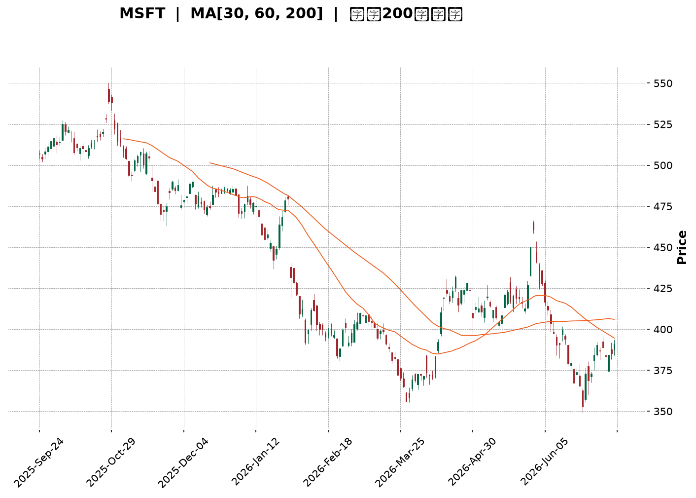
</details>

<html>
<head><meta charset="utf-8" /></head>
<body>
    <div style="height:500px; width:100%;">                        <script>window.PlotlyConfig = {MathJaxConfig: 'local'};</script>
        <script charset="utf-8" src="https://cdn.plot.ly/plotly-3.7.0.min.js" integrity="sha256-jvTGqxNp8AGWEcvNLVuKr+8j5dGe9Yw51LQkmDH+IYA=" crossorigin="anonymous"></script>                <div id="candlestick-chart" class="plotly-graph-div" style="height:100%; width:100%;"></div>            <script>                window.PLOTLYENV=window.PLOTLYENV || {};                                if (document.getElementById("candlestick-chart")) {                    Plotly.newPlot(                        "candlestick-chart",                        [{"close":{"dtype":"f8","bdata":"AAAA4Aevf0AAAADgbH1\u002fQAAAAODbw39AAAAAQMj1f0AAAADghRWAQAAAAMCDI4BAAAAAQPQDgEAAAACgwBCAQAAAAMDyaYBAAAAAgHVFgEAAAAAAYEyAQAAAACDmOIBAAAAAwOi7f0AAAADACe1\u002fQAAAAABo5X9AAAAAIC7jf0AAAABgPsZ\u002fQAAAAACR5X9AAAAAAE0MgEAAAACgNxOAQAAAAMAcKoBAAAAAgEUqgEAAAACAhEKAQAAAAGBmgYBAAAAAwETVgEAAAACAItGAQAAAAACcU4BAAAAA4GgUgEAAAACANQ6AQAAAAKB98X9AAAAA4H1\u002ff0AAAACAi99+QAAAAOAX235AAAAAYAxtf0AAAACgqJd\u002fQAAAAIDFvn9AAAAAIPZBf0AAAAAAgq9\u002fQAAAAAC9hH9AAAAAIOuqfkAAAACg3kB+QAAAACDxxH1AAAAA4G1gfUAAAABgYH59QAAAAOAArn1AAAAAYI81fkAAAABAQp1+QAAAAOBPSX5AAAAAwD19fkAAAACgyrl9QAAAAKBU631AAAAAQEkQfkAAAAAgfY1+QAAAAOBqnX5AAAAAIAPHfUAAAABgORV+QAAAAOCIxn1AAAAAIHCLfUAAAABgcqR9QAAAAEAloH1AAAAAIFkdfkAAAAAgQDx+QAAAAGBSLH5AAAAAoBBLfkAAAACAs11+QAAAAIDDWH5AAAAAAAxPfkAAAACgGVV+QAAAACCdF35AAAAAwH1tfUAAAADADmx9QAAAAGA3xn1AAAAAYDkVfkAAAAAg2L99QAAAAEB70n1AAAAAwAexfUAAAAAgVUl9QAAAAGB+lXxAAAAAoCpqfEAAAACgI518QAAAAOATSHxAAAAAgEGie0AAAADgPBJ8QAAAAKAl\u002fnxAAAAAoB5DfUAAAACAMOd9QAAAACDq931AAAAAwD\u002f5ekAAAADgHcZ6QAAAAEDjV3pAAAAAoDCWeUAAAADAqMV5QAAAAGDLfnhAAAAA4Mj1eEAAAADAQrx5QAAAAAABt3lAAAAAIDwpeUAAAABA7wB5QAAAAOCm+HhAAAAAoJuxeEAAAADgQN14QAAAAOCU2XhAAAAAwPHFeEAAAACgOfp3QAAAAICMQnhAAAAAYL\u002f7eEAAAAAAoQ15QAAAAGBCfnhAAAAAoATbeEAAAACA6TB5QAAAAEAwRXlAAAAAwK2ceUAAAADgN4F5QAAAACBniHlAAAAAICFOeUAAAABgFEB5QAAAACDdD3lAAAAAQB+reEAAAADAXvF4QAAAAKC\u002f6HhAAAAAoBdveEAAAAAg3kJ4QAAAACC30HdAAAAAoMHid0AAAABg8z53QAAAAGDPI3dAAAAAgN3SdkAAAACg+z92QAAAAIDyYnZAAAAAgOsVd0AAAADAJQl3QAAAACBySndAAAAAoC9Bd0AAAABAxDd3QAAAAABWWHdAAAAAQDhEd0AAAACAGCF3QAAAAACh+HdAAAAAoCqEeEAAAADgTKV5QAAAAMCgNXpAAAAAQAVeekAAAADgqRJ6QAAAAKDkc3pAAAAAAMD\u002fekAAAACgn+15QAAAAKA8e3pAAAAAIG5+ekAAAAAgKMV6QAAAAKCueHpAAAAAIGFueUAAAACAtdh5QAAAAACey3lAAAAA4NqneUAAAACgC9F5QAAAACDFPXpAAAAAwJDjeUAAAABgSrx5QAAAACA4bnlAAAAAIFlFeUAAAADguIh5QAAAAGAhUHpAAAAAoP5pekAAAABASQh6QAAAAGBmQnpAAAAAoHAxekAAAADAHil6QAAAAOB6AHpAAAAAYLjKeUAAAAAA1696QAAAAADXI3xAAAAA4FHIfEAAAADA9ZR7QAAAAKBwtXpAAAAAwMzAekAAAABguAp6QAAAAADXu3lAAAAAYI82eUAAAACAwtV4QAAAAKBwZXhAAAAAANdreEAAAAAAKfx4QAAAAKBHnXhAAAAAYI+ud0AAAABgZrZ3QAAAAKBw9XZAAAAAQApfd0AAAAAgXNd2QAAAAKBHDXZAAAAAIIVPd0AAAADAHgl3QAAAAOBRUHdAAAAA4HoEeEAAAAAA12d4QAAAAADXK3hAAAAAoHBNeEAAAACgcPV3QAAAAIDCBXhAAAAAoJkReEAAAAAA1294QA=="},"high":{"dtype":"f8","bdata":"stEycBPUf0Acobwuzqx\u002fQINNMhJK639AJx3\u002fH8cMgECtODorMReAQBBncNDfKYBAJdXX+IkygECMj0HntimAQEUjFiuBfYBAFWCe3LlzgEAOjMvOEV2AQIpA6d89SIBAbxGlh0dCgEDk3iK1RwmAQH\u002fWqRVMAIBAMseZGXsPgEAoDGsmxwyAQD6LDyPjAYBAHw22IXwbgEBjg2TZZxuAQCotNW1lT4BAoA+RjjhFgEBPbM6SWVCAQOlze8+5mYBAJQuauOExgUC51jhKqPaAQOepDUvTnIBAJNAOBulvgEBzv1LqP02AQIf7r5ZxAoBAmOmQiHD5f0AZS6RvR2h\u002fQPtsWKLLA39ARnevFpB6f0AYbLxISaZ\u002fQAlRfrYyx39AMqTcDkvkf0AgvzbFFcZ\u002fQITs\u002fyVazn9A4zRvegg9f0AfpBtZLcF+QHbeALAbtn5Ad5hCQ7\u002fMfUDhkGEWkqx9QOakPgZp0H1A9OaDGFJifkARard9Iqd+QF49Y7cCe35AoQ7qMP60fkBCr6JHfSF+QFFGdgj68n1Arn5N5BsUfkCjy3PB4KF+QDN3FK8Cn35AUyJ7C6YhfkD4HMOiAD5+QEHuOxD6BH5AqquAW2vpfUD\u002fo6ciV7x9QJvKMkrz3X1AWa0Ykd52fkA0g5lT\u002flp+QGwzxe8CaX5Aywc21KxafkCGfShM3G9+QKYu821LX35AjHzfTPVifkALCojMJHh+QDSuAAudX35AUMTBCi4ofkDgCXxmWZ99QIIo2DLhyX1AGK4kXXZ4fkCWbGVfUgh+QLT3jFEV231AKq2nT7jtfUCdezXUupp9QAcrM\u002fX8IX1ADkA+axHjfEA0xTjnLtJ8QCLEe1hlbHxABEUHcO0qfEBtlO0gUS18QDMe9nkuUH1AscKyp1uCfUAzVhjKqgt+QAKiyk6GGX5AtdPxT5yIe0A4+Y+Oalp7QPIc2ulIzXpAr0jJZdxCekCJFhBgBR96QHomSRLWZ3lASpE8ciMAeUCV8uEyz9B5QPx8AVXTXHpARBH4MdHpeUCX45GyYkZ5QE93pF3fO3lAPe4HiejreEBcfxc\u002fZwx5QLlU\u002fiblOHlAt6LLihX0eEBxFdWYFqh4QNY\u002fN9BLSHhA655qLKMJeUBCTzHMv2l5QJe8+wFmv3hAc7AowSoFeUBmp4r6Il15QCwi+UNEonlARnRwxIareUD0+UJLhMJ5QN3LD8sslXlAOF42EgSVeUCMPZ1QBIJ5QPOGCmrgU3lAoIrqXc0+eUBRmP\u002f6Ofx4QJkxknNqOHlAWg\u002f1xjzSeEA44kGIRHp4QCwwnzaeInhA5JWFe\u002fgleED1IdVdS9p3QG2YzvXrg3dAB2EpC5Bed0BfDu+3qpp2QFvCYzggyXZAwB9QVYFBd0DRsUta6FJ3QNftB+hRTXdA4WS1ucFOd0CwuGY1Ujp3QPZsJeyvAnhA0kWQsRVLd0Aja2hGQG13QJFeud5X+3dA599vY2SdeEBbSYFdl9d5QGMi8oqRPnpAtjB1MFvqekBO5ukvpGZ6QFzmNcQbpHpAgL1b+DMMe0D1NEn66Gt6QMPfHXSBgHpAOnV9mv2iekA27ZyR2s96QB\u002fsrltcnnpAoMKk2GPYeUDFYE8dVgN6QOgoB\u002f7tPXpAXJS1chH+eUCaI75kQBh6QGC+3ozhsHpApP+wrZobekDOVAT8xLx5QBekGtKh6XlAvOE0A+lWeUBqkYLqMq95QIGMLQzqs3pANcGAQziDekBki6jcPPx6QJrLIAsBU3pAAAAAoHClekAAAABgZoZ6QAAAAOBRPHpAAAAAQAr\u002feUAAAAAA19d6QAAAAKBHJXxAAAAAwB4lfUAAAAAAAFh8QAAAAIA9hntAAAAAYGZCe0AAAAAghdd6QAAAAGCPEnpAAAAAIK6\u002feUAAAADgo1B5QAAAAKCZzXhAAAAAANd7eEAAAAAAABx5QAAAAKBwzXhAAAAAgOtleEAAAACA69V3QAAAAIAU2ndAAAAAIIWTd0AAAACAFK53QAAAACCuw3ZAAAAAgMKJd0AAAAAAAMh3QAAAAGBmYndAAAAAoEdNeEAAAABAM4N4QAAAAGBmUnhAAAAAwB65eEAAAADA9RR4QAAAAGBmCnhAAAAAYI9+eEAAAACAPZp4QA=="},"hovertemplate":"\u003cb\u003e%{x|%Y-%m-%d}\u003c\u002fb\u003e\u003cbr\u003e\u958b: $%{open:.2f}\u003cbr\u003e\u9ad8: $%{high:.2f}\u003cbr\u003e\u4f4e: $%{low:.2f}\u003cbr\u003e\u6536: $%{close:.2f}\u003cextra\u003e\u003c\u002fextra\u003e","low":{"dtype":"f8","bdata":"6zvyIq17f0AKPQ8syV1\u002fQLgxjAPodn9A8mS9staaf0DdxkaSPad\u002fQL0OIjyEx39A2k0oL3W3f0Db6uJTJPx\u002fQJcpGaiCF4BAtSvGXEQxgEAdLRBPYj6AQFu\u002fs5EmEYBASCq0aMOmf0BvZchXW8d\u002fQNhViGMMbX9AHPP4SqWsf0D8trMU6o5\u002fQEr27J\u002fggX9A0ygBHS7jf0AGEJTX+tx\u002fQB2ahHmdE4BAr34cAsUagEC+xpbAdiuAQJqw0jlybYBAZB5ZIe\u002fKgEBw66U\u002f0aqAQFJOfyqsNoBAzIO\u002fW7v9f0ACZfyln\u002fV\u002fQPwA2stNin9A4QucE0V2f0DjcefgCMt+QAPQzCZVon5AMfvuuZL6fkBZzzwsBDN\u002fQEkAH1mp\u002f35AiW5Grikif0AyBEBo8+R+QPomquG3W39AAlee03Y7fkAXikBWqfx9QPSCKRVFln1AA6JeKhojfUBdMiPYHh99QCl1NxxD7XxAPLdYthDxfUA9ehP24Ed+QE6YOjQFKH5AHLHZU59CfkBZPMKxfZF9QBbo4P4Jpn1AFdJnGRzMfUAY9mtUuCN+QEbYIuxYZX5AittiMpSPfUDphGXyAJx9QBFqHGWmo31AHq+PBM1mfUD2cndvrUx9QClDwhZOjn1ADL7mF1e8fUB50+8JnQV+QFLsDr\u002fMCH5A92opUXQpfkA8eBQu4yp+QBvEgUfjPH5AeujapoggfkDCc9l0jzV+QENnrC+EEn5A6o73WzVBfUAvs+X1sTZ9QGlBY3StOn1AMHoEvku9fUATZgn8AJx9QMdxMjK0YX1Aql9e\u002fSKZfUBPncu2Jf58QNJf5WFKcnxASfArbQ9efECCxQWhTGd8QOCRQgic9HtASq+z28JLe0BgqQeTp6t7QFWFy0aFCHxAgvM5HTq\u002ffEDRJGL+\u002fnB9QJOSsosXvn1AkdxCQnQyekDSWtb78oh6QAAmthYMRnpAby6YX\u002fpreUCuetNjz3Z5QGotFURKaXhAzagMBtlyeECU44PMe\u002fF4QNPgwrnsrXlA9qZ4pLbzeEBFwFst7cN4QMoy\u002fUGQxHhAME7cT36MeEBewJyQAal4QFiaYvgAvXhAj77+UuWkeECBB7hAWuR3QIU+UigpzndAzPUjixFVeEDUSjpBDd54QCFONzGZUHhAyoVifJJceEAtL4dNJH14QOQx2Ake93hAlkjPd2o4eUBTTL+7CHp5QL1YSxEMKnlAu65KbfIgeUB53cqfjQt5QFvc6RN4DXlAmrP+AV6WeEBx6Z0N\u002fZ54QO4a8PE+znhAI\u002fJPvnpieEDYS79ZkyN4QM68xJ3GtHdAbiRWj67Nd0BtMOLgvTB3QFxSR3tMDXdAzLaYh2nGdkB6NCoN1Tt2QG5CYPkoOHZArSwMupCkdkCc+GHbd\u002fZ2QG4wV8rOtXZAWhrMCzkLd0Cik0vZSNx2QDO8Hpm3KXdA5v9iihvkdkAVVI9PrxN3QDw1HY19I3dAMFPzVfQaeEABTh4l9r14QLvBWiH9s3lAbfL1Nn48ekCtGTGLZ\u002fZ5QPHcehzGBHpAsR5z4hFsekAHrVVrVah5QHXO3PNr7nlAgqPrurICekCTsZyQz096QJP1GUobNnpAZJBjvGXSeEC9FMPo2Jh5QMeAsDaYnnlAtzrA9ql+eUCepMtXwEN5QFz\u002f8wquHXpAg9wbKq\u002fReUBWv\u002fZh+kl5QELkxMAtXHlArb6L4JwCeUBqr8TPNwB5QGeJliJIwHlA2LascmPreUCxXZsbcPl5QLg3LcaTpnlAAAAAIFz7eUAAAACgRwV6QAAAAOBR0HlAAAAAoEeZeUAAAABguMp5QAAAAIDCBXtAAAAA4FGkfEAAAABA4YZ7QAAAAAAAhHpAAAAAYI+mekAAAABgZuZ5QAAAAMD1iHlAAAAAIK7neEAAAABgj9J4QAAAAAAAAHhAAAAA4FHkd0AAAACgmY14QAAAAEAKa3hAAAAAwB6Vd0AAAADgelR3QAAAAMAe8XZAAAAAYLgqd0AAAADgesx2QAAAAEAz03VAAAAAQOE2dkAAAABgZn52QAAAAEAz93ZAAAAAgD1ud0AAAABAM\u002ft3QAAAACCF03dAAAAAIIVDeEAAAACgR9V3QAAAAKCZVXdAAAAAAADYd0AAAABgZgJ4QA=="},"name":"\u50f9\u683c","open":{"dtype":"f8","bdata":"EMIiErCyf0BYD0UDnpF\u002fQFfIrZaZrX9AbMYXqX7Ef0DTjLnpKOB\u002fQP2QVJH2+H9AVVrTAg8TgECzaeXYww6AQNxLYf\u002fEGoBADxf30rhngEAzVCP85D+AQPbg9gVsOIBAOTfdL\u002fUigEDk3iK1RwmAQG\u002fZGXlNsH9AmbUir4H7f0CNhKyeqtV\u002fQFiRkCdinX9ALCYS8vD1f0Cj29UP8hGAQG2YIkP2LoBAphjTQmA5gEBSy6ix\u002fzuAQCvRF4Z3g4BA5kPBKk8UgUDObp+OFeyAQCCgG6oheYBA8w\u002ffkWlsgECB4kILTySAQKsyjx+hyH9ANJNu+Rzhf0D3lKmXpGd\u002fQDUIFgYp3X5AcfDa4kkOf0Dy7Y0k+Fl\u002fQKgvkGJ4on9A7HYgCpOxf0DJFOvqgvF+QObksIAAlH9AAZ6KBQrEfkAp8pHuP3B+QA2CG65oqH5ARW\u002fegw7GfUBc9yc3To59QGjv3KZ9f31A2ZJganZCfkBvFZX1Ald+QBrXxkBkZH5A\u002fnlTcP5IfkDyEP7aVKN9QHh7yJwg2n1AAMZhXxcGfkDF5XMR2Ct+QEv1wabnbn5AN0ZB6iQefkBFFqL2RKh9QIfK31IV231A+LDMHYvffUA\u002fzRubFV19QKDZUce6rH1ALEVIZR7BfUDD9KsZMFN+QBYxbbVvP35AQfRWFUctfkCPRXdebTh+QA9w3KjVSH5AXtWijV0rfkBgktzlaDx+QKrtv53VWn5ATmzpEeEjfkAn7NnmVH99QF\u002fUaKgwe31Alkd5nyDafUDhbOfIs\u002fF9QAp2TOtUf31ASU\u002fZIuiofUAG5QUuNYl9QF0ER25FBn1AtMydR\u002f\u002fgfECgVC2dzXx8QBRjWw2DE3xAK3Rqcn4pfECrXUbMKtp7QHXFOZHdHXxALCc+wfPzfEA+B\u002fcPmXl9QLE0ug4VEX5ARXK35KBge0AuapAdkVN7QMBzSf5RxXpAFwSkXzlCekBtedFt2JJ5QD71SzAjWnlAn\u002fZbhmfWeEC+Ntql4TB5QDodgE8nHHpA2MmsZ1vleUAoO1k9RTN5QE7C7IiCKnlAclKJZDPXeECxbf1x1sV4QKZ5bUIv\u002fXhARwwsChC0eECT\u002fqNIV6J4QCJcgAX19HdAFkSoxPlaeEBwViiIXT15QIqDC1eQYHhAYPrEviyAeECijGdEpYR4QIUmS6pxBnlANvJwSrw4eUCQzRDgDIV5QB7TP9+3QHlAeMB9M02SeUCOWlKEGEt5QJxzoZoWPHlAk9NWQSICeUCjHHnkWtN4QATrFIN69nhANdyI+ljEeEAzDHVQHFR4QLSjfvJDH3hAAEB6CCDxd0A5lCa3idh3QLosCNOvgXdAAPMkMUwgd0CBlGK24pF2QEdiZLnikXZAyeocoDG8dkAvu2HH7Ep3QPokxHOp5nZAe0+luexKd0B3RRlDohh3QNC9cTleAnhAqsC7ix47d0CMz2FyyEJ3QP1Yyz\u002fXTHdAtVpHcU4xeED+6xPHPNJ4QCzLhso9L3pAePuvJ25+ekDgMy481kN6QN1gZPNONXpA35ifc02UekDHjd15uC96QNoVYvgZAXpA1yR+eXlXekCPQNFNcHp6QMSIEBCZenpA10mHLcGeeUDj65WEhr55QKVIqMloqnlAvmNLP8LmeUBuH3lC5HF5QKsTrpc7M3pAuge7p84HekDdzRfn0G95QIJPn\u002flY2XlAJO\u002fwCkIleUCIS4aRsTl5QPvTkpj+1XlA85bVgYP7eUCvVgbGiM96QKyuHP5l1HlAAAAAAACMekAAAADgozh6QAAAAEDhBnpAAAAAACmweUAAAAAgrs95QAAAAMDMCHtAAAAAoHANfUAAAACAFO57QAAAAEAzZ3tAAAAAwPU8e0AAAACgcMV6QAAAAIA94nlAAAAA4HqQeUAAAADAzOh4QAAAACBcs3hAAAAAQOF2eEAAAADAzMx4QAAAAOCjvHhAAAAAAABkeEAAAADAHp13QAAAAADXe3dAAAAAgBRGd0AAAADAHjl3QAAAAOBRrHZAAAAAYGZSdkAAAAAAAJh3QAAAAOB6MHdAAAAAoEfNd0AAAAAgrgd4QAAAAOCjMHhAAAAAANeHeEAAAADgegB4QAAAAEAzZ3dAAAAAwMw8eEAAAACgmTt4QA=="},"x":["2025-09-24T00:00:00-04:00","2025-09-25T00:00:00-04:00","2025-09-26T00:00:00-04:00","2025-09-29T00:00:00-04:00","2025-09-30T00:00:00-04:00","2025-10-01T00:00:00-04:00","2025-10-02T00:00:00-04:00","2025-10-03T00:00:00-04:00","2025-10-06T00:00:00-04:00","2025-10-07T00:00:00-04:00","2025-10-08T00:00:00-04:00","2025-10-09T00:00:00-04:00","2025-10-10T00:00:00-04:00","2025-10-13T00:00:00-04:00","2025-10-14T00:00:00-04:00","2025-10-15T00:00:00-04:00","2025-10-16T00:00:00-04:00","2025-10-17T00:00:00-04:00","2025-10-20T00:00:00-04:00","2025-10-21T00:00:00-04:00","2025-10-22T00:00:00-04:00","2025-10-23T00:00:00-04:00","2025-10-24T00:00:00-04:00","2025-10-27T00:00:00-04:00","2025-10-28T00:00:00-04:00","2025-10-29T00:00:00-04:00","2025-10-30T00:00:00-04:00","2025-10-31T00:00:00-04:00","2025-11-03T00:00:00-05:00","2025-11-04T00:00:00-05:00","2025-11-05T00:00:00-05:00","2025-11-06T00:00:00-05:00","2025-11-07T00:00:00-05:00","2025-11-10T00:00:00-05:00","2025-11-11T00:00:00-05:00","2025-11-12T00:00:00-05:00","2025-11-13T00:00:00-05:00","2025-11-14T00:00:00-05:00","2025-11-17T00:00:00-05:00","2025-11-18T00:00:00-05:00","2025-11-19T00:00:00-05:00","2025-11-20T00:00:00-05:00","2025-11-21T00:00:00-05:00","2025-11-24T00:00:00-05:00","2025-11-25T00:00:00-05:00","2025-11-26T00:00:00-05:00","2025-11-28T00:00:00-05:00","2025-12-01T00:00:00-05:00","2025-12-02T00:00:00-05:00","2025-12-03T00:00:00-05:00","2025-12-04T00:00:00-05:00","2025-12-05T00:00:00-05:00","2025-12-08T00:00:00-05:00","2025-12-09T00:00:00-05:00","2025-12-10T00:00:00-05:00","2025-12-11T00:00:00-05:00","2025-12-12T00:00:00-05:00","2025-12-15T00:00:00-05:00","2025-12-16T00:00:00-05:00","2025-12-17T00:00:00-05:00","2025-12-18T00:00:00-05:00","2025-12-19T00:00:00-05:00","2025-12-22T00:00:00-05:00","2025-12-23T00:00:00-05:00","2025-12-24T00:00:00-05:00","2025-12-26T00:00:00-05:00","2025-12-29T00:00:00-05:00","2025-12-30T00:00:00-05:00","2025-12-31T00:00:00-05:00","2026-01-02T00:00:00-05:00","2026-01-05T00:00:00-05:00","2026-01-06T00:00:00-05:00","2026-01-07T00:00:00-05:00","2026-01-08T00:00:00-05:00","2026-01-09T00:00:00-05:00","2026-01-12T00:00:00-05:00","2026-01-13T00:00:00-05:00","2026-01-14T00:00:00-05:00","2026-01-15T00:00:00-05:00","2026-01-16T00:00:00-05:00","2026-01-20T00:00:00-05:00","2026-01-21T00:00:00-05:00","2026-01-22T00:00:00-05:00","2026-01-23T00:00:00-05:00","2026-01-26T00:00:00-05:00","2026-01-27T00:00:00-05:00","2026-01-28T00:00:00-05:00","2026-01-29T00:00:00-05:00","2026-01-30T00:00:00-05:00","2026-02-02T00:00:00-05:00","2026-02-03T00:00:00-05:00","2026-02-04T00:00:00-05:00","2026-02-05T00:00:00-05:00","2026-02-06T00:00:00-05:00","2026-02-09T00:00:00-05:00","2026-02-10T00:00:00-05:00","2026-02-11T00:00:00-05:00","2026-02-12T00:00:00-05:00","2026-02-13T00:00:00-05:00","2026-02-17T00:00:00-05:00","2026-02-18T00:00:00-05:00","2026-02-19T00:00:00-05:00","2026-02-20T00:00:00-05:00","2026-02-23T00:00:00-05:00","2026-02-24T00:00:00-05:00","2026-02-25T00:00:00-05:00","2026-02-26T00:00:00-05:00","2026-02-27T00:00:00-05:00","2026-03-02T00:00:00-05:00","2026-03-03T00:00:00-05:00","2026-03-04T00:00:00-05:00","2026-03-05T00:00:00-05:00","2026-03-06T00:00:00-05:00","2026-03-09T00:00:00-04:00","2026-03-10T00:00:00-04:00","2026-03-11T00:00:00-04:00","2026-03-12T00:00:00-04:00","2026-03-13T00:00:00-04:00","2026-03-16T00:00:00-04:00","2026-03-17T00:00:00-04:00","2026-03-18T00:00:00-04:00","2026-03-19T00:00:00-04:00","2026-03-20T00:00:00-04:00","2026-03-23T00:00:00-04:00","2026-03-24T00:00:00-04:00","2026-03-25T00:00:00-04:00","2026-03-26T00:00:00-04:00","2026-03-27T00:00:00-04:00","2026-03-30T00:00:00-04:00","2026-03-31T00:00:00-04:00","2026-04-01T00:00:00-04:00","2026-04-02T00:00:00-04:00","2026-04-06T00:00:00-04:00","2026-04-07T00:00:00-04:00","2026-04-08T00:00:00-04:00","2026-04-09T00:00:00-04:00","2026-04-10T00:00:00-04:00","2026-04-13T00:00:00-04:00","2026-04-14T00:00:00-04:00","2026-04-15T00:00:00-04:00","2026-04-16T00:00:00-04:00","2026-04-17T00:00:00-04:00","2026-04-20T00:00:00-04:00","2026-04-21T00:00:00-04:00","2026-04-22T00:00:00-04:00","2026-04-23T00:00:00-04:00","2026-04-24T00:00:00-04:00","2026-04-27T00:00:00-04:00","2026-04-28T00:00:00-04:00","2026-04-29T00:00:00-04:00","2026-04-30T00:00:00-04:00","2026-05-01T00:00:00-04:00","2026-05-04T00:00:00-04:00","2026-05-05T00:00:00-04:00","2026-05-06T00:00:00-04:00","2026-05-07T00:00:00-04:00","2026-05-08T00:00:00-04:00","2026-05-11T00:00:00-04:00","2026-05-12T00:00:00-04:00","2026-05-13T00:00:00-04:00","2026-05-14T00:00:00-04:00","2026-05-15T00:00:00-04:00","2026-05-18T00:00:00-04:00","2026-05-19T00:00:00-04:00","2026-05-20T00:00:00-04:00","2026-05-21T00:00:00-04:00","2026-05-22T00:00:00-04:00","2026-05-26T00:00:00-04:00","2026-05-27T00:00:00-04:00","2026-05-28T00:00:00-04:00","2026-05-29T00:00:00-04:00","2026-06-01T00:00:00-04:00","2026-06-02T00:00:00-04:00","2026-06-03T00:00:00-04:00","2026-06-04T00:00:00-04:00","2026-06-05T00:00:00-04:00","2026-06-08T00:00:00-04:00","2026-06-09T00:00:00-04:00","2026-06-10T00:00:00-04:00","2026-06-11T00:00:00-04:00","2026-06-12T00:00:00-04:00","2026-06-15T00:00:00-04:00","2026-06-16T00:00:00-04:00","2026-06-17T00:00:00-04:00","2026-06-18T00:00:00-04:00","2026-06-22T00:00:00-04:00","2026-06-23T00:00:00-04:00","2026-06-24T00:00:00-04:00","2026-06-25T00:00:00-04:00","2026-06-26T00:00:00-04:00","2026-06-29T00:00:00-04:00","2026-06-30T00:00:00-04:00","2026-07-01T00:00:00-04:00","2026-07-02T00:00:00-04:00","2026-07-06T00:00:00-04:00","2026-07-07T00:00:00-04:00","2026-07-08T00:00:00-04:00","2026-07-09T00:00:00-04:00","2026-07-10T00:00:00-04:00","2026-07-13T00:00:00-04:00"],"type":"candlestick"},{"hovertemplate":"MA30: $%{y:.2f}\u003cextra\u003e\u003c\u002fextra\u003e","line":{"color":"#2196F3","dash":"dash","width":2},"mode":"lines","name":"MA30","x":["2025-09-24T00:00:00-04:00","2025-09-25T00:00:00-04:00","2025-09-26T00:00:00-04:00","2025-09-29T00:00:00-04:00","2025-09-30T00:00:00-04:00","2025-10-01T00:00:00-04:00","2025-10-02T00:00:00-04:00","2025-10-03T00:00:00-04:00","2025-10-06T00:00:00-04:00","2025-10-07T00:00:00-04:00","2025-10-08T00:00:00-04:00","2025-10-09T00:00:00-04:00","2025-10-10T00:00:00-04:00","2025-10-13T00:00:00-04:00","2025-10-14T00:00:00-04:00","2025-10-15T00:00:00-04:00","2025-10-16T00:00:00-04:00","2025-10-17T00:00:00-04:00","2025-10-20T00:00:00-04:00","2025-10-21T00:00:00-04:00","2025-10-22T00:00:00-04:00","2025-10-23T00:00:00-04:00","2025-10-24T00:00:00-04:00","2025-10-27T00:00:00-04:00","2025-10-28T00:00:00-04:00","2025-10-29T00:00:00-04:00","2025-10-30T00:00:00-04:00","2025-10-31T00:00:00-04:00","2025-11-03T00:00:00-05:00","2025-11-04T00:00:00-05:00","2025-11-05T00:00:00-05:00","2025-11-06T00:00:00-05:00","2025-11-07T00:00:00-05:00","2025-11-10T00:00:00-05:00","2025-11-11T00:00:00-05:00","2025-11-12T00:00:00-05:00","2025-11-13T00:00:00-05:00","2025-11-14T00:00:00-05:00","2025-11-17T00:00:00-05:00","2025-11-18T00:00:00-05:00","2025-11-19T00:00:00-05:00","2025-11-20T00:00:00-05:00","2025-11-21T00:00:00-05:00","2025-11-24T00:00:00-05:00","2025-11-25T00:00:00-05:00","2025-11-26T00:00:00-05:00","2025-11-28T00:00:00-05:00","2025-12-01T00:00:00-05:00","2025-12-02T00:00:00-05:00","2025-12-03T00:00:00-05:00","2025-12-04T00:00:00-05:00","2025-12-05T00:00:00-05:00","2025-12-08T00:00:00-05:00","2025-12-09T00:00:00-05:00","2025-12-10T00:00:00-05:00","2025-12-11T00:00:00-05:00","2025-12-12T00:00:00-05:00","2025-12-15T00:00:00-05:00","2025-12-16T00:00:00-05:00","2025-12-17T00:00:00-05:00","2025-12-18T00:00:00-05:00","2025-12-19T00:00:00-05:00","2025-12-22T00:00:00-05:00","2025-12-23T00:00:00-05:00","2025-12-24T00:00:00-05:00","2025-12-26T00:00:00-05:00","2025-12-29T00:00:00-05:00","2025-12-30T00:00:00-05:00","2025-12-31T00:00:00-05:00","2026-01-02T00:00:00-05:00","2026-01-05T00:00:00-05:00","2026-01-06T00:00:00-05:00","2026-01-07T00:00:00-05:00","2026-01-08T00:00:00-05:00","2026-01-09T00:00:00-05:00","2026-01-12T00:00:00-05:00","2026-01-13T00:00:00-05:00","2026-01-14T00:00:00-05:00","2026-01-15T00:00:00-05:00","2026-01-16T00:00:00-05:00","2026-01-20T00:00:00-05:00","2026-01-21T00:00:00-05:00","2026-01-22T00:00:00-05:00","2026-01-23T00:00:00-05:00","2026-01-26T00:00:00-05:00","2026-01-27T00:00:00-05:00","2026-01-28T00:00:00-05:00","2026-01-29T00:00:00-05:00","2026-01-30T00:00:00-05:00","2026-02-02T00:00:00-05:00","2026-02-03T00:00:00-05:00","2026-02-04T00:00:00-05:00","2026-02-05T00:00:00-05:00","2026-02-06T00:00:00-05:00","2026-02-09T00:00:00-05:00","2026-02-10T00:00:00-05:00","2026-02-11T00:00:00-05:00","2026-02-12T00:00:00-05:00","2026-02-13T00:00:00-05:00","2026-02-17T00:00:00-05:00","2026-02-18T00:00:00-05:00","2026-02-19T00:00:00-05:00","2026-02-20T00:00:00-05:00","2026-02-23T00:00:00-05:00","2026-02-24T00:00:00-05:00","2026-02-25T00:00:00-05:00","2026-02-26T00:00:00-05:00","2026-02-27T00:00:00-05:00","2026-03-02T00:00:00-05:00","2026-03-03T00:00:00-05:00","2026-03-04T00:00:00-05:00","2026-03-05T00:00:00-05:00","2026-03-06T00:00:00-05:00","2026-03-09T00:00:00-04:00","2026-03-10T00:00:00-04:00","2026-03-11T00:00:00-04:00","2026-03-12T00:00:00-04:00","2026-03-13T00:00:00-04:00","2026-03-16T00:00:00-04:00","2026-03-17T00:00:00-04:00","2026-03-18T00:00:00-04:00","2026-03-19T00:00:00-04:00","2026-03-20T00:00:00-04:00","2026-03-23T00:00:00-04:00","2026-03-24T00:00:00-04:00","2026-03-25T00:00:00-04:00","2026-03-26T00:00:00-04:00","2026-03-27T00:00:00-04:00","2026-03-30T00:00:00-04:00","2026-03-31T00:00:00-04:00","2026-04-01T00:00:00-04:00","2026-04-02T00:00:00-04:00","2026-04-06T00:00:00-04:00","2026-04-07T00:00:00-04:00","2026-04-08T00:00:00-04:00","2026-04-09T00:00:00-04:00","2026-04-10T00:00:00-04:00","2026-04-13T00:00:00-04:00","2026-04-14T00:00:00-04:00","2026-04-15T00:00:00-04:00","2026-04-16T00:00:00-04:00","2026-04-17T00:00:00-04:00","2026-04-20T00:00:00-04:00","2026-04-21T00:00:00-04:00","2026-04-22T00:00:00-04:00","2026-04-23T00:00:00-04:00","2026-04-24T00:00:00-04:00","2026-04-27T00:00:00-04:00","2026-04-28T00:00:00-04:00","2026-04-29T00:00:00-04:00","2026-04-30T00:00:00-04:00","2026-05-01T00:00:00-04:00","2026-05-04T00:00:00-04:00","2026-05-05T00:00:00-04:00","2026-05-06T00:00:00-04:00","2026-05-07T00:00:00-04:00","2026-05-08T00:00:00-04:00","2026-05-11T00:00:00-04:00","2026-05-12T00:00:00-04:00","2026-05-13T00:00:00-04:00","2026-05-14T00:00:00-04:00","2026-05-15T00:00:00-04:00","2026-05-18T00:00:00-04:00","2026-05-19T00:00:00-04:00","2026-05-20T00:00:00-04:00","2026-05-21T00:00:00-04:00","2026-05-22T00:00:00-04:00","2026-05-26T00:00:00-04:00","2026-05-27T00:00:00-04:00","2026-05-28T00:00:00-04:00","2026-05-29T00:00:00-04:00","2026-06-01T00:00:00-04:00","2026-06-02T00:00:00-04:00","2026-06-03T00:00:00-04:00","2026-06-04T00:00:00-04:00","2026-06-05T00:00:00-04:00","2026-06-08T00:00:00-04:00","2026-06-09T00:00:00-04:00","2026-06-10T00:00:00-04:00","2026-06-11T00:00:00-04:00","2026-06-12T00:00:00-04:00","2026-06-15T00:00:00-04:00","2026-06-16T00:00:00-04:00","2026-06-17T00:00:00-04:00","2026-06-18T00:00:00-04:00","2026-06-22T00:00:00-04:00","2026-06-23T00:00:00-04:00","2026-06-24T00:00:00-04:00","2026-06-25T00:00:00-04:00","2026-06-26T00:00:00-04:00","2026-06-29T00:00:00-04:00","2026-06-30T00:00:00-04:00","2026-07-01T00:00:00-04:00","2026-07-02T00:00:00-04:00","2026-07-06T00:00:00-04:00","2026-07-07T00:00:00-04:00","2026-07-08T00:00:00-04:00","2026-07-09T00:00:00-04:00","2026-07-10T00:00:00-04:00","2026-07-13T00:00:00-04:00"],"y":{"dtype":"f8","bdata":"AAAAAAAA+H8AAAAAAAD4fwAAAAAAAPh\u002fAAAAAAAA+H8AAAAAAAD4fwAAAAAAAPh\u002fAAAAAAAA+H8AAAAAAAD4fwAAAAAAAPh\u002fAAAAAAAA+H8AAAAAAAD4fwAAAAAAAPh\u002fAAAAAAAA+H8AAAAAAAD4fwAAAAAAAPh\u002fAAAAAAAA+H8AAAAAAAD4fwAAAAAAAPh\u002fAAAAAAAA+H8AAAAAAAD4fwAAAAAAAPh\u002fAAAAAAAA+H8AAAAAAAD4fwAAAAAAAPh\u002fAAAAAAAA+H8AAAAAAAD4fwAAAAAAAPh\u002fAAAAAAAA+H8AAAAAAAD4f7y7u\u002fuTIIBAZmZmJskfgEDv7u6GJx2AQM3MzGRGGYBA7+7u\u002fv4WgEDNzMwkihSAQO\u002fu7sZEEoBARERENPgOgEARERHREQ2AQO\u002fu7s57B4BA7+7unvf+f0BERESk+Op\u002fQJqZmYkk1H9Ad3d31wbAf0BmZmZ2Rat\u002fQAAAAKBbmH9AiYiIiAmKf0AzMzNDI4B\u002fQLy7u1tlcn9AVVVVFa9kf0De3d3t\u002fk9\u002fQERERMRuO39A3t3dPRcof0AAAABQThd\u002fQN7d3R3cAn9AiYiI+KzhfkCJiIjIX8N+QJqZmWnRqn5AvLu7W4GUfkCamZmJcH9+QDMzM1Opa35AzczMTNtffkCrqqraaVp+QImIiHiWVH5AIiIi8utKfkB3d3fXdEB+QHd3d9eFNH5AiYiI+GwsfkBVVVX14CB+QKuqqjq1FH5AREREhCAKfkBVVVWFCAN+QFVVVWUTA35A3t3dLRoJfkBmZmbWSAt+QN7d3R2ADH5AIiIiMhUIfkDe3d19wPx9QCIiIoI57n1AvLu7q4XcfUAzMzOjCNN9QDMzMwMPxX1AVVVVBVOwfUBmZmY2Jpt9QCIiIpJOjX1AZmZmFumIfUAiIiJCYId9QCIiIqIFiX1AZmZmFhVzfUDe3d3Nmlp9QKuqqpqYPn1A7+7uHvUXfUAiIiIC3\u002fF8QDMzM5NrwXxA7+7uLumTfEDNzMxsZWx8QBEREfHeRHxAzczMnPEYfEC8u7u7eOt7QLy7u9vFv3tAREREdGCXe0CamZm5e3B7QO\u002fu7k52RntA7+7uHicZe0Crqqoa5ud6QGZmZjZvuHpAIiIiIkKQekB3d3eHImx6QBERESE6SXpA7+7u\u002ftoqekC8u7vbpQ16QKuqqprz83lAIiIi8rLieUARERFhzMx5QHd3dwdGr3lAiYiI2IGNeUBVVVW1zWV5QImIiGjvO3lAiYiIqEMoeUAAAACwoxh5QERERMRmDHlAmpmZmZACeUCrqqr6q\u002fV4QBEREYHe73hAiYiImLPmeEB3d3c3ddF4QImIiBh8u3hAIiIiAoqneEC8u7trCpB4QAAAAOD7eXhA3t3dzUJseEDNzMxMqFx4QHd3d1daT3hAAAAA8GRCeEDv7u6O6Tt4QBEREfEaNHhA3t3dTXQleECrqqpaCRV4QKuqqgqVEHhAiYiI6K8NeEBmZmYWkRF4QGZmZtaUGXhAAAAAsAYgeEAiIiLS3yR4QGZmZla5LHhAERERkS07eECamZl59kB4QCIiIkITTXhARERE9KZceEC8u7u7Pmx4QAAAAICTeXhAMzMz8xWCeEAREREhnY94QBEREbGCoHhAIiIiIp2veEAAAADgjMV4QAAAAAAE4HhAvLu7Gyz6eEB3d3d36hd5QBEREUHkMXlAq6qqCopEeUDv7u6+21l5QKuqqtqlc3lAAAAAsJuOeUDv7u4eoKZ5QImIiIh+v3lAERER4XfYeUBERET0VfJ5QERERASqA3pAvLu7m4wOekBEREQUbxd6QKuqqlroJ3pAIiIigoQ8ekB3d3fnZEl6QM3MzDyUS3pAAAAAEHtJekCrqqpac0p6QJqZmRkSRHpAZmZmRiQ5ekAzMzPjoCh6QO\u002fu7p7rFnpAq6qqak0OekBmZmZm8wZ6QERERHTf\u002fHlAq6qqmgfseUCamZkpE9p5QImIiFgQvnlAVVVVZZSoeUCamZnJ4Y95QImIiPgMc3lAREREtFJieUBERETEAE15QImIiMhoM3lAVVVVdfUeeUCJiIjIExF5QERERDRC\u002f3hAIiIiEiDveEAAAAAAVtx4QM3MzPxxy3hAMzMzw728eEAAAACQiql4QA=="},"type":"scatter"},{"hovertemplate":"MA60: $%{y:.2f}\u003cextra\u003e\u003c\u002fextra\u003e","line":{"color":"#9C27B0","dash":"dash","width":2},"mode":"lines","name":"MA60","x":["2025-09-24T00:00:00-04:00","2025-09-25T00:00:00-04:00","2025-09-26T00:00:00-04:00","2025-09-29T00:00:00-04:00","2025-09-30T00:00:00-04:00","2025-10-01T00:00:00-04:00","2025-10-02T00:00:00-04:00","2025-10-03T00:00:00-04:00","2025-10-06T00:00:00-04:00","2025-10-07T00:00:00-04:00","2025-10-08T00:00:00-04:00","2025-10-09T00:00:00-04:00","2025-10-10T00:00:00-04:00","2025-10-13T00:00:00-04:00","2025-10-14T00:00:00-04:00","2025-10-15T00:00:00-04:00","2025-10-16T00:00:00-04:00","2025-10-17T00:00:00-04:00","2025-10-20T00:00:00-04:00","2025-10-21T00:00:00-04:00","2025-10-22T00:00:00-04:00","2025-10-23T00:00:00-04:00","2025-10-24T00:00:00-04:00","2025-10-27T00:00:00-04:00","2025-10-28T00:00:00-04:00","2025-10-29T00:00:00-04:00","2025-10-30T00:00:00-04:00","2025-10-31T00:00:00-04:00","2025-11-03T00:00:00-05:00","2025-11-04T00:00:00-05:00","2025-11-05T00:00:00-05:00","2025-11-06T00:00:00-05:00","2025-11-07T00:00:00-05:00","2025-11-10T00:00:00-05:00","2025-11-11T00:00:00-05:00","2025-11-12T00:00:00-05:00","2025-11-13T00:00:00-05:00","2025-11-14T00:00:00-05:00","2025-11-17T00:00:00-05:00","2025-11-18T00:00:00-05:00","2025-11-19T00:00:00-05:00","2025-11-20T00:00:00-05:00","2025-11-21T00:00:00-05:00","2025-11-24T00:00:00-05:00","2025-11-25T00:00:00-05:00","2025-11-26T00:00:00-05:00","2025-11-28T00:00:00-05:00","2025-12-01T00:00:00-05:00","2025-12-02T00:00:00-05:00","2025-12-03T00:00:00-05:00","2025-12-04T00:00:00-05:00","2025-12-05T00:00:00-05:00","2025-12-08T00:00:00-05:00","2025-12-09T00:00:00-05:00","2025-12-10T00:00:00-05:00","2025-12-11T00:00:00-05:00","2025-12-12T00:00:00-05:00","2025-12-15T00:00:00-05:00","2025-12-16T00:00:00-05:00","2025-12-17T00:00:00-05:00","2025-12-18T00:00:00-05:00","2025-12-19T00:00:00-05:00","2025-12-22T00:00:00-05:00","2025-12-23T00:00:00-05:00","2025-12-24T00:00:00-05:00","2025-12-26T00:00:00-05:00","2025-12-29T00:00:00-05:00","2025-12-30T00:00:00-05:00","2025-12-31T00:00:00-05:00","2026-01-02T00:00:00-05:00","2026-01-05T00:00:00-05:00","2026-01-06T00:00:00-05:00","2026-01-07T00:00:00-05:00","2026-01-08T00:00:00-05:00","2026-01-09T00:00:00-05:00","2026-01-12T00:00:00-05:00","2026-01-13T00:00:00-05:00","2026-01-14T00:00:00-05:00","2026-01-15T00:00:00-05:00","2026-01-16T00:00:00-05:00","2026-01-20T00:00:00-05:00","2026-01-21T00:00:00-05:00","2026-01-22T00:00:00-05:00","2026-01-23T00:00:00-05:00","2026-01-26T00:00:00-05:00","2026-01-27T00:00:00-05:00","2026-01-28T00:00:00-05:00","2026-01-29T00:00:00-05:00","2026-01-30T00:00:00-05:00","2026-02-02T00:00:00-05:00","2026-02-03T00:00:00-05:00","2026-02-04T00:00:00-05:00","2026-02-05T00:00:00-05:00","2026-02-06T00:00:00-05:00","2026-02-09T00:00:00-05:00","2026-02-10T00:00:00-05:00","2026-02-11T00:00:00-05:00","2026-02-12T00:00:00-05:00","2026-02-13T00:00:00-05:00","2026-02-17T00:00:00-05:00","2026-02-18T00:00:00-05:00","2026-02-19T00:00:00-05:00","2026-02-20T00:00:00-05:00","2026-02-23T00:00:00-05:00","2026-02-24T00:00:00-05:00","2026-02-25T00:00:00-05:00","2026-02-26T00:00:00-05:00","2026-02-27T00:00:00-05:00","2026-03-02T00:00:00-05:00","2026-03-03T00:00:00-05:00","2026-03-04T00:00:00-05:00","2026-03-05T00:00:00-05:00","2026-03-06T00:00:00-05:00","2026-03-09T00:00:00-04:00","2026-03-10T00:00:00-04:00","2026-03-11T00:00:00-04:00","2026-03-12T00:00:00-04:00","2026-03-13T00:00:00-04:00","2026-03-16T00:00:00-04:00","2026-03-17T00:00:00-04:00","2026-03-18T00:00:00-04:00","2026-03-19T00:00:00-04:00","2026-03-20T00:00:00-04:00","2026-03-23T00:00:00-04:00","2026-03-24T00:00:00-04:00","2026-03-25T00:00:00-04:00","2026-03-26T00:00:00-04:00","2026-03-27T00:00:00-04:00","2026-03-30T00:00:00-04:00","2026-03-31T00:00:00-04:00","2026-04-01T00:00:00-04:00","2026-04-02T00:00:00-04:00","2026-04-06T00:00:00-04:00","2026-04-07T00:00:00-04:00","2026-04-08T00:00:00-04:00","2026-04-09T00:00:00-04:00","2026-04-10T00:00:00-04:00","2026-04-13T00:00:00-04:00","2026-04-14T00:00:00-04:00","2026-04-15T00:00:00-04:00","2026-04-16T00:00:00-04:00","2026-04-17T00:00:00-04:00","2026-04-20T00:00:00-04:00","2026-04-21T00:00:00-04:00","2026-04-22T00:00:00-04:00","2026-04-23T00:00:00-04:00","2026-04-24T00:00:00-04:00","2026-04-27T00:00:00-04:00","2026-04-28T00:00:00-04:00","2026-04-29T00:00:00-04:00","2026-04-30T00:00:00-04:00","2026-05-01T00:00:00-04:00","2026-05-04T00:00:00-04:00","2026-05-05T00:00:00-04:00","2026-05-06T00:00:00-04:00","2026-05-07T00:00:00-04:00","2026-05-08T00:00:00-04:00","2026-05-11T00:00:00-04:00","2026-05-12T00:00:00-04:00","2026-05-13T00:00:00-04:00","2026-05-14T00:00:00-04:00","2026-05-15T00:00:00-04:00","2026-05-18T00:00:00-04:00","2026-05-19T00:00:00-04:00","2026-05-20T00:00:00-04:00","2026-05-21T00:00:00-04:00","2026-05-22T00:00:00-04:00","2026-05-26T00:00:00-04:00","2026-05-27T00:00:00-04:00","2026-05-28T00:00:00-04:00","2026-05-29T00:00:00-04:00","2026-06-01T00:00:00-04:00","2026-06-02T00:00:00-04:00","2026-06-03T00:00:00-04:00","2026-06-04T00:00:00-04:00","2026-06-05T00:00:00-04:00","2026-06-08T00:00:00-04:00","2026-06-09T00:00:00-04:00","2026-06-10T00:00:00-04:00","2026-06-11T00:00:00-04:00","2026-06-12T00:00:00-04:00","2026-06-15T00:00:00-04:00","2026-06-16T00:00:00-04:00","2026-06-17T00:00:00-04:00","2026-06-18T00:00:00-04:00","2026-06-22T00:00:00-04:00","2026-06-23T00:00:00-04:00","2026-06-24T00:00:00-04:00","2026-06-25T00:00:00-04:00","2026-06-26T00:00:00-04:00","2026-06-29T00:00:00-04:00","2026-06-30T00:00:00-04:00","2026-07-01T00:00:00-04:00","2026-07-02T00:00:00-04:00","2026-07-06T00:00:00-04:00","2026-07-07T00:00:00-04:00","2026-07-08T00:00:00-04:00","2026-07-09T00:00:00-04:00","2026-07-10T00:00:00-04:00","2026-07-13T00:00:00-04:00"],"y":{"dtype":"f8","bdata":"AAAAAAAA+H8AAAAAAAD4fwAAAAAAAPh\u002fAAAAAAAA+H8AAAAAAAD4fwAAAAAAAPh\u002fAAAAAAAA+H8AAAAAAAD4fwAAAAAAAPh\u002fAAAAAAAA+H8AAAAAAAD4fwAAAAAAAPh\u002fAAAAAAAA+H8AAAAAAAD4fwAAAAAAAPh\u002fAAAAAAAA+H8AAAAAAAD4fwAAAAAAAPh\u002fAAAAAAAA+H8AAAAAAAD4fwAAAAAAAPh\u002fAAAAAAAA+H8AAAAAAAD4fwAAAAAAAPh\u002fAAAAAAAA+H8AAAAAAAD4fwAAAAAAAPh\u002fAAAAAAAA+H8AAAAAAAD4fwAAAAAAAPh\u002fAAAAAAAA+H8AAAAAAAD4fwAAAAAAAPh\u002fAAAAAAAA+H8AAAAAAAD4fwAAAAAAAPh\u002fAAAAAAAA+H8AAAAAAAD4fwAAAAAAAPh\u002fAAAAAAAA+H8AAAAAAAD4fwAAAAAAAPh\u002fAAAAAAAA+H8AAAAAAAD4fwAAAAAAAPh\u002fAAAAAAAA+H8AAAAAAAD4fwAAAAAAAPh\u002fAAAAAAAA+H8AAAAAAAD4fwAAAAAAAPh\u002fAAAAAAAA+H8AAAAAAAD4fwAAAAAAAPh\u002fAAAAAAAA+H8AAAAAAAD4fwAAAAAAAPh\u002fAAAAAAAA+H8AAAAAAAD4f1VVVaVoVn9AzczMzLZPf0BERER0XEp\u002fQBEREaGRQ39AAAAA+HQ8f0CJiIiQxDR\u002fQKuqqrKHLH9AiYiIsC4lf0C8u7tLgh1\u002fQERERGzWEX9AmpmZEYwEf0DNzMyUAPd+QHd3d\u002feb635Aq6qqgpDkfkBmZmYmR9t+QO\u002fu7t5t0n5AVVVVXQ\u002fJfkCJiIjgcb5+QO\u002fu7m5PsH5AiYiIYJqgfkCJiIjIg5F+QLy7u+M+gH5AmpmZITVsfkAzMzNDOll+QAAAAFgVSH5Ad3d3B0s1fkBVVVUFYCV+QN7d3YXrGX5AEREROcsDfkC8u7urBe19QO\u002fu7vYg1X1A3t3dNei7fUBmZmZuJKZ9QN7d3QUBi31AiYiIkGpvfUAiIiIibVZ9QERERGSyPH1Aq6qqSq8ifUCJiIjYLAZ9QDMzM4s96nxAREREfMDQfEB3d3cfwrl8QCIiItrEpHxAZmZmpiCRfECJiIh4l3l8QCIiIqp3YnxAIiIiqitMfECrqqqCcTR8QJqZmdG5G3xAVVVVVbADfEB3d3c\u002fV\u002fB7QO\u002fu7k6B3HtAvLu7+4LJe0C8u7tL+bN7QM3MzExKnntAd3d3dzWLe0C8u7v7lnZ7QFVVVYV6YntAd3d3X6xNe0Dv7u4+nzl7QHd3d69\u002fJXtARERE3EINe0BmZmZ+xfN6QCIiIgql2HpAvLu7Y069ekAiIiJS7Z56QM3MzIQtgHpAd3d3zz1gekC8u7uTwT16QN7d3d3gHHpAERERodEBekAzMzMDkuZ5QDMzM1PoynlAd3d3B8ateUDNzMzU55F5QLy7uxNFdnlAAAAAONtaeUARERHxlUB5QN7d3ZXnLHlAvLu7c0UceUARERF5mw95QImIiDjEBnlAERER0VwBeUCamZkZ1vh4QO\u002fu7q7\u002f7XhAzczMtFfkeEB3d3cXYtN4QFVVVVWBxHhAZmZmTnXCeEDe3d01ccJ4QCIiIiL9wnhAZmZmRlPCeEDe3d2NpMJ4QBEREZkwyHhAVVVVXSjLeEC8u7sLgct4QERERAzAzXhA7+7uDtvQeECamZlx+tN4QImIiBDw1XhAREREbGbYeEDe3d0FQtt4QBERERmA4XhAAAAAUIDoeEDv7u7WRPF4QM3MzLzM+XhAd3d3F\u002fb+eEB3d3enrwN5QHd3d4cfCnlAIiIiQh4OeUBVVVUVgBR5QImIiJi+IHlAERERmUUueUDNzMxcIjd5QJqZmckmPHlAiYiIUFRCeUAiIiLqtEV5QN7d3a2SSHlAVVVVneVKeUB3d3fPb0p5QHd3d48\u002fSHlA7+7urjFIeUC8u7tDSEt5QKuqqhKxTnlAZmZmXtJNeUDNzMwE0E95QERERCwKT3lAiYiIQGBReUCJiIgg5lN5QM3MzJx4UnlAd3d3X25TeUCamZlBblN5QJqZmVGHU3lAq6qqkshWeUC8u7vz2Vt5QGZmZl5gX3lAmpmZ+ctjeUAiIiL6VWd5QImIiACOZ3lAd3d3L6VleUAiIiLSfGB5QA=="},"type":"scatter"},{"hovertemplate":"MA200: $%{y:.2f}\u003cextra\u003e\u003c\u002fextra\u003e","line":{"color":"#FF6F00","dash":"solid","width":2},"mode":"lines","name":"MA200","x":["2025-09-24T00:00:00-04:00","2025-09-25T00:00:00-04:00","2025-09-26T00:00:00-04:00","2025-09-29T00:00:00-04:00","2025-09-30T00:00:00-04:00","2025-10-01T00:00:00-04:00","2025-10-02T00:00:00-04:00","2025-10-03T00:00:00-04:00","2025-10-06T00:00:00-04:00","2025-10-07T00:00:00-04:00","2025-10-08T00:00:00-04:00","2025-10-09T00:00:00-04:00","2025-10-10T00:00:00-04:00","2025-10-13T00:00:00-04:00","2025-10-14T00:00:00-04:00","2025-10-15T00:00:00-04:00","2025-10-16T00:00:00-04:00","2025-10-17T00:00:00-04:00","2025-10-20T00:00:00-04:00","2025-10-21T00:00:00-04:00","2025-10-22T00:00:00-04:00","2025-10-23T00:00:00-04:00","2025-10-24T00:00:00-04:00","2025-10-27T00:00:00-04:00","2025-10-28T00:00:00-04:00","2025-10-29T00:00:00-04:00","2025-10-30T00:00:00-04:00","2025-10-31T00:00:00-04:00","2025-11-03T00:00:00-05:00","2025-11-04T00:00:00-05:00","2025-11-05T00:00:00-05:00","2025-11-06T00:00:00-05:00","2025-11-07T00:00:00-05:00","2025-11-10T00:00:00-05:00","2025-11-11T00:00:00-05:00","2025-11-12T00:00:00-05:00","2025-11-13T00:00:00-05:00","2025-11-14T00:00:00-05:00","2025-11-17T00:00:00-05:00","2025-11-18T00:00:00-05:00","2025-11-19T00:00:00-05:00","2025-11-20T00:00:00-05:00","2025-11-21T00:00:00-05:00","2025-11-24T00:00:00-05:00","2025-11-25T00:00:00-05:00","2025-11-26T00:00:00-05:00","2025-11-28T00:00:00-05:00","2025-12-01T00:00:00-05:00","2025-12-02T00:00:00-05:00","2025-12-03T00:00:00-05:00","2025-12-04T00:00:00-05:00","2025-12-05T00:00:00-05:00","2025-12-08T00:00:00-05:00","2025-12-09T00:00:00-05:00","2025-12-10T00:00:00-05:00","2025-12-11T00:00:00-05:00","2025-12-12T00:00:00-05:00","2025-12-15T00:00:00-05:00","2025-12-16T00:00:00-05:00","2025-12-17T00:00:00-05:00","2025-12-18T00:00:00-05:00","2025-12-19T00:00:00-05:00","2025-12-22T00:00:00-05:00","2025-12-23T00:00:00-05:00","2025-12-24T00:00:00-05:00","2025-12-26T00:00:00-05:00","2025-12-29T00:00:00-05:00","2025-12-30T00:00:00-05:00","2025-12-31T00:00:00-05:00","2026-01-02T00:00:00-05:00","2026-01-05T00:00:00-05:00","2026-01-06T00:00:00-05:00","2026-01-07T00:00:00-05:00","2026-01-08T00:00:00-05:00","2026-01-09T00:00:00-05:00","2026-01-12T00:00:00-05:00","2026-01-13T00:00:00-05:00","2026-01-14T00:00:00-05:00","2026-01-15T00:00:00-05:00","2026-01-16T00:00:00-05:00","2026-01-20T00:00:00-05:00","2026-01-21T00:00:00-05:00","2026-01-22T00:00:00-05:00","2026-01-23T00:00:00-05:00","2026-01-26T00:00:00-05:00","2026-01-27T00:00:00-05:00","2026-01-28T00:00:00-05:00","2026-01-29T00:00:00-05:00","2026-01-30T00:00:00-05:00","2026-02-02T00:00:00-05:00","2026-02-03T00:00:00-05:00","2026-02-04T00:00:00-05:00","2026-02-05T00:00:00-05:00","2026-02-06T00:00:00-05:00","2026-02-09T00:00:00-05:00","2026-02-10T00:00:00-05:00","2026-02-11T00:00:00-05:00","2026-02-12T00:00:00-05:00","2026-02-13T00:00:00-05:00","2026-02-17T00:00:00-05:00","2026-02-18T00:00:00-05:00","2026-02-19T00:00:00-05:00","2026-02-20T00:00:00-05:00","2026-02-23T00:00:00-05:00","2026-02-24T00:00:00-05:00","2026-02-25T00:00:00-05:00","2026-02-26T00:00:00-05:00","2026-02-27T00:00:00-05:00","2026-03-02T00:00:00-05:00","2026-03-03T00:00:00-05:00","2026-03-04T00:00:00-05:00","2026-03-05T00:00:00-05:00","2026-03-06T00:00:00-05:00","2026-03-09T00:00:00-04:00","2026-03-10T00:00:00-04:00","2026-03-11T00:00:00-04:00","2026-03-12T00:00:00-04:00","2026-03-13T00:00:00-04:00","2026-03-16T00:00:00-04:00","2026-03-17T00:00:00-04:00","2026-03-18T00:00:00-04:00","2026-03-19T00:00:00-04:00","2026-03-20T00:00:00-04:00","2026-03-23T00:00:00-04:00","2026-03-24T00:00:00-04:00","2026-03-25T00:00:00-04:00","2026-03-26T00:00:00-04:00","2026-03-27T00:00:00-04:00","2026-03-30T00:00:00-04:00","2026-03-31T00:00:00-04:00","2026-04-01T00:00:00-04:00","2026-04-02T00:00:00-04:00","2026-04-06T00:00:00-04:00","2026-04-07T00:00:00-04:00","2026-04-08T00:00:00-04:00","2026-04-09T00:00:00-04:00","2026-04-10T00:00:00-04:00","2026-04-13T00:00:00-04:00","2026-04-14T00:00:00-04:00","2026-04-15T00:00:00-04:00","2026-04-16T00:00:00-04:00","2026-04-17T00:00:00-04:00","2026-04-20T00:00:00-04:00","2026-04-21T00:00:00-04:00","2026-04-22T00:00:00-04:00","2026-04-23T00:00:00-04:00","2026-04-24T00:00:00-04:00","2026-04-27T00:00:00-04:00","2026-04-28T00:00:00-04:00","2026-04-29T00:00:00-04:00","2026-04-30T00:00:00-04:00","2026-05-01T00:00:00-04:00","2026-05-04T00:00:00-04:00","2026-05-05T00:00:00-04:00","2026-05-06T00:00:00-04:00","2026-05-07T00:00:00-04:00","2026-05-08T00:00:00-04:00","2026-05-11T00:00:00-04:00","2026-05-12T00:00:00-04:00","2026-05-13T00:00:00-04:00","2026-05-14T00:00:00-04:00","2026-05-15T00:00:00-04:00","2026-05-18T00:00:00-04:00","2026-05-19T00:00:00-04:00","2026-05-20T00:00:00-04:00","2026-05-21T00:00:00-04:00","2026-05-22T00:00:00-04:00","2026-05-26T00:00:00-04:00","2026-05-27T00:00:00-04:00","2026-05-28T00:00:00-04:00","2026-05-29T00:00:00-04:00","2026-06-01T00:00:00-04:00","2026-06-02T00:00:00-04:00","2026-06-03T00:00:00-04:00","2026-06-04T00:00:00-04:00","2026-06-05T00:00:00-04:00","2026-06-08T00:00:00-04:00","2026-06-09T00:00:00-04:00","2026-06-10T00:00:00-04:00","2026-06-11T00:00:00-04:00","2026-06-12T00:00:00-04:00","2026-06-15T00:00:00-04:00","2026-06-16T00:00:00-04:00","2026-06-17T00:00:00-04:00","2026-06-18T00:00:00-04:00","2026-06-22T00:00:00-04:00","2026-06-23T00:00:00-04:00","2026-06-24T00:00:00-04:00","2026-06-25T00:00:00-04:00","2026-06-26T00:00:00-04:00","2026-06-29T00:00:00-04:00","2026-06-30T00:00:00-04:00","2026-07-01T00:00:00-04:00","2026-07-02T00:00:00-04:00","2026-07-06T00:00:00-04:00","2026-07-07T00:00:00-04:00","2026-07-08T00:00:00-04:00","2026-07-09T00:00:00-04:00","2026-07-10T00:00:00-04:00","2026-07-13T00:00:00-04:00"],"y":{"dtype":"f8","bdata":"AAAAAAAA+H8AAAAAAAD4fwAAAAAAAPh\u002fAAAAAAAA+H8AAAAAAAD4fwAAAAAAAPh\u002fAAAAAAAA+H8AAAAAAAD4fwAAAAAAAPh\u002fAAAAAAAA+H8AAAAAAAD4fwAAAAAAAPh\u002fAAAAAAAA+H8AAAAAAAD4fwAAAAAAAPh\u002fAAAAAAAA+H8AAAAAAAD4fwAAAAAAAPh\u002fAAAAAAAA+H8AAAAAAAD4fwAAAAAAAPh\u002fAAAAAAAA+H8AAAAAAAD4fwAAAAAAAPh\u002fAAAAAAAA+H8AAAAAAAD4fwAAAAAAAPh\u002fAAAAAAAA+H8AAAAAAAD4fwAAAAAAAPh\u002fAAAAAAAA+H8AAAAAAAD4fwAAAAAAAPh\u002fAAAAAAAA+H8AAAAAAAD4fwAAAAAAAPh\u002fAAAAAAAA+H8AAAAAAAD4fwAAAAAAAPh\u002fAAAAAAAA+H8AAAAAAAD4fwAAAAAAAPh\u002fAAAAAAAA+H8AAAAAAAD4fwAAAAAAAPh\u002fAAAAAAAA+H8AAAAAAAD4fwAAAAAAAPh\u002fAAAAAAAA+H8AAAAAAAD4fwAAAAAAAPh\u002fAAAAAAAA+H8AAAAAAAD4fwAAAAAAAPh\u002fAAAAAAAA+H8AAAAAAAD4fwAAAAAAAPh\u002fAAAAAAAA+H8AAAAAAAD4fwAAAAAAAPh\u002fAAAAAAAA+H8AAAAAAAD4fwAAAAAAAPh\u002fAAAAAAAA+H8AAAAAAAD4fwAAAAAAAPh\u002fAAAAAAAA+H8AAAAAAAD4fwAAAAAAAPh\u002fAAAAAAAA+H8AAAAAAAD4fwAAAAAAAPh\u002fAAAAAAAA+H8AAAAAAAD4fwAAAAAAAPh\u002fAAAAAAAA+H8AAAAAAAD4fwAAAAAAAPh\u002fAAAAAAAA+H8AAAAAAAD4fwAAAAAAAPh\u002fAAAAAAAA+H8AAAAAAAD4fwAAAAAAAPh\u002fAAAAAAAA+H8AAAAAAAD4fwAAAAAAAPh\u002fAAAAAAAA+H8AAAAAAAD4fwAAAAAAAPh\u002fAAAAAAAA+H8AAAAAAAD4fwAAAAAAAPh\u002fAAAAAAAA+H8AAAAAAAD4fwAAAAAAAPh\u002fAAAAAAAA+H8AAAAAAAD4fwAAAAAAAPh\u002fAAAAAAAA+H8AAAAAAAD4fwAAAAAAAPh\u002fAAAAAAAA+H8AAAAAAAD4fwAAAAAAAPh\u002fAAAAAAAA+H8AAAAAAAD4fwAAAAAAAPh\u002fAAAAAAAA+H8AAAAAAAD4fwAAAAAAAPh\u002fAAAAAAAA+H8AAAAAAAD4fwAAAAAAAPh\u002fAAAAAAAA+H8AAAAAAAD4fwAAAAAAAPh\u002fAAAAAAAA+H8AAAAAAAD4fwAAAAAAAPh\u002fAAAAAAAA+H8AAAAAAAD4fwAAAAAAAPh\u002fAAAAAAAA+H8AAAAAAAD4fwAAAAAAAPh\u002fAAAAAAAA+H8AAAAAAAD4fwAAAAAAAPh\u002fAAAAAAAA+H8AAAAAAAD4fwAAAAAAAPh\u002fAAAAAAAA+H8AAAAAAAD4fwAAAAAAAPh\u002fAAAAAAAA+H8AAAAAAAD4fwAAAAAAAPh\u002fAAAAAAAA+H8AAAAAAAD4fwAAAAAAAPh\u002fAAAAAAAA+H8AAAAAAAD4fwAAAAAAAPh\u002fAAAAAAAA+H8AAAAAAAD4fwAAAAAAAPh\u002fAAAAAAAA+H8AAAAAAAD4fwAAAAAAAPh\u002fAAAAAAAA+H8AAAAAAAD4fwAAAAAAAPh\u002fAAAAAAAA+H8AAAAAAAD4fwAAAAAAAPh\u002fAAAAAAAA+H8AAAAAAAD4fwAAAAAAAPh\u002fAAAAAAAA+H8AAAAAAAD4fwAAAAAAAPh\u002fAAAAAAAA+H8AAAAAAAD4fwAAAAAAAPh\u002fAAAAAAAA+H8AAAAAAAD4fwAAAAAAAPh\u002fAAAAAAAA+H8AAAAAAAD4fwAAAAAAAPh\u002fAAAAAAAA+H8AAAAAAAD4fwAAAAAAAPh\u002fAAAAAAAA+H8AAAAAAAD4fwAAAAAAAPh\u002fAAAAAAAA+H8AAAAAAAD4fwAAAAAAAPh\u002fAAAAAAAA+H8AAAAAAAD4fwAAAAAAAPh\u002fAAAAAAAA+H8AAAAAAAD4fwAAAAAAAPh\u002fAAAAAAAA+H8AAAAAAAD4fwAAAAAAAPh\u002fAAAAAAAA+H8AAAAAAAD4fwAAAAAAAPh\u002fAAAAAAAA+H8AAAAAAAD4fwAAAAAAAPh\u002fAAAAAAAA+H8AAAAAAAD4fwAAAAAAAPh\u002fAAAAAAAA+H+kcD2aHoJ7QA=="},"type":"scatter"}],                        {"template":{"data":{"barpolar":[{"marker":{"line":{"color":"rgb(17,17,17)","width":0.5},"pattern":{"fillmode":"overlay","size":10,"solidity":0.2}},"type":"barpolar"}],"bar":[{"error_x":{"color":"#f2f5fa"},"error_y":{"color":"#f2f5fa"},"marker":{"line":{"color":"rgb(17,17,17)","width":0.5},"pattern":{"fillmode":"overlay","size":10,"solidity":0.2}},"type":"bar"}],"carpet":[{"aaxis":{"endlinecolor":"#A2B1C6","gridcolor":"#506784","linecolor":"#506784","minorgridcolor":"#506784","startlinecolor":"#A2B1C6"},"baxis":{"endlinecolor":"#A2B1C6","gridcolor":"#506784","linecolor":"#506784","minorgridcolor":"#506784","startlinecolor":"#A2B1C6"},"type":"carpet"}],"choropleth":[{"colorbar":{"outlinewidth":0,"ticks":""},"type":"choropleth"}],"contourcarpet":[{"colorbar":{"outlinewidth":0,"ticks":""},"type":"contourcarpet"}],"contour":[{"colorbar":{"outlinewidth":0,"ticks":""},"colorscale":[[0.0,"#0d0887"],[0.1111111111111111,"#46039f"],[0.2222222222222222,"#7201a8"],[0.3333333333333333,"#9c179e"],[0.4444444444444444,"#bd3786"],[0.5555555555555556,"#d8576b"],[0.6666666666666666,"#ed7953"],[0.7777777777777778,"#fb9f3a"],[0.8888888888888888,"#fdca26"],[1.0,"#f0f921"]],"type":"contour"}],"heatmap":[{"colorbar":{"outlinewidth":0,"ticks":""},"colorscale":[[0.0,"#0d0887"],[0.1111111111111111,"#46039f"],[0.2222222222222222,"#7201a8"],[0.3333333333333333,"#9c179e"],[0.4444444444444444,"#bd3786"],[0.5555555555555556,"#d8576b"],[0.6666666666666666,"#ed7953"],[0.7777777777777778,"#fb9f3a"],[0.8888888888888888,"#fdca26"],[1.0,"#f0f921"]],"type":"heatmap"}],"histogram2dcontour":[{"colorbar":{"outlinewidth":0,"ticks":""},"colorscale":[[0.0,"#0d0887"],[0.1111111111111111,"#46039f"],[0.2222222222222222,"#7201a8"],[0.3333333333333333,"#9c179e"],[0.4444444444444444,"#bd3786"],[0.5555555555555556,"#d8576b"],[0.6666666666666666,"#ed7953"],[0.7777777777777778,"#fb9f3a"],[0.8888888888888888,"#fdca26"],[1.0,"#f0f921"]],"type":"histogram2dcontour"}],"histogram2d":[{"colorbar":{"outlinewidth":0,"ticks":""},"colorscale":[[0.0,"#0d0887"],[0.1111111111111111,"#46039f"],[0.2222222222222222,"#7201a8"],[0.3333333333333333,"#9c179e"],[0.4444444444444444,"#bd3786"],[0.5555555555555556,"#d8576b"],[0.6666666666666666,"#ed7953"],[0.7777777777777778,"#fb9f3a"],[0.8888888888888888,"#fdca26"],[1.0,"#f0f921"]],"type":"histogram2d"}],"histogram":[{"marker":{"pattern":{"fillmode":"overlay","size":10,"solidity":0.2}},"type":"histogram"}],"mesh3d":[{"colorbar":{"outlinewidth":0,"ticks":""},"type":"mesh3d"}],"parcoords":[{"line":{"colorbar":{"outlinewidth":0,"ticks":""}},"type":"parcoords"}],"pie":[{"automargin":true,"type":"pie"}],"scatter3d":[{"line":{"colorbar":{"outlinewidth":0,"ticks":""}},"marker":{"colorbar":{"outlinewidth":0,"ticks":""}},"type":"scatter3d"}],"scattercarpet":[{"marker":{"colorbar":{"outlinewidth":0,"ticks":""}},"type":"scattercarpet"}],"scattergeo":[{"marker":{"colorbar":{"outlinewidth":0,"ticks":""}},"type":"scattergeo"}],"scattergl":[{"marker":{"line":{"color":"#283442"}},"type":"scattergl"}],"scattermapbox":[{"marker":{"colorbar":{"outlinewidth":0,"ticks":""}},"type":"scattermapbox"}],"scattermap":[{"marker":{"colorbar":{"outlinewidth":0,"ticks":""}},"type":"scattermap"}],"scatterpolargl":[{"marker":{"colorbar":{"outlinewidth":0,"ticks":""}},"type":"scatterpolargl"}],"scatterpolar":[{"marker":{"colorbar":{"outlinewidth":0,"ticks":""}},"type":"scatterpolar"}],"scatter":[{"marker":{"line":{"color":"#283442"}},"type":"scatter"}],"scatterternary":[{"marker":{"colorbar":{"outlinewidth":0,"ticks":""}},"type":"scatterternary"}],"surface":[{"colorbar":{"outlinewidth":0,"ticks":""},"colorscale":[[0.0,"#0d0887"],[0.1111111111111111,"#46039f"],[0.2222222222222222,"#7201a8"],[0.3333333333333333,"#9c179e"],[0.4444444444444444,"#bd3786"],[0.5555555555555556,"#d8576b"],[0.6666666666666666,"#ed7953"],[0.7777777777777778,"#fb9f3a"],[0.8888888888888888,"#fdca26"],[1.0,"#f0f921"]],"type":"surface"}],"table":[{"cells":{"fill":{"color":"#506784"},"line":{"color":"rgb(17,17,17)"}},"header":{"fill":{"color":"#2a3f5f"},"line":{"color":"rgb(17,17,17)"}},"type":"table"}]},"layout":{"annotationdefaults":{"arrowcolor":"#f2f5fa","arrowhead":0,"arrowwidth":1},"autotypenumbers":"strict","coloraxis":{"colorbar":{"outlinewidth":0,"ticks":""}},"colorscale":{"diverging":[[0,"#8e0152"],[0.1,"#c51b7d"],[0.2,"#de77ae"],[0.3,"#f1b6da"],[0.4,"#fde0ef"],[0.5,"#f7f7f7"],[0.6,"#e6f5d0"],[0.7,"#b8e186"],[0.8,"#7fbc41"],[0.9,"#4d9221"],[1,"#276419"]],"sequential":[[0.0,"#0d0887"],[0.1111111111111111,"#46039f"],[0.2222222222222222,"#7201a8"],[0.3333333333333333,"#9c179e"],[0.4444444444444444,"#bd3786"],[0.5555555555555556,"#d8576b"],[0.6666666666666666,"#ed7953"],[0.7777777777777778,"#fb9f3a"],[0.8888888888888888,"#fdca26"],[1.0,"#f0f921"]],"sequentialminus":[[0.0,"#0d0887"],[0.1111111111111111,"#46039f"],[0.2222222222222222,"#7201a8"],[0.3333333333333333,"#9c179e"],[0.4444444444444444,"#bd3786"],[0.5555555555555556,"#d8576b"],[0.6666666666666666,"#ed7953"],[0.7777777777777778,"#fb9f3a"],[0.8888888888888888,"#fdca26"],[1.0,"#f0f921"]]},"colorway":["#636efa","#EF553B","#00cc96","#ab63fa","#FFA15A","#19d3f3","#FF6692","#B6E880","#FF97FF","#FECB52"],"font":{"color":"#f2f5fa"},"geo":{"bgcolor":"rgb(17,17,17)","lakecolor":"rgb(17,17,17)","landcolor":"rgb(17,17,17)","showlakes":true,"showland":true,"subunitcolor":"#506784"},"hoverlabel":{"align":"left"},"hovermode":"closest","mapbox":{"style":"dark"},"paper_bgcolor":"rgb(17,17,17)","plot_bgcolor":"rgb(17,17,17)","polar":{"angularaxis":{"gridcolor":"#506784","linecolor":"#506784","ticks":""},"bgcolor":"rgb(17,17,17)","radialaxis":{"gridcolor":"#506784","linecolor":"#506784","ticks":""}},"scene":{"xaxis":{"backgroundcolor":"rgb(17,17,17)","gridcolor":"#506784","gridwidth":2,"linecolor":"#506784","showbackground":true,"ticks":"","zerolinecolor":"#C8D4E3"},"yaxis":{"backgroundcolor":"rgb(17,17,17)","gridcolor":"#506784","gridwidth":2,"linecolor":"#506784","showbackground":true,"ticks":"","zerolinecolor":"#C8D4E3"},"zaxis":{"backgroundcolor":"rgb(17,17,17)","gridcolor":"#506784","gridwidth":2,"linecolor":"#506784","showbackground":true,"ticks":"","zerolinecolor":"#C8D4E3"}},"shapedefaults":{"line":{"color":"#f2f5fa"}},"sliderdefaults":{"bgcolor":"#C8D4E3","bordercolor":"rgb(17,17,17)","borderwidth":1,"tickwidth":0},"ternary":{"aaxis":{"gridcolor":"#506784","linecolor":"#506784","ticks":""},"baxis":{"gridcolor":"#506784","linecolor":"#506784","ticks":""},"bgcolor":"rgb(17,17,17)","caxis":{"gridcolor":"#506784","linecolor":"#506784","ticks":""}},"title":{"x":0.05},"updatemenudefaults":{"bgcolor":"#506784","borderwidth":0},"xaxis":{"automargin":true,"gridcolor":"#283442","linecolor":"#506784","ticks":"","title":{"standoff":15},"zerolinecolor":"#283442","zerolinewidth":2},"yaxis":{"automargin":true,"gridcolor":"#283442","linecolor":"#506784","ticks":"","title":{"standoff":15},"zerolinecolor":"#283442","zerolinewidth":2}}},"xaxis":{"rangeslider":{"visible":false},"title":{"text":"\u65e5\u671f"}},"font":{"size":11},"title":{"text":"MSFT  |  MA(30\u002f60\u002f200)  |  \u6700\u8fd1200\u4ea4\u6613\u65e5"},"yaxis":{"title":{"text":"\u80a1\u50f9 (USD)"}},"hovermode":"x unified","height":500},                        {"responsive": true}                    )                };            </script>        </div>
</body>
</html>

# MSFT 技術分析報告

> **報告日期**：2026-07-13 ｜ **語言**：繁體中文 ｜ **數據來源**：Yahoo Finance ｜ **當前價格**：$390.99

---

## 目錄

| 章節 | 內容 |
|------|------|
| [1. 技術面概覽](#1-技術面概覽) | 訊號儀表板、核心指標、評分卡 |
| [2. 趨勢分析](#2-趨勢分析) | 多時框趨勢、長中短期走勢 |
| [3. 圖表形態分析](#3-圖表形態分析) | 形態識別、K線組合、目標價 |
| [4. 支撐與阻力](#4-支撐與阻力) | 關鍵價位、斐波那契回調 |
| [5. 技術指標深度解讀](#5-技術指標深度解讀) | MA/RSI/MACD/布林/成交量 |
| [6. 動能與波動率](#6-動能與波動率) | 動能評估、ATR、Beta |
| [7. 多時框架總結](#7-多時框架總結) | 時框架評分矩陣 |
| [8. 交易策略建議](#8-交易策略建議) | 多空策略、風險報酬比 |
| [9. 風險提示與監控](#9-風險提示與監控) | 監控指標、風險場景 |

---

## 1. 技術面概覽

### 🎯 技術訊號儀表板

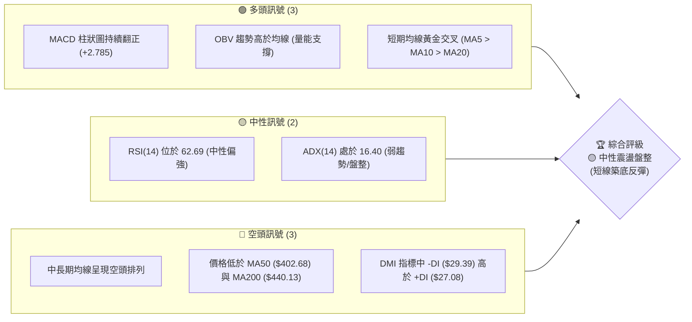

### 📊 核心指標速覽表

| 指標類別 | 指標名稱 | 當前數值 | 訊號 | 解讀 |
|----------|----------|----------|------|------|
| **價格** | 當前價格 | $390.99 | 🟡 中性 | 處於 52 週高低點區間的 20.7% 低檔位置，正進行低位震盪。 |
| **均線** | MA20 | $380.55 | 🟢 多頭 | 價格已成功站上 MA20，且 MA20 趨勢轉為向上（▲）。 |
| **均線** | MA50 | $402.68 | 🔴 空頭 | 價格仍低於 MA50，且 MA50 趨勢持續向下（▼），構成中期阻力。 |
| **均線** | MA200 | $440.13 | 🔴 空頭 | 價格遠低於 MA200，長期趨勢偏空，均線呈空頭排列。 |
| **動能** | RSI(14) | 62.69 | 🟡 中性 | 處於 30-70 中性區間，動能正由弱轉強，尚未進入超買區。 |
| **動能** | MACD | -4.467 | 🟢 多頭 | MACD 柱狀圖為 +2.785，黃金交叉向上，多頭動能正在釋放。 |
| **波動** | ATR(14) | $12.32 | 🟡 中性 | 佔股價約 3.15%，波動度適中，適合進行區間波段操作。 |

### 🏆 技術評分卡

```
技術評分卡 — MSFT (2026-07-13)
════════════════════════════════════════════════════
趨勢強度      ███████░░░░░░░░░░░░░  35/100  🟡 中性 (ADX=16.40)
動能指標      █████████████░░░░░░░  65/100  🟢 看多 (MACD/RSI 偏強)
支撐穩定度    ████████████░░░░░░░░  60/100  🟡 中性 (S1 經受多次測試)
成交量配合    █████████░░░░░░░░░░░  45/100  🟡 中性 (量能低於20日均量)
形態完整度    ██████████░░░░░░░░░░  50/100  🟡 中性 (雙底雛形尚待頸線確認)
均線排列      ██████░░░░░░░░░░░░░░  30/100  🔴 看空 (MA20 < MA50 < MA200)
════════════════════════════════════════════════════
綜合評分      █████████░░░░░░░░░░░  47/100  🟡 區間震盪盤整
════════════════════════════════════════════════════
```

---

## 2. 趨勢分析

### 🌐 多時框趨勢分析

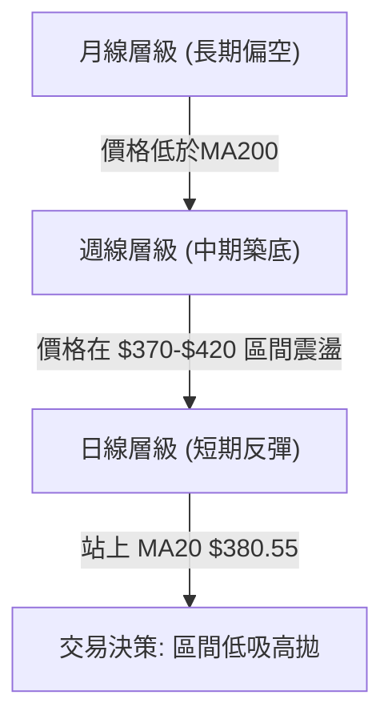

### 📈 長期趨勢 — 12個月走勢圖（Unicode）

```
MSFT 月線走勢圖（過去12個月）
價格軸 ($)
$530 ┤                    ● (2025-07)
$500 ┤              ●   ●
$470 ┤        ●
$440 ┤    ●
$410 ┤●━━━━━━━━━━━━━━━━━━━━━━━━━━━━━━━● (2026-07 現價: $390.99)
$380 ┤                            ●
$350 ┤                        ● (2026-03 低點)
     └─────────────────────────────────────────────
      07  08  09  10  11  12  01  02  03  04  05  06  07 (月份)
```

**走勢特徵分析表格**：

| 階段 | 時間區間 | 收盤價區間 | 趨勢特徵 | 累計漲跌幅 |
| :--- | :--- | :--- | :--- | :--- |
| **階段一** | 2025-07 ~ 2025-10 | $529.27 → $514.55 | 高檔強勢整理，創下 52W 新高 $551.05 | -2.78% |
| **階段二** | 2025-11 ~ 2026-03 | $489.83 → $369.37 | 頂部崩塌，中長期均線下穿，進入中期空頭 | -24.60% |
| **階段三** | 2026-04 ~ 2026-05 | $406.90 → $450.24 | 強力死貓跳反彈，受阻於 MA200 | +10.65% |
| **階段四** | 2026-06 ~ 2026-07 | $373.02 → $390.99 | 二次探底不破前低，短期築底反彈中 | +4.82% |

### 📊 中期趨勢（週線分析）

```
週線級別價格通道與關鍵結構示意圖
═════════════════════════════════════════════════════════
$450.12 ═══════════════════════════════ (Fib 50.0% 阻力位)
           \
            \
$412.16 ═════\═════════════════════════ (中期阻力 R1)
              \        ▲ (反彈路徑)
               \      /
$390.99 ━━━━━━━━\━━━━●━━━━━━━━━━━━━━━━ (當前價格)
                 \  /
$380.89 ══════════●════════════════════ (關鍵支撐 S2)
═════════════════════════════════════════════════════════
```

### ⚡ 趨勢強度評估（ADX 解讀）

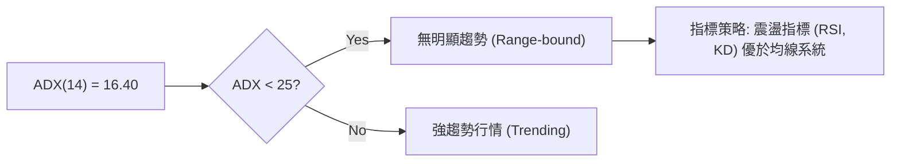

| ADX 數值區間 | 趨勢強度 | 當前狀態評估 | 適用交易策略 |
| :--- | :--- | :--- | :--- |
| 0 - 20 | 趨勢極弱或無趨勢 | **MSFT (16.40) 處於此區間** | 執行布林通道上下軌逆勢交易，避免追漲殺跌。 |
| 20 - 25 | 趨勢正在形成 | — | 密切關注突破方向。 |
| 25 - 50 | 強趨勢 | — | 順勢交易，均線策略。 |

---

## 3. 圖表形態分析

### 🔍 形態識別系統

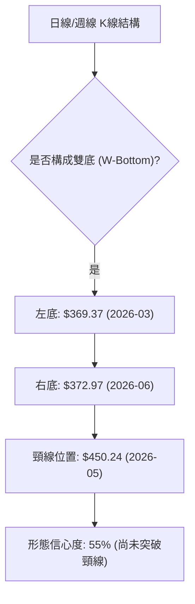

**形態信心度與目標價評估**：

| 形態名稱 | 信心度 | 判斷依據（引用數據） | 完成度 | 目標價（附計算式） |
| :--- | :--- | :--- | :--- | :--- |
| **雙底 (W-Bottom)** | 55% | 兩次中期低點分別在 $369.37（2026-03）與 $372.97（2026-06-28）企穩，未跌破 52W 低點 $349.20。 | 40% (受限於頸線太遠) | **$531.11**<br>計算式：頸線 $450.24 + 形態高度 ($450.24 - $369.37) = $531.11 |
| **箱體震盪** | 85% | 股價反覆在 $370 - $412 區間內波動，ADX(14) 處於 16.40 的極低水準，證實箱體成立。 | 90% (當前正處於箱體中軌向上軌移動) | **$412.16** (箱體上軌 R1) |

### 🕯️ 重要K線形態分析

| 日期 | 收盤價 | K線形態 | 解讀 | 訊號 |
| :--- | :--- | :--- | :--- | :--- |
| **2026-06-21** | $379.40 | 長下影線錘子線 | 在 $370 附近獲得強力買盤支撐，宣告二次探底基本完成。 | 🟢 強烈看多 |
| **2026-06-28** | $372.97 | 陰線十字星 | 雖然收陰，但成交量放大至 3.82 億股（巨量），顯示低檔換手積極，築底信號明確。 | 🟢 看多確認 |
| **2026-07-05** | $390.49 | 大陽線吞噬 | 一舉吞噬前一週的陰線實體，收復 $390 關卡，多頭重奪短期控制權。 | 🟢 強烈看多 |
| **2026-07-12** | $385.10 | 縮量小陰線回踩 | 回踩 MA20 ($380.55) 獲得支撐，屬於健康的上升途中整理。 | 🟡 中性 |

### 📉 ASCII 雙底築底形態示意圖

```
                    (頸線 $450.24)
                         ┌─●─┐
                        /     \
                       /       \
                      /         \
$412.16 (R1) ────────/───────────\─────────────
                    /             \     ▲
                   /               \   / (當前反彈中 $390.99)
$380.89 (S2) ─────●                 ●─●
                 /                   \
                /                     \
$369.37 (左底) ─●                       ●─ $372.97 (右底)
```

---

## 4. 支撐與阻力

### 🗺️ 關鍵價位分布圖（Unicode）

```
MSFT 價位結構分布圖
═══════════════════════════════════════════════════
$466.32 ║████████████████████████║ 強阻力 R3 (密集籌碼套牢區)
$428.35 ║████████████████████    ║ 阻力 R2 (中期波段高點)
$412.16 ║████████████████████████║ 關鍵阻力 R1 (箱體上軌)
$392.40 ║▓▓▓▓▓▓▓▓▓▓▓▓▓▓▓▓▓▓▓▓▓▓▓▓║ 斐波那契 78.6% 壓制線
$390.99 ╠════════════════════════╣ ◄ 當前現價
$390.58 ║▓▓▓▓▓▓▓▓▓▓▓▓▓▓▓▓        ║ 近期支撐 S1 (日線級別防守線)
$380.89 ║████████████████████████║ 強支撐 S2 (MA20 匯合處)
$355.51 ║████████████████████████║ 鐵底支撐 S3 (接近 52W 低點 $349.20)
═══════════════════════════════════════════════════
```

### 🚧 阻力位分析表

| 阻力級別 | 價位 | 形成原因 | 突破難度 | 重要性 |
| :--- | :--- | :--- | :--- | :--- |
| **R1** | **$412.16** | 近一年波段高點聚類、箱體上軌、MA60 ($406.03) 附近阻力。 | 🟡 中等 | **極高**。突破此位意味著日線級別箱體破位上行，將打開通往 $428 的空間。 |
| **R2** | **$428.35** | 2026年1月波段反彈高點、Fib 61.8% ($426.31) 附近重合區。 | 🔴 困難 | **高**。此處為中線多空分水嶺，站穩此處中期趨勢方可轉多。 |
| **R3** | **$466.32** | 歷史套牢盤密集區，上方長期均線 MA240 ($451.63) 壓制。 | 💀 極難 | **中**。需要極大成交量配合及基本面重大利多方可觸及。 |

### 🛡️ 支撐位分析表

| 支撐級別 | 價位 | 形成原因 | 守住機率 | 重要性 |
| :--- | :--- | :--- | :--- | :--- |
| **S1** | **$390.58** | 近期日線波段低點聚類，與當前股價極為接近。 | 🟡 50% | **中**。短線多頭防守的第一道防線，跌破則回測 MA20。 |
| **S2** | **$380.89** | 近一年波段低點聚類，高度重合 MA20 ($380.55) 支撐。 | 🟢 80% | **極高**。此處為多頭本輪反彈的生命線，守住則震盪上行趨勢不變。 |
| **S3** | **$355.51** | 近一年極端波段低點，接近 52W 低點 $349.20。 | 🟢 95% | **最高**。此處為長期價值投資買盤介入區，極難被實體跌破。 |

### 📐 斐波那契回調位分析（基於 52W 區間 $349.20 → $551.05）

當前價格 **$390.99** 恰好卡在 **78.6% ($392.40)** 與 **100.0% ($349.20)** 之間：
- **78.6% ($392.40)** 構成當前最直接的頭頂壓力。若日線收盤價能實體突破 $392.40，則下方築底宣告成功，股價將快速向下一目標位 **61.8% ($426.31)** 靠攏。
- 若在 $392.40 受阻回落，則將再次考驗下方 **100.0% ($349.20)** 的終極底部支撐。

---

## 5. 技術指標深度解讀

### 🎛️ 指標訊號總覽

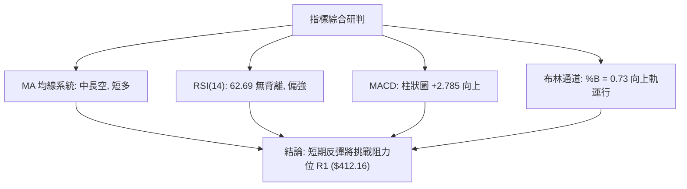

### 📈 移動平均線排列分析

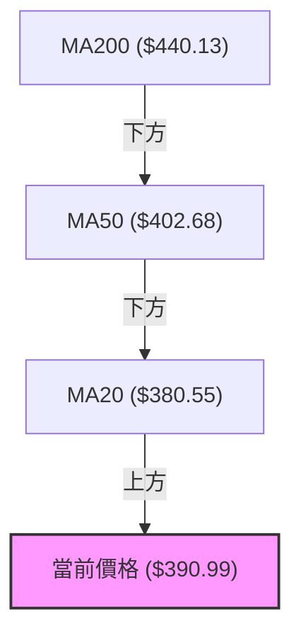

- **均線空頭排列**：長期均線呈現 MA20 < MA50 < MA200 的典型空頭排列。說明中期與長期趨勢仍由空頭主導。
- **短期黃金交叉**：MA5 ($386.53) > MA10 ($383.57) > MA20 ($380.55)，短期均線全數勾頭向上，且價格站於其上，顯示短期多頭反彈動能強勁，正在對中期均線 MA50 進行合圍攻擊。

### 📉 RSI(14) 分析

RSI(14) 當前數值：**62.69**
```
RSI(14) 強度條
░░░░░░░░░░░░░░░░░░░░░░░░░░░░░░████████████████████░░░░░░░░░░░░  62.69% (中性偏強)
[0]                          [30]                 [70]       [100]
```
- **背離研判**：對比 2026-06-21 價格低點 $379.40 (RSI = 18.6) 與 2026-06-28 價格低點 $372.97 (RSI = 31.3)，價格創出新低，但 RSI 未創新低，呈現**日線級別底背離**。這解釋了隨後兩週股價的強勁反彈。
- **空間評估**：目前 RSI 距離 70 超買區仍有空間，暗示反彈動能尚未耗盡。

### 📊 MACD 訊號解讀

- **MACD 線**：-4.467
- **信號線 (Signal)**：-7.252
- **柱狀圖 (Histogram)**：**+2.785** (🟢 看多)
- **研判**：雙線雖在零軸下方，但已形成低位**黃金交叉**，且柱狀圖紅柱持續放大。零軸下方的金叉通常代表強力的「超跌反彈」行情，第一目標位通常是測試 MA50 阻力。

### 📦 布林通道分析

```
布林通道寬度與現價位置示意圖
═════════════════════════════════════════════════════════
$403.47 ═════════════════════════════════════ (BB 上軌)
                                    ● (預期反彈目標)
$390.99 ━━━━━━━━━━━━━━━━━━━━━━━●━━━━━━━━━━━━━ (當前現價 %B=0.73)
                             /
$380.55 ════════════════════●════════════════ (BB 中軌/MA20)
                          /
$357.62 ═════════════════════════════════════ (BB 下軌)
═════════════════════════════════════════════════════════
```
- **通道狀態**：布林通道呈現水平收窄狀態，證實市場進入低波動盤整。
- **位置分析**：當前 %B 為 0.73，股價正朝著上軌 **$403.47** 挺進。由於 ADX 指標極低，股價觸及上軌時預期會遭遇壓制，難以直接形成單邊突破。

### 💹 成交量分析（量價配合度）

- **量比低迷**：最新成交量為 27,505,099，僅為 20 日均量 (47,104,185) 的 **0.58x**。
- **量價背離隱憂**：股價在近兩週反彈，但成交量並未同步放大。這表明此輪反彈主要是由於空頭平倉（Short Covering）與市場拋壓衰竭所致，缺乏主動性買盤（Institutional Buying）的強力支持。若要有效突破 R1 ($412.16)，日成交量必須放大至 4,000 萬股以上。

---

## 6. 動能與波動率

### ⚡ 動能評估四象限

根據 MSFT 當前的技術狀態，其在動能與波動率維度上的定位如下：

| 象限 | 動能強度 | 波動率水準 | 當前狀態 | 交易策略指引 |
| :--- | :--- | :--- | :--- | :--- |
| **Q1 (強動能・低波動)** | 強 | 低 | — | 順勢持股，緩步推升 |
| **Q2 (弱動能・低波動)** | 弱 | 低 | **✓ [當前定位]** | **箱體震盪，低吸高拋，不追高** |
| **Q3 (強動能・高波動)** | 強 | 高 | — | 突破跟進，擴大止損 |
| **Q4 (弱動能・高波動)** | 弱 | 高 | — | 避開，或進行單邊做空 |

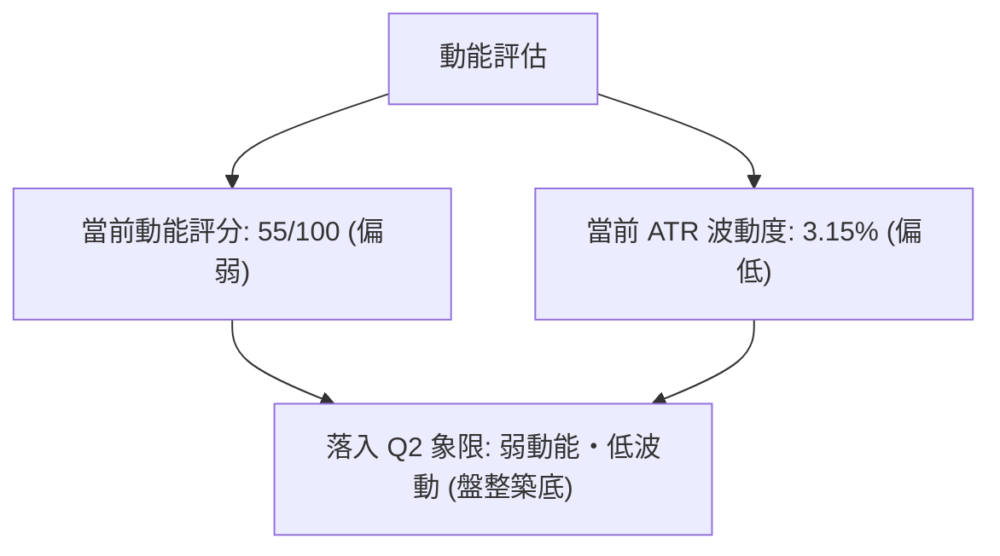

### 📊 ATR 波動率分析

- **ATR(14) 數值**：**$12.32**
- **止損距離建議**：
  - **短線交易 (1.5x ATR)**：$12.32 × 1.5 = **$18.48**。以現價 $390.99 計算，短線合理止損點應設於 **$372.51** 之外（接近前低 $372.97）。
  - **波段交易 (2.0x ATR)**：$12.32 × 2.0 = **$24.64**。波段安全止損點應設於 **$366.35** 之外。

### 📐 Beta 與市場相關性

- **Beta 係數**：**1.13**
- **解讀**：MSFT 的波動性略高於大盤（S&P 500）。在當前大盤不穩定的背景下，MSFT 將表現出稍高的敏感度。若大盤出現系統性回檔，MSFT 容易回踩 S2 ($380.89) 支撐。

---

## 7. 多時框架總結

### 📋 時框架評分表

| 時框架 | 趨勢方向 | 動能 | 均線排列 | 形態 | 綜合評分 | 建議交易方向 |
| :--- | :--- | :--- | :--- | :--- | :--- | :--- |
| **日線 (D)** | 🟢 短多 | 🟢 強 (MACD金叉) | 🟡 中性 (站上MA20) | 🟡 中性 (雙底右側) | **65/100** | 逢回踩買入 (Long) |
| **週線 (W)** | 🟡 中性 | 🟡 中性 (RSI 52.9) | 🔴 空頭 (MA20<50) | 🟡 中性 (箱體整理) | **45/100** | 區間震盪操作 (Range) |
| **月線 (M)** | 🔴 空頭 | 🔴 偏弱 | 🔴 空頭排列 | 🔴 空頭 (高檔回落) | **30/100** | 長線觀望/分批佈局 |

### 🔲 綜合訊號矩陣

```
                     ┌───────────────────────────┐
                     │   長期月線趨勢：🔴 空頭   │
                     └─────────────┬─────────────┘
                                   ▼
                     ┌───────────────────────────┐
                     │   中期週線趨勢：🟡 震盪   │
                     └─────────────┬─────────────┘
                                   ▼
                     ┌───────────────────────────┐
                     │   短期日線趨勢：🟢 反彈   │
                     └───────────────────────────┘
```

### ⚖️ 多時框收斂結論

**當前主導行情：盤整行情（ADX = 16.40 < 25）**
- **收斂規則應用**：由於 ADX 顯示當前無明顯單邊趨勢，多時框架訊號產生衝突（日線看多，週/月線看空）。此時應**降低對均線突破系統的依賴，轉而以日線與週線的布林通道區間作為主要交易依據**。
- **最終方向性結論**：**中性偏多（短期反彈，中期受阻）**。短期內股價有極高機率向上測試 R1 ($412.16) 阻力，但由於中長期均線下行，此處預期將遭遇強烈賣壓，無法直接反轉為牛市。交易應以「低吸高拋」的箱體思維對待。

---

## 8. 交易策略建議

### 🗺️ 策略決策流程圖

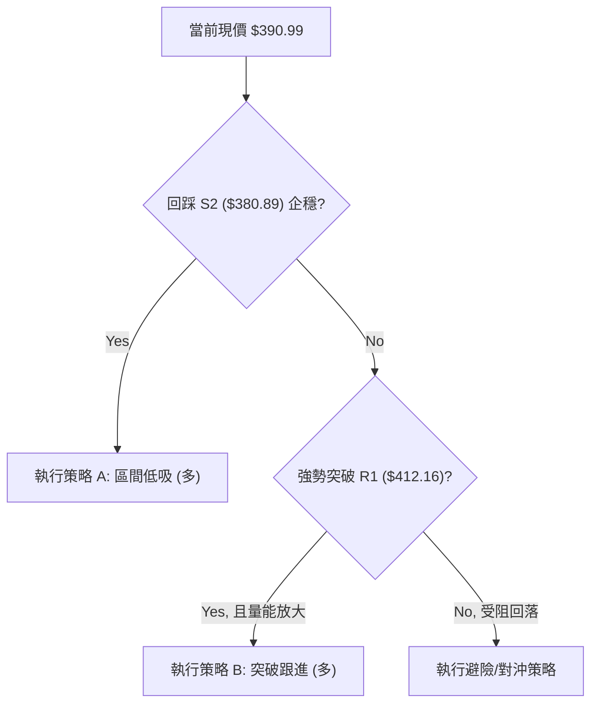

### 🧭 策略路由（依評分卡分流）

**當前主策略方向：區間震盪低吸策略（綜合評分：47/100，處於 40-60 中性區間）**
- **策略核心**：不追高，利用短期回踩關鍵支撐位進行分批佈局，並在關鍵阻力位前落袋為安。

### 🎯 價格情境階梯（Price Scenarios）

| 觸發條件 | 下一目標 | 後續延伸 | 情境含義 |
| :--- | :--- | :--- | :--- |
| **向上突破 R1 ($412.16)** | R2 ($428.35) | R3 ($466.32) | 短期反彈確立，轉為中期強勢行情。 |
| **站穩現價區間 ($390.99)** | BB 上軌 ($403.47) | R1 ($412.16) | 區間內溫和震盪上行。 |
| **向下跌破 S1 ($390.58)** | S2 ($380.89) | S3 ($355.51) | 反彈夭折，重新進入尋底走勢。 |

### 📊 情境機率分佈

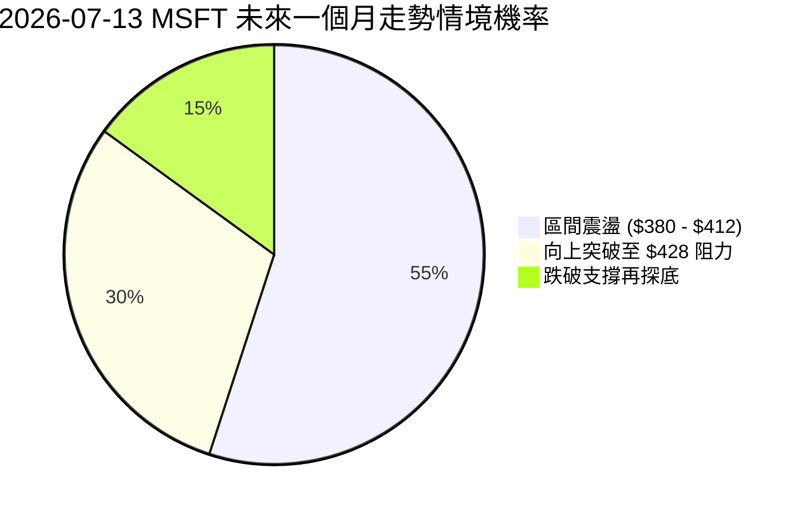

### 🟢 主策略詳情

╔══════════════════════════════════════════════════════════════╗
║              MSFT 雙軌交易執行計劃表                         ║
╠══════════════════════════════════════════════════════════════╣
║ 策略 A (最優選擇 — 區間回踩做多)：                          ║
║  - 進場條件：股價縮量回踩 S2 ($380.89) 附近，且日線收陽線確認。║
║  - 進場價格：$380.89                                        ║
║  - 目標價 T1：$412.16 (R1 阻力)                             ║
║  - 目標價 T2：$428.35 (R2 阻力)                             ║
║  - 止損價格：$355.51 (跌破 S3 徹底離場)                      ║
║  - 風險報酬比：1.23 : 1 (至 T1) / 1.87 : 1 (至 T2)           ║
║  - 成功機率：60% ｜ 建議倉位：15%                             ║
║                                                              ║
║ 策略 B (次選方案 — 突破跟進做多)：                          ║
║  - 進場條件：日K線實體放量突破 R1 ($412.16)，收盤價站穩其上。║
║  - 進場價格：$412.16                                        ║
║  - 目標價 T1：$428.35 (R2 阻力)                             ║
║  - 目標價 T2：$466.32 (R3 阻力)                             ║
║  - 止損價格：$390.58 (S1 支撐)                              ║
║  - 風險報酬比：0.75 : 1 (至 T1) / 2.51 : 1 (至 T2)           ║
║  - 成功機率：55% ｜ 建議倉位：10%                             ║
╚══════════════════════════════════════════════════════════════╝

### 🔴 反向風險觸發點（對沖提示）

若股價放量跌破 **S2 ($380.89)**，意味著短期反彈動能衰竭。此時多頭應無條件減倉，並可考慮買入遠期 Put（行權價 $355.51）進行對沖，防範股價二次探底。

### ⭐ 整體訊號強度評星

- **做多訊號強度**：★★★☆☆ (3/5星) — 短期動能支持反彈，但受限於大格局空頭。
- **做空訊號強度**：★★☆☆☆ (2/5星) — 超跌後拋壓衰竭，此處做空盈虧比極差。
- **整體可信度**  ：★★★☆☆ (3/5星) — 盤整行情中指標容易反覆，需嚴格執行止損。

---

## 9. 風險提示與監控

### ✅ 關鍵監控指標 Checklist

```
╔══════════════════════════════════════════════════════════════╗
║              MSFT 每日交易風險監控清單                       ║
╠══════════════════════════════════════════════════════════════╣
║ [ ] 價格是否跌破 S1 ($390.58)？(若跌破，警惕反彈結束)         ║
║ [ ] 價格是否觸及 R1 ($412.16)？(若觸及且無量，執行多頭止盈)   ║
║ [ ] 日成交量是否突破 41,010,728 (50日均量)？(確認突破有效性)   ║
║ [ ] RSI(14) 是否突破 70 進入超買區？(防範短線沖高回落)        ║
║ [ ] MACD 柱狀圖是否出現首根「縮短」紅柱？(多頭動能減弱信號)    ║
╚══════════════════════════════════════════════════════════════╝
```

### ⚠️ 風險場景分析

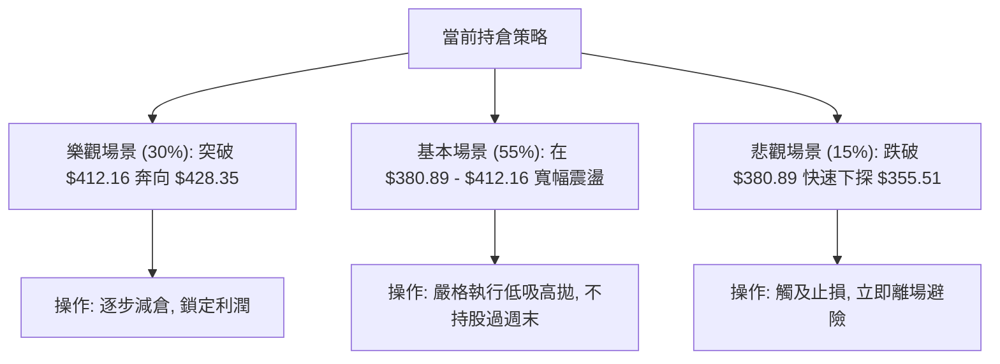

### 🛡️ 風險管理重要提醒

1. **嚴防縮量突破陷阱**：在當前量比僅 0.58x 的背景下，任何向上的突破（如突破 $392.40 或 $412.16）若無成交量配合，極易形成「假突破」並迅速反殺。
2. **倉位嚴格控制**：鑑於中長期均線仍呈空頭排列，目前不宜進行長線重倉佈局。整體對 MSFT 的交易性倉位應控制在 **15%** 以內。
3. **時間窗口限制**：此輪反彈屬於日線級別。若股價在未來 5-7 個交易日內仍無法有效站穩斐波那契 78.6% 阻力位（$392.40），則時間窗口關閉，多頭應主動離場。

---

## 📋 報告總結

```
MSFT 技術分析報告總結
════════════════════════════════════════════════════════
報告日期：2026-07-13
當前價格：$390.99
分析評級：⚖️ 中性震盪（短期超跌反彈，中期箱體築底）

關鍵結論：
├─ 長期趨勢：🔴 空頭排列 (股價遠低於 MA200 $440.13)
├─ 中期趨勢：🟡 箱體震盪 (主要波動區間 $370 - $412)
├─ 短期趨勢：🟢 強勁反彈 (MACD低位金叉，站上 MA20 $380.55)
├─ 關鍵支撐：$380.89 (S2) ｜ $355.51 (S3)
├─ 關鍵阻力：$412.16 (R1) ｜ $428.35 (R2)
└─ 分析師目標均價：$559.86 (長線參考)

最優策略組合：
1. 🥇 首選策略：回踩 S2 ($380.89) 做多，止損設於 S3 ($355.51)，目標看至 R1 ($412.16)。
2. 🥈 次選策略：若放量突破 R1 ($412.16) 則順勢輕倉追多，目標看至 R2 ($428.35)。
3. 🥉 避險提醒：若實體跌破 S2 ($380.89) 則多頭必須全線退守，等待 $355 附近再做佈局。
════════════════════════════════════════════════════════
```

---

> ⚠️ **免責聲明**：本報告為 AI 自動生成之技術分析，所有數據及估算均基於提供的歷史價格資訊。本報告**僅供研究與學術參考**，**不構成任何投資建議**。投資有風險，入市需謹慎。

---

*報告生成時間：2026-07-13 ｜ 數據來源：Yahoo Finance ｜ 分析框架：多時框技術分析*