<details>
<summary>📊 靜態圖表 (點擊展開)</summary>
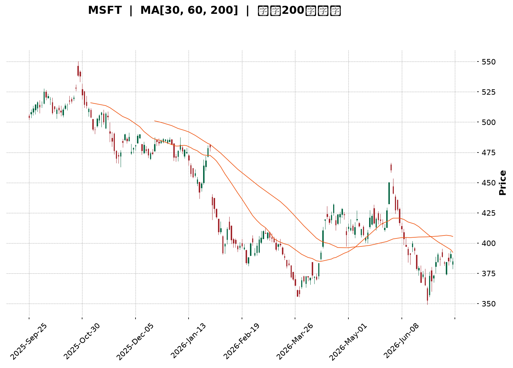
</details>

<html>
<head><meta charset="utf-8" /></head>
<body>
    <div style="height:500px; width:100%;">                        <script>window.PlotlyConfig = {MathJaxConfig: 'local'};</script>
        <script charset="utf-8" src="https://cdn.plot.ly/plotly-3.7.0.min.js" integrity="sha256-jvTGqxNp8AGWEcvNLVuKr+8j5dGe9Yw51LQkmDH+IYA=" crossorigin="anonymous"></script>                <div id="candlestick-chart" class="plotly-graph-div" style="height:100%; width:100%;"></div>            <script>                window.PLOTLYENV=window.PLOTLYENV || {};                                if (document.getElementById("candlestick-chart")) {                    Plotly.newPlot(                        "candlestick-chart",                        [{"close":{"dtype":"f8","bdata":"AAAA4Gx9f0AAAADg28N\u002fQAAAACDI9X9AAAAA4IUVgEAAAACggyOAQAAAAED0A4BAAAAAoMAQgEAAAADA8mmAQAAAAGB1RYBAAAAAAGBMgEAAAAAg5jiAQAAAAMDou39AAAAAwAntf0AAAAAgaOV\u002fQAAAAEAu439AAAAAgD7Gf0AAAAAAkeV\u002fQAAAACBNDIBAAAAAoDcTgEAAAACgHCqAQAAAAIBFKoBAAAAAgIRCgEAAAABgZoGAQAAAAMBE1YBAAAAAYCLRgEAAAAAAnFOAQAAAAOBoFIBAAAAAgDUOgEAAAACgffF\u002fQAAAAAB+f39AAAAAgIvffkAAAADgF9t+QAAAAIAMbX9AAAAAoKiXf0AAAACAxb5\u002fQAAAAED2QX9AAAAAAIKvf0AAAAAAvYR\u002fQAAAACDrqn5AAAAAoN5AfkAAAAAA8cR9QAAAAOBtYH1AAAAAQGB+fUAAAADgAK59QAAAAICPNX5AAAAAQEKdfkAAAADgT0l+QAAAAMA9fX5AAAAAoMq5fUAAAADAVOt9QAAAAEBJEH5AAAAAIH2NfkAAAADgap1+QAAAAEADx31AAAAAYDkVfkAAAADgiMZ9QAAAACBwi31AAAAAYHKkfUAAAABAJaB9QAAAACBZHX5AAAAAIEA8fkAAAABgUix+QAAAAIAQS35AAAAAgLNdfkAAAABgw1h+QAAAAAAMT35AAAAAgBlVfkAAAAAgnRd+QAAAAMB9bX1AAAAA4A5sfUAAAABgN8Z9QAAAAGA5FX5AAAAAINi\u002ffUAAAABAe9J9QAAAAMAHsX1AAAAAIFVJfUAAAABAfpV8QAAAAIAqanxAAAAAgCOdfEAAAAAAFEh8QAAAAKBBontAAAAA4DwSfEAAAACgJf58QAAAAMAeQ31AAAAAYDDnfUAAAABA6vd9QAAAAMA\u002f+XpAAAAAAB7GekAAAABA41d6QAAAAKAwlnlAAAAAoKjFeUAAAABgy354QAAAAODI9XhAAAAAwEK8eUAAAAAAAbd5QAAAAEA8KXlAAAAAQO8AeUAAAADgpvh4QAAAAKCbsXhAAAAAAEHdeEAAAADglNl4QAAAAMDxxXhAAAAAoDn6d0AAAACAjEJ4QAAAAGC\u002f+3hAAAAAAKENeUAAAABgQn54QAAAAKAE23hAAAAAgOkweUAAAABAMEV5QAAAAMCtnHlAAAAA4DeBeUAAAAAgZ4h5QAAAACAhTnlAAAAAYBRAeUAAAAAg3Q95QAAAAEAfq3hAAAAAwF7xeEAAAACgv+h4QAAAAKAXb3hAAAAAIN5CeEAAAAAgt9B3QAAAAKDB4ndAAAAAYPM+d0AAAABgzyN3QAAAAIDd0nZAAAAAoPs\u002fdkAAAACA8mJ2QAAAAIDrFXdAAAAAwCUJd0AAAAAgckp3QAAAAKAvQXdAAAAAQMQ3d0AAAAAAVlh3QAAAAEA4RHdAAAAAgBghd0AAAAAAofh3QAAAAKAqhHhAAAAA4EyleUAAAADAoDV6QAAAAEAFXnpAAAAA4KkSekAAAACg5HN6QAAAAADA\u002f3pAAAAAoJ\u002fteUAAAACgPHt6QAAAACBufnpAAAAAICjFekAAAACgrnh6QAAAACBhbnlAAAAAgLXYeUAAAAAAnst5QAAAAODap3lAAAAAoAvReUAAAAAgxT16QAAAAMCQ43lAAAAAYEq8eUAAAAAgOG55QAAAACBZRXlAAAAA4LiIeUAAAABgIVB6QAAAAKD+aXpAAAAAQEkIekAAAABgZkJ6QAAAAKBwMXpAAAAAwB4pekAAAADgegB6QAAAAGC4ynlAAAAAANevekAAAAAA1yN8QAAAAOBRyHxAAAAAwPWUe0AAAACgcLV6QAAAAMDMwHpAAAAAYLgKekAAAAAA17t5QAAAAGCPNnlAAAAAgMLVeEAAAACgcGV4QAAAAADXa3hAAAAAACn8eEAAAACgR514QAAAAGCPrndAAAAAYGa2d0AAAACgcPV2QAAAAEAKX3dAAAAAIFzXdkAAAACgRw12QAAAACCFT3dAAAAAwB4Jd0AAAADgUVB3QAAAAOB6BHhAAAAAANdneEAAAAAA1yt4QAAAAKBwTXhAAAAAoHD1d0AAAACAwgV4QAAAAKCZEXhAAAAAANdveEAAAABA4Q54QA=="},"high":{"dtype":"f8","bdata":"HKG8Ls6sf0CDTTISSut\u002fQG807Q\u002fHDIBArTg6KzEXgEDsymOw3ymAQCXV1\u002fiJMoBAjI9B57YpgEBFIxYrgX2AQF5iQ7y5c4BADozLzhFdgECKQOnfPUiAQG8RpYdHQoBA5N4itUcJgEDqebclTACAQEDGtyl7D4BA1v+UNscMgEA+iw8j4wGAQBxU1EF8G4BAY4Nk2WcbgEAUXutMZU+AQKAPkY44RYBAT2zOkllQgEDpc3vPuZmAQCULmrjhMYFAZ3DxKaj2gEDnqQ1L05yAQCTQDgbpb4BAc79S6j9NgECH+6+WcQKAQMrNDKlw+X9AGUukb0dof0D7bFiiywN\u002fQC86vTaQen9AGGy8SEmmf0AJUX62Msd\u002fQBDUgi9L5H9AIL82xRXGf0CE7P8lWs5\u002fQOM0b3oIPX9AH6QbWS3BfkCpof2OG7Z+QHeYQkO\u002fzH1AOnIv9pGsfUDmpD4GadB9QPFQszhSYn5AEWq3fSKnfkBePWO3Ant+QKEO6jD+tH5AQq+iR30hfkDac34o+vJ9QK5+TeQbFH5Ao8tzweChfkAzdxSvAp9+QCGJ3CumIX5A+BzDogA+fkBB7jsQ+gR+QKqrgFtr6X1A\u002f6OnIle8fUCbyjJK8919QFmtGJHedn5ANIOZU\u002f5afkBsM8XvAml+QG+KJbSsWn5Ahn0oTNxvfkCiS+xNS19+QIx830z1Yn5AqhFjrCR4fkA0rgALnV9+QFDEwQouKH5AAdOzhlmffUCCKNgy4cl9QBiuJF12eH5AlmxlX1IIfkC094xRFdt9QCqtp0+47X1AnXs11LqafUAd4pXU\u002fCF9QPoXtkoR43xA83L9xi7SfEAI3KR4ZWx8QBuJpZDtKnxAbZTtIFEtfEAzHvZ5LlB9QGTq98dbgn1AEk3xqaoLfkB6he5uhhl+QLXT8U+ciHtAYThBr2pae0DyHNrpSM16QK9IyWXcQnpAtyGhPwUfekB6JkkS1md5QEqRPHIjAHlAlfLhMs\u002fQeUD8fAFV01x6QKf+7FLR6XlAl+ORsmJGeUBPd6Rd3zt5QD3uB4no63hAxi1UX2cMeUC5VP4m5Th5QLeiy4oV9HhAcRXVmBaoeEDWPzfQS0h4QOueaiyjCXlAQk8xzL9peUCXvPsBZr94QHOwKMEqBXlAZqeK+iJdeUAsIvlDRKJ5QEZ0cMSGq3lA9PlCS4TCeUDdyw\u002fLLJV5QDheNhIElXlAjD2dUASCeUDzhgpq4FN5QKCK6l3NPnlAUZj\u002f+jn8eECZMZJzajh5QFoP9cY80nhAOOJBiER6eEAsMJ82niJ4QOSVhXv4JXhA9SHVXUvad0BtmM7164N3QAdhKQuQXndAXw7vt6qadkBbwmM4IMl2QMAfUFWBQXdA0bFLWuhSd0DX7QfoUU13QOFktbnBTndAsLhmNVI6d0D2bCXsrwJ4QNJFkLEVS3dAI2toRkBtd0CRXrneV\u002ft3QOffb2NknXhAW0mBXZfXeUBjIvKKkT56QLYwdTBb6npATubpL6RmekBc5jXEG6R6QIC9W\u002fgzDHtA9TRJ+uhrekDD3x10gYB6QDp1fZr9onpANu2ckdrPekAf7K5bXJ56QKDCpNhj2HlAxWBPHVYDekDoKAf+7T16QFyUtXIR\u002fnlAmiO+ZEAYekBgvt6M4bB6QKT\u002fsK2aG3pAzlQE\u002fMS8eUAXpBrSoel5QLzhNAPpVnlAapGC6jKveUCBjC0M6rN6QDXBgEM4g3pAZIuo3Dz8ekCayyALAVN6QAAAAKBwpXpAAAAAYGaGekAAAADgUTx6QAAAAEAK\u002f3lAAAAAANfXekAAAACgRyV8QAAAAMAeJX1AAAAAAABYfEAAAACAPYZ7QAAAAGBmQntAAAAAIIXXekAAAABgjxJ6QAAAACCuv3lAAAAA4KNQeUAAAACgmc14QAAAAADXe3hAAAAAAAAceUAAAACgcM14QAAAAIDrZXhAAAAAgOvVd0AAAACAFNp3QAAAACCFk3dAAAAAgBSud0AAAAAgrsN2QAAAAIDCiXdAAAAAAADId0AAAABgZmJ3QAAAAKBHTXhAAAAAQDODeEAAAABgZlJ4QAAAAMAeuXhAAAAAwPUUeEAAAABgZgp4QAAAAGCPfnhAAAAAYGaaeEAAAABACkN4QA=="},"hovertemplate":"\u003cb\u003e%{x|%Y-%m-%d}\u003c\u002fb\u003e\u003cbr\u003e\u958b: $%{open:.2f}\u003cbr\u003e\u9ad8: $%{high:.2f}\u003cbr\u003e\u4f4e: $%{low:.2f}\u003cbr\u003e\u6536: $%{close:.2f}\u003cextra\u003e\u003c\u002fextra\u003e","low":{"dtype":"f8","bdata":"Cj0PLMldf0C4MYwD6HZ\u002fQJNzGJPWmn9A3cZGkj2nf0AQ5B79g8d\u002fQNpNKC91t39A2+riUyT8f0CXKRmogheAQJjh7TxEMYBAHS0QT2I+gEBbv7ORJhGAQEgqtGjDpn9Ab2XIV1vHf0DilQ+DDG1\u002fQP44wmqlrH9AHv57NOqOf0BK9uyf4IF\u002fQPKillwu439ABhCU1\u002frcf0BxI7FZnROAQK9+HALFGoBAvsaWwHYrgECasNI5cm2AQGQeWSHvyoBA6dTuH9GqgEBSTn8qrDaAQMyDv1u7\u002fX9AAmX8pZ\u002f1f0D8ANrLTYp\u002fQHWtkjNFdn9A43Hn4AjLfkAD0MwmVaJ+QD9qetmS+n5AWc88LAQzf0BJAB9Zqf9+QMPgJc4pIn9AMgRAaPPkfkD6Jqrht1t\u002fQAJXntN2O35AF4pAVqn8fUBLrlv1RJZ9QAOiXioaI31AJ4yKuB4ffUApdTccQ+18QCEpENYQ8X1APXoT9uBHfkBOmDo0BSh+QByx2VOfQn5AWTzCsX2RfUDSy5YeCqZ9QBXSZxkczH1AGPZrVLgjfkBG2CLsWGV+QGNJJ1KUj31A6YRl8gCcfUARahxlpqN9QB6vjwTNZn1A9nJ3b61MfUApQ8IWTo59QAy+5hdXvH1AedPvCZ0FfkBS7A6\u002fzAh+QA\u002fsTDF0KX5APHgULuMqfkAaKZ8n4zx+QHro2qaIIH5A0rn6VI81fkBDZ6wvhBJ+QOqO91s1QX1Ad6mrFbI2fUBpQWN0rTp9QDB6BL5LvX1AE2YJ\u002fACcfUDHcTIytGF9QKpfXv0imX1AT53LtiX+fEDUyAxCSnJ8QIiSOU0PXnxAmPtBgUxnfECZIOQnnPR7QBOGT\u002fvCS3tAYKkHk6ere0BVhctGhQh8QPC3qTw6v3xAF6Dg3v5wfUCE1HSrF759QJHcQkJ0MnpAZz+NG\u002fOIekAAJrYWDEZ6QG8umF\u002f6a3lA4mE1RM92eUBqLRVESml4QM2oDAbZcnhAlOODzHvxeEDT4MK57K15QFaVNMS283hARcBbLe3DeEDKMv1BkMR4QDBO3E9+jHhAhIJZsAGpeEBYmmL4AL14QI++\u002flLlpHhAgQe4QFrkd0CFPlIoKc53QMz1I4sRVXhA1Eo6QQ3eeEAhTjcxmVB4QMqFYnySXHhALS+HTSR9eEDkMdgJHvd4QJZIz3dqOHlAU0y\u002fuwh6eUC9WEsRDCp5QLuuSm3yIHlAed3Kn40LeUBb3OkTeA15QJqz\u002fgFelnhAcemdDf2eeEDuGvDxPs54QCPyT756YnhA2Eu\u002fWZMjeEDOvMSdxrR3QG4kVo+uzXdAbTDi4L0wd0BcUkd7TA13QMy2mIdpxnZAejQqDdU7dkBuQmD5KDh2QK0sDLqQpHZAnPhh23f2dkBuMFfKzrV2QFoazAs5C3dAopNL2UjcdkAzvB6Ztyl3QOb\u002fYoob5HZAFVSPT68Td0A8NR2NfSN3QDBT81X0GnhAAU4eJfa9eEC7wVoh\u002fbN5QG3y9TZ+PHpArRkxi2f2eUDx3HocxgR6QLEec+IRbHpAB61Va1WoeUB1ztzza+55QIKj67qyAnpAk7GckM9PekCT9RlKGzZ6QGSQY7xl0nhAvRTD6NiYeUDHgLA2mJ55QLc6wPapfnlAnqTLV8BDeUBc\u002f\u002fMKrh16QIPcGyqv0XlAVr\u002f2YfpJeUBC5MTALVx5QK2+i+CcAnlAaq\u002fEzzcAeUBniZYiSMB5QNi2rHJj63lAsV2bG3D5eUC4Ny3Gk6Z5QAAAACBc+3lAAAAAoEcFekAAAADgUdB5QAAAAKBHmXlAAAAAYLjKeUAAAACAwgV7QAAAAOBRpHxAAAAAQOGGe0AAAAAAAIR6QAAAAGCPpnpAAAAAYGbmeUAAAADA9Yh5QAAAACCu53hAAAAAYI\u002fSeEAAAAAAAAB4QAAAAOBR5HdAAAAAoJmNeEAAAABACmt4QAAAAMAelXdAAAAA4HpUd0AAAADAHvF2QAAAAGC4KndAAAAA4HrMdkAAAABAM9N1QAAAAEDhNnZAAAAAYGZ+dkAAAABAM\u002fd2QAAAAIA9bndAAAAAQDP7d0AAAAAghdN3QAAAACCFQ3hAAAAAoEfVd0AAAACgmVV3QAAAAAAA2HdAAAAAYGYCeEAAAABgZqp3QA=="},"name":"\u50f9\u683c","open":{"dtype":"f8","bdata":"WA9FA56Rf0BXyK2Wma1\u002fQMUfSYl+xH9A04y56Sjgf0BFW+9R9vh\u002fQFVa0wIPE4BAs2nl2MMOgEDcS2H\u002fxBqAQO+0s7K4Z4BAM1Qj\u002fOQ\u002fgED24PYFbDiAQDk33S\u002f1IoBA5N4itUcJgECikuSYTbB\u002fQCUfO8+B+39A1Ay8vqrVf0BYkZAnYp1\u002fQDMJzTHx9X9Ao9vVD\u002fIRgECs\u002fhgj9i6AQKYY00JgOYBAUsuosf87gEAr0ReGd4OAQOZDwSpPFIFA+SZsbhXsgEAgoBuqIXmAQPMP35FpbIBAgeJCC08kgECrMo8foch\u002fQJfA0Rkd4X9A95Spl6Rnf0A1CBYGKd1+QNlyegJKDn9A8u2NJPhZf0CoL5BieKJ\u002fQGq6kiqTsX9AyRTr6oLxfkDm5LCAAJR\u002fQAGeigUKxH5AKfKR7j9wfkAL\u002fyaNaKh+QEVv3oMOxn1A\u002fa4WF06OfUBo79ymfX99QLI9bop2Qn5AbxWV9QJXfkAa18ZAZGR+QP55U3D+SH5A8hD+2lSjfUAuFba8INp9QADGYV8XBn5AxeVzEdgrfkBL9cGm525+QO3ongolHn5ARRai9kSofUCHyt9SFdt9QPiwzB2L331AP80bmxVdfUCg2VHHuqx9QCxFSGUewX1Aw\u002fSrGTBTfkAWMW21bz9+QHBrdvVGLX5Aj0V3Xm04fkAPPO2I1Uh+QF7Voo1dK35AmZ72xWg8fkCq7b+d1Vp+QE5s6RHhI35An+LuBlV\u002ffUBf1GioMHt9QJZHeZ8g2n1A4WznyLPxfUAKdkzrVH99QElP2SLoqH1ABuUFLjWJfUD1wshNRQZ9QKj5Fyf\u002f4HxAQ35Rfc18fED16B8tgxN8QEgPB5N+KXxAq11GzCrae0B1xTmR3R18QBqU5+Dz83xACE5s8Jh5fUBlFNUuFRF+QEVyt+SgYHtAo3k5PpFTe0DAc0n+UcV6QBcEpF85QnpAPpEQTtiSeUA+9UswI1p5QJ\u002f2W4Zn1nhAvjbapeEweUA6HYBPJxx6QBkLnIhb5XlAKDtZPUUzeUBOwuyIgip5QHJSiWQz13hA8ErfkdbFeECmeW1CL\u002f14QEcMLAoQtHhAk\u002f6jSFeieEAiXIAF9fR3QBZEqMT5WnhAcFYoiF09eUCKgwtXkGB4QGD6xL4sgHhAooxnRKWEeECFJkuqcQZ5QDbycEq8OHlAkM0Q4AyFeUAe0z\u002fft0B5QHjAfTNNknlAjlpShBhLeUCcc6GaFjx5QJPTVkEiAnlAoxx55FrTeEAE6xSDevZ4QDXciPpYxHhAMwx1UBxUeEC0o37yQx94QABAeggg8XdAOZQmt4nYd0C6LAjTr4F3QADzJDFMIHdAgZRituKRdkBHYmS54pF2QMnqHKAxvHZAL7thx+xKd0D6JMRzqeZ2QHtPpbnsSndAd0UZQ6IYd0DQvXE5XgJ4QKrAu4seO3dAjM9hcshCd0D9WMs\u002f10x3QLVaR3FOMXhA\u002fusTxzzSeEAsy4bKPS96QHj7rydufnpA4DMuPNZDekDdYGTzTjV6QN+Yn3NNlHpAx43debgvekDaFWL4GQF6QNckfnl5V3pAj0DRTXB6ekDEiBAQmXp6QNdJhy3BnnlA4+uVhIa+eUClSKjJaKp5QL5jSz\u002fC5nlAbh95QuRxeUCrE66XOzN6QLoHu6fOB3pA3c0X59BveUCCT5\u002f5WNl5QCTv8ApCJXlAiEuGkbE5eUD705KY\u002ftV5QPOW1YGD+3lAr1YGxojPekCsrhz+ZdR5QAAAAAAAjHpAAAAA4KM4ekAAAABA4QZ6QAAAAAApsHlAAAAAIK7PeUAAAADAzAh7QAAAAKBwDX1AAAAAgBTue0AAAABAM2d7QAAAAMD1PHtAAAAAoHDFekAAAACAPeJ5QAAAAOB6kHlAAAAAwMzoeEAAAAAgXLN4QAAAAEDhdnhAAAAAwMzMeEAAAADgo7x4QAAAAAAAZHhAAAAAwB6dd0AAAAAA13t3QAAAAIAURndAAAAAwB45d0AAAADgUax2QAAAAGBmUnZAAAAAAACYd0AAAADgejB3QAAAAKBHzXdAAAAAIK4HeEAAAADgozB4QAAAAADXh3hAAAAA4HoAeEAAAABAM2d3QAAAAMDMPHhAAAAAAAA8eEAAAACAFOh3QA=="},"x":["2025-09-25T00:00:00-04:00","2025-09-26T00:00:00-04:00","2025-09-29T00:00:00-04:00","2025-09-30T00:00:00-04:00","2025-10-01T00:00:00-04:00","2025-10-02T00:00:00-04:00","2025-10-03T00:00:00-04:00","2025-10-06T00:00:00-04:00","2025-10-07T00:00:00-04:00","2025-10-08T00:00:00-04:00","2025-10-09T00:00:00-04:00","2025-10-10T00:00:00-04:00","2025-10-13T00:00:00-04:00","2025-10-14T00:00:00-04:00","2025-10-15T00:00:00-04:00","2025-10-16T00:00:00-04:00","2025-10-17T00:00:00-04:00","2025-10-20T00:00:00-04:00","2025-10-21T00:00:00-04:00","2025-10-22T00:00:00-04:00","2025-10-23T00:00:00-04:00","2025-10-24T00:00:00-04:00","2025-10-27T00:00:00-04:00","2025-10-28T00:00:00-04:00","2025-10-29T00:00:00-04:00","2025-10-30T00:00:00-04:00","2025-10-31T00:00:00-04:00","2025-11-03T00:00:00-05:00","2025-11-04T00:00:00-05:00","2025-11-05T00:00:00-05:00","2025-11-06T00:00:00-05:00","2025-11-07T00:00:00-05:00","2025-11-10T00:00:00-05:00","2025-11-11T00:00:00-05:00","2025-11-12T00:00:00-05:00","2025-11-13T00:00:00-05:00","2025-11-14T00:00:00-05:00","2025-11-17T00:00:00-05:00","2025-11-18T00:00:00-05:00","2025-11-19T00:00:00-05:00","2025-11-20T00:00:00-05:00","2025-11-21T00:00:00-05:00","2025-11-24T00:00:00-05:00","2025-11-25T00:00:00-05:00","2025-11-26T00:00:00-05:00","2025-11-28T00:00:00-05:00","2025-12-01T00:00:00-05:00","2025-12-02T00:00:00-05:00","2025-12-03T00:00:00-05:00","2025-12-04T00:00:00-05:00","2025-12-05T00:00:00-05:00","2025-12-08T00:00:00-05:00","2025-12-09T00:00:00-05:00","2025-12-10T00:00:00-05:00","2025-12-11T00:00:00-05:00","2025-12-12T00:00:00-05:00","2025-12-15T00:00:00-05:00","2025-12-16T00:00:00-05:00","2025-12-17T00:00:00-05:00","2025-12-18T00:00:00-05:00","2025-12-19T00:00:00-05:00","2025-12-22T00:00:00-05:00","2025-12-23T00:00:00-05:00","2025-12-24T00:00:00-05:00","2025-12-26T00:00:00-05:00","2025-12-29T00:00:00-05:00","2025-12-30T00:00:00-05:00","2025-12-31T00:00:00-05:00","2026-01-02T00:00:00-05:00","2026-01-05T00:00:00-05:00","2026-01-06T00:00:00-05:00","2026-01-07T00:00:00-05:00","2026-01-08T00:00:00-05:00","2026-01-09T00:00:00-05:00","2026-01-12T00:00:00-05:00","2026-01-13T00:00:00-05:00","2026-01-14T00:00:00-05:00","2026-01-15T00:00:00-05:00","2026-01-16T00:00:00-05:00","2026-01-20T00:00:00-05:00","2026-01-21T00:00:00-05:00","2026-01-22T00:00:00-05:00","2026-01-23T00:00:00-05:00","2026-01-26T00:00:00-05:00","2026-01-27T00:00:00-05:00","2026-01-28T00:00:00-05:00","2026-01-29T00:00:00-05:00","2026-01-30T00:00:00-05:00","2026-02-02T00:00:00-05:00","2026-02-03T00:00:00-05:00","2026-02-04T00:00:00-05:00","2026-02-05T00:00:00-05:00","2026-02-06T00:00:00-05:00","2026-02-09T00:00:00-05:00","2026-02-10T00:00:00-05:00","2026-02-11T00:00:00-05:00","2026-02-12T00:00:00-05:00","2026-02-13T00:00:00-05:00","2026-02-17T00:00:00-05:00","2026-02-18T00:00:00-05:00","2026-02-19T00:00:00-05:00","2026-02-20T00:00:00-05:00","2026-02-23T00:00:00-05:00","2026-02-24T00:00:00-05:00","2026-02-25T00:00:00-05:00","2026-02-26T00:00:00-05:00","2026-02-27T00:00:00-05:00","2026-03-02T00:00:00-05:00","2026-03-03T00:00:00-05:00","2026-03-04T00:00:00-05:00","2026-03-05T00:00:00-05:00","2026-03-06T00:00:00-05:00","2026-03-09T00:00:00-04:00","2026-03-10T00:00:00-04:00","2026-03-11T00:00:00-04:00","2026-03-12T00:00:00-04:00","2026-03-13T00:00:00-04:00","2026-03-16T00:00:00-04:00","2026-03-17T00:00:00-04:00","2026-03-18T00:00:00-04:00","2026-03-19T00:00:00-04:00","2026-03-20T00:00:00-04:00","2026-03-23T00:00:00-04:00","2026-03-24T00:00:00-04:00","2026-03-25T00:00:00-04:00","2026-03-26T00:00:00-04:00","2026-03-27T00:00:00-04:00","2026-03-30T00:00:00-04:00","2026-03-31T00:00:00-04:00","2026-04-01T00:00:00-04:00","2026-04-02T00:00:00-04:00","2026-04-06T00:00:00-04:00","2026-04-07T00:00:00-04:00","2026-04-08T00:00:00-04:00","2026-04-09T00:00:00-04:00","2026-04-10T00:00:00-04:00","2026-04-13T00:00:00-04:00","2026-04-14T00:00:00-04:00","2026-04-15T00:00:00-04:00","2026-04-16T00:00:00-04:00","2026-04-17T00:00:00-04:00","2026-04-20T00:00:00-04:00","2026-04-21T00:00:00-04:00","2026-04-22T00:00:00-04:00","2026-04-23T00:00:00-04:00","2026-04-24T00:00:00-04:00","2026-04-27T00:00:00-04:00","2026-04-28T00:00:00-04:00","2026-04-29T00:00:00-04:00","2026-04-30T00:00:00-04:00","2026-05-01T00:00:00-04:00","2026-05-04T00:00:00-04:00","2026-05-05T00:00:00-04:00","2026-05-06T00:00:00-04:00","2026-05-07T00:00:00-04:00","2026-05-08T00:00:00-04:00","2026-05-11T00:00:00-04:00","2026-05-12T00:00:00-04:00","2026-05-13T00:00:00-04:00","2026-05-14T00:00:00-04:00","2026-05-15T00:00:00-04:00","2026-05-18T00:00:00-04:00","2026-05-19T00:00:00-04:00","2026-05-20T00:00:00-04:00","2026-05-21T00:00:00-04:00","2026-05-22T00:00:00-04:00","2026-05-26T00:00:00-04:00","2026-05-27T00:00:00-04:00","2026-05-28T00:00:00-04:00","2026-05-29T00:00:00-04:00","2026-06-01T00:00:00-04:00","2026-06-02T00:00:00-04:00","2026-06-03T00:00:00-04:00","2026-06-04T00:00:00-04:00","2026-06-05T00:00:00-04:00","2026-06-08T00:00:00-04:00","2026-06-09T00:00:00-04:00","2026-06-10T00:00:00-04:00","2026-06-11T00:00:00-04:00","2026-06-12T00:00:00-04:00","2026-06-15T00:00:00-04:00","2026-06-16T00:00:00-04:00","2026-06-17T00:00:00-04:00","2026-06-18T00:00:00-04:00","2026-06-22T00:00:00-04:00","2026-06-23T00:00:00-04:00","2026-06-24T00:00:00-04:00","2026-06-25T00:00:00-04:00","2026-06-26T00:00:00-04:00","2026-06-29T00:00:00-04:00","2026-06-30T00:00:00-04:00","2026-07-01T00:00:00-04:00","2026-07-02T00:00:00-04:00","2026-07-06T00:00:00-04:00","2026-07-07T00:00:00-04:00","2026-07-08T00:00:00-04:00","2026-07-09T00:00:00-04:00","2026-07-10T00:00:00-04:00","2026-07-13T00:00:00-04:00","2026-07-14T00:00:00-04:00"],"type":"candlestick"},{"hovertemplate":"MA30: $%{y:.2f}\u003cextra\u003e\u003c\u002fextra\u003e","line":{"color":"#2196F3","dash":"dash","width":2},"mode":"lines","name":"MA30","x":["2025-09-25T00:00:00-04:00","2025-09-26T00:00:00-04:00","2025-09-29T00:00:00-04:00","2025-09-30T00:00:00-04:00","2025-10-01T00:00:00-04:00","2025-10-02T00:00:00-04:00","2025-10-03T00:00:00-04:00","2025-10-06T00:00:00-04:00","2025-10-07T00:00:00-04:00","2025-10-08T00:00:00-04:00","2025-10-09T00:00:00-04:00","2025-10-10T00:00:00-04:00","2025-10-13T00:00:00-04:00","2025-10-14T00:00:00-04:00","2025-10-15T00:00:00-04:00","2025-10-16T00:00:00-04:00","2025-10-17T00:00:00-04:00","2025-10-20T00:00:00-04:00","2025-10-21T00:00:00-04:00","2025-10-22T00:00:00-04:00","2025-10-23T00:00:00-04:00","2025-10-24T00:00:00-04:00","2025-10-27T00:00:00-04:00","2025-10-28T00:00:00-04:00","2025-10-29T00:00:00-04:00","2025-10-30T00:00:00-04:00","2025-10-31T00:00:00-04:00","2025-11-03T00:00:00-05:00","2025-11-04T00:00:00-05:00","2025-11-05T00:00:00-05:00","2025-11-06T00:00:00-05:00","2025-11-07T00:00:00-05:00","2025-11-10T00:00:00-05:00","2025-11-11T00:00:00-05:00","2025-11-12T00:00:00-05:00","2025-11-13T00:00:00-05:00","2025-11-14T00:00:00-05:00","2025-11-17T00:00:00-05:00","2025-11-18T00:00:00-05:00","2025-11-19T00:00:00-05:00","2025-11-20T00:00:00-05:00","2025-11-21T00:00:00-05:00","2025-11-24T00:00:00-05:00","2025-11-25T00:00:00-05:00","2025-11-26T00:00:00-05:00","2025-11-28T00:00:00-05:00","2025-12-01T00:00:00-05:00","2025-12-02T00:00:00-05:00","2025-12-03T00:00:00-05:00","2025-12-04T00:00:00-05:00","2025-12-05T00:00:00-05:00","2025-12-08T00:00:00-05:00","2025-12-09T00:00:00-05:00","2025-12-10T00:00:00-05:00","2025-12-11T00:00:00-05:00","2025-12-12T00:00:00-05:00","2025-12-15T00:00:00-05:00","2025-12-16T00:00:00-05:00","2025-12-17T00:00:00-05:00","2025-12-18T00:00:00-05:00","2025-12-19T00:00:00-05:00","2025-12-22T00:00:00-05:00","2025-12-23T00:00:00-05:00","2025-12-24T00:00:00-05:00","2025-12-26T00:00:00-05:00","2025-12-29T00:00:00-05:00","2025-12-30T00:00:00-05:00","2025-12-31T00:00:00-05:00","2026-01-02T00:00:00-05:00","2026-01-05T00:00:00-05:00","2026-01-06T00:00:00-05:00","2026-01-07T00:00:00-05:00","2026-01-08T00:00:00-05:00","2026-01-09T00:00:00-05:00","2026-01-12T00:00:00-05:00","2026-01-13T00:00:00-05:00","2026-01-14T00:00:00-05:00","2026-01-15T00:00:00-05:00","2026-01-16T00:00:00-05:00","2026-01-20T00:00:00-05:00","2026-01-21T00:00:00-05:00","2026-01-22T00:00:00-05:00","2026-01-23T00:00:00-05:00","2026-01-26T00:00:00-05:00","2026-01-27T00:00:00-05:00","2026-01-28T00:00:00-05:00","2026-01-29T00:00:00-05:00","2026-01-30T00:00:00-05:00","2026-02-02T00:00:00-05:00","2026-02-03T00:00:00-05:00","2026-02-04T00:00:00-05:00","2026-02-05T00:00:00-05:00","2026-02-06T00:00:00-05:00","2026-02-09T00:00:00-05:00","2026-02-10T00:00:00-05:00","2026-02-11T00:00:00-05:00","2026-02-12T00:00:00-05:00","2026-02-13T00:00:00-05:00","2026-02-17T00:00:00-05:00","2026-02-18T00:00:00-05:00","2026-02-19T00:00:00-05:00","2026-02-20T00:00:00-05:00","2026-02-23T00:00:00-05:00","2026-02-24T00:00:00-05:00","2026-02-25T00:00:00-05:00","2026-02-26T00:00:00-05:00","2026-02-27T00:00:00-05:00","2026-03-02T00:00:00-05:00","2026-03-03T00:00:00-05:00","2026-03-04T00:00:00-05:00","2026-03-05T00:00:00-05:00","2026-03-06T00:00:00-05:00","2026-03-09T00:00:00-04:00","2026-03-10T00:00:00-04:00","2026-03-11T00:00:00-04:00","2026-03-12T00:00:00-04:00","2026-03-13T00:00:00-04:00","2026-03-16T00:00:00-04:00","2026-03-17T00:00:00-04:00","2026-03-18T00:00:00-04:00","2026-03-19T00:00:00-04:00","2026-03-20T00:00:00-04:00","2026-03-23T00:00:00-04:00","2026-03-24T00:00:00-04:00","2026-03-25T00:00:00-04:00","2026-03-26T00:00:00-04:00","2026-03-27T00:00:00-04:00","2026-03-30T00:00:00-04:00","2026-03-31T00:00:00-04:00","2026-04-01T00:00:00-04:00","2026-04-02T00:00:00-04:00","2026-04-06T00:00:00-04:00","2026-04-07T00:00:00-04:00","2026-04-08T00:00:00-04:00","2026-04-09T00:00:00-04:00","2026-04-10T00:00:00-04:00","2026-04-13T00:00:00-04:00","2026-04-14T00:00:00-04:00","2026-04-15T00:00:00-04:00","2026-04-16T00:00:00-04:00","2026-04-17T00:00:00-04:00","2026-04-20T00:00:00-04:00","2026-04-21T00:00:00-04:00","2026-04-22T00:00:00-04:00","2026-04-23T00:00:00-04:00","2026-04-24T00:00:00-04:00","2026-04-27T00:00:00-04:00","2026-04-28T00:00:00-04:00","2026-04-29T00:00:00-04:00","2026-04-30T00:00:00-04:00","2026-05-01T00:00:00-04:00","2026-05-04T00:00:00-04:00","2026-05-05T00:00:00-04:00","2026-05-06T00:00:00-04:00","2026-05-07T00:00:00-04:00","2026-05-08T00:00:00-04:00","2026-05-11T00:00:00-04:00","2026-05-12T00:00:00-04:00","2026-05-13T00:00:00-04:00","2026-05-14T00:00:00-04:00","2026-05-15T00:00:00-04:00","2026-05-18T00:00:00-04:00","2026-05-19T00:00:00-04:00","2026-05-20T00:00:00-04:00","2026-05-21T00:00:00-04:00","2026-05-22T00:00:00-04:00","2026-05-26T00:00:00-04:00","2026-05-27T00:00:00-04:00","2026-05-28T00:00:00-04:00","2026-05-29T00:00:00-04:00","2026-06-01T00:00:00-04:00","2026-06-02T00:00:00-04:00","2026-06-03T00:00:00-04:00","2026-06-04T00:00:00-04:00","2026-06-05T00:00:00-04:00","2026-06-08T00:00:00-04:00","2026-06-09T00:00:00-04:00","2026-06-10T00:00:00-04:00","2026-06-11T00:00:00-04:00","2026-06-12T00:00:00-04:00","2026-06-15T00:00:00-04:00","2026-06-16T00:00:00-04:00","2026-06-17T00:00:00-04:00","2026-06-18T00:00:00-04:00","2026-06-22T00:00:00-04:00","2026-06-23T00:00:00-04:00","2026-06-24T00:00:00-04:00","2026-06-25T00:00:00-04:00","2026-06-26T00:00:00-04:00","2026-06-29T00:00:00-04:00","2026-06-30T00:00:00-04:00","2026-07-01T00:00:00-04:00","2026-07-02T00:00:00-04:00","2026-07-06T00:00:00-04:00","2026-07-07T00:00:00-04:00","2026-07-08T00:00:00-04:00","2026-07-09T00:00:00-04:00","2026-07-10T00:00:00-04:00","2026-07-13T00:00:00-04:00","2026-07-14T00:00:00-04:00"],"y":{"dtype":"f8","bdata":"AAAAAAAA+H8AAAAAAAD4fwAAAAAAAPh\u002fAAAAAAAA+H8AAAAAAAD4fwAAAAAAAPh\u002fAAAAAAAA+H8AAAAAAAD4fwAAAAAAAPh\u002fAAAAAAAA+H8AAAAAAAD4fwAAAAAAAPh\u002fAAAAAAAA+H8AAAAAAAD4fwAAAAAAAPh\u002fAAAAAAAA+H8AAAAAAAD4fwAAAAAAAPh\u002fAAAAAAAA+H8AAAAAAAD4fwAAAAAAAPh\u002fAAAAAAAA+H8AAAAAAAD4fwAAAAAAAPh\u002fAAAAAAAA+H8AAAAAAAD4fwAAAAAAAPh\u002fAAAAAAAA+H8AAAAAAAD4f83MzCTJH4BAVVVVhScdgEAzMzNjRhmAQGZmZv7+FoBAREREJIoUgEB3d3fHRBKAQFVVVTX4DoBAIiIi0hENgEAAAADQeweAQDMzM6P3\u002fn9AiYiIqPjqf0DNzMyMJNR\u002fQKuqqtoGwH9AiYiIeEWrf0ARERGhW5h\u002fQJqZmYkJin9AMzMzQyOAf0C8u7tbZXJ\u002fQDMzMxOvZH9AvLu76\u002f5Pf0BVVVXFbjt\u002fQO\u002fu7j4XKH9AERERUU4Xf0Dv7u4e3AJ\u002fQKuqqvqs4X5AzczMzF\u002fDfkDe3d1t0ap+QAAAAGCBlH5A3t3djXB\u002ffkB3d3dXqWt+QAAAAFDbX35A3t3d3WlafkC8u7t7llR+QDMzM\u002fPrSn5AiYiI2HRAfkB3d3fXhTR+QHd3d\u002fdsLH5AMzMz8+AgfkCJiIg4tRR+QCIiIoIgCn5AREREhAgDfkBVVVVlEwN+QN7d3S0aCX5Ad3d310gLfkDv7u4egAx+QCIiIjIVCH5A3t3dfcD8fUARERGBOe59QJqZmamF3H1AAAAAoAjTfUAAAAAAD8V9QDMzMwNTsH1ARERENCabfUAAAACQTo19QERERBTpiH1A7+7uPmCHfUAAAACgBYl9QERERBQVc31AzczMzJpafUCamZmZmD59QN7d3R31F31AAAAAAN\u002fxfEARERGRa8F8QN7d3S3pk3xAvLu7a2VsfEARERHx3kR8QN7d3Z3xGHxA3t3dvXjre0De3d3dxb97QGZmZnZgl3tAvLu7u3twe0ARERFRdkZ7QBERESEnGXtAzczMHObnekCJiIg4b7h6QERERCRCkHpAmpmZiSJsekBEREQkOkl6QDMzMwPbKnpAERER4aUNekDv7u6e8\u002fN5QFVVVfWy4nlAREREZMzMeUCrqqoKRq95QKuqqtqBjXlAiYiIuM1leUCrqqpq7zt5QKuqqqpDKHlAERERsaMYeUBVVVXFZgx5QKuqqpqQAnlAzczM\u002fKv1eEAzMzOD3u94QKuqqpqz5nhAmpmZOXXReECrqqoafLt4QDMzMwOKp3hAzczMbAqQeEARERHh+3l4QO\u002fu7s5CbHhAzczMTKhceEB3d3dXWk94QAAAAPBkQnhA7+7ujuk7eEARERHxGjR4QN7d3U10JXhAq6qqWgkVeECrqqoKlRB4QImIiOivDXhAZmZmFpEReEBmZmbWlBl4QAAAALAGIHhAIiIi0t8keEBmZmZWuSx4QBEREZEtO3hAmpmZefZAeEAiIiJCE014QERERPSmXHhAvLu7uz5seEAAAACAk3l4QDMzM\u002fMVgnhAERERIZ2PeEARERGxgqB4QCIiIiKdr3hAAAAA4IzFeEAAAAAABOB4QLy7uxss+nhAd3d3d+oXeUARERFB5DF5QKuqqgqKRHlA7+7uvttZeUCrqqrapXN5QAAAALCbjnlA7+7uHqCmeUCJiIiIfr95QBEREeF32HlARERE9FXyeUBEREQEqgN6QLy7u5uMDnpAREREFG8XekCrqqpa6Cd6QCIiIoKEPHpAd3d352RJekDNzMw8lEt6QAAAABB7SXpAq6qqWnNKekCamZkZEkR6QGZmZkYkOXpAMzMz46AoekDv7u6e6xZ6QKuqqmpNDnpAZmZmZvMGekBERER03\u002fx5QKuqqpoH7HlAmpmZKRPaeUCJiIhYEL55QFVVVWWUqHlAmpmZyeGPeUCJiIj4DHN5QERERLRSYnlARERExABNeUCJiIjIaDN5QFVVVXX1HnlAiYiIyBMReUBEREQ0Qv94QCIiIhIg73hAAAAAAFbceEDNzMz8cct4QDMzM8O9vHhAAAAAkIqpeEAiIiKStYZ4QA=="},"type":"scatter"},{"hovertemplate":"MA60: $%{y:.2f}\u003cextra\u003e\u003c\u002fextra\u003e","line":{"color":"#9C27B0","dash":"dash","width":2},"mode":"lines","name":"MA60","x":["2025-09-25T00:00:00-04:00","2025-09-26T00:00:00-04:00","2025-09-29T00:00:00-04:00","2025-09-30T00:00:00-04:00","2025-10-01T00:00:00-04:00","2025-10-02T00:00:00-04:00","2025-10-03T00:00:00-04:00","2025-10-06T00:00:00-04:00","2025-10-07T00:00:00-04:00","2025-10-08T00:00:00-04:00","2025-10-09T00:00:00-04:00","2025-10-10T00:00:00-04:00","2025-10-13T00:00:00-04:00","2025-10-14T00:00:00-04:00","2025-10-15T00:00:00-04:00","2025-10-16T00:00:00-04:00","2025-10-17T00:00:00-04:00","2025-10-20T00:00:00-04:00","2025-10-21T00:00:00-04:00","2025-10-22T00:00:00-04:00","2025-10-23T00:00:00-04:00","2025-10-24T00:00:00-04:00","2025-10-27T00:00:00-04:00","2025-10-28T00:00:00-04:00","2025-10-29T00:00:00-04:00","2025-10-30T00:00:00-04:00","2025-10-31T00:00:00-04:00","2025-11-03T00:00:00-05:00","2025-11-04T00:00:00-05:00","2025-11-05T00:00:00-05:00","2025-11-06T00:00:00-05:00","2025-11-07T00:00:00-05:00","2025-11-10T00:00:00-05:00","2025-11-11T00:00:00-05:00","2025-11-12T00:00:00-05:00","2025-11-13T00:00:00-05:00","2025-11-14T00:00:00-05:00","2025-11-17T00:00:00-05:00","2025-11-18T00:00:00-05:00","2025-11-19T00:00:00-05:00","2025-11-20T00:00:00-05:00","2025-11-21T00:00:00-05:00","2025-11-24T00:00:00-05:00","2025-11-25T00:00:00-05:00","2025-11-26T00:00:00-05:00","2025-11-28T00:00:00-05:00","2025-12-01T00:00:00-05:00","2025-12-02T00:00:00-05:00","2025-12-03T00:00:00-05:00","2025-12-04T00:00:00-05:00","2025-12-05T00:00:00-05:00","2025-12-08T00:00:00-05:00","2025-12-09T00:00:00-05:00","2025-12-10T00:00:00-05:00","2025-12-11T00:00:00-05:00","2025-12-12T00:00:00-05:00","2025-12-15T00:00:00-05:00","2025-12-16T00:00:00-05:00","2025-12-17T00:00:00-05:00","2025-12-18T00:00:00-05:00","2025-12-19T00:00:00-05:00","2025-12-22T00:00:00-05:00","2025-12-23T00:00:00-05:00","2025-12-24T00:00:00-05:00","2025-12-26T00:00:00-05:00","2025-12-29T00:00:00-05:00","2025-12-30T00:00:00-05:00","2025-12-31T00:00:00-05:00","2026-01-02T00:00:00-05:00","2026-01-05T00:00:00-05:00","2026-01-06T00:00:00-05:00","2026-01-07T00:00:00-05:00","2026-01-08T00:00:00-05:00","2026-01-09T00:00:00-05:00","2026-01-12T00:00:00-05:00","2026-01-13T00:00:00-05:00","2026-01-14T00:00:00-05:00","2026-01-15T00:00:00-05:00","2026-01-16T00:00:00-05:00","2026-01-20T00:00:00-05:00","2026-01-21T00:00:00-05:00","2026-01-22T00:00:00-05:00","2026-01-23T00:00:00-05:00","2026-01-26T00:00:00-05:00","2026-01-27T00:00:00-05:00","2026-01-28T00:00:00-05:00","2026-01-29T00:00:00-05:00","2026-01-30T00:00:00-05:00","2026-02-02T00:00:00-05:00","2026-02-03T00:00:00-05:00","2026-02-04T00:00:00-05:00","2026-02-05T00:00:00-05:00","2026-02-06T00:00:00-05:00","2026-02-09T00:00:00-05:00","2026-02-10T00:00:00-05:00","2026-02-11T00:00:00-05:00","2026-02-12T00:00:00-05:00","2026-02-13T00:00:00-05:00","2026-02-17T00:00:00-05:00","2026-02-18T00:00:00-05:00","2026-02-19T00:00:00-05:00","2026-02-20T00:00:00-05:00","2026-02-23T00:00:00-05:00","2026-02-24T00:00:00-05:00","2026-02-25T00:00:00-05:00","2026-02-26T00:00:00-05:00","2026-02-27T00:00:00-05:00","2026-03-02T00:00:00-05:00","2026-03-03T00:00:00-05:00","2026-03-04T00:00:00-05:00","2026-03-05T00:00:00-05:00","2026-03-06T00:00:00-05:00","2026-03-09T00:00:00-04:00","2026-03-10T00:00:00-04:00","2026-03-11T00:00:00-04:00","2026-03-12T00:00:00-04:00","2026-03-13T00:00:00-04:00","2026-03-16T00:00:00-04:00","2026-03-17T00:00:00-04:00","2026-03-18T00:00:00-04:00","2026-03-19T00:00:00-04:00","2026-03-20T00:00:00-04:00","2026-03-23T00:00:00-04:00","2026-03-24T00:00:00-04:00","2026-03-25T00:00:00-04:00","2026-03-26T00:00:00-04:00","2026-03-27T00:00:00-04:00","2026-03-30T00:00:00-04:00","2026-03-31T00:00:00-04:00","2026-04-01T00:00:00-04:00","2026-04-02T00:00:00-04:00","2026-04-06T00:00:00-04:00","2026-04-07T00:00:00-04:00","2026-04-08T00:00:00-04:00","2026-04-09T00:00:00-04:00","2026-04-10T00:00:00-04:00","2026-04-13T00:00:00-04:00","2026-04-14T00:00:00-04:00","2026-04-15T00:00:00-04:00","2026-04-16T00:00:00-04:00","2026-04-17T00:00:00-04:00","2026-04-20T00:00:00-04:00","2026-04-21T00:00:00-04:00","2026-04-22T00:00:00-04:00","2026-04-23T00:00:00-04:00","2026-04-24T00:00:00-04:00","2026-04-27T00:00:00-04:00","2026-04-28T00:00:00-04:00","2026-04-29T00:00:00-04:00","2026-04-30T00:00:00-04:00","2026-05-01T00:00:00-04:00","2026-05-04T00:00:00-04:00","2026-05-05T00:00:00-04:00","2026-05-06T00:00:00-04:00","2026-05-07T00:00:00-04:00","2026-05-08T00:00:00-04:00","2026-05-11T00:00:00-04:00","2026-05-12T00:00:00-04:00","2026-05-13T00:00:00-04:00","2026-05-14T00:00:00-04:00","2026-05-15T00:00:00-04:00","2026-05-18T00:00:00-04:00","2026-05-19T00:00:00-04:00","2026-05-20T00:00:00-04:00","2026-05-21T00:00:00-04:00","2026-05-22T00:00:00-04:00","2026-05-26T00:00:00-04:00","2026-05-27T00:00:00-04:00","2026-05-28T00:00:00-04:00","2026-05-29T00:00:00-04:00","2026-06-01T00:00:00-04:00","2026-06-02T00:00:00-04:00","2026-06-03T00:00:00-04:00","2026-06-04T00:00:00-04:00","2026-06-05T00:00:00-04:00","2026-06-08T00:00:00-04:00","2026-06-09T00:00:00-04:00","2026-06-10T00:00:00-04:00","2026-06-11T00:00:00-04:00","2026-06-12T00:00:00-04:00","2026-06-15T00:00:00-04:00","2026-06-16T00:00:00-04:00","2026-06-17T00:00:00-04:00","2026-06-18T00:00:00-04:00","2026-06-22T00:00:00-04:00","2026-06-23T00:00:00-04:00","2026-06-24T00:00:00-04:00","2026-06-25T00:00:00-04:00","2026-06-26T00:00:00-04:00","2026-06-29T00:00:00-04:00","2026-06-30T00:00:00-04:00","2026-07-01T00:00:00-04:00","2026-07-02T00:00:00-04:00","2026-07-06T00:00:00-04:00","2026-07-07T00:00:00-04:00","2026-07-08T00:00:00-04:00","2026-07-09T00:00:00-04:00","2026-07-10T00:00:00-04:00","2026-07-13T00:00:00-04:00","2026-07-14T00:00:00-04:00"],"y":{"dtype":"f8","bdata":"AAAAAAAA+H8AAAAAAAD4fwAAAAAAAPh\u002fAAAAAAAA+H8AAAAAAAD4fwAAAAAAAPh\u002fAAAAAAAA+H8AAAAAAAD4fwAAAAAAAPh\u002fAAAAAAAA+H8AAAAAAAD4fwAAAAAAAPh\u002fAAAAAAAA+H8AAAAAAAD4fwAAAAAAAPh\u002fAAAAAAAA+H8AAAAAAAD4fwAAAAAAAPh\u002fAAAAAAAA+H8AAAAAAAD4fwAAAAAAAPh\u002fAAAAAAAA+H8AAAAAAAD4fwAAAAAAAPh\u002fAAAAAAAA+H8AAAAAAAD4fwAAAAAAAPh\u002fAAAAAAAA+H8AAAAAAAD4fwAAAAAAAPh\u002fAAAAAAAA+H8AAAAAAAD4fwAAAAAAAPh\u002fAAAAAAAA+H8AAAAAAAD4fwAAAAAAAPh\u002fAAAAAAAA+H8AAAAAAAD4fwAAAAAAAPh\u002fAAAAAAAA+H8AAAAAAAD4fwAAAAAAAPh\u002fAAAAAAAA+H8AAAAAAAD4fwAAAAAAAPh\u002fAAAAAAAA+H8AAAAAAAD4fwAAAAAAAPh\u002fAAAAAAAA+H8AAAAAAAD4fwAAAAAAAPh\u002fAAAAAAAA+H8AAAAAAAD4fwAAAAAAAPh\u002fAAAAAAAA+H8AAAAAAAD4fwAAAAAAAPh\u002fAAAAAAAA+H8AAAAAAAD4f83MzMy2T39AREREdFxKf0ARERGhkUN\u002fQAAAAPh0PH9AiYiIkMQ0f0AzMzOzhyx\u002fQBEREbEuJX9AvLu7S4Idf0BERERs1hF\u002fQKuqqhKMBH9AZmZmlgD3fkARERH5m+t+QERERISQ5H5AAAAAKEfbfkAAAADgbdJ+QN7d3V0PyX5AiYiI4HG+fkBmZmZuT7B+QGZmZl6aoH5A3t3dxYORfkCrqqriPoB+QBERESE1bH5Aq6qqQjpZfkB3d3dXFUh+QHd3dwdLNX5A3t3dBWAlfkDv7u6G6xl+QCIiIjrLA35AVVVVrQXtfUCJiIj4INV9QO\u002fu7jbou31A7+7ubiSmfUBmZmYGAYt9QImIiJBqb31AIiIiIm1WfUBERERksjx9QKuqqkqvIn1AiYiI2CwGfUAzMzOLPep8QERERHzA0HxAAAAAIMK5fEAzMzPbxKR8QHd3d6cgkXxAIiIiepd5fEC8u7urd2J8QDMzM6srTHxAvLu7g3E0fECrqqrSuRt8QGZmZlawA3xAiYiIQFfwe0B3d3dPgdx7QERERPyCyXtARERETPmze0BVVVVNSp57QHd3d3c1i3tAvLu7+5Z2e0BVVVWFemJ7QHd3d1+sTXtA7+7uPp85e0B3d3evfyV7QERERNxCDXtAZmZmfsXzekAiIiIKpdh6QERERGROvXpAq6qqUu2eekDe3d2FLYB6QImIiNA9YHpAVVVVlcE9ekB3d3ff4Bx6QKuqqqLRAXpAREREBJLmeUBERERU6Mp5QImIiAjGrXlA3t3d1eeReUDNzMwURXZ5QBERETnbWnlAIiIi8pVAeUB3d3eX5yx5QN7d3XVFHHlAvLu7e5sPeUCrqqo6xAZ5QKuqqtJcAXlAMzMzG9b4eECJiIiw\u002f+14QN7d3bVX5HhAERERGWLTeEBmZmZWgcR4QHd3d091wnhAZmZmNnHCeECrqqoi\u002fcJ4QO\u002fu7kZTwnhA7+7ujqTCeEAiIiKaMMh4QGZmZl4oy3hAzczMDIHLeEBVVVUNwM14QHd3dw\u002fb0HhAIiIicvrTeEARERER8NV4QM3MzGxm2HhA3t3dBULbeEAREREZgOF4QAAAAFCA6HhA7+7u1kTxeEDNzMy8zPl4QHd3dxf2\u002fnhAd3d3p68DeUB3d3eHHwp5QCIiIkIeDnlAVVVVFYAUeUCJiIiYviB5QBEREZlFLnlAzczMXCI3eUCamZnJJjx5QImIiFBUQnlAIiIi6rRFeUDe3d2tkkh5QFVVVZ3lSnlAd3d3z29KeUB3d3ePP0h5QO\u002fu7q4xSHlAvLu7Q0hLeUCrqqoSsU55QGZmZl7STXlAzczMBNBPeUBEREQsCk95QImIiEBgUXlAiYiIIOZTeUDNzMyceFJ5QHd3d19uU3lAmpmZQW5TeUCamZlRh1N5QKuqqpLIVnlAvLu789lbeUBmZmZeYF95QJqZmfnLY3lAIiIi+lVneUCJiIgAjmd5QHd3dy+lZXlAIiIi0nxgeUBmZmb2Tld5QA=="},"type":"scatter"},{"hovertemplate":"MA200: $%{y:.2f}\u003cextra\u003e\u003c\u002fextra\u003e","line":{"color":"#FF6F00","dash":"solid","width":2},"mode":"lines","name":"MA200","x":["2025-09-25T00:00:00-04:00","2025-09-26T00:00:00-04:00","2025-09-29T00:00:00-04:00","2025-09-30T00:00:00-04:00","2025-10-01T00:00:00-04:00","2025-10-02T00:00:00-04:00","2025-10-03T00:00:00-04:00","2025-10-06T00:00:00-04:00","2025-10-07T00:00:00-04:00","2025-10-08T00:00:00-04:00","2025-10-09T00:00:00-04:00","2025-10-10T00:00:00-04:00","2025-10-13T00:00:00-04:00","2025-10-14T00:00:00-04:00","2025-10-15T00:00:00-04:00","2025-10-16T00:00:00-04:00","2025-10-17T00:00:00-04:00","2025-10-20T00:00:00-04:00","2025-10-21T00:00:00-04:00","2025-10-22T00:00:00-04:00","2025-10-23T00:00:00-04:00","2025-10-24T00:00:00-04:00","2025-10-27T00:00:00-04:00","2025-10-28T00:00:00-04:00","2025-10-29T00:00:00-04:00","2025-10-30T00:00:00-04:00","2025-10-31T00:00:00-04:00","2025-11-03T00:00:00-05:00","2025-11-04T00:00:00-05:00","2025-11-05T00:00:00-05:00","2025-11-06T00:00:00-05:00","2025-11-07T00:00:00-05:00","2025-11-10T00:00:00-05:00","2025-11-11T00:00:00-05:00","2025-11-12T00:00:00-05:00","2025-11-13T00:00:00-05:00","2025-11-14T00:00:00-05:00","2025-11-17T00:00:00-05:00","2025-11-18T00:00:00-05:00","2025-11-19T00:00:00-05:00","2025-11-20T00:00:00-05:00","2025-11-21T00:00:00-05:00","2025-11-24T00:00:00-05:00","2025-11-25T00:00:00-05:00","2025-11-26T00:00:00-05:00","2025-11-28T00:00:00-05:00","2025-12-01T00:00:00-05:00","2025-12-02T00:00:00-05:00","2025-12-03T00:00:00-05:00","2025-12-04T00:00:00-05:00","2025-12-05T00:00:00-05:00","2025-12-08T00:00:00-05:00","2025-12-09T00:00:00-05:00","2025-12-10T00:00:00-05:00","2025-12-11T00:00:00-05:00","2025-12-12T00:00:00-05:00","2025-12-15T00:00:00-05:00","2025-12-16T00:00:00-05:00","2025-12-17T00:00:00-05:00","2025-12-18T00:00:00-05:00","2025-12-19T00:00:00-05:00","2025-12-22T00:00:00-05:00","2025-12-23T00:00:00-05:00","2025-12-24T00:00:00-05:00","2025-12-26T00:00:00-05:00","2025-12-29T00:00:00-05:00","2025-12-30T00:00:00-05:00","2025-12-31T00:00:00-05:00","2026-01-02T00:00:00-05:00","2026-01-05T00:00:00-05:00","2026-01-06T00:00:00-05:00","2026-01-07T00:00:00-05:00","2026-01-08T00:00:00-05:00","2026-01-09T00:00:00-05:00","2026-01-12T00:00:00-05:00","2026-01-13T00:00:00-05:00","2026-01-14T00:00:00-05:00","2026-01-15T00:00:00-05:00","2026-01-16T00:00:00-05:00","2026-01-20T00:00:00-05:00","2026-01-21T00:00:00-05:00","2026-01-22T00:00:00-05:00","2026-01-23T00:00:00-05:00","2026-01-26T00:00:00-05:00","2026-01-27T00:00:00-05:00","2026-01-28T00:00:00-05:00","2026-01-29T00:00:00-05:00","2026-01-30T00:00:00-05:00","2026-02-02T00:00:00-05:00","2026-02-03T00:00:00-05:00","2026-02-04T00:00:00-05:00","2026-02-05T00:00:00-05:00","2026-02-06T00:00:00-05:00","2026-02-09T00:00:00-05:00","2026-02-10T00:00:00-05:00","2026-02-11T00:00:00-05:00","2026-02-12T00:00:00-05:00","2026-02-13T00:00:00-05:00","2026-02-17T00:00:00-05:00","2026-02-18T00:00:00-05:00","2026-02-19T00:00:00-05:00","2026-02-20T00:00:00-05:00","2026-02-23T00:00:00-05:00","2026-02-24T00:00:00-05:00","2026-02-25T00:00:00-05:00","2026-02-26T00:00:00-05:00","2026-02-27T00:00:00-05:00","2026-03-02T00:00:00-05:00","2026-03-03T00:00:00-05:00","2026-03-04T00:00:00-05:00","2026-03-05T00:00:00-05:00","2026-03-06T00:00:00-05:00","2026-03-09T00:00:00-04:00","2026-03-10T00:00:00-04:00","2026-03-11T00:00:00-04:00","2026-03-12T00:00:00-04:00","2026-03-13T00:00:00-04:00","2026-03-16T00:00:00-04:00","2026-03-17T00:00:00-04:00","2026-03-18T00:00:00-04:00","2026-03-19T00:00:00-04:00","2026-03-20T00:00:00-04:00","2026-03-23T00:00:00-04:00","2026-03-24T00:00:00-04:00","2026-03-25T00:00:00-04:00","2026-03-26T00:00:00-04:00","2026-03-27T00:00:00-04:00","2026-03-30T00:00:00-04:00","2026-03-31T00:00:00-04:00","2026-04-01T00:00:00-04:00","2026-04-02T00:00:00-04:00","2026-04-06T00:00:00-04:00","2026-04-07T00:00:00-04:00","2026-04-08T00:00:00-04:00","2026-04-09T00:00:00-04:00","2026-04-10T00:00:00-04:00","2026-04-13T00:00:00-04:00","2026-04-14T00:00:00-04:00","2026-04-15T00:00:00-04:00","2026-04-16T00:00:00-04:00","2026-04-17T00:00:00-04:00","2026-04-20T00:00:00-04:00","2026-04-21T00:00:00-04:00","2026-04-22T00:00:00-04:00","2026-04-23T00:00:00-04:00","2026-04-24T00:00:00-04:00","2026-04-27T00:00:00-04:00","2026-04-28T00:00:00-04:00","2026-04-29T00:00:00-04:00","2026-04-30T00:00:00-04:00","2026-05-01T00:00:00-04:00","2026-05-04T00:00:00-04:00","2026-05-05T00:00:00-04:00","2026-05-06T00:00:00-04:00","2026-05-07T00:00:00-04:00","2026-05-08T00:00:00-04:00","2026-05-11T00:00:00-04:00","2026-05-12T00:00:00-04:00","2026-05-13T00:00:00-04:00","2026-05-14T00:00:00-04:00","2026-05-15T00:00:00-04:00","2026-05-18T00:00:00-04:00","2026-05-19T00:00:00-04:00","2026-05-20T00:00:00-04:00","2026-05-21T00:00:00-04:00","2026-05-22T00:00:00-04:00","2026-05-26T00:00:00-04:00","2026-05-27T00:00:00-04:00","2026-05-28T00:00:00-04:00","2026-05-29T00:00:00-04:00","2026-06-01T00:00:00-04:00","2026-06-02T00:00:00-04:00","2026-06-03T00:00:00-04:00","2026-06-04T00:00:00-04:00","2026-06-05T00:00:00-04:00","2026-06-08T00:00:00-04:00","2026-06-09T00:00:00-04:00","2026-06-10T00:00:00-04:00","2026-06-11T00:00:00-04:00","2026-06-12T00:00:00-04:00","2026-06-15T00:00:00-04:00","2026-06-16T00:00:00-04:00","2026-06-17T00:00:00-04:00","2026-06-18T00:00:00-04:00","2026-06-22T00:00:00-04:00","2026-06-23T00:00:00-04:00","2026-06-24T00:00:00-04:00","2026-06-25T00:00:00-04:00","2026-06-26T00:00:00-04:00","2026-06-29T00:00:00-04:00","2026-06-30T00:00:00-04:00","2026-07-01T00:00:00-04:00","2026-07-02T00:00:00-04:00","2026-07-06T00:00:00-04:00","2026-07-07T00:00:00-04:00","2026-07-08T00:00:00-04:00","2026-07-09T00:00:00-04:00","2026-07-10T00:00:00-04:00","2026-07-13T00:00:00-04:00","2026-07-14T00:00:00-04:00"],"y":{"dtype":"f8","bdata":"AAAAAAAA+H8AAAAAAAD4fwAAAAAAAPh\u002fAAAAAAAA+H8AAAAAAAD4fwAAAAAAAPh\u002fAAAAAAAA+H8AAAAAAAD4fwAAAAAAAPh\u002fAAAAAAAA+H8AAAAAAAD4fwAAAAAAAPh\u002fAAAAAAAA+H8AAAAAAAD4fwAAAAAAAPh\u002fAAAAAAAA+H8AAAAAAAD4fwAAAAAAAPh\u002fAAAAAAAA+H8AAAAAAAD4fwAAAAAAAPh\u002fAAAAAAAA+H8AAAAAAAD4fwAAAAAAAPh\u002fAAAAAAAA+H8AAAAAAAD4fwAAAAAAAPh\u002fAAAAAAAA+H8AAAAAAAD4fwAAAAAAAPh\u002fAAAAAAAA+H8AAAAAAAD4fwAAAAAAAPh\u002fAAAAAAAA+H8AAAAAAAD4fwAAAAAAAPh\u002fAAAAAAAA+H8AAAAAAAD4fwAAAAAAAPh\u002fAAAAAAAA+H8AAAAAAAD4fwAAAAAAAPh\u002fAAAAAAAA+H8AAAAAAAD4fwAAAAAAAPh\u002fAAAAAAAA+H8AAAAAAAD4fwAAAAAAAPh\u002fAAAAAAAA+H8AAAAAAAD4fwAAAAAAAPh\u002fAAAAAAAA+H8AAAAAAAD4fwAAAAAAAPh\u002fAAAAAAAA+H8AAAAAAAD4fwAAAAAAAPh\u002fAAAAAAAA+H8AAAAAAAD4fwAAAAAAAPh\u002fAAAAAAAA+H8AAAAAAAD4fwAAAAAAAPh\u002fAAAAAAAA+H8AAAAAAAD4fwAAAAAAAPh\u002fAAAAAAAA+H8AAAAAAAD4fwAAAAAAAPh\u002fAAAAAAAA+H8AAAAAAAD4fwAAAAAAAPh\u002fAAAAAAAA+H8AAAAAAAD4fwAAAAAAAPh\u002fAAAAAAAA+H8AAAAAAAD4fwAAAAAAAPh\u002fAAAAAAAA+H8AAAAAAAD4fwAAAAAAAPh\u002fAAAAAAAA+H8AAAAAAAD4fwAAAAAAAPh\u002fAAAAAAAA+H8AAAAAAAD4fwAAAAAAAPh\u002fAAAAAAAA+H8AAAAAAAD4fwAAAAAAAPh\u002fAAAAAAAA+H8AAAAAAAD4fwAAAAAAAPh\u002fAAAAAAAA+H8AAAAAAAD4fwAAAAAAAPh\u002fAAAAAAAA+H8AAAAAAAD4fwAAAAAAAPh\u002fAAAAAAAA+H8AAAAAAAD4fwAAAAAAAPh\u002fAAAAAAAA+H8AAAAAAAD4fwAAAAAAAPh\u002fAAAAAAAA+H8AAAAAAAD4fwAAAAAAAPh\u002fAAAAAAAA+H8AAAAAAAD4fwAAAAAAAPh\u002fAAAAAAAA+H8AAAAAAAD4fwAAAAAAAPh\u002fAAAAAAAA+H8AAAAAAAD4fwAAAAAAAPh\u002fAAAAAAAA+H8AAAAAAAD4fwAAAAAAAPh\u002fAAAAAAAA+H8AAAAAAAD4fwAAAAAAAPh\u002fAAAAAAAA+H8AAAAAAAD4fwAAAAAAAPh\u002fAAAAAAAA+H8AAAAAAAD4fwAAAAAAAPh\u002fAAAAAAAA+H8AAAAAAAD4fwAAAAAAAPh\u002fAAAAAAAA+H8AAAAAAAD4fwAAAAAAAPh\u002fAAAAAAAA+H8AAAAAAAD4fwAAAAAAAPh\u002fAAAAAAAA+H8AAAAAAAD4fwAAAAAAAPh\u002fAAAAAAAA+H8AAAAAAAD4fwAAAAAAAPh\u002fAAAAAAAA+H8AAAAAAAD4fwAAAAAAAPh\u002fAAAAAAAA+H8AAAAAAAD4fwAAAAAAAPh\u002fAAAAAAAA+H8AAAAAAAD4fwAAAAAAAPh\u002fAAAAAAAA+H8AAAAAAAD4fwAAAAAAAPh\u002fAAAAAAAA+H8AAAAAAAD4fwAAAAAAAPh\u002fAAAAAAAA+H8AAAAAAAD4fwAAAAAAAPh\u002fAAAAAAAA+H8AAAAAAAD4fwAAAAAAAPh\u002fAAAAAAAA+H8AAAAAAAD4fwAAAAAAAPh\u002fAAAAAAAA+H8AAAAAAAD4fwAAAAAAAPh\u002fAAAAAAAA+H8AAAAAAAD4fwAAAAAAAPh\u002fAAAAAAAA+H8AAAAAAAD4fwAAAAAAAPh\u002fAAAAAAAA+H8AAAAAAAD4fwAAAAAAAPh\u002fAAAAAAAA+H8AAAAAAAD4fwAAAAAAAPh\u002fAAAAAAAA+H8AAAAAAAD4fwAAAAAAAPh\u002fAAAAAAAA+H8AAAAAAAD4fwAAAAAAAPh\u002fAAAAAAAA+H8AAAAAAAD4fwAAAAAAAPh\u002fAAAAAAAA+H8AAAAAAAD4fwAAAAAAAPh\u002fAAAAAAAA+H8AAAAAAAD4fwAAAAAAAPh\u002fAAAAAAAA+H\u002fXo3DZW3h7QA=="},"type":"scatter"}],                        {"template":{"data":{"barpolar":[{"marker":{"line":{"color":"rgb(17,17,17)","width":0.5},"pattern":{"fillmode":"overlay","size":10,"solidity":0.2}},"type":"barpolar"}],"bar":[{"error_x":{"color":"#f2f5fa"},"error_y":{"color":"#f2f5fa"},"marker":{"line":{"color":"rgb(17,17,17)","width":0.5},"pattern":{"fillmode":"overlay","size":10,"solidity":0.2}},"type":"bar"}],"carpet":[{"aaxis":{"endlinecolor":"#A2B1C6","gridcolor":"#506784","linecolor":"#506784","minorgridcolor":"#506784","startlinecolor":"#A2B1C6"},"baxis":{"endlinecolor":"#A2B1C6","gridcolor":"#506784","linecolor":"#506784","minorgridcolor":"#506784","startlinecolor":"#A2B1C6"},"type":"carpet"}],"choropleth":[{"colorbar":{"outlinewidth":0,"ticks":""},"type":"choropleth"}],"contourcarpet":[{"colorbar":{"outlinewidth":0,"ticks":""},"type":"contourcarpet"}],"contour":[{"colorbar":{"outlinewidth":0,"ticks":""},"colorscale":[[0.0,"#0d0887"],[0.1111111111111111,"#46039f"],[0.2222222222222222,"#7201a8"],[0.3333333333333333,"#9c179e"],[0.4444444444444444,"#bd3786"],[0.5555555555555556,"#d8576b"],[0.6666666666666666,"#ed7953"],[0.7777777777777778,"#fb9f3a"],[0.8888888888888888,"#fdca26"],[1.0,"#f0f921"]],"type":"contour"}],"heatmap":[{"colorbar":{"outlinewidth":0,"ticks":""},"colorscale":[[0.0,"#0d0887"],[0.1111111111111111,"#46039f"],[0.2222222222222222,"#7201a8"],[0.3333333333333333,"#9c179e"],[0.4444444444444444,"#bd3786"],[0.5555555555555556,"#d8576b"],[0.6666666666666666,"#ed7953"],[0.7777777777777778,"#fb9f3a"],[0.8888888888888888,"#fdca26"],[1.0,"#f0f921"]],"type":"heatmap"}],"histogram2dcontour":[{"colorbar":{"outlinewidth":0,"ticks":""},"colorscale":[[0.0,"#0d0887"],[0.1111111111111111,"#46039f"],[0.2222222222222222,"#7201a8"],[0.3333333333333333,"#9c179e"],[0.4444444444444444,"#bd3786"],[0.5555555555555556,"#d8576b"],[0.6666666666666666,"#ed7953"],[0.7777777777777778,"#fb9f3a"],[0.8888888888888888,"#fdca26"],[1.0,"#f0f921"]],"type":"histogram2dcontour"}],"histogram2d":[{"colorbar":{"outlinewidth":0,"ticks":""},"colorscale":[[0.0,"#0d0887"],[0.1111111111111111,"#46039f"],[0.2222222222222222,"#7201a8"],[0.3333333333333333,"#9c179e"],[0.4444444444444444,"#bd3786"],[0.5555555555555556,"#d8576b"],[0.6666666666666666,"#ed7953"],[0.7777777777777778,"#fb9f3a"],[0.8888888888888888,"#fdca26"],[1.0,"#f0f921"]],"type":"histogram2d"}],"histogram":[{"marker":{"pattern":{"fillmode":"overlay","size":10,"solidity":0.2}},"type":"histogram"}],"mesh3d":[{"colorbar":{"outlinewidth":0,"ticks":""},"type":"mesh3d"}],"parcoords":[{"line":{"colorbar":{"outlinewidth":0,"ticks":""}},"type":"parcoords"}],"pie":[{"automargin":true,"type":"pie"}],"scatter3d":[{"line":{"colorbar":{"outlinewidth":0,"ticks":""}},"marker":{"colorbar":{"outlinewidth":0,"ticks":""}},"type":"scatter3d"}],"scattercarpet":[{"marker":{"colorbar":{"outlinewidth":0,"ticks":""}},"type":"scattercarpet"}],"scattergeo":[{"marker":{"colorbar":{"outlinewidth":0,"ticks":""}},"type":"scattergeo"}],"scattergl":[{"marker":{"line":{"color":"#283442"}},"type":"scattergl"}],"scattermapbox":[{"marker":{"colorbar":{"outlinewidth":0,"ticks":""}},"type":"scattermapbox"}],"scattermap":[{"marker":{"colorbar":{"outlinewidth":0,"ticks":""}},"type":"scattermap"}],"scatterpolargl":[{"marker":{"colorbar":{"outlinewidth":0,"ticks":""}},"type":"scatterpolargl"}],"scatterpolar":[{"marker":{"colorbar":{"outlinewidth":0,"ticks":""}},"type":"scatterpolar"}],"scatter":[{"marker":{"line":{"color":"#283442"}},"type":"scatter"}],"scatterternary":[{"marker":{"colorbar":{"outlinewidth":0,"ticks":""}},"type":"scatterternary"}],"surface":[{"colorbar":{"outlinewidth":0,"ticks":""},"colorscale":[[0.0,"#0d0887"],[0.1111111111111111,"#46039f"],[0.2222222222222222,"#7201a8"],[0.3333333333333333,"#9c179e"],[0.4444444444444444,"#bd3786"],[0.5555555555555556,"#d8576b"],[0.6666666666666666,"#ed7953"],[0.7777777777777778,"#fb9f3a"],[0.8888888888888888,"#fdca26"],[1.0,"#f0f921"]],"type":"surface"}],"table":[{"cells":{"fill":{"color":"#506784"},"line":{"color":"rgb(17,17,17)"}},"header":{"fill":{"color":"#2a3f5f"},"line":{"color":"rgb(17,17,17)"}},"type":"table"}]},"layout":{"annotationdefaults":{"arrowcolor":"#f2f5fa","arrowhead":0,"arrowwidth":1},"autotypenumbers":"strict","coloraxis":{"colorbar":{"outlinewidth":0,"ticks":""}},"colorscale":{"diverging":[[0,"#8e0152"],[0.1,"#c51b7d"],[0.2,"#de77ae"],[0.3,"#f1b6da"],[0.4,"#fde0ef"],[0.5,"#f7f7f7"],[0.6,"#e6f5d0"],[0.7,"#b8e186"],[0.8,"#7fbc41"],[0.9,"#4d9221"],[1,"#276419"]],"sequential":[[0.0,"#0d0887"],[0.1111111111111111,"#46039f"],[0.2222222222222222,"#7201a8"],[0.3333333333333333,"#9c179e"],[0.4444444444444444,"#bd3786"],[0.5555555555555556,"#d8576b"],[0.6666666666666666,"#ed7953"],[0.7777777777777778,"#fb9f3a"],[0.8888888888888888,"#fdca26"],[1.0,"#f0f921"]],"sequentialminus":[[0.0,"#0d0887"],[0.1111111111111111,"#46039f"],[0.2222222222222222,"#7201a8"],[0.3333333333333333,"#9c179e"],[0.4444444444444444,"#bd3786"],[0.5555555555555556,"#d8576b"],[0.6666666666666666,"#ed7953"],[0.7777777777777778,"#fb9f3a"],[0.8888888888888888,"#fdca26"],[1.0,"#f0f921"]]},"colorway":["#636efa","#EF553B","#00cc96","#ab63fa","#FFA15A","#19d3f3","#FF6692","#B6E880","#FF97FF","#FECB52"],"font":{"color":"#f2f5fa"},"geo":{"bgcolor":"rgb(17,17,17)","lakecolor":"rgb(17,17,17)","landcolor":"rgb(17,17,17)","showlakes":true,"showland":true,"subunitcolor":"#506784"},"hoverlabel":{"align":"left"},"hovermode":"closest","mapbox":{"style":"dark"},"paper_bgcolor":"rgb(17,17,17)","plot_bgcolor":"rgb(17,17,17)","polar":{"angularaxis":{"gridcolor":"#506784","linecolor":"#506784","ticks":""},"bgcolor":"rgb(17,17,17)","radialaxis":{"gridcolor":"#506784","linecolor":"#506784","ticks":""}},"scene":{"xaxis":{"backgroundcolor":"rgb(17,17,17)","gridcolor":"#506784","gridwidth":2,"linecolor":"#506784","showbackground":true,"ticks":"","zerolinecolor":"#C8D4E3"},"yaxis":{"backgroundcolor":"rgb(17,17,17)","gridcolor":"#506784","gridwidth":2,"linecolor":"#506784","showbackground":true,"ticks":"","zerolinecolor":"#C8D4E3"},"zaxis":{"backgroundcolor":"rgb(17,17,17)","gridcolor":"#506784","gridwidth":2,"linecolor":"#506784","showbackground":true,"ticks":"","zerolinecolor":"#C8D4E3"}},"shapedefaults":{"line":{"color":"#f2f5fa"}},"sliderdefaults":{"bgcolor":"#C8D4E3","bordercolor":"rgb(17,17,17)","borderwidth":1,"tickwidth":0},"ternary":{"aaxis":{"gridcolor":"#506784","linecolor":"#506784","ticks":""},"baxis":{"gridcolor":"#506784","linecolor":"#506784","ticks":""},"bgcolor":"rgb(17,17,17)","caxis":{"gridcolor":"#506784","linecolor":"#506784","ticks":""}},"title":{"x":0.05},"updatemenudefaults":{"bgcolor":"#506784","borderwidth":0},"xaxis":{"automargin":true,"gridcolor":"#283442","linecolor":"#506784","ticks":"","title":{"standoff":15},"zerolinecolor":"#283442","zerolinewidth":2},"yaxis":{"automargin":true,"gridcolor":"#283442","linecolor":"#506784","ticks":"","title":{"standoff":15},"zerolinecolor":"#283442","zerolinewidth":2}}},"xaxis":{"rangeslider":{"visible":false},"title":{"text":"\u65e5\u671f"}},"font":{"size":11},"title":{"text":"MSFT  |  MA(30\u002f60\u002f200)  |  \u6700\u8fd1200\u4ea4\u6613\u65e5"},"yaxis":{"title":{"text":"\u80a1\u50f9 (USD)"}},"hovermode":"x unified","height":500},                        {"responsive": true}                    )                };            </script>        </div>
</body>
</html>

# MSFT 技術分析報告

> **報告日期**：2026-07-14 ｜ **語言**：繁體中文 ｜ **數據來源**：Yahoo Finance ｜ **當前價格**：$384.93

---

## 目錄

| 章節 | 內容 |
|------|------|
| [1. 技術面概覽](#1-技術面概覽) | 訊號儀表板、核心指標、評分卡 |
| [2. 趨勢分析](#2-趨勢分析) | 多時框趨勢、長中短期走勢 |
| [3. 圖表形態分析](#3-圖表形態分析) | 形態識別、K線組合、目標價 |
| [4. 支撐與阻力](#4-支撐與阻力) | 關鍵價位、斐波那契回調 |
| [5. 技術指標深度解讀](#5-技術指標深度解讀) | MA/RSI/MACD/布林/成交量 |
| [6. 動能與波動率](#6-動能與波動率) | 動能評估、ATR、Beta |
| [7. 多時框架總結](#7-多時框架總結) | 時框架評分矩陣 |
| [8. 交易策略建議](#8-交易策略建議) | 多空策略、風險報酬比 |
| [9. 風險提示與監控](#9-風險提示與監控) | 監控指標、風險場景 |

---

## 1. 技術面概覽

### 🎯 技術訊號儀表板

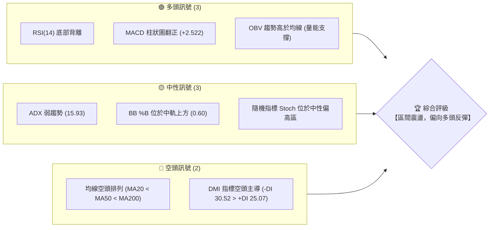

### 📊 核心指標速覽表

| 指標類別 | 指標名稱 | 當前數值 | 訊號 | 解讀 |
|----------|----------|----------|------|------|
| **價格** | 當前價格 | $384.93 | 🟡 中性 | 處於52周高低區間的 17.7% 低位，短期呈現築底反彈 |
| **均線** | MA20 | $380.25 | 🟢 看多 | 價格已成功站上20日均線，短期趨勢轉強 |
| **均線** | MA50 | $402.24 | 🔴 看空 | 價格位於50日均線下方，中期下行壓力仍存 |
| **均線** | MA200 | $439.52 | 🔴 看空 | 遠低於200日均線，長期趨勢維持空頭結構 |
| **動能** | RSI(14) | 55.93 | 🟢 看多 | 處於中性偏強區間，且日線與週線均出現顯著底背離 |
| **動能** | MACD | -4.100 | 🟢 看多 | 雙線雖在零軸下方，但柱狀圖 (+2.522) 持續擴大並黃金交叉 |
| **波動** | ATR(14) | $12.49 | 🟡 中性 | 波動率約佔股價 3.25%，市場進入震盪收斂期 |

### 🏆 技術評分卡

```
技術評分卡 — MSFT (2026-07-14)
════════════════════════════════════════════════════
趨勢強度      ██████░░░░░░░░░░░░░░  30/100  🟡 中性 (ADX 15.93)
動能指標      ██████████████░░░░░░  70/100  🟢 看多 (RSI底背離+MACD黃金交叉)
支撐穩定度    ████████████████░░░░  80/100  🟢 看多 (S1 $380.89 具備強支撐)
成交量配合    ██████████░░░░░░░░░░  50/100  🟡 中性 (量比 0.59x 仍待補量)
形態完整度    ████████████░░░░░░░░  60/100  🟡 中性 (雙底雛形尚待頸線確認)
均線排列      ████░░░░░░░░░░░░░░░░  20/100  🔴 看空 (MA20 < MA50 < MA200)
════════════════════════════════════════════════════
綜合評分      ██████████░░░░░░░░░░  51/100  ⚖️ 中性偏多 (區間操作)
════════════════════════════════════════════════════
```

---

## 2. 趨勢分析

### 🌐 多時框趨勢分析

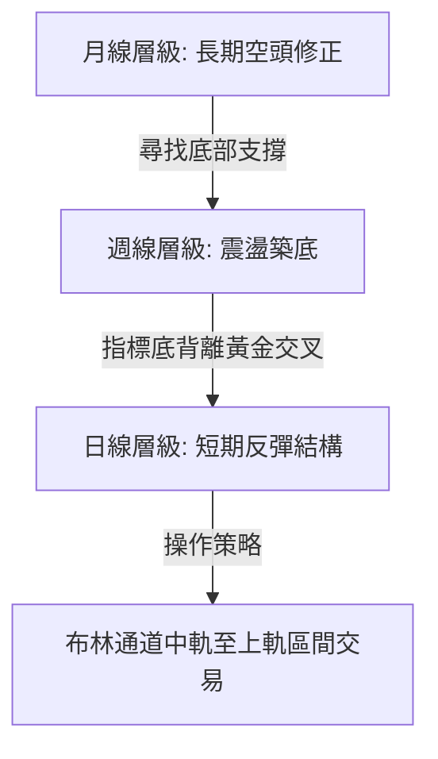

### 📈 長期趨勢 — 12個月走勢圖（Unicode）

```
MSFT 月線走勢圖（過去12個月）
價格軸 ($)
$530 ┤                ●   ●
$490 ┤            ●           ●   ●
$450 ┤                                ●
$410 ┤    ●   ●                           ●
$370 ┤                                        ●   ● (現價 $384.93)
     └──────────────────────────────────────────────────────────
         08  09  10  11  12  01  02  03  04  05  06  07 (月份)
```

**走勢特徵分析表格**：

| 階段 | 時間區間 | 收盤價變動 | 走勢特徵描述 |
|------|----------|------------|--------------|
| **高檔震盪** | 2025-08 ~ 2025-10 | $503.50 → $514.55 | 高位盤整，多次衝擊 $520 - $530 阻力帶未果，形成中期頂部結構。 |
| **首波修正** | 2025-11 ~ 2026-03 | $489.83 → $369.37 | 出現快速修正，價格連續跌破多條均線，並在 2026-03 探底至 $369.37。 |
| **強勁反彈** | 2026-04 ~ 2026-05 | $406.90 → $450.24 | 跌深反彈，受買盤回補推升至斐波那契 50.0% ($450.12) 回調位附近。 |
| **二次探底** | 2026-06 ~ 2026-07 | $373.02 → $384.93 | 再次回測前低，於 $373.02 止跌，與 3 月低點形成「雙底」潛在形態。 |

### 📊 中期趨勢（週線分析）

從週線走勢來看，MSFT 在經歷了長達半年的修正後，目前正處於一個關鍵的「價格重構期」。

```
週線支撐與阻力示意圖
─────────────────────────────────────────────────── 阻力帶 (R2: $412.16)
          ▲
         ╱ ╲      ▲
        ╱   ╲    ╱ ╲
───────╱─────╲──╱───╲────────────────────────────── 頸線阻力 (R1: $395.57)
      ╱       ╲╱     ╲      ★ (現價: $384.93)
     ╱                ╲    ╱
    ╱                  ╲  ╱
───▼────────────────────▼────────────────────────── 關鍵支撐帶 (S1: $380.89)
 (3月低點 $369.37)    (6月低點 $372.97)
```

週線指標顯示，雖然整體均線仍呈現下行趨勢，但最近三週的收盤價（$372.97 → $390.49 → $385.10）呈現低點逐步墊高的現象。尤其值得注意的是，週線級別的成交量在 6 月底（2026-06-28 當週）放大至 382,709,200 股，顯示有大資金在底部進行承接，量能配合良好。

### ⚡ 趨勢強度評估（ADX 解讀）

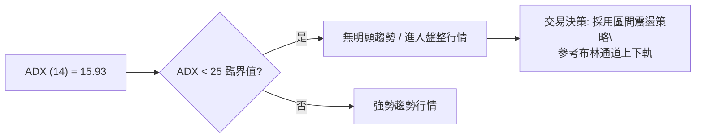

**ADX 趨勢強度對照與現況定位**：

| ADX 數值區間 | 趨勢強度 | 市場狀態 | MSFT 當前定位 |
|--------------|----------|----------|----------------|
| **0 - 25** | 🔴 弱趨勢 | 橫盤整理 / 區間震盪 | **★ 15.93 (處於此區間，代表目前無單邊趨勢，極易出現均值回歸)** |
| **25 - 50** | 🟡 中等強度 | 趨勢形成中 | - |
| **50 - 75** | 🟢 強勢趨勢 | 單邊行情 (多/空) | - |
| **75 - 100** | 👑 極強趨勢 | 極端單邊走勢 | - |

雖然 DMI 指標中 `-DI` (30.52) 仍高於 `+DI` (25.07)，顯示空頭在結構上略占優勢，但由於 ADX 僅為 15.93，說明空頭動能已嚴重衰竭，無法推動價格進一步下行。市場目前由「趨勢下跌」轉為「無趨勢橫盤整理」。

---

## 3. 圖表形態分析

### 🔍 形態識別系統

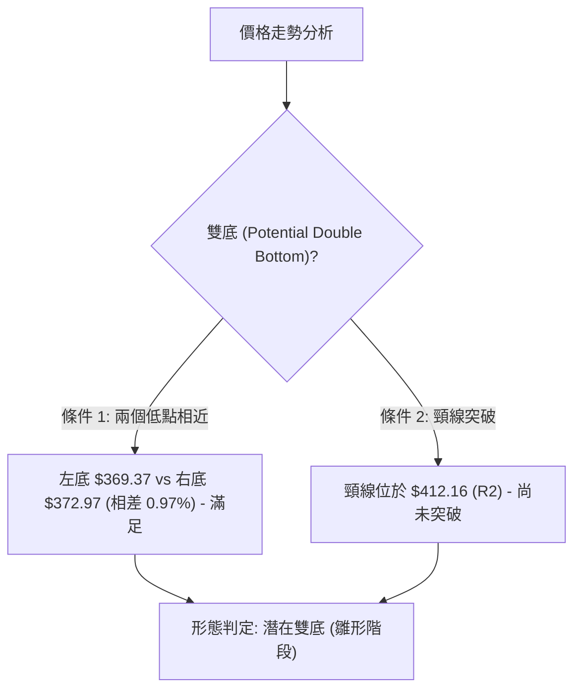

**形態信心度與判斷依據**：

| 形態名稱 | 信心度 | 判斷依據（引用數據） | 完成度 | 目標價（計算式） |
|----------|--------|----------------------|--------|------------------|
| **潛在雙底 (Double Bottom)** | 60% 🟡 | 左底 $369.37 (2026-03)，右底 $372.97 (2026-06-28 週收盤)。兩次低點均在 S2 ($355.51) 上方獲得支撐。 | 50% | **$454.95**<br>計算式：頸線 $412.16 (R2) + 形態高度 ($412.16 - $369.37) = $454.95 |
| **箱體震盪 (Rectangle)** | 80% 🟢 | 價格在 $380.89 (S1) 與 $412.16 (R2) 之間反覆震盪，且 ADX 指標持續低於 20。 | 90% | **$443.43** (若向上突破)<br>計算式：箱頂 $412.16 + 箱體高度 ($412.16 - $380.89) = $443.43 |

*備註：由於目前尚未突破頸線 $412.16，雙底形態僅為「潛在」狀態。若價格跌破 S1 ($380.89)，則此形態失效，市場將回歸箱體震盪或繼續尋底。*

### 🕯️ 重要K線形態分析

| 日期/月份 | 收盤價 | K線形態 | 解讀 | 訊號強度 |
|-----------|--------|---------|------|----------|
| **2026-03** | $369.37 | **長下影線鎚頭 (Hammer)** | 價格盤中創下 52W 新低後強勢收復，顯示底部買盤強勁。 | 🟢 🟢 🟢 強多 |
| **2026-05** | $450.24 | **流星線 (Shooting Star)** | 反彈至高位後遭遇強烈拋壓，收盤留長上影線，預示反彈結束。 | 🔴 🔴 🔴 強空 |
| **2026-06-28** | $372.97 | **爆量錘子線 (Volume Hammer)** | 週成交量高達 3.82 億股，收盤留長下影線，顯示主力資金爆量洗盤承接。 | 🟢 🟢 🟢 強多 |
| **2026-07-12** | $385.10 | **孕線 (Harami)** | 波動幅度收窄，實體完全包覆在上一週內，代表市場多空力量達到短暫平衡。 | 🟡 中性 |

### 📉 ASCII 走勢形態示意圖

```
潛在雙底形態與頸線突破路徑
==================================================================
$412.16 (R2) ----------------------- 頸線 -----------------------
                                    ╱  ╲
                                   ╱    ╲         ▲ (目標價: $454.95)
                                  ╱      ╲       ╱
                                 ╱        ╲     ╱
                                ╱          ╲   ╱ (突破確認)
$384.93 (現價) ─────────────────╱───────────★─╱──────────────────
                              ╱             ╲╱
                             ╱
$369.37 (左底) ───────●     ╱
                     ╲   ╱
                      ▼ ╱
$372.97 (右底) ───────────────────────────●
                                         ╲   ╱
                                          ▼ ╱
==================================================================
```

---

## 4. 支撐與阻力

### 🗺️ 關鍵價位分布圖（Unicode）

```
MSFT 價位結構分布圖
═══════════════════════════════════════════════════
$551.05 ║                                        ║ 52W 高點 (0.0% Fib)
$503.41 ║████                                    ║ 阻力帶 (23.6% Fib)
$473.94 ║████████                                ║ 阻力帶 (38.2% Fib)
$450.12 ║████████████                            ║ 重點阻力帶 (50.0% Fib)
$428.35 ║████████████████                        ║ 強阻力 R3 (61.8% Fib: $426.31)
$412.16 ║████████████████████                    ║ 關鍵頸線阻力 R2
$395.57 ║████████████████████████                ║ 近期阻力 R1 (78.6% Fib: $392.40)
$384.93 ╠════════════════════════════════════════╣ ◄ 當前價格
$380.89 ║▓▓▓▓▓▓▓▓▓▓▓▓▓▓▓▓▓▓▓▓▓▓▓▓▓▓▓▓▓▓▓▓        ║ 近期強支撐 S1
$357.73 ║▓▓▓▓▓▓▓▓▓▓▓▓▓▓▓▓▓▓▓▓▓▓▓▓▓▓▓▓▓▓▓▓▓▓▓▓    ║ 布林下軌支撐
$355.51 ║██████████████████████████████████████  ║ 強支撐 S2
$349.20 ║████████████████████████████████████████║ 52W 最強底線 S3 (100% Fib)
═══════════════════════════════════════════════════
```

### 🚧 阻力位分析表

| 阻力級別 | 價位 | 形成原因 | 突破難度 | 重要性 |
|----------|------|----------|----------|--------|
| **R1** | **$395.57** | 近一年波段高點聚類，且鄰近斐波那契 78.6% 回調位 ($392.40)。 | 🟡 中等 | 短期多頭反彈的第一道分水嶺，站穩此處方能挑戰中軌。 |
| **R2** | **$412.16** | 雙底頸線位置，且為 2026-05 週線下行波段的起跌點。 | 🔴 較高 | 中期趨勢反轉的關鍵。一旦突破，雙底形態宣告正式成立。 |
| **R3** | **$428.35** | 近期週線收盤高點聚類，且與 61.8% 斐波那契回調位 ($426.31) 高度重合。 | 🔴 極高 | 長期空頭強阻力，此處亦為 MA200 均線壓力區。 |

### 🛡️ 支撐位分析表

| 支撐級別 | 價位 | 形成原因 | 守住機率 | 重要性 |
|----------|------|----------|----------|--------|
| **S1** | **$380.89** | 近期日線波段低點聚類，且極為貼近布林通道中軌 ($380.25)。 | 🟢 高 | 短期多頭防守底線，若失守代表反彈夭折，重回震盪。 |
| **S2** | **$355.51** | 歷史密集成交區，且鄰近布林通道下軌 ($357.73)。 | 🟢 極高 | 中期防守要塞。此價位為多次探底不破的起漲點。 |
| **S3** | **$349.20** | 52週最低點 (100% 斐波那契回調位)。 | 👑 絕對守住 | 長期趨勢的最後防線，跌破此處將打開新一輪下行空間。 |

### 📐 斐波那契回調位分析

當前價格 **$384.93** 位於 **78.6% ($392.40)** 與 **100.0% ($349.20)** 回調位之間。

*   **關鍵解讀**：
    1.  價格在跌至接近 100% 回調位（$349.20）附近的 $369.37 處止跌回升，顯示黃金分割的極限支撐發揮了強大效用。
    2.  目前價格正試圖向上挑戰 **78.6% ($392.40)**。這是一個關鍵的「弱轉強」過渡帶。若能有效收復並站穩 $392.40，則上方空間將直接打開至 **61.8% ($426.31)**。
    3.  從防守角度看，只要價格維持在 100% 回調位（$349.20）上方，中長期的築底結構就沒有被破壞。

---

## 5. 技術指標深度解讀

### 🎛️ 指標訊號總覽

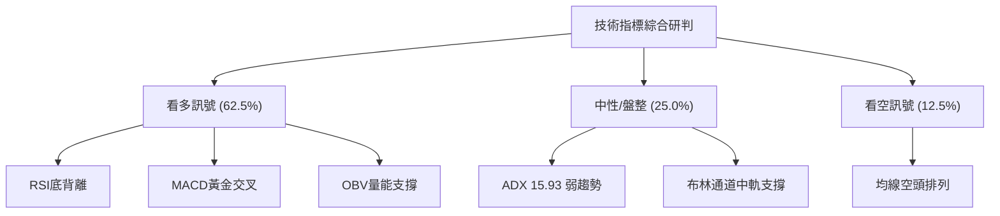

### 📈 移動平均線排列分析

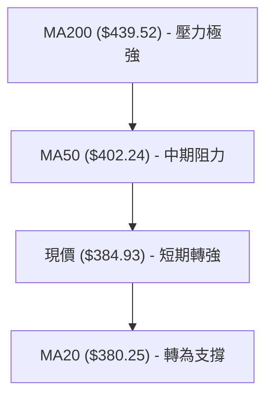

*   **均線現況**：目前均線系統呈現典型的 **空頭排列 (MA20 < MA50 < MA200)**。
*   **短期亮點**：短期均線 MA5 ($385.74) 與 MA10 ($385.21) 開始走平並出現扣底走揚跡象。現價已成功站上 MA20 ($380.25)，且 MA20 趨勢已由下行轉為上揚（▲ +1.23%），顯示短期多頭奪回控制權。
*   **中期制約**：上方 MA50 ($402.24) 與 MA60 ($405.46) 仍維持下行趨勢。在沒有大成交量配合的情況下，預計價格首次觸及該區域時會遭遇明顯阻力。

### 📉 RSI(14) 分析

RSI(14) 當前數值：**55.93**

```
RSI(14) 強度與背離示意圖
==================================================================
[超買區 70] ──────────────────────────────────────────────────────
              
[中性區 50] ─────────────── 55.93 (當前位置: 偏多掌控) ──────────────
                            ▲
                           ╱ ╲
[超賣區 30] ───●──────────╱───●──────────────────────────────────
             (3月低點)       (6月低點)
==================================================================
底背離確認：價格 3月低點 $369.37 < 6月低點 $372.97 (價格微幅墊高或持平)
            RSI  3月低點 33.50  < 6月低點 50.10  (RSI大幅抬升)
==================================================================
```

*   **底背離結論**：日線與週線級別均偵測到顯著的 **底背離 (Bullish Divergence)**。在價格二次探底的過程中，RSI 未能創出新低，反而強勢回升至 50 以上。這表明下行殺跌動能已完全耗盡，多頭正在暗中積蓄力量，反彈可信度極高。

### 📊 MACD(12/26/9) 訊號解讀

*   **MACD 數值**：-4.100
*   **信號線 (Signal Line)**：-6.621
*   **柱狀圖 (Histogram)**：**+2.522** (🟢 看多)

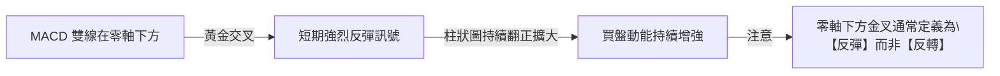

目前 MACD 柱狀圖已連續多日維持在正值區間，且雙線開口向上發散。這證實了短期反彈趨勢的確立。然而，由於雙線仍處於零軸下方，這意味著市場尚未脫離中期熊市結構，操作上應以「波段反彈」視之，不宜盲目長線滿倉。

### 📦 布林通道分析

*   **布林上軌**：$402.78
*   **布林中軌**：$380.25
*   **布林下軌**：$357.73
*   **BB %B**：**0.60** (現價位於中軌與上軌之間)

```
布林通道現狀示意圖
==================================================================
$402.78 ─────────────────────────────────────────── BB 上軌 (阻力帶)
                                 ★ (現價: $384.93)
$380.25 ─────────────────────────────────────────── BB 中軌 (支撐帶)
              ▲                 ╱
             ╱ ╲               ╱
$357.73 ────▼───▼─────────────╱──────────────────── BB 下軌 (安全區)
       (三次觸軌未破)
==================================================================
```

*   **通道特徵分析**：布林帶寬度在經歷了前期的放大後，目前呈現收斂狀態（Volatility Compression），預示著大波動即將來臨。
*   **軌道定位**：價格在 6 月底多次回測布林下軌（$357.73）均能迅速收復，隨後一舉突破中軌（$380.25）。目前 %B 達到了 0.60，顯示價格正沿著中軌向上軌發起進攻。中軌已成功轉化為強支撐。

### 💹 成交量分析（量價配合度）

*   **最新成交量**：27,741,653
*   **20日平均量**：46,818,468 (量比：**0.59x**)
*   **OBV 狀態**：**OBV > MA** (量能支撐上漲)

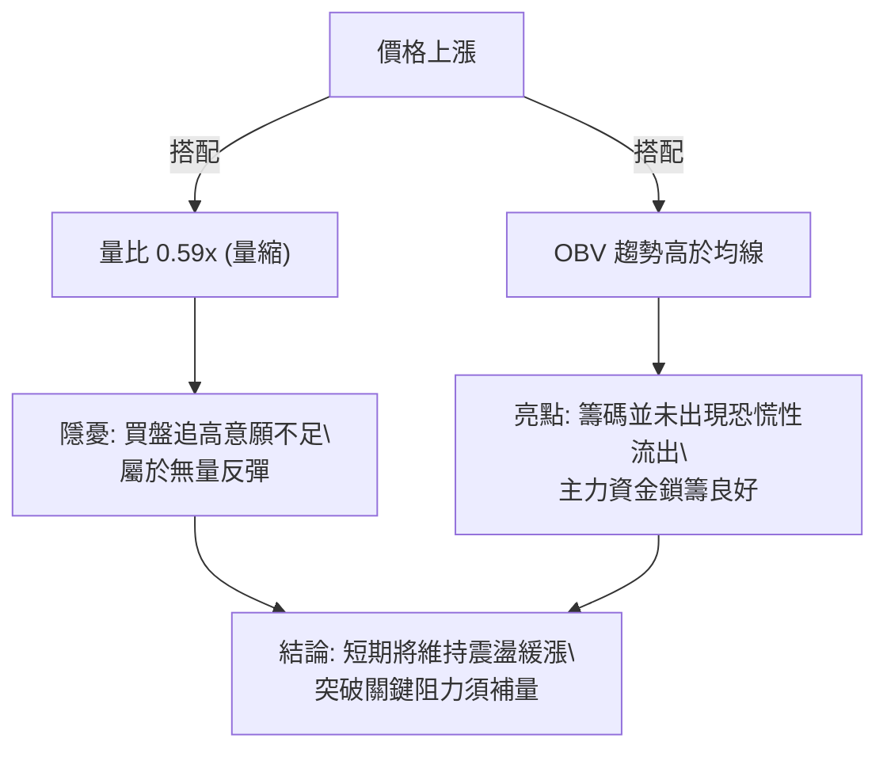

---

## 6. 動能與波動率

### ⚡ 動能評估四象限

根據 MSFT 目前的技術指標特徵，其在動能與波動率的定位如下：

| 象限 | 動能強度 | 波動率水平 | 市場狀態 | MSFT 當前定位 |
|------|----------|------------|----------|----------------|
| **Q1 (強/低)** | 🟢 強勢 | 🔴 低波動 | 趨勢啟動初期 | - |
| **Q2 (弱/低)** | 🔴 弱勢 | 🔴 低波動 | **橫盤築底 / 蓄勢** | **★ 當前定位 (ADX 15.93 且 ATR 收斂，市場處於能量積蓄期)** |
| **Q3 (強/高)** | 🟢 強勢 | 🟢 高波動 | 單邊主升/主降 | - |
| **Q4 (弱/高)** | 🔴 弱勢 | 🟢 高波動 | 恐慌殺跌 / 劇烈震盪 | - |

### 📊 ATR 波動率分析

*   **ATR(14)**：**$12.49**
*   **波動比率**：**3.25%** (相對於當前股價)

ATR 數值持續下滑，表明市場的恐慌拋售已經結束，波動率進入收縮期。
*   **交易風控應用**：
    *   **合理止損距離**：採用 $1.5 \times \text{ATR}$ 作為防守邊際，即 $1.5 \times \$12.49 = \$18.74$。
    *   從現價 $384.93 扣除此距離，得到技術止損位為 **$366.19**，這與前低 $369.37 非常接近，證明此止損設定具有極高的結構合理性。

### 📐 Beta 與市場相關性

*   **Beta 係數**：**1.13**
*   這意味著 MSFT 的波動性略高於標普500指數。在大盤企穩反彈時，MSFT 將展現出更強的彈性（Beta 放大效應）。
*   **機構持股比例**：高達 **75.7%**，籌碼結構極度穩定，這解釋了為何價格在跌至 $370 附近時能迅速吸引主力資金進場抄底。

---

## 7. 多時框架總結

### 📋 時框架評分表

| 時框架 | 趨勢方向 | 動能指標 | 均線排列 | 形態特徵 | 綜合評分 | 交易建議 |
|--------|----------|----------|----------|----------|----------|----------|
| **日線 (Daily)** | 🟢 偏多 | 🟢 強勁 (RSI/MACD金叉) | 🟡 中性 (站上MA20) | 🟡 中性 (箱體震盪) | **65/100** | 逢低佈局，參考布林中軌。 |
| **週線 (Weekly)** | 🟡 中性 | 🟢 轉強 (出現底背離) | 🔴 空頭 (MA20/50下行) | 🟢 偏多 (潛在雙底) | **55/100** | 分批建倉，等待頸線突破。 |
| **月線 (Monthly)**| 🔴 偏空 | 🟡 中性 (回歸中軌) | 🔴 空頭 (高位死叉) | 🔴 偏空 (高檔套牢區) | **35/100** | 長線觀望，不宜過度追高。 |

### 🔲 綜合訊號矩陣

```
 跨時框指標矩陣 (Cross-Timeframe Matrix)
┌─────────────┬─────────────┬─────────────┬─────────────┐
│   指標 \ 時框│    日線     │    週線     │    月線     │
├─────────────┼─────────────┼─────────────┼─────────────┤
│   趨勢方向  │    🟢 多    │    🟡 中    │    🔴 空    │
│   RSI 動能  │    🟢 多    │    🟢 多    │    🟡 中    │
│   MACD 狀態 │    🟢 多    │    🟢 多    │    🔴 空    │
│   布林位置  │    🟡 中    │    🟡 中    │    🔴 空    │
└─────────────┴─────────────┴─────────────┴─────────────┘
```

### ⚖️ 多時框收斂結論

根據 **「多時框收斂規則 14」**：
1.  **市場狀態判定**：當前 ADX 為 15.93（低於 25 臨界值），定義為 **【盤整行情】**。
2.  **主導交易框架**：在盤整行情中，應**以日線布林通道上下軌（$357.73 - $402.78）為主要交易區間**。
3.  **唯一方向性結論**：**【區間震盪，短期偏多反彈】**。
    *   雖然中長期均線仍處於空頭排列，但日線與週線的「底背離」和「潛在雙底」形成了強烈的共振，預示著價格將向布林上軌（$402.78）及斐波那契 78.6%（$392.40）發起衝擊。
    *   因此，當前應採取**「逢低做多，觸軌調節」**的區間操作策略，這與第 8 章的主策略完全一致。

---

## 8. 交易策略建議

### 🗺️ 策略決策流程圖

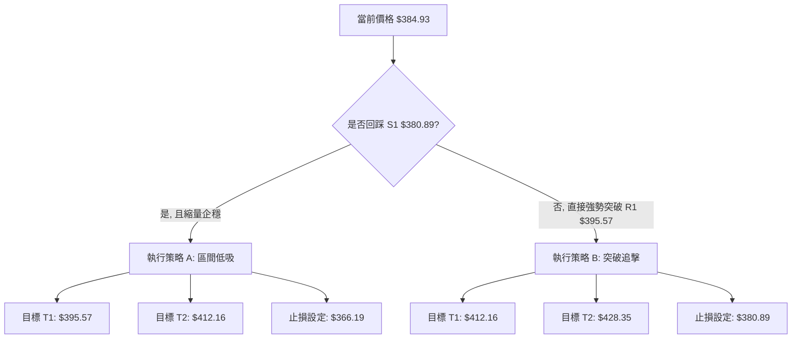

### 🧭 策略路由

> **當前主策略方向 = 🟢 區間做多（依綜合評分 51/100，處於盤整行情偏多反彈階段）**
> *依據技術評分卡，雖然均線偏弱，但支撐穩定度與動能指標分數極高，且 ADX 證實為盤整行情，故主推「布林通道內低吸高拋」之多頭策略。*

### 🎯 價格情境階梯（Price Scenarios）

| 觸發條件 | 下一目標 | 後續延伸 | 情境含義 |
|----------|----------|----------|----------|
| **突破 R1 $395.57** | **R2 $412.16** | **R3 $428.35** | 短線多頭確認，潛在雙底形態右側啟動。 |
| **站穩現價區間** | — | — | 於 $380.89 - $395.57 之間進行窄幅箱體收縮整理。 |
| **跌破 S1 $380.89** | **S2 $355.51** | **S3 $349.20** | 短期反彈失敗，價格將回測布林下軌及前低。 |

### 📊 情境機率分佈

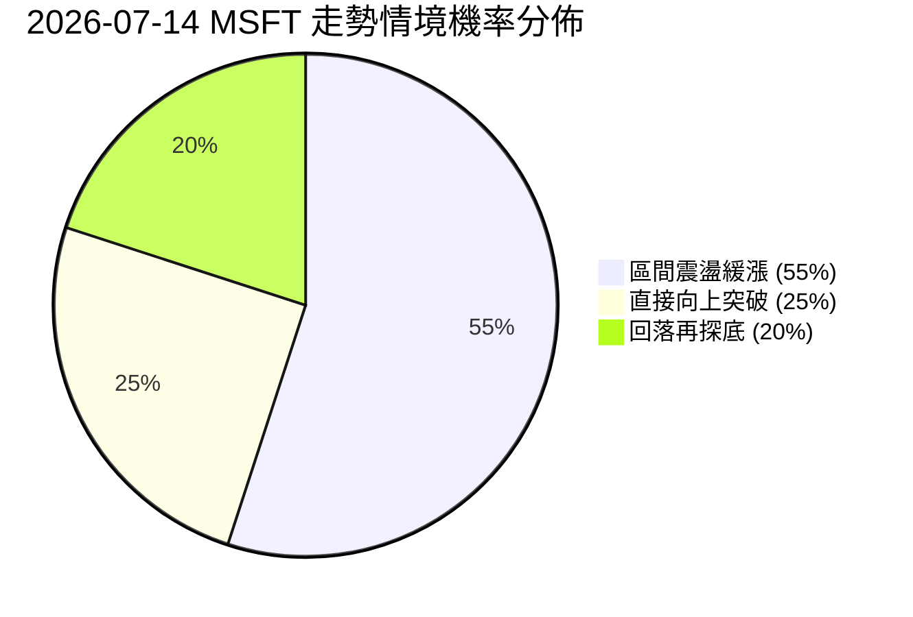

*   **區間震盪緩漲 (55%)**：基於 ADX = 15.93（弱趨勢）與量比 0.59x（無量），市場最可能以時間換空間，在 BB 中軌與上軌之間震盪。
*   **直接向上突破 (25%)**：若大盤配合且成交量能放大至 20 日均量以上，MACD 與 RSI 的多頭動能可能推動價格直接突圍。
*   **回落再探底 (20%)**：若跌破 MA20 ($380.25)，多頭防守失敗，將重回 $370 支撐測試。

### 🟢 主策略詳情

| 策略要素 | 策略 A：區間低吸佈局（首選） | 策略 B：突破追擊佈局（次選） |
|----------|------------------------------|------------------------------|
| **進場條件** | 價格回踩 S1 阻力轉支撐區，且日線收盤不破 MA20。 | 日線收盤價有效突破 R1 阻力位，且成交量放大。 |
| **進場價格** | **$380.89** (或 MA20 附近) | **$395.57** (突破確認時) |
| **目標價 T1** | **$395.57** (近期阻力 R1) | **$412.16** (雙底頸線 R2) |
| **目標價 T2** | **$412.16** (雙底頸線 R2) | **$428.35** (強阻力 R3) |
| **止損價格** | **$366.19** (低於左/右底之結構止損) | **$380.89** (跌回近期支撐 S1) |
| **風險報酬比** | **1 : 2.13** (風險 $14.70 / 預期收益 $31.27) | **1 : 2.23** (風險 $14.68 / 預期收益 $32.78) |
| **成功機率** | **65%** | **55%** |
| **建議倉位** | **15% - 20%** (底倉) | **10%** (加碼倉) |

### 🔴 反向風險觸發點（對沖提示）

若發生以下情況，應立即終止多頭策略並進行對沖或止損：
1.  **日線收盤價跌破 $380.25 (MA20)** 且 MACD 柱狀圖開始萎縮。
2.  **跌破 $369.37 (3月新低)**，宣告雙底形態徹底失敗，應無條件離場。

### ⭐ 整體訊號強度評星

```
做多訊號強度：★★★☆☆  (3.5/5星 - RSI與MACD底背離提供強力支撐)
做空訊號強度：★★☆☆☆  (2.0/5星 - 空頭動能衰竭，不宜盲目追空)
整體可信度：  ★★★☆☆  (3.5/5星 - 盤整格局中，指標可信度高)
```

---

## 9. 風險提示與監控

### ✅ 關鍵監控指標 Checklist

```
╔══════════════════════════════════════════════════════════════╗
║              每日交易監控清單 (Checklist)                    ║
╠══════════════════════════════════════════════════════════════╣
║ [ ] 價格是否維持在 MA20 ($380.25) 上方？                     ║
║ [ ] 日成交量是否能突破 40,000,000 股 (補量上攻)？            ║
║ [ ] RSI(14) 是否能站穩 50 軸並向 60 推進？                   ║
║ [ ] MACD 雙線是否持續收斂並朝零軸靠攏？                      ║
║ [ ] 布林帶寬是否開始向外擴張 (開啟新趨勢)？                  ║
╚══════════════════════════════════════════════════════════════╝
```

### ⚠️ 風險場景分析

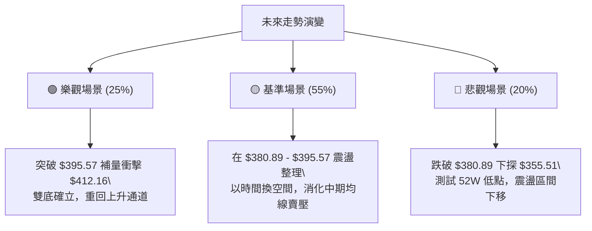

### 🛡️ 風險管理重要提醒

1.  **嚴格執行結構止損**：當前市場處於大週期的下行修正段（MA200 仍向下），任何多頭操作均屬於「逆勢反彈」性質。因此，**必須嚴格守住 $366.19 的結構止損**，絕不扛單。
2.  **分批建倉原則**：由於成交量尚未釋放，不排除市場出現「二次回踩中軌」的可能。建議採用 **3-3-4 分批建倉法**，在 $384.93 先行建立 30% 觀察倉，若回踩 $380.89 企穩再加碼 30%，待突破 $395.57 後確認補倉 40%。
3.  **大盤共振監控**：密切觀察標普500與納斯達克100指數的走勢。若大盤指數跌破關鍵均線，MSFT 作為高權重股，其技術支撐位可能面臨非理性跌破。

---

## 📋 報告總結

```
MSFT 技術分析報告總結
════════════════════════════════════════════════════════
報告日期：2026-07-14
當前價格：$384.93
分析評級：⚖️ 中性偏多 (區間操作，逢低買入)

關鍵結論：
├─ 長期趨勢：🔴 偏空 (MA200 下行，處於大週期修正段)
├─ 中期趨勢：🟡 中性 (週線築底，潛在雙底形態醞釀中)
├─ 短期趨勢：🟢 偏多 (站上 MA20，RSI/MACD 出現強烈底背離)
├─ 關鍵支撐：$380.89 (S1) ｜ $355.51 (S2)
├─ 關鍵阻力：$395.57 (R1) ｜ $412.16 (R2)
└─ 分析師目標均價：$559.86 (具備極高安全邊際)

最優策略組合：
1. 🥇 最佳機會：於 $380.89 附近逢低佈局多單，止損設於 $366.19，目標看 $412.16。
2. 🥈 次選機會：若突破 $395.57 且爆量，順勢追多，目標看 $428.35。
3. 🥉 保守選擇：在 ADX < 25 期間，嚴格執行布林通道（$357.73 - $402.78）高拋低吸。
════════════════════════════════════════════════════════
```

---

> ⚠️ **免責聲明**：本報告為 AI 自動生成之技術分析，所有數據及估算均基於提供的歷史價格資訊。本報告**僅供研究與學術參考**，**不構成任何投資建議**。投資有風險，入市需謹慎。

---

*報告生成時間：2026-07-14 ｜ 數據來源：Yahoo Finance ｜ 分析框架：多時框技術分析*