<details>
<summary>📊 靜態圖表 (點擊展開)</summary>
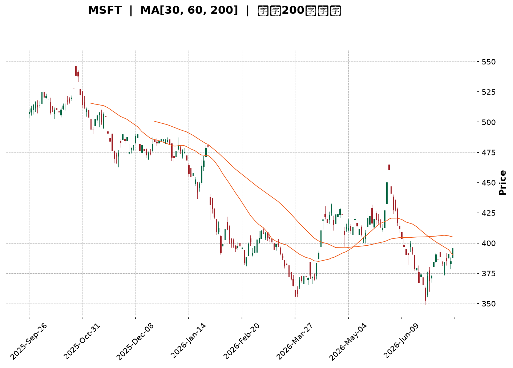
</details>

<html>
<head><meta charset="utf-8" /></head>
<body>
    <div style="height:500px; width:100%;">                        <script>window.PlotlyConfig = {MathJaxConfig: 'local'};</script>
        <script charset="utf-8" src="https://cdn.plot.ly/plotly-3.7.0.min.js" integrity="sha256-jvTGqxNp8AGWEcvNLVuKr+8j5dGe9Yw51LQkmDH+IYA=" crossorigin="anonymous"></script>                <div id="candlestick-chart" class="plotly-graph-div" style="height:100%; width:100%;"></div>            <script>                window.PLOTLYENV=window.PLOTLYENV || {};                                if (document.getElementById("candlestick-chart")) {                    Plotly.newPlot(                        "candlestick-chart",                        [{"close":{"dtype":"f8","bdata":"AAAA4NvDf0AAAABgyPV\u002fQAAAAOCFFYBAAAAAoIMjgEAAAABA9AOAQAAAAKDAEIBAAAAAwPJpgEAAAACAdUWAQAAAACBgTIBAAAAAIOY4gEAAAADA6Lt\u002fQAAAAOAJ7X9AAAAAAGjlf0AAAABgLuN\u002fQAAAAGA+xn9AAAAA4JDlf0AAAAAgTQyAQAAAAKA3E4BAAAAAoBwqgEAAAACARSqAQAAAAKCEQoBAAAAAYGaBgEAAAACgRNWAQAAAAGAi0YBAAAAAIJxTgEAAAADgaBSAQAAAAIA1DoBAAAAAYH3xf0AAAAAAfn9\u002fQAAAAICL335AAAAA4BfbfkAAAACgDG1\u002fQAAAAKCol39AAAAAYMW+f0AAAABA9kF\u002fQAAAAACCr39AAAAAIL2Ef0AAAAAg66p+QAAAAMDeQH5AAAAAIPHEfUAAAADgbWB9QAAAAGBgfn1AAAAA4ACufUAAAABgjzV+QAAAAEBCnX5AAAAA4E9JfkAAAADAPX1+QAAAAKDKuX1AAAAAoFTrfUAAAABASRB+QAAAACB9jX5AAAAA4GqdfkAAAAAgA8d9QAAAAGA5FX5AAAAA4IjGfUAAAAAgcIt9QAAAAGBypH1AAAAAQCWgfUAAAAAgWR1+QAAAACBAPH5AAAAAYFIsfkAAAACgEEt+QAAAAICzXX5AAAAAgMNYfkAAAAAADE9+QAAAAKAZVX5AAAAAIJ0XfkAAAADAfW19QAAAAMAObH1AAAAAYDfGfUAAAABgORV+QAAAACDYv31AAAAAQHvSfUAAAADAB7F9QAAAACBVSX1AAAAAYH6VfEAAAACgKmp8QAAAAKAjnXxAAAAA4BNIfEAAAACAQaJ7QAAAAOA8EnxAAAAAoCX+fEAAAACgHkN9QAAAAIAw531AAAAAIOr3fUAAAADAP\u002fl6QAAAAOAdxnpAAAAAQONXekAAAACgMJZ5QAAAAMCoxXlAAAAAYMt+eEAAAADgyPV4QAAAAMBCvHlAAAAAAAG3eUAAAAAgPCl5QAAAAEDvAHlAAAAA4Kb4eEAAAACgm7F4QAAAAOBA3XhAAAAA4JTZeEAAAADA8cV4QAAAAKA5+ndAAAAAgIxCeEAAAABgv\u002ft4QAAAAAChDXlAAAAAYEJ+eEAAAACgBNt4QAAAAIDpMHlAAAAAQDBFeUAAAADArZx5QAAAAOA3gXlAAAAAIGeIeUAAAAAgIU55QAAAAGAUQHlAAAAAIN0PeUAAAABAH6t4QAAAAMBe8XhAAAAAoL\u002foeEAAAACgF294QAAAACDeQnhAAAAAILfQd0AAAACgweJ3QAAAAGDzPndAAAAAYM8jd0AAAACA3dJ2QAAAAKD7P3ZAAAAAgPJidkAAAACA6xV3QAAAAMAlCXdAAAAAIHJKd0AAAACgL0F3QAAAAEDEN3dAAAAAAFZYd0AAAABAOER3QAAAAIAYIXdAAAAAAKH4d0AAAACgKoR4QAAAAOBMpXlAAAAAwKA1ekAAAABABV56QAAAAOCpEnpAAAAAoORzekAAAAAAwP96QAAAAKCf7XlAAAAAoDx7ekAAAAAgbn56QAAAACAoxXpAAAAAoK54ekAAAAAgYW55QAAAAIC12HlAAAAAAJ7LeUAAAADg2qd5QAAAAKAL0XlAAAAAIMU9ekAAAADAkON5QAAAAGBKvHlAAAAAIDhueUAAAAAgWUV5QAAAAOC4iHlAAAAAYCFQekAAAACg\u002fml6QAAAAEBJCHpAAAAAYGZCekAAAACgcDF6QAAAAMAeKXpAAAAA4HoAekAAAABguMp5QAAAAADXr3pAAAAAANcjfEAAAADgUch8QAAAAMD1lHtAAAAAoHC1ekAAAADAzMB6QAAAAGC4CnpAAAAAANe7eUAAAABgjzZ5QAAAAIDC1XhAAAAAoHBleEAAAAAA12t4QAAAAAAp\u002fHhAAAAAoEedeEAAAABgj653QAAAAGBmtndAAAAAoHD1dkAAAABACl93QAAAACBc13ZAAAAAoEcNdkAAAAAghU93QAAAAMAeCXdAAAAA4FFQd0AAAADgegR4QAAAAADXZ3hAAAAAANcreEAAAACgcE14QAAAAKBw9XdAAAAAgMIFeEAAAACgmRF4QAAAAADXb3hAAAAAQOEOeEAAAACAFLp4QA=="},"high":{"dtype":"f8","bdata":"g00yEkrrf0DfBREwxwyAQK04OisxF4BA7MpjsN8pgEAl1df4iTKAQIyPQee2KYBARSMWK4F9gEAVYJ7cuXOAQDVT7O4RXYBAikDp3z1IgEBvEaWHR0KAQN6sNcVHCYBAf9apFUwAgEBOxdU5ew+AQCgMaybHDIBAF2QAE+MBgEAcVNRBfBuAQGODZNlnG4BAFF7rTGVPgECgD5GOOEWAQEml6bJZUIBA6XN7z7mZgEDy++mX4TGBQGdw8Smo9oBAmiqda9OcgEAk0A4G6W+AQHO\u002fUuo\u002fTYBAKo2cdnECgEDKzQypcPl\u002fQBlLpG9HaH9A+2xYossDf0AX\u002fcpWkHp\u002fQBhsvEhJpn9AgtJ1ljLHf0AQ1IIvS+R\u002fQCC\u002fNsUVxn9AjalKRlrOf0DjNG96CD1\u002fQCtbo3ktwX5Adt4AsBu2fkB3mEJDv8x9QOGQYRaSrH1A5qQ+BmnQfUD05oMYUmJ+QBFqt30ip35AXj1jtwJ7fkChDuow\u002frR+QEKvokd9IX5AUUZ2CPryfUCufk3kGxR+QKPLc8HgoX5AM3cUrwKffkBTInsLpiF+QPgcw6IAPn5AQe47EPoEfkCqq4Bba+l9QP+jpyJXvH1Am8oySvPdfUBZrRiR3nZ+QDSDmVP+Wn5AbDPF7wJpfkDLBzbUrFp+QIZ9KEzcb35Api7zbUtffkCMfN9M9WJ+QAsKiMwkeH5ANK4AC51ffkBQxMEKLih+QOAJfGZZn31AgijYMuHJfUAYriRddnh+QJZsZV9SCH5AtPeMURXbfUAqradPuO19QJ17NdS6mn1ABysz9fwhfUAOQD5rEeN8QDTFOOcu0nxAIsR7WGVsfEAERQdw7Sp8QG2U7SBRLXxAMx72eS5QfUCxwrKnW4J9QDNWGMqqC35AAqLKToYZfkC10\u002fFPnIh7QDj5j45qWntA8hza6UjNekCvSMll3EJ6QIkWEGAFH3pAeiZJEtZneUBKkTxyIwB5QJXy4TLP0HlA\u002fHwBVdNcekBEEfgx0el5QJfjkbJiRnlAT3ekXd87eUA97geJ6Ot4QFx\u002fFz9nDHlAuVT+JuU4eUC3osuKFfR4QHEV1ZgWqHhA1j830EtIeEDrnmosowl5QEJPMcy\u002faXlAl7z7AWa\u002feEBzsCjBKgV5QGanivoiXXlALCL5Q0SieUBGdHDEhqt5QPT5QkuEwnlA3csPyyyVeUA4XjYSBJV5QIw9nVAEgnlA84YKauBTeUCgiupdzT55QFGY\u002f\u002fo5\u002fHhAmTGSc2o4eUBaD\u002fXGPNJ4QDjiQYhEenhALDCfNp4ieEDklYV7+CV4QPUh1V1L2ndAbZjO9euDd0AHYSkLkF53QF8O77eqmnZAW8JjOCDJdkDAH1BVgUF3QNGxS1roUndA1+0H6FFNd0DhZLW5wU53QLC4ZjVSOndA9mwl7K8CeEDSRZCxFUt3QCNraEZAbXdAkV653lf7d0Dn329jZJ14QFtJgV2X13lAYyLyipE+ekC2MHUwW+p6QE7m6S+kZnpAXOY1xBukekCAvVv4Mwx7QPU0Sfroa3pAw98ddIGAekA6dX2a\u002faJ6QDbtnJHaz3pAH+yuW1yeekCgwqTYY9h5QMVgTx1WA3pA6CgH\u002fu09ekBclLVyEf55QJojvmRAGHpAYL7ejOGwekCk\u002f7Ctmht6QM5UBPzEvHlAF6Qa0qHpeUC84TQD6VZ5QGqRguoyr3lAgYwtDOqzekA1wYBDOIN6QGSLqNw8\u002fHpAmssgCwFTekAAAACgcKV6QAAAAGBmhnpAAAAA4FE8ekAAAABACv95QAAAAADX13pAAAAAoEclfEAAAADAHiV9QAAAAAAAWHxAAAAAgD2Ge0AAAABgZkJ7QAAAACCF13pAAAAAYI8SekAAAAAgrr95QAAAAOCjUHlAAAAAoJnNeEAAAAAA13t4QAAAAAAAHHlAAAAAoHDNeEAAAACA62V4QAAAAIDr1XdAAAAAgBTad0AAAAAghZN3QAAAAIAUrndAAAAAIK7DdkAAAACAwol3QAAAAAAAyHdAAAAAYGZid0AAAACgR014QAAAAEAzg3hAAAAAYGZSeEAAAADAHrl4QAAAAMD1FHhAAAAAYGYKeEAAAABgj354QAAAAGBmmnhAAAAAQApDeEAAAAAgXO94QA=="},"hovertemplate":"\u003cb\u003e%{x|%Y-%m-%d}\u003c\u002fb\u003e\u003cbr\u003e\u958b: $%{open:.2f}\u003cbr\u003e\u9ad8: $%{high:.2f}\u003cbr\u003e\u4f4e: $%{low:.2f}\u003cbr\u003e\u6536: $%{close:.2f}\u003cextra\u003e\u003c\u002fextra\u003e","low":{"dtype":"f8","bdata":"uDGMA+h2f0BSVmLS1pp\u002fQN3GRpI9p39AEOQe\u002fYPHf0DaTSgvdbd\u002fQNvq4lMk\u002fH9AlykZqIIXgEC1K8ZcRDGAQNy09G5iPoBAW7+zkSYRgEBIKrRow6Z\u002fQKWgondbx39A2FWIYwxtf0DffouKpax\u002fQPy2sxTqjn9AR\u002flQgOCBf0DyopZcLuN\u002fQAYQlNf63H9AcSOxWZ0TgECvfhwCxRqAQN9naeB2K4BAmrDSOXJtgEDDw2wB78qAQOnU7h\u002fRqoBAB5dGSqw2gEDMg79bu\u002f1\u002fQAJl\u002fKWf9X9AYb6ojE2Kf0B1rZIzRXZ\u002fQONx5+AIy35AA9DMJlWifkBM2QX5kvp+QFnPPCwEM39AH6XfOan\u002ffkDD4CXOKSJ\u002fQDIEQGjz5H5AcIGAAbhbf0ACV57Tdjt+QLhk+HWp\u002fH1A9IIpFUWWfUADol4qGiN9QF0yI9geH31AKXU3HEPtfEA8t1i2EPF9QD16E\u002fbgR35ATpg6NAUofkAcsdlTn0J+QFk8wrF9kX1AFujg\u002fgmmfUAV0mcZHMx9QBj2a1S4I35ARtgi7FhlfkCK22IylI99QOmEZfIAnH1AEWocZaajfUAer48EzWZ9QPZyd2+tTH1AKUPCFk6OfUAMvuYXV7x9QHnT7wmdBX5AUuwOv8wIfkD3ailRdCl+QDx4FC7jKn5AG8SBR+M8fkB66NqmiCB+QMJz2XSPNX5AQ2esL4QSfkDqjvdbNUF9QC+z5fWxNn1AaUFjdK06fUAwegS+S719QBNmCfwAnH1Ax3EyMrRhfUCqX179Ipl9QE+dy7Yl\u002fnxA0l\u002flYUpyfEBJ8CttD158QILFBaFMZ3xA4JFCCJz0e0BKr7Pbwkt7QGCpB5Onq3tAVYXLRoUIfECC8zkdOr98QNEkYv7+cH1Ak5Kyixe+fUCR3EJCdDJ6QNJa1vvyiHpAACa2FgxGekBvLphf+mt5QK5602PPdnlAai0VREppeEDNqAwG2XJ4QJTjg8x78XhA0+DCueyteUD2pniktvN4QEXAWy3tw3hAyjL9QZDEeEAwTtxPfox4QF7AnJABqXhAWJpi+AC9eECPvv5S5aR4QIEHuEBa5HdAhT5SKCnOd0DM9SOLEVV4QNRKOkEN3nhAIU43MZlQeEDKhWJ8klx4QC0vh00kfXhA5DHYCR73eECWSM93ajh5QFNMv7sIenlAvVhLEQwqeUC7rkpt8iB5QHndyp+NC3lAW9zpE3gNeUCas\u002f4BXpZ4QHHpnQ39nnhA7hrw8T7OeEAj8k++emJ4QNhLv1mTI3hAzrzEnca0d0BuJFaPrs13QG0w4uC9MHdAXFJHe0wNd0DMtpiHacZ2QHo0Kg3VO3ZAbkJg+Sg4dkCtLAy6kKR2QJz4Ydt39nZAbjBXys61dkBaGswLOQt3QKKTS9lI3HZAM7wembcpd0Dm\u002f2KKG+R2QBVUj0+vE3dAPDUdjX0jd0AwU\u002fNV9Bp4QAFOHiX2vXhAu8FaIf2zeUBt8vU2fjx6QK0ZMYtn9nlA8dx6HMYEekCxHnPiEWx6QAetVWtVqHlAdc7c82vueUCCo+u6sgJ6QJOxnJDPT3pAk\u002fUZShs2ekBkkGO8ZdJ4QL0Uw+jYmHlAx4CwNpieeUC3OsD2qX55QJ6ky1fAQ3lAXP\u002fzCq4dekCD3Bsqr9F5QFa\u002f9mH6SXlAQuTEwC1ceUCtvovgnAJ5QGqvxM83AHlAZ4mWIkjAeUDYtqxyY+t5QLFdmxtw+XlAuDctxpOmeUAAAAAgXPt5QAAAAKBHBXpAAAAA4FHQeUAAAACgR5l5QAAAAGC4ynlAAAAAgMIFe0AAAADgUaR8QAAAAEDhhntAAAAAAACEekAAAABgj6Z6QAAAAGBm5nlAAAAAwPWIeUAAAAAgrud4QAAAAGCP0nhAAAAAAAAAeEAAAADgUeR3QAAAAKCZjXhAAAAAQApreEAAAADAHpV3QAAAAOB6VHdAAAAAwB7xdkAAAABguCp3QAAAAOB6zHZAAAAAQDPTdUAAAABA4TZ2QAAAAGBmfnZAAAAAQDP3dkAAAACAPW53QAAAAEAz+3dAAAAAIIXTd0AAAAAghUN4QAAAAKBH1XdAAAAAoJlVd0AAAAAAANh3QAAAAGBmAnhAAAAAYGaqd0AAAABgZiZ4QA=="},"name":"\u50f9\u683c","open":{"dtype":"f8","bdata":"V8itlpmtf0ATbebIfsR\u002fQNOMueko4H9ARVvvUfb4f0BVWtMCDxOAQLNp5djDDoBA3Eth\u002f8QagEAPF\u002ffSuGeAQCTTChzlP4BA9uD2BWw4gEA5N90v9SKAQN6sNcVHCYBAb9kZeU2wf0CwiFPvgft\u002fQI2ErJ6q1X9AAvzYB2Kdf0AzCc0x8fV\u002fQKPb1Q\u002fyEYBArP4YI\u002fYugECmGNNCYDmAQAz3m9H\u002fO4BAK9EXhneDgEB3bEkKTxSBQPkmbG4V7IBAJitlyiF5gEDzD9+RaWyAQIHiQgtPJIBAyRDh36DIf0CXwNEZHeF\u002fQPeUqZekZ39ANQgWBindfkBA9RkiSg5\u002fQPLtjST4WX9A7LasQniif0BqupIqk7F\u002fQMkU6+qC8X5AGGTAoACUf0ABnooFCsR+QLkPxA5AcH5ADYIbrmiofkBFb96DDsZ9QFz3JzdOjn1AaO\u002fcpn1\u002ffUDZkmBqdkJ+QG8VlfUCV35AGtfGQGRkfkD+eVNw\u002fkh+QPIQ\u002ftpUo31AeHvInCDafUAAxmFfFwZ+QMXlcxHYK35AS\u002fXBpudufkA3RkHqJB5+QEUWovZEqH1Ah8rfUhXbfUD4sMwdi999QD\u002fNG5sVXX1AoNlRx7qsfUAsRUhlHsF9QMP0qxkwU35AFjFttW8\u002ffkBB9FYVRy1+QI9Fd15tOH5AD3DcqNVIfkBe1aKNXSt+QGCS3OVoPH5Aqu2\u002fndVafkBObOkR4SN+QCfs2eZUf31AX9RoqDB7fUCWR3mfINp9QOFs58iz8X1ACnZM61R\u002ffUBJT9ki6Kh9QAblBS41iX1AXQRHbkUGfUC0zJ1H\u002f+B8QKBULZ3NfHxAFGNbDYMTfEArdGpyfil8QKtdRswq2ntAdcU5kd0dfEAsJz7B8\u002fN8QD4H9w+ZeX1AsTS6DhURfkBFcrfkoGB7QC5qkB2RU3tAwHNJ\u002flHFekAXBKRfOUJ6QG150W3YknlAPvVLMCNaeUCf9luGZ9Z4QL422qXhMHlAOh2ATyccekDYyaxnW+V5QCg7WT1FM3lATsLsiIIqeUByUolkM9d4QLFt\u002fXHWxXhApnltQi\u002f9eEBHDCwKELR4QJP+o0hXonhAIlyABfX0d0AWRKjE+Vp4QHBWKIhdPXlAioMLV5BgeEBg+sS+LIB4QKKMZ0SlhHhAhSZLqnEGeUA28nBKvDh5QJDNEOAMhXlAHtM\u002f37dAeUB4wH0zTZJ5QI5aUoQYS3lAnHOhmhY8eUCT01ZBIgJ5QKMceeRa03hABOsUg3r2eEA13Ij6WMR4QDMMdVAcVHhAtKN+8kMfeEAAQHoIIPF3QDmUJreJ2HdAuiwI06+Bd0AA8yQxTCB3QIGUYrbikXZAR2JkueKRdkDJ6hygMbx2QC+7YcfsSndA+iTEc6nmdkB7T6W57Ep3QHdFGUOiGHdA0L1xOV4CeECqwLuLHjt3QIzPYXLIQndA\u002fVjLP9dMd0C1WkdxTjF4QP7rE8c80nhALMuGyj0vekB4+68nbn56QOAzLjzWQ3pA3WBk8041ekDfmJ9zTZR6QMeN3Xm4L3pA2hVi+BkBekDXJH55eVd6QI9A0U1wenpAxIgQEJl6ekDXSYctwZ55QOPrlYSGvnlApUioyWiqeUC+Y0s\u002fwuZ5QG4feULkcXlAqxOulzszekC6B7unzgd6QN3NF+fQb3lAgk+f+VjZeUAk7\u002fAKQiV5QIhLhpGxOXlA+9OSmP7VeUDzltWBg\u002ft5QK9WBsaIz3pArK4c\u002fmXUeUAAAAAAAIx6QAAAAOCjOHpAAAAAQOEGekAAAAAAKbB5QAAAACCuz3lAAAAAwMwIe0AAAACgcA19QAAAAIAU7ntAAAAAQDNne0AAAADA9Tx7QAAAAKBwxXpAAAAAgD3ieUAAAADgepB5QAAAAMDM6HhAAAAAIFyzeEAAAABA4XZ4QAAAAMDMzHhAAAAA4KO8eEAAAAAAAGR4QAAAAMAenXdAAAAAANd7d0AAAACAFEZ3QAAAAMAeOXdAAAAA4FGsdkAAAABgZlJ2QAAAAAAAmHdAAAAA4Howd0AAAACgR813QAAAACCuB3hAAAAA4KMweEAAAAAA14d4QAAAAOB6AHhAAAAAQDNnd0AAAADAzDx4QAAAAAAAPHhAAAAAwB7td0AAAADAzDx4QA=="},"x":["2025-09-26T00:00:00-04:00","2025-09-29T00:00:00-04:00","2025-09-30T00:00:00-04:00","2025-10-01T00:00:00-04:00","2025-10-02T00:00:00-04:00","2025-10-03T00:00:00-04:00","2025-10-06T00:00:00-04:00","2025-10-07T00:00:00-04:00","2025-10-08T00:00:00-04:00","2025-10-09T00:00:00-04:00","2025-10-10T00:00:00-04:00","2025-10-13T00:00:00-04:00","2025-10-14T00:00:00-04:00","2025-10-15T00:00:00-04:00","2025-10-16T00:00:00-04:00","2025-10-17T00:00:00-04:00","2025-10-20T00:00:00-04:00","2025-10-21T00:00:00-04:00","2025-10-22T00:00:00-04:00","2025-10-23T00:00:00-04:00","2025-10-24T00:00:00-04:00","2025-10-27T00:00:00-04:00","2025-10-28T00:00:00-04:00","2025-10-29T00:00:00-04:00","2025-10-30T00:00:00-04:00","2025-10-31T00:00:00-04:00","2025-11-03T00:00:00-05:00","2025-11-04T00:00:00-05:00","2025-11-05T00:00:00-05:00","2025-11-06T00:00:00-05:00","2025-11-07T00:00:00-05:00","2025-11-10T00:00:00-05:00","2025-11-11T00:00:00-05:00","2025-11-12T00:00:00-05:00","2025-11-13T00:00:00-05:00","2025-11-14T00:00:00-05:00","2025-11-17T00:00:00-05:00","2025-11-18T00:00:00-05:00","2025-11-19T00:00:00-05:00","2025-11-20T00:00:00-05:00","2025-11-21T00:00:00-05:00","2025-11-24T00:00:00-05:00","2025-11-25T00:00:00-05:00","2025-11-26T00:00:00-05:00","2025-11-28T00:00:00-05:00","2025-12-01T00:00:00-05:00","2025-12-02T00:00:00-05:00","2025-12-03T00:00:00-05:00","2025-12-04T00:00:00-05:00","2025-12-05T00:00:00-05:00","2025-12-08T00:00:00-05:00","2025-12-09T00:00:00-05:00","2025-12-10T00:00:00-05:00","2025-12-11T00:00:00-05:00","2025-12-12T00:00:00-05:00","2025-12-15T00:00:00-05:00","2025-12-16T00:00:00-05:00","2025-12-17T00:00:00-05:00","2025-12-18T00:00:00-05:00","2025-12-19T00:00:00-05:00","2025-12-22T00:00:00-05:00","2025-12-23T00:00:00-05:00","2025-12-24T00:00:00-05:00","2025-12-26T00:00:00-05:00","2025-12-29T00:00:00-05:00","2025-12-30T00:00:00-05:00","2025-12-31T00:00:00-05:00","2026-01-02T00:00:00-05:00","2026-01-05T00:00:00-05:00","2026-01-06T00:00:00-05:00","2026-01-07T00:00:00-05:00","2026-01-08T00:00:00-05:00","2026-01-09T00:00:00-05:00","2026-01-12T00:00:00-05:00","2026-01-13T00:00:00-05:00","2026-01-14T00:00:00-05:00","2026-01-15T00:00:00-05:00","2026-01-16T00:00:00-05:00","2026-01-20T00:00:00-05:00","2026-01-21T00:00:00-05:00","2026-01-22T00:00:00-05:00","2026-01-23T00:00:00-05:00","2026-01-26T00:00:00-05:00","2026-01-27T00:00:00-05:00","2026-01-28T00:00:00-05:00","2026-01-29T00:00:00-05:00","2026-01-30T00:00:00-05:00","2026-02-02T00:00:00-05:00","2026-02-03T00:00:00-05:00","2026-02-04T00:00:00-05:00","2026-02-05T00:00:00-05:00","2026-02-06T00:00:00-05:00","2026-02-09T00:00:00-05:00","2026-02-10T00:00:00-05:00","2026-02-11T00:00:00-05:00","2026-02-12T00:00:00-05:00","2026-02-13T00:00:00-05:00","2026-02-17T00:00:00-05:00","2026-02-18T00:00:00-05:00","2026-02-19T00:00:00-05:00","2026-02-20T00:00:00-05:00","2026-02-23T00:00:00-05:00","2026-02-24T00:00:00-05:00","2026-02-25T00:00:00-05:00","2026-02-26T00:00:00-05:00","2026-02-27T00:00:00-05:00","2026-03-02T00:00:00-05:00","2026-03-03T00:00:00-05:00","2026-03-04T00:00:00-05:00","2026-03-05T00:00:00-05:00","2026-03-06T00:00:00-05:00","2026-03-09T00:00:00-04:00","2026-03-10T00:00:00-04:00","2026-03-11T00:00:00-04:00","2026-03-12T00:00:00-04:00","2026-03-13T00:00:00-04:00","2026-03-16T00:00:00-04:00","2026-03-17T00:00:00-04:00","2026-03-18T00:00:00-04:00","2026-03-19T00:00:00-04:00","2026-03-20T00:00:00-04:00","2026-03-23T00:00:00-04:00","2026-03-24T00:00:00-04:00","2026-03-25T00:00:00-04:00","2026-03-26T00:00:00-04:00","2026-03-27T00:00:00-04:00","2026-03-30T00:00:00-04:00","2026-03-31T00:00:00-04:00","2026-04-01T00:00:00-04:00","2026-04-02T00:00:00-04:00","2026-04-06T00:00:00-04:00","2026-04-07T00:00:00-04:00","2026-04-08T00:00:00-04:00","2026-04-09T00:00:00-04:00","2026-04-10T00:00:00-04:00","2026-04-13T00:00:00-04:00","2026-04-14T00:00:00-04:00","2026-04-15T00:00:00-04:00","2026-04-16T00:00:00-04:00","2026-04-17T00:00:00-04:00","2026-04-20T00:00:00-04:00","2026-04-21T00:00:00-04:00","2026-04-22T00:00:00-04:00","2026-04-23T00:00:00-04:00","2026-04-24T00:00:00-04:00","2026-04-27T00:00:00-04:00","2026-04-28T00:00:00-04:00","2026-04-29T00:00:00-04:00","2026-04-30T00:00:00-04:00","2026-05-01T00:00:00-04:00","2026-05-04T00:00:00-04:00","2026-05-05T00:00:00-04:00","2026-05-06T00:00:00-04:00","2026-05-07T00:00:00-04:00","2026-05-08T00:00:00-04:00","2026-05-11T00:00:00-04:00","2026-05-12T00:00:00-04:00","2026-05-13T00:00:00-04:00","2026-05-14T00:00:00-04:00","2026-05-15T00:00:00-04:00","2026-05-18T00:00:00-04:00","2026-05-19T00:00:00-04:00","2026-05-20T00:00:00-04:00","2026-05-21T00:00:00-04:00","2026-05-22T00:00:00-04:00","2026-05-26T00:00:00-04:00","2026-05-27T00:00:00-04:00","2026-05-28T00:00:00-04:00","2026-05-29T00:00:00-04:00","2026-06-01T00:00:00-04:00","2026-06-02T00:00:00-04:00","2026-06-03T00:00:00-04:00","2026-06-04T00:00:00-04:00","2026-06-05T00:00:00-04:00","2026-06-08T00:00:00-04:00","2026-06-09T00:00:00-04:00","2026-06-10T00:00:00-04:00","2026-06-11T00:00:00-04:00","2026-06-12T00:00:00-04:00","2026-06-15T00:00:00-04:00","2026-06-16T00:00:00-04:00","2026-06-17T00:00:00-04:00","2026-06-18T00:00:00-04:00","2026-06-22T00:00:00-04:00","2026-06-23T00:00:00-04:00","2026-06-24T00:00:00-04:00","2026-06-25T00:00:00-04:00","2026-06-26T00:00:00-04:00","2026-06-29T00:00:00-04:00","2026-06-30T00:00:00-04:00","2026-07-01T00:00:00-04:00","2026-07-02T00:00:00-04:00","2026-07-06T00:00:00-04:00","2026-07-07T00:00:00-04:00","2026-07-08T00:00:00-04:00","2026-07-09T00:00:00-04:00","2026-07-10T00:00:00-04:00","2026-07-13T00:00:00-04:00","2026-07-14T00:00:00-04:00","2026-07-15T00:00:00-04:00"],"type":"candlestick"},{"hovertemplate":"MA30: $%{y:.2f}\u003cextra\u003e\u003c\u002fextra\u003e","line":{"color":"#2196F3","dash":"dash","width":2},"mode":"lines","name":"MA30","x":["2025-09-26T00:00:00-04:00","2025-09-29T00:00:00-04:00","2025-09-30T00:00:00-04:00","2025-10-01T00:00:00-04:00","2025-10-02T00:00:00-04:00","2025-10-03T00:00:00-04:00","2025-10-06T00:00:00-04:00","2025-10-07T00:00:00-04:00","2025-10-08T00:00:00-04:00","2025-10-09T00:00:00-04:00","2025-10-10T00:00:00-04:00","2025-10-13T00:00:00-04:00","2025-10-14T00:00:00-04:00","2025-10-15T00:00:00-04:00","2025-10-16T00:00:00-04:00","2025-10-17T00:00:00-04:00","2025-10-20T00:00:00-04:00","2025-10-21T00:00:00-04:00","2025-10-22T00:00:00-04:00","2025-10-23T00:00:00-04:00","2025-10-24T00:00:00-04:00","2025-10-27T00:00:00-04:00","2025-10-28T00:00:00-04:00","2025-10-29T00:00:00-04:00","2025-10-30T00:00:00-04:00","2025-10-31T00:00:00-04:00","2025-11-03T00:00:00-05:00","2025-11-04T00:00:00-05:00","2025-11-05T00:00:00-05:00","2025-11-06T00:00:00-05:00","2025-11-07T00:00:00-05:00","2025-11-10T00:00:00-05:00","2025-11-11T00:00:00-05:00","2025-11-12T00:00:00-05:00","2025-11-13T00:00:00-05:00","2025-11-14T00:00:00-05:00","2025-11-17T00:00:00-05:00","2025-11-18T00:00:00-05:00","2025-11-19T00:00:00-05:00","2025-11-20T00:00:00-05:00","2025-11-21T00:00:00-05:00","2025-11-24T00:00:00-05:00","2025-11-25T00:00:00-05:00","2025-11-26T00:00:00-05:00","2025-11-28T00:00:00-05:00","2025-12-01T00:00:00-05:00","2025-12-02T00:00:00-05:00","2025-12-03T00:00:00-05:00","2025-12-04T00:00:00-05:00","2025-12-05T00:00:00-05:00","2025-12-08T00:00:00-05:00","2025-12-09T00:00:00-05:00","2025-12-10T00:00:00-05:00","2025-12-11T00:00:00-05:00","2025-12-12T00:00:00-05:00","2025-12-15T00:00:00-05:00","2025-12-16T00:00:00-05:00","2025-12-17T00:00:00-05:00","2025-12-18T00:00:00-05:00","2025-12-19T00:00:00-05:00","2025-12-22T00:00:00-05:00","2025-12-23T00:00:00-05:00","2025-12-24T00:00:00-05:00","2025-12-26T00:00:00-05:00","2025-12-29T00:00:00-05:00","2025-12-30T00:00:00-05:00","2025-12-31T00:00:00-05:00","2026-01-02T00:00:00-05:00","2026-01-05T00:00:00-05:00","2026-01-06T00:00:00-05:00","2026-01-07T00:00:00-05:00","2026-01-08T00:00:00-05:00","2026-01-09T00:00:00-05:00","2026-01-12T00:00:00-05:00","2026-01-13T00:00:00-05:00","2026-01-14T00:00:00-05:00","2026-01-15T00:00:00-05:00","2026-01-16T00:00:00-05:00","2026-01-20T00:00:00-05:00","2026-01-21T00:00:00-05:00","2026-01-22T00:00:00-05:00","2026-01-23T00:00:00-05:00","2026-01-26T00:00:00-05:00","2026-01-27T00:00:00-05:00","2026-01-28T00:00:00-05:00","2026-01-29T00:00:00-05:00","2026-01-30T00:00:00-05:00","2026-02-02T00:00:00-05:00","2026-02-03T00:00:00-05:00","2026-02-04T00:00:00-05:00","2026-02-05T00:00:00-05:00","2026-02-06T00:00:00-05:00","2026-02-09T00:00:00-05:00","2026-02-10T00:00:00-05:00","2026-02-11T00:00:00-05:00","2026-02-12T00:00:00-05:00","2026-02-13T00:00:00-05:00","2026-02-17T00:00:00-05:00","2026-02-18T00:00:00-05:00","2026-02-19T00:00:00-05:00","2026-02-20T00:00:00-05:00","2026-02-23T00:00:00-05:00","2026-02-24T00:00:00-05:00","2026-02-25T00:00:00-05:00","2026-02-26T00:00:00-05:00","2026-02-27T00:00:00-05:00","2026-03-02T00:00:00-05:00","2026-03-03T00:00:00-05:00","2026-03-04T00:00:00-05:00","2026-03-05T00:00:00-05:00","2026-03-06T00:00:00-05:00","2026-03-09T00:00:00-04:00","2026-03-10T00:00:00-04:00","2026-03-11T00:00:00-04:00","2026-03-12T00:00:00-04:00","2026-03-13T00:00:00-04:00","2026-03-16T00:00:00-04:00","2026-03-17T00:00:00-04:00","2026-03-18T00:00:00-04:00","2026-03-19T00:00:00-04:00","2026-03-20T00:00:00-04:00","2026-03-23T00:00:00-04:00","2026-03-24T00:00:00-04:00","2026-03-25T00:00:00-04:00","2026-03-26T00:00:00-04:00","2026-03-27T00:00:00-04:00","2026-03-30T00:00:00-04:00","2026-03-31T00:00:00-04:00","2026-04-01T00:00:00-04:00","2026-04-02T00:00:00-04:00","2026-04-06T00:00:00-04:00","2026-04-07T00:00:00-04:00","2026-04-08T00:00:00-04:00","2026-04-09T00:00:00-04:00","2026-04-10T00:00:00-04:00","2026-04-13T00:00:00-04:00","2026-04-14T00:00:00-04:00","2026-04-15T00:00:00-04:00","2026-04-16T00:00:00-04:00","2026-04-17T00:00:00-04:00","2026-04-20T00:00:00-04:00","2026-04-21T00:00:00-04:00","2026-04-22T00:00:00-04:00","2026-04-23T00:00:00-04:00","2026-04-24T00:00:00-04:00","2026-04-27T00:00:00-04:00","2026-04-28T00:00:00-04:00","2026-04-29T00:00:00-04:00","2026-04-30T00:00:00-04:00","2026-05-01T00:00:00-04:00","2026-05-04T00:00:00-04:00","2026-05-05T00:00:00-04:00","2026-05-06T00:00:00-04:00","2026-05-07T00:00:00-04:00","2026-05-08T00:00:00-04:00","2026-05-11T00:00:00-04:00","2026-05-12T00:00:00-04:00","2026-05-13T00:00:00-04:00","2026-05-14T00:00:00-04:00","2026-05-15T00:00:00-04:00","2026-05-18T00:00:00-04:00","2026-05-19T00:00:00-04:00","2026-05-20T00:00:00-04:00","2026-05-21T00:00:00-04:00","2026-05-22T00:00:00-04:00","2026-05-26T00:00:00-04:00","2026-05-27T00:00:00-04:00","2026-05-28T00:00:00-04:00","2026-05-29T00:00:00-04:00","2026-06-01T00:00:00-04:00","2026-06-02T00:00:00-04:00","2026-06-03T00:00:00-04:00","2026-06-04T00:00:00-04:00","2026-06-05T00:00:00-04:00","2026-06-08T00:00:00-04:00","2026-06-09T00:00:00-04:00","2026-06-10T00:00:00-04:00","2026-06-11T00:00:00-04:00","2026-06-12T00:00:00-04:00","2026-06-15T00:00:00-04:00","2026-06-16T00:00:00-04:00","2026-06-17T00:00:00-04:00","2026-06-18T00:00:00-04:00","2026-06-22T00:00:00-04:00","2026-06-23T00:00:00-04:00","2026-06-24T00:00:00-04:00","2026-06-25T00:00:00-04:00","2026-06-26T00:00:00-04:00","2026-06-29T00:00:00-04:00","2026-06-30T00:00:00-04:00","2026-07-01T00:00:00-04:00","2026-07-02T00:00:00-04:00","2026-07-06T00:00:00-04:00","2026-07-07T00:00:00-04:00","2026-07-08T00:00:00-04:00","2026-07-09T00:00:00-04:00","2026-07-10T00:00:00-04:00","2026-07-13T00:00:00-04:00","2026-07-14T00:00:00-04:00","2026-07-15T00:00:00-04:00"],"y":{"dtype":"f8","bdata":"AAAAAAAA+H8AAAAAAAD4fwAAAAAAAPh\u002fAAAAAAAA+H8AAAAAAAD4fwAAAAAAAPh\u002fAAAAAAAA+H8AAAAAAAD4fwAAAAAAAPh\u002fAAAAAAAA+H8AAAAAAAD4fwAAAAAAAPh\u002fAAAAAAAA+H8AAAAAAAD4fwAAAAAAAPh\u002fAAAAAAAA+H8AAAAAAAD4fwAAAAAAAPh\u002fAAAAAAAA+H8AAAAAAAD4fwAAAAAAAPh\u002fAAAAAAAA+H8AAAAAAAD4fwAAAAAAAPh\u002fAAAAAAAA+H8AAAAAAAD4fwAAAAAAAPh\u002fAAAAAAAA+H8AAAAAAAD4fwAAAIgnHYBA3t3dZUYZgECJiIgA\u002fxaAQGZmZiaKFIBAERERyUQSgEDv7u42+A6AQLy7u9MRDYBAIiIi0nsHgEBVVVWl9\u002f5\u002fQJqZman46n9A7+7ujiTUf0DNzMzcBsB\u002fQKuqqnpFq39AREREpFuYf0CrqqqKCYp\u002fQFVVVUUjgH9A7+7uXmVyf0BmZmYWr2R\u002fQO\u002fu7u7+T39Ad3d3x247f0ARERFBFyh\u002fQBEREVFOF39A7+7uHtwCf0C8u7v7rOF+QN7d3c1fw35AzczMbNGqfkDv7u5egZR+QM3MzIxwf35AiYiIWKlrfkARERFR219+QO\u002fu7t5pWn5AzczMfJZUfkBERET060p+QJqZmdl0QH5Aq6qq2oU0fkCrqqr6bCx+QHd3d\u002ffgIH5AvLu7O7UUfkBVVVWFIAp+QFVVVYUIA35AVVVVZRMDfkDe3d0tGgl+QGZmZtZIC35A3t3dHYAMfkAiIiIyFQh+QN7d3X3A\u002fH1AIiIigjnufUC8u7urhdx9QDMzM6MI031AMzMzAw\u002fFfUBVVVUFU7B9QGZmZjYmm31AIiIikk6NfUBmZmYW6Yh9QCIiIkJgh31AIiIiogWJfUBmZmYWFXN9QN7d3c2aWn1Aq6qqmpg+fUDv7u4e9Rd9QCIiIgLf8XxAMzMzk2vBfEDv7u4u6ZN8QM3MzGxlbHxAERER8d5EfEDNzMyc8Rh8QLy7u7t463tAvLu728W\u002fe0BERER0YJd7QJqZmbl7cHtA7+7uTnZGe0Dv7u4eJxl7QKuqqhrm53pAZmZmNm+4ekAiIiIiQpB6QHd3d4cibHpAERERITpJekDv7u7+2ip6QLy7u9ulDXpAq6qqmvPzeUAiIiLysuJ5QBEREWHMzHlAd3d3B0aveUCJiIjYgY15QFVVVbXNZXlAiYiIaO87eUCJiIioQyh5QAAAALCjGHlARERExGYMeUCamZmZkAJ5QKuqqvqr9XhAERERgd7veECJiIiYs+Z4QHd3dzd10XhAiYiIGHy7eEAiIiICiqd4QLy7u2sKkHhAAAAA4Pt5eEDe3d3NQmx4QM3MzEyoXHhAd3d3V1pPeEAAAADwZEJ4QO\u002fu7o7pO3hAERER8Ro0eEDe3d1NdCV4QKuqqloJFXhAq6qqCpUQeECJiIjorw14QGZmZhaREXhAZmZm1pQZeEAAAACwBiB4QCIiItLfJHhAZmZmVrkseEARERGRLTt4QJqZmXn2QHhAIiIiQhNNeEBERET0plx4QLy7u7s+bHhAAAAAgJN5eEAzMzPzFYJ4QBERESGdj3hAERERsYKgeEAiIiIina94QAAAAOCMxXhAAAAAAATgeEC8u7sbLPp4QHd3d3fqF3lAERERQeQxeUCrqqoKikR5QO\u002fu7r7bWXlAq6qq2qVzeUAAAACwm455QO\u002fu7h6gpnlAiYiIiH6\u002feUARERHhd9h5QERERPRV8nlAREREBKoDekC8u7ubjA56QERERBRvF3pAq6qqWugnekAiIiKChDx6QHd3d+dkSXpAzczMPJRLekAAAAAQe0l6QKuqqlpzSnpAmpmZGRJEekBmZmZGJDl6QDMzM+OgKHpA7+7unusWekCrqqpqTQ56QGZmZmbzBnpAREREdN\u002f8eUCrqqqaB+x5QJqZmSkT2nlAiYiIWBC+eUBVVVVllKh5QJqZmcnhj3lAiYiI+AxzeUBERES0UmJ5QERERMQATXlAiYiIyGgzeUBVVVV19R55QImIiMgTEXlARERENEL\u002feEAiIiISIO94QAAAAABW3HhAzczM\u002fHHLeEAzMzPDvbx4QAAAAJCKqXhAIiIikrWGeEDNzMzsGWR4QA=="},"type":"scatter"},{"hovertemplate":"MA60: $%{y:.2f}\u003cextra\u003e\u003c\u002fextra\u003e","line":{"color":"#9C27B0","dash":"dash","width":2},"mode":"lines","name":"MA60","x":["2025-09-26T00:00:00-04:00","2025-09-29T00:00:00-04:00","2025-09-30T00:00:00-04:00","2025-10-01T00:00:00-04:00","2025-10-02T00:00:00-04:00","2025-10-03T00:00:00-04:00","2025-10-06T00:00:00-04:00","2025-10-07T00:00:00-04:00","2025-10-08T00:00:00-04:00","2025-10-09T00:00:00-04:00","2025-10-10T00:00:00-04:00","2025-10-13T00:00:00-04:00","2025-10-14T00:00:00-04:00","2025-10-15T00:00:00-04:00","2025-10-16T00:00:00-04:00","2025-10-17T00:00:00-04:00","2025-10-20T00:00:00-04:00","2025-10-21T00:00:00-04:00","2025-10-22T00:00:00-04:00","2025-10-23T00:00:00-04:00","2025-10-24T00:00:00-04:00","2025-10-27T00:00:00-04:00","2025-10-28T00:00:00-04:00","2025-10-29T00:00:00-04:00","2025-10-30T00:00:00-04:00","2025-10-31T00:00:00-04:00","2025-11-03T00:00:00-05:00","2025-11-04T00:00:00-05:00","2025-11-05T00:00:00-05:00","2025-11-06T00:00:00-05:00","2025-11-07T00:00:00-05:00","2025-11-10T00:00:00-05:00","2025-11-11T00:00:00-05:00","2025-11-12T00:00:00-05:00","2025-11-13T00:00:00-05:00","2025-11-14T00:00:00-05:00","2025-11-17T00:00:00-05:00","2025-11-18T00:00:00-05:00","2025-11-19T00:00:00-05:00","2025-11-20T00:00:00-05:00","2025-11-21T00:00:00-05:00","2025-11-24T00:00:00-05:00","2025-11-25T00:00:00-05:00","2025-11-26T00:00:00-05:00","2025-11-28T00:00:00-05:00","2025-12-01T00:00:00-05:00","2025-12-02T00:00:00-05:00","2025-12-03T00:00:00-05:00","2025-12-04T00:00:00-05:00","2025-12-05T00:00:00-05:00","2025-12-08T00:00:00-05:00","2025-12-09T00:00:00-05:00","2025-12-10T00:00:00-05:00","2025-12-11T00:00:00-05:00","2025-12-12T00:00:00-05:00","2025-12-15T00:00:00-05:00","2025-12-16T00:00:00-05:00","2025-12-17T00:00:00-05:00","2025-12-18T00:00:00-05:00","2025-12-19T00:00:00-05:00","2025-12-22T00:00:00-05:00","2025-12-23T00:00:00-05:00","2025-12-24T00:00:00-05:00","2025-12-26T00:00:00-05:00","2025-12-29T00:00:00-05:00","2025-12-30T00:00:00-05:00","2025-12-31T00:00:00-05:00","2026-01-02T00:00:00-05:00","2026-01-05T00:00:00-05:00","2026-01-06T00:00:00-05:00","2026-01-07T00:00:00-05:00","2026-01-08T00:00:00-05:00","2026-01-09T00:00:00-05:00","2026-01-12T00:00:00-05:00","2026-01-13T00:00:00-05:00","2026-01-14T00:00:00-05:00","2026-01-15T00:00:00-05:00","2026-01-16T00:00:00-05:00","2026-01-20T00:00:00-05:00","2026-01-21T00:00:00-05:00","2026-01-22T00:00:00-05:00","2026-01-23T00:00:00-05:00","2026-01-26T00:00:00-05:00","2026-01-27T00:00:00-05:00","2026-01-28T00:00:00-05:00","2026-01-29T00:00:00-05:00","2026-01-30T00:00:00-05:00","2026-02-02T00:00:00-05:00","2026-02-03T00:00:00-05:00","2026-02-04T00:00:00-05:00","2026-02-05T00:00:00-05:00","2026-02-06T00:00:00-05:00","2026-02-09T00:00:00-05:00","2026-02-10T00:00:00-05:00","2026-02-11T00:00:00-05:00","2026-02-12T00:00:00-05:00","2026-02-13T00:00:00-05:00","2026-02-17T00:00:00-05:00","2026-02-18T00:00:00-05:00","2026-02-19T00:00:00-05:00","2026-02-20T00:00:00-05:00","2026-02-23T00:00:00-05:00","2026-02-24T00:00:00-05:00","2026-02-25T00:00:00-05:00","2026-02-26T00:00:00-05:00","2026-02-27T00:00:00-05:00","2026-03-02T00:00:00-05:00","2026-03-03T00:00:00-05:00","2026-03-04T00:00:00-05:00","2026-03-05T00:00:00-05:00","2026-03-06T00:00:00-05:00","2026-03-09T00:00:00-04:00","2026-03-10T00:00:00-04:00","2026-03-11T00:00:00-04:00","2026-03-12T00:00:00-04:00","2026-03-13T00:00:00-04:00","2026-03-16T00:00:00-04:00","2026-03-17T00:00:00-04:00","2026-03-18T00:00:00-04:00","2026-03-19T00:00:00-04:00","2026-03-20T00:00:00-04:00","2026-03-23T00:00:00-04:00","2026-03-24T00:00:00-04:00","2026-03-25T00:00:00-04:00","2026-03-26T00:00:00-04:00","2026-03-27T00:00:00-04:00","2026-03-30T00:00:00-04:00","2026-03-31T00:00:00-04:00","2026-04-01T00:00:00-04:00","2026-04-02T00:00:00-04:00","2026-04-06T00:00:00-04:00","2026-04-07T00:00:00-04:00","2026-04-08T00:00:00-04:00","2026-04-09T00:00:00-04:00","2026-04-10T00:00:00-04:00","2026-04-13T00:00:00-04:00","2026-04-14T00:00:00-04:00","2026-04-15T00:00:00-04:00","2026-04-16T00:00:00-04:00","2026-04-17T00:00:00-04:00","2026-04-20T00:00:00-04:00","2026-04-21T00:00:00-04:00","2026-04-22T00:00:00-04:00","2026-04-23T00:00:00-04:00","2026-04-24T00:00:00-04:00","2026-04-27T00:00:00-04:00","2026-04-28T00:00:00-04:00","2026-04-29T00:00:00-04:00","2026-04-30T00:00:00-04:00","2026-05-01T00:00:00-04:00","2026-05-04T00:00:00-04:00","2026-05-05T00:00:00-04:00","2026-05-06T00:00:00-04:00","2026-05-07T00:00:00-04:00","2026-05-08T00:00:00-04:00","2026-05-11T00:00:00-04:00","2026-05-12T00:00:00-04:00","2026-05-13T00:00:00-04:00","2026-05-14T00:00:00-04:00","2026-05-15T00:00:00-04:00","2026-05-18T00:00:00-04:00","2026-05-19T00:00:00-04:00","2026-05-20T00:00:00-04:00","2026-05-21T00:00:00-04:00","2026-05-22T00:00:00-04:00","2026-05-26T00:00:00-04:00","2026-05-27T00:00:00-04:00","2026-05-28T00:00:00-04:00","2026-05-29T00:00:00-04:00","2026-06-01T00:00:00-04:00","2026-06-02T00:00:00-04:00","2026-06-03T00:00:00-04:00","2026-06-04T00:00:00-04:00","2026-06-05T00:00:00-04:00","2026-06-08T00:00:00-04:00","2026-06-09T00:00:00-04:00","2026-06-10T00:00:00-04:00","2026-06-11T00:00:00-04:00","2026-06-12T00:00:00-04:00","2026-06-15T00:00:00-04:00","2026-06-16T00:00:00-04:00","2026-06-17T00:00:00-04:00","2026-06-18T00:00:00-04:00","2026-06-22T00:00:00-04:00","2026-06-23T00:00:00-04:00","2026-06-24T00:00:00-04:00","2026-06-25T00:00:00-04:00","2026-06-26T00:00:00-04:00","2026-06-29T00:00:00-04:00","2026-06-30T00:00:00-04:00","2026-07-01T00:00:00-04:00","2026-07-02T00:00:00-04:00","2026-07-06T00:00:00-04:00","2026-07-07T00:00:00-04:00","2026-07-08T00:00:00-04:00","2026-07-09T00:00:00-04:00","2026-07-10T00:00:00-04:00","2026-07-13T00:00:00-04:00","2026-07-14T00:00:00-04:00","2026-07-15T00:00:00-04:00"],"y":{"dtype":"f8","bdata":"AAAAAAAA+H8AAAAAAAD4fwAAAAAAAPh\u002fAAAAAAAA+H8AAAAAAAD4fwAAAAAAAPh\u002fAAAAAAAA+H8AAAAAAAD4fwAAAAAAAPh\u002fAAAAAAAA+H8AAAAAAAD4fwAAAAAAAPh\u002fAAAAAAAA+H8AAAAAAAD4fwAAAAAAAPh\u002fAAAAAAAA+H8AAAAAAAD4fwAAAAAAAPh\u002fAAAAAAAA+H8AAAAAAAD4fwAAAAAAAPh\u002fAAAAAAAA+H8AAAAAAAD4fwAAAAAAAPh\u002fAAAAAAAA+H8AAAAAAAD4fwAAAAAAAPh\u002fAAAAAAAA+H8AAAAAAAD4fwAAAAAAAPh\u002fAAAAAAAA+H8AAAAAAAD4fwAAAAAAAPh\u002fAAAAAAAA+H8AAAAAAAD4fwAAAAAAAPh\u002fAAAAAAAA+H8AAAAAAAD4fwAAAAAAAPh\u002fAAAAAAAA+H8AAAAAAAD4fwAAAAAAAPh\u002fAAAAAAAA+H8AAAAAAAD4fwAAAAAAAPh\u002fAAAAAAAA+H8AAAAAAAD4fwAAAAAAAPh\u002fAAAAAAAA+H8AAAAAAAD4fwAAAAAAAPh\u002fAAAAAAAA+H8AAAAAAAD4fwAAAAAAAPh\u002fAAAAAAAA+H8AAAAAAAD4fwAAAAAAAPh\u002fAAAAAAAA+H8AAAAAAAD4f3d3d3dcSn9AREREpJFDf0Crqqr6dDx\u002fQDMzM5PENH9AZmZmtocsf0BERES0LiV\u002fQHd3d0+CHX9AAAAAcNYRf0BVVVUVjAR\u002fQHd3d5cA935AIiIi+pvrfkBVVVWFkOR+QImIiChH235AERER4W3SfkBmZmZeD8l+QJqZmeFxvn5AiYiIcE+wfkARERFhmqB+QBEREcmDkX5AVVVV5T6AfkAzMzMjNWx+QLy7u0M6WX5AiYiIWBVIfkAREREJSzV+QAAAAAhgJX5Ad3d3h+sZfkCrqqo6ywN+QFVVVa0F7X1AmpmZ+SDVfUAAAAA46Lt9QImIiHAkpn1AAAAACAGLfUCamZmRam99QDMzMyNtVn1A3t3dZbI8fUC8u7tLryJ9QJqZmdksBn1AvLu7iz3qfEDNzMx8wNB8QHd3dx\u002fCuXxAIiIi2sSkfEBmZmamIJF8QImIiHiXeXxAIiIiqndifEAiIiKqK0x8QKuqqoJxNHxAmpmZ0bkbfEBVVVVVsAN8QHd3dz9X8HtA7+7uToHce0C8u7v7gsl7QLy7u0v5s3tAzczMTEqee0B3d3d3NYt7QLy7u\u002fuWdntAVVVVhXpie0B3d3dfrE17QO\u002fu7j6fOXtAd3d3r38le0BERETcQg17QGZmZn7F83pAIiIiCqXYekC8u7tjTr16QCIiIlLtnnpAzczMhC2AekB3d3fPPWB6QLy7u5PBPXpA3t3d3eAcekARERGh0QF6QDMzMwOS5nlAMzMzU+jKeUB3d3cHxq15QM3MzNTnkXlAvLu7E0V2eUAAAAA421p5QBEREfGVQHlA3t3dlecseUC8u7tzRRx5QBEREXmbD3lAiYiIOMQGeUARERHRXAF5QJqZmRnW+HhA7+7urv\u002fteEDNzMy0V+R4QHd3dxdi03hAVVVVVYHEeEBmZmZOdcJ4QN7d3TVxwnhAIiIiIv3CeEBmZmZGU8J4QN7d3Y2kwnhAERERmTDIeEBVVVVdKMt4QLy7uwuBy3hAREREDMDNeEDv7u4O29B4QJqZmXH603hAiYiIEPDVeEBERERsZth4QN7d3QVC23hAERERGYDheEAAAABQgOh4QO\u002fu7tZE8XhAzczMvMz5eEB3d3cX9v54QHd3d6evA3lAd3d3hx8KeUAiIiJCHg55QFVVVRWAFHlAiYiImL4geUARERGZRS55QM3MzFwiN3lAmpmZySY8eUCJiIhQVEJ5QCIiIuq0RXlA3t3drZJIeUBVVVWd5Up5QHd3d89vSnlAd3d3jz9IeUDv7u6uMUh5QLy7u0NIS3lAq6qqErFOeUBmZmZe0k15QM3MzATQT3lARERELApPeUCJiIhAYFF5QImIiCDmU3lAzczMnHhSeUB3d3dfblN5QJqZmUFuU3lAmpmZUYdTeUCrqqqSyFZ5QLy7u\u002fPZW3lAZmZmXmBfeUCamZn5y2N5QCIiIvpVZ3lAiYiIAI5neUB3d3cvpWV5QCIiItJ8YHlAZmZm9k5XeUB3d3c3T1B5QA=="},"type":"scatter"},{"hovertemplate":"MA200: $%{y:.2f}\u003cextra\u003e\u003c\u002fextra\u003e","line":{"color":"#FF6F00","dash":"solid","width":2},"mode":"lines","name":"MA200","x":["2025-09-26T00:00:00-04:00","2025-09-29T00:00:00-04:00","2025-09-30T00:00:00-04:00","2025-10-01T00:00:00-04:00","2025-10-02T00:00:00-04:00","2025-10-03T00:00:00-04:00","2025-10-06T00:00:00-04:00","2025-10-07T00:00:00-04:00","2025-10-08T00:00:00-04:00","2025-10-09T00:00:00-04:00","2025-10-10T00:00:00-04:00","2025-10-13T00:00:00-04:00","2025-10-14T00:00:00-04:00","2025-10-15T00:00:00-04:00","2025-10-16T00:00:00-04:00","2025-10-17T00:00:00-04:00","2025-10-20T00:00:00-04:00","2025-10-21T00:00:00-04:00","2025-10-22T00:00:00-04:00","2025-10-23T00:00:00-04:00","2025-10-24T00:00:00-04:00","2025-10-27T00:00:00-04:00","2025-10-28T00:00:00-04:00","2025-10-29T00:00:00-04:00","2025-10-30T00:00:00-04:00","2025-10-31T00:00:00-04:00","2025-11-03T00:00:00-05:00","2025-11-04T00:00:00-05:00","2025-11-05T00:00:00-05:00","2025-11-06T00:00:00-05:00","2025-11-07T00:00:00-05:00","2025-11-10T00:00:00-05:00","2025-11-11T00:00:00-05:00","2025-11-12T00:00:00-05:00","2025-11-13T00:00:00-05:00","2025-11-14T00:00:00-05:00","2025-11-17T00:00:00-05:00","2025-11-18T00:00:00-05:00","2025-11-19T00:00:00-05:00","2025-11-20T00:00:00-05:00","2025-11-21T00:00:00-05:00","2025-11-24T00:00:00-05:00","2025-11-25T00:00:00-05:00","2025-11-26T00:00:00-05:00","2025-11-28T00:00:00-05:00","2025-12-01T00:00:00-05:00","2025-12-02T00:00:00-05:00","2025-12-03T00:00:00-05:00","2025-12-04T00:00:00-05:00","2025-12-05T00:00:00-05:00","2025-12-08T00:00:00-05:00","2025-12-09T00:00:00-05:00","2025-12-10T00:00:00-05:00","2025-12-11T00:00:00-05:00","2025-12-12T00:00:00-05:00","2025-12-15T00:00:00-05:00","2025-12-16T00:00:00-05:00","2025-12-17T00:00:00-05:00","2025-12-18T00:00:00-05:00","2025-12-19T00:00:00-05:00","2025-12-22T00:00:00-05:00","2025-12-23T00:00:00-05:00","2025-12-24T00:00:00-05:00","2025-12-26T00:00:00-05:00","2025-12-29T00:00:00-05:00","2025-12-30T00:00:00-05:00","2025-12-31T00:00:00-05:00","2026-01-02T00:00:00-05:00","2026-01-05T00:00:00-05:00","2026-01-06T00:00:00-05:00","2026-01-07T00:00:00-05:00","2026-01-08T00:00:00-05:00","2026-01-09T00:00:00-05:00","2026-01-12T00:00:00-05:00","2026-01-13T00:00:00-05:00","2026-01-14T00:00:00-05:00","2026-01-15T00:00:00-05:00","2026-01-16T00:00:00-05:00","2026-01-20T00:00:00-05:00","2026-01-21T00:00:00-05:00","2026-01-22T00:00:00-05:00","2026-01-23T00:00:00-05:00","2026-01-26T00:00:00-05:00","2026-01-27T00:00:00-05:00","2026-01-28T00:00:00-05:00","2026-01-29T00:00:00-05:00","2026-01-30T00:00:00-05:00","2026-02-02T00:00:00-05:00","2026-02-03T00:00:00-05:00","2026-02-04T00:00:00-05:00","2026-02-05T00:00:00-05:00","2026-02-06T00:00:00-05:00","2026-02-09T00:00:00-05:00","2026-02-10T00:00:00-05:00","2026-02-11T00:00:00-05:00","2026-02-12T00:00:00-05:00","2026-02-13T00:00:00-05:00","2026-02-17T00:00:00-05:00","2026-02-18T00:00:00-05:00","2026-02-19T00:00:00-05:00","2026-02-20T00:00:00-05:00","2026-02-23T00:00:00-05:00","2026-02-24T00:00:00-05:00","2026-02-25T00:00:00-05:00","2026-02-26T00:00:00-05:00","2026-02-27T00:00:00-05:00","2026-03-02T00:00:00-05:00","2026-03-03T00:00:00-05:00","2026-03-04T00:00:00-05:00","2026-03-05T00:00:00-05:00","2026-03-06T00:00:00-05:00","2026-03-09T00:00:00-04:00","2026-03-10T00:00:00-04:00","2026-03-11T00:00:00-04:00","2026-03-12T00:00:00-04:00","2026-03-13T00:00:00-04:00","2026-03-16T00:00:00-04:00","2026-03-17T00:00:00-04:00","2026-03-18T00:00:00-04:00","2026-03-19T00:00:00-04:00","2026-03-20T00:00:00-04:00","2026-03-23T00:00:00-04:00","2026-03-24T00:00:00-04:00","2026-03-25T00:00:00-04:00","2026-03-26T00:00:00-04:00","2026-03-27T00:00:00-04:00","2026-03-30T00:00:00-04:00","2026-03-31T00:00:00-04:00","2026-04-01T00:00:00-04:00","2026-04-02T00:00:00-04:00","2026-04-06T00:00:00-04:00","2026-04-07T00:00:00-04:00","2026-04-08T00:00:00-04:00","2026-04-09T00:00:00-04:00","2026-04-10T00:00:00-04:00","2026-04-13T00:00:00-04:00","2026-04-14T00:00:00-04:00","2026-04-15T00:00:00-04:00","2026-04-16T00:00:00-04:00","2026-04-17T00:00:00-04:00","2026-04-20T00:00:00-04:00","2026-04-21T00:00:00-04:00","2026-04-22T00:00:00-04:00","2026-04-23T00:00:00-04:00","2026-04-24T00:00:00-04:00","2026-04-27T00:00:00-04:00","2026-04-28T00:00:00-04:00","2026-04-29T00:00:00-04:00","2026-04-30T00:00:00-04:00","2026-05-01T00:00:00-04:00","2026-05-04T00:00:00-04:00","2026-05-05T00:00:00-04:00","2026-05-06T00:00:00-04:00","2026-05-07T00:00:00-04:00","2026-05-08T00:00:00-04:00","2026-05-11T00:00:00-04:00","2026-05-12T00:00:00-04:00","2026-05-13T00:00:00-04:00","2026-05-14T00:00:00-04:00","2026-05-15T00:00:00-04:00","2026-05-18T00:00:00-04:00","2026-05-19T00:00:00-04:00","2026-05-20T00:00:00-04:00","2026-05-21T00:00:00-04:00","2026-05-22T00:00:00-04:00","2026-05-26T00:00:00-04:00","2026-05-27T00:00:00-04:00","2026-05-28T00:00:00-04:00","2026-05-29T00:00:00-04:00","2026-06-01T00:00:00-04:00","2026-06-02T00:00:00-04:00","2026-06-03T00:00:00-04:00","2026-06-04T00:00:00-04:00","2026-06-05T00:00:00-04:00","2026-06-08T00:00:00-04:00","2026-06-09T00:00:00-04:00","2026-06-10T00:00:00-04:00","2026-06-11T00:00:00-04:00","2026-06-12T00:00:00-04:00","2026-06-15T00:00:00-04:00","2026-06-16T00:00:00-04:00","2026-06-17T00:00:00-04:00","2026-06-18T00:00:00-04:00","2026-06-22T00:00:00-04:00","2026-06-23T00:00:00-04:00","2026-06-24T00:00:00-04:00","2026-06-25T00:00:00-04:00","2026-06-26T00:00:00-04:00","2026-06-29T00:00:00-04:00","2026-06-30T00:00:00-04:00","2026-07-01T00:00:00-04:00","2026-07-02T00:00:00-04:00","2026-07-06T00:00:00-04:00","2026-07-07T00:00:00-04:00","2026-07-08T00:00:00-04:00","2026-07-09T00:00:00-04:00","2026-07-10T00:00:00-04:00","2026-07-13T00:00:00-04:00","2026-07-14T00:00:00-04:00","2026-07-15T00:00:00-04:00"],"y":{"dtype":"f8","bdata":"AAAAAAAA+H8AAAAAAAD4fwAAAAAAAPh\u002fAAAAAAAA+H8AAAAAAAD4fwAAAAAAAPh\u002fAAAAAAAA+H8AAAAAAAD4fwAAAAAAAPh\u002fAAAAAAAA+H8AAAAAAAD4fwAAAAAAAPh\u002fAAAAAAAA+H8AAAAAAAD4fwAAAAAAAPh\u002fAAAAAAAA+H8AAAAAAAD4fwAAAAAAAPh\u002fAAAAAAAA+H8AAAAAAAD4fwAAAAAAAPh\u002fAAAAAAAA+H8AAAAAAAD4fwAAAAAAAPh\u002fAAAAAAAA+H8AAAAAAAD4fwAAAAAAAPh\u002fAAAAAAAA+H8AAAAAAAD4fwAAAAAAAPh\u002fAAAAAAAA+H8AAAAAAAD4fwAAAAAAAPh\u002fAAAAAAAA+H8AAAAAAAD4fwAAAAAAAPh\u002fAAAAAAAA+H8AAAAAAAD4fwAAAAAAAPh\u002fAAAAAAAA+H8AAAAAAAD4fwAAAAAAAPh\u002fAAAAAAAA+H8AAAAAAAD4fwAAAAAAAPh\u002fAAAAAAAA+H8AAAAAAAD4fwAAAAAAAPh\u002fAAAAAAAA+H8AAAAAAAD4fwAAAAAAAPh\u002fAAAAAAAA+H8AAAAAAAD4fwAAAAAAAPh\u002fAAAAAAAA+H8AAAAAAAD4fwAAAAAAAPh\u002fAAAAAAAA+H8AAAAAAAD4fwAAAAAAAPh\u002fAAAAAAAA+H8AAAAAAAD4fwAAAAAAAPh\u002fAAAAAAAA+H8AAAAAAAD4fwAAAAAAAPh\u002fAAAAAAAA+H8AAAAAAAD4fwAAAAAAAPh\u002fAAAAAAAA+H8AAAAAAAD4fwAAAAAAAPh\u002fAAAAAAAA+H8AAAAAAAD4fwAAAAAAAPh\u002fAAAAAAAA+H8AAAAAAAD4fwAAAAAAAPh\u002fAAAAAAAA+H8AAAAAAAD4fwAAAAAAAPh\u002fAAAAAAAA+H8AAAAAAAD4fwAAAAAAAPh\u002fAAAAAAAA+H8AAAAAAAD4fwAAAAAAAPh\u002fAAAAAAAA+H8AAAAAAAD4fwAAAAAAAPh\u002fAAAAAAAA+H8AAAAAAAD4fwAAAAAAAPh\u002fAAAAAAAA+H8AAAAAAAD4fwAAAAAAAPh\u002fAAAAAAAA+H8AAAAAAAD4fwAAAAAAAPh\u002fAAAAAAAA+H8AAAAAAAD4fwAAAAAAAPh\u002fAAAAAAAA+H8AAAAAAAD4fwAAAAAAAPh\u002fAAAAAAAA+H8AAAAAAAD4fwAAAAAAAPh\u002fAAAAAAAA+H8AAAAAAAD4fwAAAAAAAPh\u002fAAAAAAAA+H8AAAAAAAD4fwAAAAAAAPh\u002fAAAAAAAA+H8AAAAAAAD4fwAAAAAAAPh\u002fAAAAAAAA+H8AAAAAAAD4fwAAAAAAAPh\u002fAAAAAAAA+H8AAAAAAAD4fwAAAAAAAPh\u002fAAAAAAAA+H8AAAAAAAD4fwAAAAAAAPh\u002fAAAAAAAA+H8AAAAAAAD4fwAAAAAAAPh\u002fAAAAAAAA+H8AAAAAAAD4fwAAAAAAAPh\u002fAAAAAAAA+H8AAAAAAAD4fwAAAAAAAPh\u002fAAAAAAAA+H8AAAAAAAD4fwAAAAAAAPh\u002fAAAAAAAA+H8AAAAAAAD4fwAAAAAAAPh\u002fAAAAAAAA+H8AAAAAAAD4fwAAAAAAAPh\u002fAAAAAAAA+H8AAAAAAAD4fwAAAAAAAPh\u002fAAAAAAAA+H8AAAAAAAD4fwAAAAAAAPh\u002fAAAAAAAA+H8AAAAAAAD4fwAAAAAAAPh\u002fAAAAAAAA+H8AAAAAAAD4fwAAAAAAAPh\u002fAAAAAAAA+H8AAAAAAAD4fwAAAAAAAPh\u002fAAAAAAAA+H8AAAAAAAD4fwAAAAAAAPh\u002fAAAAAAAA+H8AAAAAAAD4fwAAAAAAAPh\u002fAAAAAAAA+H8AAAAAAAD4fwAAAAAAAPh\u002fAAAAAAAA+H8AAAAAAAD4fwAAAAAAAPh\u002fAAAAAAAA+H8AAAAAAAD4fwAAAAAAAPh\u002fAAAAAAAA+H8AAAAAAAD4fwAAAAAAAPh\u002fAAAAAAAA+H8AAAAAAAD4fwAAAAAAAPh\u002fAAAAAAAA+H8AAAAAAAD4fwAAAAAAAPh\u002fAAAAAAAA+H8AAAAAAAD4fwAAAAAAAPh\u002fAAAAAAAA+H8AAAAAAAD4fwAAAAAAAPh\u002fAAAAAAAA+H8AAAAAAAD4fwAAAAAAAPh\u002fAAAAAAAA+H8AAAAAAAD4fwAAAAAAAPh\u002fAAAAAAAA+H8AAAAAAAD4fwAAAAAAAPh\u002fAAAAAAAA+H8zMzO7s297QA=="},"type":"scatter"}],                        {"template":{"data":{"barpolar":[{"marker":{"line":{"color":"rgb(17,17,17)","width":0.5},"pattern":{"fillmode":"overlay","size":10,"solidity":0.2}},"type":"barpolar"}],"bar":[{"error_x":{"color":"#f2f5fa"},"error_y":{"color":"#f2f5fa"},"marker":{"line":{"color":"rgb(17,17,17)","width":0.5},"pattern":{"fillmode":"overlay","size":10,"solidity":0.2}},"type":"bar"}],"carpet":[{"aaxis":{"endlinecolor":"#A2B1C6","gridcolor":"#506784","linecolor":"#506784","minorgridcolor":"#506784","startlinecolor":"#A2B1C6"},"baxis":{"endlinecolor":"#A2B1C6","gridcolor":"#506784","linecolor":"#506784","minorgridcolor":"#506784","startlinecolor":"#A2B1C6"},"type":"carpet"}],"choropleth":[{"colorbar":{"outlinewidth":0,"ticks":""},"type":"choropleth"}],"contourcarpet":[{"colorbar":{"outlinewidth":0,"ticks":""},"type":"contourcarpet"}],"contour":[{"colorbar":{"outlinewidth":0,"ticks":""},"colorscale":[[0.0,"#0d0887"],[0.1111111111111111,"#46039f"],[0.2222222222222222,"#7201a8"],[0.3333333333333333,"#9c179e"],[0.4444444444444444,"#bd3786"],[0.5555555555555556,"#d8576b"],[0.6666666666666666,"#ed7953"],[0.7777777777777778,"#fb9f3a"],[0.8888888888888888,"#fdca26"],[1.0,"#f0f921"]],"type":"contour"}],"heatmap":[{"colorbar":{"outlinewidth":0,"ticks":""},"colorscale":[[0.0,"#0d0887"],[0.1111111111111111,"#46039f"],[0.2222222222222222,"#7201a8"],[0.3333333333333333,"#9c179e"],[0.4444444444444444,"#bd3786"],[0.5555555555555556,"#d8576b"],[0.6666666666666666,"#ed7953"],[0.7777777777777778,"#fb9f3a"],[0.8888888888888888,"#fdca26"],[1.0,"#f0f921"]],"type":"heatmap"}],"histogram2dcontour":[{"colorbar":{"outlinewidth":0,"ticks":""},"colorscale":[[0.0,"#0d0887"],[0.1111111111111111,"#46039f"],[0.2222222222222222,"#7201a8"],[0.3333333333333333,"#9c179e"],[0.4444444444444444,"#bd3786"],[0.5555555555555556,"#d8576b"],[0.6666666666666666,"#ed7953"],[0.7777777777777778,"#fb9f3a"],[0.8888888888888888,"#fdca26"],[1.0,"#f0f921"]],"type":"histogram2dcontour"}],"histogram2d":[{"colorbar":{"outlinewidth":0,"ticks":""},"colorscale":[[0.0,"#0d0887"],[0.1111111111111111,"#46039f"],[0.2222222222222222,"#7201a8"],[0.3333333333333333,"#9c179e"],[0.4444444444444444,"#bd3786"],[0.5555555555555556,"#d8576b"],[0.6666666666666666,"#ed7953"],[0.7777777777777778,"#fb9f3a"],[0.8888888888888888,"#fdca26"],[1.0,"#f0f921"]],"type":"histogram2d"}],"histogram":[{"marker":{"pattern":{"fillmode":"overlay","size":10,"solidity":0.2}},"type":"histogram"}],"mesh3d":[{"colorbar":{"outlinewidth":0,"ticks":""},"type":"mesh3d"}],"parcoords":[{"line":{"colorbar":{"outlinewidth":0,"ticks":""}},"type":"parcoords"}],"pie":[{"automargin":true,"type":"pie"}],"scatter3d":[{"line":{"colorbar":{"outlinewidth":0,"ticks":""}},"marker":{"colorbar":{"outlinewidth":0,"ticks":""}},"type":"scatter3d"}],"scattercarpet":[{"marker":{"colorbar":{"outlinewidth":0,"ticks":""}},"type":"scattercarpet"}],"scattergeo":[{"marker":{"colorbar":{"outlinewidth":0,"ticks":""}},"type":"scattergeo"}],"scattergl":[{"marker":{"line":{"color":"#283442"}},"type":"scattergl"}],"scattermapbox":[{"marker":{"colorbar":{"outlinewidth":0,"ticks":""}},"type":"scattermapbox"}],"scattermap":[{"marker":{"colorbar":{"outlinewidth":0,"ticks":""}},"type":"scattermap"}],"scatterpolargl":[{"marker":{"colorbar":{"outlinewidth":0,"ticks":""}},"type":"scatterpolargl"}],"scatterpolar":[{"marker":{"colorbar":{"outlinewidth":0,"ticks":""}},"type":"scatterpolar"}],"scatter":[{"marker":{"line":{"color":"#283442"}},"type":"scatter"}],"scatterternary":[{"marker":{"colorbar":{"outlinewidth":0,"ticks":""}},"type":"scatterternary"}],"surface":[{"colorbar":{"outlinewidth":0,"ticks":""},"colorscale":[[0.0,"#0d0887"],[0.1111111111111111,"#46039f"],[0.2222222222222222,"#7201a8"],[0.3333333333333333,"#9c179e"],[0.4444444444444444,"#bd3786"],[0.5555555555555556,"#d8576b"],[0.6666666666666666,"#ed7953"],[0.7777777777777778,"#fb9f3a"],[0.8888888888888888,"#fdca26"],[1.0,"#f0f921"]],"type":"surface"}],"table":[{"cells":{"fill":{"color":"#506784"},"line":{"color":"rgb(17,17,17)"}},"header":{"fill":{"color":"#2a3f5f"},"line":{"color":"rgb(17,17,17)"}},"type":"table"}]},"layout":{"annotationdefaults":{"arrowcolor":"#f2f5fa","arrowhead":0,"arrowwidth":1},"autotypenumbers":"strict","coloraxis":{"colorbar":{"outlinewidth":0,"ticks":""}},"colorscale":{"diverging":[[0,"#8e0152"],[0.1,"#c51b7d"],[0.2,"#de77ae"],[0.3,"#f1b6da"],[0.4,"#fde0ef"],[0.5,"#f7f7f7"],[0.6,"#e6f5d0"],[0.7,"#b8e186"],[0.8,"#7fbc41"],[0.9,"#4d9221"],[1,"#276419"]],"sequential":[[0.0,"#0d0887"],[0.1111111111111111,"#46039f"],[0.2222222222222222,"#7201a8"],[0.3333333333333333,"#9c179e"],[0.4444444444444444,"#bd3786"],[0.5555555555555556,"#d8576b"],[0.6666666666666666,"#ed7953"],[0.7777777777777778,"#fb9f3a"],[0.8888888888888888,"#fdca26"],[1.0,"#f0f921"]],"sequentialminus":[[0.0,"#0d0887"],[0.1111111111111111,"#46039f"],[0.2222222222222222,"#7201a8"],[0.3333333333333333,"#9c179e"],[0.4444444444444444,"#bd3786"],[0.5555555555555556,"#d8576b"],[0.6666666666666666,"#ed7953"],[0.7777777777777778,"#fb9f3a"],[0.8888888888888888,"#fdca26"],[1.0,"#f0f921"]]},"colorway":["#636efa","#EF553B","#00cc96","#ab63fa","#FFA15A","#19d3f3","#FF6692","#B6E880","#FF97FF","#FECB52"],"font":{"color":"#f2f5fa"},"geo":{"bgcolor":"rgb(17,17,17)","lakecolor":"rgb(17,17,17)","landcolor":"rgb(17,17,17)","showlakes":true,"showland":true,"subunitcolor":"#506784"},"hoverlabel":{"align":"left"},"hovermode":"closest","mapbox":{"style":"dark"},"paper_bgcolor":"rgb(17,17,17)","plot_bgcolor":"rgb(17,17,17)","polar":{"angularaxis":{"gridcolor":"#506784","linecolor":"#506784","ticks":""},"bgcolor":"rgb(17,17,17)","radialaxis":{"gridcolor":"#506784","linecolor":"#506784","ticks":""}},"scene":{"xaxis":{"backgroundcolor":"rgb(17,17,17)","gridcolor":"#506784","gridwidth":2,"linecolor":"#506784","showbackground":true,"ticks":"","zerolinecolor":"#C8D4E3"},"yaxis":{"backgroundcolor":"rgb(17,17,17)","gridcolor":"#506784","gridwidth":2,"linecolor":"#506784","showbackground":true,"ticks":"","zerolinecolor":"#C8D4E3"},"zaxis":{"backgroundcolor":"rgb(17,17,17)","gridcolor":"#506784","gridwidth":2,"linecolor":"#506784","showbackground":true,"ticks":"","zerolinecolor":"#C8D4E3"}},"shapedefaults":{"line":{"color":"#f2f5fa"}},"sliderdefaults":{"bgcolor":"#C8D4E3","bordercolor":"rgb(17,17,17)","borderwidth":1,"tickwidth":0},"ternary":{"aaxis":{"gridcolor":"#506784","linecolor":"#506784","ticks":""},"baxis":{"gridcolor":"#506784","linecolor":"#506784","ticks":""},"bgcolor":"rgb(17,17,17)","caxis":{"gridcolor":"#506784","linecolor":"#506784","ticks":""}},"title":{"x":0.05},"updatemenudefaults":{"bgcolor":"#506784","borderwidth":0},"xaxis":{"automargin":true,"gridcolor":"#283442","linecolor":"#506784","ticks":"","title":{"standoff":15},"zerolinecolor":"#283442","zerolinewidth":2},"yaxis":{"automargin":true,"gridcolor":"#283442","linecolor":"#506784","ticks":"","title":{"standoff":15},"zerolinecolor":"#283442","zerolinewidth":2}}},"xaxis":{"rangeslider":{"visible":false},"title":{"text":"\u65e5\u671f"}},"font":{"size":11},"title":{"text":"MSFT  |  MA(30\u002f60\u002f200)  |  \u6700\u8fd1200\u4ea4\u6613\u65e5"},"yaxis":{"title":{"text":"\u80a1\u50f9 (USD)"}},"hovermode":"x unified","height":500},                        {"responsive": true}                    )                };            </script>        </div>
</body>
</html>

# MSFT 技術分析報告

> **報告日期**：2026-07-15 ｜ **語言**：繁體中文 ｜ **數據來源**：Yahoo Finance ｜ **當前價格**：$395.63

---

## 目錄

| 章節 | 內容 |
|------|------|
| [1. 技術面概覽](#1-技術面概覽) | 訊號儀表板、核心指標、評分卡 |
| [2. 趨勢分析](#2-趨勢分析) | 多時框趨勢、長中短期走勢 |
| [3. 圖表形態分析](#3-圖表形態分析) | 形態識別、K線組合、目標價 |
| [4. 支撐與阻力](#4-支撐與阻力) | 關鍵價位、斐波那契回調 |
| [5. 技術指標深度解讀](#5-技術指標深度解讀) | MA/RSI/MACD/布林/成交量 |
| [6. 動能與波動率](#6-動能與波動率) | 動能評估、ATR、Beta |
| [7. 多時框架總結](#7-多時框架總結) | 時框架評分矩陣 |
| [8. 交易策略建議](#8-交易策略建議) | 多空策略、風險報酬比 |
| [9. 風險提示與監控](#9-風險提示與監控) | 監控指標、風險場景 |
| [10. 報告總結](#-報告總結) | 核心結論與最優策略組合 |

---

## 1. 技術面概覽

### 🎯 技術訊號儀表板

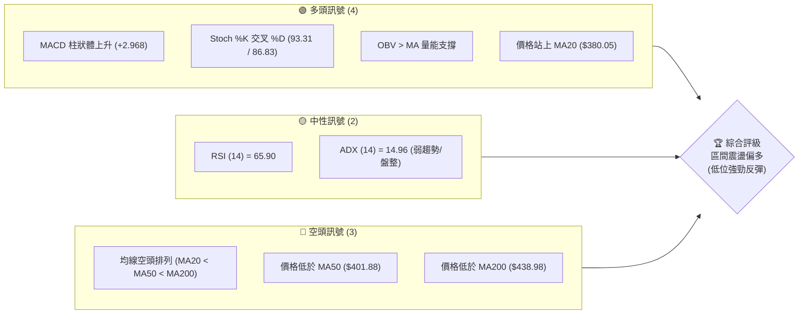

### 📊 核心指標速覽表

| 指標類別 | 指標名稱 | 當前數值 | 訊號 | 解讀 |
|----------|----------|----------|------|------|
| **價格** | 當前價格 | $395.63 | 🟡 中性 | 處於52周區間（$349.20 - $551.05）的 23.0% 低位，顯示下檔空間有限 |
| **均線** | MA20 | $380.05 | 🟢 看多 | 價格已成功站上 MA20，且 MA20 呈現向上拐頭趨勢（+4.10%） |
| **均線** | MA50 | $401.88 | 🔴 看空 | 價格仍受制於中軌與 MA50 壓力，均線空頭結構未完全扭轉 |
| **均線** | MA200 | $438.98 | 🔴 看空 | 長期均線下行，顯示中期至長期的熊市修正格局依然存在 |
| **動能** | RSI(14) | 65.90 | 🟡 中性 | 數值逼近超買區，但仍有向上延伸空間，無明顯背離訊號 |
| **動能** | MACD | -2.912 | 🟢 看多 | 雙線位於零軸下方但已黃金交叉，柱狀體（+2.968）顯示多頭動能轉強 |
| **波動** | ATR(14) | $12.49 | 🟡 中性 | 每日波動率約 3.16%，處於中等波動水平，適合波段區間操作 |

### 🏆 技術評分卡

```
技術評分卡 — MSFT (2026-07-15)
════════════════════════════════════════════════════
趨勢強度      ██████░░░░░░░░░░░░░░  30/100  🔴 弱趨勢
動能指標      ██████████████░░░░░░  70/100  🟢 強勁
支撐穩定度    ████████████████░░░░  80/100  🟢 極高
成交量配合    ████████████░░░░░░░░  60/100  🟡 中等
形態完整度    ██████████████░░░░░░  70/100  🟢 良好
均線排列      ████████░░░░░░░░░░░░  40/100  🟡 偏弱
════════════════════════════════════════════════════
綜合評分      ████████████░░░░░░░░  59/100  🟡 區間震盪偏多
════════════════════════════════════════════════════
```

---

## 2. 趨勢分析

### 🌐 多時框趨勢分析

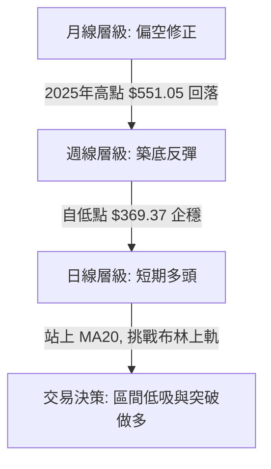

### 📈 長期趨勢 — 12個月走勢圖（Unicode）

以下為 MSFT 過去 12 個月的月線價格走勢，展示了股價從 2025 年中的歷史高位回落，並在 $370 附近兩次尋求支撐的築底過程。

```
MSFT 月線走勢圖（過去12個月：2025-08 至 2026-07）
價格軸 ($)
$530 ┤ ● (2025-08: $503.50)
$510 ┤   ●     ●
$490 ┤       ●     ●
$470 ┤
$450 ┤                 ● (2026-05: $450.24)
$430 ┤             ●
$410 ┤                                      ● (現價: $395.63)
$390 ┤                     ● (2026-02: $391.89)  
$370 ┤                         ● (2026-03: $369.37)  ● (2026-06: $373.02)
     └──────────────────────────────────────────────────────────
      08  09    10  11  12  01  02  03  04  05  06  07 (月份)
```

**長期走勢特徵分析**：
- **高位回落階段（2025-08至2025-12）**：股價自歷史高點附近震盪下行，跌破 $500 關卡。
- **加速趕底階段（2026-01至2026-03）**：伴隨賣壓湧現，股價一路下行至 $369.37 的低位，超賣訊號嚴重。
- **首次反彈與二次回踩（2026-04至2026-06）**：4-5月反彈至 $450.24 後遇阻回落，並於6月份再次探底至 $373.02，未破前低，形成潛在雙底。
- **現階段（2026-07）**：自雙底右側展開強勢反彈，現報 $395.63，正試圖站穩週線級別支撐。

---

### 📊 中期趨勢（週線分析）

中期走勢上，MSFT 展現了明顯的「雙重底（Double Bottom）」築底特徵。以下為近期週線結構的支撐與壓力示意圖：

```
週線級別價格通道與關鍵結構
════════════════════════════════════════════════════════════
[阻力位 R2] ─────────────────────────── $428.35 (中期反彈目標)
             
[阻力位 R1] ─────────────────────────── $412.16 (箱體上軌/頸線)
                               ▲
                             /   \
[當前價格] ──────────────────/─────\───── $395.63 (向上測試中)
                           /       \
[支撐位 S1] ──────────────/─────────\─── $390.58 (短期防守線)
                         /           \
[支撐位 S2] ───●────────/─────────────●─ $380.89 (雙底支撐帶)
              (左底: $369.37)        (右底: $373.02)
════════════════════════════════════════════════════════════
```

---

### ⚡ 趨勢強度評估（ADX 解讀）

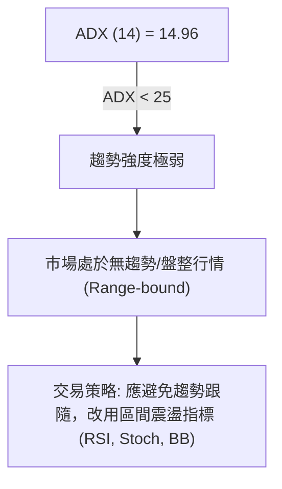

#### ADX 趨勢強度對照表

| ADX 數值區間 | 趨勢強度 | MSFT 當前狀態 | 交易指導原則 |
|--------------|----------|---------------|--------------|
| **< 20** | **極弱趨勢 / 盤整** | **✓ 14.96** | **高拋低吸，以布林通道與超買超賣指標為主** |
| **20 - 25** | **過渡期 / 弱趨勢** | - | 等待突破方向確認 |
| **25 - 50** | **強趨勢** | - | 順勢交易，均線跟隨策略 |
| **> 50** | **極強趨勢** | - | 強烈動能，避免逆勢摸頂/抄底 |

**解讀**：目前 `+DI (29.39)` 略高於 `-DI (27.97)`，顯示多頭在盤整中略占優勢，但由於 ADX 僅 14.96，多空雙方並未拉開實質性差距，整體仍屬於**大箱體震盪**格局。

---

## 3. 圖表形態分析

### 🔍 形態識別系統

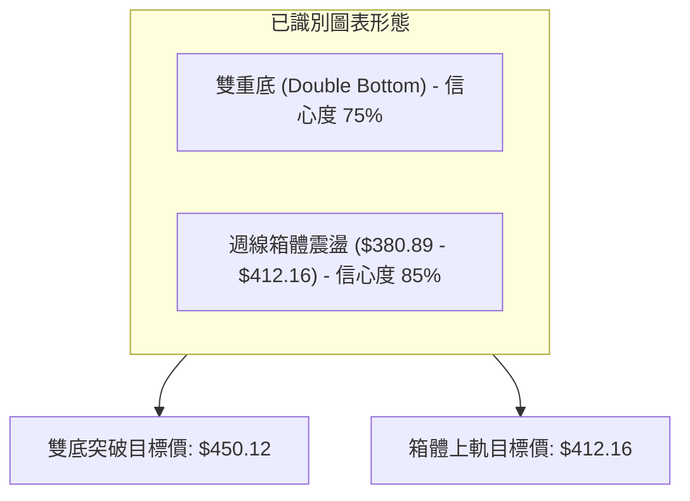

#### 形態信心度評估表

| 形態名稱 | 信心度 | 判斷依據（引用數據） | 完成度 | 目標價（附計算式） |
|----------|--------|----------------------|--------|--------------------|
| **雙重底 (Double Bottom)** | **75%** | 左底 $369.37 (2026-03)，右底 $373.02 (2026-06)，未破前低。 | 40% (尚未突破頸線) | **$450.12** <br>*(計算式: 頸線 $412.16 + 形態高度 ($412.16 - $373.02) = $451.30，取最接近之斐波那契回調位 $450.12)* |
| **箱體震盪 (Box Range)** | **85%** | 股價多次在 $380.89 (S2) 獲得支撐，並在 $412.16 (R1) 遇阻。 | 80% (正往箱體上軌運行) | **$412.16** <br>*(計算式: 直接取箱體上軌阻力位 R1)* |

### 🕯️ 重要K線形態分析

| 日期/月份 | 收盤價 | K線形態 | 解讀 | 訊號強度 |
|-----------|--------|---------|------|----------|
| **2026-06-28** | $372.97 | **長下影錘子線 (Hammer)** | 伴隨 3.82 億股的巨量，顯示在 $370 附近有強烈買盤介入，確認底部。 | 🟢 🟢 🟢 強烈看多 |
| **2026-07-05** | $390.49 | **大陽線吞噬 (Bullish Engulfing)** | 一舉收復前一周失地，MACD 柱狀體翻正，多頭奪回主導權。 | 🟢 🟢 看多 |
| **2026-07-19** | $395.63 | **高檔十字星 (Doji)** | 股價逼近 $400 整數關卡與布林上軌，多空出現分歧，短期有震盪需求。 | 🟡 中性 |

---

## 4. 支撐與阻力

### 🗺️ 關鍵價位分布圖（Unicode）

```
MSFT 價位結構分布圖
═══════════════════════════════════════════════════
$551.05 ║                                        ║ 52W High
$466.32 ║████████████████████████                ║ 強阻力 R3 (波段高點)
$450.12 ║▓▓▓▓▓▓▓▓▓▓▓▓▓▓▓▓▓▓                      ║ 50.0% 斐波那契回調位
$428.35 ║██████████████████                      ║ 中期阻力 R2 (反彈頸線)
$412.16 ║████████████████████████████            ║ 關鍵阻力 R1 (箱體上軌)
$401.89 ║░░░░░░░░░░░░░░░░░░░░░                   ║ 布林通道上軌
$395.63 ╠════════════════════════════════════════╣ ◄ 當前現價 ($395.63)
$392.40 ║▓▓▓▓▓▓▓▓▓▓▓▓▓▓▓▓▓▓▓▓▓▓▓▓▓▓▓▓▓▓          ║ 78.6% 斐波那契回調位
$390.58 ║██████████████                          ║ 近期支撐 S1 (週線防守)
$380.89 ║████████████████████████                ║ 強支撐 S2 (雙底支撐帶)
$358.21 ║░░░░░░░░░░░░░                           ║ 布林通道下軌
$349.20 ║                                        ║ 52W Low
═══════════════════════════════════════════════════
```

### 🚧 阻力位分析表

| 阻力級別 | 價位 | 形成原因 | 突破難度 | 重要性 |
|----------|------|----------|----------|--------|
| **R1 (關鍵阻力)** | **$412.16** | 近一年波段高點聚類、箱體上軌。與布林上軌（$401.89）形成密集壓力帶。 | ⭐⭐⭐ | **極高**。突破此位將宣告雙底形態正式成立，中期趨勢翻多。 |
| **R2 (中期阻力)** | **$428.35** | 61.8% 斐波那契回調位（$426.31）附近，前期下行波段的密集成交區。 | ⭐⭐⭐⭐ | **高**。此處為多頭波段獲利了結的潛在區域。 |
| **R3 (強阻力)** | **$466.32** | 前期反彈高點聚類，接近 50% 斐波那契回調位（$450.12），套牢盤沉重。 | ⭐⭐⭐⭐⭐ | **極高**。屬於牛熊分界線，需極大成交量配合方能突破。 |

### 🛡️ 支撐位分析表

| 支撐級別 | 價位 | 形成原因 | 守住機率 | 重要性 |
|----------|------|----------|----------|--------|
| **S1 (近期支撐)** | **$390.58** | 接近 78.6% 斐波那契回調位（$392.40），近期日線回踩企穩處。 | ▓▓▓▓▓▓▓░░░ 70% | **中**。跌破此位意味著短期反彈動能減弱，將再次測試箱體下軌。 |
| **S2 (強支撐)** | **$380.89** | 雙底頸線與布林中軌（$380.05）交匯處，中期買盤密集區。 | ▓▓▓▓▓▓▓▓▓░ 90% | **極高**。此處為多頭必須死守的防線，跌破將引發恐慌性拋售。 |
| **S3 (深底支撐)** | **$355.51** | 接近 52W 低點（$349.20）與布林下軌（$358.21），歷史極端超賣區。 | ▓▓▓▓▓▓▓▓▓▓ 95% | **極高**。長期價值投資者的終極防禦區。 |

---

### 📐 斐波那契回調位分析

當前股價 **$395.63** 剛好落在 **78.6% ($392.40)** 與 **61.8% ($426.31)** 兩個關鍵回調位之間。

- **78.6% ($392.40) 的技術意義**：此處為深幅回撤的極限支撐。股價在 $392.40 附近獲得支撐並反彈，說明市場並未陷入徹底的崩盤，而是屬於深度的「黃金坑」築底。
- **後續路徑**：若能站穩 $392.40，多頭的第一目標將是向上挑戰 61.8%（$426.31），這與阻力位 R2（$428.35）高度重合，是極佳的波段操作區間。

---

## 5. 技術指標深度解讀

### 🎛️ 指標訊號總覽

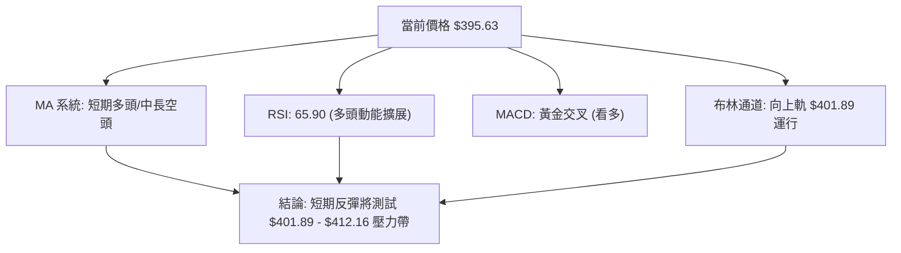

### 📈 移動平均線排列分析

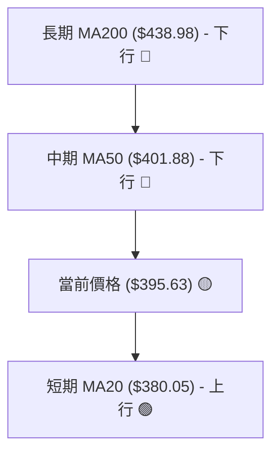

- **均線排列狀態**：目前呈現 `MA20 < MA50 < MA200` 的**空頭排列**。
- **短期拐點**：雖然中長期均線依然下行，但 **MA5、MA10、MA20 均已拐頭向上**。價格高於 MA20（+4.10%），顯示短期多頭反彈動能強勁，正在對中長期空頭趨勢進行修正。

---

### 📉 RSI(14) 分析

```
RSI(14) 強度顯示器
░░░░░░░░░░░░░░░░░░░░░░░░░░░░░░█████████████████████░░░░░░░░░░
0                            30                   70       100
                                       ▲
                                  當前值: 65.90
```

- **狀態評估**：RSI(14) 目前為 **65.90**，處於多頭強勢區間。
- **背離分析**：
  - 價格在 2026-03 創下低點 $369.37，此時週線 RSI 為 33.5。
  - 價格在 2026-06 二次探底至 $373.02，此時週線 RSI 為 31.3。
  - **結論**：**無明顯背離現象**，量能與動能指標與價格走勢基本同步，屬於健康的區間震盪築底。

---

### 📊 MACD(12/26/9) 訊號解讀

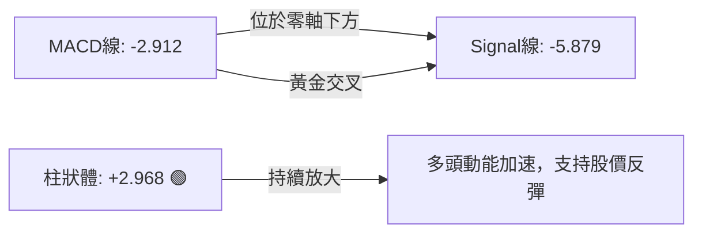

- **解讀**：雖然 MACD 雙線仍在零軸下方（代表大趨勢尚未翻多），但**黃金交叉**已經成立，且柱狀體正值持續擴大（+2.968），這通常是強烈短期反彈的先行指標。

---

### 📦 布林通道分析

```
日線布林通道示意圖
════════════════════════════════════════════════════════════
[布林上軌] ─────────────────────────── $401.89 (短期阻力臨界)
                               ▲
                              / 
[當前價格] ──────────────────●──────── $395.63 (位於上軌通道, %B = 0.86)
                            /
[布林中軌] ────────────────/────────── $380.05 (MA20 強支撐)

[布林下軌] ─────────────────────────── $358.21 (極端支撐)
════════════════════════════════════════════════════════════
```

- **帶寬分析**：布林通道帶寬目前處於收窄後的溫和擴張狀態，配合 `%B = 0.86`，股價正沿著上軌運行，顯示短期有衝擊上軌 **$401.89** 甚至阻力位 R1（**$412.16**）的實力。

---

### 💹 成交量分析（量價配合度）

- **量能現狀**：最新成交量為 **32,663,427**，約為 20 日均量（46,844,431）的 **0.70x**。
- **量價背離分析**：
  - 在 2026-06-28 股價跌至 $372.97 的築底週，成交量爆出 **382,709,200** 的天量，顯示底部籌碼換手充分。
  - 近兩周反彈過程中，成交量呈現溫和萎縮（89,442,227）。
  - **結論**：**量能支撐上漲 (OBV > MA)**。雖然日線級別量比有所下滑，但週線級別的 OBV 仍高於其移動平均線，說明大資金在底部進場後並未流出，短期縮量上漲屬於籌碼鎖定良好的表現，但若要突破 R1（$412.16），仍需補量至 20日均量以上。

---

## 6. 動能與波動率

### ⚡ 動能評估四象限

| 象限 | 動能強度 (RSI/MACD) | 波動率 (ATR/BB) | 當前狀態 | 交易策略 |
|------|--------------------|-----------------|----------|----------|
| **Q1 (強勢趨勢)** | 高 (RSI > 65) | 高 (ATR 擴張) | - | 順勢突破做多，持股待漲 |
| **Q2 (區間偏多)** | **高 (RSI = 65.90)** | **低 (ADX = 14.96)** | **✓ MSFT 當前定位** | **高拋低吸，逢回踩支撐位（S1）做多** |
| **Q3 (無方向波動)**| 低 (RSI 40-50) | 高 (ATR 擴張) | - | 觀望，避免頻繁被兩頭雙巴 |
| **Q4 (弱勢陰跌)** | 低 (RSI < 40) | 低 (ATR 收窄) | - | 逢高避險，不輕易抄底 |

---

### 📊 ATR 波動率分析

- **ATR(14) 數值**：**$12.49**（佔股價 3.16%）。
- **止損距離建議**：
  - **短線交易（1.5x ATR）**：止損空間應設為 `$12.49 × 1.5 = $18.74`。以現價 $395.63 計算，合理短線止損位為 **$376.89**。
  - **波段交易（2.0x ATR）**：止損空間應設為 `$12.49 × 2.0 = $24.98`。合理波段止損位為 **$370.65**（剛好保護在雙底支撐 $373.02 下方）。

---

### 📐 Beta 與市場相關性

- **Beta 值**：**1.13**。
- **技術解讀**：MSFT 的波動性略高於標普 500 指數。在大盤反彈時，MSFT 通常能提供 **1.13 倍** 的超額收益（Alpha）；但在市場回落時，其跌幅也可能略大，因此必須嚴格執行倉位控管。

---

## 7. 多時框架總結

### 📋 時框架評分表

| 時框架 | 趨勢方向 | 動能 (RSI) | 均線排列 | 形態 | 綜合評分 | 建議 |
|--------|----------|------------|----------|------|----------|------|
| **日線** | 🟢 看多 | 🟢 65.90 | 🟡 站上 MA20 | 🟢 雙底右側反彈 | **75/100** | 逢回踩支撐買入 |
| **週線** | 🟡 中性 | 🟡 52.90 | 🔴 承壓於 MA50 | 🟢 箱體築底 | **60/100** | 區間震盪操作 |
| **月線** | 🔴 看空 | 🔴 45.20 | 🔴 均線空頭排列 | 🟡 深度回調 | **40/100** | 長線分批建倉 |

### 🔲 綜合訊號矩陣

```
            短期 (日線)    中期 (週線)    長期 (月線)
趨勢方向       🟢             🟡             🔴
動能指標       🟢             🟡             🔴
量能配合       🟡             🟢             🟡
```

### ⚖️ 多時框收斂結論

**當前行情判定：盤整行情 (ADX = 14.96 < 25)**

根據「多時框收斂規則」，由於當前 ADX 指示市場並無強烈趨勢，交易應以**日線布林通道（$358.21 - $401.89）及關鍵支撐阻力位**為主要交易區間。

- **方向性結論**：**區間震盪偏多 (Range-bound Bullish Rebound)**。
- **邏輯收斂**：雖然月線與週線大趨勢仍處於修正期，但日線級別已在雙底結構的支撐下展開強勁反彈。股價目前站上 MA20（$380.05），MACD 出現黃金交叉，短期內將向上測試布林上軌（$401.89）與關鍵阻力 R1（$412.16）。

---

## 8. 交易策略建議

### 🗺️ 策略決策流程圖

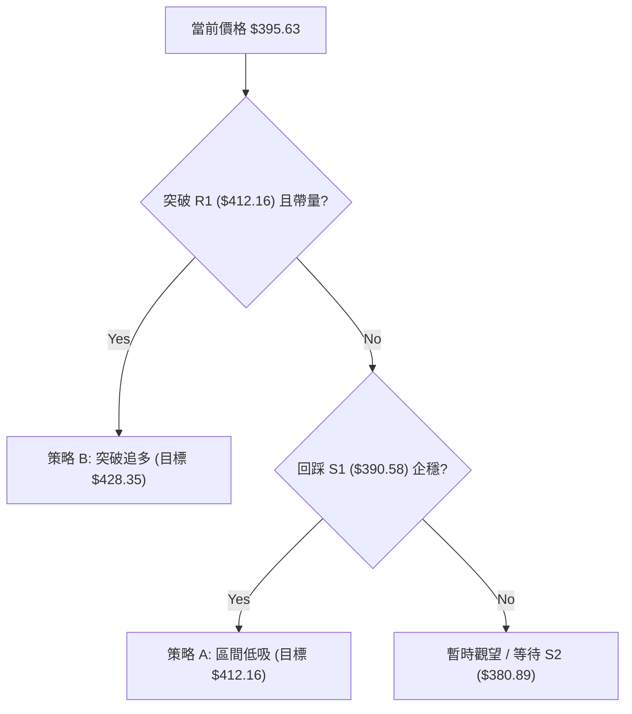

### 🧭 策略路由

> **當前主策略方向：區間震盪偏多（綜合評分：59/100）**
> 
> *基於評分處於 40-60 的中性偏多區間，且 ADX 顯示為盤整行情，本報告主推「區間低吸」與「突破做多」兩套多頭策略，空頭僅作為風險防守與對沖提示。*

---

### 🎯 價格情境階梯（Price Scenarios）

| 觸發條件 | 下一目標 | 後續延伸 | 情境含義 |
|----------|----------|----------|----------|
| **突破 R1 ($412.16)** | **R2 ($428.35)** | **R3 ($466.32)** | 雙底確認成立，中期趨勢全面轉強。 |
| **站穩現價區間** | — | — | 於 $390.58 - $401.89 之間進行窄幅震盪。 |
| **跌破 S1 ($390.58)** | **S2 ($380.89)** | **S3 ($355.51)** | 短期反彈夭折，重新測試箱體下軌尋求支撐。 |

### 📊 情境機率分佈

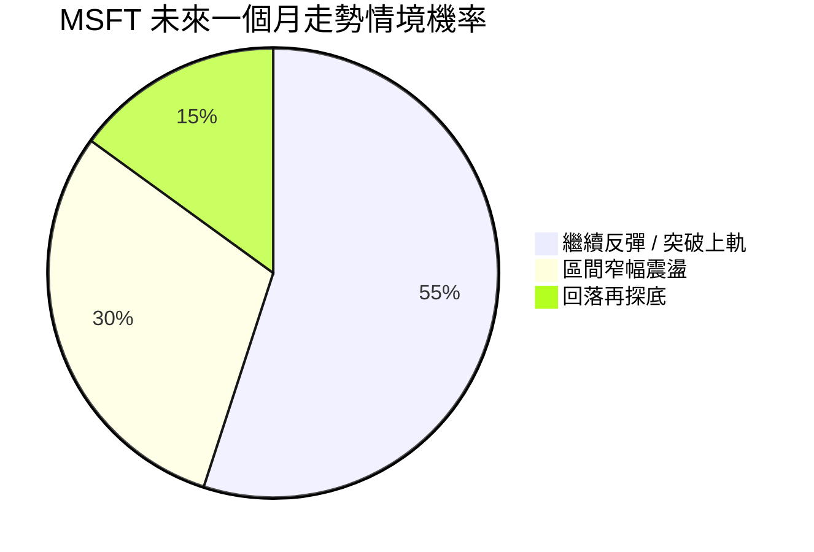

- **繼續反彈 / 突破上軌 (55%)**：基於 MACD 黃金交叉及強勁的 Stoch 超買動能，多頭短期佔優。
- **區間窄幅震盪 (30%)**：ADX 數值極低，市場缺乏單邊暴漲動能，可能在 R1 阻力前橫盤整理。
- **回落再探底 (15%)**：均線系統空頭排列尚未扭轉，若大盤走弱，MSFT 仍有回踩 S2 的風險。

---

### 🟢 主策略詳情

| 策略要素 | 🥇 策略 A：區間低吸策略（首選） | 🥈 策略 B：突破做多策略（次選） |
|----------|--------------------------------|--------------------------------|
| **進場條件** | 股價回踩 S1 附近企穩，或在現價分批建倉 | 股價帶量突破 R1 ($412.16) 實體收盤確認 |
| **進場價格** | **$390.58** 至 **$395.63** | **$413.50** (突破 R1 後順勢進場) |
| **目標價 T1** | **$412.16** (箱體上軌阻力) | **$428.35** (中期阻力 R2) |
| **目標價 T2** | **$428.35** (中期阻力 R2) | **$450.12** (50% 斐波那契回調位) |
| **止損價格** | **$380.89** (跌破 S2 強支撐手動止損) | **$401.89** (跌回布林上軌下方止損) |
| **風險報酬比** | **1 : 2.22** (風險 $9.69 / 利潤 $21.58) | **1 : 1.44** (風險 $11.61 / 利潤 $16.66) |
| **成功機率** | **65%** | **55%** |
| **建議倉位** | **15% - 20%** | **10%** |

---

### 🔴 反向風險觸發點（對沖提示）

若日線收盤價**跌破 $380.89 (S2)**，或週線收盤價**跌破 $372.97**，意味著雙底形態徹底失效，股價將重回下行通道。此時應立即執行多頭全面止損，並可考慮利用反向 ETF 或期權對沖多頭部位，下一個空頭目標指向 **$355.51 (S3)**。

### ⭐ 整體訊號強度評星

```
做多訊號強度：★★★★☆  (4/5星)
做空訊號強度：★★☆☆☆  (2/5星)
整體可信度：  ★★★☆☆  (3.5/5星)
```

---

## 9. 風險提示與監控

### ✅ 關鍵監控指標 Checklist

```
╔══════════════════════════════════════════════════════════════════╗
║ [ ] 監控指標 1: 日線收盤價是否能站穩 $392.40 (78.6% 斐波那契位)   ║
║ [ ] 監控指標 2: 成交量是否能放大至 4,000 萬股以上 (配合突破 R1)  ║
║ [ ] 監控指標 3: MACD 雙線是否能成功穿過零軸 (宣告中期轉強)       ║
║ [ ] 監控指標 4: RSI(14) 是否在 70 附近出現頂背離訊號             ║
╚══════════════════════════════════════════════════════════════════╝
```

### ⚠️ 風險場景分析

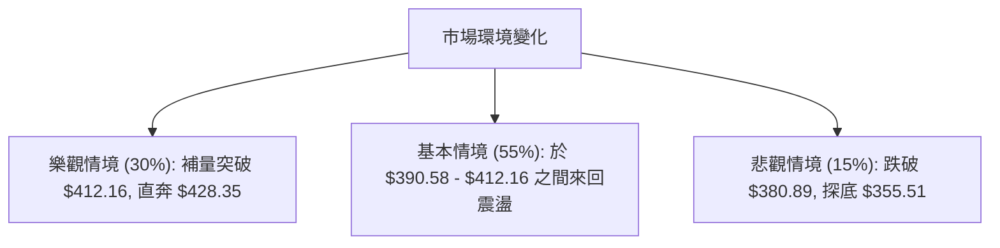

### 🛡️ 風險管理重要提醒

1. **嚴防假突破**：在策略 B（突破做多）中，必須確認日線收盤價站穩 $412.16，且成交量大於 20 日均量，以防主力資金拉高誘多。
2. **分批建倉原則**：鑑於整體均線仍呈空頭排列，切忌一次性滿倉。建議採用 3-3-4 分批建倉法，降低持倉均價。
3. **波動率調整**：當前 ATR 為 $12.49，若市場波動突然放大（ATR > $15），應同比例調寬止損距離並降低單筆交易倉位，以維持總風險敞口不變。

---

## 📋 報告總結

```
MSFT 技術分析報告總結
════════════════════════════════════════════════════════
報告日期：2026-07-15
當前價格：$395.63
分析評級：⚖️ 區間震盪偏多 (雙底築底期)

關鍵結論：
├─ 長期趨勢：🔴 偏空修正，但已接近 52W 低位區間
├─ 中期趨勢：🟡 築底盤整，週線雙底結構初具雛形 ($369.37 / $373.02)
├─ 短期趨勢：🟢 偏多反彈，價格站上 MA20，MACD 黃金交叉
├─ 關鍵支撐：$390.58 (S1) / $380.89 (S2)
├─ 關鍵阻力：$412.16 (R1) / $428.35 (R2)
└─ 分析師目標均價：$559.86 (隱含極大估值修復空間)

最優策略組合：
1. 🥇 最佳機會：於 $390.58 - $395.63 區域逢低分批布局多單，
               止損設於 $380.89，第一目標指向 $412.16。
2. 🥈 次選機會：若股價放量突破 $412.16 頸線，順勢加碼做多，
               目標看至 $428.35 及 $450.12。
════════════════════════════════════════════════════════
```

---

> ⚠️ **免責聲明**：本報告為基於客觀技術數據之量化與圖表分析，所有提及之價位均嚴格源自歷史交易數據與幾何形態推算。本報告**僅供研究與學術參考**，**不構成任何投資建議**。投資有風險，入市需謹慎。

---

*報告生成時間：2026-07-15 ｜ 數據來源：Yahoo Finance ｜ 分析框架：多時框技術分析*