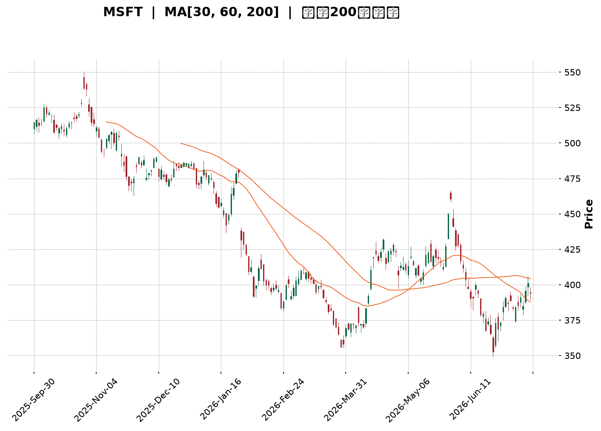
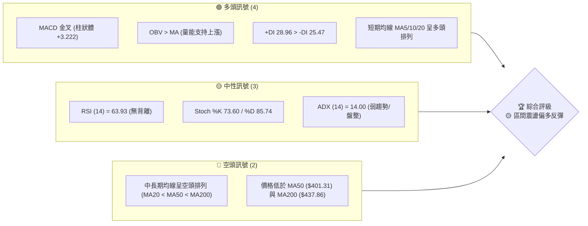
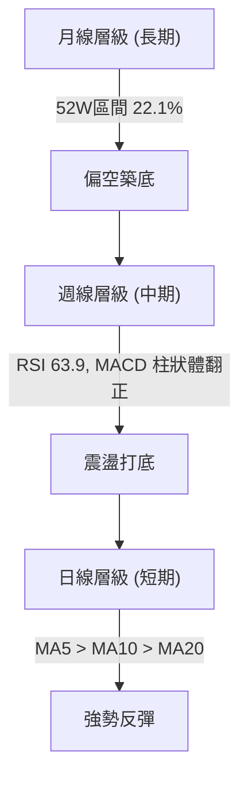
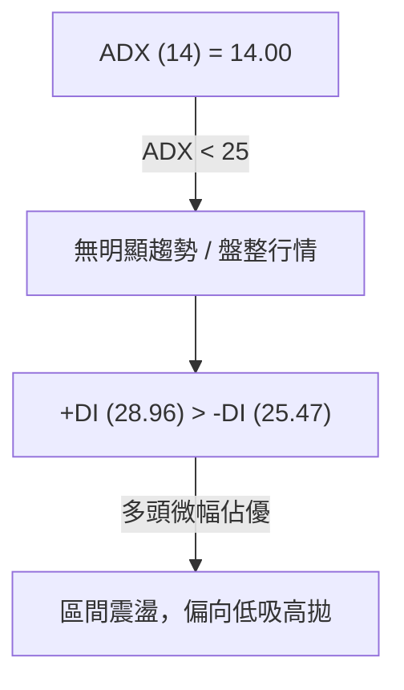
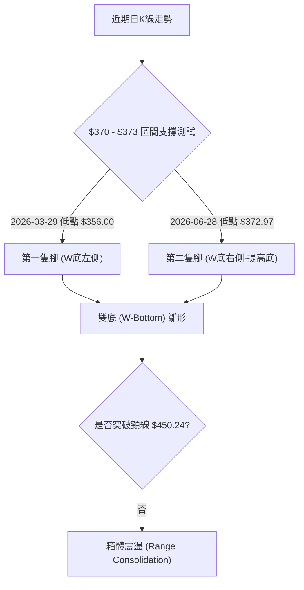
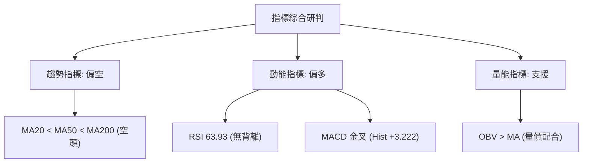
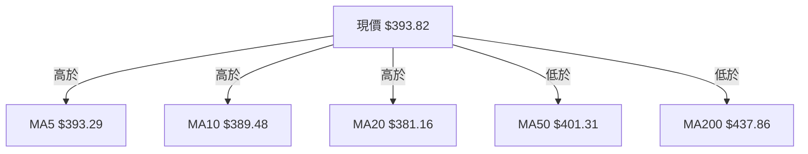
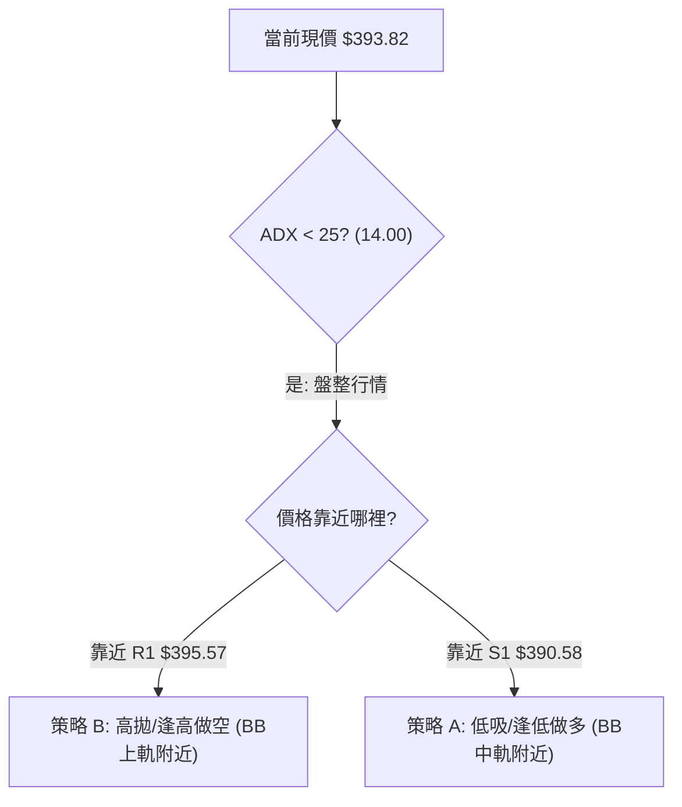
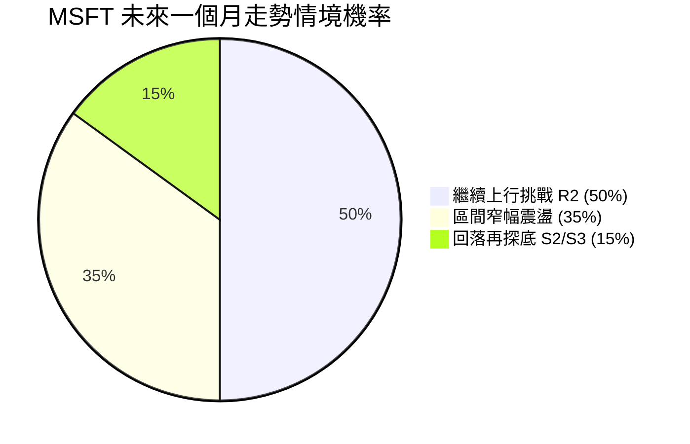
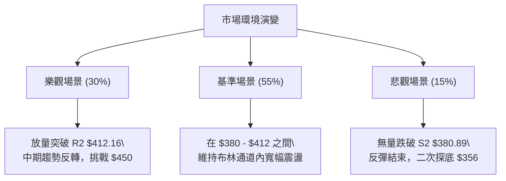

<details>
<summary>📊 靜態圖表 (點擊展開)</summary>

</details>

<html>
<head><meta charset="utf-8" /></head>
<body>
    <div style="height:500px; width:100%;">                        <script>window.PlotlyConfig = {MathJaxConfig: 'local'};</script>
        <script charset="utf-8" src="https://cdn.plot.ly/plotly-3.7.0.min.js" integrity="sha256-jvTGqxNp8AGWEcvNLVuKr+8j5dGe9Yw51LQkmDH+IYA=" crossorigin="anonymous"></script>                <div id="candlestick-chart" class="plotly-graph-div" style="height:100%; width:100%;"></div>            <script>                window.PLOTLYENV=window.PLOTLYENV || {};                                if (document.getElementById("candlestick-chart")) {                    Plotly.newPlot(                        "candlestick-chart",                        [{"close":{"dtype":"f8","bdata":"AAAA4IUVgEAAAACggyOAQAAAAED0A4BAAAAAoMAQgEAAAADA8mmAQAAAAIB1RYBAAAAAAGBMgEAAAAAg5jiAQAAAAMDou39AAAAAoAntf0AAAAAgaOV\u002fQAAAAEAu439AAAAAYD7Gf0AAAADgkOV\u002fQAAAAABNDIBAAAAAoDcTgEAAAADgHCqAQAAAAIBFKoBAAAAAgIRCgEAAAABgZoGAQAAAAMBE1YBAAAAAgCLRgEAAAAAgnFOAQAAAAOBoFIBAAAAAoDUOgEAAAACgffF\u002fQAAAAAB+f39AAAAAgIvffkAAAADgF9t+QAAAAIAMbX9AAAAAoKiXf0AAAACgxb5\u002fQAAAACD2QX9AAAAA4IGvf0AAAAAgvYR\u002fQAAAACDrqn5AAAAAoN5AfkAAAAAA8cR9QAAAAOBtYH1AAAAAQGB+fUAAAADgAK59QAAAAICPNX5AAAAAQEKdfkAAAADgT0l+QAAAAMA9fX5AAAAAoMq5fUAAAADAVOt9QAAAAEBJEH5AAAAAIH2NfkAAAADgap1+QAAAAEADx31AAAAAYDkVfkAAAADgiMZ9QAAAACBwi31AAAAAYHKkfUAAAABAJaB9QAAAACBZHX5AAAAAIEA8fkAAAABgUix+QAAAAIAQS35AAAAAgLNdfkAAAABgw1h+QAAAAAAMT35AAAAAgBlVfkAAAAAgnRd+QAAAAMB9bX1AAAAA4A5sfUAAAABgN8Z9QAAAAGA5FX5AAAAAINi\u002ffUAAAABAe9J9QAAAAMAHsX1AAAAAIFVJfUAAAABAfpV8QAAAAIAqanxAAAAAgCOdfEAAAAAAFEh8QAAAAKBBontAAAAA4DwSfEAAAACgJf58QAAAAMAeQ31AAAAAYDDnfUAAAABA6vd9QAAAAMA\u002f+XpAAAAAAB7GekAAAABA41d6QAAAAKAwlnlAAAAAoKjFeUAAAABgy354QAAAAODI9XhAAAAAwEK8eUAAAAAAAbd5QAAAAEA8KXlAAAAAQO8AeUAAAADgpvh4QAAAAKCbsXhAAAAAAEHdeEAAAADglNl4QAAAAMDxxXhAAAAAoDn6d0AAAACAjEJ4QAAAAGC\u002f+3hAAAAAAKENeUAAAABgQn54QAAAAKAE23hAAAAAgOkweUAAAABAMEV5QAAAAMCtnHlAAAAA4DeBeUAAAAAgZ4h5QAAAACAhTnlAAAAAYBRAeUAAAAAg3Q95QAAAAEAfq3hAAAAAwF7xeEAAAACgv+h4QAAAAKAXb3hAAAAAIN5CeEAAAAAgt9B3QAAAAKDB4ndAAAAAYPM+d0AAAABgzyN3QAAAAIDd0nZAAAAAoPs\u002fdkAAAACA8mJ2QAAAAIDrFXdAAAAAwCUJd0AAAAAgckp3QAAAAKAvQXdAAAAAQMQ3d0AAAAAAVlh3QAAAAEA4RHdAAAAAgBghd0AAAAAAofh3QAAAAKAqhHhAAAAA4EyleUAAAADAoDV6QAAAAEAFXnpAAAAA4KkSekAAAACg5HN6QAAAAADA\u002f3pAAAAAoJ\u002fteUAAAACgPHt6QAAAACBufnpAAAAAICjFekAAAACgrnh6QAAAACBhbnlAAAAAgLXYeUAAAAAAnst5QAAAAODap3lAAAAAoAvReUAAAAAgxT16QAAAAMCQ43lAAAAAYEq8eUAAAAAgOG55QAAAACBZRXlAAAAA4LiIeUAAAABgIVB6QAAAAKD+aXpAAAAAQEkIekAAAABgZkJ6QAAAAKBwMXpAAAAAwB4pekAAAADgegB6QAAAAGC4ynlAAAAAANevekAAAAAA1yN8QAAAAOBRyHxAAAAAwPWUe0AAAACgcLV6QAAAAMDMwHpAAAAAYLgKekAAAAAA17t5QAAAAGCPNnlAAAAAgMLVeEAAAACgcGV4QAAAAADXa3hAAAAAACn8eEAAAACgR514QAAAAGCPrndAAAAAYGa2d0AAAACgcPV2QAAAAEAKX3dAAAAAIFzXdkAAAACgRw12QAAAACCFT3dAAAAAwB4Jd0AAAADgUVB3QAAAAOB6BHhAAAAAANdneEAAAAAA1yt4QAAAAKBwTXhAAAAAoHD1d0AAAACAwgV4QAAAAKCZEXhAAAAAANdveEAAAABA4Q54QAAAAIAUunhAAAAAoJkReUAAAADAHp14QA=="},"high":{"dtype":"f8","bdata":"rTg6KzEXgEDsymOw3ymAQCXV1\u002fiJMoBAjI9B57YpgEBFIxYrgX2AQBVgnty5c4BADozLzhFdgECKQOnfPUiAQG8RpYdHQoBA6hAQpUcJgEDqebclTACAQEDGtyl7D4BAKAxrJscMgEAXZAAT4wGAQB8NtiF8G4BAY4Nk2WcbgEBA\u002fH6NZU+AQKAPkY44RYBAT2zOkllQgEDpc3vPuZmAQCULmrjhMYFAudY4Sqj2gECaKp1r05yAQCTQDgbpb4BAs2TQCkBNgECH+6+WcQKAQMrNDKlw+X9AGUukb0dof0D7bFiiywN\u002fQC86vTaQen9AGGy8SEmmf0CPz4bWMsd\u002fQDKk3A5L5H9AAPIfpRXGf0CNqUpGWs5\u002fQOM0b3oIPX9AH6QbWS3BfkCpof2OG7Z+QHeYQkO\u002fzH1AOnIv9pGsfUDmpD4GadB9QPFQszhSYn5AEWq3fSKnfkBePWO3Ant+QKEO6jD+tH5AQq+iR30hfkDac34o+vJ9QK5+TeQbFH5Ao8tzweChfkAzdxSvAp9+QCGJ3CumIX5A+BzDogA+fkBB7jsQ+gR+QKqrgFtr6X1A\u002f6OnIle8fUCbyjJK8919QFmtGJHedn5ANIOZU\u002f5afkBsM8XvAml+QG+KJbSsWn5Ahn0oTNxvfkCiS+xNS19+QIx830z1Yn5AqhFjrCR4fkA0rgALnV9+QFDEwQouKH5AAdOzhlmffUCCKNgy4cl9QBiuJF12eH5AlmxlX1IIfkC094xRFdt9QCqtp0+47X1AnXs11LqafUAd4pXU\u002fCF9QPoXtkoR43xA83L9xi7SfEAI3KR4ZWx8QBuJpZDtKnxAbZTtIFEtfEAzHvZ5LlB9QGTq98dbgn1AEk3xqaoLfkB6he5uhhl+QLXT8U+ciHtAYThBr2pae0DyHNrpSM16QK9IyWXcQnpAtyGhPwUfekB6JkkS1md5QEqRPHIjAHlAlfLhMs\u002fQeUD8fAFV01x6QKf+7FLR6XlAl+ORsmJGeUBPd6Rd3zt5QD3uB4no63hAxi1UX2cMeUC5VP4m5Th5QLeiy4oV9HhAcRXVmBaoeEDWPzfQS0h4QOueaiyjCXlAQk8xzL9peUCXvPsBZr94QHOwKMEqBXlAZqeK+iJdeUAsIvlDRKJ5QEZ0cMSGq3lA9PlCS4TCeUDdyw\u002fLLJV5QDheNhIElXlAjD2dUASCeUDzhgpq4FN5QKCK6l3NPnlAUZj\u002f+jn8eECZMZJzajh5QFoP9cY80nhAOOJBiER6eEAsMJ82niJ4QOSVhXv4JXhA9SHVXUvad0BtmM7164N3QAdhKQuQXndAXw7vt6qadkBbwmM4IMl2QMAfUFWBQXdA0bFLWuhSd0DX7QfoUU13QOFktbnBTndAsLhmNVI6d0D2bCXsrwJ4QNJFkLEVS3dAI2toRkBtd0CRXrneV\u002ft3QOffb2NknXhAW0mBXZfXeUBjIvKKkT56QLYwdTBb6npATubpL6RmekBc5jXEG6R6QIC9W\u002fgzDHtA9TRJ+uhrekDD3x10gYB6QDp1fZr9onpANu2ckdrPekAf7K5bXJ56QKDCpNhj2HlAxWBPHVYDekDoKAf+7T16QFyUtXIR\u002fnlAmiO+ZEAYekBgvt6M4bB6QKT\u002fsK2aG3pAzlQE\u002fMS8eUAXpBrSoel5QLzhNAPpVnlAapGC6jKveUCBjC0M6rN6QDXBgEM4g3pAZIuo3Dz8ekCayyALAVN6QAAAAKBwpXpAAAAAYGaGekAAAADgUTx6QAAAAEAK\u002f3lAAAAAANfXekAAAACgRyV8QAAAAMAeJX1AAAAAAABYfEAAAACAPYZ7QAAAAGBmQntAAAAAIIXXekAAAABgjxJ6QAAAACCuv3lAAAAA4KNQeUAAAACgmc14QAAAAADXe3hAAAAAAAAceUAAAACgcM14QAAAAIDrZXhAAAAAgOvVd0AAAACAFNp3QAAAACCFk3dAAAAAgBSud0AAAAAgrsN2QAAAAIDCiXdAAAAAAADId0AAAABgZmJ3QAAAAKBHTXhAAAAAQDODeEAAAABgZlJ4QAAAAMAeuXhAAAAAwPUUeEAAAABgZgp4QAAAAGCPfnhAAAAAYGaaeEAAAABACkN4QAAAACBc73hAAAAAANdfeUAAAACAPeZ4QA=="},"hovertemplate":"\u003cb\u003e%{x|%Y-%m-%d}\u003c\u002fb\u003e\u003cbr\u003e\u958b: $%{open:.2f}\u003cbr\u003e\u9ad8: $%{high:.2f}\u003cbr\u003e\u4f4e: $%{low:.2f}\u003cbr\u003e\u6536: $%{close:.2f}\u003cextra\u003e\u003c\u002fextra\u003e","low":{"dtype":"f8","bdata":"3cZGkj2nf0AQ5B79g8d\u002fQNpNKC91t39A2+riUyT8f0CXKRmogheAQLUrxlxEMYBAHS0QT2I+gEBbv7ORJhGAQEgqtGjDpn9AOCruN1vHf0DilQ+DDG1\u002fQP44wmqlrH9A\u002fLazFOqOf0BH+VCA4IF\u002fQNMoAR0u439ABhCU1\u002frcf0DIEFiZnROAQK9+HALFGoBAvsaWwHYrgECasNI5cm2AQGQeWSHvyoBAcOulP9GqgEAHl0ZKrDaAQMyDv1u7\u002fX9A9xKv5Z\u002f1f0D8ANrLTYp\u002fQHWtkjNFdn9A43Hn4AjLfkAD0MwmVaJ+QD9qetmS+n5AWc88LAQzf0ByW154qf9+QIluRq4pIn9AWpUMSfPkfkBwgYABuFt\u002fQAJXntN2O35AF4pAVqn8fUBLrlv1RJZ9QAOiXioaI31AJ4yKuB4ffUApdTccQ+18QCEpENYQ8X1APXoT9uBHfkBOmDo0BSh+QByx2VOfQn5AWTzCsX2RfUDSy5YeCqZ9QBXSZxkczH1AGPZrVLgjfkBG2CLsWGV+QGNJJ1KUj31A6YRl8gCcfUARahxlpqN9QB6vjwTNZn1A9nJ3b61MfUApQ8IWTo59QAy+5hdXvH1AedPvCZ0FfkBS7A6\u002fzAh+QA\u002fsTDF0KX5APHgULuMqfkAaKZ8n4zx+QHro2qaIIH5A0rn6VI81fkBDZ6wvhBJ+QOqO91s1QX1Ad6mrFbI2fUBpQWN0rTp9QDB6BL5LvX1AE2YJ\u002fACcfUDHcTIytGF9QKpfXv0imX1AT53LtiX+fEDUyAxCSnJ8QIiSOU0PXnxAmPtBgUxnfECZIOQnnPR7QBOGT\u002fvCS3tAYKkHk6ere0BVhctGhQh8QPC3qTw6v3xAF6Dg3v5wfUCE1HSrF759QJHcQkJ0MnpAZz+NG\u002fOIekAAJrYWDEZ6QG8umF\u002f6a3lA4mE1RM92eUBqLRVESml4QM2oDAbZcnhAlOODzHvxeEDT4MK57K15QFaVNMS283hARcBbLe3DeEDKMv1BkMR4QDBO3E9+jHhAhIJZsAGpeEBYmmL4AL14QI++\u002flLlpHhAgQe4QFrkd0CFPlIoKc53QMz1I4sRVXhA1Eo6QQ3eeEAhTjcxmVB4QMqFYnySXHhALS+HTSR9eEDkMdgJHvd4QJZIz3dqOHlAU0y\u002fuwh6eUC9WEsRDCp5QLuuSm3yIHlAed3Kn40LeUBb3OkTeA15QJqz\u002fgFelnhAcemdDf2eeEDuGvDxPs54QCPyT756YnhA2Eu\u002fWZMjeEDOvMSdxrR3QG4kVo+uzXdAbTDi4L0wd0BcUkd7TA13QMy2mIdpxnZAejQqDdU7dkBuQmD5KDh2QK0sDLqQpHZAnPhh23f2dkBuMFfKzrV2QFoazAs5C3dAopNL2UjcdkAzvB6Ztyl3QOb\u002fYoob5HZAFVSPT68Td0A8NR2NfSN3QDBT81X0GnhAAU4eJfa9eEC7wVoh\u002fbN5QG3y9TZ+PHpArRkxi2f2eUDx3HocxgR6QLEec+IRbHpAB61Va1WoeUB1ztzza+55QIKj67qyAnpAk7GckM9PekCT9RlKGzZ6QGSQY7xl0nhAvRTD6NiYeUDHgLA2mJ55QLc6wPapfnlAnqTLV8BDeUBc\u002f\u002fMKrh16QIPcGyqv0XlAVr\u002f2YfpJeUBC5MTALVx5QK2+i+CcAnlAaq\u002fEzzcAeUBniZYiSMB5QNi2rHJj63lAsV2bG3D5eUC4Ny3Gk6Z5QAAAACBc+3lAAAAAoEcFekAAAADgUdB5QAAAAKBHmXlAAAAAYLjKeUAAAACAwgV7QAAAAOBRpHxAAAAAQOGGe0AAAAAAAIR6QAAAAGCPpnpAAAAAYGbmeUAAAADA9Yh5QAAAACCu53hAAAAAYI\u002fSeEAAAAAAAAB4QAAAAOBR5HdAAAAAoJmNeEAAAABACmt4QAAAAMAelXdAAAAA4HpUd0AAAADAHvF2QAAAAGC4KndAAAAA4HrMdkAAAABAM9N1QAAAAEDhNnZAAAAAYGZ+dkAAAABAM\u002fd2QAAAAIA9bndAAAAAQDP7d0AAAAAghdN3QAAAACCFQ3hAAAAAoEfVd0AAAACgmVV3QAAAAAAA2HdAAAAAYGYCeEAAAABgZqp3QAAAAGBmJnhAAAAAwMyAeEAAAACAPVZ4QA=="},"name":"\u50f9\u683c","open":{"dtype":"f8","bdata":"04y56Sjgf0BFW+9R9vh\u002fQFVa0wIPE4BAs2nl2MMOgEDcS2H\u002fxBqAQA8X99K4Z4BAM1Qj\u002fOQ\u002fgED24PYFbDiAQDk33S\u002f1IoBA6hAQpUcJgECikuSYTbB\u002fQCUfO8+B+39AjYSsnqrVf0AC\u002fNgHYp1\u002fQCwmEvLw9X9Ao9vVD\u002fIRgEAuMixj9i6AQKYY00JgOYBAUsuosf87gEAr0ReGd4OAQOZDwSpPFIFAzm6fjhXsgEAmK2XKIXmAQPMP35FpbIBAee5uK08kgECrMo8foch\u002fQJfA0Rkd4X9A95Spl6Rnf0A1CBYGKd1+QNlyegJKDn9A8u2NJPhZf0BjqHOCeKJ\u002fQOx2IAqTsX9Ahvaqy4LxfkAYZMCgAJR\u002fQAGeigUKxH5AKfKR7j9wfkAL\u002fyaNaKh+QEVv3oMOxn1A\u002fa4WF06OfUBo79ymfX99QLI9bop2Qn5AbxWV9QJXfkAa18ZAZGR+QP55U3D+SH5A8hD+2lSjfUAuFba8INp9QADGYV8XBn5AxeVzEdgrfkBL9cGm525+QO3ongolHn5ARRai9kSofUCHyt9SFdt9QPiwzB2L331AP80bmxVdfUCg2VHHuqx9QCxFSGUewX1Aw\u002fSrGTBTfkAWMW21bz9+QHBrdvVGLX5Aj0V3Xm04fkAPPO2I1Uh+QF7Voo1dK35AmZ72xWg8fkCq7b+d1Vp+QE5s6RHhI35An+LuBlV\u002ffUBf1GioMHt9QJZHeZ8g2n1A4WznyLPxfUAKdkzrVH99QElP2SLoqH1ABuUFLjWJfUD1wshNRQZ9QKj5Fyf\u002f4HxAQ35Rfc18fED16B8tgxN8QEgPB5N+KXxAq11GzCrae0B1xTmR3R18QBqU5+Dz83xACE5s8Jh5fUBlFNUuFRF+QEVyt+SgYHtAo3k5PpFTe0DAc0n+UcV6QBcEpF85QnpAPpEQTtiSeUA+9UswI1p5QJ\u002f2W4Zn1nhAvjbapeEweUA6HYBPJxx6QBkLnIhb5XlAKDtZPUUzeUBOwuyIgip5QHJSiWQz13hA8ErfkdbFeECmeW1CL\u002f14QEcMLAoQtHhAk\u002f6jSFeieEAiXIAF9fR3QBZEqMT5WnhAcFYoiF09eUCKgwtXkGB4QGD6xL4sgHhAooxnRKWEeECFJkuqcQZ5QDbycEq8OHlAkM0Q4AyFeUAe0z\u002fft0B5QHjAfTNNknlAjlpShBhLeUCcc6GaFjx5QJPTVkEiAnlAoxx55FrTeEAE6xSDevZ4QDXciPpYxHhAMwx1UBxUeEC0o37yQx94QABAeggg8XdAOZQmt4nYd0C6LAjTr4F3QADzJDFMIHdAgZRituKRdkBHYmS54pF2QMnqHKAxvHZAL7thx+xKd0D6JMRzqeZ2QHtPpbnsSndAd0UZQ6IYd0DQvXE5XgJ4QKrAu4seO3dAjM9hcshCd0D9WMs\u002f10x3QLVaR3FOMXhA\u002fusTxzzSeEAsy4bKPS96QHj7rydufnpA4DMuPNZDekDdYGTzTjV6QN+Yn3NNlHpAx43debgvekDaFWL4GQF6QNckfnl5V3pAj0DRTXB6ekDEiBAQmXp6QNdJhy3BnnlA4+uVhIa+eUClSKjJaKp5QL5jSz\u002fC5nlAbh95QuRxeUCrE66XOzN6QLoHu6fOB3pA3c0X59BveUCCT5\u002f5WNl5QCTv8ApCJXlAiEuGkbE5eUD705KY\u002ftV5QPOW1YGD+3lAr1YGxojPekCsrhz+ZdR5QAAAAAAAjHpAAAAA4KM4ekAAAABA4QZ6QAAAAAApsHlAAAAAIK7PeUAAAADAzAh7QAAAAKBwDX1AAAAAgBTue0AAAABAM2d7QAAAAMD1PHtAAAAAoHDFekAAAACAPeJ5QAAAAOB6kHlAAAAAwMzoeEAAAAAgXLN4QAAAAEDhdnhAAAAAwMzMeEAAAADgo7x4QAAAAAAAZHhAAAAAwB6dd0AAAAAA13t3QAAAAIAURndAAAAAwB45d0AAAADgUax2QAAAAGBmUnZAAAAAAACYd0AAAADgejB3QAAAAKBHzXdAAAAAIK4HeEAAAADgozB4QAAAAADXh3hAAAAA4HoAeEAAAABAM2d3QAAAAMDMPHhAAAAAAAA8eEAAAADAHu13QAAAAMDMPHhAAAAAwPXkeEAAAAAgrq14QA=="},"x":["2025-09-30T00:00:00-04:00","2025-10-01T00:00:00-04:00","2025-10-02T00:00:00-04:00","2025-10-03T00:00:00-04:00","2025-10-06T00:00:00-04:00","2025-10-07T00:00:00-04:00","2025-10-08T00:00:00-04:00","2025-10-09T00:00:00-04:00","2025-10-10T00:00:00-04:00","2025-10-13T00:00:00-04:00","2025-10-14T00:00:00-04:00","2025-10-15T00:00:00-04:00","2025-10-16T00:00:00-04:00","2025-10-17T00:00:00-04:00","2025-10-20T00:00:00-04:00","2025-10-21T00:00:00-04:00","2025-10-22T00:00:00-04:00","2025-10-23T00:00:00-04:00","2025-10-24T00:00:00-04:00","2025-10-27T00:00:00-04:00","2025-10-28T00:00:00-04:00","2025-10-29T00:00:00-04:00","2025-10-30T00:00:00-04:00","2025-10-31T00:00:00-04:00","2025-11-03T00:00:00-05:00","2025-11-04T00:00:00-05:00","2025-11-05T00:00:00-05:00","2025-11-06T00:00:00-05:00","2025-11-07T00:00:00-05:00","2025-11-10T00:00:00-05:00","2025-11-11T00:00:00-05:00","2025-11-12T00:00:00-05:00","2025-11-13T00:00:00-05:00","2025-11-14T00:00:00-05:00","2025-11-17T00:00:00-05:00","2025-11-18T00:00:00-05:00","2025-11-19T00:00:00-05:00","2025-11-20T00:00:00-05:00","2025-11-21T00:00:00-05:00","2025-11-24T00:00:00-05:00","2025-11-25T00:00:00-05:00","2025-11-26T00:00:00-05:00","2025-11-28T00:00:00-05:00","2025-12-01T00:00:00-05:00","2025-12-02T00:00:00-05:00","2025-12-03T00:00:00-05:00","2025-12-04T00:00:00-05:00","2025-12-05T00:00:00-05:00","2025-12-08T00:00:00-05:00","2025-12-09T00:00:00-05:00","2025-12-10T00:00:00-05:00","2025-12-11T00:00:00-05:00","2025-12-12T00:00:00-05:00","2025-12-15T00:00:00-05:00","2025-12-16T00:00:00-05:00","2025-12-17T00:00:00-05:00","2025-12-18T00:00:00-05:00","2025-12-19T00:00:00-05:00","2025-12-22T00:00:00-05:00","2025-12-23T00:00:00-05:00","2025-12-24T00:00:00-05:00","2025-12-26T00:00:00-05:00","2025-12-29T00:00:00-05:00","2025-12-30T00:00:00-05:00","2025-12-31T00:00:00-05:00","2026-01-02T00:00:00-05:00","2026-01-05T00:00:00-05:00","2026-01-06T00:00:00-05:00","2026-01-07T00:00:00-05:00","2026-01-08T00:00:00-05:00","2026-01-09T00:00:00-05:00","2026-01-12T00:00:00-05:00","2026-01-13T00:00:00-05:00","2026-01-14T00:00:00-05:00","2026-01-15T00:00:00-05:00","2026-01-16T00:00:00-05:00","2026-01-20T00:00:00-05:00","2026-01-21T00:00:00-05:00","2026-01-22T00:00:00-05:00","2026-01-23T00:00:00-05:00","2026-01-26T00:00:00-05:00","2026-01-27T00:00:00-05:00","2026-01-28T00:00:00-05:00","2026-01-29T00:00:00-05:00","2026-01-30T00:00:00-05:00","2026-02-02T00:00:00-05:00","2026-02-03T00:00:00-05:00","2026-02-04T00:00:00-05:00","2026-02-05T00:00:00-05:00","2026-02-06T00:00:00-05:00","2026-02-09T00:00:00-05:00","2026-02-10T00:00:00-05:00","2026-02-11T00:00:00-05:00","2026-02-12T00:00:00-05:00","2026-02-13T00:00:00-05:00","2026-02-17T00:00:00-05:00","2026-02-18T00:00:00-05:00","2026-02-19T00:00:00-05:00","2026-02-20T00:00:00-05:00","2026-02-23T00:00:00-05:00","2026-02-24T00:00:00-05:00","2026-02-25T00:00:00-05:00","2026-02-26T00:00:00-05:00","2026-02-27T00:00:00-05:00","2026-03-02T00:00:00-05:00","2026-03-03T00:00:00-05:00","2026-03-04T00:00:00-05:00","2026-03-05T00:00:00-05:00","2026-03-06T00:00:00-05:00","2026-03-09T00:00:00-04:00","2026-03-10T00:00:00-04:00","2026-03-11T00:00:00-04:00","2026-03-12T00:00:00-04:00","2026-03-13T00:00:00-04:00","2026-03-16T00:00:00-04:00","2026-03-17T00:00:00-04:00","2026-03-18T00:00:00-04:00","2026-03-19T00:00:00-04:00","2026-03-20T00:00:00-04:00","2026-03-23T00:00:00-04:00","2026-03-24T00:00:00-04:00","2026-03-25T00:00:00-04:00","2026-03-26T00:00:00-04:00","2026-03-27T00:00:00-04:00","2026-03-30T00:00:00-04:00","2026-03-31T00:00:00-04:00","2026-04-01T00:00:00-04:00","2026-04-02T00:00:00-04:00","2026-04-06T00:00:00-04:00","2026-04-07T00:00:00-04:00","2026-04-08T00:00:00-04:00","2026-04-09T00:00:00-04:00","2026-04-10T00:00:00-04:00","2026-04-13T00:00:00-04:00","2026-04-14T00:00:00-04:00","2026-04-15T00:00:00-04:00","2026-04-16T00:00:00-04:00","2026-04-17T00:00:00-04:00","2026-04-20T00:00:00-04:00","2026-04-21T00:00:00-04:00","2026-04-22T00:00:00-04:00","2026-04-23T00:00:00-04:00","2026-04-24T00:00:00-04:00","2026-04-27T00:00:00-04:00","2026-04-28T00:00:00-04:00","2026-04-29T00:00:00-04:00","2026-04-30T00:00:00-04:00","2026-05-01T00:00:00-04:00","2026-05-04T00:00:00-04:00","2026-05-05T00:00:00-04:00","2026-05-06T00:00:00-04:00","2026-05-07T00:00:00-04:00","2026-05-08T00:00:00-04:00","2026-05-11T00:00:00-04:00","2026-05-12T00:00:00-04:00","2026-05-13T00:00:00-04:00","2026-05-14T00:00:00-04:00","2026-05-15T00:00:00-04:00","2026-05-18T00:00:00-04:00","2026-05-19T00:00:00-04:00","2026-05-20T00:00:00-04:00","2026-05-21T00:00:00-04:00","2026-05-22T00:00:00-04:00","2026-05-26T00:00:00-04:00","2026-05-27T00:00:00-04:00","2026-05-28T00:00:00-04:00","2026-05-29T00:00:00-04:00","2026-06-01T00:00:00-04:00","2026-06-02T00:00:00-04:00","2026-06-03T00:00:00-04:00","2026-06-04T00:00:00-04:00","2026-06-05T00:00:00-04:00","2026-06-08T00:00:00-04:00","2026-06-09T00:00:00-04:00","2026-06-10T00:00:00-04:00","2026-06-11T00:00:00-04:00","2026-06-12T00:00:00-04:00","2026-06-15T00:00:00-04:00","2026-06-16T00:00:00-04:00","2026-06-17T00:00:00-04:00","2026-06-18T00:00:00-04:00","2026-06-22T00:00:00-04:00","2026-06-23T00:00:00-04:00","2026-06-24T00:00:00-04:00","2026-06-25T00:00:00-04:00","2026-06-26T00:00:00-04:00","2026-06-29T00:00:00-04:00","2026-06-30T00:00:00-04:00","2026-07-01T00:00:00-04:00","2026-07-02T00:00:00-04:00","2026-07-06T00:00:00-04:00","2026-07-07T00:00:00-04:00","2026-07-08T00:00:00-04:00","2026-07-09T00:00:00-04:00","2026-07-10T00:00:00-04:00","2026-07-13T00:00:00-04:00","2026-07-14T00:00:00-04:00","2026-07-15T00:00:00-04:00","2026-07-16T00:00:00-04:00","2026-07-17T00:00:00-04:00"],"type":"candlestick"},{"hovertemplate":"MA30: $%{y:.2f}\u003cextra\u003e\u003c\u002fextra\u003e","line":{"color":"#2196F3","dash":"dash","width":2},"mode":"lines","name":"MA30","x":["2025-09-30T00:00:00-04:00","2025-10-01T00:00:00-04:00","2025-10-02T00:00:00-04:00","2025-10-03T00:00:00-04:00","2025-10-06T00:00:00-04:00","2025-10-07T00:00:00-04:00","2025-10-08T00:00:00-04:00","2025-10-09T00:00:00-04:00","2025-10-10T00:00:00-04:00","2025-10-13T00:00:00-04:00","2025-10-14T00:00:00-04:00","2025-10-15T00:00:00-04:00","2025-10-16T00:00:00-04:00","2025-10-17T00:00:00-04:00","2025-10-20T00:00:00-04:00","2025-10-21T00:00:00-04:00","2025-10-22T00:00:00-04:00","2025-10-23T00:00:00-04:00","2025-10-24T00:00:00-04:00","2025-10-27T00:00:00-04:00","2025-10-28T00:00:00-04:00","2025-10-29T00:00:00-04:00","2025-10-30T00:00:00-04:00","2025-10-31T00:00:00-04:00","2025-11-03T00:00:00-05:00","2025-11-04T00:00:00-05:00","2025-11-05T00:00:00-05:00","2025-11-06T00:00:00-05:00","2025-11-07T00:00:00-05:00","2025-11-10T00:00:00-05:00","2025-11-11T00:00:00-05:00","2025-11-12T00:00:00-05:00","2025-11-13T00:00:00-05:00","2025-11-14T00:00:00-05:00","2025-11-17T00:00:00-05:00","2025-11-18T00:00:00-05:00","2025-11-19T00:00:00-05:00","2025-11-20T00:00:00-05:00","2025-11-21T00:00:00-05:00","2025-11-24T00:00:00-05:00","2025-11-25T00:00:00-05:00","2025-11-26T00:00:00-05:00","2025-11-28T00:00:00-05:00","2025-12-01T00:00:00-05:00","2025-12-02T00:00:00-05:00","2025-12-03T00:00:00-05:00","2025-12-04T00:00:00-05:00","2025-12-05T00:00:00-05:00","2025-12-08T00:00:00-05:00","2025-12-09T00:00:00-05:00","2025-12-10T00:00:00-05:00","2025-12-11T00:00:00-05:00","2025-12-12T00:00:00-05:00","2025-12-15T00:00:00-05:00","2025-12-16T00:00:00-05:00","2025-12-17T00:00:00-05:00","2025-12-18T00:00:00-05:00","2025-12-19T00:00:00-05:00","2025-12-22T00:00:00-05:00","2025-12-23T00:00:00-05:00","2025-12-24T00:00:00-05:00","2025-12-26T00:00:00-05:00","2025-12-29T00:00:00-05:00","2025-12-30T00:00:00-05:00","2025-12-31T00:00:00-05:00","2026-01-02T00:00:00-05:00","2026-01-05T00:00:00-05:00","2026-01-06T00:00:00-05:00","2026-01-07T00:00:00-05:00","2026-01-08T00:00:00-05:00","2026-01-09T00:00:00-05:00","2026-01-12T00:00:00-05:00","2026-01-13T00:00:00-05:00","2026-01-14T00:00:00-05:00","2026-01-15T00:00:00-05:00","2026-01-16T00:00:00-05:00","2026-01-20T00:00:00-05:00","2026-01-21T00:00:00-05:00","2026-01-22T00:00:00-05:00","2026-01-23T00:00:00-05:00","2026-01-26T00:00:00-05:00","2026-01-27T00:00:00-05:00","2026-01-28T00:00:00-05:00","2026-01-29T00:00:00-05:00","2026-01-30T00:00:00-05:00","2026-02-02T00:00:00-05:00","2026-02-03T00:00:00-05:00","2026-02-04T00:00:00-05:00","2026-02-05T00:00:00-05:00","2026-02-06T00:00:00-05:00","2026-02-09T00:00:00-05:00","2026-02-10T00:00:00-05:00","2026-02-11T00:00:00-05:00","2026-02-12T00:00:00-05:00","2026-02-13T00:00:00-05:00","2026-02-17T00:00:00-05:00","2026-02-18T00:00:00-05:00","2026-02-19T00:00:00-05:00","2026-02-20T00:00:00-05:00","2026-02-23T00:00:00-05:00","2026-02-24T00:00:00-05:00","2026-02-25T00:00:00-05:00","2026-02-26T00:00:00-05:00","2026-02-27T00:00:00-05:00","2026-03-02T00:00:00-05:00","2026-03-03T00:00:00-05:00","2026-03-04T00:00:00-05:00","2026-03-05T00:00:00-05:00","2026-03-06T00:00:00-05:00","2026-03-09T00:00:00-04:00","2026-03-10T00:00:00-04:00","2026-03-11T00:00:00-04:00","2026-03-12T00:00:00-04:00","2026-03-13T00:00:00-04:00","2026-03-16T00:00:00-04:00","2026-03-17T00:00:00-04:00","2026-03-18T00:00:00-04:00","2026-03-19T00:00:00-04:00","2026-03-20T00:00:00-04:00","2026-03-23T00:00:00-04:00","2026-03-24T00:00:00-04:00","2026-03-25T00:00:00-04:00","2026-03-26T00:00:00-04:00","2026-03-27T00:00:00-04:00","2026-03-30T00:00:00-04:00","2026-03-31T00:00:00-04:00","2026-04-01T00:00:00-04:00","2026-04-02T00:00:00-04:00","2026-04-06T00:00:00-04:00","2026-04-07T00:00:00-04:00","2026-04-08T00:00:00-04:00","2026-04-09T00:00:00-04:00","2026-04-10T00:00:00-04:00","2026-04-13T00:00:00-04:00","2026-04-14T00:00:00-04:00","2026-04-15T00:00:00-04:00","2026-04-16T00:00:00-04:00","2026-04-17T00:00:00-04:00","2026-04-20T00:00:00-04:00","2026-04-21T00:00:00-04:00","2026-04-22T00:00:00-04:00","2026-04-23T00:00:00-04:00","2026-04-24T00:00:00-04:00","2026-04-27T00:00:00-04:00","2026-04-28T00:00:00-04:00","2026-04-29T00:00:00-04:00","2026-04-30T00:00:00-04:00","2026-05-01T00:00:00-04:00","2026-05-04T00:00:00-04:00","2026-05-05T00:00:00-04:00","2026-05-06T00:00:00-04:00","2026-05-07T00:00:00-04:00","2026-05-08T00:00:00-04:00","2026-05-11T00:00:00-04:00","2026-05-12T00:00:00-04:00","2026-05-13T00:00:00-04:00","2026-05-14T00:00:00-04:00","2026-05-15T00:00:00-04:00","2026-05-18T00:00:00-04:00","2026-05-19T00:00:00-04:00","2026-05-20T00:00:00-04:00","2026-05-21T00:00:00-04:00","2026-05-22T00:00:00-04:00","2026-05-26T00:00:00-04:00","2026-05-27T00:00:00-04:00","2026-05-28T00:00:00-04:00","2026-05-29T00:00:00-04:00","2026-06-01T00:00:00-04:00","2026-06-02T00:00:00-04:00","2026-06-03T00:00:00-04:00","2026-06-04T00:00:00-04:00","2026-06-05T00:00:00-04:00","2026-06-08T00:00:00-04:00","2026-06-09T00:00:00-04:00","2026-06-10T00:00:00-04:00","2026-06-11T00:00:00-04:00","2026-06-12T00:00:00-04:00","2026-06-15T00:00:00-04:00","2026-06-16T00:00:00-04:00","2026-06-17T00:00:00-04:00","2026-06-18T00:00:00-04:00","2026-06-22T00:00:00-04:00","2026-06-23T00:00:00-04:00","2026-06-24T00:00:00-04:00","2026-06-25T00:00:00-04:00","2026-06-26T00:00:00-04:00","2026-06-29T00:00:00-04:00","2026-06-30T00:00:00-04:00","2026-07-01T00:00:00-04:00","2026-07-02T00:00:00-04:00","2026-07-06T00:00:00-04:00","2026-07-07T00:00:00-04:00","2026-07-08T00:00:00-04:00","2026-07-09T00:00:00-04:00","2026-07-10T00:00:00-04:00","2026-07-13T00:00:00-04:00","2026-07-14T00:00:00-04:00","2026-07-15T00:00:00-04:00","2026-07-16T00:00:00-04:00","2026-07-17T00:00:00-04:00"],"y":{"dtype":"f8","bdata":"AAAAAAAA+H8AAAAAAAD4fwAAAAAAAPh\u002fAAAAAAAA+H8AAAAAAAD4fwAAAAAAAPh\u002fAAAAAAAA+H8AAAAAAAD4fwAAAAAAAPh\u002fAAAAAAAA+H8AAAAAAAD4fwAAAAAAAPh\u002fAAAAAAAA+H8AAAAAAAD4fwAAAAAAAPh\u002fAAAAAAAA+H8AAAAAAAD4fwAAAAAAAPh\u002fAAAAAAAA+H8AAAAAAAD4fwAAAAAAAPh\u002fAAAAAAAA+H8AAAAAAAD4fwAAAAAAAPh\u002fAAAAAAAA+H8AAAAAAAD4fwAAAAAAAPh\u002fAAAAAAAA+H8AAAAAAAD4fyIiIgL\u002fFoBAAAAAKIoUgEC8u7vLRBKAQBERETn4DoBAVVVV1RENgEC8u7vTeweAQImIiKj3\u002fn9A3t3drfjqf0AiIiKSJNR\u002fQAAAAOAGwH9A7+7ufkWrf0B3d3enW5h\u002fQAAAAJAJin9Aq6qqSiOAf0BERERkZXJ\u002fQN7d3R2vZH9AZmZm9v5Pf0C8u7vLbjt\u002fQFVVVUUXKH9Ad3d3V04Xf0BVVVUl3AJ\u002fQBEREQGt4X5AERER0V\u002fDfkAAAABw0ap+QCIiImKBlH5A3t3djXB\u002ffkB3d3dXqWt+QAAAAFDbX35A3t3d3WlafkC8u7t7llR+QDMzM\u002fPrSn5AiYiI2HRAfkBmZmbWhTR+QHd3d\u002fdsLH5ARERE9OAgfkCJiIg4tRR+QCIiIoIgCn5AREREhAgDfkBVVVVlEwN+QN7d3S0aCX5Ad3d310gLfkDv7u4egAx+QCIiIjIVCH5A3t3dfcD8fUARERGBOe59QJqZmamF3H1AAAAAoAjTfUAAAAAAD8V9QDMzMwNTsH1ARERENCabfUAAAACQTo19QERERBTpiH1A7+7uPmCHfUAAAACgBYl9QERERBQVc31AzczMzJpafUCamZmZmD59QN7d3R31F31AAAAAAN\u002fxfEARERGRa8F8QN7d3S3pk3xAvLu7a2VsfEARERHx3kR8QN7d3Z3xGHxA3t3dvXjre0De3d3dxb97QGZmZnZgl3tAvLu7u3twe0ARERFRdkZ7QBERESEnGXtAzczMHObnekCJiIg4b7h6QERERCRCkHpAmpmZiSJsekBEREQkOkl6QDMzMwPbKnpAERER4aUNekDv7u6e8\u002fN5QFVVVfWy4nlAREREZMzMeUCrqqoKRq95QKuqqtqBjXlAiYiIuM1leUCrqqpq7zt5QKuqqqpDKHlAERERsaMYeUBVVVXFZgx5QKuqqpqQAnlAzczM\u002fKv1eEAzMzOD3u94QKuqqpqz5nhAmpmZOXXReECrqqoafLt4QDMzMwOKp3hAzczMbAqQeEARERHh+3l4QO\u002fu7s5CbHhAzczMTKhceEB3d3dXWk94QAAAAPBkQnhA7+7ujuk7eEARERHxGjR4QN7d3U10JXhAq6qqWgkVeECrqqoKlRB4QImIiOivDXhAZmZmFpEReEBmZmbWlBl4QAAAALAGIHhAIiIi0t8keEBmZmZWuSx4QBEREZEtO3hAmpmZefZAeEAiIiJCE014QERERPSmXHhAvLu7uz5seEAAAACAk3l4QDMzM\u002fMVgnhAERERIZ2PeEARERGxgqB4QCIiIiKdr3hAAAAA4IzFeEAAAAAABOB4QLy7uxss+nhAd3d3d+oXeUARERFB5DF5QKuqqgqKRHlA7+7uvttZeUCrqqrapXN5QAAAALCbjnlA7+7uHqCmeUCJiIiIfr95QBEREeF32HlARERE9FXyeUBEREQEqgN6QLy7u5uMDnpAREREFG8XekCrqqpa6Cd6QCIiIoKEPHpAd3d352RJekDNzMw8lEt6QAAAABB7SXpAq6qqWnNKekCamZkZEkR6QGZmZkYkOXpAMzMz46AoekDv7u6e6xZ6QKuqqmpNDnpAZmZmZvMGekBERER03\u002fx5QKuqqpoH7HlAmpmZKRPaeUCJiIhYEL55QFVVVWWUqHlAmpmZyeGPeUCJiIj4DHN5QERERLRSYnlARERExABNeUCJiIjIaDN5QFVVVXX1HnlAiYiIyBMReUBEREQ0Qv94QCIiIhIg73hAAAAAAFbceEDNzMz8cct4QDMzM8O9vHhAAAAAkIqpeEAiIiKStYZ4QM3MzOwZZHhAvLu766dOeEAzMzNTxzx4QA=="},"type":"scatter"},{"hovertemplate":"MA60: $%{y:.2f}\u003cextra\u003e\u003c\u002fextra\u003e","line":{"color":"#9C27B0","dash":"dash","width":2},"mode":"lines","name":"MA60","x":["2025-09-30T00:00:00-04:00","2025-10-01T00:00:00-04:00","2025-10-02T00:00:00-04:00","2025-10-03T00:00:00-04:00","2025-10-06T00:00:00-04:00","2025-10-07T00:00:00-04:00","2025-10-08T00:00:00-04:00","2025-10-09T00:00:00-04:00","2025-10-10T00:00:00-04:00","2025-10-13T00:00:00-04:00","2025-10-14T00:00:00-04:00","2025-10-15T00:00:00-04:00","2025-10-16T00:00:00-04:00","2025-10-17T00:00:00-04:00","2025-10-20T00:00:00-04:00","2025-10-21T00:00:00-04:00","2025-10-22T00:00:00-04:00","2025-10-23T00:00:00-04:00","2025-10-24T00:00:00-04:00","2025-10-27T00:00:00-04:00","2025-10-28T00:00:00-04:00","2025-10-29T00:00:00-04:00","2025-10-30T00:00:00-04:00","2025-10-31T00:00:00-04:00","2025-11-03T00:00:00-05:00","2025-11-04T00:00:00-05:00","2025-11-05T00:00:00-05:00","2025-11-06T00:00:00-05:00","2025-11-07T00:00:00-05:00","2025-11-10T00:00:00-05:00","2025-11-11T00:00:00-05:00","2025-11-12T00:00:00-05:00","2025-11-13T00:00:00-05:00","2025-11-14T00:00:00-05:00","2025-11-17T00:00:00-05:00","2025-11-18T00:00:00-05:00","2025-11-19T00:00:00-05:00","2025-11-20T00:00:00-05:00","2025-11-21T00:00:00-05:00","2025-11-24T00:00:00-05:00","2025-11-25T00:00:00-05:00","2025-11-26T00:00:00-05:00","2025-11-28T00:00:00-05:00","2025-12-01T00:00:00-05:00","2025-12-02T00:00:00-05:00","2025-12-03T00:00:00-05:00","2025-12-04T00:00:00-05:00","2025-12-05T00:00:00-05:00","2025-12-08T00:00:00-05:00","2025-12-09T00:00:00-05:00","2025-12-10T00:00:00-05:00","2025-12-11T00:00:00-05:00","2025-12-12T00:00:00-05:00","2025-12-15T00:00:00-05:00","2025-12-16T00:00:00-05:00","2025-12-17T00:00:00-05:00","2025-12-18T00:00:00-05:00","2025-12-19T00:00:00-05:00","2025-12-22T00:00:00-05:00","2025-12-23T00:00:00-05:00","2025-12-24T00:00:00-05:00","2025-12-26T00:00:00-05:00","2025-12-29T00:00:00-05:00","2025-12-30T00:00:00-05:00","2025-12-31T00:00:00-05:00","2026-01-02T00:00:00-05:00","2026-01-05T00:00:00-05:00","2026-01-06T00:00:00-05:00","2026-01-07T00:00:00-05:00","2026-01-08T00:00:00-05:00","2026-01-09T00:00:00-05:00","2026-01-12T00:00:00-05:00","2026-01-13T00:00:00-05:00","2026-01-14T00:00:00-05:00","2026-01-15T00:00:00-05:00","2026-01-16T00:00:00-05:00","2026-01-20T00:00:00-05:00","2026-01-21T00:00:00-05:00","2026-01-22T00:00:00-05:00","2026-01-23T00:00:00-05:00","2026-01-26T00:00:00-05:00","2026-01-27T00:00:00-05:00","2026-01-28T00:00:00-05:00","2026-01-29T00:00:00-05:00","2026-01-30T00:00:00-05:00","2026-02-02T00:00:00-05:00","2026-02-03T00:00:00-05:00","2026-02-04T00:00:00-05:00","2026-02-05T00:00:00-05:00","2026-02-06T00:00:00-05:00","2026-02-09T00:00:00-05:00","2026-02-10T00:00:00-05:00","2026-02-11T00:00:00-05:00","2026-02-12T00:00:00-05:00","2026-02-13T00:00:00-05:00","2026-02-17T00:00:00-05:00","2026-02-18T00:00:00-05:00","2026-02-19T00:00:00-05:00","2026-02-20T00:00:00-05:00","2026-02-23T00:00:00-05:00","2026-02-24T00:00:00-05:00","2026-02-25T00:00:00-05:00","2026-02-26T00:00:00-05:00","2026-02-27T00:00:00-05:00","2026-03-02T00:00:00-05:00","2026-03-03T00:00:00-05:00","2026-03-04T00:00:00-05:00","2026-03-05T00:00:00-05:00","2026-03-06T00:00:00-05:00","2026-03-09T00:00:00-04:00","2026-03-10T00:00:00-04:00","2026-03-11T00:00:00-04:00","2026-03-12T00:00:00-04:00","2026-03-13T00:00:00-04:00","2026-03-16T00:00:00-04:00","2026-03-17T00:00:00-04:00","2026-03-18T00:00:00-04:00","2026-03-19T00:00:00-04:00","2026-03-20T00:00:00-04:00","2026-03-23T00:00:00-04:00","2026-03-24T00:00:00-04:00","2026-03-25T00:00:00-04:00","2026-03-26T00:00:00-04:00","2026-03-27T00:00:00-04:00","2026-03-30T00:00:00-04:00","2026-03-31T00:00:00-04:00","2026-04-01T00:00:00-04:00","2026-04-02T00:00:00-04:00","2026-04-06T00:00:00-04:00","2026-04-07T00:00:00-04:00","2026-04-08T00:00:00-04:00","2026-04-09T00:00:00-04:00","2026-04-10T00:00:00-04:00","2026-04-13T00:00:00-04:00","2026-04-14T00:00:00-04:00","2026-04-15T00:00:00-04:00","2026-04-16T00:00:00-04:00","2026-04-17T00:00:00-04:00","2026-04-20T00:00:00-04:00","2026-04-21T00:00:00-04:00","2026-04-22T00:00:00-04:00","2026-04-23T00:00:00-04:00","2026-04-24T00:00:00-04:00","2026-04-27T00:00:00-04:00","2026-04-28T00:00:00-04:00","2026-04-29T00:00:00-04:00","2026-04-30T00:00:00-04:00","2026-05-01T00:00:00-04:00","2026-05-04T00:00:00-04:00","2026-05-05T00:00:00-04:00","2026-05-06T00:00:00-04:00","2026-05-07T00:00:00-04:00","2026-05-08T00:00:00-04:00","2026-05-11T00:00:00-04:00","2026-05-12T00:00:00-04:00","2026-05-13T00:00:00-04:00","2026-05-14T00:00:00-04:00","2026-05-15T00:00:00-04:00","2026-05-18T00:00:00-04:00","2026-05-19T00:00:00-04:00","2026-05-20T00:00:00-04:00","2026-05-21T00:00:00-04:00","2026-05-22T00:00:00-04:00","2026-05-26T00:00:00-04:00","2026-05-27T00:00:00-04:00","2026-05-28T00:00:00-04:00","2026-05-29T00:00:00-04:00","2026-06-01T00:00:00-04:00","2026-06-02T00:00:00-04:00","2026-06-03T00:00:00-04:00","2026-06-04T00:00:00-04:00","2026-06-05T00:00:00-04:00","2026-06-08T00:00:00-04:00","2026-06-09T00:00:00-04:00","2026-06-10T00:00:00-04:00","2026-06-11T00:00:00-04:00","2026-06-12T00:00:00-04:00","2026-06-15T00:00:00-04:00","2026-06-16T00:00:00-04:00","2026-06-17T00:00:00-04:00","2026-06-18T00:00:00-04:00","2026-06-22T00:00:00-04:00","2026-06-23T00:00:00-04:00","2026-06-24T00:00:00-04:00","2026-06-25T00:00:00-04:00","2026-06-26T00:00:00-04:00","2026-06-29T00:00:00-04:00","2026-06-30T00:00:00-04:00","2026-07-01T00:00:00-04:00","2026-07-02T00:00:00-04:00","2026-07-06T00:00:00-04:00","2026-07-07T00:00:00-04:00","2026-07-08T00:00:00-04:00","2026-07-09T00:00:00-04:00","2026-07-10T00:00:00-04:00","2026-07-13T00:00:00-04:00","2026-07-14T00:00:00-04:00","2026-07-15T00:00:00-04:00","2026-07-16T00:00:00-04:00","2026-07-17T00:00:00-04:00"],"y":{"dtype":"f8","bdata":"AAAAAAAA+H8AAAAAAAD4fwAAAAAAAPh\u002fAAAAAAAA+H8AAAAAAAD4fwAAAAAAAPh\u002fAAAAAAAA+H8AAAAAAAD4fwAAAAAAAPh\u002fAAAAAAAA+H8AAAAAAAD4fwAAAAAAAPh\u002fAAAAAAAA+H8AAAAAAAD4fwAAAAAAAPh\u002fAAAAAAAA+H8AAAAAAAD4fwAAAAAAAPh\u002fAAAAAAAA+H8AAAAAAAD4fwAAAAAAAPh\u002fAAAAAAAA+H8AAAAAAAD4fwAAAAAAAPh\u002fAAAAAAAA+H8AAAAAAAD4fwAAAAAAAPh\u002fAAAAAAAA+H8AAAAAAAD4fwAAAAAAAPh\u002fAAAAAAAA+H8AAAAAAAD4fwAAAAAAAPh\u002fAAAAAAAA+H8AAAAAAAD4fwAAAAAAAPh\u002fAAAAAAAA+H8AAAAAAAD4fwAAAAAAAPh\u002fAAAAAAAA+H8AAAAAAAD4fwAAAAAAAPh\u002fAAAAAAAA+H8AAAAAAAD4fwAAAAAAAPh\u002fAAAAAAAA+H8AAAAAAAD4fwAAAAAAAPh\u002fAAAAAAAA+H8AAAAAAAD4fwAAAAAAAPh\u002fAAAAAAAA+H8AAAAAAAD4fwAAAAAAAPh\u002fAAAAAAAA+H8AAAAAAAD4fwAAAAAAAPh\u002fAAAAAAAA+H8AAAAAAAD4f7y7u\u002ft0PH9ARERElMQ0f0Dv7u62hyx\u002fQM3MzLQuJX9Ad3d3T4Idf0AAAABw1hF\u002fQFVVVRWMBH9AERERmQD3fkC8u7v7m+t+QO\u002fu7oaQ5H5AMzMzK0fbfkAzMzPjbdJ+QBEREWEPyX5ARERE5HG+fkCrqqpyT7B+QLy7u2OaoH5AMzMzy4ORfkDe3d3lPoB+QERERCQ1bH5A3t3dRTpZfkCrqqpaFUh+QKuqqgpLNX5AAAAACGAlfkAAAACI6xl+QDMzMzvLA35AVVVVrQXtfUCJiIj4INV9QO\u002fu7jbou31A7+7ubiSmfUBmZmYGAYt9QImIiJBqb31AIiIiIm1WfUC8u7tjsjx9QKuqqkqvIn1AERER2SwGfUAzMzOLPep8QERERHzA0HxAAAAAIMK5fEAzMzPbxKR8QHd3d6cgkXxAIiIiepd5fEC8u7urd2J8QDMzM6srTHxAvLu7g3E0fECrqqrSuRt8QGZmZlawA3xAiYiIQFfwe0B3d3dPgdx7QERERPyCyXtARERETPmze0BVVVVNSp57QHd3d3c1i3tAvLu7+5Z2e0BVVVWFemJ7QHd3d1+sTXtA7+7uPp85e0B3d3evfyV7QERERNxCDXtAZmZmfsXzekAiIiIKpdh6QERERGROvXpAq6qqUu2eekDe3d2FLYB6QImIiNA9YHpAVVVVlcE9ekB3d3ff4Bx6QKuqqqLRAXpAREREBJLmeUBERERU6Mp5QImIiAjGrXlA3t3d1eeReUDNzMwURXZ5QBERETnbWnlAIiIi8pVAeUB3d3eX5yx5QN7d3XVFHHlAvLu7e5sPeUCrqqo6xAZ5QKuqqtJcAXlAMzMzG9b4eECJiIiw\u002f+14QN7d3bVX5HhAERERGWLTeEBmZmZWgcR4QHd3d091wnhAZmZmNnHCeECrqqoi\u002fcJ4QO\u002fu7kZTwnhA7+7ujqTCeEAiIiKaMMh4QGZmZl4oy3hAzczMDIHLeEBVVVUNwM14QHd3dw\u002fb0HhAIiIicvrTeEARERER8NV4QM3MzGxm2HhA3t3dBULbeEAREREZgOF4QAAAAFCA6HhA7+7u1kTxeEDNzMy8zPl4QHd3dxf2\u002fnhAd3d3p68DeUB3d3eHHwp5QCIiIkIeDnlAVVVVFYAUeUCJiIiYviB5QBEREZlFLnlAzczMXCI3eUCamZnJJjx5QImIiFBUQnlAIiIi6rRFeUDe3d2tkkh5QFVVVZ3lSnlAd3d3z29KeUB3d3ePP0h5QO\u002fu7q4xSHlAvLu7Q0hLeUCrqqoSsU55QGZmZl7STXlAzczMBNBPeUBEREQsCk95QImIiEBgUXlAiYiIIOZTeUDNzMyceFJ5QHd3d19uU3lAmpmZQW5TeUCamZlRh1N5QKuqqpLIVnlAvLu789lbeUBmZmZeYF95QJqZmfnLY3lAIiIi+lVneUCJiIgAjmd5QHd3dy+lZXlAIiIi0nxgeUBmZmb2Tld5QHd3dzdPUHlAmpmZaQZMeUAAAADILUR5QA=="},"type":"scatter"},{"hovertemplate":"MA200: $%{y:.2f}\u003cextra\u003e\u003c\u002fextra\u003e","line":{"color":"#FF6F00","dash":"solid","width":2},"mode":"lines","name":"MA200","x":["2025-09-30T00:00:00-04:00","2025-10-01T00:00:00-04:00","2025-10-02T00:00:00-04:00","2025-10-03T00:00:00-04:00","2025-10-06T00:00:00-04:00","2025-10-07T00:00:00-04:00","2025-10-08T00:00:00-04:00","2025-10-09T00:00:00-04:00","2025-10-10T00:00:00-04:00","2025-10-13T00:00:00-04:00","2025-10-14T00:00:00-04:00","2025-10-15T00:00:00-04:00","2025-10-16T00:00:00-04:00","2025-10-17T00:00:00-04:00","2025-10-20T00:00:00-04:00","2025-10-21T00:00:00-04:00","2025-10-22T00:00:00-04:00","2025-10-23T00:00:00-04:00","2025-10-24T00:00:00-04:00","2025-10-27T00:00:00-04:00","2025-10-28T00:00:00-04:00","2025-10-29T00:00:00-04:00","2025-10-30T00:00:00-04:00","2025-10-31T00:00:00-04:00","2025-11-03T00:00:00-05:00","2025-11-04T00:00:00-05:00","2025-11-05T00:00:00-05:00","2025-11-06T00:00:00-05:00","2025-11-07T00:00:00-05:00","2025-11-10T00:00:00-05:00","2025-11-11T00:00:00-05:00","2025-11-12T00:00:00-05:00","2025-11-13T00:00:00-05:00","2025-11-14T00:00:00-05:00","2025-11-17T00:00:00-05:00","2025-11-18T00:00:00-05:00","2025-11-19T00:00:00-05:00","2025-11-20T00:00:00-05:00","2025-11-21T00:00:00-05:00","2025-11-24T00:00:00-05:00","2025-11-25T00:00:00-05:00","2025-11-26T00:00:00-05:00","2025-11-28T00:00:00-05:00","2025-12-01T00:00:00-05:00","2025-12-02T00:00:00-05:00","2025-12-03T00:00:00-05:00","2025-12-04T00:00:00-05:00","2025-12-05T00:00:00-05:00","2025-12-08T00:00:00-05:00","2025-12-09T00:00:00-05:00","2025-12-10T00:00:00-05:00","2025-12-11T00:00:00-05:00","2025-12-12T00:00:00-05:00","2025-12-15T00:00:00-05:00","2025-12-16T00:00:00-05:00","2025-12-17T00:00:00-05:00","2025-12-18T00:00:00-05:00","2025-12-19T00:00:00-05:00","2025-12-22T00:00:00-05:00","2025-12-23T00:00:00-05:00","2025-12-24T00:00:00-05:00","2025-12-26T00:00:00-05:00","2025-12-29T00:00:00-05:00","2025-12-30T00:00:00-05:00","2025-12-31T00:00:00-05:00","2026-01-02T00:00:00-05:00","2026-01-05T00:00:00-05:00","2026-01-06T00:00:00-05:00","2026-01-07T00:00:00-05:00","2026-01-08T00:00:00-05:00","2026-01-09T00:00:00-05:00","2026-01-12T00:00:00-05:00","2026-01-13T00:00:00-05:00","2026-01-14T00:00:00-05:00","2026-01-15T00:00:00-05:00","2026-01-16T00:00:00-05:00","2026-01-20T00:00:00-05:00","2026-01-21T00:00:00-05:00","2026-01-22T00:00:00-05:00","2026-01-23T00:00:00-05:00","2026-01-26T00:00:00-05:00","2026-01-27T00:00:00-05:00","2026-01-28T00:00:00-05:00","2026-01-29T00:00:00-05:00","2026-01-30T00:00:00-05:00","2026-02-02T00:00:00-05:00","2026-02-03T00:00:00-05:00","2026-02-04T00:00:00-05:00","2026-02-05T00:00:00-05:00","2026-02-06T00:00:00-05:00","2026-02-09T00:00:00-05:00","2026-02-10T00:00:00-05:00","2026-02-11T00:00:00-05:00","2026-02-12T00:00:00-05:00","2026-02-13T00:00:00-05:00","2026-02-17T00:00:00-05:00","2026-02-18T00:00:00-05:00","2026-02-19T00:00:00-05:00","2026-02-20T00:00:00-05:00","2026-02-23T00:00:00-05:00","2026-02-24T00:00:00-05:00","2026-02-25T00:00:00-05:00","2026-02-26T00:00:00-05:00","2026-02-27T00:00:00-05:00","2026-03-02T00:00:00-05:00","2026-03-03T00:00:00-05:00","2026-03-04T00:00:00-05:00","2026-03-05T00:00:00-05:00","2026-03-06T00:00:00-05:00","2026-03-09T00:00:00-04:00","2026-03-10T00:00:00-04:00","2026-03-11T00:00:00-04:00","2026-03-12T00:00:00-04:00","2026-03-13T00:00:00-04:00","2026-03-16T00:00:00-04:00","2026-03-17T00:00:00-04:00","2026-03-18T00:00:00-04:00","2026-03-19T00:00:00-04:00","2026-03-20T00:00:00-04:00","2026-03-23T00:00:00-04:00","2026-03-24T00:00:00-04:00","2026-03-25T00:00:00-04:00","2026-03-26T00:00:00-04:00","2026-03-27T00:00:00-04:00","2026-03-30T00:00:00-04:00","2026-03-31T00:00:00-04:00","2026-04-01T00:00:00-04:00","2026-04-02T00:00:00-04:00","2026-04-06T00:00:00-04:00","2026-04-07T00:00:00-04:00","2026-04-08T00:00:00-04:00","2026-04-09T00:00:00-04:00","2026-04-10T00:00:00-04:00","2026-04-13T00:00:00-04:00","2026-04-14T00:00:00-04:00","2026-04-15T00:00:00-04:00","2026-04-16T00:00:00-04:00","2026-04-17T00:00:00-04:00","2026-04-20T00:00:00-04:00","2026-04-21T00:00:00-04:00","2026-04-22T00:00:00-04:00","2026-04-23T00:00:00-04:00","2026-04-24T00:00:00-04:00","2026-04-27T00:00:00-04:00","2026-04-28T00:00:00-04:00","2026-04-29T00:00:00-04:00","2026-04-30T00:00:00-04:00","2026-05-01T00:00:00-04:00","2026-05-04T00:00:00-04:00","2026-05-05T00:00:00-04:00","2026-05-06T00:00:00-04:00","2026-05-07T00:00:00-04:00","2026-05-08T00:00:00-04:00","2026-05-11T00:00:00-04:00","2026-05-12T00:00:00-04:00","2026-05-13T00:00:00-04:00","2026-05-14T00:00:00-04:00","2026-05-15T00:00:00-04:00","2026-05-18T00:00:00-04:00","2026-05-19T00:00:00-04:00","2026-05-20T00:00:00-04:00","2026-05-21T00:00:00-04:00","2026-05-22T00:00:00-04:00","2026-05-26T00:00:00-04:00","2026-05-27T00:00:00-04:00","2026-05-28T00:00:00-04:00","2026-05-29T00:00:00-04:00","2026-06-01T00:00:00-04:00","2026-06-02T00:00:00-04:00","2026-06-03T00:00:00-04:00","2026-06-04T00:00:00-04:00","2026-06-05T00:00:00-04:00","2026-06-08T00:00:00-04:00","2026-06-09T00:00:00-04:00","2026-06-10T00:00:00-04:00","2026-06-11T00:00:00-04:00","2026-06-12T00:00:00-04:00","2026-06-15T00:00:00-04:00","2026-06-16T00:00:00-04:00","2026-06-17T00:00:00-04:00","2026-06-18T00:00:00-04:00","2026-06-22T00:00:00-04:00","2026-06-23T00:00:00-04:00","2026-06-24T00:00:00-04:00","2026-06-25T00:00:00-04:00","2026-06-26T00:00:00-04:00","2026-06-29T00:00:00-04:00","2026-06-30T00:00:00-04:00","2026-07-01T00:00:00-04:00","2026-07-02T00:00:00-04:00","2026-07-06T00:00:00-04:00","2026-07-07T00:00:00-04:00","2026-07-08T00:00:00-04:00","2026-07-09T00:00:00-04:00","2026-07-10T00:00:00-04:00","2026-07-13T00:00:00-04:00","2026-07-14T00:00:00-04:00","2026-07-15T00:00:00-04:00","2026-07-16T00:00:00-04:00","2026-07-17T00:00:00-04:00"],"y":{"dtype":"f8","bdata":"AAAAAAAA+H8AAAAAAAD4fwAAAAAAAPh\u002fAAAAAAAA+H8AAAAAAAD4fwAAAAAAAPh\u002fAAAAAAAA+H8AAAAAAAD4fwAAAAAAAPh\u002fAAAAAAAA+H8AAAAAAAD4fwAAAAAAAPh\u002fAAAAAAAA+H8AAAAAAAD4fwAAAAAAAPh\u002fAAAAAAAA+H8AAAAAAAD4fwAAAAAAAPh\u002fAAAAAAAA+H8AAAAAAAD4fwAAAAAAAPh\u002fAAAAAAAA+H8AAAAAAAD4fwAAAAAAAPh\u002fAAAAAAAA+H8AAAAAAAD4fwAAAAAAAPh\u002fAAAAAAAA+H8AAAAAAAD4fwAAAAAAAPh\u002fAAAAAAAA+H8AAAAAAAD4fwAAAAAAAPh\u002fAAAAAAAA+H8AAAAAAAD4fwAAAAAAAPh\u002fAAAAAAAA+H8AAAAAAAD4fwAAAAAAAPh\u002fAAAAAAAA+H8AAAAAAAD4fwAAAAAAAPh\u002fAAAAAAAA+H8AAAAAAAD4fwAAAAAAAPh\u002fAAAAAAAA+H8AAAAAAAD4fwAAAAAAAPh\u002fAAAAAAAA+H8AAAAAAAD4fwAAAAAAAPh\u002fAAAAAAAA+H8AAAAAAAD4fwAAAAAAAPh\u002fAAAAAAAA+H8AAAAAAAD4fwAAAAAAAPh\u002fAAAAAAAA+H8AAAAAAAD4fwAAAAAAAPh\u002fAAAAAAAA+H8AAAAAAAD4fwAAAAAAAPh\u002fAAAAAAAA+H8AAAAAAAD4fwAAAAAAAPh\u002fAAAAAAAA+H8AAAAAAAD4fwAAAAAAAPh\u002fAAAAAAAA+H8AAAAAAAD4fwAAAAAAAPh\u002fAAAAAAAA+H8AAAAAAAD4fwAAAAAAAPh\u002fAAAAAAAA+H8AAAAAAAD4fwAAAAAAAPh\u002fAAAAAAAA+H8AAAAAAAD4fwAAAAAAAPh\u002fAAAAAAAA+H8AAAAAAAD4fwAAAAAAAPh\u002fAAAAAAAA+H8AAAAAAAD4fwAAAAAAAPh\u002fAAAAAAAA+H8AAAAAAAD4fwAAAAAAAPh\u002fAAAAAAAA+H8AAAAAAAD4fwAAAAAAAPh\u002fAAAAAAAA+H8AAAAAAAD4fwAAAAAAAPh\u002fAAAAAAAA+H8AAAAAAAD4fwAAAAAAAPh\u002fAAAAAAAA+H8AAAAAAAD4fwAAAAAAAPh\u002fAAAAAAAA+H8AAAAAAAD4fwAAAAAAAPh\u002fAAAAAAAA+H8AAAAAAAD4fwAAAAAAAPh\u002fAAAAAAAA+H8AAAAAAAD4fwAAAAAAAPh\u002fAAAAAAAA+H8AAAAAAAD4fwAAAAAAAPh\u002fAAAAAAAA+H8AAAAAAAD4fwAAAAAAAPh\u002fAAAAAAAA+H8AAAAAAAD4fwAAAAAAAPh\u002fAAAAAAAA+H8AAAAAAAD4fwAAAAAAAPh\u002fAAAAAAAA+H8AAAAAAAD4fwAAAAAAAPh\u002fAAAAAAAA+H8AAAAAAAD4fwAAAAAAAPh\u002fAAAAAAAA+H8AAAAAAAD4fwAAAAAAAPh\u002fAAAAAAAA+H8AAAAAAAD4fwAAAAAAAPh\u002fAAAAAAAA+H8AAAAAAAD4fwAAAAAAAPh\u002fAAAAAAAA+H8AAAAAAAD4fwAAAAAAAPh\u002fAAAAAAAA+H8AAAAAAAD4fwAAAAAAAPh\u002fAAAAAAAA+H8AAAAAAAD4fwAAAAAAAPh\u002fAAAAAAAA+H8AAAAAAAD4fwAAAAAAAPh\u002fAAAAAAAA+H8AAAAAAAD4fwAAAAAAAPh\u002fAAAAAAAA+H8AAAAAAAD4fwAAAAAAAPh\u002fAAAAAAAA+H8AAAAAAAD4fwAAAAAAAPh\u002fAAAAAAAA+H8AAAAAAAD4fwAAAAAAAPh\u002fAAAAAAAA+H8AAAAAAAD4fwAAAAAAAPh\u002fAAAAAAAA+H8AAAAAAAD4fwAAAAAAAPh\u002fAAAAAAAA+H8AAAAAAAD4fwAAAAAAAPh\u002fAAAAAAAA+H8AAAAAAAD4fwAAAAAAAPh\u002fAAAAAAAA+H8AAAAAAAD4fwAAAAAAAPh\u002fAAAAAAAA+H8AAAAAAAD4fwAAAAAAAPh\u002fAAAAAAAA+H8AAAAAAAD4fwAAAAAAAPh\u002fAAAAAAAA+H8AAAAAAAD4fwAAAAAAAPh\u002fAAAAAAAA+H8AAAAAAAD4fwAAAAAAAPh\u002fAAAAAAAA+H8AAAAAAAD4fwAAAAAAAPh\u002fAAAAAAAA+H8AAAAAAAD4fwAAAAAAAPh\u002fAAAAAAAA+H8AAAAAAAD4fwAAAAAAAPh\u002fAAAAAAAA+H89Ctc7ul17QA=="},"type":"scatter"}],                        {"template":{"data":{"barpolar":[{"marker":{"line":{"color":"rgb(17,17,17)","width":0.5},"pattern":{"fillmode":"overlay","size":10,"solidity":0.2}},"type":"barpolar"}],"bar":[{"error_x":{"color":"#f2f5fa"},"error_y":{"color":"#f2f5fa"},"marker":{"line":{"color":"rgb(17,17,17)","width":0.5},"pattern":{"fillmode":"overlay","size":10,"solidity":0.2}},"type":"bar"}],"carpet":[{"aaxis":{"endlinecolor":"#A2B1C6","gridcolor":"#506784","linecolor":"#506784","minorgridcolor":"#506784","startlinecolor":"#A2B1C6"},"baxis":{"endlinecolor":"#A2B1C6","gridcolor":"#506784","linecolor":"#506784","minorgridcolor":"#506784","startlinecolor":"#A2B1C6"},"type":"carpet"}],"choropleth":[{"colorbar":{"outlinewidth":0,"ticks":""},"type":"choropleth"}],"contourcarpet":[{"colorbar":{"outlinewidth":0,"ticks":""},"type":"contourcarpet"}],"contour":[{"colorbar":{"outlinewidth":0,"ticks":""},"colorscale":[[0.0,"#0d0887"],[0.1111111111111111,"#46039f"],[0.2222222222222222,"#7201a8"],[0.3333333333333333,"#9c179e"],[0.4444444444444444,"#bd3786"],[0.5555555555555556,"#d8576b"],[0.6666666666666666,"#ed7953"],[0.7777777777777778,"#fb9f3a"],[0.8888888888888888,"#fdca26"],[1.0,"#f0f921"]],"type":"contour"}],"heatmap":[{"colorbar":{"outlinewidth":0,"ticks":""},"colorscale":[[0.0,"#0d0887"],[0.1111111111111111,"#46039f"],[0.2222222222222222,"#7201a8"],[0.3333333333333333,"#9c179e"],[0.4444444444444444,"#bd3786"],[0.5555555555555556,"#d8576b"],[0.6666666666666666,"#ed7953"],[0.7777777777777778,"#fb9f3a"],[0.8888888888888888,"#fdca26"],[1.0,"#f0f921"]],"type":"heatmap"}],"histogram2dcontour":[{"colorbar":{"outlinewidth":0,"ticks":""},"colorscale":[[0.0,"#0d0887"],[0.1111111111111111,"#46039f"],[0.2222222222222222,"#7201a8"],[0.3333333333333333,"#9c179e"],[0.4444444444444444,"#bd3786"],[0.5555555555555556,"#d8576b"],[0.6666666666666666,"#ed7953"],[0.7777777777777778,"#fb9f3a"],[0.8888888888888888,"#fdca26"],[1.0,"#f0f921"]],"type":"histogram2dcontour"}],"histogram2d":[{"colorbar":{"outlinewidth":0,"ticks":""},"colorscale":[[0.0,"#0d0887"],[0.1111111111111111,"#46039f"],[0.2222222222222222,"#7201a8"],[0.3333333333333333,"#9c179e"],[0.4444444444444444,"#bd3786"],[0.5555555555555556,"#d8576b"],[0.6666666666666666,"#ed7953"],[0.7777777777777778,"#fb9f3a"],[0.8888888888888888,"#fdca26"],[1.0,"#f0f921"]],"type":"histogram2d"}],"histogram":[{"marker":{"pattern":{"fillmode":"overlay","size":10,"solidity":0.2}},"type":"histogram"}],"mesh3d":[{"colorbar":{"outlinewidth":0,"ticks":""},"type":"mesh3d"}],"parcoords":[{"line":{"colorbar":{"outlinewidth":0,"ticks":""}},"type":"parcoords"}],"pie":[{"automargin":true,"type":"pie"}],"scatter3d":[{"line":{"colorbar":{"outlinewidth":0,"ticks":""}},"marker":{"colorbar":{"outlinewidth":0,"ticks":""}},"type":"scatter3d"}],"scattercarpet":[{"marker":{"colorbar":{"outlinewidth":0,"ticks":""}},"type":"scattercarpet"}],"scattergeo":[{"marker":{"colorbar":{"outlinewidth":0,"ticks":""}},"type":"scattergeo"}],"scattergl":[{"marker":{"line":{"color":"#283442"}},"type":"scattergl"}],"scattermapbox":[{"marker":{"colorbar":{"outlinewidth":0,"ticks":""}},"type":"scattermapbox"}],"scattermap":[{"marker":{"colorbar":{"outlinewidth":0,"ticks":""}},"type":"scattermap"}],"scatterpolargl":[{"marker":{"colorbar":{"outlinewidth":0,"ticks":""}},"type":"scatterpolargl"}],"scatterpolar":[{"marker":{"colorbar":{"outlinewidth":0,"ticks":""}},"type":"scatterpolar"}],"scatter":[{"marker":{"line":{"color":"#283442"}},"type":"scatter"}],"scatterternary":[{"marker":{"colorbar":{"outlinewidth":0,"ticks":""}},"type":"scatterternary"}],"surface":[{"colorbar":{"outlinewidth":0,"ticks":""},"colorscale":[[0.0,"#0d0887"],[0.1111111111111111,"#46039f"],[0.2222222222222222,"#7201a8"],[0.3333333333333333,"#9c179e"],[0.4444444444444444,"#bd3786"],[0.5555555555555556,"#d8576b"],[0.6666666666666666,"#ed7953"],[0.7777777777777778,"#fb9f3a"],[0.8888888888888888,"#fdca26"],[1.0,"#f0f921"]],"type":"surface"}],"table":[{"cells":{"fill":{"color":"#506784"},"line":{"color":"rgb(17,17,17)"}},"header":{"fill":{"color":"#2a3f5f"},"line":{"color":"rgb(17,17,17)"}},"type":"table"}]},"layout":{"annotationdefaults":{"arrowcolor":"#f2f5fa","arrowhead":0,"arrowwidth":1},"autotypenumbers":"strict","coloraxis":{"colorbar":{"outlinewidth":0,"ticks":""}},"colorscale":{"diverging":[[0,"#8e0152"],[0.1,"#c51b7d"],[0.2,"#de77ae"],[0.3,"#f1b6da"],[0.4,"#fde0ef"],[0.5,"#f7f7f7"],[0.6,"#e6f5d0"],[0.7,"#b8e186"],[0.8,"#7fbc41"],[0.9,"#4d9221"],[1,"#276419"]],"sequential":[[0.0,"#0d0887"],[0.1111111111111111,"#46039f"],[0.2222222222222222,"#7201a8"],[0.3333333333333333,"#9c179e"],[0.4444444444444444,"#bd3786"],[0.5555555555555556,"#d8576b"],[0.6666666666666666,"#ed7953"],[0.7777777777777778,"#fb9f3a"],[0.8888888888888888,"#fdca26"],[1.0,"#f0f921"]],"sequentialminus":[[0.0,"#0d0887"],[0.1111111111111111,"#46039f"],[0.2222222222222222,"#7201a8"],[0.3333333333333333,"#9c179e"],[0.4444444444444444,"#bd3786"],[0.5555555555555556,"#d8576b"],[0.6666666666666666,"#ed7953"],[0.7777777777777778,"#fb9f3a"],[0.8888888888888888,"#fdca26"],[1.0,"#f0f921"]]},"colorway":["#636efa","#EF553B","#00cc96","#ab63fa","#FFA15A","#19d3f3","#FF6692","#B6E880","#FF97FF","#FECB52"],"font":{"color":"#f2f5fa"},"geo":{"bgcolor":"rgb(17,17,17)","lakecolor":"rgb(17,17,17)","landcolor":"rgb(17,17,17)","showlakes":true,"showland":true,"subunitcolor":"#506784"},"hoverlabel":{"align":"left"},"hovermode":"closest","mapbox":{"style":"dark"},"paper_bgcolor":"rgb(17,17,17)","plot_bgcolor":"rgb(17,17,17)","polar":{"angularaxis":{"gridcolor":"#506784","linecolor":"#506784","ticks":""},"bgcolor":"rgb(17,17,17)","radialaxis":{"gridcolor":"#506784","linecolor":"#506784","ticks":""}},"scene":{"xaxis":{"backgroundcolor":"rgb(17,17,17)","gridcolor":"#506784","gridwidth":2,"linecolor":"#506784","showbackground":true,"ticks":"","zerolinecolor":"#C8D4E3"},"yaxis":{"backgroundcolor":"rgb(17,17,17)","gridcolor":"#506784","gridwidth":2,"linecolor":"#506784","showbackground":true,"ticks":"","zerolinecolor":"#C8D4E3"},"zaxis":{"backgroundcolor":"rgb(17,17,17)","gridcolor":"#506784","gridwidth":2,"linecolor":"#506784","showbackground":true,"ticks":"","zerolinecolor":"#C8D4E3"}},"shapedefaults":{"line":{"color":"#f2f5fa"}},"sliderdefaults":{"bgcolor":"#C8D4E3","bordercolor":"rgb(17,17,17)","borderwidth":1,"tickwidth":0},"ternary":{"aaxis":{"gridcolor":"#506784","linecolor":"#506784","ticks":""},"baxis":{"gridcolor":"#506784","linecolor":"#506784","ticks":""},"bgcolor":"rgb(17,17,17)","caxis":{"gridcolor":"#506784","linecolor":"#506784","ticks":""}},"title":{"x":0.05},"updatemenudefaults":{"bgcolor":"#506784","borderwidth":0},"xaxis":{"automargin":true,"gridcolor":"#283442","linecolor":"#506784","ticks":"","title":{"standoff":15},"zerolinecolor":"#283442","zerolinewidth":2},"yaxis":{"automargin":true,"gridcolor":"#283442","linecolor":"#506784","ticks":"","title":{"standoff":15},"zerolinecolor":"#283442","zerolinewidth":2}}},"xaxis":{"rangeslider":{"visible":false},"title":{"text":"\u65e5\u671f"}},"font":{"size":11},"title":{"text":"MSFT  |  MA(30\u002f60\u002f200)  |  \u6700\u8fd1200\u4ea4\u6613\u65e5"},"yaxis":{"title":{"text":"\u80a1\u50f9 (USD)"}},"hovermode":"x unified","height":500},                        {"responsive": true}                    )                };            </script>        </div>
</body>
</html>

# MSFT 技術分析報告

> **報告日期**：2026-07-17 ｜ **語言**：繁體中文 ｜ **數據來源**：Yahoo Finance ｜ **當前價格**：$393.82

---

## 目錄

| 章節 | 內容 |
|------|------|
| [1. 技術面概覽](#1-技術面概覽) | 訊號儀表板、核心指標、評分卡 |
| [2. 趨勢分析](#2-趨勢分析) | 多時框趨勢、長中短期走勢 |
| [3. 圖表形態分析](#3-圖表形態分析) | 形態識別、K線組合、目標價 |
| [4. 支撐與阻力](#4-支撐與阻力) | 關鍵價位、斐波那契回調 |
| [5. 技術指標深度解讀](#5-技術指標深度解讀) | MA/RSI/MACD/布林/成交量 |
| [6. 動能與波動率](#6-動能與波動率) | 動能評估、ATR、Beta |
| [7. 多時框架總結](#7-多時框架總結) | 時框架評分矩陣 |
| [8. 交易策略建議](#8-交易策略建議) | 多空策略、風險報酬比 |
| [9. 風險提示與監控](#9-風險提示與監控) | 監控指標、風險場景 |

---

## 1. 技術面概覽

### 🎯 技術訊號儀表板



### 📊 核心指標速覽表

| 指標類別 | 指標名稱 | 當前數值 | 訊號 | 解讀 |
|----------|----------|----------|------|------|
| **價格** | 當前價格 | $393.82 | 🟡 中性 | 處於52週區間的22.1%低位，短期呈現築底反彈 |
| **均線** | MA20 | $381.16 | 🟢 看多 | 價格在MA20上方，MA20扣低值拐頭向上 |
| **均線** | MA50 | $401.31 | 🔴 看空 | 價格在MA50下方，中期下行壓力仍存 |
| **均線** | MA200 | $437.86 | 🔴 看空 | 遠低於年線，長期趨勢偏空，年線扣高值下行 |
| **動能** | RSI(14) | 63.93 | 🟡 中性 | 處於多頭強勢區，但未進入超買區，無背離 |
| **動能** | MACD | -0.978 | 🟢 看多 | 雙線在零軸下金叉，柱狀體 +3.222 持續放大 |
| **波動** | ATR(14) | $11.46 | 🟡 中性 | 波動率佔股價 2.91%，適合區間操作 |

### 🏆 技術評分卡

```
技術評分卡 — MSFT (2026-07-17)
════════════════════════════════════════════════════
趨勢強度      ███████░░░░░░░░░░░░░  35/100  🔴 弱趨勢
動能指標      █████████████░░░░░░░  65/100  🟢 偏強
支撐穩定度    ██████████████░░░░░░  70/100  🟢 強勁
成交量配合    ████████████░░░░░░░░  60/100  🟡 中性
形態完整度    ██████████░░░░░░░░░░  50/100  🟡 盤整中
均線排列      ██████░░░░░░░░░░░░░░  30/100  🔴 空頭
════════════════════════════════════════════════════
綜合評分      ██████████░░░░░░░░░░  52/100  🟡 區間震盪
════════════════════════════════════════════════════
```

---

## 2. 趨勢分析

### 🌐 多時框趨勢分析



### 📈 長期趨勢 — 12個月走勢圖（Unicode）

```
MSFT 月線走勢圖（過去12個月）
價格軸 ($)
$530 ┤  ● (2025-07)
$500 ┤    ●   ●   ●
$470 ┤            ●   ●
$440 ┤                    ●
$410 ┤                        ●               ● (2026-07: $393.82)
$380 ┤                            ●   ●   ●     
$350 └─┬───┬───┬───┬───┬───┬───┬───┬───┬───┬───┬───┬───
      07  08  09  10  11  12  01  02  03  04  05  06  07 (月份)
```

**走勢特徵分析表格**：

| 階段 | 時間區間 | 價格區間 | 走勢特徵 | 成交量配合 |
|------|----------|----------|----------|------------|
| 頂部回落 | 2025-07 ~ 2025-10 | $529.27 → $514.55 | 高檔震盪，買盤力道衰竭 | 縮量橫盤 |
| 主跌段 | 2025-11 ~ 2026-03 | $489.83 → $369.37 | 跌破多條均線，形成空頭排列 | 放量下殺 |
| 築底反彈 | 2026-04 ~ 2026-07 | $373.02 → $393.82 | 在 $370 附近形成雙重底結構，短期強勢反彈 | 溫和放量，OBV回升 |

### 📊 中期趨勢（週線分析）

從近20週的收盤數據來看，MSFT 在 2026 年 3 月底跌至 $356.00 的低點，隨後在 4 月中旬反彈至 $423.70，5 月底一度觸及 $450.24。然而，6 月份再次面臨拋壓，最低跌至 6 月 28 日當週的 $372.97。

近期（7 月 5 日至 17 日），週線收盤價從 $372.97 連續三週回升至 $393.82，且週 RSI 從 31.3 快速修復至 63.9，週 MACD 柱狀體亦由負轉正至 +3.222。這顯示中期賣壓已暫時告一段落，多頭正在進行關鍵的防守與反攻。

### ⚡ 趨勢強度評估（ADX 解讀）



| ADX 數值區間 | 趨勢強度 | 適用交易策略 | 當前 MSFT 狀態 |
|--------------|----------|--------------|----------------|
| > 40 | 強烈趨勢 | 趨勢追蹤 (突破/順勢) | ❌ 否 |
| 25 - 40 | 中等趨勢 | 均線波段操作 | ❌ 否 |
| < 25 | 弱趨勢/盤整 | **網格交易 / 區間逆勢操作** | **🟢 是 (ADX = 14.00)** |

---

## 3. 圖表形態分析

### 🔍 形態識別系統



**形態信心度評估表**：

| 形態 | 信心度 | 判斷依據（引用數據） | 完成度 | 目標價（附計算式） |
|------|--------|----------------------|--------|--------------------|
| **雙重底 (W-Bottom)** | 55% | 左腳 $356.00，右腳 $372.97（墊高底），近期 MACD 金叉確認。 | 40% (尚未突破頸線) | 頸線 $450.12 (50% Fib) + 形態高度 ($450.12 - $356.00) = **$544.24** |
| **箱體震盪 (Rectangle)** | 85% | 價格在 S3 ($373.35) 與 R2 ($412.16) 之間反覆震盪，ADX = 14.00 極低。 | 90% (處於箱體內部) | 箱體上軌：**$412.16**<br>箱體下軌：**$373.35** |

### 🕯️ 重要K線形態分析

| 日期/週 | 收盤價 | K線形態 | 解讀 | 訊號 |
|------|--------|---------|------|------|
| 2026-06-28 | $372.97 | 長下影線錘子線 (Hammer) | 測試 S3 支撐後強力收回，買盤介入 | 🟢 看多反轉 |
| 2026-07-05 | $390.49 | 大陽線突破 (Bullish Marubozu) | 吞噬前週陰線，多頭奪回主導權 | 🟢 看多確認 |
| 2026-07-12 | $385.10 | 孕線 (Harami) | 漲勢暫緩，高檔震盪整理，蓄勢待發 | 🟡 中性 |
| 2026-07-19 | $393.82 | 突破陽線 | 站穩 78.6% 斐波那契位 ($392.40)，挑戰 R1 | 🟢 看多 |

### 📉 ASCII 雙底與箱體形態示意圖

```
$450.12 ─────────────────────── 頸線位置 (50% Fib)
                /\
               /  \
              /    \
$412.16 ─────/──────\───────── 箱體上軌 (R2) 
            /        \        /
           /          \  /\  /  ◄ 當前價格 $393.82
$380.89 ──/────────────\/──\/───────────────────
         /  (左腳)      (右腳)
$356.00 ─●
```

---

## 4. 支撐與阻力

### 🗺️ 關鍵價位分布圖

```
MSFT 價位結構分布圖
═══════════════════════════════════════════════════
$428.35 ║████████████████████████║ 強阻力 R3 (年線附近壓力)
$412.16 ║████████████████████    ║ 阻力 R2 (箱體上軌)
$395.57 ║████████████████████████║ 關鍵阻力 R1 (近期前高)
$393.82 ╠════════════════════════╣ ◄ 當前現價
$390.58 ║▓▓▓▓▓▓▓▓▓▓▓▓▓▓▓▓        ║ 近期支撐 S1 (週線防守位)
$380.89 ║████████████████████████║ 強支撐 S2 (MA20支撐)
$373.35 ║████████████████████████║ 關鍵支撐 S3 (W底右腳)
═══════════════════════════════════════════════════
```

### 🚧 阻力位分析表

| 阻力級別 | 價位 | 形成原因 | 突破難度 | 重要性 |
|----------|------|----------|----------|--------|
| **R1** | $395.57 | 近期密集交易區上緣，靠近短線高點。 | 🟡 中等 | 短線多空分水嶺，突破則打開往 $400 空間。 |
| **R2** | $412.16 | 前波下跌反彈的高點聚類，箱體震盪上軌。 | 🔴 較高 | 中期趨勢轉強的關鍵，此處預期有強大套牢盤。 |
| **R3** | $428.35 | 接近 61.8% 斐波那契回調位 ($426.31) 與 MA200 年線壓力。 | 💀 極高 | 長期牛熊轉換防線，需極大成交量配合方能突破。 |

### 🛡️ 支撐位分析表

| 支撐級別 | 價位 | 形成原因 | 守住機率 | 重要性 |
|----------|------|----------|----------|--------|
| **S1** | $390.58 | 近期日線回檔低點，且極靠近 78.6% 斐波那契位 ($392.40)。 | 🟢 高 | 日線級別多頭必須防守的第一道防線。 |
| **S2** | $380.89 | MA20 均線 ($381.16) 與布林通道中軌聚類區。 | 🟢 高 | 中期上升軌道支撐，跌破則宣告反彈結束。 |
| **S3** | $373.35 | 雙底右腳支撐，近一年波段低點聚類。 | 🔥 極高 | 終極防線，若跌破將直接下尋 52W 低點 $349.20。 |

### 📐 斐波那契回調位分析（52週區間 $349.20 → $551.05）

現價 **$393.82** 剛好落在 **78.6% ($392.40)** 與 **61.8% ($426.31)** 之間。

*   **78.6% ($392.40) 的意義**：這是深幅回調的極限防守位。MSFT 成功在該水平上方企穩並收盤於 $393.82，表明該斐波那契支撐具有極強的技術買盤支撐，是黃金分割線上的重要「護城河」。
*   **向上挑戰目標**：若能站穩 $392.40，多頭下一個中期目標將是挑戰 **61.8% ($426.31)**，此處亦與阻力位 R3 ($428.35) 重合。

---

## 5. 技術指標深度解讀

### 🎛️ 指標訊號總覽



### 📈 移動平均線排列分析



**均線系統解讀**：
1.  **短期反彈確立**：MA5、MA10、MA20 呈現多頭排列，且均拐頭向上，顯示短期買盤強勁，價格在 MA20 ($381.16) 獲得有效支撐。
2.  **中期與長期承壓**：MA50 ($401.31) 與 MA200 ($437.86) 仍處於現價上方且持續下行。這意味著當前的上漲僅屬於「大空頭趨勢下的強勢反彈」，而非反轉。

### 📉 RSI(14) 分析

*   **當前數值**：**63.93**
    ```
    RSI(14) 強度條: [░░░░░░░░░░░░░░░░████████████████████░░░░░░░░░░] 63.93%
    ```
*   **區間研判**：處於 50 - 70 的強勢多頭區。
*   **背離分析**：
    *   價格在 6 月底創下波段新低 $372.97，但當時 RSI(14) 保持在 31.3，並未跌破 3 月底低點時的極端超賣值 8.7。
    *   這形成了顯著的 **RSI 中期底背離 (Bullish Divergence)**，預示了 7 月份的強勁反彈。目前反彈正在兌現，尚未出現頂背離跡象。

### 📊 MACD(12/26/9) 訊號解讀

*   **MACD 線**：-0.978
*   **信號線 (Signal Line)**：-4.200
*   **柱狀體 (Histogram)**：**+3.222**
*   **解讀**：MACD 在零軸下方完成「黃金交叉」（MACD 線上穿 Signal 線），且柱狀體呈現強勁的綠柱增長狀態（+3.222）。這代表短期下跌動能完全衰竭，多頭反彈動能正處於爆發期。

### 📦 布林通道分析

```
$404.92 ─────────────────────────────────────────── BB 上軌 (阻力)
          \
           \           * 現價 $393.82 (位於上軌附近)
$381.16 ────*────────────────────────────────────── BB 中軌 (MA20)
             \       /
              \     /
$357.39 ───────*───*─────────────────────────────── BB 下軌 (支撐)
```

*   **通道寬度**：BB 上軌 $404.92 - BB 下軌 $357.39 = $47.53 (頻寬約 12.1%)，顯示波動率適中。
*   **現價位置 (%B)**：**0.77**。價格位於中軌與上軌之間，偏向上軌，顯示短期走勢偏強，有機會挑戰上軌 $404.92。

### 💹 成交量分析（量價配合度）

*   **最新成交量**：32,987,687
*   **20日均量**：46,850,969 (量比: 0.70x)
*   **量價關係研判**：
    *   雖然近期股價反彈，但成交量僅為均量的 70%，呈現「**縮量反彈**」特徵。
    *   **OBV 趨勢**：OBV > MA，顯示長線資金並未大幅流出，量能依然對股價有支撐作用。但若要突破上方阻力 R2 ($412.16)，成交量必須放大至 20日均量以上，否則容易形成無量衝高回落。

---

## 6. 動能與波動率

### ⚡ 動能評估四象限

| 象限 | 動能強度 | 波動率 | 當前狀態 | 評估與說明 |
|------|------|------|----------|----------|
| **Q1: 順勢爆發** | 強 | 高 | ❌ 否 | 適用於突破跟隨策略。 |
| **Q2: 溫和反彈** | **強** | **低** | **🟢 是** | **當前狀態。ADX = 14.00 顯示低趨勢波動，但 RSI 與 MACD 動能偏多。** |
| **Q3: 高危震盪** | 弱 | 高 | ❌ 否 | 容易兩頭挨打，不宜操作。 |
| **Q4: 築底盤整** | 弱 | 低 | ❌ 否 | 適合分批低吸，等待動能喚醒。 |

### 📊 ATR 波動率分析

*   **ATR(14)**：**$11.46** (佔股價 2.91%)
*   **止損與波動區間建議**：
    *   **短線交易止損距離 (1.5x ATR)**：$11.46 × 1.5 = **$17.19**
    *   **波段交易止損距離 (2.0x ATR)**：$11.46 × 2.0 = **$22.92**
    *   這意味著，若在現價 $393.82 進場，合理的短線防守止損點應設在 $376.63 之下，與 S2 ($380.89) 附近形成重合防禦。

### 📐 Beta 與市場相關性

*   **Beta 值**：**1.13**
*   **解讀**：MSFT 的波動性略高於標普500指數 (SPY)。在大盤反彈時，MSFT 通常能提供 1.13 倍的超額回報；但在市場系統性下跌時，其跌幅也可能略高於大盤。當前操作需密切關注大盤整體水位。

---

## 7. 多時框架總結

### 📋 時框架評分表

| 時框架 | 趨勢方向 | 動能 | 均線排列 | 形態 | 綜合評分 | 建議交易決策 |
|--------|----------|------|----------|------|----------|--------------|
| **日線 (短期)** | 🟢 偏多 | 🟢 強勁 | 🟢 多頭 (5/10/20) | 🟡 築底中 | 75/100 | 逢低買入，挑戰 R1/R2 |
| **週線 (中期)** | 🟡 中性 | 🟢 轉強 | 🔴 空頭排列 | 🟡 雙底雛形 | 55/100 | 區間操作，低吸高拋 |
| **月線 (長期)** | 🔴 偏空 | 🟡 中性 | 🔴 空頭排列 | 🔴 下行通道 | 35/100 | 長線資金分批配置 |

### 🔲 綜合訊號矩陣

```
  ┌─────────────────────────────────────────────────────────┐
  │ 訊號維度      │ 短期 (日線)    │ 中期 (週線)    │ 長期 (月線)    │
  ├───────────────┼────────────────┼────────────────┼────────────────┤
  │ 趨勢方向      │ 🟢 反彈        │ 🟡 震盪        │ 🔴 下行        │
  │ MACD          │ 🟢 金叉        │ 🟢 柱狀體翻正  │ 🔴 零軸下      │
  │ RSI(14)       │ 🟢 63.93       │ 🟡 52.90       │ 🟡 45.50       │
  │ 主要阻力      │ $395.57 (R1)   │ $412.16 (R2)   │ $428.35 (R3)   │
  │ 主要支撐      │ $390.58 (S1)   │ $380.89 (S2)   │ $373.35 (S3)   │
  └─────────────────────────────────────────────────────────┘
```

### ⚖️ 多時框收斂結論

> **市場狀態判斷**：**盤整行情 (ADX = 14.00 < 25)**

根據多時框收斂規則，由於當前趨勢強度極弱，**日線布林通道上下軌 ($357.39 - $404.92) 將作為我們的主要交易區間**。
雖然長期月線均線仍呈空頭排列，但日線與週線的動能指標（RSI 底背離、MACD 金叉）已發生共振。因此，短期結論為：**偏多反彈，但在挑戰布林上軌及 R2 阻力時應注意多頭獲利了結壓力**。

---

## 8. 交易策略建議

### 🗺️ 策略決策流程圖



### 🧭 策略路由

*   **當前綜合技術評分**：**52 / 100**
*   **主策略方向**：**🟡 區間震盪操作 (Range-bound Swing)**。
    *   *依據*：技術評分處於 40-60 區間，ADX 顯示無趨勢。此時不宜追漲殺跌，應採取「**在支撐位附近買入，在阻力位附近賣出**」的網格化或波動交易策略。

### 🎯 價格情境階梯 (Price Scenarios)

| 觸發條件 | 下一目標 | 後續延伸 | 情境含義 |
|----------|----------|----------|----------|
| **有效突破 R1 $395.57** | R2 $412.16 | R3 $428.35 | 短線反彈確立，挑戰箱體上軌。 |
| **站穩現價區間 ($390-$395)** | — | — | 區間橫盤整理，時間換取空間。 |
| **跌破 S1 $390.58** | S2 $380.89 | S3 $373.35 | 反彈夭折，重新回試底部支撐。 |

### 📊 情境機率分佈



---

### 🟢 主策略詳情

#### 🥇 策略 A：逢低做多（主策略 - 順勢反彈）

*   **適用場景**：股價回踩 S1 獲得支撐，或突破 R1 確認後進場。

| 策略要素 | 具體設定值 | 技術依據 |
|----------|------------|----------|
| **進場點** | **$390.58** 至 **$393.82** 區間 | 靠近 S1 支撐位與 78.6% 斐波那契回調位 ($392.40)。 |
| **目標價 T1** | **$404.92** | 日線布林通道上軌。 |
| **目標價 T2** | **$412.16** | 阻力位 R2（箱體震盪上軌）。 |
| **止損點** | **$380.89** | 跌破 S2 (MA20 與布林中軌) 即刻止損。 |
| **風險報酬比** | **1 : 1.83** | 以 $12.93 的風險換取 $23.74 的利潤（至 T2）。 |
| **成功機率** | **65%** | 基於 MACD 金叉與 RSI 強勢區。 |
| **建議倉位** | **15%** | 盤整行情，不宜重倉。 |

#### 🥈 策略 B：逢高做空（輔助策略 - 區間逆勢）

*   **適用場景**：股價無量衝高至 R2 附近受阻，出現滯漲 K 線。

| 策略要素 | 具體設定值 | 技術依據 |
|----------|------------|----------|
| **進場點** | **$404.92** 至 **$412.16** 區間 | 靠近日線布林上軌與 R2 阻力區。 |
| **目標價 T1** | **$390.58** | 支撐位 S1。 |
| **目標價 T2** | **$380.89** | 支撐位 S2 (布林中軌)。 |
| **止損點** | **$418.57** | 突破近期週線高點則止損。 |
| **風險報酬比** | **1 : 2.05** | 以 $10.00 的風險換取 $20.50 的利潤。 |
| **成功機率** | **55%** | 基於中期均線空頭排列的壓制力。 |
| **建議倉位** | **10%** | 逆短期趨勢操作，嚴格控制倉位。 |

---

### 🔴 反向風險觸發點（對沖提示）

*   **多頭止損/對沖觸發**：若日K線收盤價**跌破 $380.89 (S2)**，代表短期反彈趨勢破壞，應立即平倉多頭，並可適度建立對沖空單，目標下看 **$373.35 (S3)**。
*   **空頭止損/對沖觸發**：若日K線收盤價**突破 $418.57**，代表雙底結構可能提前發酵，空單必須無條件止損。

### ⭐ 整體訊號強度評星

```
做多訊號強度：★★★☆☆  (3/5星 - 短期動能支持，但受制於中長期均線)
做空訊號強度：★★☆☆☆  (2/5星 - 短期動能偏強，做空需等待高位滯漲訊號)
整體可信度：  ★★★☆☆  (3/5星 - 盤整行情中，指標震盪特徵明顯)
```

---

## 9. 風險提示與監控

### ✅ 關鍵監控指標 Checklist

```
╔══════════════════════════════════════════════════════════════╗
║ [ ] 監控指標 1：日線收盤價是否跌破 $390.58 (S1)              ║
║ [ ] 監控指標 2：成交量是否能放大至 46,000,000 股以上         ║
║ [ ] 監控指標 3：MACD 柱狀體是否出現縮頭 (低於 +3.222)        ║
║ [ ] 監控指標 4：RSI(14) 是否進入 70 以上超買區並出現頂背離    ║
╚══════════════════════════════════════════════════════════════╝
```

### ⚠️ 風險場景分析



### 🛡️ 風險管理重要提醒

1.  **無量反彈風險**：當前反彈成交量（32.9M）顯著低於20日均量（46.8M），此為「**量價背離**」。若未來2-3個交易日成交量無法補足，極易在 R1 ($395.57) 或布林上軌 ($404.92) 附近形成假突破並快速拉回。
2.  **資金管理原則**：在 ADX < 25 的盤整市中，資金利用率應降低。單筆交易曝險（Risk at Risk）建議控制在總資金的 **1% - 1.5%** 以內。
3.  **大盤共振風險**：MSFT 的 Beta 值為 1.13，與標普500指數高度相關。若大盤指數（SPY/QQQ）觸及高位阻力回檔，MSFT 將難以獨善其身，屆時應以防守 S2 ($380.89) 為首要任務。

---

## 📋 報告總結

```
MSFT 技術分析報告總結
════════════════════════════════════════════════════════
報告日期：2026-07-17
當前價格：$393.82
分析評級：⚖️ 🟡 區間震盪偏多（短期反彈，中期盤整）

關鍵結論：
├─ 長期趨勢：🔴 偏空（均線空頭排列，價格低於年線 $437.86）
├─ 中期趨勢：🟡 中性（在 $373 - $412 箱體內震盪打底）
├─ 短期趨勢：🟢 偏多（MA5/10/20金叉，MACD強勢反彈）
├─ 關鍵支撐：$390.58 (S1) / $380.89 (S2)
├─ 關鍵阻力：$395.57 (R1) / $412.16 (R2)
└─ 分析師目標均值：$558.66 (長線看好)

最優策略組合：
1. 🥇 最佳機會（策略A）：回踩 $390.58 附近分批做多，止損設於 $380.89，
   首要目標看布林上軌 $404.92，若放量則上看 $412.16。
2. 🥈 次選機會（策略B）：若股價無量衝高至 $412.16 附近受阻，
   可建立輕倉短空，止損設於 $418.57，下看 $390.58。
════════════════════════════════════════════════════════
```

---

> ⚠️ **免責聲明**：本報告為技術分析，所有數據及估算均基於提供的歷史價格與指標資訊。本報告**僅供研究與學術參考**，**不構成任何投資建議**。投資有風險，入市需謹慎。

---

*報告生成時間：2026-07-17 ｜ 數據來源：Yahoo Finance ｜ 分析框架：多時框技術分析*