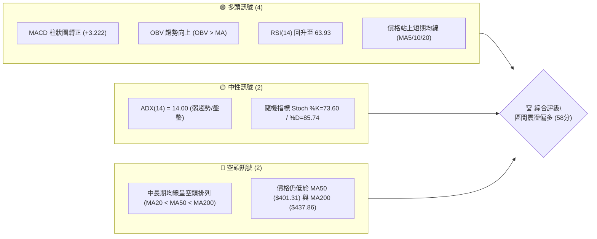
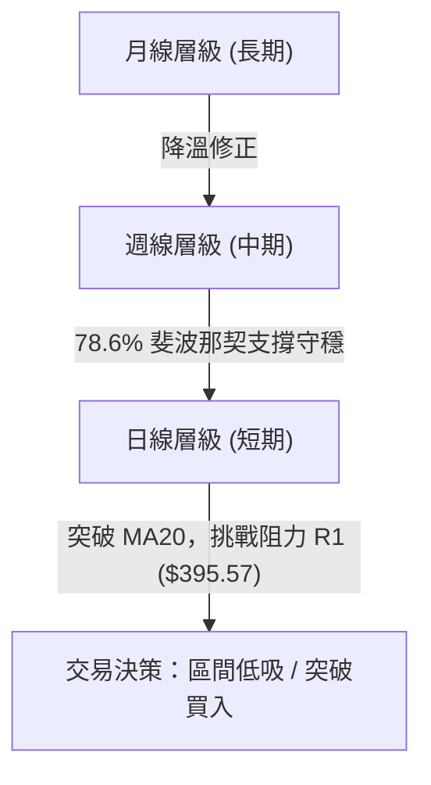
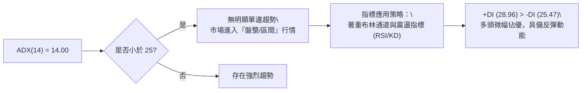
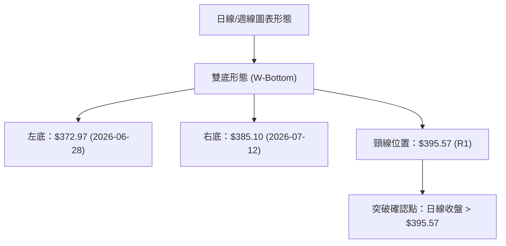
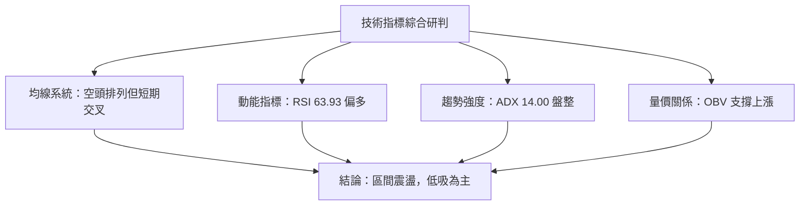
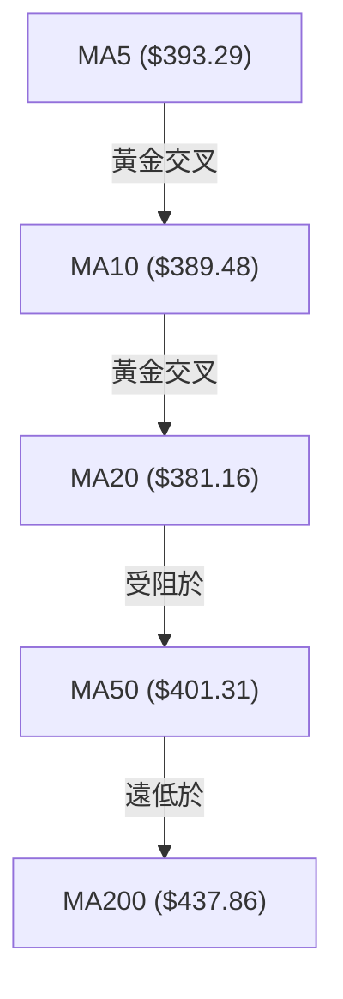
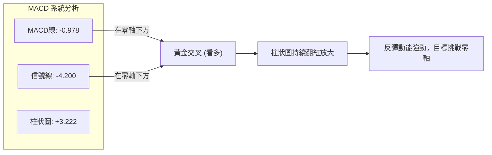
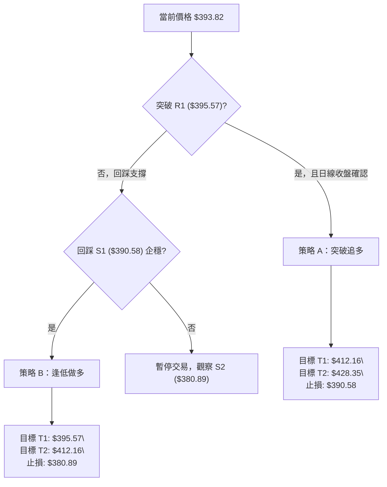
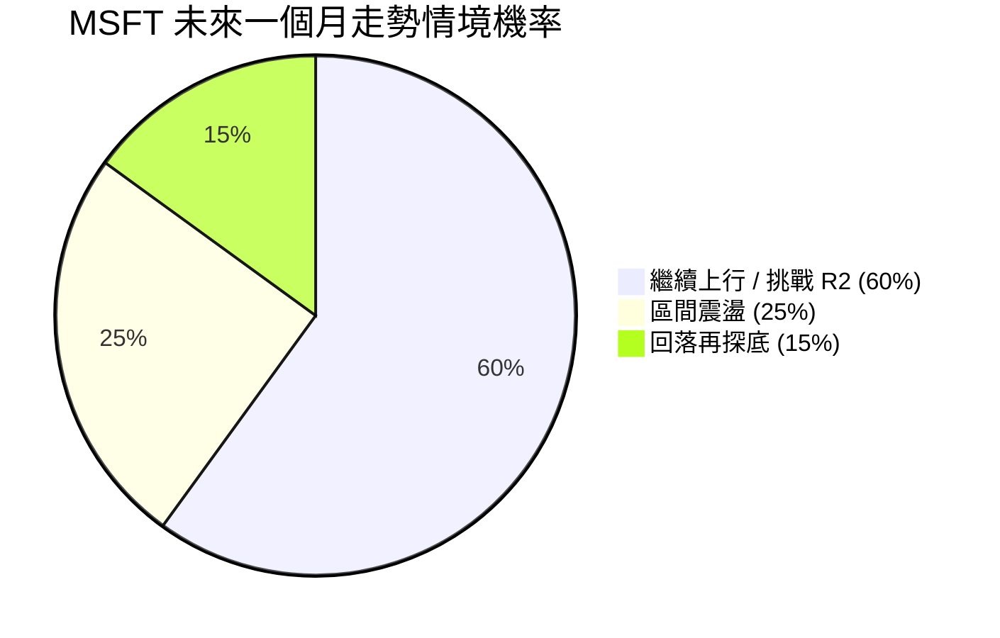
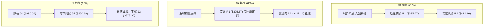

<details>
<summary>📊 靜態圖表 (點擊展開)</summary>

</details>

<html>
<head><meta charset="utf-8" /></head>
<body>
    <div style="height:500px; width:100%;">                        <script>window.PlotlyConfig = {MathJaxConfig: 'local'};</script>
        <script charset="utf-8" src="https://cdn.plot.ly/plotly-3.7.0.min.js" integrity="sha256-jvTGqxNp8AGWEcvNLVuKr+8j5dGe9Yw51LQkmDH+IYA=" crossorigin="anonymous"></script>                <div id="candlestick-chart" class="plotly-graph-div" style="height:100%; width:100%;"></div>            <script>                window.PLOTLYENV=window.PLOTLYENV || {};                                if (document.getElementById("candlestick-chart")) {                    Plotly.newPlot(                        "candlestick-chart",                        [{"close":{"dtype":"f8","bdata":"AAAA4IUVgEAAAACggyOAQAAAAED0A4BAAAAAoMAQgEAAAADA8mmAQAAAAGB1RYBAAAAAAGBMgEAAAAAg5jiAQAAAAMDou39AAAAAwAntf0AAAAAgaOV\u002fQAAAAEAu439AAAAAgD7Gf0AAAAAAkeV\u002fQAAAACBNDIBAAAAAoDcTgEAAAACgHCqAQAAAAIBFKoBAAAAAgIRCgEAAAABgZoGAQAAAAMBE1YBAAAAAYCLRgEAAAAAAnFOAQAAAAOBoFIBAAAAAgDUOgEAAAACgffF\u002fQAAAAAB+f39AAAAAgIvffkAAAADgF9t+QAAAAIAMbX9AAAAAoKiXf0AAAACAxb5\u002fQAAAAED2QX9AAAAAAIKvf0AAAAAAvYR\u002fQAAAACDrqn5AAAAAoN5AfkAAAAAA8cR9QAAAAOBtYH1AAAAAQGB+fUAAAADgAK59QAAAAICPNX5AAAAAQEKdfkAAAADgT0l+QAAAAMA9fX5AAAAAoMq5fUAAAADAVOt9QAAAAEBJEH5AAAAAIH2NfkAAAADgap1+QAAAAEADx31AAAAAYDkVfkAAAADgiMZ9QAAAACBwi31AAAAAYHKkfUAAAABAJaB9QAAAACBZHX5AAAAAIEA8fkAAAABgUix+QAAAAIAQS35AAAAAgLNdfkAAAABgw1h+QAAAAAAMT35AAAAAgBlVfkAAAAAgnRd+QAAAAMB9bX1AAAAA4A5sfUAAAABgN8Z9QAAAAGA5FX5AAAAAINi\u002ffUAAAABAe9J9QAAAAMAHsX1AAAAAIFVJfUAAAABAfpV8QAAAAIAqanxAAAAAgCOdfEAAAAAAFEh8QAAAAKBBontAAAAA4DwSfEAAAACgJf58QAAAAMAeQ31AAAAAYDDnfUAAAABA6vd9QAAAAMA\u002f+XpAAAAAAB7GekAAAABA41d6QAAAAKAwlnlAAAAAoKjFeUAAAABgy354QAAAAODI9XhAAAAAwEK8eUAAAAAAAbd5QAAAAEA8KXlAAAAAQO8AeUAAAADgpvh4QAAAAKCbsXhAAAAAAEHdeEAAAADglNl4QAAAAMDxxXhAAAAAoDn6d0AAAACAjEJ4QAAAAGC\u002f+3hAAAAAAKENeUAAAABgQn54QAAAAKAE23hAAAAAgOkweUAAAABAMEV5QAAAAMCtnHlAAAAA4DeBeUAAAAAgZ4h5QAAAACAhTnlAAAAAYBRAeUAAAAAg3Q95QAAAAEAfq3hAAAAAwF7xeEAAAACgv+h4QAAAAKAXb3hAAAAAIN5CeEAAAAAgt9B3QAAAAKDB4ndAAAAAYPM+d0AAAABgzyN3QAAAAIDd0nZAAAAAoPs\u002fdkAAAACA8mJ2QAAAAIDrFXdAAAAAwCUJd0AAAAAgckp3QAAAAKAvQXdAAAAAQMQ3d0AAAAAAVlh3QAAAAEA4RHdAAAAAgBghd0AAAAAAofh3QAAAAKAqhHhAAAAA4EyleUAAAADAoDV6QAAAAEAFXnpAAAAA4KkSekAAAACg5HN6QAAAAADA\u002f3pAAAAAoJ\u002fteUAAAACgPHt6QAAAACBufnpAAAAAICjFekAAAACgrnh6QAAAACBhbnlAAAAAgLXYeUAAAAAAnst5QAAAAODap3lAAAAAoAvReUAAAAAgxT16QAAAAMCQ43lAAAAAYEq8eUAAAAAgOG55QAAAACBZRXlAAAAA4LiIeUAAAABgIVB6QAAAAKD+aXpAAAAAQEkIekAAAABgZkJ6QAAAAKBwMXpAAAAAwB4pekAAAADgegB6QAAAAGC4ynlAAAAAANevekAAAAAA1yN8QAAAAOBRyHxAAAAAwPWUe0AAAACgcLV6QAAAAMDMwHpAAAAAYLgKekAAAAAA17t5QAAAAGCPNnlAAAAAgMLVeEAAAACgcGV4QAAAAADXa3hAAAAAACn8eEAAAACgR514QAAAAGCPrndAAAAAYGa2d0AAAACgcPV2QAAAAEAKX3dAAAAAIFzXdkAAAACgRw12QAAAACCFT3dAAAAAwB4Jd0AAAADgUVB3QAAAAOB6BHhAAAAAANdneEAAAAAA1yt4QAAAAKBwTXhAAAAAoHD1d0AAAACAwgV4QAAAAKCZEXhAAAAAANdveEAAAABA4Q54QAAAAIAUunhAAAAAoJkReUAAAADAHp14QA=="},"high":{"dtype":"f8","bdata":"rTg6KzEXgEDsymOw3ymAQCXV1\u002fiJMoBAjI9B57YpgEBFIxYrgX2AQF5iQ7y5c4BADozLzhFdgECKQOnfPUiAQG8RpYdHQoBA5N4itUcJgEDqebclTACAQEDGtyl7D4BA1v+UNscMgEA+iw8j4wGAQBxU1EF8G4BAY4Nk2WcbgEAUXutMZU+AQKAPkY44RYBAT2zOkllQgEDpc3vPuZmAQCULmrjhMYFAZ3DxKaj2gEDnqQ1L05yAQCTQDgbpb4BAc79S6j9NgECH+6+WcQKAQMrNDKlw+X9AGUukb0dof0D7bFiiywN\u002fQC86vTaQen9AGGy8SEmmf0AJUX62Msd\u002fQBDUgi9L5H9AIL82xRXGf0CE7P8lWs5\u002fQOM0b3oIPX9AH6QbWS3BfkCpof2OG7Z+QHeYQkO\u002fzH1AOnIv9pGsfUDmpD4GadB9QPFQszhSYn5AEWq3fSKnfkBePWO3Ant+QKEO6jD+tH5AQq+iR30hfkDac34o+vJ9QK5+TeQbFH5Ao8tzweChfkAzdxSvAp9+QCGJ3CumIX5A+BzDogA+fkBB7jsQ+gR+QKqrgFtr6X1A\u002f6OnIle8fUCbyjJK8919QFmtGJHedn5ANIOZU\u002f5afkBsM8XvAml+QG+KJbSsWn5Ahn0oTNxvfkCiS+xNS19+QIx830z1Yn5AqhFjrCR4fkA0rgALnV9+QFDEwQouKH5AAdOzhlmffUCCKNgy4cl9QBiuJF12eH5AlmxlX1IIfkC094xRFdt9QCqtp0+47X1AnXs11LqafUAd4pXU\u002fCF9QPoXtkoR43xA83L9xi7SfEAI3KR4ZWx8QBuJpZDtKnxAbZTtIFEtfEAzHvZ5LlB9QGTq98dbgn1AEk3xqaoLfkB6he5uhhl+QLXT8U+ciHtAYThBr2pae0DyHNrpSM16QK9IyWXcQnpAtyGhPwUfekB6JkkS1md5QEqRPHIjAHlAlfLhMs\u002fQeUD8fAFV01x6QKf+7FLR6XlAl+ORsmJGeUBPd6Rd3zt5QD3uB4no63hAxi1UX2cMeUC5VP4m5Th5QLeiy4oV9HhAcRXVmBaoeEDWPzfQS0h4QOueaiyjCXlAQk8xzL9peUCXvPsBZr94QHOwKMEqBXlAZqeK+iJdeUAsIvlDRKJ5QEZ0cMSGq3lA9PlCS4TCeUDdyw\u002fLLJV5QDheNhIElXlAjD2dUASCeUDzhgpq4FN5QKCK6l3NPnlAUZj\u002f+jn8eECZMZJzajh5QFoP9cY80nhAOOJBiER6eEAsMJ82niJ4QOSVhXv4JXhA9SHVXUvad0BtmM7164N3QAdhKQuQXndAXw7vt6qadkBbwmM4IMl2QMAfUFWBQXdA0bFLWuhSd0DX7QfoUU13QOFktbnBTndAsLhmNVI6d0D2bCXsrwJ4QNJFkLEVS3dAI2toRkBtd0CRXrneV\u002ft3QOffb2NknXhAW0mBXZfXeUBjIvKKkT56QLYwdTBb6npATubpL6RmekBc5jXEG6R6QIC9W\u002fgzDHtA9TRJ+uhrekDD3x10gYB6QDp1fZr9onpANu2ckdrPekAf7K5bXJ56QKDCpNhj2HlAxWBPHVYDekDoKAf+7T16QFyUtXIR\u002fnlAmiO+ZEAYekBgvt6M4bB6QKT\u002fsK2aG3pAzlQE\u002fMS8eUAXpBrSoel5QLzhNAPpVnlAapGC6jKveUCBjC0M6rN6QDXBgEM4g3pAZIuo3Dz8ekCayyALAVN6QAAAAKBwpXpAAAAAYGaGekAAAADgUTx6QAAAAEAK\u002f3lAAAAAANfXekAAAACgRyV8QAAAAMAeJX1AAAAAAABYfEAAAACAPYZ7QAAAAGBmQntAAAAAIIXXekAAAABgjxJ6QAAAACCuv3lAAAAA4KNQeUAAAACgmc14QAAAAADXe3hAAAAAAAAceUAAAACgcM14QAAAAIDrZXhAAAAAgOvVd0AAAACAFNp3QAAAACCFk3dAAAAAgBSud0AAAAAgrsN2QAAAAIDCiXdAAAAAAADId0AAAABgZmJ3QAAAAKBHTXhAAAAAQDODeEAAAABgZlJ4QAAAAMAeuXhAAAAAwPUUeEAAAABgZgp4QAAAAGCPfnhAAAAAYGaaeEAAAABACkN4QAAAACBc73hAAAAAANdfeUAAAACAPeZ4QA=="},"hovertemplate":"\u003cb\u003e%{x|%Y-%m-%d}\u003c\u002fb\u003e\u003cbr\u003e\u958b: $%{open:.2f}\u003cbr\u003e\u9ad8: $%{high:.2f}\u003cbr\u003e\u4f4e: $%{low:.2f}\u003cbr\u003e\u6536: $%{close:.2f}\u003cextra\u003e\u003c\u002fextra\u003e","low":{"dtype":"f8","bdata":"3cZGkj2nf0AQ5B79g8d\u002fQNpNKC91t39A2+riUyT8f0CXKRmogheAQJjh7TxEMYBAHS0QT2I+gEBbv7ORJhGAQEgqtGjDpn9Ab2XIV1vHf0DilQ+DDG1\u002fQP44wmqlrH9AHv57NOqOf0BK9uyf4IF\u002fQPKillwu439ABhCU1\u002frcf0BxI7FZnROAQK9+HALFGoBAvsaWwHYrgECasNI5cm2AQGQeWSHvyoBA6dTuH9GqgEBSTn8qrDaAQMyDv1u7\u002fX9AAmX8pZ\u002f1f0D8ANrLTYp\u002fQHWtkjNFdn9A43Hn4AjLfkAD0MwmVaJ+QD9qetmS+n5AWc88LAQzf0BJAB9Zqf9+QMPgJc4pIn9AMgRAaPPkfkD6Jqrht1t\u002fQAJXntN2O35AF4pAVqn8fUBLrlv1RJZ9QAOiXioaI31AJ4yKuB4ffUApdTccQ+18QCEpENYQ8X1APXoT9uBHfkBOmDo0BSh+QByx2VOfQn5AWTzCsX2RfUDSy5YeCqZ9QBXSZxkczH1AGPZrVLgjfkBG2CLsWGV+QGNJJ1KUj31A6YRl8gCcfUARahxlpqN9QB6vjwTNZn1A9nJ3b61MfUApQ8IWTo59QAy+5hdXvH1AedPvCZ0FfkBS7A6\u002fzAh+QA\u002fsTDF0KX5APHgULuMqfkAaKZ8n4zx+QHro2qaIIH5A0rn6VI81fkBDZ6wvhBJ+QOqO91s1QX1Ad6mrFbI2fUBpQWN0rTp9QDB6BL5LvX1AE2YJ\u002fACcfUDHcTIytGF9QKpfXv0imX1AT53LtiX+fEDUyAxCSnJ8QIiSOU0PXnxAmPtBgUxnfECZIOQnnPR7QBOGT\u002fvCS3tAYKkHk6ere0BVhctGhQh8QPC3qTw6v3xAF6Dg3v5wfUCE1HSrF759QJHcQkJ0MnpAZz+NG\u002fOIekAAJrYWDEZ6QG8umF\u002f6a3lA4mE1RM92eUBqLRVESml4QM2oDAbZcnhAlOODzHvxeEDT4MK57K15QFaVNMS283hARcBbLe3DeEDKMv1BkMR4QDBO3E9+jHhAhIJZsAGpeEBYmmL4AL14QI++\u002flLlpHhAgQe4QFrkd0CFPlIoKc53QMz1I4sRVXhA1Eo6QQ3eeEAhTjcxmVB4QMqFYnySXHhALS+HTSR9eEDkMdgJHvd4QJZIz3dqOHlAU0y\u002fuwh6eUC9WEsRDCp5QLuuSm3yIHlAed3Kn40LeUBb3OkTeA15QJqz\u002fgFelnhAcemdDf2eeEDuGvDxPs54QCPyT756YnhA2Eu\u002fWZMjeEDOvMSdxrR3QG4kVo+uzXdAbTDi4L0wd0BcUkd7TA13QMy2mIdpxnZAejQqDdU7dkBuQmD5KDh2QK0sDLqQpHZAnPhh23f2dkBuMFfKzrV2QFoazAs5C3dAopNL2UjcdkAzvB6Ztyl3QOb\u002fYoob5HZAFVSPT68Td0A8NR2NfSN3QDBT81X0GnhAAU4eJfa9eEC7wVoh\u002fbN5QG3y9TZ+PHpArRkxi2f2eUDx3HocxgR6QLEec+IRbHpAB61Va1WoeUB1ztzza+55QIKj67qyAnpAk7GckM9PekCT9RlKGzZ6QGSQY7xl0nhAvRTD6NiYeUDHgLA2mJ55QLc6wPapfnlAnqTLV8BDeUBc\u002f\u002fMKrh16QIPcGyqv0XlAVr\u002f2YfpJeUBC5MTALVx5QK2+i+CcAnlAaq\u002fEzzcAeUBniZYiSMB5QNi2rHJj63lAsV2bG3D5eUC4Ny3Gk6Z5QAAAACBc+3lAAAAAoEcFekAAAADgUdB5QAAAAKBHmXlAAAAAYLjKeUAAAACAwgV7QAAAAOBRpHxAAAAAQOGGe0AAAAAAAIR6QAAAAGCPpnpAAAAAYGbmeUAAAADA9Yh5QAAAACCu53hAAAAAYI\u002fSeEAAAAAAAAB4QAAAAOBR5HdAAAAAoJmNeEAAAABACmt4QAAAAMAelXdAAAAA4HpUd0AAAADAHvF2QAAAAGC4KndAAAAA4HrMdkAAAABAM9N1QAAAAEDhNnZAAAAAYGZ+dkAAAABAM\u002fd2QAAAAIA9bndAAAAAQDP7d0AAAAAghdN3QAAAACCFQ3hAAAAAoEfVd0AAAACgmVV3QAAAAAAA2HdAAAAAYGYCeEAAAABgZqp3QAAAAGBmJnhAAAAAwMyAeEAAAACAPVZ4QA=="},"name":"\u50f9\u683c","open":{"dtype":"f8","bdata":"04y56Sjgf0BFW+9R9vh\u002fQFVa0wIPE4BAs2nl2MMOgEDcS2H\u002fxBqAQO+0s7K4Z4BAM1Qj\u002fOQ\u002fgED24PYFbDiAQDk33S\u002f1IoBA5N4itUcJgECikuSYTbB\u002fQCUfO8+B+39A1Ay8vqrVf0BYkZAnYp1\u002fQDMJzTHx9X9Ao9vVD\u002fIRgECs\u002fhgj9i6AQKYY00JgOYBAUsuosf87gEAr0ReGd4OAQOZDwSpPFIFA+SZsbhXsgEAgoBuqIXmAQPMP35FpbIBAgeJCC08kgECrMo8foch\u002fQJfA0Rkd4X9A95Spl6Rnf0A1CBYGKd1+QNlyegJKDn9A8u2NJPhZf0CoL5BieKJ\u002fQGq6kiqTsX9AyRTr6oLxfkDm5LCAAJR\u002fQAGeigUKxH5AKfKR7j9wfkAL\u002fyaNaKh+QEVv3oMOxn1A\u002fa4WF06OfUBo79ymfX99QLI9bop2Qn5AbxWV9QJXfkAa18ZAZGR+QP55U3D+SH5A8hD+2lSjfUAuFba8INp9QADGYV8XBn5AxeVzEdgrfkBL9cGm525+QO3ongolHn5ARRai9kSofUCHyt9SFdt9QPiwzB2L331AP80bmxVdfUCg2VHHuqx9QCxFSGUewX1Aw\u002fSrGTBTfkAWMW21bz9+QHBrdvVGLX5Aj0V3Xm04fkAPPO2I1Uh+QF7Voo1dK35AmZ72xWg8fkCq7b+d1Vp+QE5s6RHhI35An+LuBlV\u002ffUBf1GioMHt9QJZHeZ8g2n1A4WznyLPxfUAKdkzrVH99QElP2SLoqH1ABuUFLjWJfUD1wshNRQZ9QKj5Fyf\u002f4HxAQ35Rfc18fED16B8tgxN8QEgPB5N+KXxAq11GzCrae0B1xTmR3R18QBqU5+Dz83xACE5s8Jh5fUBlFNUuFRF+QEVyt+SgYHtAo3k5PpFTe0DAc0n+UcV6QBcEpF85QnpAPpEQTtiSeUA+9UswI1p5QJ\u002f2W4Zn1nhAvjbapeEweUA6HYBPJxx6QBkLnIhb5XlAKDtZPUUzeUBOwuyIgip5QHJSiWQz13hA8ErfkdbFeECmeW1CL\u002f14QEcMLAoQtHhAk\u002f6jSFeieEAiXIAF9fR3QBZEqMT5WnhAcFYoiF09eUCKgwtXkGB4QGD6xL4sgHhAooxnRKWEeECFJkuqcQZ5QDbycEq8OHlAkM0Q4AyFeUAe0z\u002fft0B5QHjAfTNNknlAjlpShBhLeUCcc6GaFjx5QJPTVkEiAnlAoxx55FrTeEAE6xSDevZ4QDXciPpYxHhAMwx1UBxUeEC0o37yQx94QABAeggg8XdAOZQmt4nYd0C6LAjTr4F3QADzJDFMIHdAgZRituKRdkBHYmS54pF2QMnqHKAxvHZAL7thx+xKd0D6JMRzqeZ2QHtPpbnsSndAd0UZQ6IYd0DQvXE5XgJ4QKrAu4seO3dAjM9hcshCd0D9WMs\u002f10x3QLVaR3FOMXhA\u002fusTxzzSeEAsy4bKPS96QHj7rydufnpA4DMuPNZDekDdYGTzTjV6QN+Yn3NNlHpAx43debgvekDaFWL4GQF6QNckfnl5V3pAj0DRTXB6ekDEiBAQmXp6QNdJhy3BnnlA4+uVhIa+eUClSKjJaKp5QL5jSz\u002fC5nlAbh95QuRxeUCrE66XOzN6QLoHu6fOB3pA3c0X59BveUCCT5\u002f5WNl5QCTv8ApCJXlAiEuGkbE5eUD705KY\u002ftV5QPOW1YGD+3lAr1YGxojPekCsrhz+ZdR5QAAAAAAAjHpAAAAA4KM4ekAAAABA4QZ6QAAAAAApsHlAAAAAIK7PeUAAAADAzAh7QAAAAKBwDX1AAAAAgBTue0AAAABAM2d7QAAAAMD1PHtAAAAAoHDFekAAAACAPeJ5QAAAAOB6kHlAAAAAwMzoeEAAAAAgXLN4QAAAAEDhdnhAAAAAwMzMeEAAAADgo7x4QAAAAAAAZHhAAAAAwB6dd0AAAAAA13t3QAAAAIAURndAAAAAwB45d0AAAADgUax2QAAAAGBmUnZAAAAAAACYd0AAAADgejB3QAAAAKBHzXdAAAAAIK4HeEAAAADgozB4QAAAAADXh3hAAAAA4HoAeEAAAABAM2d3QAAAAMDMPHhAAAAAAAA8eEAAAADAHu13QAAAAMDMPHhAAAAAwPXkeEAAAACAwq14QA=="},"x":["2025-09-30T00:00:00-04:00","2025-10-01T00:00:00-04:00","2025-10-02T00:00:00-04:00","2025-10-03T00:00:00-04:00","2025-10-06T00:00:00-04:00","2025-10-07T00:00:00-04:00","2025-10-08T00:00:00-04:00","2025-10-09T00:00:00-04:00","2025-10-10T00:00:00-04:00","2025-10-13T00:00:00-04:00","2025-10-14T00:00:00-04:00","2025-10-15T00:00:00-04:00","2025-10-16T00:00:00-04:00","2025-10-17T00:00:00-04:00","2025-10-20T00:00:00-04:00","2025-10-21T00:00:00-04:00","2025-10-22T00:00:00-04:00","2025-10-23T00:00:00-04:00","2025-10-24T00:00:00-04:00","2025-10-27T00:00:00-04:00","2025-10-28T00:00:00-04:00","2025-10-29T00:00:00-04:00","2025-10-30T00:00:00-04:00","2025-10-31T00:00:00-04:00","2025-11-03T00:00:00-05:00","2025-11-04T00:00:00-05:00","2025-11-05T00:00:00-05:00","2025-11-06T00:00:00-05:00","2025-11-07T00:00:00-05:00","2025-11-10T00:00:00-05:00","2025-11-11T00:00:00-05:00","2025-11-12T00:00:00-05:00","2025-11-13T00:00:00-05:00","2025-11-14T00:00:00-05:00","2025-11-17T00:00:00-05:00","2025-11-18T00:00:00-05:00","2025-11-19T00:00:00-05:00","2025-11-20T00:00:00-05:00","2025-11-21T00:00:00-05:00","2025-11-24T00:00:00-05:00","2025-11-25T00:00:00-05:00","2025-11-26T00:00:00-05:00","2025-11-28T00:00:00-05:00","2025-12-01T00:00:00-05:00","2025-12-02T00:00:00-05:00","2025-12-03T00:00:00-05:00","2025-12-04T00:00:00-05:00","2025-12-05T00:00:00-05:00","2025-12-08T00:00:00-05:00","2025-12-09T00:00:00-05:00","2025-12-10T00:00:00-05:00","2025-12-11T00:00:00-05:00","2025-12-12T00:00:00-05:00","2025-12-15T00:00:00-05:00","2025-12-16T00:00:00-05:00","2025-12-17T00:00:00-05:00","2025-12-18T00:00:00-05:00","2025-12-19T00:00:00-05:00","2025-12-22T00:00:00-05:00","2025-12-23T00:00:00-05:00","2025-12-24T00:00:00-05:00","2025-12-26T00:00:00-05:00","2025-12-29T00:00:00-05:00","2025-12-30T00:00:00-05:00","2025-12-31T00:00:00-05:00","2026-01-02T00:00:00-05:00","2026-01-05T00:00:00-05:00","2026-01-06T00:00:00-05:00","2026-01-07T00:00:00-05:00","2026-01-08T00:00:00-05:00","2026-01-09T00:00:00-05:00","2026-01-12T00:00:00-05:00","2026-01-13T00:00:00-05:00","2026-01-14T00:00:00-05:00","2026-01-15T00:00:00-05:00","2026-01-16T00:00:00-05:00","2026-01-20T00:00:00-05:00","2026-01-21T00:00:00-05:00","2026-01-22T00:00:00-05:00","2026-01-23T00:00:00-05:00","2026-01-26T00:00:00-05:00","2026-01-27T00:00:00-05:00","2026-01-28T00:00:00-05:00","2026-01-29T00:00:00-05:00","2026-01-30T00:00:00-05:00","2026-02-02T00:00:00-05:00","2026-02-03T00:00:00-05:00","2026-02-04T00:00:00-05:00","2026-02-05T00:00:00-05:00","2026-02-06T00:00:00-05:00","2026-02-09T00:00:00-05:00","2026-02-10T00:00:00-05:00","2026-02-11T00:00:00-05:00","2026-02-12T00:00:00-05:00","2026-02-13T00:00:00-05:00","2026-02-17T00:00:00-05:00","2026-02-18T00:00:00-05:00","2026-02-19T00:00:00-05:00","2026-02-20T00:00:00-05:00","2026-02-23T00:00:00-05:00","2026-02-24T00:00:00-05:00","2026-02-25T00:00:00-05:00","2026-02-26T00:00:00-05:00","2026-02-27T00:00:00-05:00","2026-03-02T00:00:00-05:00","2026-03-03T00:00:00-05:00","2026-03-04T00:00:00-05:00","2026-03-05T00:00:00-05:00","2026-03-06T00:00:00-05:00","2026-03-09T00:00:00-04:00","2026-03-10T00:00:00-04:00","2026-03-11T00:00:00-04:00","2026-03-12T00:00:00-04:00","2026-03-13T00:00:00-04:00","2026-03-16T00:00:00-04:00","2026-03-17T00:00:00-04:00","2026-03-18T00:00:00-04:00","2026-03-19T00:00:00-04:00","2026-03-20T00:00:00-04:00","2026-03-23T00:00:00-04:00","2026-03-24T00:00:00-04:00","2026-03-25T00:00:00-04:00","2026-03-26T00:00:00-04:00","2026-03-27T00:00:00-04:00","2026-03-30T00:00:00-04:00","2026-03-31T00:00:00-04:00","2026-04-01T00:00:00-04:00","2026-04-02T00:00:00-04:00","2026-04-06T00:00:00-04:00","2026-04-07T00:00:00-04:00","2026-04-08T00:00:00-04:00","2026-04-09T00:00:00-04:00","2026-04-10T00:00:00-04:00","2026-04-13T00:00:00-04:00","2026-04-14T00:00:00-04:00","2026-04-15T00:00:00-04:00","2026-04-16T00:00:00-04:00","2026-04-17T00:00:00-04:00","2026-04-20T00:00:00-04:00","2026-04-21T00:00:00-04:00","2026-04-22T00:00:00-04:00","2026-04-23T00:00:00-04:00","2026-04-24T00:00:00-04:00","2026-04-27T00:00:00-04:00","2026-04-28T00:00:00-04:00","2026-04-29T00:00:00-04:00","2026-04-30T00:00:00-04:00","2026-05-01T00:00:00-04:00","2026-05-04T00:00:00-04:00","2026-05-05T00:00:00-04:00","2026-05-06T00:00:00-04:00","2026-05-07T00:00:00-04:00","2026-05-08T00:00:00-04:00","2026-05-11T00:00:00-04:00","2026-05-12T00:00:00-04:00","2026-05-13T00:00:00-04:00","2026-05-14T00:00:00-04:00","2026-05-15T00:00:00-04:00","2026-05-18T00:00:00-04:00","2026-05-19T00:00:00-04:00","2026-05-20T00:00:00-04:00","2026-05-21T00:00:00-04:00","2026-05-22T00:00:00-04:00","2026-05-26T00:00:00-04:00","2026-05-27T00:00:00-04:00","2026-05-28T00:00:00-04:00","2026-05-29T00:00:00-04:00","2026-06-01T00:00:00-04:00","2026-06-02T00:00:00-04:00","2026-06-03T00:00:00-04:00","2026-06-04T00:00:00-04:00","2026-06-05T00:00:00-04:00","2026-06-08T00:00:00-04:00","2026-06-09T00:00:00-04:00","2026-06-10T00:00:00-04:00","2026-06-11T00:00:00-04:00","2026-06-12T00:00:00-04:00","2026-06-15T00:00:00-04:00","2026-06-16T00:00:00-04:00","2026-06-17T00:00:00-04:00","2026-06-18T00:00:00-04:00","2026-06-22T00:00:00-04:00","2026-06-23T00:00:00-04:00","2026-06-24T00:00:00-04:00","2026-06-25T00:00:00-04:00","2026-06-26T00:00:00-04:00","2026-06-29T00:00:00-04:00","2026-06-30T00:00:00-04:00","2026-07-01T00:00:00-04:00","2026-07-02T00:00:00-04:00","2026-07-06T00:00:00-04:00","2026-07-07T00:00:00-04:00","2026-07-08T00:00:00-04:00","2026-07-09T00:00:00-04:00","2026-07-10T00:00:00-04:00","2026-07-13T00:00:00-04:00","2026-07-14T00:00:00-04:00","2026-07-15T00:00:00-04:00","2026-07-16T00:00:00-04:00","2026-07-17T00:00:00-04:00"],"type":"candlestick"},{"hovertemplate":"MA30: $%{y:.2f}\u003cextra\u003e\u003c\u002fextra\u003e","line":{"color":"#2196F3","dash":"dash","width":2},"mode":"lines","name":"MA30","x":["2025-09-30T00:00:00-04:00","2025-10-01T00:00:00-04:00","2025-10-02T00:00:00-04:00","2025-10-03T00:00:00-04:00","2025-10-06T00:00:00-04:00","2025-10-07T00:00:00-04:00","2025-10-08T00:00:00-04:00","2025-10-09T00:00:00-04:00","2025-10-10T00:00:00-04:00","2025-10-13T00:00:00-04:00","2025-10-14T00:00:00-04:00","2025-10-15T00:00:00-04:00","2025-10-16T00:00:00-04:00","2025-10-17T00:00:00-04:00","2025-10-20T00:00:00-04:00","2025-10-21T00:00:00-04:00","2025-10-22T00:00:00-04:00","2025-10-23T00:00:00-04:00","2025-10-24T00:00:00-04:00","2025-10-27T00:00:00-04:00","2025-10-28T00:00:00-04:00","2025-10-29T00:00:00-04:00","2025-10-30T00:00:00-04:00","2025-10-31T00:00:00-04:00","2025-11-03T00:00:00-05:00","2025-11-04T00:00:00-05:00","2025-11-05T00:00:00-05:00","2025-11-06T00:00:00-05:00","2025-11-07T00:00:00-05:00","2025-11-10T00:00:00-05:00","2025-11-11T00:00:00-05:00","2025-11-12T00:00:00-05:00","2025-11-13T00:00:00-05:00","2025-11-14T00:00:00-05:00","2025-11-17T00:00:00-05:00","2025-11-18T00:00:00-05:00","2025-11-19T00:00:00-05:00","2025-11-20T00:00:00-05:00","2025-11-21T00:00:00-05:00","2025-11-24T00:00:00-05:00","2025-11-25T00:00:00-05:00","2025-11-26T00:00:00-05:00","2025-11-28T00:00:00-05:00","2025-12-01T00:00:00-05:00","2025-12-02T00:00:00-05:00","2025-12-03T00:00:00-05:00","2025-12-04T00:00:00-05:00","2025-12-05T00:00:00-05:00","2025-12-08T00:00:00-05:00","2025-12-09T00:00:00-05:00","2025-12-10T00:00:00-05:00","2025-12-11T00:00:00-05:00","2025-12-12T00:00:00-05:00","2025-12-15T00:00:00-05:00","2025-12-16T00:00:00-05:00","2025-12-17T00:00:00-05:00","2025-12-18T00:00:00-05:00","2025-12-19T00:00:00-05:00","2025-12-22T00:00:00-05:00","2025-12-23T00:00:00-05:00","2025-12-24T00:00:00-05:00","2025-12-26T00:00:00-05:00","2025-12-29T00:00:00-05:00","2025-12-30T00:00:00-05:00","2025-12-31T00:00:00-05:00","2026-01-02T00:00:00-05:00","2026-01-05T00:00:00-05:00","2026-01-06T00:00:00-05:00","2026-01-07T00:00:00-05:00","2026-01-08T00:00:00-05:00","2026-01-09T00:00:00-05:00","2026-01-12T00:00:00-05:00","2026-01-13T00:00:00-05:00","2026-01-14T00:00:00-05:00","2026-01-15T00:00:00-05:00","2026-01-16T00:00:00-05:00","2026-01-20T00:00:00-05:00","2026-01-21T00:00:00-05:00","2026-01-22T00:00:00-05:00","2026-01-23T00:00:00-05:00","2026-01-26T00:00:00-05:00","2026-01-27T00:00:00-05:00","2026-01-28T00:00:00-05:00","2026-01-29T00:00:00-05:00","2026-01-30T00:00:00-05:00","2026-02-02T00:00:00-05:00","2026-02-03T00:00:00-05:00","2026-02-04T00:00:00-05:00","2026-02-05T00:00:00-05:00","2026-02-06T00:00:00-05:00","2026-02-09T00:00:00-05:00","2026-02-10T00:00:00-05:00","2026-02-11T00:00:00-05:00","2026-02-12T00:00:00-05:00","2026-02-13T00:00:00-05:00","2026-02-17T00:00:00-05:00","2026-02-18T00:00:00-05:00","2026-02-19T00:00:00-05:00","2026-02-20T00:00:00-05:00","2026-02-23T00:00:00-05:00","2026-02-24T00:00:00-05:00","2026-02-25T00:00:00-05:00","2026-02-26T00:00:00-05:00","2026-02-27T00:00:00-05:00","2026-03-02T00:00:00-05:00","2026-03-03T00:00:00-05:00","2026-03-04T00:00:00-05:00","2026-03-05T00:00:00-05:00","2026-03-06T00:00:00-05:00","2026-03-09T00:00:00-04:00","2026-03-10T00:00:00-04:00","2026-03-11T00:00:00-04:00","2026-03-12T00:00:00-04:00","2026-03-13T00:00:00-04:00","2026-03-16T00:00:00-04:00","2026-03-17T00:00:00-04:00","2026-03-18T00:00:00-04:00","2026-03-19T00:00:00-04:00","2026-03-20T00:00:00-04:00","2026-03-23T00:00:00-04:00","2026-03-24T00:00:00-04:00","2026-03-25T00:00:00-04:00","2026-03-26T00:00:00-04:00","2026-03-27T00:00:00-04:00","2026-03-30T00:00:00-04:00","2026-03-31T00:00:00-04:00","2026-04-01T00:00:00-04:00","2026-04-02T00:00:00-04:00","2026-04-06T00:00:00-04:00","2026-04-07T00:00:00-04:00","2026-04-08T00:00:00-04:00","2026-04-09T00:00:00-04:00","2026-04-10T00:00:00-04:00","2026-04-13T00:00:00-04:00","2026-04-14T00:00:00-04:00","2026-04-15T00:00:00-04:00","2026-04-16T00:00:00-04:00","2026-04-17T00:00:00-04:00","2026-04-20T00:00:00-04:00","2026-04-21T00:00:00-04:00","2026-04-22T00:00:00-04:00","2026-04-23T00:00:00-04:00","2026-04-24T00:00:00-04:00","2026-04-27T00:00:00-04:00","2026-04-28T00:00:00-04:00","2026-04-29T00:00:00-04:00","2026-04-30T00:00:00-04:00","2026-05-01T00:00:00-04:00","2026-05-04T00:00:00-04:00","2026-05-05T00:00:00-04:00","2026-05-06T00:00:00-04:00","2026-05-07T00:00:00-04:00","2026-05-08T00:00:00-04:00","2026-05-11T00:00:00-04:00","2026-05-12T00:00:00-04:00","2026-05-13T00:00:00-04:00","2026-05-14T00:00:00-04:00","2026-05-15T00:00:00-04:00","2026-05-18T00:00:00-04:00","2026-05-19T00:00:00-04:00","2026-05-20T00:00:00-04:00","2026-05-21T00:00:00-04:00","2026-05-22T00:00:00-04:00","2026-05-26T00:00:00-04:00","2026-05-27T00:00:00-04:00","2026-05-28T00:00:00-04:00","2026-05-29T00:00:00-04:00","2026-06-01T00:00:00-04:00","2026-06-02T00:00:00-04:00","2026-06-03T00:00:00-04:00","2026-06-04T00:00:00-04:00","2026-06-05T00:00:00-04:00","2026-06-08T00:00:00-04:00","2026-06-09T00:00:00-04:00","2026-06-10T00:00:00-04:00","2026-06-11T00:00:00-04:00","2026-06-12T00:00:00-04:00","2026-06-15T00:00:00-04:00","2026-06-16T00:00:00-04:00","2026-06-17T00:00:00-04:00","2026-06-18T00:00:00-04:00","2026-06-22T00:00:00-04:00","2026-06-23T00:00:00-04:00","2026-06-24T00:00:00-04:00","2026-06-25T00:00:00-04:00","2026-06-26T00:00:00-04:00","2026-06-29T00:00:00-04:00","2026-06-30T00:00:00-04:00","2026-07-01T00:00:00-04:00","2026-07-02T00:00:00-04:00","2026-07-06T00:00:00-04:00","2026-07-07T00:00:00-04:00","2026-07-08T00:00:00-04:00","2026-07-09T00:00:00-04:00","2026-07-10T00:00:00-04:00","2026-07-13T00:00:00-04:00","2026-07-14T00:00:00-04:00","2026-07-15T00:00:00-04:00","2026-07-16T00:00:00-04:00","2026-07-17T00:00:00-04:00"],"y":{"dtype":"f8","bdata":"AAAAAAAA+H8AAAAAAAD4fwAAAAAAAPh\u002fAAAAAAAA+H8AAAAAAAD4fwAAAAAAAPh\u002fAAAAAAAA+H8AAAAAAAD4fwAAAAAAAPh\u002fAAAAAAAA+H8AAAAAAAD4fwAAAAAAAPh\u002fAAAAAAAA+H8AAAAAAAD4fwAAAAAAAPh\u002fAAAAAAAA+H8AAAAAAAD4fwAAAAAAAPh\u002fAAAAAAAA+H8AAAAAAAD4fwAAAAAAAPh\u002fAAAAAAAA+H8AAAAAAAD4fwAAAAAAAPh\u002fAAAAAAAA+H8AAAAAAAD4fwAAAAAAAPh\u002fAAAAAAAA+H8AAAAAAAD4f2ZmZv7+FoBAREREJIoUgEB3d3fHRBKAQFVVVTX4DoBAIiIi0hENgEAAAADQeweAQDMzM6P3\u002fn9AiYiIqPjqf0DNzMyMJNR\u002fQKuqqtoGwH9AiYiIeEWrf0ARERGhW5h\u002fQJqZmYkJin9AMzMzQyOAf0C8u7tbZXJ\u002fQDMzMxOvZH9AvLu76\u002f5Pf0BVVVXFbjt\u002fQO\u002fu7j4XKH9AERERUU4Xf0Dv7u4e3AJ\u002fQKuqqvqs4X5AzczMzF\u002fDfkDe3d1t0ap+QAAAAGCBlH5A3t3djXB\u002ffkB3d3dXqWt+QAAAAFDbX35A3t3d3WlafkC8u7t7llR+QDMzM\u002fPrSn5AiYiI2HRAfkB3d3fXhTR+QHd3d\u002fdsLH5AMzMz8+AgfkCJiIg4tRR+QCIiIoIgCn5AREREhAgDfkBVVVVlEwN+QN7d3S0aCX5Ad3d310gLfkDv7u4egAx+QCIiIjIVCH5A3t3dfcD8fUARERGBOe59QJqZmamF3H1AAAAAoAjTfUAAAAAAD8V9QDMzMwNTsH1ARERENCabfUAAAACQTo19QERERBTpiH1A7+7uPmCHfUAAAACgBYl9QERERBQVc31AzczMzJpafUCamZmZmD59QN7d3R31F31AAAAAAN\u002fxfEARERGRa8F8QN7d3S3pk3xAvLu7a2VsfEARERHx3kR8QN7d3Z3xGHxA3t3dvXjre0De3d3dxb97QGZmZnZgl3tAvLu7u3twe0ARERFRdkZ7QBERESEnGXtAzczMHObnekCJiIg4b7h6QERERCRCkHpAmpmZiSJsekBEREQkOkl6QDMzMwPbKnpAERER4aUNekDv7u6e8\u002fN5QFVVVfWy4nlAREREZMzMeUCrqqoKRq95QKuqqtqBjXlAiYiIuM1leUCrqqpq7zt5QKuqqqpDKHlAERERsaMYeUBVVVXFZgx5QKuqqpqQAnlAzczM\u002fKv1eEAzMzOD3u94QKuqqpqz5nhAmpmZOXXReECrqqoafLt4QDMzMwOKp3hAzczMbAqQeEARERHh+3l4QO\u002fu7s5CbHhAzczMTKhceEB3d3dXWk94QAAAAPBkQnhA7+7ujuk7eEARERHxGjR4QN7d3U10JXhAq6qqWgkVeECrqqoKlRB4QImIiOivDXhAZmZmFpEReEBmZmbWlBl4QAAAALAGIHhAIiIi0t8keEBmZmZWuSx4QBEREZEtO3hAmpmZefZAeEAiIiJCE014QERERPSmXHhAvLu7uz5seEAAAACAk3l4QDMzM\u002fMVgnhAERERIZ2PeEARERGxgqB4QCIiIiKdr3hAAAAA4IzFeEAAAAAABOB4QLy7uxss+nhAd3d3d+oXeUARERFB5DF5QKuqqgqKRHlA7+7uvttZeUCrqqrapXN5QAAAALCbjnlA7+7uHqCmeUCJiIiIfr95QBEREeF32HlARERE9FXyeUBEREQEqgN6QLy7u5uMDnpAREREFG8XekCrqqpa6Cd6QCIiIoKEPHpAd3d352RJekDNzMw8lEt6QAAAABB7SXpAq6qqWnNKekCamZkZEkR6QGZmZkYkOXpAMzMz46AoekDv7u6e6xZ6QKuqqmpNDnpAZmZmZvMGekBERER03\u002fx5QKuqqpoH7HlAmpmZKRPaeUCJiIhYEL55QFVVVWWUqHlAmpmZyeGPeUCJiIj4DHN5QERERLRSYnlARERExABNeUCJiIjIaDN5QFVVVXX1HnlAiYiIyBMReUBEREQ0Qv94QCIiIhIg73hAAAAAAFbceEDNzMz8cct4QDMzM8O9vHhAAAAAkIqpeEAiIiKStYZ4QM3MzOwZZHhAvLu766dOeEAzMzNTxzx4QA=="},"type":"scatter"},{"hovertemplate":"MA60: $%{y:.2f}\u003cextra\u003e\u003c\u002fextra\u003e","line":{"color":"#9C27B0","dash":"dash","width":2},"mode":"lines","name":"MA60","x":["2025-09-30T00:00:00-04:00","2025-10-01T00:00:00-04:00","2025-10-02T00:00:00-04:00","2025-10-03T00:00:00-04:00","2025-10-06T00:00:00-04:00","2025-10-07T00:00:00-04:00","2025-10-08T00:00:00-04:00","2025-10-09T00:00:00-04:00","2025-10-10T00:00:00-04:00","2025-10-13T00:00:00-04:00","2025-10-14T00:00:00-04:00","2025-10-15T00:00:00-04:00","2025-10-16T00:00:00-04:00","2025-10-17T00:00:00-04:00","2025-10-20T00:00:00-04:00","2025-10-21T00:00:00-04:00","2025-10-22T00:00:00-04:00","2025-10-23T00:00:00-04:00","2025-10-24T00:00:00-04:00","2025-10-27T00:00:00-04:00","2025-10-28T00:00:00-04:00","2025-10-29T00:00:00-04:00","2025-10-30T00:00:00-04:00","2025-10-31T00:00:00-04:00","2025-11-03T00:00:00-05:00","2025-11-04T00:00:00-05:00","2025-11-05T00:00:00-05:00","2025-11-06T00:00:00-05:00","2025-11-07T00:00:00-05:00","2025-11-10T00:00:00-05:00","2025-11-11T00:00:00-05:00","2025-11-12T00:00:00-05:00","2025-11-13T00:00:00-05:00","2025-11-14T00:00:00-05:00","2025-11-17T00:00:00-05:00","2025-11-18T00:00:00-05:00","2025-11-19T00:00:00-05:00","2025-11-20T00:00:00-05:00","2025-11-21T00:00:00-05:00","2025-11-24T00:00:00-05:00","2025-11-25T00:00:00-05:00","2025-11-26T00:00:00-05:00","2025-11-28T00:00:00-05:00","2025-12-01T00:00:00-05:00","2025-12-02T00:00:00-05:00","2025-12-03T00:00:00-05:00","2025-12-04T00:00:00-05:00","2025-12-05T00:00:00-05:00","2025-12-08T00:00:00-05:00","2025-12-09T00:00:00-05:00","2025-12-10T00:00:00-05:00","2025-12-11T00:00:00-05:00","2025-12-12T00:00:00-05:00","2025-12-15T00:00:00-05:00","2025-12-16T00:00:00-05:00","2025-12-17T00:00:00-05:00","2025-12-18T00:00:00-05:00","2025-12-19T00:00:00-05:00","2025-12-22T00:00:00-05:00","2025-12-23T00:00:00-05:00","2025-12-24T00:00:00-05:00","2025-12-26T00:00:00-05:00","2025-12-29T00:00:00-05:00","2025-12-30T00:00:00-05:00","2025-12-31T00:00:00-05:00","2026-01-02T00:00:00-05:00","2026-01-05T00:00:00-05:00","2026-01-06T00:00:00-05:00","2026-01-07T00:00:00-05:00","2026-01-08T00:00:00-05:00","2026-01-09T00:00:00-05:00","2026-01-12T00:00:00-05:00","2026-01-13T00:00:00-05:00","2026-01-14T00:00:00-05:00","2026-01-15T00:00:00-05:00","2026-01-16T00:00:00-05:00","2026-01-20T00:00:00-05:00","2026-01-21T00:00:00-05:00","2026-01-22T00:00:00-05:00","2026-01-23T00:00:00-05:00","2026-01-26T00:00:00-05:00","2026-01-27T00:00:00-05:00","2026-01-28T00:00:00-05:00","2026-01-29T00:00:00-05:00","2026-01-30T00:00:00-05:00","2026-02-02T00:00:00-05:00","2026-02-03T00:00:00-05:00","2026-02-04T00:00:00-05:00","2026-02-05T00:00:00-05:00","2026-02-06T00:00:00-05:00","2026-02-09T00:00:00-05:00","2026-02-10T00:00:00-05:00","2026-02-11T00:00:00-05:00","2026-02-12T00:00:00-05:00","2026-02-13T00:00:00-05:00","2026-02-17T00:00:00-05:00","2026-02-18T00:00:00-05:00","2026-02-19T00:00:00-05:00","2026-02-20T00:00:00-05:00","2026-02-23T00:00:00-05:00","2026-02-24T00:00:00-05:00","2026-02-25T00:00:00-05:00","2026-02-26T00:00:00-05:00","2026-02-27T00:00:00-05:00","2026-03-02T00:00:00-05:00","2026-03-03T00:00:00-05:00","2026-03-04T00:00:00-05:00","2026-03-05T00:00:00-05:00","2026-03-06T00:00:00-05:00","2026-03-09T00:00:00-04:00","2026-03-10T00:00:00-04:00","2026-03-11T00:00:00-04:00","2026-03-12T00:00:00-04:00","2026-03-13T00:00:00-04:00","2026-03-16T00:00:00-04:00","2026-03-17T00:00:00-04:00","2026-03-18T00:00:00-04:00","2026-03-19T00:00:00-04:00","2026-03-20T00:00:00-04:00","2026-03-23T00:00:00-04:00","2026-03-24T00:00:00-04:00","2026-03-25T00:00:00-04:00","2026-03-26T00:00:00-04:00","2026-03-27T00:00:00-04:00","2026-03-30T00:00:00-04:00","2026-03-31T00:00:00-04:00","2026-04-01T00:00:00-04:00","2026-04-02T00:00:00-04:00","2026-04-06T00:00:00-04:00","2026-04-07T00:00:00-04:00","2026-04-08T00:00:00-04:00","2026-04-09T00:00:00-04:00","2026-04-10T00:00:00-04:00","2026-04-13T00:00:00-04:00","2026-04-14T00:00:00-04:00","2026-04-15T00:00:00-04:00","2026-04-16T00:00:00-04:00","2026-04-17T00:00:00-04:00","2026-04-20T00:00:00-04:00","2026-04-21T00:00:00-04:00","2026-04-22T00:00:00-04:00","2026-04-23T00:00:00-04:00","2026-04-24T00:00:00-04:00","2026-04-27T00:00:00-04:00","2026-04-28T00:00:00-04:00","2026-04-29T00:00:00-04:00","2026-04-30T00:00:00-04:00","2026-05-01T00:00:00-04:00","2026-05-04T00:00:00-04:00","2026-05-05T00:00:00-04:00","2026-05-06T00:00:00-04:00","2026-05-07T00:00:00-04:00","2026-05-08T00:00:00-04:00","2026-05-11T00:00:00-04:00","2026-05-12T00:00:00-04:00","2026-05-13T00:00:00-04:00","2026-05-14T00:00:00-04:00","2026-05-15T00:00:00-04:00","2026-05-18T00:00:00-04:00","2026-05-19T00:00:00-04:00","2026-05-20T00:00:00-04:00","2026-05-21T00:00:00-04:00","2026-05-22T00:00:00-04:00","2026-05-26T00:00:00-04:00","2026-05-27T00:00:00-04:00","2026-05-28T00:00:00-04:00","2026-05-29T00:00:00-04:00","2026-06-01T00:00:00-04:00","2026-06-02T00:00:00-04:00","2026-06-03T00:00:00-04:00","2026-06-04T00:00:00-04:00","2026-06-05T00:00:00-04:00","2026-06-08T00:00:00-04:00","2026-06-09T00:00:00-04:00","2026-06-10T00:00:00-04:00","2026-06-11T00:00:00-04:00","2026-06-12T00:00:00-04:00","2026-06-15T00:00:00-04:00","2026-06-16T00:00:00-04:00","2026-06-17T00:00:00-04:00","2026-06-18T00:00:00-04:00","2026-06-22T00:00:00-04:00","2026-06-23T00:00:00-04:00","2026-06-24T00:00:00-04:00","2026-06-25T00:00:00-04:00","2026-06-26T00:00:00-04:00","2026-06-29T00:00:00-04:00","2026-06-30T00:00:00-04:00","2026-07-01T00:00:00-04:00","2026-07-02T00:00:00-04:00","2026-07-06T00:00:00-04:00","2026-07-07T00:00:00-04:00","2026-07-08T00:00:00-04:00","2026-07-09T00:00:00-04:00","2026-07-10T00:00:00-04:00","2026-07-13T00:00:00-04:00","2026-07-14T00:00:00-04:00","2026-07-15T00:00:00-04:00","2026-07-16T00:00:00-04:00","2026-07-17T00:00:00-04:00"],"y":{"dtype":"f8","bdata":"AAAAAAAA+H8AAAAAAAD4fwAAAAAAAPh\u002fAAAAAAAA+H8AAAAAAAD4fwAAAAAAAPh\u002fAAAAAAAA+H8AAAAAAAD4fwAAAAAAAPh\u002fAAAAAAAA+H8AAAAAAAD4fwAAAAAAAPh\u002fAAAAAAAA+H8AAAAAAAD4fwAAAAAAAPh\u002fAAAAAAAA+H8AAAAAAAD4fwAAAAAAAPh\u002fAAAAAAAA+H8AAAAAAAD4fwAAAAAAAPh\u002fAAAAAAAA+H8AAAAAAAD4fwAAAAAAAPh\u002fAAAAAAAA+H8AAAAAAAD4fwAAAAAAAPh\u002fAAAAAAAA+H8AAAAAAAD4fwAAAAAAAPh\u002fAAAAAAAA+H8AAAAAAAD4fwAAAAAAAPh\u002fAAAAAAAA+H8AAAAAAAD4fwAAAAAAAPh\u002fAAAAAAAA+H8AAAAAAAD4fwAAAAAAAPh\u002fAAAAAAAA+H8AAAAAAAD4fwAAAAAAAPh\u002fAAAAAAAA+H8AAAAAAAD4fwAAAAAAAPh\u002fAAAAAAAA+H8AAAAAAAD4fwAAAAAAAPh\u002fAAAAAAAA+H8AAAAAAAD4fwAAAAAAAPh\u002fAAAAAAAA+H8AAAAAAAD4fwAAAAAAAPh\u002fAAAAAAAA+H8AAAAAAAD4fwAAAAAAAPh\u002fAAAAAAAA+H8AAAAAAAD4fwAAAPh0PH9AiYiIkMQ0f0AzMzOzhyx\u002fQBEREbEuJX9AvLu7S4Idf0BERERs1hF\u002fQKuqqhKMBH9AZmZmlgD3fkARERH5m+t+QERERISQ5H5AAAAAKEfbfkAAAADgbdJ+QN7d3V0PyX5AiYiI4HG+fkBmZmZuT7B+QGZmZl6aoH5A3t3dxYORfkCrqqriPoB+QBERESE1bH5Aq6qqQjpZfkB3d3dXFUh+QHd3dwdLNX5A3t3dBWAlfkDv7u6G6xl+QCIiIjrLA35AVVVVrQXtfUCJiIj4INV9QO\u002fu7jbou31A7+7ubiSmfUBmZmYGAYt9QImIiJBqb31AIiIiIm1WfUBERERksjx9QKuqqkqvIn1AiYiI2CwGfUAzMzOLPep8QERERHzA0HxAAAAAIMK5fEAzMzPbxKR8QHd3d6cgkXxAIiIiepd5fEC8u7urd2J8QDMzM6srTHxAvLu7g3E0fECrqqrSuRt8QGZmZlawA3xAiYiIQFfwe0B3d3dPgdx7QERERPyCyXtARERETPmze0BVVVVNSp57QHd3d3c1i3tAvLu7+5Z2e0BVVVWFemJ7QHd3d1+sTXtA7+7uPp85e0B3d3evfyV7QERERNxCDXtAZmZmfsXzekAiIiIKpdh6QERERGROvXpAq6qqUu2eekDe3d2FLYB6QImIiNA9YHpAVVVVlcE9ekB3d3ff4Bx6QKuqqqLRAXpAREREBJLmeUBERERU6Mp5QImIiAjGrXlA3t3d1eeReUDNzMwURXZ5QBERETnbWnlAIiIi8pVAeUB3d3eX5yx5QN7d3XVFHHlAvLu7e5sPeUCrqqo6xAZ5QKuqqtJcAXlAMzMzG9b4eECJiIiw\u002f+14QN7d3bVX5HhAERERGWLTeEBmZmZWgcR4QHd3d091wnhAZmZmNnHCeECrqqoi\u002fcJ4QO\u002fu7kZTwnhA7+7ujqTCeEAiIiKaMMh4QGZmZl4oy3hAzczMDIHLeEBVVVUNwM14QHd3dw\u002fb0HhAIiIicvrTeEARERER8NV4QM3MzGxm2HhA3t3dBULbeEAREREZgOF4QAAAAFCA6HhA7+7u1kTxeEDNzMy8zPl4QHd3dxf2\u002fnhAd3d3p68DeUB3d3eHHwp5QCIiIkIeDnlAVVVVFYAUeUCJiIiYviB5QBEREZlFLnlAzczMXCI3eUCamZnJJjx5QImIiFBUQnlAIiIi6rRFeUDe3d2tkkh5QFVVVZ3lSnlAd3d3z29KeUB3d3ePP0h5QO\u002fu7q4xSHlAvLu7Q0hLeUCrqqoSsU55QGZmZl7STXlAzczMBNBPeUBEREQsCk95QImIiEBgUXlAiYiIIOZTeUDNzMyceFJ5QHd3d19uU3lAmpmZQW5TeUCamZlRh1N5QKuqqpLIVnlAvLu789lbeUBmZmZeYF95QJqZmfnLY3lAIiIi+lVneUCJiIgAjmd5QHd3dy+lZXlAIiIi0nxgeUBmZmb2Tld5QHd3dzdPUHlAmpmZaQZMeUAAAADILUR5QA=="},"type":"scatter"},{"hovertemplate":"MA200: $%{y:.2f}\u003cextra\u003e\u003c\u002fextra\u003e","line":{"color":"#FF6F00","dash":"solid","width":2},"mode":"lines","name":"MA200","x":["2025-09-30T00:00:00-04:00","2025-10-01T00:00:00-04:00","2025-10-02T00:00:00-04:00","2025-10-03T00:00:00-04:00","2025-10-06T00:00:00-04:00","2025-10-07T00:00:00-04:00","2025-10-08T00:00:00-04:00","2025-10-09T00:00:00-04:00","2025-10-10T00:00:00-04:00","2025-10-13T00:00:00-04:00","2025-10-14T00:00:00-04:00","2025-10-15T00:00:00-04:00","2025-10-16T00:00:00-04:00","2025-10-17T00:00:00-04:00","2025-10-20T00:00:00-04:00","2025-10-21T00:00:00-04:00","2025-10-22T00:00:00-04:00","2025-10-23T00:00:00-04:00","2025-10-24T00:00:00-04:00","2025-10-27T00:00:00-04:00","2025-10-28T00:00:00-04:00","2025-10-29T00:00:00-04:00","2025-10-30T00:00:00-04:00","2025-10-31T00:00:00-04:00","2025-11-03T00:00:00-05:00","2025-11-04T00:00:00-05:00","2025-11-05T00:00:00-05:00","2025-11-06T00:00:00-05:00","2025-11-07T00:00:00-05:00","2025-11-10T00:00:00-05:00","2025-11-11T00:00:00-05:00","2025-11-12T00:00:00-05:00","2025-11-13T00:00:00-05:00","2025-11-14T00:00:00-05:00","2025-11-17T00:00:00-05:00","2025-11-18T00:00:00-05:00","2025-11-19T00:00:00-05:00","2025-11-20T00:00:00-05:00","2025-11-21T00:00:00-05:00","2025-11-24T00:00:00-05:00","2025-11-25T00:00:00-05:00","2025-11-26T00:00:00-05:00","2025-11-28T00:00:00-05:00","2025-12-01T00:00:00-05:00","2025-12-02T00:00:00-05:00","2025-12-03T00:00:00-05:00","2025-12-04T00:00:00-05:00","2025-12-05T00:00:00-05:00","2025-12-08T00:00:00-05:00","2025-12-09T00:00:00-05:00","2025-12-10T00:00:00-05:00","2025-12-11T00:00:00-05:00","2025-12-12T00:00:00-05:00","2025-12-15T00:00:00-05:00","2025-12-16T00:00:00-05:00","2025-12-17T00:00:00-05:00","2025-12-18T00:00:00-05:00","2025-12-19T00:00:00-05:00","2025-12-22T00:00:00-05:00","2025-12-23T00:00:00-05:00","2025-12-24T00:00:00-05:00","2025-12-26T00:00:00-05:00","2025-12-29T00:00:00-05:00","2025-12-30T00:00:00-05:00","2025-12-31T00:00:00-05:00","2026-01-02T00:00:00-05:00","2026-01-05T00:00:00-05:00","2026-01-06T00:00:00-05:00","2026-01-07T00:00:00-05:00","2026-01-08T00:00:00-05:00","2026-01-09T00:00:00-05:00","2026-01-12T00:00:00-05:00","2026-01-13T00:00:00-05:00","2026-01-14T00:00:00-05:00","2026-01-15T00:00:00-05:00","2026-01-16T00:00:00-05:00","2026-01-20T00:00:00-05:00","2026-01-21T00:00:00-05:00","2026-01-22T00:00:00-05:00","2026-01-23T00:00:00-05:00","2026-01-26T00:00:00-05:00","2026-01-27T00:00:00-05:00","2026-01-28T00:00:00-05:00","2026-01-29T00:00:00-05:00","2026-01-30T00:00:00-05:00","2026-02-02T00:00:00-05:00","2026-02-03T00:00:00-05:00","2026-02-04T00:00:00-05:00","2026-02-05T00:00:00-05:00","2026-02-06T00:00:00-05:00","2026-02-09T00:00:00-05:00","2026-02-10T00:00:00-05:00","2026-02-11T00:00:00-05:00","2026-02-12T00:00:00-05:00","2026-02-13T00:00:00-05:00","2026-02-17T00:00:00-05:00","2026-02-18T00:00:00-05:00","2026-02-19T00:00:00-05:00","2026-02-20T00:00:00-05:00","2026-02-23T00:00:00-05:00","2026-02-24T00:00:00-05:00","2026-02-25T00:00:00-05:00","2026-02-26T00:00:00-05:00","2026-02-27T00:00:00-05:00","2026-03-02T00:00:00-05:00","2026-03-03T00:00:00-05:00","2026-03-04T00:00:00-05:00","2026-03-05T00:00:00-05:00","2026-03-06T00:00:00-05:00","2026-03-09T00:00:00-04:00","2026-03-10T00:00:00-04:00","2026-03-11T00:00:00-04:00","2026-03-12T00:00:00-04:00","2026-03-13T00:00:00-04:00","2026-03-16T00:00:00-04:00","2026-03-17T00:00:00-04:00","2026-03-18T00:00:00-04:00","2026-03-19T00:00:00-04:00","2026-03-20T00:00:00-04:00","2026-03-23T00:00:00-04:00","2026-03-24T00:00:00-04:00","2026-03-25T00:00:00-04:00","2026-03-26T00:00:00-04:00","2026-03-27T00:00:00-04:00","2026-03-30T00:00:00-04:00","2026-03-31T00:00:00-04:00","2026-04-01T00:00:00-04:00","2026-04-02T00:00:00-04:00","2026-04-06T00:00:00-04:00","2026-04-07T00:00:00-04:00","2026-04-08T00:00:00-04:00","2026-04-09T00:00:00-04:00","2026-04-10T00:00:00-04:00","2026-04-13T00:00:00-04:00","2026-04-14T00:00:00-04:00","2026-04-15T00:00:00-04:00","2026-04-16T00:00:00-04:00","2026-04-17T00:00:00-04:00","2026-04-20T00:00:00-04:00","2026-04-21T00:00:00-04:00","2026-04-22T00:00:00-04:00","2026-04-23T00:00:00-04:00","2026-04-24T00:00:00-04:00","2026-04-27T00:00:00-04:00","2026-04-28T00:00:00-04:00","2026-04-29T00:00:00-04:00","2026-04-30T00:00:00-04:00","2026-05-01T00:00:00-04:00","2026-05-04T00:00:00-04:00","2026-05-05T00:00:00-04:00","2026-05-06T00:00:00-04:00","2026-05-07T00:00:00-04:00","2026-05-08T00:00:00-04:00","2026-05-11T00:00:00-04:00","2026-05-12T00:00:00-04:00","2026-05-13T00:00:00-04:00","2026-05-14T00:00:00-04:00","2026-05-15T00:00:00-04:00","2026-05-18T00:00:00-04:00","2026-05-19T00:00:00-04:00","2026-05-20T00:00:00-04:00","2026-05-21T00:00:00-04:00","2026-05-22T00:00:00-04:00","2026-05-26T00:00:00-04:00","2026-05-27T00:00:00-04:00","2026-05-28T00:00:00-04:00","2026-05-29T00:00:00-04:00","2026-06-01T00:00:00-04:00","2026-06-02T00:00:00-04:00","2026-06-03T00:00:00-04:00","2026-06-04T00:00:00-04:00","2026-06-05T00:00:00-04:00","2026-06-08T00:00:00-04:00","2026-06-09T00:00:00-04:00","2026-06-10T00:00:00-04:00","2026-06-11T00:00:00-04:00","2026-06-12T00:00:00-04:00","2026-06-15T00:00:00-04:00","2026-06-16T00:00:00-04:00","2026-06-17T00:00:00-04:00","2026-06-18T00:00:00-04:00","2026-06-22T00:00:00-04:00","2026-06-23T00:00:00-04:00","2026-06-24T00:00:00-04:00","2026-06-25T00:00:00-04:00","2026-06-26T00:00:00-04:00","2026-06-29T00:00:00-04:00","2026-06-30T00:00:00-04:00","2026-07-01T00:00:00-04:00","2026-07-02T00:00:00-04:00","2026-07-06T00:00:00-04:00","2026-07-07T00:00:00-04:00","2026-07-08T00:00:00-04:00","2026-07-09T00:00:00-04:00","2026-07-10T00:00:00-04:00","2026-07-13T00:00:00-04:00","2026-07-14T00:00:00-04:00","2026-07-15T00:00:00-04:00","2026-07-16T00:00:00-04:00","2026-07-17T00:00:00-04:00"],"y":{"dtype":"f8","bdata":"AAAAAAAA+H8AAAAAAAD4fwAAAAAAAPh\u002fAAAAAAAA+H8AAAAAAAD4fwAAAAAAAPh\u002fAAAAAAAA+H8AAAAAAAD4fwAAAAAAAPh\u002fAAAAAAAA+H8AAAAAAAD4fwAAAAAAAPh\u002fAAAAAAAA+H8AAAAAAAD4fwAAAAAAAPh\u002fAAAAAAAA+H8AAAAAAAD4fwAAAAAAAPh\u002fAAAAAAAA+H8AAAAAAAD4fwAAAAAAAPh\u002fAAAAAAAA+H8AAAAAAAD4fwAAAAAAAPh\u002fAAAAAAAA+H8AAAAAAAD4fwAAAAAAAPh\u002fAAAAAAAA+H8AAAAAAAD4fwAAAAAAAPh\u002fAAAAAAAA+H8AAAAAAAD4fwAAAAAAAPh\u002fAAAAAAAA+H8AAAAAAAD4fwAAAAAAAPh\u002fAAAAAAAA+H8AAAAAAAD4fwAAAAAAAPh\u002fAAAAAAAA+H8AAAAAAAD4fwAAAAAAAPh\u002fAAAAAAAA+H8AAAAAAAD4fwAAAAAAAPh\u002fAAAAAAAA+H8AAAAAAAD4fwAAAAAAAPh\u002fAAAAAAAA+H8AAAAAAAD4fwAAAAAAAPh\u002fAAAAAAAA+H8AAAAAAAD4fwAAAAAAAPh\u002fAAAAAAAA+H8AAAAAAAD4fwAAAAAAAPh\u002fAAAAAAAA+H8AAAAAAAD4fwAAAAAAAPh\u002fAAAAAAAA+H8AAAAAAAD4fwAAAAAAAPh\u002fAAAAAAAA+H8AAAAAAAD4fwAAAAAAAPh\u002fAAAAAAAA+H8AAAAAAAD4fwAAAAAAAPh\u002fAAAAAAAA+H8AAAAAAAD4fwAAAAAAAPh\u002fAAAAAAAA+H8AAAAAAAD4fwAAAAAAAPh\u002fAAAAAAAA+H8AAAAAAAD4fwAAAAAAAPh\u002fAAAAAAAA+H8AAAAAAAD4fwAAAAAAAPh\u002fAAAAAAAA+H8AAAAAAAD4fwAAAAAAAPh\u002fAAAAAAAA+H8AAAAAAAD4fwAAAAAAAPh\u002fAAAAAAAA+H8AAAAAAAD4fwAAAAAAAPh\u002fAAAAAAAA+H8AAAAAAAD4fwAAAAAAAPh\u002fAAAAAAAA+H8AAAAAAAD4fwAAAAAAAPh\u002fAAAAAAAA+H8AAAAAAAD4fwAAAAAAAPh\u002fAAAAAAAA+H8AAAAAAAD4fwAAAAAAAPh\u002fAAAAAAAA+H8AAAAAAAD4fwAAAAAAAPh\u002fAAAAAAAA+H8AAAAAAAD4fwAAAAAAAPh\u002fAAAAAAAA+H8AAAAAAAD4fwAAAAAAAPh\u002fAAAAAAAA+H8AAAAAAAD4fwAAAAAAAPh\u002fAAAAAAAA+H8AAAAAAAD4fwAAAAAAAPh\u002fAAAAAAAA+H8AAAAAAAD4fwAAAAAAAPh\u002fAAAAAAAA+H8AAAAAAAD4fwAAAAAAAPh\u002fAAAAAAAA+H8AAAAAAAD4fwAAAAAAAPh\u002fAAAAAAAA+H8AAAAAAAD4fwAAAAAAAPh\u002fAAAAAAAA+H8AAAAAAAD4fwAAAAAAAPh\u002fAAAAAAAA+H8AAAAAAAD4fwAAAAAAAPh\u002fAAAAAAAA+H8AAAAAAAD4fwAAAAAAAPh\u002fAAAAAAAA+H8AAAAAAAD4fwAAAAAAAPh\u002fAAAAAAAA+H8AAAAAAAD4fwAAAAAAAPh\u002fAAAAAAAA+H8AAAAAAAD4fwAAAAAAAPh\u002fAAAAAAAA+H8AAAAAAAD4fwAAAAAAAPh\u002fAAAAAAAA+H8AAAAAAAD4fwAAAAAAAPh\u002fAAAAAAAA+H8AAAAAAAD4fwAAAAAAAPh\u002fAAAAAAAA+H8AAAAAAAD4fwAAAAAAAPh\u002fAAAAAAAA+H8AAAAAAAD4fwAAAAAAAPh\u002fAAAAAAAA+H8AAAAAAAD4fwAAAAAAAPh\u002fAAAAAAAA+H8AAAAAAAD4fwAAAAAAAPh\u002fAAAAAAAA+H8AAAAAAAD4fwAAAAAAAPh\u002fAAAAAAAA+H8AAAAAAAD4fwAAAAAAAPh\u002fAAAAAAAA+H8AAAAAAAD4fwAAAAAAAPh\u002fAAAAAAAA+H8AAAAAAAD4fwAAAAAAAPh\u002fAAAAAAAA+H8AAAAAAAD4fwAAAAAAAPh\u002fAAAAAAAA+H8AAAAAAAD4fwAAAAAAAPh\u002fAAAAAAAA+H8AAAAAAAD4fwAAAAAAAPh\u002fAAAAAAAA+H8AAAAAAAD4fwAAAAAAAPh\u002fAAAAAAAA+H8AAAAAAAD4fwAAAAAAAPh\u002fAAAAAAAA+H8AAAAAAAD4fwAAAAAAAPh\u002fAAAAAAAA+H\u002fsUbg6ul17QA=="},"type":"scatter"}],                        {"template":{"data":{"barpolar":[{"marker":{"line":{"color":"rgb(17,17,17)","width":0.5},"pattern":{"fillmode":"overlay","size":10,"solidity":0.2}},"type":"barpolar"}],"bar":[{"error_x":{"color":"#f2f5fa"},"error_y":{"color":"#f2f5fa"},"marker":{"line":{"color":"rgb(17,17,17)","width":0.5},"pattern":{"fillmode":"overlay","size":10,"solidity":0.2}},"type":"bar"}],"carpet":[{"aaxis":{"endlinecolor":"#A2B1C6","gridcolor":"#506784","linecolor":"#506784","minorgridcolor":"#506784","startlinecolor":"#A2B1C6"},"baxis":{"endlinecolor":"#A2B1C6","gridcolor":"#506784","linecolor":"#506784","minorgridcolor":"#506784","startlinecolor":"#A2B1C6"},"type":"carpet"}],"choropleth":[{"colorbar":{"outlinewidth":0,"ticks":""},"type":"choropleth"}],"contourcarpet":[{"colorbar":{"outlinewidth":0,"ticks":""},"type":"contourcarpet"}],"contour":[{"colorbar":{"outlinewidth":0,"ticks":""},"colorscale":[[0.0,"#0d0887"],[0.1111111111111111,"#46039f"],[0.2222222222222222,"#7201a8"],[0.3333333333333333,"#9c179e"],[0.4444444444444444,"#bd3786"],[0.5555555555555556,"#d8576b"],[0.6666666666666666,"#ed7953"],[0.7777777777777778,"#fb9f3a"],[0.8888888888888888,"#fdca26"],[1.0,"#f0f921"]],"type":"contour"}],"heatmap":[{"colorbar":{"outlinewidth":0,"ticks":""},"colorscale":[[0.0,"#0d0887"],[0.1111111111111111,"#46039f"],[0.2222222222222222,"#7201a8"],[0.3333333333333333,"#9c179e"],[0.4444444444444444,"#bd3786"],[0.5555555555555556,"#d8576b"],[0.6666666666666666,"#ed7953"],[0.7777777777777778,"#fb9f3a"],[0.8888888888888888,"#fdca26"],[1.0,"#f0f921"]],"type":"heatmap"}],"histogram2dcontour":[{"colorbar":{"outlinewidth":0,"ticks":""},"colorscale":[[0.0,"#0d0887"],[0.1111111111111111,"#46039f"],[0.2222222222222222,"#7201a8"],[0.3333333333333333,"#9c179e"],[0.4444444444444444,"#bd3786"],[0.5555555555555556,"#d8576b"],[0.6666666666666666,"#ed7953"],[0.7777777777777778,"#fb9f3a"],[0.8888888888888888,"#fdca26"],[1.0,"#f0f921"]],"type":"histogram2dcontour"}],"histogram2d":[{"colorbar":{"outlinewidth":0,"ticks":""},"colorscale":[[0.0,"#0d0887"],[0.1111111111111111,"#46039f"],[0.2222222222222222,"#7201a8"],[0.3333333333333333,"#9c179e"],[0.4444444444444444,"#bd3786"],[0.5555555555555556,"#d8576b"],[0.6666666666666666,"#ed7953"],[0.7777777777777778,"#fb9f3a"],[0.8888888888888888,"#fdca26"],[1.0,"#f0f921"]],"type":"histogram2d"}],"histogram":[{"marker":{"pattern":{"fillmode":"overlay","size":10,"solidity":0.2}},"type":"histogram"}],"mesh3d":[{"colorbar":{"outlinewidth":0,"ticks":""},"type":"mesh3d"}],"parcoords":[{"line":{"colorbar":{"outlinewidth":0,"ticks":""}},"type":"parcoords"}],"pie":[{"automargin":true,"type":"pie"}],"scatter3d":[{"line":{"colorbar":{"outlinewidth":0,"ticks":""}},"marker":{"colorbar":{"outlinewidth":0,"ticks":""}},"type":"scatter3d"}],"scattercarpet":[{"marker":{"colorbar":{"outlinewidth":0,"ticks":""}},"type":"scattercarpet"}],"scattergeo":[{"marker":{"colorbar":{"outlinewidth":0,"ticks":""}},"type":"scattergeo"}],"scattergl":[{"marker":{"line":{"color":"#283442"}},"type":"scattergl"}],"scattermapbox":[{"marker":{"colorbar":{"outlinewidth":0,"ticks":""}},"type":"scattermapbox"}],"scattermap":[{"marker":{"colorbar":{"outlinewidth":0,"ticks":""}},"type":"scattermap"}],"scatterpolargl":[{"marker":{"colorbar":{"outlinewidth":0,"ticks":""}},"type":"scatterpolargl"}],"scatterpolar":[{"marker":{"colorbar":{"outlinewidth":0,"ticks":""}},"type":"scatterpolar"}],"scatter":[{"marker":{"line":{"color":"#283442"}},"type":"scatter"}],"scatterternary":[{"marker":{"colorbar":{"outlinewidth":0,"ticks":""}},"type":"scatterternary"}],"surface":[{"colorbar":{"outlinewidth":0,"ticks":""},"colorscale":[[0.0,"#0d0887"],[0.1111111111111111,"#46039f"],[0.2222222222222222,"#7201a8"],[0.3333333333333333,"#9c179e"],[0.4444444444444444,"#bd3786"],[0.5555555555555556,"#d8576b"],[0.6666666666666666,"#ed7953"],[0.7777777777777778,"#fb9f3a"],[0.8888888888888888,"#fdca26"],[1.0,"#f0f921"]],"type":"surface"}],"table":[{"cells":{"fill":{"color":"#506784"},"line":{"color":"rgb(17,17,17)"}},"header":{"fill":{"color":"#2a3f5f"},"line":{"color":"rgb(17,17,17)"}},"type":"table"}]},"layout":{"annotationdefaults":{"arrowcolor":"#f2f5fa","arrowhead":0,"arrowwidth":1},"autotypenumbers":"strict","coloraxis":{"colorbar":{"outlinewidth":0,"ticks":""}},"colorscale":{"diverging":[[0,"#8e0152"],[0.1,"#c51b7d"],[0.2,"#de77ae"],[0.3,"#f1b6da"],[0.4,"#fde0ef"],[0.5,"#f7f7f7"],[0.6,"#e6f5d0"],[0.7,"#b8e186"],[0.8,"#7fbc41"],[0.9,"#4d9221"],[1,"#276419"]],"sequential":[[0.0,"#0d0887"],[0.1111111111111111,"#46039f"],[0.2222222222222222,"#7201a8"],[0.3333333333333333,"#9c179e"],[0.4444444444444444,"#bd3786"],[0.5555555555555556,"#d8576b"],[0.6666666666666666,"#ed7953"],[0.7777777777777778,"#fb9f3a"],[0.8888888888888888,"#fdca26"],[1.0,"#f0f921"]],"sequentialminus":[[0.0,"#0d0887"],[0.1111111111111111,"#46039f"],[0.2222222222222222,"#7201a8"],[0.3333333333333333,"#9c179e"],[0.4444444444444444,"#bd3786"],[0.5555555555555556,"#d8576b"],[0.6666666666666666,"#ed7953"],[0.7777777777777778,"#fb9f3a"],[0.8888888888888888,"#fdca26"],[1.0,"#f0f921"]]},"colorway":["#636efa","#EF553B","#00cc96","#ab63fa","#FFA15A","#19d3f3","#FF6692","#B6E880","#FF97FF","#FECB52"],"font":{"color":"#f2f5fa"},"geo":{"bgcolor":"rgb(17,17,17)","lakecolor":"rgb(17,17,17)","landcolor":"rgb(17,17,17)","showlakes":true,"showland":true,"subunitcolor":"#506784"},"hoverlabel":{"align":"left"},"hovermode":"closest","mapbox":{"style":"dark"},"paper_bgcolor":"rgb(17,17,17)","plot_bgcolor":"rgb(17,17,17)","polar":{"angularaxis":{"gridcolor":"#506784","linecolor":"#506784","ticks":""},"bgcolor":"rgb(17,17,17)","radialaxis":{"gridcolor":"#506784","linecolor":"#506784","ticks":""}},"scene":{"xaxis":{"backgroundcolor":"rgb(17,17,17)","gridcolor":"#506784","gridwidth":2,"linecolor":"#506784","showbackground":true,"ticks":"","zerolinecolor":"#C8D4E3"},"yaxis":{"backgroundcolor":"rgb(17,17,17)","gridcolor":"#506784","gridwidth":2,"linecolor":"#506784","showbackground":true,"ticks":"","zerolinecolor":"#C8D4E3"},"zaxis":{"backgroundcolor":"rgb(17,17,17)","gridcolor":"#506784","gridwidth":2,"linecolor":"#506784","showbackground":true,"ticks":"","zerolinecolor":"#C8D4E3"}},"shapedefaults":{"line":{"color":"#f2f5fa"}},"sliderdefaults":{"bgcolor":"#C8D4E3","bordercolor":"rgb(17,17,17)","borderwidth":1,"tickwidth":0},"ternary":{"aaxis":{"gridcolor":"#506784","linecolor":"#506784","ticks":""},"baxis":{"gridcolor":"#506784","linecolor":"#506784","ticks":""},"bgcolor":"rgb(17,17,17)","caxis":{"gridcolor":"#506784","linecolor":"#506784","ticks":""}},"title":{"x":0.05},"updatemenudefaults":{"bgcolor":"#506784","borderwidth":0},"xaxis":{"automargin":true,"gridcolor":"#283442","linecolor":"#506784","ticks":"","title":{"standoff":15},"zerolinecolor":"#283442","zerolinewidth":2},"yaxis":{"automargin":true,"gridcolor":"#283442","linecolor":"#506784","ticks":"","title":{"standoff":15},"zerolinecolor":"#283442","zerolinewidth":2}}},"xaxis":{"rangeslider":{"visible":false},"title":{"text":"\u65e5\u671f"}},"font":{"size":11},"title":{"text":"MSFT  |  MA(30\u002f60\u002f200)  |  \u6700\u8fd1200\u4ea4\u6613\u65e5"},"yaxis":{"title":{"text":"\u80a1\u50f9 (USD)"}},"hovermode":"x unified","height":500},                        {"responsive": true}                    )                };            </script>        </div>
</body>
</html>

# MSFT 技術分析報告

> **報告日期**：2026-07-18 ｜ **語言**：繁體中文 ｜ **數據來源**：Yahoo Finance ｜ **當前價格**：$393.82

---

## 目錄

| 章節 | 內容 |
|------|------|
| [1. 技術面概覽](#1-技術面概覽) | 訊號儀表板、核心指標、評分卡 |
| [2. 趨勢分析](#2-趨勢分析) | 多時框趨勢、長中短期走勢 |
| [3. 圖表形態分析](#3-圖表形態分析) | 形態識別、K線組合、目標價 |
| [4. 支撐與阻力](#4-支撐與阻力) | 關鍵價位、斐波那契回調 |
| [5. 技術指標深度解讀](#5-技術指標深度解讀) | MA/RSI/MACD/布林/成交量 |
| [6. 動能與波動率](#6-動能與波動率) | 動能評估、ATR、Beta |
| [7. 多時框架總結](#7-多時框架總結) | 時框架評分矩陣 |
| [8. 交易策略建議](#8-交易策略建議) | 多空策略、風險報酬比 |
| [9. 風險提示與監控](#9-風險提示與監控) | 監控指標、風險場景 |
| [10. 報告總結](#-報告總結) | 核心結論與最優策略組合 |

---

## 1. 技術面概覽

### 🎯 技術訊號儀表板



### 📊 核心指標速覽表

| 指標類別 | 指標名稱 | 當前數值 | 訊號 | 解讀 |
|----------|----------|----------|------|------|
| **價格** | 當前價格 | $393.82 | 🟡 中性 | 處於52週區間的 22.1% 低位，短線出現築底反彈 |
| **均線** | MA20 | $381.16 | 🟢 看多 | 價格站上MA20，且MA20斜率轉為向上（▲） |
| **均線** | MA50 | $401.31 | 🔴 看空 | 價格位於MA50下方，中期下行趨勢尚未完全扭轉 |
| **均線** | MA200 | $437.86 | 🔴 看空 | 遠低於年線，中長期空頭排列，上方壓力沉重 |
| **動能** | RSI(14) | 63.93 | 🟢 看多 | 位於中性偏強區間，動能正在積聚，未進入超買 |
| **動能** | MACD | -0.978 | 🟢 看多 | 雙線雖在零軸下，但柱狀圖 (+3.222) 持續放大呈金叉 |
| **波動** | ATR(14) | $11.46 | 🟡 中性 | 佔股價 2.91%，波動度適中，適合區間操作 |
| **趨勢** | ADX(14) | 14.00 | 🟡 中性 | 數值低於 25，顯示當前無強烈單邊趨勢，屬盤整格局 |

### 🏆 技術評分卡

```
技術評分卡 — MSFT (2026-07-18)
════════════════════════════════════════════════════
趨勢強度      ██████░░░░░░░░░░░░░░  30/100  🔴 空頭主導
動能指標      ██████████████░░░░░░  70/100  🟢 強勁反彈
支撐穩定度    ████████████████░░░░  80/100  🟢 78.6%斐波那契守穩
成交量配合    ██████████░░░░░░░░░░  50/100  🟡 量能溫和
形態完整度    ████████████░░░░░░░░  60/100  🟡 雙底形態構築中
均線排列      ██████░░░░░░░░░░░░░░  30/100  🔴 長期空頭排列
════════════════════════════════════════════════════
綜合評分      ████████████░░░░░░░░  58/100  ⚖️ 區間震盪偏多
════════════════════════════════════════════════════
```

---

## 2. 趨勢分析

### 🌐 多時框趨勢分析



### 📈 長期趨勢 — 12個月走勢圖（Unicode）

```
MSFT 月線走勢圖（2025-08 至 2026-07）
價格軸 ($)
$530 ┤          ● (2025-07 高點 $529.27)
$500 ┤      ●   █   ●   ●
$480 ┤          █       █   ●   ●
$450 ┤                      █       █           ●
$420 ┤                                  ●               ●
$390 ┤                                      ●               ● (現在 $393.82)
$360 ┤                                          ●   ●       █
     └──────────────────────────────────────────────────────────
       08  09  10  11  12  01  02  03  04  05  06  07 (月份)
```

**走勢特徵分析表**：

| 階段 | 時間區間 | 收盤價變動 | 走勢特徵 | 技術性解讀 |
|------|----------|------------|----------|------------|
| **高檔震盪期** | 2025-08 ~ 2025-10 | $503.50 → $514.55 | 構築高檔雙頂 | 量能無法跟上，見頂訊號浮現 |
| **中期修正期** | 2025-11 ~ 2026-03 | $489.83 → $369.37 | 震盪下行，跌破多條均線 | 估值修正與獲利了結賣壓釋放 |
| **超跌反彈期** | 2026-04 ~ 2026-05 | $406.90 → $450.24 | 強勁技術性反彈 | 挑戰 MA120 未果，多頭力竭 |
| **二次探底期** | 2026-06 ~ 2026-07 | $373.02 → $393.82 | 二次探底，於 $370 附近止跌 | 守穩 78.6% 斐波那契回調位，短期築底 |

### 📊 中期趨勢（週線分析）

從週線走勢來看，MSFT 在經歷了 2026-06-28 當週的低點 $372.97 後，連續三週收陽，展現出強烈的築底反彈意圖。

```
週線級別支撐與阻力示意圖
──────────────────────────────────────────────────
$428.35  ───────────────────────────────  阻力 R3 (前波反彈高點聚類)
$412.16  ───────────────────────────────  阻力 R2 (MA50 附近壓力)
$395.57  ─────────────── ▲ 挑戰中 ───────  阻力 R1 (短期頸線)
$393.82  ─────────────── 【現價】 ───────  
$390.58  ───────────────────────────────  支撐 S1 (近期盤整密集區)
$380.89  ───────────────────────────────  支撐 S2 (週線級別防守線)
$373.35  ───────────────────────────────  支撐 S3 (波段低點聚類)
──────────────────────────────────────────────────
```

### ⚡ 趨勢強度評估（ADX 解讀）



**ADX 趨勢強度對照表**：

| ADX 數值區間 | 趨勢強度 | 適用交易策略 | MSFT 當前狀態 |
|--------------|----------|--------------|---------------|
| **0 - 20** | **極弱 / 無趨勢** | **網格交易、高拋低吸（Oscillator）** | **✓ 處於此區間 (14.00)** |
| **20 - 25** | **過渡期 / 弱趨勢** | **等待突破確認** | - |
| **25 - 50** | **強趨勢** | **順勢交易、均線突破（Trend Following）** | - |
| **50 - 100** | **極強趨勢** | **波段持有、加碼推進** | - |

---

## 3. 圖表形態分析

### 🔍 形態識別系統



**形態信心度評估表**：

| 形態名稱 | 信心度 | 判斷依據（引用數據） | 完成度 | 目標價（附計算式） |
|----------|--------|----------------------|--------|--------------------|
| **雙底 (W-Bottom)** | **70%** | 左底 $372.97，右底 $385.10 (呈現一底比一底高的看多特徵)；成交量在右底反彈時溫和放大。 | **85%** | **$418.17** <br>計算式：頸線 $395.57 + 形態高度 ($395.57 - $372.97) = $418.17 (接近 R2 與 R3 之間) |
| **下降通道突破** | **55%** | 價格突破自 2026-05 高點 $450.24 以來的短期下降趨勢線。 | **100%** | **$412.16 (R2)** <br>計算式：突破點 $385.00 + 通道寬度 $27.16 = $412.16 |

### 🕯️ 重要K線形態分析

| 日期/月份 | 收盤價 | K線形態 | 解讀 | 訊號 |
|-----------|--------|---------|------|------|
| **2026-06-28** | $372.97 | **長下影線錘子線 (Hammer)** | 在連續下跌後出現，伴隨 3.82 億股的鉅量，顯示底部承接盤極強。 | 🟢 強烈看多反轉 |
| **2026-07-05** | $390.49 | **大陽線吞噬 (Bullish Engulfing)** | 週線收盤強勢吞噬前一週陰線實體，確認 $372.97 的底部支撐。 | 🟢 看多確認 |
| **2026-07-12** | $385.10 | **縮量小陰十字星 (Doji)** | 二次探底時成交量萎縮至 1.45 億股，顯示賣壓枯竭，多頭控盤。 | 🟡 蓄勢整理 |
| **2026-07-19** | $393.82 | **突破陽線** | 股價逼近 R1 阻力位，MACD 柱狀圖持續放大。 | 🟢 看多推進 |

### 📉 ASCII 雙底形態示意圖

```
MSFT 雙底 (W-Bottom) 構築示意圖
價格 ($)
$412.16 ┼                                    (目標價 T1: $412.16)
        │                                  /
$395.57 ┼─────────────── 頸線 (R1) ───────★ (突破買入點)
        │               / \             /
$385.10 ┼              /   \      ● (右底: 高於左底，看多)
        │             /     \    /
$372.97 ┼────── ● (左底)    \  /
        │      /             \/
        └──────┴──────────────┴──────────┴───────────> 時間
            2026-06-28    2026-07-05 2026-07-12
```

### 🎯 形態目標價計算

1. **第一目標價 (T1)**：基於雙底形態突破。
   $$\text{目標價} = \text{頸線價格} + (\text{頸線價格} - \text{左底最低價}) = 395.57 + (395.57 - 372.97) = 418.17$$
   考慮到阻力位聚類，將第一目標價微調至關鍵阻力位 **$412.16 (R2)**。
2. **第二目標價 (T2)**：若成功站穩 $412.16，則上看下一個波段高點聚類 **$428.35 (R3)**。

---

## 4. 支撐與阻力

### 🗺️ 關鍵價位分布圖（Unicode）

```
MSFT 價位結構分布圖
═══════════════════════════════════════════════════
$551.05 ║████████████████████████║ 52W 歷史高點 (0.0% Fib)
$503.41 ║██████████████████      ║ 23.6% 斐波那契回調位
$473.94 ║████████████████        ║ 38.2% 斐波那契回調位
$450.12 ║██████████████          ║ 50.0% 斐波那契回調位
$428.35 ║████████████            ║ 強阻力 R3 / 61.8% Fib ($426.31)
$412.16 ║██████████              ║ 阻力 R2 / 中期均線壓力區
$395.57 ║████████                ║ 關鍵阻力 R1 (雙底頸線)
$393.82 ╠════════════════════════╣ ◄ 當前現價 ($393.82)
$392.40 ║▓▓▓▓▓▓▓▓▓▓▓▓▓▓▓▓▓▓▓▓▓▓▓▓║ 78.6% 斐波那契強支撐
$390.58 ║▓▓▓▓▓▓▓▓▓▓▓▓▓▓▓▓        ║ 近期支撐 S1
$380.89 ║▓▓▓▓▓▓▓▓▓▓              ║ 強支撐 S2 (MA20 附近)
$373.35 ║▓▓▓▓▓▓                  ║ 極強支撐 S3 (雙底左底防線)
═══════════════════════════════════════════════════
```

### 🚧 阻力位分析表

| 阻力級別 | 價位 | 形成原因 | 突破難度 | 重要性 |
|----------|------|----------|----------|--------|
| **R1** | **$395.57** | 近一年波段高點聚類、雙底頸線 | 🟡 中等 | **極高**。突破此位宣告雙底形態完成，短線轉為絕對多頭。 |
| **R2** | **$412.16** | 近期下行波段反彈高點、MA50 ($401.31) 上方套牢區 | 🔴 困難 | **高**。此處為中期多空分水嶺，需溫和補量方能突破。 |
| **R3** | **$428.35** | 61.8% 斐波那契回調位 ($426.31) 與前波密集交易區重合 | 🔴🔴 極難 | **中**。長期下行趨勢的終極防線。 |

### 🛡️ 支撐位分析表

| 支撐級別 | 價位 | 形成原因 | 守住機率 | 重要性 |
|----------|------|----------|----------|--------|
| **S1** | **$390.58** | 近期日線級別波動低點聚類 | 🟢 75% | **高**。短線多頭防守的第一道防線，不容有失。 |
| **S2** | **$380.89** | 週線級別支撐、BB中軌 ($381.16) 附近 | 🟢🟢 85% | **極高**。若跌破此位，短線反彈趨勢宣告結束。 |
| **S3** | **$373.35** | 近期波段最低點聚類、雙底左底防守位置 | 🟢🟢🟢 95% | **關鍵**。中期的終極馬奇諾防線，跌破將下探 52W 低點 $349.20。 |

### 📐 斐波那契回調位分析

當前 MSFT 股價為 **$393.82**，精確地落在 **78.6% 斐波那契回調位 ($392.40)** 與 **61.8% 斐波那契回調位 ($426.31)** 之間。

*   **78.6% 回調位 ($392.40)** 具有極強的黃金分割支撐效應。MSFT 在 $373.35 - $390.58 區間多次獲得支撐，並成功收復 $392.40，顯示長線買盤在該深幅回調位置積極進場。
*   只要收盤價維持在 **$392.40** 上方，市場的下行壓力就得到實質性緩解，反彈動能將向 **61.8% ($426.31)** 延伸。

---

## 5. 技術指標深度解讀

### 🎛️ 指標訊號總覽



### 📈 移動平均線排列分析



*   **短期均線黃金交叉**：MA5 ($393.29) > MA10 ($389.48) > MA20 ($381.16)。短期均線呈現多頭排列，且 MA20 斜率已轉為向上（▲ +12.66），提供短期價格強力的動態支撐。
*   **中期與長期均線壓制**：中長期均線依舊呈現空頭排列（MA20 < MA50 < MA200）。這意味著當前的上漲本質上是**大級別下行趨勢中的強勁反彈**，而非牛市反轉。股價在向上挑戰 MA50 ($401.31) 及 MA60 ($404.26) 時將面臨較大阻力。

### 📉 RSI(14) 分析

*   **當前數值**：**63.93** ── ▓▓▓▓▓▓▓▓▓▓▓▓░░░░░░░ (中性偏強)
*   **背離研判**：
    *   **無明顯背離**。股價在 2026-06-28 創下低點 $372.97，當時週線 RSI 約為 31.3；而本次股價回調至 $385.10 時，RSI 保持在 52.9，呈現一底比一底高的健康走勢，與價格走勢相符，未出現頂背離或底背離。
*   **空間評估**：RSI 距離 70 超買區仍有空間，顯示短線反彈動能尚未耗盡。

### 📊 MACD(12/26/9) 訊號解讀



*   **金叉確認**：MACD 線 (-0.978) 已經向上突破信號線 (-4.200)，形成顯著的低位金叉。
*   **動能增強**：柱狀圖持續呈現正值且放大至 **+3.222**，這是強烈的看多動能訊號，支持股價繼續向上挑戰阻力區。

### 📦 布林通道分析

```
布林通道運行軌跡示意圖
──────────────────────────────────────────────────
$404.92 ┼─────────────────────────────── BB 上軌 (阻力位 R1 附近)
        │                      ● (現價 $393.82, %B = 0.77)
$381.16 ┼─────────────────────────────── BB 中軌 (MA20 支撐)
        │
$357.39 ┼─────────────────────────────── BB 下軌 
──────────────────────────────────────────────────
```

*   **通道寬度**：上軌 $404.92，下軌 $357.39，帶寬適中。
*   **位置研判**：當前股價 $393.82 處於中軌與上軌之間（%B = 0.77）。這顯示股價脫離了下軌的超跌區，正在向通道上軌發起進攻。
*   **盤整策略**：在 ADX < 25 的盤整行情下，布林通道上軌 **$404.92** 是極佳的短線獲利了結參考點。

### 💹 成交量分析（量價配合度）

*   **量能現狀**：最新成交量為 33,010,300，較 20 日均量 (46,852,100) 萎縮（量比 0.70x）。
*   **OBV 趨勢**：OBV > MA ── 顯示量能整體呈流入狀態，支撐了此波自 $372.97 以來的反彈走勢。
*   **量價背離評估**：短期上漲伴隨量能溫和萎縮，這反映出市場賣壓減輕（惜售），但若要有效突破 R1 ($395.57) 與 R2 ($412.16) 的重重阻力，**後續交易日必須補量至 4,000 萬股以上**，否則容易出現假突破後回落。

---

## 6. 動能與波動率

### ⚡ 動能評估四象限

根據當前指標，將 MSFT 定位於「弱趨勢、高動能」象限：

| 象限 | 動能 (Momentum) | 波動率 (Volatility) | 當前狀態 | 評估與交易策略 |
|------|------|------|----------|------|
| **Q1 (強趨勢/高波動)** | 強 | 高 | - | 突破追漲策略 |
| **Q2 (弱趨勢/低波動)** | 弱 | 低 | - | 觀望或網格交易 |
| **Q3 (弱趨勢/強動能)** | **強 (RSI=63.93)** | **中等 (ATR=2.91%)** | **✓ 當前定位** | **區間震盪，低吸高拋。重點關注支撐位的防守。** |
| **Q4 (強趨勢/高波動)** | 弱 | 高 | - | 避開或做空 |

### 📊 ATR 波動率分析

*   **ATR(14) 數值**：**$11.46**。
*   **風控應用（止損距離）**：
    *   **短線交易（1.5倍 ATR）**：止損距離應設為 $17.19。
    *   **波段交易（2.0倍 ATR）**：止損距離應設為 $22.92。
    *   以當前現價 $393.82 計算，波段安全止損應設在 **$370.90** 附近（此位置剛好保護在 S3 極強支撐 $373.35 下方，符合邏輯）。

### 📐 Beta 與市場相關性

*   **Beta 值**：**1.13**。
*   **解讀**：MSFT 的波動性略高於標普500指數（大盤上漲 1% 時，MSFT 理論上上漲 1.13%）。在當前大盤整體企穩、科技板塊輪動反彈的背景下，高 Beta 屬性有利於放大反彈收益。

---

## 7. 多時框架總結

### 📋 時框架評分表

| 時框架 | 趨勢方向 | 動能 (RSI) | 均線排列 | 形態 | 綜合評分 | 交易建議 |
|--------|----------|------------|----------|------|----------|----------|
| **日線 (短期)** | 🟢 向上 | 🟢 63.93 | 🟢 短期多頭 | 🟢 雙底構築中 | **75/100** | 逢低買入，挑戰 R1 |
| **週線 (中期)** | 🟡 震盪 | 🟡 52.90 | 🔴 空頭排列 | 🟡 二次探底成功 | **55/100** | 區間操作，高拋低吸 |
| **月線 (長期)** | 🔴 向下 | 🟡 48.40 | 🔴 跌破多條均線 | 🔴 下行通道中 | **40/100** | 長線資金分批建倉 |

### 🔲 綜合訊號矩陣

```
時框架 ─── 短期 (日線) ──────── 中期 (週線) ──────── 長期 (月線)
趨勢:     🟢 向上反彈          🟡 寬幅震盪          🔴 震盪下行
指標:     🟢 MACD 金叉         🟡 RSI 中性          🔴 MA 壓制
量能:     🟡 溫和縮量          🟢 OBV 支持          🟡 賣壓減輕
```

### ⚖️ 多時框收斂結論

*   **行情屬性判定**：當前 ADX 為 14.00（< 25），判定為**盤整/寬幅區間震盪行情**。
*   **收斂規則應用**：依據規則 14，在盤整行情下，以日線布林通道上下軌（**$357.39 - $404.92**）為主要交易區間。
*   **方向性結論**：**中性偏多**。雖然中長期均線仍呈空頭排列，但短期日線級別雙底形態清晰，且 78.6% 斐波那契回調位 ($392.40) 獲得實質性收復。預期股價將在短線震盪走高，挑戰布林上軌與 R2 阻力區。

---

## 8. 交易策略建議

### 🗺️ 策略決策流程圖



### 🧭 策略路由

*   **當前主策略方向**：**做多（技術評分 58/100，短期築底反彈確立）**
*   **核心邏輯**：股價成功站穩 78.6% 斐波那契關鍵位 **$392.40**，MACD 金叉動能充足，雙底形態呼之欲出。

### 🎯 價格情境階梯（Price Scenarios）

| 觸發條件 | 下一目標 | 後續延伸 | 情境含義 |
|----------|----------|----------|----------|
| **突破 R1 ($395.57)** | **R2 ($412.16)** | **R3 ($428.35)** | 雙底形態確立，中期趨勢轉強 |
| **站穩現價區間** | — | — | 在 $390.58 - $395.57 震盪蓄勢 |
| **跌破 S1 ($390.58)** | **S2 ($380.89)** | **S3 ($373.35)** | 短期反彈受阻，需回測中期支撐 |

### 📊 情境機率分佈



*   **繼續上行 / 挑戰 R2 (60%)**：基於 MACD 金叉、RSI 未超買、OBV 趨勢向上。
*   **區間震盪 (25%)**：ADX 處於低位，市場缺乏催化劑，在 R1 與 S1 之間橫盤。
*   **回落再探底 (15%)**：受大盤拖累，意外跌破 S1，需二次測試 S2 支撐。

### 🟢 主策略詳情

| 策略要素 | 策略 A（突破買入法） | 策略 B（逢低佈局法） |
|----------|----------------------|----------------------|
| **進場條件** | 日線收盤價突破 **$395.57 (R1)** | 股價回踩 **$390.58 (S1)** 附近企穩 |
| **進場價格** | **$396.00** | **$391.00** |
| **目標價 T1** | **$412.16 (R2)** | **$395.57 (R1)** |
| **目標價 T2** | **$428.35 (R3)** | **$412.16 (R2)** |
| **止損價格** | **$390.58 (S1)** (跌破離場) | **$380.89 (S2)** (跌破離場) |
| **風險報酬比** | **1 : 2.97** (風險 $5.42，利潤 $16.16) | **1 : 2.10** (風險 $10.11，利潤 $21.16) |
| **成功機率** | **65%** | **70%** |
| **建議倉位** | **15%** | **20%** |

### 🔴 反向風險觸發點（風控提示）

若日線收盤價**跌破 $380.89 (S2)**，並伴隨成交量放大，代表雙底形態宣告失敗，多頭應立即無條件止損出局，防範股價下探 S3 ($373.35) 甚至 52W 低點 $349.20。

### ⭐ 整體訊號強度評星

*   **做多訊號強度**：★★★★☆ (4/5 星) ── 短期築底訊號明確，盈虧比佳。
*   **做空訊號強度**：★☆☆☆☆ (1/5 星) ── 底部支撐強勁，此時做空風險極高。
*   **整體可信度**：  ★★★★☆ (4/5 星) ── 多指標共振，唯需注意成交量是否能跟上。

---

## 9. 風險提示與監控

### ✅ 關鍵監控指標 Checklist

```
╔══════════════════════════════════════════════════════════════╗
║              每日交易監控 Checklist                           ║
╠══════════════════════════════════════════════════════════════╣
║ [ ] 價格是否成功收復並站穩 $395.57 (R1)                       ║
║ [ ] 日成交量是否能有效放大至 40,000,000 股以上                ║
║ [ ] RSI(14) 是否在反彈過程中突破 70 進入超買                 ║
║ [ ] MACD 柱狀圖是否持續翻紅，DIF 線是否突破零軸              ║
║ [ ] 股價回踩時，收盤價是否跌破 $390.58 (S1)                   ║
╚══════════════════════════════════════════════════════════════╝
```

### ⚠️ 風險場景分析



### 🛡️ 風險管理重要提醒

1. **嚴格執行止損**：當前整體趨勢仍屬空頭排列（MA20 < MA50 < MA200），這意味著任何反彈都可能隨時夭折。策略 A 與策略 B 的止損位（**$390.58** 與 **$380.89**）必須寫入交易系統，嚴禁抗單。
2. **倉位控制**：由於 ADX 僅為 14.00，市場隨時可能轉為無序的橫盤整理。建議總投入倉位控制在 **35%** 以內，保留充足現金，待中期趨勢（站穩 MA50）明朗後再行加碼。
3. **時間窗口**：未來兩週為雙底形態能否確立的關鍵窗口期，需密切注意每日收盤價與成交量的配合。

---

## 📋 報告總結

```
MSFT 技術分析報告總結
════════════════════════════════════════════════════════
報告日期：2026-07-18
當前價格：$393.82
分析評級：⚖️ 區間震盪偏多 (短期強勁反彈，中期築底中)

關鍵結論：
├─ 長期趨勢：🔴 向下 (週/月線仍受制於下行通道與中長期均線)
├─ 中期趨勢：🟡 震盪 (二次探底成功，守穩 78.6% 斐波那契位 $392.40)
├─ 短期趨勢：🟢 向上 (日線雙底築底中，MACD 金叉，價格站上 MA20)
├─ 關鍵支撐：$390.58 (S1) / $380.89 (S2)
├─ 關鍵阻力：$395.57 (R1) / $412.16 (R2)
└─ 分析師目標均價：$558.21 (提供長線信心支撐)

最優策略組合：
1. 🥇 最佳機會：【策略 A】待日線收盤突破 $395.57 後順勢追多，
               目標看 $412.16，止損設於 $390.58，盈虧比極佳。
2. 🥈 次選機會：【策略 B】若股價回踩 $391.00 附近不破，輕倉低吸，
               目標看 $395.57，止損設於 $380.89。
3. 🥉 保守選擇：等待 ADX 回升至 25 以上，或股價徹底站穩 MA50 ($401.31) 
               後再行介入，進行右側交易。
════════════════════════════════════════════════════════
```

---

> ⚠️ **免責聲明**：本報告為基於量化技術指標與歷史價格數據之客觀技術分析，所有數據及估算均基於提供的歷史價格資訊。本報告**僅供研究與學術參考**，**不構成任何投資建議**。投資有風險，入市需謹慎。

---

*報告生成時間：2026-07-18 ｜ 數據來源：Yahoo Finance ｜ 分析框架：多時框技術分析*