<details>
<summary>📊 靜態圖表 (點擊展開)</summary>
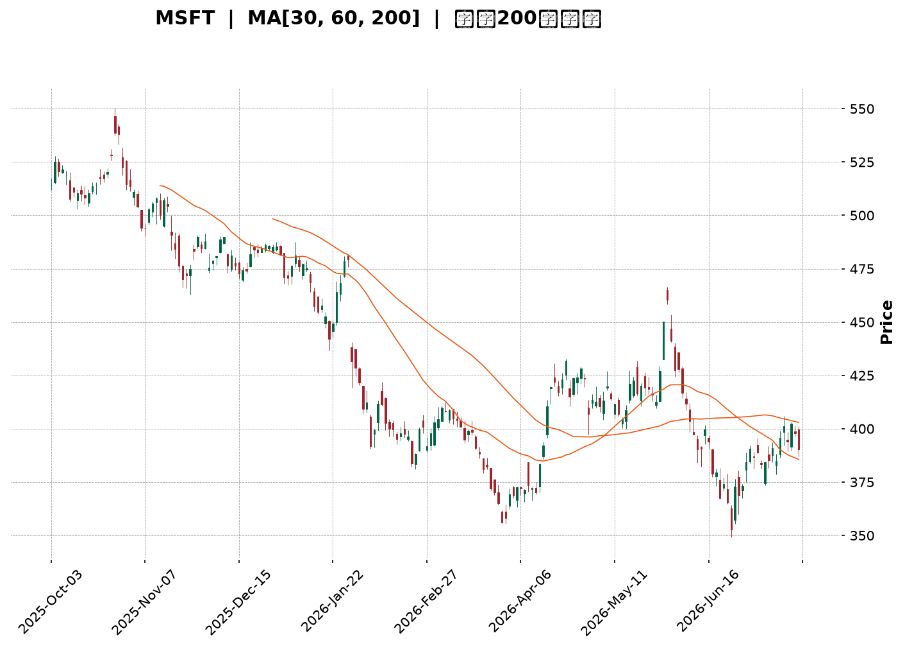
</details>

<html>
<head><meta charset="utf-8" /></head>
<body>
    <div style="height:500px; width:100%;">                        <script>window.PlotlyConfig = {MathJaxConfig: 'local'};</script>
        <script charset="utf-8" src="https://cdn.plot.ly/plotly-3.7.0.min.js" integrity="sha256-jvTGqxNp8AGWEcvNLVuKr+8j5dGe9Yw51LQkmDH+IYA=" crossorigin="anonymous"></script>                <div id="candlestick-chart" class="plotly-graph-div" style="height:100%; width:100%;"></div>            <script>                window.PLOTLYENV=window.PLOTLYENV || {};                                if (document.getElementById("candlestick-chart")) {                    Plotly.newPlot(                        "candlestick-chart",                        [{"close":{"dtype":"f8","bdata":"AAAAoMAQgEAAAADA8mmAQAAAAIB1RYBAAAAAAGBMgEAAAAAg5jiAQAAAAMDou39AAAAAwAntf0AAAAAAaOV\u002fQAAAACAu439AAAAAYD7Gf0AAAAAAkeV\u002fQAAAAABNDIBAAAAAoDcTgEAAAADAHCqAQAAAAIBFKoBAAAAAgIRCgEAAAABgZoGAQAAAAMBE1YBAAAAAgCLRgEAAAAAAnFOAQAAAAOBoFIBAAAAAgDUOgEAAAACgffF\u002fQAAAAOB9f39AAAAAgIvffkAAAADgF9t+QAAAAGAMbX9AAAAAoKiXf0AAAACAxb5\u002fQAAAACD2QX9AAAAAAIKvf0AAAAAAvYR\u002fQAAAACDrqn5AAAAAoN5AfkAAAAAg8cR9QAAAAOBtYH1AAAAAYGB+fUAAAADgAK59QAAAAGCPNX5AAAAAQEKdfkAAAADgT0l+QAAAAMA9fX5AAAAAoMq5fUAAAACgVOt9QAAAAEBJEH5AAAAAIH2NfkAAAADgap1+QAAAACADx31AAAAAYDkVfkAAAADgiMZ9QAAAACBwi31AAAAAYHKkfUAAAABAJaB9QAAAACBZHX5AAAAAIEA8fkAAAABgUix+QAAAAKAQS35AAAAAgLNdfkAAAACAw1h+QAAAAAAMT35AAAAAoBlVfkAAAAAgnRd+QAAAAMB9bX1AAAAAwA5sfUAAAABgN8Z9QAAAAGA5FX5AAAAAINi\u002ffUAAAABAe9J9QAAAAMAHsX1AAAAAIFVJfUAAAABgfpV8QAAAAKAqanxAAAAAoCOdfEAAAADgE0h8QAAAAIBBontAAAAA4DwSfEAAAACgJf58QAAAAKAeQ31AAAAAgDDnfUAAAAAg6vd9QAAAAMA\u002f+XpAAAAA4B3GekAAAABA41d6QAAAAKAwlnlAAAAAwKjFeUAAAABgy354QAAAAODI9XhAAAAAwEK8eUAAAAAAAbd5QAAAACA8KXlAAAAAQO8AeUAAAADgpvh4QAAAAKCbsXhAAAAA4EDdeEAAAADglNl4QAAAAMDxxXhAAAAAoDn6d0AAAACAjEJ4QAAAAGC\u002f+3hAAAAAAKENeUAAAABgQn54QAAAAKAE23hAAAAAgOkweUAAAABAMEV5QAAAAMCtnHlAAAAA4DeBeUAAAAAgZ4h5QAAAACAhTnlAAAAAYBRAeUAAAAAg3Q95QAAAAEAfq3hAAAAAwF7xeEAAAACgv+h4QAAAAKAXb3hAAAAAIN5CeEAAAAAgt9B3QAAAAKDB4ndAAAAAYPM+d0AAAABgzyN3QAAAAIDd0nZAAAAAoPs\u002fdkAAAACA8mJ2QAAAAIDrFXdAAAAAwCUJd0AAAAAgckp3QAAAAKAvQXdAAAAAQMQ3d0AAAAAAVlh3QAAAAEA4RHdAAAAAgBghd0AAAAAAofh3QAAAAKAqhHhAAAAA4EyleUAAAADAoDV6QAAAAEAFXnpAAAAA4KkSekAAAACg5HN6QAAAAADA\u002f3pAAAAAoJ\u002fteUAAAACgPHt6QAAAACBufnpAAAAAICjFekAAAACgrnh6QAAAACBhbnlAAAAAgLXYeUAAAAAAnst5QAAAAODap3lAAAAAoAvReUAAAAAgxT16QAAAAMCQ43lAAAAAYEq8eUAAAAAgOG55QAAAACBZRXlAAAAA4LiIeUAAAABgIVB6QAAAAKD+aXpAAAAAQEkIekAAAABgZkJ6QAAAAKBwMXpAAAAAwB4pekAAAADgegB6QAAAAGC4ynlAAAAAANevekAAAAAA1yN8QAAAAOBRyHxAAAAAwPWUe0AAAACgcLV6QAAAAMDMwHpAAAAAYLgKekAAAAAA17t5QAAAAGCPNnlAAAAAgMLVeEAAAACgcGV4QAAAAADXa3hAAAAAACn8eEAAAACgR514QAAAAGCPrndAAAAAYGa2d0AAAACgcPV2QAAAAEAKX3dAAAAAIFzXdkAAAACgRw12QAAAACCFT3dAAAAAwB4Jd0AAAADgUVB3QAAAAOB6BHhAAAAAANdneEAAAAAA1yt4QAAAAKBwTXhAAAAAoHD1d0AAAACAwgV4QAAAAKCZEXhAAAAAANdveEAAAABA4Q54QAAAAIAUunhAAAAAoJkReUAAAADAHp14QAAAAOCjJHlAAAAAAADceEAAAACgcGV4QA=="},"high":{"dtype":"f8","bdata":"jI9B57YpgEBFIxYrgX2AQBVgnty5c4BADozLzhFdgECKQOnfPUiAQG8RpYdHQoBA5N4itUcJgEB\u002f1qkVTACAQDLHmRl7D4BAKAxrJscMgEA+iw8j4wGAQB8NtiF8G4BAY4Nk2WcbgEAqLTVtZU+AQKAPkY44RYBAT2zOkllQgEDpc3vPuZmAQCULmrjhMYFAudY4Sqj2gEDnqQ1L05yAQCTQDgbpb4BAc79S6j9NgECH+6+WcQKAQJjpkIhw+X9AGUukb0dof0D7bFiiywN\u002fQEZ3rxaQen9AGGy8SEmmf0AJUX62Msd\u002fQDKk3A5L5H9AIL82xRXGf0CE7P8lWs5\u002fQOM0b3oIPX9AH6QbWS3BfkB23gCwG7Z+QHeYQkO\u002fzH1A4ZBhFpKsfUDmpD4GadB9QPTmgxhSYn5AEWq3fSKnfkBePWO3Ant+QKEO6jD+tH5AQq+iR30hfkBRRnYI+vJ9QK5+TeQbFH5Ao8tzweChfkAzdxSvAp9+QFMiewumIX5A+BzDogA+fkBB7jsQ+gR+QKqrgFtr6X1A\u002f6OnIle8fUCbyjJK8919QFmtGJHedn5ANIOZU\u002f5afkBsM8XvAml+QMsHNtSsWn5Ahn0oTNxvfkCmLvNtS19+QIx830z1Yn5ACwqIzCR4fkA0rgALnV9+QFDEwQouKH5A4Al8ZlmffUCCKNgy4cl9QBiuJF12eH5AlmxlX1IIfkC094xRFdt9QCqtp0+47X1AnXs11LqafUAHKzP1\u002fCF9QA5APmsR43xANMU45y7SfEAixHtYZWx8QARFB3DtKnxAbZTtIFEtfEAzHvZ5LlB9QLHCsqdbgn1AM1YYyqoLfkACospOhhl+QLXT8U+ciHtAOPmPjmpae0DyHNrpSM16QK9IyWXcQnpAiRYQYAUfekB6JkkS1md5QEqRPHIjAHlAlfLhMs\u002fQeUD8fAFV01x6QEQR+DHR6XlAl+ORsmJGeUBPd6Rd3zt5QD3uB4no63hAXH8XP2cMeUC5VP4m5Th5QLeiy4oV9HhAcRXVmBaoeEDWPzfQS0h4QOueaiyjCXlAQk8xzL9peUCXvPsBZr94QHOwKMEqBXlAZqeK+iJdeUAsIvlDRKJ5QEZ0cMSGq3lA9PlCS4TCeUDdyw\u002fLLJV5QDheNhIElXlAjD2dUASCeUDzhgpq4FN5QKCK6l3NPnlAUZj\u002f+jn8eECZMZJzajh5QFoP9cY80nhAOOJBiER6eEAsMJ82niJ4QOSVhXv4JXhA9SHVXUvad0BtmM7164N3QAdhKQuQXndAXw7vt6qadkBbwmM4IMl2QMAfUFWBQXdA0bFLWuhSd0DX7QfoUU13QOFktbnBTndAsLhmNVI6d0D2bCXsrwJ4QNJFkLEVS3dAI2toRkBtd0CRXrneV\u002ft3QOffb2NknXhAW0mBXZfXeUBjIvKKkT56QLYwdTBb6npATubpL6RmekBc5jXEG6R6QIC9W\u002fgzDHtA9TRJ+uhrekDD3x10gYB6QDp1fZr9onpANu2ckdrPekAf7K5bXJ56QKDCpNhj2HlAxWBPHVYDekDoKAf+7T16QFyUtXIR\u002fnlAmiO+ZEAYekBgvt6M4bB6QKT\u002fsK2aG3pAzlQE\u002fMS8eUAXpBrSoel5QLzhNAPpVnlAapGC6jKveUCBjC0M6rN6QDXBgEM4g3pAZIuo3Dz8ekCayyALAVN6QAAAAKBwpXpAAAAAYGaGekAAAADgUTx6QAAAAEAK\u002f3lAAAAAANfXekAAAACgRyV8QAAAAMAeJX1AAAAAAABYfEAAAACAPYZ7QAAAAGBmQntAAAAAIIXXekAAAABgjxJ6QAAAACCuv3lAAAAA4KNQeUAAAACgmc14QAAAAADXe3hAAAAAAAAceUAAAACgcM14QAAAAIDrZXhAAAAAgOvVd0AAAACAFNp3QAAAACCFk3dAAAAAgBSud0AAAAAgrsN2QAAAAIDCiXdAAAAAAADId0AAAABgZmJ3QAAAAKBHTXhAAAAAQDODeEAAAABgZlJ4QAAAAMAeuXhAAAAAwPUUeEAAAABgZgp4QAAAAGCPfnhAAAAAYGaaeEAAAABACkN4QAAAACBc73hAAAAAANdfeUAAAACAPeZ4QAAAAEDhMnlAAAAAIIUXeUAAAAAAABB5QA=="},"hovertemplate":"\u003cb\u003e%{x|%Y-%m-%d}\u003c\u002fb\u003e\u003cbr\u003e\u958b: $%{open:.2f}\u003cbr\u003e\u9ad8: $%{high:.2f}\u003cbr\u003e\u4f4e: $%{low:.2f}\u003cbr\u003e\u6536: $%{close:.2f}\u003cextra\u003e\u003c\u002fextra\u003e","low":{"dtype":"f8","bdata":"2+riUyT8f0CXKRmogheAQLUrxlxEMYBAHS0QT2I+gEBbv7ORJhGAQEgqtGjDpn9Ab2XIV1vHf0DYVYhjDG1\u002fQBzz+EqlrH9A\u002fLazFOqOf0BK9uyf4IF\u002fQNMoAR0u439ABhCU1\u002frcf0AdmoR5nROAQK9+HALFGoBAvsaWwHYrgECasNI5cm2AQGQeWSHvyoBAcOulP9GqgEBSTn8qrDaAQMyDv1u7\u002fX9AAmX8pZ\u002f1f0D8ANrLTYp\u002fQOELnBNFdn9A43Hn4AjLfkAD0MwmVaJ+QDH77rmS+n5AWc88LAQzf0BJAB9Zqf9+QIluRq4pIn9AMgRAaPPkfkD6Jqrht1t\u002fQAJXntN2O35AF4pAVqn8fUD0gikVRZZ9QAOiXioaI31AXTIj2B4ffUApdTccQ+18QDy3WLYQ8X1APXoT9uBHfkBOmDo0BSh+QByx2VOfQn5AWTzCsX2RfUAW6OD+CaZ9QBXSZxkczH1AGPZrVLgjfkBG2CLsWGV+QIrbYjKUj31A6YRl8gCcfUARahxlpqN9QB6vjwTNZn1A9nJ3b61MfUApQ8IWTo59QAy+5hdXvH1AedPvCZ0FfkBS7A6\u002fzAh+QPdqKVF0KX5APHgULuMqfkAbxIFH4zx+QHro2qaIIH5AwnPZdI81fkBDZ6wvhBJ+QOqO91s1QX1AL7Pl9bE2fUBpQWN0rTp9QDB6BL5LvX1AE2YJ\u002fACcfUDHcTIytGF9QKpfXv0imX1AT53LtiX+fEDSX+VhSnJ8QEnwK20PXnxAgsUFoUxnfEDgkUIInPR7QEqvs9vCS3tAYKkHk6ere0BVhctGhQh8QILzOR06v3xA0SRi\u002fv5wfUCTkrKLF759QJHcQkJ0MnpA0lrW+\u002fKIekAAJrYWDEZ6QG8umF\u002f6a3lArnrTY892eUBqLRVESml4QM2oDAbZcnhAlOODzHvxeEDT4MK57K15QPameKS283hARcBbLe3DeEDKMv1BkMR4QDBO3E9+jHhAXsCckAGpeEBYmmL4AL14QI++\u002flLlpHhAgQe4QFrkd0CFPlIoKc53QMz1I4sRVXhA1Eo6QQ3eeEAhTjcxmVB4QMqFYnySXHhALS+HTSR9eEDkMdgJHvd4QJZIz3dqOHlAU0y\u002fuwh6eUC9WEsRDCp5QLuuSm3yIHlAed3Kn40LeUBb3OkTeA15QJqz\u002fgFelnhAcemdDf2eeEDuGvDxPs54QCPyT756YnhA2Eu\u002fWZMjeEDOvMSdxrR3QG4kVo+uzXdAbTDi4L0wd0BcUkd7TA13QMy2mIdpxnZAejQqDdU7dkBuQmD5KDh2QK0sDLqQpHZAnPhh23f2dkBuMFfKzrV2QFoazAs5C3dAopNL2UjcdkAzvB6Ztyl3QOb\u002fYoob5HZAFVSPT68Td0A8NR2NfSN3QDBT81X0GnhAAU4eJfa9eEC7wVoh\u002fbN5QG3y9TZ+PHpArRkxi2f2eUDx3HocxgR6QLEec+IRbHpAB61Va1WoeUB1ztzza+55QIKj67qyAnpAk7GckM9PekCT9RlKGzZ6QGSQY7xl0nhAvRTD6NiYeUDHgLA2mJ55QLc6wPapfnlAnqTLV8BDeUBc\u002f\u002fMKrh16QIPcGyqv0XlAVr\u002f2YfpJeUBC5MTALVx5QK2+i+CcAnlAaq\u002fEzzcAeUBniZYiSMB5QNi2rHJj63lAsV2bG3D5eUC4Ny3Gk6Z5QAAAACBc+3lAAAAAoEcFekAAAADgUdB5QAAAAKBHmXlAAAAAYLjKeUAAAACAwgV7QAAAAOBRpHxAAAAAQOGGe0AAAAAAAIR6QAAAAGCPpnpAAAAAYGbmeUAAAADA9Yh5QAAAACCu53hAAAAAYI\u002fSeEAAAAAAAAB4QAAAAOBR5HdAAAAAoJmNeEAAAABACmt4QAAAAMAelXdAAAAA4HpUd0AAAADAHvF2QAAAAGC4KndAAAAA4HrMdkAAAABAM9N1QAAAAEDhNnZAAAAAYGZ+dkAAAABAM\u002fd2QAAAAIA9bndAAAAAQDP7d0AAAAAghdN3QAAAACCFQ3hAAAAAoEfVd0AAAACgmVV3QAAAAAAA2HdAAAAAYGYCeEAAAABgZqp3QAAAAGBmJnhAAAAAwMyAeEAAAACAPVZ4QAAAAGBmWnhAAAAAwB7FeEAAAAAghS94QA=="},"name":"\u50f9\u683c","open":{"dtype":"f8","bdata":"s2nl2MMOgEDcS2H\u002fxBqAQA8X99K4Z4BAM1Qj\u002fOQ\u002fgED24PYFbDiAQDk33S\u002f1IoBA5N4itUcJgEBv2Rl5TbB\u002fQJm1Iq+B+39AjYSsnqrVf0BYkZAnYp1\u002fQCwmEvLw9X9Ao9vVD\u002fIRgEBtmCJD9i6AQKYY00JgOYBAUsuosf87gEAr0ReGd4OAQOZDwSpPFIFAzm6fjhXsgEAgoBuqIXmAQPMP35FpbIBAgeJCC08kgECrMo8foch\u002fQDSTbvkc4X9A95Spl6Rnf0A1CBYGKd1+QHHw2uJJDn9A8u2NJPhZf0CoL5BieKJ\u002fQOx2IAqTsX9AyRTr6oLxfkDm5LCAAJR\u002fQAGeigUKxH5AKfKR7j9wfkANghuuaKh+QEVv3oMOxn1AXPcnN06OfUBo79ymfX99QNmSYGp2Qn5AbxWV9QJXfkAa18ZAZGR+QP55U3D+SH5A8hD+2lSjfUB4e8icINp9QADGYV8XBn5AxeVzEdgrfkBL9cGm525+QDdGQeokHn5ARRai9kSofUCHyt9SFdt9QPiwzB2L331AP80bmxVdfUCg2VHHuqx9QCxFSGUewX1Aw\u002fSrGTBTfkAWMW21bz9+QEH0VhVHLX5Aj0V3Xm04fkAPcNyo1Uh+QF7Voo1dK35AYJLc5Wg8fkCq7b+d1Vp+QE5s6RHhI35AJ+zZ5lR\u002ffUBf1GioMHt9QJZHeZ8g2n1A4WznyLPxfUAKdkzrVH99QElP2SLoqH1ABuUFLjWJfUBdBEduRQZ9QLTMnUf\u002f4HxAoFQtnc18fEAUY1sNgxN8QCt0anJ+KXxAq11GzCrae0B1xTmR3R18QCwnPsHz83xAPgf3D5l5fUCxNLoOFRF+QEVyt+SgYHtALmqQHZFTe0DAc0n+UcV6QBcEpF85QnpAbXnRbdiSeUA+9UswI1p5QJ\u002f2W4Zn1nhAvjbapeEweUA6HYBPJxx6QNjJrGdb5XlAKDtZPUUzeUBOwuyIgip5QHJSiWQz13hAsW39cdbFeECmeW1CL\u002f14QEcMLAoQtHhAk\u002f6jSFeieEAiXIAF9fR3QBZEqMT5WnhAcFYoiF09eUCKgwtXkGB4QGD6xL4sgHhAooxnRKWEeECFJkuqcQZ5QDbycEq8OHlAkM0Q4AyFeUAe0z\u002fft0B5QHjAfTNNknlAjlpShBhLeUCcc6GaFjx5QJPTVkEiAnlAoxx55FrTeEAE6xSDevZ4QDXciPpYxHhAMwx1UBxUeEC0o37yQx94QABAeggg8XdAOZQmt4nYd0C6LAjTr4F3QADzJDFMIHdAgZRituKRdkBHYmS54pF2QMnqHKAxvHZAL7thx+xKd0D6JMRzqeZ2QHtPpbnsSndAd0UZQ6IYd0DQvXE5XgJ4QKrAu4seO3dAjM9hcshCd0D9WMs\u002f10x3QLVaR3FOMXhA\u002fusTxzzSeEAsy4bKPS96QHj7rydufnpA4DMuPNZDekDdYGTzTjV6QN+Yn3NNlHpAx43debgvekDaFWL4GQF6QNckfnl5V3pAj0DRTXB6ekDEiBAQmXp6QNdJhy3BnnlA4+uVhIa+eUClSKjJaKp5QL5jSz\u002fC5nlAbh95QuRxeUCrE66XOzN6QLoHu6fOB3pA3c0X59BveUCCT5\u002f5WNl5QCTv8ApCJXlAiEuGkbE5eUD705KY\u002ftV5QPOW1YGD+3lAr1YGxojPekCsrhz+ZdR5QAAAAAAAjHpAAAAA4KM4ekAAAABA4QZ6QAAAAAApsHlAAAAAIK7PeUAAAADAzAh7QAAAAKBwDX1AAAAAgBTue0AAAABAM2d7QAAAAMD1PHtAAAAAoHDFekAAAACAPeJ5QAAAAOB6kHlAAAAAwMzoeEAAAAAgXLN4QAAAAEDhdnhAAAAAwMzMeEAAAADgo7x4QAAAAAAAZHhAAAAAwB6dd0AAAAAA13t3QAAAAIAURndAAAAAwB45d0AAAADgUax2QAAAAGBmUnZAAAAAAACYd0AAAADgejB3QAAAAKBHzXdAAAAAIK4HeEAAAADgozB4QAAAAADXh3hAAAAA4HoAeEAAAABAM2d3QAAAAMDMPHhAAAAAAAA8eEAAAADAHu13QAAAAMDMPHhAAAAAwPXkeEAAAACAwq14QAAAAGCPdnhAAAAAwPXseEAAAACgR\u002fl4QA=="},"x":["2025-10-03T00:00:00-04:00","2025-10-06T00:00:00-04:00","2025-10-07T00:00:00-04:00","2025-10-08T00:00:00-04:00","2025-10-09T00:00:00-04:00","2025-10-10T00:00:00-04:00","2025-10-13T00:00:00-04:00","2025-10-14T00:00:00-04:00","2025-10-15T00:00:00-04:00","2025-10-16T00:00:00-04:00","2025-10-17T00:00:00-04:00","2025-10-20T00:00:00-04:00","2025-10-21T00:00:00-04:00","2025-10-22T00:00:00-04:00","2025-10-23T00:00:00-04:00","2025-10-24T00:00:00-04:00","2025-10-27T00:00:00-04:00","2025-10-28T00:00:00-04:00","2025-10-29T00:00:00-04:00","2025-10-30T00:00:00-04:00","2025-10-31T00:00:00-04:00","2025-11-03T00:00:00-05:00","2025-11-04T00:00:00-05:00","2025-11-05T00:00:00-05:00","2025-11-06T00:00:00-05:00","2025-11-07T00:00:00-05:00","2025-11-10T00:00:00-05:00","2025-11-11T00:00:00-05:00","2025-11-12T00:00:00-05:00","2025-11-13T00:00:00-05:00","2025-11-14T00:00:00-05:00","2025-11-17T00:00:00-05:00","2025-11-18T00:00:00-05:00","2025-11-19T00:00:00-05:00","2025-11-20T00:00:00-05:00","2025-11-21T00:00:00-05:00","2025-11-24T00:00:00-05:00","2025-11-25T00:00:00-05:00","2025-11-26T00:00:00-05:00","2025-11-28T00:00:00-05:00","2025-12-01T00:00:00-05:00","2025-12-02T00:00:00-05:00","2025-12-03T00:00:00-05:00","2025-12-04T00:00:00-05:00","2025-12-05T00:00:00-05:00","2025-12-08T00:00:00-05:00","2025-12-09T00:00:00-05:00","2025-12-10T00:00:00-05:00","2025-12-11T00:00:00-05:00","2025-12-12T00:00:00-05:00","2025-12-15T00:00:00-05:00","2025-12-16T00:00:00-05:00","2025-12-17T00:00:00-05:00","2025-12-18T00:00:00-05:00","2025-12-19T00:00:00-05:00","2025-12-22T00:00:00-05:00","2025-12-23T00:00:00-05:00","2025-12-24T00:00:00-05:00","2025-12-26T00:00:00-05:00","2025-12-29T00:00:00-05:00","2025-12-30T00:00:00-05:00","2025-12-31T00:00:00-05:00","2026-01-02T00:00:00-05:00","2026-01-05T00:00:00-05:00","2026-01-06T00:00:00-05:00","2026-01-07T00:00:00-05:00","2026-01-08T00:00:00-05:00","2026-01-09T00:00:00-05:00","2026-01-12T00:00:00-05:00","2026-01-13T00:00:00-05:00","2026-01-14T00:00:00-05:00","2026-01-15T00:00:00-05:00","2026-01-16T00:00:00-05:00","2026-01-20T00:00:00-05:00","2026-01-21T00:00:00-05:00","2026-01-22T00:00:00-05:00","2026-01-23T00:00:00-05:00","2026-01-26T00:00:00-05:00","2026-01-27T00:00:00-05:00","2026-01-28T00:00:00-05:00","2026-01-29T00:00:00-05:00","2026-01-30T00:00:00-05:00","2026-02-02T00:00:00-05:00","2026-02-03T00:00:00-05:00","2026-02-04T00:00:00-05:00","2026-02-05T00:00:00-05:00","2026-02-06T00:00:00-05:00","2026-02-09T00:00:00-05:00","2026-02-10T00:00:00-05:00","2026-02-11T00:00:00-05:00","2026-02-12T00:00:00-05:00","2026-02-13T00:00:00-05:00","2026-02-17T00:00:00-05:00","2026-02-18T00:00:00-05:00","2026-02-19T00:00:00-05:00","2026-02-20T00:00:00-05:00","2026-02-23T00:00:00-05:00","2026-02-24T00:00:00-05:00","2026-02-25T00:00:00-05:00","2026-02-26T00:00:00-05:00","2026-02-27T00:00:00-05:00","2026-03-02T00:00:00-05:00","2026-03-03T00:00:00-05:00","2026-03-04T00:00:00-05:00","2026-03-05T00:00:00-05:00","2026-03-06T00:00:00-05:00","2026-03-09T00:00:00-04:00","2026-03-10T00:00:00-04:00","2026-03-11T00:00:00-04:00","2026-03-12T00:00:00-04:00","2026-03-13T00:00:00-04:00","2026-03-16T00:00:00-04:00","2026-03-17T00:00:00-04:00","2026-03-18T00:00:00-04:00","2026-03-19T00:00:00-04:00","2026-03-20T00:00:00-04:00","2026-03-23T00:00:00-04:00","2026-03-24T00:00:00-04:00","2026-03-25T00:00:00-04:00","2026-03-26T00:00:00-04:00","2026-03-27T00:00:00-04:00","2026-03-30T00:00:00-04:00","2026-03-31T00:00:00-04:00","2026-04-01T00:00:00-04:00","2026-04-02T00:00:00-04:00","2026-04-06T00:00:00-04:00","2026-04-07T00:00:00-04:00","2026-04-08T00:00:00-04:00","2026-04-09T00:00:00-04:00","2026-04-10T00:00:00-04:00","2026-04-13T00:00:00-04:00","2026-04-14T00:00:00-04:00","2026-04-15T00:00:00-04:00","2026-04-16T00:00:00-04:00","2026-04-17T00:00:00-04:00","2026-04-20T00:00:00-04:00","2026-04-21T00:00:00-04:00","2026-04-22T00:00:00-04:00","2026-04-23T00:00:00-04:00","2026-04-24T00:00:00-04:00","2026-04-27T00:00:00-04:00","2026-04-28T00:00:00-04:00","2026-04-29T00:00:00-04:00","2026-04-30T00:00:00-04:00","2026-05-01T00:00:00-04:00","2026-05-04T00:00:00-04:00","2026-05-05T00:00:00-04:00","2026-05-06T00:00:00-04:00","2026-05-07T00:00:00-04:00","2026-05-08T00:00:00-04:00","2026-05-11T00:00:00-04:00","2026-05-12T00:00:00-04:00","2026-05-13T00:00:00-04:00","2026-05-14T00:00:00-04:00","2026-05-15T00:00:00-04:00","2026-05-18T00:00:00-04:00","2026-05-19T00:00:00-04:00","2026-05-20T00:00:00-04:00","2026-05-21T00:00:00-04:00","2026-05-22T00:00:00-04:00","2026-05-26T00:00:00-04:00","2026-05-27T00:00:00-04:00","2026-05-28T00:00:00-04:00","2026-05-29T00:00:00-04:00","2026-06-01T00:00:00-04:00","2026-06-02T00:00:00-04:00","2026-06-03T00:00:00-04:00","2026-06-04T00:00:00-04:00","2026-06-05T00:00:00-04:00","2026-06-08T00:00:00-04:00","2026-06-09T00:00:00-04:00","2026-06-10T00:00:00-04:00","2026-06-11T00:00:00-04:00","2026-06-12T00:00:00-04:00","2026-06-15T00:00:00-04:00","2026-06-16T00:00:00-04:00","2026-06-17T00:00:00-04:00","2026-06-18T00:00:00-04:00","2026-06-22T00:00:00-04:00","2026-06-23T00:00:00-04:00","2026-06-24T00:00:00-04:00","2026-06-25T00:00:00-04:00","2026-06-26T00:00:00-04:00","2026-06-29T00:00:00-04:00","2026-06-30T00:00:00-04:00","2026-07-01T00:00:00-04:00","2026-07-02T00:00:00-04:00","2026-07-06T00:00:00-04:00","2026-07-07T00:00:00-04:00","2026-07-08T00:00:00-04:00","2026-07-09T00:00:00-04:00","2026-07-10T00:00:00-04:00","2026-07-13T00:00:00-04:00","2026-07-14T00:00:00-04:00","2026-07-15T00:00:00-04:00","2026-07-16T00:00:00-04:00","2026-07-17T00:00:00-04:00","2026-07-20T00:00:00-04:00","2026-07-21T00:00:00-04:00","2026-07-22T00:00:00-04:00"],"type":"candlestick"},{"hovertemplate":"MA30: $%{y:.2f}\u003cextra\u003e\u003c\u002fextra\u003e","line":{"color":"#2196F3","dash":"dash","width":2},"mode":"lines","name":"MA30","x":["2025-10-03T00:00:00-04:00","2025-10-06T00:00:00-04:00","2025-10-07T00:00:00-04:00","2025-10-08T00:00:00-04:00","2025-10-09T00:00:00-04:00","2025-10-10T00:00:00-04:00","2025-10-13T00:00:00-04:00","2025-10-14T00:00:00-04:00","2025-10-15T00:00:00-04:00","2025-10-16T00:00:00-04:00","2025-10-17T00:00:00-04:00","2025-10-20T00:00:00-04:00","2025-10-21T00:00:00-04:00","2025-10-22T00:00:00-04:00","2025-10-23T00:00:00-04:00","2025-10-24T00:00:00-04:00","2025-10-27T00:00:00-04:00","2025-10-28T00:00:00-04:00","2025-10-29T00:00:00-04:00","2025-10-30T00:00:00-04:00","2025-10-31T00:00:00-04:00","2025-11-03T00:00:00-05:00","2025-11-04T00:00:00-05:00","2025-11-05T00:00:00-05:00","2025-11-06T00:00:00-05:00","2025-11-07T00:00:00-05:00","2025-11-10T00:00:00-05:00","2025-11-11T00:00:00-05:00","2025-11-12T00:00:00-05:00","2025-11-13T00:00:00-05:00","2025-11-14T00:00:00-05:00","2025-11-17T00:00:00-05:00","2025-11-18T00:00:00-05:00","2025-11-19T00:00:00-05:00","2025-11-20T00:00:00-05:00","2025-11-21T00:00:00-05:00","2025-11-24T00:00:00-05:00","2025-11-25T00:00:00-05:00","2025-11-26T00:00:00-05:00","2025-11-28T00:00:00-05:00","2025-12-01T00:00:00-05:00","2025-12-02T00:00:00-05:00","2025-12-03T00:00:00-05:00","2025-12-04T00:00:00-05:00","2025-12-05T00:00:00-05:00","2025-12-08T00:00:00-05:00","2025-12-09T00:00:00-05:00","2025-12-10T00:00:00-05:00","2025-12-11T00:00:00-05:00","2025-12-12T00:00:00-05:00","2025-12-15T00:00:00-05:00","2025-12-16T00:00:00-05:00","2025-12-17T00:00:00-05:00","2025-12-18T00:00:00-05:00","2025-12-19T00:00:00-05:00","2025-12-22T00:00:00-05:00","2025-12-23T00:00:00-05:00","2025-12-24T00:00:00-05:00","2025-12-26T00:00:00-05:00","2025-12-29T00:00:00-05:00","2025-12-30T00:00:00-05:00","2025-12-31T00:00:00-05:00","2026-01-02T00:00:00-05:00","2026-01-05T00:00:00-05:00","2026-01-06T00:00:00-05:00","2026-01-07T00:00:00-05:00","2026-01-08T00:00:00-05:00","2026-01-09T00:00:00-05:00","2026-01-12T00:00:00-05:00","2026-01-13T00:00:00-05:00","2026-01-14T00:00:00-05:00","2026-01-15T00:00:00-05:00","2026-01-16T00:00:00-05:00","2026-01-20T00:00:00-05:00","2026-01-21T00:00:00-05:00","2026-01-22T00:00:00-05:00","2026-01-23T00:00:00-05:00","2026-01-26T00:00:00-05:00","2026-01-27T00:00:00-05:00","2026-01-28T00:00:00-05:00","2026-01-29T00:00:00-05:00","2026-01-30T00:00:00-05:00","2026-02-02T00:00:00-05:00","2026-02-03T00:00:00-05:00","2026-02-04T00:00:00-05:00","2026-02-05T00:00:00-05:00","2026-02-06T00:00:00-05:00","2026-02-09T00:00:00-05:00","2026-02-10T00:00:00-05:00","2026-02-11T00:00:00-05:00","2026-02-12T00:00:00-05:00","2026-02-13T00:00:00-05:00","2026-02-17T00:00:00-05:00","2026-02-18T00:00:00-05:00","2026-02-19T00:00:00-05:00","2026-02-20T00:00:00-05:00","2026-02-23T00:00:00-05:00","2026-02-24T00:00:00-05:00","2026-02-25T00:00:00-05:00","2026-02-26T00:00:00-05:00","2026-02-27T00:00:00-05:00","2026-03-02T00:00:00-05:00","2026-03-03T00:00:00-05:00","2026-03-04T00:00:00-05:00","2026-03-05T00:00:00-05:00","2026-03-06T00:00:00-05:00","2026-03-09T00:00:00-04:00","2026-03-10T00:00:00-04:00","2026-03-11T00:00:00-04:00","2026-03-12T00:00:00-04:00","2026-03-13T00:00:00-04:00","2026-03-16T00:00:00-04:00","2026-03-17T00:00:00-04:00","2026-03-18T00:00:00-04:00","2026-03-19T00:00:00-04:00","2026-03-20T00:00:00-04:00","2026-03-23T00:00:00-04:00","2026-03-24T00:00:00-04:00","2026-03-25T00:00:00-04:00","2026-03-26T00:00:00-04:00","2026-03-27T00:00:00-04:00","2026-03-30T00:00:00-04:00","2026-03-31T00:00:00-04:00","2026-04-01T00:00:00-04:00","2026-04-02T00:00:00-04:00","2026-04-06T00:00:00-04:00","2026-04-07T00:00:00-04:00","2026-04-08T00:00:00-04:00","2026-04-09T00:00:00-04:00","2026-04-10T00:00:00-04:00","2026-04-13T00:00:00-04:00","2026-04-14T00:00:00-04:00","2026-04-15T00:00:00-04:00","2026-04-16T00:00:00-04:00","2026-04-17T00:00:00-04:00","2026-04-20T00:00:00-04:00","2026-04-21T00:00:00-04:00","2026-04-22T00:00:00-04:00","2026-04-23T00:00:00-04:00","2026-04-24T00:00:00-04:00","2026-04-27T00:00:00-04:00","2026-04-28T00:00:00-04:00","2026-04-29T00:00:00-04:00","2026-04-30T00:00:00-04:00","2026-05-01T00:00:00-04:00","2026-05-04T00:00:00-04:00","2026-05-05T00:00:00-04:00","2026-05-06T00:00:00-04:00","2026-05-07T00:00:00-04:00","2026-05-08T00:00:00-04:00","2026-05-11T00:00:00-04:00","2026-05-12T00:00:00-04:00","2026-05-13T00:00:00-04:00","2026-05-14T00:00:00-04:00","2026-05-15T00:00:00-04:00","2026-05-18T00:00:00-04:00","2026-05-19T00:00:00-04:00","2026-05-20T00:00:00-04:00","2026-05-21T00:00:00-04:00","2026-05-22T00:00:00-04:00","2026-05-26T00:00:00-04:00","2026-05-27T00:00:00-04:00","2026-05-28T00:00:00-04:00","2026-05-29T00:00:00-04:00","2026-06-01T00:00:00-04:00","2026-06-02T00:00:00-04:00","2026-06-03T00:00:00-04:00","2026-06-04T00:00:00-04:00","2026-06-05T00:00:00-04:00","2026-06-08T00:00:00-04:00","2026-06-09T00:00:00-04:00","2026-06-10T00:00:00-04:00","2026-06-11T00:00:00-04:00","2026-06-12T00:00:00-04:00","2026-06-15T00:00:00-04:00","2026-06-16T00:00:00-04:00","2026-06-17T00:00:00-04:00","2026-06-18T00:00:00-04:00","2026-06-22T00:00:00-04:00","2026-06-23T00:00:00-04:00","2026-06-24T00:00:00-04:00","2026-06-25T00:00:00-04:00","2026-06-26T00:00:00-04:00","2026-06-29T00:00:00-04:00","2026-06-30T00:00:00-04:00","2026-07-01T00:00:00-04:00","2026-07-02T00:00:00-04:00","2026-07-06T00:00:00-04:00","2026-07-07T00:00:00-04:00","2026-07-08T00:00:00-04:00","2026-07-09T00:00:00-04:00","2026-07-10T00:00:00-04:00","2026-07-13T00:00:00-04:00","2026-07-14T00:00:00-04:00","2026-07-15T00:00:00-04:00","2026-07-16T00:00:00-04:00","2026-07-17T00:00:00-04:00","2026-07-20T00:00:00-04:00","2026-07-21T00:00:00-04:00","2026-07-22T00:00:00-04:00"],"y":{"dtype":"f8","bdata":"AAAAAAAA+H8AAAAAAAD4fwAAAAAAAPh\u002fAAAAAAAA+H8AAAAAAAD4fwAAAAAAAPh\u002fAAAAAAAA+H8AAAAAAAD4fwAAAAAAAPh\u002fAAAAAAAA+H8AAAAAAAD4fwAAAAAAAPh\u002fAAAAAAAA+H8AAAAAAAD4fwAAAAAAAPh\u002fAAAAAAAA+H8AAAAAAAD4fwAAAAAAAPh\u002fAAAAAAAA+H8AAAAAAAD4fwAAAAAAAPh\u002fAAAAAAAA+H8AAAAAAAD4fwAAAAAAAPh\u002fAAAAAAAA+H8AAAAAAAD4fwAAAAAAAPh\u002fAAAAAAAA+H8AAAAAAAD4f0RERDT4DoBAERER0RENgEDv7u7OeweAQO\u002fu7p73\u002fn9AREREpPjqf0CamZmJJNR\u002fQHd3d9cGwH9AZmZmdkWrf0AAAACgW5h\u002fQImIiIgJin9AMzMzQyOAf0C8u7tbZXJ\u002fQFVVVRWvZH9A3t3d7f5Pf0BERETEbjt\u002fQN7d3T0XKH9AAAAAUE4Xf0De3d0d3AJ\u002fQImIiPis4X5AiYiIyF\u002fDfkCamZlp0ap+QLy7u1uBlH5AmpmZiXB\u002ffkAzMzNTqWt+QM3MzEzbX35Aq6qq2mlafkCJiIh4llR+QCIiIvLrSn5Ad3d313RAfkB3d3fXhTR+QImIiPhsLH5AVVVV9eAgfkCrqqo6tRR+QERERIQgCn5AVVVVhQgDfkBVVVVlEwN+QN7d3S0aCX5AZmZm1kgLfkDe3d0dgAx+QCIiIjIVCH5A3t3dfcD8fUAiIiKCOe59QLy7u6uF3H1AMzMzowjTfUAzMzMDD8V9QFVVVQVTsH1AZmZmNiabfUAiIiKSTo19QGZmZhbpiH1AIiIiQmCHfUAiIiKiBYl9QGZmZhYVc31A3t3dzZpafUCrqqqamD59QO\u002fu7h71F31AIiIiAt\u002fxfEAzMzOTa8F8QO\u002fu7i7pk3xAzczMbGVsfEARERHx3kR8QM3MzJzxGHxAvLu7u3jre0C8u7vbxb97QERERHRgl3tAmpmZuXtwe0Dv7u5OdkZ7QO\u002fu7h4nGXtAq6qqGubnekBmZmY2b7h6QCIiIiJCkHpAd3d3hyJsekAREREhOkl6QO\u002fu7v7aKnpAvLu726UNekCrqqqa8\u002fN5QCIiIvKy4nlAERERYczMeUB3d3cHRq95QImIiNiBjXlAVVVVtc1leUCJiIho7zt5QImIiKhDKHlAAAAAsKMYeUBERETEZgx5QJqZmZmQAnlAq6qq+qv1eEARERGB3u94QImIiJiz5nhAd3d3N3XReECJiIgYfLt4QCIiIgKKp3hAvLu7awqQeEAAAADg+3l4QN7d3c1CbHhAzczMTKhceEB3d3dXWk94QAAAAPBkQnhA7+7ujuk7eEARERHxGjR4QN7d3U10JXhAq6qqWgkVeECrqqoKlRB4QImIiOivDXhAZmZmFpEReEBmZmbWlBl4QAAAALAGIHhAIiIi0t8keEBmZmZWuSx4QBEREZEtO3hAmpmZefZAeEAiIiJCE014QERERPSmXHhAvLu7uz5seEAAAACAk3l4QDMzM\u002fMVgnhAERERIZ2PeEARERGxgqB4QCIiIiKdr3hAAAAA4IzFeEAAAAAABOB4QLy7uxss+nhAd3d3d+oXeUARERFB5DF5QKuqqgqKRHlA7+7uvttZeUCrqqrapXN5QAAAALCbjnlA7+7uHqCmeUCJiIiIfr95QBEREeF32HlARERE9FXyeUBEREQEqgN6QLy7u5uMDnpAREREFG8XekCrqqpa6Cd6QCIiIoKEPHpAd3d352RJekDNzMw8lEt6QAAAABB7SXpAq6qqWnNKekCamZkZEkR6QGZmZkYkOXpAMzMz46AoekDv7u6e6xZ6QKuqqmpNDnpAZmZmZvMGekBERER03\u002fx5QKuqqpoH7HlAmpmZKRPaeUCJiIhYEL55QFVVVWWUqHlAmpmZyeGPeUCJiIj4DHN5QERERLRSYnlARERExABNeUCJiIjIaDN5QFVVVXX1HnlAiYiIyBMReUBEREQ0Qv94QCIiIhIg73hAAAAAAFbceEDNzMz8cct4QDMzM8O9vHhAAAAAkIqpeEAiIiKStYZ4QM3MzOwZZHhAvLu766dOeEAzMzNTxzx4QKuqqjoKL3hAREREBPMkeEBEREQ0iRl4QA=="},"type":"scatter"},{"hovertemplate":"MA60: $%{y:.2f}\u003cextra\u003e\u003c\u002fextra\u003e","line":{"color":"#9C27B0","dash":"dash","width":2},"mode":"lines","name":"MA60","x":["2025-10-03T00:00:00-04:00","2025-10-06T00:00:00-04:00","2025-10-07T00:00:00-04:00","2025-10-08T00:00:00-04:00","2025-10-09T00:00:00-04:00","2025-10-10T00:00:00-04:00","2025-10-13T00:00:00-04:00","2025-10-14T00:00:00-04:00","2025-10-15T00:00:00-04:00","2025-10-16T00:00:00-04:00","2025-10-17T00:00:00-04:00","2025-10-20T00:00:00-04:00","2025-10-21T00:00:00-04:00","2025-10-22T00:00:00-04:00","2025-10-23T00:00:00-04:00","2025-10-24T00:00:00-04:00","2025-10-27T00:00:00-04:00","2025-10-28T00:00:00-04:00","2025-10-29T00:00:00-04:00","2025-10-30T00:00:00-04:00","2025-10-31T00:00:00-04:00","2025-11-03T00:00:00-05:00","2025-11-04T00:00:00-05:00","2025-11-05T00:00:00-05:00","2025-11-06T00:00:00-05:00","2025-11-07T00:00:00-05:00","2025-11-10T00:00:00-05:00","2025-11-11T00:00:00-05:00","2025-11-12T00:00:00-05:00","2025-11-13T00:00:00-05:00","2025-11-14T00:00:00-05:00","2025-11-17T00:00:00-05:00","2025-11-18T00:00:00-05:00","2025-11-19T00:00:00-05:00","2025-11-20T00:00:00-05:00","2025-11-21T00:00:00-05:00","2025-11-24T00:00:00-05:00","2025-11-25T00:00:00-05:00","2025-11-26T00:00:00-05:00","2025-11-28T00:00:00-05:00","2025-12-01T00:00:00-05:00","2025-12-02T00:00:00-05:00","2025-12-03T00:00:00-05:00","2025-12-04T00:00:00-05:00","2025-12-05T00:00:00-05:00","2025-12-08T00:00:00-05:00","2025-12-09T00:00:00-05:00","2025-12-10T00:00:00-05:00","2025-12-11T00:00:00-05:00","2025-12-12T00:00:00-05:00","2025-12-15T00:00:00-05:00","2025-12-16T00:00:00-05:00","2025-12-17T00:00:00-05:00","2025-12-18T00:00:00-05:00","2025-12-19T00:00:00-05:00","2025-12-22T00:00:00-05:00","2025-12-23T00:00:00-05:00","2025-12-24T00:00:00-05:00","2025-12-26T00:00:00-05:00","2025-12-29T00:00:00-05:00","2025-12-30T00:00:00-05:00","2025-12-31T00:00:00-05:00","2026-01-02T00:00:00-05:00","2026-01-05T00:00:00-05:00","2026-01-06T00:00:00-05:00","2026-01-07T00:00:00-05:00","2026-01-08T00:00:00-05:00","2026-01-09T00:00:00-05:00","2026-01-12T00:00:00-05:00","2026-01-13T00:00:00-05:00","2026-01-14T00:00:00-05:00","2026-01-15T00:00:00-05:00","2026-01-16T00:00:00-05:00","2026-01-20T00:00:00-05:00","2026-01-21T00:00:00-05:00","2026-01-22T00:00:00-05:00","2026-01-23T00:00:00-05:00","2026-01-26T00:00:00-05:00","2026-01-27T00:00:00-05:00","2026-01-28T00:00:00-05:00","2026-01-29T00:00:00-05:00","2026-01-30T00:00:00-05:00","2026-02-02T00:00:00-05:00","2026-02-03T00:00:00-05:00","2026-02-04T00:00:00-05:00","2026-02-05T00:00:00-05:00","2026-02-06T00:00:00-05:00","2026-02-09T00:00:00-05:00","2026-02-10T00:00:00-05:00","2026-02-11T00:00:00-05:00","2026-02-12T00:00:00-05:00","2026-02-13T00:00:00-05:00","2026-02-17T00:00:00-05:00","2026-02-18T00:00:00-05:00","2026-02-19T00:00:00-05:00","2026-02-20T00:00:00-05:00","2026-02-23T00:00:00-05:00","2026-02-24T00:00:00-05:00","2026-02-25T00:00:00-05:00","2026-02-26T00:00:00-05:00","2026-02-27T00:00:00-05:00","2026-03-02T00:00:00-05:00","2026-03-03T00:00:00-05:00","2026-03-04T00:00:00-05:00","2026-03-05T00:00:00-05:00","2026-03-06T00:00:00-05:00","2026-03-09T00:00:00-04:00","2026-03-10T00:00:00-04:00","2026-03-11T00:00:00-04:00","2026-03-12T00:00:00-04:00","2026-03-13T00:00:00-04:00","2026-03-16T00:00:00-04:00","2026-03-17T00:00:00-04:00","2026-03-18T00:00:00-04:00","2026-03-19T00:00:00-04:00","2026-03-20T00:00:00-04:00","2026-03-23T00:00:00-04:00","2026-03-24T00:00:00-04:00","2026-03-25T00:00:00-04:00","2026-03-26T00:00:00-04:00","2026-03-27T00:00:00-04:00","2026-03-30T00:00:00-04:00","2026-03-31T00:00:00-04:00","2026-04-01T00:00:00-04:00","2026-04-02T00:00:00-04:00","2026-04-06T00:00:00-04:00","2026-04-07T00:00:00-04:00","2026-04-08T00:00:00-04:00","2026-04-09T00:00:00-04:00","2026-04-10T00:00:00-04:00","2026-04-13T00:00:00-04:00","2026-04-14T00:00:00-04:00","2026-04-15T00:00:00-04:00","2026-04-16T00:00:00-04:00","2026-04-17T00:00:00-04:00","2026-04-20T00:00:00-04:00","2026-04-21T00:00:00-04:00","2026-04-22T00:00:00-04:00","2026-04-23T00:00:00-04:00","2026-04-24T00:00:00-04:00","2026-04-27T00:00:00-04:00","2026-04-28T00:00:00-04:00","2026-04-29T00:00:00-04:00","2026-04-30T00:00:00-04:00","2026-05-01T00:00:00-04:00","2026-05-04T00:00:00-04:00","2026-05-05T00:00:00-04:00","2026-05-06T00:00:00-04:00","2026-05-07T00:00:00-04:00","2026-05-08T00:00:00-04:00","2026-05-11T00:00:00-04:00","2026-05-12T00:00:00-04:00","2026-05-13T00:00:00-04:00","2026-05-14T00:00:00-04:00","2026-05-15T00:00:00-04:00","2026-05-18T00:00:00-04:00","2026-05-19T00:00:00-04:00","2026-05-20T00:00:00-04:00","2026-05-21T00:00:00-04:00","2026-05-22T00:00:00-04:00","2026-05-26T00:00:00-04:00","2026-05-27T00:00:00-04:00","2026-05-28T00:00:00-04:00","2026-05-29T00:00:00-04:00","2026-06-01T00:00:00-04:00","2026-06-02T00:00:00-04:00","2026-06-03T00:00:00-04:00","2026-06-04T00:00:00-04:00","2026-06-05T00:00:00-04:00","2026-06-08T00:00:00-04:00","2026-06-09T00:00:00-04:00","2026-06-10T00:00:00-04:00","2026-06-11T00:00:00-04:00","2026-06-12T00:00:00-04:00","2026-06-15T00:00:00-04:00","2026-06-16T00:00:00-04:00","2026-06-17T00:00:00-04:00","2026-06-18T00:00:00-04:00","2026-06-22T00:00:00-04:00","2026-06-23T00:00:00-04:00","2026-06-24T00:00:00-04:00","2026-06-25T00:00:00-04:00","2026-06-26T00:00:00-04:00","2026-06-29T00:00:00-04:00","2026-06-30T00:00:00-04:00","2026-07-01T00:00:00-04:00","2026-07-02T00:00:00-04:00","2026-07-06T00:00:00-04:00","2026-07-07T00:00:00-04:00","2026-07-08T00:00:00-04:00","2026-07-09T00:00:00-04:00","2026-07-10T00:00:00-04:00","2026-07-13T00:00:00-04:00","2026-07-14T00:00:00-04:00","2026-07-15T00:00:00-04:00","2026-07-16T00:00:00-04:00","2026-07-17T00:00:00-04:00","2026-07-20T00:00:00-04:00","2026-07-21T00:00:00-04:00","2026-07-22T00:00:00-04:00"],"y":{"dtype":"f8","bdata":"AAAAAAAA+H8AAAAAAAD4fwAAAAAAAPh\u002fAAAAAAAA+H8AAAAAAAD4fwAAAAAAAPh\u002fAAAAAAAA+H8AAAAAAAD4fwAAAAAAAPh\u002fAAAAAAAA+H8AAAAAAAD4fwAAAAAAAPh\u002fAAAAAAAA+H8AAAAAAAD4fwAAAAAAAPh\u002fAAAAAAAA+H8AAAAAAAD4fwAAAAAAAPh\u002fAAAAAAAA+H8AAAAAAAD4fwAAAAAAAPh\u002fAAAAAAAA+H8AAAAAAAD4fwAAAAAAAPh\u002fAAAAAAAA+H8AAAAAAAD4fwAAAAAAAPh\u002fAAAAAAAA+H8AAAAAAAD4fwAAAAAAAPh\u002fAAAAAAAA+H8AAAAAAAD4fwAAAAAAAPh\u002fAAAAAAAA+H8AAAAAAAD4fwAAAAAAAPh\u002fAAAAAAAA+H8AAAAAAAD4fwAAAAAAAPh\u002fAAAAAAAA+H8AAAAAAAD4fwAAAAAAAPh\u002fAAAAAAAA+H8AAAAAAAD4fwAAAAAAAPh\u002fAAAAAAAA+H8AAAAAAAD4fwAAAAAAAPh\u002fAAAAAAAA+H8AAAAAAAD4fwAAAAAAAPh\u002fAAAAAAAA+H8AAAAAAAD4fwAAAAAAAPh\u002fAAAAAAAA+H8AAAAAAAD4fwAAAAAAAPh\u002fAAAAAAAA+H8AAAAAAAD4f4mIiLAuJX9AvLu7S4Idf0BERERs1hF\u002fQJqZmRGMBH9AzczMlAD3fkB3d3f3m+t+QKuqqoKQ5H5AZmZmJkfbfkDv7u7ebdJ+QFVVVV0PyX5AiYiI4HG+fkDv7u5uT7B+QImIiGCaoH5AiYiIyIORfkC8u7vjPoB+QJqZmSE1bH5AMzMzQzpZfkAAAABYFUh+QHd3dwdLNX5AVVVVBWAlfkDe3d2F6xl+QBERETnLA35AvLu7qwXtfUDv7u72INV9QN7d3TXou31AZmZmbiSmfUDe3d0FAYt9QImIiJBqb31AIiIiIm1WfUBERERksjx9QKuqqkqvIn1AiYiI2CwGfUAzMzOLPep8QERERHzA0HxAd3d3H8K5fEAiIiLaxKR8QGZmZqYgkXxAiYiIeJd5fEAiIiKqd2J8QCIiIqorTHxAq6qqgnE0fECamZnRuRt8QFVVVVWwA3xAd3d3P1fwe0Dv7u5Ogdx7QLy7u\u002fuCyXtAvLu7S\u002fmze0DNzMxMSp57QHd3d3c1i3tAvLu7+5Z2e0BVVVWFemJ7QHd3d1+sTXtA7+7uPp85e0B3d3evfyV7QERERNxCDXtAZmZmfsXzekAiIiIKpdh6QLy7u2NOvXpAIiIiUu2eekDNzMyELYB6QHd3d889YHpAvLu7k8E9ekDe3d3d4Bx6QBEREaHRAXpAMzMzA5LmeUAzMzNT6Mp5QHd3dwfGrXlAzczM1OeReUC8u7sTRXZ5QAAAADjbWnlAERER8ZVAeUDe3d2V5yx5QLy7u3NFHHlAEREReZsPeUCJiIg4xAZ5QBEREdFcAXlAmpmZGdb4eEDv7u6u\u002f+14QM3MzLRX5HhAd3d3F2LTeEBVVVVVgcR4QGZmZk51wnhA3t3dNXHCeEAiIiIi\u002fcJ4QGZmZkZTwnhA3t3djaTCeEARERGZMMh4QFVVVV0oy3hAvLu7C4HLeEBEREQMwM14QO\u002fu7g7b0HhAmpmZcfrTeECJiIgQ8NV4QERERGxm2HhA3t3dBULbeEAREREZgOF4QAAAAFCA6HhA7+7u1kTxeEDNzMy8zPl4QHd3dxf2\u002fnhAd3d3p68DeUB3d3eHHwp5QCIiIkIeDnlAVVVVFYAUeUCJiIiYviB5QBEREZlFLnlAzczMXCI3eUCamZnJJjx5QImIiFBUQnlAIiIi6rRFeUDe3d2tkkh5QFVVVZ3lSnlAd3d3z29KeUB3d3ePP0h5QO\u002fu7q4xSHlAvLu7Q0hLeUCrqqoSsU55QGZmZl7STXlAzczMBNBPeUBEREQsCk95QImIiEBgUXlAiYiIIOZTeUDNzMyceFJ5QHd3d19uU3lAmpmZQW5TeUCamZlRh1N5QKuqqpLIVnlAvLu789lbeUBmZmZeYF95QJqZmfnLY3lAIiIi+lVneUCJiIgAjmd5QHd3dy+lZXlAIiIi0nxgeUBmZmb2Tld5QHd3dzdPUHlAmpmZaQZMeUAAAADILUR5QFVVVaVCPHlAd3d3L7M3eUDv7u6mzS55QA=="},"type":"scatter"},{"hovertemplate":"MA200: $%{y:.2f}\u003cextra\u003e\u003c\u002fextra\u003e","line":{"color":"#FF6F00","dash":"solid","width":2},"mode":"lines","name":"MA200","x":["2025-10-03T00:00:00-04:00","2025-10-06T00:00:00-04:00","2025-10-07T00:00:00-04:00","2025-10-08T00:00:00-04:00","2025-10-09T00:00:00-04:00","2025-10-10T00:00:00-04:00","2025-10-13T00:00:00-04:00","2025-10-14T00:00:00-04:00","2025-10-15T00:00:00-04:00","2025-10-16T00:00:00-04:00","2025-10-17T00:00:00-04:00","2025-10-20T00:00:00-04:00","2025-10-21T00:00:00-04:00","2025-10-22T00:00:00-04:00","2025-10-23T00:00:00-04:00","2025-10-24T00:00:00-04:00","2025-10-27T00:00:00-04:00","2025-10-28T00:00:00-04:00","2025-10-29T00:00:00-04:00","2025-10-30T00:00:00-04:00","2025-10-31T00:00:00-04:00","2025-11-03T00:00:00-05:00","2025-11-04T00:00:00-05:00","2025-11-05T00:00:00-05:00","2025-11-06T00:00:00-05:00","2025-11-07T00:00:00-05:00","2025-11-10T00:00:00-05:00","2025-11-11T00:00:00-05:00","2025-11-12T00:00:00-05:00","2025-11-13T00:00:00-05:00","2025-11-14T00:00:00-05:00","2025-11-17T00:00:00-05:00","2025-11-18T00:00:00-05:00","2025-11-19T00:00:00-05:00","2025-11-20T00:00:00-05:00","2025-11-21T00:00:00-05:00","2025-11-24T00:00:00-05:00","2025-11-25T00:00:00-05:00","2025-11-26T00:00:00-05:00","2025-11-28T00:00:00-05:00","2025-12-01T00:00:00-05:00","2025-12-02T00:00:00-05:00","2025-12-03T00:00:00-05:00","2025-12-04T00:00:00-05:00","2025-12-05T00:00:00-05:00","2025-12-08T00:00:00-05:00","2025-12-09T00:00:00-05:00","2025-12-10T00:00:00-05:00","2025-12-11T00:00:00-05:00","2025-12-12T00:00:00-05:00","2025-12-15T00:00:00-05:00","2025-12-16T00:00:00-05:00","2025-12-17T00:00:00-05:00","2025-12-18T00:00:00-05:00","2025-12-19T00:00:00-05:00","2025-12-22T00:00:00-05:00","2025-12-23T00:00:00-05:00","2025-12-24T00:00:00-05:00","2025-12-26T00:00:00-05:00","2025-12-29T00:00:00-05:00","2025-12-30T00:00:00-05:00","2025-12-31T00:00:00-05:00","2026-01-02T00:00:00-05:00","2026-01-05T00:00:00-05:00","2026-01-06T00:00:00-05:00","2026-01-07T00:00:00-05:00","2026-01-08T00:00:00-05:00","2026-01-09T00:00:00-05:00","2026-01-12T00:00:00-05:00","2026-01-13T00:00:00-05:00","2026-01-14T00:00:00-05:00","2026-01-15T00:00:00-05:00","2026-01-16T00:00:00-05:00","2026-01-20T00:00:00-05:00","2026-01-21T00:00:00-05:00","2026-01-22T00:00:00-05:00","2026-01-23T00:00:00-05:00","2026-01-26T00:00:00-05:00","2026-01-27T00:00:00-05:00","2026-01-28T00:00:00-05:00","2026-01-29T00:00:00-05:00","2026-01-30T00:00:00-05:00","2026-02-02T00:00:00-05:00","2026-02-03T00:00:00-05:00","2026-02-04T00:00:00-05:00","2026-02-05T00:00:00-05:00","2026-02-06T00:00:00-05:00","2026-02-09T00:00:00-05:00","2026-02-10T00:00:00-05:00","2026-02-11T00:00:00-05:00","2026-02-12T00:00:00-05:00","2026-02-13T00:00:00-05:00","2026-02-17T00:00:00-05:00","2026-02-18T00:00:00-05:00","2026-02-19T00:00:00-05:00","2026-02-20T00:00:00-05:00","2026-02-23T00:00:00-05:00","2026-02-24T00:00:00-05:00","2026-02-25T00:00:00-05:00","2026-02-26T00:00:00-05:00","2026-02-27T00:00:00-05:00","2026-03-02T00:00:00-05:00","2026-03-03T00:00:00-05:00","2026-03-04T00:00:00-05:00","2026-03-05T00:00:00-05:00","2026-03-06T00:00:00-05:00","2026-03-09T00:00:00-04:00","2026-03-10T00:00:00-04:00","2026-03-11T00:00:00-04:00","2026-03-12T00:00:00-04:00","2026-03-13T00:00:00-04:00","2026-03-16T00:00:00-04:00","2026-03-17T00:00:00-04:00","2026-03-18T00:00:00-04:00","2026-03-19T00:00:00-04:00","2026-03-20T00:00:00-04:00","2026-03-23T00:00:00-04:00","2026-03-24T00:00:00-04:00","2026-03-25T00:00:00-04:00","2026-03-26T00:00:00-04:00","2026-03-27T00:00:00-04:00","2026-03-30T00:00:00-04:00","2026-03-31T00:00:00-04:00","2026-04-01T00:00:00-04:00","2026-04-02T00:00:00-04:00","2026-04-06T00:00:00-04:00","2026-04-07T00:00:00-04:00","2026-04-08T00:00:00-04:00","2026-04-09T00:00:00-04:00","2026-04-10T00:00:00-04:00","2026-04-13T00:00:00-04:00","2026-04-14T00:00:00-04:00","2026-04-15T00:00:00-04:00","2026-04-16T00:00:00-04:00","2026-04-17T00:00:00-04:00","2026-04-20T00:00:00-04:00","2026-04-21T00:00:00-04:00","2026-04-22T00:00:00-04:00","2026-04-23T00:00:00-04:00","2026-04-24T00:00:00-04:00","2026-04-27T00:00:00-04:00","2026-04-28T00:00:00-04:00","2026-04-29T00:00:00-04:00","2026-04-30T00:00:00-04:00","2026-05-01T00:00:00-04:00","2026-05-04T00:00:00-04:00","2026-05-05T00:00:00-04:00","2026-05-06T00:00:00-04:00","2026-05-07T00:00:00-04:00","2026-05-08T00:00:00-04:00","2026-05-11T00:00:00-04:00","2026-05-12T00:00:00-04:00","2026-05-13T00:00:00-04:00","2026-05-14T00:00:00-04:00","2026-05-15T00:00:00-04:00","2026-05-18T00:00:00-04:00","2026-05-19T00:00:00-04:00","2026-05-20T00:00:00-04:00","2026-05-21T00:00:00-04:00","2026-05-22T00:00:00-04:00","2026-05-26T00:00:00-04:00","2026-05-27T00:00:00-04:00","2026-05-28T00:00:00-04:00","2026-05-29T00:00:00-04:00","2026-06-01T00:00:00-04:00","2026-06-02T00:00:00-04:00","2026-06-03T00:00:00-04:00","2026-06-04T00:00:00-04:00","2026-06-05T00:00:00-04:00","2026-06-08T00:00:00-04:00","2026-06-09T00:00:00-04:00","2026-06-10T00:00:00-04:00","2026-06-11T00:00:00-04:00","2026-06-12T00:00:00-04:00","2026-06-15T00:00:00-04:00","2026-06-16T00:00:00-04:00","2026-06-17T00:00:00-04:00","2026-06-18T00:00:00-04:00","2026-06-22T00:00:00-04:00","2026-06-23T00:00:00-04:00","2026-06-24T00:00:00-04:00","2026-06-25T00:00:00-04:00","2026-06-26T00:00:00-04:00","2026-06-29T00:00:00-04:00","2026-06-30T00:00:00-04:00","2026-07-01T00:00:00-04:00","2026-07-02T00:00:00-04:00","2026-07-06T00:00:00-04:00","2026-07-07T00:00:00-04:00","2026-07-08T00:00:00-04:00","2026-07-09T00:00:00-04:00","2026-07-10T00:00:00-04:00","2026-07-13T00:00:00-04:00","2026-07-14T00:00:00-04:00","2026-07-15T00:00:00-04:00","2026-07-16T00:00:00-04:00","2026-07-17T00:00:00-04:00","2026-07-20T00:00:00-04:00","2026-07-21T00:00:00-04:00","2026-07-22T00:00:00-04:00"],"y":{"dtype":"f8","bdata":"AAAAAAAA+H8AAAAAAAD4fwAAAAAAAPh\u002fAAAAAAAA+H8AAAAAAAD4fwAAAAAAAPh\u002fAAAAAAAA+H8AAAAAAAD4fwAAAAAAAPh\u002fAAAAAAAA+H8AAAAAAAD4fwAAAAAAAPh\u002fAAAAAAAA+H8AAAAAAAD4fwAAAAAAAPh\u002fAAAAAAAA+H8AAAAAAAD4fwAAAAAAAPh\u002fAAAAAAAA+H8AAAAAAAD4fwAAAAAAAPh\u002fAAAAAAAA+H8AAAAAAAD4fwAAAAAAAPh\u002fAAAAAAAA+H8AAAAAAAD4fwAAAAAAAPh\u002fAAAAAAAA+H8AAAAAAAD4fwAAAAAAAPh\u002fAAAAAAAA+H8AAAAAAAD4fwAAAAAAAPh\u002fAAAAAAAA+H8AAAAAAAD4fwAAAAAAAPh\u002fAAAAAAAA+H8AAAAAAAD4fwAAAAAAAPh\u002fAAAAAAAA+H8AAAAAAAD4fwAAAAAAAPh\u002fAAAAAAAA+H8AAAAAAAD4fwAAAAAAAPh\u002fAAAAAAAA+H8AAAAAAAD4fwAAAAAAAPh\u002fAAAAAAAA+H8AAAAAAAD4fwAAAAAAAPh\u002fAAAAAAAA+H8AAAAAAAD4fwAAAAAAAPh\u002fAAAAAAAA+H8AAAAAAAD4fwAAAAAAAPh\u002fAAAAAAAA+H8AAAAAAAD4fwAAAAAAAPh\u002fAAAAAAAA+H8AAAAAAAD4fwAAAAAAAPh\u002fAAAAAAAA+H8AAAAAAAD4fwAAAAAAAPh\u002fAAAAAAAA+H8AAAAAAAD4fwAAAAAAAPh\u002fAAAAAAAA+H8AAAAAAAD4fwAAAAAAAPh\u002fAAAAAAAA+H8AAAAAAAD4fwAAAAAAAPh\u002fAAAAAAAA+H8AAAAAAAD4fwAAAAAAAPh\u002fAAAAAAAA+H8AAAAAAAD4fwAAAAAAAPh\u002fAAAAAAAA+H8AAAAAAAD4fwAAAAAAAPh\u002fAAAAAAAA+H8AAAAAAAD4fwAAAAAAAPh\u002fAAAAAAAA+H8AAAAAAAD4fwAAAAAAAPh\u002fAAAAAAAA+H8AAAAAAAD4fwAAAAAAAPh\u002fAAAAAAAA+H8AAAAAAAD4fwAAAAAAAPh\u002fAAAAAAAA+H8AAAAAAAD4fwAAAAAAAPh\u002fAAAAAAAA+H8AAAAAAAD4fwAAAAAAAPh\u002fAAAAAAAA+H8AAAAAAAD4fwAAAAAAAPh\u002fAAAAAAAA+H8AAAAAAAD4fwAAAAAAAPh\u002fAAAAAAAA+H8AAAAAAAD4fwAAAAAAAPh\u002fAAAAAAAA+H8AAAAAAAD4fwAAAAAAAPh\u002fAAAAAAAA+H8AAAAAAAD4fwAAAAAAAPh\u002fAAAAAAAA+H8AAAAAAAD4fwAAAAAAAPh\u002fAAAAAAAA+H8AAAAAAAD4fwAAAAAAAPh\u002fAAAAAAAA+H8AAAAAAAD4fwAAAAAAAPh\u002fAAAAAAAA+H8AAAAAAAD4fwAAAAAAAPh\u002fAAAAAAAA+H8AAAAAAAD4fwAAAAAAAPh\u002fAAAAAAAA+H8AAAAAAAD4fwAAAAAAAPh\u002fAAAAAAAA+H8AAAAAAAD4fwAAAAAAAPh\u002fAAAAAAAA+H8AAAAAAAD4fwAAAAAAAPh\u002fAAAAAAAA+H8AAAAAAAD4fwAAAAAAAPh\u002fAAAAAAAA+H8AAAAAAAD4fwAAAAAAAPh\u002fAAAAAAAA+H8AAAAAAAD4fwAAAAAAAPh\u002fAAAAAAAA+H8AAAAAAAD4fwAAAAAAAPh\u002fAAAAAAAA+H8AAAAAAAD4fwAAAAAAAPh\u002fAAAAAAAA+H8AAAAAAAD4fwAAAAAAAPh\u002fAAAAAAAA+H8AAAAAAAD4fwAAAAAAAPh\u002fAAAAAAAA+H8AAAAAAAD4fwAAAAAAAPh\u002fAAAAAAAA+H8AAAAAAAD4fwAAAAAAAPh\u002fAAAAAAAA+H8AAAAAAAD4fwAAAAAAAPh\u002fAAAAAAAA+H8AAAAAAAD4fwAAAAAAAPh\u002fAAAAAAAA+H8AAAAAAAD4fwAAAAAAAPh\u002fAAAAAAAA+H8AAAAAAAD4fwAAAAAAAPh\u002fAAAAAAAA+H8AAAAAAAD4fwAAAAAAAPh\u002fAAAAAAAA+H8AAAAAAAD4fwAAAAAAAPh\u002fAAAAAAAA+H8AAAAAAAD4fwAAAAAAAPh\u002fAAAAAAAA+H8AAAAAAAD4fwAAAAAAAPh\u002fAAAAAAAA+H8AAAAAAAD4fwAAAAAAAPh\u002fAAAAAAAA+H8AAAAAAAD4fwAAAAAAAPh\u002fAAAAAAAA+H+uR+HKd0F7QA=="},"type":"scatter"}],                        {"template":{"data":{"barpolar":[{"marker":{"line":{"color":"rgb(17,17,17)","width":0.5},"pattern":{"fillmode":"overlay","size":10,"solidity":0.2}},"type":"barpolar"}],"bar":[{"error_x":{"color":"#f2f5fa"},"error_y":{"color":"#f2f5fa"},"marker":{"line":{"color":"rgb(17,17,17)","width":0.5},"pattern":{"fillmode":"overlay","size":10,"solidity":0.2}},"type":"bar"}],"carpet":[{"aaxis":{"endlinecolor":"#A2B1C6","gridcolor":"#506784","linecolor":"#506784","minorgridcolor":"#506784","startlinecolor":"#A2B1C6"},"baxis":{"endlinecolor":"#A2B1C6","gridcolor":"#506784","linecolor":"#506784","minorgridcolor":"#506784","startlinecolor":"#A2B1C6"},"type":"carpet"}],"choropleth":[{"colorbar":{"outlinewidth":0,"ticks":""},"type":"choropleth"}],"contourcarpet":[{"colorbar":{"outlinewidth":0,"ticks":""},"type":"contourcarpet"}],"contour":[{"colorbar":{"outlinewidth":0,"ticks":""},"colorscale":[[0.0,"#0d0887"],[0.1111111111111111,"#46039f"],[0.2222222222222222,"#7201a8"],[0.3333333333333333,"#9c179e"],[0.4444444444444444,"#bd3786"],[0.5555555555555556,"#d8576b"],[0.6666666666666666,"#ed7953"],[0.7777777777777778,"#fb9f3a"],[0.8888888888888888,"#fdca26"],[1.0,"#f0f921"]],"type":"contour"}],"heatmap":[{"colorbar":{"outlinewidth":0,"ticks":""},"colorscale":[[0.0,"#0d0887"],[0.1111111111111111,"#46039f"],[0.2222222222222222,"#7201a8"],[0.3333333333333333,"#9c179e"],[0.4444444444444444,"#bd3786"],[0.5555555555555556,"#d8576b"],[0.6666666666666666,"#ed7953"],[0.7777777777777778,"#fb9f3a"],[0.8888888888888888,"#fdca26"],[1.0,"#f0f921"]],"type":"heatmap"}],"histogram2dcontour":[{"colorbar":{"outlinewidth":0,"ticks":""},"colorscale":[[0.0,"#0d0887"],[0.1111111111111111,"#46039f"],[0.2222222222222222,"#7201a8"],[0.3333333333333333,"#9c179e"],[0.4444444444444444,"#bd3786"],[0.5555555555555556,"#d8576b"],[0.6666666666666666,"#ed7953"],[0.7777777777777778,"#fb9f3a"],[0.8888888888888888,"#fdca26"],[1.0,"#f0f921"]],"type":"histogram2dcontour"}],"histogram2d":[{"colorbar":{"outlinewidth":0,"ticks":""},"colorscale":[[0.0,"#0d0887"],[0.1111111111111111,"#46039f"],[0.2222222222222222,"#7201a8"],[0.3333333333333333,"#9c179e"],[0.4444444444444444,"#bd3786"],[0.5555555555555556,"#d8576b"],[0.6666666666666666,"#ed7953"],[0.7777777777777778,"#fb9f3a"],[0.8888888888888888,"#fdca26"],[1.0,"#f0f921"]],"type":"histogram2d"}],"histogram":[{"marker":{"pattern":{"fillmode":"overlay","size":10,"solidity":0.2}},"type":"histogram"}],"mesh3d":[{"colorbar":{"outlinewidth":0,"ticks":""},"type":"mesh3d"}],"parcoords":[{"line":{"colorbar":{"outlinewidth":0,"ticks":""}},"type":"parcoords"}],"pie":[{"automargin":true,"type":"pie"}],"scatter3d":[{"line":{"colorbar":{"outlinewidth":0,"ticks":""}},"marker":{"colorbar":{"outlinewidth":0,"ticks":""}},"type":"scatter3d"}],"scattercarpet":[{"marker":{"colorbar":{"outlinewidth":0,"ticks":""}},"type":"scattercarpet"}],"scattergeo":[{"marker":{"colorbar":{"outlinewidth":0,"ticks":""}},"type":"scattergeo"}],"scattergl":[{"marker":{"line":{"color":"#283442"}},"type":"scattergl"}],"scattermapbox":[{"marker":{"colorbar":{"outlinewidth":0,"ticks":""}},"type":"scattermapbox"}],"scattermap":[{"marker":{"colorbar":{"outlinewidth":0,"ticks":""}},"type":"scattermap"}],"scatterpolargl":[{"marker":{"colorbar":{"outlinewidth":0,"ticks":""}},"type":"scatterpolargl"}],"scatterpolar":[{"marker":{"colorbar":{"outlinewidth":0,"ticks":""}},"type":"scatterpolar"}],"scatter":[{"marker":{"line":{"color":"#283442"}},"type":"scatter"}],"scatterternary":[{"marker":{"colorbar":{"outlinewidth":0,"ticks":""}},"type":"scatterternary"}],"surface":[{"colorbar":{"outlinewidth":0,"ticks":""},"colorscale":[[0.0,"#0d0887"],[0.1111111111111111,"#46039f"],[0.2222222222222222,"#7201a8"],[0.3333333333333333,"#9c179e"],[0.4444444444444444,"#bd3786"],[0.5555555555555556,"#d8576b"],[0.6666666666666666,"#ed7953"],[0.7777777777777778,"#fb9f3a"],[0.8888888888888888,"#fdca26"],[1.0,"#f0f921"]],"type":"surface"}],"table":[{"cells":{"fill":{"color":"#506784"},"line":{"color":"rgb(17,17,17)"}},"header":{"fill":{"color":"#2a3f5f"},"line":{"color":"rgb(17,17,17)"}},"type":"table"}]},"layout":{"annotationdefaults":{"arrowcolor":"#f2f5fa","arrowhead":0,"arrowwidth":1},"autotypenumbers":"strict","coloraxis":{"colorbar":{"outlinewidth":0,"ticks":""}},"colorscale":{"diverging":[[0,"#8e0152"],[0.1,"#c51b7d"],[0.2,"#de77ae"],[0.3,"#f1b6da"],[0.4,"#fde0ef"],[0.5,"#f7f7f7"],[0.6,"#e6f5d0"],[0.7,"#b8e186"],[0.8,"#7fbc41"],[0.9,"#4d9221"],[1,"#276419"]],"sequential":[[0.0,"#0d0887"],[0.1111111111111111,"#46039f"],[0.2222222222222222,"#7201a8"],[0.3333333333333333,"#9c179e"],[0.4444444444444444,"#bd3786"],[0.5555555555555556,"#d8576b"],[0.6666666666666666,"#ed7953"],[0.7777777777777778,"#fb9f3a"],[0.8888888888888888,"#fdca26"],[1.0,"#f0f921"]],"sequentialminus":[[0.0,"#0d0887"],[0.1111111111111111,"#46039f"],[0.2222222222222222,"#7201a8"],[0.3333333333333333,"#9c179e"],[0.4444444444444444,"#bd3786"],[0.5555555555555556,"#d8576b"],[0.6666666666666666,"#ed7953"],[0.7777777777777778,"#fb9f3a"],[0.8888888888888888,"#fdca26"],[1.0,"#f0f921"]]},"colorway":["#636efa","#EF553B","#00cc96","#ab63fa","#FFA15A","#19d3f3","#FF6692","#B6E880","#FF97FF","#FECB52"],"font":{"color":"#f2f5fa"},"geo":{"bgcolor":"rgb(17,17,17)","lakecolor":"rgb(17,17,17)","landcolor":"rgb(17,17,17)","showlakes":true,"showland":true,"subunitcolor":"#506784"},"hoverlabel":{"align":"left"},"hovermode":"closest","mapbox":{"style":"dark"},"paper_bgcolor":"rgb(17,17,17)","plot_bgcolor":"rgb(17,17,17)","polar":{"angularaxis":{"gridcolor":"#506784","linecolor":"#506784","ticks":""},"bgcolor":"rgb(17,17,17)","radialaxis":{"gridcolor":"#506784","linecolor":"#506784","ticks":""}},"scene":{"xaxis":{"backgroundcolor":"rgb(17,17,17)","gridcolor":"#506784","gridwidth":2,"linecolor":"#506784","showbackground":true,"ticks":"","zerolinecolor":"#C8D4E3"},"yaxis":{"backgroundcolor":"rgb(17,17,17)","gridcolor":"#506784","gridwidth":2,"linecolor":"#506784","showbackground":true,"ticks":"","zerolinecolor":"#C8D4E3"},"zaxis":{"backgroundcolor":"rgb(17,17,17)","gridcolor":"#506784","gridwidth":2,"linecolor":"#506784","showbackground":true,"ticks":"","zerolinecolor":"#C8D4E3"}},"shapedefaults":{"line":{"color":"#f2f5fa"}},"sliderdefaults":{"bgcolor":"#C8D4E3","bordercolor":"rgb(17,17,17)","borderwidth":1,"tickwidth":0},"ternary":{"aaxis":{"gridcolor":"#506784","linecolor":"#506784","ticks":""},"baxis":{"gridcolor":"#506784","linecolor":"#506784","ticks":""},"bgcolor":"rgb(17,17,17)","caxis":{"gridcolor":"#506784","linecolor":"#506784","ticks":""}},"title":{"x":0.05},"updatemenudefaults":{"bgcolor":"#506784","borderwidth":0},"xaxis":{"automargin":true,"gridcolor":"#283442","linecolor":"#506784","ticks":"","title":{"standoff":15},"zerolinecolor":"#283442","zerolinewidth":2},"yaxis":{"automargin":true,"gridcolor":"#283442","linecolor":"#506784","ticks":"","title":{"standoff":15},"zerolinecolor":"#283442","zerolinewidth":2}}},"xaxis":{"rangeslider":{"visible":false},"title":{"text":"\u65e5\u671f"}},"font":{"size":11},"title":{"text":"MSFT  |  MA(30\u002f60\u002f200)  |  \u6700\u8fd1200\u4ea4\u6613\u65e5"},"yaxis":{"title":{"text":"\u80a1\u50f9 (USD)"}},"hovermode":"x unified","height":500},                        {"responsive": true}                    )                };            </script>        </div>
</body>
</html>

# MSFT 技術分析報告

> **報告日期**：2026-07-22 ｜ **語言**：繁體中文 ｜ **數據來源**：Yahoo Finance ｜ **當前價格**：$390.34

---

## 目錄

| 章節 | 內容 |
|------|------|
| [1. 技術面概覽](#1-技術面概覽) | 訊號儀表板、核心指標、評分卡 |
| [2. 趨勢分析](#2-趨勢分析) | 多時框趨勢、長中短期走勢、ADX強弱判斷 |
| [3. 圖表形態分析](#3-圖表形態分析) | 形態識別信心度、K線組合、目標價推估 |
| [4. 支撐與阻力](#4-支撐與阻力) | 關鍵價位結構、斐波那契回調位與現價互動 |
| [5. 技術指標深度解讀](#5-技術指標深度解讀) | MA均線系統、RSI背離、MACD、布林通道與OBV量能 |
| [6. 動能與波動率](#6-動能與波動率) | 動能四象限、ATR風控距離、Beta市場相關性 |
| [7. 多時框架總結](#7-多時框架總結) | 多時框評分矩陣與ADX收斂規則最終裁決 |
| [8. 交易策略建議](#8-交易策略建議) | 策略路由、情境階梯、進出場/止損/風報比規劃 |
| [9. 風險提示與監控](#9-風險提示與監控) | 關鍵監控Checklist、三種情境壓力測試與風控 |

---

## 1. 技術面概覽

### 🎯 技術訊號儀表板

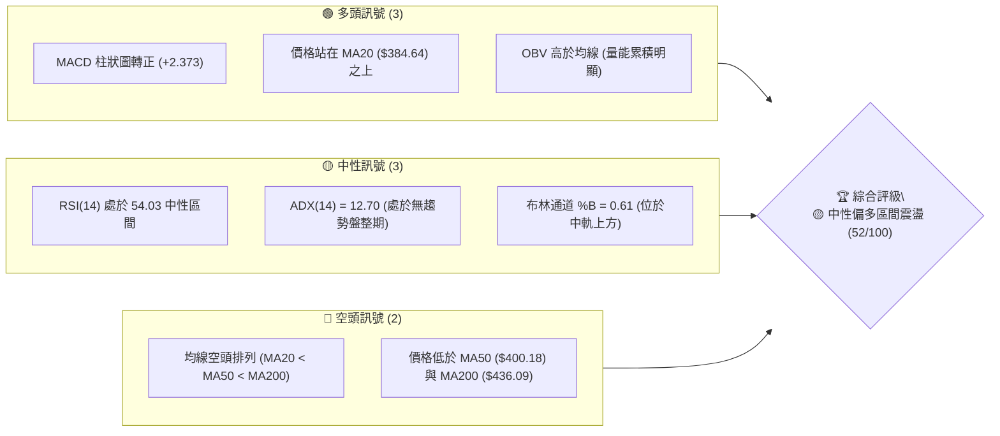

### 📊 核心指標速覽表

| 指標類別 | 指標名稱 | 當前數值 | 訊號 | 解讀 |
|----------|----------|----------|------|------|
| **價格** | 當前價格 | $390.34 | 🟡 中性 | 處於 52 週區間 20.4% 位置，位於波段低點反彈區 |
| **均線** | MA20 | $384.64 | 🟢 看多 | 價格高於 MA20 (+1.48%)，月線扣抵向上支撐短線 |
| **均線** | MA50 | $400.18 | 🔴 看空 | 價格低於 MA50 (-2.46%)，季線形成上方第 2 重壓力 |
| **均線** | MA200 | $436.09 | 🔴 看空 | 價格遠低於 MA200 (-10.49%)，長期趨勢受壓 |
| **動能** | RSI(14) | 54.03 | 🟡 中性 | 無超買超賣，短線動能溫和回升 |
| **動能** | MACD | 0.424 | 🟢 看多 | DIF 穿越 DEA，柱狀圖 (+2.373) 呈現多頭擴張 |
| **動能** | Stoch %K/%D | 52.05 / 72.40 | 🟡 中性 | 隨機指標自高位整理，未達超買 |
| **趨勢** | ADX(14) | 12.70 | 🟡 無趨勢 | 低於 25，顯示當前為無趨勢盤整/區間震盪行情 |
| **波動** | ATR(14) | $10.78 | 🟡 中性 | 日均波動率 2.76%，波動幅度適中 |
| **量能** | 成交量比 | 0.64x | 🟡 縮量 | 27.81M vs 20日均量 43.57M，反彈過程中縮量整理 |

### 🏆 技術評分卡

```
╔══════════════════════════════════════════════════════════════════╗
║                 技術評分卡 — MSFT (2026-07-22)                    ║
╠══════════════════════════════════════════════════════════════════╣
║ 趨勢強度 (ADX=12.7)   ███████░░░░░░░░░░░░░  35/100  🟡 弱趨勢/區間  ║
║ 短線動能 (MACD/RSI)   ████████████░░░░░░░░  60/100  🟢 中性偏多    ║
║ 支撐穩定度 (S1/S2)    █████████████░░░░░░░  65/100  🟢 築底明確    ║
║ 成交量配合 (OBV)      ██████████░░░░░░░░░░  50/100  🟡 縮量反彈    ║
║ 形態完整度 (雙底)     ███████████░░░░░░░░░  55/100  🟡 構建中      ║
║ 均線排列 (空頭)       ███████░░░░░░░░░░░░░  30/100  🔴 長線空頭    ║
╠══════════════════════════════════════════════════════════════════╣
║ 綜合評分              ██████████░░░░░░░░░░  52/100  🟡 區間震盪築底 ║
╚══════════════════════════════════════════════════════════════════╝
```

---

## 2. 趨勢分析

### 🌐 多時框趨勢分析

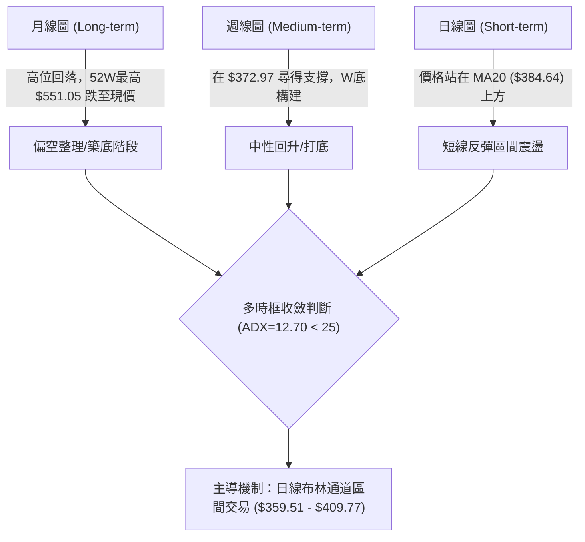

### 📈 長期趨勢 — 24個月歷史走勢圖（Unicode）

```
MSFT 月線走勢圖（2024-07 至 2026-07）
價格軸 ($)
$550 ┤                            ● $529.27 (歷史高點區域)
$500 ┤                   ●    ●
$450 ┤               ●             ●             ● $450.24
$400 ┤ ●   ●   ●               ●       ●   ●   ●   ● $390.34 (現在)
$350 ┤         ● $371.73                   ● $369.37 (雙重打底)
     └─┬───┬───┬───┬───┬───┬───┬───┬───┬───┬───┬───┬───► 時間
      24/07 09  11 25/01 03  05  07  09  11 26/01 03  05  07
```

#### 走勢特徵分析表

| 時間階段 | 價格區間 | 漲跌幅 | 趨勢特徵與技術驅動 |
|----------|----------|--------|--------------------|
| **2024-07 ~ 2025-03** | $411.88 → $371.73 | -9.75% | 高位修正，在 $371.73 完成第一波波段下探打底 |
| **2025-03 ~ 2025-07** | $371.73 → $529.27 | +42.38%| 強烈主升段，創下 52 週新高 $551.05，多頭極盛 |
| **2025-07 ~ 2026-03** | $529.27 → $369.37 | -30.21%| 深度回調，摔落至 52 週低點區 $349.20 附近 ($369.37) |
| **2026-03 ~ 2026-07** | $369.37 → $390.34 | +5.68% | 底部區間打底，於 $372.97-$380.89 形成強支撐帶 |

### 📊 中期趨勢（週線分析）

```
週線支撐阻力結構與價格壓縮示意圖
─────────────────────────────────────────────────────────────────
$428.35 ───[阻力 R3 / MA200 壓力區 $436.09]───────────────────────
$412.16 ───[阻力 R2 / 季線 MA50 壓力 $400.18]────────────────────
$395.57 ───[阻力 R1 / 近期反彈頸線區]───────────────────────────
$390.34 ◄───【當前價格位置 (位於 78.6% 斐波那契回調位 $392.40 附近)】
$380.89 ───[支撐 S1 / 月線 MA20 支撐 $384.64]───────────────────
$373.35 ───[支撐 S2 / 6月低點聚類區]───────────────────────────
$355.51 ───[支撐 S3 / 52週低點防線 $349.20 前哨]────────────────
─────────────────────────────────────────────────────────────────
```

### ⚡ 趨勢強度評估（ADX 解讀）

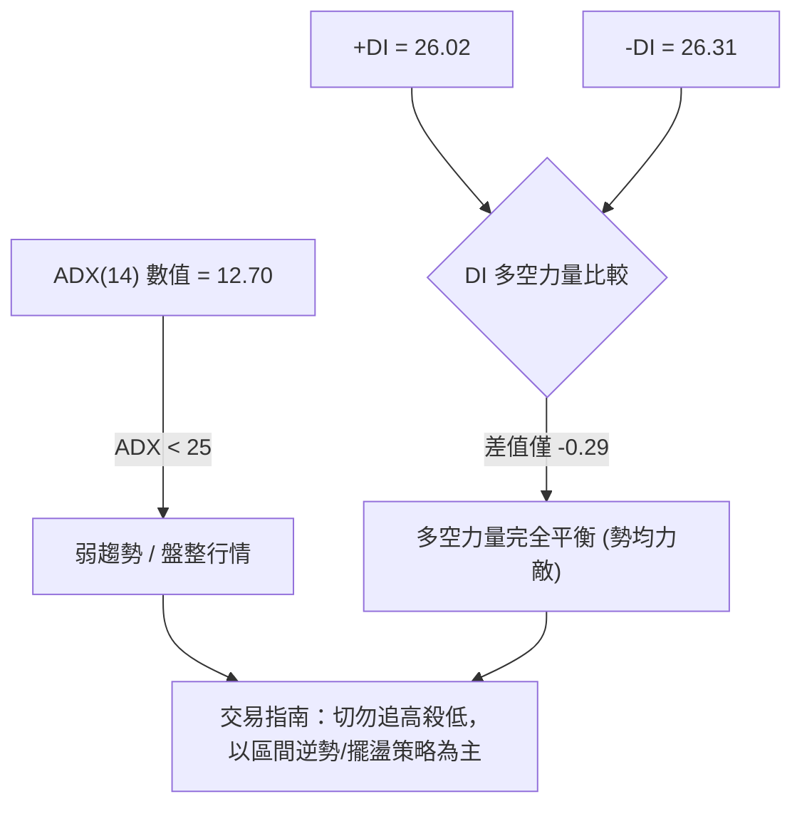

#### ADX 趨勢強度對照

| 指標 | 數值 | 狀態等級 | 行情類型 | 交易策略導向 |
|------|------|----------|----------|--------------|
| **ADX(14)** | **12.70** | ░░░░░░░░░░ (12.7%) | 極弱趨勢 / 無趨勢 | 擺盪交易（高拋低吸） |
| **+DI** | **26.02** | ▓▓▓▓▓▓▓░░░ (26.0%) | 多頭力量 | 支撐區尋求做多 |
| **-DI** | **26.31** | ▓▓▓▓▓▓▓░░░ (26.3%) | 空頭力量 | 阻力區尋求做空/平倉 |

---

## 3. 圖表形態分析

### 🔍 形態識別系統

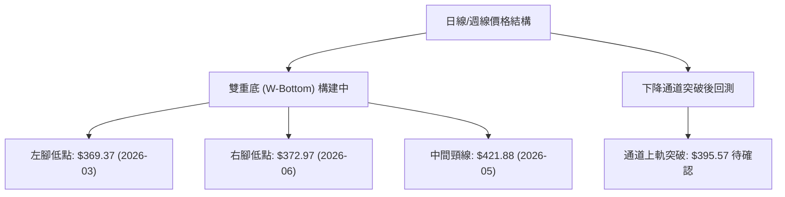

#### 形態信心度與目標價計算表

| 形態名稱 | 信心度 | 判斷依據（嚴格引用數據） | 完成度 | 目標價計算式與精確數值 |
|----------|--------|--------------------------|--------|------------------------|
| **雙重底 (W-Bottom)** | **60%** | 左腳 $369.37 與右腳 $372.97 於 S2 ($373.35) 形成雙重支撐；頸線位於 $421.88。 | 65% | 頸線 $421.88 + (頸線 $421.88 - 右腳 $372.97) = **$470.79** |
| **微型反轉頸線** | **55%** | 7 月底於 S1 ($380.89) 止跌反彈，試圖突破小頸線 R1 ($395.57)。 | 70% | R1 $395.57 + (R1 $395.57 - S1 $380.89) = **$410.25** (近 R2 $412.16) |
| **下降旗形/通道** | **40%** | 信心度 < 50%（數據不足以確認旗形），僅做指標型區間解讀。 | 30% | 不適用（不強行推算） |

### 🕯️ 重要 K 線形態分析

| 月/週時間 | 收盤價 | K 線形態類型 | 技術解讀 | 訊號強度 |
|-----------|--------|--------------|----------|----------|
| **2026-03-29** | $356.00 | 止跌長下影錘子線 | 探底 $349.20 附近極致超賣，買盤強烈進場 | 🟢 強烈買進 |
| **2026-04-19** | $421.88 | 大陽線突破 | 帶量長紅突破，RSI 衝高至 92.9 | 🟢 強勢多頭 |
| **2026-06-28** | $372.97 | 底部長下影十字星 | 週成交量爆出 3.82 億股，主力洗盤換手 | 🟢 底部確認 |
| **2026-07-26** | $390.34 | 溫和回升小陽線 | 縮量震盪，價格守住 MA20 ($384.64) | 🟡 中性築底 |

### 📉 ASCII 走勢形態示意圖

```
MSFT 局部雙重底 (W-Bottom) 形態剖析圖
─────────────────────────────────────────────────────────────────
$421.88 ┤                  ● (中線頸線高點 2026-05)
        │                 / \
$395.57 ┤─── R1 阻力 ───/───\─────● (短線反彈測試區 $390.34)
        │              /     \   /
$380.89 ┤─── S1 支撐 ──/───────\─/◄─ 當前位置 $390.34 (高於MA20)
$372.97 ┤● (左腳 $369.37)       ● (右腳 $372.97 2026-06)
─────────────────────────────────────────────────────────────────
```

---

## 4. 支撐與阻力

### 🗺️ 關鍵價位分布圖（Unicode）

```
MSFT 價位結構與關鍵關卡分布圖
═════════════════════════════════════════════════════════════════
$551.05 ║██████████████████████████████████████████████║ 52W 最高點 / 0.0% Fib
$450.12 ║██████████████████████████                    ║ 50.0% 斐波那契位
$436.09 ║████████████████████                          ║ MA200 長期均線壓力
$428.35 ║██████████████████                            ║ 阻力 R3 (+9.74%)
$412.16 ║██████████████                                ║ 阻力 R2 (+5.59%)
$400.18 ║███████████                                   ║ MA50 季線壓力
$395.57 ║█████████                                     ║ 阻力 R1 (+1.34%)
$392.40 ║████████                                      ║ 78.6% 斐波那契關卡
$390.34 ╠══════════════════════════════════════════════╣ ◄ 當前價格 $390.34
$384.64 ║▓▓▓▓▓▓▓                                       ║ MA20 月線支撐
$380.89 ║▓▓▓▓▓▓▓▓▓                                     ║ 支撐 S1 (-2.42%)
$373.35 ║▓▓▓▓▓▓▓▓▓▓▓▓                                  ║ 支撐 S2 (-4.35%)
$355.51 ║▓▓▓▓▓▓▓▓▓▓▓▓▓▓▓                               ║ 支撐 S3 (-8.92%)
$349.20 ║▓▓▓▓▓▓▓▓▓▓▓▓▓▓▓▓▓▓▓                           ║ 52W 最低點 / 100% Fib
═════════════════════════════════════════════════════════════════
```

### 🚧 阻力位分析表

| 阻力級別 | 精確價位 | 形成原因與數據來源 | 突破難度 | 戰略重要性 |
|----------|----------|--------------------|----------|------------|
| **R1** | **$395.57** | 近一年波段高點聚類區 (+1.34%) | 🟡 中等 | 短線多空分水嶺，突破將挑戰 $400 大關 |
| **R2** | **$412.16** | 近一年波段高點聚類區 (+5.59%)，與 MA50 ($400.18) 形成重疊壓力帶 | 🔴 較高 | 中線轉強關鍵，突破確認形態成立 |
| **R3** | **$428.35** | 波段高點聚類區 (+9.74%)，上方靠近 MA200 ($436.09) | 🔴 極高 | 牛熊分界牆，需強大成交量配合 |

### 🛡️ 支撐位分析表

| 支撐級別 | 精確價位 | 形成原因與數據來源 | 守住機率 | 戰略重要性 |
|----------|----------|--------------------|----------|------------|
| **S1** | **$380.89** | 近一年波段低點聚類區 (-2.42%)，接近 MA20 ($384.64) | 🟢 75% | 短線多頭防線，不可失守 |
| **S2** | **$373.35** | 2026-06 底部波段低點聚類區 (-4.35%) | 🟢 85% | 中線 W 底右腳護城河，極強支撐 |
| **S3** | **$355.51** | 波段低點聚類區 (-8.92%)，逼近 52W 低點 $349.20 | 🟢 95% | 長期絕對底線，跌破將引發停損潮 |

### 📐 斐波那契回調位分析

| 回調比例 | 價格 | 與現價距離 | 現價互動與技術意義 |
|----------|------|------------|--------------------|
| **0.0%** (52W High) | $551.05 | +41.17% | 歷史高點牛市終點 |
| **23.6%** | $503.41 | +28.97% | 強勢回調防線 |
| **38.2%** | $473.94 | +21.42% | 中期多頭強弱線 |
| **50.0%** | $450.12 | +15.31% | 多空中樞分界線 |
| **61.8%** | $426.31 | +9.22% | 黃金分割強阻力，靠近 MA200 ($436.09) |
| **78.6%** | **$392.40** | **+0.53%** | **◄ 當前價格 $390.34 緊貼此處受阻震盪** |
| **100.0%** (52W Low) | $349.20 | -10.54% | 熊市極限回撤支撐點 |

---

## 5. 技術指標深度解讀

### 🎛️ 指標訊號總覽

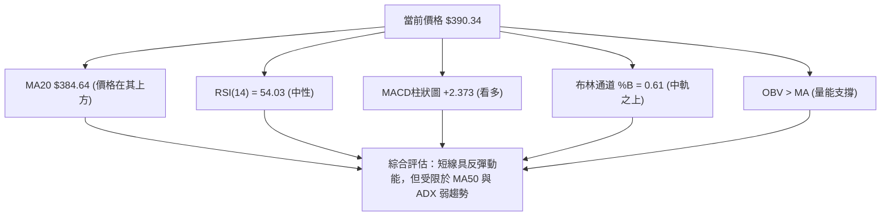

### 📈 移動平均線排列分析

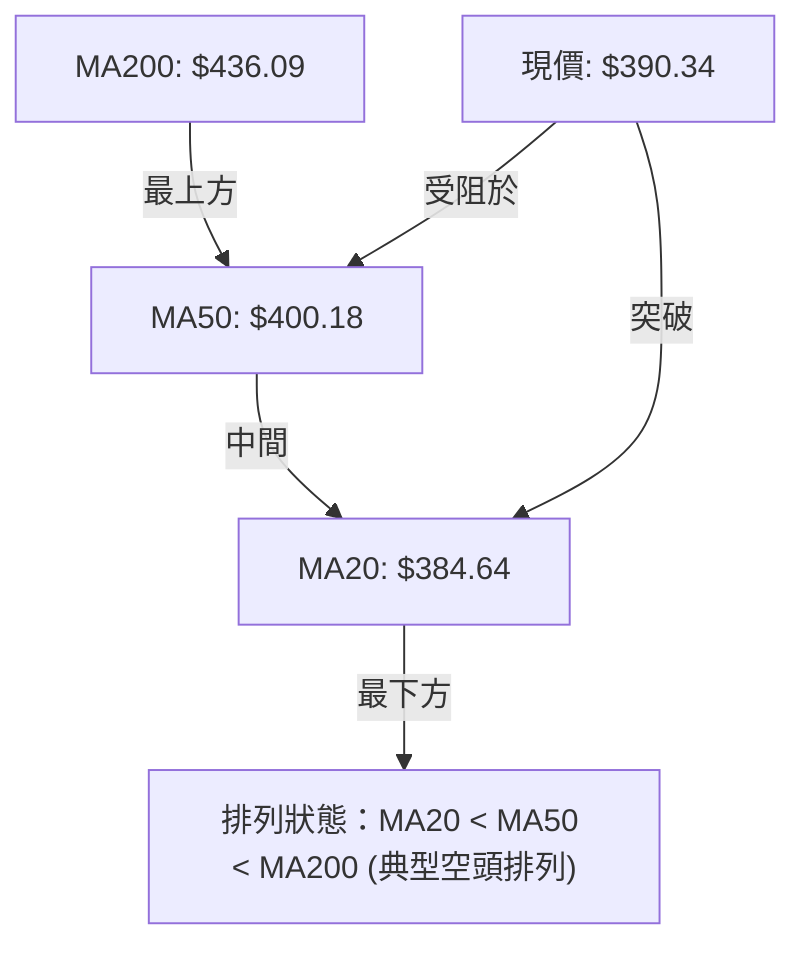

#### 均線數據詳情表

| 均線名稱 | 當前價位 | 價格相對位置 | 變動趨勢 | 均線扣抵與技術意涵 |
|----------|----------|--------------|----------|--------------------|
| **MA5** | $397.06 | 價格在其下方 (-1.69%) | ▼ 下降 | 短線極短壓，今日微幅拉回 |
| **MA10** | $392.63 | 價格在其下方 (-0.58%) | ▼ 下降 | 短線轉折點，突破即站回極短均線 |
| **MA20** | **$384.64** | **價格在其上方 (+1.48%)** | **▲ 上升** | **月線支撐，MA20 翻揚提供下檔支撐力** |
| **MA50** | $400.18 | 價格在其下方 (-2.46%) | ▼ 下降 | 季線反壓，與 $400 心理關卡重疊 |
| **MA200** | $436.09 | 價格在其下方 (-10.49%) | ▼ 下降 | 長期年線反壓，長期空頭主導 |

### 📉 RSI(14) 分析

- **RSI(14) 當前數值**：**54.03**
- **強度進度條**：`▓▓▓▓▓▓▓▓▓▓▓████░░░░░░░░░` 54.03% (中性偏多)
- **背離分析**：**無明顯背離**。近幾週 RSI 與價格同步從 31.3 反彈至 54.03，未出現頂背離或底背離跡象，顯示當前價格漲跌完全由正常籌碼交換驅動。

### 📊 MACD(12/26/9) 訊號解讀

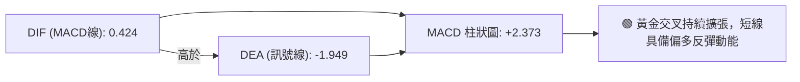

### 📦 布林通道分析

```
MSFT 布林通道 (Bollinger Bands) 位置示意圖
─────────────────────────────────────────────────────────────────
$409.77 ┤ ────────────────────────────── 布林帶上軌 (BB Upper)
        │
$390.34 ┤ ◄────── 現價 $390.34 (位於通道 61% 位置，靠近中軌上方)
$384.64 ┤ ┄┄┄┄┄┄┄┄┄┄┄┄┄┄┄┄┄┄┄┄┄┄┄┄┄┄┄┄┄ 布林帶中軌 (MA20)
        │
$359.51 ┤ ────────────────────────────── 布林帶下軌 (BB Lower)
─────────────────────────────────────────────────────────────────
```
- **BB %B**：**0.61**（位於 0.5 到 1.0 之間，表明價格站在中軌之上，朝向上軌 $409.77 運行）。
- **帶寬擠壓**：上軌 $409.77 與下軌 $359.51 距離適中，未出現極限擠壓，行情暫無暴漲暴跌預期。

### 💹 成交量分析（量價配合度）

- **當日成交量**：27,810,955 股
- **20日均量**：43,570,098 股（**量比 0.64x**，顯著縮量）
- **OBV (能量潮)**：`OBV > MA`。呈現**指標領先**訊號，雖然近日價格縮量小幅整理，但 OBV 趨勢高於其移動平均線，顯示大資金在 $370-$380 築底區間有持續護盤與籌碼收集跡象。

---

## 6. 動能與波動率

### ⚡ 動能評估四象限

| 象限區塊 | 動能強度 (Momentum) | 波動率 (Volatility) | 當前 MSFT 歸屬狀況 | 戰略建議 |
|----------|---------------------|----------------------|--------------------|----------|
| **Q1 (最佳攻擊)** | 強 (RSI>60, MACD>0) | 低 (ATR% < 2.0%) | ░░ 未符合 | 順勢加碼 |
| **Q2 (震盪築底)** | **溫和 (RSI 54, MACD+2.3)** | **中低 (ATR% = 2.76%)** | **█ 當前位置 (Q2)** | **區間低買高賣** |
| **Q3 (高險衝刺)** | 強 (RSI>70) | 高 (ATR% > 4.0%) | ░░ 未符合 | 緊縮止損 |
| **Q4 (空頭恐慌)** | 弱 (RSI<40) | 高 (ATR% > 4.0%) | ░░ 未符合 | 觀望避險 |

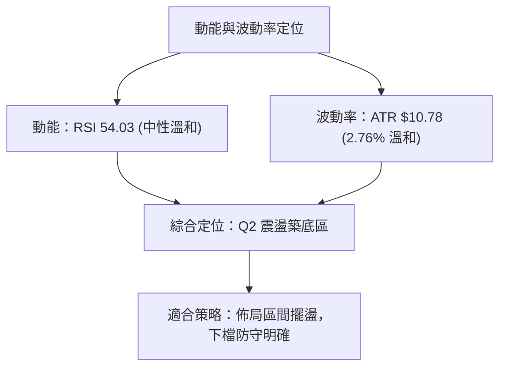

### 📊 ATR 波動率分析

- **ATR(14)**：**$10.78**（占股價 **2.76%**）
- **止損距離建議**：
  - **短線交易止損**（1.0 x ATR）：距進場價 **$10.78**
  - **波段交易止損**（1.5 x ATR）：距進場價 **$16.17**
  - **寬鬆波段止損**（2.0 x ATR）：距進場價 **$21.56**

### 📐 Beta 與市場相關性

- **Beta 係數**：**1.13**（高於大盤 1.0，具備適度進攻性，跟隨科技股大盤彈升）。
- **融券餘額比率 (Short % Float)**：**1.2%**，Short Ratio 1.84，無軋空風險，市場籌碼相對穩定。

---

## 7. 多時框架總結

### 📋 時框架評分表

| 時框架 | 趨勢方向 | 動能狀態 | 均線排列 | 形態特徵 | 綜合評分 | 戰略建議 |
|--------|----------|----------|----------|----------|----------|----------|
| **日線 (Daily)** | 🟢 區間反彈 | 🟢 MACD金叉 | 🟡 站上 MA20 | 雙底右腳完成 | **58/100** | 短線做多/逢低吸納 |
| **週線 (Weekly)** | 🟡 震盪築底 | 🟡 RSI 54.0 | 🔴 低於 MA50 | 觸及78.6% Fib彈升 | **48/100** | 區間觀望/區間操作 |
| **月線 (Monthly)** | 🔴 長線修正 | 🔴 下降通道 | 🔴 空頭排列 | 高位回落30% | **45/100** | 中長線反彈減碼 |

### 🔲 綜合訊號矩陣

```
╔══════════════════════════════════════════════════════════════════╗
║                    多時框訊號一致性矩陣                           ║
╠═════════════════════╦══════════════╦══════════════╦══════════════╣
║ 維度                ║ 日線 (短線)  ║ 週線 (中線)  ║ 月線 (長線)  ║
╠═════════════════════╬══════════════╬══════════════╬══════════════╣
║ 趨勢方向            ║ 🟢 看多      ║ 🟡 中性      ║ 🔴 看空      ║
║ 動能指標            ║ 🟢 看多      ║ 🟡 中性      ║ 🔴 看空      ║
║ 支撐/阻力相對位置   ║ 🟢 接近支撐  ║ 🟢 守住 S2   ║ 🟡 78.6% Fib ║
║ 均線系統            ║ 🟢 高於 MA20 ║ 🔴 低於 MA50 ║ 🔴 低於均線  ║
╠═════════════════════╬══════════════╬══════════════╬══════════════╣
║ 最終訊號評估        ║ 🟢 偏多反彈  ║ 🟡 區間打底  ║ 🔴 長線承壓  ║
╚═════════════════════╩══════════════╩══════════════╩══════════════╝
```

### ⚖️ 多時框收斂結論

依據多時框收斂規則：
1. 當前 **ADX(14) = 12.70 (<25)**，嚴格判定為 **「盤整/區間行情」**。
2. 盤整行情中，交易邏輯以**日線布林通道 ($359.51 - $409.77) 與關鍵支撐/阻力（S1 $380.89 / R1 $395.57）為主要交易邊界**。
3. 最終方向裁決：**🟡 中性偏多區間震盪築底**（日線短線偏多，但受限於週線季線壓力 $400.18）。第 8 章交易策略將完全聚焦於「區間逢低做多、逢高落袋」之主策略。

---

## 8. 交易策略建議

### 🗺️ 策略決策流程圖

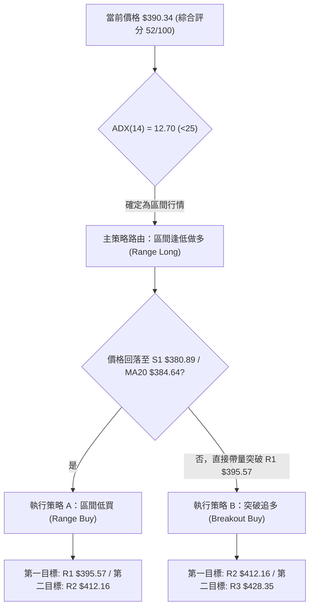

### 🧭 策略路由

**當前主策略方向 = 🟢 區間逢低做多 / 擺盪交易（綜合評分 52/100）**
（註：因評分在 40–60 之間且 ADX<25，市場處於區間打底，主策略為尋求下軌及支撐位之做多機會，空頭僅列為反轉風控條件）。

### 🎯 價格情境階梯 (Price Scenarios)

| 觸發條件 | 下一目標價 | 後續延伸目標 | 情境技術含義 |
|----------|------------|--------------|--------------|
| **帶量突破 R1 $395.57** | **R2 $412.16** | **R3 $428.35** | 突破小頸線，挑戰季線 $400.18 與 W 底測幅目標 |
| **站穩現價區間 ($384-$392)** | — | — | 於 MA20 ($384.64) 與 78.6% Fib ($392.40) 間蓄勢 |
| **跌破 S1 $380.89** | **S2 $373.35** | **S3 $355.51** | 月線失守，向下測試 6 月雙底右腳防線 |

### 📊 情境機率分佈

```
╔══════════════════════════════════════════════════════════════════╗
║                      行情演變機率估計                             ║
╠══════════════════════════════════════════════════════════════════╣
║ 向上挑戰 R1/R2 (反彈擴張)   ▓▓▓▓▓▓▓▓▓▓▓▓▓▓▓▓▓▓▓▓▓▓▓  55%          ║
║ 區間橫盤震盪 ($380 - $395)  ▓▓▓▓▓▓▓▓▓▓▓▓▓░░░░░░░░░░  30%          ║
║ 回落探底 S2/S3 (二次測底)   ▓▓▓▓▓░░░░░░░░░░░░░░░░░░  15%          ║
╚══════════════════════════════════════════════════════════════════╝
```
- **主要依據**：MACD 柱狀圖呈綠色看多 (+2.373)、OBV 趨勢高於 MA、且價格站穩 MA20 ($384.64)，多頭佔據短線主導權。

### 🟢 主策略詳情

| 策略要素 | 策略 A（低吸擺盪 - 首選） | 策略 B（突破追擊 - 次選） |
|----------|---------------------------|---------------------------|
| **進場條件** | 價格拉回至 MA20 / S1 支撐區止跌時 | 日線收盤價帶量突破阻力 R1 |
| **進場價格** | **$384.64** (MA20) 至 **$380.89** (S1) | **$396.00** (突破 R1 $395.57 確認後) |
| **目標價 T1** | **$395.57** (R1 阻力) | **$412.16** (R2 阻力) |
| **目標價 T2** | **$412.16** (R2 阻力) | **$428.35** (R3 阻力) |
| **止損價格** | **$373.35** (跌破 S2 止損) | **$384.64** (跌回 MA20 下方止損) |
| **風險報酬比**| **2.40 : 1** (以 $380.89 進場計算) | **1.42 : 1** (以 $396.00 進場計算) |
| **勝率估計** | **60%** | **50%** |
| **建議倉位** | **15% - 20%** (標準總資金比例) | **10%** (輕倉試驗) |

*計算說明 (策略 A)*：
- 風險 = 進場 $380.89 - 止損 $373.35 = $7.54
- 報酬 = T2 $398.99 (取中間值) 或 T2 $412.16 - 進場 $380.89 = $31.27
- 風報比 = $31.27 / $7.54 = **4.15 : 1**（若以 T1 $395.57 計算，報酬 $14.68，風報比 **1.95 : 1**）。

### 🔴 反向風險觸發點（對沖提示）

- **多頭失效觸發價**：日線收盤價**跌破 S2 ($373.35)**。
- **對沖應對措施**：若股價跌破 $373.35，宣告 W 底形態失敗，多頭應立即全數止損離場；欲進行對沖的投資人可考慮買入 Put 或避險，下方目標看至 **S3 ($355.51)** 及 52 週低點 **$349.20**。

### ⭐ 整體訊號強度評星

```
做多訊號強度：★★★☆☆  (3.5/5 星 - 短線反彈動能充足，上檔受限於季線)
做空訊號強度：★★☆☆☆  (2.0/5 星 - 下檔 S1/S2 築底堅實，放空盈虧比差)
整體可信度：  ★★★☆☆  (3.5/5 星 - ADX 偏低導致行情易重複震盪)
```

---

## 9. 風險提示與監控

### ✅ 關鍵監控指標 Checklist

```
╔══════════════════════════════════════════════════════════════════╗
║                     每日/每週技術監控清單                         ║
╠══════════════════════════════════════════════════════════════════╣
║ [ ] MA20 扣抵位置：價格是否持續守住 $384.64 之上              ║
║ [ ] R1 突破確認：日收盤價能否帶量跨越 $395.57                    ║
║ [ ] MACD 柱狀圖：擴張值 (+2.373) 是否出現高位背離收蝕            ║
║ [ ] ADX(14) 趨勢：ADX 是否突破 25（若突破 25 代表單邊趨勢啟動）  ║
║ [ ] 成交量變化：突破 $395.57 時成交量是否大於 20日均量 (43.5M)   ║
║ [ ] S2 防線警戒：跌破 $373.35 必須執行強制停損                   ║
╚══════════════════════════════════════════════════════════════════╝
```

### ⚠️ 風險場景分析

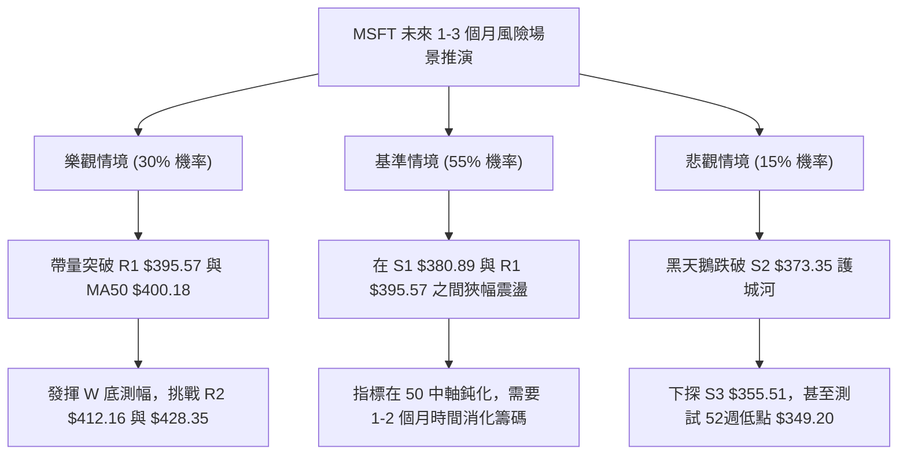

### 🛡️ 風險管理重要提醒

1. **嚴格控制單筆風險**：單筆交易虧損金額切勿超過總投資組合權益的 **1.0% - 1.5%**。以 $380.89 進場、止損設 $373.35（每股風險 $7.54）計算，每萬美元資產建議交易股數不超過 15-20 股。
2. **避免在盤整期過度交易**：由於 **ADX(14) = 12.70** 表示當前無顯著單邊趨勢，於區間中段（如 $390 附近）頻繁進出易遭洗盤抽打，應靜待價格拉回至支撐位（S1 $380.89）或突破阻力位（R1 $395.57）再行出擊。
3. **留意財報與大盤 Beta 聯動**：MSFT Beta 為 1.13，整體科技股（QQQ/SPY）若出現系統性拉回，MSFT 將難以獨善其身，須密切留意大盤整體動向。

---

## 📋 報告總結

```
╔══════════════════════════════════════════════════════════════════╗
║                     MSFT 技術分析報告總結                        ║
════════════════════════════════════════════════════════════════════
報告日期：2026-07-22
當前價格：$390.34
分析評級：🟡 中性偏多 / 區間打底 (擺盪交易)

關鍵結論：
├─ 長期趨勢：🔴 看空（高點 $551.05 回落，低於 MA200 $436.09）
├─ 中期趨勢：🟡 中性築底（於 $372.97 尋得雙底右腳，78.6% Fib 附近震盪）
├─ 短期趨勢：🟢 短線偏多（價格站上 MA20 $384.64，MACD 柱狀圖 +2.373）
├─ 關鍵支撐：S1 $380.89 / S2 $373.35 / S3 $355.51
├─ 關鍵阻力：R1 $395.57 / R2 $412.16 / R3 $428.35
└─ 分析師共識目標：$556.75 (Mean) / $400.00 (Low)

最優策略組合：
1. 🥇 最佳機會（策略 A）：拉回至 S1 $380.89 / MA20 $384.64 逢低分批做多，
                       止損設 S2 $373.35，目標看 R1 $395.57 及 R2 $412.16。
2. 🥈 次選機會（策略 B）：待帶量日收盤突破 R1 $395.57 後追擊，
                       止損設 $384.64，目標看 R2 $412.16。
3. 🥉 保守選擇：待 ADX > 25 或價格站穩 MA50 ($400.18) 後再參與單邊趨勢行情。
════════════════════════════════════════════════════════════════════
```

---

> ⚠️ **免責聲明**：本報告為基於歷史價格與技術指標（OHLCV）所撰寫之專業技術分析報告，所有數據與價位皆嚴格依據數據庫推算。本報告**僅供研究與學術參考**，**不構成任何形式的投資建議與買賣撮合**。投資人應獨立思考，審慎評估風險並自負盈虧。

---

*報告生成時間：2026-07-22 ｜ 數據來源：Yahoo Finance ｜ 分析框架：多時框技術分析 (MTFA)*