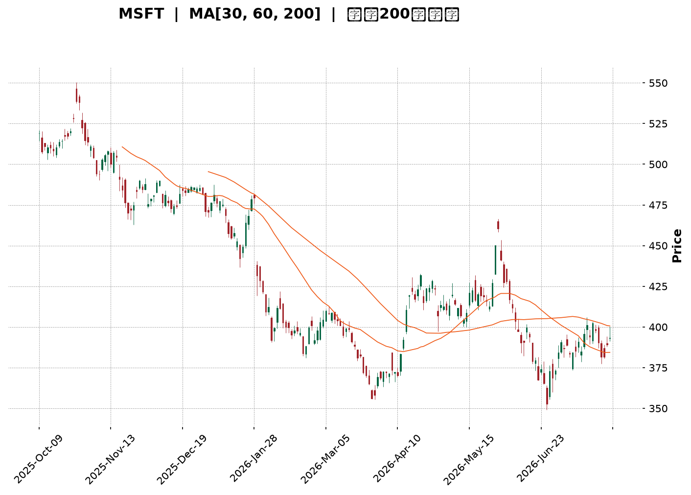
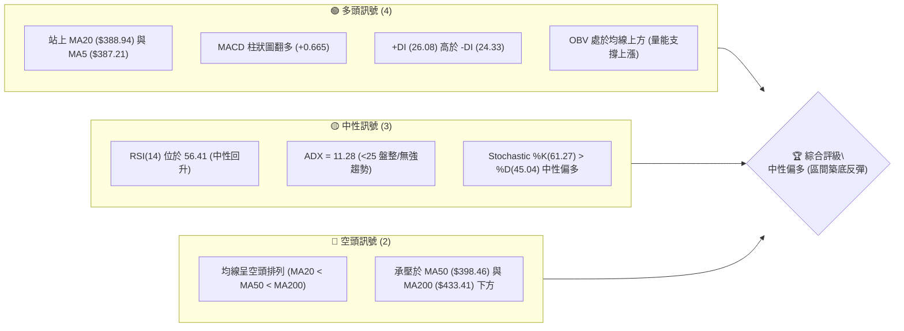
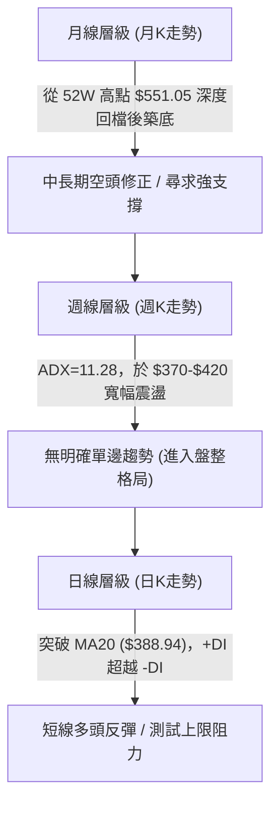
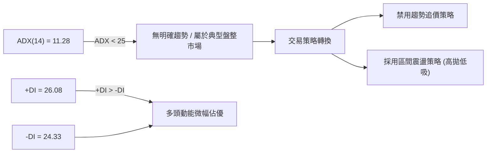
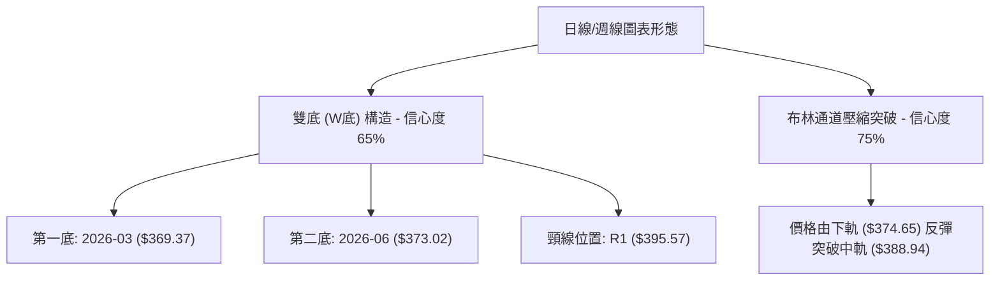
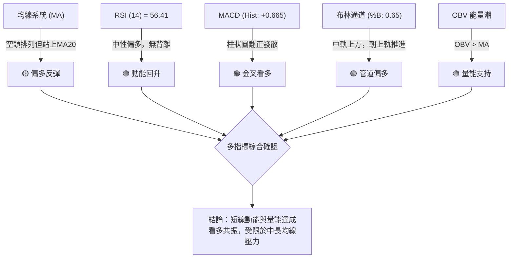
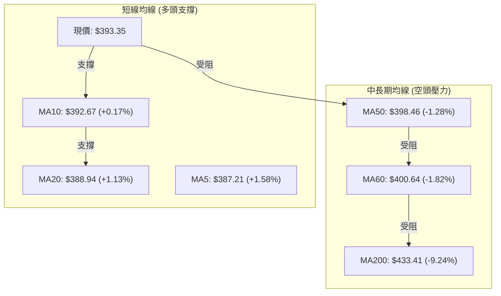
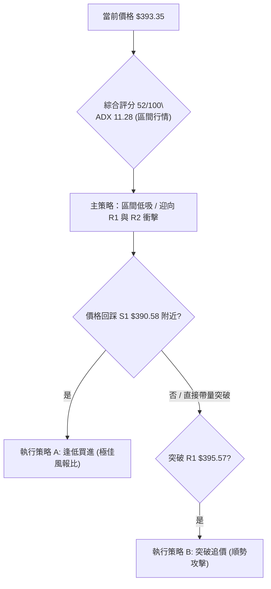
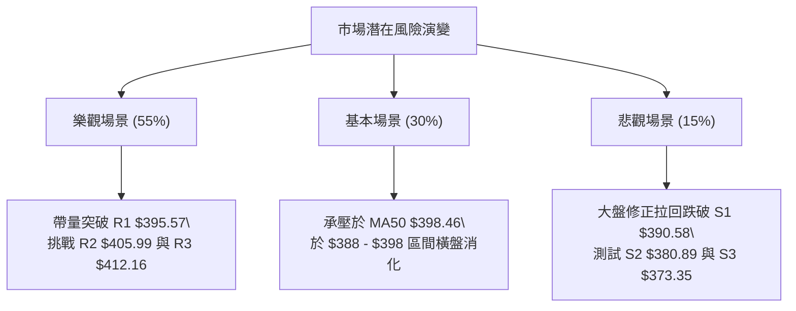

<details>
<summary>📊 靜態圖表 (點擊展開)</summary>

</details>

<html>
<head><meta charset="utf-8" /></head>
<body>
    <div style="height:500px; width:100%;">                        <script>window.PlotlyConfig = {MathJaxConfig: 'local'};</script>
        <script charset="utf-8" src="https://cdn.plot.ly/plotly-3.7.0.min.js" integrity="sha256-jvTGqxNp8AGWEcvNLVuKr+8j5dGe9Yw51LQkmDH+IYA=" crossorigin="anonymous"></script>                <div id="candlestick-chart" class="plotly-graph-div" style="height:100%; width:100%;"></div>            <script>                window.PLOTLYENV=window.PLOTLYENV || {};                                if (document.getElementById("candlestick-chart")) {                    Plotly.newPlot(                        "candlestick-chart",                        [{"close":{"dtype":"f8","bdata":"AAAAAOY4gEAAAADA6Lt\u002fQAAAAMAJ7X9AAAAAIGjlf0AAAABALuN\u002fQAAAAIA+xn9AAAAA4JDlf0AAAAAgTQyAQAAAAKA3E4BAAAAAwBwqgEAAAABgRSqAQAAAAGCEQoBAAAAAYGaBgEAAAACgRNWAQAAAAGAi0YBAAAAAIJxTgEAAAADgaBSAQAAAAIA1DoBAAAAAoH3xf0AAAAAAfn9\u002fQAAAAICL335AAAAA4BfbfkAAAACADG1\u002fQAAAAMCol39AAAAAgMW+f0AAAABA9kF\u002fQAAAAACCr39AAAAAAL2Ef0AAAAAg66p+QAAAAKDeQH5AAAAAAPHEfUAAAADgbWB9QAAAAEBgfn1AAAAA4ACufUAAAACAjzV+QAAAAEBCnX5AAAAA4E9JfkAAAADAPX1+QAAAAKDKuX1AAAAAwFTrfUAAAABASRB+QAAAACB9jX5AAAAA4GqdfkAAAABAA8d9QAAAAGA5FX5AAAAA4IjGfUAAAAAgcIt9QAAAAGBypH1AAAAAQCWgfUAAAAAgWR1+QAAAACBAPH5AAAAAYFIsfkAAAACAEEt+QAAAAICzXX5AAAAAYMNYfkAAAAAADE9+QAAAAIAZVX5AAAAAIJ0XfkAAAADAfW19QAAAAOAObH1AAAAAYDfGfUAAAABgORV+QAAAACDYv31AAAAAQHvSfUAAAADAB7F9QAAAACBVSX1AAAAAQH6VfEAAAACAKmp8QAAAAIAjnXxAAAAAABRIfEAAAACgQaJ7QAAAAOA8EnxAAAAAoCX+fEAAAADAHkN9QAAAAGAw531AAAAAQOr3fUAAAADAP\u002fl6QAAAAAAexnpAAAAAQONXekAAAACgMJZ5QAAAAKCoxXlAAAAAYMt+eEAAAADgyPV4QAAAAMBCvHlAAAAAAAG3eUAAAABAPCl5QAAAAEDvAHlAAAAA4Kb4eEAAAACgm7F4QAAAAABB3XhAAAAA4JTZeEAAAADA8cV4QAAAAKA5+ndAAAAAgIxCeEAAAABgv\u002ft4QAAAAAChDXlAAAAAYEJ+eEAAAACgBNt4QAAAAIDpMHlAAAAAQDBFeUAAAADArZx5QAAAAOA3gXlAAAAAIGeIeUAAAAAgIU55QAAAAGAUQHlAAAAAIN0PeUAAAABAH6t4QAAAAMBe8XhAAAAAoL\u002foeEAAAACgF294QAAAACDeQnhAAAAAILfQd0AAAACgweJ3QAAAAGDzPndAAAAAYM8jd0AAAACA3dJ2QAAAAKD7P3ZAAAAAgPJidkAAAACA6xV3QAAAAMAlCXdAAAAAIHJKd0AAAACgL0F3QAAAAEDEN3dAAAAAAFZYd0AAAABAOER3QAAAAIAYIXdAAAAAAKH4d0AAAACgKoR4QAAAAOBMpXlAAAAAwKA1ekAAAABABV56QAAAAOCpEnpAAAAAoORzekAAAAAAwP96QAAAAKCf7XlAAAAAoDx7ekAAAAAgbn56QAAAACAoxXpAAAAAoK54ekAAAAAgYW55QAAAAIC12HlAAAAAAJ7LeUAAAADg2qd5QAAAAKAL0XlAAAAAIMU9ekAAAADAkON5QAAAAGBKvHlAAAAAIDhueUAAAAAgWUV5QAAAAOC4iHlAAAAAYCFQekAAAACg\u002fml6QAAAAEBJCHpAAAAAYGZCekAAAACgcDF6QAAAAMAeKXpAAAAA4HoAekAAAABguMp5QAAAAADXr3pAAAAAANcjfEAAAADgUch8QAAAAMD1lHtAAAAAoHC1ekAAAADAzMB6QAAAAGC4CnpAAAAAANe7eUAAAABgjzZ5QAAAAIDC1XhAAAAAoHBleEAAAAAA12t4QAAAAAAp\u002fHhAAAAAoEedeEAAAABgj653QAAAAGBmtndAAAAAoHD1dkAAAABACl93QAAAACBc13ZAAAAAoEcNdkAAAAAghU93QAAAAMAeCXdAAAAA4FFQd0AAAADgegR4QAAAAADXZ3hAAAAAANcreEAAAACgcE14QAAAAKBw9XdAAAAAgMIFeEAAAACgmRF4QAAAAADXb3hAAAAAQOEOeEAAAACAFLp4QAAAAKCZEXlAAAAAwB6deEAAAADgoyR5QAAAAAAA3HhAAAAAoHBleEAAAACgR9l3QAAAAEAz23dAAAAAoJlReEAAAACgmZV4QA=="},"high":{"dtype":"f8","bdata":"q\u002fzKvz1IgEBvEaWHR0KAQOTeIrVHCYBA6nm3JUwAgEBAxrcpew+AQNb\u002flDbHDIBAF2QAE+MBgEAcVNRBfBuAQGODZNlnG4BAKi01bWVPgEB0tltuOEWAQFYzs3JZUIBA6XN7z7mZgEDy++mX4TGBQGdw8Smo9oBAmiqda9OcgEAk0A4G6W+AQHO\u002fUuo\u002fTYBAh\u002fuvlnECgEDKzQypcPl\u002fQBlLpG9HaH9A+2xYossDf0AvOr02kHp\u002fQBE9y2hJpn9ACVF+tjLHf0AQ1IIvS+R\u002fQCC\u002fNsUVxn9AhOz\u002fJVrOf0DjNG96CD1\u002fQB+kG1ktwX5AqaH9jhu2fkB3mEJDv8x9QDpyL\u002faRrH1A5qQ+BmnQfUDxULM4UmJ+QBFqt30ip35AXj1jtwJ7fkChDuow\u002frR+QEKvokd9IX5A2nN+KPryfUCufk3kGxR+QKPLc8HgoX5AM3cUrwKffkAhidwrpiF+QPgcw6IAPn5AQe47EPoEfkCqq4Bba+l9QP+jpyJXvH1Am8oySvPdfUBZrRiR3nZ+QDSDmVP+Wn5AbDPF7wJpfkBviiW0rFp+QIZ9KEzcb35AokvsTUtffkCMfN9M9WJ+QKoRY6wkeH5ANK4AC51ffkBQxMEKLih+QAHTs4ZZn31AgijYMuHJfUAYriRddnh+QJZsZV9SCH5AtPeMURXbfUAqradPuO19QJ17NdS6mn1AHeKV1PwhfUD6F7ZKEeN8QPNy\u002fcYu0nxACNykeGVsfEAbiaWQ7Sp8QG2U7SBRLXxAMx72eS5QfUBk6vfHW4J9QBJN8amqC35AeoXuboYZfkC10\u002fFPnIh7QGE4Qa9qWntA8hza6UjNekCvSMll3EJ6QLchoT8FH3pAeiZJEtZneUBKkTxyIwB5QJXy4TLP0HlA\u002fHwBVdNcekCn\u002fuxS0el5QJfjkbJiRnlAT3ekXd87eUA97geJ6Ot4QMYtVF9nDHlAuVT+JuU4eUC3osuKFfR4QHEV1ZgWqHhA1j830EtIeEDrnmosowl5QEJPMcy\u002faXlAl7z7AWa\u002feEBzsCjBKgV5QGanivoiXXlALCL5Q0SieUBGdHDEhqt5QPT5QkuEwnlA3csPyyyVeUA4XjYSBJV5QIw9nVAEgnlA84YKauBTeUCgiupdzT55QFGY\u002f\u002fo5\u002fHhAmTGSc2o4eUBaD\u002fXGPNJ4QDjiQYhEenhALDCfNp4ieEDklYV7+CV4QPUh1V1L2ndAbZjO9euDd0AHYSkLkF53QF8O77eqmnZAW8JjOCDJdkDAH1BVgUF3QNGxS1roUndA1+0H6FFNd0DhZLW5wU53QLC4ZjVSOndA9mwl7K8CeEDSRZCxFUt3QCNraEZAbXdAkV653lf7d0Dn329jZJ14QFtJgV2X13lAYyLyipE+ekC2MHUwW+p6QE7m6S+kZnpAXOY1xBukekCAvVv4Mwx7QPU0Sfroa3pAw98ddIGAekA6dX2a\u002faJ6QDbtnJHaz3pAH+yuW1yeekCgwqTYY9h5QMVgTx1WA3pA6CgH\u002fu09ekBclLVyEf55QJojvmRAGHpAYL7ejOGwekCk\u002f7Ctmht6QM5UBPzEvHlAF6Qa0qHpeUC84TQD6VZ5QGqRguoyr3lAgYwtDOqzekA1wYBDOIN6QGSLqNw8\u002fHpAmssgCwFTekAAAACgcKV6QAAAAGBmhnpAAAAA4FE8ekAAAABACv95QAAAAADX13pAAAAAoEclfEAAAADAHiV9QAAAAAAAWHxAAAAAgD2Ge0AAAABgZkJ7QAAAACCF13pAAAAAYI8SekAAAAAgrr95QAAAAOCjUHlAAAAAoJnNeEAAAAAA13t4QAAAAAAAHHlAAAAAoHDNeEAAAACA62V4QAAAAIDr1XdAAAAAgBTad0AAAAAghZN3QAAAAIAUrndAAAAAIK7DdkAAAACAwol3QAAAAAAAyHdAAAAAYGZid0AAAACgR014QAAAAEAzg3hAAAAAYGZSeEAAAADAHrl4QAAAAMD1FHhAAAAAYGYKeEAAAABgj354QAAAAGBmmnhAAAAAQApDeEAAAAAgXO94QAAAAADXX3lAAAAAgD3meEAAAABA4TJ5QAAAACCFF3lAAAAAAAAQeUAAAADgenx4QAAAAOB6UHhAAAAAQDOjeEAAAADAHgV5QA=="},"hovertemplate":"\u003cb\u003e%{x|%Y-%m-%d}\u003c\u002fb\u003e\u003cbr\u003e\u958b: $%{open:.2f}\u003cbr\u003e\u9ad8: $%{high:.2f}\u003cbr\u003e\u4f4e: $%{low:.2f}\u003cbr\u003e\u6536: $%{close:.2f}\u003cextra\u003e\u003c\u002fextra\u003e","low":{"dtype":"f8","bdata":"pCcCciYRgEBIKrRow6Z\u002fQG9lyFdbx39A4pUPgwxtf0D+OMJqpax\u002fQB7+ezTqjn9AR\u002flQgOCBf0DyopZcLuN\u002fQAYQlNf63H9AHZqEeZ0TgECYLjvixBqAQJ4lxKB2K4BAmrDSOXJtgEDDw2wB78qAQOnU7h\u002fRqoBAB5dGSqw2gEDMg79bu\u002f1\u002fQAJl\u002fKWf9X9A\u002fADay02Kf0B1rZIzRXZ\u002fQONx5+AIy35AA9DMJlWifkA\u002fanrZkvp+QIHe1ksEM39ASQAfWan\u002ffkDD4CXOKSJ\u002fQDIEQGjz5H5A+iaq4bdbf0ACV57Tdjt+QBeKQFap\u002fH1AS65b9USWfUADol4qGiN9QCeMirgeH31AKXU3HEPtfEAhKRDWEPF9QD16E\u002fbgR35ATpg6NAUofkAcsdlTn0J+QFk8wrF9kX1A0suWHgqmfUAV0mcZHMx9QBj2a1S4I35ARtgi7FhlfkBjSSdSlI99QOmEZfIAnH1AEWocZaajfUAer48EzWZ9QPZyd2+tTH1AKUPCFk6OfUAMvuYXV7x9QHnT7wmdBX5AUuwOv8wIfkAP7EwxdCl+QDx4FC7jKn5AGimfJ+M8fkB66NqmiCB+QNK5+lSPNX5AQ2esL4QSfkDqjvdbNUF9QHepqxWyNn1AaUFjdK06fUAwegS+S719QBNmCfwAnH1Ax3EyMrRhfUCqX179Ipl9QE+dy7Yl\u002fnxA1MgMQkpyfECIkjlND158QJj7QYFMZ3xAmSDkJ5z0e0AThk\u002f7wkt7QGCpB5Onq3tAVYXLRoUIfEDwt6k8Or98QBeg4N7+cH1AhNR0qxe+fUCR3EJCdDJ6QGc\u002fjRvziHpAACa2FgxGekBvLphf+mt5QOJhNUTPdnlAai0VREppeEDNqAwG2XJ4QJTjg8x78XhA0+DCueyteUBWlTTEtvN4QEXAWy3tw3hAyjL9QZDEeEAwTtxPfox4QISCWbABqXhAWJpi+AC9eECPvv5S5aR4QIEHuEBa5HdAhT5SKCnOd0DM9SOLEVV4QNRKOkEN3nhAIU43MZlQeEDKhWJ8klx4QC0vh00kfXhA5DHYCR73eECWSM93ajh5QFNMv7sIenlAvVhLEQwqeUC7rkpt8iB5QHndyp+NC3lAW9zpE3gNeUCas\u002f4BXpZ4QHHpnQ39nnhA7hrw8T7OeEAj8k++emJ4QNhLv1mTI3hAzrzEnca0d0BuJFaPrs13QG0w4uC9MHdAXFJHe0wNd0DMtpiHacZ2QHo0Kg3VO3ZAbkJg+Sg4dkCtLAy6kKR2QJz4Ydt39nZAbjBXys61dkBaGswLOQt3QKKTS9lI3HZAM7wembcpd0Dm\u002f2KKG+R2QBVUj0+vE3dAPDUdjX0jd0AwU\u002fNV9Bp4QAFOHiX2vXhAu8FaIf2zeUBt8vU2fjx6QK0ZMYtn9nlA8dx6HMYEekCxHnPiEWx6QAetVWtVqHlAdc7c82vueUCCo+u6sgJ6QJOxnJDPT3pAk\u002fUZShs2ekBkkGO8ZdJ4QL0Uw+jYmHlAx4CwNpieeUC3OsD2qX55QJ6ky1fAQ3lAXP\u002fzCq4dekCD3Bsqr9F5QFa\u002f9mH6SXlAQuTEwC1ceUCtvovgnAJ5QGqvxM83AHlAZ4mWIkjAeUDYtqxyY+t5QLFdmxtw+XlAuDctxpOmeUAAAAAgXPt5QAAAAKBHBXpAAAAA4FHQeUAAAACgR5l5QAAAAGC4ynlAAAAAgMIFe0AAAADgUaR8QAAAAEDhhntAAAAAAACEekAAAABgj6Z6QAAAAGBm5nlAAAAAwPWIeUAAAAAgrud4QAAAAGCP0nhAAAAAAAAAeEAAAADgUeR3QAAAAKCZjXhAAAAAQApreEAAAADAHpV3QAAAAOB6VHdAAAAAwB7xdkAAAABguCp3QAAAAOB6zHZAAAAAQDPTdUAAAABA4TZ2QAAAAGBmfnZAAAAAQDP3dkAAAACAPW53QAAAAEAz+3dAAAAAIIXTd0AAAAAghUN4QAAAAKBH1XdAAAAAoJlVd0AAAAAAANh3QAAAAGBmAnhAAAAAYGaqd0AAAABgZiZ4QAAAAMDMgHhAAAAAgD1WeEAAAABgZlp4QAAAAMAexXhAAAAAIFwveEAAAACAPZZ3QAAAAGBmyndAAAAAANc\u002feEAAAADAzHR4QA=="},"name":"\u50f9\u683c","open":{"dtype":"f8","bdata":"0tH35Ws4gEA5N90v9SKAQOTeIrVHCYBAopLkmE2wf0AlHzvPgft\u002fQNQMvL6q1X9AAvzYB2Kdf0AzCc0x8fV\u002fQKPb1Q\u002fyEYBAbZgiQ\u002fYugEAgMrUiYDmAQJmftZH\u002fO4BAK9EXhneDgEB3bEkKTxSBQPkmbG4V7IBAJitlyiF5gEDzD9+RaWyAQIHiQgtPJIBAqzKPH6HIf0CXwNEZHeF\u002fQPeUqZekZ39ANQgWBindfkDZcnoCSg5\u002fQLlxT0T4WX9AqC+QYniif0BqupIqk7F\u002fQMkU6+qC8X5A5uSwgACUf0ABnooFCsR+QCnyke4\u002fcH5AC\u002f8mjWiofkBFb96DDsZ9QP2uFhdOjn1AaO\u002fcpn1\u002ffUCyPW6KdkJ+QG8VlfUCV35AGtfGQGRkfkD+eVNw\u002fkh+QPIQ\u002ftpUo31ALhW2vCDafUAAxmFfFwZ+QMXlcxHYK35AS\u002fXBpudufkDt6J4KJR5+QEUWovZEqH1Ah8rfUhXbfUD4sMwdi999QD\u002fNG5sVXX1AoNlRx7qsfUAsRUhlHsF9QMP0qxkwU35AFjFttW8\u002ffkBwa3b1Ri1+QI9Fd15tOH5ADzztiNVIfkBe1aKNXSt+QJme9sVoPH5Aqu2\u002fndVafkBObOkR4SN+QJ\u002fi7gZVf31AX9RoqDB7fUCWR3mfINp9QOFs58iz8X1ACnZM61R\u002ffUBJT9ki6Kh9QAblBS41iX1A9cLITUUGfUCo+Rcn\u002f+B8QEN+UX3NfHxA9egfLYMTfEBIDweTfil8QKtdRswq2ntAdcU5kd0dfEAalOfg8\u002fN8QAhObPCYeX1AZRTVLhURfkBFcrfkoGB7QKN5OT6RU3tAwHNJ\u002flHFekAXBKRfOUJ6QD6REE7YknlAPvVLMCNaeUCf9luGZ9Z4QL422qXhMHlAOh2ATyccekAZC5yIW+V5QCg7WT1FM3lATsLsiIIqeUByUolkM9d4QPBK35HWxXhApnltQi\u002f9eEBHDCwKELR4QJP+o0hXonhAIlyABfX0d0AWRKjE+Vp4QHBWKIhdPXlAioMLV5BgeEBg+sS+LIB4QKKMZ0SlhHhAhSZLqnEGeUA28nBKvDh5QJDNEOAMhXlAHtM\u002f37dAeUB4wH0zTZJ5QI5aUoQYS3lAnHOhmhY8eUCT01ZBIgJ5QKMceeRa03hABOsUg3r2eEA13Ij6WMR4QDMMdVAcVHhAtKN+8kMfeEAAQHoIIPF3QDmUJreJ2HdAuiwI06+Bd0AA8yQxTCB3QIGUYrbikXZAR2JkueKRdkDJ6hygMbx2QC+7YcfsSndA+iTEc6nmdkB7T6W57Ep3QHdFGUOiGHdA0L1xOV4CeECqwLuLHjt3QIzPYXLIQndA\u002fVjLP9dMd0C1WkdxTjF4QP7rE8c80nhALMuGyj0vekB4+68nbn56QOAzLjzWQ3pA3WBk8041ekDfmJ9zTZR6QMeN3Xm4L3pA2hVi+BkBekDXJH55eVd6QI9A0U1wenpAxIgQEJl6ekDXSYctwZ55QOPrlYSGvnlApUioyWiqeUC+Y0s\u002fwuZ5QG4feULkcXlAqxOulzszekC6B7unzgd6QN3NF+fQb3lAgk+f+VjZeUAk7\u002fAKQiV5QIhLhpGxOXlA+9OSmP7VeUDzltWBg\u002ft5QK9WBsaIz3pArK4c\u002fmXUeUAAAAAAAIx6QAAAAOCjOHpAAAAAQOEGekAAAAAAKbB5QAAAACCuz3lAAAAAwMwIe0AAAACgcA19QAAAAIAU7ntAAAAAQDNne0AAAADA9Tx7QAAAAKBwxXpAAAAAgD3ieUAAAADgepB5QAAAAMDM6HhAAAAAIFyzeEAAAABA4XZ4QAAAAMDMzHhAAAAA4KO8eEAAAAAAAGR4QAAAAMAenXdAAAAAANd7d0AAAACAFEZ3QAAAAMAeOXdAAAAA4FGsdkAAAABgZlJ2QAAAAAAAmHdAAAAA4Howd0AAAACgR813QAAAACCuB3hAAAAA4KMweEAAAAAA14d4QAAAAOB6AHhAAAAAQDNnd0AAAADAzDx4QAAAAAAAPHhAAAAAwB7td0AAAADAzDx4QAAAAMD15HhAAAAAgMKteEAAAABgj3Z4QAAAAMD17HhAAAAAoEf5eEAAAAAghV94QAAAAMDMMHhAAAAAoEdheEAAAABgj5J4QA=="},"x":["2025-10-09T00:00:00-04:00","2025-10-10T00:00:00-04:00","2025-10-13T00:00:00-04:00","2025-10-14T00:00:00-04:00","2025-10-15T00:00:00-04:00","2025-10-16T00:00:00-04:00","2025-10-17T00:00:00-04:00","2025-10-20T00:00:00-04:00","2025-10-21T00:00:00-04:00","2025-10-22T00:00:00-04:00","2025-10-23T00:00:00-04:00","2025-10-24T00:00:00-04:00","2025-10-27T00:00:00-04:00","2025-10-28T00:00:00-04:00","2025-10-29T00:00:00-04:00","2025-10-30T00:00:00-04:00","2025-10-31T00:00:00-04:00","2025-11-03T00:00:00-05:00","2025-11-04T00:00:00-05:00","2025-11-05T00:00:00-05:00","2025-11-06T00:00:00-05:00","2025-11-07T00:00:00-05:00","2025-11-10T00:00:00-05:00","2025-11-11T00:00:00-05:00","2025-11-12T00:00:00-05:00","2025-11-13T00:00:00-05:00","2025-11-14T00:00:00-05:00","2025-11-17T00:00:00-05:00","2025-11-18T00:00:00-05:00","2025-11-19T00:00:00-05:00","2025-11-20T00:00:00-05:00","2025-11-21T00:00:00-05:00","2025-11-24T00:00:00-05:00","2025-11-25T00:00:00-05:00","2025-11-26T00:00:00-05:00","2025-11-28T00:00:00-05:00","2025-12-01T00:00:00-05:00","2025-12-02T00:00:00-05:00","2025-12-03T00:00:00-05:00","2025-12-04T00:00:00-05:00","2025-12-05T00:00:00-05:00","2025-12-08T00:00:00-05:00","2025-12-09T00:00:00-05:00","2025-12-10T00:00:00-05:00","2025-12-11T00:00:00-05:00","2025-12-12T00:00:00-05:00","2025-12-15T00:00:00-05:00","2025-12-16T00:00:00-05:00","2025-12-17T00:00:00-05:00","2025-12-18T00:00:00-05:00","2025-12-19T00:00:00-05:00","2025-12-22T00:00:00-05:00","2025-12-23T00:00:00-05:00","2025-12-24T00:00:00-05:00","2025-12-26T00:00:00-05:00","2025-12-29T00:00:00-05:00","2025-12-30T00:00:00-05:00","2025-12-31T00:00:00-05:00","2026-01-02T00:00:00-05:00","2026-01-05T00:00:00-05:00","2026-01-06T00:00:00-05:00","2026-01-07T00:00:00-05:00","2026-01-08T00:00:00-05:00","2026-01-09T00:00:00-05:00","2026-01-12T00:00:00-05:00","2026-01-13T00:00:00-05:00","2026-01-14T00:00:00-05:00","2026-01-15T00:00:00-05:00","2026-01-16T00:00:00-05:00","2026-01-20T00:00:00-05:00","2026-01-21T00:00:00-05:00","2026-01-22T00:00:00-05:00","2026-01-23T00:00:00-05:00","2026-01-26T00:00:00-05:00","2026-01-27T00:00:00-05:00","2026-01-28T00:00:00-05:00","2026-01-29T00:00:00-05:00","2026-01-30T00:00:00-05:00","2026-02-02T00:00:00-05:00","2026-02-03T00:00:00-05:00","2026-02-04T00:00:00-05:00","2026-02-05T00:00:00-05:00","2026-02-06T00:00:00-05:00","2026-02-09T00:00:00-05:00","2026-02-10T00:00:00-05:00","2026-02-11T00:00:00-05:00","2026-02-12T00:00:00-05:00","2026-02-13T00:00:00-05:00","2026-02-17T00:00:00-05:00","2026-02-18T00:00:00-05:00","2026-02-19T00:00:00-05:00","2026-02-20T00:00:00-05:00","2026-02-23T00:00:00-05:00","2026-02-24T00:00:00-05:00","2026-02-25T00:00:00-05:00","2026-02-26T00:00:00-05:00","2026-02-27T00:00:00-05:00","2026-03-02T00:00:00-05:00","2026-03-03T00:00:00-05:00","2026-03-04T00:00:00-05:00","2026-03-05T00:00:00-05:00","2026-03-06T00:00:00-05:00","2026-03-09T00:00:00-04:00","2026-03-10T00:00:00-04:00","2026-03-11T00:00:00-04:00","2026-03-12T00:00:00-04:00","2026-03-13T00:00:00-04:00","2026-03-16T00:00:00-04:00","2026-03-17T00:00:00-04:00","2026-03-18T00:00:00-04:00","2026-03-19T00:00:00-04:00","2026-03-20T00:00:00-04:00","2026-03-23T00:00:00-04:00","2026-03-24T00:00:00-04:00","2026-03-25T00:00:00-04:00","2026-03-26T00:00:00-04:00","2026-03-27T00:00:00-04:00","2026-03-30T00:00:00-04:00","2026-03-31T00:00:00-04:00","2026-04-01T00:00:00-04:00","2026-04-02T00:00:00-04:00","2026-04-06T00:00:00-04:00","2026-04-07T00:00:00-04:00","2026-04-08T00:00:00-04:00","2026-04-09T00:00:00-04:00","2026-04-10T00:00:00-04:00","2026-04-13T00:00:00-04:00","2026-04-14T00:00:00-04:00","2026-04-15T00:00:00-04:00","2026-04-16T00:00:00-04:00","2026-04-17T00:00:00-04:00","2026-04-20T00:00:00-04:00","2026-04-21T00:00:00-04:00","2026-04-22T00:00:00-04:00","2026-04-23T00:00:00-04:00","2026-04-24T00:00:00-04:00","2026-04-27T00:00:00-04:00","2026-04-28T00:00:00-04:00","2026-04-29T00:00:00-04:00","2026-04-30T00:00:00-04:00","2026-05-01T00:00:00-04:00","2026-05-04T00:00:00-04:00","2026-05-05T00:00:00-04:00","2026-05-06T00:00:00-04:00","2026-05-07T00:00:00-04:00","2026-05-08T00:00:00-04:00","2026-05-11T00:00:00-04:00","2026-05-12T00:00:00-04:00","2026-05-13T00:00:00-04:00","2026-05-14T00:00:00-04:00","2026-05-15T00:00:00-04:00","2026-05-18T00:00:00-04:00","2026-05-19T00:00:00-04:00","2026-05-20T00:00:00-04:00","2026-05-21T00:00:00-04:00","2026-05-22T00:00:00-04:00","2026-05-26T00:00:00-04:00","2026-05-27T00:00:00-04:00","2026-05-28T00:00:00-04:00","2026-05-29T00:00:00-04:00","2026-06-01T00:00:00-04:00","2026-06-02T00:00:00-04:00","2026-06-03T00:00:00-04:00","2026-06-04T00:00:00-04:00","2026-06-05T00:00:00-04:00","2026-06-08T00:00:00-04:00","2026-06-09T00:00:00-04:00","2026-06-10T00:00:00-04:00","2026-06-11T00:00:00-04:00","2026-06-12T00:00:00-04:00","2026-06-15T00:00:00-04:00","2026-06-16T00:00:00-04:00","2026-06-17T00:00:00-04:00","2026-06-18T00:00:00-04:00","2026-06-22T00:00:00-04:00","2026-06-23T00:00:00-04:00","2026-06-24T00:00:00-04:00","2026-06-25T00:00:00-04:00","2026-06-26T00:00:00-04:00","2026-06-29T00:00:00-04:00","2026-06-30T00:00:00-04:00","2026-07-01T00:00:00-04:00","2026-07-02T00:00:00-04:00","2026-07-06T00:00:00-04:00","2026-07-07T00:00:00-04:00","2026-07-08T00:00:00-04:00","2026-07-09T00:00:00-04:00","2026-07-10T00:00:00-04:00","2026-07-13T00:00:00-04:00","2026-07-14T00:00:00-04:00","2026-07-15T00:00:00-04:00","2026-07-16T00:00:00-04:00","2026-07-17T00:00:00-04:00","2026-07-20T00:00:00-04:00","2026-07-21T00:00:00-04:00","2026-07-22T00:00:00-04:00","2026-07-23T00:00:00-04:00","2026-07-24T00:00:00-04:00","2026-07-27T00:00:00-04:00","2026-07-28T00:00:00-04:00"],"type":"candlestick"},{"hovertemplate":"MA30: $%{y:.2f}\u003cextra\u003e\u003c\u002fextra\u003e","line":{"color":"#2196F3","dash":"dash","width":2},"mode":"lines","name":"MA30","x":["2025-10-09T00:00:00-04:00","2025-10-10T00:00:00-04:00","2025-10-13T00:00:00-04:00","2025-10-14T00:00:00-04:00","2025-10-15T00:00:00-04:00","2025-10-16T00:00:00-04:00","2025-10-17T00:00:00-04:00","2025-10-20T00:00:00-04:00","2025-10-21T00:00:00-04:00","2025-10-22T00:00:00-04:00","2025-10-23T00:00:00-04:00","2025-10-24T00:00:00-04:00","2025-10-27T00:00:00-04:00","2025-10-28T00:00:00-04:00","2025-10-29T00:00:00-04:00","2025-10-30T00:00:00-04:00","2025-10-31T00:00:00-04:00","2025-11-03T00:00:00-05:00","2025-11-04T00:00:00-05:00","2025-11-05T00:00:00-05:00","2025-11-06T00:00:00-05:00","2025-11-07T00:00:00-05:00","2025-11-10T00:00:00-05:00","2025-11-11T00:00:00-05:00","2025-11-12T00:00:00-05:00","2025-11-13T00:00:00-05:00","2025-11-14T00:00:00-05:00","2025-11-17T00:00:00-05:00","2025-11-18T00:00:00-05:00","2025-11-19T00:00:00-05:00","2025-11-20T00:00:00-05:00","2025-11-21T00:00:00-05:00","2025-11-24T00:00:00-05:00","2025-11-25T00:00:00-05:00","2025-11-26T00:00:00-05:00","2025-11-28T00:00:00-05:00","2025-12-01T00:00:00-05:00","2025-12-02T00:00:00-05:00","2025-12-03T00:00:00-05:00","2025-12-04T00:00:00-05:00","2025-12-05T00:00:00-05:00","2025-12-08T00:00:00-05:00","2025-12-09T00:00:00-05:00","2025-12-10T00:00:00-05:00","2025-12-11T00:00:00-05:00","2025-12-12T00:00:00-05:00","2025-12-15T00:00:00-05:00","2025-12-16T00:00:00-05:00","2025-12-17T00:00:00-05:00","2025-12-18T00:00:00-05:00","2025-12-19T00:00:00-05:00","2025-12-22T00:00:00-05:00","2025-12-23T00:00:00-05:00","2025-12-24T00:00:00-05:00","2025-12-26T00:00:00-05:00","2025-12-29T00:00:00-05:00","2025-12-30T00:00:00-05:00","2025-12-31T00:00:00-05:00","2026-01-02T00:00:00-05:00","2026-01-05T00:00:00-05:00","2026-01-06T00:00:00-05:00","2026-01-07T00:00:00-05:00","2026-01-08T00:00:00-05:00","2026-01-09T00:00:00-05:00","2026-01-12T00:00:00-05:00","2026-01-13T00:00:00-05:00","2026-01-14T00:00:00-05:00","2026-01-15T00:00:00-05:00","2026-01-16T00:00:00-05:00","2026-01-20T00:00:00-05:00","2026-01-21T00:00:00-05:00","2026-01-22T00:00:00-05:00","2026-01-23T00:00:00-05:00","2026-01-26T00:00:00-05:00","2026-01-27T00:00:00-05:00","2026-01-28T00:00:00-05:00","2026-01-29T00:00:00-05:00","2026-01-30T00:00:00-05:00","2026-02-02T00:00:00-05:00","2026-02-03T00:00:00-05:00","2026-02-04T00:00:00-05:00","2026-02-05T00:00:00-05:00","2026-02-06T00:00:00-05:00","2026-02-09T00:00:00-05:00","2026-02-10T00:00:00-05:00","2026-02-11T00:00:00-05:00","2026-02-12T00:00:00-05:00","2026-02-13T00:00:00-05:00","2026-02-17T00:00:00-05:00","2026-02-18T00:00:00-05:00","2026-02-19T00:00:00-05:00","2026-02-20T00:00:00-05:00","2026-02-23T00:00:00-05:00","2026-02-24T00:00:00-05:00","2026-02-25T00:00:00-05:00","2026-02-26T00:00:00-05:00","2026-02-27T00:00:00-05:00","2026-03-02T00:00:00-05:00","2026-03-03T00:00:00-05:00","2026-03-04T00:00:00-05:00","2026-03-05T00:00:00-05:00","2026-03-06T00:00:00-05:00","2026-03-09T00:00:00-04:00","2026-03-10T00:00:00-04:00","2026-03-11T00:00:00-04:00","2026-03-12T00:00:00-04:00","2026-03-13T00:00:00-04:00","2026-03-16T00:00:00-04:00","2026-03-17T00:00:00-04:00","2026-03-18T00:00:00-04:00","2026-03-19T00:00:00-04:00","2026-03-20T00:00:00-04:00","2026-03-23T00:00:00-04:00","2026-03-24T00:00:00-04:00","2026-03-25T00:00:00-04:00","2026-03-26T00:00:00-04:00","2026-03-27T00:00:00-04:00","2026-03-30T00:00:00-04:00","2026-03-31T00:00:00-04:00","2026-04-01T00:00:00-04:00","2026-04-02T00:00:00-04:00","2026-04-06T00:00:00-04:00","2026-04-07T00:00:00-04:00","2026-04-08T00:00:00-04:00","2026-04-09T00:00:00-04:00","2026-04-10T00:00:00-04:00","2026-04-13T00:00:00-04:00","2026-04-14T00:00:00-04:00","2026-04-15T00:00:00-04:00","2026-04-16T00:00:00-04:00","2026-04-17T00:00:00-04:00","2026-04-20T00:00:00-04:00","2026-04-21T00:00:00-04:00","2026-04-22T00:00:00-04:00","2026-04-23T00:00:00-04:00","2026-04-24T00:00:00-04:00","2026-04-27T00:00:00-04:00","2026-04-28T00:00:00-04:00","2026-04-29T00:00:00-04:00","2026-04-30T00:00:00-04:00","2026-05-01T00:00:00-04:00","2026-05-04T00:00:00-04:00","2026-05-05T00:00:00-04:00","2026-05-06T00:00:00-04:00","2026-05-07T00:00:00-04:00","2026-05-08T00:00:00-04:00","2026-05-11T00:00:00-04:00","2026-05-12T00:00:00-04:00","2026-05-13T00:00:00-04:00","2026-05-14T00:00:00-04:00","2026-05-15T00:00:00-04:00","2026-05-18T00:00:00-04:00","2026-05-19T00:00:00-04:00","2026-05-20T00:00:00-04:00","2026-05-21T00:00:00-04:00","2026-05-22T00:00:00-04:00","2026-05-26T00:00:00-04:00","2026-05-27T00:00:00-04:00","2026-05-28T00:00:00-04:00","2026-05-29T00:00:00-04:00","2026-06-01T00:00:00-04:00","2026-06-02T00:00:00-04:00","2026-06-03T00:00:00-04:00","2026-06-04T00:00:00-04:00","2026-06-05T00:00:00-04:00","2026-06-08T00:00:00-04:00","2026-06-09T00:00:00-04:00","2026-06-10T00:00:00-04:00","2026-06-11T00:00:00-04:00","2026-06-12T00:00:00-04:00","2026-06-15T00:00:00-04:00","2026-06-16T00:00:00-04:00","2026-06-17T00:00:00-04:00","2026-06-18T00:00:00-04:00","2026-06-22T00:00:00-04:00","2026-06-23T00:00:00-04:00","2026-06-24T00:00:00-04:00","2026-06-25T00:00:00-04:00","2026-06-26T00:00:00-04:00","2026-06-29T00:00:00-04:00","2026-06-30T00:00:00-04:00","2026-07-01T00:00:00-04:00","2026-07-02T00:00:00-04:00","2026-07-06T00:00:00-04:00","2026-07-07T00:00:00-04:00","2026-07-08T00:00:00-04:00","2026-07-09T00:00:00-04:00","2026-07-10T00:00:00-04:00","2026-07-13T00:00:00-04:00","2026-07-14T00:00:00-04:00","2026-07-15T00:00:00-04:00","2026-07-16T00:00:00-04:00","2026-07-17T00:00:00-04:00","2026-07-20T00:00:00-04:00","2026-07-21T00:00:00-04:00","2026-07-22T00:00:00-04:00","2026-07-23T00:00:00-04:00","2026-07-24T00:00:00-04:00","2026-07-27T00:00:00-04:00","2026-07-28T00:00:00-04:00"],"y":{"dtype":"f8","bdata":"AAAAAAAA+H8AAAAAAAD4fwAAAAAAAPh\u002fAAAAAAAA+H8AAAAAAAD4fwAAAAAAAPh\u002fAAAAAAAA+H8AAAAAAAD4fwAAAAAAAPh\u002fAAAAAAAA+H8AAAAAAAD4fwAAAAAAAPh\u002fAAAAAAAA+H8AAAAAAAD4fwAAAAAAAPh\u002fAAAAAAAA+H8AAAAAAAD4fwAAAAAAAPh\u002fAAAAAAAA+H8AAAAAAAD4fwAAAAAAAPh\u002fAAAAAAAA+H8AAAAAAAD4fwAAAAAAAPh\u002fAAAAAAAA+H8AAAAAAAD4fwAAAAAAAPh\u002fAAAAAAAA+H8AAAAAAAD4f0RERKT46n9Aq6qqiiTUf0CJiIjYBsB\u002fQGZmZnZFq39A7+7unluYf0B3d3eHCYp\u002fQBEREUEjgH9Aq6qqWmVyf0AiIiISr2R\u002fQKuqqur+T39AIiIiwm47f0De3d09Fyh\u002fQCIiIlJOF39AAAAAINwCf0De3d39rOF+QAAAANBfw35A7+7ubtGqfkARERFhgZR+QO\u002fu7o5wf35AiYiIWKlrfkARERFR219+QO\u002fu7t5pWn5AzczMfJZUfkBERET060p+QImIiNh0QH5Ad3d314U0fkB3d3f3bCx+QDMzM\u002fPgIH5AiYiIOLUUfkAiIiKCIAp+QERERIQIA35AVVVVZRMDfkDe3d0tGgl+QHd3d9dIC35A7+7uHoAMfkAiIiIyFQh+QN7d3X3A\u002fH1AERERgTnufUCamZmphdx9QAAAAKAI031AAAAAAA\u002fFfUAzMzMDU7B9QERERDQmm31AAAAAkE6NfUBEREQU6Yh9QO\u002fu7j5gh31AAAAAoAWJfUBEREQUFXN9QM3MzMyaWn1AmpmZmZg+fUDe3d0d9Rd9QAAAAADf8XxAERERkWvBfEDe3d0t6ZN8QLy7u2tlbHxAERER8d5EfEDe3d2d8Rh8QN7d3b1463tA3t3d3cW\u002fe0BmZmZ2YJd7QLy7u7t7cHtAERERUXZGe0AREREhJxl7QM3MzBzm53pAiYiIOG+4ekBEREQkQpB6QJqZmYkibHpAREREJDpJekAzMzMD2yp6QBEREeGlDXpA7+7unvPzeUBVVVX1suJ5QERERGTMzHlAq6qqCkaveUCrqqragY15QImIiLjNZXlAq6qqau87eUCrqqqqQyh5QBEREbGjGHlAVVVVxWYMeUCrqqqakAJ5QM3MzPyr9XhAMzMzg97veECrqqqas+Z4QJqZmTl10XhAq6qqGny7eEAzMzMDiqd4QM3MzGwKkHhAERER4ft5eEDv7u7OQmx4QM3MzEyoXHhAd3d3V1pPeEAAAADwZEJ4QO\u002fu7o7pO3hAERER8Ro0eEDe3d1NdCV4QKuqqloJFXhAq6qqCpUQeECJiIjorw14QGZmZhaREXhAZmZm1pQZeEAAAACwBiB4QCIiItLfJHhAZmZmVrkseEARERGRLTt4QJqZmXn2QHhAIiIiQhNNeEBERET0plx4QLy7u7s+bHhAAAAAgJN5eEAzMzPzFYJ4QBERESGdj3hAERERsYKgeEAiIiIina94QAAAAOCMxXhAAAAAAATgeEC8u7sbLPp4QHd3d3fqF3lAERERQeQxeUCrqqoKikR5QO\u002fu7r7bWXlAq6qq2qVzeUAAAACwm455QO\u002fu7h6gpnlAiYiIiH6\u002feUARERHhd9h5QERERPRV8nlAREREBKoDekC8u7ubjA56QERERBRvF3pAq6qqWugnekAiIiKChDx6QHd3d+dkSXpAzczMPJRLekAAAAAQe0l6QKuqqlpzSnpAmpmZGRJEekBmZmZGJDl6QDMzM+OgKHpA7+7unusWekCrqqpqTQ56QGZmZmbzBnpAREREdN\u002f8eUCrqqqaB+x5QJqZmSkT2nlAiYiIWBC+eUBVVVVllKh5QJqZmcnhj3lAiYiI+AxzeUBERES0UmJ5QERERMQATXlAiYiIyGgzeUBVVVV19R55QImIiMgTEXlARERENEL\u002feEAiIiISIO94QAAAAABW3HhAzczM\u002fHHLeEAzMzPDvbx4QAAAAJCKqXhAIiIikrWGeEDNzMzsGWR4QLy7u+unTnhAMzMzU8c8eECrqqo6Ci94QERERATzJHhARERENIkZeEDe3d2t5A14QCIiIpKKBXhAVVVVReEEeEAAAACgRQZ4QA=="},"type":"scatter"},{"hovertemplate":"MA60: $%{y:.2f}\u003cextra\u003e\u003c\u002fextra\u003e","line":{"color":"#9C27B0","dash":"dash","width":2},"mode":"lines","name":"MA60","x":["2025-10-09T00:00:00-04:00","2025-10-10T00:00:00-04:00","2025-10-13T00:00:00-04:00","2025-10-14T00:00:00-04:00","2025-10-15T00:00:00-04:00","2025-10-16T00:00:00-04:00","2025-10-17T00:00:00-04:00","2025-10-20T00:00:00-04:00","2025-10-21T00:00:00-04:00","2025-10-22T00:00:00-04:00","2025-10-23T00:00:00-04:00","2025-10-24T00:00:00-04:00","2025-10-27T00:00:00-04:00","2025-10-28T00:00:00-04:00","2025-10-29T00:00:00-04:00","2025-10-30T00:00:00-04:00","2025-10-31T00:00:00-04:00","2025-11-03T00:00:00-05:00","2025-11-04T00:00:00-05:00","2025-11-05T00:00:00-05:00","2025-11-06T00:00:00-05:00","2025-11-07T00:00:00-05:00","2025-11-10T00:00:00-05:00","2025-11-11T00:00:00-05:00","2025-11-12T00:00:00-05:00","2025-11-13T00:00:00-05:00","2025-11-14T00:00:00-05:00","2025-11-17T00:00:00-05:00","2025-11-18T00:00:00-05:00","2025-11-19T00:00:00-05:00","2025-11-20T00:00:00-05:00","2025-11-21T00:00:00-05:00","2025-11-24T00:00:00-05:00","2025-11-25T00:00:00-05:00","2025-11-26T00:00:00-05:00","2025-11-28T00:00:00-05:00","2025-12-01T00:00:00-05:00","2025-12-02T00:00:00-05:00","2025-12-03T00:00:00-05:00","2025-12-04T00:00:00-05:00","2025-12-05T00:00:00-05:00","2025-12-08T00:00:00-05:00","2025-12-09T00:00:00-05:00","2025-12-10T00:00:00-05:00","2025-12-11T00:00:00-05:00","2025-12-12T00:00:00-05:00","2025-12-15T00:00:00-05:00","2025-12-16T00:00:00-05:00","2025-12-17T00:00:00-05:00","2025-12-18T00:00:00-05:00","2025-12-19T00:00:00-05:00","2025-12-22T00:00:00-05:00","2025-12-23T00:00:00-05:00","2025-12-24T00:00:00-05:00","2025-12-26T00:00:00-05:00","2025-12-29T00:00:00-05:00","2025-12-30T00:00:00-05:00","2025-12-31T00:00:00-05:00","2026-01-02T00:00:00-05:00","2026-01-05T00:00:00-05:00","2026-01-06T00:00:00-05:00","2026-01-07T00:00:00-05:00","2026-01-08T00:00:00-05:00","2026-01-09T00:00:00-05:00","2026-01-12T00:00:00-05:00","2026-01-13T00:00:00-05:00","2026-01-14T00:00:00-05:00","2026-01-15T00:00:00-05:00","2026-01-16T00:00:00-05:00","2026-01-20T00:00:00-05:00","2026-01-21T00:00:00-05:00","2026-01-22T00:00:00-05:00","2026-01-23T00:00:00-05:00","2026-01-26T00:00:00-05:00","2026-01-27T00:00:00-05:00","2026-01-28T00:00:00-05:00","2026-01-29T00:00:00-05:00","2026-01-30T00:00:00-05:00","2026-02-02T00:00:00-05:00","2026-02-03T00:00:00-05:00","2026-02-04T00:00:00-05:00","2026-02-05T00:00:00-05:00","2026-02-06T00:00:00-05:00","2026-02-09T00:00:00-05:00","2026-02-10T00:00:00-05:00","2026-02-11T00:00:00-05:00","2026-02-12T00:00:00-05:00","2026-02-13T00:00:00-05:00","2026-02-17T00:00:00-05:00","2026-02-18T00:00:00-05:00","2026-02-19T00:00:00-05:00","2026-02-20T00:00:00-05:00","2026-02-23T00:00:00-05:00","2026-02-24T00:00:00-05:00","2026-02-25T00:00:00-05:00","2026-02-26T00:00:00-05:00","2026-02-27T00:00:00-05:00","2026-03-02T00:00:00-05:00","2026-03-03T00:00:00-05:00","2026-03-04T00:00:00-05:00","2026-03-05T00:00:00-05:00","2026-03-06T00:00:00-05:00","2026-03-09T00:00:00-04:00","2026-03-10T00:00:00-04:00","2026-03-11T00:00:00-04:00","2026-03-12T00:00:00-04:00","2026-03-13T00:00:00-04:00","2026-03-16T00:00:00-04:00","2026-03-17T00:00:00-04:00","2026-03-18T00:00:00-04:00","2026-03-19T00:00:00-04:00","2026-03-20T00:00:00-04:00","2026-03-23T00:00:00-04:00","2026-03-24T00:00:00-04:00","2026-03-25T00:00:00-04:00","2026-03-26T00:00:00-04:00","2026-03-27T00:00:00-04:00","2026-03-30T00:00:00-04:00","2026-03-31T00:00:00-04:00","2026-04-01T00:00:00-04:00","2026-04-02T00:00:00-04:00","2026-04-06T00:00:00-04:00","2026-04-07T00:00:00-04:00","2026-04-08T00:00:00-04:00","2026-04-09T00:00:00-04:00","2026-04-10T00:00:00-04:00","2026-04-13T00:00:00-04:00","2026-04-14T00:00:00-04:00","2026-04-15T00:00:00-04:00","2026-04-16T00:00:00-04:00","2026-04-17T00:00:00-04:00","2026-04-20T00:00:00-04:00","2026-04-21T00:00:00-04:00","2026-04-22T00:00:00-04:00","2026-04-23T00:00:00-04:00","2026-04-24T00:00:00-04:00","2026-04-27T00:00:00-04:00","2026-04-28T00:00:00-04:00","2026-04-29T00:00:00-04:00","2026-04-30T00:00:00-04:00","2026-05-01T00:00:00-04:00","2026-05-04T00:00:00-04:00","2026-05-05T00:00:00-04:00","2026-05-06T00:00:00-04:00","2026-05-07T00:00:00-04:00","2026-05-08T00:00:00-04:00","2026-05-11T00:00:00-04:00","2026-05-12T00:00:00-04:00","2026-05-13T00:00:00-04:00","2026-05-14T00:00:00-04:00","2026-05-15T00:00:00-04:00","2026-05-18T00:00:00-04:00","2026-05-19T00:00:00-04:00","2026-05-20T00:00:00-04:00","2026-05-21T00:00:00-04:00","2026-05-22T00:00:00-04:00","2026-05-26T00:00:00-04:00","2026-05-27T00:00:00-04:00","2026-05-28T00:00:00-04:00","2026-05-29T00:00:00-04:00","2026-06-01T00:00:00-04:00","2026-06-02T00:00:00-04:00","2026-06-03T00:00:00-04:00","2026-06-04T00:00:00-04:00","2026-06-05T00:00:00-04:00","2026-06-08T00:00:00-04:00","2026-06-09T00:00:00-04:00","2026-06-10T00:00:00-04:00","2026-06-11T00:00:00-04:00","2026-06-12T00:00:00-04:00","2026-06-15T00:00:00-04:00","2026-06-16T00:00:00-04:00","2026-06-17T00:00:00-04:00","2026-06-18T00:00:00-04:00","2026-06-22T00:00:00-04:00","2026-06-23T00:00:00-04:00","2026-06-24T00:00:00-04:00","2026-06-25T00:00:00-04:00","2026-06-26T00:00:00-04:00","2026-06-29T00:00:00-04:00","2026-06-30T00:00:00-04:00","2026-07-01T00:00:00-04:00","2026-07-02T00:00:00-04:00","2026-07-06T00:00:00-04:00","2026-07-07T00:00:00-04:00","2026-07-08T00:00:00-04:00","2026-07-09T00:00:00-04:00","2026-07-10T00:00:00-04:00","2026-07-13T00:00:00-04:00","2026-07-14T00:00:00-04:00","2026-07-15T00:00:00-04:00","2026-07-16T00:00:00-04:00","2026-07-17T00:00:00-04:00","2026-07-20T00:00:00-04:00","2026-07-21T00:00:00-04:00","2026-07-22T00:00:00-04:00","2026-07-23T00:00:00-04:00","2026-07-24T00:00:00-04:00","2026-07-27T00:00:00-04:00","2026-07-28T00:00:00-04:00"],"y":{"dtype":"f8","bdata":"AAAAAAAA+H8AAAAAAAD4fwAAAAAAAPh\u002fAAAAAAAA+H8AAAAAAAD4fwAAAAAAAPh\u002fAAAAAAAA+H8AAAAAAAD4fwAAAAAAAPh\u002fAAAAAAAA+H8AAAAAAAD4fwAAAAAAAPh\u002fAAAAAAAA+H8AAAAAAAD4fwAAAAAAAPh\u002fAAAAAAAA+H8AAAAAAAD4fwAAAAAAAPh\u002fAAAAAAAA+H8AAAAAAAD4fwAAAAAAAPh\u002fAAAAAAAA+H8AAAAAAAD4fwAAAAAAAPh\u002fAAAAAAAA+H8AAAAAAAD4fwAAAAAAAPh\u002fAAAAAAAA+H8AAAAAAAD4fwAAAAAAAPh\u002fAAAAAAAA+H8AAAAAAAD4fwAAAAAAAPh\u002fAAAAAAAA+H8AAAAAAAD4fwAAAAAAAPh\u002fAAAAAAAA+H8AAAAAAAD4fwAAAAAAAPh\u002fAAAAAAAA+H8AAAAAAAD4fwAAAAAAAPh\u002fAAAAAAAA+H8AAAAAAAD4fwAAAAAAAPh\u002fAAAAAAAA+H8AAAAAAAD4fwAAAAAAAPh\u002fAAAAAAAA+H8AAAAAAAD4fwAAAAAAAPh\u002fAAAAAAAA+H8AAAAAAAD4fwAAAAAAAPh\u002fAAAAAAAA+H8AAAAAAAD4fwAAAAAAAPh\u002fAAAAAAAA+H8AAAAAAAD4f0RERJQA935AAAAA+JvrfkAzMzODkOR+QO\u002fu7iZH235A7+7u3m3SfkDNzMxcD8l+QHd3d99xvn5A3t3dbU+wfkDe3d1dmqB+QFVVVcWDkX5AERER4T6AfkCJiIggNWx+QDMzM0M6WX5AAAAAWBVIfkAREREJSzV+QHd3dwdgJX5Ad3d3h+sZfkCrqqo6ywN+QN7d3a0F7X1AERER+SDVfUB3d3c36Lt9QHd3d28kpn1A7+7uBgGLfUARERGRam99QCIiIiJtVn1AREREZLI8fUCrqqpKryJ9QImIiNgsBn1AMzMziz3qfEBERER8wNB8QAAAACDCuXxAMzMz28SkfEB3d3enIJF8QCIiInqXeXxAvLu7q3difEAzMzOrK0x8QLy7u4NxNHxAq6qq0rkbfEBmZmZWsAN8QImIiEBX8HtAd3d3T4Hce0BERET8gsl7QEREREz5s3tAVVVVTUqee0B3d3d3NYt7QLy7u\u002fuWdntAVVVVhXpie0B3d3dfrE17QO\u002fu7j6fOXtAd3d3r38le0BERETcQg17QGZmZn7F83pAIiIiCqXYekBERERkTr16QKuqqlLtnnpA3t3dhS2AekCJiIjQPWB6QFVVVZXBPXpAd3d33+AcekCrqqqi0QF6QERERASS5nlAREREVOjKeUCJiIgIxq15QN7d3dXnkXlAzczMFEV2eUARERE521p5QCIiIvKVQHlAd3d3l+cseUDe3d11RRx5QLy7u3ubD3lAq6qqOsQGeUCrqqrSXAF5QDMzMxvW+HhAiYiIsP\u002fteEDe3d21V+R4QBERERli03hAZmZmVoHEeEB3d3dPdcJ4QGZmZjZxwnhAq6qqIv3CeEDv7u5GU8J4QO\u002fu7o6kwnhAIiIimjDIeEBmZmZeKMt4QM3MzAyBy3hAVVVVDcDNeEB3d3cP29B4QCIiInL603hAEREREfDVeEDNzMxsZth4QN7d3QVC23hAERERGYDheEAAAABQgOh4QO\u002fu7tZE8XhAzczMvMz5eEB3d3cX9v54QHd3d6evA3lAd3d3hx8KeUAiIiJCHg55QFVVVRWAFHlAiYiImL4geUARERGZRS55QM3MzFwiN3lAmpmZySY8eUCJiIhQVEJ5QCIiIuq0RXlA3t3drZJIeUBVVVWd5Up5QHd3d89vSnlAd3d3jz9IeUDv7u6uMUh5QLy7u0NIS3lAq6qqErFOeUBmZmZe0k15QM3MzATQT3lARERELApPeUCJiIhAYFF5QImIiCDmU3lAzczMnHhSeUB3d3dfblN5QJqZmUFuU3lAmpmZUYdTeUCrqqqSyFZ5QLy7u\u002fPZW3lAZmZmXmBfeUCamZn5y2N5QCIiIvpVZ3lAiYiIAI5neUB3d3cvpWV5QCIiItJ8YHlAZmZm9k5XeUB3d3c3T1B5QJqZmWkGTHlAAAAAyC1EeUBVVVWlQjx5QHd3dy+zN3lA7+7ups0ueUAiIiJ6hCN5QKuqqroVF3lAIiIicuYNeUBVVVWFSQp5QA=="},"type":"scatter"},{"hovertemplate":"MA200: $%{y:.2f}\u003cextra\u003e\u003c\u002fextra\u003e","line":{"color":"#FF6F00","dash":"solid","width":2},"mode":"lines","name":"MA200","x":["2025-10-09T00:00:00-04:00","2025-10-10T00:00:00-04:00","2025-10-13T00:00:00-04:00","2025-10-14T00:00:00-04:00","2025-10-15T00:00:00-04:00","2025-10-16T00:00:00-04:00","2025-10-17T00:00:00-04:00","2025-10-20T00:00:00-04:00","2025-10-21T00:00:00-04:00","2025-10-22T00:00:00-04:00","2025-10-23T00:00:00-04:00","2025-10-24T00:00:00-04:00","2025-10-27T00:00:00-04:00","2025-10-28T00:00:00-04:00","2025-10-29T00:00:00-04:00","2025-10-30T00:00:00-04:00","2025-10-31T00:00:00-04:00","2025-11-03T00:00:00-05:00","2025-11-04T00:00:00-05:00","2025-11-05T00:00:00-05:00","2025-11-06T00:00:00-05:00","2025-11-07T00:00:00-05:00","2025-11-10T00:00:00-05:00","2025-11-11T00:00:00-05:00","2025-11-12T00:00:00-05:00","2025-11-13T00:00:00-05:00","2025-11-14T00:00:00-05:00","2025-11-17T00:00:00-05:00","2025-11-18T00:00:00-05:00","2025-11-19T00:00:00-05:00","2025-11-20T00:00:00-05:00","2025-11-21T00:00:00-05:00","2025-11-24T00:00:00-05:00","2025-11-25T00:00:00-05:00","2025-11-26T00:00:00-05:00","2025-11-28T00:00:00-05:00","2025-12-01T00:00:00-05:00","2025-12-02T00:00:00-05:00","2025-12-03T00:00:00-05:00","2025-12-04T00:00:00-05:00","2025-12-05T00:00:00-05:00","2025-12-08T00:00:00-05:00","2025-12-09T00:00:00-05:00","2025-12-10T00:00:00-05:00","2025-12-11T00:00:00-05:00","2025-12-12T00:00:00-05:00","2025-12-15T00:00:00-05:00","2025-12-16T00:00:00-05:00","2025-12-17T00:00:00-05:00","2025-12-18T00:00:00-05:00","2025-12-19T00:00:00-05:00","2025-12-22T00:00:00-05:00","2025-12-23T00:00:00-05:00","2025-12-24T00:00:00-05:00","2025-12-26T00:00:00-05:00","2025-12-29T00:00:00-05:00","2025-12-30T00:00:00-05:00","2025-12-31T00:00:00-05:00","2026-01-02T00:00:00-05:00","2026-01-05T00:00:00-05:00","2026-01-06T00:00:00-05:00","2026-01-07T00:00:00-05:00","2026-01-08T00:00:00-05:00","2026-01-09T00:00:00-05:00","2026-01-12T00:00:00-05:00","2026-01-13T00:00:00-05:00","2026-01-14T00:00:00-05:00","2026-01-15T00:00:00-05:00","2026-01-16T00:00:00-05:00","2026-01-20T00:00:00-05:00","2026-01-21T00:00:00-05:00","2026-01-22T00:00:00-05:00","2026-01-23T00:00:00-05:00","2026-01-26T00:00:00-05:00","2026-01-27T00:00:00-05:00","2026-01-28T00:00:00-05:00","2026-01-29T00:00:00-05:00","2026-01-30T00:00:00-05:00","2026-02-02T00:00:00-05:00","2026-02-03T00:00:00-05:00","2026-02-04T00:00:00-05:00","2026-02-05T00:00:00-05:00","2026-02-06T00:00:00-05:00","2026-02-09T00:00:00-05:00","2026-02-10T00:00:00-05:00","2026-02-11T00:00:00-05:00","2026-02-12T00:00:00-05:00","2026-02-13T00:00:00-05:00","2026-02-17T00:00:00-05:00","2026-02-18T00:00:00-05:00","2026-02-19T00:00:00-05:00","2026-02-20T00:00:00-05:00","2026-02-23T00:00:00-05:00","2026-02-24T00:00:00-05:00","2026-02-25T00:00:00-05:00","2026-02-26T00:00:00-05:00","2026-02-27T00:00:00-05:00","2026-03-02T00:00:00-05:00","2026-03-03T00:00:00-05:00","2026-03-04T00:00:00-05:00","2026-03-05T00:00:00-05:00","2026-03-06T00:00:00-05:00","2026-03-09T00:00:00-04:00","2026-03-10T00:00:00-04:00","2026-03-11T00:00:00-04:00","2026-03-12T00:00:00-04:00","2026-03-13T00:00:00-04:00","2026-03-16T00:00:00-04:00","2026-03-17T00:00:00-04:00","2026-03-18T00:00:00-04:00","2026-03-19T00:00:00-04:00","2026-03-20T00:00:00-04:00","2026-03-23T00:00:00-04:00","2026-03-24T00:00:00-04:00","2026-03-25T00:00:00-04:00","2026-03-26T00:00:00-04:00","2026-03-27T00:00:00-04:00","2026-03-30T00:00:00-04:00","2026-03-31T00:00:00-04:00","2026-04-01T00:00:00-04:00","2026-04-02T00:00:00-04:00","2026-04-06T00:00:00-04:00","2026-04-07T00:00:00-04:00","2026-04-08T00:00:00-04:00","2026-04-09T00:00:00-04:00","2026-04-10T00:00:00-04:00","2026-04-13T00:00:00-04:00","2026-04-14T00:00:00-04:00","2026-04-15T00:00:00-04:00","2026-04-16T00:00:00-04:00","2026-04-17T00:00:00-04:00","2026-04-20T00:00:00-04:00","2026-04-21T00:00:00-04:00","2026-04-22T00:00:00-04:00","2026-04-23T00:00:00-04:00","2026-04-24T00:00:00-04:00","2026-04-27T00:00:00-04:00","2026-04-28T00:00:00-04:00","2026-04-29T00:00:00-04:00","2026-04-30T00:00:00-04:00","2026-05-01T00:00:00-04:00","2026-05-04T00:00:00-04:00","2026-05-05T00:00:00-04:00","2026-05-06T00:00:00-04:00","2026-05-07T00:00:00-04:00","2026-05-08T00:00:00-04:00","2026-05-11T00:00:00-04:00","2026-05-12T00:00:00-04:00","2026-05-13T00:00:00-04:00","2026-05-14T00:00:00-04:00","2026-05-15T00:00:00-04:00","2026-05-18T00:00:00-04:00","2026-05-19T00:00:00-04:00","2026-05-20T00:00:00-04:00","2026-05-21T00:00:00-04:00","2026-05-22T00:00:00-04:00","2026-05-26T00:00:00-04:00","2026-05-27T00:00:00-04:00","2026-05-28T00:00:00-04:00","2026-05-29T00:00:00-04:00","2026-06-01T00:00:00-04:00","2026-06-02T00:00:00-04:00","2026-06-03T00:00:00-04:00","2026-06-04T00:00:00-04:00","2026-06-05T00:00:00-04:00","2026-06-08T00:00:00-04:00","2026-06-09T00:00:00-04:00","2026-06-10T00:00:00-04:00","2026-06-11T00:00:00-04:00","2026-06-12T00:00:00-04:00","2026-06-15T00:00:00-04:00","2026-06-16T00:00:00-04:00","2026-06-17T00:00:00-04:00","2026-06-18T00:00:00-04:00","2026-06-22T00:00:00-04:00","2026-06-23T00:00:00-04:00","2026-06-24T00:00:00-04:00","2026-06-25T00:00:00-04:00","2026-06-26T00:00:00-04:00","2026-06-29T00:00:00-04:00","2026-06-30T00:00:00-04:00","2026-07-01T00:00:00-04:00","2026-07-02T00:00:00-04:00","2026-07-06T00:00:00-04:00","2026-07-07T00:00:00-04:00","2026-07-08T00:00:00-04:00","2026-07-09T00:00:00-04:00","2026-07-10T00:00:00-04:00","2026-07-13T00:00:00-04:00","2026-07-14T00:00:00-04:00","2026-07-15T00:00:00-04:00","2026-07-16T00:00:00-04:00","2026-07-17T00:00:00-04:00","2026-07-20T00:00:00-04:00","2026-07-21T00:00:00-04:00","2026-07-22T00:00:00-04:00","2026-07-23T00:00:00-04:00","2026-07-24T00:00:00-04:00","2026-07-27T00:00:00-04:00","2026-07-28T00:00:00-04:00"],"y":{"dtype":"f8","bdata":"AAAAAAAA+H8AAAAAAAD4fwAAAAAAAPh\u002fAAAAAAAA+H8AAAAAAAD4fwAAAAAAAPh\u002fAAAAAAAA+H8AAAAAAAD4fwAAAAAAAPh\u002fAAAAAAAA+H8AAAAAAAD4fwAAAAAAAPh\u002fAAAAAAAA+H8AAAAAAAD4fwAAAAAAAPh\u002fAAAAAAAA+H8AAAAAAAD4fwAAAAAAAPh\u002fAAAAAAAA+H8AAAAAAAD4fwAAAAAAAPh\u002fAAAAAAAA+H8AAAAAAAD4fwAAAAAAAPh\u002fAAAAAAAA+H8AAAAAAAD4fwAAAAAAAPh\u002fAAAAAAAA+H8AAAAAAAD4fwAAAAAAAPh\u002fAAAAAAAA+H8AAAAAAAD4fwAAAAAAAPh\u002fAAAAAAAA+H8AAAAAAAD4fwAAAAAAAPh\u002fAAAAAAAA+H8AAAAAAAD4fwAAAAAAAPh\u002fAAAAAAAA+H8AAAAAAAD4fwAAAAAAAPh\u002fAAAAAAAA+H8AAAAAAAD4fwAAAAAAAPh\u002fAAAAAAAA+H8AAAAAAAD4fwAAAAAAAPh\u002fAAAAAAAA+H8AAAAAAAD4fwAAAAAAAPh\u002fAAAAAAAA+H8AAAAAAAD4fwAAAAAAAPh\u002fAAAAAAAA+H8AAAAAAAD4fwAAAAAAAPh\u002fAAAAAAAA+H8AAAAAAAD4fwAAAAAAAPh\u002fAAAAAAAA+H8AAAAAAAD4fwAAAAAAAPh\u002fAAAAAAAA+H8AAAAAAAD4fwAAAAAAAPh\u002fAAAAAAAA+H8AAAAAAAD4fwAAAAAAAPh\u002fAAAAAAAA+H8AAAAAAAD4fwAAAAAAAPh\u002fAAAAAAAA+H8AAAAAAAD4fwAAAAAAAPh\u002fAAAAAAAA+H8AAAAAAAD4fwAAAAAAAPh\u002fAAAAAAAA+H8AAAAAAAD4fwAAAAAAAPh\u002fAAAAAAAA+H8AAAAAAAD4fwAAAAAAAPh\u002fAAAAAAAA+H8AAAAAAAD4fwAAAAAAAPh\u002fAAAAAAAA+H8AAAAAAAD4fwAAAAAAAPh\u002fAAAAAAAA+H8AAAAAAAD4fwAAAAAAAPh\u002fAAAAAAAA+H8AAAAAAAD4fwAAAAAAAPh\u002fAAAAAAAA+H8AAAAAAAD4fwAAAAAAAPh\u002fAAAAAAAA+H8AAAAAAAD4fwAAAAAAAPh\u002fAAAAAAAA+H8AAAAAAAD4fwAAAAAAAPh\u002fAAAAAAAA+H8AAAAAAAD4fwAAAAAAAPh\u002fAAAAAAAA+H8AAAAAAAD4fwAAAAAAAPh\u002fAAAAAAAA+H8AAAAAAAD4fwAAAAAAAPh\u002fAAAAAAAA+H8AAAAAAAD4fwAAAAAAAPh\u002fAAAAAAAA+H8AAAAAAAD4fwAAAAAAAPh\u002fAAAAAAAA+H8AAAAAAAD4fwAAAAAAAPh\u002fAAAAAAAA+H8AAAAAAAD4fwAAAAAAAPh\u002fAAAAAAAA+H8AAAAAAAD4fwAAAAAAAPh\u002fAAAAAAAA+H8AAAAAAAD4fwAAAAAAAPh\u002fAAAAAAAA+H8AAAAAAAD4fwAAAAAAAPh\u002fAAAAAAAA+H8AAAAAAAD4fwAAAAAAAPh\u002fAAAAAAAA+H8AAAAAAAD4fwAAAAAAAPh\u002fAAAAAAAA+H8AAAAAAAD4fwAAAAAAAPh\u002fAAAAAAAA+H8AAAAAAAD4fwAAAAAAAPh\u002fAAAAAAAA+H8AAAAAAAD4fwAAAAAAAPh\u002fAAAAAAAA+H8AAAAAAAD4fwAAAAAAAPh\u002fAAAAAAAA+H8AAAAAAAD4fwAAAAAAAPh\u002fAAAAAAAA+H8AAAAAAAD4fwAAAAAAAPh\u002fAAAAAAAA+H8AAAAAAAD4fwAAAAAAAPh\u002fAAAAAAAA+H8AAAAAAAD4fwAAAAAAAPh\u002fAAAAAAAA+H8AAAAAAAD4fwAAAAAAAPh\u002fAAAAAAAA+H8AAAAAAAD4fwAAAAAAAPh\u002fAAAAAAAA+H8AAAAAAAD4fwAAAAAAAPh\u002fAAAAAAAA+H8AAAAAAAD4fwAAAAAAAPh\u002fAAAAAAAA+H8AAAAAAAD4fwAAAAAAAPh\u002fAAAAAAAA+H8AAAAAAAD4fwAAAAAAAPh\u002fAAAAAAAA+H8AAAAAAAD4fwAAAAAAAPh\u002fAAAAAAAA+H8AAAAAAAD4fwAAAAAAAPh\u002fAAAAAAAA+H8AAAAAAAD4fwAAAAAAAPh\u002fAAAAAAAA+H8AAAAAAAD4fwAAAAAAAPh\u002fAAAAAAAA+H8AAAAAAAD4fwAAAAAAAPh\u002fAAAAAAAA+H+uR+HamRZ7QA=="},"type":"scatter"}],                        {"template":{"data":{"barpolar":[{"marker":{"line":{"color":"rgb(17,17,17)","width":0.5},"pattern":{"fillmode":"overlay","size":10,"solidity":0.2}},"type":"barpolar"}],"bar":[{"error_x":{"color":"#f2f5fa"},"error_y":{"color":"#f2f5fa"},"marker":{"line":{"color":"rgb(17,17,17)","width":0.5},"pattern":{"fillmode":"overlay","size":10,"solidity":0.2}},"type":"bar"}],"carpet":[{"aaxis":{"endlinecolor":"#A2B1C6","gridcolor":"#506784","linecolor":"#506784","minorgridcolor":"#506784","startlinecolor":"#A2B1C6"},"baxis":{"endlinecolor":"#A2B1C6","gridcolor":"#506784","linecolor":"#506784","minorgridcolor":"#506784","startlinecolor":"#A2B1C6"},"type":"carpet"}],"choropleth":[{"colorbar":{"outlinewidth":0,"ticks":""},"type":"choropleth"}],"contourcarpet":[{"colorbar":{"outlinewidth":0,"ticks":""},"type":"contourcarpet"}],"contour":[{"colorbar":{"outlinewidth":0,"ticks":""},"colorscale":[[0.0,"#0d0887"],[0.1111111111111111,"#46039f"],[0.2222222222222222,"#7201a8"],[0.3333333333333333,"#9c179e"],[0.4444444444444444,"#bd3786"],[0.5555555555555556,"#d8576b"],[0.6666666666666666,"#ed7953"],[0.7777777777777778,"#fb9f3a"],[0.8888888888888888,"#fdca26"],[1.0,"#f0f921"]],"type":"contour"}],"heatmap":[{"colorbar":{"outlinewidth":0,"ticks":""},"colorscale":[[0.0,"#0d0887"],[0.1111111111111111,"#46039f"],[0.2222222222222222,"#7201a8"],[0.3333333333333333,"#9c179e"],[0.4444444444444444,"#bd3786"],[0.5555555555555556,"#d8576b"],[0.6666666666666666,"#ed7953"],[0.7777777777777778,"#fb9f3a"],[0.8888888888888888,"#fdca26"],[1.0,"#f0f921"]],"type":"heatmap"}],"histogram2dcontour":[{"colorbar":{"outlinewidth":0,"ticks":""},"colorscale":[[0.0,"#0d0887"],[0.1111111111111111,"#46039f"],[0.2222222222222222,"#7201a8"],[0.3333333333333333,"#9c179e"],[0.4444444444444444,"#bd3786"],[0.5555555555555556,"#d8576b"],[0.6666666666666666,"#ed7953"],[0.7777777777777778,"#fb9f3a"],[0.8888888888888888,"#fdca26"],[1.0,"#f0f921"]],"type":"histogram2dcontour"}],"histogram2d":[{"colorbar":{"outlinewidth":0,"ticks":""},"colorscale":[[0.0,"#0d0887"],[0.1111111111111111,"#46039f"],[0.2222222222222222,"#7201a8"],[0.3333333333333333,"#9c179e"],[0.4444444444444444,"#bd3786"],[0.5555555555555556,"#d8576b"],[0.6666666666666666,"#ed7953"],[0.7777777777777778,"#fb9f3a"],[0.8888888888888888,"#fdca26"],[1.0,"#f0f921"]],"type":"histogram2d"}],"histogram":[{"marker":{"pattern":{"fillmode":"overlay","size":10,"solidity":0.2}},"type":"histogram"}],"mesh3d":[{"colorbar":{"outlinewidth":0,"ticks":""},"type":"mesh3d"}],"parcoords":[{"line":{"colorbar":{"outlinewidth":0,"ticks":""}},"type":"parcoords"}],"pie":[{"automargin":true,"type":"pie"}],"scatter3d":[{"line":{"colorbar":{"outlinewidth":0,"ticks":""}},"marker":{"colorbar":{"outlinewidth":0,"ticks":""}},"type":"scatter3d"}],"scattercarpet":[{"marker":{"colorbar":{"outlinewidth":0,"ticks":""}},"type":"scattercarpet"}],"scattergeo":[{"marker":{"colorbar":{"outlinewidth":0,"ticks":""}},"type":"scattergeo"}],"scattergl":[{"marker":{"line":{"color":"#283442"}},"type":"scattergl"}],"scattermapbox":[{"marker":{"colorbar":{"outlinewidth":0,"ticks":""}},"type":"scattermapbox"}],"scattermap":[{"marker":{"colorbar":{"outlinewidth":0,"ticks":""}},"type":"scattermap"}],"scatterpolargl":[{"marker":{"colorbar":{"outlinewidth":0,"ticks":""}},"type":"scatterpolargl"}],"scatterpolar":[{"marker":{"colorbar":{"outlinewidth":0,"ticks":""}},"type":"scatterpolar"}],"scatter":[{"marker":{"line":{"color":"#283442"}},"type":"scatter"}],"scatterternary":[{"marker":{"colorbar":{"outlinewidth":0,"ticks":""}},"type":"scatterternary"}],"surface":[{"colorbar":{"outlinewidth":0,"ticks":""},"colorscale":[[0.0,"#0d0887"],[0.1111111111111111,"#46039f"],[0.2222222222222222,"#7201a8"],[0.3333333333333333,"#9c179e"],[0.4444444444444444,"#bd3786"],[0.5555555555555556,"#d8576b"],[0.6666666666666666,"#ed7953"],[0.7777777777777778,"#fb9f3a"],[0.8888888888888888,"#fdca26"],[1.0,"#f0f921"]],"type":"surface"}],"table":[{"cells":{"fill":{"color":"#506784"},"line":{"color":"rgb(17,17,17)"}},"header":{"fill":{"color":"#2a3f5f"},"line":{"color":"rgb(17,17,17)"}},"type":"table"}]},"layout":{"annotationdefaults":{"arrowcolor":"#f2f5fa","arrowhead":0,"arrowwidth":1},"autotypenumbers":"strict","coloraxis":{"colorbar":{"outlinewidth":0,"ticks":""}},"colorscale":{"diverging":[[0,"#8e0152"],[0.1,"#c51b7d"],[0.2,"#de77ae"],[0.3,"#f1b6da"],[0.4,"#fde0ef"],[0.5,"#f7f7f7"],[0.6,"#e6f5d0"],[0.7,"#b8e186"],[0.8,"#7fbc41"],[0.9,"#4d9221"],[1,"#276419"]],"sequential":[[0.0,"#0d0887"],[0.1111111111111111,"#46039f"],[0.2222222222222222,"#7201a8"],[0.3333333333333333,"#9c179e"],[0.4444444444444444,"#bd3786"],[0.5555555555555556,"#d8576b"],[0.6666666666666666,"#ed7953"],[0.7777777777777778,"#fb9f3a"],[0.8888888888888888,"#fdca26"],[1.0,"#f0f921"]],"sequentialminus":[[0.0,"#0d0887"],[0.1111111111111111,"#46039f"],[0.2222222222222222,"#7201a8"],[0.3333333333333333,"#9c179e"],[0.4444444444444444,"#bd3786"],[0.5555555555555556,"#d8576b"],[0.6666666666666666,"#ed7953"],[0.7777777777777778,"#fb9f3a"],[0.8888888888888888,"#fdca26"],[1.0,"#f0f921"]]},"colorway":["#636efa","#EF553B","#00cc96","#ab63fa","#FFA15A","#19d3f3","#FF6692","#B6E880","#FF97FF","#FECB52"],"font":{"color":"#f2f5fa"},"geo":{"bgcolor":"rgb(17,17,17)","lakecolor":"rgb(17,17,17)","landcolor":"rgb(17,17,17)","showlakes":true,"showland":true,"subunitcolor":"#506784"},"hoverlabel":{"align":"left"},"hovermode":"closest","mapbox":{"style":"dark"},"paper_bgcolor":"rgb(17,17,17)","plot_bgcolor":"rgb(17,17,17)","polar":{"angularaxis":{"gridcolor":"#506784","linecolor":"#506784","ticks":""},"bgcolor":"rgb(17,17,17)","radialaxis":{"gridcolor":"#506784","linecolor":"#506784","ticks":""}},"scene":{"xaxis":{"backgroundcolor":"rgb(17,17,17)","gridcolor":"#506784","gridwidth":2,"linecolor":"#506784","showbackground":true,"ticks":"","zerolinecolor":"#C8D4E3"},"yaxis":{"backgroundcolor":"rgb(17,17,17)","gridcolor":"#506784","gridwidth":2,"linecolor":"#506784","showbackground":true,"ticks":"","zerolinecolor":"#C8D4E3"},"zaxis":{"backgroundcolor":"rgb(17,17,17)","gridcolor":"#506784","gridwidth":2,"linecolor":"#506784","showbackground":true,"ticks":"","zerolinecolor":"#C8D4E3"}},"shapedefaults":{"line":{"color":"#f2f5fa"}},"sliderdefaults":{"bgcolor":"#C8D4E3","bordercolor":"rgb(17,17,17)","borderwidth":1,"tickwidth":0},"ternary":{"aaxis":{"gridcolor":"#506784","linecolor":"#506784","ticks":""},"baxis":{"gridcolor":"#506784","linecolor":"#506784","ticks":""},"bgcolor":"rgb(17,17,17)","caxis":{"gridcolor":"#506784","linecolor":"#506784","ticks":""}},"title":{"x":0.05},"updatemenudefaults":{"bgcolor":"#506784","borderwidth":0},"xaxis":{"automargin":true,"gridcolor":"#283442","linecolor":"#506784","ticks":"","title":{"standoff":15},"zerolinecolor":"#283442","zerolinewidth":2},"yaxis":{"automargin":true,"gridcolor":"#283442","linecolor":"#506784","ticks":"","title":{"standoff":15},"zerolinecolor":"#283442","zerolinewidth":2}}},"xaxis":{"rangeslider":{"visible":false},"title":{"text":"\u65e5\u671f"}},"font":{"size":11},"title":{"text":"MSFT  |  MA(30\u002f60\u002f200)  |  \u6700\u8fd1200\u4ea4\u6613\u65e5"},"yaxis":{"title":{"text":"\u80a1\u50f9 (USD)"}},"hovermode":"x unified","height":500},                        {"responsive": true}                    )                };            </script>        </div>
</body>
</html>

# MSFT 技術分析報告

> **報告日期**：2026-07-28 ｜ **語言**：繁體中文 ｜ **數據來源**：Yahoo Finance ｜ **當前價格**：$393.35

---

## 目錄

| 章節 | 內容 |
|------|------|
| [1. 技術面概覽](#1-技術面概覽) | 訊號儀表板、核心指標、評分卡 |
| [2. 趨勢分析](#2-趨勢分析) | 多時框趨勢、長中短期走勢、12個月ASCII走勢圖 |
| [3. 圖表形態分析](#3-圖表形態分析) | 形態識別、信心度、K線組合、形態目標價 |
| [4. 支撐與阻力](#4-支撐與阻力) | 關鍵價位結構、波段阻力/支撐表、斐波那契回調 |
| [5. 技術指標深度解讀](#5-技術指標深度解讀) | MA系統、RSI背離、MACD動能、布林通道與OBV |
| [6. 動能與波動率](#6-動能與波動率) | 動能四象限、ATR波動率、Beta風險矩陣 |
| [7. 多時框架總結](#7-多時框架總結) | 時框架評分矩陣、多時框收斂與行情定性 |
| [8. 交易策略建議](#8-交易策略建議) | 策略分流路由、情境階梯、主策略設定、風報比計算 |
| [9. 風險提示與監控](#9-風險提示與監控) | 關鍵監控Checklist、三情境演練、風控守則 |

---

## 1. 技術面概覽

### 🎯 技術訊號儀表板



---

### 📊 核心指標速覽表

| 指標類別 | 指標名稱 | 當前數值 | 訊號 | 解讀 |
|----------|----------|----------|------|------|
| **價格** | 當前價格 | $393.35 | 🟢 | 站上 52 週區間 21.9% 位置，落於 78.6% 斐波那契位 ($392.40) 上方 |
| **均線** | MA20 | $388.94 | 🟢 | 價格成功穿越 MA20，短線轉強 |
| **均線** | MA50 | $398.46 | 🔴 | 價格位於 MA50 下方 (-1.28%)，構成上方第 1 重動態阻力 |
| **均線** | MA200 | $433.41 | 🔴 | 價格遠低於 MA200 (-9.24%)，中長期趨勢仍處修正結構 |
| **動能** | RSI(14) | 56.41 | 🟢 | 脫離超賣區反彈，動能回升至中性偏多區域 |
| **動能** | MACD | -0.602 (Hist: +0.665) | 🟢 | 柱狀圖連續翻正，雙線黃金交叉向上發散 |
| **波動** | ATR(14) | $11.66 (2.96%) | 🟡 | 每日平均波動適中，提供良好的短線風險控制邊界 |

---

### 🏆 技術評分卡

```
╔══════════════════════════════════════════════════════════════════╗
║                   技術評分卡 — MSFT (2026-07-28)                 ║
╠══════════════════════════════════════════════════════════════════╣
║ 趨勢強度 (ADX/MA)   ▓▓▓▓▓▓░░░░░░░░░░░░░░  32/100  🔴 空頭排列/低ADX  ║
║ 動能指標 (RSI/MACD) ▓▓▓▓▓▓▓▓▓▓▓▓░░░░░░░░  62/100  🟢 MACD翻多/RSI回升║
║ 支撐穩定度 (Fib/S1) ▓▓▓▓▓▓▓▓▓▓▓▓▓▓░░░░░░  70/100  🟢 $390.58二次確認║
║ 成交量配合 (OBV)    ▓▓▓▓▓▓▓▓▓▓▓▓░░░░░░░░  60/100  🟢 OBV高於MA/量能穩║
║ 形態完整度 (雙底)   ▓▓▓▓▓▓▓▓▓▓░░░░░░░░░░  55/100  🟡 形成短線打底結構║
║ 均線排列 (短/中/長)  ▓▓▓▓▓░░░░░░░░░░░░░░░  25/100  🔴 MA20<MA50<MA200 ║
╠══════════════════════════════════════════════════════════════════╣
║ 綜合評分            ▓▓▓▓▓▓▓▓▓▓░░░░░░░░░░  52/100  ⚖️ 區間震盪築底  ║
╚══════════════════════════════════════════════════════════════════╝
```

---

## 2. 趨勢分析

### 🌐 多時框趨勢分析



---

### 📈 長期趨勢 — 12個月走勢圖（Unicode）

```
MSFT 月線走勢圖（過去 12 個月：2025-08 至 2026-07）

價格軸 ($)
$520 ┤                     ●514.69
     │                  ●514.55
$500 ┤              ●503.50  │
     │                       │  ●489.83
$480 ┤                       │     │  ●481.48
     │                       │     │     │
$450 ┤                       │     │     │              ●450.24
     │                       │     │     │                 │
$420 ┤                       │     │     │  ●428.38        │
     │                       │     │     │     │           │
$390 ┤                       │     │     │     │  ●391.89  │     ●393.35 (現價)
     │                       │     │     │     │     │     │  ●373.02
$360 ┤                       │     │     │     │     │  ●369.37
     └─────────────────────────────────────────────────────────────────►
      月份： 08/25  09/25  10/25  11/25  12/25  01/26  02/26  03/26  04/26  05/26  06/26  07/26
```

#### 12個月走勢特徵分析表

| 階段 | 時間區間 | 起始/結束價格 | 漲跌幅 | 主要技術特徵 |
|------|----------|----------------|--------|--------------|
| **高位盤整期** | 2025-08 ~ 2025-10 | $503.50 → $514.55 | +2.19% | 於 $514 附近形成雙頂形態，高位套牢籌碼沉重 |
| **加速主跌段** | 2025-11 ~ 2026-03 | $489.83 → $369.37 | -24.59% | 跌破 MA200，RSI 進入嚴重超賣區，觸及 52 週低點區間 |
| **劇烈反彈期** | 2026-04 ~ 2026-05 | $406.90 → $450.24 | +10.65% | 死貓反彈（Dead Cat Bounce）反彈至 MA120/MA200 壓力區受阻 |
| **二次探底與築底** | 2026-06 ~ 2026-07 | $373.02 → $393.35 | +5.45% | 在 $373.00–$380.00 形成第二隻腳（Higher Low），短線重回 MA20 上方 |

---

### 📊 中期趨勢（週線分析）

```
MSFT 近 20 週關鍵支撐與壓力示意圖
────────────────────────────────────────────────────────────────
 壓力位 R3 : $412.16 ─── [20週波段高點/前波頸線區] ──────────────
 壓力位 R2 : $405.99 ─── [布林通道上軌 $403.23 與波段反彈高點] ───
 壓力位 R1 : $395.57 ─── [短線即時阻力 / 挑戰反彈第一關] ─────────
 現價位置   : $393.35 ─── ◄ 當前位置 (站在 Fib 78.6% $392.40 上)
 支撐位 S1 : $390.58 ─── [MA20 $388.94 / 5日線保護區] ───────────
 支撐位 S2 : $380.89 ─── [7月低點打底區間] ──────────────────────
 支撐位 S3 : $373.35 ─── [6月波段低點 / 底部防線] ───────────────
────────────────────────────────────────────────────────────────
```

---

### ⚡ 趨勢強度評估（ADX 解讀）



#### ADX 趨勢強度對照解讀

| ADX 數值區間 | 當前狀態 | 市場特徵 | 操作指導原則 |
|--------------|----------|----------|--------------|
| **0 – 20**   | **11.28 (當前)** | **極弱趨勢 / 橫盤無序震盪** | **嚴格遵守區間下軌（S1/S2）買進、上軌（R1/R2）獲利出場** |
| 20 – 25      | -        | 趨勢孕育期 / 區間突破前夕 | 密切觀察帶量突破方向 |
| 25 – 50      | -        | 強勁單邊趨勢               | 順勢加碼，持有直到 ADX 轉折 |
| 50 – 100     | -        | 極端過熱趨勢               | 警惕趨勢反轉或劇烈回檔 |

---

## 3. 圖表形態分析

### 🔍 形態識別系統



#### 圖表形態信心度與目標價評估表

| 形態名稱 | 信心度 (%) | 判斷依據（引用數據） | 完成度 | 目標價計算式與精確數值 |
|----------|------------|----------------------|--------|------------------------|
| **雙底形態 (W-Bottom)** | **65%** | 2026-03 低點 $369.37 與 2026-06 低點 $373.02 形成底底高，當前挑戰頸線 R1 $395.57 | 80% (尚未帶量突破頸線) | **目標價** = 頸線 $395.57 + (頸線 $395.57 - 底部 $373.35) = **$417.79** *(接近 R3 $412.16 與 MA60 $400.64)* |
| **布林中軌均線突破** | **75%** | 價格連三日收在 MA20 ($388.94) 之上，%B 達到 0.65 | 100% (已完成) | **短線目標價** = 布林通道上軌 **$403.23** *(接近阻力位 R2 $405.99)* |

---

### 🕯️ 重要K線形態分析

| 日期/時間 | 收盤價 | K線形態 | 技術特徵與解讀 | 多空訊號 |
|-----------|--------|---------|----------------|----------|
| 2026-06-28 | $372.97 | 底部長下影鎚頭線 | 伴隨 3.82 億股巨量洗盤，下探 $372 附近後獲得強烈買盤支撐 | 🟢 多頭轉折 |
| 2026-07-19 | $393.82 | 中陽線突破 | 收盤價越過 MA20，MACD 柱狀圖全面翻正 (+3.222) | 🟢 攻擊訊號 |
| 2026-07-26 | $381.70 | 縮量回踩黑棒 | 成交量降至 1.38 億股，回踩 S2 $380.89 支撐不破，屬於健康洗盤 | 🟡 整理訊號 |
| 2026-08-02 | $393.35 | 陽線包覆 | 重新收復 $390 關卡，收在 78.6% 斐波那契位 ($392.40) 之上 | 🟢 企穩訊號 |

---

### 📉 ASCII 走勢形態示意圖

```
MSFT 日線「W底 / 區間反彈」形態示意圖

價格 ($)
$412.16 ┼─────────────────────────────────────────────── [R3 目標區]
        │
$405.99 ┼─────────────────────────────── Internal High ─ [R2 上限]
        │                                 /
$395.57 ┼────────────── 頸線 (Neckline) ─/─ (現價 $393.35 挑戰中)
        │              / \              /
$388.94 ┼─────────────/───\── MA20 ────/──────────────── [布林中軌]
        │            /     \          /
$380.89 ┼── Low 1   /       \   Low 2/ ───────────────── [底底高 S2]
        │   ●─────/          \───●
$373.35 ┼── ($369.37 / $373.02 底部防線 S3)
        └────────────────────────────────────────────────────────► 時間
```

---

### 🎯 形態目標價計算

根據雙底（W底）形態與幾何量測定理，目標價計算如下：

1. **頸線價格 (Neckline)**：$395.57 (R1 阻力位)
2. **基底最低點 (Base Low)**：取第二隻腳及高密度支撐點 $373.35 (S3 支撐位)
3. **形態垂直高度 (Height)**：$395.57 - $373.35 = **$22.22**
4. **最小測量目標價 (Minimum Target)**：
   $$\text{頸線價格} + \text{形態高度} = 395.57 + 22.22 = \mathbf{\$417.79}$$
   *(註：此目標價落於阻力位 R3 $412.16 與 MA60 $400.64 上方，若突破 R2 $405.99 後可進一步上看此區間)*

---

## 4. 支撐與阻力

### 🗺️ 關鍵價位分布圖（Unicode）

```
MSFT 價位結構分布圖 (由 OHLCV 歷史數據精確聚類)
═══════════════════════════════════════════════════════════════════════
$412.16 ║████████████████████████████████████████║ 阻力位 R3 (波段高點/W底目標)
$405.99 ║██████████████████████████              ║ 阻力位 R2 (高點聚類/上軌)
$403.23 ║▓▓▓▓▓▓▓▓▓▓▓▓▓▓▓▓▓▓▓▓▓▓                  ║ 布林通道上軌
$398.46 ║░░░░░░░░░░░░░░░░░░                      ║ MA50 動態壓力
$395.57 ║████████████████████████████████        ║ 阻力位 R1 (頸線突破關卡)
$393.35 ╠════════════════════════════════════════╣ ◄ 現價 (Current Price)
$392.40 ║────────────────────────────────────────║ 斐波那契 78.6% 回調支撐
$390.58 ║▓▓▓▓▓▓▓▓▓▓▓▓▓▓▓▓▓▓▓▓▓▓                  ║ 支撐位 S1 (短線防線/MA20)
$388.94 ║░░░░░░░░░░░░░░░░                        ║ MA20 (布林通道中軌)
$380.89 ║████████████████████████████████        ║ 支撐位 S2 (7月打底平台)
$374.65 ║▓▓▓▓▓▓▓▓▓▓▓▓                            ║ 布林通道下軌
$373.35 ║████████████████████████████████████████║ 支撐位 S3 (52W 波段低點防線)
═══════════════════════════════════════════════════════════════════════
```

---

### 🚧 阻力位分析表

| 阻力級別 | 精確價位 | 形成原因與數據來源 | 突破難度 | 重要性 |
|----------|----------|--------------------|----------|--------|
| **阻力位 R1** | **$395.57** | 近一年波段高點聚類、W底頸線位置 (+0.56%) | 🟡 中等 | 關鍵短線轉強點，帶量突破即啟動短線攻勢 |
| **阻力位 R2** | **$405.99** | 波段反彈高點聚類、接近布林上軌 $403.23 (+3.21%) | 🔴 較高 | 中期強弱分水嶺，此處套牢籌碼較密集 |
| **阻力位 R3** | **$412.16** | 20 週波段高點聚類、W底形態測量目標區 (+4.78%) | 🔴 極高 | 多頭波段反彈終極目標位 |

---

### 🛡️ 支撐位分析表

| 支撐級別 | 精確價位 | 形成原因與數據來源 | 守住機率 | 重要性 |
|----------|----------|--------------------|----------|--------|
| **支撐位 S1** | **$390.58** | 近一年波段低點聚類、靠近 MA20 ($388.94) (-0.70%) | 🟢 極高 | 多頭防守第一線，跌破則短線多頭停滯 |
| **支撐位 S2** | **$380.89** | 2026年7月波段打底平台低點聚類 (-3.17%) | 🟢 高 | 中期強支撐，守住可維持底底高結構 |
| **支撐位 S3** | **$373.35** | 6月波段低點、靠近 52 週低點區間 (-5.08%) | 🟡 中等 | 絕對多空防線，失守將下探 $349.20 |

---

### 📐 斐波那契回調位分析

依據 52 週最高價 **$551.05** 與最低價 **$349.20** 之黃金分割回調比例：

```
52W High  : $551.05 (0.0%)   ─── 歷史高點
23.6%     : $503.41          ─── 壓力區
38.2%     : $473.94          ─── 中期回檔位
50.0%     : $450.12          ─── 多空強弱分界
61.8%     : $426.31          ─── 黃金分割強壓力 (與 MA200 $433.41 呼應)
78.6%     : $392.40          ◄── 當前價格 $393.35 精確落於此關鍵位上方！
100.0% Low: $349.20 (100.0%) ─── 52W 底線
```

#### 斐波那契價位解讀
當前價格 **$393.35** 精確守在 **78.6% 回調位 ($392.40)** 之上。在技術分析中，78.6% 通常被視為深度回調的最後防禦關卡。價格在此處取得落腳點並形成築底，代表自 $551.05 以來的賣壓已階段性宣洩完畢，短線具備回升至 61.8% ($426.31) 或至少測試 MA50 ($398.46) 的幾何反彈空間。

---

## 5. 技術指標深度解讀

### 🎛️ 指標訊號總覽



---

### 📈 移動平均線排列分析



#### 均線狀態明細表

| 均線名稱 | 當前價位 | 與現價距離 (%) | 走勢方向 | 角色與解讀 |
|----------|----------|----------------|----------|------------|
| **MA5**  | $387.21  | +1.58%         | ▲ 向上   | 短線極速支撐線，守住代表極短線攻勢延續 |
| **MA10** | $392.67  | +0.17%         | ▲ 向上   | 短線下檔扣抵支撐 |
| **MA20** | $388.94  | +1.13%         | ▲ 向上   | 月線月均線，布林中軌，短線多空分水嶺（已站上） |
| **MA50** | $398.46  | -1.28%         | ▼ 向下   | 季線壓力，向上攻擊的首要實質蓋頂目標 |
| **MA60** | $400.64  | -1.82%         | ▼ 向下   | 季線解套賣壓區 |
| **MA200**| $433.41  | -9.24%         | ▼ 向下   | 年線長空壓力線，中期趨勢翻多之最終關卡 |

---

### 📉 RSI(14) 分析

```
RSI(14) 強度進度條：
0                30             50       56.41    70               100
├────────────────┼──────────────┼─────────█───────┼────────────────┤
[    超賣區域    ] [  弱勢整理區  ] [  中性偏多區  ] [    超買區域    ]
```

- **當前數值**：**56.41** (位於 50–70 中性偏多區間)。
- **背離判斷**：
  - **頂背離**：無。價格由 $373.02 反彈至 $393.35，RSI 同步由 31.3 回升至 56.41，無頂背離徵兆。
  - **底背離**：微幅隱性底背離（Hidden Bullish Divergence）。2026-06-28 價格探低至 $372.97 時 RSI 為 31.3，而 2026-03-29 低點 $356.00 時 RSI 為 8.7。RSI 底點顯著抬高，顯示低位賣壓衰竭，多頭轉折力道明確。

---

### 📊 MACD(12, 26, 9) 訊號解讀

- **MACD 快線**：-0.602
- **Signal 慢線**：-1.268
- **MACD 柱狀圖 (Histogram)**：**+0.665** 🟢

```
MACD 柱狀圖趨勢 (近 5 週)：
2026-07-05: +1.053  ██████████
2026-07-12: +2.460  ████████████████████████
2026-07-19: +3.222  ██████████████████████████████
2026-07-26: +0.436  ████
2026-08-02: +0.665  ██████  ◄ 當前擴張中
```

**解讀**：MACD 雙線在零軸下方完成黃金交叉，柱狀圖連續 5 週維持正值（當前 +0.665），顯示空頭波段已告一段落，短中線買盤動能正持續釋放。

---

### 📦 布林通道分析

```
MSFT 布林通道 (Bollinger Bands) 結構示意圖

$403.23 ─── 上軌 (Upper Band) ──────────────────────────
           /
$393.35 ─── 現價 (%B = 0.65，偏向中軌與上軌之間)
          /
$388.94 ─── 中軌 (Middle Band = MA20) ───────────────────
        /
$374.65 ─── 下軌 (Lower Band) ──────────────────────────
```

- **通道寬度**：($403.23 - $374.65) / $388.94 = **7.35%** (通道收窄後微幅向外擴張)。
- **%B 指標**：**0.65**。價格位於中軌（$388.94）與上軌（$403.23）之間，呈現標準的多頭通道推進形態，短線目標指向突破布林上軌。

---

### 💹 成交量分析（量價配合度）

- **最新成交量**：32,162,591 股
- **20日均量**：32,082,155 股 (量比: **1.00x**，量能平穩)
- **OBV 趨勢**：**OBV > MA** 🟢。數據顯示「量能支撐上漲」，代表籌碼並非無量虛漲，而是有機構資金在底部區間穩定吸籌。

---

## 6. 動能與波動率

### ⚡ 動能評估四象限

| 象限 | 動能強度 (RSI/MACD) | 波動率 (ADX/ATR) | MSFT 當前歸屬位置 | 戰略解讀 |
|------|--------------------|------------------|-------------------|----------|
| **Q1 (高動能 / 低波動)** | 強 (RSI>55) | 低 (ADX<25) | **✓ 當前歸屬區間** | **最佳蓄勢發力期**：低波動配合動能轉強，適合低風險佈局等待爆發 |
| **Q2 (弱動能 / 低波動)** | 弱 (RSI<45) | 低 (ADX<25) | - | 沉悶盤整，缺乏交易機會 |
| **Q3 (強動能 / 高波動)** | 強 (RSI>60) | 高 (ADX>25) | - | 單邊主升段，順勢追價 |
| **Q4 (弱動能 / 高波動)** | 弱 (RSI<40) | 高 (ADX>25) | - | 主跌段恐慌殺盤，嚴禁接刀 |

---

### 📊 ATR 波動率分析

- **ATR(14)**：**$11.66** (占當前股價 2.96%)。
- **風控止損距離建議**：
  - **短線貼身止損 (1.0x ATR)**：$393.35 - $11.66 = **$381.69** (接近 S2 $380.89 支撐區)。
  - **波段標準止損 (1.5x ATR)**：$393.35 - (1.5 × $11.66) = **$375.86** (守在布林下軌 $374.65 之上)。

---

### 📐 Beta 與市場相關性

- **Beta 係數**：**1.13** (高於大盤 1.0)。
- **分析**：MSFT 的波動度略高於 S&P 500 指數 13%。在大盤反彈格局中，MSFT 具有彈升超越大盤的 Beta 槓桿效應；但若大盤承壓，其拉回幅度亦會略大。

---

## 7. 多時框架總結

### 📋 時框架評分表

| 時框架 | 趨勢方向 | 動能狀態 | 均線排列 | 形態結構 | 綜合評分 | 操作建議 |
|--------|----------|----------|----------|----------|----------|----------|
| **日線 (1D)** | 🟢 多頭反彈 | 🟢 MACD金叉/RSI 56 | 🟢 站上 MA5/10/20 | 🟢 突破布林中軌 | **68/100** | 偏多操作 / 尋求低吸 |
| **週線 (1W)** | 🟡 寬幅盤整 | 🟡 ADX 11.28 盤整 | 🔴 MA20<MA50 | 🟡 W底築底中 | **50/100** | 區間交易 / 逢低布局 |
| **月線 (1M)** | 🔴 長期修正 | 🟡 守住 Fib 78.6% | 🔴 低於 MA200 | 🔴 高位拉回 | **38/100** | 長線觀望 / 控制倉位 |

---

### 🔲 綜合訊號矩陣

```
           短期動能 (日線)
           偏多 (Bullish)  │  偏空 (Bearish)
        ┌──────────────────┼──────────────────┐
  偏多  │   雙重買進訊號   │   拉回尋求支撐   │
中期    │                  │                  │
趨勢    ├──────────────────┼──────────────────┤
(週線)  │ 🟢 當前 MSFT     │   全面觀望 / 避險│
  盤整  │ (區間低吸/彈升)  │                  │
        └──────────────────┴──────────────────┘
```

---

### ⚖️ 多時框收斂結論

依據多時框收斂規則：
1. **行情定性**：ADX(14) 為 **11.28** (< 25)，確定當前市場處於**無明確單邊趨勢的「區間震盪築底行情」**。
2. **主導時框**：以**日線與週線布林通道（$374.65 – $403.23）**與關鍵支撐阻力為交易骨架。
3. **最終方向性結論**：**中性偏多（Neutral-Bullish Range Rebound）**。
   - 週線與月線修正背景限制了直接噴發至 $450 以上的可能；但日線 MACD 翻多、OBV 支撐與站上 MA20，驅動股價向區間上限 R1 ($395.57) 及 R2 ($405.99) 發起衝擊。第 8 章交易策略將完全依此偏多反彈邏輯制定。

---

## 8. 交易策略建議

### 🗺️ 策略決策流程圖



---

### 🧭 策略路由

**當前主策略方向：偏多區間操作 / 反彈布局（綜合評分 52/100）**

---

### 🎯 價格情境階梯 (Price Scenarios)

| 觸發條件 | 下一目標 | 後續延伸 | 情境含義 |
|----------|----------|----------|----------|
| **帶量突破 R1 $395.57** | **R2 $405.99** | **R3 $412.16** | 雙底頸線突破，啟動波段反彈行情 |
| **站穩現價 $393.35 區間** | **$395.57 (R1)** | **$403.23 (布林上軌)** | 於 MA20 上方維持震盪偏多蓄勢 |
| **跌破 S1 $390.58** | **S2 $380.89** | **S3 $373.35** | 短線反彈受阻，回測底部打底平台 |

---

### 📊 情境機率分佈

```
情境機率分佈估計：
┌─────────────────────────────────────────────────────────────┐
│ 🟢 情境一：突破 R1 向上測試 R2/R3 [55%] ███████████████████ │
│ 🟡 情境二：於 $388 - $398 區間震盪 [30%] ██████████        │
│ 🔴 情境三：跌破 S1 下探 S2/S3     [15%] █████             │
└─────────────────────────────────────────────────────────────┘
```

1. **突破向上 (55%)**：依據 MACD 柱狀圖翻正 (+0.665)、OBV 支撐及 +DI > -DI。
2. **區間震盪 (30%)**：依據 ADX = 11.28 顯示趨勢動能尚弱。
3. **回落探底 (15%)**：受 MA50 ($398.46) 蓋頂壓制的短期回檔風險。

---

### 🟢 主策略詳情

以下精確價位**嚴格引用第 4 章及數據包數值**：

| 策略要素 | 策略 A：逢低吸納 (Range Dip Buy) | 策略 B：突破追攻 (Breakout Buy) |
|----------|----------------------------------|----------------------------------|
| **策略邏輯** | 回踩 S1 支撐確認不破後進場 | 強勢帶量突破頸線 R1 後順勢進場 |
| **進場條件** | 價格回踩 $390.58 (S1) 附近企穩 | 收盤價確認越過 $395.57 (R1) |
| **精確進場價**| **$390.58** | **$395.57** |
| **目標價 T1** | **$403.23** *(布林通道上軌)* | **$405.99** *(阻力位 R2)* |
| **目標價 T2** | **$405.99** *(阻力位 R2)* | **$412.16** *(阻力位 R3)* |
| **止損價格** | **$380.89** *(跌破 S2 支撐位)* | **$388.94** *(跌破 MA20 均線)* |
| **潛在利潤** | +$12.65 (T1) / +$15.41 (T2) | +$10.42 (T1) / +$16.59 (T2) |
| **潛在風險** | -$9.69 | -$6.63 |
| **風險報酬比**| **1 : 1.59** (以 T2 計算為 **1 : 1.59**) | **1 : 1.57** (以 T2 計算為 **1 : 2.50**) |
| **建議倉位** | **15% - 20%** | **10% - 15%** |

---

### 🔴 反向風險觸發點（對沖與避險提示）

若發生以下情境，主多頭策略失效，需轉為防守或對沖：
- **關鍵撤退訊號**：日線收盤價**跌破 S2 ($380.89)**，且 MACD 柱狀圖由正轉負。
- **風險處置**：無條件全面平倉多頭部位，清倉觀望，防範股價下探 S3 ($373.35) 甚至 52 週低點 ($349.20)。

---

### ⭐ 整體訊號強度評星

```
做多訊號強度：★★★☆☆  (3.5/5 星 — 底部確立，動能增強，受制中長均線)
做空訊號強度：★★☆☆☆  (2.0/5 星 — 空頭動能衰竭，指標出現背離)
整體可信度：  ★★★★☆  (4.0/5 星 — 指標共振度高，價位精確確認)
```

---

## 9. 風險提示與監控

### ✅ 關鍵監控指標 Checklist

```
╔══════════════════════════════════════════════════════════════════╗
║                   MSFT 日常交易監控 Checklist                    ║
╠══════════════════════════════════════════════════════════════════╣
║ [ ] 1. 突破監控：每日收盤價是否成功越過 R1 ($395.57)              ║
║ [ ] 2. 均線防務：MA20 ($388.94) 是否維持向上彎頭走勢             ║
║ [ ] 3. 動能指標：MACD 柱狀圖是否持續擴張 (高於 +0.665)            ║
║ [ ] 4. 趨勢強度：ADX 是否突破 20 (若突破 20 則趨勢形成)           ║
║ [ ] 5. 成交量配合：突破 R1 時日成交量是否大於 40,000,000 股       ║
║ [ ] 6. 風險邊界：價格是否觸及 S1 ($390.58) 或 S2 ($380.89) 止損點   ║
╚══════════════════════════════════════════════════════════════════╝
```

---

### ⚠️ 風險場景分析



---

### 🛡️ 風險管理重要提醒

1. **嚴格控制倉位**：由於 ADX 僅為 11.28，市場尚處於無趨勢的區間震盪階段，整體部位建議控制在總資金的 **15% - 20%** 以內，嚴禁高槓桿開倉。
2. **防範 MA50 蓋頂反彈壓制**：MA50 ($398.46) 與 MA60 ($400.64) 距離現價僅 1.3% - 1.8%，多頭初次挑戰此區間時極易遭遇解套賣壓，建議在接近 R2 ($405.99) 時採取分批獲利了結策略。
3. **無條件止損紀律**：若價格不幸跌破 S2 ($380.89)，即宣告築底失敗，必須堅決執行止損，切勿將短線交易轉為長期套牢。

---

## 📋 報告總結

```
╔══════════════════════════════════════════════════════════════════╗
║                   MSFT 技術分析報告總結                          ║
╠══════════════════════════════════════════════════════════════════╣
║ 報告日期：2026-07-28                                             ║
║ 當前價格：$393.35                                                ║
║ 分析評級：⚖️ 中性偏多（區間築底反彈）                            ║
╠══════════════════════════════════════════════════════════════════╣
║ 關鍵結論：                                                       ║
║ ├─ 長期趨勢：🔴 高位修正拉回，於 Fib 78.6% ($392.40) 尋求支撐    ║
║ ├─ 中期趨勢：🟡 ADX=11.28，於 $373 - $412 區間築底震盪            ║
║ ├─ 短期趨勢：🟢 站上 MA20 ($388.94)，MACD 金叉，動能轉強          ║
║ ├─ 關鍵支撐：S1 $390.58 / S2 $380.89 / S3 $373.35                 ║
║ ├─ 關鍵阻力：R1 $395.57 / R2 $405.99 / R3 $412.16                 ║
║ └─ 分析師目標：$557.25 (Consensus Strong Buy)                    ║
╠══════════════════════════════════════════════════════════════════╣
║ 最優策略組合：                                                   ║
║ 1. 🥇 最佳機會：策略 A — 回踩 S1 $390.58 布局多單 (風報比 1:1.59)  ║
║ 2. 🥈 次選機會：策略 B — 帶量突破 R1 $395.57 追擊 (目標 $405.99)   ║
║ 3. 🥉 保守選擇：等待價格突破 MA50 ($398.46) 站穩後再行進場         ║
╚══════════════════════════════════════════════════════════════════╝
```

---

> ⚠️ **免責聲明**：本報告為專業技術分析模型生成之研究報告，所有價位與指標解讀均基於客觀歷史 OHLCV 數據與量化指標。本報告**僅供研究與學術參考**，**不構成任何個人化的投資建議**。金融市場有風險，入市操作請獨立思考並嚴格執行風險管理。

---

*報告生成時間：2026-07-28 ｜ 數據來源：Yahoo Finance ｜ 分析框架：多時框技術分析系統*