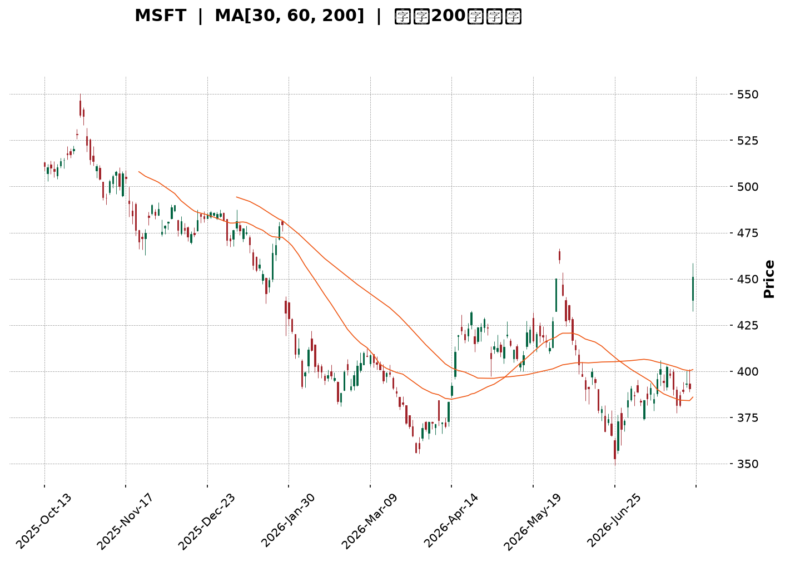
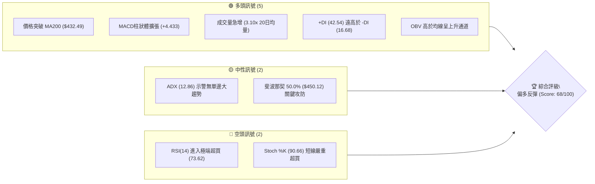
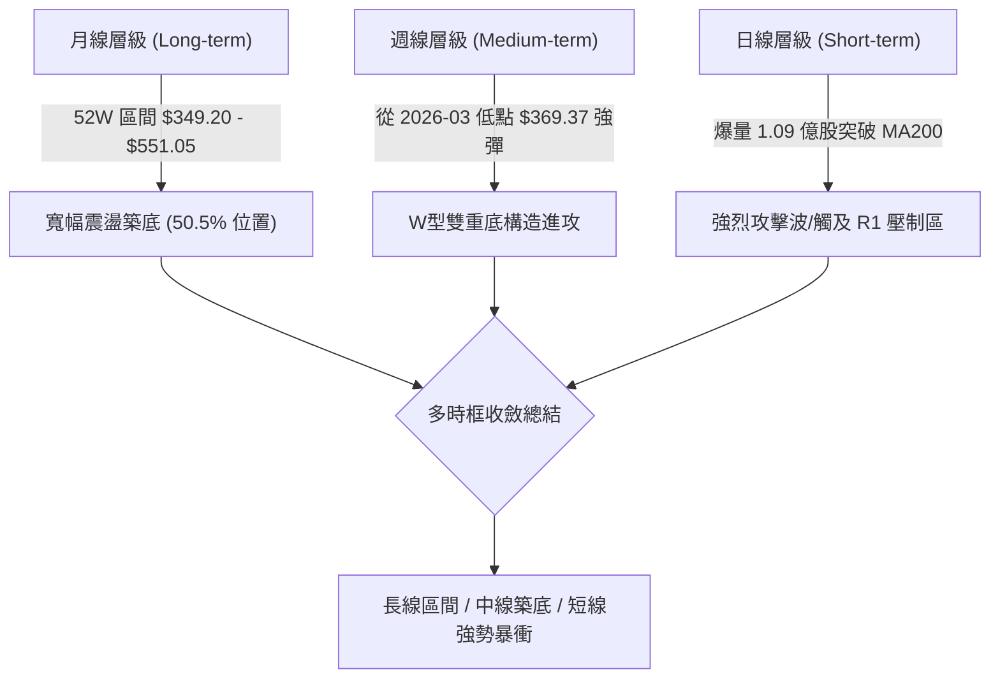
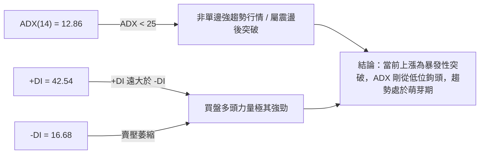
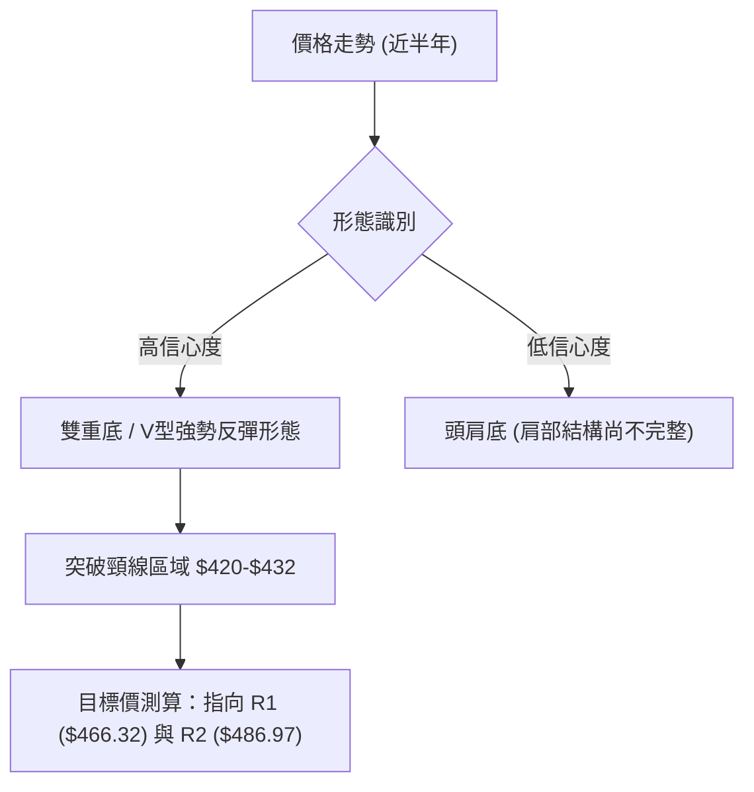
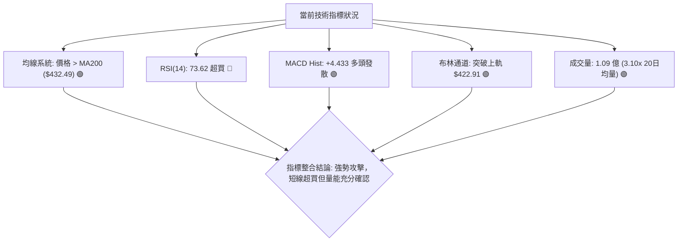
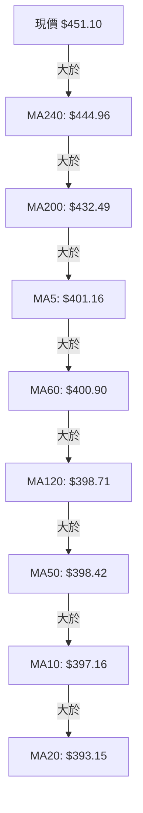
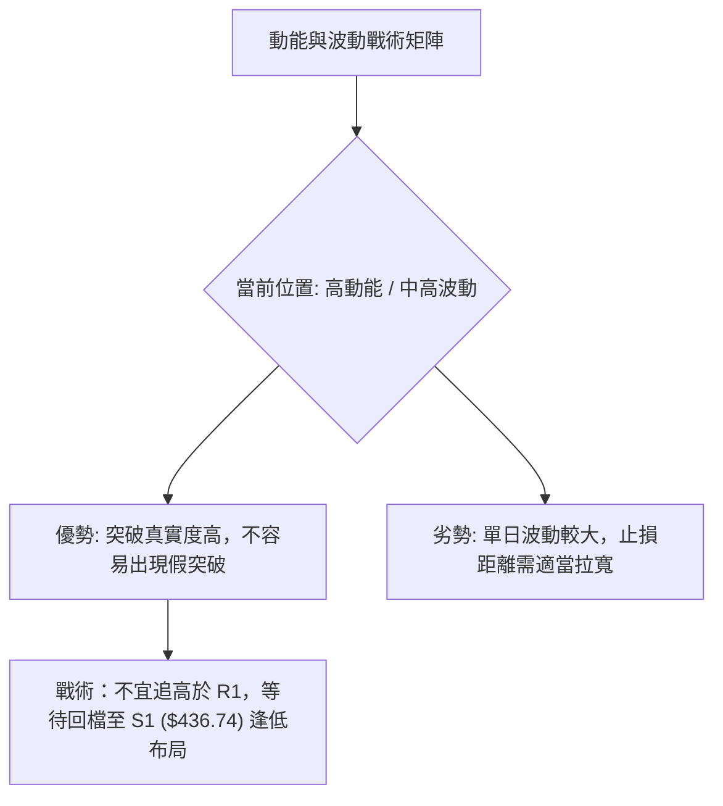
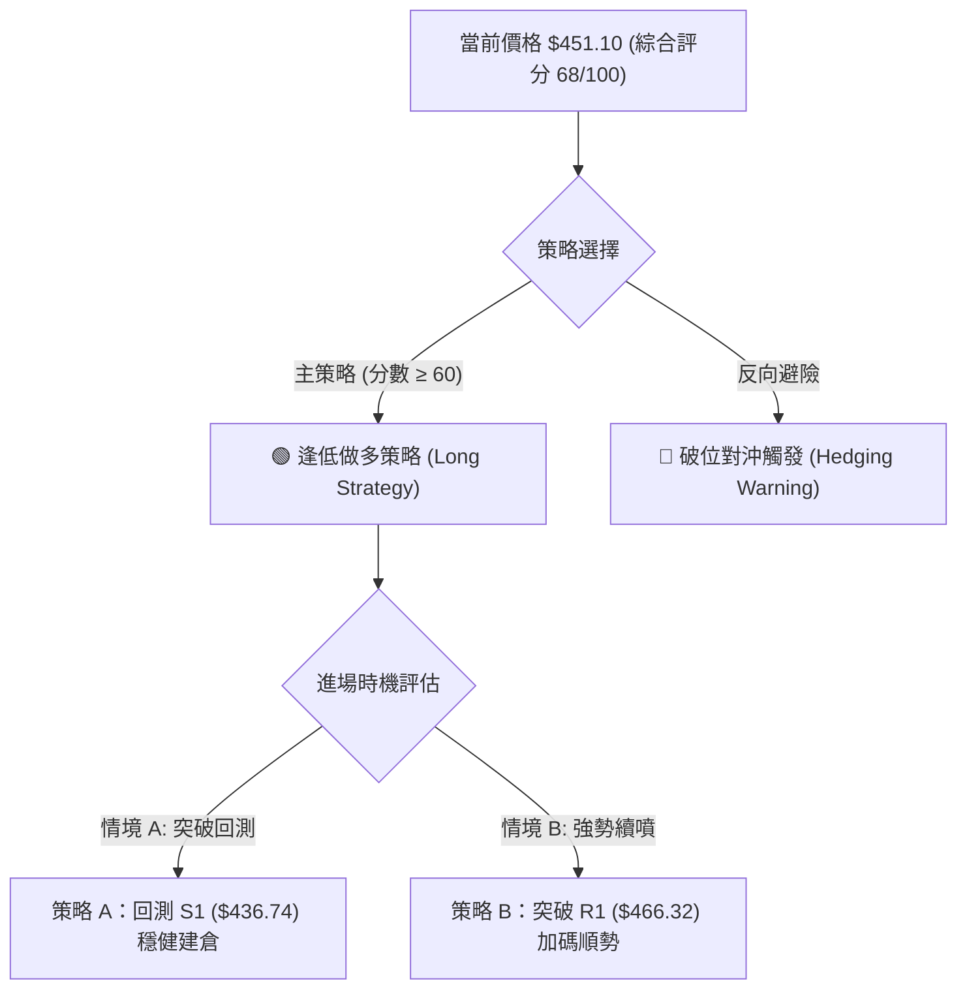
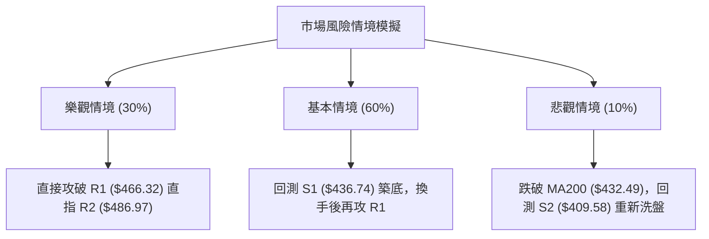

<details markdown="1">
<summary>📊 靜態圖表 (點擊展開)</summary>



</details>

<html>
<head><meta charset="utf-8" /></head>
<body>
    <div style="height:500px; width:100%;">                        <script>window.PlotlyConfig = {MathJaxConfig: 'local'};</script>
        <script charset="utf-8" src="https://cdn.plot.ly/plotly-3.7.0.min.js" integrity="sha256-jvTGqxNp8AGWEcvNLVuKr+8j5dGe9Yw51LQkmDH+IYA=" crossorigin="anonymous"></script>                <div id="candlestick-chart" class="plotly-graph-div" style="height:100%; width:100%;"></div>            <script>                window.PLOTLYENV=window.PLOTLYENV || {};                                if (document.getElementById("candlestick-chart")) {                    Plotly.newPlot(                        "candlestick-chart",                        [{"close":{"dtype":"f8","bdata":"AAAAwAntf0AAAAAAaOV\u002fQAAAACAu439AAAAAYD7Gf0AAAAAAkeV\u002fQAAAAABNDIBAAAAAoDcTgEAAAADAHCqAQAAAAIBFKoBAAAAAgIRCgEAAAABgZoGAQAAAAMBE1YBAAAAAgCLRgEAAAAAAnFOAQAAAAOBoFIBAAAAAgDUOgEAAAACgffF\u002fQAAAAOB9f39AAAAAgIvffkAAAADgF9t+QAAAAGAMbX9AAAAAoKiXf0AAAACAxb5\u002fQAAAACD2QX9AAAAAAIKvf0AAAAAAvYR\u002fQAAAACDrqn5AAAAAoN5AfkAAAAAg8cR9QAAAAOBtYH1AAAAAYGB+fUAAAADgAK59QAAAAGCPNX5AAAAAQEKdfkAAAADgT0l+QAAAAMA9fX5AAAAAoMq5fUAAAACgVOt9QAAAAEBJEH5AAAAAIH2NfkAAAADgap1+QAAAACADx31AAAAAYDkVfkAAAADgiMZ9QAAAACBwi31AAAAAYHKkfUAAAABAJaB9QAAAACBZHX5AAAAAIEA8fkAAAABgUix+QAAAAKAQS35AAAAAgLNdfkAAAACAw1h+QAAAAAAMT35AAAAAoBlVfkAAAAAgnRd+QAAAAMB9bX1AAAAAwA5sfUAAAABgN8Z9QAAAAGA5FX5AAAAAINi\u002ffUAAAABAe9J9QAAAAMAHsX1AAAAAIFVJfUAAAABgfpV8QAAAAKAqanxAAAAAoCOdfEAAAADgE0h8QAAAAIBBontAAAAA4DwSfEAAAACgJf58QAAAAKAeQ31AAAAAgDDnfUAAAAAg6vd9QAAAAMA\u002f+XpAAAAA4B3GekAAAABA41d6QAAAAKAwlnlAAAAAwKjFeUAAAABgy354QAAAAODI9XhAAAAAwEK8eUAAAAAAAbd5QAAAACA8KXlAAAAAQO8AeUAAAADgpvh4QAAAAKCbsXhAAAAA4EDdeEAAAADglNl4QAAAAMDxxXhAAAAAoDn6d0AAAACAjEJ4QAAAAGC\u002f+3hAAAAAAKENeUAAAABgQn54QAAAAKAE23hAAAAAgOkweUAAAABAMEV5QAAAAMCtnHlAAAAA4DeBeUAAAAAgZ4h5QAAAACAhTnlAAAAAYBRAeUAAAAAg3Q95QAAAAEAfq3hAAAAAwF7xeEAAAACgv+h4QAAAAKAXb3hAAAAAIN5CeEAAAAAgt9B3QAAAAKDB4ndAAAAAYPM+d0AAAABgzyN3QAAAAIDd0nZAAAAAoPs\u002fdkAAAACA8mJ2QAAAAIDrFXdAAAAAwCUJd0AAAAAgckp3QAAAAKAvQXdAAAAAQMQ3d0AAAAAAVlh3QAAAAEA4RHdAAAAAgBghd0AAAAAAofh3QAAAAKAqhHhAAAAA4EyleUAAAADAoDV6QAAAAEAFXnpAAAAA4KkSekAAAACg5HN6QAAAAADA\u002f3pAAAAAoJ\u002fteUAAAACgPHt6QAAAACBufnpAAAAAICjFekAAAACgrnh6QAAAACBhbnlAAAAAgLXYeUAAAAAAnst5QAAAAODap3lAAAAAoAvReUAAAAAgxT16QAAAAMCQ43lAAAAAYEq8eUAAAAAgOG55QAAAACBZRXlAAAAA4LiIeUAAAABgIVB6QAAAAKD+aXpAAAAAQEkIekAAAABgZkJ6QAAAAKBwMXpAAAAAwB4pekAAAADgegB6QAAAAGC4ynlAAAAAANevekAAAAAA1yN8QAAAAOBRyHxAAAAAwPWUe0AAAACgcLV6QAAAAMDMwHpAAAAAYLgKekAAAAAA17t5QAAAAGCPNnlAAAAAgMLVeEAAAACgcGV4QAAAAADXa3hAAAAAACn8eEAAAACgR514QAAAAGCPrndAAAAAYGa2d0AAAACgcPV2QAAAAEAKX3dAAAAAIFzXdkAAAACgRw12QAAAACCFT3dAAAAAwB4Jd0AAAADgUVB3QAAAAOB6BHhAAAAAANdneEAAAAAA1yt4QAAAAKBwTXhAAAAAoHD1d0AAAACAwgV4QAAAAKCZEXhAAAAAANdveEAAAABA4Q54QAAAAIAUunhAAAAAoJkReUAAAADAHp14QAAAAOCjJHlAAAAAAADceEAAAACgcGV4QAAAAKBH2XdAAAAAQDPbd0AAAACgmVF4QAAAAKCZlXhAAAAA4KNoeEAAAACgmTF8QA=="},"high":{"dtype":"f8","bdata":"5N4itUcJgEB\u002f1qkVTACAQDLHmRl7D4BAKAxrJscMgEA+iw8j4wGAQB8NtiF8G4BAY4Nk2WcbgEAqLTVtZU+AQKAPkY44RYBAT2zOkllQgEDpc3vPuZmAQCULmrjhMYFAudY4Sqj2gEDnqQ1L05yAQCTQDgbpb4BAc79S6j9NgECH+6+WcQKAQJjpkIhw+X9AGUukb0dof0D7bFiiywN\u002fQEZ3rxaQen9AGGy8SEmmf0AJUX62Msd\u002fQDKk3A5L5H9AIL82xRXGf0CE7P8lWs5\u002fQOM0b3oIPX9AH6QbWS3BfkB23gCwG7Z+QHeYQkO\u002fzH1A4ZBhFpKsfUDmpD4GadB9QPTmgxhSYn5AEWq3fSKnfkBePWO3Ant+QKEO6jD+tH5AQq+iR30hfkBRRnYI+vJ9QK5+TeQbFH5Ao8tzweChfkAzdxSvAp9+QFMiewumIX5A+BzDogA+fkBB7jsQ+gR+QKqrgFtr6X1A\u002f6OnIle8fUCbyjJK8919QFmtGJHedn5ANIOZU\u002f5afkBsM8XvAml+QMsHNtSsWn5Ahn0oTNxvfkCmLvNtS19+QIx830z1Yn5ACwqIzCR4fkA0rgALnV9+QFDEwQouKH5A4Al8ZlmffUCCKNgy4cl9QBiuJF12eH5AlmxlX1IIfkC094xRFdt9QCqtp0+47X1AnXs11LqafUAHKzP1\u002fCF9QA5APmsR43xANMU45y7SfEAixHtYZWx8QARFB3DtKnxAbZTtIFEtfEAzHvZ5LlB9QLHCsqdbgn1AM1YYyqoLfkACospOhhl+QLXT8U+ciHtAOPmPjmpae0DyHNrpSM16QK9IyWXcQnpAiRYQYAUfekB6JkkS1md5QEqRPHIjAHlAlfLhMs\u002fQeUD8fAFV01x6QEQR+DHR6XlAl+ORsmJGeUBPd6Rd3zt5QD3uB4no63hAXH8XP2cMeUC5VP4m5Th5QLeiy4oV9HhAcRXVmBaoeEDWPzfQS0h4QOueaiyjCXlAQk8xzL9peUCXvPsBZr94QHOwKMEqBXlAZqeK+iJdeUAsIvlDRKJ5QEZ0cMSGq3lA9PlCS4TCeUDdyw\u002fLLJV5QDheNhIElXlAjD2dUASCeUDzhgpq4FN5QKCK6l3NPnlAUZj\u002f+jn8eECZMZJzajh5QFoP9cY80nhAOOJBiER6eEAsMJ82niJ4QOSVhXv4JXhA9SHVXUvad0BtmM7164N3QAdhKQuQXndAXw7vt6qadkBbwmM4IMl2QMAfUFWBQXdA0bFLWuhSd0DX7QfoUU13QOFktbnBTndAsLhmNVI6d0D2bCXsrwJ4QNJFkLEVS3dAI2toRkBtd0CRXrneV\u002ft3QOffb2NknXhAW0mBXZfXeUBjIvKKkT56QLYwdTBb6npATubpL6RmekBc5jXEG6R6QIC9W\u002fgzDHtA9TRJ+uhrekDD3x10gYB6QDp1fZr9onpANu2ckdrPekAf7K5bXJ56QKDCpNhj2HlAxWBPHVYDekDoKAf+7T16QFyUtXIR\u002fnlAmiO+ZEAYekBgvt6M4bB6QKT\u002fsK2aG3pAzlQE\u002fMS8eUAXpBrSoel5QLzhNAPpVnlAapGC6jKveUCBjC0M6rN6QDXBgEM4g3pAZIuo3Dz8ekCayyALAVN6QAAAAKBwpXpAAAAAYGaGekAAAADgUTx6QAAAAEAK\u002f3lAAAAAANfXekAAAACgRyV8QAAAAMAeJX1AAAAAAABYfEAAAACAPYZ7QAAAAGBmQntAAAAAIIXXekAAAABgjxJ6QAAAACCuv3lAAAAA4KNQeUAAAACgmc14QAAAAADXe3hAAAAAAAAceUAAAACgcM14QAAAAIDrZXhAAAAAgOvVd0AAAACAFNp3QAAAACCFk3dAAAAAgBSud0AAAAAgrsN2QAAAAIDCiXdAAAAAAADId0AAAABgZmJ3QAAAAKBHTXhAAAAAQDODeEAAAABgZlJ4QAAAAMAeuXhAAAAAwPUUeEAAAABgZgp4QAAAAGCPfnhAAAAAYGaaeEAAAABACkN4QAAAACBc73hAAAAAANdfeUAAAACAPeZ4QAAAAEDhMnlAAAAAIIUXeUAAAAAAABB5QAAAAOB6fHhAAAAA4HpQeEAAAABAM6N4QAAAAMAeBXlAAAAAAAAUeUAAAABACqt8QA=="},"hovertemplate":"\u003cb\u003e%{x|%Y-%m-%d}\u003c\u002fb\u003e\u003cbr\u003e\u958b: $%{open:.2f}\u003cbr\u003e\u9ad8: $%{high:.2f}\u003cbr\u003e\u4f4e: $%{low:.2f}\u003cbr\u003e\u6536: $%{close:.2f}\u003cextra\u003e\u003c\u002fextra\u003e","low":{"dtype":"f8","bdata":"b2XIV1vHf0DYVYhjDG1\u002fQBzz+EqlrH9A\u002fLazFOqOf0BK9uyf4IF\u002fQNMoAR0u439ABhCU1\u002frcf0AdmoR5nROAQK9+HALFGoBAvsaWwHYrgECasNI5cm2AQGQeWSHvyoBAcOulP9GqgEBSTn8qrDaAQMyDv1u7\u002fX9AAmX8pZ\u002f1f0D8ANrLTYp\u002fQOELnBNFdn9A43Hn4AjLfkAD0MwmVaJ+QDH77rmS+n5AWc88LAQzf0BJAB9Zqf9+QIluRq4pIn9AMgRAaPPkfkD6Jqrht1t\u002fQAJXntN2O35AF4pAVqn8fUD0gikVRZZ9QAOiXioaI31AXTIj2B4ffUApdTccQ+18QDy3WLYQ8X1APXoT9uBHfkBOmDo0BSh+QByx2VOfQn5AWTzCsX2RfUAW6OD+CaZ9QBXSZxkczH1AGPZrVLgjfkBG2CLsWGV+QIrbYjKUj31A6YRl8gCcfUARahxlpqN9QB6vjwTNZn1A9nJ3b61MfUApQ8IWTo59QAy+5hdXvH1AedPvCZ0FfkBS7A6\u002fzAh+QPdqKVF0KX5APHgULuMqfkAbxIFH4zx+QHro2qaIIH5AwnPZdI81fkBDZ6wvhBJ+QOqO91s1QX1AL7Pl9bE2fUBpQWN0rTp9QDB6BL5LvX1AE2YJ\u002fACcfUDHcTIytGF9QKpfXv0imX1AT53LtiX+fEDSX+VhSnJ8QEnwK20PXnxAgsUFoUxnfEDgkUIInPR7QEqvs9vCS3tAYKkHk6ere0BVhctGhQh8QILzOR06v3xA0SRi\u002fv5wfUCTkrKLF759QJHcQkJ0MnpA0lrW+\u002fKIekAAJrYWDEZ6QG8umF\u002f6a3lArnrTY892eUBqLRVESml4QM2oDAbZcnhAlOODzHvxeEDT4MK57K15QPameKS283hARcBbLe3DeEDKMv1BkMR4QDBO3E9+jHhAXsCckAGpeEBYmmL4AL14QI++\u002flLlpHhAgQe4QFrkd0CFPlIoKc53QMz1I4sRVXhA1Eo6QQ3eeEAhTjcxmVB4QMqFYnySXHhALS+HTSR9eEDkMdgJHvd4QJZIz3dqOHlAU0y\u002fuwh6eUC9WEsRDCp5QLuuSm3yIHlAed3Kn40LeUBb3OkTeA15QJqz\u002fgFelnhAcemdDf2eeEDuGvDxPs54QCPyT756YnhA2Eu\u002fWZMjeEDOvMSdxrR3QG4kVo+uzXdAbTDi4L0wd0BcUkd7TA13QMy2mIdpxnZAejQqDdU7dkBuQmD5KDh2QK0sDLqQpHZAnPhh23f2dkBuMFfKzrV2QFoazAs5C3dAopNL2UjcdkAzvB6Ztyl3QOb\u002fYoob5HZAFVSPT68Td0A8NR2NfSN3QDBT81X0GnhAAU4eJfa9eEC7wVoh\u002fbN5QG3y9TZ+PHpArRkxi2f2eUDx3HocxgR6QLEec+IRbHpAB61Va1WoeUB1ztzza+55QIKj67qyAnpAk7GckM9PekCT9RlKGzZ6QGSQY7xl0nhAvRTD6NiYeUDHgLA2mJ55QLc6wPapfnlAnqTLV8BDeUBc\u002f\u002fMKrh16QIPcGyqv0XlAVr\u002f2YfpJeUBC5MTALVx5QK2+i+CcAnlAaq\u002fEzzcAeUBniZYiSMB5QNi2rHJj63lAsV2bG3D5eUC4Ny3Gk6Z5QAAAACBc+3lAAAAAoEcFekAAAADgUdB5QAAAAKBHmXlAAAAAYLjKeUAAAACAwgV7QAAAAOBRpHxAAAAAQOGGe0AAAAAAAIR6QAAAAGCPpnpAAAAAYGbmeUAAAADA9Yh5QAAAACCu53hAAAAAYI\u002fSeEAAAAAAAAB4QAAAAOBR5HdAAAAAoJmNeEAAAABACmt4QAAAAMAelXdAAAAA4HpUd0AAAADAHvF2QAAAAGC4KndAAAAA4HrMdkAAAABAM9N1QAAAAEDhNnZAAAAAYGZ+dkAAAABAM\u002fd2QAAAAIA9bndAAAAAQDP7d0AAAAAghdN3QAAAACCFQ3hAAAAAoEfVd0AAAACgmVV3QAAAAAAA2HdAAAAAYGYCeEAAAABgZqp3QAAAAGBmJnhAAAAAwMyAeEAAAACAPVZ4QAAAAGBmWnhAAAAAwB7FeEAAAAAgXC94QAAAAIA9lndAAAAAYGbKd0AAAAAA1z94QAAAAMDMdHhAAAAAANdLeEAAAABACgd7QA=="},"name":"\u50f9\u683c","open":{"dtype":"f8","bdata":"5N4itUcJgEBv2Rl5TbB\u002fQJm1Iq+B+39AjYSsnqrVf0BYkZAnYp1\u002fQCwmEvLw9X9Ao9vVD\u002fIRgEBtmCJD9i6AQKYY00JgOYBAUsuosf87gEAr0ReGd4OAQOZDwSpPFIFAzm6fjhXsgEAgoBuqIXmAQPMP35FpbIBAgeJCC08kgECrMo8foch\u002fQDSTbvkc4X9A95Spl6Rnf0A1CBYGKd1+QHHw2uJJDn9A8u2NJPhZf0CoL5BieKJ\u002fQOx2IAqTsX9AyRTr6oLxfkDm5LCAAJR\u002fQAGeigUKxH5AKfKR7j9wfkANghuuaKh+QEVv3oMOxn1AXPcnN06OfUBo79ymfX99QNmSYGp2Qn5AbxWV9QJXfkAa18ZAZGR+QP55U3D+SH5A8hD+2lSjfUB4e8icINp9QADGYV8XBn5AxeVzEdgrfkBL9cGm525+QDdGQeokHn5ARRai9kSofUCHyt9SFdt9QPiwzB2L331AP80bmxVdfUCg2VHHuqx9QCxFSGUewX1Aw\u002fSrGTBTfkAWMW21bz9+QEH0VhVHLX5Aj0V3Xm04fkAPcNyo1Uh+QF7Voo1dK35AYJLc5Wg8fkCq7b+d1Vp+QE5s6RHhI35AJ+zZ5lR\u002ffUBf1GioMHt9QJZHeZ8g2n1A4WznyLPxfUAKdkzrVH99QElP2SLoqH1ABuUFLjWJfUBdBEduRQZ9QLTMnUf\u002f4HxAoFQtnc18fEAUY1sNgxN8QCt0anJ+KXxAq11GzCrae0B1xTmR3R18QCwnPsHz83xAPgf3D5l5fUCxNLoOFRF+QEVyt+SgYHtALmqQHZFTe0DAc0n+UcV6QBcEpF85QnpAbXnRbdiSeUA+9UswI1p5QJ\u002f2W4Zn1nhAvjbapeEweUA6HYBPJxx6QNjJrGdb5XlAKDtZPUUzeUBOwuyIgip5QHJSiWQz13hAsW39cdbFeECmeW1CL\u002f14QEcMLAoQtHhAk\u002f6jSFeieEAiXIAF9fR3QBZEqMT5WnhAcFYoiF09eUCKgwtXkGB4QGD6xL4sgHhAooxnRKWEeECFJkuqcQZ5QDbycEq8OHlAkM0Q4AyFeUAe0z\u002fft0B5QHjAfTNNknlAjlpShBhLeUCcc6GaFjx5QJPTVkEiAnlAoxx55FrTeEAE6xSDevZ4QDXciPpYxHhAMwx1UBxUeEC0o37yQx94QABAeggg8XdAOZQmt4nYd0C6LAjTr4F3QADzJDFMIHdAgZRituKRdkBHYmS54pF2QMnqHKAxvHZAL7thx+xKd0D6JMRzqeZ2QHtPpbnsSndAd0UZQ6IYd0DQvXE5XgJ4QKrAu4seO3dAjM9hcshCd0D9WMs\u002f10x3QLVaR3FOMXhA\u002fusTxzzSeEAsy4bKPS96QHj7rydufnpA4DMuPNZDekDdYGTzTjV6QN+Yn3NNlHpAx43debgvekDaFWL4GQF6QNckfnl5V3pAj0DRTXB6ekDEiBAQmXp6QNdJhy3BnnlA4+uVhIa+eUClSKjJaKp5QL5jSz\u002fC5nlAbh95QuRxeUCrE66XOzN6QLoHu6fOB3pA3c0X59BveUCCT5\u002f5WNl5QCTv8ApCJXlAiEuGkbE5eUD705KY\u002ftV5QPOW1YGD+3lAr1YGxojPekCsrhz+ZdR5QAAAAAAAjHpAAAAA4KM4ekAAAABA4QZ6QAAAAAApsHlAAAAAIK7PeUAAAADAzAh7QAAAAKBwDX1AAAAAgBTue0AAAABAM2d7QAAAAMD1PHtAAAAAoHDFekAAAACAPeJ5QAAAAOB6kHlAAAAAwMzoeEAAAAAgXLN4QAAAAEDhdnhAAAAAwMzMeEAAAADgo7x4QAAAAAAAZHhAAAAAwB6dd0AAAAAA13t3QAAAAIAURndAAAAAwB45d0AAAADgUax2QAAAAGBmUnZAAAAAAACYd0AAAADgejB3QAAAAKBHzXdAAAAAIK4HeEAAAADgozB4QAAAAADXh3hAAAAA4HoAeEAAAABAM2d3QAAAAMDMPHhAAAAAAAA8eEAAAADAHu13QAAAAMDMPHhAAAAAwPXkeEAAAACAwq14QAAAAGCPdnhAAAAAwPXseEAAAACgR\u002fl4QAAAACCFX3hAAAAAwMwweEAAAACgR2F4QAAAAGCPknhAAAAAYGaWeEAAAAAAAGh7QA=="},"x":["2025-10-13T00:00:00-04:00","2025-10-14T00:00:00-04:00","2025-10-15T00:00:00-04:00","2025-10-16T00:00:00-04:00","2025-10-17T00:00:00-04:00","2025-10-20T00:00:00-04:00","2025-10-21T00:00:00-04:00","2025-10-22T00:00:00-04:00","2025-10-23T00:00:00-04:00","2025-10-24T00:00:00-04:00","2025-10-27T00:00:00-04:00","2025-10-28T00:00:00-04:00","2025-10-29T00:00:00-04:00","2025-10-30T00:00:00-04:00","2025-10-31T00:00:00-04:00","2025-11-03T00:00:00-05:00","2025-11-04T00:00:00-05:00","2025-11-05T00:00:00-05:00","2025-11-06T00:00:00-05:00","2025-11-07T00:00:00-05:00","2025-11-10T00:00:00-05:00","2025-11-11T00:00:00-05:00","2025-11-12T00:00:00-05:00","2025-11-13T00:00:00-05:00","2025-11-14T00:00:00-05:00","2025-11-17T00:00:00-05:00","2025-11-18T00:00:00-05:00","2025-11-19T00:00:00-05:00","2025-11-20T00:00:00-05:00","2025-11-21T00:00:00-05:00","2025-11-24T00:00:00-05:00","2025-11-25T00:00:00-05:00","2025-11-26T00:00:00-05:00","2025-11-28T00:00:00-05:00","2025-12-01T00:00:00-05:00","2025-12-02T00:00:00-05:00","2025-12-03T00:00:00-05:00","2025-12-04T00:00:00-05:00","2025-12-05T00:00:00-05:00","2025-12-08T00:00:00-05:00","2025-12-09T00:00:00-05:00","2025-12-10T00:00:00-05:00","2025-12-11T00:00:00-05:00","2025-12-12T00:00:00-05:00","2025-12-15T00:00:00-05:00","2025-12-16T00:00:00-05:00","2025-12-17T00:00:00-05:00","2025-12-18T00:00:00-05:00","2025-12-19T00:00:00-05:00","2025-12-22T00:00:00-05:00","2025-12-23T00:00:00-05:00","2025-12-24T00:00:00-05:00","2025-12-26T00:00:00-05:00","2025-12-29T00:00:00-05:00","2025-12-30T00:00:00-05:00","2025-12-31T00:00:00-05:00","2026-01-02T00:00:00-05:00","2026-01-05T00:00:00-05:00","2026-01-06T00:00:00-05:00","2026-01-07T00:00:00-05:00","2026-01-08T00:00:00-05:00","2026-01-09T00:00:00-05:00","2026-01-12T00:00:00-05:00","2026-01-13T00:00:00-05:00","2026-01-14T00:00:00-05:00","2026-01-15T00:00:00-05:00","2026-01-16T00:00:00-05:00","2026-01-20T00:00:00-05:00","2026-01-21T00:00:00-05:00","2026-01-22T00:00:00-05:00","2026-01-23T00:00:00-05:00","2026-01-26T00:00:00-05:00","2026-01-27T00:00:00-05:00","2026-01-28T00:00:00-05:00","2026-01-29T00:00:00-05:00","2026-01-30T00:00:00-05:00","2026-02-02T00:00:00-05:00","2026-02-03T00:00:00-05:00","2026-02-04T00:00:00-05:00","2026-02-05T00:00:00-05:00","2026-02-06T00:00:00-05:00","2026-02-09T00:00:00-05:00","2026-02-10T00:00:00-05:00","2026-02-11T00:00:00-05:00","2026-02-12T00:00:00-05:00","2026-02-13T00:00:00-05:00","2026-02-17T00:00:00-05:00","2026-02-18T00:00:00-05:00","2026-02-19T00:00:00-05:00","2026-02-20T00:00:00-05:00","2026-02-23T00:00:00-05:00","2026-02-24T00:00:00-05:00","2026-02-25T00:00:00-05:00","2026-02-26T00:00:00-05:00","2026-02-27T00:00:00-05:00","2026-03-02T00:00:00-05:00","2026-03-03T00:00:00-05:00","2026-03-04T00:00:00-05:00","2026-03-05T00:00:00-05:00","2026-03-06T00:00:00-05:00","2026-03-09T00:00:00-04:00","2026-03-10T00:00:00-04:00","2026-03-11T00:00:00-04:00","2026-03-12T00:00:00-04:00","2026-03-13T00:00:00-04:00","2026-03-16T00:00:00-04:00","2026-03-17T00:00:00-04:00","2026-03-18T00:00:00-04:00","2026-03-19T00:00:00-04:00","2026-03-20T00:00:00-04:00","2026-03-23T00:00:00-04:00","2026-03-24T00:00:00-04:00","2026-03-25T00:00:00-04:00","2026-03-26T00:00:00-04:00","2026-03-27T00:00:00-04:00","2026-03-30T00:00:00-04:00","2026-03-31T00:00:00-04:00","2026-04-01T00:00:00-04:00","2026-04-02T00:00:00-04:00","2026-04-06T00:00:00-04:00","2026-04-07T00:00:00-04:00","2026-04-08T00:00:00-04:00","2026-04-09T00:00:00-04:00","2026-04-10T00:00:00-04:00","2026-04-13T00:00:00-04:00","2026-04-14T00:00:00-04:00","2026-04-15T00:00:00-04:00","2026-04-16T00:00:00-04:00","2026-04-17T00:00:00-04:00","2026-04-20T00:00:00-04:00","2026-04-21T00:00:00-04:00","2026-04-22T00:00:00-04:00","2026-04-23T00:00:00-04:00","2026-04-24T00:00:00-04:00","2026-04-27T00:00:00-04:00","2026-04-28T00:00:00-04:00","2026-04-29T00:00:00-04:00","2026-04-30T00:00:00-04:00","2026-05-01T00:00:00-04:00","2026-05-04T00:00:00-04:00","2026-05-05T00:00:00-04:00","2026-05-06T00:00:00-04:00","2026-05-07T00:00:00-04:00","2026-05-08T00:00:00-04:00","2026-05-11T00:00:00-04:00","2026-05-12T00:00:00-04:00","2026-05-13T00:00:00-04:00","2026-05-14T00:00:00-04:00","2026-05-15T00:00:00-04:00","2026-05-18T00:00:00-04:00","2026-05-19T00:00:00-04:00","2026-05-20T00:00:00-04:00","2026-05-21T00:00:00-04:00","2026-05-22T00:00:00-04:00","2026-05-26T00:00:00-04:00","2026-05-27T00:00:00-04:00","2026-05-28T00:00:00-04:00","2026-05-29T00:00:00-04:00","2026-06-01T00:00:00-04:00","2026-06-02T00:00:00-04:00","2026-06-03T00:00:00-04:00","2026-06-04T00:00:00-04:00","2026-06-05T00:00:00-04:00","2026-06-08T00:00:00-04:00","2026-06-09T00:00:00-04:00","2026-06-10T00:00:00-04:00","2026-06-11T00:00:00-04:00","2026-06-12T00:00:00-04:00","2026-06-15T00:00:00-04:00","2026-06-16T00:00:00-04:00","2026-06-17T00:00:00-04:00","2026-06-18T00:00:00-04:00","2026-06-22T00:00:00-04:00","2026-06-23T00:00:00-04:00","2026-06-24T00:00:00-04:00","2026-06-25T00:00:00-04:00","2026-06-26T00:00:00-04:00","2026-06-29T00:00:00-04:00","2026-06-30T00:00:00-04:00","2026-07-01T00:00:00-04:00","2026-07-02T00:00:00-04:00","2026-07-06T00:00:00-04:00","2026-07-07T00:00:00-04:00","2026-07-08T00:00:00-04:00","2026-07-09T00:00:00-04:00","2026-07-10T00:00:00-04:00","2026-07-13T00:00:00-04:00","2026-07-14T00:00:00-04:00","2026-07-15T00:00:00-04:00","2026-07-16T00:00:00-04:00","2026-07-17T00:00:00-04:00","2026-07-20T00:00:00-04:00","2026-07-21T00:00:00-04:00","2026-07-22T00:00:00-04:00","2026-07-23T00:00:00-04:00","2026-07-24T00:00:00-04:00","2026-07-27T00:00:00-04:00","2026-07-28T00:00:00-04:00","2026-07-29T00:00:00-04:00","2026-07-30T00:00:00-04:00"],"type":"candlestick"},{"hovertemplate":"MA30: $%{y:.2f}\u003cextra\u003e\u003c\u002fextra\u003e","line":{"color":"#2196F3","dash":"dash","width":2},"mode":"lines","name":"MA30","x":["2025-10-13T00:00:00-04:00","2025-10-14T00:00:00-04:00","2025-10-15T00:00:00-04:00","2025-10-16T00:00:00-04:00","2025-10-17T00:00:00-04:00","2025-10-20T00:00:00-04:00","2025-10-21T00:00:00-04:00","2025-10-22T00:00:00-04:00","2025-10-23T00:00:00-04:00","2025-10-24T00:00:00-04:00","2025-10-27T00:00:00-04:00","2025-10-28T00:00:00-04:00","2025-10-29T00:00:00-04:00","2025-10-30T00:00:00-04:00","2025-10-31T00:00:00-04:00","2025-11-03T00:00:00-05:00","2025-11-04T00:00:00-05:00","2025-11-05T00:00:00-05:00","2025-11-06T00:00:00-05:00","2025-11-07T00:00:00-05:00","2025-11-10T00:00:00-05:00","2025-11-11T00:00:00-05:00","2025-11-12T00:00:00-05:00","2025-11-13T00:00:00-05:00","2025-11-14T00:00:00-05:00","2025-11-17T00:00:00-05:00","2025-11-18T00:00:00-05:00","2025-11-19T00:00:00-05:00","2025-11-20T00:00:00-05:00","2025-11-21T00:00:00-05:00","2025-11-24T00:00:00-05:00","2025-11-25T00:00:00-05:00","2025-11-26T00:00:00-05:00","2025-11-28T00:00:00-05:00","2025-12-01T00:00:00-05:00","2025-12-02T00:00:00-05:00","2025-12-03T00:00:00-05:00","2025-12-04T00:00:00-05:00","2025-12-05T00:00:00-05:00","2025-12-08T00:00:00-05:00","2025-12-09T00:00:00-05:00","2025-12-10T00:00:00-05:00","2025-12-11T00:00:00-05:00","2025-12-12T00:00:00-05:00","2025-12-15T00:00:00-05:00","2025-12-16T00:00:00-05:00","2025-12-17T00:00:00-05:00","2025-12-18T00:00:00-05:00","2025-12-19T00:00:00-05:00","2025-12-22T00:00:00-05:00","2025-12-23T00:00:00-05:00","2025-12-24T00:00:00-05:00","2025-12-26T00:00:00-05:00","2025-12-29T00:00:00-05:00","2025-12-30T00:00:00-05:00","2025-12-31T00:00:00-05:00","2026-01-02T00:00:00-05:00","2026-01-05T00:00:00-05:00","2026-01-06T00:00:00-05:00","2026-01-07T00:00:00-05:00","2026-01-08T00:00:00-05:00","2026-01-09T00:00:00-05:00","2026-01-12T00:00:00-05:00","2026-01-13T00:00:00-05:00","2026-01-14T00:00:00-05:00","2026-01-15T00:00:00-05:00","2026-01-16T00:00:00-05:00","2026-01-20T00:00:00-05:00","2026-01-21T00:00:00-05:00","2026-01-22T00:00:00-05:00","2026-01-23T00:00:00-05:00","2026-01-26T00:00:00-05:00","2026-01-27T00:00:00-05:00","2026-01-28T00:00:00-05:00","2026-01-29T00:00:00-05:00","2026-01-30T00:00:00-05:00","2026-02-02T00:00:00-05:00","2026-02-03T00:00:00-05:00","2026-02-04T00:00:00-05:00","2026-02-05T00:00:00-05:00","2026-02-06T00:00:00-05:00","2026-02-09T00:00:00-05:00","2026-02-10T00:00:00-05:00","2026-02-11T00:00:00-05:00","2026-02-12T00:00:00-05:00","2026-02-13T00:00:00-05:00","2026-02-17T00:00:00-05:00","2026-02-18T00:00:00-05:00","2026-02-19T00:00:00-05:00","2026-02-20T00:00:00-05:00","2026-02-23T00:00:00-05:00","2026-02-24T00:00:00-05:00","2026-02-25T00:00:00-05:00","2026-02-26T00:00:00-05:00","2026-02-27T00:00:00-05:00","2026-03-02T00:00:00-05:00","2026-03-03T00:00:00-05:00","2026-03-04T00:00:00-05:00","2026-03-05T00:00:00-05:00","2026-03-06T00:00:00-05:00","2026-03-09T00:00:00-04:00","2026-03-10T00:00:00-04:00","2026-03-11T00:00:00-04:00","2026-03-12T00:00:00-04:00","2026-03-13T00:00:00-04:00","2026-03-16T00:00:00-04:00","2026-03-17T00:00:00-04:00","2026-03-18T00:00:00-04:00","2026-03-19T00:00:00-04:00","2026-03-20T00:00:00-04:00","2026-03-23T00:00:00-04:00","2026-03-24T00:00:00-04:00","2026-03-25T00:00:00-04:00","2026-03-26T00:00:00-04:00","2026-03-27T00:00:00-04:00","2026-03-30T00:00:00-04:00","2026-03-31T00:00:00-04:00","2026-04-01T00:00:00-04:00","2026-04-02T00:00:00-04:00","2026-04-06T00:00:00-04:00","2026-04-07T00:00:00-04:00","2026-04-08T00:00:00-04:00","2026-04-09T00:00:00-04:00","2026-04-10T00:00:00-04:00","2026-04-13T00:00:00-04:00","2026-04-14T00:00:00-04:00","2026-04-15T00:00:00-04:00","2026-04-16T00:00:00-04:00","2026-04-17T00:00:00-04:00","2026-04-20T00:00:00-04:00","2026-04-21T00:00:00-04:00","2026-04-22T00:00:00-04:00","2026-04-23T00:00:00-04:00","2026-04-24T00:00:00-04:00","2026-04-27T00:00:00-04:00","2026-04-28T00:00:00-04:00","2026-04-29T00:00:00-04:00","2026-04-30T00:00:00-04:00","2026-05-01T00:00:00-04:00","2026-05-04T00:00:00-04:00","2026-05-05T00:00:00-04:00","2026-05-06T00:00:00-04:00","2026-05-07T00:00:00-04:00","2026-05-08T00:00:00-04:00","2026-05-11T00:00:00-04:00","2026-05-12T00:00:00-04:00","2026-05-13T00:00:00-04:00","2026-05-14T00:00:00-04:00","2026-05-15T00:00:00-04:00","2026-05-18T00:00:00-04:00","2026-05-19T00:00:00-04:00","2026-05-20T00:00:00-04:00","2026-05-21T00:00:00-04:00","2026-05-22T00:00:00-04:00","2026-05-26T00:00:00-04:00","2026-05-27T00:00:00-04:00","2026-05-28T00:00:00-04:00","2026-05-29T00:00:00-04:00","2026-06-01T00:00:00-04:00","2026-06-02T00:00:00-04:00","2026-06-03T00:00:00-04:00","2026-06-04T00:00:00-04:00","2026-06-05T00:00:00-04:00","2026-06-08T00:00:00-04:00","2026-06-09T00:00:00-04:00","2026-06-10T00:00:00-04:00","2026-06-11T00:00:00-04:00","2026-06-12T00:00:00-04:00","2026-06-15T00:00:00-04:00","2026-06-16T00:00:00-04:00","2026-06-17T00:00:00-04:00","2026-06-18T00:00:00-04:00","2026-06-22T00:00:00-04:00","2026-06-23T00:00:00-04:00","2026-06-24T00:00:00-04:00","2026-06-25T00:00:00-04:00","2026-06-26T00:00:00-04:00","2026-06-29T00:00:00-04:00","2026-06-30T00:00:00-04:00","2026-07-01T00:00:00-04:00","2026-07-02T00:00:00-04:00","2026-07-06T00:00:00-04:00","2026-07-07T00:00:00-04:00","2026-07-08T00:00:00-04:00","2026-07-09T00:00:00-04:00","2026-07-10T00:00:00-04:00","2026-07-13T00:00:00-04:00","2026-07-14T00:00:00-04:00","2026-07-15T00:00:00-04:00","2026-07-16T00:00:00-04:00","2026-07-17T00:00:00-04:00","2026-07-20T00:00:00-04:00","2026-07-21T00:00:00-04:00","2026-07-22T00:00:00-04:00","2026-07-23T00:00:00-04:00","2026-07-24T00:00:00-04:00","2026-07-27T00:00:00-04:00","2026-07-28T00:00:00-04:00","2026-07-29T00:00:00-04:00","2026-07-30T00:00:00-04:00"],"y":{"dtype":"f8","bdata":"AAAAAAAA+H8AAAAAAAD4fwAAAAAAAPh\u002fAAAAAAAA+H8AAAAAAAD4fwAAAAAAAPh\u002fAAAAAAAA+H8AAAAAAAD4fwAAAAAAAPh\u002fAAAAAAAA+H8AAAAAAAD4fwAAAAAAAPh\u002fAAAAAAAA+H8AAAAAAAD4fwAAAAAAAPh\u002fAAAAAAAA+H8AAAAAAAD4fwAAAAAAAPh\u002fAAAAAAAA+H8AAAAAAAD4fwAAAAAAAPh\u002fAAAAAAAA+H8AAAAAAAD4fwAAAAAAAPh\u002fAAAAAAAA+H8AAAAAAAD4fwAAAAAAAPh\u002fAAAAAAAA+H8AAAAAAAD4f3d3d9cGwH9AZmZmdkWrf0AAAACgW5h\u002fQImIiIgJin9AMzMzQyOAf0C8u7tbZXJ\u002fQFVVVRWvZH9A3t3d7f5Pf0BERETEbjt\u002fQN7d3T0XKH9AAAAAUE4Xf0De3d0d3AJ\u002fQImIiPis4X5AiYiIyF\u002fDfkCamZlp0ap+QLy7u1uBlH5AmpmZiXB\u002ffkAzMzNTqWt+QM3MzEzbX35Aq6qq2mlafkCJiIh4llR+QCIiIvLrSn5Ad3d313RAfkB3d3fXhTR+QImIiPhsLH5AVVVV9eAgfkCrqqo6tRR+QERERIQgCn5AVVVVhQgDfkBVVVVlEwN+QN7d3S0aCX5AZmZm1kgLfkDe3d0dgAx+QCIiIjIVCH5A3t3dfcD8fUAiIiKCOe59QLy7u6uF3H1AMzMzowjTfUAzMzMDD8V9QFVVVQVTsH1AZmZmNiabfUAiIiKSTo19QGZmZhbpiH1AIiIiQmCHfUAiIiKiBYl9QGZmZhYVc31A3t3dzZpafUCrqqqamD59QO\u002fu7h71F31AIiIiAt\u002fxfEAzMzOTa8F8QO\u002fu7i7pk3xAzczMbGVsfEARERHx3kR8QM3MzJzxGHxAvLu7u3jre0C8u7vbxb97QERERHRgl3tAmpmZuXtwe0Dv7u5OdkZ7QO\u002fu7h4nGXtAq6qqGubnekBmZmY2b7h6QCIiIiJCkHpAd3d3hyJsekAREREhOkl6QO\u002fu7v7aKnpAvLu726UNekCrqqqa8\u002fN5QCIiIvKy4nlAERERYczMeUB3d3cHRq95QImIiNiBjXlAVVVVtc1leUCJiIho7zt5QImIiKhDKHlAAAAAsKMYeUBERETEZgx5QJqZmZmQAnlAq6qq+qv1eEARERGB3u94QImIiJiz5nhAd3d3N3XReECJiIgYfLt4QCIiIgKKp3hAvLu7awqQeEAAAADg+3l4QN7d3c1CbHhAzczMTKhceEB3d3dXWk94QAAAAPBkQnhA7+7ujuk7eEARERHxGjR4QN7d3U10JXhAq6qqWgkVeECrqqoKlRB4QImIiOivDXhAZmZmFpEReEBmZmbWlBl4QAAAALAGIHhAIiIi0t8keEBmZmZWuSx4QBEREZEtO3hAmpmZefZAeEAiIiJCE014QERERPSmXHhAvLu7uz5seEAAAACAk3l4QDMzM\u002fMVgnhAERERIZ2PeEARERGxgqB4QCIiIiKdr3hAAAAA4IzFeEAAAAAABOB4QLy7uxss+nhAd3d3d+oXeUARERFB5DF5QKuqqgqKRHlA7+7uvttZeUCrqqrapXN5QAAAALCbjnlA7+7uHqCmeUCJiIiIfr95QBEREeF32HlARERE9FXyeUBEREQEqgN6QLy7u5uMDnpAREREFG8XekCrqqpa6Cd6QCIiIoKEPHpAd3d352RJekDNzMw8lEt6QAAAABB7SXpAq6qqWnNKekCamZkZEkR6QGZmZkYkOXpAMzMz46AoekDv7u6e6xZ6QKuqqmpNDnpAZmZmZvMGekBERER03\u002fx5QKuqqpoH7HlAmpmZKRPaeUCJiIhYEL55QFVVVWWUqHlAmpmZyeGPeUCJiIj4DHN5QERERLRSYnlARERExABNeUCJiIjIaDN5QFVVVXX1HnlAiYiIyBMReUBEREQ0Qv94QCIiIhIg73hAAAAAAFbceEDNzMz8cct4QDMzM8O9vHhAAAAAkIqpeEAiIiKStYZ4QM3MzOwZZHhAvLu766dOeEAzMzNTxzx4QKuqqjoKL3hAREREBPMkeEBEREQ0iRl4QN7d3a3kDXhAIiIikooFeEBVVVVF4QR4QAAAAKBFBnhAmpmZyVoBeEDe3d0N5h94QA=="},"type":"scatter"},{"hovertemplate":"MA60: $%{y:.2f}\u003cextra\u003e\u003c\u002fextra\u003e","line":{"color":"#9C27B0","dash":"dash","width":2},"mode":"lines","name":"MA60","x":["2025-10-13T00:00:00-04:00","2025-10-14T00:00:00-04:00","2025-10-15T00:00:00-04:00","2025-10-16T00:00:00-04:00","2025-10-17T00:00:00-04:00","2025-10-20T00:00:00-04:00","2025-10-21T00:00:00-04:00","2025-10-22T00:00:00-04:00","2025-10-23T00:00:00-04:00","2025-10-24T00:00:00-04:00","2025-10-27T00:00:00-04:00","2025-10-28T00:00:00-04:00","2025-10-29T00:00:00-04:00","2025-10-30T00:00:00-04:00","2025-10-31T00:00:00-04:00","2025-11-03T00:00:00-05:00","2025-11-04T00:00:00-05:00","2025-11-05T00:00:00-05:00","2025-11-06T00:00:00-05:00","2025-11-07T00:00:00-05:00","2025-11-10T00:00:00-05:00","2025-11-11T00:00:00-05:00","2025-11-12T00:00:00-05:00","2025-11-13T00:00:00-05:00","2025-11-14T00:00:00-05:00","2025-11-17T00:00:00-05:00","2025-11-18T00:00:00-05:00","2025-11-19T00:00:00-05:00","2025-11-20T00:00:00-05:00","2025-11-21T00:00:00-05:00","2025-11-24T00:00:00-05:00","2025-11-25T00:00:00-05:00","2025-11-26T00:00:00-05:00","2025-11-28T00:00:00-05:00","2025-12-01T00:00:00-05:00","2025-12-02T00:00:00-05:00","2025-12-03T00:00:00-05:00","2025-12-04T00:00:00-05:00","2025-12-05T00:00:00-05:00","2025-12-08T00:00:00-05:00","2025-12-09T00:00:00-05:00","2025-12-10T00:00:00-05:00","2025-12-11T00:00:00-05:00","2025-12-12T00:00:00-05:00","2025-12-15T00:00:00-05:00","2025-12-16T00:00:00-05:00","2025-12-17T00:00:00-05:00","2025-12-18T00:00:00-05:00","2025-12-19T00:00:00-05:00","2025-12-22T00:00:00-05:00","2025-12-23T00:00:00-05:00","2025-12-24T00:00:00-05:00","2025-12-26T00:00:00-05:00","2025-12-29T00:00:00-05:00","2025-12-30T00:00:00-05:00","2025-12-31T00:00:00-05:00","2026-01-02T00:00:00-05:00","2026-01-05T00:00:00-05:00","2026-01-06T00:00:00-05:00","2026-01-07T00:00:00-05:00","2026-01-08T00:00:00-05:00","2026-01-09T00:00:00-05:00","2026-01-12T00:00:00-05:00","2026-01-13T00:00:00-05:00","2026-01-14T00:00:00-05:00","2026-01-15T00:00:00-05:00","2026-01-16T00:00:00-05:00","2026-01-20T00:00:00-05:00","2026-01-21T00:00:00-05:00","2026-01-22T00:00:00-05:00","2026-01-23T00:00:00-05:00","2026-01-26T00:00:00-05:00","2026-01-27T00:00:00-05:00","2026-01-28T00:00:00-05:00","2026-01-29T00:00:00-05:00","2026-01-30T00:00:00-05:00","2026-02-02T00:00:00-05:00","2026-02-03T00:00:00-05:00","2026-02-04T00:00:00-05:00","2026-02-05T00:00:00-05:00","2026-02-06T00:00:00-05:00","2026-02-09T00:00:00-05:00","2026-02-10T00:00:00-05:00","2026-02-11T00:00:00-05:00","2026-02-12T00:00:00-05:00","2026-02-13T00:00:00-05:00","2026-02-17T00:00:00-05:00","2026-02-18T00:00:00-05:00","2026-02-19T00:00:00-05:00","2026-02-20T00:00:00-05:00","2026-02-23T00:00:00-05:00","2026-02-24T00:00:00-05:00","2026-02-25T00:00:00-05:00","2026-02-26T00:00:00-05:00","2026-02-27T00:00:00-05:00","2026-03-02T00:00:00-05:00","2026-03-03T00:00:00-05:00","2026-03-04T00:00:00-05:00","2026-03-05T00:00:00-05:00","2026-03-06T00:00:00-05:00","2026-03-09T00:00:00-04:00","2026-03-10T00:00:00-04:00","2026-03-11T00:00:00-04:00","2026-03-12T00:00:00-04:00","2026-03-13T00:00:00-04:00","2026-03-16T00:00:00-04:00","2026-03-17T00:00:00-04:00","2026-03-18T00:00:00-04:00","2026-03-19T00:00:00-04:00","2026-03-20T00:00:00-04:00","2026-03-23T00:00:00-04:00","2026-03-24T00:00:00-04:00","2026-03-25T00:00:00-04:00","2026-03-26T00:00:00-04:00","2026-03-27T00:00:00-04:00","2026-03-30T00:00:00-04:00","2026-03-31T00:00:00-04:00","2026-04-01T00:00:00-04:00","2026-04-02T00:00:00-04:00","2026-04-06T00:00:00-04:00","2026-04-07T00:00:00-04:00","2026-04-08T00:00:00-04:00","2026-04-09T00:00:00-04:00","2026-04-10T00:00:00-04:00","2026-04-13T00:00:00-04:00","2026-04-14T00:00:00-04:00","2026-04-15T00:00:00-04:00","2026-04-16T00:00:00-04:00","2026-04-17T00:00:00-04:00","2026-04-20T00:00:00-04:00","2026-04-21T00:00:00-04:00","2026-04-22T00:00:00-04:00","2026-04-23T00:00:00-04:00","2026-04-24T00:00:00-04:00","2026-04-27T00:00:00-04:00","2026-04-28T00:00:00-04:00","2026-04-29T00:00:00-04:00","2026-04-30T00:00:00-04:00","2026-05-01T00:00:00-04:00","2026-05-04T00:00:00-04:00","2026-05-05T00:00:00-04:00","2026-05-06T00:00:00-04:00","2026-05-07T00:00:00-04:00","2026-05-08T00:00:00-04:00","2026-05-11T00:00:00-04:00","2026-05-12T00:00:00-04:00","2026-05-13T00:00:00-04:00","2026-05-14T00:00:00-04:00","2026-05-15T00:00:00-04:00","2026-05-18T00:00:00-04:00","2026-05-19T00:00:00-04:00","2026-05-20T00:00:00-04:00","2026-05-21T00:00:00-04:00","2026-05-22T00:00:00-04:00","2026-05-26T00:00:00-04:00","2026-05-27T00:00:00-04:00","2026-05-28T00:00:00-04:00","2026-05-29T00:00:00-04:00","2026-06-01T00:00:00-04:00","2026-06-02T00:00:00-04:00","2026-06-03T00:00:00-04:00","2026-06-04T00:00:00-04:00","2026-06-05T00:00:00-04:00","2026-06-08T00:00:00-04:00","2026-06-09T00:00:00-04:00","2026-06-10T00:00:00-04:00","2026-06-11T00:00:00-04:00","2026-06-12T00:00:00-04:00","2026-06-15T00:00:00-04:00","2026-06-16T00:00:00-04:00","2026-06-17T00:00:00-04:00","2026-06-18T00:00:00-04:00","2026-06-22T00:00:00-04:00","2026-06-23T00:00:00-04:00","2026-06-24T00:00:00-04:00","2026-06-25T00:00:00-04:00","2026-06-26T00:00:00-04:00","2026-06-29T00:00:00-04:00","2026-06-30T00:00:00-04:00","2026-07-01T00:00:00-04:00","2026-07-02T00:00:00-04:00","2026-07-06T00:00:00-04:00","2026-07-07T00:00:00-04:00","2026-07-08T00:00:00-04:00","2026-07-09T00:00:00-04:00","2026-07-10T00:00:00-04:00","2026-07-13T00:00:00-04:00","2026-07-14T00:00:00-04:00","2026-07-15T00:00:00-04:00","2026-07-16T00:00:00-04:00","2026-07-17T00:00:00-04:00","2026-07-20T00:00:00-04:00","2026-07-21T00:00:00-04:00","2026-07-22T00:00:00-04:00","2026-07-23T00:00:00-04:00","2026-07-24T00:00:00-04:00","2026-07-27T00:00:00-04:00","2026-07-28T00:00:00-04:00","2026-07-29T00:00:00-04:00","2026-07-30T00:00:00-04:00"],"y":{"dtype":"f8","bdata":"AAAAAAAA+H8AAAAAAAD4fwAAAAAAAPh\u002fAAAAAAAA+H8AAAAAAAD4fwAAAAAAAPh\u002fAAAAAAAA+H8AAAAAAAD4fwAAAAAAAPh\u002fAAAAAAAA+H8AAAAAAAD4fwAAAAAAAPh\u002fAAAAAAAA+H8AAAAAAAD4fwAAAAAAAPh\u002fAAAAAAAA+H8AAAAAAAD4fwAAAAAAAPh\u002fAAAAAAAA+H8AAAAAAAD4fwAAAAAAAPh\u002fAAAAAAAA+H8AAAAAAAD4fwAAAAAAAPh\u002fAAAAAAAA+H8AAAAAAAD4fwAAAAAAAPh\u002fAAAAAAAA+H8AAAAAAAD4fwAAAAAAAPh\u002fAAAAAAAA+H8AAAAAAAD4fwAAAAAAAPh\u002fAAAAAAAA+H8AAAAAAAD4fwAAAAAAAPh\u002fAAAAAAAA+H8AAAAAAAD4fwAAAAAAAPh\u002fAAAAAAAA+H8AAAAAAAD4fwAAAAAAAPh\u002fAAAAAAAA+H8AAAAAAAD4fwAAAAAAAPh\u002fAAAAAAAA+H8AAAAAAAD4fwAAAAAAAPh\u002fAAAAAAAA+H8AAAAAAAD4fwAAAAAAAPh\u002fAAAAAAAA+H8AAAAAAAD4fwAAAAAAAPh\u002fAAAAAAAA+H8AAAAAAAD4fwAAAAAAAPh\u002fAAAAAAAA+H8AAAAAAAD4f6uqqoKQ5H5AZmZmJkfbfkDv7u7ebdJ+QFVVVV0PyX5AiYiI4HG+fkDv7u5uT7B+QImIiGCaoH5AiYiIyIORfkC8u7vjPoB+QJqZmSE1bH5AMzMzQzpZfkAAAABYFUh+QHd3dwdLNX5AVVVVBWAlfkDe3d2F6xl+QBERETnLA35AvLu7qwXtfUDv7u72INV9QN7d3TXou31AZmZmbiSmfUDe3d0FAYt9QImIiJBqb31AIiIiIm1WfUBERERksjx9QKuqqkqvIn1AiYiI2CwGfUAzMzOLPep8QERERHzA0HxAd3d3H8K5fEAiIiLaxKR8QGZmZqYgkXxAiYiIeJd5fEAiIiKqd2J8QCIiIqorTHxAq6qqgnE0fECamZnRuRt8QFVVVVWwA3xAd3d3P1fwe0Dv7u5Ogdx7QLy7u\u002fuCyXtAvLu7S\u002fmze0DNzMxMSp57QHd3d3c1i3tAvLu7+5Z2e0BVVVWFemJ7QHd3d1+sTXtA7+7uPp85e0B3d3evfyV7QERERNxCDXtAZmZmfsXzekAiIiIKpdh6QLy7u2NOvXpAIiIiUu2eekDNzMyELYB6QHd3d889YHpAvLu7k8E9ekDe3d3d4Bx6QBEREaHRAXpAMzMzA5LmeUAzMzNT6Mp5QHd3dwfGrXlAzczM1OeReUC8u7sTRXZ5QAAAADjbWnlAERER8ZVAeUDe3d2V5yx5QLy7u3NFHHlAEREReZsPeUCJiIg4xAZ5QBEREdFcAXlAmpmZGdb4eEDv7u6u\u002f+14QM3MzLRX5HhAd3d3F2LTeEBVVVVVgcR4QGZmZk51wnhA3t3dNXHCeEAiIiIi\u002fcJ4QGZmZkZTwnhA3t3djaTCeEARERGZMMh4QFVVVV0oy3hAvLu7C4HLeEBEREQMwM14QO\u002fu7g7b0HhAmpmZcfrTeECJiIgQ8NV4QERERGxm2HhA3t3dBULbeEAREREZgOF4QAAAAFCA6HhA7+7u1kTxeEDNzMy8zPl4QHd3dxf2\u002fnhAd3d3p68DeUB3d3eHHwp5QCIiIkIeDnlAVVVVFYAUeUCJiIiYviB5QBEREZlFLnlAzczMXCI3eUCamZnJJjx5QImIiFBUQnlAIiIi6rRFeUDe3d2tkkh5QFVVVZ3lSnlAd3d3z29KeUB3d3ePP0h5QO\u002fu7q4xSHlAvLu7Q0hLeUCrqqoSsU55QGZmZl7STXlAzczMBNBPeUBEREQsCk95QImIiEBgUXlAiYiIIOZTeUDNzMyceFJ5QHd3d19uU3lAmpmZQW5TeUCamZlRh1N5QKuqqpLIVnlAvLu789lbeUBmZmZeYF95QJqZmfnLY3lAIiIi+lVneUCJiIgAjmd5QHd3dy+lZXlAIiIi0nxgeUBmZmb2Tld5QHd3dzdPUHlAmpmZaQZMeUAAAADILUR5QFVVVaVCPHlAd3d3L7M3eUDv7u6mzS55QCIiInqEI3lAq6qquhUXeUAiIiJy5g15QFVVVYVJCnlAAAAAGCcEeUARERHBYg55QA=="},"type":"scatter"},{"hovertemplate":"MA200: $%{y:.2f}\u003cextra\u003e\u003c\u002fextra\u003e","line":{"color":"#FF6F00","dash":"solid","width":2},"mode":"lines","name":"MA200","x":["2025-10-13T00:00:00-04:00","2025-10-14T00:00:00-04:00","2025-10-15T00:00:00-04:00","2025-10-16T00:00:00-04:00","2025-10-17T00:00:00-04:00","2025-10-20T00:00:00-04:00","2025-10-21T00:00:00-04:00","2025-10-22T00:00:00-04:00","2025-10-23T00:00:00-04:00","2025-10-24T00:00:00-04:00","2025-10-27T00:00:00-04:00","2025-10-28T00:00:00-04:00","2025-10-29T00:00:00-04:00","2025-10-30T00:00:00-04:00","2025-10-31T00:00:00-04:00","2025-11-03T00:00:00-05:00","2025-11-04T00:00:00-05:00","2025-11-05T00:00:00-05:00","2025-11-06T00:00:00-05:00","2025-11-07T00:00:00-05:00","2025-11-10T00:00:00-05:00","2025-11-11T00:00:00-05:00","2025-11-12T00:00:00-05:00","2025-11-13T00:00:00-05:00","2025-11-14T00:00:00-05:00","2025-11-17T00:00:00-05:00","2025-11-18T00:00:00-05:00","2025-11-19T00:00:00-05:00","2025-11-20T00:00:00-05:00","2025-11-21T00:00:00-05:00","2025-11-24T00:00:00-05:00","2025-11-25T00:00:00-05:00","2025-11-26T00:00:00-05:00","2025-11-28T00:00:00-05:00","2025-12-01T00:00:00-05:00","2025-12-02T00:00:00-05:00","2025-12-03T00:00:00-05:00","2025-12-04T00:00:00-05:00","2025-12-05T00:00:00-05:00","2025-12-08T00:00:00-05:00","2025-12-09T00:00:00-05:00","2025-12-10T00:00:00-05:00","2025-12-11T00:00:00-05:00","2025-12-12T00:00:00-05:00","2025-12-15T00:00:00-05:00","2025-12-16T00:00:00-05:00","2025-12-17T00:00:00-05:00","2025-12-18T00:00:00-05:00","2025-12-19T00:00:00-05:00","2025-12-22T00:00:00-05:00","2025-12-23T00:00:00-05:00","2025-12-24T00:00:00-05:00","2025-12-26T00:00:00-05:00","2025-12-29T00:00:00-05:00","2025-12-30T00:00:00-05:00","2025-12-31T00:00:00-05:00","2026-01-02T00:00:00-05:00","2026-01-05T00:00:00-05:00","2026-01-06T00:00:00-05:00","2026-01-07T00:00:00-05:00","2026-01-08T00:00:00-05:00","2026-01-09T00:00:00-05:00","2026-01-12T00:00:00-05:00","2026-01-13T00:00:00-05:00","2026-01-14T00:00:00-05:00","2026-01-15T00:00:00-05:00","2026-01-16T00:00:00-05:00","2026-01-20T00:00:00-05:00","2026-01-21T00:00:00-05:00","2026-01-22T00:00:00-05:00","2026-01-23T00:00:00-05:00","2026-01-26T00:00:00-05:00","2026-01-27T00:00:00-05:00","2026-01-28T00:00:00-05:00","2026-01-29T00:00:00-05:00","2026-01-30T00:00:00-05:00","2026-02-02T00:00:00-05:00","2026-02-03T00:00:00-05:00","2026-02-04T00:00:00-05:00","2026-02-05T00:00:00-05:00","2026-02-06T00:00:00-05:00","2026-02-09T00:00:00-05:00","2026-02-10T00:00:00-05:00","2026-02-11T00:00:00-05:00","2026-02-12T00:00:00-05:00","2026-02-13T00:00:00-05:00","2026-02-17T00:00:00-05:00","2026-02-18T00:00:00-05:00","2026-02-19T00:00:00-05:00","2026-02-20T00:00:00-05:00","2026-02-23T00:00:00-05:00","2026-02-24T00:00:00-05:00","2026-02-25T00:00:00-05:00","2026-02-26T00:00:00-05:00","2026-02-27T00:00:00-05:00","2026-03-02T00:00:00-05:00","2026-03-03T00:00:00-05:00","2026-03-04T00:00:00-05:00","2026-03-05T00:00:00-05:00","2026-03-06T00:00:00-05:00","2026-03-09T00:00:00-04:00","2026-03-10T00:00:00-04:00","2026-03-11T00:00:00-04:00","2026-03-12T00:00:00-04:00","2026-03-13T00:00:00-04:00","2026-03-16T00:00:00-04:00","2026-03-17T00:00:00-04:00","2026-03-18T00:00:00-04:00","2026-03-19T00:00:00-04:00","2026-03-20T00:00:00-04:00","2026-03-23T00:00:00-04:00","2026-03-24T00:00:00-04:00","2026-03-25T00:00:00-04:00","2026-03-26T00:00:00-04:00","2026-03-27T00:00:00-04:00","2026-03-30T00:00:00-04:00","2026-03-31T00:00:00-04:00","2026-04-01T00:00:00-04:00","2026-04-02T00:00:00-04:00","2026-04-06T00:00:00-04:00","2026-04-07T00:00:00-04:00","2026-04-08T00:00:00-04:00","2026-04-09T00:00:00-04:00","2026-04-10T00:00:00-04:00","2026-04-13T00:00:00-04:00","2026-04-14T00:00:00-04:00","2026-04-15T00:00:00-04:00","2026-04-16T00:00:00-04:00","2026-04-17T00:00:00-04:00","2026-04-20T00:00:00-04:00","2026-04-21T00:00:00-04:00","2026-04-22T00:00:00-04:00","2026-04-23T00:00:00-04:00","2026-04-24T00:00:00-04:00","2026-04-27T00:00:00-04:00","2026-04-28T00:00:00-04:00","2026-04-29T00:00:00-04:00","2026-04-30T00:00:00-04:00","2026-05-01T00:00:00-04:00","2026-05-04T00:00:00-04:00","2026-05-05T00:00:00-04:00","2026-05-06T00:00:00-04:00","2026-05-07T00:00:00-04:00","2026-05-08T00:00:00-04:00","2026-05-11T00:00:00-04:00","2026-05-12T00:00:00-04:00","2026-05-13T00:00:00-04:00","2026-05-14T00:00:00-04:00","2026-05-15T00:00:00-04:00","2026-05-18T00:00:00-04:00","2026-05-19T00:00:00-04:00","2026-05-20T00:00:00-04:00","2026-05-21T00:00:00-04:00","2026-05-22T00:00:00-04:00","2026-05-26T00:00:00-04:00","2026-05-27T00:00:00-04:00","2026-05-28T00:00:00-04:00","2026-05-29T00:00:00-04:00","2026-06-01T00:00:00-04:00","2026-06-02T00:00:00-04:00","2026-06-03T00:00:00-04:00","2026-06-04T00:00:00-04:00","2026-06-05T00:00:00-04:00","2026-06-08T00:00:00-04:00","2026-06-09T00:00:00-04:00","2026-06-10T00:00:00-04:00","2026-06-11T00:00:00-04:00","2026-06-12T00:00:00-04:00","2026-06-15T00:00:00-04:00","2026-06-16T00:00:00-04:00","2026-06-17T00:00:00-04:00","2026-06-18T00:00:00-04:00","2026-06-22T00:00:00-04:00","2026-06-23T00:00:00-04:00","2026-06-24T00:00:00-04:00","2026-06-25T00:00:00-04:00","2026-06-26T00:00:00-04:00","2026-06-29T00:00:00-04:00","2026-06-30T00:00:00-04:00","2026-07-01T00:00:00-04:00","2026-07-02T00:00:00-04:00","2026-07-06T00:00:00-04:00","2026-07-07T00:00:00-04:00","2026-07-08T00:00:00-04:00","2026-07-09T00:00:00-04:00","2026-07-10T00:00:00-04:00","2026-07-13T00:00:00-04:00","2026-07-14T00:00:00-04:00","2026-07-15T00:00:00-04:00","2026-07-16T00:00:00-04:00","2026-07-17T00:00:00-04:00","2026-07-20T00:00:00-04:00","2026-07-21T00:00:00-04:00","2026-07-22T00:00:00-04:00","2026-07-23T00:00:00-04:00","2026-07-24T00:00:00-04:00","2026-07-27T00:00:00-04:00","2026-07-28T00:00:00-04:00","2026-07-29T00:00:00-04:00","2026-07-30T00:00:00-04:00"],"y":{"dtype":"f8","bdata":"AAAAAAAA+H8AAAAAAAD4fwAAAAAAAPh\u002fAAAAAAAA+H8AAAAAAAD4fwAAAAAAAPh\u002fAAAAAAAA+H8AAAAAAAD4fwAAAAAAAPh\u002fAAAAAAAA+H8AAAAAAAD4fwAAAAAAAPh\u002fAAAAAAAA+H8AAAAAAAD4fwAAAAAAAPh\u002fAAAAAAAA+H8AAAAAAAD4fwAAAAAAAPh\u002fAAAAAAAA+H8AAAAAAAD4fwAAAAAAAPh\u002fAAAAAAAA+H8AAAAAAAD4fwAAAAAAAPh\u002fAAAAAAAA+H8AAAAAAAD4fwAAAAAAAPh\u002fAAAAAAAA+H8AAAAAAAD4fwAAAAAAAPh\u002fAAAAAAAA+H8AAAAAAAD4fwAAAAAAAPh\u002fAAAAAAAA+H8AAAAAAAD4fwAAAAAAAPh\u002fAAAAAAAA+H8AAAAAAAD4fwAAAAAAAPh\u002fAAAAAAAA+H8AAAAAAAD4fwAAAAAAAPh\u002fAAAAAAAA+H8AAAAAAAD4fwAAAAAAAPh\u002fAAAAAAAA+H8AAAAAAAD4fwAAAAAAAPh\u002fAAAAAAAA+H8AAAAAAAD4fwAAAAAAAPh\u002fAAAAAAAA+H8AAAAAAAD4fwAAAAAAAPh\u002fAAAAAAAA+H8AAAAAAAD4fwAAAAAAAPh\u002fAAAAAAAA+H8AAAAAAAD4fwAAAAAAAPh\u002fAAAAAAAA+H8AAAAAAAD4fwAAAAAAAPh\u002fAAAAAAAA+H8AAAAAAAD4fwAAAAAAAPh\u002fAAAAAAAA+H8AAAAAAAD4fwAAAAAAAPh\u002fAAAAAAAA+H8AAAAAAAD4fwAAAAAAAPh\u002fAAAAAAAA+H8AAAAAAAD4fwAAAAAAAPh\u002fAAAAAAAA+H8AAAAAAAD4fwAAAAAAAPh\u002fAAAAAAAA+H8AAAAAAAD4fwAAAAAAAPh\u002fAAAAAAAA+H8AAAAAAAD4fwAAAAAAAPh\u002fAAAAAAAA+H8AAAAAAAD4fwAAAAAAAPh\u002fAAAAAAAA+H8AAAAAAAD4fwAAAAAAAPh\u002fAAAAAAAA+H8AAAAAAAD4fwAAAAAAAPh\u002fAAAAAAAA+H8AAAAAAAD4fwAAAAAAAPh\u002fAAAAAAAA+H8AAAAAAAD4fwAAAAAAAPh\u002fAAAAAAAA+H8AAAAAAAD4fwAAAAAAAPh\u002fAAAAAAAA+H8AAAAAAAD4fwAAAAAAAPh\u002fAAAAAAAA+H8AAAAAAAD4fwAAAAAAAPh\u002fAAAAAAAA+H8AAAAAAAD4fwAAAAAAAPh\u002fAAAAAAAA+H8AAAAAAAD4fwAAAAAAAPh\u002fAAAAAAAA+H8AAAAAAAD4fwAAAAAAAPh\u002fAAAAAAAA+H8AAAAAAAD4fwAAAAAAAPh\u002fAAAAAAAA+H8AAAAAAAD4fwAAAAAAAPh\u002fAAAAAAAA+H8AAAAAAAD4fwAAAAAAAPh\u002fAAAAAAAA+H8AAAAAAAD4fwAAAAAAAPh\u002fAAAAAAAA+H8AAAAAAAD4fwAAAAAAAPh\u002fAAAAAAAA+H8AAAAAAAD4fwAAAAAAAPh\u002fAAAAAAAA+H8AAAAAAAD4fwAAAAAAAPh\u002fAAAAAAAA+H8AAAAAAAD4fwAAAAAAAPh\u002fAAAAAAAA+H8AAAAAAAD4fwAAAAAAAPh\u002fAAAAAAAA+H8AAAAAAAD4fwAAAAAAAPh\u002fAAAAAAAA+H8AAAAAAAD4fwAAAAAAAPh\u002fAAAAAAAA+H8AAAAAAAD4fwAAAAAAAPh\u002fAAAAAAAA+H8AAAAAAAD4fwAAAAAAAPh\u002fAAAAAAAA+H8AAAAAAAD4fwAAAAAAAPh\u002fAAAAAAAA+H8AAAAAAAD4fwAAAAAAAPh\u002fAAAAAAAA+H8AAAAAAAD4fwAAAAAAAPh\u002fAAAAAAAA+H8AAAAAAAD4fwAAAAAAAPh\u002fAAAAAAAA+H8AAAAAAAD4fwAAAAAAAPh\u002fAAAAAAAA+H8AAAAAAAD4fwAAAAAAAPh\u002fAAAAAAAA+H8AAAAAAAD4fwAAAAAAAPh\u002fAAAAAAAA+H8AAAAAAAD4fwAAAAAAAPh\u002fAAAAAAAA+H8AAAAAAAD4fwAAAAAAAPh\u002fAAAAAAAA+H8AAAAAAAD4fwAAAAAAAPh\u002fAAAAAAAA+H8AAAAAAAD4fwAAAAAAAPh\u002fAAAAAAAA+H8AAAAAAAD4fwAAAAAAAPh\u002fAAAAAAAA+H8AAAAAAAD4fwAAAAAAAPh\u002fAAAAAAAA+H8AAAAAAAD4fwAAAAAAAPh\u002fAAAAAAAA+H8fheudyAd7QA=="},"type":"scatter"}],                        {"template":{"data":{"barpolar":[{"marker":{"line":{"color":"rgb(17,17,17)","width":0.5},"pattern":{"fillmode":"overlay","size":10,"solidity":0.2}},"type":"barpolar"}],"bar":[{"error_x":{"color":"#f2f5fa"},"error_y":{"color":"#f2f5fa"},"marker":{"line":{"color":"rgb(17,17,17)","width":0.5},"pattern":{"fillmode":"overlay","size":10,"solidity":0.2}},"type":"bar"}],"carpet":[{"aaxis":{"endlinecolor":"#A2B1C6","gridcolor":"#506784","linecolor":"#506784","minorgridcolor":"#506784","startlinecolor":"#A2B1C6"},"baxis":{"endlinecolor":"#A2B1C6","gridcolor":"#506784","linecolor":"#506784","minorgridcolor":"#506784","startlinecolor":"#A2B1C6"},"type":"carpet"}],"choropleth":[{"colorbar":{"outlinewidth":0,"ticks":""},"type":"choropleth"}],"contourcarpet":[{"colorbar":{"outlinewidth":0,"ticks":""},"type":"contourcarpet"}],"contour":[{"colorbar":{"outlinewidth":0,"ticks":""},"colorscale":[[0.0,"#0d0887"],[0.1111111111111111,"#46039f"],[0.2222222222222222,"#7201a8"],[0.3333333333333333,"#9c179e"],[0.4444444444444444,"#bd3786"],[0.5555555555555556,"#d8576b"],[0.6666666666666666,"#ed7953"],[0.7777777777777778,"#fb9f3a"],[0.8888888888888888,"#fdca26"],[1.0,"#f0f921"]],"type":"contour"}],"heatmap":[{"colorbar":{"outlinewidth":0,"ticks":""},"colorscale":[[0.0,"#0d0887"],[0.1111111111111111,"#46039f"],[0.2222222222222222,"#7201a8"],[0.3333333333333333,"#9c179e"],[0.4444444444444444,"#bd3786"],[0.5555555555555556,"#d8576b"],[0.6666666666666666,"#ed7953"],[0.7777777777777778,"#fb9f3a"],[0.8888888888888888,"#fdca26"],[1.0,"#f0f921"]],"type":"heatmap"}],"histogram2dcontour":[{"colorbar":{"outlinewidth":0,"ticks":""},"colorscale":[[0.0,"#0d0887"],[0.1111111111111111,"#46039f"],[0.2222222222222222,"#7201a8"],[0.3333333333333333,"#9c179e"],[0.4444444444444444,"#bd3786"],[0.5555555555555556,"#d8576b"],[0.6666666666666666,"#ed7953"],[0.7777777777777778,"#fb9f3a"],[0.8888888888888888,"#fdca26"],[1.0,"#f0f921"]],"type":"histogram2dcontour"}],"histogram2d":[{"colorbar":{"outlinewidth":0,"ticks":""},"colorscale":[[0.0,"#0d0887"],[0.1111111111111111,"#46039f"],[0.2222222222222222,"#7201a8"],[0.3333333333333333,"#9c179e"],[0.4444444444444444,"#bd3786"],[0.5555555555555556,"#d8576b"],[0.6666666666666666,"#ed7953"],[0.7777777777777778,"#fb9f3a"],[0.8888888888888888,"#fdca26"],[1.0,"#f0f921"]],"type":"histogram2d"}],"histogram":[{"marker":{"pattern":{"fillmode":"overlay","size":10,"solidity":0.2}},"type":"histogram"}],"mesh3d":[{"colorbar":{"outlinewidth":0,"ticks":""},"type":"mesh3d"}],"parcoords":[{"line":{"colorbar":{"outlinewidth":0,"ticks":""}},"type":"parcoords"}],"pie":[{"automargin":true,"type":"pie"}],"scatter3d":[{"line":{"colorbar":{"outlinewidth":0,"ticks":""}},"marker":{"colorbar":{"outlinewidth":0,"ticks":""}},"type":"scatter3d"}],"scattercarpet":[{"marker":{"colorbar":{"outlinewidth":0,"ticks":""}},"type":"scattercarpet"}],"scattergeo":[{"marker":{"colorbar":{"outlinewidth":0,"ticks":""}},"type":"scattergeo"}],"scattergl":[{"marker":{"line":{"color":"#283442"}},"type":"scattergl"}],"scattermapbox":[{"marker":{"colorbar":{"outlinewidth":0,"ticks":""}},"type":"scattermapbox"}],"scattermap":[{"marker":{"colorbar":{"outlinewidth":0,"ticks":""}},"type":"scattermap"}],"scatterpolargl":[{"marker":{"colorbar":{"outlinewidth":0,"ticks":""}},"type":"scatterpolargl"}],"scatterpolar":[{"marker":{"colorbar":{"outlinewidth":0,"ticks":""}},"type":"scatterpolar"}],"scatter":[{"marker":{"line":{"color":"#283442"}},"type":"scatter"}],"scatterternary":[{"marker":{"colorbar":{"outlinewidth":0,"ticks":""}},"type":"scatterternary"}],"surface":[{"colorbar":{"outlinewidth":0,"ticks":""},"colorscale":[[0.0,"#0d0887"],[0.1111111111111111,"#46039f"],[0.2222222222222222,"#7201a8"],[0.3333333333333333,"#9c179e"],[0.4444444444444444,"#bd3786"],[0.5555555555555556,"#d8576b"],[0.6666666666666666,"#ed7953"],[0.7777777777777778,"#fb9f3a"],[0.8888888888888888,"#fdca26"],[1.0,"#f0f921"]],"type":"surface"}],"table":[{"cells":{"fill":{"color":"#506784"},"line":{"color":"rgb(17,17,17)"}},"header":{"fill":{"color":"#2a3f5f"},"line":{"color":"rgb(17,17,17)"}},"type":"table"}]},"layout":{"annotationdefaults":{"arrowcolor":"#f2f5fa","arrowhead":0,"arrowwidth":1},"autotypenumbers":"strict","coloraxis":{"colorbar":{"outlinewidth":0,"ticks":""}},"colorscale":{"diverging":[[0,"#8e0152"],[0.1,"#c51b7d"],[0.2,"#de77ae"],[0.3,"#f1b6da"],[0.4,"#fde0ef"],[0.5,"#f7f7f7"],[0.6,"#e6f5d0"],[0.7,"#b8e186"],[0.8,"#7fbc41"],[0.9,"#4d9221"],[1,"#276419"]],"sequential":[[0.0,"#0d0887"],[0.1111111111111111,"#46039f"],[0.2222222222222222,"#7201a8"],[0.3333333333333333,"#9c179e"],[0.4444444444444444,"#bd3786"],[0.5555555555555556,"#d8576b"],[0.6666666666666666,"#ed7953"],[0.7777777777777778,"#fb9f3a"],[0.8888888888888888,"#fdca26"],[1.0,"#f0f921"]],"sequentialminus":[[0.0,"#0d0887"],[0.1111111111111111,"#46039f"],[0.2222222222222222,"#7201a8"],[0.3333333333333333,"#9c179e"],[0.4444444444444444,"#bd3786"],[0.5555555555555556,"#d8576b"],[0.6666666666666666,"#ed7953"],[0.7777777777777778,"#fb9f3a"],[0.8888888888888888,"#fdca26"],[1.0,"#f0f921"]]},"colorway":["#636efa","#EF553B","#00cc96","#ab63fa","#FFA15A","#19d3f3","#FF6692","#B6E880","#FF97FF","#FECB52"],"font":{"color":"#f2f5fa"},"geo":{"bgcolor":"rgb(17,17,17)","lakecolor":"rgb(17,17,17)","landcolor":"rgb(17,17,17)","showlakes":true,"showland":true,"subunitcolor":"#506784"},"hoverlabel":{"align":"left"},"hovermode":"closest","mapbox":{"style":"dark"},"paper_bgcolor":"rgb(17,17,17)","plot_bgcolor":"rgb(17,17,17)","polar":{"angularaxis":{"gridcolor":"#506784","linecolor":"#506784","ticks":""},"bgcolor":"rgb(17,17,17)","radialaxis":{"gridcolor":"#506784","linecolor":"#506784","ticks":""}},"scene":{"xaxis":{"backgroundcolor":"rgb(17,17,17)","gridcolor":"#506784","gridwidth":2,"linecolor":"#506784","showbackground":true,"ticks":"","zerolinecolor":"#C8D4E3"},"yaxis":{"backgroundcolor":"rgb(17,17,17)","gridcolor":"#506784","gridwidth":2,"linecolor":"#506784","showbackground":true,"ticks":"","zerolinecolor":"#C8D4E3"},"zaxis":{"backgroundcolor":"rgb(17,17,17)","gridcolor":"#506784","gridwidth":2,"linecolor":"#506784","showbackground":true,"ticks":"","zerolinecolor":"#C8D4E3"}},"shapedefaults":{"line":{"color":"#f2f5fa"}},"sliderdefaults":{"bgcolor":"#C8D4E3","bordercolor":"rgb(17,17,17)","borderwidth":1,"tickwidth":0},"ternary":{"aaxis":{"gridcolor":"#506784","linecolor":"#506784","ticks":""},"baxis":{"gridcolor":"#506784","linecolor":"#506784","ticks":""},"bgcolor":"rgb(17,17,17)","caxis":{"gridcolor":"#506784","linecolor":"#506784","ticks":""}},"title":{"x":0.05},"updatemenudefaults":{"bgcolor":"#506784","borderwidth":0},"xaxis":{"automargin":true,"gridcolor":"#283442","linecolor":"#506784","ticks":"","title":{"standoff":15},"zerolinecolor":"#283442","zerolinewidth":2},"yaxis":{"automargin":true,"gridcolor":"#283442","linecolor":"#506784","ticks":"","title":{"standoff":15},"zerolinecolor":"#283442","zerolinewidth":2}}},"xaxis":{"rangeslider":{"visible":false},"title":{"text":"\u65e5\u671f"}},"font":{"size":11},"title":{"text":"MSFT  |  MA(30\u002f60\u002f200)  |  \u6700\u8fd1200\u4ea4\u6613\u65e5"},"yaxis":{"title":{"text":"\u80a1\u50f9 (USD)"}},"hovermode":"x unified","height":500},                        {"responsive": true}                    )                };            </script>        </div>
</body>
</html>

# MSFT 技術分析報告

> **報告日期**：2026-07-30 ｜ **語言**：繁體中文 ｜ **數據來源**：Yahoo Finance ｜ **當前價格**：$451.10

---

## 目錄

| 章節 | 內容 |
|------|------|
| [1. 技術面概覽](#1-技術面概覽) | 訊號儀表板、核心指標、評分卡 |
| [2. 趨勢分析](#2-趨勢分析) | 多時框趨勢、長中短期走勢、ADX強度 |
| [3. 圖表形態分析](#3-圖表形態分析) | 形態識別、K線組合、目標價推算 |
| [4. 支撐與阻力](#4-支撐與阻力) | 關鍵價位、斐波那契回調結構 |
| [5. 技術指標深度解讀](#5-技術指標深度解讀) | MA/RSI/MACD/布林通道/量價關係 |
| [6. 動能與波動率](#6-動能與波動率) | 動能四象限、ATR防守位、Beta分析 |
| [7. 多時框架總結](#7-多時框架總結) | 時框架評分矩陣與收斂結論 |
| [8. 交易策略建議](#8-交易策略建議) | 策略分流、情境階梯、進出場精確規劃 |
| [9. 風險提示與監控](#9-風險提示與監控) | 風險觸發清單、多空三情境模擬 |

---

## 1. 技術面概覽

### 🎯 技術訊號儀表板



### 📊 核心指標速覽表

| 指標類別 | 指標名稱 | 當前數值 | 訊號 | 解讀 |
|----------|----------|----------|------|------|
| **價格** | 當前價格 | $451.10 | 🟢 看多 | 站上 MA200，單日強勢爆量大漲 |
| **均線** | MA20 | $393.15 | 🟢 看多 | 價格遠高於 MA20 (+14.74%) |
| **均線** | MA50 | $398.42 | 🟢 看多 | 價格已全面向上穿越中短期均線 |
| **均線** | MA200 | $432.49 | 🟢 看多 | 向上突破牛熊分界線 MA200 (+4.30%) |
| **動能** | RSI(14) | 73.62 | 🔴 超買 | 強勁攻擊動能，但短線面臨乖離過大修復 |
| **動能** | MACD | +4.433 | 🟢 看多 | 柱狀圖急速放大，多頭交叉發散 |
| **波動** | ATR(14) | $15.87 | 🟡 中性 | 日波幅約 3.52%，波動度適中 |
| **趨勢** | ADX(14) | 12.86 | 🟡 盤整 | 處於寬幅區間築底後的初期衝刺階段 |
| **通道** | BB %B | 1.47 | 🟢 暴衝 | 價格穿透布林上軌 ($422.91)，強烈噴發 |

### 🏆 技術評分卡

```
╔══════════════════════════════════════════════════════════════╗
║              MSFT 技術綜合評分卡 (2026-07-30)                ║
╠══════════════════════════════════════════════════════════════╣
║ 趨勢強度 (ADX/MA)   ████████████░░░░░░░░  60/100  🟡 中性    ║
║ 短期動能 (RSI/MACD) ████████████████░░░░  80/100  🟢 看多    ║
║ 支撐穩定度 (S1/S2)  ██████████████░░░░░░  70/100  🟢 看多    ║
║ 成交量配合 (Volume) ████████████████████  100/100 🟢 看多    ║
║ 形態完整度 (V型底)  ██████████████░░░░░░  70/100  🟢 看多    ║
║ 均線結構 (MA排列)   ██████████░░░░░░░░░░  50/100  🟡 中性    ║
╠══════════════════════════════════════════════════════════════╣
║ 綜合評分            █████████████░░░░░░░  68/100  🟢 偏多    ║
╚══════════════════════════════════════════════════════════════╝
```

---

## 2. 趨勢分析

### 🌐 多時框趨勢分析



### 📈 長期趨勢 — 24個月走勢歷史（Unicode）

```
MSFT 月線收盤走勢圖 (2024-07 至 2026-07)
價格軸 ($)
$551.05 ┤                                  ●(52W High $551.05)
$529.27 ┤                           ●   ●
$489.83 ┤                       ●           ●
$451.10 ┤                                       ●←(現在 $451.10)
$411.88 ┤●   ●   ●   ●   ●                      
$369.37 ┤            ●   ●               ●   ●
$349.20 ┤                                       ●(52W Low $349.20)
        └─┬───┬───┬───┬───┬───┬───┬───┬───┬───┬───┬───►
         07  09  11  01  03  05  07  09  11  01  03  07 (月份)
```

**歷史走勢特徵分析**：

| 階段 | 時間區間 | 價格變動 | 特徵與驅動因素 |
|------|----------|----------|----------------|
| **高位拉回** | 2025-07 ~ 2026-03 | $529.27 → $369.37 | 經歷連續修正，跌破 MA200，於 $349.20-$369.37 形成中期底部。 |
| **低位打底** | 2026-03 ~ 2026-06 | $369.37 → $373.02 | 於 $370-$390 區間反覆震盪打底，清洗籌碼。 |
| **爆量噴發** | 2026-07 (最新) | $373.02 → $451.10 | 本月單月拉出巨大的陽線，成交量破 1 億股，直接吞噬前 4 個月失地。 |

### 📊 中期趨勢（週線與關鍵位分析）

```
週線支撐與阻力結構示意圖
===================================================================
$513.15 ------------------------------------------- [R3 關鍵高點阻力]
$486.97 ------------------------------------------- [R2 中期波段壓力]
$466.32 ------------------------------------------- [R1 短線首要阻力]
$451.10 =========================================== [現價位置]
$436.74 ------------------------------------------- [S1 第一回調支撐]
$409.58 ------------------------------------------- [S2 強力防守支撐]
$398.58 ------------------------------------------- [S3 多頭最後防線]
===================================================================
```

### ⚡ 趨勢強度評估（ADX 解讀）



- **ADX 數值解析**：ADX 為 **12.86**（< 25），顯示過去數月 MSFT 處於無趨勢的寬幅盤整（370-420）。
- **+DI / -DI 狀態**：+DI 達 **42.54**，-DI 降至 **16.68**，顯示當前暴衝使買盤佔據絕對主導地位。

---

## 3. 圖表形態分析

### 🔍 形態識別系統



#### 形態識別信心度與目標價評估

| 形態類型 | 信心度 | 判斷依據（引用數據） | 完成度 | 目標價計算式與結論 |
|----------|--------|----------------------|--------|--------------------|
| **雙重底 (W-Bottom)** | **75%** 🟢 | 2026-03 低點 $369.37 與 2026-06 低點 $373.02 形成雙底，頸線位於 $421.88。 | 100% (已突破) | 頸線 $421.88 + (頸線 $421.88 - 低點 $369.37 = $52.51) = **$474.39** (接近 Fib 38.2% $473.94) |
| **V型暴衝突破** | **80%** 🟢 | 7月單週自 $381.70 直噴 $451.10，伴隨 2.16 億週成交量。 | 90% | 測算第一阻力位 **R1 ($466.32)** 與第二阻力位 **R2 ($486.97)** |
| **頭肩底 (Head & Shoulders)** | **35%** 🔴 | 數據不足以確認右肩平滑度，不予採用。 | 20% | 訊號不足，僅做指標型解讀。 |

### 🕯️ 重要 K 線形態分析

| 日期/期間 | 收盤價 | K 線形態 | 技術解讀 | 訊號強度 |
|-----------|--------|----------|----------|----------|
| **2026-06-28** | $372.97 | 長下影打底線 | 爆出 3.82 億超大量殺低誘空，完成波段築底。 | 🟢 強看多 |
| **2026-07-26** | $381.70 | 縮量壓低洗盤 | 壓低洗盤未破前低，為噴發前的最後洗籌。 | 🟡 中性轉多 |
| **2026-08-02** | $451.10 | 長紅突破大陽線 | 單週暴漲近 $70，成交量放大至 2.16 億，一舉突破 MA200。 | 🟢 極強多頭 |

### 📉 ASCII 形態示意圖

```
MSFT 雙底突破與 V 型攻擊形態
===================================================================
$486.97 ┤                                           [形態目標二 R2]
$466.32 ┤                                     ●     [形態目標一 R1]
$451.10 ┤                                 ●◄─────── 現在突破位置
$421.88 ┤         ●(頸線突破)         ●
$390.00 ┤        /   \               /
$369.37 ┤  ●────/     \─────●───────/               [第一底 & 第二底]
===================================================================
```

---

## 4. 支撐與阻力

### 🗺️ 關鍵價位分布圖（Unicode）

```
MSFT 價位結構分布圖 (以當前價 $451.10 為核心)
═══════════════════════════════════════════════════════════════════
$561.58 ║████████████████████████████████████████║ 分析師平均目標價
$513.15 ║████████████████████████                ║ 強阻力 R3
$486.97 ║████████████████                        ║ 阻力 R2
$466.32 ║██████████                              ║ 關鍵阻力 R1
$451.10 ╠════════════════════════════════════════╣ ◄ 現價位置 (Fib 50.0% $450.12)
$436.74 ║▓▓▓▓▓▓▓▓▓▓▓                             ║ 近期第一支撐 S1
$432.49 ║▓▓▓▓▓▓▓▓▓                               ║ MA200 牛熊分界支撐
$409.58 ║████████████████                        ║ 強支撐 S2
$398.58 ║████████████████████████                ║ 關鍵防守 S3 (MA50 $398.42)
═══════════════════════════════════════════════════════════════════
```

### 🚧 阻力位分析表

所有阻力價位嚴格引用數據源之「波段高點聚類」與「斐波那契位」：

| 阻力級別 | 價位 | 形成原因與數據來源 | 突破難度 | 重要性 |
|----------|------|--------------------|----------|--------|
| **R1** | **$466.32** | 近一年波段高點聚類 (距現價 +3.37%) | 🟡 中等 | 短線多頭續攻首要考驗 |
| **Fib 38.2%**| **$473.94** | 52週高低點黃金分割 38.2% 回調位 | 🟡 中等 | 形態測算與斐波那契重疊區 |
| **R2** | **$486.97** | 近一年波段高點聚類 (距現價 +7.95%) | 🔴 偏難 | 中期多空解套賣壓密集區 |
| **R3** | **$513.15** | 近一年波段高點聚類 (距現價 +13.76%) | 🔴 極難 | 長期牛市前高防線 |

### 🛡️ 支撐位分析表

所有支撐價位嚴格引用數據源之「波段低點聚類」與「移動平均線」：

| 支撐級別 | 價位 | 形成原因與數據來源 | 守住機率 | 重要性 |
|----------|------|--------------------|----------|--------|
| **Fib 50.0%**| **$450.12** | 52週高低點 50.0% 中軸位 (現價 $451.10 踩著此處) | 🟡 60% | 極短線支撐樞紐 |
| **S1** | **$436.74** | 近一年波段低點聚類 (距現價 -3.18%) | 🟢 80% | 拉回買盤首選防守點 |
| **MA200** | **$432.49** | 200日移動平均線 (長期牛熊線) | 🟢 85% | 多頭結構轉強核心指標 |
| **S2** | **$409.58** | 近一年波段低點聚類 (距現價 -9.20%) | 🟢 90% | 中期波段強支撐 |
| **S3** | **$398.58** | 近一年波段低點聚類，重疊 MA50 ($398.42) | 🟢 95% | 多頭最終防守底線 |

### 📐 斐波那契回調位分析

依據 52 週高點 **$551.05** 至 52 週低點 **$349.20** 之計算結果：

```
斐波那契回調層級分析
0.0%   (52W High)  $551.05 ─── 歷史高點
23.6%              $503.41 ─── 多頭終極挑戰目標
38.2%              $473.94 ─── 形態測算重疊壓制區
50.0%              $450.12 ─── ◄ 現價 $451.10 精準踩在 50% 樞紐位置
61.8%              $426.31 ─── 下方強烈支撐帶 (重疊 BB 上軌 $422.91)
78.6%              $392.40 ─── 中期底部打底區 (重疊 MA20 $393.15)
100.0% (52W Low)   $349.20 ─── 52 週波段最低點
```

- **當前位置解讀**：現價 **$451.10** 精準處於 **50.0% ($450.12)** 回調位之上。突破 50% 象徵股價已收復過去一年跌幅的一半，若能站穩 $450.12，下一階段將向 **38.2% ($473.94)** 與 **R1 ($466.32)** 進發。

---

## 5. 技術指標深度解讀

### 🎛️ 指標訊號總覽



### 📈 移動平均線排列分析



- **均線狀態分析**：儘管歷史數據顯示過往為「空頭排列 (MA20<MA50<MA200)」，但現價 **$451.10** 以強烈長紅一舉收復所有均線（包含 MA200 $432.49 及 MA240 $444.96）。這屬於**強烈均線逆轉訊號**，短線 MA5 ($401.16) 急速勾頭向上，未來數週若能維持高位，MA20/MA50 將會交叉向上形成黃金交叉。

### 📉 RSI(14) 分析

- **當前數值**：**73.62**
- **強度進度條**：`███████████████░░░░░ 73.62%`（🔴 超買區 >70）

```
RSI(14) 動能軌跡與背離檢視
100 ┤
 70 ┼───────────────● (73.62 超買衝刺)
 50 ┤          ●
 30 ┤   ●  ●
  0 └─────────────────────────
```

- **背離判斷**：RSI 伴隨價格創近期新高而同步攀升至 73.62，**無頂背離現象**，屬「強者恆強」的動能噴發型態。然而，高於 70 意謂短線追高風險增加，隨時有向 50-60 區間修正乖離之可能。

### 📊 MACD(12/26/9) 訊號解讀

- **MACD 線**：`4.429`
- **Signal 線**：`-0.005`
- **MACD 柱狀體 (Histogram)**：`+4.433` 🟢

```
MACD 柱狀體走勢 (近期 5 週)
+5.0 ┤         █ (+4.433)
+2.5 ┤      █  █
 0.0 ┼───█──█──█─────── (Signal: -0.005)
-2.5 ┤
-5.0 ┤  █
```

- **解讀**：MACD 線向上穿越 Signal 線完成**柱狀體黃金交叉**，且柱狀圖高達 **+4.433**，為近半年最強多頭動能訊號。

### 📦 布林通道分析

```
布林通道現況示意圖
===================================================================
$451.10 ◄───────────────────── 現價 (爆衝突破上軌，BB %B = 1.47)
$422.91 ---------------------- 布林帶上軌
$393.15 ---------------------- 布林帶中軌 (MA20)
$363.40 ---------------------- 布林帶下軌
===================================================================
```

- **通道狀態**：BB %B 為 **1.47**（> 1.0），代表價格貼著上軌發動「帶狀走軌 (Band Walk)」攻擊行情，代表極強烈的短線買盤進駐。

### 💹 成交量分析（量價配合度）

- **最新日成交量**：`109,342,280` 股
- **20日均量**：`35,269,389` 股 (量比：**3.10x** 🟢)
- **50日均量**：`41,442,776` 股
- **OBV 趨勢**：OBV > MA，量能充分支撐價格上漲。暴增 3.1 倍的成交量證明主力機構大舉建倉進場，非散戶拉抬，量價配合極佳。

---

## 6. 動能與波動率

### ⚡ 動能評估

根據動能與波動率維度評估當前位置：

| 評估維度 | 當前狀態 | 技術參數 | 戰術含義 |
|----------|----------|----------|----------|
| **動能強度** | 🟢 強勁衝刺 | RSI 73.62 / MACD Hist +4.433 | 短線多頭掌控戰場，尋求續攻 |
| **波動率** | 🟡 中度擴張 | ATR $15.87 (3.52%) | 帶狀發散，波動度適合波段操作 |



### 📊 ATR 波動率分析

- **ATR(14)**：**$15.87**（佔股價 3.52%）
- **止損距離建議**：
  - 短線緊密止損 (1.0 x ATR)：$15.87
  - 標準波段止損 (1.5 x ATR)：$23.81
  - 寬鬆防守止損 (2.0 x ATR)：$31.74
- **應用**：若在當前價 $451.10 進場，標準止損應設於 $451.10 - $23.81 = **$427.29**（重疊 Fib 61.8% $426.31 及 MA200 $432.49 附近防守帶）。

### 📐 Beta 與市場相關性

- **Beta 係數**：**1.13**（高於大盤整體 1.00，具適度高彈性）
- **Short Ratio**：1.99 ｜ **Short % Float**：1.2%（空頭回補壓力適中，無過度軋空風險）
- **機構持股**：75.7%（法人籌碼相當穩定）

---

## 7. 多時框架總結

### 📋 時框架評分表

| 時框架 | 趨勢方向 | 動能 | 均線排列 | 形態 | 綜合評分 | 戰術建議 |
|--------|----------|------|----------|------|----------|----------|
| **月線 (Long)** | 🟡 震盪築底 | 🟡 中性 | 🟡 混合 | 🟢 雙底打底完成 | **65/100** | 長線波段逢低分批建倉 |
| **週線 (Medium)**| 🟢 偏多進攻 | 🟢 強勁 | 🟢 收復MA200 | 🟢 V型逆轉 | **75/100** | 中線持股續抱，尋求加碼 |
| **日線 (Short)** | 🟢 暴衝突破 | 🔴 短線超買| 🟢 穿透全均線 | 🟢 爆量衝刺 | **70/100** | 不宜追高，等拉回回測進場 |

### 🔲 綜合訊號矩陣

```
╔══════════════════════════════════════════════════════════════╗
║                   多時框訊號一致性矩陣                       ║
╠═════════════════╤═══════════════╤═══════════════╤════════════╣
║ 時框架          │ 趨勢指標      │ 動能指標      │ 量能指標   ║
╠═════════════════┼───────────────┼───────────────┼────────════╣
║ 短期 (日線)     │ 🟢 突破 MA200 │ 🔴 RSI 超買   │ 🟢 爆量 3.1x║
║ 中期 (週線)     │ 🟢 突破頸線   │ 🟢 MACD金叉   │ 🟢 週量放大║
║ 長期 (月線)     │ 🟡 50% 回調位 │ 🟡 中性偏多   │ 🟢 籌碼穩定║
╚═════════════════╧═══════════════╧═══════════════╧════════════╝
```

### ⚖️ 多時框收斂結論

依據多時框收斂規則（ADX = 12.86 < 25，屬大層級震盪後爆發突破）：
1. **主導層級**：日線爆量長紅強勢主導短線，週線雙底完成支撐中期轉多。
2. **收斂方向**：**偏多反彈（波段看多）**。
3. **一致性結論**：綜合評分 **68/100**，主策略確立為**多頭策略**。由於 short-term RSI 達 73.62 超買，最適戰術為「等待回調至關鍵支撐位（S1 $436.74 / MA200 $432.49）再做布局」，而非在 R1 ($466.32) 前夕追高。

---

## 8. 交易策略建議

### 🗺️ 策略決策流程圖



### 🧭 策略路由

> **當前主策略方向 = 🟢 多頭主導 (依據技術評分卡 68/100)**

### 🎯 價格情境階梯 (Price Scenarios)

所有價位均嚴格引用上述數據與關鍵價位：

| 觸發條件 | 第一目標 | 第二目標 | 情境含義 |
|----------|----------|----------|----------|
| **突破 R1 $466.32** | R2 $486.97 | R3 $513.15 | 短線強勢續噴，開啟挑戰前高行情 |
| **站穩 $450.12 (Fib 50%)** | R1 $466.32 | R2 $486.97 | 高位橫盤消化超買，屬多頭蓄勢 |
| **跌破 S1 $436.74** | S2 $409.58 | S3 $398.58 | 回測 MA200 ($432.49) 尋求支撐測試 |

### 📊 情境機率分佈

| 情境 | 機率 | 主要依據 |
|------|------|----------|
| **回檔洗盤後再攻 (主升段)** | **60%** | 成交量 3.10x 爆發、突破 MA200，MACD 柱狀體高達 +4.433。 |
| **高位狹幅震盪 ($440-$466)** | **30%** | RSI(14) 達 73.62 超買，需時間消化乖離，ADX 仍處於 12.86 低位。 |
| **深幅拉回破底 (< $409.58)** | **10%** | 機構持股 75.7% 高，且具 2.16 億週成交量底部支撐，大幅破底機率低。 |

### 🟢 主策略詳情

#### 策略 A：穩健回測做多（首選）

- **進場條件**：股價短線拉回至 S1 **$436.74** 至 MA200 **$432.49** 區間，出現止跌 K 線（如小陽線或下影線）。
- **進場價格**：**$436.74**
- **目標價 T1**：**$466.32** (R1 阻力位)
- **目標價 T2**：**$486.97** (R2 阻力位)
- **止損價格**：**$426.31** (Fib 61.8% 強支撐位)
- **風險報酬比 (R/R Ratio)**：
  - 風險值 = $436.74 - $426.31 = **$10.43**
  - 報酬值 (以 T2 計算) = $486.97 - $436.74 = **$50.23**
  - **風報比 = 50.23 / 10.43 = 4.82 : 1** 🟢 (極佳)
- **成功機率**：65%
- **建議倉位**：15% - 20%

#### 策略 B：突破追擊做多（順勢）

- **進場條件**：日線強勢突破並收高於 R1 **$466.32**，量能持續大於 50,000,000 股。
- **進場價格**：**$466.32**
- **目標價 T1**：**$486.97** (R2 阻力位)
- **目標價 T2**：**$513.15** (R3 阻力位)
- **止損價格**：**$450.12** (Fib 50.0% 位)
- **風險報酬比 (R/R Ratio)**：
  - 風險值 = $466.32 - $450.12 = **$16.20**
  - 報酬值 (以 T2 計算) = $513.15 - $466.32 = **$46.83**
  - **風報比 = 46.83 / 16.20 = 2.89 : 1** 🟢 (優良)
- **成功機率**：55%
- **建議倉位**：10% - 15%

### 🔴 反向風險觸發點（對沖提示）

當以下條件觸發時，多頭結構失效，應執行避險：
1. **跌破 S2 ($409.58)**：象徵爆量大陽線遭完全吞噬，多頭防線全面潰敗。
2. **對沖操作**：若持有多頭部位，於跌破 $409.58 時清倉或建立反向 Put 避險，下看 S3 ($398.58) 與 52W 低點區。

### ⭐ 整體訊號強度評星

```
做多訊號強度：★★██☆  (4.0/5星)  🟢 看多
做空訊號強度：★☆☆☆☆  (1.5/5星)  🔴 低危
整體可信度：  ★★██☆  (4.0/5星)  🟢 高可信度
```

---

## 9. 風險提示與監控

### ✅ 關鍵監控指標 Checklist

```
╔══════════════════════════════════════════════════════════════╗
║                每日/每週技術面風控 Checklist                 ║
╠══════════════════════════════════════════════════════════════╣
║ [ ] 現價是否收於 Fib 50.0% ($450.12) 之上                    ║
║ [ ] MA200 ($432.49) 是否提供有效回測支撐                     ║
║ [ ] RSI(14) 是否回落至 50-60 健康冷卻區，而非急跌破 40       ║
║ [ ] 日成交量是否維持於 20 日均量 ($35.27M) 以上              ║
║ [ ] MACD 柱狀體是否保持正值 (+4.433) 續強                    ║
╚══════════════════════════════════════════════════════════════╝
```

### ⚠️ 風險場景分析



### 🛡️ 風險管理重要提醒

1. **過熱修正風險**：當前 RSI 達 **73.62**，短線有高度回檔或高位橫盤的需求，嚴禁盲目滿倉追高。
2. **止損紀律**：進場策略應堅決執行，若股價不幸跌破 **$426.31 (Fib 61.8%)**，代表本輪突破為假突破，必須果斷停損出場。

---

## 📋 報告總結

```
╔══════════════════════════════════════════════════════════════╗
║                   MSFT 技術分析報告總結                      ║
════════════════════════════════════════════════════════════════
 報告日期：2026-07-30
 當前價格：$451.10
 分析評級：🟢 偏多反彈 (Score: 68/100)

 關鍵結論：
 ├─ 長期趨勢：🟡 52週中軸震盪 ($349.20 - $551.05)
 ├─ 中期趨勢：🟢 雙底完成，爆量突破 MA200 ($432.49)
 ├─ 短期趨勢：🟢 強烈攻擊，短線 RSI(73.62) 處於超買
 ├─ 關鍵支撐：S1 $436.74 ｜ MA200 $432.49 ｜ S2 $409.58
 ├─ 關鍵阻力：R1 $466.32 ｜ Fib 38.2% $473.94 ｜ R2 $486.97
 └─ 分析師目標：均價 $561.58 (最高 $870.00 / 最低 $400.00)

 最優策略組合：
 1. 🥇 最佳機會：等待回測 S1 ($436.74) 逢低分批布局做多 (R/R = 4.82)
 2. 🥈 次選機會：突破 R1 ($466.32) 後順勢加碼 (R/R = 2.89)
 3. 🥉 保守選擇：觀望至 RSI 冷卻至 50-60 區間再行決定
════════════════════════════════════════════════════════════════
```

---

> ⚠️ **免責聲明**：本報告為 AI 自動生成之技術分析報告，所有數據及估算均基於提供之歷史價格與技術指標。本報告**僅供研究與學術參考**，**不構成任何投資建議或買賣指示**。投資有風險，入市需謹慎，請投資人自行評估風險並承擔交易結果。

---

*報告生成時間：2026-07-30 ｜ 數據來源：Yahoo Finance ｜ 分析框架：多時框技術分析系統*