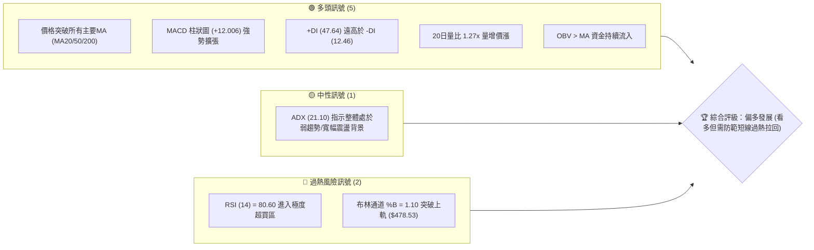
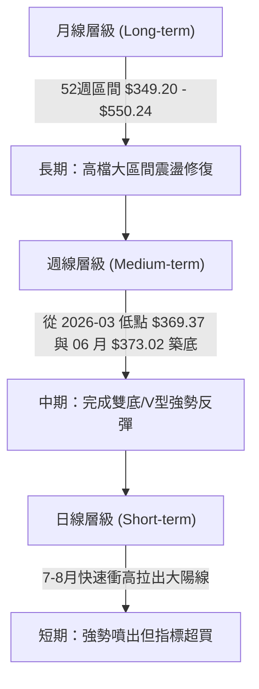
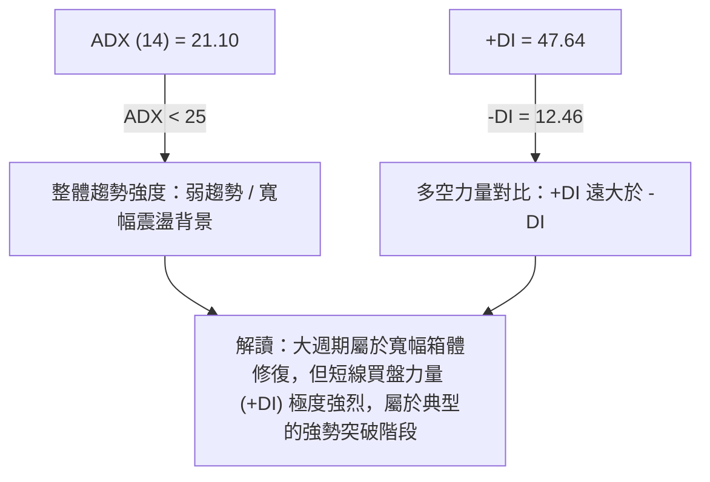
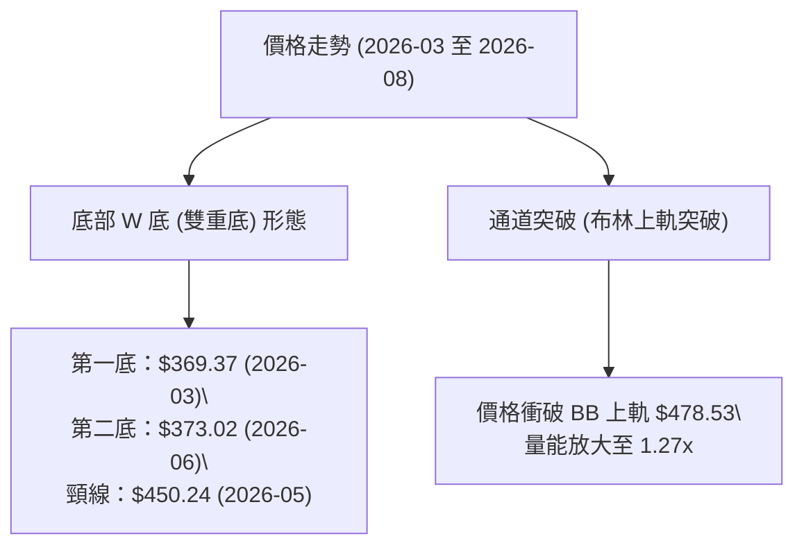
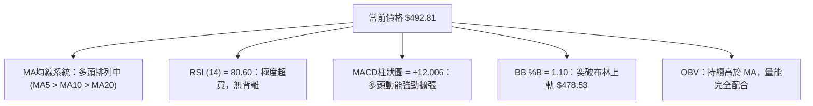
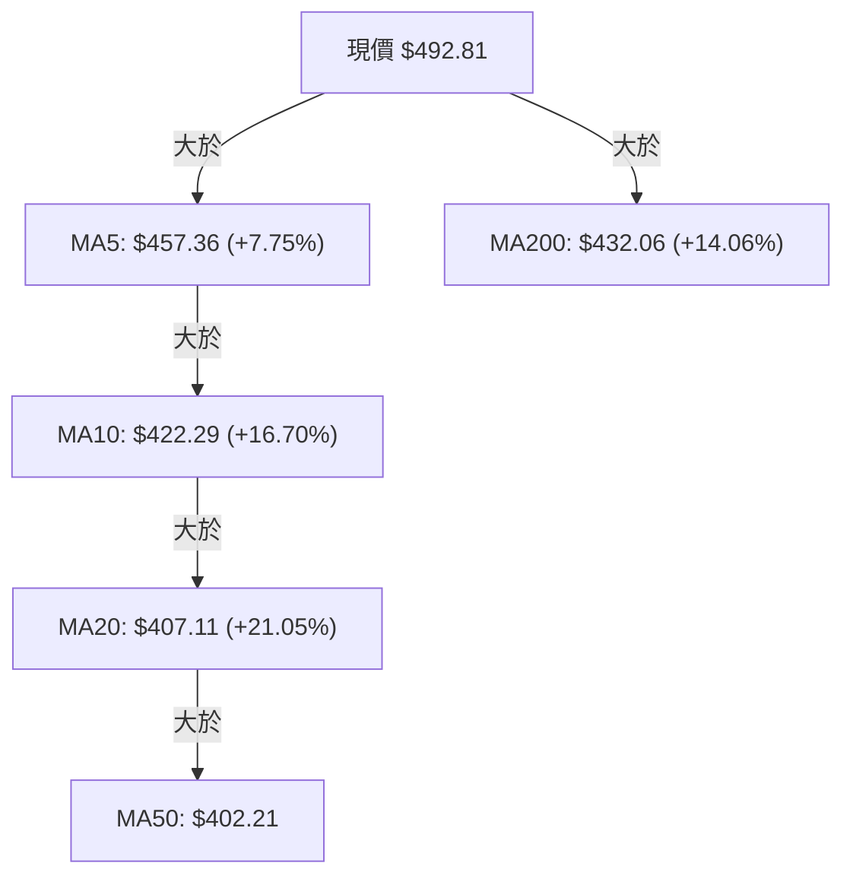
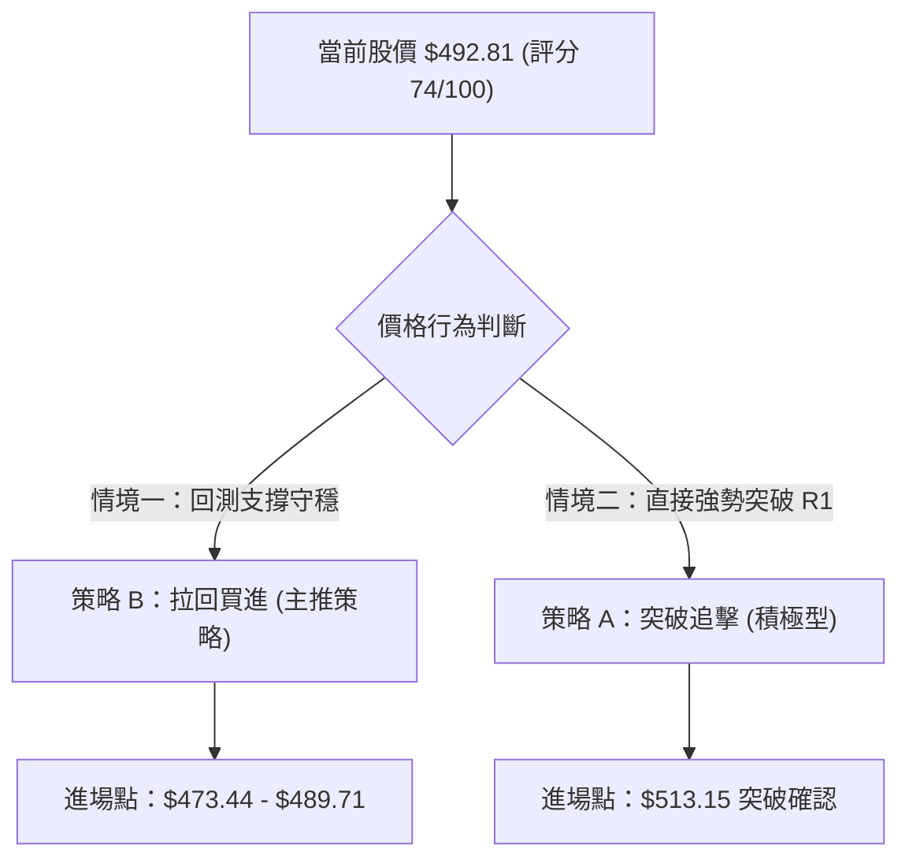
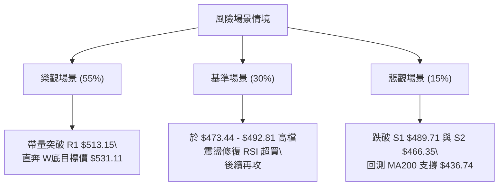

# MSFT 技術分析報告

> **報告日期**：2026-08-04 ｜ **語言**：繁體中文 ｜ **數據來源**：Yahoo Finance ｜ **當前價格**：$492.81

---

## 目錄

| 章節 | 內容 |
|------|------|
| [1. 技術面概覽](#1-技術面概覽) | 訊號儀表板、核心指標、評分卡 |
| [2. 趨勢分析](#2-趨勢分析) | 多時框趨勢、長中短期走勢 |
| [3. 圖表形態分析](#3-圖表形態分析) | 形態識別、K線組合、目標價 |
| [4. 支撐與阻力](#4-支撐與阻力) | 關鍵價位、斐波那契回調 |
| [5. 技術指標深度解讀](#5-技術指標深度解讀) | MA/RSI/MACD/布林/成交量 |
| [6. 動能與波動率](#6-動能與波動率) | 動能評估、ATR、Beta |
| [7. 多時框架總結](#7-多時框架總結) | 時框架評分矩陣 |
| [8. 交易策略建議](#8-交易策略建議) | 多空策略、風險報酬比 |
| [9. 風險提示與監控](#9-風險提示與監控) | 監控指標、風險場景 |

---

## 1. 技術面概覽

### 🎯 技術訊號儀表板



### 📊 核心指標速覽表

| 指標類別 | 指標名稱 | 當前數值 | 訊號 | 解讀 |
|----------|----------|----------|------|------|
| **價格** | 當前價格 | $492.81 | 🟢 | 位於52週區間 71.4% 位置，強勢站上 $490 |
| **均線** | MA20 | $407.11 | 🟢 | 價格在MA20上方 (+21.05%)，短線趨勢極強 |
| **均線** | MA50 | $402.21 | 🟢 | 價格在MA50上方 (+22.53%)，中期支撐紮實 |
| **均線** | MA200 | $432.06 | 🟢 | 價格在MA200上方 (+14.06%)，長期多頭格局修復 |
| **動能** | RSI(14) | 80.60 | 🔴 | 極度超買 (>70)，短線追高風險增加 |
| **動能** | MACD | 19.472 | 🟢 | MACD線遠高於訊號線 (7.465)，柱狀圖 +12.006 強勢 |
| **動能** | Stoch %K/%D | 94.57 / 96.23 | 🔴 | 隨機指標進入極度超買區 |
| **波動** | ATR(14) | $17.93 | 🟡 | 日波動率為價格之 3.64%，屬於中等偏高波動 |

### 🏆 技術評分卡

```
╔══════════════════════════════════════════════════════════════════╗
║                    技術評分卡 — MSFT (2026-08-04)                ║
╠══════════════════════════════════════════════════════════════════╣
║ 趨勢強度 (ADX/DI)  ██████████████░░░░░░  70/100  🟢 強勁多頭主導 ║
║ 動能指標 (RSI/MACD)████████████████░░░░  80/100  🟢 動能極強/過熱║
║ 支撐穩定度 (S1/S2) ██████████████░░░░░░  70/100  🟢 關鍵支撐穩固 ║
║ 成交量配合 (OBV)   ████████████████░░░░  80/100  🟢 量價配合良好 ║
║ 形態完整度 (W底)   ██████████████░░░░░░  70/100  🟢 底態完成向上 ║
║ 均線排列 (MA5-200) ████████████░░░░░░░░  60/100  🟡 混合轉多排列 ║
╠══════════════════════════════════════════════════════════════════╣
║ 綜合技術評分       ███████████████░░░░░  74/100  🏆 偏多 (Strong)║
╚══════════════════════════════════════════════════════════════════╝
```

---

## 2. 趨勢分析

### 🌐 多時框趨勢分析



### 📈 長期趨勢 — 12個月走勢圖（Unicode）

```
MSFT 月線走勢圖（過去12個月 2025-09 至 2026-08）
價格軸 ($)
$550 ┤                                                    
$528 ┤        ●   ●                                       
$503 ┤            ●   ●                                 ● (現在 $492.81)
$466 ┤                    ●                         ●     
$436 ┤                        ●                           
$392 ┤                            ●   ●         ●         
$369 ┤                                ●     ●             
     └─────────────────────────────────────────────────────
       25-09 10  11  12  26-01 02  03  04  05    06  07  08
```

#### 走勢特徵分析表

| 階段 | 時間區間 | 收盤價變化 | 漲跌幅 | 走勢特徵分析 |
|------|----------|------------|--------|--------------|
| **1. 高檔震盪** | 2025-09 ~ 2025-10 | $514.69 → $514.55 | -0.03% | 於高檔 $514 附近築頂，成交量逐漸萎縮 |
| **2. 中期修整** | 2025-11 ~ 2026-03 | $489.83 → $369.37 | -24.59% | 連續 5 個月回調，於 2026-03 觸及波段低點 $369.37 |
| **3. 初次反彈** | 2026-04 ~ 2026-05 | $406.90 → $450.24 | +10.65% | 跌深反彈至 $450.24 遇到 MA200 壓力阻擋 |
| **4. 二次打底** | 2026-06 | $373.02 | -17.15% | 再次回測底部，形成與 3 月份相當之二次低點 $373.02 |
| **5. 強力噴出** | 2026-07 ~ 2026-08 | $464.72 → $492.81 | +32.11% | 量能大幅釋放，帶量連續大漲突破所有短期與中期均線 |

### 📊 中期趨勢（週線分析）

```
MSFT 週線關鍵結構與均線分佈
═══════════════════════════════════════════════════════════
$550.24 ════════════════════════════════════ 52W High (R3)
$528.08 ------------------------------------ 波段阻力 (R2)
$513.15 ------------------------------------ 近期壓力 (R1)
$492.81 ◄◄◄ 現價 (強勢攻頂中)
$489.71 ------------------------------------ 關鍵支撐 (S1)
$466.35 ------------------------------------ 中期支撐 (S2)
$436.74 ------------------------------------ 強力支撐 (S3 / MA200)
═══════════════════════════════════════════════════════════
```

### ⚡ 趨勢強度評估（ADX 解讀）



| 指標 | 數值 | 參考標準 | 評估結論 |
|------|------|----------|----------|
| **ADX(14)** | 21.10 | <25 盤整/弱趨勢；>25 強趨勢 | 🟡 大週期趨勢尚處於震盪重建階段 |
| **+DI** | 47.64 | >30 表示多頭極強 | 🟢 多頭控制力極強 |
| **-DI** | 12.46 | <15 表示空頭極弱 | 🟢 空頭力量完全潰退 |

---

## 3. 圖表形態分析

### 🔍 形態識別系統



#### 形態信心度與目標價評估

| 形態名稱 | 信心度 | 判斷依據（引用數據） | 完成度 | 目標價（附計算式） |
|----------|--------|----------------------|--------|--------------------|
| **W底 (雙重底)** | 75% | 兩次低點 $369.37 與 $373.02 獲得強烈支撐，且已收盤突破頸線 $450.24 | 100% (已突破) | 頸線 $450.24 + (頸線 $450.24 - 低點 $369.37) = **$531.11** |
| **布林上軌帶狀噴出**| 85% | 2026-08 收盤 $492.81 高於 BB 上軌 $478.53，成交量 49.56M > 20日均量 38.88M | 執行中 | 形態推算短線目標 **$513.15** (R1) |

### 🕯️ 重要K線形態分析

| 日期/週 | 收盤價 | K線形態 | 解讀 | 訊號 |
|---------|--------|---------|------|------|
| **2026-06-28** | $372.97 | 底部長下影線/築底K線 | 週成交量爆出 382.7M 超大巨量，確認低點支撐 | 🟢 底部洗盤結束 |
| **2026-08-02** | $464.72 | 大陽線實體突破 | 週成交量 278.4M，一舉貫穿 MA20 與 MA50 | 🟢 強勢突破 signal |
| **2026-08-09** | $492.81 | 長陽線收高 | 站上 $490，多頭續強，但留意實體上方逐漸接近阻力 R1 | 🟢/🔴 短線極強但超買 |

### 📉 ASCII 走勢形態示意圖

```
MSFT W底形態與突破路徑示意圖
$531.11 ┤                                           ● (形態理論目標價)
$513.15 ┤                                     ▲ (阻力 R1)
$492.81 ┤                                 ● (現價)
$450.24 ┤              ● (頸線突破) ───────┼───────
        ┤             / \                 /
$370.00 ┤  ● (底1) --/   \---- ● (底2) --/
        └──────────────────────────────────────────────
           2026-03    2026-05   2026-06   2026-08
```

### 🎯 形態目標價計算

1. **W底形態目標價**：
   - 底部最低點：$369.37 (2026-03-29 週高低點聚類)
   - 頸線高點：$450.24 (2026-05-31 收盤價)
   - 形態高度 = $450.24 - $369.37 = **$80.87**
   - 最小測量目標價 = 頸線 $450.24 + $80.87 = **$531.11** (位於阻力 R2 $528.08 與 R3 $550.24 之間)

---

## 4. 支撐與阻力

### 🗺️ 關鍵價位分布圖（Unicode）

```
MSFT 價位結構分布圖 (當前價格 $492.81)
═══════════════════════════════════════════════════════════
$550.24 ║████████████████████████████████████████║ 52W High / 阻力 R3
$528.08 ║████████████████████████████            ║ 阻力 R2 / W底目標區域
$513.15 ║██████████████████                      ║ 近期高點阻力 R1
$502.79 ║────────────────────────────────────────║ 斐波那契 23.6% 回調位
$492.81 ╠════════════════════════════════════════╣ ◄ 當前價格 $492.81
$489.71 ║▓▓▓▓▓▓▓▓▓▓▓▓▓▓▓▓▓▓▓▓▓▓▓▓▓▓▓▓▓▓▓▓        ║ 近期支撐 S1
$473.44 ║────────────────────────────────────────║ 斐波那契 38.2% 回調位 / BB上軌($478.53)
$466.35 ║████████████████████████                ║ 強支撐 S2
$449.72 ║────────────────────────────────────────║ 斐波那契 50.0% 回調位 / W底頸線
$436.74 ║████████████████████                    ║ 強支撐 S3 (MA200 $432.06 附近)
═══════════════════════════════════════════════════════════
```

### 🚧 阻力位分析表

| 阻力級別 | 價位 | 形成原因 | 突破難度 | 重要性 |
|----------|------|----------|----------|--------|
| **R1** | **$513.15** | 近一年波段高點聚類 (2025-09/10 收盤高點區域) | 中等 | 🟢🟢🟢 短線獲利結算點 |
| **R2** | **$528.08** | 近一年次高點聚類 (2025-07 收盤高點 $529.27 附近) | 偏高 | 🟢🟢🟢🟢 中期多頭考驗位 |
| **R3** | **$550.24** | 52週歷史最高點 (52W High) | 極高 | 🟢🟢🟢🟢🟢 歷史解套賣壓區 |

### 🛡️ 支撐位分析表

| 支撐級別 | 價位 | 形成原因 | 守住機率 | 重要性 |
|----------|------|----------|----------|--------|
| **S1** | **$489.71** | 近一年波段低點/平台聚類 (2025-11 收盤低點) | 65% | 🟢🟢🟢 短線第一防線 |
| **S2** | **$466.35** | 近一年波段低點聚類 (2026-07 收盤突破前高點) | 80% | 🟢🟢🟢🟢 回調買進關鍵區 |
| **S3** | **$436.74** | 密集的波段支撐 + MA200 ($432.06) 所在處 | 90% | 🟢🟢🟢🟢🟢 中長線多空分水嶺 |

### 📐 斐波那契回調位分析

依據 52 週高低點區間（高點 **$550.24**，低點 **$349.20**，總波幅 **$201.04**）：

| 比例 | 價格 | 當前相對位置與技術意義 |
|------|------|------------------------|
| **0.0%** | **$550.24** | 52週高點 (R3) |
| **23.6%**| **$502.79** | 當前價格 $492.81 向上試探的第一個關鍵斐波那契關卡 |
| **38.2%**| **$473.44** | **當前價格落於 23.6% ($502.79) 與 38.2% ($473.44) 之間**。此處亦靠近布林上軌 ($478.53)，為強效拉回支撐 |
| **50.0%**| **$449.72** | 中樞支撐位，與 W 底頸線 $450.24 完全重合，支撐效力極強 |
| **61.8%**| **$426.00** | 黃金分割強支撐，位於 MA200 ($432.06) 下方 |
| **78.6%**| **$392.22** | 深幅回調位，靠近 2026-02 低點 |
| **100.0%**| **$349.20** | 52週低點 (52W Low) |

---

## 5. 技術指標深度解讀

### 🎛️ 指標訊號總覽



### 📈 移動平均線排列分析



- **均線狀態解讀**：價格已一口氣貫穿所有短期與中長期均線。均線雖顯示「混合排列」（因 MA200 $432.06 高於 MA20/MA50），但短中期均線（MA5/MA10/MA20）急劇向上拐頭，正在進行強勢修復，極易在短線帶動黃金交叉。

### 📉 RSI(14) 分析

```
RSI(14) 強度指標
0 ░░░░░░░░░░░░░░░░░░░░ 30 ░░░░░░░░░░░░░░░░░░ 70 ▓▓▓▓▓▓▓▓ 80.60 █ 100
                         (超賣)               (超買)   ▲當前
```

- **極值解讀**：RSI(14) 當前高達 **80.60**，屬於顯著的🔴**超買狀態**。
- **背離判斷**：檢視價格與 RSI 走勢，價格自 7 月底 $381.70 直線拉升至 $492.81，RSI 同步由 46.6 快速飆升至 80.60，**目前無明顯頂背離現象**，顯示這是由強烈現貨買盤推升的強勢行情，而非動能竭盡的虛漲；然而超買數值警告技術性回調隨時可能發生。

### 📊 MACD(12/26/9) 訊號解讀


- **動能評估**：MACD 柱狀圖呈現高達 **+12.006** 的擴張值，創下近 20 週新高，代表多頭衝刺動能正处于極盛時期，完全由買方主導市場。

### 📦 布林通道分析

```
布林通道現狀示意圖
$478.53 ┤=============================== BB 上軌
        │                                 ● 現價 $492.81 (突破上軌, %B=1.10)
$407.11 ┤------------------------------- BB 中軌 (MA20)
        │
$335.69 ┤=============================== BB 下軌
```

- **軌道狀態**：%B 達 **1.10**，顯示價格已擠壓並推升布林帶上軌（$478.53）。在強勢行情中，價格短暫脫離上軌為常見現象，但也意味著若買盤無法持續放量，價格將有拉回至通道內（回測 $478.53 或 $466.35）的需求。

### 💹 成交量分析（量價配合度）

- **最新成交量**：49,565,875 股，相較於 20日均量 38,886,464 股，**量比達 1.27x**。
- **量價配合**：價漲量增，且 OBV 指標明確高於其均線，代表資金屬淨流入狀態，未出現量價背離。

---

## 6. 動能與波動率

### ⚡ 動能評估

| 象限區分 | 動能強度 | 波動率 | 當前狀態 | 交易含義 |
|----------|----------|--------|----------|----------|
| **Q1 (右上)** | 強 (>50) | 高 | - | 追價高風險高收益 |
| **Q2 (左上)** | 弱 (<50) | 低 | - | 盤整蓄勢 |
| **Q3 (右下)** | 強 (RSI 80.6) | 中等 (ATR 3.64%) | **✓ MSFT 當前位置** | **強勢攻擊階段，但需留意短線拉回尋找買點** |
| **Q4 (左下)** | 弱 | 高 | - | 避免進場 |

### 📊 ATR 波動率分析

- **ATR(14) 數值**：**$17.93** (佔當前股價 3.64%)。
- **止損距離設計參考**：
  - 短線交易止損距離（1.5x ATR）：$17.93 × 1.5 = **$26.90**（若以 $492.81 進場，短線止損設於 $465.91 附近，極貼近 S2 $466.35）。
  - 波段交易止損距離（2.0x ATR）：$17.93 × 2.0 = **$35.86**（波段止損設於 $456.95 附近）。

### 📐 Beta 與市場相關性

- **Beta 係數**：**1.099**。
- **市場解讀**：MSFT 波動度略高於大盤（S&P 500）約 10%，在市場多頭環境下具備良好的超額收益（Alpha）彈性。

---

## 7. 多時框架總結

### 📋 時框架評分表

| 時框架 | 趨勢方向 | 動能強度 | 均線排列 | 圖表形態 | 綜合評分 | 交易建議 |
|--------|----------|----------|----------|----------|----------|----------|
| **月線 (Long)** | 🟡 中性震盪 | 🟢 中等 | 🟡 混合 | 底部完成 | 65/100 | 長線持有/分批佈局 |
| **週線 (Medium)**| 🟢 多頭確立 | 🟢 強勁 | 🟢 多頭支撐 | W底突破 | 80/100 | 逢低加碼多單 |
| **日線 (Short)** | 🟢 強烈噴出 | 🔴 極度超買| 🟢 帶狀衝刺 | 布林上軌突破| 75/100 | 不宜追高，待拉回買進 |

### 🔲 綜合訊號矩陣

```
            短期動能(日)  中期結構(週)  長期趨勢(月)
多頭訊號    ██████████   ████████░░   ██████░░░░
訊號一致性：高度集中於中短期多頭突破，但日線出現指標超買之訊號衝突。
```

### ⚖️ 多時框收斂結論

依據多時框收斂規則：
1. **行情性質判斷**：ADX(14) = 21.10 (<25)，整體大格局屬於寬幅區間修復後的突破點；而短期 +DI (47.64) 與 MACD 展現極強攻擊性。
2. **優先級收斂**：日線與週線均強烈指向多頭突破，但日線 RSI 80.60 過熱。因此，**最終方向性結論確定為：🟢 偏多格局**。
3. **操作收斂**：主策略為**看多**，但基於風控紀律，**嚴禁在 $492.81 直接追高**，交易應等待價格回測關鍵支撐（S1 $489.71 或拉回至 BB 上軌/斐波那契區間 $473.44–$478.53）時再行進場。

---

## 8. 交易策略建議

### 🗺️ 策略決策流程圖



### 🧭 策略路由

**當前主策略方向 = 🟢 多頭操作（技術評分：74/100）**

### 🎯 價格情境階梯 (Price Scenarios)

| 觸發條件 | 下一目標 | 後續延伸 | 情境含義 |
|----------|----------|----------|----------|
| **突破 R1 $513.15** | R2 $528.08 | R3 $550.24 | 多頭續強，挑戰歷史高點區 |
| **站穩 S1 $489.71** | R1 $513.15 | R2 $528.08 | 高檔消化超買賣壓，高姿態整理 |
| **跌破 S1 $489.71** | S2 $466.35 | S3 $436.74 | 技術性深幅回調，測試中期均線 |

### 📊 情境機率分佈

| 情境 | 機率 | 主要依據 |
|------|------|----------|
| **高檔震盪後上行** | **55%** | MACD 柱狀圖 +12.006 強勢擴張，OBV 量能配合，W底突破支撐 |
| **回調至 S1/S2 整理** | **30%** | RSI 80.60 極度超買，布林 %B 1.10 需要進行指標修復 |
| **深幅跌破 S2 再探底**| **15%** | ADX 仍低於 25，大盤若出現系統性賣壓可能引發假突破 |

### 🟢 主策略詳情

#### 策略 A：積極型 — 突破 R1 追擊策略

| 策略要素 | 詳細設定（引用精確數據） |
|----------|──────────────────────────|
| **進場條件** | 日線收盤價強勢突破阻力 R1 $513.15 且成交量高於 20日均量 |
| **進場價格** | **$513.15** |
| **目標價 T1** | **$528.08** (阻力 R2) |
| **目標價 T2** | **$550.24** (52週高點 R3) |
| **止損價格** | **$489.71** (支撐 S1 下方) |
| **風險報酬比** | (T1: $528.08 - $513.15 = $14.93) / (Risk: $513.15 - $489.71 = $23.44) = **1 : 0.64** (若至 T2 則為 **1 : 1.58**) |
| **建議倉位** | 10% - 15% |

#### 策略 B：穩健型 — 拉回支撐逢低買進策略（🥇 最佳推薦）

| 策略要素 | 詳細設定（引用精確數據） |
|----------|──────────────────────────|
| **進場條件** | 股價回調至 S1 $489.71 至 斐波那契38.2% $473.44 區間，出現止跌K線訊號 |
| **進場價格** | **$478.53** (布林上軌與支撐區域共振點) |
| **目標價 T1** | **$513.15** (阻力 R1) |
| **目標價 T2** | **$531.11** (W底形態理論目標價) |
| **止損價格** | **$456.95** (約 2x ATR，避開 S2 $466.35 之假跌破) |
| **風險報酬比** | (T1: $513.15 - $478.53 = $34.62) / (Risk: $478.53 - $456.95 = $21.58) = **1 : 1.60** (若至 T2 則為 **1 : 2.44**) |
| **建議倉位** | 20% - 25% |

### 🔴 反向風險觸發點（對沖提示）

- 若股價無預警放量跌破強支撐 **S2 ($466.35)**，代表本次高檔突破為假突破，多頭結構將遭到嚴重破壞，屆時應執行全面止損或建立對沖空單，下看 **S3 ($436.74)**。

### ⭐ 整體訊號強度評星

```
做多訊號強度：★★██☆  (4/5 星 — 趨勢極強但受限於超買)
做空訊號強度：★░░░░  (1/5 星 — 逆勢操作風險極高)
整體可信度：  ★★██☆  (4/5 星 — 量價與形態高度一致)
```

---

## 9. 風險提示與監控

### ✅ 關鍵監控指標 Checklist

```
╔══════════════════════════════════════════════════════════════════╗
║                  每日/每週技術面監控清單 (Checklist)             ║
╠══════════════════════════════════════════════════════════════════╣
║ [ ] RSI(14) 是否跌破 70 脫離超買區（若跌破可能啟動短線回調）      ║
║ [ ] 價格能否有效守住 S1 ($489.71) 關鍵關鍵位                    ║
║ [ ] 成交量是否保持在 20日均量 (38.88M) 以上，避免量價背離        ║
║ [ ] MACD 柱狀圖 (+12.006) 是否開始收縮（動能減弱訊號）          ║
║ [ ] 布林通道帶寬是否持續擴張或出現開口收窄                      ║
╚══════════════════════════════════════════════════════════════════╝
```

### ⚠️ 風險場景分析



### 🛡️ 風險管理重要提醒

1. **嚴防指標超買拉回**：RSI 達 80.60 且 Stoch %K/D 高達 94/96，短線極度過熱。切忌在開盤時盲目追高，應嚴格執行分批掛單策略。
2. **ATR 動態止損**：以目前 ATR = $17.93 計算，日間正常波動即可達 $18 美元，止損設得太窄（小於 1x ATR）極易被噪音洗出場，建議止損寬度至少保持 1.5x 至 2.0x ATR。
3. **大盤連動風險**：MSFT Beta 為 1.099，需關注美股整體科技板塊（如 QQQ）是否出現高檔獲利回吐的整體性賣壓。

---

## 📋 報告總結

```
╔══════════════════════════════════════════════════════════════════╗
║                    MSFT 技術分析報告總結                          ║
════════════════════════════════════════════════════════════════════
報告日期：2026-08-04
當前價格：$492.81
分析評級：🟢 偏多看好 (Strong Bullish Momentum with Overbought Warning)

關鍵結論：
├─ 長期趨勢：🟡 大區間修復完畢，轉向多頭突破
├─ 中期趨勢：🟢 週線 W 底形態正式完成，理論目標價 $531.11
├─ 短期趨勢：🟢 帶狀衝刺，但 RSI (80.60) 極度超買需防拉回
├─ 關鍵支撐：S1: $489.71 ｜ S2: $466.35 ｜ S3: $436.74
├─ 關鍵阻力：R1: $513.15 ｜ R2: $528.08 ｜ R3: $550.24
└─ 分析師目標：均價 $562.73 (最高 $870.00)

最優策略組合：
1. 🥇 最佳機會：等待價格拉回至 $478.53 - $489.71 區間止跌時佈局多單 (策略 B)。
2. 🥈 次選機會：若價格放量強勢突破阻力 R1 $513.15，小倉位追擊至 R2/R3 (策略 A)。
3. 🥉 保守選擇：等待 RSI(14) 回落至 50-60 中性區域後，再行確定中期加碼點。
════════════════════════════════════════════════════════════════════
```

---

> ⚠️ **免責聲明**：本報告為 AI 自動生成之技術分析，所有數據及估算均基於提供的歷史價格資訊。本報告**僅供研究與學術參考**，**不構成任何投資建議**。投資有風險，入市需謹慎。

---

*報告生成時間：2026-08-04 ｜ 數據來源：Yahoo Finance ｜ 分析框架：多時框技術分析*