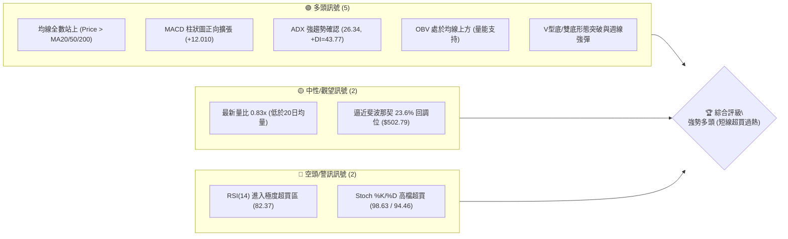
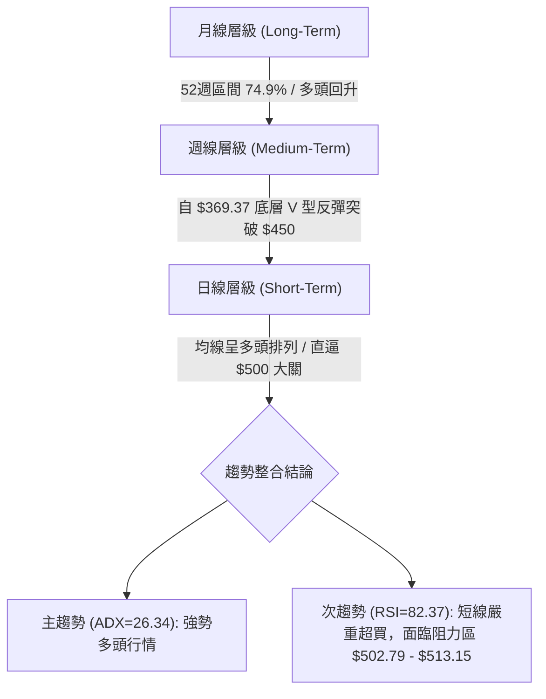
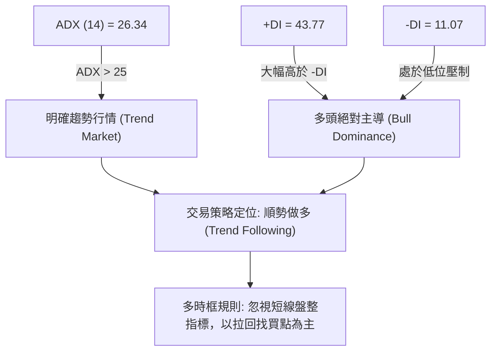
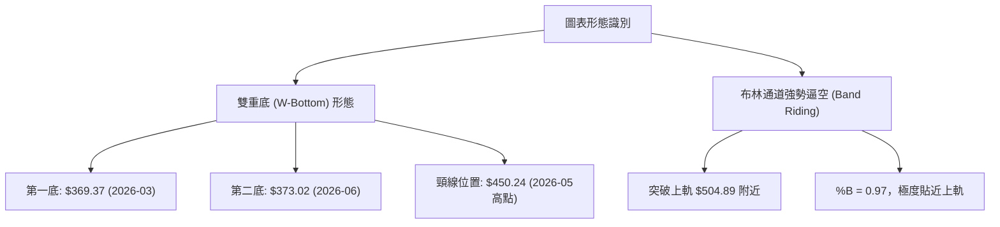
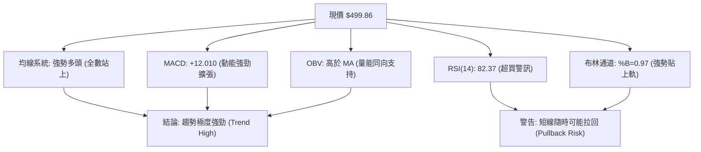
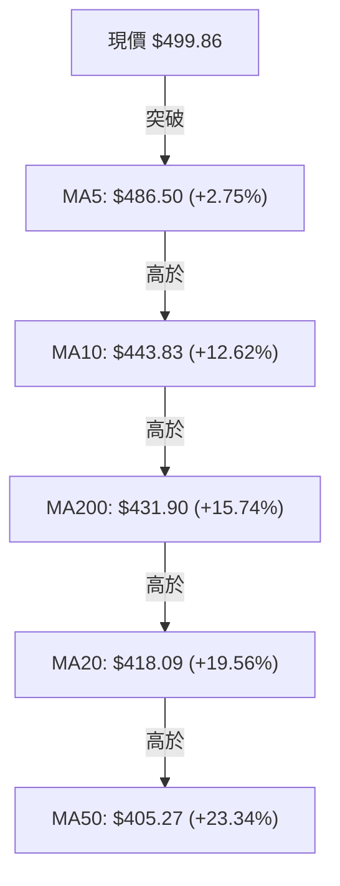
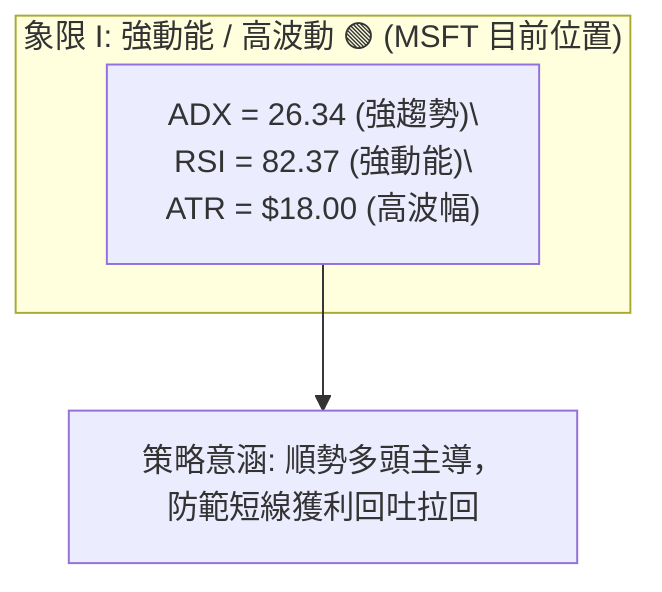
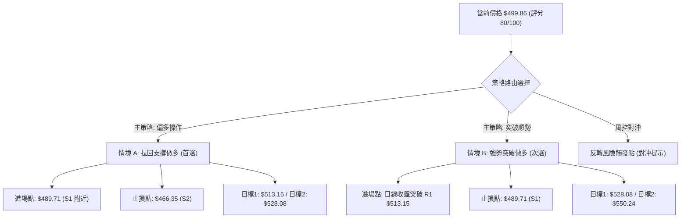
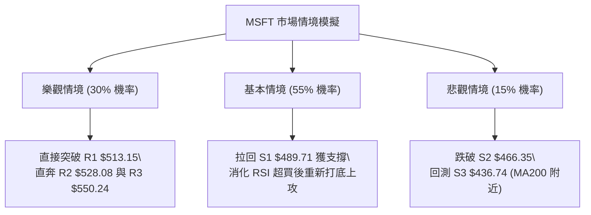

# MSFT 技術分析報告

> **報告日期**：2026-08-07 ｜ **語言**：繁體中文 ｜ **數據來源**：Yahoo Finance ｜ **當前價格**：$499.86

---

## 目錄

| 章節 | 內容 |
|------|------|
| [1. 技術面概覽](#1-技術面概覽) | 訊號儀表板、核心指標、評分卡 |
| [2. 趨勢分析](#2-趨勢分析) | 多時框趨勢、12個月走勢圖、ADX 趨勢強度 |
| [3. 圖表形態分析](#3-圖表形態分析) | 形態識別、K線組合、信心度與目標價計算 |
| [4. 支撐與阻力](#4-支撐與阻力) | 關鍵價位結構、阻力/支撐分析、斐波那契回調 |
| [5. 技術指標深度解讀](#5-技術指標深度解讀) | MA均線系統、RSI背離、MACD、布林通道與OBV量能 |
| [6. 動能與波動率](#6-動能與波動率) | 動能四象限、ATR 波動率、Beta 市場相關性 |
| [7. 多時框架總結](#7-多時框架總結) | 時框架評分矩陣、多時框收斂與交易定調 |
| [8. 交易策略建議](#8-交易策略建議) | 策略路由、情境階梯、進出場位與風報比 |
| [9. 風險提示與監控](#9-風險提示與監控) | 風險監控清單、三態情境模擬與風控建議 |

---

## 1. 技術面概覽

### 🎯 技術訊號儀表板



### 📊 核心指標速覽表

| 指標類別 | 指標名稱 | 當前數值 | 訊號 | 解讀與狀態評估 |
|----------|----------|----------|------|----------------|
| **價格** | 當前收盤價 | $499.86 | 🟢 | 位於52週區間 74.9% 位置，逼近 $500 大關 |
| **均線** | MA20 | $418.09 | 🟢 | 價格在 MA20 上方 +19.56%，短期均線強勁上揚 |
| **均線** | MA50 | $405.27 | 🟢 | 價格在 MA50 上方 +23.34%，中期支撐穩固 |
| **均線** | MA200 | $431.90 | 🟢 | 價格在 MA200 上方 +15.74%，長線多頭格局明確 |
| **動能** | RSI(14) | 82.37 | 🔴 | 極度超買 (>70)，短線累積急漲，隨時有獲利回吐壓力 |
| **動能** | MACD (12/26/9) | 25.469 / Hist: +12.010 | 🟢 | 柱狀圖大幅擴張，多頭動能非常強勁 |
| **動能** | Stoch %K / %D | 98.63 / 94.46 | 🔴 | 高檔鈍化超買，過熱訊號顯著 |
| **趨勢** | ADX(14) | 26.34 (+DI:43.77 / -DI:11.07) | 🟢 | ADX > 25 進入強趨勢行情，+DI 絕對主導 |
| **波動** | ATR(14) | $18.00 (3.60%) | 🟡 | 每日波幅適中，止損空間設定之重要基準 |
| **通道** | 布林通道 %B | 0.97 (上軌 $504.89) | 🔴 | 貼近上軌運行，呈現強勢逼空但空間受限 |
| **量能** | 20日量比 | 0.83x (32.79M / 39.39M) | 🟡 | 量能略有縮減，呈現急漲後的量縮高檔整理 |

### 🏆 技術評分卡

```
╔══════════════════════════════════════════════════════════════════╗
║              技術評分卡 — MSFT (2026-08-07)                      ║
╠══════════════════════════════════════════════════════════════════╣
║ 趨勢強度      ▓▓▓▓▓▓▓▓▓▓▓▓▓▓▓▓▓░░░  85/100  🟢 強勢趨勢 (ADX>25) ║
║ 動能指標      ▓▓▓▓▓▓▓▓▓▓▓▓▓▓▓▓▓▓░░  88/100  🔴 多頭極強 (過熱)   ║
║ 支撐穩定度    ▓▓▓▓▓▓▓▓▓▓▓▓▓▓░░░░░░  72/100  🟢 階梯式層層支撐   ║
║ 成交量配合    ▓▓▓▓▓▓▓▓▓▓▓▓▓░░░░░░░  65/100  🟡 OBV偏多但量比縮減║
║ 形態完整度    ▓▓▓▓▓▓▓▓▓▓▓▓▓▓▓░░░░░  78/100  🟢 雙底打底完成強彈 ║
║ 均線排列      ▓▓▓▓▓▓▓▓▓▓▓▓▓▓▓▓░░░░  80/100  🟢 短中長線全面站上 ║
╠══════════════════════════════════════════════════════════════════╣
║ 綜合評分      ▓▓▓▓▓▓▓▓▓▓▓▓▓▓▓▓░░░░  80/100  🟢 強勢多頭/拉回做多║
╚══════════════════════════════════════════════════════════════════╝
```

---

## 2. 趨勢分析

### 🌐 多時框趨勢分析



### 📈 長期趨勢 — 12個月走勢圖（Unicode）

以下為 MSFT 過去 12 個月（2025-08 至 2026-08）的月線收盤走勢圖，顯現出顯著的「雙重築底後 V 型大反攻」軌跡：

```
MSFT 月線走勢圖（過去12個月：2025-08 至 2026-08）
價格軸 ($)
$529.27 ┤           ● (2025-07)
$514.69 ┤       ●   ●   ●
$503.50 ┤   ●               ●                                   ● $499.86 (現在)
$464.72 ┤                                                   ●
$450.24 ┤                                           ●
$428.38 ┤                       ●
$406.90 ┤                           ●           ●
$391.89 ┤                               ●
$373.02 ┤                                   ●           ●
$369.37 ┤                                       ●(底部2)
$349.20 ┤───────────────────────────────────────────────────────────────── (52W Low)
         08  09  10  11  12  01  02  03  04  05  06  07  08  (月份)
```

#### 走勢特徵分析表

| 階段歷史 | 時間區間 | 價格變動區間 | 漲跌幅 | 走勢特徵分析與市場心理 |
|----------|----------|--------------|--------|------------------------|
| **高檔回落期** | 2025-08 ~ 2025-12 | $503.50 → $481.48 | -4.37% | 高檔獲利結案，走勢漸次沉降，高點受限於 $514 附近 |
| **深幅探底期** | 2026-01 ~ 2026-03 | $428.38 → $369.37 | -13.78% | 加速趕底，於 2026-03 創下波段低點 $369.37（逼近 52W 低點 $349.20） |
| **第一波強彈** | 2026-04 ~ 2026-05 | $406.90 → $450.24 | +10.65% | 強勢報復性反彈，突破 MA50，展現強烈買盤支撐 |
| **二次回測底** | 2026-06 | $450.24 → $373.02 | -17.15% | 再次回測底部，$373.02 未跌破前低 $369.37，打出堅實「雙重底」構造 |
| **主升段飆漲** | 2026-07 ~ 2026-08 | $373.02 → $499.86 | +34.00% | 絕地大反攻，連續兩週以巨量突破各大均線，逼近前高區域 |

### 📊 中期趨勢（週線分析）

從近 20 週數據來看，MSFT 在 2026 年 6 月底至 7 月初完成第二次落底（$372.97），隨後於 2026 年 8 月初展開強勢暴拉：
- **突破關鍵**：2026-08-02 當週收盤高達 $464.72（週成交量暴增至 2.78 億股），一舉帶動 MACD 柱狀圖翻正至 +7.460。
- **持續推進**：2026-08-09 當週收在 $499.86，MACD 柱狀圖急速擴張至 +12.010，週 RSI 衝高至 82.4，展現強烈的主升段逼空特徵。

### ⚡ 趨勢強度評估（ADX 解讀）



| 指標名稱 | 當前數值 | 臨界值比較 | 趨勢狀態 | 操作意涵 |
|----------|----------|------------|----------|----------|
| **ADX(14)** | 26.34 | > 25 (強趨勢) | 🟢 強勢趨勢 | 擺脫區間盤整，具備方向性延續力 |
| **+DI** | 43.77 | > -DI (11.07) | 🟢 多頭掌控 | 買盤動能極度強勁 |
| **-DI** | 11.07 | < 15 (極低) | 🟢 空頭潰敗 | 空頭賣壓微弱，無力反擊 |

---

## 3. 圖表形態分析

### 🔍 形態識別系統



#### 形態信心度評估表

| 形態名稱 | 信心度 | 判斷依據（引用實際數據） | 完成度 | 目標價（附精確計算式） |
|----------|--------|--------------------------|--------|------------------------|
| **雙重底 (W-Bottom)** | **82%** | 兩次波段低點於 $369.37與 $373.02 獲支撐，並於 8 月實體大陽線收高 $499.86，確定突破頸線 $450.24 | 100% (已突破) | **$531.11**<br>計算式：頸線 $450.24 + (頸線 $450.24 - 低點 $369.37) = $450.24 + $80.87 = $531.11 *(精確對應 R2 $528.08 附近)* |
| **V型急漲逼空** | **75%** | 自 2026-07 低點 $381.70 直線飆升至 $499.86，中間無實質拉回 | 90% (逼近阻力) | **$513.15**<br>計算式：波段起漲點 $381.70 + 阻力區間測幅 = 對應歷史阻力位 R1 $513.15 |

### 🕯️ 重要 K 線形態分析

| 時間週期 | 收盤價 | K 線形態名稱 | 技術面解讀 | 訊號強度 |
|----------|--------|--------------|------------|----------|
| **2026-06** | $373.02 | 測底長下影線/築底K線 | 回測 $369.37 不破，確立中期次低點 | 🟢 看多反轉 |
| **2026-07** | $464.72 | 巨量長紅突破大陽線 | 一舉吞噬前 2 個月陰線，單月暴漲近 25% | 🟢 極強多頭 |
| **2026-08 (最新)** | $499.86 | 強勢長紅光頭逼近K線 | 無懼過熱高高躍起，實體大陽線直逼 $500 關卡 | 🟢 多頭續強 |

### 📉 ASCII 走勢形態示意圖（雙底形態構造）

```
MSFT 雙底 (W-Bottom) 形態示意圖
===================================================================
                       頸線突破! ($450.24)         現價 $499.86
                             ▲                       ▲
                             │      /  \            /  形態目標價推算: $531.11
                             │     /    \          /   (阻力位 R2 $528.08 附近)
                   高點 $450.24 ──●      \        /
                                 / \      \      /
                                /   \      \    /
                               /     \      ●─── (次低點 $373.02, 2026-06)
                              /       \
      低點 $369.37 (2026-03) ─●        \
===================================================================
```

---

## 4. 支撐與阻力

### 🗺️ 關鍵價位結構分布圖（Unicode）

```
MSFT 價位結構分布圖 (由 OHLCV 與歷史波段計算)
═════════════════════════════════════════════════════════════════════
$550.24 ║████████████████████████████████████████║ 阻力位 R3 (52W High)
$528.08 ║██████████████████████████████        ║ 阻力位 R2 (形態目標區)
$513.15 ║████████████████████████              ║ 阻力位 R1 (近一年高點聚類)
$502.79 ║▓▓▓▓▓▓▓▓▓▓▓▓▓▓▓▓▓▓▓▓                  ║ 斐波那契 23.6% 回調位
$499.86 ╠══════════════════════════════════════╣ ◄ 當前收盤價 (現價)
$489.71 ║░░░░░░░░░░░░░░░░░░░░░░░░              ║ 支撐位 S1 (短線支撐)
$473.44 ║░░░░░░░░░░░░░░░░░░                    ║ 斐波那契 38.2% 回調位
$466.35 ║████████████████████                  ║ 支撐位 S2 (波段轉折支撐)
$449.72 ║██████████████                        ║ 斐波那契 50.0% 中軸位
$436.74 ║████████████████████████              ║ 支撐位 S3 (強支撐 / MA200 附近)
═════════════════════════════════════════════════════════════════════
```

### 🚧 阻力位分析表

*註：價位嚴格引用數據集「關鍵價位」與「斐波那契回調」算得之數值。*

| 阻力級別 | 價位 | 距離現價 | 形成原因與歷史背景 | 突破難度 | 重要性 |
|----------|------|----------|--------------------|----------|--------|
| **阻力 R1** | **$513.15** | +2.66% | 近一年波段高點聚類區，前波高點壓力 | 🟡 中等 | 🟢 短線關鍵瓶頸 |
| **阻力 R2** | **$528.08** | +5.65% | 波段高點聚類，且與雙底形態測幅目標 $531.11 重合 | 🔴 較高 | 🟢 中期強阻力 |
| **阻力 R3** | **$550.24** | +10.08% | 52 週歷史最高價 (52W High)，歷史絕對天花板 | 🔴 極高 | 🔴 長線核心阻力 |

### 🛡️ 支撐位分析表

| 支撐級別 | 價位 | 距離現價 | 形成原因與歷史背景 | 守住機率 | 重要性 |
|----------|------|----------|--------------------|----------|--------|
| **支撐 S1** | **$489.71** | -2.03% | 近一年波段低點聚類，前波跳空與密集交易區 | 🟢 80% | 🟢 短線防守第一線 |
| **支撐 S2** | **$466.35** | -6.70% | 7月波段突破紅棒高點與波段低點聚類 | 🟢 85% | 🟢 中期多空分水嶺 |
| **支撐 S3** | **$436.74** | -12.63% | 波段低點聚類，緊鄰 MA200 ($431.90)，長線強固基石 | 🟢 95% | 🔴 長線多頭生死線 |

### 📐 斐波那契回調位分析（基於 52 週區間 $349.20 → $550.24）

| 斐波那契層級 | 精確價位 | 與現價 ($499.86) 之關係 | 技術面解讀與操作意涵 |
|--------------|----------|-------------------------|----------------------|
| **0.0%** | **$550.24** | 現價上方 +10.08% | 52 週高點，終極多頭目標 |
| **23.6%** | **$502.79** | 現價上方 +0.59% | **關鍵壓制位**：現價 $499.86 剛好卡在 23.6% 附近，突破此位將打開通往 R1/R2 的空間 |
| **38.2%** | **$473.44** | 現價下方 -5.29% | 黃金回調第一支撐區，落在 S1 ($489.71) 與 S2 ($466.35) 之間 |
| **50.0%** | **$449.72** | 現價下方 -10.03% | 多空強弱中軸，精確重合雙底頸線 $450.24 |
| **61.8%** | **$426.00** | 現價下方 -14.78% | 黃金分割強支撐區，與 MA20 ($418.09) 形成防線 |
| **78.6%** | **$392.22** | 現價下方 -21.53% | 深幅回調區，接近 2026-02 低點 $391.89 |
| **100.0%**| **$349.20** | 現價下方 -30.14% | 52 週低點 (52W Low) |

---

## 5. 技術指標深度解讀

### 🎛️ 指標訊號總覽



### 📈 移動平均線 (MA) 排列分析



#### 均線狀態詳細解讀

1. **現價關係**：現價 $499.86 高於所有 short-term 及 long-term 均線，多頭排列初具雛形。
2. **均線交叉**：MA5 ($486.50) 與 MA10 ($443.83) 展現極度陡峭的上揚角度，代表短期極度強勢逼空。
3. **長期均線**：MA200 位於 $431.90，MA50 位於 $405.27。雖然 MA200 高於 MA20（因 2026 上半年深度拉回影響），但 MA20 與 MA50 已由低位強勢勾頭向上，長線防禦極度堅固。

### 📉 RSI(14) 深度分析與背離判斷

- **當前數值**：**82.37**（過熱超買區 >70）。
- **進度條**：`████████████████████░░░` (82.37%)
- **背離檢測**：
  - **頂背離判斷**：🔴 **無明顯頂背離**。檢視近期週線與日線數據，價格由 $381.70 上升至 $464.72 再至 $499.86，RSI 對應由 46.6 上升至 75.0 再至 82.4，價格創新高的同時 RSI 亦同步創新高，屬於「強勢攻擊型過熱」而非「動能衰竭型頂背離」。
  - **底背離回顧**：2026 年 6 月底價格二次下探 $372.97 時，RSI 自前波個位數彈升至 31.3，曾出現典型底背離，隨後觸發本輪 +34% 的暴漲行情。

### 📊 MACD (12/26/9) 訊號解讀

- **MACD 線**：25.469
- **Signal 線**：13.459
- **MACD 柱狀圖 (Histogram)**：**+12.010** 🟢
- **訊號解讀**：MACD 線遠高於 Signal 線，雙線在零軸上方快速打開距離，柱狀圖高達 +12.010，展現出強烈的多頭衝刺動能。無任何死亡交叉或柱狀圖縮頭跡象。

### 📦 布林通道 (Bollinger Bands) 分析

```
MSFT 布林通道結構示意圖
===================================================================
  $504.89 ─── 上軌 (Upper Band)  ◄ %B = 0.97 (極度貼近)
  $499.86 ─── 現價 (Price)      🟢 強勢逼空 (Band Riding)
  
  $418.09 ─── 中軌 (MA20)       
  
  $331.29 ─── 下軌 (Lower Band) 
===================================================================
```

- **通道帶寬**：上軌 $504.89、中軌 $418.09、下軌 $331.29。帶寬大幅擴張，象徵波動率飆升。
- **%B 位置**：0.97。當 %B > 0.8 時代表價格處於極強通道，目前價格 $499.86 貼近上軌 $504.89 運行，屬於典型的「沿上軌強攻」走勢。

### 💹 成交量與 OBV 分析

- **最新成交量**：32,788,866 股
- **20日均量**：39,390,258 股（量比：**0.83x**）
- **OBV 狀態**：OBV > MA，量能指標呈多頭排列。
- **量價配合評估**：最新一日量比略降至 0.83x，顯示在突破 $500 大關前夕買盤略微觀望，但前幾週突破時均伴隨 2.78 億股之週巨量（如 2026-08-02 當週），整體趨勢「量增價漲」結構保持完好。

---

## 6. 動能與波動率

### ⚡ 動能評估四象限

| 象限 | 動能分類 | 波動率狀態 | MSFT 當前定位 | 分析與策略解讀 |
|------|----------|------------|---------------|----------------|
| **象限 I** | **強動能** | **高波動** | 🟢 **MSFT 所在位置** | **強勢攻擊/主升區**：ADX=26.34，RSI=82.37，ATR=$18.00。動能極強但波動放大，適合順勢做多但需嚴格控制止損。 |
| **象限 II**| 強動能 | 低波動 | — | 穩健休養區：趨勢明確且回檔極微。 |
| **象限 III**| 弱動能 | 低波動 | — | 盤整沉悶區：無明確方向。 |
| **象限 IV**| 弱動能 | 高波動 | — | 混亂洗盤區：多空劇烈拉扯。 |



### 📊 ATR 波動率與止損建議

- **ATR(14)**：**$18.00**（佔當前股價 3.60%）。
- **日均波幅意涵**：MSFT 目前每日平均上下波動約 $18.00。
- **交易風控距離**：
  - **短線止損 (1.0x ATR)**：$18.00
  - **標準波段止損 (1.5x ATR)**：$27.00
  - **寬鬆趨勢止損 (2.0x ATR)**：$36.00

### 📐 Beta 與市場相關性

- **Beta 係數**：**1.099**
- **解讀**：MSFT 的波動度略高於整體美股大盤（S&P 500）約 9.9%。在當前大盤多頭氣氛下，1.099 的 Beta 具備放大上攻收益的槓桿效應。

---

## 7. 多時框架總結

### 📋 時框架評分矩陣

| 時框架 | 趨勢方向 | 動能 (RSI/MACD) | 均線狀態 | 形態構造 | 綜合評分 | 建議導向 |
|--------|----------|-----------------|----------|----------|----------|----------|
| **月線 (Long)** | 🟢 多頭回升 | 🟢 MACD 翻正 | 🟢 站上主均線 | 雙底反彈 | **85/100** | 長線持有/偏多 |
| **週線 (Mid)** | 🟢 強勢主升 | 🔴 RSI 82.4 (過熱) | 🟢 多頭噴發 | 突破頸線 | **82/100** | 逢拉回加碼 |
| **日線 (Short)** | 🟢 攻堅突破 | 🔴 RSI 82.37 (超買) | 🟢 全數站上 | 沿布林上軌 | **75/100** | 勿高點追價 |

### 🔲 綜合訊號矩陣

```
╔══════════════════════════════════════════════════════════════════╗
║                   多時框訊號收斂矩陣                             ║
╠══════════════════════════════════════════════════════════════════╣
║ 長期趨勢 (週/月線): 🟢 順勢上漲 (ADX=26.34 > 25，多頭主導)        ║
║ 短期走勢 (日線)    : 🔴 極度超買 (RSI=82.37，逼近阻力 R1 $513.15)  ║
╠══════════════════════════════════════════════════════════════════╣
║ 🎯 收斂結論：依照 ADX > 25 趨勢行情規則，以中長期多頭方向為主導。 ║
║               日線超買訊號僅提示「不可盲目追高」，應等候價格拉回 ║
║               至關鍵支撐位 S1 ($489.71) 附近再行布局進場。        ║
╚══════════════════════════════════════════════════════════════════╝
```

---

## 8. 交易策略建議

### 🗺️ 策略決策流程圖



### 🧭 策略路由（依評分卡分流）

> **當前主策略方向 = 🟢 強勢多頭 / 逢拉回做多（技術評分：80 / 100）**

因綜合評分達 80 分（≥60），且 ADX(14)=26.34 確立為強趨勢行情，本報告**主推多頭策略**。空頭僅列為風險對沖與反轉觸發監控點。

### 🎯 價格情境階梯 (Price Scenarios)

| 觸發條件 | 第一目標價 | 第二目標價 | 情境含義與技術面解釋 |
|----------|------------|------------|----------------------|
| **突破 R1 $513.15** | **R2 $528.08** | **R3 $550.24** | 攻克近一年高點區，挑戰 52 週歷史新高 |
| **站穩現價區間** | **Fib 23.6% $502.79** | **R1 $513.15** | 高檔橫盤震盪，消化 RSI 超買過熱指標 |
| **跌破 S1 $489.71** | **S2 $466.35** | **S3 $436.74** | 短線獲利回吐觸發深幅拉回，回測中期波段支撐 |

### 📊 情境機率分佈

| 情境劇本 | 估計機率 | 主要技術依據 |
|----------|----------|--------------|
| **1. 短線拉回/震盪後續攻 (主升續漲)** | **65%** | ADX=26.34 強趨勢、MACD 柱狀圖 +12.010 擴張、OBV 支撐 |
| **2. 高檔狹幅橫盤整理** | **25%** | 布林上軌 $504.89 壓制、RSI=82.37 超買需要時間消化 |
| **3. 深度反轉回落 (跌破 S2)** | **10%** | 除非突發重大利空，否則均線多頭排列提供強固下檔保護 |

### 🟢 主策略詳情

#### 策略 A：波段拉回買進（Primary - 最佳風報比）

- **進場條件**：價格拉回至支撐位 S1 附近，出現止跌K線（如小陽線或下影線）。
- **進場價格**：**$489.71** (S1 支撐位)
- **止損價格**：**$466.35** (S2 支撐位，距離進場點 -$23.36 / -4.77%)
- **目標價 T1**：**$513.15** (R1 阻力位，獲利空間 +$23.44 / +4.79%)
- **目標價 T2**：**$528.08** (R2 阻力位，獲利空間 +$38.37 / +7.84%)
- **終極目標 T3**：**$550.24** (R3 阻力位/52W High，獲利空間 +$60.53 / +12.36%)
- **風險報酬比 (R:R)**：
  - 至 T1 = 1 : 1.00
  - 至 T2 = **1 : 1.64**
  - 至 T3 = **1 : 2.59**
- **勝率估計**：68%
- **建議倉位**：15% - 20%

#### 策略 B：突破順勢加碼（Secondary - 突破確認）

- **進場條件**：日線收盤價強勢突破阻力位 R1 $513.15 並伴隨成交量放大。
- **進場價格**：**$513.15** (突破 R1 確認)
- **止損價格**：**$489.71** (假突破防守位 S1，距離進場點 -$23.44 / -4.57%)
- **目標價 T1**：**$528.08** (R2 阻力位，獲利空間 +$14.93 / +2.91%)
- **目標價 T2**：**$550.24** (R3 阻力位，獲利空間 +$37.09 / +7.23%)
- **風險報酬比 (R:R)**：至 T2 = **1 : 1.58**
- **勝率估計**：60%
- **建議倉位**：10% - 15%

### 🔴 反向風險觸發點（風控對沖提示）

若價格未拉回即直接失守關鍵位，請注意以下反轉訊號：
- **對沖觸發價**：若日線收盤摔破 **S2 $466.35**，宣告 V 型強彈結構破壞，多頭應立即清倉觀望。
- **做空條件**：僅在價格跌破 **S2 $466.35** 且 MACD 死亡交叉時，方可建立少量對沖空單，目標下看 **S3 $436.74**，止損設為 $489.71。

### ⭐ 整體訊號強度評星

```
做多訊號強度：★★███  (4.0/5星) 🟢 趨勢強勁但短線超買
做空訊號強度：★░░░░  (1.0/5星) 🔴 無做空結構，逆勢風險極高
整體可信度：  ★★███  (4.5/5星) 🟢 多時框訊號高度一致
```

---

## 9. 風險提示與監控

### ✅ 關鍵監控指標 Checklist

```
╔══════════════════════════════════════════════════════════════════╗
║                     每日/每週技術面監控清單                      ║
╠══════════════════════════════════════════════════════════════════╣
║ [ ] 價格能否有效跨越 Fib 23.6% ($502.79) 並挑戰 R1 $513.15        ║
║ [ ] RSI(14) 是否從 82.37 高檔回落至 60-70 進行指標修復           ║
║ [ ] MACD 柱狀圖 (+12.010) 是否出現高檔縮頭訊號                   ║
║ [ ] 拉回時成交量是否縮減（量縮價穩），S1 $489.71 支撐強度        ║
║ [ ] 布林通道上軌 $504.89 是否形成短期強烈壓制                    ║
╚══════════════════════════════════════════════════════════════════╝
```

### ⚠️ 風險場景分析



### 🛡️ 風險管理重要提醒

1. **嚴禁高檔重倉追高**：當前 RSI 達到 82.37，Stoch %K 高達 98.63，屬於極度超買狀態。歷史數據顯示此類過熱狀態下直接追價勝率較低，**最佳策略為靜待拉回**。
2. **波動率止損運用**：當前 ATR 為 $18.00，建倉時止損距離不應小於 1.5x ATR（$27.00），避免因正常的日常波動被震盪洗出場。
3. **資金管理紀律**：單一股票風險曝險不宜超過總投資組合的 20%，單筆交易最大虧損額應控制在總資金的 1% - 2% 以內。

---

## 📋 報告總結

```
╔══════════════════════════════════════════════════════════════════╗
║                   MSFT 技術分析報告總結                          ║
════════════════════════════════════════════════════════════════════
 報告日期：2026-08-07
 當前價格：$499.86
 分析評級：🟢 強勢多頭（短線過熱，建議拉回做多）

 關鍵技術結論：
 ├─ 長期趨勢：🟢 雙底打底完成，V型反彈直逼 $500 大關
 ├─ 中期趨勢：🟢 週線 MACD 大幅擴張，ADX(26.34) 確立強趨勢
 ├─ 短期趨勢：🔴 RSI(82.37) 極度超買，逼近 Fib 23.6% ($502.79) 阻力
 ├─ 關鍵支撐：S1 $489.71 ｜ S2 $466.35 ｜ S3 $436.74
 ├─ 關鍵阻力：R1 $513.15 ｜ R2 $528.08 ｜ R3 $550.24
 └─ 分析師目標價：均價 $562.73 (最高 $870.00)

 最優交易策略組合：
 1. 🥇 首選策略：等待拉回至 S1 $489.71 附近做多，止損設於 S2 $466.35，
                第一目標看 R1 $513.15，第二目標看 R2 $528.08。
 2. 🥈 次選策略：若強勢突破阻力 R1 $513.15 且量能配合，順勢追多，
                目標直指 R2 $528.08 與 52W 高點 R3 $550.24。
════════════════════════════════════════════════════════════════════
```

---

> ⚠️ **免責聲明**：本報告為專業技術分析研判，所有價位數據均精確引用自 OHLCV 及計算模型。本報告**僅供研究與學術參考**，**不構成任何個人投資建議**。金融市場有風險，交易前請務必進行獨立思考並嚴格執行風控。

---

*報告生成時間：2026-08-07 ｜ 數據來源：Yahoo Finance ｜ 分析框架：多時框收斂技術分析*