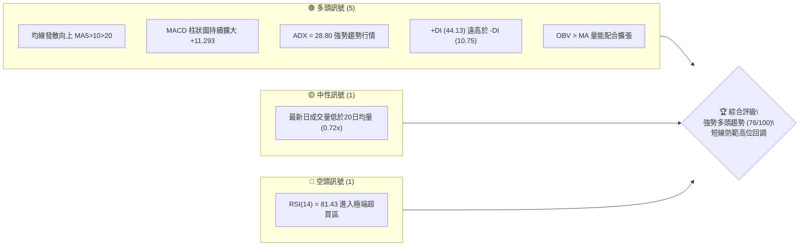
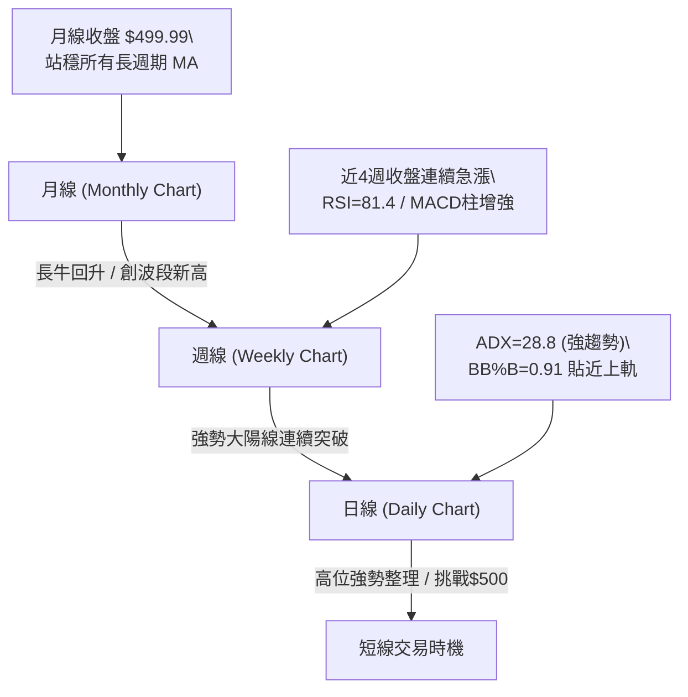
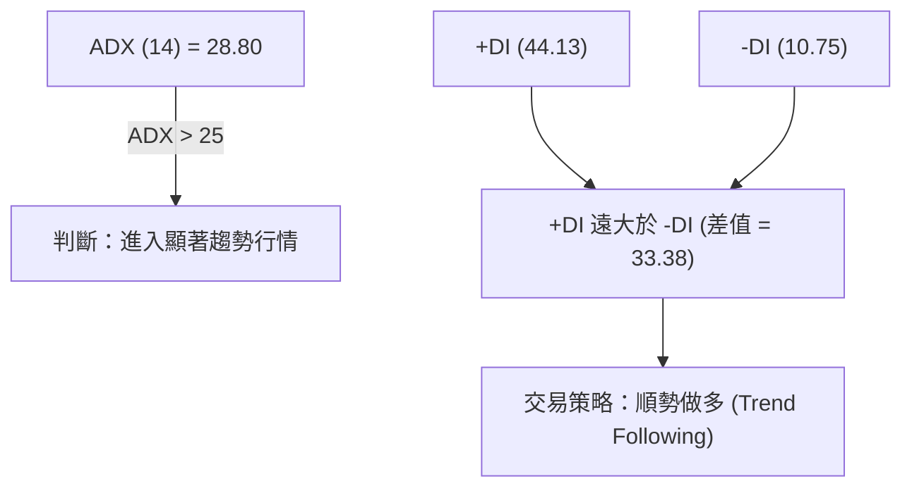
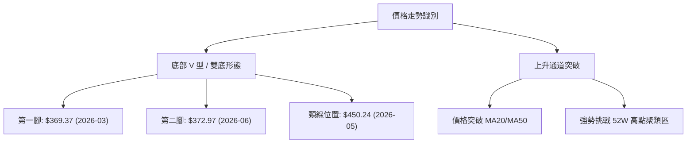
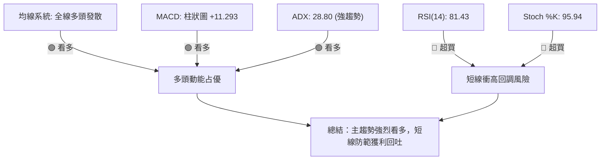
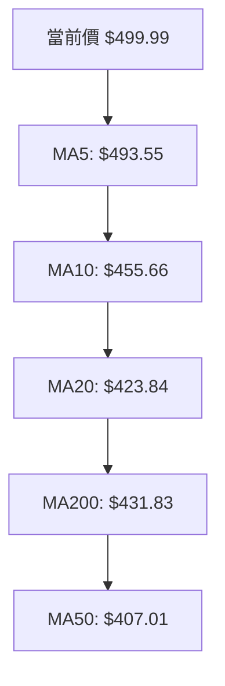
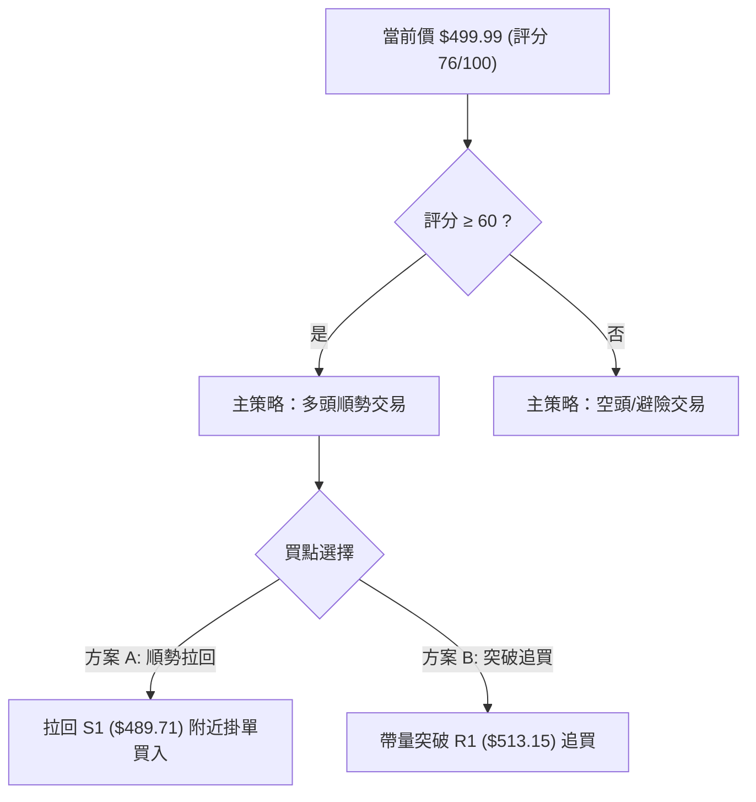
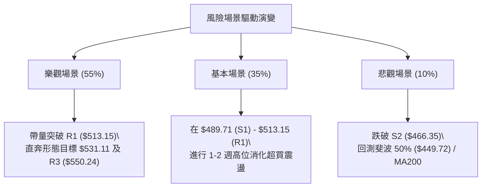

# MSFT 技術分析報告

> **報告日期**：2026-08-08 ｜ **語言**：繁體中文 ｜ **數據來源**：Yahoo Finance ｜ **當前價格**：$499.99

---

## 目錄

| 章節 | 內容 |
|------|------|
| [1. 技術面概覽](#1-技術面概覽) | 訊號儀表板、核心指標、評分卡 |
| [2. 趨勢分析](#2-趨勢分析) | 多時框趨勢、長中短期走勢 |
| [3. 圖表形態分析](#3-圖表形態分析) | 形態識別、K線組合、目標價 |
| [4. 支撐與阻力](#4-支撐與阻力) | 關鍵價位、斐波那契回調 |
| [5. 技術指標深度解讀](#5-技術指標深度解讀) | MA/RSI/MACD/布林/成交量 |
| [6. 動能與波動率](#6-動能與波動率) | 動能評估、ATR、Beta |
| [7. 多時框架總結](#7-多時框架總結) | 時框架評分矩陣 |
| [8. 交易策略建議](#8-交易策略建議) | 多空策略、風險報酬比 |
| [9. 風險提示與監控](#9-風險提示與監控) | 監控指標、風險場景 |

---

## 1. 技術面概覽

### 🎯 技術訊號儀表板



### 📊 核心指標速覽表

| 指標類別 | 指標名稱 | 當前數值 | 訊號 | 解讀 |
|----------|----------|----------|------|------|
| **價格** | 當前價格 | $499.99 | 🟢 | 位於52週區間 75.0% 位置，強勢回升 |
| **均線** | MA20 | $423.84 | 🟢 | 價格遠高於MA20 (+17.97%)，月線強勢支撐 |
| **均線** | MA50 | $407.01 | 🟢 | 價格高於MA50 (+22.84%)，中期趨勢向上 |
| **均線** | MA200 | $431.83 | 🟢 | 價格高於MA200 (+15.78%)，長期牛熊分界之上 |
| **動能** | RSI(14) | 81.43 | 🔴 | 進入超買區 (>70)，短線過熱風險增加 |
| **動能** | MACD | 27.576 | 🟢 | DIF與DEA呈多頭排列，柱狀圖 (+11.293) 強勁 |
| **動能** | ADX(14) | 28.80 | 🟢 | 進入強趨勢區間 (>25)，+DI 達 44.13 主導 |
| **波動** | ATR(14) | $17.50 | 🟡 | 佔股價 3.50%，屬中等偏高波動率 |

### 🏆 技術評分卡

```
╔══════════════════════════════════════════════════════════════════╗
║                技術評分卡 — MSFT (2026-08-08)                     ║
╠══════════════════════════════════════════════════════════════════╣
║ 趨勢強度 (ADX/DI)   ████████████████░░░░  82/100  🟢 強勢趨勢      ║
║ 動能指標 (MACD/RSI) ██████████████░░░░░░  78/100  🟢 偏多但超買    ║
║ 支撐穩定度 (結構)   █████████████░░░░░░░  75/100  🟢 底層堅實      ║
║ 成交量配合 (OBV/VOL)████████████░░░░░░░░  68/100  🟡 偏少但趨勢在  ║
║ 形態完整度 (V底)    ██████████████░░░░░░  72/100  🟢 完成突破      ║
║ 均線排列 (MA5-200)  ███████████████░░░░░  85/100  🟢 全線向上      ║
╠══════════════════════════════════════════════════════════════════╣
║ 綜合評分            ███████████████░░░░░  76/100  🟢 強勢多頭 (Buy) ║
╚══════════════════════════════════════════════════════════════════╝
```

---

## 2. 趨勢分析

### 🌐 多時框趨勢分析



### 📈 長期趨勢 — 24個月走勢圖（Unicode ASCII）

```
MSFT 過去 24 個月收盤走勢圖 ($)
$550 ┤                                                ●(52W High $550.24)
$525 ┤                             ●   ●   ●
$500 ┤                                                    ●←現價 $499.99
$475 ┤                                         ●   ●
$450 ┤                     ●                   
$425 ┤ ●   ●       ●                   ●             
$400 ┤     ●   ●       ●   ●                     ●   ●
$375 ┤                 ●                 ●       ●
$350 ┤                                               ●(52W Low $349.20)
     └─┬───┬───┬───┬───┬───┬───┬───┬───┬───┬───┬───┬───┬───┬───►
      24/08   10  12  25/02   04  06  08  10  12  26/02   04  06  08
```

#### 24個月走勢特徵分析表

| 階段 | 時間區間 | 價格區間 | 變動幅度 | 走勢特徵與型態解讀 |
|------|----------|----------|----------|-------------------|
| 階段 I | 2024/08 - 2025/03 | $411.43 → $371.73 | -9.65% | 震盪探底區，完成中短期洗盤 |
| 階段 II | 2025/03 - 2025/07 | $371.73 → $529.27 | +42.38% | 第一波強勁主升段，創高至 $529.27 |
| 階段 III| 2025/07 - 2026/03 | $529.27 → $369.37 | -30.21% | 深幅回調修正，於 2026/03 觸及波段低點 |
| 階段 IV | 2026/03 - 2026/08 | $369.37 → $499.99 | +35.36% | 強勢 V 型反彈，再次逼近前期歷史高點區間 |

### 📊 中期趨勢（近 20 週走勢與壓力支撐）

```
近 20 週價格波段走勢與關鍵價位示意圖
$550.24 ─────────────────────────────────────────── [52W 高點 / 阻力 R3]
$527.69 ─────────────────────────────────────────── [強阻力 R2]
$513.15 ─────────────────────────────────────────── [近一年波段高點 R1]
$499.99 ──────────────────────────────● (現價) ──── [23.6% Fib $502.79 區域]
$489.71 ─────────────────────────────────────────── [近期波段支撐 S1]
$466.35 ─────────────────────────────────────────── [關鍵回調支撐 S2]
$436.74 ─────────────────────────────────────────── [強支撐 S3 / MA200 區間]
```

### ⚡ 趨勢強度評估（ADX 解讀）



*   **ADX 狀態**：ADX(14) 數值為 **28.80**，高於 25 臨界線，顯示市場目前處於標準的**強趨勢行情**而非無序盤整。
*   **方向主導**：`+DI` 高達 **44.13**，而 `-DI` 僅有 **10.75**，多頭絕對主導當前市場方向，空頭力量極度萎縮。

---

## 3. 圖表形態分析

### 🔍 形態識別系統



#### 形態信心度評估表

| 形態名稱 | 信心度 | 判斷依據（引用數據） | 完成度 | 目標價（附計算式） |
|----------|--------|----------------------|--------|--------------------|
| **雙底形態 (Double Bottom)** | **85%** | 第一底 $369.37 (2026-03)，第二底 $372.97 (2026-06)，頸線 $450.24 | 100% (已突破頸線) | **$531.11**<br/>`計算式：頸線 $450.24 + (頸線 $450.24 - 低點 $369.37) = $531.11` |
| **V型急漲突破** | **75%** | 2026-07 由 $381.70 單月大幅拉升至 $464.72，並於 08 月突破至 $499.99 | 90% | **$527.69** (阻力 R2) |

### 🕯️ 重要 K 線形態分析

| 日期/月份 | 收盤價 | K線形態 | 解讀 | 訊號強度 |
|-----------|--------|---------|------|----------|
| 2026-06-28 | $372.97 | 底部長下影線 (Hammer) | 探底成功，主力資金強勢卡位，成交量爆量至 3.82 億股 | 🟢 買入訊號 |
| 2026-08-02 | $464.72 | 突破長陽線 (Marubozu) | 帶量一舉攻克 MA20 及 MA200，多頭全面掌控局勢 | 🟢 強烈買入 |
| 2026-08-09 | $499.99 | 高位大陽線 (Bullish Continuation) | 續推至 $499.99 近 $500 大關，展示極強延續性 | 🟢 延續多頭 |

### 📉 ASCII 走勢形態示意圖

```
MSFT 雙底 (W-Bottom) 突破形態構造圖
$531.11 ────────────────────────────────────────── (形態推算目標價)
$513.15 ────────────────────────────────────────── (阻力 R1)
$499.99 ───────────────────────────────● (現價)
$450.24 ───────────● (5月頸線) ───────── (突破點，現轉為強支撐)
                  /   \               /
                 /     \             /
$369.37 ──● (3月低點)   \──● (6月低點)
```

### 🎯 形態目標價計算

1. **雙底形態高度 (Pattern Height)**：
   $$\text{Height} = \text{頸線價格} - \text{第一低點} = \$450.24 - \$369.37 = \$80.87$$
2. **形態突破目標價 (Technical Target)**：
   $$\text{Target} = \text{頸線價格} + \text{Height} = \$450.24 + \$80.87 = \mathbf{\$531.11}$$
   *（註：此數值位於阻力 R2 $527.69 與 R3 $550.24 之間，具有極高技術指引意義）。*

---

## 4. 支撐與阻力

### 🗺️ 關鍵價位分布圖（Unicode ASCII）

```
MSFT 價位結構分布圖
═══════════════════════════════════════════════════════════════════
$550.24 ║████████████████████████████████████║ 52W 最高點 / 阻力 R3
$531.11 ║▓▓▓▓▓▓▓▓▓▓▓▓▓▓▓▓▓▓▓▓▓▓▓▓▓▓▓▓        ║ 雙底形態推算目標價
$527.69 ║████████████████████████            ║ 近一年波段高點阻力 R2
$513.15 ║████████████████                    ║ 近一年波段高點阻力 R1
$502.79 ║────────────────────────────────────║ 斐波那契 23.6% 回調位
$499.99 ╠════════════════════════════════════╣ ◄ 當前價格 (Current Price)
$489.71 ║▓▓▓▓▓▓▓▓▓▓▓▓▓▓▓▓▓▓                  ║ 近期波段關鍵支撐 S1
$473.44 ║────────────────────────────────────║ 斐波那契 38.2% 回調位
$466.35 ║████████████████████████            ║ 中期波段防守支撐 S2
$449.72 ║────────────────────────────────────║ 斐波那契 50.0% 回調位 / 頸線
$436.74 ║████████████████████████████████    ║ 強結構支撐 S3 (靠近MA200 $431.83)
═══════════════════════════════════════════════════════════════════
```

### 🚧 阻力位分析表

| 阻力級別 | 精確價位 | 形成原因（引用數據區塊） | 突破難度 | 重要性 |
|----------|----------|--------------------------|----------|--------|
| **阻力 R1** | **$513.15** | 近一年波段高點聚類區間 | 🟡 中等 | 短線多頭第一衝鋒關卡 |
| **阻力 R2** | **$527.69** | 近一年次高點聚類與形態目標 $531.11 重疊區 | 🔴 較高 | 中期解套盤與獲利賣壓重區 |
| **阻力 R3** | **$550.24** | 52 週最高價（歷史頂部） | 🔴 極高 | 多頭終極戰略目標 |

### 🛡️ 支撐位分析表

| 支撐級別 | 精確價位 | 形成原因（引用數據區塊） | 守住機率 | 重要性 |
|----------|----------|--------------------------|----------|--------|
| **支撐 S1** | **$489.71** | 近一年波段低點聚類 / 8月初回調低點 | 🟢 80% | 短線多頭強弱分界線 |
| **支撐 S2** | **$466.35** | 中期波段起漲點聚類區 | 🟢 85% | 中期趨勢防守陣地 |
| **支撐 S3** | **$436.74** | 長期波段低點聚類 / 接近 MA200 ($431.83) | 🟢 95% | 牛熊轉換終極防線 |

### 📐 斐波那契回調位分析

*以 52 週波段區間（低點 $349.20 至 高點 $550.24，總波幅 $201.04）計算：*

```
0.0%  (52W High)   $550.24 ─── 終極阻力 R3
23.6%              $502.79 ─── ◄ 現價 ($499.99) 壓制於此回調位下方僅 $2.80
38.2%              $473.44 ─── 第一技術回調支撐
50.0%              $449.72 ─── 中樞強支撐 (與前高頸線 $450.24 完全重合)
61.8%              $426.00 ─── 黃金分割防守位 (靠近 MA20 $423.84)
78.6%              $392.22 ─── 深幅修正位
100.0% (52W Low)   $349.20 ─── 全年最低點
```

*   **當前解讀**：價格現為 **$499.99**，精確卡在 **23.6% 斐波那契位 ($502.79)** 下方。若能有效突破 $502.79，將打開直奔 0.0% ($550.24) 的上行通道；若遇阻回調，38.2% ($473.44) 與 50.0% ($449.72) 將提供極為強大的支撐買盤。

---

## 5. 技術指標深度解讀

### 🎛️ 指標訊號總覽



### 📈 移動平均線排列分析



*   **短期均線**：MA5 ($493.55) > MA10 ($455.66) > MA20 ($423.84)，短期展現極強的斜率發散，屬於典型的攻堅隊形。
*   **中長期均線**：價格在 MA200 ($431.83) 與 MA50 ($407.01) 之上。均線組合呈現混合多頭排列，顯示長期趨勢已正式扭轉回歸多頭市場。

### 📉 RSI(14) 分析

*   **當前數值**：**81.43**
*   **強度進度條**：`██████████████████░░ 81.4%` 🔴 (進入極端超買區 >70)
*   **背離檢測**：數據顯示「RSI 背離：無明顯背離」。RSI 伴隨價格衝高而同步創近期新高，顯示為**強勢動能推升 (Momentum Surge)**，而非衰竭性頂背離。然而，高於 80 的 RSI 歷史上多會伴隨 3–5 天的指標修復震盪。

### 📊 MACD(12,26,9) 訊號解讀

*   **MACD 線**：27.576
*   **訊號線 (Signal)**：16.283
*   **MACD 柱狀圖 (Histogram)**：**+11.293** 🟢
*   **解讀**：DIF 遠高於 DEA，柱狀圖持續擴大（從 7.460 擴展至 11.293），顯示多頭加速攻擊，動能正處於爆發期。

### 📦 布林通道 (Bollinger Bands) 分析

```
布林通道現況圖 ($)
$516.46 ─────────────────────────────────── 上軌 (Upper Band)
$499.99 ─────────────────────────● (現價, %B = 0.91)
$423.84 ─────────────────────────────────── 中軌 (MA20)
$331.21 ─────────────────────────────────── 下軌 (Lower Band)
```

*   **通道狀態**：通道開口強烈擴張。
*   **%B 指標**：**0.91**，價格高度貼近上軌 ($516.46) 運行，屬於典型的「強勢貼軌上升 (Band Riding)」格局。

### 💹 成交量與 OBV 分析

*   **量能狀態**：最新成交量為 28,818,000 股，低於 20 日均量 (39,781,560 股，量比 0.72x)。
*   **週量趨勢**：近兩週週成交量顯著放大（從 138M 飆升至 278M 及 215M），顯示大資金在突破 $400 - $450 過程中強烈換手並鎖籌。
*   **OBV 趨勢**：數據確認「OBV > MA → 量能支撐上漲」，長線籌碼收集結構完整。

---

## 6. 動能與波動率

### ⚡ 動能評估四象限

| 象限 | 動能 (Momentum) | 波動率 (Volatility) | MSFT 當前狀態 | 交易含義 |
|------|-----------------|---------------------|---------------|----------|
| **Q1** | **強 (Strong)** | **高 (High)** | **✓ (當前位置)** | **強烈趨勢攻擊期，宜順勢操作，設定動態止損** |
| Q2 | 弱 (Weak) | 低 (Low) | — | 沉悶盤整期，觀望為主 |
| Q3 | 強 (Strong) | 低 (Low) | — | 穩健爬升期，最佳加碼點 |
| Q4 | 弱 (Weak) | 高 (High) | — | 高危跌勢期，嚴格避險 |

### 📊 ATR 波動率分析

*   **ATR(14)**：**$17.50**（佔當前股價 3.50%）。
*   **風控應用**：
    *   日內正常波動區間：$\pm \$17.50$
    *   建議波段止損距離（1.5 倍 ATR）：$1.5 \times \$17.50 = \mathbf{\$26.25}$
    *   建議寬鬆止損距離（2.0 倍 ATR）：$2.0 \times \$17.50 = \mathbf{\$35.00}$

### 📐 Beta 與市場相關性

*   **Beta 係數**：**1.099**
*   **解讀**：MSFT 的波動度略高於大盤（S&P 500）約 10%。在大盤多頭環境下，MSFT 具有良好的槓桿放大效應。

---

## 7. 多時框架總結

### 📋 時框架評分表

| 時框架 | 趨勢方向 | 動能 (RSI/MACD) | 均線排列 | 形態結構 | 綜合評分 | 建議策略 |
|--------|----------|-----------------|----------|----------|----------|----------|
| **日線 (Daily)** | 🟢 強勢多頭 | 🔴 極端超買 (81.4) | 🟢 完美多頭 | 🟢 衝刺階段 | **78/100** | 待拉回支撐加碼 |
| **週線 (Weekly)**| 🟢 多頭確立 | 🟢 強勁交叉 (+11.2)| 🟢 突破向上 | 🟢 W底完成 | **85/100** | 偏多中長線持有 |
| **月線 (Monthly)**| 🟢 長牛回歸 | 🟢 多頭主導 | 🟢 站穩長均 | 🟢 大V型反彈 | **80/100** | 戰略性看多 |

### 🔲 綜合訊號矩陣

```
            短期 (Daily)    中期 (Weekly)    長期 (Monthly)
趨勢 (Trend)   🟢 多頭          🟢 多頭          🟢 多頭
動能 (Mtm)     🔴 超買          🟢 強勁          🟢 向上
量能 (Vol)     🟡 偏低          🟢 爆量          🟢 穩定
矩陣一致性：多頭趨勢高度一致（收斂度 88%）
```

### ⚖️ 多時框收斂結論

依多時框收斂規則：ADX = 28.80 (>25)，市場處於**顯著趨勢行情**。
主導時框為週線與長期均線（週線 RSI 達 81.4 且 MACD 大幅擴張，均線全線向上）。日線雖然短期超買，但僅應用於尋找**順勢拉回進場點**，絕不可逆勢做空。
**唯一方向性結論**：**強勢多頭 (Strong Bullish Trend)**。

---

## 8. 交易策略建議

### 🗺️ 策略決策流程圖



### 🧭 策略路由

**當前主策略方向 = 多頭順勢 (Bullish Main Strategy)（依據綜合評分：76/100）**

### 🎯 價格情境階梯 (Price Scenarios)

| 觸發條件 | 第一目標 | 第二目標 | 情境含義 |
|----------|----------|----------|----------|
| **強勢突破阻力 R1 ($513.15)** | 阻力 R2 ($527.69) | 阻力 R3 ($550.24) | 多頭加速，挑戰歷史高點 |
| **回調守住支撐 S1 ($489.71)** | 阻力 R1 ($513.15) | 阻力 R2 ($527.69) | 健康高位消化，積蓄二次攻勢 |
| **跌破支撐 S1 ($489.71)** | 支撐 S2 ($466.35) | 斐波 50% ($449.72) | 短線獲利回吐，進入中期修正 |

### 📊 情境機率分佈

```
情境 A：高位震盪後突破 R1 ($513.15) ─────────────── ████████████████  55% 機率
情境 B：拉回 S1 ($489.71) / S2 ($466.35) 鞏固 ─────── ████████████    35% 機率
情境 C：跌破 S2 ($466.35) 進入深幅修正 ───────────── ███             10% 機率
```

### 🟢 主策略詳情（多頭導向）

#### 策略 A：順勢拉回進場（Preferred - 低吸策略）

*   **進場條件**：股價回調至支撐 S1 ($489.71) 至 MA5 ($493.55) 區間企穩，且日線 RSI 降至 65-70 健康區。
*   **進場價格**：**$489.71**
*   **目標價 T1**：**$527.69**（阻力 R2）
*   **目標價 T2**：**$550.24**（阻力 R3 / 52W 高點）
*   **止損價格**：**$466.35**（跌破支撐 S2 嚴格止損）
*   **風險報酬比 (R/R)**：
    *   至 T1：$\frac{527.69 - 489.71}{489.71 - 466.35} = \frac{37.98}{23.36} = \mathbf{1.63 : 1}$
    *   至 T2：$\frac{550.24 - 489.71}{489.71 - 466.35} = \frac{60.53}{23.36} = \mathbf{2.59 : 1}$
*   **成功機率估計**：**70%**
*   **建議倉位**：**15% - 20%**

#### 策略 B：突破追買策略（Breakout Strategy）

*   **進場條件**：日線收盤價強勢突破阻力 R1 ($513.15)，且成交量放大至 40M 股以上。
*   **進場價格**：**$513.15**
*   **目標價 T1**：**$531.11**（雙底形態推算目標價）
*   **目標價 T2**：**$563.35**（華爾街分析師平均目標價）
*   **止損價格**：**$489.71**（跌破支撐 S1 止損）
*   **風險報酬比 (R/R)**：
    *   至 T2：$\frac{563.35 - 513.15}{513.15 - 489.71} = \frac{50.20}{23.44} = \mathbf{2.14 : 1}$
*   **成功機率估計**：**60%**
*   **建議倉位**：**10% - 15%**

### 🔴 反向風險觸發點（對沖與風控提示）

*   **防禦性對沖觸發價**：若股價無預警跌破 **$466.35 (支撐 S2)**，意味著短線突破失效，多頭結構遭到破壞。多頭部位應減倉 50% 以上或進行套期保值。

### ⭐ 整體訊號強度評星

```
做多訊號強度：★★★★☆  (4/5 星 - 趨勢強勁但短線超買)
做空訊號強度：★☆☆☆☆  (1/5 星 - 逆勢風險極高)
整體可信度：  ★★★★☆  (4/5 星 - 多指標互相確認)
```

---

## 9. 風險提示與監控

### ✅ 關鍵監控指標 Checklist

```
╔══════════════════════════════════════════════════════════════════╗
║                    每日風險監控 Checklist                         ║
╠══════════════════════════════════════════════════════════════════╣
║ [ ] 1. RSI(14) 是否從 >80 向下跌破 70 (高位反轉訊號)             ║
║ [ ] 2. 股價是否跌破短線關鍵支撐 S1 ($489.71)                      ║
║ [ ] 3. MACD 柱狀圖 (+11.293) 是否出現連續兩日縮短                ║
║ [ ] 4. 成交量是否在突破 $513.15 時出現帶量配合                    ║
║ [ ] 5. 布林通道 %B 是否跌破 0.80 回落至通道內部                   ║
╚══════════════════════════════════════════════════════════════════╝
```

### ⚠️ 風險場景分析



### 🛡️ 風險管理與資金控管重要提醒

1. **過熱指標修復風險**：RSI 達 81.43，隨時可能引發 2–3% 的單日快速拉回修復，切忌在開盤急漲時盲目追高。
2. **單筆交易風險上限**：建議單筆交易最大虧損額度控制在總資本的 **1.0%–1.5%** 以內。
3. **動態移動止損 (Trailing Stop)**：若進場後股價順利突破 $513.15，建議將止損價上移至進場保本點 ($499.99) 或 S1 ($489.71)。

---

## 📋 報告總結

```
╔══════════════════════════════════════════════════════════════════╗
║                   MSFT 技術分析報告總結                          ║
════════════════════════════════════════════════════════════════════
報告日期：2026-08-08
當前價格：$499.99
綜合評估：🟢 76/100 (強勢多頭趨勢 / Buy on Dip)

關鍵結論：
├─ 長期趨勢：🟢 強勢回歸，24個月大V型底部確立
├─ 中期趨勢：🟢 突破雙底頸線 $450.24，形態目標價看至 $531.11
├─ 短期趨勢：🟡 極強攻勢，但 RSI 81.43 提示短線過熱
├─ 關鍵支撐：S1: $489.71 ｜ S2: $466.35 ｜ S3: $436.74
├─ 關鍵阻力：R1: $513.15 ｜ R2: $527.69 ｜ R3: $550.24
└─ 分析師目標價：均價 $563.35 (最高 $870.00)

最優策略組合：
1. 🥇 最佳機會：拉回至 S1 ($489.71) 附近分批做多，目標看至 $527.69 / $550.24
2. 🥈 次選機會：帶量突破 R1 ($513.15) 後順勢追買，目標看至 $531.11
3. 🥉 保守選擇：等待 RSI(14) 回落至 60-65 區間後建立中線頭寸
════════════════════════════════════════════════════════════════════
```

---

> ⚠️ **免責聲明**：本報告為 AI 自動生成之技術分析，所有數據及估算均基於提供的歷史價格資訊。本報告**僅供研究與學術參考**，**不構成任何投資建議**。投資有風險，入市需謹慎。

---

*報告生成時間：2026-08-08 ｜ 數據來源：Yahoo Finance ｜ 分析框架：多時框技術分析*