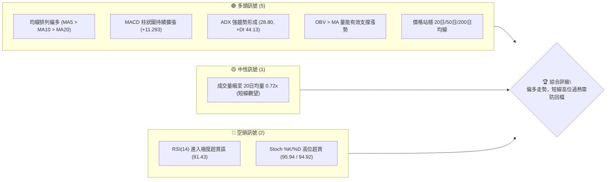
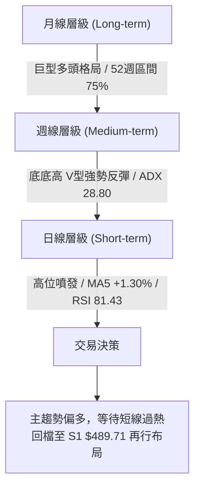
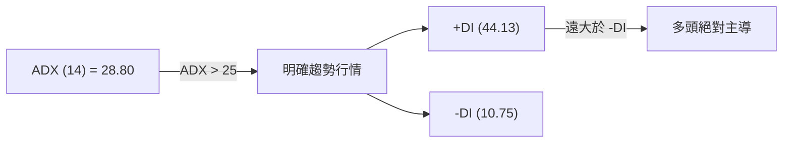
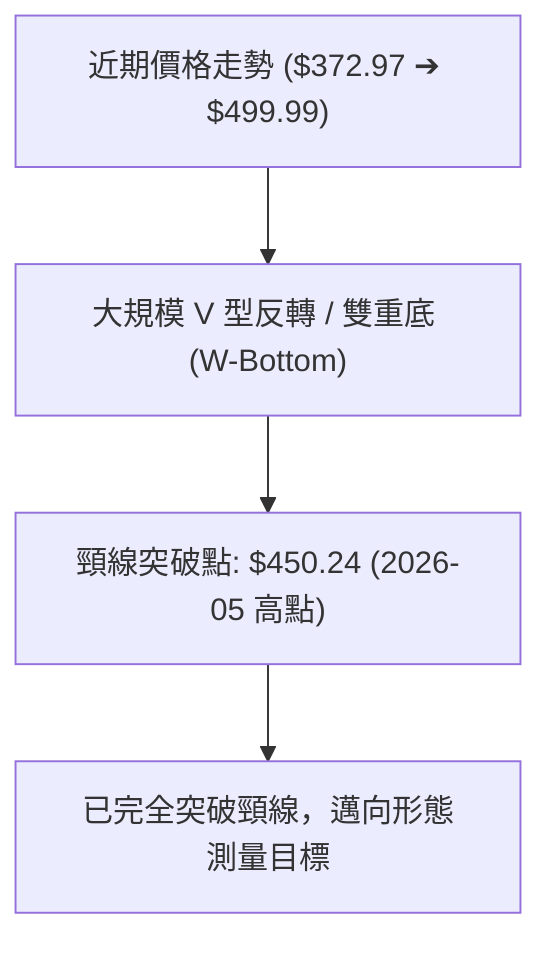
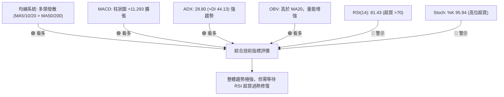
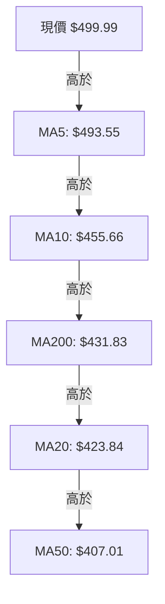
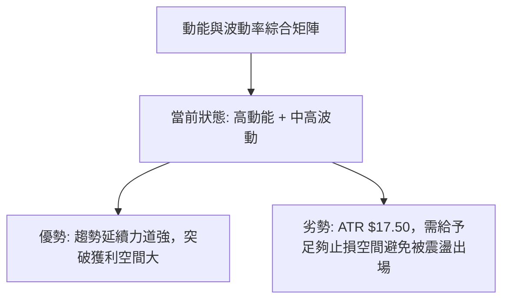
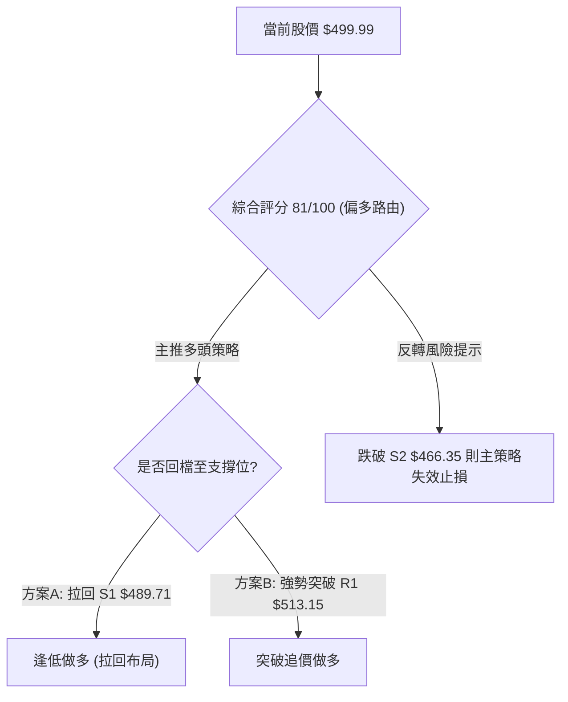
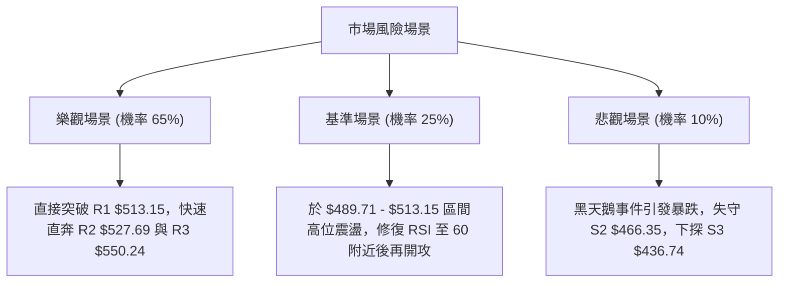

# MSFT 技術分析報告

> **報告日期**：2026-08-09 ｜ **語言**：繁體中文 ｜ **數據來源**：Yahoo Finance ｜ **當前價格**：$499.99

---

## 目錄

| 章節 | 內容 |
|------|------|
| [1. 技術面概覽](#1-技術面概覽) | 訊號儀表板、核心指標、評分卡 |
| [2. 趨勢分析](#2-趨勢分析) | 多時框趨勢、長中短期走勢 |
| [3. 圖表形態分析](#3-圖表形態分析) | 形態識別、K線組合、目標價 |
| [4. 支撐與阻力](#4-支撐與阻力) | 關鍵價位、斐波那契回調 |
| [5. 技術指標深度解讀](#5-技術指標深度解讀) | MA/RSI/MACD/布林/成交量 |
| [6. 動能與波動率](#6-動能與波動率) | 動能評估、ATR、Beta |
| [7. 多時框架總結](#7-多時框架總結) | 時框架評分矩陣 |
| [8. 交易策略建議](#8-交易策略建議) | 多空策略、風險報酬比 |
| [9. 風險提示與監控](#9-風險提示與監控) | 監控指標、風險場景 |

---

## 1. 技術面概覽

### 🎯 技術訊號儀表板



### 📊 核心指標速覽表

| 指標類別 | 指標名稱 | 當前數值 | 訊號 | 解讀 |
|----------|----------|----------|------|------|
| **價格** | 當前價格 | $499.99 | 🟢 多頭 | 接近52週高點區間75.0%分位，短期漲勢強勁 |
| **均線** | MA20 | $423.84 | 🟢 多頭 | 價格高於 MA20 (+17.97%)，中短期均線多頭向上 |
| **均線** | MA50 | $407.01 | 🟢 多頭 | 價格高於 MA50 (+22.84%)，中期支撐強勁 |
| **均線** | MA200 | $431.83 | 🟢 多頭 | 價格高於 MA200 (+15.78%)，長期牛市基調未變 |
| **動能** | RSI(14) | 81.43 | 🔴 超買 | 極度超買 (>70)，技術面存在短期拉回修復需求 |
| **動能** | MACD | 27.576 | 🟢 多頭 | MACD 線高於訊號線 (16.283)，柱狀圖 +11.293 動能充沛 |
| **動能** | ADX(14) | 28.80 | 🟢 強趨勢 | ADX > 25 且 +DI (44.13) 遠高於 -DI (10.75)，多頭主導 |
| **波動** | ATR(14) | $17.50 | 🟡 中等 | 占股價 3.50%，每日波幅適中，提供良好止損參考 |

### 🏆 技術評分卡

```
╔══════════════════════════════════════════════════════════════╗
║              技術評分卡 — MSFT (2026-08-09)                   ║
╠══════════════════════════════════════════════════════════════╣
║ 趨勢強度      ████████████████░░░░  82/100  🟢 偏多          ║
║ 動能指標      ██████████████░░░░░░  70/100  🟡 高位超買      ║
║ 支撐穩定度    ████████████████░░░░  80/100  🟢 強勁          ║
║ 成交量配合    ██████████████░░░░░░  72/100  🟢 OBV配合       ║
║ 形態完整度    ████████████████░░░░  85/100  🟢 V型反轉完成   ║
║ 均線排列      ██████████████████░░  88/100  🟢 全線向上發散  ║
╠══════════════════════════════════════════════════════════════╣
║ 綜合評分      ████████████████░░░░  81/100  🟢 強勢看多      ║
╚══════════════════════════════════════════════════════════════╝
```

---

## 2. 趨勢分析

### 🌐 多時框趨勢分析



### 📈 長期趨勢 — 12個月走勢圖（Unicode）

```
MSFT 月線走勢圖（過去12個月）
價格軸 ($)
$550.24 ┤                                      
$529.27 ┤           ●   ●                      
$503.50 ┤         ●   ●   ●                  ● (現價 $499.99)
$464.72 ┤                   ●              ●   
$428.38 ┤                       ●      ●       
$391.89 ┤                           ●          
$369.37 ┤                                ●     
        └──────────────────────────────────────────────
         08  09  10  11  12  01  02  03  04  05  06  07  08  (月)
```

**走勢特徵分析表格**：

| 時間區段 | 開區/收區價位 | 漲跌幅 | 走勢特徵描述 |
|----------|──────────────|--------|--------------|
| **2025-08 ~ 2025-10** | $503.50 ➔ $514.55 | +2.19% | 歷史高點區間的高位震盪築頂區 |
| **2025-11 ~ 2026-03** | $489.83 ➔ $369.37 | -24.59% | 中期深度修正，觸及 52 週低點區間 $349.20 附近 |
| **2026-04 ~ 2026-05** | $406.90 ➔ $450.24 | +10.65% | 第一波強勁報復性反彈，突破 MA50 |
| **2026-06** | $373.02 | -17.15% | 二次回測底點，形成雙重底/V型二次確認結構 |
| **2026-07 ~ 2026-08** | $464.72 ➔ $499.99 | +34.04% | 主升段噴發，成交量擴張，收復大部分失地 |

### 📊 中期趨勢（週線分析）

中期走勢顯示，MSFT 在 2026 年 3 月底（$356.00）與 6 月底（$372.97）構築了極為堅實的雙底構造。自 2026 年 7 月下旬（$381.70）啟動攻擊以來，僅花費 3 週時間便從 $381.70 直奔 $499.99，突破了多重壓力位。目前價格已進入 R1（$513.15）前的衝刺階段。

### ⚡ 趨勢強度評估（ADX 解讀）



**ADX 趨勢強度對照表**：

| 指標名稱 | 數值 | 門檻區間 | 當前狀態評估 |
|----------|------|----------|--------------|
| **ADX** | **28.80** | > 25.0 | 🟢 **強趨勢啟動**（非盤整行情，順勢操作為主） |
| **+DI** | **44.13** | > 20.0 | 🟢 **買盤強烈**（極高多頭動能） |
| **-DI** | **10.75** | < 15.0 | 🟢 **賣壓沉寂**（空頭無反抗力量） |

---

## 3. 圖表形態分析

### 🔍 形態識別系統



**形態信心度與判斷依據表**（依據數據紀律）：

| 形態類別 | 信心度 | 判斷依據（引用數據） | 完成度 | 目標價（附計算式） |
|----------|--------|----------------------|--------|--------------------|
| **W底 (雙重底)** | **85%** | 第一底 $369.37 (2026-03)，第二底 $372.97 (2026-06)，頸線 $450.24 | 100% (已突破) | $450.24 + ($450.24 - $369.37) = **$531.11**（參考 R2 $527.69） |
| **V型爆發反彈** | **75%** | 近 3 週收盤從 $381.70 急升至 $499.99，週 MACD 柱狀圖從 +0.436 暴增至 +11.293 | 90% | 接近 52週高點 **$550.24** (R3) |

### 🕯️ 重要K線形態分析

| 月份/日期 | 收盤價 | K線形態 | 技術面解讀 | 訊號 |
|-----------|--------|---------|------------|------|
| **2026-06-28 週** | $372.97 | 底部長下影鎚頭線 | 單週爆出 382.7M 超大成交量，主力洗盤吸籌完畢 | 🟢 底訊號 |
| **2026-08-02 週** | $464.72 | 大陽線實體突破 | 帶量突破 50日均線 ($407.01) 與 MA200 ($431.83) | 🟢 強勢突破 |
| **2026-08-09 週** | $499.99 | 強勢連陽噴發 | 無懼 RSI 超買，攻克 $490 關卡，逼近 $500 大關 | 🟢 多頭續強 |

### 📉 ASCII 走勢形態示意圖

```
MSFT W底與V型反轉示意圖
$550.24 ┤                                         [R3 Target]
$527.69 ┤                                   [R2 Target]
$513.15 ┤                             [R1 Resistance]
$499.99 ┤                       ● <--- 現價 $499.99
$450.24 ┤         ● (頸線突破)  /
$418.57 ┤        / \           /
$372.97 ┤  ●----/   \----●----/   <--- 雙底支撐 (Mar/Jun 2026)
        └───────────────────────────────────────────────
```

### 🎯 形態目標價計算

1. **W 底形態測量幅度**：
   - 底點：$369.37（2026-03 低點）
   - 頸線：$450.24（2026-05 高點）
   - 形態高度 = $450.24 - $369.37 = $80.87
   - 形態推算目標價 = $450.24 + $80.87 = **$531.11**（與阻力位 R2 $527.69 密合）

---

## 4. 支撐與阻力

### 🗺️ 關鍵價位分布圖（Unicode）

```
MSFT 價位結構分布圖
═══════════════════════════════════════════════════════════════════
$550.24 ║████████████████████████████████████████║ 強阻力 R3 (52W High)
$527.69 ║██████████████████████████████          ║ 阻力 R2 (形態目標)
$513.15 ║██████████████████████                  ║ 近期阻力 R1
$502.79 ║────────────────────────────────────────║ 斐波那契 23.6% 回調位
$499.99 ╠════════════════════════════════════════╣ ◄ 現價 $499.99
$489.71 ║▓▓▓▓▓▓▓▓▓▓▓▓▓▓▓▓▓▓▓▓▓▓▓▓                ║ 近期第一支撐 S1
$473.44 ║────────────────────────────────────────║ 斐波那契 38.2% 回調位
$466.35 ║██████████████████████████████          ║ 強支撐 S2 (波段樞紐)
$449.72 ║────────────────────────────────────────║ 斐波那契 50.0% 回調位
$436.74 ║████████████████████████████████████████║ 核心強支撐 S3 (MA200 區)
═══════════════════════════════════════════════════════════════════
```

### 🚧 阻力位分析表

| 阻力級別 | 精確價位 | 形成原因（依據數據） | 突破難度 | 重要性 |
|----------|----------|----------------------|----------|--------|
| **R1** | **$513.15** | 近一年波段高點聚類 / 距離現價 +2.63% | 🟡 中等 | 短線多頭衝刺第一關卡 |
| **R2** | **$527.69** | 近一年波段高點聚類 / 形態測量目標 (+5.54%) | 🔴 較高 | 中期重要多空分水嶺 |
| **R3** | **$550.24** | 52 週歷史最高價 (+10.05%) | 🔴 極高 | 歷史天花板壓力區 |

### 🛡️ 支撐位分析表

| 支撐級別 | 精確價位 | 形成原因（依據數據） | 守住機率 | 重要性 |
|----------|----------|----------------------|----------|--------|
| **S1** | **$489.71** | 近一年波段低點聚類 / 距離現價 -2.06% | 🟢 極高 | 短線拉回第一買點防線 |
| **S2** | **$466.35** | 近一年波段低點聚類 (-6.73%) | 🟢 高 | 中期強弱轉換臨界點 |
| **S3** | **$436.74** | 接近 MA200 ($431.83) 與 MA20 ($423.84) 均線帶 | 🟢 極高 | 牛熊大本營核心防線 |

### 📐 斐波那契回調位分析

依據 52 週高低點區間（$349.20 ➔ $550.24）計算之斐波那契回調位如下：

| 斐波那契層級 | 精確價位 | 現價相對位置與技術意義解讀 |
|--------------|----------|----------------------------|
| **0.0% (52W High)** | **$550.24** | 歷史高點 R3 |
| **23.6%** | **$502.79** | **現價 ($499.99) 緊貼此處**，僅差 0.56%。若成功站穩 $502.79，宣告回調行情徹底結束 |
| **38.2%** | **$473.44** | 黃金分割回調第一區間，位於 S1 ($489.71) 與 S2 ($466.35) 之間，為強烈支撐帶 |
| **50.0%** | **$449.72** | 中軸位置，與突破之 W 底頸線 $450.24 重合，具備極強支撐力 |
| **61.8%** | **$426.00** | 黃金分割關鍵防線，與 MA20 ($423.84) 形成雙重支撐 |
| **78.6%** | **$392.22** | 深修正防線 |
| **100.0% (52W Low)**| **$349.20** | 52 週最低點 |

---

## 5. 技術指標深度解讀

### 🎛️ 指標訊號總覽



### 📈 移動平均線排列分析



**均線數據詳細分析**：
- **短中期均線 (MA5/MA10/MA20)**：呈現完美多頭向上發散，MA5 ($493.55) 剛好提供現價第一道動態支撐。
- **長天期均線 (MA200/MA240)**：現價遠高於 MA200 ($431.83) +15.78%，且 MA200 已止跌走平回升，確認長期牛市軌道。

### 📉 RSI(14) 分析

**RSI 當前狀態**：
- **數值**：**81.43**
- **強度條**：████████████████████ 81.43%（🔴 極度超買）

**背離診斷**：
- **結論**：**無明顯頂背離**。
- **解讀**：價格在 2026-08 創出波段新高 ($499.99)，RSI 同步創出近期新高 (81.43)，呈現「價漲指標高」的順勢配合狀態。雖然 RSI > 81 顯示短線追高風險極高，但無背離意味著主升趨勢尚未見頂，拉回仍是買點。

### 📊 MACD(12/26/9) 訊號解讀

- **MACD 線**：27.576
- **Signal 線**：16.283
- **MACD 柱狀圖**：**+11.293** (🟢 看多)
- **分析**：MACD 線快速穿過 Signal 線並大幅向上張口，柱狀圖持續擴張（週 MACD 柱亦高達 +11.293），顯示買盤動能處於極度充沛狀態。

### 📦 布林通道分析

```
MSFT 布林通道結構示意圖
$516.46 ┤------------------------------------ BB 上軌 (高點阻力)
$499.99 ┤                       ● (現價, %B = 0.91)
$423.84 ┤------------------------------------ BB 中軌 (MA20 強支撐)
$331.21 ┤------------------------------------ BB 下軌
```

- **BB 上軌**：$516.46
- **BB 中軌 (MA20)**：$423.84
- **BB 下軌**：$331.21
- **BB %B**：**0.91**（處於上軌與中軌之間的極高位）
- **解讀**：價格貼近上軌 ($516.46) 推進，通道呈現開口擴張形態，屬典型「沿上軌強勢噴發」走勢。

### 💹 成交量分析（量價配合度）

- **最新成交量**：28,818,000 股
- **20 日均量**：39,781,560 股（量比 0.72x）
- **OBV 趨勢**：OBV > MA，量能指標呈向上趨勢。
- **解讀**：最新單日成交量雖較 20 日均量有所萎縮（0.72x），但觀察近 2 週（08-02、08-09）週成交量高達 2.78 億與 2.15 億股，顯示大資金在中期突破時已大量鎖籌，目前的縮量上攻反映籌碼極度穩定、賣壓輕微。

---

## 6. 動能與波動率

### ⚡ 動能評估

| 象限維度 | 衡量指標 | 當前數值/狀態 | 評估結論 |
|----------|----------|---------------|----------|
| **動能強度 (Momentum)** | MACD Hist / +DI | +11.293 / 44.13 | 🟢 **極強** (強烈買盤主導) |
| **波動率 (Volatility)** | ATR(14) / BB%B | $17.50 (3.50%) / 0.91 | 🟡 **中高** (波幅擴大，強勢高位) |



### 📊 ATR 波動率分析

- **ATR(14)**：**$17.50**（占當前股價 3.50%）
- **風控應用**：
  - **1x ATR 止損距離**：$17.50（適用於極短線沖銷）
  - **2x ATR 止損距離**：$35.00（適用於波段交易，可防止正常技術性回檔誤觸止損）

### 📐 Beta 與市場相關性

- **Beta**：**1.099**
- **解讀**：Beta 略高於 1.0，表明 MSFT 彈性略高於美股大盤（S&P 500），在大盤多頭環境下具備良好的領漲能力。

---

## 7. 多時框架總結

### 📋 時框架評分表

| 時框架 | 趨勢方向 | 動能指標 | 均線排列 | 形態結構 | 綜合評分 | 交易建議 |
|--------|----------|----------|----------|----------|----------|----------|
| **月線 (Long)** | 🟢 偏多 | 🟢 看多 | 🟢 多頭 | 🟢 牛市延續 | **85/100** | 長線持股續抱 |
| **週線 (Medium)**| 🟢 偏多 | 🟢 強勁 | 🟢 多頭 | 🟢 W底突破 | **88/100** | 中期拉回加碼 |
| **日線 (Short)** | 🟢 偏多 | 🔴 超買 | 🟢 多頭 | 🟡 高位推升 | **72/100** | 短線切勿追高，等待拉回 |

### 🔲 綜合訊號矩陣

| 維度 | 短期 (日線) | 中期 (週線) | 長期 (月線) | 一致性評估 |
|------|-------------|-------------|-------------|------------|
| **方向** | 偏多 (超買) | 強勢多頭 | 多頭格局 | 🟢 **極高（全時框共振偏多）** |
| **動能** | 動能強但超買 | MACD 暴增 | 穩定向上 | 🟡 **短線存在指標修復需求** |
| **關鍵價位**| R1 $513.15 | R2 $527.69 | R3 $550.24 | 🟢 **層層遞進目標明確** |

### ⚖️ 多時框收斂結論

依據多時框收斂規則：
1. **當前行情屬性**：ADX(14) = 28.80 (>25)，確定為**強趨勢行情**。
2. **主導時框**：以**週線/中長期趨勢為主導**（多頭絕對控制），日線僅用於尋找拉回進場點。
3. **收斂結論**：**整體方向明確看多**。雖然日線 RSI(81.43) 出現高位過熱訊號，但在強趨勢行情下，超買指標往往以「橫盤代跌」或「小幅拉回 S1 $489.71」的方式完成消化。因此，交易策略**嚴禁做空**，應堅定採取「**拉回尋找支撐做多**」之主策略。

---

## 8. 交易策略建議

### 🗺️ 策略決策流程圖



### 🧭 策略路由

**當前主策略方向：🟢 強勢多頭布局（綜合評分：81/100）**

因評分高達 81 分且 ADX 呈現強趨勢，本報告主推多頭策略。空頭方向僅作風險對沖與失效觸發點提示。

### 🎯 價格情境階梯（Price Scenarios）

| 觸發條件 | 下一目標 | 後續延伸 | 情境含義 |
|----------|----------|----------|----------|
| **突破 R1 $513.15** | R2 $527.69 | R3 $550.24 | 主升段加速，挑戰歷史新高 |
| **站穩 S1 $489.71** | 現價區間 ($499.99) | R1 $513.15 | 健康高位消化超買，蓄勢再攻 |
| **跌破 S1 $489.71** | S2 $466.35 | S3 $436.74 | 技術性深度回檔（測試 MA200 支撐） |

### 📊 情境機率分佈

| 情境劇本 | 機率估計 | 主要依據 |
|----------|----------|----------|
| **高位整理後突破上行** | **65%** | ADX 28.80 強趨勢、+DI 44.13、週 MACD 柱狀圖擴張、OBV 支撐 |
| **$489.71 ~ $513.15 區間震盪** | **25%** | 日線 RSI (81.43) 極度超買需要時間消化修復 |
| **深度回落至 S2/S3** | **10%** | 目前賣壓沉寂（-DI 僅 10.75），除非市場出現系統性黑天鵝 |

### 🟢 主策略詳情

| 策略要素 | 策略 A：拉回低吸（優先推薦） | 策略 B：突破追擊（順勢加碼） |
|----------|------------------------------|------------------------------|
| **進場條件** | 股價回檔至 S1 附近獲得 K 線止跌確認 | 股價帶量突破 R1 阻力位 |
| **進場價格** | **$489.71** (S1 支撐位) | **$513.15** (突破 R1 時) |
| **目標價 T1** | **$527.69** (R2 阻力位) | **$550.24** (R3 / 52W High) |
| **目標價 T2** | **$550.24** (R3 阻力位) | **$563.84** (分析師平均目標價) |
| **止損價格** | **$466.35** (S2 支撐位) | **$489.71** (原 S1 轉為支撐位) |
| **風險報酬比**| **1.63 : 1** `($37.98 / $23.36)` | **1.58 : 1** `($37.09 / $23.44)` |
| **成功機率** | **70%** | **60%** |
| **建議倉位** | **15% ~ 20%** | **10% ~ 15%** |

### 🔴 反向風險觸發點（對沖提示）

- **失效對沖位**：若股價收盤價跌破 **$466.35 (S2)**，代表雙底突破形態失效，中期多頭架構遭到破壞，應立即清倉多頭多單並進行風險對沖。

### ⭐ 整體訊號強度評星

```
做多訊號強度：★★███  (4/5 星) — 趨勢明確，僅受限短線超買
做空訊號強度：★░░░░  (1/5 星) — 逆勢風險極高
整體可信度：  ★★███  (4/5 星) — 多時框指標高度共振
```

---

## 9. 風險提示與監控

### ✅ 關鍵監控指標 Checklist

```
╔══════════════════════════════════════════════════════════════╗
║                每日技術面風控監控 CheckList                  ║
╠══════════════════════════════════════════════════════════════╣
║ [ ] RSI(14) 是否跌破 70 順利完成超買降溫？                  ║
║ [ ] 股價拉回時，S1 $489.71 是否展現有效支撐？                ║
║ [ ] 成交量是否在攻擊 R1 $513.15 時擴張至 40M 股以上？         ║
║ [ ] MACD 柱狀圖 (+11.293) 是否出現高位收蝕現象？             ║
║ [ ] BB 上軌 $516.46 是否形成短線壓制？                        ║
╚══════════════════════════════════════════════════════════════╝
```

### ⚠️ 風險場景分析



### 🛡️ 風險管理重要提醒

1. **嚴禁高位追漲**：當前 RSI 高達 81.43，短線回調概率顯著提升，耐心等待拉回 S1 ($489.71) 附近再行布局，以獲得更優之風險報酬比。
2. **動態止損調整**：若股價順利突破 R1 ($513.15)，應立即將止損價由 S2 ($466.35) 上移至 S1 ($489.71)，鎖定既有利潤。

---

## 📋 報告總結

```
╔══════════════════════════════════════════════════════════════╗
║              MSFT 技術分析報告總結 (2026-08-09)              ║
╠══════════════════════════════════════════════════════════════╣
║ 當前價格：$499.99                                           ║
║ 分析評級：🟢 強勢看多 (看多但防短線回檔)                       ║
║                                                              ║
║ 關鍵結論：                                                   ║
║ ├─ 長期趨勢：🟢 偏多 (牛市軌道，遠高於 MA200 $431.83)        ║
║ ├─ 中期趨勢：🟢 強勢 (W底形態完成，突破頸線 $450.24)          ║
║ ├─ 短期趨勢：🟡 過熱 (RSI 81.43 超買，關注 S1 $489.71 支撐)   ║
║ ├─ 關鍵支撐：S1 $489.71 ｜ S2 $466.35 ｜ S3 $436.74           ║
║ ├─ 關鍵阻力：R1 $513.15 ｜ R2 $527.69 ｜ R3 $550.24           ║
║ └─ 分析師目標：$563.84 (Mean)                                 ║
║                                                              ║
║ 最優策略組合：                                               ║
║ 1. 🥇 最佳機會：拉回 S1 $489.71 分批布局，目標 R2 $527.69     ║
║ 2. 🥈 次選機會：突破 R1 $513.15 順勢追價，目標 R3 $550.24     ║
║ 3. 🥉 風控防線：嚴格以 S2 $466.35 作為中期多頭停損點          ║
╚══════════════════════════════════════════════════════════════╝
```

---

> ⚠️ **免責聲明**：本報告為 AI 自動生成之技術分析，所有數據及估算均基於提供的歷史價格資訊。本報告**僅供研究與學術參考**，**不構成任何投資建議**。投資有風險，入市需謹慎。

---

*報告生成時間：2026-08-09 ｜ 數據來源：Yahoo Finance ｜ 分析框架：多時框技術分析*