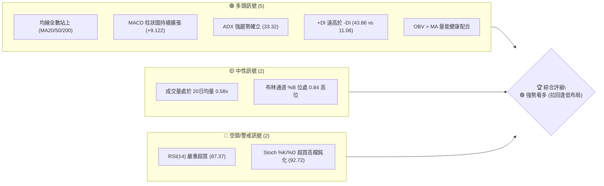
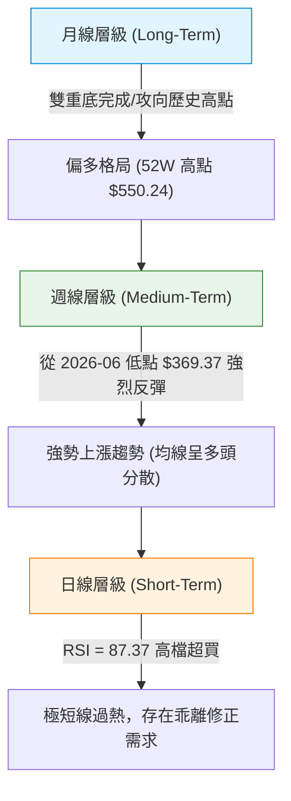
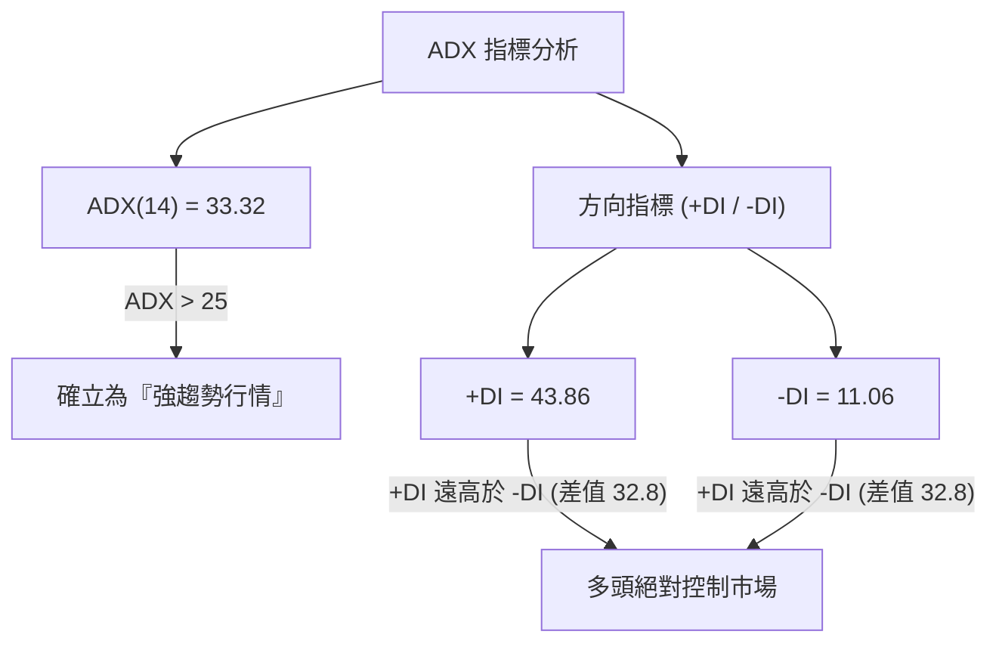
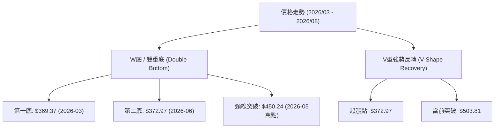
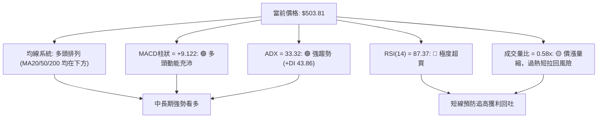
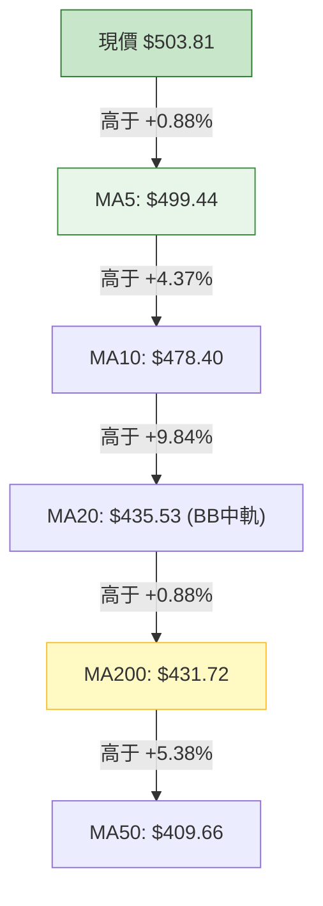
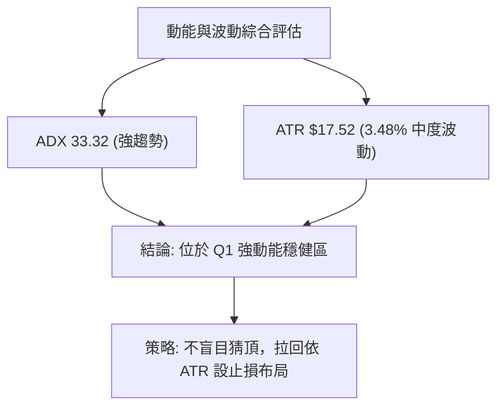
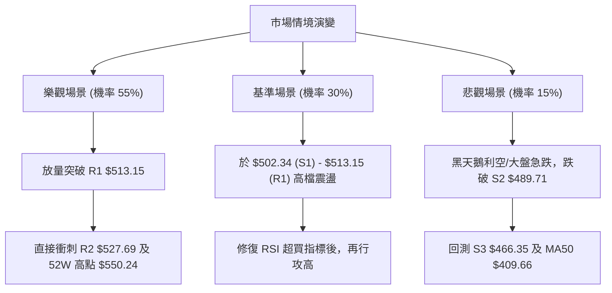

# MSFT 技術分析報告

> **報告日期**：2026-08-11 ｜ **語言**：繁體中文 ｜ **數據來源**：Yahoo Finance ｜ **當前價格**：$503.81

---

## 目錄

| 章節 | 內容 |
|------|------|
| [1. 技術面概覽](#1-技術面概覽) | 訊號儀表板、核心指標、評分卡 |
| [2. 趨勢分析](#2-趨勢分析) | 多時框趨勢、長中短期走勢 |
| [3. 圖表形態分析](#3-圖表形態分析) | 形態識別、K線組合、目標價 |
| [4. 支撐與阻力](#4-支撐與阻力) | 關鍵價位、斐波那契回調 |
| [5. 技術指標深度解讀](#5-技術指標深度解讀) | MA/RSI/MACD/布林/成交量 |
| [6. 動能與波動率](#6-動能與波動率) | 動能評估、ATR、Beta |
| [7. 多時框架總結](#7-多時框架總結) | 時框架評分矩陣 |
| [8. 交易策略建議](#8-交易策略建議) | 多空策略、風險報酬比 |
| [9. 風險提示與監控](#9-風險提示與監控) | 監控指標、風險場景 |

---

## 1. 技術面概覽

### 🎯 技術訊號儀表板



### 📊 核心指標速覽表

| 指標類別 | 指標名稱 | 當前數值 | 訊號 | 解讀 |
|----------|----------|----------|------|------|
| **價格** | 當前價格 | $503.81 | 🟢 | 位於52週區間 76.9% 位置，持續攻高 |
| **均線** | MA20 | $435.53 | 🟢 | 價格在MA20上方 (+15.68%)，短中期均線向上 |
| **均線** | MA50 | $409.66 | 🟢 | 價格在MA50上方 (+22.98%)，中期結構強勁 |
| **均線** | MA200 | $431.72 | 🟢 | 價格在MA200上方 (+16.70%)，長線牛市格局 |
| **動能** | RSI(14) | 87.37 | 🔴 | 極度超買 (>70)，短線累積極高獲利回吐壓力 |
| **動能** | MACD | +9.122 | 🟢 | DIF與DEA保持多頭擴張，多頭動能充沛 |
| **動能** | ADX(14) | 33.32 | 🟢 | 強趨勢行情 (>25)，+DI (43.86) 完全主導 |
| **通道** | 布林通道 | $536.66 / $334.41 | 🟢 | 位於上軌附近 (%B = 0.84)，沿上軌推進 |
| **波動** | ATR(14) | $17.52 | 🟡 | 日均波動幅度 3.48%，屬正常中高波動範圍 |

### 🏆 技術評分卡

```
╔══════════════════════════════════════════════════════════════════╗
║                 技術評分卡 — MSFT (2026-08-11)                  ║
╠══════════════════════════════════════════════════════════════════╣
║ 趨勢強度 (ADX/+DI)    █████████████████░░░  85/100  🟢 強勢多頭   ║
║ 動能指標 (RSI/MACD)   ██████████████░░░░░░  70/100  🟡 動能極強但超買 ║
║ 支撐穩定度 (Fib/S1)   ████████████████░░░░  80/100  🟢 502/489層層防禦 ║
║ 成交量配合 (OBV/Vol)  █████████████░░░░░░░  65/100  🟡 縮量上漲，動能遞減 ║
║ 形態完整度 (V型反轉)  ████████████████░░░░  80/100  🟢 底態明確突破      ║
║ 均線排列 (多頭排列)   █████████████████░░░  85/100  🟢 站上全部主均線    ║
╠══════════════════════════════════════════════════════════════════╣
║ 綜合評分              ███████████████░░░░░  77.5/100 🟢 強勢看多 ║
╚══════════════════════════════════════════════════════════════════╝
```

---

## 2. 趨勢分析

### 🌐 多時框趨勢分析



### 📈 長期趨勢 — 12個月走勢圖（Unicode）

```
MSFT 月線走勢圖（2025-09 至 2026-08）
價格軸 ($)
$550.24 ┤                                               [52W High $550.24]
$529.27 ┤                           ●
$514.69 ┤               ●     ●                                   ● $503.81 (現在)
$481.48 ┤                     └─●                               ●
$450.24 ┤                                                 ●
$406.90 ┤                            ●              ●
$369.37 ┤                                  ●  ●  ● (2026-03/06 低點)
        └─┬─────┬─────┬─────┬─────┬─────┬─────┬─────┬─────┬─────┬─────┬─────
         09/25 10/25 11/25 12/25 01/26 02/26 03/26 04/26 05/26 06/26 07/26 08/26
```

**歷史走勢特徵分析表**：

| 階段 | 時間區間 | 收盤價變化 | 漲跌幅 | 走勢特徵描述 |
|------|----------|------------|--------|--------------|
| **高檔震盪** | 2025-08 ~ 2025-10 | $503.50 → $514.55 | +2.19% | 頂部衝高受阻於 $529.27，量能開始退潮 |
| **深幅回調** | 2025-11 ~ 2026-03 | $489.83 → $369.37 | -24.59% | 跌破 MA200，探尋 52 週低點區間 $349.20~$369.37 |
| **築底反彈** | 2026-04 ~ 2026-05 | $406.90 → $450.24 | +10.65% | 第一次強勢反彈，突破 MA50，隨後在 6月再次回測 |
| **二次探底** | 2026-06 | $373.02 | -17.15% | 二次確認底部 $372.97，形成強烈雙底結構 |
| **主升攻擊** | 2026-07 ~ 2026-08 | $464.72 → $503.81 | +35.06% | 展開暴力拉升，連穿 MA20/50/200，直逼 500 大關 |

### 📊 中期趨勢（週線分析）

從近 20 週數據觀察，MSFT 於 2026年6月末在 $372.97 附近完成落底（週成交量爆出 3.82 億股天量），隨後於 7月至 8月展開凌厲的「V型強勢反彈」。
- **週線 MACD**：柱狀圖由 2026-06-21 的 -5.056 強勢翻紅至目前的 +9.122，動能持續擴張。
- **週線 RSI**：由 18.6（超賣極致）飆升至 87.4（強勢超買），說明市場買盤極度強勁，但也意味著短線獲利盤隨時可能湧出。

### ⚡ 趨勢強度評估（ADX 解讀）



**ADX 趨勢強度對照表**：

| 指標名稱 | 當前數值 | 參考門檻 | 當前市場狀態判定 | 交易策略導向 |
|----------|----------|----------|------------------|--------------|
| **ADX** | **33.32** | > 25 (強趨勢) | 🟢 強烈趨勢行情，非盤整格局 | 順勢操作，逢拉回做多 |
| **+DI** | **43.86** | > 20 (多頭活躍) | 🟢 多頭力量居於絕對優勢 | 持有多單，避免逆勢做空 |
| **-DI** | **11.06** | < 15 (空頭萎縮) | 🟢 空頭拋壓降至極低水平 | 空方不具備反攻條件 |

---

## 3. 圖表形態分析

### 🔍 形態識別系統



**形態信心度與目標價評估表**：

| 形態類別 | 信心度 | 判斷依據（引用數據） | 完成度 | 目標價（附計算式） |
|----------|--------|----------------------|--------|--------------------|
| **雙重底 (W底)** | **85%** | 兩次低點 $369.37 與 $372.97 構成雙底，並於 8月強勢突破頸線 $450.24 | 100% (已突破) | 頸線 $450.24 + (頸線 $450.24 - 低點 $369.37) = **$531.11** |
| **布林通道上軌突破** | **70%** | 當前價 $503.81 貼近上軌 $536.66，%B = 0.84 | 84% | 通道頂部延伸至 **$536.66** |
| **均線黃金交叉** | **90%** | 短期 MA5/10/20 強勢向上穿過 MA50/200，多頭排列成立 | 100% | 第一波段目標看阻力 R2 **$527.69** |

### 🕯️ 重要K線形態分析

| 月份 | 收盤價 | K線形態 | 解讀 | 訊號 |
|------|--------|---------|------|------|
| **2026-05** | $450.24 | 長紅實體突破 | 反彈試探 MA50 壓力，確立第一波買盤進駐 | 🟢 多頭 |
| **2026-06** | $373.02 | 下影線測底（鎚子線） | 二次探底成功，天量換手，賣壓竭盡 | 🟢 築底完成 |
| **2026-07** | $464.72 | 大陽線覆蓋 | 吞噬前期跌幅，直接收復 400 及 450 關卡 | 🟢 強烈買訊 |
| **2026-08** | $503.81 | 光頭中陽線（進行中） | 站上 500 大關，多頭攻勢銳不可擋 | 🟢 主升段 |

### 📉 ASCII 走勢形態示意圖

```
MSFT 雙底 (W-Bottom) 與 V型反轉結構
------------------------------------------------------------------
$550.24 ┤                                               [52W High / 最終目標]
        │
$527.69 ┤                                         ▲ [阻力 R2 / W底目標價 $531]
        │                                       ╱
$503.81 ┤─────────────────────────────────────●─── [當前價格 / 攻克 500]
        │                                   ╱
$450.24 ┤───────────▲─────────────────────●─────── [頸線突破位 / MA50]
        │         ╱   ╲                 ╱
$400.00 ┤       ╱       ╲             ╱
        │     ╱           ╲         ╱
$369.37 ┤───●───────────────●─────●────────────── [左底 $369.37 / 右底 $372.97]
        └─ 2026/03        2026/06  2026/08
------------------------------------------------------------------
```

### 🎯 形態目標價計算

1. **W底形態推算目標價**：
   - 底部平均區間：$369.37
   - 頸線關鍵阻力：$450.24
   - 形態高度：$450.24 - $369.37 = $80.87
   - **最小測量目標價**：$450.24 + $80.87 = **$531.11**（落於阻力 R2 $527.69 附近）

2. **52週區間測量目標**：
   - 歷史高點：$550.24 (即 R3)

---

## 4. 支撐與阻力

### 🗺️ 關鍵價位分布圖（Unicode）

```
MSFT 價位結構分布圖 (由 OHLCV 實測數據計算)
═══════════════════════════════════════════════════════════════════
$550.24 ║████████████████████████████████████████║ 強阻力 R3 (52W High)
$527.69 ║████████████████████████████            ║ 阻力 R2 (波段高點聚類)
$513.15 ║████████████████████                    ║ 關鍵阻力 R1 (短線突破口)
$503.81 ╠════════════════════════════════════════║ ◄ 現價 (位於 23.6% 回調位上方)
$502.34 ║▓▓▓▓▓▓▓▓▓▓▓▓▓▓▓▓▓▓▓▓▓▓▓▓▓▓▓▓▓▓▓▓        ║ 近期第一支撐 S1 (Fib 23.6% $502.79)
$489.71 ║████████████████████████                ║ 強支撐 S2 (11月波段高點/回測點)
$466.35 ║████████████                            ║ 關鍵支撐 S3 (攻防防線)
═══════════════════════════════════════════════════════════════════
```

### 🚧 阻力位分析表

| 阻力級別 | 價位 | 形成原因 | 突破難度 | 重要性 |
|----------|------|----------|----------|--------|
| **R1** | **$513.15** | 近一年波段高點聚類 / 極短線衝高高點 | 🟡 中等 | 短線多頭續強解鎖開關，突破後將加速衝向 $527 |
| **R2** | **$527.69** | 近一年波段次高點 / W底形態測量目標 ($531.11) 壓制區 | 🔴 較難 | 中期解套盤與獲利盤交會點，需天量配合突破 |
| **R3** | **$550.24** | 52 週歷史高點 (52W High) | 🔴 極難 | 歷史天花板，強烈心理關卡與長線獲利結算點 |

### 🛡️ 支撐位分析表

| 支撐級別 | 價位 | 形成原因 | 守住機率 | 重要性 |
|----------|------|----------|----------|--------|
| **S1** | **$502.34** | 500整數關卡 / 斐波那契 23.6% ($502.79) 重疊區 | 🟢 極高 (80%) | 短線第一防線，守住代表多頭極度強勢 |
| **S2** | **$489.71** | 近一年波段低點聚類 / 2025年11月回檔低點 | 🟢 高 (75%) | 中期強弱分水嶺，拉回不破此位視為健康回測 |
| **S3** | **$466.35** | 7月強勢起漲波段中繼站 | 🟢 極高 (90%) | 多頭陣營底線，跌破則宣告V型反轉結構破壞 |

### 📐 斐波那契回調位分析

依據 52 週波段區間（低點 **$349.20** → 高點 **$550.24**，幅度 $201.04）計算：

| 斐波那契比例 | 價位 | 當前相對位置與意義解讀 |
|--------------|------|------------------------|
| **0.0%** (52W High) | **$550.24** | 頂部阻力位 R3 |
| **23.6%** | **$502.79** | **◄ 現價 ($503.81) 剛好站上此位**。短線超強強弱分界，守穩此位代表強勢主升 |
| **38.2%** | **$473.44** | 健康拉回深度，若短線拉回至此屬極佳逢低買點 |
| **50.0%** | **$449.72** | 中軸防線，與 MA50 ($409.66) 及 頸線 $450.24 形成強力支撐共振 |
| **61.8%** | **$426.00** | 黃金分割防線，與 MA200 ($431.72) / MA20 ($435.53) 區域交會 |
| **78.6%** | **$392.22** | 深幅回檔底線 (接近 2026-02/06 探底區) |
| **100.0%** (52W Low) | **$349.20** | 52週最低點 |

**解讀**：現價 $503.81 正精準運行於 23.6% ($502.79) 斐波那契位與 S1 ($502.34) 之上，該價位疊加了整數關卡 $500，形成短線極強的「支撐共振區」。

---

## 5. 技術指標深度解讀

### 🎛️ 指標訊號總覽



### 📈 移動平均線排列分析



**均線狀態說明**：
- **短中期均線 (MA5/10/20)** 呈現完美的角沖向上噴發形態。
- **MA20 ($435.53)** 已向上穿越 **MA200 ($431.72)**，形成長線**「黃金交叉」**，確認多頭大趨勢轉向。
- 價格遠離 MA20 達 +15.68%，顯示短線正處於乖離偏大的主升段，隨時可能向 MA5/MA10 進行均線修正。

### 📉 RSI(14) 分析

- **RSI(14) 數值**：`█████████░ 87.37` （🔴 嚴重超買）
- **超買超賣判讀**：RSI 突破 70 進入強烈超買區，目前高達 87.37，表明市場買氣處於極度狂熱狀態。在強趨勢（ADX > 25）中，RSI 可以在超買區「鈍化」相當長一段時間，但投資人仍需慎防無預警的單日急跌修正。
- **背離分析**：觀察近 20 週走勢，RSI 伴隨價格一路飆升（由 18.6 → 87.4），價格創波段新高，RSI 同步創新高，**無明顯頂背離**現象。

### 📊 MACD(12/26/9) 訊號解讀

- **MACD 快線 (DIF)**：30.308
- **MACD 慢線 (DEM)**：21.186
- **MACD 柱狀圖 (Histogram)**：**+9.122** (🟢 保持正值且持續擴張)
- **訊號解析**：DIF 與 DEA 於零軸上方保持強烈多頭張開，柱狀圖高達 +9.122，無任何死叉或走弱跡象，證明此波攻勢由主力實質買盤推升。

### 📦 布林通道分析

```
MSFT 布林通道結構 (BB 20, 2)
------------------------------------------------------------------
$536.66 ┤────────────────────────────────────────── BB上軌 (壓力)
        │                                 ● $503.81 (%B = 0.84)
$435.53 ┤────────────────────────────────────────── BB中軌 (MA20支撐)
        │
$334.41 ┤────────────────────────────────────────── BB下軌
------------------------------------------------------------------
```

- **上軌**：$536.66 ｜ **中軌 (MA20)**：$435.53 ｜ **下軌**：$334.41
- **通道指標 (%B)**：**0.84**
- **形態分析**：通道呈擴張吹喇叭狀態，價格高懸於上軌下方附近 (%B = 0.84)，沿著上軌進行「逼空式」單邊上漲。

### 💹 成交量分析（量價配合度）

- **最新成交量**：22,984,523 股
- **20日均量**：39,653,561 股（**量比 0.58x**）
- **OBV 趨勢**：**OBV > MA** (能量潮指標高於其移動平均線)
- **量價關係解讀**：目前價格攻高至 $503.81，但單日成交量僅為 20日均量的 58%，呈現「價漲量縮」的短線動能遞減訊號。儘管 OBV 中長線量能健康，但短線缺乏大增量配合，增大了衝高受阻於 R1 $513.15 後回檔整理的機率。

---

## 6. 動能與波動率

### ⚡ 動能與波動四象限分析

| 象限 | 動能強度 | 波動率狀態 | MSFT 當前定位 | 交易策略提示 |
|------|----------|------------|---------------|--------------|
| **Q1 (高動能 / 低波動)** | 強 (ADX 33.32) | 低-中 (ATR 3.48%) | **✓ 當前位置** | 最佳順勢趨勢波段，控管好止損可持續持股 |
| **Q2 (弱動能 / 低波動)** | 弱 | 低 | - | 盤整觀望 |
| **Q3 (強動能 / 高波動)** | 強 | 高 (ATR > 5%) | - | 高風險劇烈沖洗，縮小倉位 |
| **Q4 (弱動能 / 高波動)** | 弱 | 高 | - | 避免進場 |



### 📊 ATR 波動率分析

- **ATR(14)**：**$17.52**（占當前股價 3.48%）
- **每日波動區間**：預期 MSFT 每日正常價格波動範圍約為 ±$17.52。
- **風控止損距離建議**：
  - **短線緊密止損 (1.0x ATR)**：$17.52 → 進場價下方 $17.52
  - **標準波段止損 (1.5x ATR)**：$26.28 → 進場價下方 $26.28
  - **寬鬆趨勢止損 (2.0x ATR)**：$35.04 → 進場價下方 $35.04

### 📐 Beta 與市場相關性

- **Beta**：**1.099**
- **解析**：MSFT 的波動性略高於美股大盤（S&P 500）約 9.9%。在整體科技股大牛市中，MSFT 具備帶領大盤衝鋒的強勢 Beta 特性，適合做為多頭核心配置標的。

---

## 7. 多時框架總結

### 📋 時框架評分表

| 時框架 | 趨勢方向 | 動能狀態 (RSI/MACD) | 均線排列 | 圖表形態 | 綜合評分 | 交易建議 |
|--------|----------|---------------------|----------|----------|----------|----------|
| **月線 (Long)** | 🟢 看多 | 🟢 多頭擴張 | 🟢 站在所有月均線上 | W底突破 | **85/100** | 長線堅定持有，目標看 550 |
| **週線 (Medium)**| 🟢 強勢多頭 | 🔴 RSI 87.4 超買 | 🟢 黃金交叉成立 | V型反轉 | **80/100** | 中線分批布局，逢拉回加碼 |
| **日線 (Short)** | 🟡 短線過熱 | 🔴 超買 + 價漲量縮 | 🟢 短期多頭排列 | 挑戰 R1 513 | **68/100** | 避免追高，等待拉回 S1/S2 |

### 🔲 綜合訊號矩陣

```
╔══════════════════════════════════════════════════════════════════╗
║                    MSFT 多時框綜合訊號矩陣                       ║
╠══════════════════╦══════════════╦══════════════╦═════════════════╣
║ 維度             ║ 長期 (月線)  ║ 中期 (週線)  ║ 短期 (日線)     ║
╠══════════════════╬══════════════╬══════════════╬═════════════════╣
║ 趨勢方向         ║ 🟢 偏多      ║ 🟢 強多      ║ 🟢 強多         ║
║ 均線架構         ║ 🟢 多頭      ║ 🟢 金叉      ║ 🟢 噴發多頭     ║
║ 動能指標         ║ 🟢 轉強      ║ 🔴 極度超買  ║ 🔴 嚴重超買     ║
║ 成交量能         ║ 🟢 穩健      ║ 🟢 爆量底攻  ║ 🟡 價漲量縮     ║
║ 關鍵關卡         ║ 52W高 $550   ║ 阻力R2 $527  ║ 支撐S1 $502     ║
╚══════════════════╩══════════════╩══════════════╩═════════════════╝
```

### ⚖️ 多時框收斂結論

依據多時框收斂規則：
1. **當前市場屬性**：ADX(14) = 33.32 (>25)，明確判定為**「趨勢行情」**。
2. **主導權判定**：以中長期（週線/月線與 MA50/MA200）方向為主導。週線與月線均指出 MSFT 處於強勢 V 型反轉與 W 底突破的主升波段中，長期方向**確定為多頭**。
3. **日線定位**：日線 RSI 87.37 與量比 0.58x 僅用來提示「極短線過熱」，不改變中長期多頭趨勢，僅用於找尋最適進場時點（尋找拉回點而非做空）。
4. **收斂結論**：**整體方向唯一為「偏多/買進」**，策略核心為**「耐心等待短線拉回至 key 支撐區做多」**。

---

## 8. 交易策略建議

### 🗺️ 策略決策流程圖

```mermaid
graph TD
    Start["MSFT 現價 $503.81"] --> CheckScore{"技術評分卡分數"}
    CheckScore -->|"77.5 分 >= 60"| BullRoute["主推多頭策略 (Bullish Strategy)"]
    
    BullRoute --> PlanA{"策略 A: 拉回逢低買進 (首選)"}
    BullRoute --> PlanB{"策略 B: 突破追價多單 (備選)"}
    
    PlanA -->|"觸發條件"| PlanA_Cond["價格拉回至 S1 $502.34 / 23.6% Fib"]
    PlanA_Cond --> PlanA_Exec["進場: $502.34 |" 止損: $489.71 "| 目標: $527.69 / $550.24"]
    
    PlanB -->|"觸發條件"| PlanB_Cond["強勢放量突破 R1 $513.15"]
    PlanB_Cond --> PlanB_Exec["進場: $513.15 |" 止損: $502.34 "| 目標: $527.69 / $550.24"]
    
    style BullRoute fill:#c8e6c9,stroke:#2e7d32
    style PlanA fill:#e8f5e9,stroke:#388e3c
```

### 🧭 策略路由

**當前主策略方向 = 🟢 強勢看多 / 拉回布局（綜合評分 77.5 / 100）**

基於 ADX = 33.32 之強趨勢特徵，以及突破雙底形態，本報告主推**多頭策略**。空頭操作僅列為極端跌破風險時的對沖提示。

### 🎯 價格情境階梯 (Price Scenarios)

| 觸發條件 | 第一目標 | 第二目標 | 情境含義 |
|----------|----------|----------|----------|
| 放量突破阻力 R1 $513.15 | 阻力 R2 $527.69 | 阻力 R3 $550.24 | 逼空行情延續，挑戰 52週歷史新高 |
| 站穩現價與 S1 $502.34 之間 | 阻力 R1 $513.15 | 阻力 R2 $527.69 | 高檔消化 RSI 超買賣壓，強勢震盪消化 |
| 跌破支撐 S1 $502.34 | 支撐 S2 $489.71 | 支撐 S3 $466.35 | 短線獲利回吐加劇，展開健康波段回測 |

### 📊 情境機率分佈

```
情境機率分佈
─────────────────────────────────────────────────────────
情境一：高檔消化後繼續上衝 (55%) █████████████████████████░░░░░░░░░░
情境二：在 $489.71 - $513.15 震盪 (30%) ███████████░░░░░░░░░░░░░░░░░░░░░
情境三：深幅回落至 S3 $466.35 (15%) █████░░░░░░░░░░░░░░░░░░░░░░░░░░░
─────────────────────────────────────────────────────────
```

| 情境 | 機率 | 主要依據 |
|------|------|----------|
| **高檔消化後繼續上衝** | **55%** | MACD 柱狀擴張 (+9.122)、ADX 33.32 強趨勢、多頭排列確立 |
| **區間高檔震盪** | **30%** | RSI 87.37 極度超買、成交量能比 0.58x 暫時不足 |
| **深幅回落再探底** | **15%** | 若整體美股大盤出現黑天鵝拉回，或無預警利空 |

### 🟢 主策略詳情（多頭交易）

所有進場點、止損點、目標價**嚴格引用關鍵數據**：

| 策略要素 | 策略 A：拉回買進 (最佳機會 🥇) | 策略 B：突破追價 (次選機會 🥈) |
|----------|---------------------------------|---------------------------------|
| **策略邏輯** | 趁 RSI 超買引發短線回檔時，於 S1 買進 | 等待放量突破 R1 確立新一輪漲勢 |
| **進場條件** | 價格回測 S1 附近並出現止跌 K 線 | 價格突破 R1 $513.15 且日成交量 > 40M |
| **進場價格** | **$502.34** (S1 / 斐波那契 23.6%) | **$513.15** (突破 R1) |
| **止損價格** | **$489.71** (跌破 S2 止損，距離 -2.51%) | **$502.34** (跌破 S1 止損，距離 -2.11%) |
| **目標價 T1** | **$527.69** (阻力 R2，潛在獲利 +5.05%) | **$527.69** (阻力 R2，潛在獲利 +2.83%) |
| **目標價 T2** | **$550.24** (阻力 R3，潛在獲利 +9.54%) | **$550.24** (阻力 R3，潛在獲利 +7.23%) |
| **風險報酬比 (T1)** | **1 : 2.01** | **1 : 1.34** |
| **風險報酬比 (T2)** | **1 : 3.80** | **1 : 3.42** |
| **建議倉位** | **15% - 20%** 總資產 | **10% - 15%** 總資產 |

### 🔴 反向風險觸發點（對沖提示）

- **關鍵對沖觸發價位**：**$489.71** (S2)
- **觸發條件**：若 MSFT 日線收盤價強勢跌破 S2 $489.71，代表短期 V 型反轉動能衰竭，多頭應執行嚴格止損離場，並可考慮設置少量對沖空單，下看 S3 $466.35。

### ⭐ 整體訊號強度評星

```
做多訊號強度：★★★★☆  (4/5星 — 趨勢極強，唯短線 RSI 超買)
做空訊號強度：★☆☆☆☆  (1/5星 — 逆勢風險極高，嚴禁做空)
整體可信度：  ★★★★☆  (4/5星 — 多時框指標高度共振)
```

---

## 9. 風險提示與監控

### ✅ 關鍵監控指標 Checklist

```
╔══════════════════════════════════════════════════════════════════╗
║               MSFT 技術面日常監控 Checklist                      ║
╠══════════════════════════════════════════════════════════════════╣
║ [ ] 1. RSI(14) 是否跌破 70 脫離超買區 (若跌破易引發短線程式賣壓)  ║
║ [ ] 2. 每日成交量是否放大至 40M 以上 (突破 R1 $513 需要量能)      ║
║ [ ] 3. 股價能否穩穩收在 23.6% 斐波那契位 $502.79 上方            ║
║ [ ] 4. MACD 柱狀圖 (+9.122) 是否出現縮短頂背離訊號               ║
║ [ ] 5. MA20 ($435.53) 支撐是否持續加速向上推升                    ║
╚══════════════════════════════════════════════════════════════════╝
```

### ⚠️ 風險場景分析



### 🛡️ 風險管理重要提醒

1. **嚴禁高檔盲目追高**：當前 RSI 高達 87.37，Stoch %K 達 92.72，短線價格已過度反映利多。極短線追高承受的風險報酬比劣於等待回檔。
2. **嚴格執行 ATR 止損**：鑑於 ATR 為 $17.52，任何多單進場均應設定至少 1.0x ~ 1.5x ATR 的止損空間（約 $17.5 - $26.3），防止盤中正常波動觸發洗盤。
3. **倉位管理原則**：單一股票持倉建議不超過總投資組合的 20%，首批建立倉位建議先投入預定資金的 50%，待回測支撐 S1 確認不破後再行加碼。

---

## 📋 報告總結

```
╔══════════════════════════════════════════════════════════════════╗
║                     MSFT 技術分析報告總結                        ║
════════════════════════════════════════════════════════════════════
報告日期：2026-08-11
當前價格：$503.81
分析評級：🟢 強勢看多 / 建議逢低布局 (綜合評分 77.5 / 100)

關鍵結論：
├─ 長期趨勢：🟢 偏多 (W底突破，目標看 52週高點 $550.24)
├─ 中期趨勢：🟢 強多 (MA20/200 黃金交叉，ADX 33.32 強趨勢)
├─ 短期趨勢：🟡 短線過熱 (RSI 87.37 嚴重超買，量比 0.58x 價漲量縮)
├─ 關鍵支撐：S1: $502.34 ｜ S2: $489.71 ｜ S3: $466.35
├─ 關鍵阻力：R1: $513.15 ｜ R2: $527.69 ｜ R3: $550.24
└─ 分析師共識：Strong Buy (目標均價 $567.20)

最優策略組合：
1. 🥇 最佳機會：策略 A — 回測 S1 $502.34 逢低做多 (止損 $489.71，目標 $527.69/$550.24)
2. 🥈 次選機會：策略 B — 帶量突破 R1 $513.15 追價 (止損 $502.34，目標 $527.69)
3. 🥉 保守選擇：觀望等待 RSI 回落至 60 附近，或等待股價築出高檔整理平台後再進場
╚══════════════════════════════════════════════════════════════════╝
```

---

> ⚠️ **免責聲明**：本報告為 AI 自動生成之技術分析，所有數據及估算均基於提供的歷史價格資訊。本報告**僅供研究與學術參考**，**不構成任何投資建議**。投資有風險，入市需謹慎。

---

*報告生成時間：2026-08-11 ｜ 數據來源：Yahoo Finance ｜ 分析框架：多時框技術分析*