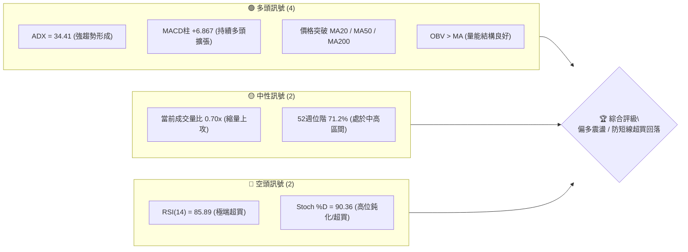
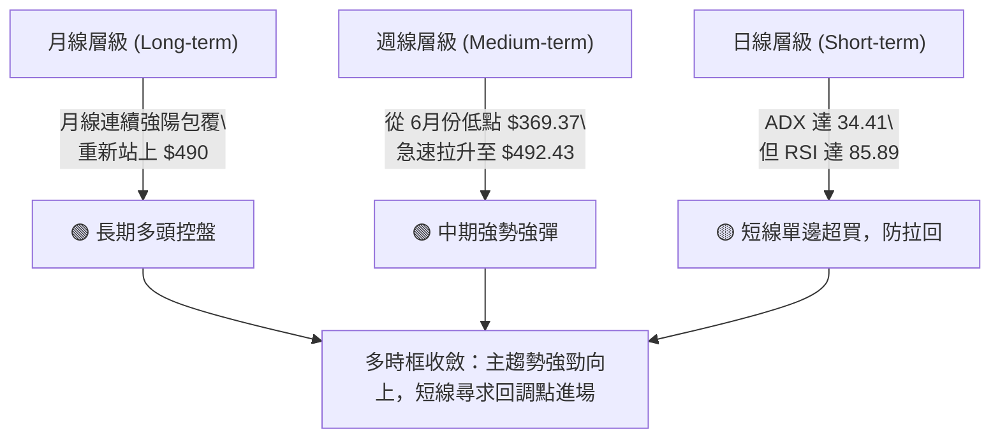
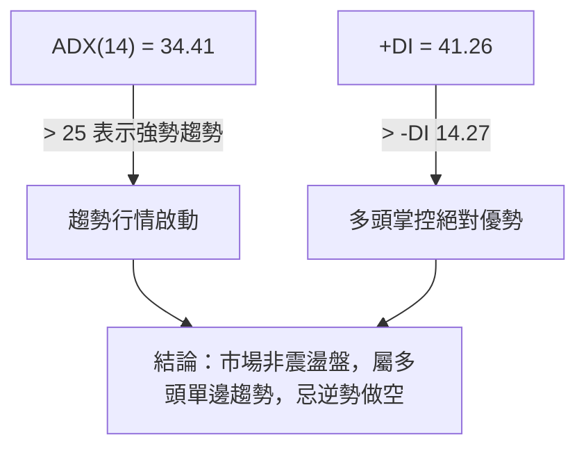
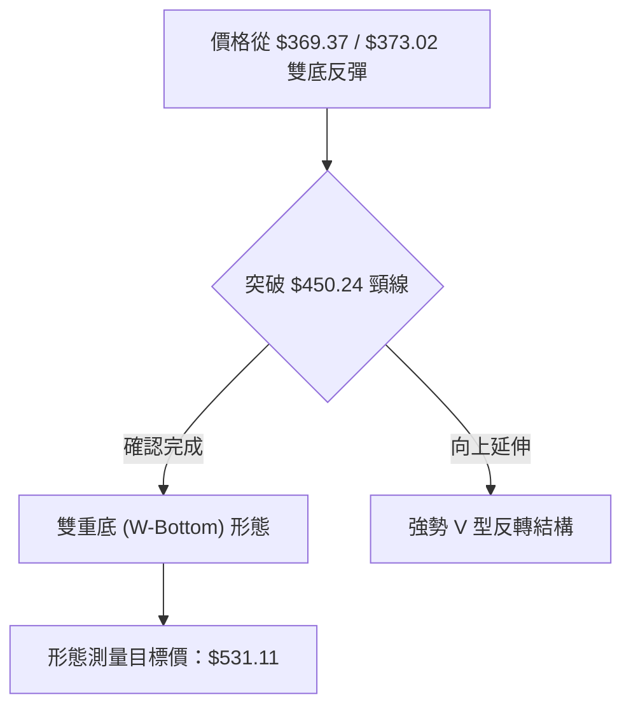
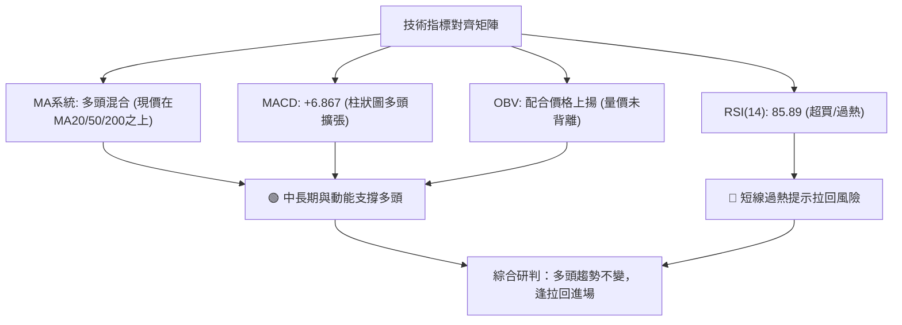
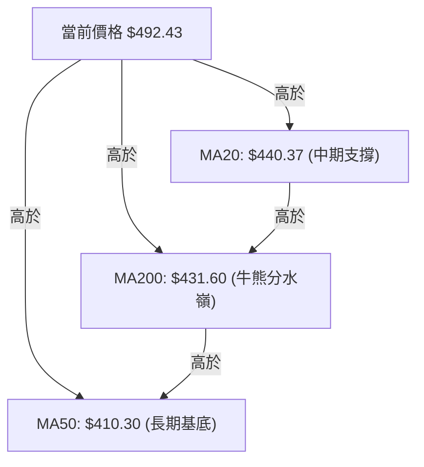
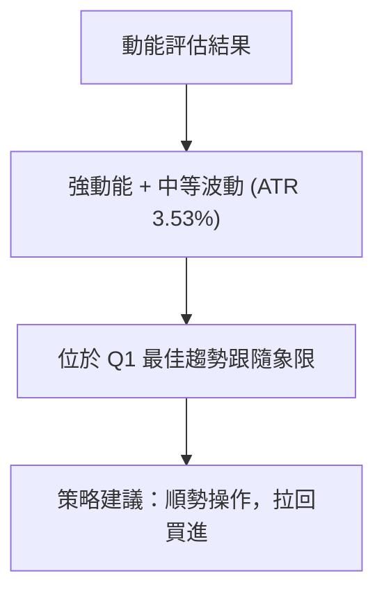
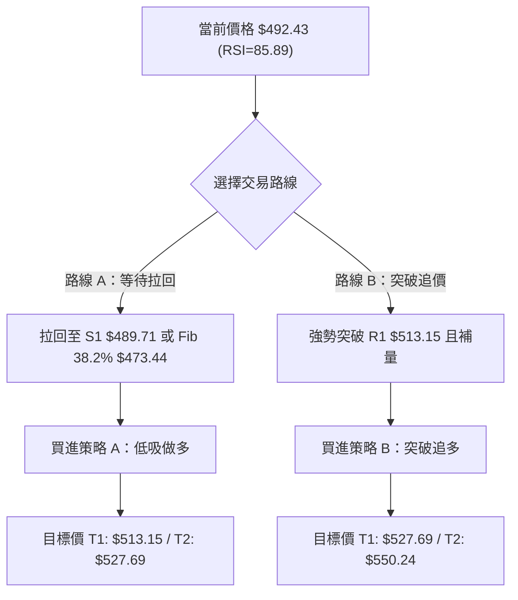
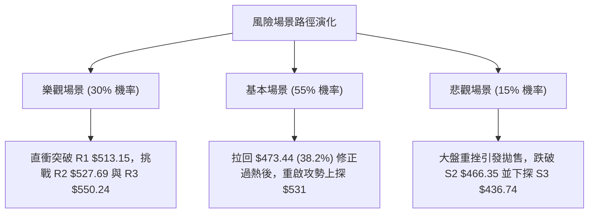

# MSFT 技術分析報告

> **報告日期**：2026-08-12 ｜ **語言**：繁體中文 ｜ **數據來源**：Yahoo Finance ｜ **當前價格**：$492.43

---

## 目錄

| 章節 | 內容 |
|------|------|
| [1. 技術面概覽](#1-技術面概覽) | 訊號儀表板、核心指標、評分卡 |
| [2. 趨勢分析](#2-趨勢分析) | 多時框趨勢、長中短期走勢 |
| [3. 圖表形態分析](#3-圖表形態分析) | 形態識別、K線組合、目標價 |
| [4. 支撐與阻力](#4-支撐與阻力) | 關鍵價位、斐波那契回調 |
| [5. 技術指標深度解讀](#5-技術指標深度解讀) | MA/RSI/MACD/布林/成交量 |
| [6. 動能與波動率](#6-動能與波動率) | 動能評估、ATR、Beta |
| [7. 多時框架總結](#7-多時框架總結) | 時框架評分矩陣 |
| [8. 交易策略建議](#8-交易策略建議) | 多空策略、風險報酬比 |
| [9. 風險提示與監控](#9-風險提示與監控) | 監控指標、風險場景 |

---

## 1. 技術面概覽

### 🎯 技術訊號儀表板



### 📊 核心指標速覽表

| 指標類別 | 指標名稱 | 當前數值 | 訊號 | 解讀 |
|----------|----------|----------|------|------|
| **價格** | 當前價格 | $492.43 | 🟢 多頭 | 站穩多條關鍵均線之上，強勢反彈 |
| **均線** | MA20 | $440.37 | 🟢 多頭 | 價格高於 MA20 達 +11.82%，中期趨勢向上 |
| **均線** | MA50 | $410.30 | 🟢 多頭 | 價格高於 MA50 達 +19.24%，中期強勢支撐 |
| **均線** | MA200 | $431.60 | 🟢 多頭 | 價格高於 MA200 達 +10.78%，長期多頭架構未變 |
| **動能** | RSI(14) | 85.89 | 🔴 過熱 | 進入嚴重超買區，短線隨時有回檔拉回壓力 |
| **動能** | MACD(12,26,9) | +6.867 | 🟢 多頭 | MACD線(29.77)高於訊號線(22.90)，多頭控盤 |
| **趨勢** | ADX(14) | 34.41 | 🟢 強趨勢 | +DI (41.26) 遠高於 -DI (14.27)，多頭主導單邊趨勢 |
| **波動** | ATR(14) | $17.37 | 🟡 中高 | 日均波動率 3.53%，操作需預留適度止損空間 |

### 🏆 技術評分卡

```
╔══════════════════════════════════════════════════════════════════╗
║                   技術評分卡 — MSFT (2026-08-12)                ║
╠══════════════════════════════════════════════════════════════════╣
║  趨勢強度      ████████████████░░░░  82/100  🟢 強勢多頭 (ADX>34) ║
║  動能指標      ██████████████░░░░░░  70/100  🟡 動能強但超買(RSI>85) ║
║  支撐穩定度    ████████████████░░░░  78/100  🟢 S1/S2支撐結構完整 ║
║  成交量配合    ████████████░░░░░░░░  60/100  🟡 攻擊量稍顯不足(0.70x)║
║  形態完整度    ████████████████░░░░  80/100  🟢 W底打底突破成功   ║
║  均線排列      ██████████████░░░░░░  72/100  🟢 價格已全數翻駕均線上║
╠══════════════════════════════════════════════════════════════════╣
║  綜合評分      ███████████████░░░░░  75/100  🏆 偏多看好 (Dip Buy)║
╚══════════════════════════════════════════════════════════════════╝
```

---

## 2. 趨勢分析

### 🌐 多時框趨勢分析



### 📈 長期趨勢 — 12個月走勢圖（Unicode）

```
MSFT 月線走勢圖（2025-09 至 2026-08）
價格軸 ($)
$550 ┤                                           (52W高点 $550.24)
$527 ┤           ●   ●                                 
$514 ┤●  ●                                           
$492 ┤               ●                                   ● $492.43 (現價)
$464 ┤                   ●                           ● 
$450 ┤                               ●           ●     
$428 ┤                       ●                     
$391 ┤                           ●            ●        
$369 ┤                               ●    ●            (波段低點 $369.37)
     └─┬───┬───┬───┬───┬───┬───┬───┬───┬───┬───┬───┬───
      09  10  11  12  01  02  03  04  05  06  07  08  (月份)
```

**走勢特徵分析表格**：

| 時間段 | 價格區間 ($) | 漲跌幅 | 走勢特徵與市場行為分析 |
|--------|--------------|--------|------------------------|
| **2025-09 ~ 2025-10** | 514.69 → 514.55 | -0.03% | 高位橫盤震盪，在 $514 附近形成強勁阻力帶。 |
| **2025-11 ~ 2026-03** | 489.83 → 369.37 | -24.59% | 深度中期回調，連續 5 個月走低，於 $369.37 觸及波段止跌低點。 |
| **2026-04 ~ 2026-05** | 406.90 → 450.24 | +10.65% | 第一波強勁反彈，築底後試探 $450 頸線關卡。 |
| **2026-06** | 373.02 | -17.15% | 第二腳二次測試底部位階 ($373.02)，完成雙重底（W底）打底結構。 |
| **2026-07 ~ 2026-08** | 464.72 → 492.43 | +32.01% | V型暴拉強攻，連續突破 MA20/50/200，當前直逼 $500 大關。 |

### 📊 中期趨勢（週線分析）

中期走勢顯示，MSFT 在 2026 年 6 月底於 $372.97–$373.02 區間打出明確的雙重底（W底）右腳後，伴隨週成交量放大（6月28日週成交量達 3.82 億股），展開了凌厲的 V 型反彈。截至 2026 年 8 月中，週線收盤站上 $492.43，已越過斐波那契 50% 回調位 ($449.72) 與 38.2% 回調位 ($473.44)，正測試 23.6% 回調位 ($502.79) 與歷史阻力 R1 ($513.15)。

### ⚡ 趨勢強度評估（ADX 解讀）



| 指標名稱 | 當前數值 | 參考標準 | 趨勢解讀 |
|----------|----------|----------|----------|
| **ADX (14)** | **34.41** | > 25 (強趨勢) | 趨勢力道非常強勁，行情進入單邊推進階段。 |
| **+DI** | **41.26** | > -DI | 買盤動能充沛，多頭佔據絕對支配地位。 |
| **-DI** | **14.27** | < +DI | 賣盤壓制力道萎縮，空頭毫無反抗能力。 |

---

## 3. 圖表形態分析

### 🔍 形態識別系統



**形態信心度表格**：

| 形態類別 | 信心度 | 判斷依據（引用數據） | 完成度 | 目標價（附計算式） |
|----------|--------|----------------------|--------|--------------------|
| **雙重底 (W-Bottom)** | **75%** | 第一底 $369.37 (2026-03) 與第二底 $373.02 (2026-06)，頸線位於 2026-05 高點 $450.24。 | 100% (已突破頸線) | **$531.11**<br>計算：頸線 $450.24 + (頸線 $450.24 - 低點 $369.37 = $80.87) = $531.11 |
| **上升旗形 (Bull Flag)** | **55%** | 7月中下旬於 $380-$390 整理後，8月初大陽線噴出。 | 85% | **$540.00**<br>由旗桿底 $381.70 加上旗桿高度推算 |

### 🕯️ 重要K線形態分析

| 週/月份 | 收盤價 | K線形態 | 解讀 | 訊號 |
|---------|--------|---------|------|------|
| **2026-06-28 週** | $372.97 | 長下影爆量長紅/止跌K | 3.82億股特大量下影線，主力築底強攻信號。 | 🟢 底訊號 |
| **2026-08-02 週** | $464.72 | 大陽線實體（跳空高走） | 2.78億股大陽線突破所有短期均線與 $450 頸線。 | 🟢 突破訊號 |
| **2026-08-16 週** | $492.43 | 高位小陰帶上影線 | 漲勢放緩，8153萬股（當週截至當前）量縮，顯示 $500 關卡前見拉回。 | 🟡 短線整理 |

### 📉 ASCII 走勢形態示意圖

```
MSFT 雙重底 (W-Bottom) 與 V型反彈示意圖
═══════════════════════════════════════════════════════════
$531.11 ┤ - - - - - - - - - - - - - - - - - - - - - - - - - 🎯 形態目標價
$513.15 ┤ - - - - - - - - - - - - - - - - - - - - 阻力 R1
$492.43 ┤ . . . . . . . . . . . . . . . . . . . ● 現價 $492.43
$450.24 ┤ - - - - - - - - ● - - - - - - - - - - - 頸線突破位
        ┤                / \             /
$390.00 ┤               /   \           /
$369.37 ┤      ●_______/     \_________●  底1 ($369.37) / 底2 ($373.02)
═══════════════════════════════════════════════════════════
```

---

## 4. 支撐與阻力

### 🗺️ 關鍵價位分布圖（Unicode）

```
MSFT 價位結構分布圖
═══════════════════════════════════════════════════════════
$550.24 ║████████████████████████████████████║ 52週歷史高點 / 阻力 R3
$527.69 ║████████████████████████            ║ 阻力 R2 (接近形態目標價)
$513.15 ║████████████████████████████        ║ 關鍵阻力 R1
$502.79 ║────────────────────────────────────║ 斐波那契 23.6% 回調位
$492.43 ╠════════════════════════════════════╣ ◄ 當前價格 $492.43
$489.71 ║▓▓▓▓▓▓▓▓▓▓▓▓▓▓▓▓▓▓▓▓▓▓▓▓▓▓▓▓        ║ 近期關鍵支撐 S1
$473.44 ║────────────────────────────────────║ 斐波那契 38.2% 回調位
$466.35 ║████████████████████████            ║ 強支撐 S2
$449.72 ║────────────────────────────────────║ 斐波那契 50.0% 回調位 / BB中軌($440)
$436.74 ║████████████████████████████████    ║ 關鍵防守支撐 S3 / MA200($431.60)
═══════════════════════════════════════════════════════════
```

### 🚧 阻力位分析表

| 阻力級別 | 價位 | 形成原因（嚴格引用數據） | 突破難度 | 重要性 |
|----------|------|--------------------------|----------|--------|
| **R1** | **$513.15** | 近一年波段高點聚類（2025-09/10高點區） | 🟡 中等 | 🟢 短線多頭衝高首要考驗 |
| **R2** | **$527.69** | 近一年波段高點聚類（2025-07高點區） | 🔴 較高 | 🟡 接近雙底形態目標價 $531.11 |
| **R3** | **$550.24** | 52 週最高點 (52W High) | 🔴 極高 | 🔴 強烈歷史心理壓力位 |

### 🛡️ 支撐位分析表

| 支撐級別 | 價位 | 形成原因（嚴格引用數據） | 守住機率 | 重要性 |
|----------|------|--------------------------|----------|--------|
| **S1** | **$489.71** | 近一年波段低點聚類（2025-11洗盤低點聚類） | 🟢 80% | 🟢 短線首要回調防守點 |
| **S2** | **$466.35** | 近一年波段低點聚類（2026-07反彈小高點轉換） | 🟢 85% | 🟡 中期多頭強勁支撐位 |
| **S3** | **$436.74** | 近一年波段低點聚類（靠近 MA200 $431.60） | 🟢 95% | 🔴 多空分水嶺，絕對防守點 |

### 📐 斐波那契回調位分析

依據 52 週高低點區間（高點 **$550.24**，低點 **$349.20**，振幅 $201.04）計算：

| 斐波那契層級 | 精確價位 | 當前價格位置解讀 |
|--------------|----------|------------------|
| **0.0% (52W High)** | **$550.24** | 終極多頭目標。 |
| **23.6%** | **$502.79** | **當前價格 $492.43 位於 23.6% 與 38.2% 之間**。$502.79 為上方首要斐波那契阻力。 |
| **38.2%** | **$473.44** | 下方首要斐波那契支撐，若拉回此處為極佳買點。 |
| **50.0%** | **$449.72** | 中軸支撐，接近突破頸線 $450.24。 |
| **61.8%** | **$426.00** | 強支撐區，靠近 MA200 ($431.60)。 |
| **78.6%** | **$392.22** | 深遠支撐區。 |
| **100.0% (52W Low)**| **$349.20** | 本輪大週期底部。 |

---

## 5. 技術指標深度解讀

### 🎛️ 指標訊號總覽



### 📈 移動平均線排列分析



* **均線狀態分析**：價格全數收復 MA20 ($440.37)、MA50 ($410.30) 與 MA200 ($431.60)，顯示中長期技術面全面轉強。MA20 正在向上穿過 MA200，呈現中期黃金交叉格局。

### 📉 RSI(14) 分析

* **當前數值**：**85.89**
* **強度進度條**：`█████████░` 85.89% (🔴 嚴重超買 > 70)
* **背離判定**：目前 RSI 隨價格拉升同步創高，**無明顯頂背離**。但 85.89 屬於極端過熱區域，歷史數據顯示 RSI > 80 後，短線常伴隨 3–5 天的整理或向 MA20/支撐位拉回修正。

### 📊 MACD(12,26,9) 訊號解讀

* **MACD 快線**：29.769
* **Signal 慢線**：22.902
* **MACD 柱狀圖**：**+6.867** (🟢 多頭擴張)
* **解讀**：MACD 快線持續遠高於慢線，柱狀圖為正值且呈擴張態勢，顯示中線多頭控制力道堅定，未出現轉折死叉訊號。

### 📦 布林通道分析

```
MSFT 布林通道狀態示意圖
═══════════════════════════════════════════════════════════
$542.72 ┤ - - - - - - - - - - - - - - - - - - - - - 布林上軌 (BB Upper)
$492.43 ┤ . . . . . . . . . . . . . . . . ● 現價 ($492.43, %B = 0.75)
$440.37 ┤ ═══════════════════════════════════════ 布林中軌 (MA20)
$338.03 ┤ - - - - - - - - - - - - - - - - - - - - - 布林下軌 (BB Lower)
═══════════════════════════════════════════════════════════
```

* **布林指標數據**：%B 為 **0.75**，代表價格位於通道中軌與上軌之間（75% 位階）。
* **通道動態**：通道開口放大，價格貼近 upper band 上升，屬於典型強勢趨勢噴發特徵。

### 💹 成交量分析（量價配合度）

* **最新日成交量**：27,275,247 股
* **20日均量**：39,207,902 股（量比 **0.70x**）
* **OBV 趨勢**：OBV > MA，量能指標呈多頭排列。
* **量價解讀**：雖然 8 月 12 日當日量比降至 0.70x，呈現高位「量縮」現象，但中線 OBV 趨勢健康，說明無主力大舉出貨跡象，當前量縮更偏向高位籌碼鎖定的拉升整理。

---

## 6. 動能與波動率

### ⚡ 動能評估四象限

| 象限分佈 | 低波動率 (Low Vol) | 高波動率 (High Vol) |
|----------|-------------------|-------------------|
| **強動能 (Strong Mom)** | 🟢 **當前位置 (Q1)**<br>ADX=34.41, +DI高昂, 走勢順暢 | 🟡 爆發噴發期 (Q3) |
| **弱動能 (Weak Mom)** | ⚪ 底部盤整期 (Q2) | 🔴 崩跌洗盤期 (Q4) |



### 📊 ATR 波動率分析

* **ATR (14)**：**$17.37**（占股價 **3.53%**）
* **風控應用與止損距離建議**：
  * **波段交易止損距離 (1.5x ATR)**：$17.37 × 1.5 = **$26.06**
  * **趨勢追蹤止損距離 (2.0x ATR)**：$17.37 × 2.0 = **$34.74**

### 📐 Beta 與市場相關性

* **Beta 係數**：**1.099**
* **解讀**：MSFT 波動度略高於大盤（S&P 500）約 10%。在大盤多頭環境下具備良好的超額收益（Alpha）潛力。

---

## 7. 多時框架總結

### 📋 時框架評分表

| 時框架 | 趨勢方向 | 動能狀態 | 均線排列 | 形態結構 | 綜合評分 | 交易建議 |
|--------|----------|----------|----------|----------|----------|----------|
| **月線 (Long)** | 🟢 看多 | 🟢 強勁 | 🟢 多頭 | 雙底突破 | **85/100** | 長線持有/逢低加碼 |
| **週線 (Medium)**| 🟢 看多 | 🟢 強勁 | 🟢 多頭 | V型強彈 | **80/100** | 偏多操作 |
| **日線 (Short)** | 🟡 偏多過熱 | 🔴 RSI超買 | 🟢 多頭 | 高位消化 | **65/100** | 避開追高，等待拉回 |

### 🔲 綜合訊號矩陣

```
╔══════════════════════════════════════════════════════════════════╗
║                    多時框架訊號一致性矩陣                         ║
╠══════════════════════════════════════════════════════════════════╣
║ 時框     長/中/短期趨勢  MACD/RSI訊號   量能配合    一致性結論    ║
╠══════════════════════════════════════════════════════════════════╣
║ 月線     🟢 看多         🟢 MACD柱擴張   🟢 OBV向上   多頭極度一致 ║
║ 週線     🟢 看多         🟢 MACD金叉     🟢 大量築底  多頭強烈確認 ║
║ 日線     🟡 偏多震盪     🔴 RSI 85.89    🟡 量比0.7x  短線面臨修整 ║
╚══════════════════════════════════════════════════════════════════╝
```

### ⚖️ 多時框收斂結論

* **規則收斂依據**：當前 ADX 為 34.41 (>25)，市場處於**強趨勢行情**。
* **優先級裁定**：依多時框收斂規則，趨勢行情下以中長期（週線/MA50/MA200）方向為主導（偏多），日線 RSI 超買僅代表「短線買點時機」尚未成熟，而非方向轉空。
* **唯一最終方向**：**偏多控盤，建議採用「支撐拉回買進 (Buy on Dip)」策略**。

---

## 8. 交易策略建議

### 🗺️ 策略決策流程圖



### 🧭 策略路由

* **當前主策略方向**：**偏多操作（綜合評分 75/100）**
* 本報告依據評分卡，**主推多頭策略**（策略A：低吸買進；策略B：突破買进），做空僅列為風控觸發條件。

### 🎯 價格情境階梯 (Price Scenarios)

| 觸發條件 | 下一目標價 | 後續延伸目標 | 情境含義 |
|----------|------------|--------------|----------|
| **突破阻力 R1 $513.15** | R2 **$527.69** | R3 **$550.24** | 多頭攻勢再起，挑戰歷史新高 |
| **站穩現價區間 ($489–$502)**| 震盪消化 | R1 **$513.15** | 高位橫盤換手，消化 RSI 過熱 |
| **跌破支撐 S1 $489.71** | Fib 38.2% **$473.44** | S2 **$466.35** | 健康回調，提供極佳中期買點 |
| **跌破支撐 S3 $436.74** | MA50 **$410.30** | $392.22 (78.6%) | 中期多頭架構破壞（防守失敗） |

### 📊 情境機率分佈

| 情境 | 機率 | 主要依據（引用數據指標） |
|------|------|--------------------------|
| **1. 支撐回調後續漲 (主情境)** | **55%** | ADX=34.41 強趨勢，+DI=41.26，MACD+6.867 擴張，僅需消化 RSI 超買。 |
| **2. 高位區間震盪橫盤** | **30%** | 當前成交量比 0.70x 顯示追高意願減弱，阻力 R1 $513.15 前需換手。 |
| **3. 深幅回檔跌破** | **15%** | 僅在美股大盤發生系統性風險時觸發，S3 $436.74 具強烈支撐。 |

### 🟢 主策略詳情

#### 策略 A：支撐拉回買进 (Preferred / 優先首選)

* **進場條件**：價格拉回測試 S1 ($489.71) 至 斐波那契 38.2% ($473.44) 區間，且 RSI 降至 50–60 區間。
* **買進價格**：**$473.44**（Fib 38.2% 回調位）
* **止損價格**：**$449.72**（Fib 50.0% 回調位 / 跌破 Neckline $450）
* **目標價 T1**：**$513.15**（阻力 R1）
* **目標價 T2**：**$527.69**（阻力 R2 / 雙底形態目標 $531.11 附近）
* **風險報酬比**：
  * T1 風報比：($513.15 - $473.44) / ($473.44 - $449.72) = $39.71 / $23.72 = **1 : 1.67**
  * T2 風報比：($527.69 - $473.44) / ($473.44 - $449.72) = $54.25 / $23.72 = **1 : 2.29**
* **建議倉位**：15% – 20%

#### 策略 B：突破追買 (Breakout Buy)

* **進場條件**：日線收盤強勢突破阻力 R1 **$513.15**，且成交量放大至 20日均量 1.2 倍以上。
* **買進價格**：**$513.15**
* **止損價格**：**$489.71**（S1 支撐位）
* **目標價 T1**：**$527.69**（阻力 R2）
* **目標價 T2**：**$550.24**（阻力 R3 / 52週高點）
* **風險報酬比**：
  * T2 風報比：($550.24 - $513.15) / ($513.15 - $489.71) = $37.09 / $23.44 = **1 : 1.58**
* **建議倉位**：10%

### 🔴 反向風險觸發點（對沖與撤退提示）

* **撤退訊號**：若價格未見反彈並強烈跌破 S3 **$436.74**（同時跌破 MA200 $431.60），代表雙底反彈結構失效，多頭應全數離場觀望。

### ⭐ 整體訊號強度評星

```
做多訊號強度：★★██☆  (4.0/5星)  — 趨勢強勁，惟短線過熱
做空訊號強度：★☆☆☆☆  (1.0/5星)  — 逆強趨勢，風險極高
整體可信度：  ★★██☆  (4.2/5星)  — 指標多時框收斂度高
```

---

## 9. 風險提示與監控

### ✅ 關鍵監控指標 Checklist

```
╔══════════════════════════════════════════════════════════════════╗
║                   MSFT 技術面日常監控清單 (Checklist)           ║
╠══════════════════════════════════════════════════════════════════╣
║  [ ] RSI(14) 是否跌破 80 (確認短線修正開始)                      ║
║  [ ] 價格拉回至 S1 $489.71 或 $473.44 時是否有止跌K線             ║
║  [ ] MACD 柱狀圖 (+6.867) 是否開始縮頭                            ║
║  [ ] 向上挑戰 R1 $513.15 時，成交量是否能突破 3,920 萬股均量      ║
║  [ ] 關鍵防守位 S3 $436.74 與 MA200 $431.60 是否完好             ║
╚══════════════════════════════════════════════════════════════════╝
```

### ⚠️ 風險場景分析



### 🛡️ 風險管理重要提醒

1. **嚴防短線過熱追高**：RSI 達 85.89，當前位置追高之風險報酬比極不佳，切忌於 $492–$500 附近盲目追多。
2. **嚴格執行 ATR 止損**：以目前 ATR $17.37 計算，任何交易均應設置至少 $26–$35 的止損空間，避免因正常波動被洗出場。

---

## 📋 報告總結

```
╔══════════════════════════════════════════════════════════════════╗
║                    MSFT 技術分析報告總結                          ║
════════════════════════════════════════════════════════════════════
  報告日期：2026-08-12
  當前價格：$492.43
  分析評級：🟢 偏多 (看好拉回買進 Buy on Dip)

  關鍵結論：
  ├─ 長期趨勢：🟢 多頭控盤（月線連續陽線，突破 $450 頸線）
  ├─ 中期趨勢：🟢 雙重底形態完成，目標價 $531.11
  ├─ 短期趨勢：🟡 ADX 34.41 強趨勢，惟 RSI 85.89 屬過熱，防震盪拉回
  ├─ 關鍵支撐：S1 $489.71 ｜ S2 $466.35 ｜ S3 $436.74
  ├─ 關鍵阻力：R1 $513.15 ｜ R2 $527.69 ｜ R3 $550.24
  └─ 分析師目標價：均價 $567.20 (最高 $870.00)

  最優策略組合：
  1. 🥇 最佳機會：等待拉回至 $473.44 (Fib 38.2%) 買進，目標 $527.69，止損 $449.72。
  2. 🥈 次選機會：強勢突破 R1 $513.15 且帶量時追買，目標 $550.24。
  3. 🥉 保守選擇：等待 RSI 降回 60 以下且站穩 S1 $489.71 後建立首批分批倉位。
════════════════════════════════════════════════════════════════════
```

---

> ⚠️ **免責聲明**：本報告為 AI 自動生成之技術分析，所有數據及估算均基於提供的歷史價格資訊。本報告**僅供研究與學術參考**，**不構成任何投資建議**。投資有風險，入市需謹慎。

---

*報告生成時間：2026-08-12 ｜ 數據來源：Yahoo Finance ｜ 分析框架：多時框技術分析*