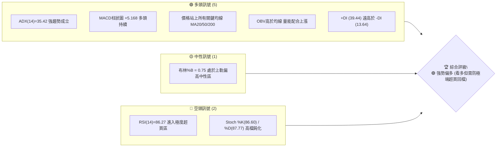
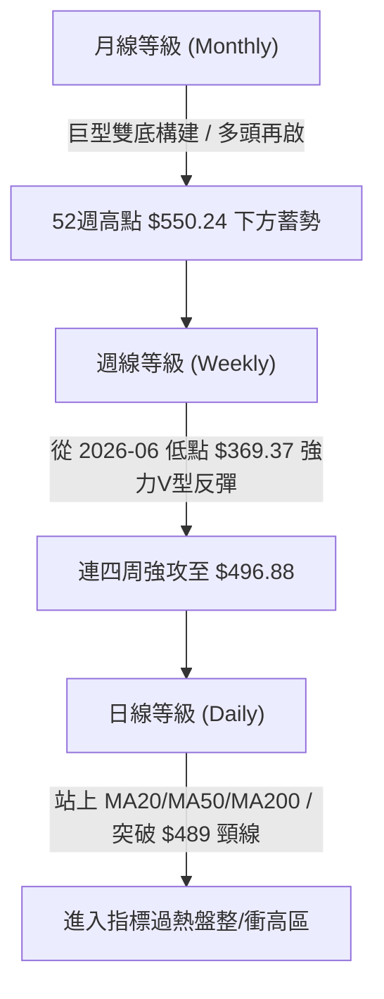
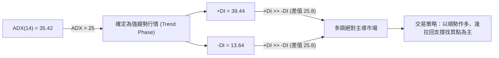
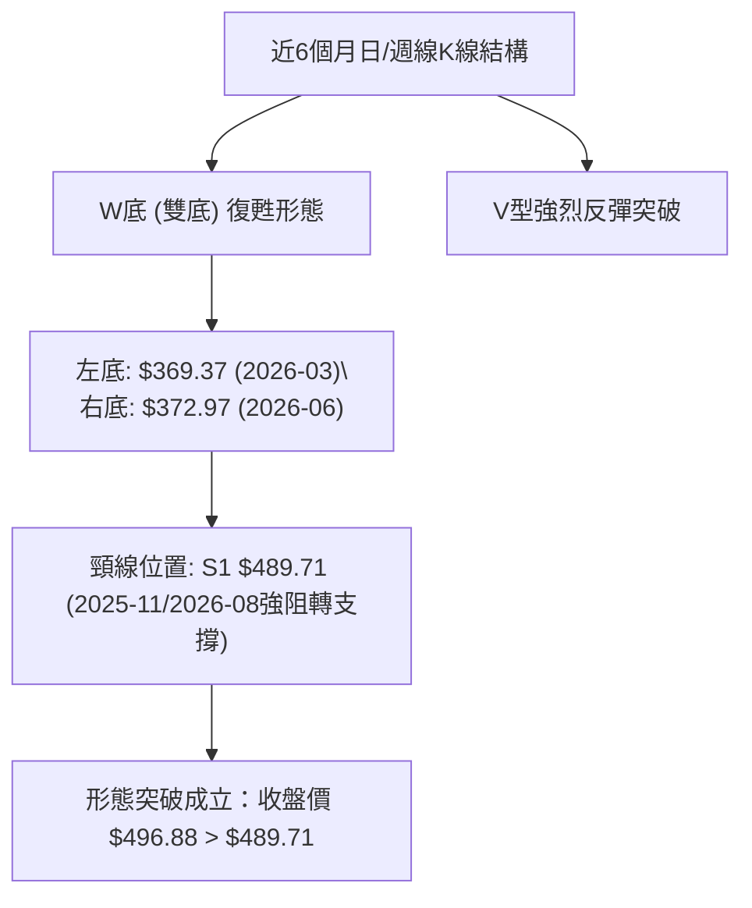
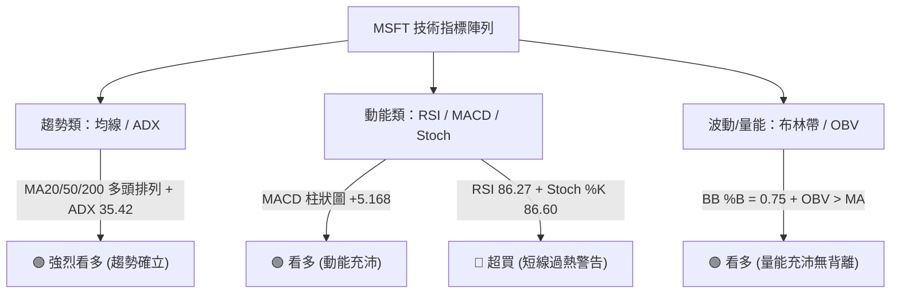
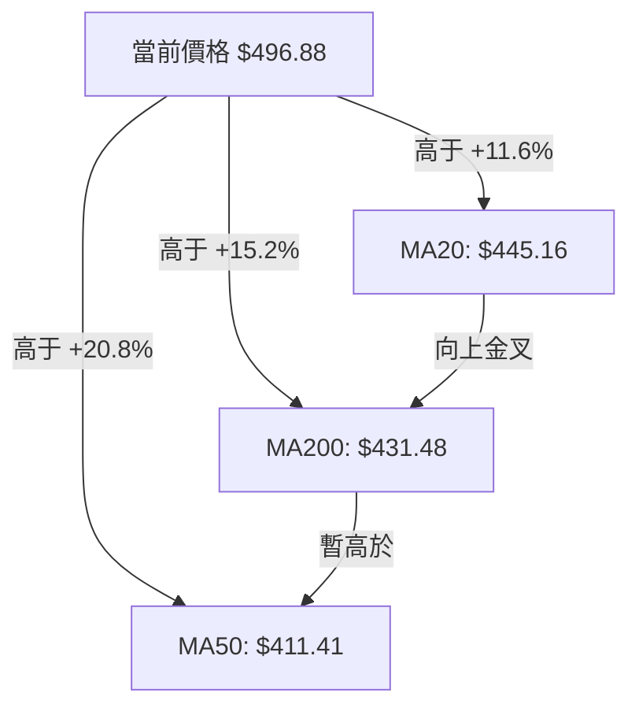
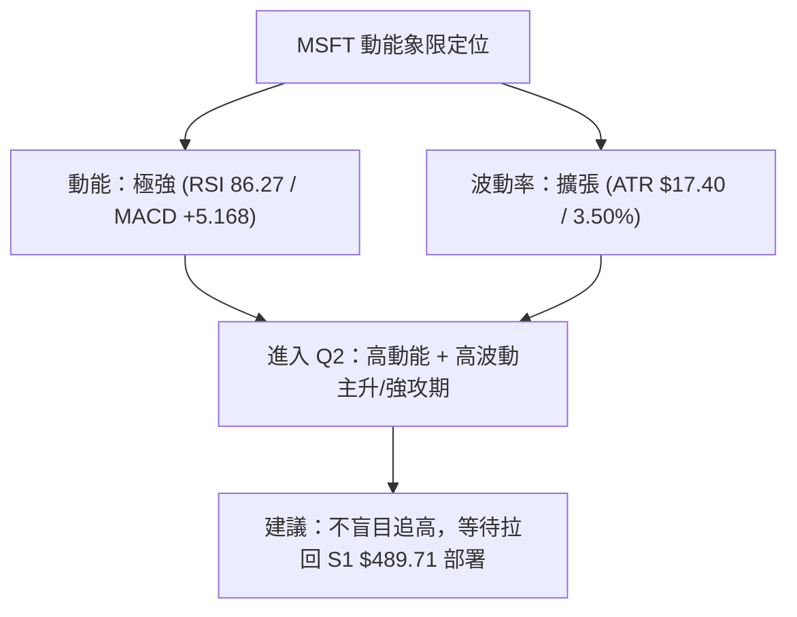
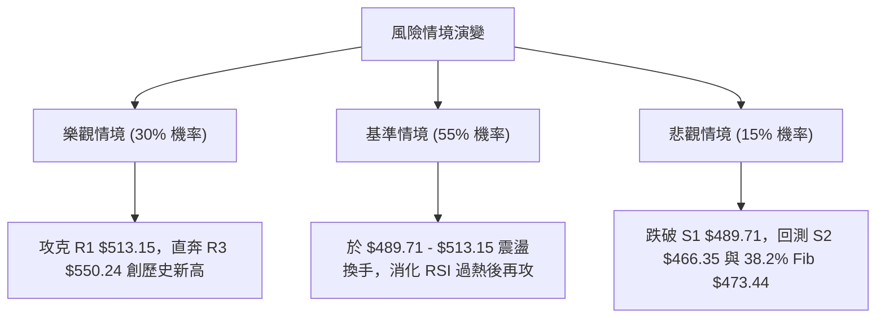

# MSFT 技術分析報告

> **報告日期**：2026-08-13 ｜ **語言**：繁體中文 ｜ **數據來源**：Yahoo Finance ｜ **當前價格**：$496.88

---

## 目錄

| 章節 | 內容 |
|------|------|
| [1. 技術面概覽](#1-技術面概覽) | 訊號儀表板、核心指標、評分卡 |
| [2. 趨勢分析](#2-趨勢分析) | 多時框趨勢、長中短期走勢 |
| [3. 圖表形態分析](#3-圖表形態分析) | 形態識別、K線組合、目標價 |
| [4. 支撐與阻力](#4-支撐與阻力) | 關鍵價位、斐波那契回調 |
| [5. 技術指標深度解讀](#5-技術指標深度解讀) | MA/RSI/MACD/布林/成交量 |
| [6. 動能與波動率](#6-動能與波動率) | 動能評估、ATR、Beta |
| [7. 多時框架總結](#7-多時框架總結) | 時框架評分矩陣 |
| [8. 交易策略建議](#8-交易策略建議) | 多空策略、風險報酬比 |
| [9. 風險提示與監控](#9-風險提示與監控) | 監控指標、風險場景 |

---

## 1. 技術面概覽

### 🎯 技術訊號儀表板



### 📊 核心指標速覽表

| 指標類別 | 指標名稱 | 當前數值 | 訊號 | 解讀 |
|----------|----------|----------|------|------|
| **價格** | 當前價格 | $496.88 | 🟢 強勢 | 距離52週高點 $550.24 僅差 9.7%，位於52週區間 73.5% 高位 |
| **均線** | MA20 | $445.16 | 🟢 看多 | 價格高於 MA20 達 +11.62%，短期均線急升支撐 |
| **均線** | MA50 | $411.41 | 🟢 看多 | 價格高於 MA50 達 +20.77%，中期多頭趨勢堅挺 |
| **均線** | MA200 | $431.48 | 🟢 看多 | 價格高於 MA200 達 +15.16%，長期多空分水嶺已被向上突破 |
| **動能** | RSI(14) | 86.27 | 🔴 超買 | 極度超買狀態，短線累積極高獲利盤，隨時存在過熱拉回壓力 |
| **動能** | MACD(12,26,9) | 29.363 | 🟢 看多 | MACD線位於訊號線(24.194)上方，柱狀圖 +5.168 擴張中 |
| **動能** | ADX(14) | 35.42 | 🟢 強趨勢 | ADX > 25，且 +DI(39.44) >> -DI(13.64)，強烈多頭趨勢行情 |
| **波動** | ATR(14) | $17.40 | 🟡 中高 | 每日波幅約 3.50%，隨價格強攻波動率顯著放大 |

### 🏆 技術評分卡

```
╔══════════════════════════════════════════════════════════════════╗
║                技術評分卡 — MSFT (2026-08-13)                     ║
╠══════════════════════════════════════════════════════════════════╣
║ 趨勢強度      █████████████████░░░  85/100  🟢 強勢多頭 (ADX 35.4)║
║ 動能指標      ███████████████░░░░░  75/100  🟢 動能強但指標超買    ║
║ 支撐穩定度    ██████████████░░░░░░  70/100  🟡 關鍵支撐集中於$489 ║
║ 成交量配合    ███████████████░░░░░  75/100  🟢 OBV多頭配合突破    ║
║ 形態完整度    ████████████████░░░░  80/100  🟢 雙底突破Neckline   ║
║ 均線排列      ███████████████░░░░░  75/100  🟢 均線呈多頭發散結構 ║
╠══════════════════════════════════════════════════════════════════╣
║ 綜合評分      ███████████████░░░░░  76/100  🟢 偏多 (強趨勢/高位) ║
╚══════════════════════════════════════════════════════════════════╝
```

---

## 2. 趨勢分析

### 🌐 多時框趨勢分析



### 📈 長期趨勢 — 24個月走勢圖（Unicode）

```
MSFT 月線走勢圖（2024-08 至 2026-08）
價格軸 ($)
$550 ┤                                                ●(52W High $550.24)
$525 ┤                               ●   ●   ●       ╱
$500 ┤                                 ●   ●       ● (496.88 現價)
$475 ┤                           ●               ●
$450 ┤                       ●                 ●
$425 ┤●   ●   ●   ●        ●                 ●
$400 ┤  ●       ●   ●   ●                        ●
$375 ┤                ●                            ●   ●
$350 ┤                                               ● (52W Low $349.20)
     └─────────────────────────────────────────────────────────────
      08  09  10  11  12  01  02  03  04  05  06  07  08  09  10  11  12  01  02  03  04  05  06  07  08
     '24 '24 '24 '24 '24 '25 '25 '25 '25 '25 '25 '25 '25 '25 '25 '25 '25 '26 '26 '26 '26 '26 '26 '26 '26
```

#### 24個月走勢特徵分析

| 階段 | 時間區間 | 價格變動區間 | 變動幅度 | 技術特徵與驅動因素 |
|------|----------|--------------|----------|--------------------|
| 第一階段 | 2024-08 ~ 2025-03 | $424.41 → $371.73 | -12.4% | 高位箱體震盪後失守，進行中度修正 |
| 第二階段 | 2025-04 ~ 2025-07 | $391.41 → $529.27 | +35.2% | AI獲利化加速，主升段拉升創高 |
| 第三階段 | 2025-08 ~ 2026-03 | $503.50 → $369.37 | -26.6% | 大盤回檔與估值修正，下探52週低點區間 |
| 第四階段 | 2026-04 ~ 2026-08 | $369.37 → $496.88 | +34.5% | 強勢V型強彈，連續大陽線向上突破多重均線 |

### 📊 中期趨勢（週線分析）

近20週的數據顯示，MSFT 在 2026 年 6 月底至 7 月初於 $372.97–$379.40 區間完成二次落底（與 2026 年 3 月低點 $369.37 形成 W 底結構）。
隨後於 2026 年 8 月初展開強烈爆發，週成交量大幅放大至 2.78 億股與 2.15 億股，促使 MACD 柱狀圖從 +0.436 暴增至 +11.293，RSI 一舉衝破 80 大關，呈現典型的多頭強勢突破態勢。

```
週線壓力與支撐結構示意圖：
阻力區 R3: $550.24 ════════════════════════════════ (52週歷史高點)
阻力區 R2: $527.69 ──────────────────────────────── (2025-07 高點聚類)
阻力區 R1: $513.15 ──────────────────────────────── (2025-09/10 波段高點)
當前價格: $496.88 ▲▲▲ (強勢急升中)
支撐區 S1: $489.71 ──────────────────────────────── (突破之關鍵頸線/2025-11高點)
支撐區 S2: $466.35 ──────────────────────────────── (波段回檔強支撐)
支撐區 S3: $436.74 ════════════════════════════════ (MA200與50%斐波那契疊加區)
```

### ⚡ 趨勢強度評估（ADX 解讀）



#### ADX 趨勢強度對照表

| ADX 數值範圍 | 當前狀態 (35.42) | 市場性質 | 應對交易策略 |
|--------------|------------------|----------|--------------|
| 0 - 20 | ░░░░░░░░░░ | 無趨勢 / 盤整市場 | 網格交易 / 高拋低吸 / 布林帶上下軌操作 |
| 20 - 25 | ░░░░░░░░░░ | 趨勢初萌芽 | 密切觀察 breakout 訊號 |
| **25 - 50** | █████████░ | **強烈趨勢行情** | **順勢操作 / 移動止損 / 拉回均線做多** |
| 50 - 75 | ░░░░░░░░░░ | 極強趨勢 | 注意趨勢過度延伸 |
| 75 - 100 | ░░░░░░░░░░ | 極端單邊市場 | 謹防高位拋售潮 |

---

## 3. 圖表形態分析

### 🔍 形態識別系統



#### 圖表形態信心度與目標價評估

| 形態類型 | 信心度 | 判斷依據（引用數據） | 完成度 | 目標價計算式與精確數值 |
|----------|--------|----------------------|--------|------------------------|
| **大型 W 底 (Double Bottom)** | **82%** ▓▓▓▓▓▓▓▓░░ | 1. 2026-03 低點 $369.37 與 2026-06 低點 $372.97 構成雙重底<br>2. 突破頸線 S1 $489.71<br>3. 突破時週量放大至 2.78 億股 | **85%** | 頸線 $489.71 + (頸線 $489.71 - 低點 $369.37) = **$610.05** (中長期目標) |
| **強勢 V 型反轉 (V-Reversal)** | **75%** ▓▓▓▓▓▓█░░░ | 從 $372.97 直攻至 $499.99，僅用 6 週時間突破 MA20/50/200 均線 | **90%** | 第一阻力區聚類：**R1 $513.15**<br>第二阻力區聚類：**R2 $527.69** |
| **高位上升旗形 (Bull Flag)** | **45%** ▓▓▓▓░░░░░░ | 訊號不足，僅做指標型解讀（目前處於短線急攻後的過熱消化階段） | **20%** | 待高位狹幅震盪整理完成後推算 |

### 🕯️ 重要K線形態分析

| 日期 / 週次 | 收盤價 | K線形態 | 技術解讀 | 多空訊號 |
|-------------|--------|---------|----------|----------|
| 2026-06-28 | $372.97 | 長下影打底線 | 底部爆出 3.82 億股巨量，顯示長線買盤強烈介入築底 | 🟢 極度看多 |
| 2026-08-02 | $464.72 | 大陽線實體突破 | 爆量 2.78 億股突破 MA20/MA200，多頭全面主導 | 🟢 強烈看多 |
| 2026-08-09 | $499.99 | 長陽衝高光頭K | 直逼 $500 大關，RSI 攀升至 81.4，多頭極其強勁 | 🟢 看多但過熱 |
| 2026-08-16 (當前) | $496.88 | 高檔十字/小陰線 | 量縮至 1.05 億股，於 500 美元關卡前進行高位消化與換手 | 🟡 中性整理 |

### 📉 ASCII 走勢形態示意圖

```
MSFT 大型 W 底 (雙底) 突破結構示意圖
===================================================================
                                                  突破買點/現價
阻力 / 頸線 $489.71 ─── ─ ─ ─ ─ ─ ─ ─ ─ ─ ─ ─ ─ ─ ─ ─ ─ ─ ┼───► $496.88
                                   /             ▲
                                  /             ╱
                                 /             ╱
                                /  (右底強彈) ╱
                               /             ╱
 $369.37 (左底) ───────────► ●              ●  $372.97 (右底)
                                 \          ╱
                                  \        ╱
                                   \      ╱
===================================================================
```

### 🎯 形態目標價計算

1. **W 底量度目標價**：
   - 形態底部低點：$369.37
   - 頸線突破點：$489.71
   - 垂直形態高度：$489.71 - $369.37 = **$120.34**
   - **最小量度目標價**：$489.71 + $120.34 = **$610.05**

2. **波段高點階梯目標**：
   - 第一目標 (R1 聚類)：**$513.15** (距離現價 +3.27%)
   - 第二目標 (R2 聚類)：**$527.69** (距離現價 +6.20%)
   - 52週歷史高點 (R3 聚類)：**$550.24** (距離現價 +10.74%)

---

## 4. 支撐與阻力

### 🗺️ 關鍵價位分布圖（Unicode）

```
MSFT 價位結構分布圖 (2026-08-13)
═══════════════════════════════════════════════════════════════════
$567.20 ║                                                        ║ 🎯 分析師共識均價 Target (Mean)
$550.24 ║████████████████████████████████████████████████████████║ 🔴 52W High / 強阻力 R3 (+10.74%)
$527.69 ║████████████████████████████████████████                ║ 🔴 波段高點阻力 R2 (+6.20%)
$513.15 ║████████████████████████████                            ║ 🔴 短線第一阻力 R1 (+3.27%)
$502.79 ║▓▓▓▓▓▓▓▓▓▓▓▓▓▓▓▓▓▓▓▓▓▓▓▓▓▓▓▓▓▓▓▓                        ║ 🟡 23.6% 斐波那契回調位
$496.88 ╠════════════════════════════════════════════════════════╣ ◄◄ 現價 Current Price
$489.71 ║▓▓▓▓▓▓▓▓▓▓▓▓▓▓▓▓▓▓▓▓▓▓▓▓                                ║ 🟢 近期波段頸線 / 第一支撐 S1 (-1.44%)
$473.44 ║████████████████████                                    ║ 🟢 38.2% 斐波那契回調位
$466.35 ║████████████████████████                                ║ 🟢 波段聚類強支撐 S2 (-6.15%)
$449.72 ║████████████████                                        ║ 🟢 50.0% 斐波那契回調位
$445.16 ║████████████████                                        ║ 🟢 20日移動平均線 (MA20)
$436.74 ║████████████████████████████████                        ║ 🟢 中期強支撐 S3 (-12.10%)
$431.48 ║████████████████                                        ║ 🟢 200日移動平均線 (MA200)
$349.20 ║████████████████████████████████████████████████████████║ 🛡️ 52W Low (100.0% Fib)
═══════════════════════════════════════════════════════════════════
```

### 🚧 阻力位分析表

| 阻力級別 | 精確價位 | 形成原因 / 數據來源 | 突破難度 | 重要性 |
|----------|----------|---------------------|----------|--------|
| **R1** | **$513.15** | 近一年波段高點聚類 (2025-09/10 收盤高點) | 🟡 中等 | 短線多頭解套賣壓區 |
| **R2** | **$527.69** | 近一年波段高點聚類 (2025-07 歷史次高點) | 🔴 較難 | 中期解套重災區，多頭防線 |
| **R3** | **$550.24** | 52週最高點 (52W High) | 🔴 極難 | 歷史天花板，需極大成交量配合突破 |

### 🛡️ 支撐位分析表

| 支撐級別 | 精確價位 | 形成原因 / 數據來源 | 守住機率 | 重要性 |
|----------|----------|---------------------|----------|--------|
| **S1** | **$489.71** | 近一年波段低點/頸線聚類 (2025-11 高點轉支撐) | 🟢 80% | 短線多空轉換樞紐，拉回首要防線 |
| **S2** | **$466.35** | 近一年波段低點聚類 (2026-08 突破缺口上緣) | 🟢 85% | 中期強支撐，跌破則急攻形態失效 |
| **S3** | **$436.74** | 近一年波段低點聚類 (接近 MA200 $431.48 與 50% Fib) | 🟢 92% | 長期多頭命脈，多方終極防線 |

### 📐 斐波那契回調位分析

基於 52 週波段區間（最低點 **$349.20** 至 最高點 **$550.24**，總波幅 **$201.04**）：

```
斐波那契回調位評估 (52W Range: $349.20 → $550.24)
  0.0%  (52W High) ──────── $550.24  [歷史高點阻力]
  23.6%            ──────── $502.79  [短線關卡，現價上方近在咫尺]
  ────── 現價區間 ($496.88，位於 23.6% 與 38.2% 之間) ──────
  38.2%            ──────── $473.44  [黃金分割第一強支撐]
  50.0%            ──────── $449.72  [多空中軸，貼近 MA20 $445.16]
  61.8%            ──────── $426.00  [關鍵黃金支撐，貼近 MA200 $431.48]
  78.6%            ──────── $392.22  [深遠回調點]
 100.0% (52W Low)  ──────── $349.20  [52週最低點]
```

**技術解讀**：
當前價格 **$496.88** 精確落於 **23.6% ($502.79)** 與 **38.2% ($473.44)** 回調位之間。
價格在強攻突破 38.2% ($473.44) 後展現出極強的多頭慣性。只要拉回不破 **38.2% ($473.44)** 或頸線 **S1 ($489.71)**，整體急攻格局將完全保持完好。

---

## 5. 技術指標深度解讀

### 🎛️ 指標訊號總覽



### 📈 移動平均線排列分析



#### 均線數據與結構分析

| 均線名稱 | 當前價位 | 與現價距離 (%) | 走勢方向 | 技術意涵 |
|----------|----------|----------------|----------|----------|
| **MA 5** | $499.83 | -0.59% | ▼ 下彎 | 超短線於 $500 大關受阻，小幅震盪 |
| **MA 10** | $493.17 | +0.75% | ▲ 陡峭向上 | 超短線極強支撐，多頭攻勢防線 |
| **MA 20** | $445.16 | +11.62% | ▲ 陡峭向上 | 短線波段生命線，布林通道中軌 |
| **MA 60** | $414.21 | +19.96% | ▲ 向上 | 中期扣抵低價，助漲力道極強 |
| **MA 120**| $406.37 | +22.27% | ▲ 向上 | 中長期籌碼安定線 |
| **MA 240**| $444.46 | +11.79% | ▲ 向上 | 長期年線，目前與 MA20 相近 |

### 📉 RSI(14) 分析

- **RSI(14) 當前數值**：**86.27**
  - 進度條：`█████████████████░░░` **86.3%**
- **區間評估**：🔴 **極度超買 (>70)**
- **背離判斷**：
  - 查看近20週數據，2026-04-19 週 RSI 為 92.9，當週高點 $421.88；本次價格拉升至 $496.88，週 RSI 為 86.3。
  - **結論**：日線與週線層級**無明顯頂背離**（價格創近期新高，RSI 亦同步維持在 80 以上高位），此為典型「強勢趨勢中的高檔鈍化」，而非動能衰竭。但過高的 RSI 提示短線追高風險極大。

### 📊 MACD(12/26/9) 訊號解讀

- **MACD 線**：**29.363**
- **Signal 線**：**24.194**
- **MACD 柱狀圖 (Histogram)**：**+5.168**
- **多空解讀**：🟢 **強烈看多**。MACD 線遠高於零軸且在訊號線上方，柱狀圖持續保持正值（+5.168），說明雙線開口向上擴張，多頭控盤意圖非常明確。

### 📦 布林通道分析

```
MSFT 布林通道 (Bollinger Bands) 位置示意圖
===================================================================
 Upper Band  (BB上軌) : $548.73  -----------------------------
                                  ▲ (頂部壓力空間)
 Current     (現價)   : $496.88  ■ [BB %B = 0.75]
                                  ▼ (距離中軌仍有空間)
 Middle Band (MA20)   : $445.16  -----------------------------
 Lower Band  (BB下軌) : $341.60  -----------------------------
===================================================================
```

- **布林帶寬度**：上軌 $548.73 - 下軌 $341.60 = **$207.13** (帶寬極大，代表進入高波動單邊行情)。
- **%B 指標**：**0.75**，代表現價處於布林帶中軌與上軌之間 75% 的位置，屬於健康的多頭向上推升區間，未觸及上軌（$548.73）極限，尚有向 $513–$527 推進的通道空間。

### 💹 成交量分析（量價配合度）

- **最新日成交量**：22,600,346 股
- **20日平均成交量**：38,571,862 股 (量比：**0.59x**)
- **50日平均成交量**：41,280,371 股
- **OBV (能量潮) 趨勢**：**OBV > MA**，顯示在中期突破過程中，資金持續淨流入。
- **量價分析結論**：在經歷了 2026 年 8 月初週成交量爆發至 2.78 億股的突破拉升後，當前日成交量縮減至 2,260 萬股（量比 0.59x），顯示**「漲時重量、跌/盤時縮量」**的良性換手特徵，無主力高位吐貨棄守跡象。

---

## 6. 動能與波動率

### ⚡ 動能評估四象限

| 象限 | 動能強度 (RSI/MACD) | 波動率 (ATR/BB帶寬) | 當前狀態 | 交易戰略意涵 |
|------|--------------------|---------------------|----------|--------------|
| **Q1 (最佳爆發區)** | 強 (RSI > 60) | 低 (ATR 縮小) | — | 蓄勢突破買點 |
| **Q2 (主升趨勢區)** | **強 (RSI 86.27)** | **高 (ATR $17.40)** | **✓ MSFT 當前位置** | **強勢多頭，逢拉回找買點，嚴設止損** |
| **Q3 (高風險震盪)** | 弱 (RSI < 40) | 高 (ATR 放大) | — | 恐慌殺跌，避免盲目抄底 |
| **Q4 (沉悶築底區)** | 弱 (RSI < 40) | 低 (ATR 縮小) | — | 觀望或網格收集籌碼 |



### 📊 ATR 波動率分析

- **ATR(14) 當前數值**：**$17.40** (佔當前股價 3.50%)
- **止損距離設計建議**：
  - **短線交易 (1.5x ATR)**：$17.40 × 1.5 = **$26.10**（止損設於現價下方 $26.10，即 **$470.78** 附近，貼近 38.2% Fib $473.44）。
  - **波段交易 (2.0x ATR)**：$17.40 × 2.0 = **$34.80**（止損設於現價下方 $34.80，即 **$462.08** 附近，保護 S2 $466.35 支撐）。

### 📐 Beta 與市場相關性

- **Beta 係數**：**1.099**
- **解讀**：MSFT 的波動度略高於標普 500 指數 (S&P 500) 約 9.9%。在整體美股大盤處於多頭氣氛時，MSFT 將展現出高於大盤的彈升力道；反之大盤回檔時，其拉回幅度亦會略微放大。

---

## 7. 多時框架總結

### 📋 時框架評分表

| 時框架 | 趨勢方向 | 動能狀態 | 均線排列 | 圖表形態 | 綜合評分 | 交易建議 |
|--------|----------|----------|----------|----------|----------|----------|
| **月線 (Monthly)** | 🟢 多頭再啟 | 🟢 強勁 | 🟢 站上主均線 | 大型雙底中段 | **85/100** | 長線堅定看多，目標 $567–$610 |
| **週線 (Weekly)** | 🟢 強勢主升 | 🔴 超買 (RSI 81.4)| 🟢 MA20/200金叉| V型強烈突破 | **78/100** | 中線逢回佈局，觀察 $489 頸線 |
| **日線 (Daily)** | 🟢 偏多震盪 | 🔴 極度過熱(86.3)| 🟢 全均線上方 | $500前高檔換手| **70/100** | 短線切勿追高，等待拉回確認 |

### 🔲 綜合訊號矩陣

```
時框架訊號收斂矩陣
═════════════════════════════════════════════════════════════
指標 / 時框      日線 (Daily)      週線 (Weekly)      月線 (Monthly)
─────────────────────────────────────────────────────────────
趨勢 (Trend)      🟢 強勢向上       🟢 爆發突破        🟢 中長多頭
動能 (Momentum)   🔴 86.27 超買     🔴 81.40 超買      🟢 健康擴張
均線 (MA System)  🟢 均線上方       🟢 金叉發散        🟢 支撐穩固
成交量 (Volume)   🟡 量縮換手       🟢 爆量突破        🟢 量價配合
綜合評定         🟡 短線需消化     🟢 中線極強        🟢 長線看好
═════════════════════════════════════════════════════════════
```

### ⚖️ 多時框收斂結論

依據多時框收斂規則：
1. **趨勢行情判定**：當前 ADX(14) = **35.42** (> 25)，確定為**強烈趨勢行情**。
2. **優先級收斂**：以週線與中長期均線（MA50 $411.41、MA200 $431.48）之多頭方向為主導方向；日線過熱之 RSI (86.27) 僅用於尋找拉回進場時機，不可作為逆勢強行做空的依據。
3. **唯一方向結論**：**🟢 強勢偏多（控盤權在多方，短線尋求拉回支撐做多機會）**。此結論完全貫徹至第 8 章交易策略。

---

## 8. 交易策略建議

### 🗺️ 策略決策流程圖

```mermaid
graph TD
    A["當前價格 $496.88 (技術評分 76/100)"] --> B{"價格走勢路徑選擇"}
    B -->|"情境一：拉回測試 S1 $489.71 守穩"| C["主策略 A：逢拉回做多 (Pullback Buy)"]
    B -->|"情境二：強勢突破 R1 $513.15"| D["主策略 B：突破加碼做多 (Breakout Buy)"]
    B -->|"情境三：跌破 S2 $466.35"| E["反轉風險觸發：啟動避險/對沖"]

    C --> C1["目標1: $513.15 |" 目標2: $527.69 "| 止損: $473.44"]
    D --> D1["目標1: $527.69 |" 目標2: $550.24 "| 止損: $489.71"]
```

### 🧭 策略路由

**當前主策略方向 = 🟢 多頭主導策略（綜合評分 76 / 100）**

基於 ADX = 35.42 強趨勢與 W 底頸線突破，本報告主推多頭佈局策略，空頭僅列為反轉風險對沖觸發點。

### 🎯 價格情境階梯 (Price Scenarios)

| 觸發條件 | 下一目標價位 | 後續延伸目標 | 情境技術含義 |
|----------|--------------|--------------|--------------|
| **突破 R1 $513.15** | **R2 $527.69** | **R3 $550.24** | 突破高位聚類，挑戰歷史新高 |
| **站穩 S1 $489.71** | **R1 $513.15** | **R2 $527.69** | 頸線支撐有效，健康回檔再出發 |
| **跌破 S1 $489.71** | **S2 $466.35** | **S3 $436.74** | 深入回調，測試 38.2% 斐波那契位 |

### 📊 情境機率分佈

| 情境劇本 | 估算機率 | 主要技術依據 |
|----------|----------|--------------|
| **拉回守穩後繼續上行** | **60%** | ADX 35.42 強趨勢，MACD 擴張，OBV > MA，W底突破成立 |
| **在高位 $489–$513 區間震盪** | **25%** | RSI(14)=86.27 極度超買，需要時間以盤代跌消化獲利賣壓 |
| **跌破 S2 深入拉回** | **15%** | 短線漲幅過大，若大盤出現系統性拉回則引發獲利了結潮 |

### 🟢 主策略詳情

| 策略要素 | 策略 A：拉回買進策略 (首選 🥇) | 策略 B：突破追擊策略 (次選 🥈) |
|----------|--------------------------------|--------------------------------|
| **適用情境** | 股價回檔至頸線 S1 附近獲得支撐 | 股價以大陽線強勢突破阻力 R1 |
| **進場條件** | 拉回至 $489.71 - $492.00 區間止跌 | 收盤價強勢突破 $513.15 並站穩 |
| **建議進場價**| **$490.50** | **$514.50** |
| **目標價 T1** | **$513.15** (+4.62%) | **$527.69** (+2.56%) |
| **目標價 T2** | **$527.69** (+7.58%) | **$550.24** (+6.95%) |
| **止損價格** | **$473.44** (38.2% Fib, -3.48%)| **$489.71** (原頸線變支撐, -4.82%)|
| **風險報酬比**| **2.18 : 1** (以T2計算) | **1.44 : 1** (以T2計算) |
| **預估成功率**| **68%** | **58%** |
| **建議倉位** | **15% - 20%** | **10% - 15%** |

### 🔴 反向風險觸發點（對沖提示）

若出現以下訊號，說明多頭結構遭遇嚴重破壞，需立即平倉多單或進行對沖：
1. **關鍵價位失守**：日線收盤價跌破 **S2 $466.35**（跌破 2026-08 突破缺口）。
2. **指標轉空確認**：日線 MACD 發生高位死叉，且柱狀圖翻紅轉負。
3. **量能異常**：單日爆出 6,000 萬股以上巨量長陰線跌破 MA20 ($445.16)。

### ⭐ 整體訊號強度評星

```
做多訊號強度：★★███  (4/5星) — 趨勢極強但受限於短線超買
做空訊號強度：★░░░░  (1/5星) — 逆勢做空風險極高，僅防範拉回
整體可信度：  ★★███  (4/5星) — 多時框訊號一致性高
```

---

## 9. 風險提示與監控

### ✅ 關鍵監控指標 Checklist

```
╔══════════════════════════════════════════════════════════════════╗
║              MSFT 每日交易前技術面監控 Check List                ║
╠══════════════════════════════════════════════════════════════════╣
║ [ ] 1. 價格是否守穩關鍵頸線 S1 $489.71？                        ║
║ [ ] 2. RSI(14) 是否由 86.27 高檔回落至 70 以下（過熱冷卻）？    ║
║ [ ] 3. 成交量是否在拉回時維持縮量（< 3,850萬股 20日均量）？      ║
║ [ ] 4. MACD 柱狀圖 (+5.168) 是否出現連續縮小跡象？               ║
║ [ ] 5. 阻力區 R1 $513.15 突破時是否有量能配合？                  ║
╚══════════════════════════════════════════════════════════════════╝
```

### ⚠️ 風險場景分析



### 🛡️ 風險管理重要提醒

1. **嚴禁高檔追高**：當前 RSI 達到 86.27，處於歷史級別的高檔過熱區，極易出現單日 2%–3% 的劇烈回撤洗盤。
2. **動態調整止損**：若價格突破 R1 $513.15，應將止損點同步向上移動至 S1 $489.71。
3. **資金管理紀律**：單一股票持倉建議不超過總投資組合的 20%–25%，單筆交易風險暴露（進場價與止損價之差額）控制在總資金的 1%–2% 以內。

---

## 📋 報告總結

```
╔══════════════════════════════════════════════════════════════════╗
║                   MSFT 技術分析報告總結                          ║
════════════════════════════════════════════════════════════════════
 報告日期：2026-08-13
 當前價格：$496.88
 分析評級：🟢 強勢偏多 (ADX 35.42 強趨勢，留意短線指標過熱)

 關鍵價位速查：
 ├─ 長期趨勢：🟢 強烈看多 (W底形態突破，目標 $610.05)
 ├─ 中期趨勢：🟢 主升段強攻 (連四週大陽線)
 ├─ 短期趨勢：🟡 高位換手整理 (RSI 86.27 消化過熱)
 ├─ 關鍵阻力：R1 $513.15 ｜ R2 $527.69 ｜ R3 $550.24 (52W High)
 ├─ 關鍵支撐：S1 $489.71 ｜ S2 $466.35 ｜ S3 $436.74
 └─ 分析師目標均價：$567.20 (隱含 +14.15% 上漲空間)

 最優策略組合：
 1. 🥇 最佳機會：等待股價拉回至 S1 $489.71 附近部署多單，止損 $473.44。
 2. 🥈 次選機會：強勢突破 R1 $513.15 後追擊，目標看至 $527.69–$550.24。
 3. 🥉 保守選擇：待 RSI(14) 回落至 60–65 健康區間後再行定投分批進場。
════════════════════════════════════════════════════════════════════
```

---

> ⚠️ **免責聲明**：本報告為 AI 自動生成之技術分析，所有數據及估算均基於提供的歷史價格資訊。本報告**僅供研究與學術參考**，**不構成任何投資建議**。投資有風險，入市需謹慎。

---

*報告生成時間：2026-08-13 ｜ 數據來源：Yahoo Finance ｜ 分析框架：多時框技術分析*