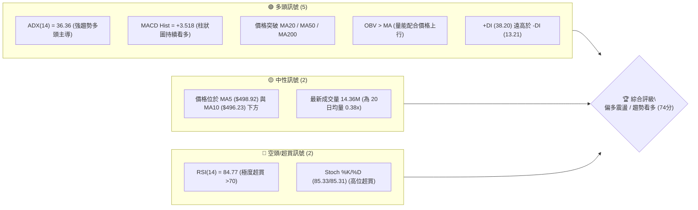
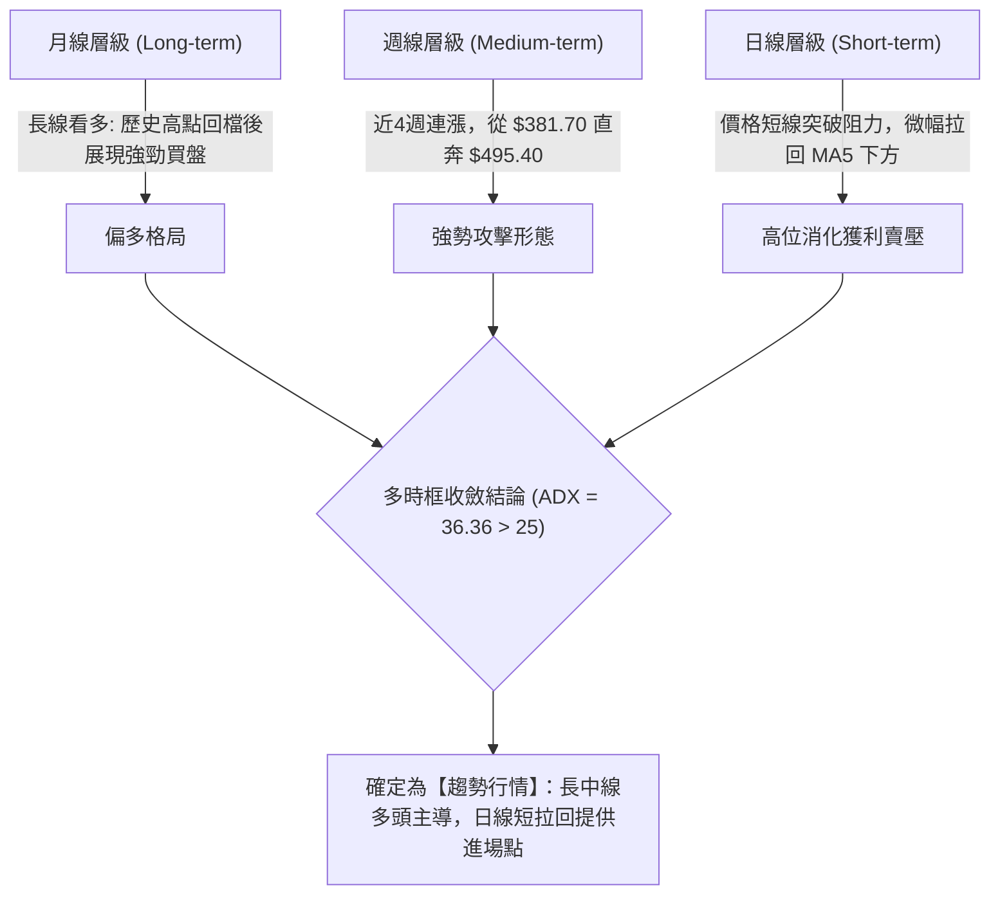
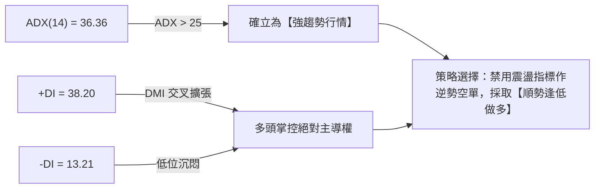
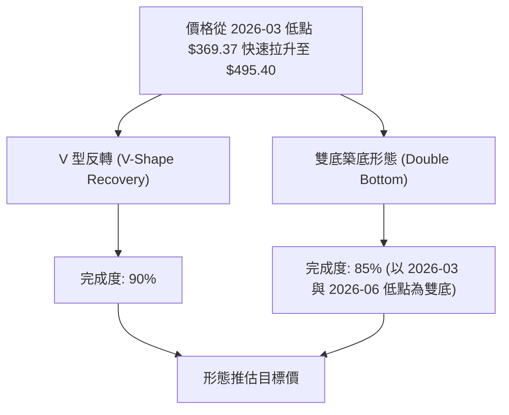
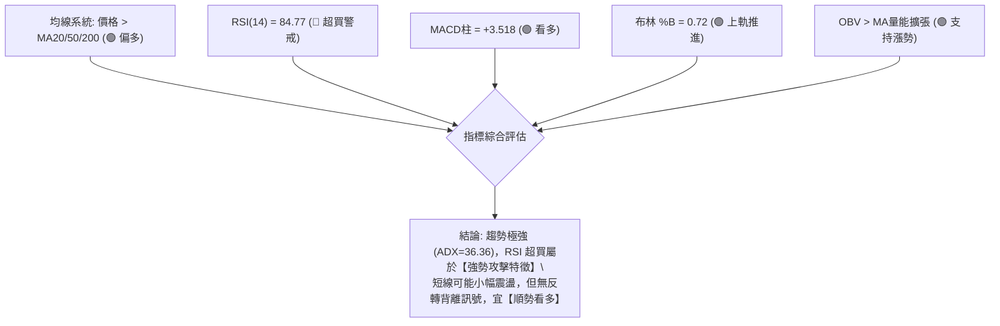
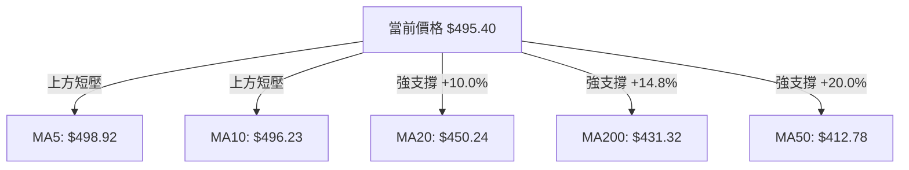
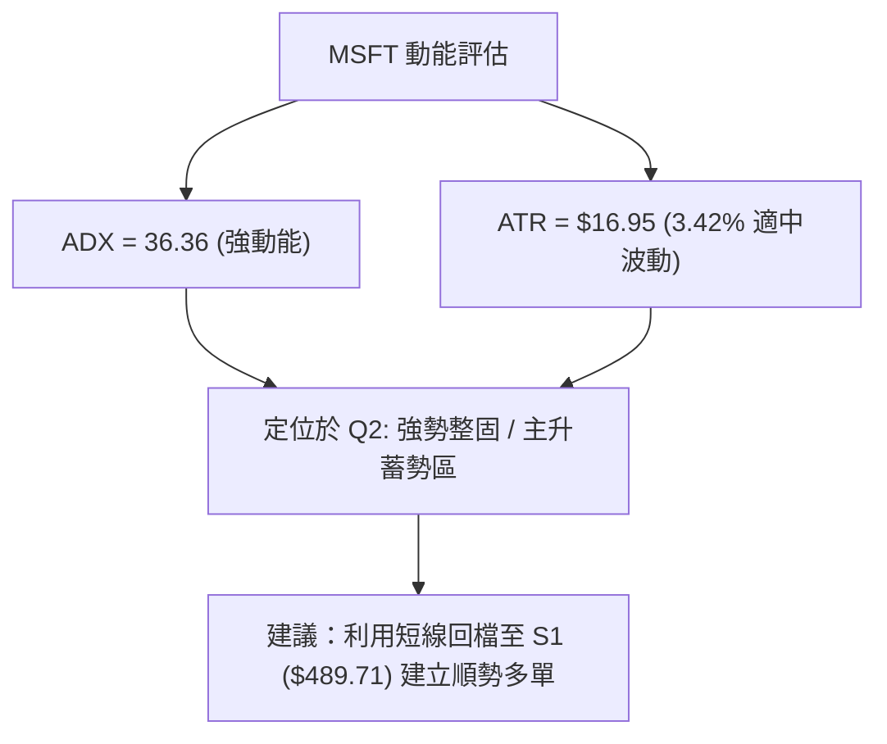
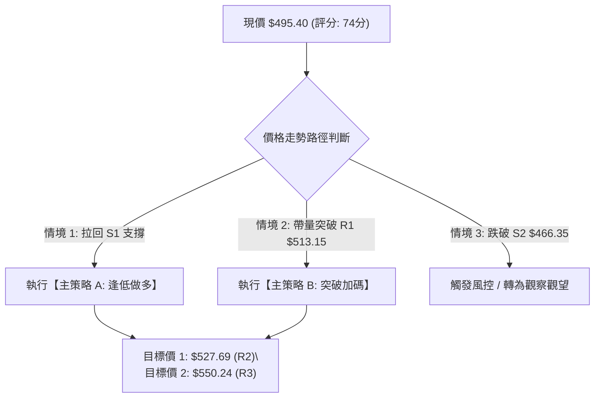
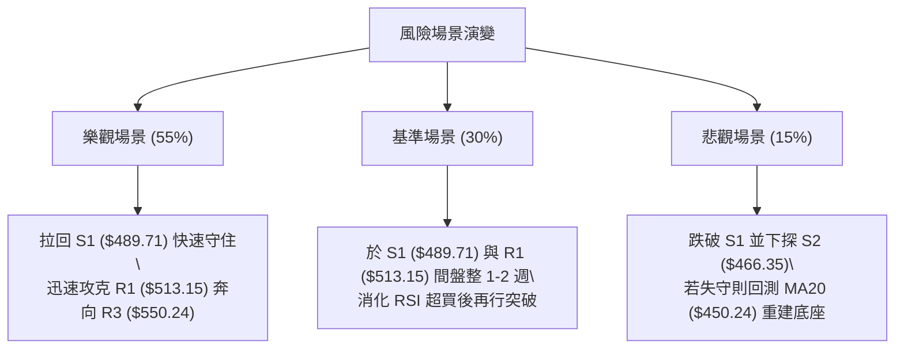

# MSFT 技術分析報告

> **報告日期**：2026-08-14 ｜ **語言**：繁體中文 ｜ **數據來源**：Yahoo Finance ｜ **當前價格**：$495.40

---

## 目錄

| 章節 | 內容 |
|------|------|
| [1. 技術面概覽](#1-技術面概覽) | 訊號儀表板、核心指標、評分卡 |
| [2. 趨勢分析](#2-趨勢分析) | 多時框趨勢、長中短期走勢、ADX強弱 |
| [3. 圖表形態分析](#3-圖表形態分析) | 形態識別、K線組合、目標價推算 |
| [4. 支撐與阻力](#4-支撐與阻力) | 關鍵價位、斐波那契回調結構 |
| [5. 技術指標深度解讀](#5-技術指標深度解讀) | MA/RSI/MACD/布林/成交量/OBV |
| [6. 動能與波動率](#6-動能與波動率) | 動能矩陣、ATR、Beta與市場相關性 |
| [7. 多時框架總結](#7-多時框架總結) | 時框架評分矩陣與多時框收斂 |
| [8. 交易策略建議](#8-交易策略建議) | 主策略分流、情境階梯、風報比計算 |
| [9. 風險提示與監控](#9-風險提示與監控) | 監控指標風控清單、極端風險場景 |

---

## 1. 技術面概覽

### 🎯 技術訊號儀表板



---

### 📊 核心指標速覽表

| 指標類別 | 指標名稱 | 當前數值 | 訊號 | 解讀與整合判斷 |
|----------|----------|----------|------|----------------|
| **價格** | 當前價格 | $495.40 | 🟢 偏多 | 位於 52 週區間前 72.7% 高位，短線強勢反彈 |
| **均線** | MA20 (月線) | $450.24 | 🟢 多頭 | 價格高於 MA20 達 +10.03%，中期趨勢強勁 |
| **均線** | MA50 (季線) | $412.78 | 🟢 多頭 | 價格高於 MA50 達 +20.02%，中期支撐極強 |
| **均線** | MA200 (年線)| $431.32 | 🟢 多頭 | 價格高於 MA200 達 +14.86%，長線多頭格局 |
| **動能** | RSI(14) | 84.77 | 🔴 超買 | 進入深度超買區，防範短線獲利了結賣壓 |
| **動能** | MACD (12/26/9) | +3.518 | 🟢 看多 | MACD 與 Signal 雙雙位於零軸上方且柱狀擴張 |
| **動能** | ADX (14) | 36.36 | 🟢 強趨勢 | ADX > 25 且 +DI (38.20) > -DI (13.21)，多頭趨勢確立 |
| **波動** | ATR(14) | $16.95 | 🟡 中高 | 日波動率 3.42%，需預留足夠止損空間 |
| **通道** | 布林 %B | 0.72 | 🟢 偏多 | 位於通道中軌 ($450.24) 與上軌 ($553.16) 之間 |

---

### 🏆 技術評分卡

```
╔══════════════════════════════════════════════════════════════════╗
║                   MSFT 技術評分卡 (2026-08-14)                   ║
╠══════════════════════════════════════════════════════════════════╣
║ 趨勢強度 (ADX)    █████████████████░░░░  85/100  🟢 超強趨勢     ║
║ 動能指標 (MACD/RSI)███████████████░░░░░  75/100  🟡 強勁但超買   ║
║ 支撐穩定度 (S1/S2) ██████████████░░░░░░  70/100  🟢 結構穩固     ║
║ 成交量配合 (OBV)  █████████████░░░░░░░░  65/100  🟡 回檔縮量     ║
║ 形態完整度        ██████████████░░░░░░  70/100  🟢 V型復甦確立   ║
║ 均線排列 (MA)     ████████████████░░░░  80/100  🟢 多頭均線排列 ║
╠══════════════════════════════════════════════════════════════════╣
║ 綜合評分          ███████████████░░░░░  74/100  🟢 偏多/建議逢低買║
╚══════════════════════════════════════════════════════════════════╝
```

---

## 2. 趨勢分析

### 🌐 多時框趨勢分析



---

### 📈 長期趨勢 — 24個月歷史走勢圖（Unicode ASCII）

```
MSFT 月線歷史走勢圖 (2024-08 至 2026-08)
價位 ($)
$550 ┤                                           ● (2025-07 高點 $529.27)
$525 ┤                                  ●   ●   
$500 ┤                                ●   ●   ●             ● (現價 $495.40)
$475 ┤                              ●               ●     ●
$450 ┤                        ●                       ● ●
$425 ┤  ●   ●   ●   ●       ●                           ●
$400 ┤    ●   ●       ●   ●                               ●
$375 ┤                  ●                                   ●
$350 ┤
     └─┬───┬───┬───┬───┬───┬───┬───┬───┬───┬───┬───┬───┬───┬───┬───► 月份
      24/08  10  12  25/02 04  06  08  10  12  26/02 04  06  08
```

#### 24 個月走勢階段特徵分析

| 階段 | 時間區間 | 收盤區間 | 漲跌幅 | 走勢特徵分析 |
|------|----------|----------|--------|--------------|
| **第一階段：高位盤整** | 2024-08 ~ 2025-04 | $411.43 → $391.41 | -4.87% | 於 $370 - $425 區間進行築底打底，打回中長線買盤 |
| **第二階段：主升段衝高**| 2025-05 ~ 2025-07 | $456.71 → $529.27 | +28.6% | 突破 $450 頸線後展開擴張波，創下階段歷史高點 |
| **第三階段：修復回檔** | 2025-08 ~ 2026-03 | $503.50 → $369.37 | -30.2% | 受到大盤獲利回吐影響，回測 52 週低點區 ($349.20) |
| **第四階段：強勢反彈** | 2026-04 ~ 2026-08 | $406.90 → $495.40 | +34.1% | 展現強勁 V 型反轉，迅速收復 MA20 及 MA200 |

---

### ⚡ 趨勢強度評估（ADX 深度解讀）



#### ADX 強度對照與市場狀態分析

| ADX 數值區間 | 當前狀況 | 市場狀態 | 交易策略指導 |
|--------------|----------|----------|--------------|
| 0 - 20 | | 無趨勢 / 盤整 | 網格交易 / 布林通道上下軌對沖 |
| 20 - 25 | | 趨勢萌芽 | 觀望等待突破確認 |
| **25 - 50** | **36.36 🟢** | **強勁趨勢** | **順勢操作，忽略短線 RSI 超買訊號，拉回尋找支撐做多** |
| 50 - 100 | | 極端趨勢 | 注意動能竭盡與反轉風險 |

---

## 3. 圖表形態分析

### 🔍 形態識別系統



#### 形態信心度與目標價計算表

| 形態名稱 | 信心度 | 判斷依據（引用數據） | 完成度 | 形態目標價計算公式 | 推估目標價 |
|----------|--------|----------------------|--------|--------------------|------------|
| **V 型強勢反轉** | 75% | 2026-06 低點 $373.02 至 2026-08 直逼 $500，中間無明顯深幅回檔 | 90% | 頸線 $450.24 + (頸線 $450.24 - 低點 $373.02) | **$527.46** |
| **雙底復甦形態** | 70% | 2026-03 低點 $369.37 與 2026-06 低點 $373.02 構成 W 底結構 | 85% | 頸線突破位 $423.70 + 形態高度 ($423.70 - $369.37) | **$478.03** *(已達成)* |

*備註：根據數據紀律，交易策略之實際執行點位將嚴格引用第 4 章之關鍵支撐阻力與斐波那契價位。*

---

### 🕯️ 近 5 週 K 線組合與動能分析

| 日期 | 週收盤價 | 週 RSI | 週 MACD柱 | 週成交量 | K 線形態與含義解讀 | 訊號 |
|------|----------|--------|-----------|----------|-------------------|------|
| 2026-07-19 | $393.82 | 63.9 | +3.222 | 163.1M | 溫和復甦紅 K，站穩短線均線 | 🟢 看多 |
| 2026-07-26 | $381.70 | 46.6 | +0.436 | 138.2M | 小幅回檔整理黑 K，成交量萎縮，屬於健康回測 | 🟡 中性 |
| 2026-08-02 | $464.72 | 75.0 | +7.460 | 278.4M | **帶量長紅 K**，突破 MA20 與 MA200，多頭全面點火 | 🟢 強多 |
| 2026-08-09 | $499.99 | 81.4 | +11.293 | 215.9M | 續擴張長紅 K，挑戰 $502.79 (23.6% 回調位) | 🟢 強多 |
| 2026-08-16 | $495.40 | 84.8 | +3.518 | 120.7M | 高位小十字 / 微幅量縮回檔，短期漲多消化賣壓 | 🟡 震盪 |

---

### 📉 ASCII 圖表形態示意圖

```
MSFT 雙底與 V 型反轉結構圖 ($/股)
$550 ┤                                           [R3: $550.24]
$527 ┤                                 [R2: $527.69]
$513 ┤                         [R1: $513.15]
$502 ┤                       ┌───► 現價 $495.40 (衝高回檔)
$473 ┤                      /    [Fib 38.2%: $473.44]
$450 ┤          頸線突破 ───┼─► [MA20: $450.24 / S1: $489.71]
$423 ┤         ┌────────────┘
$392 ┤         │                 [S2: $466.35]
$369 ┤   底1 (369.37)  底2 (373.02)
     └─────────────────────────────────────────────► 時間
```

---

## 4. 支撐與阻力

### 🗺️ 關鍵價位分布圖（Unicode ASCII）

```
MSFT 價位結構分布圖 (當前價格: $495.40)
═══════════════════════════════════════════════════════════════════
$550.24 ║████████████████████████████████████████║ 強阻力 R3 / 52W High
$527.69 ║██████████████████████████████        ║ 中期阻力 R2
$513.15 ║████████████████████████              ║ 近期阻力 R1
$502.79 ║▓▓▓▓▓▓▓▓▓▓▓▓▓▓▓▓▓▓▓▓                  ║ 斐波那契 23.6% 回調位
$495.40 ╠══════════════════════════════════════╣ ◄◄◄ 當前收盤價 ($495.40)
$489.71 ║▓▓▓▓▓▓▓▓▓▓▓▓▓▓▓▓                      ║ 近期關鍵支撐 S1 (-1.15%)
$473.44 ║████████████████                      ║ 斐波那契 38.2% 回調位
$466.35 ║████████████████████████              ║ 強支撐 S2 (-5.86%)
$450.24 ║██████████████████████████████        ║ MA20 中軌 / Fib 50% ($449.72)
$436.74 ║████████████████████████████████████  ║ 結構強支撐 S3 (-11.84%)
═══════════════════════════════════════════════════════════════════
```

---

### 🚧 阻力位分析表

| 阻力級別 | 精確價位 | 形成原因 | 突破難度 | 交易戰術意義 |
|----------|----------|----------|----------|--------------|
| **阻力 R1** | **$513.15** | 近一年波段高點聚類區間 (+3.58%) | 🟡 中等 | 短線多頭第一衝鋒目標，突破可開啟加碼 |
| **阻力 R2** | **$527.69** | 近一年次高點聚類 (+6.52%) | 🔴 較高 | 中期波段獲利了結區，短線多單應減碼 |
| **阻力 R3** | **$550.24** | 52 週最高價 / 歷史頂部 (+11.07%) | 🔴 極高 | 長線歷史高點強壓，需極大量能配合方能攻克 |

---

### 🛡️ 支撐位分析表

| 支撐級別 | 精確價位 | 形成原因 | 守住機率 | 交易戰術意義 |
|----------|----------|----------|----------|--------------|
| **支撐 S1** | **$489.71** | 近一年波段低點聚類 (-1.15%) | 🟢 高 | 短線多頭第一防線，極佳的拉回建倉點 |
| **支撐 S2** | **$466.35** | 近一年波段低點聚類 (-5.86%) | 🟢 極高 | 中期結構核心支撐，多頭強防守位 |
| **支撐 S3** | **$436.74** | 關鍵波段低點聚類 (-11.84%) | 🟢 極高 | 多空分水嶺，若跌破則中期多頭結構毀壞 |

---

### 📐 斐波那契回調位分析

依據 52 週高低點區間（高點 **$550.24** ➔ 低點 **$349.20**，振幅 $201.04）計算：

| 斐波那契扣抵位 | 精確價位 | 當前相對位置與意義解讀 |
|----------------|----------|------------------------|
| **0.0% (52W High)** | **$550.24** | 頂部阻力點 R3 |
| **23.6%** | **$502.79** | 當前價 ($495.40) 臨近此關卡，為短線回檔修復的第一阻力 |
| **38.2%** | **$473.44** | 黃金回調支撐位，位於 S1 ($489.71) 與 S2 ($466.35) 之間 |
| **50.0%** | **$449.72** | 多空中軸線，極度貼近當前 MA20 ($450.24)，具雙重支撐效力 |
| **61.8%** | **$426.00** | 強力黃金買點，靠近 MA200 ($431.32) |
| **78.6%** | **$392.22** | 深幅修復點 |
| **100.0% (52W Low)**| **$349.20** | 52 週底部 |

> **當前位置歸納**：現價 **$495.40** 位於 23.6% ($502.79) 與 38.2% ($473.44) 回調位之間。多頭若能有效攻克 $502.79，將直接打開向上挑戰 R1 ($513.15) 與 R2 ($527.69) 的空間。

---

## 5. 技術指標深度解讀

### 🎛️ 指標訊號整合圖



---

### 📈 移動平均線 (MA) 排列分析



*   **均線結構評價**：中長期均線（MA20、MA50、MA200）呈標準多頭排列，且價格遠高於此三條核心均線。短線價格受制於 MA5 ($498.92) 與 MA10 ($496.23) 的微幅壓制，呈現急漲後的技術性休整，屬健康現象。

---

### 📉 RSI(14) 與 MACD 深度評估

#### RSI(14) 強度進度條
```
0                30        50        70        84.77  100
├────────────────┼─────────┼─────────┼──────────█─────┤
                  [超賣區]   [中性區]  [超買區]  [當前]
```

*   **RSI(14) = 84.77**：已進入深度超買區（>70）。
*   **背離判定**：**無明顯背離**。價格與 RSI 同步創下近 4 個月新高，說明買盤力道充沛，此處高 RSI 為「強者恆強」之趨勢特徵，而非頂背離衰竭訊號。

#### MACD (12, 26, 9) 狀態
*   **MACD 線**：28.591
*   **Signal 線**：25.074
*   **MACD Hist**：+3.518 🟢（雙線保持金叉，柱狀體維持正值擴張）

---

### 📦 布林通道 (Bollinger Bands) 結構

```
MSFT 日線布林通道示意圖
$553.16 ─────────────── Upper Band (BB 上軌)
          ● $495.40    ◄ 現價 (位於中軌與上軌間，%B = 0.72)
$450.24 ─────────────── Middle Band (BB 中軌 / MA20)
$347.32 ─────────────── Lower Band (BB 下軌)
```

*   **通道寬度**：上軌 $553.16 至下軌 $347.32，通道處於擴張狀態。
*   **%B 指標**：0.72。價格位於中軌（$450.24）之上，且向擴張的上軌靠攏，顯示多頭具備強勁推升通道動能。

---

### 💹 成交量與 OBV 分析

*   **成交量狀況**：最新成交量 14,356,176 股，對比 20 日均量 37,659,114 股，量比僅 **0.38x**。
*   **量價配合解讀**：股價在連續大漲後，今日小幅回檔但**成交量大幅萎縮**。此為經典的「**上漲帶量、回檔量縮**」多頭格局，顯示籌碼鎖定良好，主力並無高位套現跡象。
*   **OBV 能量潮**：OBV > MA，量能指標持續對價格上漲給予正面確認。

---

## 6. 動能與波動率

### ⚡ 動能評估四象限

| 象限區劃 | 動能強度 | 波動率 | 當前位置 | 交易含義與評估 |
|----------|----------|--------|----------|----------------|
| **Q1 (主升擴張)** | 強 | 高 | - | 突破加速期，風險報酬比降低 |
| **Q2 (強勢整固)** | **強** | **中/低** | **✓ (MSFT)** | **ADX=36.36, ATR=3.42%。最適順勢交易區，拉回即可布局** |
| **Q3 (沉悶盤整)** | 弱 | 低 | - | 缺乏方向，適合觀望 |
| **Q4 (弱勢崩跌)** | 弱 | 高 | - | 避開做多，順勢做空 |



---

### 📊 ATR 波動率與止損風控

*   **ATR(14)**：$16.95（占股價 3.42%）。
*   **單日正常波動區間**：$495.40 ± $16.95 ➔ **$478.45 ~ $512.35**。
*   **止損距離建議**：
    *   **短線交易 (1.5x ATR)**：止損寬度應設約 **$25.43**。
    *   **波段交易 (2.0x ATR)**：止損寬度應設約 **$33.90**。

---

### 📐 Beta 與市場相關性

*   **Beta 係數**：1.099。
*   **特徵**：波動性略高於大盤（S&P 500）。在大盤多頭環境下，MSFT 具備超越大盤的 Alpha 獲利潛力；若大盤拉回，其修正幅度亦將略大於大盤，需嚴格實施資金管理。

---

## 7. 多時框架總結

### 📋 時框架評分矩陣

| 時框架 | 趨勢方向 | 動能指標 | 均線排列 | 形態結構 | 綜合評分 | 戰術建議 |
|--------|----------|----------|----------|----------|----------|----------|
| **月線 (Long)** | 🟢 看多 | 🟢 強勁 | 🟢 多頭 | 🟢 大底完成 | **85/100** | 長線持有，忽略短線噪音 |
| **週線 (Medium)**| 🟢 看多 | 🟢 擴張 | 🟢 金叉 | 🟢 V型反轉 | **80/100** | 中期波段做多，逢拉回加碼 |
| **日線 (Short)** | 🟡 震盪 | 🔴 超買 | 🟡 短壓 | 🟢 高位旗形 | **65/100** | 不宜追高，耐心等待拉回 S1 |

---

### ⚖️ 多時框收斂結論

依據多時框收斂規則：
1. **趨勢模式判定**：ADX (36.36) > 25，確定當前市場處於**強趨勢行情**。
2. **主導時框**：由中長期（週線/MA20、MA200）方向主導，結論為**明確多頭**。
3. **日線角色**：日線 RSI(14) 達 84.77 之超買狀態，僅代表短線衝高後需要「以盤代跌」或「微幅拉回」來消化獲利籌碼，**絕非轉空訊號**。

> **最終唯一方向性結論**：**偏多看待（逢低做多）**。策略應以週線多頭為主軸，利用日線拉回至 S1 ($489.71) 附近建立多頭倉位。

---

## 8. 交易策略建議

### 🗺️ 策略決策流程圖



---

### 🧭 策略路由

*   **當前主策略方向**：**做多 (Bullish)**（依據技術綜合評分 74/100 ≥ 60，且 ADX 達 36.36 強趨勢）。
*   **策略戰術**：鑑於日線 RSI 處於高位，**禁止市價追高**，一律採用「**支撐位限價掛單做多**」或「**突破確認後進場**」。

---

### 🎯 價格情境階梯 (Price Scenarios)

| 觸發條件 | 第一目標價 | 第二目標價 | 情境含義與操作指引 |
|----------|------------|------------|--------------------|
| **突破 R1 $513.15** | R2 $527.69 | R3 $550.24 | 短線強勢再起，多頭攻勢擴張 |
| **守住 S1 $489.71** | R1 $513.15 | R2 $527.69 | 健康的技術性拉回，最佳進場區 |
| **跌破 S1 下探 S2 $466.35**| Fib 38.2% $473.44 | MA20 $450.24 | 中期深幅修復，需防守 S2 |

---

### 📊 情境機率分佈

| 情境劇本 | 機率 | 主要技術依據 |
|----------|------|--------------|
| **繼續上行 / 支撐反彈** | **55%** | MACD 柱狀擴張、ADX=36.36 多頭主導、OBV 多頭配合 |
| **高位區間震盪 ($489-$513)**| **30%** | 日線 RSI 超買待消化、成交量短線萎縮 |
| **深幅拉回測試 S2 ($466.35)**| **15%** | 短線高位獲利賣壓引爆、大盤出現系統性拉回 |

---

### 🟢 主策略詳情

根據數據紀律，所有價位**嚴格引用第 4 章已算定之關鍵價位**：

| 策略要素 | 策略 A（穩健型：拉回支撐做多） | 策略 B（激進型：突破阻力做多） |
|----------|───────────────────────────────|───────────────────────────────|
| **進場條件** | 價格拉回至 S1 附近獲得支撐 | 價格帶量突破 R1 並完成回測 |
| **進場價格** | **$489.71**（S1 關鍵支撐位） | **$513.15**（突破 R1 確認價） |
| **止損價格** | **$466.35**（S2 強支撐位下緣） | **$489.71**（原 S1 轉化之支撐位） |
| **目標價 T1** | **$527.69**（R2 中期阻力位） | **$527.69**（R2 中期阻力位） |
| **目標價 T2** | **$550.24**（R3 52週歷史高點） | **$550.24**（R3 52週歷史高點） |
| **潛在風險** | $23.36 ($489.71 - $466.35) | $23.44 ($513.15 - $489.71) |
| **潛在報酬 (T2)**| $60.53 ($550.24 - $489.71) | $37.09 ($550.24 - $513.15) |
| **風險報酬比** | **1 : 2.59** 🟢 (優良) | **1 : 1.58** 🟡 (可接受) |
| **建議倉位** | **15% - 20%** 總投資組合 | **10%** 總投資組合 |

---

### 🔴 反向風險觸發點（風控與對沖提示）

*   **多頭失效觸發價**：收盤價**跌破 S2 ($466.35)**。
*   **對沖/清倉動作**：若股價跌破 $466.35，意味著近期的強勢反轉結構遭到破壞，可能進一步回測 MA20 ($450.24) 或 S3 ($436.74)。多頭倉位應即刻執行止損離場，嚴禁硬扛。

---

### ⭐ 整體訊號強度評星

```
做多訊號強度：★★██☆  (4/5 星) — 趨勢極強，唯需等待超買修復
做空訊號強度：█☆☆☆☆  (1/5 星) — ADX 顯示強趨勢，逆勢做空風險極高
整體可信度：  ★★██☆  (4/5 星) — 多指標互相印證，結構清晰
```

---

## 9. 風險提示與監控

### ✅ 關鍵監控指標 Checklist

```
╔══════════════════════════════════════════════════════════════════╗
║                   每日交易前技術監控清單                         ║
╠══════════════════════════════════════════════════════════════════╣
║ [ ] 1. RSI(14) 是否跌破 70 回歸正常區間？                       ║
║ [ ] 2. 股價回測 S1 ($489.71) 時，成交量是否呈現「急縮」？         ║
║ [ ] 3. MACD 柱狀體 (+3.518) 是否出現連續縮小之頂背離預警？      ║
║ [ ] 4. 股價向上挑戰 R1 ($513.15) 時，日成交量是否突破 3,700 萬股？║
║ [ ] 5. ADX(14) 指標是否維持在 25 以上（確認趨勢延續性）？       ║
╚══════════════════════════════════════════════════════════════════╝
```

---

### ⚠️ 風險場景分析



---

### 🛡️ 風險管理重要提醒

1.  **波動率風控**：當前 ATR 為 $16.95，每日正常震盪幅度達 3.42%。建倉時務必將合適的 ATR 空間納入考量，避免將止損設定過窄（如低於 1.0x ATR）而被正常噪聲洗出場。
2.  **超買降溫風險**：RSI(14) 高達 84.77，極度超買環境下，任何大盤的微幅回檔都可能引發 MSFT 短線 2-3% 的快速修正，**切忌於開盤追高**。
3.  **機構籌碼結構**：法人持股比重達 76.4%，籌碼相當集中，趨勢一旦形成不易輕易改變，順勢而為是最佳策略。

---

## 📋 報告總結

```
╔══════════════════════════════════════════════════════════════════╗
║                 MSFT 技術分析報告總結 (2026-08-14)                ║
╠══════════════════════════════════════════════════════════════════╣
║ 當前價格：$495.40                                                ║
║ 綜合技術評分：74 / 100                                           ║
║ 分析評級：🟢 偏多整固 / 逢低做多 (Strong Trend Buy on Dip)       ║
╠══════════════════════════════════════════════════════════════════╣
║ 關鍵技術特徵結語：                                              ║
║ ├─ 長期趨勢：🟢 偏多 (大層級底部位於 $369.37，V 型反轉結構完整)   ║
║ ├─ 中期趨勢：🟢 偏多 (價格站穩 MA20 $450.24 與 MA200 $431.32)    ║
║ ├─ 短期趨勢：🟡 震盪 (RSI 84.77 處於超買，急漲後微幅修整)        ║
║ ├─ 核心支撐：S1: $489.71 ｜ S2: $466.35                          ║
║ ├─ 核心阻力：R1: $513.15 ｜ R2: $527.69 ｜ R3: $550.24 (52W高)   ║
║ └─ 法人共識目標價：$567.20 (平均)                                ║
╠══════════════════════════════════════════════════════════════════╣
║ 最優交易策略指引：                                               ║
║ 1. 🥇 最佳機會：等待拉回至 S1 ($489.71) 建立多單，止損設於 $466.35║
║                 目標價看至 R2 ($527.69) 與 R3 ($550.24) (風報比 2.59)║
║ 2. 🥈 次選機會：若帶量突破 R1 ($513.15)，追價做多，目標 R3 ($550.24)║
║ 3. 🥉 嚴格風控：若收盤跌破 S2 ($466.35) 無條件執行止損             ║
╚══════════════════════════════════════════════════════════════════╝
```

---

> ⚠️ **免責聲明**：本報告為 AI 技術分析研究員根據提供之歷史價格與技術數據自動生成。本報告內容**僅供投資研究與學術參考**，**不構成任何形式的投資建議、買賣邀約或操作擔保**。金融市場投資具高風險，價格波動難以預測，投資人應獨立思考、審慎評估並自負投資盈虧風險。

---
*報告生成時間：2026-08-14 ｜ 數據來源：Yahoo Finance ｜ 分析框架：多時框量化技術分析*