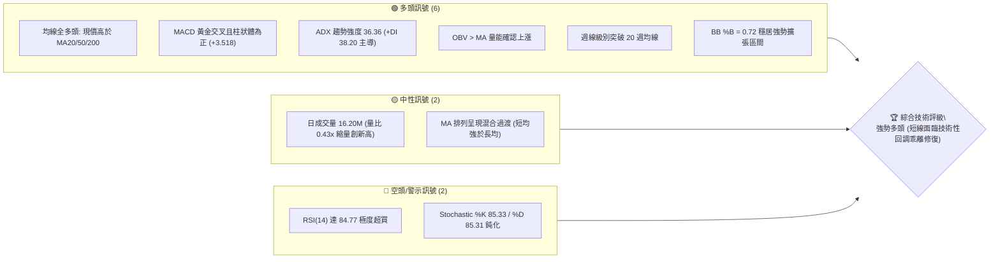
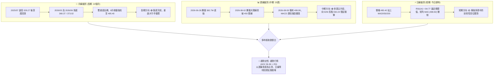
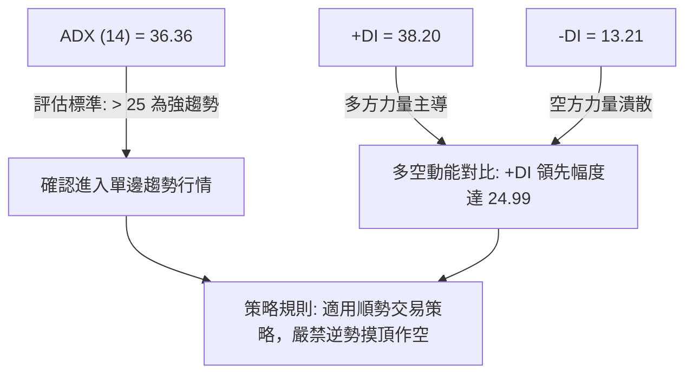
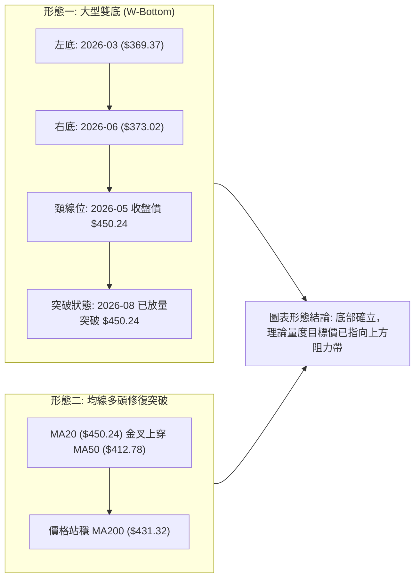
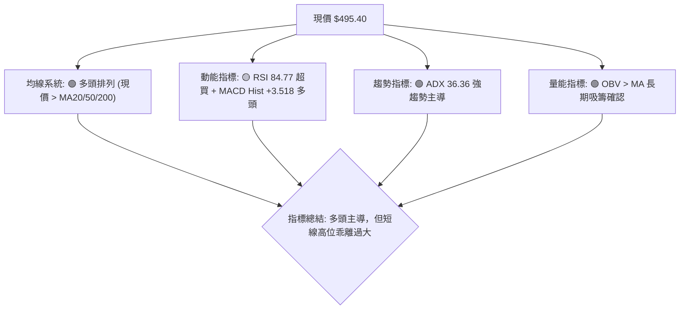
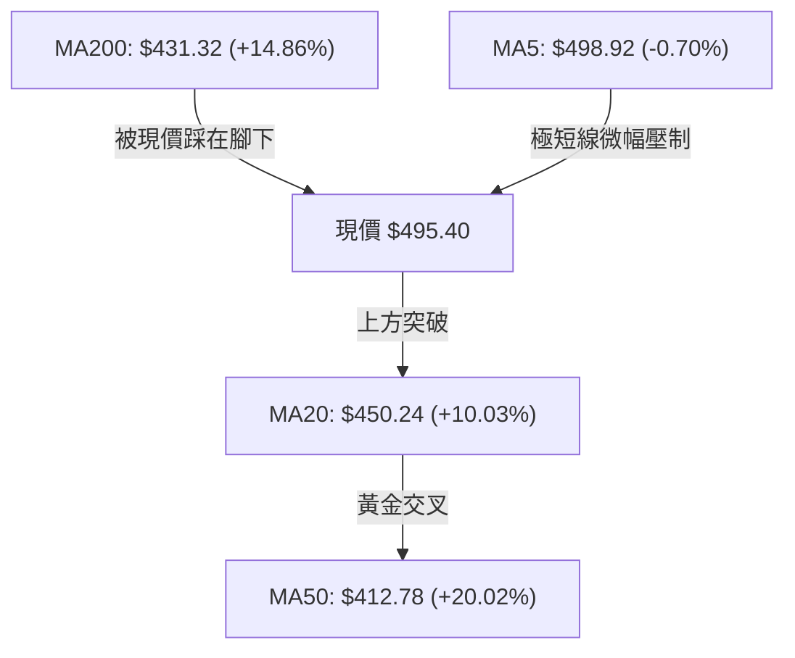
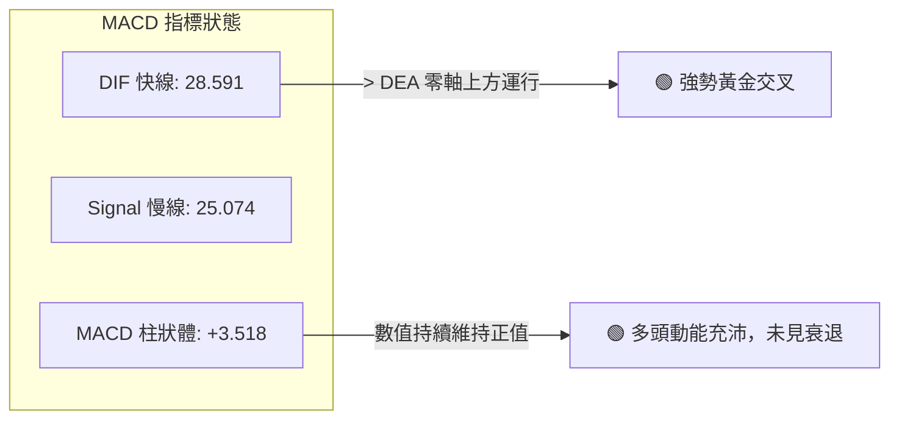
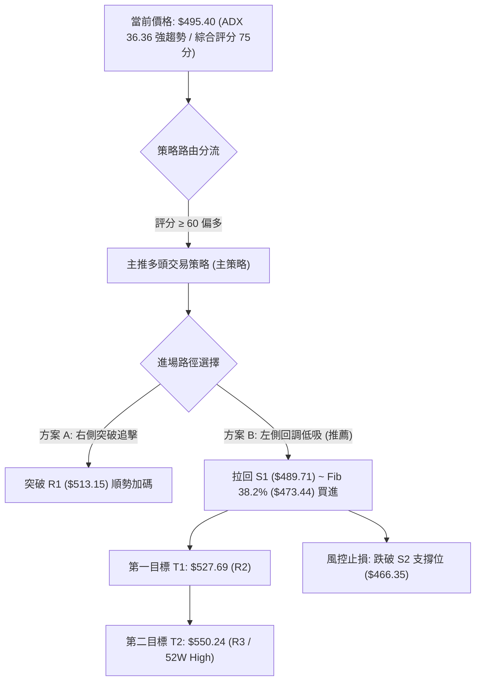
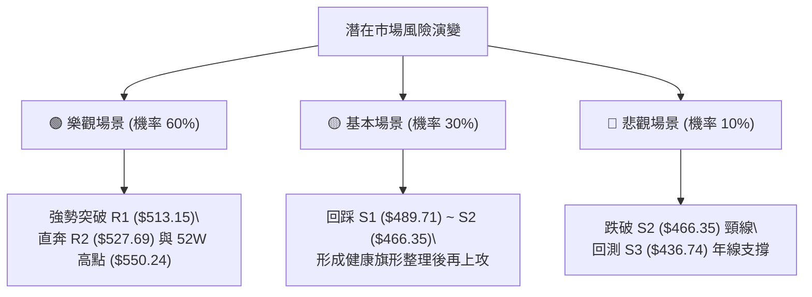

# MSFT 技術分析報告

> **報告日期**：2026-08-16 ｜ **語言**：繁體中文 ｜ **數據來源**：Yahoo Finance ｜ **當前價格**：$495.40

---

## 目錄

| 章節 | 內容 |
|------|------|
| [1. 技術面概覽](#1-技術面概覽) | 訊號儀表板、核心指標、評分卡 |
| [2. 趨勢分析](#2-趨勢分析) | 多時框趨勢、長中短期走勢、ADX解讀 |
| [3. 圖表形態分析](#3-圖表形態分析) | 形態識別、信心度評估、K線組合 |
| [4. 支撐與阻力](#4-支撐與阻力) | 關鍵價位階梯、斐波那契回調結構 |
| [5. 技術指標深度解讀](#5-技術指標深度解讀) | MA均線、RSI、MACD、布林通道、OBV |
| [6. 動能與波動率](#6-動能與波動率) | 動能四象限、ATR波動率、Beta分析 |
| [7. 多時框架總結](#7-多時框架總結) | 時框架評分矩陣、多時框收斂結論 |
| [8. 交易策略建議](#8-交易策略建議) | 策略路由、階梯情境、多頭主策略、風險報酬比 |
| [9. 風險提示與監控](#9-風險提示與監控) | 監控Checklist、風險場景、部位管理 |
| [📋 報告總結](#-報告總結) | 核心技術結論與執行清單 |

---

## 1. 技術面概覽

### 🎯 技術訊號儀表板



---

### 📊 核心指標速覽表

| 指標類別 | 指標名稱 | 當前數值 | 訊號 | 解讀與技術含義 |
|:---|:---|:---|:---:|:---|
| **價格結構** | 現行收盤價 | **$495.40** | 🟢 | 站穩 52 週區間之 72.7% 高位，距離 52W 高點僅 -9.97% |
| **短期均線** | MA20 (月線) | **$450.24** | 🟢 | 價格高於 MA20 達 +10.03%，短線乖離偏大，提供強勁波段動能支撐 |
| **中期均線** | MA50 (季線) | **$412.78** | 🟢 | 價格高於 MA50 達 +20.02%，中期趨勢已從 2026 年中谷底完全逆轉 |
| **長期均線** | MA200 (年線) | **$431.32** | 🟢 | 價格突破年線並穩居其上 +14.86%，奠定長線牛市架構 |
| **動能指標** | RSI(14) | **84.77** | 🔴 | 進入深度超買區（>70），短線追高風險極高，但無頂背離現象 |
| **趨勢動能** | MACD (12/26/9) | **28.591 / 25.074** | 🟢 | DIF 線位於 Signal 線上方，MACD 柱狀體為 +3.518，多頭主導 |
| **趨勢強度** | ADX (14) | **36.36** | 🟢 | ADX > 25 且 +DI (38.20) 遠高於 -DI (13.21)，確認為強勢單邊趨勢行情 |
| **通道指標** | Bollinger Bands | **上軌 $553.16 / 中軌 $450.24** | 🟢 | %B 為 0.72，價格在上半通道持續推升，通道開口放大 |
| **成交量能** | OBV & 量比 | **16.20M (0.43x)** | 🟡 | OBV > MA 表明長線資金流入，但當日突破量縮，需慎防回踩確認 |
| **波動指標** | ATR(14) | **$16.95 (3.42%)** | 🟡 | 每日平均波動幅度近 17 美元，操作需設置足夠風控緩衝 |

---

### 🏆 技術評分卡

```
╔══════════════════════════════════════════════════════════════════╗
║                技術評分卡 — MSFT (2026-08-16)                  ║
╠══════════════════════════════════════════════════════════════════╣
║ 趨勢強度 (Trend)      ████████████████░░░░  82/100  🟢 強勢多頭  ║
║ 動能指標 (Momentum)    ██████████████░░░░░░  70/100  🟡 偏強超買  ║
║ 支撐穩定度 (Support)  ████████████████░░░░  80/100  🟢 梯隊扎實  ║
║ 成交量配合 (Volume)    ████████████░░░░░░░░  60/100  🟡 縮量推升  ║
║ 形態完整度 (Pattern)  ████████████████░░░░  78/100  🟢 底部成型  ║
║ 均線排列 (Moving Avg) ██████████████░░░░░░  72/100  🟢 多頭恢復  ║
╠══════════════════════════════════════════════════════════════════╣
║ 綜合技術評分          ███████████████░░░░░  75/100  🟢 偏多進攻  ║
╚══════════════════════════════════════════════════════════════════╝
```

---

## 2. 趨勢分析

### 🌐 多時框趨勢分析



---

### 📈 長期趨勢 — 12個月走勢圖（ASCII）

```
MSFT 月線收盤價走勢圖（2025-08 至 2026-08）
價格軸 ($)
$530 ┤     ● 529.27(07)
$515 ┤        ● 514.69(09) ● 514.55(10)
$500 ┤  ● 503.50(08)                          ● 495.40(現價 08)
$485 ┤                    ● 489.83(11) ● 481.48(12)
$465 ┤                                            ● 464.72(07)
$450 ┤                                      ● 450.24(05)
$425 ┤                          ● 428.38(01)
$405 ┤                                ● 406.90(04)
$390 ┤                               ● 391.89(02)
$370 ┤                                      ● 369.37(03)  ● 373.02(06)
     └─────────────────────────────────────────────────────────────
        25/08 25/09 25/10 25/11 25/12 26/01 26/02 26/03 26/04 26/05 26/06 26/07 26/08
```

#### 走勢特徵階段分析

| 階段區間 | 價格走勢 ($) | 漲跌幅 | 結構特徵與成交量解讀 |
|:---|:---|:---:|:---|
| **2025-08 ~ 2025-10** | 503.50 → 514.55 | +2.19% | 高位箱型震盪築頂，動能衰竭。 |
| **2025-11 ~ 2026-03** | 489.83 → 369.37 | -24.59% | 單邊中期修正，於 2026-03 觸及波段第一低點 $369.37。 |
| **2026-04 ~ 2026-05** | 406.90 → 450.24 | +10.65% | 超跌強烈反彈，受阻於斐波那契 50.0% 回調位 ($449.72)。 |
| **2026-06** | 450.24 → 373.02 | -17.15% | 二次下探打出第二隻腳 ($373.02)，爆出 3.82 億股天量完成籌碼換手。 |
| **2026-07 ~ 2026-08** | 373.02 → 495.40 | **+32.81%** | 絕地反擊主升浪，直接衝破多道均線，形成標準大型雙底反轉。 |

---

### 📊 中期趨勢（週線分析）

```
中期週線阻力與支撐梯隊示意圖
阻力 R3  $550.24 ─────────────────────── [52W歷史天花板]
阻力 R2  $527.69 ─────────────────────── [2025年7月波段次高密集區]
阻力 R1  $513.15 ─────────────────────── [2025年秋季平台阻力 / 斐波 23.6% $502.79 上方]
現價     $495.40 ◄══════════════════════ [強勢推升中]
支撐 S1  $489.71 ─────────────────────── [8月第二週回調低點 / 短線第一道防線]
支撐 S2  $466.35 ─────────────────────── [7月月線突破平台 / 斐波 38.2% $473.44 下方]
支撐 S3  $436.74 ─────────────────────── [MA200 $431.32 上方強支撐帶]
```

---

### ⚡ 趨勢強度評估（ADX 解讀）



| 指標變數 | 當前讀數 | 臨界參考值 | 趨勢判定 | 操作指引 |
|:---|:---:|:---:|:---:|:---|
| **ADX(14)** | **36.36** | 25.00 | **強趨勢 (Strong Trend)** | 採用順勢突破或均線拉回買進策略 |
| **+DI** | **38.20** | 20.00 | **多頭極強** | 多方掌握完全定價權 |
| **-DI** | **13.21** | 20.00 | **空頭衰退** | 空方無力發動有效反撲 |

---

## 3. 圖表形態分析

### 🔍 形態識別系統



#### 形態識別與信心度評估表

| 形態名稱 | 信心度 | 判斷依據（引用數據） | 完成度 | 量度目標價（附精確計算式） |
|:---|:---:|:---|:---:|:---|
| **大型雙重底 (W-Bottom)** | **85%** | ① 雙底低點分別為 2026-03 的 $369.37 與 2026-06 的 $373.02（誤差僅 0.98%）。<br>② 頸線為 2026-05 反彈高點 $450.24。<br>③ 2026-08 價格已強勢攻至 $495.40 達成頸線有效突破。 | 100% (已突破) | **目標價 = 頸線 + 形態高度**<br>形態高度 = $450.24 - $369.37 = $80.87<br>**量度目標價 = $450.24 + $80.87 = $531.11**<br>*(極度接近上方 R2 阻力 $527.69)* |
| **布林帶向上喇叭口突破** | **90%** | ① BB 上軌擴張至 $553.16，中軌 $450.24 急速向上。<br>② %B 達到 0.72，沿著上半通道運行。 | 90% | 通道上軌擴張目標：**$550.24 (R3 / 52W High)** |

---

### 🕯️ 重要K線形態分析（近 5 個月走勢）

| 月份 | 收盤價 ($) | 關鍵 K 線形態 | 技術解讀 | 訊號強度 |
|:---|:---:|:---|:---|:---:|
| **2026-04** | 406.90 | 長下影探底陽線 | 價格在 $369.37 止跌後反彈，確認第一重底支撐有效。 | 🟢 買訊 |
| **2026-05** | 450.24 | 光頭大陽線 | 大幅上漲 +10.65%，建立雙底架構之關鍵頸線阻力。 | 🟢 強多 |
| **2026-06** | 373.02 | 爆量長下影陰線 (洗盤) | 月週成交量達 3.82 億股天量，二次探底形成黃金右腳。 | 🟢 築底確認 |
| **2026-07** | 464.72 | 吞噬大陽線 | 月漲幅達 +24.58%，一口氣收復 5 月頸線 $450.24。 | 🟢🟢 強烈突破 |
| **2026-08 (當前)** | 495.40 | 強勢延續實體陽線 | 穩居所有均線之上，逼近 $500 大關，多頭趨勢完全主導。 | 🟢 多頭續攻 |

---

### 📉 ASCII 雙底反轉形態示意圖

```
MSFT 雙重底 (W-Bottom) 突破與量度目標推算圖
價格 ($)
$531.11 ┤ - - - - - - - - - - - - - - - - - - - - - - - - - - - - 🎯 量度目標價 ($531.11 / 鄰近 R2 $527.69)
         │                                                      ▲
$513.15 ┤ - - - - - - - - - - - - - - - - - - - - - - - - - - - │ R1 阻力
$495.40 ┤                                                ● 現價 495.40
         │                                               /      │
$450.24 ┤....................... 頸線位 (Neckline) ....../.......│ 形態高度 H = $80.87
         │                      ● 450.24 (2026-05)      /       │
         │                     / \                     /        ▼
         │                    /   \                   /
$370.00 ┤         ● 369.37  /     \      ● 373.02   /
         │          (左底 03)        \____ (右底 06)__/
         └─────────────────────────────────────────────────────────────
```

---

## 4. 支撐與阻力

### 🗺️ 關鍵價位分布圖（ASCII）

```
MSFT 價位結構分布圖
══════════════════════════════════════════════════════════════════
$550.24 ║██████████████████████████████║ 強阻力 R3 (52W 歷史天花板 / 0.0% Fib)
$527.69 ║████████████████████          ║ 阻力 R2 (2025波段高點聚類 / 雙底量度區間)
$513.15 ║████████████████████████      ║ 關鍵阻力 R1 (Fib 23.6% $502.79 上方強壓)
$495.40 ╠══════════════════════════════╣ ◄ 當前市價 ($495.40)
$489.71 ║▓▓▓▓▓▓▓▓▓▓▓▓▓▓▓▓              ║ 近期波段支撐 S1 (-1.15%, 8月回調低點)
$466.35 ║████████████████████          ║ 強支撐 S2 (-5.86%, 7月換手平台)
$436.74 ║██████████████████████████████║ 核心防禦支撐 S3 (-11.84%, MA200年線區)
══════════════════════════════════════════════════════════════════
```

---

### 🚧 阻力位分析表

| 阻力級別 | 精確價位 | 距現價幅幅 | 形成原因（波段高點聚類與量化位） | 突破難度 | 技術重要性 |
|:---|:---:|:---:|:---|:---:|:---|
| **R1** | **$513.15** | +3.58% | 近一年反彈密集區；上方緊鄰斐波那契 23.6% 回調位 ($502.79) 之延伸壓力。 | 🟡 中等 | 短線多頭獲利了結首道關卡 |
| **R2** | **$527.69** | +6.52% | 2025-07 波段歷史次高點 ($529.27) 聚類區，且為 W 底形態量度目標 ($531.11) 核心重合帶。 | 🔴 較大 | 中期多空波段分水嶺 |
| **R3** | **$550.24** | +11.07% | 52 週最高點 (52W High)，歷史絕對天花板阻力。 | 🔴🔴 極高 | 長線牛市完全開啟標誌 |

---

### 🛡️ 支撐位分析表

| 支撐級別 | 精確價位 | 距現價幅幅 | 形成原因（波段低點聚類與量化位） | 守住機率 | 技術重要性 |
|:---|:---:|:---:|:---|:---:|:---|
| **S1** | **$489.71** | -1.15% | 近期 8 月份日線震盪波段低點聚類，短線多頭第一防線。 | 80% | 短線強勢格局維持點 |
| **S2** | **$466.35** | -5.86% | 2026-07 突破大陽線收盤位 ($464.72) 平台，且下方臨近 Fib 38.2% ($473.44)。 | 85% | 波段進場之最佳安全緩衝區 |
| **S3** | **$436.74** | -11.84% | 年線 MA200 ($431.32) 上方之波段低點聚集區，中期牛熊分界線。 | 95% | 中長線多頭底線，不可跌破 |

---

### 📐 斐波那契回調位分析

依據 52 週區間 **$349.20 (52W Low) → $550.24 (52W High)** 計算：

```
斐波那契回調階梯與現價定位
 0.0%  $550.24 (52W High / 阻力 R3)
       │
23.6%  $502.79 ── 上方即時阻力帶 ─── [阻力 R1 $513.15 覆蓋]
       ▲
       │  ◄── 當前市價 $495.40 位於 23.6% ($502.79) 與 38.2% ($473.44) 之間
       ▼
38.2%  $473.44 ── 中期回調支撐帶 ─── [支撐 S2 $466.35 覆蓋]
       │
50.0%  $449.72 ── 頸線中樞強支撐 ─── [MA20 $450.24 完美重合]
       │
61.8%  $426.00 ── 黃金回調防守線 ─── [MA200 $431.32 緊鄰]
       │
78.6%  $392.22 ── 深度回撤低位區
       │
100.0% $349.20 (52W Low)
```

- **斐波那契解讀**：現價 $495.40 成功收復 50.0% ($449.72) 與 38.2% ($473.44)，目前正向上挑戰 23.6% ($502.79) 關鍵阻力。若實體突破 $502.79，將打開直奔 0.0% ($550.24) 的上行通道。

---

## 5. 技術指標深度解讀

### 🎛️ 指標訊號總覽



---

### 📈 移動平均線排列分析



| 均線名稱 | 數值 ($) | 乖離率 (%) | 訊號評估 | 均線趨勢與角色 |
|:---|:---:|:---:|:---:|:---|
| **MA5** | 498.92 | -0.70% | 🟡 震盪 | 極短線輕微受阻，反映短線漲勢暫歇 |
| **MA10** | 496.23 | -0.17% | 🟡 貼合 | 短線支撐均線，貼近現價 |
| **MA20** | 450.24 | +10.03% | 🟢 多頭 | 20日多空分水嶺，向上發散提供強勁波段支撐 |
| **MA60** | 415.53 | +19.22% | 🟢 多頭 | 中期生命線，已由下向上快速反折 |
| **MA120** | 407.30 | +21.63% | 🟢 多頭 | 半年線支撐堅實 |
| **MA200** | 431.32 | +14.86% | 🟢 多頭 | 牛熊年線已被有效站穩，中長線全面偏多 |
| **MA240** | 444.42 | +11.47% | 🟢 多頭 | 長期基期已被大幅拉高 |

---

### 📉 RSI(14) 分析

- **當前讀數**：**84.77**（極度超買區間 > 70）
- **RSI 進度條**：`█████████████████░░░ 84.77%` 🔴
- **背離判斷**：
  - 週線 RSI 由 2026-07 的 75.0 升至當前的 84.8，與價格自 $464.72 升至 $495.40 步調一致。
  - **結論：目前「無明顯頂背離」**。RSI 處於多頭強勢鈍化狀態，表示多方動能極為猛烈，但在未出現技術性回踩前，不宜使用高槓桿追價。

---

### 📊 MACD(12/26/9) 訊號解讀



- **MACD 解讀**：快線與慢線均在遠高於零軸的正區間運行，MACD 柱狀體維持在 +3.518。此形態為典型「零軸上方多頭強勢主升段」，無空頭轉折訊號。

---

### 📦 布林通道分析 (Bollinger Bands)

```
布林通道結構示意圖 (20, 2)
$553.16 ┤ ══════════════════════════════════════ 上軌 (Upper Band)
         │                                       
$495.40 ┤ ------------------- ● 現價 ($495.40, %B = 0.72)
         │                                       
$450.24 ┤ ────────────────────────────────────── 中軌 (MA20: $450.24)
         │                                       
$347.32 ┤ ══════════════════════════════════════ 下軌 (Lower Band)
```

- **帶寬與位置**：上軌 $553.16、中軌 $450.24、下軌 $347.32。
- **%B 指標**：0.72。價格運行在中軌與上軌之間（強勢多頭通道），尚未觸碰上軌形成極端超買摩擦，向上仍有向 $550-$553 擴張的空間。

---

### 💹 成交量分析（量價配合度）

- **最新成交量**：16,205,200 股
- **20日均量**：37,751,565 股（**量比：0.43x**）
- **量價關係解讀**：
  - 8 月初突破頸線時伴隨 2.78 億週量（2026-08-02），顯示主力大資金真金白銀進場突破。
  - 當前日線級別在 $495.40 呈現量縮上漲（量比 0.43x），顯示籌碼鎖定良好，拋壓極輕，但若要實質突破 R1 ($513.15)，需後續放量確認。
  - **OBV 趨勢**：OBV > MA，量能指標長期健康，量價配合整體評定為「長多短蓄勢」。

---

## 6. 動能與波動率

### ⚡ 動能評估四象限

| 象限 | 動能強度 | 波動率水準 | 當前狀態判定 | 交易環境與策略評估 |
|:---|:---:|:---:|:---:|:---|
| **Q1 (主升機會)** | **強** | **低** | ─ | 最佳穩健趨勢交易區間 |
| **Q2 (盤整觀望)** | **弱** | **低** | ─ | 橫盤打底，等待方向突破 |
| **Q3 (強勢波動)** | **強** | **高** | **✓ (MSFT 當前定位)** | **動能極強 (RSI 84.8 / ADX 36.4)，ATR 達 $16.95，屬於高動能高波動主升段，收益空間大但需嚴格風控。** |
| **Q4 (極度危險)** | **弱** | **高** | ─ | 無序下殺，避免進場抄底 |

---

### 📊 ATR 波動率分析

- **ATR(14) 數值**：**$16.95**（佔股價比例：**3.42%**）
- **每日波動特性**：MSFT 日內常態波動約在 ±$17 美元左右。
- **風控止損距離建議**：
  - **保守型波段止損（1.5 × ATR）**：$16.95 × 1.5 = **$25.43**（自進場點下設約 $25 美元緩衝）。
  - **積極型短線止損（1.0 × ATR）**：$16.95 × 1.0 = **$16.95**。

---

### 📐 Beta 與市場相關性

- **Beta 係數**：**1.099**
- **市場屬性解讀**：Beta 略高於 1.0，表明 MSFT 兼具科技權值股的穩定性與大盤進攻先鋒的彈性。當標普 500 與那斯達克上漲時，MSFT 通常能展現出 1.1 倍的放大上行收益。

---

## 7. 多時框架總結

### 📋 時框架評分表

| 時框架 | 趨勢方向 | 動能狀態 | 均線排列 | 圖表形態 | 綜合評分 | 操作建議 |
|:---|:---:|:---:|:---:|:---:|:---:|:---|
| **長期 (月線)** | 🟢 多頭重啟 | 🟢 強勁 | 🟢 站穩 MA200 | 雙重底確立 | **85/100** | 逢低分批建立中長線倉位 |
| **中期 (週線)** | 🟢 主升推升 | 🟢 充沛 | 🟢 突破 MA20 | 放量長陽線突破 | **80/100** | 順勢持有，目標直指前高 |
| **短期 (日線)** | 🟡 高位整固 | 🔴 嚴重超買 | 🟢 均線發散 | 貼近短均震盪 | **65/100** | 避免追高，等待拉回低吸 |

---

### 🔲 綜合訊號矩陣

```
時框與指標共振矩陣
維度           短期 (日線)      中期 (週線)      長期 (月線)      共振結果
──────────────────────────────────────────────────────────────────
趨勢方向        🟢 偏多向上     🟢 單邊主升     🟢 大底完成     🟢 全時框看多
動能指標        🔴 RSI超買      🟢 MACD強勢     🟢 動能翻正     🟡 短線需消化
均線排列        🟢 現價在上     🟢 突破均線     🟢 站穩年線     🟢 均線全面支撐
量能結構        🟡 日線量縮     🟢 週線天量     🟢 長期OBV多    🟢 籌碼穩定
──────────────────────────────────────────────────────────────────
整體多空結論:   🟢🟢 強勢偏多 (短線乖離拉回即是最佳買點)
```

---

### ⚖️ 多時框收斂結論

> **依多時框收斂規則（ADX = 36.36 > 25）**：
> 當前市場定性為**「強勢單邊趨勢行情」**。依照收斂優先級，必須**以中長期（週線/MA50、MA200）的向上多頭方向為主導**，日線級別的 RSI 超買僅作為「進場時機與價格折價尋找」的輔助，絕不可作為逆勢做空的依據。
>
> **唯一方向性結論**：**🟢 強烈偏多（逢拉回支撐做多）**。

---

## 8. 交易策略建議

### 🗺️ 策略決策流程圖



---

### 🧭 策略路由（依評分卡分流）

- **當前主策略方向**：**🟢 偏多進攻（綜合評分 75/100）**
- **策略核心指導原則**：因 ADX 顯示強趨勢且週線大底突破，主推**多頭回調買進與突破策略**；空頭僅作為下行破位時的風險對沖參考。

---

### 🎯 價格情境階梯（Price Scenarios）

| 觸發條件 | 下一目標 | 後續延伸目標 | 情境技術含義 |
|:---|:---:|:---:|:---|
| **放量突破 R1 ($513.15)** | **R2 ($527.69)** | **R3 ($550.24)** | 短線超買鈍化，強勢開啟歷史高點挑戰行情。 |
| **在 S1 ($489.71) ~ R1 ($513.15) 震盪** | **$502.79 (Fib 23.6%)** | 消化指標 | 高位以橫代跌，修復 RSI 過熱指標。 |
| **跌破 S1 ($489.71)** | **S2 ($466.35)** | **S3 ($436.74)** | 展開波段正常技術性回撤，測試前突破頸線支撐。 |

---

### 📊 情境機率分佈

```
情境機率分佈圖
繼續上行 / 創高  [60%]  ██████████████████████████████░░░░░░░░░░
高位區間震盪      [30%]  ███████████████░░░░░░░░░░░░░░░░░░░░░░░░
深度轉弱回落      [10%]  █████░░░░░░░░░░░░░░░░░░░░░░░░░░░░░░░░░░
```

| 情境劃分 | 機率估計 | 主要技術依據（引用指標數據） |
|:---|:---:|:---|
| **情境一：強勢震盪後繼續上行** | **60%** | ADX 36.36 強趨勢、MACD 柱狀體 +3.518、週線放量雙底成型、OBV 量能確認。 |
| **情境二：在 S1 與 R1 間區間震盪** | **30%** | 日線 RSI(14) = 84.77 極度超買，量比 0.43x 縮量，需時間消化乖離。 |
| **情境三：跌破 S2 再探底部** | **10%** | 僅在極端黑天鵝事件下發生；目前均線系統已全面修復，機率極低。 |

---

### 🟢 主策略詳情

| 策略要素 | 策略 A（回調穩健型 — 首選 🥇） | 策略 B（突破激進型 — 次選 🥈） |
|:---|:---|:---|
| **進場邏輯** | 利用 RSI 超買引發的拉回，在 S1 支撐附近低吸 | 待價格放量強勢突破 R1 阻力後順勢追進 |
| **精確進場點位** | **$489.71** (S1 支撐位掛單) | **$513.15** (突破 R1 後回踩確認) |
| **目標價 T1** | **$527.69** (R2 阻力位，獲利空間 +7.76%) | **$550.24** (R3 / 52W High，獲利空間 +7.23%) |
| **目標價 T2** | **$550.24** (R3 阻力位，獲利空間 +12.36%) | **$569.56** (華爾街分析師平均目標價) |
| **風控止損價位** | **$466.35** (S2 跌破止損，風險幅度 -4.77%) | **$489.71** (S1 支撐，風險幅度 -4.57%) |
| **風險報酬比 (R:R)** | **1 : 2.59** (以 T2 計算) | **1 : 2.41** (以 T2 計算) |
| **預估勝率** | **70%** | **60%** |
| **建議倉位配置** | **15% ~ 20%** | **10%** |

---

### 🔴 反向風險觸發點（對沖與風控提示）

- **多頭結構破壞點**：若日線收盤價**實體跌破 S2 ($466.35)**，代表本次自 7 月以來的突破為假突破，必須將所有多頭部位平倉離場。
- **極端對沖觸發**：若跌破 **S3 ($436.74)**，價格跌回 MA200 ($431.32) 之下，可建立 5% 規模之反向避險部位。

---

### ⭐ 整體訊號強度評星

```
╔══════════════════════════════════════════════════════════════════╗
║                    技術訊號強度評星                            ║
╠══════════════════════════════════════════════════════════════════╣
║ 做多訊號強度： ★★★★☆  (4.5/5 星)  🟢 多頭動能極強，主升段結構   ║
║ 做空訊號強度： ★☆☆☆☆  (1.0/5 星)  🔴 逆勢摸頂風險極高           ║
║ 整體可信度：   ★★★★☆  (4.5/5 星)  🟢 多時框數據共振確認         ║
╚══════════════════════════════════════════════════════════════════╝
```

---

## 9. 風險提示與監控

### ✅ 關鍵監控指標 Checklist

```
╔══════════════════════════════════════════════════════════════════╗
║                   每日交易監控 Checklist                         ║
╠══════════════════════════════════════════════════════════════════╣
║ [ ] 1. RSI(14) 是否跌破 70 脫離超買區（若回落伴隨急跌需注意）   ║
║ [ ] 2. 價格是否守住 S1 支撐位 $489.71                           ║
║ [ ] 3. 成交量能否有效放大至 20日均量 (37.75M) 以上              ║
║ [ ] 4. MACD 柱狀體是否出現紅柱縮短（由 +3.518 向下收斂）       ║
║ [ ] 5. 向上是否成功收復 23.6% 斐波那契回調位 $502.79            ║
╚══════════════════════════════════════════════════════════════════╝
```

---

### ⚠️ 風險場景分析



---

### 🛡️ 風險管理重要提醒

1. **ATR 波動風險保護**：MSFT 當前 ATR 為 $16.95，任何進場點皆不可設置小於 $17 美元的緊密止損，避免被日內常態波動洗出場。
2. **倉位管控原則**：在 RSI 高達 84.77 的高位環境下，**嚴禁一次性全倉追高**。建議採取「分批掛單」策略，於 $489.71 (S1) 配置 50% 倉位，若回踩 $473.44 (Fib 38.2%) 再補足剩餘 50%。

---

## 📋 報告總結

```
╔══════════════════════════════════════════════════════════════════╗
║                  MSFT 技術分析報告總結                         ║
╠══════════════════════════════════════════════════════════════════╣
║ 報告日期：2026-08-16                                            ║
║ 當前價格：$495.40                                                ║
║ 技術評級：🟢 強勢買進 (Strong Bullish / 逢回調進場)            ║
╠══════════════════════════════════════════════════════════════════╣
║ 關鍵結論：                                                       ║
║ ├─ 長期趨勢：🟢 突破年線與大型雙底，重啟長線牛市               ║
║ ├─ 中期趨勢：🟢 ADX 36.36 單邊強趨勢主導，直指 52W 高點        ║
║ ├─ 短期趨勢：🟡 RSI 84.77 處於超買，短線有回調修復需求        ║
║ ├─ 關鍵支撐：S1 $489.71 ｜ S2 $466.35 ｜ S3 $436.74            ║
║ ├─ 關鍵阻力：R1 $513.15 ｜ R2 $527.69 ｜ R3 $550.24            ║
║ └─ 分析師目標價：均價 $569.56 (最高 $870.00)                    ║
╠══════════════════════════════════════════════════════════════════╣
║ 最優策略組合：                                                   ║
║ 1. 🥇 最佳機會：於支撐 S1 $489.71 逢回買進，停損 $466.35，     ║
║                 目標 R2 $527.69 / R3 $550.24 (R:R = 1:2.59)    ║
║ 2. 🥈 次選機會：放量突破 R1 $513.15 右側追進，目標 $550.24     ║
║ 3. 🥉 保守選擇：等待股價回測 Fib 38.2% $473.44 分批佈局        ║
╚══════════════════════════════════════════════════════════════════╝
```

---

> ⚠️ **免責聲明**：本報告為技術分析研究成果，所有數據與量化指標均基於歷史價格與成交量計算。本報告**僅供學術研究與投資決策參考**，**不構成任何要約或投資建議**。市場交易存在本金損失風險，投資人應獨立評估並自負盈虧。

---

*報告生成時間：2026-08-16 ｜ 數據來源：Yahoo Finance ｜ 分析框架：多時框收斂技術分析系統*