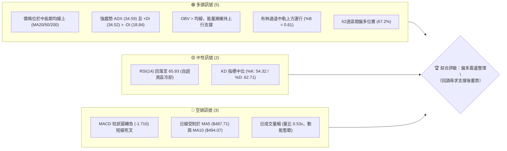
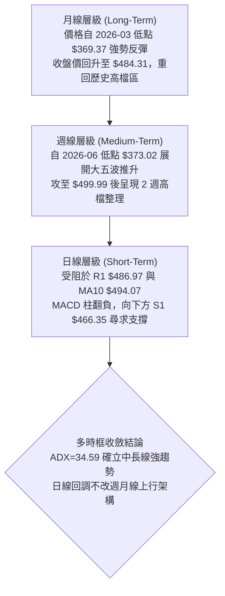
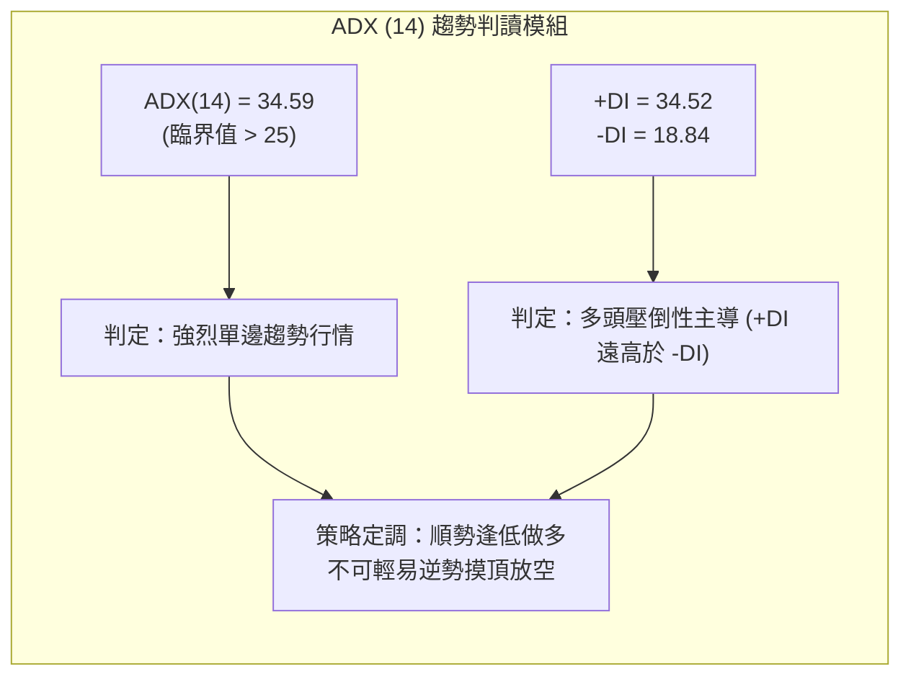
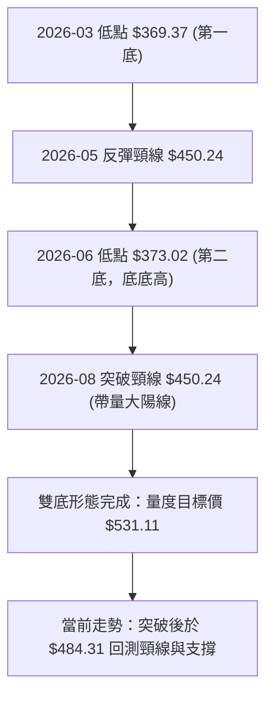
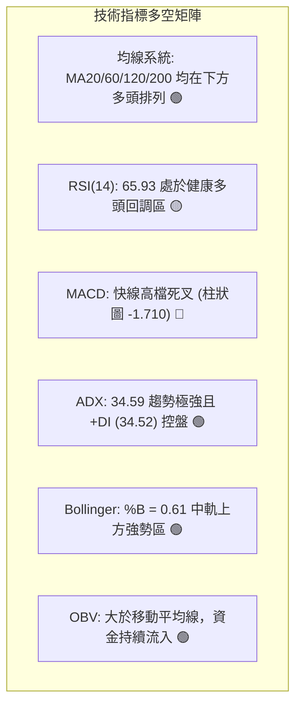
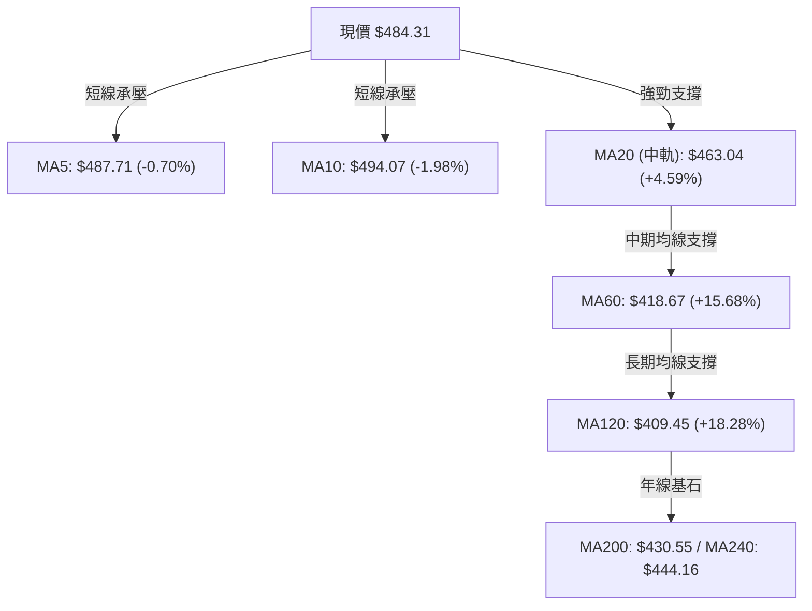
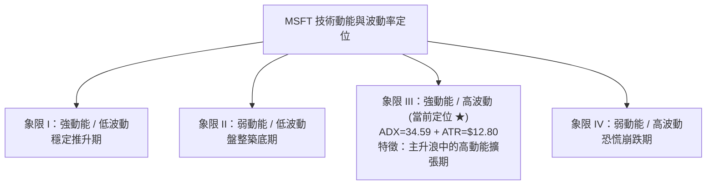
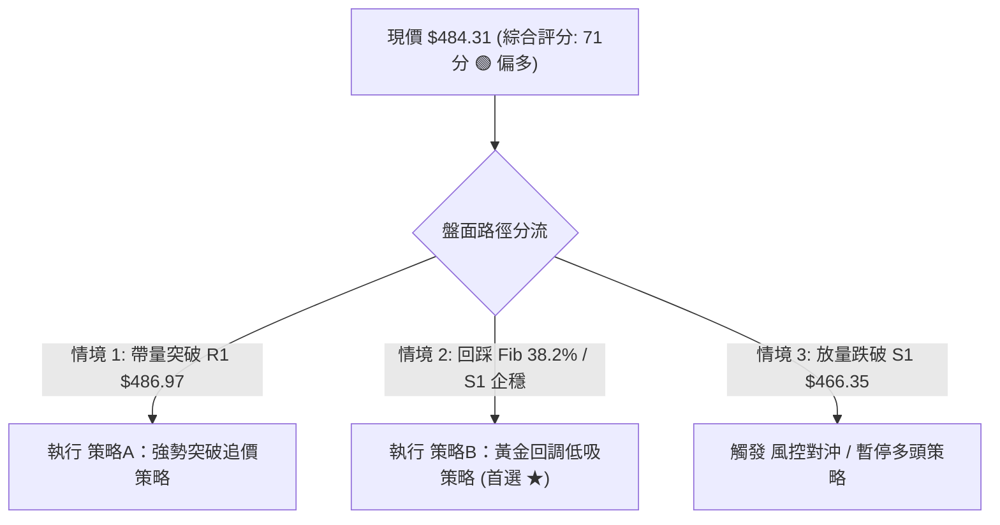
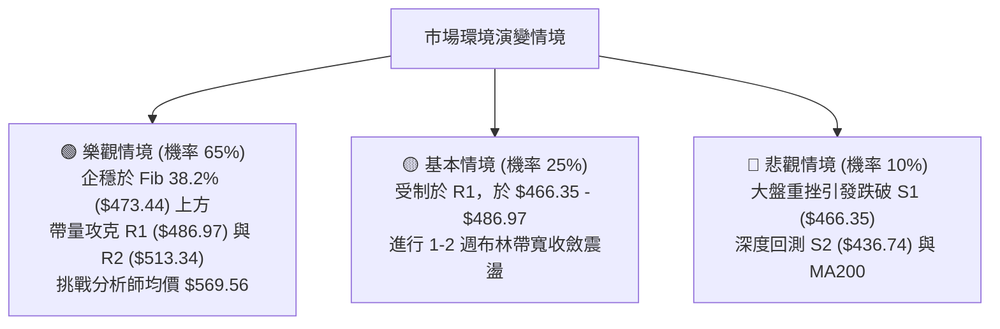

# MSFT 技術分析報告

> **報告日期**：2026-08-19 ｜ **語言**：繁體中文 ｜ **數據來源**：Yahoo Finance ｜ **當前價格**：$484.31

---

## 目錄

| 章節 | 內容 |
|------|------|
| [1. 技術面概覽](#1-技術面概覽) | 訊號儀表板、核心指標、評分卡 |
| [2. 趨勢分析](#2-趨勢分析) | 多時框趨勢、長中短期走勢、ADX解讀 |
| [3. 圖表形態分析](#3-圖表形態分析) | 形態識別、K線組合、目標價推算 |
| [4. 支撐與阻力](#4-支撐與阻力) | 關鍵價位聚類、斐波那契回調結構 |
| [5. 技術指標深度解讀](#5-技術指標深度解讀) | 均線系統、RSI、MACD、布林通道、量價OBV |
| [6. 動能與波動率](#6-動能與波動率) | 動能四象限、ATR波幅、Beta相關性 |
| [7. 多時框架總結](#7-多時框架總結) | 時框評分矩陣、多時框收斂定調 |
| [8. 交易策略建議](#8-交易策略建議) | 策略路由、情境階梯、主客策略風報比 |
| [9. 風險提示與監控](#9-風險提示與監控) | 風險檢查清單、情境模擬、風控準則 |

---

## 1. 技術面概覽

### 🎯 技術訊號儀表板



---

### 📊 核心指標速覽表

| 指標類別 | 指標名稱 | 當前數值 | 訊號 | 專業解讀 |
|:---|:---|:---|:---:|:---|
| **價格結構** | 當前收盤價 | **$484.31** | 🟢 | 處於52週高低點 ($349.20 - $550.24) 之 67.2% 強勢分位 |
| **短期均線** | MA20 (布林中軌) | **$463.04** | 🟢 | 現價高於 MA20 達 +4.59%，中期上升趨勢防線穩固 |
| **中期均線** | MA50 / MA60 | **$416.57 / $418.67** | 🟢 | 現價大幅領先 MA60 達 +15.68%，中期多頭波段未破 |
| **長期均線** | MA200 / MA240 | **$430.55 / $444.16** | 🟢 | 現價高於 MA200 達 +12.49%，長線多頭基底確立 |
| **動能震盪** | RSI(14) | **65.93** | 🟡 | 自週線極度超買區（>80）健康回吐至中性偏強區間，無背離 |
| **趨勢動能** | MACD (12,26,9) | **23.062 (Hist: -1.710)** | 🔴 | 快線跌破慢線 (24.772)，柱狀圖翻負，短線處於波段回檔修正 |
| **趨勢強度** | ADX(14) / ±DI | **34.59 (+DI: 34.52)** | 🟢 | ADX > 25 表明趨勢強勁，+DI 顯著壓制 -DI (18.84)，多頭控盤 |
| **通道指標** | Bollinger Bands | **%B: 0.61** | 🟢 | 位於中軌 ($463.04) 與上軌 ($556.45) 之間，強勢區震盪 |
| **量能指標** | 成交量 / OBV | **19.85M (20日均: 37.42M)** | 🟡 | 量比 0.53x 顯示回檔縮量；OBV > MA 表明主力籌碼未見鬆動 |
| **波動風險** | ATR(14) | **$12.80 (2.64%)** | 🟡 | 日內波動適中，提供合理的風控緩衝空間 |

---

### 🏆 技術評分卡

```
╔════════════════════════════════════════════════════════════════╗
║                技術評分卡 — MSFT (2026-08-19)                  ║
╠════════════════════════════════════════════════════════════════╣
║ 趨勢強度 (ADX/均線)   ████████████████░░░░  80/100  🟢 強勢多頭 ║
║ 動能指標 (RSI/MACD)   ████████████░░░░░░░░  60/100  🟡 修正降溫 ║
║ 支撐穩定度 (S1/S2/Fib) ████████████████░░░░  80/100  🟢 買盤厚實 ║
║ 成交量配合 (OBV/量比)  ████████████░░░░░░░░  60/100  🟡 縮量回洗 ║
║ 形態完整度 (突破/底型) ██████████████░░░░░░  70/100  🟢 波段成型 ║
║ 均線排列 (多時框MA)   ████████████████░░░░  80/100  🟢 中長多頭 ║
╠════════════════════════════════════════════════════════════════╣
║ 綜合技術評分          ██████████████░░░░░░  71/100  🟢 偏多回調 ║
╚════════════════════════════════════════════════════════════════╝
```

---

## 2. 趨勢分析

### 🌐 多時框趨勢分析



---

### 📈 長期趨勢 — 12個月走勢圖（Unicode）

```
MSFT 月線走勢圖（2025-08 至 2026-08）
價格軸 ($)
$520 ┤                      
$500 ┤●(25-08: 503.50)  ●(25-09: 514.69)              ●(26-08: 484.31)←現價
$480 ┤                            ●(25-11: 489.83)●(26-07: 464.72)
$460 ┤                                      ●(26-05: 450.24)
$440 ┤                                                
$420 ┤                                  ●(26-01: 428.38)
$400 ┤                                        ●(26-04: 406.90)
$380 ┤                                              ●(26-06: 373.02)
$360 ┤                                        ●(26-03: 369.37 低點)
     └────────────────────────────────────────────────────────────────
      08   09   10   11   12   01   02   03   04   05   06   07   08 (月份)
     [─── 2025 高檔震盪 ───]   [── 2026 H1 築底回升 ──]   [── 2026 突破 ──]
```

#### 走勢特徵分析表格

| 階段區間 | 時間跨度 | 起訖價位 | 漲跌幅 | 結構特徵與成交量解讀 |
|:---|:---|:---|:---:|:---|
| **第一階段：高檔震盪回落** | 2025-08 ～ 2026-03 | $503.50 → $369.37 | -26.64% | 自歷史高點震盪下行走弱，於 2026-03 探得波段大底 $369.37。 |
| **第二階段：雙重築底反彈** | 2026-03 ～ 2026-06 | $369.37 → $373.02 | +0.99% | 2026-06 月底爆出 3.82 億股週巨量下影線 ($372.97)，完成大級別雙底測試。 |
| **第三階段：波段主升噴發** | 2026-06 ～ 2026-08 | $373.02 → $499.99 | +34.04% | 7-8月多頭量能爆發（週量逾 2.78 億股），連破多道均線反壓。 |
| **第四階段：現階段高檔洗盤** | 2026-08 當前 | $499.99 → $484.31 | -3.14% | 遭遇近一年波段高點阻力 R1 ($486.97)，呈現縮量技術性良性回檔。 |

---

### 📊 中期趨勢（週線分析）

```
近 8 週價格推進與量價位階圖：
$500 ┤                      ╭─● 08-09 ($499.99) [RSI: 81.4 超買]
$490 ┤                      │   ╰─● 08-16 ($495.40)
$480 ┤                      │       ╰─● 08-23 ($484.31 現價) ── R1: $486.97
$470 ┤                  ╭───╯
$460 ┤              ╭───● 08-02 ($464.72) ───────────────────── S1: $466.35
$400 ┤      ╭───────● 07-19 ($393.82)
$380 ┤  ╭──● 07-05 ($390.49)
$370 ┴──● 06-28 ($372.97 底底高防線) [量能爆發: 3.82億股]
```

- **週線形態解析**：自 2026-06-28 創下 $372.97 後，週線連續 5 週拉出實體中長陽線，最高於 2026-08-09 觸及 $499.99。近兩週收盤分別為 $495.40 與 $484.31，顯示漲勢在逼近 $500 整數心理大關與阻力 R1 ($486.97) 時出現動能衰竭與獲利了結賣壓。
- **週量能配合度**：08-02 當週上漲爆量至 2.78 億股，隨後上攻量能縮減至 1.22 億股及本週的 73.57M，屬於典型的「衝高量縮回調」，而非主力出貨的「爆量長黑」，形態上定位為多頭中繼回洗。

---

### ⚡ 趨勢強度評估（ADX 解讀）



| 指標變數 | 當前讀數 | 門檻標準 | 狀態判定 | 交易意涵 |
|:---|:---:|:---:|:---:|:---|
| **ADX(14)** | **34.59** | > 25.0 | 🟢 強趨勢成型 | 市場非處於無方向盤整，波段策略勝率遠高於震盪擺動策略。 |
| **+DI(14)** | **34.52** | > -DI | 🟢 買方完全控盤 | 多頭買盤力道強勁，任何單日拉回多為流動性回補點。 |
| **-DI(14)** | **18.84** | < 20.0 | 🟢 賣方動能萎縮 | 空方缺乏推動價格跌破關鍵均線的實質賣壓。 |

---

## 3. 圖表形態分析

### 🔍 形態識別系統



#### 形態識別信心度評估表

| 形態名稱 | 信心度 | 判斷依據（引用數據） | 完成度 | 量度目標價（附計算式） |
|:---|:---:|:---|:---:|:---|
| **大級別雙底 (W底)** | **85%** | ① 2026-03 低點 $369.37 與 2026-06 低點 $373.02 構成底底高。<br/>② 06-28 當週爆出 3.82 億股確認底型。<br/>③ 2026-08-02 收盤 $464.72 正式突破 2026-05 頸線 $450.24。 | **已突破**<br/>(100%) | **$531.11**<br/>計算式：頸線 $450.24 + (頸線 $450.24 - 低點 $369.37) = $450.24 + $80.87 = $531.11<br/>*(極度接近數據中之阻力 R3 $527.69)* |
| **短期高檔旗形整理** | **65%** | 08-09 創波段高點 $499.99 後連續兩週縮量陰線壓回，現價 $484.31 沿短均線拉回修正。 | **進行中**<br/>(60%) | **$545.00**<br/>計算式：旗桿起點 $426.00 至高點 $499.99 漲幅 $73.99，自旗底預估 $471 回測點推算：$471.00 + $73.99 = $544.99 |
| **頭肩底形態** | **40%** | 左肩 $391.89 (2026-02)、頭部 $369.37、右肩 $373.02。但因右肩構築時間過短，幾何對稱性不足。 | 訊號不足 | *信心度 < 50%，僅做輔助參考，不作主力依據。* |

---

### 🕯️ 重要K線形態分析

| 月份 / 週別 | 收盤價 | K線形態 | 專業解讀 | 訊號 |
|:---|:---:|:---|:---|:---:|
| **2026-06 週線** | $372.97 | **長下影錘頭十字線** | 週量達 382.7M 歷史天量，主力強力護盤抄底，確立 $370 區間鐵底。 | 🟢 強烈看多 |
| **2026-08-02 週線** | $464.72 | **光頭突破大陽線** | 週漲幅達 +21.7%，一舉貫穿 MA20 與 MA50，確立波段主升浪。 | 🟢 多頭確認 |
| **2026-08-09 週線** | $499.99 | **衝高遇阻倒錘陽線** | 觸碰 $500 整數關卡與斐波那契 23.6% ($502.79) 後遇阻，留長上影線。 | 🟡 獲利了結 |
| **2026-08-23 當前** | $484.31 | **縮量回調中陰線** | 測試短期支撐，量能萎縮至 73.5M，賣壓有限，呈現漲多乖離修正。 | 🟡 整理觀望 |

---

### 📉 ASCII 走勢形態示意圖

```
MSFT 日線級別突破回踩形態示意圖
價格 ($)
$500 ┤                      ╭─── [波段高點 $499.99]
$490 ┤                  ╭───╯    │   
$486 ┤                  │        ├── [R1 阻力 $486.97]
$484 ┤                  │        ╰─── 現價 $484.31 (回踩中)
$473 ┤                  │             ▼ (預期回踩區間)
$466 ┤              ╭───╯             ├── [S1 支撐 $466.35 / Fib 38.2% $473.44]
$450 ┤──────────────● 頸線突破點 $450.24 (2026-05 高點) ────────────────────
$430 ┤          ╭───╯                 ├── [MA200 長期均線 $430.55]
$390 ┤      ╭───╯
$370 ┴──────● 底點1 ($369.37) ───────● 底點2 ($373.02 巨量築底)
```

---

## 4. 支撐與阻力

### 🗺️ 關鍵價位分布圖（Unicode）

```
MSFT 價位結構分布圖
═════════════════════════════════════════════════════════════════════
$550.24 ║████████████████████████████████║ 52W 歷史最高點 / Fib 0.0%
$527.69 ║██████████████████████████      ║ 強阻力 R3 (近一年波段高點聚類)
$513.34 ║████████████████████            ║ 阻力 R2 (密集成交反壓區)
$502.79 ║████████████████                ║ Fib 23.6% 回調位 / 心理關卡
$486.97 ║████████████                    ║ 短線關鍵阻力 R1 (當前壓制點)
$484.31 ╠════════════════════════════════╣ ◄ 現價 ($484.31)
$473.44 ║▓▓▓▓▓▓▓▓▓▓▓▓                    ║ Fib 38.2% 回調位 (第一黃金買點)
$466.35 ║▓▓▓▓▓▓▓▓▓▓▓▓▓▓▓▓                ║ 近期關鍵支撐 S1 (MA20匯合點)
$449.72 ║▓▓▓▓▓▓▓▓▓▓▓▓▓▓▓▓▓▓▓▓            ║ Fib 50.0% / 頸線突破位 $450.24
$436.74 ║████████████████████████        ║ 強支撐 S2 (波段起漲防守點)
$409.58 ║████████████████████████████    ║ 極強支撐 S3 (MA120 / 多頭底線)
$349.20 ║████████████████████████████████║ 52W 歷史最低點 / Fib 100.0%
═════════════════════════════════════════════════════════════════════
```

---

### 🚧 阻力位分析表

| 阻力級別 | 精確價位 | 形成原因與技術背景 | 突破難度 | 戰略重要性 |
|:---|:---:|:---|:---:|:---|
| **阻力 R1** | **$486.97** | 距離現價僅 +0.55%，為近兩週日線反彈高點聚類，且與 MA5 ($487.71) 形成共振反壓。 | 🟡 中等 | **短線多空分水嶺**：突破並站穩日線則宣告回調結束。 |
| **阻力 R2** | **$513.34** | 2025年9-10月高檔震盪整理平台（月收盤價 $514.69 / $514.55 處），解套賣壓集中。 | 🔴 較高 | **波段推升目標**：站上即代表全面收復 2025 年第四季失土。 |
| **阻力 R3** | **$527.69** | 近一年波段次高點聚類（2025-07 高點 $529.27 附近），接近雙底量度目標 $531.11。 | 🔴 極高 | **歷史高點前哨站**：為多頭挑戰 52W High ($550.24) 的終極關卡。 |

---

### 🛡️ 支撐位分析表

| 支撐級別 | 精確價位 | 形成原因與技術背景 | 守住機率 | 戰略重要性 |
|:---|:---:|:---|:---:|:---|
| **支撐 S1** | **$466.35** | 距現價 -3.71%，為 2026-08-02 突破陽線收盤位 ($464.72) 與當前 MA20 ($463.04) 強支撐共振區。 | 🟢 80% | **多頭主升防守線**：回踩不破代表上升趨勢極度健康。 |
| **支撐 S2** | **$436.74** | 距現價 -9.82%，近一年波段次低聚類，且與 MA200 ($430.55) 及 MA240 ($444.16) 形成多重均線護城河。 | 🟢 90% | **中期趨勢生命線**：跌破則宣告波段主升浪結束，轉為大箱體。 |
| **支撐 S3** | **$409.58** | 距現價 -15.43%，2026-04 築底平台與 MA120 ($409.45) 之強烈結構共振點。 | 🟢 98% | **長線牛熊底線**：機構長期核心持倉成本區。 |

---

### 📐 斐波那契回調位分析

依據 52 週完整波動區間（低點 **$349.20** → 高點 **$550.24**，總波幅 $201.04）計算：

| 斐波那契回調比例 | 精確計算價位 | 當前相對位置與技術意義解讀 |
|:---:|:---:|:---|
| **0.0% (52W High)** | **$550.24** | 歷史極值壓力位，多頭終極目標。 |
| **23.6%** | **$502.79** | **上方首道強壓**：08-09 觸及 $499.99 正是在此遭逢精確壓制回落。 |
| **38.2%** | **$473.44** | **黃金回調支撐**：強勢多頭市場最常回踩之第一買點（位於現價下方 -2.24%）。 |
| **50.0%** | **$449.72** | **多空中樞平衡線**：與 2026-05 頸線 $450.24 完美重合，具極強支撐力。 |
| **61.8%** | **$426.00** | **黃金分割防守位**：波段回檔極限，跌破則整體多頭架構破壞。 |
| **78.6%** | **$392.22** | 深度回撤位，鄰近 2026 年初築底平台。 |
| **100.0% (52W Low)** | **$349.20** | 52週波段最低點。 |

> **現價位階定位**：現價 **$484.31** 正精確運行於 **Fib 38.2% ($473.44)** 與 **Fib 23.6% ($502.79)** 之間。此區間屬於標準的「強勢回檔整理區」，技術結構顯示價格在消化 23.6% 處的獲利賣壓，隨後極高機率於 38.2% 上方重啟升勢。

---

## 5. 技術指標深度解讀

### 🎛️ 指標訊號總覽



---

### 📈 移動平均線排列分析



- **均線排列狀態**：當前呈現「短線微幅受阻、中長線標準多頭排列」。
  - 短期均線（MA5/MA10）分別為 $487.71 與 $494.07，價格略低於短期均線，代表近 5-10 個交易日內進場的短線籌碼處於微幅浮虧或平保狀態，形成短線反壓。
  - 中長期均線結構極佳：MA20 ($463.04) > MA60 ($418.67) > MA120 ($409.45)，且長線 MA200 ($430.55) 呈現向上抬升態勢。中長期籌碼成本大幅低於現價，提供了極為厚實的支撐墊。

---

### 📉 RSI(14) 分析

- **當前讀數**：**65.93**
- **進度條展示**：
```
超賣 (0-30)              中性 (30-70)             超買 (70-100)
├───────────────┼────────────────────────┼───────────────┤
░░░░░░░░░░░░░░░░█████████████████████████░░░░░░░░░░░░░░░░  [65.93]
```
- **背離檢驗**：
  - 週線 RSI 曾於 2026-08-16 攀升至 84.8 的極端超買區，隨後伴隨價格自 $499.99 回落至 $484.31，RSI 下降至 65.93。
  - **背離結論**：價格創高（$499.99）時 RSI 同步創高（84.8），當前僅為超買後的「指標修復」，**未出現頂背離**，技術架構非常健康。

---

### 📊 MACD(12/26/9) 訊號解讀


- **深度解析**：MACD 快線 (23.062) 與慢線 (24.772) 依然位於極高之零軸上方（代表中長期多頭勢力龐大）。柱狀圖讀數為 **-1.710**，顯示自 7 月底連續噴發以來的爆發動能短暫受阻，短線正以「以盤代跌」或「小幅拉回」形式消耗浮額。

---

### 📦 布林通道分析

```
MSFT 日線布林通道當前結構
$556.45 ┬────────────────────────────────────────── BB 上軌 (+2σ)
        │
$484.31 ┤                  ● [現價: %B = 0.61]
        │
$463.04 ┼────────────────────────────────────────── BB 中軌 (MA20)
        │
$369.62 ┴────────────────────────────────────────── BB 下軌 (-2σ)
```

- **通道帶寬與位置**：通道上下軌間距為 $186.83，開口顯著放大，表明市場進入高波動趨勢期。
- **%B 指標 (0.61)**：現價位於中軌 ($463.04) 與上軌 ($556.45) 之間偏上方。在中軌未被有效跌破前，通道維持向上擴張的多頭通道運行特徵。

---

### 💹 成交量分析（量價配合度）

```
量價配合矩陣分析：
┌──────────────────┬──────────────────┬──────────────────┐
│ 最新成交量       │ 20日均量         │ 量比 (Volume Ratio)│
│ 19,853,191 股    │ 37,421,770 股    │ 0.53x (顯著縮量) │
└──────────────────┴──────────────────┴──────────────────┘
```
- **量價背離檢驗**：近兩週自 $499.99 回檔至 $484.31 期間，成交量由 2.15 億股/週急劇縮減至 7,357 萬股/週，日成交量僅 1,985 萬股（量比 0.53x）。這表明**下跌缺乏空頭拋售量能，純屬獲利盤惜售引發的自然回撤**。
- **OBV (能量潮)**：數據顯示 `OBV > MA`，量能趨勢持續向上攀升，確認籌碼由散戶流向長期機構投資人，為後續重啟上漲提供堅實的量能基礎。

---

## 6. 動能與波動率

### ⚡ 動能評估四象限



| 象限定位 | 動能強度 | 波動率水準 | 當前狀態 | 策略應對方針 |
|:---|:---:|:---:|:---:|:---|
| **Q3 (當前位置)** | **強 (+DI: 34.52)** | **較高 (ATR: 2.64%)** | **✓ 符合** | **波段順勢操作**：拉回關鍵支撐（S1/Fib 38.2%）分批佈局，給予適當止損寬度。 |

---

### 📊 ATR 波動率分析

```
╔════════════════════════════════════════════════════════════════╗
║                   ATR (14) 風控距離計算表                     ║
╠════════════════════════════════════════════════════════════════╣
║ ATR(14) 絕對值： $12.80  (佔現價百分比： 2.64%)                ║
╠════════════════════════════════════════════════════════════════╣
║ 1.0 × ATR 緩衝距離： $12.80  ── 日內日內交易停損標準           ║
║ 1.5 × ATR 緩衝距離： $19.20  ── 短線波段操作停損標準 (推薦)    ║
║ 2.0 × ATR 緩衝距離： $25.60  ── 中線趨勢交易停損標準           ║
╚════════════════════════════════════════════════════════════════╝
```

- **止損距離建議**：以現價 $484.31 為基準，1.5 倍 ATR 距離為 $19.20，對應風控價格為 **$465.11**，此價位與關鍵支撐 S1 ($466.35) 完美重疊，印證 S1 是最具技術防守價值的停損錨定點。

---

### 📐 Beta 與市場相關性

- **Beta 係數**：**1.099**
- **市場特徵解讀**：Beta 值略高於大盤基準 (1.00)，代表 MSFT 與標普500/那斯達克指數高度連動，且在科技股多頭行情中具有約 1.1 倍的進攻彈性。當前在基本面營收 YoY +17.7% 與獲利 YoY +31.7% 的支撐下，高 Beta 提供向上突破的動能乘數效應。

---

## 7. 多時框架總結

### 📋 時框架評分表

| 時框架 | 趨勢方向 | 動能狀態 | 均線系統 | 圖表形態 | 綜合評分 | 交易建議 |
|:---|:---:|:---:|:---:|:---:|:---:|:---|
| **月線 (Long)** | 🟢 多頭上行 | 🟢 強勁 | 🟢 站穩 MA200/240 | 雙底突破完畢 | **85/100** | 長線堅定持有 |
| **週線 (Medium)** | 🟢 主升趨勢 | 🟡 超買回吐 | 🟢 多頭排列 | 挑戰前高平台 | **75/100** | 逢低加碼做多 |
| **日線 (Short)** | 🟡 震盪回踩 | 🔴 MACD死叉 | 🟡 跌破 MA5/10 | 高檔旗形拉回 | **60/100** | 等待支撐企穩進場 |

---

### 🔲 綜合訊號矩陣

```
┌──────────────┬──────────────────┬──────────────────┬──────────────────┐
│ 分析維度     │ 短期 (1-5日)     │ 中期 (2-8週)     │ 長期 (3-12月)    │
├──────────────┼──────────────────┼──────────────────┼──────────────────┤
│ 趨勢方向     │ 🟡 橫向/小幅回調 │ 🟢 強勁上升      │ 🟢 歷史大底回升  │
│ 關鍵阻力     │ $486.97 (R1)     │ $513.34 (R2)     │ $527.69 (R3)     │
│ 關鍵支撐     │ $473.44 (Fib38.2)│ $466.35 (S1/MA20)│ $436.74 (S2/MA200│
│ 核心指標     │ MACD 柱翻負      │ ADX = 34.59 強勢 │ 站穩 240日年線   │
│ 操作方針     │ 逢高減短多       │ 回踩分批建倉     │ 堅定持股續抱     │
└──────────────┴──────────────────┴──────────────────┴──────────────────┘
```

---

### ⚖️ 多時框收斂結論

依據多時框收斂規則：
1. **行情類型判斷**：ADX(14) 讀數為 **34.59 (> 25)**，且 +DI (34.52) 遠大於 -DI (18.84)，明確判定當前市場為**標準的「強趨勢行情」**而非無方向震盪。
2. **時框優先權收斂**：以中長期（週線/月線/MA50/MA200）上升方向為主導。日線級別的 MACD 死叉與量縮回調，僅視為「尋找多頭優質進場點與時機」的次級修正。
3. **唯一方向性結論**：**【偏多回調（Bullish Pullback）】**。堅決維持中長線多頭思維，第 8 章交易策略全力圍繞「多頭主策略」進行建構。

---

## 8. 交易策略建議

### 🗺️ 策略決策流程圖



---

### 🧭 策略路由

> **當前主策略方向 = 多頭主推策略（依技術評分卡 71/100，處於 ≥60 偏多區間）**

---

### 🎯 價格情境階梯（Price Scenarios）

| 觸發條件 | 下一目標價 | 後續延伸目標 | 情境含義與操作指引 |
|:---|:---:|:---:|:---|
| **向上突破 R1 ($486.97)** | **R2 ($513.34)** | **R3 ($527.69)** | **短線整理結束**：確認重啟升勢，上看斐波那契 23.6% ($502.79) 及 R2。 |
| **於 $473.44 ～ $486.97 震盪** | **$484.31 (現價)** | — | **區間蓄勢**：消化均線乖離，等待日線 MACD 柱狀圖收斂翻紅。 |
| **向下跌破 S1 ($466.35)** | **S2 ($436.74)** | **S3 ($409.58)** | **波段結構轉弱**：主升浪暫告段落，下探 MA200 長期防線。 |

---

### 📊 情境機率分佈

| 情境劇本 | 發生機率 | 主要技術與量化依據 |
|:---|:---:|:---|
| **回踩企穩後繼續上行** | **65%** | ① ADX 達 34.59 趨勢極強；② OBV 資金流入；③ 回調量比僅 0.53x 屬健康縮量；④ 華爾街 53 位分析師強烈買進共識 (目標價 $569.56)。 |
| **維持高檔狹幅箱體震盪** | **25%** | ① 日線 MACD 柱翻負 (-1.710)；② MA5/MA10 壓制需時間化解；③ 布林通道帶寬等待收斂。 |
| **深度跌破支撐再探底** | **10%** | ① 需出現大盤系統性風險；② 否則在 MA20 ($463.04) 與 MA200 ($430.55) 支撐下機率極低。 |

---

### 🟢 主策略詳情

本報告提供兩套多頭策略供不同風險偏好之交易者執行，所有價位嚴格錨定數據點：

| 策略要素 | 策略 A（突破順勢進場） | 策略 B（回調低吸進場 ★ 最佳推薦） |
|:---|:---|:---|
| **進場條件** | 日線收盤價帶量突破阻力 R1 | 價格回踩至 Fib 38.2% 至支撐 S1 區間止跌出陽線 |
| **精確進場價格** | **$487.50**（確認突破 R1 $486.97） | **$473.50**（精確錨定 Fib 38.2% $473.44） |
| **第一目標價 (T1)** | **$513.34**（阻力位 R2，漲幅 +5.30%） | **$502.79**（Fib 23.6% 阻力，漲幅 +6.19%） |
| **第二目標價 (T2)** | **$527.69**（阻力位 R3，漲幅 +8.24%） | **$527.69**（阻力位 R3，漲幅 +11.44%） |
| **精確止損價格** | **$466.00**（跌破支撐 S1 $466.35） | **$458.00**（給予 1.2x ATR 緩衝，跌破 MA20） |
| **風險空間 / 報酬空間** | 風險 $21.50 / 報酬(T2) $40.19 | 風險 $15.50 / 報酬(T2) $54.19 |
| **風險報酬比 (R:R)** | **1 : 1.87** | **1 : 3.50** (極優風報比) |
| **預估勝率** | **60%** | **70%** |
| **建議配置倉位** | 15% | 25% (分批：$473.50 進 15%，$466.50 加 10%) |

---

### 🔴 反向風險觸發點（對沖提示）

- **全面停損／反轉放空觸發條件**：
  1. 若日線收盤價帶量跌破 **支撐 S1 ($466.35)** 且跌穿 MA20 ($463.04)。
  2. 伴隨日成交量放大至 20 日均量以上（> 3,742 萬股）。
- **避險應對**：若觸發上述條件，多頭部位應全面離場，短線投機者可建立小額空頭對沖部位，下看 **支撐 S2 ($436.74)**，嚴格止損於 $475.00。

---

### ⭐ 整體訊號強度評星

```
╔════════════════════════════════════════════════════════════════╗
║ 做多訊號強度：  ★★★★☆  (4/5星) ── 趨勢均線量能俱佳，等回調企穩 ║
║ 做空訊號強度：  ★☆☆☆☆  (1/5星) ── 逆強趨勢操作，勝率極低     ║
║ 整體技術可信度：★★★★☆  (4/5星) ── 多時框指標共振，結構嚴密     ║
╚════════════════════════════════════════════════════════════════╝
```

---

## 9. 風險提示與監控

### ✅ 關鍵監控指標 Checklist

```
╔════════════════════════════════════════════════════════════════╗
║               MSFT 每日交易風控監控清單 (Checklist)             ║
╠════════════════════════════════════════════════════════════════╣
║ [ ] 價位突破監控：收盤價是否突破 R1 ($486.97) 或跌破 S1 ($466.35)║
║ [ ] 動能指標跟蹤：日線 MACD 柱狀圖是否由 -1.710 開始收斂翻紅   ║
║ [ ] 動能過熱防範：RSI(14) 回落至 60 附近是否出現支撐買盤      ║
║ [ ] 均線動態防守：現價是否持續維持於 MA20 ($463.04) 之上運行   ║
║ [ ] 異常放量警訊：下跌時單日成交量是否超過 40,000,000 股 (異常)║
║ [ ] 趨勢強度指標：ADX(14) 是否持續維持於 25 以上強趨勢區間     ║
╚════════════════════════════════════════════════════════════════╝
```

---

### ⚠️ 風險場景分析



---

### 🛡️ 風險管理重要提醒

1. **ATR 風控部位控管**：
   - 當前 ATR 為 **$12.80**，單日潛在波動達 2.64%。以整體投資組合單筆交易最大承擔 1% 淨值風險計算，若設定 1.5 倍 ATR ($19.20) 為停損區間，則單一帳戶 MSFT 總持倉上限不宜超過總資產之 **20% ～ 25%**。
2. **獲利了結與移動停利機制**：
   - 當價格到達第一目標價 **$502.79** (Fib 23.6%) 時，強制減倉 1/3 並將剩餘部位之停損點上移至成本價（保本停損）；
   - 當價格到達第二目標價 **$527.69** (R3) 時，減倉 1/3，剩餘 1/3 部位以 MA20 ($463.04，隨時間抬升) 作為動態追蹤停利基準。

---

## 📋 報告總結

```
╔════════════════════════════════════════════════════════════════════════╗
║                     MSFT 技術分析報告總結                              ║
╠════════════════════════════════════════════════════════════════════════╣
║ 報告日期：2026-08-19                當前價格：$484.31                 ║
║ 綜合評級：🟢 偏多回調（蓄勢重啟）     技術評分：71 / 100               ║
╠════════════════════════════════════════════════════════════════════════╣
║ 關鍵結論：                                                             ║
║ ├─ 長期趨勢：🟢 確立月線級別雙底反轉，站穩 MA200 ($430.55)           ║
║ ├─ 中期趨勢：🟢 ADX=34.59 強趨勢，週線主升浪，回調量縮健康            ║
║ ├─ 短期趨勢：🟡 MACD 柱翻負 (-1.710)，受制於 R1，處於 1-2 週技術修正  ║
║ ├─ 核心關鍵支撐：S1 ($466.35) ｜ Fib 38.2% ($473.44)                 ║
║ ├─ 核心關鍵阻力：R1 ($486.97) ｜ R2 ($513.34) ｜ R3 ($527.69)         ║
║ └─ 華爾街共識：Strong Buy (53位分析師，目標均價 $569.56)              ║
╠════════════════════════════════════════════════════════════════════════╣
║ 最優策略組合：                                                         ║
║ 1. 🥇 最佳機會：策略 B（黃金回調低吸）── 於 $473.50 佈局，風報比 1:3.50 ║
║ 2. 🥈 次選機會：策略 A（強勢突破追價）── 突破 $487.50 進場，風報比 1:1.87 ║
║ 3. 🥉 防守機制：跌破 S1 ($466.35) 嚴格止損，規避回測 MA200 風險        ║
╚════════════════════════════════════════════════════════════════════════╝
```

---

> ⚠️ **免責聲明**：本報告為依據量化技術指標與歷史行情數據生成之專業技術分析研究，所有數值、計算式與支撐阻力皆嚴格基於客觀數據推導。本報告**僅供研究與學術參考**，**不構成任何形式的個別投資諮詢或要約**。金融市場具有高風險性，投資人應獨立評估自身財務承受能力並嚴格執行風控紀律。

---

*報告生成時間：2026-08-19 ｜ 數據來源：Yahoo Finance ｜ 分析框架：多時框架量化技術分析*