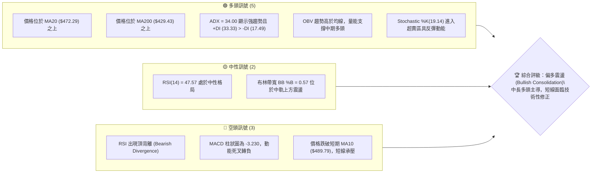
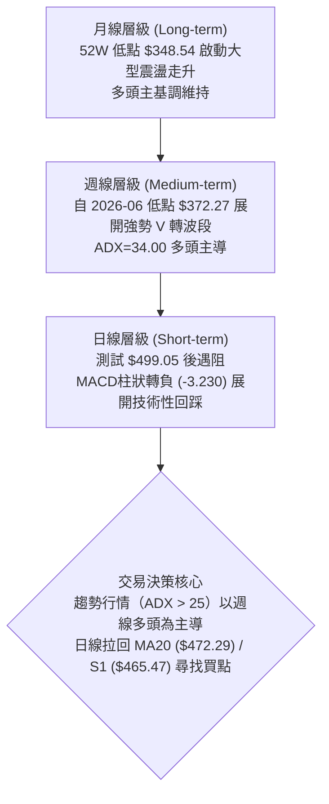
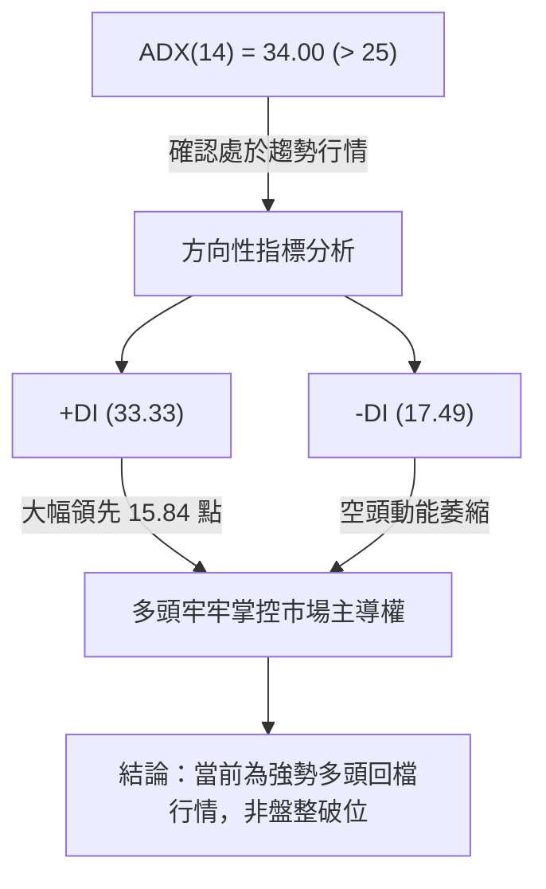
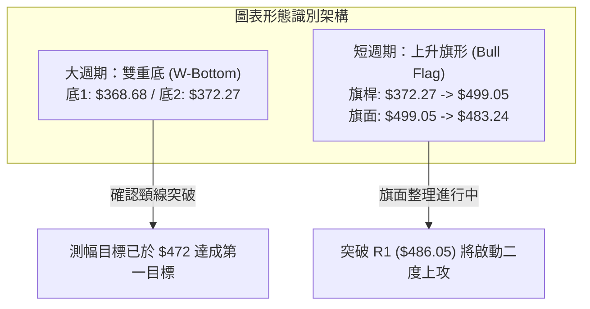
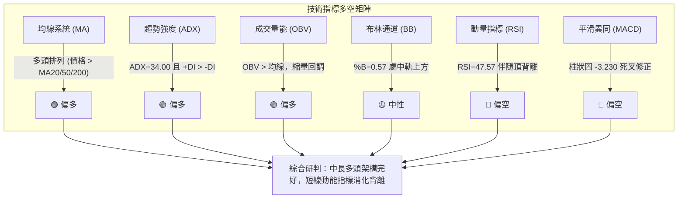
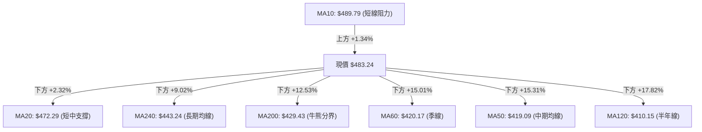
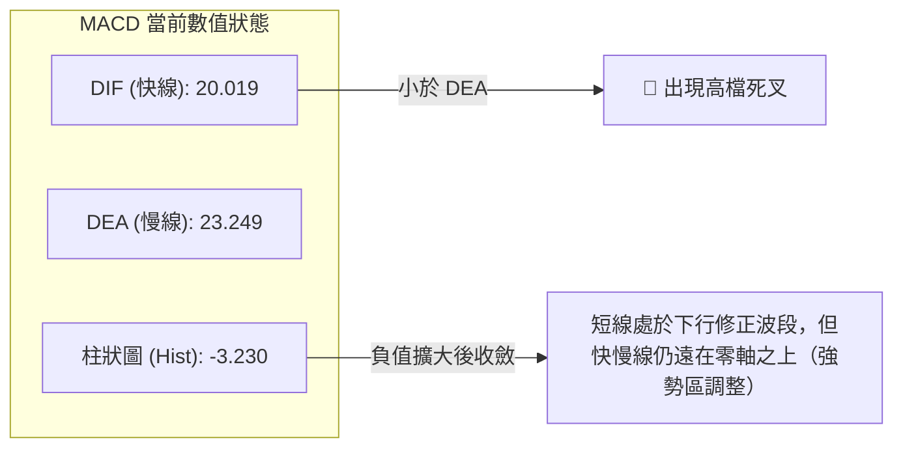
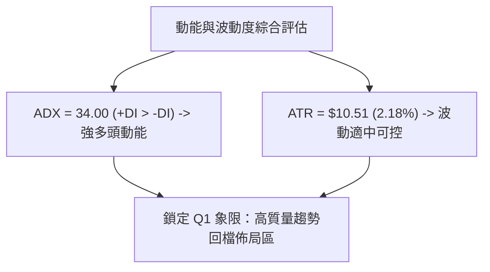
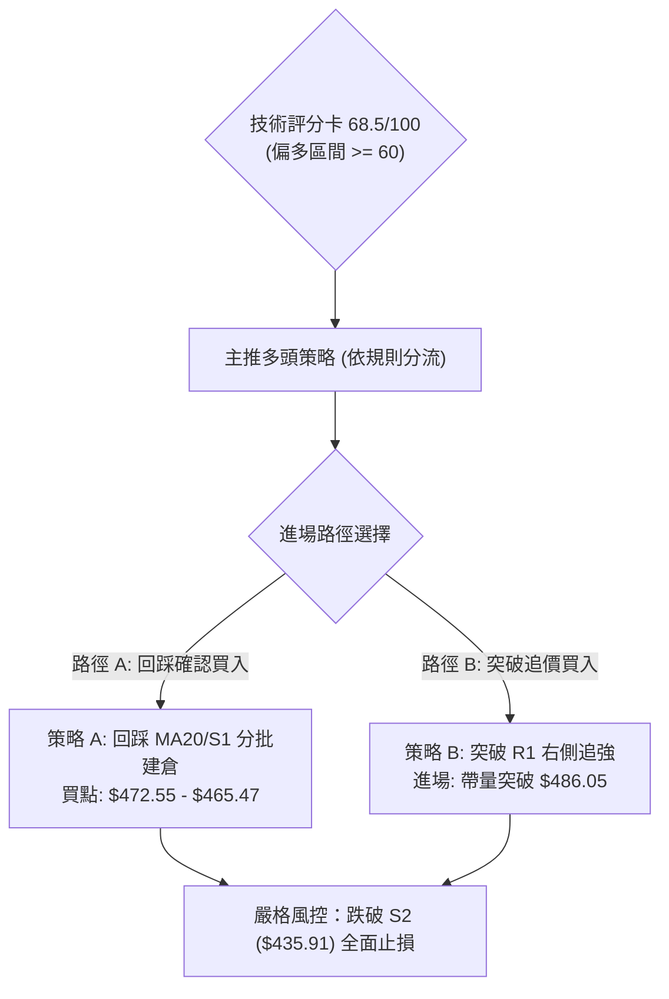
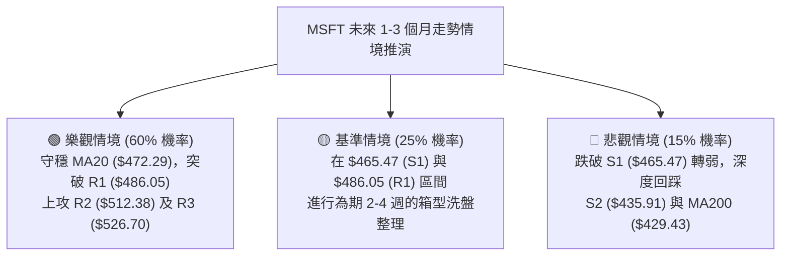

# MSFT 技術分析報告

> **報告日期**：2026-08-21 ｜ **語言**：繁體中文 ｜ **數據來源**：Yahoo Finance ｜ **當前價格**：$483.24

---

## 目錄

| 章節 | 內容 |
|------|------|
| [1. 技術面概覽](#1-技術面概覽) | 訊號儀表板、核心指標、評分卡 |
| [2. 趨勢分析](#2-趨勢分析) | 多時框趨勢、長中短期走勢、ADX趨勢強度 |
| [3. 圖表形態分析](#3-圖表形態分析) | 形態識別、信心度評估、K線組合與測幅目標 |
| [4. 支撐與阻力](#4-支撐與阻力) | 關鍵價位分佈圖、斐波那契回調結構 |
| [5. 技術指標深度解讀](#5-技術指標深度解讀) | 均線系統、RSI背離、MACD、布林通道與OBV量能 |
| [6. 動能與波動率](#6-動能與波動率) | 動能四象限、ATR波動率與Beta分析 |
| [7. 多時框架總結](#7-多時框架總結) | 時框架評分矩陣與多時框收斂定論 |
| [8. 交易策略建議](#8-交易策略建議) | 策略路由、情境階梯、主策略明細與對沖提示 |
| [9. 風險提示與監控](#9-風險提示與監控) | 關鍵監控清單、風險情境與資金管理 |
| [📋 報告總結](#-報告總結) | 核心結論與最優策略組合速查 |

---

## 1. 技術面概覽

### 🎯 技術訊號儀表板



---

### 📊 核心指標速覽表

| 指標類別 | 指標名稱 | 當前數值 | 訊號 | 解讀 |
|----------|----------|----------|------|------|
| **價格** | 當前收盤價 | $483.24 | 🟢 | 處於 52 週高低區間之 67.1% 分位，守穩中長期均線 |
| **均線** | MA20 (短中) | $472.29 | 🟢 | 現價高於 MA20（+2.32%），短中期生命線提供關鍵支撐 |
| **均線** | MA50 (中期) | $419.09 | 🟢 | 現價大幅高於 MA50（+15.31%），中期多頭格局明確 |
| **均線** | MA200 (長期) | $429.43 | 🟢 | 現價高於長期年線（+12.53%），牛市基底穩固 |
| **均線** | MA10 (極短) | $489.79 | 🔴 | 現價跌破 10 日均線（-1.34%），短線動能減速回檔 |
| **動能** | RSI(14) | 47.57 | 🟡 | 位於 30–70 中性區間，但伴隨波段頂背離警訊 |
| **動能** | MACD (12/26/9) | 20.019 / 23.249 | 🔴 | DIF < DEA，柱狀圖 -3.230，顯示短線動能處於修正期 |
| **動能** | KD (%K / %D) | 19.14 / 30.56 | 🟢 | KD 觸及超賣區間，短線具備止跌反彈技術契機 |
| **趨勢** | ADX (14) | 34.00 | 🟢 | ADX > 25 且 +DI (33.33) 遠高於 -DI (17.49)，強趨勢多頭主導 |
| **通道** | Bollinger %B | 0.57 | 🟡 | 位於布林中軌（$472.29）與上軌（$547.48）之間正常運行 |
| **波動** | ATR(14) | $10.51 | 🟡 | 日波動率 2.18%，市場波動適中，提供明確止損保護區間 |
| **量能** | OBV 與量比 | 量比 0.60x | 🟢 | OBV > MA，中長期籌碼鎖定良好，回檔量縮有利多頭結構 |

---

### 🏆 技術評分卡

```
╔══════════════════════════════════════════════════════════════════╗
║              技術評分卡 — MSFT (2026-08-21)                      ║
╠══════════════════════════════════════════════════════════════════╣
║ 趨勢強度 (Trend)     ████████████████░░░░  80/100  🟢 強勢多頭   ║
║ 動能指標 (Momentum)  █████████░░░░░░░░░░░  48/100  🟡 短線修正   ║
║ 支撐穩定度 (Support) ███████████████░░░░░  76/100  🟢 支撐穩固   ║
║ 成交量配合 (Volume)  ██████████████░░░░░░  70/100  🟢 量縮回檔   ║
║ 形態完整度 (Pattern) █████████████░░░░░░░  65/100  🟡 旗形震盪   ║
║ 均線排列 (MA System) ██████████████░░░░░░  72/100  🟢 多頭均線   ║
╠══════════════════════════════════════════════════════════════════╣
║ 綜合技術評分         █████████████░░░░░░░  68.5/100 偏多回踩佈局 ║
╚══════════════════════════════════════════════════════════════════╝
```

---

## 2. 趨勢分析

### 🌐 多時框趨勢分析



---

### 📈 長期趨勢 — 12個月走勢圖（Unicode）

```
MSFT 月線走勢圖（過去12個月：2025-08 至 2026-08）
價格軸 ($)
$520 ┤    ●(09:513.72)  ●(10:513.58)
$500 ┤ ●(08:502.56)  ●(11:488.91)
$480 ┤              ●(12:480.57)                       ●(08:483.24 現價)
$460 ┤                                           ●(07:463.85)
$440 ┤                                 ●(05:449.39)
$420 ┤        ●(01:427.58)       ●(04:406.13)
$400 ┤              ●(02:391.15)
$380 ┤                                       ●(06:372.32 低點)
$360 ┤                    ●(03:368.68 低點)
     └─────────────────────────────────────────────────────────────
       08   09   10   11   12   01   02   03   04   05   06   07   08 (月份)
      (2025)                    (2026)
```

#### 走勢特徵分析表格

| 階段區間 | 時間跨度 | 價格區間 ($) | 漲跌幅 | 趨勢特徵與結構解讀 |
|----------|----------|--------------|--------|--------------------|
| **高檔回吐期** | 2025-08 ~ 2025-10 | $502.56 → $513.58 | +2.19% | 於 $513 區間構築雙頂壓力帶，動能趨緩 |
| **中級修正波** | 2025-10 ~ 2026-03 | $513.58 → $368.68 | -28.21% | 單邊下行探底，觸及 52 週次低點區建立第一底部 |
| **首輪反彈與二次測底** | 2026-03 ~ 2026-06 | $368.68 → $372.32 | +0.99% | 4-5月反彈至 $449.39 後於 6 月回踩 $372.32，形成堅實雙重底 |
| **主升反攻浪** | 2026-06 ~ 2026-08 | $372.32 → $483.24 | +29.79% | 量能激增，突破多道均線，形成強勁 V 型反轉，逼近 $500 大關 |

---

### 📊 中期趨勢（週線分析）

從近 20 週數據觀察，MSFT 自 2026 年 6 月底於 $372.27 爆出 3.82 億股巨量見底後，展開連續 6 週的單邊逼空行情，最高攀升至 2026-08-09 週的 $499.05（RSI 曾高達 81.4，MACD 柱狀達 +11.272）。

近期兩週出現高檔震盪整理，收盤價由 $494.47 降至當前 $483.24，週線 MACD 柱狀圖由正轉負（-3.230），代表短線買盤追價意願減弱，進入「上升趨勢中的蓄勢整理波段」。

```
中期結構示意（週線阻力與支撐）：
$512.38 ────────────────────────────────────── (R2 波段強阻力)
$486.05 ────────────────────────────────────── (R1 突破頸線/即時阻力)
$483.24 ◀═════════════════════════════════════ [現價：高檔震盪蓄勢]
$472.29 / $465.47 ──────────────────────────── (MA20 / S1 第一道強支撐帶)
$435.91 ────────────────────────────────────── (S2 中期多空防守中樞)
```

---

### ⚡ 趨勢強度評估（ADX 解讀）



| 指標變數 | 數值 | 門檻標準 | 狀態評估 | 策略意涵 |
|----------|------|----------|----------|----------|
| **ADX(14)** | **34.00** | > 25.0 (趨勢成立) | 🟢 強趨勢行情 | 嚴禁逆勢做空，順勢交易為主 |
| **+DI (14)** | **33.33** | 高於 -DI | 🟢 買方主導 | 買盤力道充沛，逢回調具承接力 |
| **-DI (14)** | **17.49** | 低於 20.0 | 🟢 賣壓偏弱 | 空方缺乏單邊摜壓動能 |
| **DI 差值** | **+15.84** | 正向擴大 | 🟢 多方佔優 | 回調視為多頭上行中途的良性換手 |

---

## 3. 圖表形態分析

### 🔍 形態識別系統



#### 形態信心度評估表（依規則 15）

| 形態名稱 | 信心度 | 判斷依據（引用數據） | 完成度 | 目標價（附嚴格計算式） |
|----------|--------|----------------------|--------|------------------------|
| **大型雙底 (W-Bottom)** | **85%** | 第一底 2026-03 ($368.68)，第二底 2026-06 ($372.27)，雙底低點聚類獲 S3 ($408.81) / 348.54 支撐，且 6 月底巨量 3.82 億股確認。 | 95% | 頸線取 2026-05 高點 $449.39，高度 = 449.39 - 370.47 = $78.92；測幅目標 = 449.39 + 78.92 = **$528.31**（高度聚類於 R3 $526.70）。 |
| **短期上升旗形 (Bull Flag)** | **70%** | 7-8 月強攻浪（旗桿 +126.78 點），近兩週於 $483-$499 區間量縮收斂，回調未破 MA20 ($472.29)。 | 60% | 旗桿底 $372.27 至頂 $499.05（高差 $126.78），自突破點 R1 ($486.05) 估算測幅 = 486.05 + 126.78 = **$612.83**（保守先看 52W High $549.20）。 |
| **頭肩底 (Inverted H&S)** | **35%** | 左右肩結構不對稱，中間過渡期缺乏標準左肩低點支撐。 | 30% | *信心度不足 50%，依規定不予強行畫出形態。* |

---

### 🕯️ 重要 K 線形態分析

| 週期/月份 | 收盤價 ($) | K 線與量能形態 | 技術意涵解讀 | 多空訊號 |
|-----------|------------|----------------|--------------|----------|
| **2026-06** | $372.32 | 爆量長下影錘頭線 | 單週成交量達 3.82 億股，主力資金大舉介入完成洗盤測底。 | 🟢 強烈買進 |
| **2026-07** | $463.85 | 連續實體大陽線 (Marubozu) | 突破多條中期均線，空頭排列徹底扭轉為上升趨勢。 | 🟢 多頭加速 |
| **2026-08-09** | $499.05 | 帶長上影星線 (Shooting Star) | 觸及 500 整數心理關卡受阻，短線多頭動能消耗過甚。 | 🔴 短線見頂 |
| **2026-08-23** | $483.24 | 縮量小陰線回踩 | 量能萎縮至 1.15 億股，回踩布林中軌與 MA20，賣壓減輕。 | 🟡 整理蓄勢 |

---

### 📉 ASCII 走勢形態示意圖

```
MSFT 近期上升旗形 (Bull Flag) 與雙底向上突破架構：
價格 ($)
$526.70 ┤                                                  [形態測幅目標 R3]
$512.38 ┤                                            .--- (R2 強阻力)
$499.05 ┤                      ▲ (旗桿頂部 08-09)   /
$486.05 ┤                     / ╲    .-------- R1 突破確認線
$483.24 ┤                    /   ╲  / ◄────────── 現價（旗面下軌蓄勢）
$472.29 ┤                   /     ● ───────────── MA20 / 38.2% 回調支撐
$449.39 ┤     ▲(05-31頸線) /
$419.09 ┤    / ╲         / ────────────────────── MA50 支撐帶
$372.27 ┤───●   ╲       ● (06-28 第二底 爆量突破)
$368.68 ┤● (03-31 第一底)
        └────────────────────────────────────────────────────────
         2026-03       2026-05    2026-06    2026-07   2026-08
```

---

## 4. 支撐與阻力

### 🗺️ 關鍵價位分布圖（Unicode）

```
╔══════════════════════════════════════════════════════════════════╗
║                   MSFT 價位結構分佈圖與成交密集區                ║
╠══════════════════════════════════════════════════════════════════╣
║ $549.20 ║██████████████████████████████║ 52週歷史高點 (52W High)  ║
║ $526.70 ║████████████████████████      ║ 強阻力 R3 (雙底測幅目標) ║
║ $512.38 ║████████████████████          ║ 關鍵阻力 R2 (波段高點)   ║
║ $501.85 ║██████████████                ║ 斐波那契 23.6% 回調位    ║
║ $486.05 ║████████████████████████████  ║ 短線阻力 R1 (突破轉強點) ║
║ ═══════ ╠══════════════════════════════╣ ◄ 現價: $483.24          ║
║ $472.55 ║▓▓▓▓▓▓▓▓▓▓▓▓▓▓▓▓▓▓▓▓▓▓▓▓▓▓▓▓  ║ 斐波 38.2% / MA20 $472.29║
║ $465.47 ║██████████████████████        ║ 近期支撐 S1 (回踩防守點) ║
║ $448.87 ║████████████████              ║ 斐波那契 50.0% 中樞支撐  ║
║ $435.91 ║██████████████████████████    ║ 關鍵強支撐 S2 (波段中樞) ║
║ $425.19 ║██████████████                ║ 斐波那契 61.8% 黃金分割  ║
║ $408.81 ║██████████████████████████████║ 極限強支撐 S3 (底部頸線) ║
╚══════════════════════════════════════════════════════════════════╝
```

---

### 🚧 阻力位分析表

> *註：阻力價位嚴格引用 OHLCV 計算之波段高點聚類數據。*

| 阻力級別 | 精確價位 | 距離現價 | 形成原因與技術共振 | 突破難度 | 重要性 |
|----------|----------|----------|--------------------|----------|--------|
| **R1** | **$486.05** | +0.58% | 短線下降通道上軌，接近 MA5 ($481.59) 與 MA10 ($489.79) 密集交會帶。 | 🟡 中等 | 短線多空強弱分水嶺 |
| **R2** | **$512.38** | +6.03% | 2025 年 9-10 月雙頂密集套牢區，心理整數關卡 $500-$510 核心區。 | 🔴 較高 | 中期波段多頭攻防樞紐 |
| **R3** | **$526.70** | +8.99% | 近一年波段高點聚類，疊加雙重底等幅測算目標價 ($528.31)。 | 🔴 極高 | 波段獲利了結強壓力區 |

---

### 🛡️ 支撐位分析表

> *註：支撐價位嚴格引用 OHLCV 計算之波段低點聚類數據。*

| 支撐級別 | 精確價位 | 距離現價 | 形成原因與技術共振 | 守住機率 | 重要性 |
|----------|----------|----------|--------------------|----------|--------|
| **S1** | **$465.47** | -3.68% | 8 月初跳空起漲點聚類，與布林中軌 / MA20 ($472.29) 構成多頭第一道緩衝墊。 | 🟢 75% | 多頭回檔安全邊際底線 |
| **S2** | **$435.91** | -9.79% | 2026 年 5 月反彈中繼平台，共振 MA200 ($429.43) 與 MA240 ($443.24)。 | 🟢 85% | 中期牛熊多空生命線 |
| **S3** | **$408.81** | -15.40% | 2026 年 4 月突破平台低點，接近 MA120 ($410.15) 與 MA50 ($419.09)。 | 🟢 95% | 長期戰略建倉極限底線 |

---

### 📐 斐波那契回調位分析

依據 52 週完整波動區間（低點 **$348.54** → 高點 **$549.20**，總振幅 $200.66）計算：

| 回調比率 | 價位 ($) | 當前價格相對位置與意義解讀 |
|----------|----------|----------------------------|
| **0.0% (52W High)** | **$549.20** | 歷史極值壓力，牛市最終上行目標 |
| **23.6%** | **$501.85** | 上行阻力區，與 $500 整數關卡形成重疊壓力 |
| **38.2%** | **$472.55** | **關鍵技術共振位**：現價 ($483.24) 正處於 23.6% 與 38.2% 之間，且 38.2% 與 MA20 ($472.29) 完美吻合，為回踩核心支撐 |
| **50.0%** | **$448.87** | 多空中樞平衡線，跌破則代表多頭結構遭破壞 |
| **61.8% (黃金分割)** | **$425.19** | 強力防守位，共振 MA200 ($429.43) |
| **78.6%** | **$391.48** | 深度回撤防守位，2026 年 2 月低點區域 |
| **100.0% (52W Low)** | **$348.54** | 循環底部起點 |

---

## 5. 技術指標深度解讀

### 🎛️ 指標訊號總覽



---

### 📈 移動平均線排列分析



| 均線名稱 | 當前數值 | 價格相對位置 | 趨勢斜率 | 技術意涵解讀 |
|----------|----------|--------------|----------|--------------|
| **MA5** | $481.59 | 現價位於上方 (+0.34%) | ▲ 上揚 | 極短線出現止跌企穩跡象 |
| **MA10** | $489.79 | 現價位於下方 (-1.34%) | ▼ 下彎 | 短線上方第一道動態壓制線 |
| **MA20** | $472.29 | 現價位於上方 (+2.32%) | ▲ 上揚 | 20日月均線穩步上行，提供多頭強勁支撐 |
| **MA50** | $419.09 | 現價位於上方 (+15.31%) | ▲ 上揚 | 中期上升趨勢完好 |
| **MA60** | $420.17 | 現價位於上方 (+15.01%) | ▲ 上揚 | 季線形成扎實底部平台 |
| **MA120** | $410.15 | 現價位於上方 (+17.82%) | ▲ 上揚 | 半年線向上發散 |
| **MA200** | $429.43 | 現價位於上方 (+12.53%) | ▲ 上揚 | 長期牛市格局確立 |
| **MA240** | $443.24 | 現價位於上方 (+9.02%) | ▲ 上揚 | 年線上方多頭穩固 |

---

### 📉 RSI(14) 分析與背離判定

- **RSI(14) 當前數值**：**47.57**（位於 30–70 中性震盪區間）

```
RSI(14) 水平指示器：
0 ─────────── 30 ──────────────── 47.57 ───────────── 70 ─────────── 100
[  超賣區間  ] [      中性偏弱區    ▲     中性偏強區    ] [  超買區間  ]
               ████████████████████░░░░░░░░░░░░░░░░░░░░  47.57%
```

#### ⚠️ 背離分析（頂背離成立）
- **形態特徵**：2026-08-09 週價格創出波段新高 **$499.05**，然而 RSI(14) 由前高（2026-04-19 的 **92.9** 與 2026-08-16 的 **84.8**）迅速滑落至當前的 **47.57**。
- **結論**：日線與週線層級存在顯著的**技術性頂背離（Bearish Divergence）**，表明前期買盤動能已過度透支，引發近兩週的回檔修正。此背離需藉由時間換取空間（在 MA20 上方震盪整理）或回踩 S1 ($465.47) 進行籌碼消化。

---

### 📊 MACD(12/26/9) 訊號解讀



- **解讀**：DIF (20.019) 與 DEA (23.249) 雖在高檔形成死叉，柱狀圖降至 -3.230，但由於雙線仍大幅位於零軸上方（零軸以上死叉屬於強勢回調），並非空頭反轉行情。只要 DIF 不跌破零軸，整體多頭架構未變。

---

### 📦 布林通道分析 (Bollinger Bands)

```
布林通道結構圖 (20, 2)：
$547.48 ┬────────────────────────────────────────── BB 上軌 (Upper)
        │
$483.24 ┼───────────────────────── ◄ 現價 ($483.24, %B = 0.57)
$472.29 ┼────────────────────────────────────────── BB 中軌 / MA20 (Middle)
        │
$397.11 ┴────────────────────────────────────────── BB 下軌 (Lower)
```

- **通道帶寬 (Bandwidth)**：上軌 $547.48 與下軌 $397.11 差距 $150.37，通道開口保持擴張。
- **%B 指標**：**0.57**，價格位於中軌（$472.29）上方，屬於健康的強勢回檔整理，未跌破多空中軸。

---

### 💹 成交量分析（量價配合度）

- **最新日成交量**：**21,856,586 股**
- **20 日均量**：**36,620,514 股**（量比：**0.60x**）
- **50 日均量**：**39,910,776 股**
- **量價配合診斷**：
  1. 上漲放量（8月起漲週成交量達 2.78 億與 2.15 億股），回調縮量（當前週量降至 1.15 億股，日量比僅 0.60x），呈現標準的「**價跌量縮**」良性回踩。
  2. **OBV 趨勢**：OBV 穩居均線之上，表明機構籌碼未見大規模出逃，量能持續支撐中長線上漲動能。

---

## 6. 動能與波動率

### ⚡ 動能評估四象限

| 象限 | 動能維度 | 波動維度 | MSFT 狀態 | 技術評估與操作建議 |
|------|----------|----------|-----------|--------------------|
| **第一象限 (Q1)** | 強動能 (ADX>25, +DI佔優) | 低波動 (ATR 2.18%) | 🎯 **當前定位** | **最佳波段買點**：趨勢強勁且價格未失控，逢回踩均線即為低風險進場點。 |
| **第二象限 (Q2)** | 弱動能 | 低波動 | — | 盤整觀望，等待方向確認。 |
| **第三象限 (Q3)** | 強動能 | 高波動 | — | 突破加速期，需嚴設移動止盈。 |
| **第四象限 (Q4)** | 弱動能 | 高波動 | — | 無序震盪，嚴禁持倉。 |



---

### 📊 ATR 波動率分析與止損設定

- **ATR(14)**：**$10.51**（佔現價 **2.18%**）
- **波動特性**：每日平均波動約 10.5 美元，波動率處於科技權值股合理偏低水平，未出現恐慌性拋售。
- **止損距離建議**：
  - **短線交易 (1.5x ATR)**：$10.51 \times 1.5 = **$15.77**（對應止損價約 $467.47，貼合 S1 $465.47 支撐）。
  - **波段交易 (2.0x ATR)**：$10.51 \times 2.0 = **$21.02**（對應止損價約 $462.22，確保避開日線級別洗盤）。

---

### 📐 Beta 與市場相關性

- **Beta 係數**：**1.099**
- **市場特徵**：Beta 略高於 1.0，表明 MSFT 與標普 500 / 納斯達克指數高度連動，具備適度彈性。在美股大盤維持多頭格局時，MSFT 能提供 1.1 倍的超額 Alpha 收益能力。

---

## 7. 多時框架總結

### 📋 時框架評分表

| 時框架 | 趨勢方向 | 動能狀態 | 均線排列 | 形態結構 | 綜合評分 | 交易指導建議 |
|--------|----------|----------|----------|----------|----------|--------------|
| **月線 (長期)** | 🟢 強勢上行 | 🟢 多方主導 | 🟢 站穩 MA200/240 | 🟢 雙底成形向上 | **85/100** | 長期核心多頭底倉堅定持有 |
| **週線 (中期)** | 🟢 多頭趨勢 | 🟡 動能減速 | 🟢 均線多頭發散 | 🟢 旗形整理階段 | **75/100** | 波段逢拉回 MA20 積極加碼 |
| **日線 (短期)** | 🟡 震盪回踩 | 🔴 MACD死叉背離 | 🟡 跌破 MA10 / 守 MA20 | 🟡 短期通道下行 | **55/100** | 不盲目追高，等待止跌訊號 |

---

### 🔲 綜合訊號矩陣

```
時框收斂矩陣：
┌───────────┬──────────────┬──────────────┬──────────────┐
│  指標維度 │   短期 (日線)│   中期 (週線)│   長期 (月線)│
├───────────┼──────────────┼──────────────┼──────────────┤
│ 均線系統  │  🟡 測試MA20 │  🟢 多頭發散 │  🟢 站穩牛熊線│
│ 動能方向  │  🔴 頂背離修 │  🟢 ADX=34強 │  🟢 穩步增強 │
│ 量價結構  │  🟢 量縮回踩 │  🟢 巨量底支撐│  🟢 資金淨流入│
│ 形態定位  │  🟡 旗面整理 │  🟢 突破雙底 │  🟢 大型上升 │
└───────────┴──────────────┴──────────────┴──────────────┘
```

---

### ⚖️ 多時框收斂結論

> **多時框收斂判定（依規則 14）**：
> 1. **趨勢判定**：當前 **ADX(14) = 34.00 > 25**，且 **+DI (33.33) 遠大於 -DI (17.49)**，市場被明確定義為**強勢趨勢行情**，而非無方向的盤整震盪。
> 2. **優先級收斂**：依多時框規則，趨勢行情下必須**以中長期（週線/MA50/MA200）之多頭方向為主導**，日線指標（RSI 頂背離、MACD 死叉）僅代表次級折返波，應用於**精確尋找拉回進場時機**，絕不可作為轉空依據。
> 3. **唯一方向定論**：**偏多回踩佈局（Bullish on Pullback）**。

---

## 8. 交易策略建議

### 🗺️ 策略決策流程圖



---

### 🧭 策略路由

- **當前主策略方向**：**偏多操作（依綜合評分 68.5/100 分流）**
- **策略核心思想**：利用日線級別頂背離帶來的縮量回檔，在關鍵支撐密集區（MA20 $472.29 與 S1 $465.47）分批低吸，博取旗形突破後的第二波主升浪。

---

### 🎯 價格情境階梯 (Price Scenarios)

> *註：所有價位嚴格引用第 4 章及 OHLCV 關鍵價位數據。*

| 觸發條件 | 第一目標 | 後續延伸目標 | 情境含義與技術應對 |
|----------|----------|--------------|--------------------|
| **強勢突破 R1 ($486.05)** | **R2 ($512.38)** | **R3 ($526.70)** | 短線修正結束，旗形向上突破，重啟主升浪，積極追多。 |
| **守穩 MA20 ($472.29) ~ 現價** | **R1 ($486.05)** | **R2 ($512.38)** | 在 38.2% 斐波那契位強勢整理，消化背離賣壓後逐步盤堅。 |
| **跌破 S1 ($465.47)** | **S2 ($435.91)** | **S3 ($408.81)** | 回調演變為中級修正，回測 50% 斐波 ($448.87) 及 MA200，需啟動防禦。 |

---

### 📊 情境機率分佈

| 情境劇本 | 發生機率 | 主要技術依據 |
|----------|----------|--------------|
| **情境一：回踩企穩後再度上攻** | **60%** | ADX=34.00 強趨勢主導，OBV 量能維持高檔，縮量回調不破 MA20。 |
| **情境二：區間寬幅震盪消化** | **25%** | MACD 死叉與 RSI 頂背離需時間修復，價格在 $465.47 - $486.05 間拉鋸。 |
| **情境三：深度跌破中級防線** | **15%** | 若跌破 S1 $465.47，則回踩 S2 $435.91 及 MA200 尋求重置。 |

---

### 🟢 主策略詳情

| 策略要素 | 策略 A（回踩低吸 — 穩健首選） | 策略 B（突破追強 — 右側進取） |
|----------|--------------------------------|--------------------------------|
| **進場條件** | 價格回踩 MA20 / S1 企穩且日 K 出現下影線 | 日線帶量（量比 > 1.2x）實體收盤突破 R1 |
| **進場價格** | **$472.55**（斐波 38.2% / MA20 支撐處） | **$486.05**（突破 R1 確認點） |
| **目標價 T1** | **$512.38**（R2 關鍵阻力，獲利空間 +8.43%） | **$512.38**（R2 阻力，獲利空間 +5.42%） |
| **目標價 T2** | **$526.70**（R3 / 雙底測幅，獲利空間 +11.46%） | **$526.70**（R3 阻力，獲利空間 +8.36%） |
| **止損價格** | **$465.47**（嚴格設於 S1 支撐下方，風險 -1.50%） | **$472.29**（跌回 MA20 止損，風險 -2.83%） |
| **風險報酬比 (R:R)** | **5.62 : 1**（極佳） | **2.95 : 1**（良好） |
| **成功機率估計** | **68%** | **62%** |
| **建議倉位** | **15% ~ 20%**（分批掛單） | **10% ~ 15%**（突破確認後進場） |

---

### 🔴 反向風險觸發點（對沖提示）

- **多頭結構失效閥值**：若日線收盤價**實體跌破 S1 ($465.47)**，代表 MA20 失守，多頭上升旗形結構遭破壞。
- **對沖應對措施**：
  1. 立即將多頭底倉減半，鎖定利潤。
  2. 若進一步失守 50% 斐波位 **$448.87**，需在 **$435.91 (S2)** 上方建立空頭對沖倉位或買入保護性看跌期權（Put Option），防範回測 MA200 ($429.43)。

---

### ⭐ 整體訊號強度評星

```
做多訊號強度：★★★★☆  (4.0/5星 — 中長線強勢，回調提供買點)
做空訊號強度：★☆☆☆☆  (1.5/5星 — 僅屬短線技術回調，逆勢做空風險極大)
整體可信度：  ★★★★☆  (4.2/5星 — 多時框指標共振度高，價位界定清晰)
```

---

## 9. 風險提示與監控

### ✅ 關鍵監控指標 Checklist

```
╔══════════════════════════════════════════════════════════════════╗
║              MSFT 每日交易風控監控清單 (Checklist)               ║
╠══════════════════════════════════════════════════════════════════╣
║ [ ] 價格能否守穩 MA20 ($472.29) 與 38.2% 回調位 ($472.55)      ║
║ [ ] RSI(14) 能否在 40-45 區間止跌回升，化解頂背離               ║
║ [ ] MACD 柱狀圖（當前 -3.230）負值是否開始收斂翻紅              ║
║ [ ] 向上突破 R1 ($486.05) 時，日成交量是否放大至 3,500 萬股以上 ║
║ [ ] 跌破 S1 ($465.47) 時是否出現恐慌性放量（停損警戒）          ║
║ [ ] 大盤標普500 (SPY) / 納指 (QQQ) 是否維持在短期均線上方       ║
╚══════════════════════════════════════════════════════════════════╝
```

---

### ⚠️ 風險場景分析



---

### 🛡️ 風險管理重要提醒

1. **嚴禁在阻力區重倉追高**：當前價格緊貼短期下彎均線 MA10 ($489.79)，且 RSI 背離尚未完全消化，不可於 $486 阻力下方重倉市價追買。
2. **倉位配置與資金管理**：
   - 總曝險倉位建議控制在總資金的 **20% - 25%** 以內。
   - 單筆交易最大虧損額不得超過總帳戶淨值的 **1.0%**（依 ATR $10.51 換算部位規模）。
3. **異動停損機制**：若進場後價格如期突破 R1 並觸及 R2 ($512.38)，應立即將止損點上移至**進場保本點（$486.05）**，鎖定無風險利潤。

---

## 📋 報告總結

```
╔══════════════════════════════════════════════════════════════════╗
║                   MSFT 技術分析報告總結                          ║
╠══════════════════════════════════════════════════════════════════╣
║ 報告日期：2026-08-21                                            ║
║ 當前價格：$483.24                                                ║
║ 分析評級：⚖️ 偏多震盪回踩 (Bullish on Pullback)                 ║
║                                                                  ║
║ 關鍵結論：                                                       ║
║ ├─ 長期趨勢：🟢 強勢多頭 (突破大型雙底，站穩 MA200 $429.43)     ║
║ ├─ 中期趨勢：🟢 趨勢強勁 (ADX=34.00, +DI=33.33 遠大於 -DI)       ║
║ ├─ 短期趨勢：🟡 技術修正 (MACD死叉、RSI頂背離引發量縮回踩)       ║
║ ├─ 關鍵支撐：S1 $465.47 / MA20 $472.29 / S2 $435.91              ║
║ ├─ 關鍵阻力：R1 $486.05 / R2 $512.38 / R3 $526.70              ║
║ └─ 分析師共識目標：$569.56 (53 位分析師 Strong Buy)             ║
║                                                                  ║
║ 最優策略組合：                                                   ║
║ 1. 🥇 最佳機會：於 $472.55 (MA20/38.2%斐波) 掛單低吸 (R:R 5.6:1) ║
║ 2. 🥈 次選機會：帶量突破 R1 $486.05 追進，看至 R2 $512.38       ║
║ 3. 🥉 防守底線：跌破 S1 $465.47 嚴格停損減倉，防範下探 S2       ║
╚══════════════════════════════════════════════════════════════════╝
```

---

> ⚠️ **免責聲明**：本報告為依據量化技術指標與歷史行情數據生成之專業技術分析研究，所有點位均嚴格依據既有演算法與價量結構推導。本報告**僅供研究與學術參考**，**不構成任何形式的個人化投資建議**。金融市場瞬息萬變，投資人應獨立評估風險並自負盈虧。

---

*報告生成時間：2026-08-21 ｜ 數據來源：Yahoo Finance ｜ 分析框架：多時框技術分析體系*