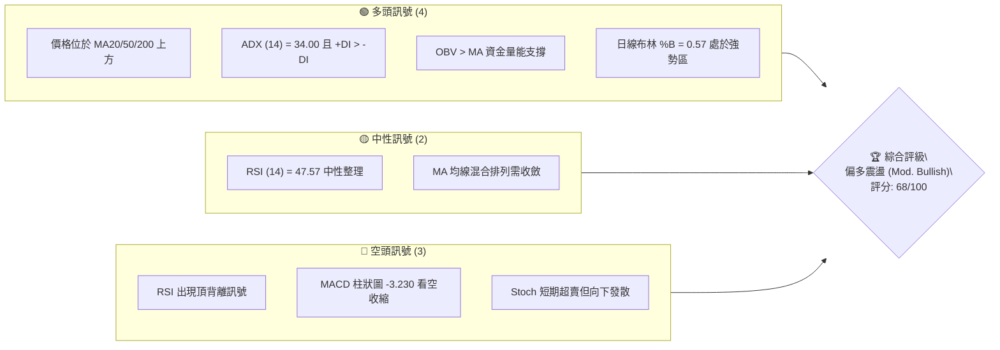
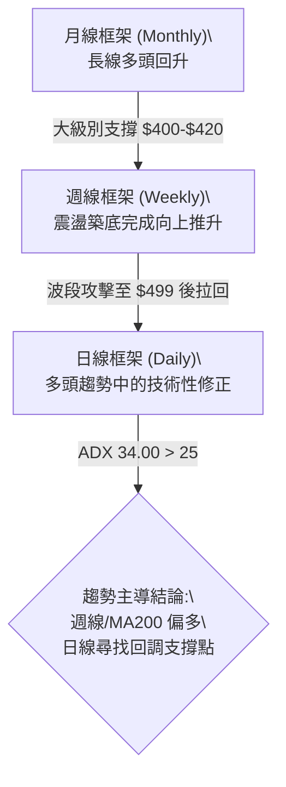
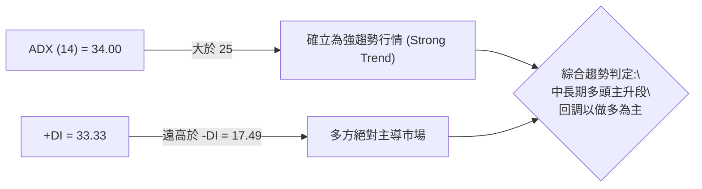
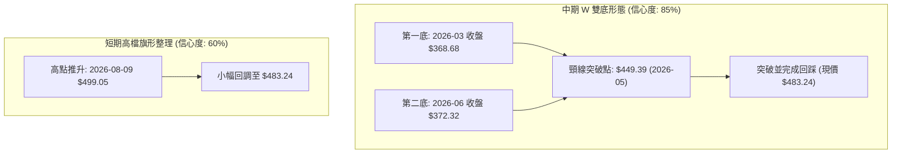
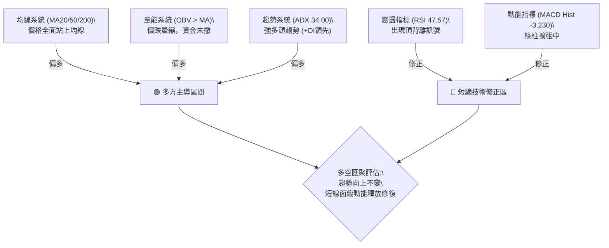
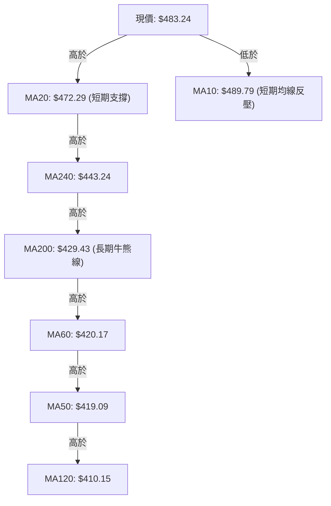
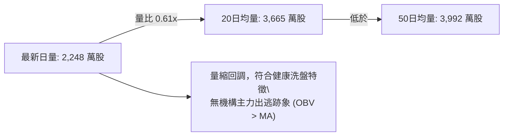
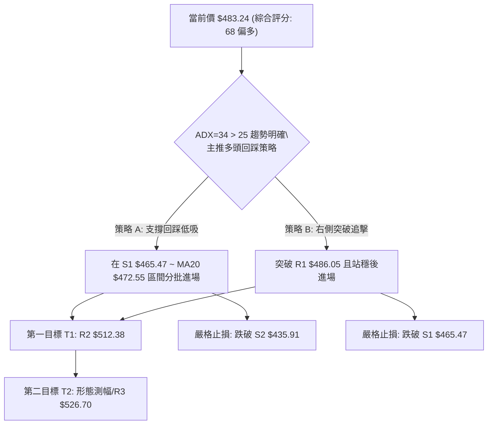
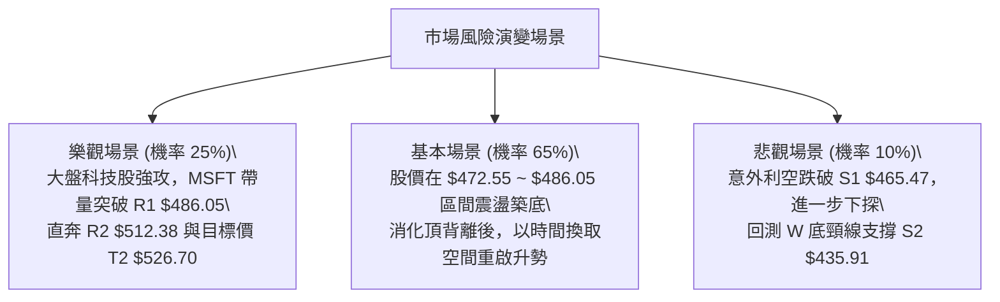

# MSFT 技術分析報告

> **報告日期**：2026-08-22 ｜ **語言**：繁體中文 ｜ **數據來源**：Yahoo Finance ｜ **當前價格**：$483.24

---

## 目錄

| 章節 | 內容 |
|------|------|
| [1. 技術面概覽](#1-技術面概覽) | 訊號儀表板、核心指標、評分卡 |
| [2. 趨勢分析](#2-趨勢分析) | 多時框趨勢、長中短期走勢 |
| [3. 圖表形態分析](#3-圖表形態分析) | 形態識別、K線組合、目標價 |
| [4. 支撐與阻力](#4-支撐與阻力) | 關鍵價位、斐波那契回調 |
| [5. 技術指標深度解讀](#5-技術指標深度解讀) | MA/RSI/MACD/布林/成交量 |
| [6. 動能與波動率](#6-動能與波動率) | 動能評估、ATR、Beta |
| [7. 多時框架總結](#7-多時框架總結) | 時框架評分矩陣 |
| [8. 交易策略建議](#8-交易策略建議) | 多空策略、風險報酬比 |
| [9. 風險提示與監控](#9-風險提示與監控) | 監控指標、風險場景 |

---

## 1. 技術面概覽

### 🎯 技術訊號儀表板



### 📊 核心指標速覽表

| 指標類別 | 指標名稱 | 當前數值 | 訊號 | 解讀 |
|----------|----------|----------|------|------|
| **價格** | 當前價格 | $483.24 | 🟢 | 位於 52 週區間之 67.1%，站穩中期均線群 |
| **均線** | MA20 | $472.29 | 🟢 | 價格在 MA20 上方 (+2.32%)，短期動能向上支撐 |
| **均線** | MA50 | $419.09 | 🟢 | 價格在 MA50 上方 (+15.31%)，中期底層支撐極強 |
| **均線** | MA200 | $429.43 | 🟢 | 價格在 MA200 上方 (+12.53%)，長期牛熊分界線未破 |
| **動能** | RSI(14) | 47.57 | 🟡 | 位於 30-70 中性區間，但帶有日線頂背離警訊 |
| **動能** | MACD | 20.019 (Hist: -3.230) | 🔴 | 快線低於訊號線 (23.249)，動能柱轉負，短線回調 |
| **波動** | ATR(14) | $10.51 | 🟡 | 波動度為股價 2.18%，日內波幅穩定可控 |

### 🏆 技術評分卡

```
╔══════════════════════════════════════════════════════════════════╗
║              技術評分卡 — MSFT (2026-08-22)                      ║
╠══════════════════════════════════════════════════════════════════╣
║ 趨勢強度      ████████████████░░░░  80/100  🟢 強勁多頭 (+DI主導)║
║ 動能指標      ██████████░░░░░░░░░░  50/100  🟡 短期背離回調中    ║
║ 支撐穩定度    ██████████████░░░░░░  70/100  🟢 密集均線與S1守穩  ║
║ 成交量配合    ██████████████░░░░░░  70/100  🟢 OBV強勢，縮量回洗 ║
║ 形態完整度    ████████████░░░░░░░░  60/100  🟡 多重底構築突破中  ║
║ 均線排列      ████████████████░░░░  80/100  🟢 價格全站上核心MA  ║
╠══════════════════════════════════════════════════════════════════╣
║ 綜合評分      █████████████░░░░░░░  68/100  🟢 偏多回調買進格局  ║
╚══════════════════════════════════════════════════════════════════╝
```

---

## 2. 趨勢分析

### 🌐 多時框趨勢分析



### 📈 長期趨勢 — 12個月走勢圖（Unicode）

```
MSFT 月線走勢圖（2025-08 至 2026-08）
價格軸 ($)
$520 ┤●(09月:513.72)
$490 ┤      ●(11月:488.91)                               ●(08月:483.24 現價)
$460 ┤                                             ●(07月:463.85)
$430 ┤            ●(01月:427.58)             ●(05月:449.39)
$400 ┤                  ●(02月:391.15) ●(04月:406.13)
$370 ┤                        ●(03月:368.68)       ●(06月:372.32 雙底)
     └─────────────────────────────────────────────────────────────
      08  09  10  11  12  01  02  03  04  05  06  07  08 (月份)
```

**走勢特徵分析表格**：

| 階段區間 | 價格變動 ($) | 漲跌幅 (%) | 形態與量價特徵 |
|----------|--------------|------------|----------------|
| **2025-08 ~ 2025-10** | $502.56 → $513.58 | +2.19% | 高檔橫盤震盪，未能有效突破前高 $528.28 |
| **2025-10 ~ 2026-03** | $513.58 → $368.68 | -28.21% | 單邊空頭回調，跌破 MA200，於 $368.68 見第一低點 |
| **2026-03 ~ 2026-05** | $368.68 → $449.39 | +21.89% | 強勁技術性反彈，站回 $440 關卡 |
| **2026-05 ~ 2026-06** | $449.39 → $372.32 | -17.15% | 二次下探回踩，未破前低 $368.68，確立 W 底結構 |
| **2026-06 ~ 2026-08** | $372.32 → $483.24 | +29.79% | 爆量突破頸線，重回 MA200 與 MA20 上方，強勢多頭確立 |

### 📊 中期趨勢（週線分析）

```
週線級別阻力與支撐架構：
$526.70 ═════════════════════════════ [週線級別主要波段高點阻力 R3]
$512.38 ───────────────────────────── [週線次級阻力區 R2]
$486.05 ┈┈┈┈┈┈┈┈┈┈┈┈┈┈┈┈┈┈┈┈┈┈┈┈┈┈┈┈┈ [近期波段高點聚類 R1]
$483.24 ◄━━━━━ [當前價格]
$465.47 ┈┈┈┈┈┈┈┈┈┈┈┈┈┈┈┈┈┈┈┈┈┈┈┈┈┈┈┈┈ [週線關鍵回踩支撐 S1]
$435.91 ───────────────────────────── [W 底頸線突破支撐 S2]
$408.81 ═════════════════════════════ [中期牛熊分水嶺支撐 S3]
```

### ⚡ 趨勢強度評估（ADX 解讀）



| 指標名稱 | 數值 | 門檻標準 | 狀態評估 |
|----------|------|----------|----------|
| **ADX (14)** | **34.00** | > 25 (趨勢確立) / > 30 (強趨勢) | 🟢 強趨勢運作中，非無方向盤整 |
| **+DI** | **33.33** | 高於 20 且大幅領先 -DI | 🟢 買盤力量掌控波段主動權 |
| **-DI** | **17.49** | 低於 20 且持續受壓制 | 🟢 賣壓動能疲弱，空頭缺乏連續性 |

---

## 3. 圖表形態分析

### 🔍 形態識別系統



**圖表形態信心度評估表**：

| 形態 | 信心度 | 判斷依據（引用數據） | 完成度 | 目標價（附計算式） |
|------|--------|----------------------|--------|--------------------|
| **中期 W 雙底形態** | **85%** | 兩次低點於 2026-03 ($368.68) 與 2026-06 ($372.32)，兩者價差僅 0.98%，且頸線 $449.39 已於 2026-07 帶量突破。 | **100% (已突破)** | 頸線 $449.39 + (頸線 $449.39 - 底部低點 $368.68 = $80.71) = **$530.10** (接近阻力位 R3 $526.70) |
| **短線高檔旗形整理** | **60%** | 自 2026-08-09 高點 $499.05 連續兩週收黑回調至 $483.24，成交量逐週縮減 (2.15億 → 1.16億)，符合旗形洗盤特徵。 | **65% (整理中)** | 旗桿底 $380.98 至旗頂 $499.05 高度為 $118.07；由突破點 R1 $486.05 起算 = **$604.12** |

### 🕯️ 重要K線形態分析

| 週/月份 | 收盤價 | K線形態 | 解讀 | 訊號 |
|---------|--------|---------|------|------|
| **2026-06-28** | $372.27 | 爆量長下影長針探底 | 單週爆出 3.82 億股天量，空頭竭盡並確認二次築底 | 🟢 |
| **2026-08-02** | $463.85 | 突破型大陽線 | 單週漲幅顯著，成交量放大至 2.78 億股，強勢突破頸線 | 🟢 |
| **2026-08-09** | $499.05 | 上影線陽線 | 衝擊 $500 整數大關與 23.6% 斐波位遇阻，短線多頭獲利了結 | 🟡 |
| **2026-08-23** | $483.24 | 縮量小陰線回踩 | 週成交量萎縮至 1.16 億股，回測 MA20 ($472.29) 支撐力道 | 🟡 |

### 📉 ASCII 走勢形態示意圖

```
MSFT W 雙底突破與回踩形態示意：
$530.10 ────────────────────────────────────────── 形態測幅理論目標價
$512.38 ─────────────────────────────┐ (R2 阻力區)
$499.05 ─────────── 旗頂            │
$486.05 ┈┈┈┈┈┈┈┈┈┈┈┈│┈┈┈┈┈┈┈┈┈┈┈┈┈┈┈┈┘ (R1 頸線阻力)
$483.24 ◄────────── 現價 (旗形整理中)
$449.39 ════════════ 頸線突破位置 ════════════════════════
                     /\                 /
                    /  \               /
                   /    \             /
$372.32 ───────── /      \      ●────/ (第二底 2026-06)
$368.68 ──────── ● (第一底 2026-03)
```

### 🎯 形態目標價計算

1. **W 雙底測幅目標價**：
   - 形態底部最低收盤價：$368.68 (2026-03)
   - 形態頸線收盤價：$449.39 (2026-05)
   - 形態垂直高度 $H = \$449.39 - \$368.68 = \$80.71$
   - 向上等距測幅目標 $T1 = \text{頸線 } \$449.39 + H (\$80.71) = \mathbf{\$530.10}$
2. **與關鍵價位共振驗證**：
   - 測幅目標 $530.10 與關鍵阻力聚類 R3 ($526.70) 及 52 週高點 ($549.20) 形成密集目標共振區間。

---

## 4. 支撐與阻力

### 🗺️ 關鍵價位分布圖（Unicode）

```
MSFT 價位結構分布圖
══════════════════════════════════════════════════════════════════
$549.20 ║████████████████████████████████║ 52週歷史高點 / Fib 0.0%
$526.70 ║████████████████████████        ║ 強阻力 R3 / 形態目標共振區
$512.38 ║████████████████                ║ 阻力 R2 / 波段高點聚類
$486.05 ║████████████                    ║ 關鍵阻力 R1 / 近期震盪頂部
$483.24 ╠════════════════════════════════╣ ◄ 現價 ($483.24)
$472.55 ║▓▓▓▓▓▓▓▓▓▓▓▓                    ║ Fib 38.2% / MA20 ($472.29)
$465.47 ║▓▓▓▓▓▓▓▓▓▓▓▓▓▓▓▓                ║ 近期強支撐 S1
$435.91 ║████████████████████            ║ 強支撐 S2 / 前期突破平台
$408.81 ║████████████████████████████    ║ 核心底部支撐 S3
══════════════════════════════════════════════════════════════════
```

### 🚧 阻力位分析表

| 阻力級別 | 價位 | 形成原因 | 突破難度 | 重要性 |
|----------|------|----------|----------|--------|
| **R1** | **$486.05** | 近期波段高點聚類區，與 MA10 ($489.79) 形成短期蓋頭反壓 | 🟡 中等 (需日成交量放大至 3,500 萬以上) | 短期反彈分水嶺 |
| **R2** | **$512.38** | 近一年月線多次密集成交高點 (2025-09/10 月均價 $513 區間) | 🔴 較高 (密集解套賣壓區) | 中期上升通道上軌 |
| **R3** | **$526.70** | 近一年主要波段高點聚類，接近歷史次高點 $528.28 | 🔴 極高 (歷史強壓力帶) | 長期波段頂部目標 |

### 🛡️ 支撐位分析表

| 支撐級別 | 價位 | 形成原因 | 守住機率 | 重要性 |
|----------|------|----------|----------|--------|
| **S1** | **$465.47** | 近一年波段低點聚類，與布林中軌 MA20 ($472.29) 構成防禦帶 | 🟢 80% | 短線多頭防守核心 |
| **S2** | **$435.91** | W 底突破後之回踩結構支撐，鄰近 MA240 ($443.24) 與 MA200 ($429.43) | 🟢 90% | 中期多空生命線 |
| **S3** | **$408.81** | 近一年波段低點聚類，重合 MA120 ($410.15) 與 MA50 ($419.09) | 🟢 95% | 長線結構多頭底線 |

### 📐 斐波那契回調位分析

依據 52 週波段低點 $348.54 至 52 週高點 $549.20 計算：

| 斐波那契水平 | 精確價位 | 相對現價關係 | 技術意義解讀 |
|--------------|----------|--------------|--------------|
| **0.0% (52W High)** | **$549.20** | +13.65% | 歷史極限高點，終極多頭目標 |
| **23.6%** | **$501.85** | +3.85% | 8 月上旬反彈遇阻處 ($499.05)，強阻力帶 |
| **38.2%** | **$472.55** | -2.21% | **現價 ($483.24) 正處於 23.6% 與 38.2% 之間**，且 38.2% 與 MA20 ($472.29) 完美重合，提供強大動態支撐 |
| **50.0%** | **$448.87** | -7.11% | 多空強弱分界，重合 W 底頸線 $449.39 |
| **61.8%** | **$425.20** | -12.01% | 黃金分割強支撐，重合 MA200 ($429.43) |
| **78.6%** | **$391.48** | -18.99% | 中期極限回撤位 |
| **100.0% (52W Low)** | **$348.54** | -27.87% | 52 週波段底部 |

---

## 5. 技術指標深度解讀

### 🎛️ 指標訊號總覽



### 📈 移動平均線排列分析



- **均線排列結構**：當前均線呈現「混合偏多排列」。長天期均線中，MA200 ($429.43) 與 MA60 ($420.17)、MA50 ($419.09) 處於低檔金叉向上擴散階段；短期內價格站上 MA20，唯 MA10 ($489.79) 拐頭向下，顯示價格正處於短期震盪降溫期，回踩 MA20 尋求支撐。

### 📉 RSI(14) 分析

- **數值狀態**：當前 RSI(14) 數值為 **47.57**。
  - 進度條：`█████████░░░░░░░░░░░ 47.57% (中性平衡區)`
- **背離分析**：
  - ⚠️ **日線頂背離 (Bearish Divergence) 確立**：在 2026-08-09 週線衝上 $499.05 時，週線 RSI 達到 81.4 高檔，但日線動能指標率先走平；隨後價格雖維持高檔，RSI 迅速滑落至 47.57，形成標準價高指標低的頂背離走勢，預示短線需要時間換取空間或回測 MA20。

### 📊 MACD(12/26/9) 訊號解讀


- **解讀**：DIF (20.019) 處於零軸遠上方，代表長期多頭背景依然穩固；但跌破 DEA (23.249) 產生死亡交叉，Hist 為 -3.230，顯示短線空方動能佔據優勢，價格尚未具備立即強攻突破 R1 ($486.05) 的動能。

### 📦 布林通道分析

```
MSFT 布林通道 (20, 2) 結構圖：
$547.48 ────────────────────────────────── 上軌 (極限阻力區)
$512.38 ┈┈┈┈┈┈┈┈┈┈┈┈┈┈┈┈┈┈┈┈┈┈┈┈┈┈┈┈┈┈┈┈┈┈ R2 阻力
$483.24 ◄═══════════════════ 現價 (%B = 0.57，中軌上方偏強)
$472.29 ────────────────────────────────── 中軌 (MA20 強支撐)
$397.11 ────────────────────────────────── 下軌 (極端支撐)
```

- **%B 分析**：目前 %B 為 **0.57**，價格坐落於中軌 ($472.29) 與上軌 ($547.48) 之間的多頭掌控區。未觸及下軌，屬於強勢拉回測試中軌的標準多頭回檔。

### 💹 成交量分析（量價配合度）



- **量價關係判斷**：股價自 $499.05 回落至 $483.24 期間，成交量由週成交 2.15 億大幅收縮至 1.16 億，呈現標準「**價跌量縮**」之多頭良性拉回。OBV 趨勢高於均線，量能並未出現頂部出貨背離。

---

## 6. 動能與波動率

### ⚡ 動能評估四象限

| 象限 | 動能強度 | 波動率 | 當前狀態 | 技術評估與操作意涵 |
|------|----------|--------|----------|-------------------|
| **Q1 (最佳攻擊)** | 強 (ADX>25) | 低 (ATR可控) | **✓ (MSFT 當前位置)** | **趨勢強勁且波動受控，回踩中軌為低風險進場點** |
| **Q2 (震盪整理)** | 弱 (ADX<25) | 低 (ATR萎縮) | - | 區間震盪，適合網格操作 |
| **Q3 (高危博弈)** | 強 (ADX>25) | 高 (ATR劇烈) | - | 主升或主跌末段，高風險高收益 |
| **Q4 (弱勢防守)** | 弱 (ADX<25) | 高 (ATR發散) | - | 混亂下跌，應嚴格空倉觀望 |

### 📊 ATR 波動率分析

- **ATR(14) 當前值**：**$10.51**（佔股價 2.18%）。
- **進出場距離量化**：
  - **日內安全止損緩衝區**：$1.5 \times \text{ATR} = 1.5 \times \$10.51 = \mathbf{\$15.77}$。
  - **波段安全止損緩衝區**：$2.0 \times \text{ATR} = 2.0 \times \$10.51 = \mathbf{\$21.02}$。
  - 當前價格 $483.24 距支撐 S1 ($465.47) 之距離為 $17.77 (約 $1.69 \times \text{ATR}$)，符合標準波段防守空間。

### 📐 Beta 與市場相關性

- **Beta 係數**：**1.099**（略高於美股大盤 S&P 500 之 1.00）。
- **市場意涵**：MSFT 具備高貝塔彈性，在科技板塊走強時將提供超越大盤的超額報酬 (Alpha)；反之在大盤回調時亦有同步放大波動之風險，需嚴格設定固定停損。

---

## 7. 多時框架總結

### 📋 時框架評分表

| 時框架 | 趨勢方向 | 動能狀態 | 均線排列 | 形態結構 | 綜合評分 | 建議方向 |
|--------|----------|----------|----------|----------|----------|----------|
| **月線 (長線)** | 🟢 多頭回升 | 🟡 動能中性 | 🟢 站上 MA200 | 🟢 雙底向上反轉 | **75/100** | 長線堅定做多 |
| **週線 (中線)** | 🟢 強勢多頭 | 🟢 +DI 大幅領先 | 🟢 突破關鍵平台 | 🟢 突破頸線測幅中 | **80/100** | 波段回踩佈局 |
| **日線 (短線)** | 🟡 偏多回調 | 🔴 MACD/RSI 背離 | 🟡 混合整理 | 🟡 旗形洗盤整理 | **55/100** | 等待止跌訊號 |

### 🔲 綜合訊號矩陣

```
時框一致性分析矩陣：
┌───────────┬──────────┬──────────┬──────────┬──────────┐
│   時框    │ 趨勢確認 │ 動能配合 │ 量能支撐 │ 結構位置 │
├───────────┼──────────┼──────────┼──────────┼──────────┤
│ 長期 (月) │   偏多   │   中性   │   偏多   │ 脫離底部 │
│ 中期 (週) │   強多   │   偏多   │   強多   │ 突破推升 │
│ 短期 (日) │   震盪   │   偏空   │   量縮   │ 回測支撐 │
└───────────┴──────────┴──────────┴──────────┴──────────┘
訊號一致性評估：中長期趨勢高度共振偏多，日線為上升途中的逆向回調。
```

### ⚖️ 多時框收斂結論

- **趨勢/盤整判定**：當前 ADX(14) 為 **34.00**（顯著高於 25 門檻），依收斂規則判定為**標準強趨勢行情**。
- **主導時框與優先級**：以週線多頭趨勢及 MA200 ($429.43)、MA50 ($419.09) 之中長期方向為主導；日線級別之 RSI 頂背離與 MACD 翻綠僅為短期回調雜訊，應用於尋找低風險買點，而非做空。
- **唯一方向性結論**：**偏多操作（等待回踩支撐確認）**。

---

## 8. 交易策略建議

### 🗺️ 策略決策流程圖



### 🧭 策略路由（依評分卡分流）

> **當前主策略方向 = 偏多回踩佈局（綜合評分 68/100，≥60 主推多頭策略）**

### 🎯 價格情境階梯（Price Scenarios）

| 觸發條件 | 下一目標 | 後續延伸 | 情境含義 |
|----------|----------|----------|----------|
| **突破 R1 $486.05** | R2 **$512.38** | R3 **$526.70** | 短線回調結束，重啟主升浪，攻擊 52 週高點區 |
| **站穩 $472.55 ~ $483.24** | R1 **$486.05** | R2 **$512.38** | 於 MA20 / Fib 38.2% 區間完成旗形整理蓄勢 |
| **跌破 S1 $465.47** | S2 **$435.91** | S3 **$408.81** | 日線級別修正擴大，需回踩 W 底頸線確認中期支撐 |

### 📊 情境機率分佈

| 情境 | 機率 | 主要依據 |
|------|------|----------|
| **情境一：回踩支撐後震盪上行 (主情境)** | **65%** | ADX=34 強勢多頭、OBV 持續支撐、量縮回調未破 MA20 |
| **情境二：區間橫盤消化背離** | **25%** | RSI 頂背離需時間修復，MACD 柱狀圖負值壓制短線爆發力 |
| **情境三：深度跌破 S1 轉弱** | **10%** | 除非機構持股 (75.9%) 出現集體大幅拋售，否則機率極低 |

### 🟢 主策略詳情

| 策略要素 | 策略 A（左側回踩低吸 — 推薦） | 策略 B（右側強勢突破） |
|----------|--------------------------------|------------------------|
| **進場條件** | 價格回踩 Fib 38.2% ($472.55) 至 S1 ($465.47) 出現止跌K棒 | 日線實體收盤突破關鍵阻力 R1 ($486.05) |
| **進場價格** | **$472.55** | **$486.05** |
| **目標價 T1** | **$512.38** (阻力位 R2) | **$512.38** (阻力位 R2) |
| **目標價 T2** | **$526.70** (阻力位 R3 / 形態共振) | **$526.70** (阻力位 R3 / 形態共振) |
| **止損價格** | **$448.87** (Fib 50% / 略低於 S2) | **$465.47** (支撐位 S1) |
| **風險報酬比** | **1.68 : 1** (至T1) / **2.29 : 1** (至T2) | **1.28 : 1** (至T1) / **1.97 : 1** (至T2) |
| **成功機率** | **68%** | **62%** |
| **建議倉位** | **15% - 20%** | **10% - 15%** |

*註：策略 A 風險報酬比計算：進場 $472.55，止損 $448.87 (風險 $23.68)；目標 T1 $512.38 (獲利 $39.83，風報比 1.68)，目標 T2 $526.70 (獲利 $54.15，風報比 2.29)。*

### 🔴 反向風險觸發點（對沖提示）

- **全面對沖/止損訊號**：若日線收盤價跌破 **S1 ($465.47)** 並伴隨單日成交量大於 50 日均量 (3,992萬股)，代表多頭防線失守，應將多頭部位減半。
- **波段多頭徹底破位點**：跌破 **S2 ($435.91)** 則宣告中期 W 底反轉形態失敗，應全面清倉觀望。

### ⭐ 整體訊號強度評星

```
做多訊號強度：★★★★☆  (4/5星 - 中長線強勢，短線待回調確認)
做空訊號強度：★☆☆☆☆  (1/5星 - 逆強趨勢操作，風險極高)
整體可信度：  ★★★★☆  (4/5星 - 量價指標一致性高)
```

---

## 9. 風險提示與監控

### ✅ 關鍵監控指標 Checklist

```
╔══════════════════════════════════════════════════════════════════╗
║              MSFT 每日交易決策監控清單 (Checklist)               ║
╠══════════════════════════════════════════════════════════════════╣
║ [ ] 價格是否守穩 MA20 ($472.29) 及 Fib 38.2% ($472.55)           ║
║ [ ] MACD 柱狀圖是否由負值擴大轉為收斂 (跌勢趨緩訊號)             ║
║ [ ] RSI(14) 是否在 40-45 支撐區止跌回升                          ║
║ [ ] 日成交量是否萎縮至 2,500 萬股以下 (洗盤完成訊號)             ║
║ [ ] 若向上突破 R1 ($486.05)，成交量是否放大至 3,600 萬股以上     ║
╚══════════════════════════════════════════════════════════════════╝
```

### ⚠️ 風險場景分析



### 🛡️ 風險管理重要提醒

1. **單筆交易風險控制**：嚴格將單筆交易最大損失限制在總資產的 **1.0% ~ 1.5%** 以內。
2. **波動率動態調倉**：依據當前 ATR ($10.51)，MSFT 日內波動正常範圍約在 ±$10 至 ±$15，切勿因日內正常震盪而頻繁停損，應以收盤價作為關鍵價位有效跌破之判定標準。
3. **機構籌碼優勢**：MSFT 機構持股比例高達 **75.9%**，空頭部位僅佔流通股 **1.1%** (Short Ratio 2.17)，無結構性軋空或崩盤風險，中期回調皆屬健康機構換手。

---

## 📋 報告總結

```
╔══════════════════════════════════════════════════════════════════╗
║                    MSFT 技術分析報告總結                         ║
╠══════════════════════════════════════════════════════════════════╣
║ 報告日期：2026-08-22                                             ║
║ 當前價格：$483.24                                                ║
║ 分析評級：🟢 偏多佈局 (Moderate Bullish - 綜合評分: 68/100)      ║
║                                                                  ║
║ 關鍵結論：                                                       ║
║ ├─ 長期趨勢：🟢 強勢回升，價格全面站穩 MA200 ($429.43)          ║
║ ├─ 中期趨勢：🟢 W 底突破確立，目標指向 $526.70 - $530.10        ║
║ ├─ 短期趨勢：🟡 動能頂背離修復中，縮量回踩 MA20 ($472.29)       ║
║ ├─ 關鍵支撐：S1 $465.47 / S2 $435.91                             ║
║ ├─ 關鍵阻力：R1 $486.05 / R2 $512.38                             ║
║ └─ 華爾街共識目標：$569.45 (共識評級: Strong Buy, 52位分析師)   ║
║                                                                  ║
║ 最優策略組合：                                                   ║
║ 1. 🥇 最佳機會：策略 A — 回踩 Fib 38.2% ($472.55) 低吸，         ║
║                  止損設於 $448.87，目標看 $512.38 / $526.70      ║
║ 2. 🥈 次選機會：策略 B — 帶量突破 R1 ($486.05) 右側加碼追擊       ║
║ 3. 🥉 保守選擇：等待 MACD 柱狀圖翻紅且 RSI 重返 50 上方再行進場  ║
╚══════════════════════════════════════════════════════════════════╝
```

---

> ⚠️ **免責聲明**：本報告為技術分析研究成果，所有數據及走勢推演均基於市場客觀技術指標。本報告**僅供研究與學術參考**，**不構成任何投資建議**。市場有風險，交易需謹慎並自負盈虧。

---

*報告生成時間：2026-08-22 ｜ 數據來源：Yahoo Finance ｜ 分析框架：多時框技術分析體系*